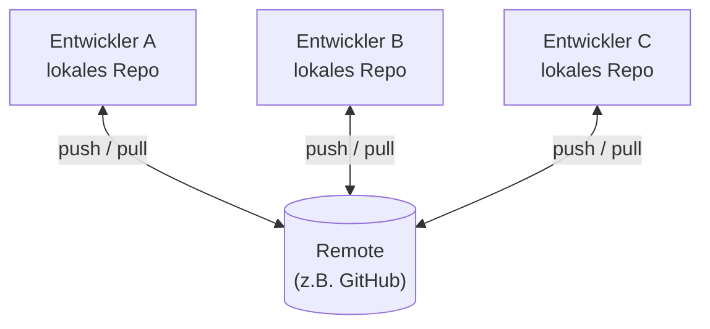
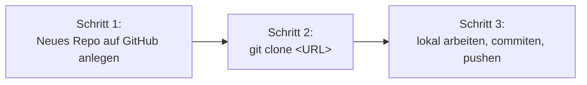
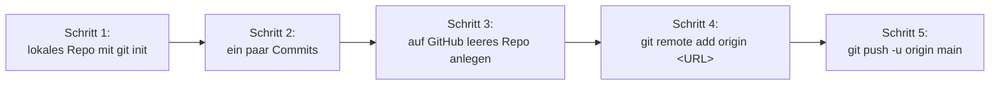

# Remote-Repositories, GitHub, GitLab

!!! abstract "Lernziel"
    Nach dieser Seite kannst du:

    - erklären, was ein **Remote-Repository** ist und warum es nicht zwingend „die Wahrheit" ist
    - die Plattformen **GitHub, GitLab, Bitbucket** und **Gitea** auseinanderhalten
    - die zwei Wege „**erst lokal, dann auf GitHub**" und „**erst auf GitHub, dann klonen**" gegenüberstellen
    - die Befehle `clone`, `fetch`, `pull`, `push` in den richtigen Zusammenhang setzen
    - benennen, was ein **Pull Request** ist und warum er als Werkzeug nicht von Git, sondern von der Plattform kommt

---

## Was bisher fehlt: Teilen

Bisher hatten wir alles auf deinem Rechner. Lokales Repository, lokale Commits, lokale Branches. Das funktioniert, solange du allein arbeitest und nichts auf deiner Festplatte verlieren willst.

Sobald du **mehrere Rechner** beteiligt hast oder **mit anderen** zusammenarbeiten willst, brauchst du eine Möglichkeit, deine Historie zu teilen. Das geht über **Remote-Repositories**.

---

## Verteilte Versionskontrolle – das Kernkonzept

!!! quote "Definition"
    Git ist eine **verteilte Versionskontrolle**: jeder Beteiligte hat eine **vollständige Kopie** der gesamten Historie auf seinem Rechner. Es gibt keine einzelne Zentralstelle, ohne die nichts geht.

Das unterscheidet Git fundamental von älteren Systemen wie **Subversion** oder **Perforce**. Dort gibt es einen **zentralen Server**, der die einzige Wahrheit hält. Ohne Verbindung zum Server kannst du nicht committen.

Bei Git ist es anders:

- **Jeder hat alles.** Du, deine Kollegin und der Server haben die komplette Historie.
- **Du kannst offline arbeiten.** Commits, Branches, Logs – alles geht ohne Netz.
- **Geteilt wird auf Knopfdruck.** Mit `push` schiebst du deine neuen Commits zum Server, mit `pull` holst du die Commits anderer.
- **„Der Server" ist Konvention, nicht Pflicht.** Technisch könntest du auch direkt von Rechner zu Rechner pushen. In der Praxis nutzt man einen gemeinsamen Server, weil es organisatorisch einfacher ist.



Der **Remote** ist hier nur ein Treffpunkt, kein Boss. Jeder Entwickler hat lokal denselben Status, sobald er gepullt hat.

---

## Was ist ein Remote-Repository?

!!! quote "Definition"
    Ein **Remote-Repository** ist ein Git-Repository, das auf einem anderen Rechner liegt – typischerweise einem Server – und mit dem dein lokales Repo per `push` und `pull` Daten austauscht.

Technisch ist ein Remote-Repo praktisch identisch zu einem lokalen. Es hat dieselbe `.git`-Struktur, dieselben Commits, dieselben Branches. Es ist nur **nicht auf deinem Rechner**.

Dein lokales Repo merkt sich **Adressen** zu Remotes. Ein Remote hat:

- einen **Namen** (per Konvention `origin` für „der eine, mit dem ich arbeite")
- eine **URL** (z.B. `https://github.com/jacob/mein-tool.git`)

Du kannst auch mehrere Remotes haben (z.B. einen `origin` für dein eigenes Fork und einen `upstream` für das Original). Im Alltag reicht ein einziger.

---

## Die Plattformen: GitHub, GitLab, Bitbucket, Gitea

Hier wird oft alles in einen Topf geworfen, deshalb sortieren wir das einmal sauber:

| Plattform | Wem gehört's? | Hauptmerkmal | Wann sieht man es |
|-----------|---------------|--------------|-------------------|
| **GitHub** | Microsoft (seit 2018) | Größte Plattform, riesige Open-Source-Community, GitHub Actions als CI/CD | Standard für Open Source, viele Firmen, Hobbyprojekte |
| **GitLab** | GitLab Inc. | Stark in CI/CD, **self-hosted** beliebt, eingebaute Container-Registry | Viele Unternehmen, Behörden, alles, wo Daten im eigenen Rechenzentrum bleiben müssen |
| **Bitbucket** | Atlassian | Enge Integration mit Jira und Confluence | Firmen, die schon Atlassian-Produkte nutzen |
| **Gitea** | Open Source (Community) | **Self-hosted, leichtgewichtig**, lokaler Klon ähnlich GitHub | Heimserver, kleine Teams, Studierende, Datenschutzpflichtige |

Alle vier sind **Git-Plattformen**. Das heißt: sie nutzen alle Git unter der Haube. Wenn du `git clone`, `git push`, `git pull` kannst, kannst du auf allen vier arbeiten. Die **Befehle** sind dieselben. Nur die **Weboberfläche** und die **Zusatzfeatures** unterscheiden sich.

!!! info "Was nicht von Git kommt, sondern von der Plattform"
    Diese Funktionen gehören **nicht** zu Git im engeren Sinne. Sie sind Erfindungen der Plattformen drumherum:

    - **Pull Requests / Merge Requests** – Reviews und Diskussionen rund um einen Branch-Merge.
    - **Issues** – Aufgabenverwaltung, Bug-Tracker.
    - **CI/CD** – automatisches Bauen und Testen (GitHub Actions, GitLab CI/CD).
    - **Wiki, Diskussionen, Projektboards** – Drumherum, was den Workflow erleichtert.

    Auf der reinen Git-Ebene gibt es nur Commits, Branches, Tags, Remotes. Alles andere ist Komfort der Plattform.

### Warum dieser Block GitHub nimmt

Wir konzentrieren uns hier auf **GitHub**, weil es die mit Abstand am weitesten verbreitete Plattform ist und im Anschluss-Block (CI/CD mit GitHub Actions) ohnehin gebraucht wird. **Alles, was du hier lernst, lässt sich praktisch 1:1 auf GitLab und Bitbucket übertragen.** Die Knöpfe heißen leicht anders, das Konzept ist dasselbe.

---

## Die zwei Wege, ein Remote-Repo ins Spiel zu bringen

Wenn du anfängst, hast du eines von zwei Szenarien. Sie führen zum selben Ergebnis, aber die Reihenfolge ist unterschiedlich. Es lohnt sich, beide einmal verstanden zu haben.

### Weg A: erst auf GitHub anlegen, dann klonen

Du öffnest GitHub im Browser, legst dort ein neues Repository an und klonst es dann auf deinen Rechner. Beim Klonen wird ein lokaler Ordner erstellt, in dem das Repo schon mit allen Verbindungsinformationen eingerichtet ist.



Der Vorteil: du musst dich um **nichts** kümmern. `git clone` macht alles in einem Rutsch. Es kommt mit dem fertigen `.git`-Setup, dem fertig konfigurierten Remote (`origin`), dem Default-Branch und allen Dateien, die im Remote schon existieren.

Praxis: [Praxis 4](praxis-github-neu.md).

### Weg B: erst lokal anlegen, dann auf GitHub schieben

Du hast schon ein lokales Projekt, vielleicht sogar mit ein paar Commits. Jetzt willst du es auf GitHub bringen.



Hier machst du den Remote-Anschluss manuell: `git remote add origin <URL>` verknüpft dein lokales Repo mit dem leeren Remote, dann `git push` schiebt die Historie hoch.

Praxis: [Praxis 5](praxis-lokal-zu-github.md).

!!! tip "Wann welcher Weg?"
    - **Neues Projekt von Grund auf?** Weg A ist ein bisschen weniger Tipparbeit.
    - **Du hast schon lokal gearbeitet und merkst erst jetzt, dass du das teilen willst?** Weg B passt.

    Im Ergebnis sind die Repos identisch. Es gibt nicht „den besseren Weg", es gibt nur den, der zur Ausgangslage passt.

---

## Die vier Schlüsselbefehle für Remotes

Wir haben jetzt viel über Konzepte geredet. Hier sind die vier Befehle, die du zur Arbeit mit Remotes praktisch immer brauchst – einmal sortiert, ohne Detail. Details kommen in der Praxis.

| Befehl | Was er macht |
|--------|--------------|
| **`git clone <URL>`** | Holt ein komplettes Remote-Repo auf deinen Rechner. Verbindung ist sofort eingerichtet. |
| **`git fetch`** | Holt **neue Commits** vom Remote, ändert aber **nichts** an deinem Working Tree. „Mal nachsehen, was es Neues gibt." |
| **`git pull`** | Wie `fetch` + automatischer Merge in deinen aktuellen Branch. |
| **`git push`** | Schiebt deine lokalen Commits auf den Remote. |

Plus einer für die Initialisierung:

| Befehl | Was er macht |
|--------|--------------|
| **`git remote add origin <URL>`** | Verknüpft dein lokales Repo mit einem Remote unter dem Namen `origin`. |

!!! warning "`pull` ist `fetch + merge`"
    Hinter `git pull` versteckt sich nichts Mystisches. Es ist genau die Kombination aus `git fetch` (Daten holen) und `git merge` (sie in deinen aktuellen Branch hineinmischen).

    Wenn du **mehr Kontrolle** willst, machst du beides getrennt: erst `git fetch`, schauen, was kommt, dann selbst `git merge` oder `git rebase`. Im Alltag reicht aber meistens `git pull`.

---

## Was sind Tracking-Branches?

Wenn du klonst oder mit `git fetch` neue Commits holst, kennt dein lokales Repo nicht nur **deine** Branches, sondern auch eine Kopie der **Remote-Branches**. Die nennen sich **Tracking-Branches** und sind als `origin/<name>` benannt:

```text
main                  ← dein lokaler main-Branch
origin/main           ← der Stand von main auf dem Remote, wie er beim letzten fetch war
feature/login         ← dein lokaler Branch
origin/feature/login  ← der Stand desselben Branches auf dem Remote
```

Das `origin/`-Vorzeichen signalisiert: „Das ist nicht **mein** Branch, das ist eine Kopie dessen, was beim letzten Fetch auf dem Remote stand."

Das Wissen darüber wird wichtig, sobald du etwas wie folgendes liest:

```text
Your branch is ahead of 'origin/main' by 2 commits.
```

Übersetzung: dein lokaler `main` hat **2 Commits mehr** als das, was du beim letzten Fetch auf dem Remote gesehen hast. Höchste Zeit für `git push`.

---

## Was ist ein Pull Request?

!!! quote "Definition"
    Ein **Pull Request** (kurz: PR; bei GitLab heißt er **Merge Request** / MR) ist ein **Vorschlag**, einen Branch in einen anderen zu mergen. Mit Diskussionsraum drumherum.

Wichtig: Ein Pull Request ist **kein Git-Konzept**. Git selbst kennt nur Branches und Merges. Pull Requests sind eine Erfindung der Plattformen (GitHub, GitLab, Bitbucket), um den Merge-Prozess zu strukturieren.

Typischer PR-Workflow:

1. Du legst lokal einen Branch an, machst Commits, pushst ihn.
2. Auf GitHub öffnest du einen **Pull Request**: „Bitte den Branch `feature/login` in `main` mergen."
3. Andere können den PR **reviewen**: Kommentare hinterlassen, Änderungen vorschlagen, Code zeilenweise diskutieren.
4. Bei größeren Teams sind **CI-Checks** verpflichtend (Tests laufen, Pipeline grün).
5. Wenn alle einverstanden sind, klickt jemand **Merge**. GitHub macht den Merge serverseitig.

Pull Requests sind das Werkzeug Nr. 1 in vielen Teams. Sie ersetzen den klassischen „Code-Review per E-Mail" und sind die Stelle, an der Qualität entsteht.

Wir machen das einmal komplett in [Praxis 6](praxis-pull-request.md).

---

## Authentifizierung: HTTPS oder SSH?

Wenn du Daten zwischen deinem Rechner und einem Remote austauschst, musst du dich gegenüber dem Remote ausweisen. Zwei Wege sind üblich:

### HTTPS

URL beginnt mit `https://`. Authentifizierung bei GitHub heute über **Personal Access Token** (PAT) statt Passwort.

```text
https://github.com/jacob/mein-tool.git
```

Vorteile:

- Funktioniert in **fast jedem Netzwerk** – HTTPS ist kein Sonderport.
- Einrichtung ist einfach: Token erstellen, beim ersten Push eingeben, Git Credential Manager merkt es sich.

Auf Windows ist HTTPS in 90 % der Fälle die richtige Wahl.

### SSH

URL beginnt mit `git@github.com:`. Authentifizierung über **SSH-Schlüsselpaar**.

```text
git@github.com:jacob/mein-tool.git
```

Vorteile:

- Einmal eingerichtet, ist es **passwortlos**.
- Robuster bei vielen Operationen am Tag.

Nachteile:

- Setup mit `ssh-keygen` ist anfangs ein Extra-Schritt.
- Funktioniert manchmal nicht in Firmennetzen mit aggressivem Proxy.

In den Praxis-Seiten zeigen wir **HTTPS mit Personal Access Token**, weil das auf Windows 11 das robuste Default ist.

---

## Was bei einem Remote nicht automatisch passiert

Damit du keine falschen Erwartungen hast: Git ist konservativ. **Nichts wird automatisch hochgeladen.**

- Wenn du lokal commitest, ist das **lokal**. Erst `git push` schiebt es zum Remote.
- Wenn jemand anderes pusht, siehst du das lokal **nicht**, bis du `git fetch` oder `git pull` ausführst.
- Wenn du einen Branch löschst, ist er **nur lokal weg**. Auf dem Remote bleibt er, bis du explizit `git push origin --delete <branch>` sagst.

Das ist Absicht. Git fasst nichts an, was du ihm nicht ausdrücklich sagst.

---

## Sichtbarkeit: public, private, internal

GitHub unterscheidet drei Sichtbarkeitsstufen:

| Sichtbarkeit | Wer sieht's? | Wann nehmen? |
|--------------|--------------|--------------|
| **Public** | Jeder im Internet | Open-Source-Projekte, Lernrepos, Übungsmaterial |
| **Private** | Nur du und Personen, die du explizit einlädst | Echte Arbeit, sensible Daten |
| **Internal** | Alle in einer GitHub-Organisation, aber nicht öffentlich | Nur in größeren Firmen-Setups (kostenpflichtig) |

Für die Praxisbeispiele in diesem Block reicht ein **Public** Repo. GitHub Actions sind auf Public-Repos uneingeschränkt kostenlos, du kannst Logs ohne Login zeigen und nichts spricht dagegen.

!!! warning "Niemals Geheimnisse in einem Public Repo"
    Passwörter, API-Keys, Tokens, Datenbank-Zugangsdaten gehören **niemals** in ein Repository – egal ob Public oder Private. In einem Public Repo sind sie sofort weltöffentlich indiziert. In einem Private kann es jemand mit Repo-Zugriff trotzdem sehen.

    Für sensible Werte gibt es **Secrets** (z.B. in GitHub Settings → Secrets and Variables), die nur zur Laufzeit deiner Pipeline injiziert werden.

---

## Was du jetzt wissen solltest

- Git ist **verteilt**: jeder hat eine komplette Kopie der Historie.
- Ein **Remote** ist nur ein anderes Git-Repo auf einem anderen Rechner. Konvention: `origin`.
- **GitHub, GitLab, Bitbucket, Gitea** sind alle Git-Plattformen mit jeweils eigenen Stärken.
- **Pull Requests** sind keine Git-Funktion, sondern ein Werkzeug der Plattformen.
- Es gibt zwei sinnvolle Wege: **erst Remote, dann klonen** und **erst lokal, dann verknüpfen**.
- **`clone`, `fetch`, `pull`, `push`** sind die vier Schlüsselbefehle für Remote-Arbeit.
- Auf Windows 11 ist **HTTPS mit Personal Access Token** der einfachste Authentifizierungs-Weg.

---

## Merksatz

!!! success "Merksatz"
    > **Ein Remote ist nur ein anderes Git-Repo, typischerweise auf einem Server. Git ist verteilt: jeder hat alles. `push` schiebt deine Commits hoch, `pull` holt die Commits anderer. Pull Requests gehören nicht zu Git, sondern zur Plattform – sie strukturieren den Merge mit Reviews.**

---

## Weiterlesen

- [Git installieren](installation.md): bevor du das alles machen kannst, brauchst du Git auf dem Rechner
- [Praxis 4: Repo auf GitHub erstellen und klonen](praxis-github-neu.md)
- [Praxis 5: lokales Repo zu GitHub bringen](praxis-lokal-zu-github.md)
- [Praxis 6: Pull Request über Branch](praxis-pull-request.md)
