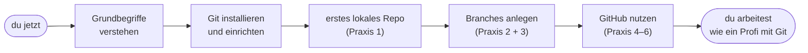

# Warum Git?

!!! abstract "Lernziel"
    Nach dieser Seite kannst du:

    - **drei konkrete Probleme** benennen, die Git löst
    - die Analogien **Spielstand** und **Hausarbeit-Versionen** erklären
    - den Unterschied zwischen **Dateien speichern** und **Versionen speichern** in eigenen Worten beschreiben
    - in einem Satz sagen, warum Versionskontrolle in praktisch jedem ernsthaften Projekt heute Standard ist

---

## Das Problem im Alltag

Stell dir vor, du schreibst an einer wichtigen Datei. Das kann eine Hausarbeit sein, eine Bewerbung, der Code für ein kleines Tool oder die Konfiguration für einen Server. Du arbeitest stundenlang daran. Am Ende sieht dein Ordner so aus:

```text
bewerbung.docx
bewerbung_v2.docx
bewerbung_v2_neu.docx
bewerbung_FINAL.docx
bewerbung_FINAL_korrigiert.docx
bewerbung_FINAL_wirklich_final.docx
bewerbung_FINAL_wirklich_final_jetzt_aber.docx
```

Du lachst, weil du das kennst. Genau das ist das Problem.

!!! warning "Was hier schief läuft"
    - Du weißt nicht mehr, was sich zwischen den Versionen **konkret geändert** hat.
    - Du weißt nicht mehr, **warum** du eine Version erstellt hast.
    - Wenn du eine gelöschte Stelle aus `_FINAL` wiederhaben willst, musst du die alten Dateien öffnen und vergleichen.
    - Dein Ordner wird zugemüllt mit fast identischen Kopien.
    - Sobald jemand anders mitarbeitet, ist es vorbei. „Welche Version ist gerade aktuell?"

Das ist **manuelle Versionierung**. Sie funktioniert, schlecht und nicht lange.

---

## Was wir uns wünschen

Bevor wir uns Git anschauen, lass uns sammeln, was wir eigentlich bräuchten. Wenn wir diese Wunschliste hinkriegen, ist das Problem gelöst.

- **Eine einzige Datei** statt zehn Kopien.
- Trotzdem die **vollständige Historie** jeder Änderung.
- Für jede Änderung eine **Beschreibung**, warum sie passiert ist.
- Die Möglichkeit, **jederzeit zu einer alten Version zurückzuspringen**.
- Die Möglichkeit, **parallel** an verschiedenen Sachen zu arbeiten, ohne dass die eine die andere kaputtmacht.
- Eine saubere Lösung, wenn **mehrere Personen** an derselben Datei arbeiten.
- Alles automatisch, ohne dass ich jede Version selbst benennen muss.

Das ist genau das, was **Versionskontrolle** macht. Und Git ist das Werkzeug, das das heute praktisch alle benutzen.

---

## Die Spielstand-Analogie

!!! tip "Computerspiel-Spielstände"
    Du spielst ein längeres Computerspiel. Vor jeder schwierigen Stelle drückst du **Speichern**. Das Spiel legt einen **Spielstand** an: der gesamte Zustand der Welt zu diesem Zeitpunkt.

    - Stirbst du an der schwierigen Stelle, lädst du den letzten Stand. Du bist sofort wieder genau dort, wo du gespeichert hast.
    - Möchtest du eine andere Strategie probieren, lädst du einen älteren Stand und gehst von dort anders weiter.
    - Manche Spiele zeigen alle Spielstände nebeneinander: Datum, Zeit, vielleicht ein Vorschaubild.

Genau so funktioniert Git. Du arbeitest an deinen Dateien, drückst dann **„speichern"** (in Git heißt das `git commit`) und Git legt einen vollständigen Spielstand an. Mit Zeitpunkt, mit Autor, mit Beschreibung. Diese Spielstände nennen wir **Commits**.

Was Git zusätzlich kann, was Spielstände nicht können:

- **Mehrere parallele Spielstand-Reihen** gleichzeitig (das werden später die [Branches](branches-und-merge.md)).
- **Spielstände zusammenführen**, wenn zwei parallele Reihen wieder zusammenfließen sollen.
- Die Spielstände **mit anderen teilen**, sodass alle dieselbe Historie haben.

Wenn du im Hinterkopf hast „Commit = Spielstand", verstehst du Git schon zur Hälfte.

---

## Die Hausarbeit-Analogie

!!! tip "Die Hausarbeit"
    Du schreibst eine Hausarbeit. Statt zehn Kopien mit unterschiedlichen Namen anzulegen, machst du Folgendes:

    Du legst neben deinem Dokument ein **Logbuch** an. Immer wenn du eine größere Änderung gemacht hast, schreibst du ins Logbuch eine Zeile dazu:

    ```text
    2026-04-01 10:00  Erste Version der Einleitung.
    2026-04-01 14:30  Abschnitt zu Methoden ergänzt.
    2026-04-02 09:15  Quellenangaben überarbeitet.
    2026-04-02 16:20  Fazit komplett neu geschrieben.
    ```

    Und – und das ist der entscheidende Teil – das Logbuch hält **automatisch** auch immer eine vollständige Kopie des Dokuments zum Zeitpunkt jedes Eintrags fest. Im Hintergrund, ohne dass du sie manuell pflegen musst.

Wenn du jetzt sagst „ich will den Stand von vorgestern um 10:00 zurück", liefert dir das Logbuch genau das. Wenn du sagst „was war zwischen 09:15 und 16:20 anders?", zeigt es dir die Differenz.

Das ist Versionskontrolle.

---

## Drei konkrete Probleme, die Git entschärft

### 1. „Was hat sich eigentlich geändert?"

Ohne Versionskontrolle: du öffnest zwei `.docx`-Dateien nebeneinander und scrollst. Bei Code wird das nach drei Wochen zur Detektivarbeit.

Mit Git: ein einziger Befehl zeigt dir genau die Zeilen, die sich seit dem letzten Speicherpunkt verändert haben.

```bash
git diff
```

### 2. „Wie war das letzte Woche?"

Ohne Versionskontrolle: du musst hoffen, dass irgendwo noch eine Kopie liegt. Wenn nicht: aus dem Gedächtnis rekonstruieren.

Mit Git: du springst gezielt auf einen alten Stand. Schaust dir an, was damals da war. Springst wieder zurück. Die Festplatte vergisst nichts, solange du Git nutzt.

```bash
git log
git checkout <alter-stand>
```

### 3. „Lisa hat parallel auch dran gearbeitet – wie kriegen wir das zusammen?"

Ohne Versionskontrolle: ihr setzt euch zusammen, geht Datei für Datei durch, kopiert von Hand. Wer Pech hat, überschreibt etwas. Bei zehn Dateien ist der Abend gelaufen.

Mit Git: jeder arbeitet auf seinem **eigenen Branch**, am Ende **mergt** Git die beiden Stände automatisch zusammen. Bei den wenigen Stellen, wo das nicht eindeutig geht, fragt Git nach. Das nennt sich **Merge-Konflikt** und ist der Normalfall, nicht die Ausnahme.

---

## Was Git darüber hinaus mitbringt

Das sind die drei Hauptpunkte, aber Git kann noch mehr:

| Feature | Was es bringt |
|---------|---------------|
| **Vollständige Historie** | Jeder Commit kennt alle vorigen. Du verlierst nie wieder eine Version. |
| **Autoren-Information** | Jeder Commit weiß, **wer** ihn gemacht hat und **wann**. |
| **Beschreibungen (Commit-Messages)** | Du erklärst pro Commit, **warum** du etwas geändert hast. |
| **Branches** | Mehrere parallele Linien gleichzeitig, ohne sich gegenseitig zu stören. |
| **Tags** | Bestimmte Punkte als Meilenstein markieren (z.B. `v1.0`). |
| **Verteiltes Arbeiten** | Jeder hat eine vollständige Kopie der Historie, geteilt wird über Remote-Repositories. |

Die letzten beiden Punkte sind das, was Git von älteren Versionsverwaltungen unterscheidet. Mehr dazu auf der Seite [Remote und GitHub](remote-und-github.md).

---

## Warum gerade Git und nicht etwas anderes?

Es gibt nicht nur Git. Aber Git hat die anderen praktisch verdrängt. Der Grund liegt vor allem in der Geschichte:

- **2005** schreibt Linus Torvalds Git. Anlass: das Linux-Kernel-Team braucht ein neues Versionskontroll-Tool, weil das vorherige (BitKeeper) seine kostenlose Variante verliert.
- Linus baut Git in **wenigen Wochen**. Ziele: schnell, verteilt, robust, kompromisslos in der Datenstruktur.
- Ab ca. **2008** entstehen Plattformen wie **GitHub** und später **GitLab**, die Git zugänglicher machen.
- Heute ist Git **der Standard**. Praktisch jedes Open-Source-Projekt, jedes Unternehmen, jede Hochschule nutzt es.

Andere Versionsverwaltungen wie **Subversion (SVN)**, **Mercurial** oder **Perforce** existieren noch. SVN sieht man in Behörden und älteren Firmen. Mercurial wird bei Facebook intensiv genutzt. Aber wenn du heute irgendwo neu anfängst, ist es zu 99 Prozent Git.

!!! info "Wichtig zu wissen"
    **Git** ist das Werkzeug. **GitHub**, **GitLab**, **Bitbucket** und **Gitea** sind **Plattformen**, die Git als Grundlage nutzen, aber zusätzlich eine Weboberfläche, Issue-Tracking, Pull-Request-Workflows und CI/CD anbieten. Mehr dazu auf [Remote und GitHub](remote-und-github.md).

---

## Was Git **nicht** ist

Damit nichts schiefläuft, ein paar bewusste Abgrenzungen:

- **Kein Backup-System.** Ein Git-Repository ist keine Sicherung, solange es nur auf deiner Festplatte liegt. Erst wenn du es auf einen Remote (GitHub o. ä.) gepusht hast, ist es woanders.
- **Kein Werkzeug für riesige Binärdateien.** Git ist auf Text optimiert. Wer 100-MB-Videos versionieren will, braucht Erweiterungen wie [Git LFS](https://git-lfs.com).
- **Kein Projektmanagement-Tool.** Issues, Tickets, Sprints – das machen die Plattformen drumherum (GitHub Issues, GitLab Issues, Jira). Git selbst hat keine Meinung dazu.
- **Keine Magie.** Git macht keine schlechten Commits gut. Schlechte Commit-Messages, ein wirres Branch-Modell oder ein Repo mit hundert Branches im Wildwuchs sind unverändert ein Problem, auch mit Git.

---

## Was uns auf den nächsten Seiten erwartet



Die Reihenfolge ist nicht zufällig. Wir bauen das Verständnis Schicht für Schicht auf. Nichts überspringen, wenn du Git wirklich verstehen willst.

---

## Was du jetzt wissen solltest

- Manuelle Versionierung über Dateinamen funktioniert nur in winzigen Projekten und nur kurz.
- Versionskontrolle löst drei Kernprobleme: **Vergleichen, Zurückspringen, Parallelarbeit**.
- Ein **Commit** ist wie ein **Spielstand**: ein vollständiger Schnappschuss zum Zeitpunkt des Speicherns.
- **Git** ist das Werkzeug. **GitHub und GitLab** sind Plattformen, die Git als Grundlage nutzen.
- Git ist heute Standard. Praktisch jedes ernsthafte Projekt verwaltet seinen Code damit.

---

## Merksatz

!!! success "Merksatz"
    > **Ein Commit ist ein Spielstand. Git ist die Maschine, die deine Spielstände verwaltet, vergleicht, zurückspielt und mit anderen teilt. Manuelle Versionierung über Dateinamen ist das Problem, das Git löst.**

---

## Weiterlesen

- [Grundbegriffe](grundbegriffe.md): Repository, Working Tree, Staging, Commit, HEAD – mit Analogien
- [Git installieren](installation.md): Setup auf Windows 11, macOS und Linux
- [Praxis 1: erste Schritte lokal](praxis-erste-schritte.md): das erste eigene Repository
