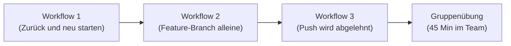
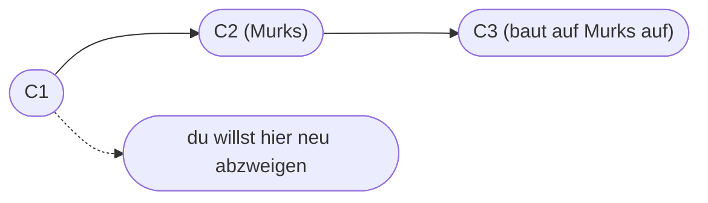
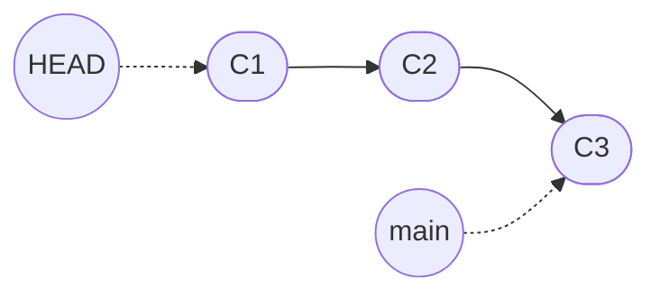
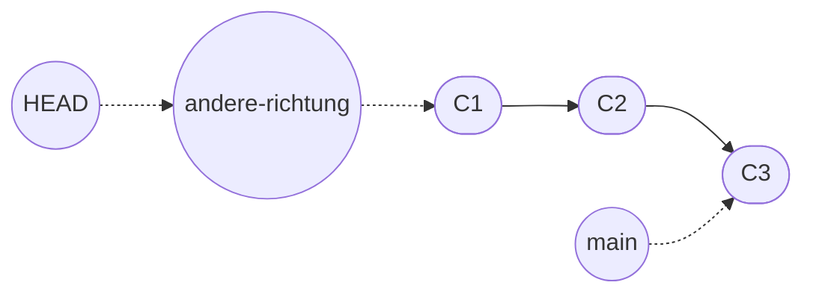
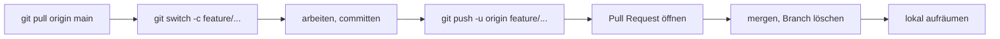
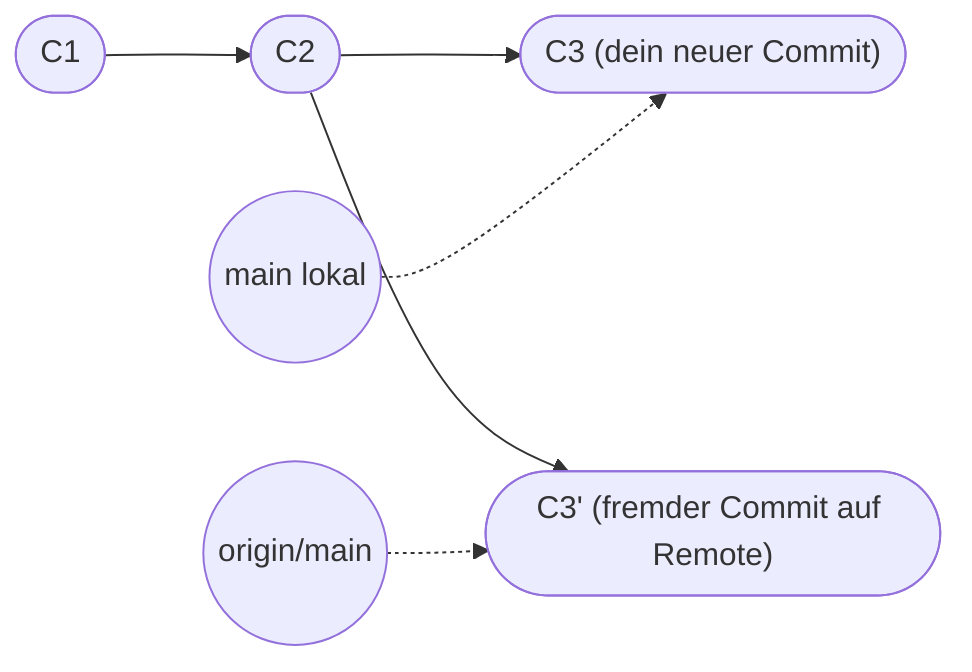

# Typische Git-Workflows in der Praxis

Du kennst jetzt die Bausteine: `add`, `commit`, `branch`, `merge`, `push`, `pull`. Was im Alltag aber wirklich zählt, sind die **wiederkehrenden Muster** – die kleinen Situationen, in die du immer wieder gerätst, und die jedes Mal dieselben Befehle und dieselben Git-Meldungen erzeugen.

Auf dieser Seite gehen wir drei davon durch. Jeweils mit echtem Szenario, den Befehlen, die Git-Reaktion (wortwörtlich), und einer kleinen Übung zum direkt Mitmachen.

!!! abstract "Was du auf dieser Seite lernst"
    - **Workflow 1:** Du machst mehrere Commits und willst plötzlich zu einem früheren zurück, um von dort einen anderen Weg zu gehen. Was passiert mit dem alten? Welche Warnung wirft Git?
    - **Workflow 2:** Den klassischen **Feature-Branch-Solo-Workflow** sauber abwickeln: anlegen, arbeiten, mergen, aufräumen. Inklusive der typischen Stolperstelle „ich habe vergessen, vorher `main` zu pullen".
    - **Workflow 3:** Du willst pushen, Git lehnt ab mit dem `rejected, non-fast-forward`-Fehler. Was bedeutet die Meldung und wie reagierst du?
    - Pro Workflow gibt es eine **Solo-Übung** (10–15 Min), zum direkten Ausprobieren.
    - Am Ende geht es weiter mit **[Gruppenübung 2](praxis-team-workflow.md)** (45 Min), in der ihr alle drei Workflows zu viert oder zu fünft im Team spielt.

---

## Voraussetzungen

- Du hast die [Praxis 1–6](praxis-erste-schritte.md) durchgespielt.
- Du kannst `git status`, `git log --oneline --graph` selbstständig lesen.
- Für Workflow 3 brauchst du einen GitHub-Account und ein Übungs-Repo (z.B. `mein-erstes-remote-repo` aus [Praxis 4](praxis-github-neu.md)).
- Ein **Terminal** und ein **Editor** deiner Wahl.

!!! info "Was diese Seite **nicht** macht"
    Wir wiederholen keine Grundlagen mehr. Wenn dir ein Begriff fremd vorkommt – z.B. HEAD, Branch, Merge-Commit – schlag kurz in den [Grundbegriffen](grundbegriffe.md) oder [Branches und Merge](branches-und-merge.md) nach.

---

## Roter Faden



Von **alleine im eigenen Repo** über **mit Branch arbeiten** bis hin zum **Team-Konflikt** im echten Mehrbenutzer-Setup. Drei Schritte.

---

## Workflow 1: Zurück zu einem alten Commit – und von dort neu starten

### Das Szenario

Du arbeitest an einem Projekt. Du machst drei Commits hintereinander. Dann fällt dir auf: der zweite Commit war eigentlich Murks. Du möchtest **dorthin zurück, wo du nach Commit 1 warst**, und von da aus einen **anderen Weg gehen**.



Die Frage: **Wie sagst du Git, dass es dich zurück zu C1 bringen soll, und was passiert mit C2 und C3?**

Antwort vorab: C2 und C3 **bleiben erhalten** (Git wirft keine Commits weg), aber wenn du nur „zurückspringst" ohne weiteren Schritt, landest du in einem speziellen Zustand: dem **detached HEAD**.

### Was bedeutet „detached HEAD"?

Erinnerung: **HEAD ist Gits „du bist hier"-Schild.** Normalerweise zeigt HEAD auf einen **Branch** (z.B. `main`), und der Branch wiederum zeigt auf den neuesten Commit.

Wenn du auf einen Commit zurückspringst, der **nicht der oberste eines Branches** ist, hängt HEAD plötzlich direkt am Commit, ohne Branch dazwischen. Das ist **detached HEAD**.



Du stehst auf C1. `main` zeigt aber noch auf C3. Genau diese Situation ist es, vor der Git dich warnt.

### Schritt für Schritt

Wir bauen das Szenario in einem kleinen Repo nach.

#### Schritt 1.1: Repo vorbereiten

=== "macOS / Linux / Git Bash"
    ```bash
    cd ~
    mkdir uebung-zurueck
    cd uebung-zurueck
    git init
    ```

=== "Windows PowerShell"
    ```powershell
    Set-Location $HOME
    New-Item -ItemType Directory -Name uebung-zurueck | Out-Null
    Set-Location uebung-zurueck
    git init
    ```

=== "Windows CMD"
    ```cmd
    cd /d "%USERPROFILE%"
    mkdir uebung-zurueck
    cd uebung-zurueck
    git init
    ```

#### Schritt 1.2: Drei Commits machen

Lege eine Datei `text.md` an mit einer Zeile:

```markdown
Erste Zeile.
```

Speichern, dann:

```bash
git add text.md
git commit -m "C1: erste Zeile"
```

Zweite Änderung – häng eine Zeile an `text.md`:

```markdown
Erste Zeile.
Zweite Zeile (eigentlich Murks).
```

```bash
git add text.md
git commit -m "C2: zweite Zeile (Murks)"
```

Dritte Änderung:

```markdown
Erste Zeile.
Zweite Zeile (eigentlich Murks).
Dritte Zeile, die auf dem Murks aufbaut.
```

```bash
git add text.md
git commit -m "C3: dritte Zeile"
```

Zwischenstand:

```bash
git log --oneline
```

Erwartete Ausgabe:

```text
c3a1b2c (HEAD -> main) C3: dritte Zeile
b2c3d4e C2: zweite Zeile (Murks)
a1b2c3d C1: erste Zeile
```

Drei Commits auf `main`. HEAD zeigt auf den neuesten, also C3.

#### Schritt 1.3: Auf C1 zurückspringen

Die SHA von C1 brauchst du. Die siehst du im `git log`. Statt der vollen 40 Zeichen reichen die ersten 7:

```bash
git checkout a1b2c3d
```

!!! warning "Deine SHAs sind andere"
    Die in der Anleitung gezeigten SHAs (`a1b2c3d`, `b2c3d4e`, `c3a1b2c`) sind erfunden. Bei dir stehen andere im `git log`. Nimm **deine** SHA von C1, nicht die aus der Anleitung.

Erwartete Reaktion:

```text
Note: switching to 'a1b2c3d'.

You are in 'detached HEAD' state. You can look around, make experimental
changes and commit them, and you can discard any commits you make in this
state without impacting any branches by switching back to a branch.

If you want to create a new branch to retain commits you create, you may
do so (now or later) by using -c with the switch command. Example:

  git switch -c <new-branch-name>

Or undo this operation with:

  git switch -

Turn off this advice by setting config variable advice.detachedHead to false

HEAD is now at a1b2c3d C1: erste Zeile
```

**Das ist die wichtigste Meldung dieses Workflows. Lies sie genau.** Git sagt dir drei Dinge:

1. **„You are in 'detached HEAD' state."** – HEAD hängt jetzt direkt an C1, ohne dass ein Branch in der Mitte ist.
2. **„You can look around, make experimental changes and commit them"** – du darfst hier alles tun. Anschauen, ändern, sogar committen.
3. **„you can discard any commits you make in this state without impacting any branches by switching back to a branch"** – und genau hier ist die Gefahr: alles, was du in diesem Zustand committest, ist **an keinem Branch festgemacht**. Wenn du später einfach `git switch main` machst, sind diese Commits zwar noch da, aber niemand zeigt mehr auf sie. Sie sind **erreichbar nur über die SHA**, und Git wird sie irgendwann automatisch wegräumen.

#### Schritt 1.4: Anschauen, was hier los ist

```bash
git status
```

Ausgabe:

```text
HEAD detached at a1b2c3d
nothing to commit, working tree clean
```

`HEAD detached at a1b2c3d` ist die Kurzform der Warnung. Git sagt klar: du bist losgelöst, nicht auf einem Branch.

Schau dir die Datei an:

=== "macOS / Linux / Git Bash"
    ```bash
    cat text.md
    ```

=== "Windows PowerShell"
    ```powershell
    Get-Content text.md
    ```

=== "Windows CMD"
    ```cmd
    type text.md
    ```

Ausgabe:

```text
Erste Zeile.
```

Genau eine Zeile. Die Welt ist auf dem Stand von C1. C2 und C3 sind **nicht** im Working Tree (aber im Repo immer noch da, gleich sehen wir das).

```bash
git log --oneline --all --graph
```

```text
* c3a1b2c (main) C3: dritte Zeile
* b2c3d4e C2: zweite Zeile (Murks)
* a1b2c3d (HEAD) C1: erste Zeile
```

C2 und C3 stehen noch auf `main`. **Nichts ist verloren.** HEAD zeigt aber unverbindlich auf C1.

#### Schritt 1.5: Den neuen Weg gehen – mit einem neuen Branch

Genau in dieser Situation sagt Git in der Warnung von oben: „use -c with switch". Folgen wir dem Hinweis.

Bevor du committest, machst du jetzt einen Branch, der ab C1 abzweigt:

```bash
git switch -c andere-richtung
```

Ausgabe:

```text
Switched to a new branch 'andere-richtung'
```

`git status`:

```text
On branch andere-richtung
nothing to commit, working tree clean
```

**HEAD ist nicht mehr detached.** Er hängt jetzt am Branch `andere-richtung`, und der wiederum zeigt auf C1.



Jetzt darfst du committen, und die Commits **gehören** ab sofort zu `andere-richtung`.

#### Schritt 1.6: Neue Commits auf dem neuen Branch

Öffne `text.md` und ergänz:

```markdown
Erste Zeile.
Bessere zweite Zeile (nicht Murks).
```

Speichern, dann:

```bash
git add text.md
git commit -m "Bessere zweite Zeile"
```

Noch eine:

```markdown
Erste Zeile.
Bessere zweite Zeile (nicht Murks).
Saubere dritte Zeile.
```

```bash
git add text.md
git commit -m "Saubere dritte Zeile"
```

Schau dir das große Bild an:

```bash
git log --oneline --all --graph
```

```text
* d4e5f6g (HEAD -> andere-richtung) Saubere dritte Zeile
* e5f6g7h Bessere zweite Zeile
| * c3a1b2c (main) C3: dritte Zeile
| * b2c3d4e C2: zweite Zeile (Murks)
|/
* a1b2c3d C1: erste Zeile
```

Genau das wolltest du: **zwei Parallelwelten ab C1**. Links die Murks-Variante, rechts deine neue saubere Variante.

#### Schritt 1.7: Aufräumen

Wenn du den Murks-Pfad nicht mehr brauchst, kannst du den `main`-Branch verschieben (das ist ein etwas tieferer Eingriff – nimm es nur, wenn du sicher bist):

!!! danger "Nur wenn `main` noch nicht gepusht wurde"
    Das folgende `git reset --hard` schreibt deine **lokale** `main`-Historie um. Solange das ein reines Solo-Repo ist und `main` noch nicht zu GitHub gepusht wurde, ist das harmlos.

    **Sobald `main` aber gepusht ist oder andere Personen daran arbeiten, mach das nicht.** Du würdest beim nächsten Push entweder ein `[rejected]` bekommen, oder – mit `--force` – allen anderen die Historie zerschießen. In dem Fall ist der bessere Weg `git revert <commit>`, das einen **neuen** Commit anlegt, der die Murks-Änderungen rückgängig macht, ohne die Historie zu zerstören.

```bash
git switch main
git reset --hard a1b2c3d   # nimm deine SHA von C1
```

Damit zeigt `main` wieder auf C1. Die Commits C2 und C3 sind dann **nicht mehr erreichbar**, weil kein Branch mehr auf sie zeigt.

```bash
git log --oneline --all --graph
```

```text
* d4e5f6g (andere-richtung) Saubere dritte Zeile
* e5f6g7h Bessere zweite Zeile
* a1b2c3d (HEAD -> main) C1: erste Zeile
```

Wenn du jetzt `andere-richtung` in `main` mergen willst:

```bash
git merge andere-richtung
```

Da `main` direkt auf C1 zeigt und `andere-richtung` darauf aufbaut, ist es ein **Fast-Forward Merge** – kein neuer Commit, nur Zeiger schieben:

```text
Updating a1b2c3d..d4e5f6g
Fast-forward
 text.md | 2 ++
 1 file changed, 2 insertions(+)
```

Abschluss:

```bash
git branch -d andere-richtung
git log --oneline
```

```text
d4e5f6g (HEAD -> main) Saubere dritte Zeile
e5f6g7h Bessere zweite Zeile
a1b2c3d C1: erste Zeile
```

**Sauberer Stand erreicht.** Die Murks-Commits C2 und C3 sind weg (Git räumt sie irgendwann auch physisch auf), und du arbeitest weiter, als wären sie nie passiert.

### Solo-Übung 1: Detached HEAD selbst erleben

!!! info "Was du übst"
    - Bewusst in den detached HEAD-Zustand wechseln
    - Einen Commit dort machen und wieder verlassen
    - Verstehen, was passiert, wenn du das **ohne** neuen Branch machst

#### Aufgabe

In deinem Repo `uebung-zurueck` aus oben (oder einem neuen):

1. Spring auf einen alten Commit mit `git checkout <sha>`.
2. **Ohne** neuen Branch anzulegen: mach eine kleine Änderung und committe sie.
3. Wechsle dann mit `git switch main` zurück.
4. Versuche, den gerade gemachten Commit wiederzufinden – mit `git reflog` und mit `git log --oneline --all`.
5. Lass dich vom **Git-Warnhinweis** beim `git switch main` überraschen.

??? tip "Schritt für Schritt"
    **Schritt 1: Auf alten Commit springen**

    ```bash
    git log --oneline
    ```

    Notier dir die SHA eines mittleren Commits.

    ```bash
    git checkout <SHA>
    ```

    Warnung „You are in 'detached HEAD' state" beachten.

    **Schritt 2: Loser Commit machen**

    Mach eine kleine Änderung an irgendeiner Datei. Stagen, committen:

    ```bash
    git add .
    git commit -m "Test-Commit im Detached-Modus"
    ```

    `git log --oneline`:

    ```text
    e1f2g3h (HEAD) Test-Commit im Detached-Modus
    a1b2c3d C1: erste Zeile
    ```

    Beachte: **kein Branch-Name** neben `HEAD` in Klammern. Das ist verräterisch.

    **Schritt 3: Zurück nach main**

    ```bash
    git switch main
    ```

    Reaktion:

    ```text
    Warning: you are leaving 1 commit behind, not connected to
    any of your branches:

      e1f2g3h Test-Commit im Detached-Modus

    If you want to keep it by creating a new branch, this may be a good time
    to do so with:

      git branch <new-branch-name> e1f2g3h

    Switched to branch 'main'
    ```

    **Das ist die Warnung, vor der Git dich vorgewarnt hat.** Der Test-Commit ist jetzt „heimatlos". Niemand zeigt mehr auf ihn.

    **Schritt 4: Wiederfinden mit reflog**

    ```bash
    git reflog
    ```

    Ausgabe:

    ```text
    c3a1b2c HEAD@{0}: checkout: moving from e1f2g3h to main
    e1f2g3h HEAD@{1}: commit: Test-Commit im Detached-Modus
    a1b2c3d HEAD@{2}: checkout: moving from main to a1b2c3d
    c3a1b2c HEAD@{3}: commit: <was vorher der letzte Commit auf main war>
    ```

    `git reflog` zeigt alle Bewegungen von HEAD, auch die in „losen" Zuständen. Beachte: anders als in `git log` zeigt `git reflog` **keinen** `(HEAD -> main)`-Marker neben den Zeilen. Du kannst den losen Commit retten:

    ```bash
    git branch gerettet e1f2g3h
    ```

    Jetzt zeigt der Branch `gerettet` auf den Commit. Er ist wieder Teil eines Branches und überlebt.

    **Schritt 5: Aufräumen**

    Branch wieder löschen, wenn du ihn nicht brauchst:

    ```bash
    git branch -D gerettet
    ```

??? success "Musterlösung"
    Kernablauf:

    ```bash
    git checkout <alte-sha>
    # Datei ändern, stagen, committen
    git switch main          # Warnung lesen!
    git reflog               # losen Commit wiederfinden
    git branch gerettet <sha-vom-losen-commit>   # Branch ankleben, falls behalten
    git branch -D gerettet   # oder verwerfen
    ```

    **Lehrsatz:** Detached HEAD ist nicht gefährlich, wenn du weißt, dass du drin bist. Bevor du committest, **immer** entweder `git switch -c <neuer-branch>` machen – oder akzeptieren, dass der Commit nur über `git reflog` zu retten ist.

### Troubleshooting Workflow 1

??? danger "„HEAD detached" – ich bin verwirrt, was tu ich jetzt?"
    Ruhe bewahren. Detached HEAD ist nur ein Modus, kein Schaden.

    - **Wenn du nichts geändert hast** und einfach zurück willst:

        ```bash
        git switch -
        ```

        Das `-` heißt „zum vorherigen Branch". Schnellster Weg raus.

    - **Wenn du Commits in diesem Zustand gemacht hast**, die du behalten willst:

        ```bash
        git switch -c <name-fuer-neuen-branch>
        ```

        Dann sind sie an einem Branch festgemacht.

    - **Wenn du Commits gemacht hast und schon abgesprungen bist**: `git reflog` zeigt sie. Du kannst sie mit `git branch <name> <SHA>` retten.

??? warning "`git reset --hard` versehentlich auf den falschen Commit"
    Hart zurückspulen ist endgültig sichtbar in der Historie – aber **nicht physisch** sofort. Git behält die Daten noch eine Weile.

    ```bash
    git reflog
    ```

    Findet den Stand vor dem Reset:

    ```text
    c3a1b2c HEAD@{0}: reset: moving to a1b2c3d
    f5g6h7i HEAD@{1}: commit: was vorher da war
    ```

    Zurück mit:

    ```bash
    git reset --hard f5g6h7i
    ```

    Das funktioniert, solange der `reflog`-Eintrag noch existiert. Für unerreichbare Commits sind das standardmäßig **30 Tage**, danach kann `git gc` sie endgültig wegräumen.

??? info "`git checkout <sha>` vs. `git switch <sha>`"
    Beide Befehle führen in detached HEAD, wenn der Zielwert kein Branch ist. `git switch` ist etwas neuer und klarer. Der direkte Sprung auf eine SHA mit `switch` braucht aber ein zusätzliches Flag:

    ```bash
    git switch --detach <sha>
    ```

    Damit ist das `--detach` explizit. Bei `git checkout <sha>` ist die Detachung implizit – das war ein Designfehler älterer Git-Versionen, den `switch` korrigiert.

---

## Workflow 2: Feature-Branch alleine sauber abwickeln

### Das Szenario

Du arbeitest alleine an einem Projekt auf GitHub. Du willst eine neue Funktion entwickeln. Du weißt: **niemals direkt auf `main`** committen, immer auf einem Feature-Branch. Auch alleine. Warum? Weil:

- du jederzeit zu einem **lauffähigen Stand auf `main`** zurückkehren willst, ohne dass deine halbfertige Arbeit im Weg ist
- du dich daran gewöhnen sollst, **bevor du im Team arbeitest**
- du dadurch automatisch eine **lesbare Historie** bekommst

Der Standard-Ablauf:



Sechs Schritte. Davon ist **Schritt 1 (pullen)** der, der am häufigsten vergessen wird – und genau dann beißt es dich im nächsten Workflow.

### Schritt für Schritt

#### Schritt 2.1: Sauberer Start auf main

Setz voraus, du hast schon ein Remote-Repo (z.B. aus [Praxis 5](praxis-lokal-zu-github.md)) lokal liegen.

```bash
cd ~/mein-erstes-remote-repo
git switch main
git pull
```

Reaktion bei aktuellem Stand:

```text
Already up to date.
```

Oder, wenn Remote-Commits dazugekommen sind:

```text
Updating a1b2c3d..f5g6h7i
Fast-forward
 README.md | 1 +
 1 file changed, 1 insertion(+)
```

!!! warning "Warum das wichtig ist"
    Wenn du einen Feature-Branch von einem **veralteten `main`** abzweigst, wirst du beim späteren Mergen wahrscheinlich Konflikte erleben, die du dir hättest sparen können. Faustregel:

    **Vor jedem neuen Branch: ein `git pull` auf `main`.** Immer.

#### Schritt 2.2: Feature-Branch anlegen

```bash
git switch -c feature/login-formular
```

```text
Switched to a new branch 'feature/login-formular'
```

#### Schritt 2.3: Arbeiten und mehrere Commits

Sagen wir, du legst eine neue Datei `login.md` an:

```markdown
# Login

Hier kommt die Beschreibung des Login-Flows hin.
```

```bash
git add login.md
git commit -m "Login-Seite angelegt"
```

Erweitere die Datei:

```markdown
# Login

Hier kommt die Beschreibung des Login-Flows hin.

## Schritte

1. E-Mail-Adresse eingeben
2. Passwort eingeben
3. Auf „Einloggen" klicken
```

```bash
git add login.md
git commit -m "Login: Schritte ergänzt"
```

`git log --oneline`:

```text
e1f2g3h (HEAD -> feature/login-formular) Login: Schritte ergänzt
d2e3f4g Login-Seite angelegt
c3a1b2c (origin/main, main) <letzter Commit auf main>
```

Zwei Commits auf dem Feature-Branch. `main` ist unverändert.

#### Schritt 2.4: Branch pushen

```bash
git push -u origin feature/login-formular
```

Das `-u` (kurz für `--set-upstream`) setzt die Verbindung zwischen deinem lokalen Branch und dem Remote-Branch. Beim nächsten Push reicht dann `git push` ohne weitere Angabe.

Ausgabe:

```text
Enumerating objects: 4, done.
Counting objects: 100% (4/4), done.
...
To https://github.com/<DEIN-USERNAME>/<REPO>.git
 * [new branch]      feature/login-formular -> feature/login-formular
branch 'feature/login-formular' set up to track 'origin/feature/login-formular'.
```

Die wichtigste Zeile: `* [new branch]`. Dein Branch existiert jetzt auch auf GitHub.

#### Schritt 2.5: Pull Request öffnen, mergen, aufräumen

Im Browser:

1. GitHub-Repo öffnen.
2. Direkt nach dem Push erscheint der gelbe Hinweis „Compare & pull request" – klicken.
3. Titel und Description schreiben, **Create pull request**.
4. **Merge pull request → Create a merge commit → Confirm merge**.
5. **Delete branch** (auf GitHub) – das Repo bleibt aufgeräumt.

Lokal aufräumen:

```bash
git switch main
git pull
git branch -d feature/login-formular
git fetch --prune
```

Was die vier Befehle machen:

| Befehl | Zweck |
|--------|-------|
| `git switch main` | zurück auf den Haupt-Branch |
| `git pull` | den frisch gemergten Stand vom Remote holen |
| `git branch -d feature/login-formular` | lokalen Branch löschen (geht nur, weil er gemergt ist) |
| `git fetch --prune` | tote Tracking-Branches aufräumen (z.B. der Remote-Branch, den du auf GitHub gelöscht hast) |

Endstand:

```bash
git status
```

```text
On branch main
Your branch is up to date with 'origin/main'.

nothing to commit, working tree clean
```

```bash
git branch
```

```text
* main
```

**Sauberer Stand.** Bereit für das nächste Feature.

### Solo-Übung 2: Feature-Branch ohne Anleitung

!!! info "Was du übst"
    - Den kompletten Feature-Branch-Workflow **selbstständig** ohne Schritt-Anleitung durchziehen
    - Lokal pullen, Branch anlegen, mehrfach committen, pushen, PR mergen, aufräumen

#### Aufgabe

In deinem Übungs-Repo auf GitHub:

1. Pull main, leg einen Branch `feature/kontakt-seite` an.
2. Mach zwei oder drei thematisch zusammenhängende Commits (z.B. eine `kontakt.md` mit Name, dann E-Mail, dann Telefonnummer dazu).
3. Pushe den Branch.
4. Öffne einen PR und merge ihn auf GitHub.
5. Räum lokal und remote vollständig auf.

Am Ende: `git status` sagt „up to date", `git branch -a` zeigt keine Feature-Branches mehr, weder lokal noch remote.

??? tip "Schritt für Schritt"
    **Schritt 1: Vorbereitung**

    ```bash
    cd ~/mein-erstes-remote-repo
    git switch main
    git pull
    ```

    **Schritt 2: Branch**

    ```bash
    git switch -c feature/kontakt-seite
    ```

    **Schritt 3: Drei thematisch zusammenhängende Commits**

    Erstelle `kontakt.md`:

    ```markdown
    # Kontakt

    Name: Maxi Musterperson
    ```

    ```bash
    git add kontakt.md
    git commit -m "Kontakt: Name ergänzt"
    ```

    Datei erweitern um E-Mail:

    ```markdown
    # Kontakt

    Name: Maxi Musterperson
    E-Mail: maxi@example.com
    ```

    ```bash
    git add kontakt.md
    git commit -m "Kontakt: E-Mail ergänzt"
    ```

    Telefonnummer:

    ```markdown
    # Kontakt

    Name: Maxi Musterperson
    E-Mail: maxi@example.com
    Telefon: +49 40 12345678
    ```

    ```bash
    git add kontakt.md
    git commit -m "Kontakt: Telefon ergänzt"
    ```

    **Schritt 4: Pushen**

    ```bash
    git push -u origin feature/kontakt-seite
    ```

    **Schritt 5: PR und Merge auf GitHub**

    Im Browser auf den gelben Hinweis klicken, PR mit Titel „Kontakt-Seite anlegen" öffnen, dann **Merge pull request → Create a merge commit → Confirm merge → Delete branch**.

    **Schritt 6: Lokal aufräumen**

    ```bash
    git switch main
    git pull
    git branch -d feature/kontakt-seite
    git fetch --prune
    ```

    Endkontrolle:

    ```bash
    git branch -a
    git log --oneline | head -5
    ```

    Erwartung: nur `main` und `remotes/origin/main`. Der Merge-Commit aus GitHub steht oben in der Historie.

??? success "Musterlösung"
    Kernbefehle ohne Anleitung:

    ```bash
    git switch main && git pull
    git switch -c feature/kontakt-seite
    # drei Commits
    git push -u origin feature/kontakt-seite
    # auf GitHub PR öffnen und mergen
    git switch main && git pull
    git branch -d feature/kontakt-seite
    git fetch --prune
    ```

    Lehrsatz: **Drei Commits in einem Branch ergeben drei verständliche Geschichts-Schritte. Ein einziger Commit für „Kontakt komplett angelegt" wäre weniger lesbar.**

### Troubleshooting Workflow 2

??? warning "Ich habe vergessen, vor dem Branch zu pullen"
    Du arbeitest auf einem veralteten Branch. Solange du noch nicht gepusht hast, ist das einfach zu korrigieren:

    ```bash
    git switch main
    git pull
    git switch feature/kontakt-seite
    git merge main
    ```

    Damit ziehst du den aktuellen `main`-Stand in deinen Feature-Branch. Wenn das ohne Konflikte geht, super. Wenn nicht, löst du den Konflikt wie in [Praxis 3](praxis-merge-konflikt.md).

??? warning "Ich habe versehentlich auf main committet"
    Klassischer Fehler. Du wolltest auf einem Feature-Branch arbeiten, hast den Branch aber nie angelegt. Solange der Commit **noch nicht gepusht** ist, kannst du ihn rüberschieben:

    ```bash
    git branch feature/login-formular     # nimmt aktuellen main-Stand
    git reset --hard HEAD~1               # main einen Schritt zurück
    git switch feature/login-formular
    ```

    Damit zeigt `main` wieder auf den Stand vor deinem Commit, und der Commit lebt jetzt auf `feature/login-formular`.

    **Achtung:** das funktioniert nur, wenn der Commit noch nicht im Remote ist. Sonst musst du im Team kommunizieren – nicht eigenmächtig die Historie umschreiben.

??? danger "Branch-Name vertippt: `feature/loign-formular` statt `feature/login-formular`"
    Tippfehler im Branch-Namen, schon gepusht. Lösung:

    ```bash
    git branch -m feature/loign-formular feature/login-formular
    git push origin -u feature/login-formular
    git push origin --delete feature/loign-formular
    ```

    Drei Schritte: lokal umbenennen, neuen Namen pushen, alten remote löschen.

??? info "PR-Knopf auf GitHub kommt nicht?"
    GitHub zeigt den gelben „Compare & pull request"-Banner nur direkt nach einem Push. Wenn du ihn verpasst:

    - Im Repo den Tab **Pull requests** öffnen.
    - **New pull request** klicken.
    - „Base" auf `main` lassen, „Compare" auf deinen Feature-Branch.
    - Weiter wie üblich.

---

## Workflow 3: Pushen scheitert mit „rejected, non-fast-forward"

### Das Szenario

Du arbeitest auf `main`. Du machst einen Commit. Du willst pushen. Reaktion von Git:

```text
To https://github.com/<DEIN-USERNAME>/<REPO>.git
 ! [rejected]        main -> main (fetch first)
error: failed to push some refs to 'https://github.com/<DEIN-USERNAME>/<REPO>.git'
hint: Updates were rejected because the remote contains work that you do not
hint: have locally. This is usually caused by another repository pushing to
hint: the same ref. If you want to integrate the remote changes, use
hint: 'git pull' before pushing again.
hint: See the 'Note about fast-forwards' in 'git push --help' for details.
```

!!! info "Der genaue Wortlaut kann variieren"
    Je nach Git-Version sehen die `hint:`-Zeilen leicht anders aus (ältere Versionen schreiben „You may want to first integrate…" statt „If you want to integrate…"). Das wichtige Signal ist immer dasselbe: **`! [rejected]`** und **`(fetch first)`**.

**Das ist der häufigste „Git-Schock"-Moment.** Du hast nichts kaputtgemacht, du hast nur ein technisch korrektes Verhalten von Git getroffen. Diese Meldung verstehen heißt: Git verstehen.

### Was ist passiert?

Auf dem Remote gibt es Commits, die du **lokal nicht hast**. Wahrscheinlich hat jemand anderes auch gepusht. Oder du selbst hast am anderen Rechner oder direkt im GitHub-Web-Editor etwas geändert.



Beide Linien haben **nach C2 eigene Commits**. Wenn Git deinen Push einfach durchließe, würde der fremde Commit C3' **weg sein**. Genau das verhindert Git mit der Ablehnung.

### Schritt für Schritt: die Situation nachstellen

Damit du die Meldung **selbst auslöst** – und damit nicht das nächste Mal panisch reagierst – stellen wir sie absichtlich her.

#### Schritt 3.1: Vorbereitung

Du brauchst ein Übungs-Repo auf GitHub, das du lokal als Klon hast. Z.B. `mein-erstes-remote-repo`.

```bash
cd ~/mein-erstes-remote-repo
git switch main
git pull
```

Sicherstellen, dass alles aktuell ist:

```bash
git log --oneline
```

#### Schritt 3.2: Direkt im Browser einen Commit auf GitHub machen

Im Browser zu deinem Repo:

1. `README.md` öffnen.
2. Stift-Symbol klicken („Edit this file").
3. Eine Zeile ergänzen, z.B. „Updates direkt im Browser".
4. Unten **Commit changes** klicken, Default-Message lassen, **Commit changes** bestätigen.

`main` auf GitHub ist jetzt einen Commit weiter als dein lokaler `main`. Lokal weißt du davon nichts.

#### Schritt 3.3: Lokal auch einen Commit machen

Im Terminal, **ohne zwischendurch zu pullen**:

```bash
echo "Lokale Änderung" >> README.md
git add README.md
git commit -m "Lokale Änderung an README"
```

#### Schritt 3.4: Pushen versuchen

```bash
git push
```

Reaktion:

```text
To https://github.com/<DEIN-USERNAME>/mein-erstes-remote-repo.git
 ! [rejected]        main -> main (fetch first)
error: failed to push some refs to 'https://github.com/<DEIN-USERNAME>/mein-erstes-remote-repo.git'
hint: Updates were rejected because the remote contains work that you do not
hint: have locally. This is usually caused by another repository pushing to
hint: the same ref. If you want to integrate the remote changes, use
hint: 'git pull' before pushing again.
hint: See the 'Note about fast-forwards' in 'git push --help' for details.
```

**Du hast die Meldung jetzt absichtlich produziert.** Lies sie ruhig durch. Git sagt dir das Wichtige:

- **`[rejected]`** – dein Push wurde abgelehnt.
- **`(fetch first)`** – die Empfehlung: erst die Remote-Änderungen holen.
- **`This is usually caused by another repository pushing to the same ref`** – Standardursache.
- **`use 'git pull' before pushing again`** – die Lösung.

#### Schritt 3.5: Pullen, mergen, pushen

```bash
git pull
```

Mögliche Reaktionen:

**Fall A: Beide Änderungen betreffen unterschiedliche Stellen** – Git mergt automatisch:

```text
Merge made by the 'ort' strategy.
 README.md | 1 +
 1 file changed, 1 insertion(+)
```

Du bekommst einen automatischen Merge-Commit. Direkt pushen:

```bash
git push
```

Erfolgsmeldung:

```text
To https://github.com/<DEIN-USERNAME>/mein-erstes-remote-repo.git
   d4e5f6g..h7i8j9k  main -> main
```

**Fall B: Beide Änderungen betreffen dieselbe Stelle** – Konflikt:

```text
Auto-merging README.md
CONFLICT (content): Merge conflict in README.md
Automatic merge failed; fix conflicts and then commit the result.
```

Dann gehst du vor wie in [Praxis 3](praxis-merge-konflikt.md): Datei öffnen, Marker-Linien (`<<<<<<<`, `=======`, `>>>>>>>`) entfernen, gewünschten Stand hinschreiben, speichern, dann:

```bash
git add README.md
git commit
git push
```

#### Schritt 3.6: Endkontrolle

```bash
git log --oneline --graph
```

Du siehst die zusammengeführte Geschichte mit Merge-Commit (oder linearer Historie, wenn du Rebase nutzt – dazu später mehr).

```bash
git status
```

```text
On branch main
Your branch is up to date with 'origin/main'.

nothing to commit, working tree clean
```

Alles wieder synchron.

### Solo-Übung 3: „rejected" produzieren und lösen

!!! info "Was du übst"
    - Den `[rejected]`-Fehler bewusst herbeiführen
    - Die Standard-Reaktion (`pull`, dann `push`) verinnerlichen
    - Den Unterschied zwischen automatischem Merge und Konflikt erleben

#### Aufgabe

1. Im Browser auf GitHub: eine Zeile in `README.md` ergänzen.
2. Lokal **ohne pullen**: eine andere Zeile in derselben `README.md` ergänzen.
3. Lokal: pushen → Fehler.
4. Lokal: pullen → schauen, was passiert.
5. Falls Konflikt: lösen.
6. Erneut pushen.
7. Beobachten, was im `git log --oneline --graph` zu sehen ist.

Variante: wiederhole die Übung, aber diesmal ändern beide Seiten **dieselbe Zeile** – dann erlebst du Fall B.

??? tip "Schritt für Schritt"
    Siehe Schritt 3.2 bis 3.6 oben. Du folgst exakt diesem Ablauf, aber **mit eigenem Inhalt**, damit du nicht nur abschreibst.

    **Wichtigster Lerneffekt:** Lies die `[rejected]`-Meldung jedes Mal Wort für Wort. Sie ist hilfreich, nicht abschreckend.

??? success "Musterlösung"
    Kernbefehle nach dem `[rejected]`:

    ```bash
    git pull
    # bei Konflikt: Datei korrigieren, dann git add + git commit
    git push
    ```

    Lehrsatz: **`[rejected]` heißt nie „Schaden". Es heißt nur: hol die Remote-Sachen ab, dann pusht du.**

### Troubleshooting Workflow 3

??? danger "`git push --force` ist die Lösung, oder?"
    **Nein.** Force-Push ist dazu da, in **deinem eigenen, alleinigen** Repo die Historie umzuschreiben. In **jedem Team-Kontext** ist Force-Push tabu.

    Was er macht: er **überschreibt** den Remote-Stand komplett mit deinem lokalen Stand. Wenn jemand anderes seit deinem letzten Pull etwas gepusht hat, ist das **weg**. Die Person wird wütend.

    Wenn du `force` brauchst, weil du wirklich Commits umarbeiten musst (z.B. nach `git commit --amend` auf einem schon gepushten Commit), nimm:

    ```bash
    git push --force-with-lease
    ```

    Das prüft vorher: „ist der Stand auf Remote noch der, den ich beim letzten Mal gesehen habe?" Wenn jemand gepusht hat, lehnt der `force-with-lease` ab und du musst vorher pullen.

??? warning "Beim `git pull` taucht plötzlich ein Editor auf"
    Das ist der Editor für die **Merge-Commit-Message**, wenn `pull` einen Merge-Commit produziert. Default-Message akzeptieren, Editor schließen.

    - In vim: `Esc` → `:wq` → `Enter`.
    - In nano: `Strg+O` → `Enter` → `Strg+X`.
    - In VSCode (`code --wait`): Tab schließen.

    Wenn du den Editor lieber ganz vermeiden willst, kannst du `git pull` so konfigurieren, dass er ohne Merge-Commit arbeitet (mit Rebase):

    ```bash
    git config --global pull.rebase true
    ```

    Damit nutzt `git pull` automatisch Rebase statt Merge. **Vorteil:** lineare Historie ohne Merge-Commit. **Nachteil:** in seltenen Fällen verwirrend, wenn Konflikte auftreten. Im Zweifel mit `merge` (Default) lassen.

??? info "`git pull` sagt „you have divergent branches"?"
    Seit Git 2.27 (2020) fragt Git explizit, ob du `merge`, `rebase` oder `fast-forward only` haben willst, falls du das nicht konfiguriert hast:

    ```text
    hint: You have divergent branches and need to specify how to reconcile them.
    hint: You can do so by running one of the following commands sometime before
    hint: your next pull:
    hint:
    hint:   git config pull.rebase false  # merge
    hint:   git config pull.rebase true   # rebase
    hint:   git config pull.ff only       # fast-forward only
    ```

    Entscheid einmalig (am einfachsten `merge`):

    ```bash
    git config --global pull.rebase false
    ```

    Dann läuft `git pull` von nun an ohne Nachfragen.

??? warning "Ich pushe ständig in den falschen Branch"
    Standardmäßig pusht `git push` ohne Argument **den aktuellen Branch zum gleichnamigen Remote-Branch**. Wenn du dich vertippst und denkst, du seist auf `main`, in Wahrheit aber auf `feature/...`, landest du auf dem falschen Remote-Branch.

    **Schnellcheck vor jedem Push:**

    ```bash
    git status
    ```

    Erste Zeile zeigt deinen aktuellen Branch.

    **Zwangskonfiguration:**

    ```bash
    git config --global push.default current
    ```

    Pusht den aktuellen Branch zu einem gleichnamigen Remote-Branch, fertig. Sehr klare Semantik.

---

## Welcher Workflow wann?

Eine kurze Übersicht, in welcher Situation du welchen Workflow brauchst:

| Du willst… | Workflow | Schlüsselbefehl |
|---|---|---|
| zu einem alten Stand zurück und von dort anders weiter | **Workflow 1** | `git checkout <SHA>` → `git switch -c neuer-branch` |
| eine neue Funktion sauber entwickeln, alleine arbeiten | **Workflow 2** | `git switch -c feature/...` → arbeiten → PR → mergen → aufräumen |
| pushen, aber Git lehnt ab mit `[rejected]` | **Workflow 3** | `git pull` → ggf. Konflikt lösen → `git push` |

Außerdem dient die Übersicht als **Frage-Checkliste**: wenn du vor einer Git-Situation stehst, schau in diese Tabelle, finde das passende Muster, lies den entsprechenden Workflow.

---

## Was du jetzt verstanden hast

- Wenn du auf einen alten Commit zurückspringst, landest du in **detached HEAD**. Git warnt dich, und die Lösung ist meistens **`git switch -c <branch>`**.
- Lose Commits in detached HEAD sind nicht sofort verloren – `git reflog` findet sie wieder. Reflog-Einträge zu nicht-erreichbaren Commits halten standardmäßig **30 Tage** (`gc.reflogExpireUnreachable`), normale Reflog-Einträge **90 Tage**. Danach kann `git gc` die Commits endgültig löschen.
- Der **Feature-Branch-Workflow** ist auch alleine sinnvoll, weil er lesbare Historie und sauberes Aufräumen erzwingt. Der wichtigste Schritt ist der **`git pull` vor dem Branch**, nicht der Branch selbst.
- Die `[rejected]`-Meldung ist **kein Fehler**, sondern ein Schutz. Reaktion ist immer: `git pull` → ggf. Konflikt lösen → `git push`. **Niemals `--force`**, außer in einem reinen Solo-Repo.
- Git ist **nicht freundlich, aber ehrlich**. Jede Meldung sagt dir, was los ist. Lesen statt panisch werden.

---

## Ab in die Gruppenübung

Du hast jetzt drei wichtige Workflows alleine erlebt. Der nächste Schritt: dieselben Muster **im Team**, mit echten Mehrbenutzer-Situationen.

➡️ **[Gruppenübung 2: Feature-Workflow im Team (45 Min)](praxis-team-workflow.md)**

Dort arbeitet ihr zu viert oder zu fünft an einem gemeinsamen Repo, jeder mit einer eigenen Rolle, und erlebt unter anderem den `[rejected]`-Fehler aus Workflow 3 live, weil mehrere Personen parallel pushen wollen.

Es gibt im Block auch eine **[Gruppenübung 1](gruppen-uebung.md)** mit Fokus auf Merge-Konflikt – wenn ihr beide macht, ist Gruppenübung 2 (oben) der freundlichere Einstieg.

---

## Merksatz

!!! success "Merksatz"
    > **Detached HEAD ist kein Schaden – Git warnt nur, dass dein neuer Commit an keinem Branch hängt. `git switch -c` macht ihn fest. `[rejected]` ist kein Fehler, sondern ein Schutz – die Lösung ist immer `git pull`, dann erneut `git push`. Niemals `--force`, außer du bist allein im Repo.**

---

## Weiterlesen

- [Gruppenübung 2: Feature-Workflow im Team](praxis-team-workflow.md): die Workflows hier nochmal, aber zu viert oder fünft (45 Min)
- [Gruppenübung 1: Merge-Konflikt im Team lösen](gruppen-uebung.md): die längere Gruppenübung mit Merge-Konflikt-Fokus (60 Min)
- [Stolpersteine](stolpersteine.md): wenn ein Workflow trotz Anleitung hakt
- [Merksätze](merksaetze.md): die Kern-Sätze des ganzen Blocks
