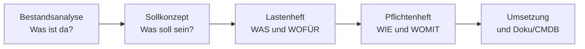
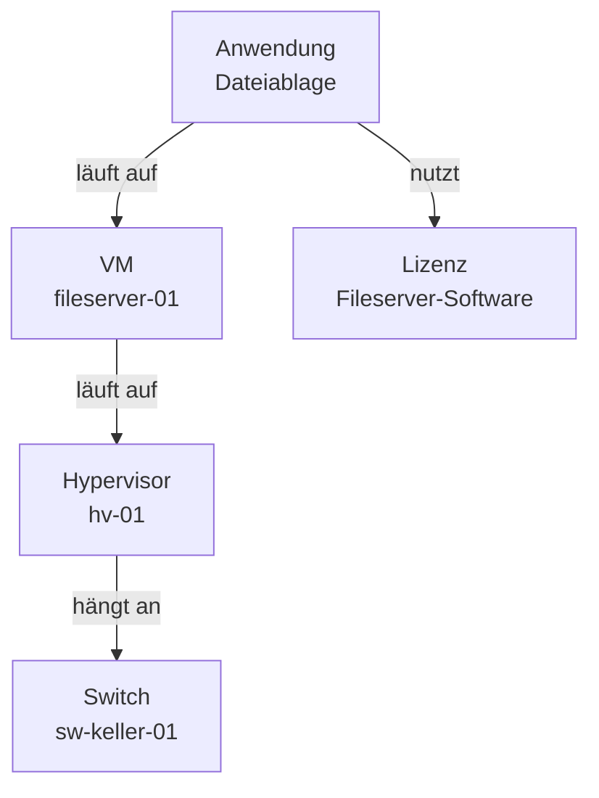

# Anforderungen & Sollkonzept

Prüfungsrelevant &nbsp; Bevor man Infrastruktur *baut*, muss man wissen, **was** sie leisten soll – sonst plant man am Bedarf vorbei.

Hier lernst du, wie aus einer ehrlichen Bestandsaufnahme und einem klaren Zielbild ein belastbarer Plan wird. Das ist die Stelle, an der sich entscheidet, ob ein Projekt später rund läuft oder ständig nachgebessert werden muss.

---

## „Wir brauchen eine neue IT"

So fangen echte Projekte an. Ein Geschäftsführer, dem der Server zu langsam ist. Eine Fachabteilung, die „endlich mal ordentlich Dateien teilen" will. Ein Team, das „irgendwas mit Cloud" gehört hat. Alles legitime Wünsche – aber keiner davon ist eine **Anforderung**.

Der Unterschied ist einfach zu prüfen: Eine Anforderung kannst du am Ende **abhaken**. „Wir brauchen eine neue IT" kannst du nicht abhaken – du weißt nicht einmal, wann du fertig wärst. „Alle 45 Mitarbeitenden können auf eine zentrale Dateiablage zugreifen, die zur Arbeitszeit zu 99,5 % verfügbar ist" – das kannst du abhaken. Oder eben nicht, dann weißt du wenigstens genau, was fehlt.

Wer den Wunsch direkt in Hardware übersetzt, baut am Bedarf vorbei – und merkt es erst, wenn das Geld ausgegeben ist. Der Weg dazwischen hat eine feste Reihenfolge:

Diese Kette ist der rote Faden der Seite. Sie beginnt nicht beim Zielbild – sie beginnt bei dem, was schon herumsteht.

---

## Bestandsanalyse: erst sehen, was da ist

Die **Bestandsanalyse** (auch **Ist-Analyse**) beantwortet eine einzige Frage: **Was haben wir eigentlich – und in welchem Zustand?** Sie klingt nach Fleißarbeit und ist auch eine. Aber sie ist der Teil, der dich vor der teuersten Fehleinschätzung bewahrt: Dinge zu kaufen, die schon da sind – oder auf Dingen aufzubauen, die es gar nicht mehr gibt.

Systematisch erfasst du drei Ebenen:

- **Hardware**: Server, Clients, Drucker, USV, Netzwerkgeräte – mit Alter, Leistungsdaten und Garantiestatus
- **Netzwerk**: Verkabelung, Switches, Router, Firewalls, WLAN, Internetanbindung – und wie das alles zusammenhängt
- **Software**: Betriebssysteme, Anwendungen, Datenbanken, Lizenzen – und wer was wofür tatsächlich benutzt

Die Quellen dafür sind unspektakulär, aber in Kombination stark: **Inventurlisten** und Beschaffungsunterlagen, vorhandene **Netzpläne**, die bestehende **Dokumentation** (falls es sie gibt), Auswertungen aus dem Monitoring – und vor allem **Gespräche**. Der Admin weiß, welcher Server nachts komische Geräusche macht. Die Sachbearbeiterin weiß, dass die „zentrale Ablage" in Wahrheit ein USB-Stick ist, der durchs Büro wandert. Beides steht in keiner Liste.

!!! warning "Eine geschönte Ist-Analyse ist wertlos"
    Die Bestandsanalyse ist kein Rechenschaftsbericht, sondern eine Diagnose. Sie muss die **Schwachstellen** genauso ehrlich benennen wie die Stärken: der Server ohne Support, das Backup, das seit Monaten niemand testweise zurückgespielt hat, die Netzwerkdose, an der drei Switches in Reihe hängen. Wer hier beschönigt, plant das neue System auf einem Fundament, das es so nicht gibt – und wundert sich später über Risse.

Und dann die gute Nachricht, die fast jede ehrliche Ist-Analyse liefert: **Oft ist ein Teil der Lösung schon da.** Der Hypervisor hat noch Reserven für zwei weitere VMs. Die Verkabelung ist neuer als gedacht. Die Datenbank kann das gewünschte Feature längst, es hat nur nie jemand eingeschaltet. Jede dieser Entdeckungen spart echtes Geld – aber nur, wenn jemand nachgesehen hat.

---

## Sollkonzeption: das Zielbild – messbar

Die **Sollkonzeption** beschreibt den Zielzustand: Wie soll die Infrastruktur aussehen, wenn das Projekt fertig ist? Der häufigste Fehler dabei ist nicht, zu wenig zu wollen – sondern das Gewollte so schwammig aufzuschreiben, dass sich später niemand daran messen lassen muss.

Vergleiche den Unterschied:

> „Der Fileserver soll verfügbar sein."

> „Der Fileserver erreicht **99,5 % Verfügbarkeit im Monatsmittel**, gemessen zur Kernarbeitszeit."

Der erste Satz ist immer erfüllt – irgendwie verfügbar ist alles, was nicht dauerhaft aus ist. Der zweite Satz ist eine **messbare Anforderung**: 0,5 % von rund 170 Stunden Kernarbeitszeit im Monat (etwa 21 Arbeitstage mal 8 Stunden) sind knapp eine Stunde Ausfall, die noch im Rahmen liegt – die zweite Stunde nicht mehr. Darüber kann man verhandeln, das kann man überwachen, daran kann man ein Angebot festmachen. Wird so ein Wert einem Dienstleister oder Cloud-Anbieter vertraglich zugesichert, heißt er **SLA** (Service Level Agreement) – die Zeile im Vertrag, an der du den Anbieter später misst. Genau solche Zahlen sind es übrigens, die du später in Dashboards wiederfindest – im [Monitoring-Block](../monitoring-praxis/index.md) hast du mit Prometheus und Grafana das Werkzeug dafür schon in der Hand gehabt.

Beim Sortieren der Anforderungen hilft eine Unterscheidung, die dir in jeder Planungsaufgabe wieder begegnet:

| | **Funktionale Anforderungen** | **Nicht-funktionale Anforderungen** |
|---|---|---|
| Leitfrage | **Was** soll das System tun? | **Wie gut** soll es das tun? |
| Charakter | Funktionen, Features, Abläufe | Qualitäten, messbare Eigenschaften |
| Beispiel Fileserver | zentrale Dateiablage, Rechtevergabe pro Abteilung, Wiederherstellung gelöschter Dateien | 99,5 % Verfügbarkeit, Wiederherstellung binnen 4 Stunden, verschlüsselte Übertragung |
| Beispiel Webshop | Warenkorb, Bezahlung, Bestellhistorie | Antwortzeit unter 2 Sekunden bei 1.000 gleichzeitigen Nutzern |
| Wenn sie fehlt | das System **kann** etwas nicht | das System kann alles – nur zu langsam, zu unsicher oder zu selten |

Die zweite Spalte wird gern vergessen, weil sie unsichtbar ist, solange alles gut geht. Ein System ohne die Funktion „Warenkorb" fällt im ersten Test auf. Ein System, das bei 1.000 gleichzeitigen Nutzern einbricht, fällt am ersten verkaufsstarken Tag auf – also genau dann, wenn es am meisten wehtut. Zu den nicht-funktionalen Anforderungen gehören typischerweise **Verfügbarkeit**, **Performance**, **Sicherheit** und **Skalierbarkeit**.

!!! info "Sicherheit ist keine Ausbaustufe"
    Sicherheitsanforderungen gehören **von Anfang an** ins Sollkonzept: Wer darf zugreifen, was wird verschlüsselt, wie lange werden Daten aufbewahrt, was passiert bei einem Vorfall? Sicherheit nachträglich „dranzubauen" ist teuer und bleibt Stückwerk – eine Firewall vor einem System, das intern jedem alles erlaubt, ist Kosmetik. Wie du Risiken systematisch bewertest, zeigt der Block [Risikomanagement](../it-sicherheit/risikomanagement.md).

---

## Lastenheft und Pflichtenheft: wer schreibt was

Alle gesammelten Anforderungen landen im **Anforderungskatalog** – der vollständigen, geordneten Liste dessen, was das neue System können und leisten muss. Sobald ein Auftragnehmer ins Spiel kommt (eine externe Firma oder auch die eigene IT-Abteilung als interner Dienstleister), wird daraus ein Dokumenten-Paar mit klar verteilten Rollen:

| | **Lastenheft** | **Pflichtenheft** |
|---|---|---|
| Wer schreibt es? | der **Auftraggeber** | der **Auftragnehmer** |
| Leitfrage | **WAS** soll erreicht werden – und **WOFÜR**? | **WIE** wird es umgesetzt – und **WOMIT**? |
| Perspektive | Bedarf, Ziele, Rahmenbedingungen | konkrete technische Lösung |
| Detailgrad | lösungsneutral – schreibt kein Produkt vor | konkret bis zur Typenbezeichnung |
| Reihenfolge | zuerst | danach – als Antwort auf das Lastenheft |
| Typischer Satz | „Alle Mitarbeitenden benötigen eine zentrale Dateiablage mit 2 TB Startkapazität." | „Wir stellen eine VM mit 4 vCPU, 16 GB RAM und 6 TB Netto-Speicher auf dem bestehenden Hypervisor bereit." |

Die Reihenfolge ist kein Formalismus, sondern Logik: Das Pflichtenheft ist die **Antwort** auf das Lastenheft. Der Auftraggeber beschreibt lösungsneutral seinen Bedarf – der Auftragnehmer antwortet mit einem konkreten Lösungsvorschlag. Erst wenn beide Seiten dieses Paar abgenickt haben, wird gebaut. Das Pflichtenheft ist damit auch die Messlatte für die Abnahme: Was drinsteht, muss am Ende nachweisbar funktionieren.

**Einmal durchgespielt am Fileserver:**

  

    
Lastenheft schreibt der Auftraggeber – WAS und WOFÜR

    <ul>
      <li>45 Mitarbeitende brauchen eine zentrale Dateiablage</li>
      <li>Startkapazität 2 TB, erwartetes Wachstum ca. 20 % pro Jahr</li>
      <li>gelöschte Dateien müssen 30 Tage wiederherstellbar sein</li>
      <li>Verfügbarkeit: 99,5 % im Monatsmittel zur Kernarbeitszeit</li>
      <li>Zugriff nur aus dem internen Netz, Rechte pro Abteilung</li>
    </ul>
  

  

    
Pflichtenheft antwortet der Auftragnehmer – WIE und WOMIT

    <ul>
      <li>VM auf dem vorhandenen Hypervisor (laut Ist-Analyse Reserven)</li>
      <li>4 vCPU, 16 GB RAM, 6 TB netto auf redundantem Speicher</li>
      <li>Papierkorb-Funktion mit 30 Tagen Aufbewahrung + Snapshots</li>
      <li>Anbindung ans bestehende Verzeichnis für die Rechtevergabe</li>
      <li>Überwachung der Verfügbarkeit über das vorhandene Monitoring</li>
    </ul>
  

Sieh dir an, wie oft der Auftragnehmer nutzt, was die Bestandsanalyse gefunden hat: den Hypervisor mit Reserven, das bestehende Verzeichnis, das vorhandene Monitoring. Die Kette vom Anfang der Seite zahlt sich hier direkt in gesparter Hardware aus.

??? tip "Was passiert, wenn die Dokumente fehlen?"
    Ohne Lastenheft baut der Auftragnehmer das, was er **glaubt**, verstanden zu haben – und der Auftraggeber bekommt etwas, das er so nie wollte. Ohne Pflichtenheft gibt es keine Messlatte für die Abnahme: Der Auftraggeber sagt „das ist nicht das, was wir meinten", der Auftragnehmer sagt „das habt ihr aber so bestellt" – und beide haben recht, weil nichts Belastbares aufgeschrieben wurde. Solche Projekte enden nicht im Streit, weil die Beteiligten böswillig wären, sondern weil zwei Köpfe unter demselben Satz zwei verschiedene Systeme verstanden haben. Die beiden Dokumente sind das Werkzeug, um genau das rechtzeitig zu bemerken – solange es nur Papier kostet.

---

## Parameter: aus Sätzen werden Zahlen

Ein Sollkonzept ist erst dann baubar, wenn aus den Anforderungssätzen **konkrete Größen** geworden sind – die **Parameter** der Infrastruktur. Das ist ein Übersetzungsschritt, kein Rateschritt:

- Aus „2 TB heute, 20 % Wachstum pro Jahr, 3 Jahre Planungshorizont" wird eine **Speichergröße**: rund 3,5 TB Nutzdaten – plus Platz für Papierkorb, Snapshots und Reserve, also eher 6 TB netto.
- Aus „45 gleichzeitige Nutzer, überwiegend Office-Dateien" werden **RAM und CPU** der VM.
- Aus „große Dateien, interner Zugriff" wird eine **Bandbreiten**-Anforderung ans Netzwerk.
- Aus „99,5 % im Monatsmittel" wird ein **Verfügbarkeitsziel**, das über Redundanz, Wartungsfenster und Monitoring entscheidet.

Falls dir dieses Denken bekannt vorkommt: Genau dasselbe hast du im Kleinen schon gemacht, als du in Kubernetes **Requests und Limits** für einen Pod festgelegt hast. Auch dort übersetzt du eine Erwartung („die App braucht Luft zum Atmen, darf aber nicht alles fressen") in Zahlen, an denen sich das System messen lässt. Infrastrukturplanung macht denselben Schritt – nur eine Etage größer.

Zum Sollkonzept gehört neben den Anforderungssätzen fast immer auch eine Zeichnung: ein **Netzplan** der Ziel-Topologie, der Standorte, Netze und zentrale Systeme zeigt – dieselbe Darstellungsform, die du in der Bestandsanalyse für den Ist-Zustand nutzt.

Wie du Speichergrößen sauber kalkulierst (und warum netto nicht brutto ist), vertieft die Seite [Speicherlösungen](speicherloesungen.md). Dass zu einem Projekt neben Technik auch Menschen, Zeit und Geld gehören, nimmt sich [Ressourcen planen](ressourcen-planen.md) vor.

---

## Dokumentation & CMDB: damit das Wissen nicht verdunstet

Der Plan ist umgesetzt, das System läuft – und jetzt kommt der Teil, der über den langfristigen Wert entscheidet: die **Dokumentation**. Das Gegenbild kennt jeder Betrieb: eine Excel-Inventarliste, zuletzt gepflegt von einer Kollegin, die vor zwei Jahren gegangen ist. Drei der Server darin sind längst verschrottet, der wichtigste fehlt ganz. So eine Liste ist schlimmer als keine – sie sieht nach Wissen aus und liefert Fiktion.

Die strukturierte Antwort darauf ist eine **CMDB** (**Configuration Management Database**): eine Datenbank, die alle relevanten Bestandteile der Infrastruktur als **Configuration Items** (CIs) führt – Server, VMs, Netzwerkgeräte, Anwendungen, Lizenzen, Verträge. Der eigentliche Mehrwert liegt aber nicht in der Liste, sondern in den **Beziehungen** zwischen den CIs: *Diese Anwendung läuft auf jener VM, die auf diesem Hypervisor liegt, der an jenem Switch hängt.* Erst die Beziehungen beantworten die Frage, die im Störungsfall zählt: **„Wenn dieses Gerät ausfällt – was ist dann alles betroffen?"**

Lies das Bild von unten nach oben: Fällt der Switch aus, ist alles darüber betroffen – Hypervisor, VM, Anwendung. Genau diese Kette liefert eine gepflegte CMDB auf Knopfdruck; ohne sie rekonstruiert sie jemand nachts im Kopf.

!!! warning "Die Pflege ist der Knackpunkt, nicht die Einführung"
    Eine CMDB einzuführen ist ein Projekt. Sie **aktuell zu halten** ist eine Daueraufgabe – und genau daran scheitern die meisten. Jede Änderung an der Infrastruktur muss den Weg in die Datenbank finden, sonst startet nur die nächste Runde des Excel-Problems, diesmal mit teurerer Software. Eine veraltete CMDB ist gefährlicher als gar keine: Ihr glaubt man.

Ein Ausblick, der dir aus dem Kurs vertraut vorkommen dürfte: Werkzeuge wie **Git**-Repositories und **Infrastructure as Code** rücken die Dokumentation näher an die Realität. Wenn die Infrastruktur selbst als Code beschrieben ist – wie deine Compose-Dateien oder Helm-Charts –, dann *ist* das Repository die Beschreibung des Systems: versioniert, nachvollziehbar, mit Historie. Die Doku veraltet nicht neben dem System her, weil Änderung und Beschreibung derselbe Schritt sind. Das ersetzt eine CMDB nicht in jedem Betrieb – aber es zeigt, wohin sich das Problem entwickelt.

---

!!! quote "Mitnehmen"
    1. **Erst das Soll, dann das Bauen.** Wer zuerst versteht, was wirklich gebraucht wird – und es in Lastenheft und Pflichtenheft festhält – erspart sich teure Korrekturen. Und eine ehrliche Bestandsanalyse zeigt oft, dass die halbe Lösung schon vorhanden ist.
    2. **Anforderungen müssen messbar sein.** „Verfügbar" ist ein Wunsch, „99,5 % im Monatsmittel" eine Anforderung. Funktionale Anforderungen sagen, **was** das System tut – nicht-funktionale, **wie gut**.
    3. **Lastenheft fragt WAS und WOFÜR, Pflichtenheft antwortet WIE und WOMIT.** Der Auftraggeber beschreibt den Bedarf, der Auftragnehmer die Lösung – in dieser Reihenfolge.
    4. **Dokumentation lebt nur, wenn sie gepflegt wird.** Eine CMDB mit Configuration Items und ihren Beziehungen beantwortet die Ausfall-Frage – aber nur, solange sie aktuell ist.

---

!!! example "Jetzt üben"
    Zu dieser Seite gibt es einen eigenen Aufgabensatz: **[Übungen: Anforderungen & Sollkonzept](uebungen-anforderungen.md)** – acht Einzelaufgaben von den Quellen der Bestandsanalyse über messbare Anforderungen und die Verfügbarkeitsrechnung bis zur Ausfall-Frage an die CMDB, jede mit ausführlicher Musterlösung.

---

!!! tip "Verbindung zur Architektur"
    Steht das Sollkonzept, geht es an die passende Bauform: zentral oder dezentral, eigenes Rechenzentrum oder Cloud – oder ein Mix. Wie du aus den Anforderungen eine konkrete Architektur ableitest, liest du auf der nächsten Seite: [Architekturen: zentral, dezentral, Cloud](architekturen.md).