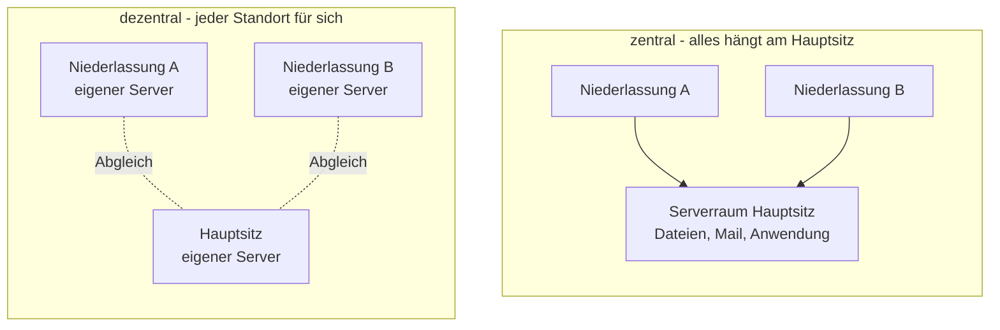
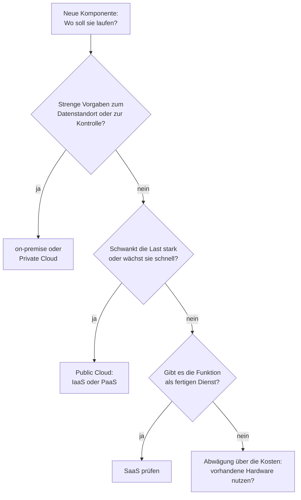
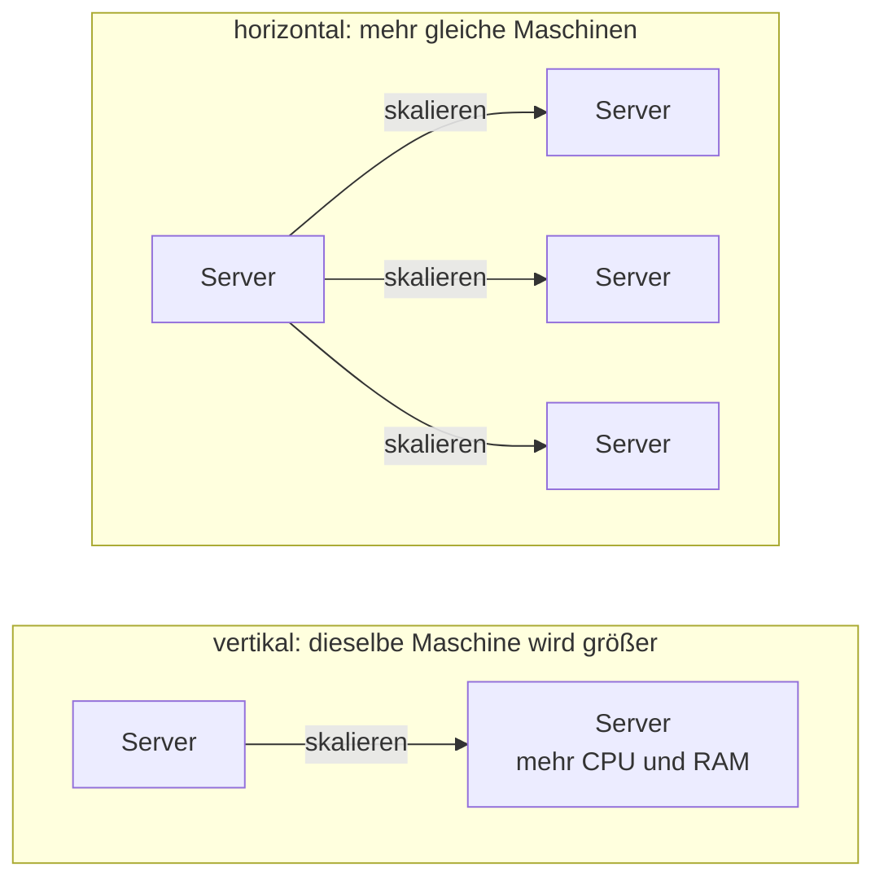

# Architekturen: zentral, dezentral, Cloud

Prüfungsrelevant &nbsp; Es gibt nicht *die* richtige Architektur – nur die, die zum Bedarf passt. Hier lernst du, die Bauformen zu unterscheiden und bewusst zu wählen.

Auf der [vorigen Seite](anforderungen-und-sollkonzept.md) hast du geklärt, **was** gebraucht wird: Bestandsanalyse, messbare Anforderungen, Lastenheft und Pflichtenheft. Jetzt kommt die Frage, die jede Planung als Nächstes stellt: **Wo soll das alles laufen?** Im eigenen Serverraum? Bei einem Anbieter? An jedem Standort einzeln oder an einem gebündelt?

Stell dir eine Firma mit einem Hauptsitz und zwei Niederlassungen vor. Alle drei Standorte brauchen Dateiablage, E-Mail und ein Warenwirtschaftssystem. Schon bei dieser überschaubaren Aufgabe gibt es ein Dutzend gangbarer Bauformen – und welche davon passt, hängt nicht vom Geschmack ab, sondern von Kriterien, die du am Ende dieser Seite systematisch abklopfen kannst.

---

## Zentral oder dezentral?

Die älteste Architekturfrage der IT – älter als die Cloud, älter als das Internet.

Eine **zentrale Architektur** bündelt alle Dienste an einem Ort: ein Serverraum am Hauptsitz, dort laufen Fileserver, Datenbank und Anwendungen. Die Niederlassungen greifen über die Standleitung darauf zu. Eine **dezentrale Architektur** verteilt die Dienste bewusst: Jede Niederlassung bekommt ihren eigenen Server, arbeitet lokal und tauscht nur ab, was standortübergreifend gebraucht wird.

Beide Bauformen haben einen eingebauten Preis – nur an unterschiedlichen Stellen:

| Kriterium | Zentral | Dezentral |
|---|---|---|
| **Administration** | ein Ort, ein Team, ein Wartungsfenster – Updates einmal einspielen | jeder Standort braucht Betreuung, vor Ort oder per Fernwartung |
| **Ausfallwirkung** | fällt die Zentrale aus, stehen **alle** Standorte still | ein Ausfall trifft nur einen Standort – die anderen arbeiten weiter |
| **Latenz für Standorte** | jeder Dateizugriff der Niederlassung nimmt den Umweg über die WAN-Leitung | Daten liegen nah bei den Nutzern, Zugriffe sind schnell |
| **Datenkonsistenz** | ein Datenbestand, eine Wahrheit | mehrere Bestände müssen abgeglichen werden – Konflikte sind möglich |

Das konkrete Bild dazu: Ein **zentraler Fileserver** am Hauptsitz ist leicht zu sichern, leicht zu warten und hat genau einen Datenbestand. Aber wenn die Standleitung der Niederlassung hakt, öffnet dort niemand mehr eine Datei – der Server ist ein **Single Point of Failure**, ein einzelner Punkt, an dem alles hängt. Ein **Server je Niederlassung** dreht das Bild um: schnelle lokale Zugriffe, ein Ausfall bleibt lokal – dafür wartest du drei Systeme statt einem. Und wenn zwei Standorte dieselbe Kundendatei bearbeiten, hast du am Abend zwei Versionen der Wahrheit.

Links hängt alles an einem Punkt – fällt er aus, stehen alle. Rechts arbeitet jeder Standort weiter, dafür müssen die gestrichelten Abgleich-Wege gepflegt werden – und genau dort entstehen die zwei Versionen der Wahrheit.

!!! info "Zentral verwaltet, dezentral verteilt – der moderne Mittelweg"
    Die Frage ist heute selten ein Entweder-oder. Moderne Systeme trennen zwei Dinge, die früher zusammenklebten: **wo die Verwaltung sitzt** und **wo die Last läuft**. Ein Kubernetes-Cluster ist das Muster dafür: Du sprichst mit **einer** API, hältst **eine** Konfiguration – zentral. Die Pods verteilt der Cluster aber auf viele Nodes, fällt einer aus, starten sie woanders neu – dezentral. Zentrale Verwaltung ohne zentralen Ausfallpunkt – sofern die Steuerungsebene selbst redundant ausgelegt ist, wie in produktiven Clustern üblich: Genau diese Kombination macht solche Plattformen attraktiv.

---

## On-premise, Cloud oder hybrid?

Die zweite Achse der Entscheidung: Wem gehört die Hardware, auf der das alles läuft?

**On-premise** heißt: eigene Hardware in eigenen Räumen – gekauft, aufgebaut, selbst betrieben. **Cloud** heißt: Du mietest Rechenleistung, Speicher oder fertige Dienste bei einem Anbieter und zahlst nach Verbrauch. Die Abwägung läuft immer über dieselben vier Kriterien:

| Kriterium | On-premise | Cloud |
|---|---|---|
| **Kontrolle** | volle Kontrolle über Hardware, Konfiguration und Zugriff | du kontrollierst nur, was der Anbieter dir freigibt |
| **Datenstandort** | bekannt – dein Serverraum, dein Rechtsraum | vertraglich zu klären: In welchem Land liegen die Daten? |
| **Skalierbarkeit** | begrenzt durch gekaufte Hardware, Erweiterung braucht Wochen | zusätzliche Kapazität in Minuten – nach oben wie nach unten |
| **Kostenmodell** | Investition vorab (**CapEx**), danach läuft die Hardware ab bezahlt | laufende Betriebskosten (**OpEx**), die mit der Nutzung wachsen |

CapEx und OpEx tauchen hier nur als Stichworte auf – was hinter Investitions- und Betriebskosten steckt und wie du damit rechnest, kommt ausführlich auf der Seite [Ressourcen planen](ressourcen-planen.md).

Und „eigene Räume" heißt mehr als vier Wände: Ein Serverraum braucht eine **USV** (unterbrechungsfreie Stromversorgung), die Stromausfälle überbrückt, Klimatisierung gegen die Abwärme, Zutrittskontrolle und Brandschutz. Diese Posten vergisst man beim Kostenvergleich mit der Cloud leicht – dort stecken sie im Preis, im eigenen Keller stehen sie auf eigenen Rechnungen. Wie Rechenzentren Ausfälle physisch absichern, vertieft die Seite [Hochverfügbarkeit](../betrieb/hochverfuegbarkeit.md).

Hinter der Achse on-premise/Cloud steckt übrigens eine ältere, allgemeinere Frage: **Make or Buy** – selbst betreiben oder als Leistung einkaufen? Zwischen den beiden Polen liegt eine dritte Option, die im Mittelstand häufig ist: **Managed Services** (Outsourcing). Dabei bleibt die Infrastruktur im Besitz des Unternehmens, oft sogar im eigenen Haus – aber ein Dienstleister übernimmt vertraglich den Betrieb: Patches, Backups, Störungsbeseitigung. Das kauft Know-how und Erreichbarkeit ein, die eine kleine IT-Abteilung allein nicht stemmt, macht aber vom Dienstleister abhängig. Was in solchen Verträgen geregelt sein muss, vertieft die Seite [IT-Verträge](../recht-organisation/it-vertraege.md).

Im Mittelstand sieht das Ergebnis dieser Abwägung fast überall ähnlich aus: E-Mail und Bürosoftware laufen längst in der Cloud, das Warenwirtschaftssystem und die sensible Dateiablage liegen lokal, das Backup geht zusätzlich verschlüsselt zu einem externen Anbieter. Das ist kein Zufall und keine halbe Entscheidung – das ist **hybrid**: die bewusste Kombination aus beidem.

!!! abstract "Worauf es ankommt: hybrid ist der Normalfall"
    Kaum eine Organisation hat alles in der Cloud oder alles im eigenen Rechenzentrum. Meist liegt Sensibles lokal und Skalierbares in der Cloud. Die Kunst ist nicht, sich für ein Lager zu entscheiden – die Kunst ist, **jede Komponente an den richtigen Ort** zu platzieren. „Cloud oder nicht?" ist die falsche Frage. Die richtige lautet: „Wo gehört **diese** Komponente hin?"

Und genau diese Frage lässt sich als Entscheidungsweg zeichnen – pro Komponente einmal durchlaufen:

Zwei der Kästen im Diagramm enthalten drei Begriffe, die jetzt sauber definiert gehören: IaaS, PaaS, SaaS. Und was hinter der Private Cloud steckt, klärt der übernächste Abschnitt.

---

## Die Servicemodelle: IaaS, PaaS, SaaS

„Cloud" ist kein einzelnes Angebot, sondern eine Treppe mit drei Stufen. Auf jeder Stufe übernimmt der Anbieter mehr – und du gibst mehr aus der Hand.

- **IaaS – Infrastructure as a Service**: Der Anbieter stellt die Infrastruktur – virtuelle Maschinen, Speicher, Netzwerk. Betriebssystem, Updates und alles darüber sind dein Job. Du mietest sozusagen einen leeren Server, nur eben virtuell und minutengenau.
- **PaaS – Platform as a Service**: Der Anbieter betreibt zusätzlich Betriebssystem und Laufzeitumgebung. Du bringst nur noch deine Anwendung mit – um Patches, Kernel und Plattform-Updates kümmert sich der Anbieter. Typische PaaS-Angebote sind auch **gemanagte Datenbanken**: Der Anbieter betreibt die Datenbank-Software samt Updates und Sicherung, du bringst nur Schema und Daten mit.
- **SaaS – Software as a Service**: Der Anbieter betreibt die komplette Anwendung. Du öffnest den Browser, meldest dich an und arbeitest. Bürosoftware, Videokonferenzen, das Ticketsystem – fertige Dienste ohne eigenen Betrieb.

Die sauberste Darstellung ist eine Verantwortungstabelle über die Ebenen des Stacks – lies sie spaltenweise von links nach rechts und beobachte, wie die Verantwortung wandert:

| Ebene | On-premise | IaaS | PaaS | SaaS |
|---|---|---|---|---|
| Daten | **du** | **du** | **du** | **du** |
| Anwendung | **du** | **du** | **du** | Anbieter |
| Laufzeitumgebung | **du** | **du** | Anbieter | Anbieter |
| Betriebssystem | **du** | **du** | Anbieter | Anbieter |
| Virtualisierung | **du** | Anbieter | Anbieter | Anbieter |
| Hardware | **du** | Anbieter | Anbieter | Anbieter |

Zwei Dinge fallen auf. Erstens: Die oberste Zeile ändert sich nie. **Für deine Daten bist du immer verantwortlich** – kein Servicemodell nimmt dir ab, was hineingehört, wer darauf zugreifen darf und ob ein Backup existiert. Zweitens: Die Grenze wandert stufenweise von unten nach oben, nie kreuz und quer.

!!! tip "Du kennst alle drei Stufen schon aus dem Kurs"
    - **Alles selbst**: minikube auf deinem eigenen Rechner. Du stellst die Maschine, du startest den Cluster, du bist für jede Ebene zuständig – vom Blech bis zum Pod.
    - **PaaS-Gedanke**: ein gemanagtes Kubernetes beim Cloud-Anbieter. Du bringst deine Deployments und Helm-Charts mit – aber wer die Control Plane patcht, die Nodes tauscht und das Cluster-Upgrade fährt, ist nicht mehr dein Problem.
    - **SaaS**: die fertige Bürosoftware im Browser. Kein Cluster, kein Server, kein Update-Fenster – nur noch Anmelden und Arbeiten.

Und der Merksatz, mit dem du jedes Angebot einordnest:

> **Je mehr „as a Service", desto weniger betreibst du selbst – und desto weniger entscheidest du selbst.**

Beide Hälften gehören zusammen. Wer SaaS kauft, spart den Betrieb, akzeptiert aber die Software so, wie der Anbieter sie baut. Wer IaaS wählt, entscheidet alles selbst – und trägt dafür jede Nachtschicht selbst. Das ist keine Falle, sondern der Deal. Man muss ihn nur kennen, bevor man unterschreibt.

---

## Private oder Public Cloud?

Quer zu den Servicemodellen liegt eine weitere Unterscheidung: Wer betreibt die Plattform und wer teilt sie sich?

| | Private Cloud | Public Cloud |
|---|---|---|
| **Wer betreibt?** | die eigene Organisation oder ein Dienstleister exklusiv dafür | ein großer Anbieter für alle seine Kunden |
| **Wer teilt sich die Plattform?** | niemand – die Umgebung gehört einer Organisation allein | viele Kunden auf gemeinsamer Infrastruktur, logisch getrennt |
| **Typisch für** | sensible Daten, strenge regulatorische Vorgaben, volle Kontrolle | schnelles Skalieren, Standarddienste, Zahlen nach Verbrauch |

Eine **Private Cloud** ist Cloud-Technik – Selbstbedienung, Automatisierung, Abrechnung nach Verbrauch – auf einer Plattform, die einer einzigen Organisation gehört. Typisch dort, wo Daten das Haus nicht verlassen dürfen: Patientendaten, Finanzdaten, Behörden. Die **Public Cloud** ist die geteilte Plattform des großen Anbieters – logisch sauber getrennt, aber physisch gemeinsame Infrastruktur. Und die **Hybrid Cloud** ist schlicht die Kombination aus beidem, mit der du oben schon gerechnet hast: Sensibles privat, Skalierbares public. Als vierte Betriebsform existiert die **Community Cloud** – eine gemeinsame Umgebung mehrerer Organisationen mit ähnlichen Anforderungen, etwa Behörden oder Kliniken; in der Praxis begegnet sie dir deutlich seltener als die anderen drei.

---

### Skalieren: vertikal und horizontal

Ein Kriterium aus der On-premise/Cloud-Tabelle oben verdient einen genaueren Blick, denn es hat die Cloud groß gemacht: **Skalierbarkeit** – die Fähigkeit eines Systems, mit wachsender Last mitzuwachsen. Davon gibt es zwei Richtungen:

- **Vertikal skalieren** heißt: dieselbe Maschine größer machen – mehr CPU, mehr RAM. Einfach, aber endlich: Irgendwann gibt es keinen größeren Server mehr und beim Umbau steht das System.
- **Horizontal skalieren** heißt: mehr Maschinen derselben Sorte danebenstellen und die Last verteilen. Das kennst du praktisch: `replicas` im Deployment von 1 auf 3 drehen ist horizontales Skalieren in Reinform – drei gleiche Pods statt einem größeren.

Die Cloud glänzt vor allem horizontal: Zehn zusätzliche Instanzen sind ein API-Aufruf. Im eigenen Serverraum wären es eine Bestellung, Lieferzeit in Wochen und ein freier Platz im Rack.

---

## Homogenisierung: vom Wildwuchs zur Plattform

IT-Landschaften werden selten geplant – sie **wachsen**. Ein Projekt brachte einen Linux-Server mit, die Buchhaltungssoftware verlangte Windows in einer bestimmten Version, der Hypervisor der übernommenen Tochterfirma ist ein anderer als der eigene. Nach zehn Jahren stehen im Keller vier Betriebssystem-Generationen, drei Virtualisierungs-Plattformen und ein Server, den niemand mehr anfassen will, weil unklar ist, was er eigentlich tut.

Dieser Wildwuchs kostet an jeder Stelle: Jede Sonderlocke braucht eigenes Wissen, eigene Update-Prozesse, eigene Backup-Verfahren. **Homogenisierung** ist die bewusste Gegenbewegung – die Vereinheitlichung der Infrastruktur auf möglichst wenige Standard-Plattformen. Das bringt dreierlei:

- **Weniger Sonderfälle**: Ein Betriebssystem-Standard statt vier bedeutet ein Patch-Verfahren, ein Härtungs-Standard, ein Satz Dokumentation.
- **Planbare Betriebsprozesse**: Wenn alle Systeme gleich aufgebaut sind, ist jedes Wartungsfenster gleich – die Vertretung findet sich zurecht, ohne die Geschichte jedes Einzelsystems zu kennen.
- **Einfachere Automatisierung**: Skripte und Werkzeuge wirken nur auf Systeme, die sich gleichen. Zehn identische Server automatisierst du an einem Nachmittag – zehn verschiedene nie.

Die konsequenteste Homogenisierung, die du kennst, ist der Container: **Ein Container-Image läuft überall gleich, wo eine passende Container-Laufzeit steht** – auf deinem Laptop, in minikube, im Cluster des Anbieters. Die Anwendung bringt ihre Umgebung mit, statt sich der gewachsenen Umgebung anzupassen. Genau deshalb sind Container-Plattformen so oft das Ziel von Homogenisierungs-Projekten: Sie machen die darunterliegenden Unterschiede unsichtbar.

---

## Wenn Office-IT auf die Maschinenhalle trifft

Zum Schluss ein Blick über den Serverraum hinaus. In produzierenden Betrieben existieren zwei IT-Welten nebeneinander: die **Office-IT** – Arbeitsplätze, Server, E-Mail, alles was du bisher geplant hast – und die **Maschinenwelt** aus Steuerungen, Sensoren und **Bussystemen**, über die Maschinen untereinander kommunizieren. Jahrzehntelang waren beide Welten physisch getrennt. Heute wachsen sie zusammen: Die Produktionsdaten sollen ins Dashboard, die Wartung soll sich melden, bevor das Lager ausfällt – das Stichwort dazu ist **IoT**, das Internet der Dinge.

Diese Kopplung ist ein Architekturthema mit eigenen Regeln, denn die Maschinenwelt tickt anders:

- **Fehlertoleranz** hat dort eine andere Bedeutung. Wenn dein Mailserver zehn Sekunden hängt, wartet die Mail eben. Wenn die Steuerung einer laufenden Anlage zehn Sekunden hängt, steht die Produktion – oder es wird gefährlich. Die Kommunikation muss also mit Ausfällen rechnen, ohne dass die Anlage davon abhängt.
- **Verschlüsselung** ist dort keine Selbstverständlichkeit. Viele Bus-Protokolle stammen aus einer Zeit abgeschotteter Netze und senden unverschlüsselt. Sobald diese Systeme mit der Office-IT oder gar dem Internet gekoppelt werden, muss die Absicherung von außen dazukommen – durch Netztrennung, Gateways und verschlüsselte Übergänge.

Wer diese Kopplung plant, plant also nicht einfach „noch ein Netzwerk-Segment", sondern die kontrollierte Brücke zwischen zwei Welten mit verschiedenen Anforderungen. Welche Protokolle dort sprechen und wie die Übergänge aussehen, behandelt die Seite [Industrie- und IoT-Protokolle](../netzwerke/industrie-protokolle.md) im Netzwerk-Block.

---

!!! quote "Mitnehmen"
    1. **Architektur ist eine Abwägung, kein Glaubenskrieg.** Zentral spart Administration, dezentral begrenzt Ausfälle – moderne Plattformen wie Kubernetes kombinieren beides: zentral verwaltet, dezentral verteilt.
    2. **Hybrid ist der Normalfall.** Die Frage ist nicht „Cloud oder nicht?", sondern pro Komponente: Kontrolle, Datenstandort, Skalierbarkeit, Kostenmodell – und dann der richtige Ort.
    3. **Die Servicemodelle sind eine Treppe der Verantwortung.** Je mehr „as a Service", desto weniger betreibst du selbst – und desto weniger entscheidest du selbst. Nur die Verantwortung für die Daten bleibt immer bei dir.

---

!!! tip "Verbindung zu den Speicherlösungen"
    Steht die Architektur, folgt die nächste konkrete Frage: Wo liegen die Daten physisch und wie sind sie angebunden? Genau da geht es auf der Seite [Speicherlösungen](speicherloesungen.md) weiter – mit DAS, NAS, SAN und der Frage, wie viel Kapazität du eigentlich einplanen musst. Und wenn du wissen willst, mit welcher Technik on-premise-Server viele Systeme auf wenig Blech bündeln, lohnt der Blick in den Block [Virtualisierung](../virtualisierung/index.md).
