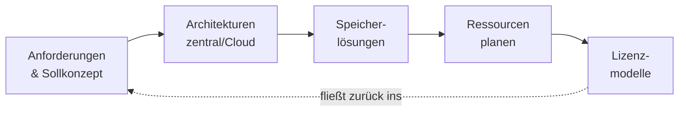

# Infrastruktur & Architektur

Bevor du den ersten Server aufsetzt, das erste Kabel ziehst oder die erste virtuelle Maschine startest, fällt die wichtigste Entscheidung längst vorher – auf dem Papier. **Wie soll die Infrastruktur aussehen, was muss sie können und woran misst du, ob sie passt?** Genau wie ein Architekt erst den Bauplan zeichnet, bevor der Bagger anrückt, planst du in diesem Block die IT-Landschaft, bevor du sie baust.

In diesem Block schauen wir uns das **gedankliche Fundament** an: Wie ermittelst du, was wirklich gebraucht wird? Welche Architektur passt zu welchem Bedarf – zentral, dezentral, Cloud oder ein Mix daraus? Wie planst du Speicher, Ressourcen und Lizenzen so, dass am Ende nichts fehlt und nichts unnötig teuer wird?

!!! abstract "Was du in diesem Block lernst"
    - wie du aus einer **Bestandsanalyse** und einem **Sollkonzept** einen sauberen Anforderungskatalog ableitest – inklusive Lasten- und Pflichtenheft
    - welche **Architekturen** es gibt (zentral, dezentral, on-premise, Cloud, hybrid) und wann welche passt
    - wie du **Speicherlösungen** dimensionierst und DAS, NAS und SAN unterscheidest
    - wie du **Ressourcen** in vier Dimensionen planst: technisch, personell, zeitlich, finanziell
    - welche **Lizenzmodelle** es gibt und worauf du bei Auswahl, Kosten und Support achtest

---

## Wie wichtig ist dieser Block?

Prüfungsrelevant &nbsp; Dieser Block gehört zum **prüfungsrelevanten Kern**. Planung und Architektur sind der Startpunkt fast jeder Aufgabenstellung – wer hier sauber denkt, baut später stabilere Systeme.

!!! note "Status: Platzhalter in Arbeit"
    Die Struktur dieses Blocks steht, die einzelnen Seiten werden Schritt für Schritt mit Inhalten gefüllt. Du siehst hier schon, **welche Themen kommen** und **wie sie zusammenhängen** – damit du den roten Faden kennst, bevor die Details folgen.

---

## Seiten in diesem Block

| Seite | Inhalt | Relevanz |
|-------|--------|----------|
| [Anforderungen & Sollkonzept](anforderungen-und-sollkonzept.md) | Bestandsanalyse, Sollkonzeption, Anforderungskatalog, Lasten- und Pflichtenheft, CMDB | Prüfungsrelevant |
| [Architekturen: zentral, dezentral, Cloud](architekturen.md) | Zentral vs. dezentral, on-premise vs. Cloud, hybrid, private vs. public, Homogenisierung, IoT-Kopplung | Prüfungsrelevant |
| [Speicherlösungen](speicherloesungen.md) | Kapazitätsplanung, DAS/NAS/SAN, RAID und Redundanz, Speicher in virtualisierten Umgebungen | Vertiefung |
| [Ressourcen planen](ressourcen-planen.md) | Technische, personelle, zeitliche und finanzielle Ressourcen, Grobschätzung, Bewertung | Vertiefung |
| [Lizenzmodelle](lizenzmodelle.md) | Lizenzarten, Erfassung, Kosten, Auswahl, Service & Support, rechtliche Aspekte | Vertiefung |

---

## Roter Faden

Wir bauen das Bild **vom Bedarf zur Umsetzbarkeit**: erst klären, was gebraucht wird (Anforderungen), dann die passende Architektur wählen, danach Speicher dimensionieren, anschließend die nötigen Ressourcen einplanen und am Ende klären, welche Lizenzen das Ganze rechtlich und finanziell tragen. Was du bei Lizenzen und Ressourcen lernst, fließt wieder ins Sollkonzept zurück – Planung ist ein Kreislauf, kein Einbahnweg.

---

## Wie hängt das mit den anderen Blöcken zusammen?

- **[Virtualisierung](../virtualisierung/index.md)** ist oft die technische Antwort auf das hier geplante Sollkonzept – wer Architektur und Speicher plant, denkt VMs, Hypervisoren und Container gleich mit.
- **[Netzwerke](../netzwerke/index.md)** liefern das Verbindungs-Fundament: Eine Architektur ohne durchdachte Netzstruktur bleibt Theorie.
- **[Risikomanagement](../it-sicherheit/risikomanagement.md)** gehört von Anfang an mit an den Planungstisch – jede Architekturentscheidung verschiebt auch Risiken.

---

## Voraussetzungen

- Keine harten Vorkenntnisse. Wer die [Netzwerk-Grundlagen](../netzwerke/index.md) kennt, versteht Architekturentscheidungen schneller.
- Bereitschaft, in **Anforderungen und Zielbildern** zu denken, statt sofort an Hardware und Konfiguration.

---

## Leitfrage

> **Ein Kunde sagt „Wir brauchen eine neue IT“ – wie komme ich strukturiert von diesem Satz zu einem belastbaren Plan, der Architektur, Speicher, Ressourcen und Lizenzen abdeckt?**

Wer diese Frage methodisch beantwortet – erst der Bedarf, dann die Lösung – plant wie eine erfahrene Fachkraft, statt drauflos zu basteln.
