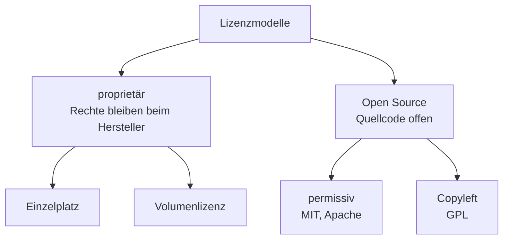

# Lizenzmodelle

<span class='badge badge-vertiefung'>Vertiefung</span> &nbsp; Software gehört dir selten – du darfst sie nur unter bestimmten Bedingungen nutzen. Welche das sind, regelt die Lizenz.

Hier lernst du, die gängigen Lizenzmodelle sicher auseinanderzuhalten und für ein Vorhaben die passende – und über die Jahre bezahlbare – Variante auszuwählen.

---

## Gekauft ist hier fast nichts

Wenn im Einkauf „Wir haben die Software gekauft" steht, stimmt das fast nie wörtlich. Software ist ein geistiges Werk und als solches durch das **Urheberrecht** geschützt – die Rechte daran liegen beim Hersteller und bleiben auch dort. Was du erwirbst, ist ein **Nutzungsrecht**: die Erlaubnis, das Programm unter bestimmten Bedingungen einzusetzen.

Diese Bedingungen stehen in der **Lizenz** – dem Vertragstext, den beim Installieren fast jeder ungelesen wegklickt. Genau dort ist geregelt, was du darfst (installieren, nutzen, manchmal weitergeben) und was nicht (kopieren, verändern, auf mehr Rechnern betreiben als vereinbart). Wer eine Infrastruktur plant, plant deshalb immer beides mit: die Technik **und** die Rechte, sie zu betreiben.

!!! note "Warum das in die Planung gehört"
    Eine Lizenz, die nicht zur geplanten Nutzung passt, ist kein Papierproblem. Sie entscheidet mit darüber, ob dein Sollkonzept überhaupt zulässig umsetzbar ist – und was es über die Jahre wirklich kostet. Deshalb steht diese Seite am Ende des Planungs-Blocks und nicht irgendwo im Kleingedruckten.

---

## Lizenzarten unterscheiden



Das Diagramm zeigt die Grundfamilien. Quer dazu liegen zwei Fragen, die jede Lizenz zusätzlich beantwortet: **Was wird gezählt** (Gerät, Named User, Concurrent User) und **wird gekauft oder abonniert**? Beide nehmen wir uns jetzt der Reihe nach vor.

### Proprietär: vom Einzelplatz zur Volumenlizenz

Bei **proprietären Lizenzen** behält der Hersteller alle Rechte am Code – du bekommst nur das fertige Programm samt Nutzungserlaubnis. Die kleinste Form ist die **Einzelplatzlizenz**: ein Erwerb, eine Installation. Für zehn Arbeitsplätze zehnmal einzeln zu kaufen wird schnell unhandlich, deshalb gibt es die **Volumenlizenz**: ein Vertrag deckt eine größere Stückzahl ab, meist mit Mengenrabatt und zentraler Verwaltung über einen einzigen Lizenzschlüssel.

### Zählweisen: wonach wird eigentlich abgerechnet?

Sobald mehr als ein Mensch an mehr als einem Gerät arbeitet, wird die spannendste Frage: **Was genau wird gezählt?**

| Zählweise | Es zählt ... | Typisch für | Stolperstein |
|---|---|---|---|
| **pro Gerät** | jede Installation bzw. jedes Gerät | Betriebssysteme, Arbeitsplatz-Software | Zweitgerät oder Home-Office-Rechner zählt mit |
| **Named User** | jede benannte Person – egal auf wie vielen Geräten | personengebundene Konten, viele Cloud-Dienste | Teilzeitkraft kostet so viel wie Vollzeitkraft |
| **Concurrent User** | die **gleichzeitig** aktiven Nutzer | Fachanwendungen mit Schichtbetrieb | Lizenzserver nötig, der die Gleichzeitigkeit zählt |

Ein kurzes Rechenbeispiel, wann **Concurrent User** günstiger ist: Eine Fachanwendung wird von 60 Beschäftigten genutzt – aber im Zwei-Schicht-Betrieb, sodass nie mehr als 25 gleichzeitig angemeldet sind. Als Named-User-Modell brauchst du 60 Lizenzen. Als Concurrent-Modell reichen 25 – selbst wenn die einzelne Concurrent-Lizenz das Doppelte kostet, sparst du. Umgekehrt gilt: Sitzen alle 60 gleichzeitig davor, bringt Concurrent nichts. Die Zählweise passt also nie „an sich", sondern immer nur **zum Nutzungsmuster**.

### Kaufen oder abonnieren?

| | **Kauflizenz** (perpetual) | **Subscription** (Abo) |
|---|---|---|
| Nutzungsrecht | zeitlich unbegrenzt | nur solange du zahlst |
| Kosten | hoch am Anfang, danach meist Wartungsgebühr | planbare laufende Rate |
| Updates | oft nur gegen Wartungsvertrag | in der Rate enthalten |
| Ende der Zahlung | Software läuft weiter (auf altem Stand) | Zugriff endet |
| Bilanzsicht | Investition (einmalig) | Betriebskosten (laufend) |

Die **Kauflizenz** – oft *perpetual* genannt – erwirbst du einmal und darfst sie unbegrenzt nutzen. Die **Subscription** mietest du: kleinere, planbare Raten, Updates inklusive, aber wenn du aufhörst zu zahlen, ist der Zugriff weg. Welche Variante über die Jahre günstiger ist, ist eine Rechenaufgabe – die machen wir weiter unten konkret.

### Open Source: frei heißt nicht pflichtenfrei

**Open Source** bedeutet: Der Quellcode ist offen, du darfst die Software nutzen, verändern und weitergeben – meist ohne Lizenzgebühr. Was es **nicht** bedeutet: dass keine Bedingungen gelten. Auch eine Open-Source-Lizenz ist eine Lizenz.

Grob gibt es zwei Familien. **Permissive Lizenzen** wie MIT oder Apache verlangen im Kern nur, dass du den Urhebervermerk erhältst – du darfst den Code sogar in eigene, geschlossene Produkte einbauen. **Copyleft**-Lizenzen wie die GPL gehen weiter: Wer die Software verändert weitergibt, muss die Änderungen unter derselben Lizenz wieder offenlegen. Für den reinen **Einsatz** im Betrieb ist das selten ein Problem – relevant wird es, sobald eine Firma Open-Source-Code in eigene Produkte einbaut und diese vertreibt.

### Freemium: gratis mit Sternchen

Viele Hersteller fahren zweigleisig: eine kostenlose **Community-Ausgabe** für den Einstieg, daneben eine kostenpflichtige **Enterprise-Ausgabe** mit Support, Zusatzfunktionen oder Betriebsfreigaben. Das Modell heißt **Freemium** – und sein Kleingedrucktes ändert sich gern.

!!! warning "Kurs-Anker: Docker Desktop"
    Docker Desktop – das Werkzeug, mit dem du im Container-Block gearbeitet hast – ist gratis für Privatpersonen, Open-Source-Projekte und kleine Firmen. Ab einer bestimmten Unternehmensgröße (gemessen an Beschäftigten und Umsatz) ist ein kostenpflichtiges Abo Pflicht. Diese Grenze wurde nachträglich eingeführt: Wer das Werkzeug vorher kostenlos im Betrieb nutzte, musste nach einer Übergangsfrist ein Abo abschließen.

    Die Lehre daraus: **Lizenzbedingungen sind nicht statisch.** Was heute gratis ist, kann morgen abopflichtig sein – Lizenzen gehören deshalb regelmäßig auf Wiedervorlage, nicht einmalig in einen Ordner.

Noch eine Verschiebung, die du kennen solltest: **Cloud-Dienste** stecken die Lizenz oft direkt in den Nutzungspreis. Du zahlst pro Stunde, pro Instanz oder pro Verbrauch – die Softwarelizenz ist eingepreist. Damit wandern Lizenzkosten aus der Investitionsplanung in die laufende, nutzungsbasierte Abrechnung, die du von der Seite [Ressourcen planen](ressourcen-planen.md) kennst.

---

## Erfassung & Compliance: wissen, was man hat

Lizenzmanagement beginnt mit einer unbequemen Frage: **Welche Software läuft bei uns eigentlich – und für wie viel davon haben wir gültige Lizenzen?** Wer das nicht beantworten kann, hat ein Problem, es weiß nur noch niemand.

Deshalb gehört der Lizenzbestand **inventarisiert**: Welche Software, welche Version, wie viele Lizenzen, welche Zählweise, welche Laufzeit, welcher Nachweis. Der natürliche Ort dafür ist die **CMDB** aus [Anforderungen & Sollkonzept](anforderungen-und-sollkonzept.md) – Lizenzen sind Configuration Items wie Server und Switches auch, nur eben aus Papier.

Zwei Schieflagen können dabei auffliegen:

| | **Unterlizenzierung** | **Überlizenzierung** |
|---|---|---|
| Zustand | mehr Nutzung als Lizenzen | mehr Lizenzen als Nutzung |
| Charakter | rechtliches Risiko | totes Kapital |
| Typische Folge | Nachzahlung, oft plus Strafaufschlag; im Ernstfall Schadensersatz | Budget gebunden, das anderswo fehlt |
| Wie es auffliegt | Hersteller-Audit | interne Kostenkontrolle – oder nie |

**Hersteller-Audits** sind dabei kein theoretisches Schreckgespenst, sondern ein realer, vertraglich vereinbarter Vorgang: Große Hersteller lassen sich in ihren Verträgen das Recht einräumen, die Lizenznutzung beim Kunden zu prüfen. Dann kommt ein Prüfer, gleicht die Installationen mit den erworbenen Lizenzen ab – und jede Differenz wird zur Nachzahlung zu Listenpreisen. Ein sauberes Lizenzinventar ist an diesem Tag bares Geld wert.

---

## Die passende Lizenz auswählen

### Kosten über die Nutzungsdauer rechnen

Der häufigste Fehler beim Vergleich: nur auf den ersten Preis schauen. Fair wird der Vergleich erst über die **gesamte Nutzungsdauer** – inklusive Wartung beim Kauf und aufsummierter Raten beim Abo.

```text
Ausgangslage: 50 Arbeitsplätze, geplante Nutzungsdauer 5 Jahre

Kauflizenz (perpetual)
  Anschaffung:   50 x 400 EUR                = 20.000 EUR  (einmalig)
  Wartung:       20 % vom Kaufpreis pro Jahr =  4.000 EUR  pro Jahr
                 (hier ab dem ersten Jahr gerechnet)

Subscription (Abo)
  Abo:           50 x 15 EUR pro Monat       =  9.000 EUR  pro Jahr

Kumulierte Kosten
            Jahr 1    Jahr 2    Jahr 3    Jahr 4    Jahr 5
  Kauf      24.000    28.000    32.000    36.000    40.000
  Abo        9.000    18.000    27.000    36.000    45.000
```

Im ersten Jahr wirkt das Abo unschlagbar: 9.000 statt 24.000 Euro. Nach vier Jahren stehen beide bei 36.000 Euro – ab dem fünften Jahr ist der Kauf günstiger. Der Punkt, an dem sich die beiden Kostenkurven schneiden, heißt **Break-even**: Ab dort kippt der Vergleich zugunsten der anderen Variante. Ob sich das Abo trotzdem lohnt, hängt von der Frage ab, wie sicher die fünf Jahre wirklich sind: Wer in zwei Jahren ohnehin auf ein anderes Produkt wechseln will, fährt mit dem Abo besser. Wer zehn Jahre plant, zahlt beim Abo am Ende die Hälfte mehr – 90.000 statt 60.000 Euro.

### Nutzwertanalyse: wenn Geld nicht das einzige Kriterium ist

Kosten sind selten das einzige, was zählt – Support, Funktionsumfang oder der Datenstandort wiegen je nach Vorhaben unterschiedlich schwer. Genau dafür gibt es die **Nutzwertanalyse**: Du legst **Kriterien** fest, gibst jedem eine **Gewichtung** (zusammen 100 %), vergibst pro Alternative eine **Punktzahl** – und die gewichtete Summe macht die Alternativen vergleichbar.

| Kriterium | Gewichtung | Produkt A (Kauf) | Produkt B (Abo) |
|---|---|---|---|
| Kosten über 5 Jahre | 35 % | 8 | 6 |
| Service & Support | 25 % | 5 | 9 |
| Funktionsumfang | 25 % | 7 | 7 |
| Datenstandort | 15 % | 9 | 5 |
| **gewichtete Summe** | 100 % | **7,15** | **6,85** |

Punktskala hier 1 bis 10. Der Wert der Methode liegt weniger im Endergebnis als im Weg dorthin: Sie zwingt dich, Kriterien und Gewichte **vor** der Entscheidung offenzulegen – dann streitet das Team über Gewichtungen statt über Bauchgefühle. Die Methode funktioniert übrigens für jede Auswahlentscheidung, nicht nur für Lizenzen.

### Service & Support als hartes Kriterium

**Service & Support** klingt nach weichem Faktor, ist aber messbar – und gehört deshalb ausdrücklich in den Vergleich:

- **Supportzeitraum**: Wie lange liefert der Hersteller garantiert Updates und Sicherheitskorrekturen? Eine Software, deren Support in zwei Jahren endet, ist keine Fünf-Jahres-Basis.
- **Updatezusagen**: Sind Funktions-Updates enthalten oder kostet die nächste Hauptversion extra?
- **Reaktionszeiten**: Wie schnell antwortet der Support bei einer Störung – und steht das verbindlich im Vertrag oder nur auf der Webseite?

!!! tip "Die eine Frage, die alles bündelt"
    Lizenzen sind selten nur eine Preisfrage. Ein günstiges Abo kann über Jahre teurer werden als ein Einmalkauf – und „kostenlos" heißt bei Open Source nicht „ohne Pflichten". Die richtige Frage lautet deshalb: **Was kostet die Software über ihre gesamte Nutzungsdauer – inklusive Support – und welche Bedingungen muss ich dabei einhalten?** Wer beide Hälften dieser Frage beantwortet hat, hat die Lizenzentscheidung im Griff.

---

## Rechtliche Aspekte im Überblick

Zum Abschluss die Punkte, die du in jedem Lizenzvertrag prüfen solltest – hier als Überblick, die Vertragstiefe folgt an anderer Stelle:

- **Laufzeit**: Wann beginnt, wann endet das Nutzungsrecht – und verlängert es sich automatisch?
- **Metrik**: Was genau wird gezählt – Geräte, Named User, Concurrent User, Prozessorkerne? Passt die Metrik zum eigenen Nutzungsmuster?
- **Regionale Gültigkeit**: Gilt die Lizenz weltweit oder nur für bestimmte Länder bzw. Standorte? Relevant, sobald Niederlassungen oder Cloud-Regionen ins Spiel kommen.
- **Weitergabe & Übertragbarkeit**: Darf die Lizenz auf ein anderes Gerät, eine andere Person oder – etwa bei einer Firmenübernahme – ein anderes Unternehmen übergehen?
- **Ausstieg & Datenexport**: In welchem Format und in welcher Frist bekommst du deine Daten heraus, wenn der Vertrag endet? Ohne diese Klausel wird der Anbieterwechsel praktisch unmöglich – die Abhängigkeit dahinter heißt **Vendor Lock-in**.
- **Audit-Klauseln**: Welche Prüfrechte hat der Hersteller, mit welcher Ankündigungsfrist und in welchem Umfang?

---

!!! quote "Mitnehmen"
    1. **Du kaufst ein Nutzungsrecht, keine Software.** Das Urheberrecht bleibt beim Hersteller – die Lizenz regelt, was du darfst. Auch Open Source ist eine Lizenz mit Bedingungen, nicht ein rechtsfreier Raum.
    2. **Zählweise und Bezahlmodell müssen zum Nutzungsmuster passen.** Concurrent schlägt Named User im Schichtbetrieb, das Abo schlägt den Kauf bei kurzer Nutzungsdauer – umgekehrt jeweils genauso. Gerechnet wird immer über die gesamte Nutzungsdauer.
    3. **Ohne Inventar keine Compliance.** Unterlizenzierung ist ein rechtliches Risiko mit Nachzahlung beim Audit, Überlizenzierung ist totes Kapital – beides findest du nur, wenn der Lizenzbestand sauber erfasst ist.

---

!!! tip "Verbindung zu Recht & Organisation"
    Lizenzen sind Verträge – und Verträge haben mehr Stellschrauben als Laufzeit und Metrik. Haftung, Gewährleistung, Kündigungsfristen und die Vertragsarten dahinter vertieft die Seite [IT-Verträge](../recht-organisation/it-vertraege.md). Wie die Lizenzkosten in die Gesamtplanung einfließen, hast du auf [Ressourcen planen](ressourcen-planen.md) gesehen – damit ist der Bogen dieses Blocks geschlossen: vom Bedarf über die Architektur bis zu den Rechten, das Ganze zu betreiben.