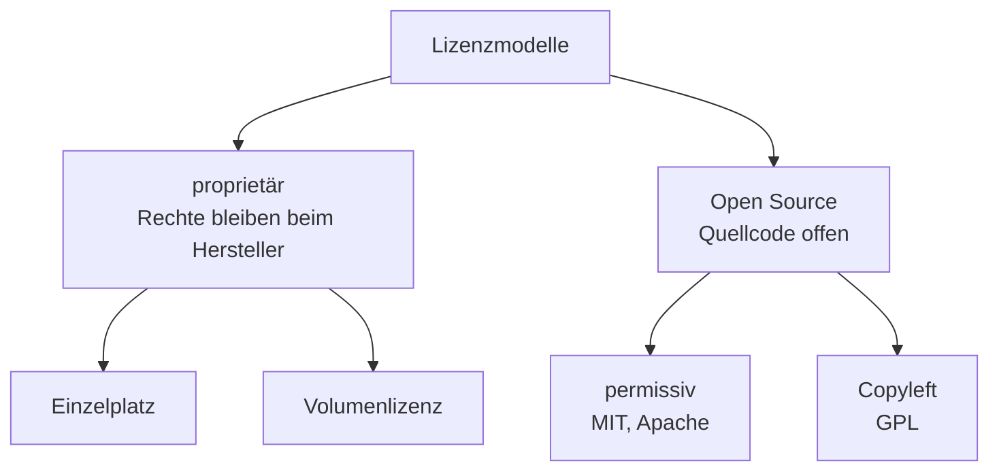
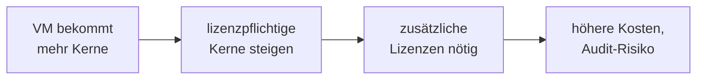
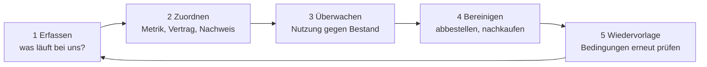

# Lizenzmodelle

<span class='badge badge-vertiefung'>Vertiefung</span> &nbsp; Software gehört dir selten – du darfst sie nur unter bestimmten Bedingungen nutzen. Welche das sind, regelt die Lizenz.

Hier lernst du, die gängigen Lizenzmodelle sicher auseinanderzuhalten und für ein Vorhaben die passende – und über die Jahre bezahlbare – Variante auszuwählen.

---

## Gekauft ist hier fast nichts

Wenn im Einkauf „Wir haben die Software gekauft" steht, stimmt das fast nie wörtlich. Software ist ein geistiges Werk und als solches durch das **Urheberrecht** geschützt – die Rechte daran liegen beim Hersteller und bleiben auch dort. Was du erwirbst, ist ein **Nutzungsrecht**: die Erlaubnis, das Programm unter bestimmten Bedingungen einzusetzen.

Diese Bedingungen stehen in der **Lizenz** – dem Vertragstext, den beim Installieren fast jeder ungelesen wegklickt. Genau dort ist geregelt, was du darfst (installieren, nutzen, manchmal weitergeben) und was nicht (kopieren, verändern, auf mehr Rechnern betreiben als vereinbart). Wer eine Infrastruktur plant, plant deshalb immer beides mit: die Technik **und** die Rechte, sie zu betreiben.

!!! note "Warum das in die Planung gehört"
    Eine Lizenz, die nicht zur geplanten Nutzung passt, ist kein Papierproblem. Sie entscheidet mit darüber, ob dein Sollkonzept überhaupt zulässig umsetzbar ist – und was es über die Jahre wirklich kostet. Deshalb steht diese Seite am Ende des Planungs-Blocks und nicht irgendwo im Kleingedruckten.

---

## Lizenzarten unterscheiden



Das Diagramm zeigt die Grundfamilien. Quer dazu liegen zwei Fragen, die jede Lizenz zusätzlich beantwortet: **Was wird gezählt** (Gerät, Named User, Concurrent User) und **wird gekauft oder abonniert**? Beide nehmen wir uns jetzt der Reihe nach vor.

### Proprietär: vom Einzelplatz zur Volumenlizenz

Bei **proprietären Lizenzen** behält der Hersteller alle Rechte am Code – du bekommst nur das fertige Programm samt Nutzungserlaubnis. Die kleinste Form ist die **Einzelplatzlizenz**: ein Erwerb, eine Installation. Für zehn Arbeitsplätze zehnmal einzeln zu kaufen wird schnell unhandlich, deshalb gibt es die **Volumenlizenz**: ein Vertrag deckt eine größere Stückzahl ab, meist mit Mengenrabatt und zentraler Verwaltung über einen einzigen Lizenzschlüssel.

### Zählweisen: wonach wird eigentlich abgerechnet?

Sobald mehr als ein Mensch an mehr als einem Gerät arbeitet, wird die spannendste Frage: **Was genau wird gezählt?**

| Zählweise | Es zählt ... | Typisch für | Stolperstein |
|---|---|---|---|
| **pro Gerät** | jede Installation bzw. jedes Gerät | Betriebssysteme, Arbeitsplatz-Software | Zweitgerät oder Home-Office-Rechner zählt mit |
| **Named User** | jede benannte Person – egal auf wie vielen Geräten | personengebundene Konten, viele Cloud-Dienste | Teilzeitkraft kostet so viel wie Vollzeitkraft |
| **Concurrent User** | die **gleichzeitig** aktiven Nutzer | Fachanwendungen mit Schichtbetrieb | Lizenzserver nötig, der die Gleichzeitigkeit zählt |
| **pro Prozessorkern** | die Kerne der Maschine, auf der die Software läuft | Datenbanken, Server- und Virtualisierungssoftware | eine größere VM kostet Lizenzgebühren, ohne dass jemand etwas einkauft |

Ein kurzes Rechenbeispiel, wann **Concurrent User** günstiger ist: Eine Fachanwendung wird von 60 Beschäftigten genutzt – aber im Zwei-Schicht-Betrieb, sodass nie mehr als 25 gleichzeitig angemeldet sind. Als Named-User-Modell brauchst du 60 Lizenzen. Als Concurrent-Modell reichen 25 – selbst wenn die einzelne Concurrent-Lizenz das Doppelte kostet, sparst du. Umgekehrt gilt: Sitzen alle 60 gleichzeitig davor, bringt Concurrent nichts. Die Zählweise passt also nie „an sich", sondern immer nur **zum Nutzungsmuster**.

Die vierte Zeile ist die unauffälligste – und die, die in der Praxis am häufigsten überrascht. Bei einer **kernbasierten Metrik** hängt die Lizenzmenge nicht an Menschen, sondern an Hardware. Wer eine VM großzügiger ausstattet, weil die Datenbank träge geworden ist, löst damit eine Kette aus, die in keinem Ticket steht:



Zu jeder Änderung an einer Maschine gehört deshalb die Frage, ob darauf etwas kernbasiert lizenziert läuft. Das ist kein juristisches Detail, sondern eine gewöhnliche Betriebsfrage. Sie fällt nur meist erst beim Audit auf – dann allerdings rückwirkend.

### Kaufen oder abonnieren?

| | **Kauflizenz** (perpetual) | **Subscription** (Abo) |
|---|---|---|
| Nutzungsrecht | zeitlich unbegrenzt | nur solange du zahlst |
| Kosten | hoch am Anfang, danach meist Wartungsgebühr | planbare laufende Rate |
| Updates | oft nur gegen Wartungsvertrag | in der Rate enthalten |
| Ende der Zahlung | Software läuft weiter (auf altem Stand) | Zugriff endet |
| Bilanzsicht | Investition (einmalig) | Betriebskosten (laufend) |

Die **Kauflizenz** – oft *perpetual* genannt – erwirbst du einmal und darfst sie unbegrenzt nutzen. Die **Subscription** mietest du: kleinere, planbare Raten, Updates inklusive, aber wenn du aufhörst zu zahlen, ist der Zugriff weg. Welche Variante über die Jahre günstiger ist, ist eine Rechenaufgabe – die machen wir weiter unten konkret.

### Neuere Modelle: Verbrauch, Credits und Hybrid

Kauf und Abo sind die beiden Klassiker. Daneben haben sich Modelle etabliert, die dir in aktuellen Angeboten immer öfter begegnen:

| Modell | Abgerechnet wird ... | Wo du es triffst |
|---|---|---|
| **nutzungsbasiert** | der tatsächliche Verbrauch: Rechenzeit, Transaktionen, verarbeitete Datenmenge | Cloud-Dienste, Schnittstellen |
| **Credits** | ein vorab gekauftes Guthaben, das die Nutzung abbaut | Cloud-Kontingente, KI-Dienste |
| **hybrid** | eine Lizenz, die sowohl im eigenen Haus als auch beim Cloud-Anbieter gilt | Server- und Datenbankprodukte |
| **parallele Nutzung** | die Zahl gleichzeitiger Sitzungen oder Verbindungen | Fernwartung, Terminaldienste |

Zwei Eigenschaften machen diese Modelle in der Planung unangenehm. Erstens **schwanken die Kosten**: Ein Verbrauchsmodell hat keinen Preis, den du in eine Fünf-Jahres-Tabelle schreiben kannst, sondern nur eine Schätzung mit Spanne. Zweitens **verfallen Credits** häufig nach einer Frist – nicht verbrauchtes Guthaben ist dann bezahltes Nichts, also Überlizenzierung in neuer Verpackung. Wer so etwas einkauft, braucht dieselbe laufende Verbrauchsmessung wie bei jeder anderen Cloud-Position von der Seite [Ressourcen planen](ressourcen-planen.md).

### Open Source: frei heißt nicht pflichtenfrei

**Open Source** bedeutet: Der Quellcode ist offen, du darfst die Software nutzen, verändern und weitergeben – meist ohne Lizenzgebühr. Was es **nicht** bedeutet: dass keine Bedingungen gelten. Auch eine Open-Source-Lizenz ist eine Lizenz.

Grob gibt es zwei Familien. **Permissive Lizenzen** wie MIT, BSD oder Apache verlangen im Kern nur, dass du den Urhebervermerk erhältst – du darfst den Code sogar in eigene, geschlossene Produkte einbauen. **Copyleft**-Lizenzen wie die GPL gehen weiter: Wer die Software verändert weitergibt, muss die Änderungen unter derselben Lizenz wieder offenlegen. Für den reinen **Einsatz** im Betrieb ist das selten ein Problem – relevant wird es, sobald eine Firma Open-Source-Code in eigene Produkte einbaut und diese vertreibt.

Damit die beiden Familien nicht abstrakt bleiben: Der Linux-Kernel und WordPress stehen unter GPL, React unter MIT, Android unter Apache 2.0 – alle vier laufen in unzähligen Betrieben, meist ohne dass es jemand als Lizenzfrage wahrnimmt. Eine ausführliche Übersicht mit weiteren Namen findest du [weiter unten](#bekannte-software-und-ihre-lizenzmodelle).

**Drei Pflichten** decken fast alles ab, was Open-Source-Lizenzen von dir verlangen:

| Pflicht | Was sie bedeutet | Wer sie typischerweise trifft |
|---|---|---|
| **Hinweis- und Copyright-Pflicht** | Lizenztext und Urhebervermerk müssen erhalten bleiben und mitgeliefert werden | jeden, der Software weitergibt – auch bei MIT und Apache |
| **Quellcode-Veröffentlichung** | der Empfänger bekommt Zugang zum Quellcode, inklusive der eigenen Änderungen | Copyleft, sobald weitergegeben wird |
| **Lizenzbindung** | Änderungen dürfen nur unter derselben Lizenz weitergegeben werden | Copyleft, deshalb der Name |

Bei der **AGPL** kommt eine Besonderheit dazu, die man leicht übersieht: Dort gilt schon das **Bereitstellen über ein Netzwerk** als Weitergabe. Wer eine AGPL-Software als Dienst für Dritte betreibt, kann die Offenlegungspflicht auslösen, ohne je eine Datei herausgegeben zu haben. Für den rein internen Einsatz ändert das nichts – für ein eigenes Produkt sehr wohl.

Bleibt die Frage, warum sich überhaupt jemand für die eine oder andere Seite entscheidet:

| | **Copyright / proprietär** | **Copyleft** |
|---|---|---|
| Ziel | mit der Software Geld verdienen | die Software dauerhaft frei halten |
| Motiv | Kontrolle über Weiterentwicklung und Vertrieb behalten | Verbesserungen fließen an die Allgemeinheit zurück |
| Quellcode | bleibt geheim | bleibt offen, auch in allen Ableitungen |
| Typische Beispiele | Microsoft Windows, Adobe-Produkte, AutoCAD | Linux-Kernel, WordPress |

!!! note "Offene Gewichte sind nicht automatisch Open Source"
    Bei KI-Modellen lohnt der zweite Blick besonders. Manche offenen Modelle stehen tatsächlich unter Apache 2.0 – dann gelten die Regeln aus der Tabelle oben. Andere kommen mit einer herstellereigenen **Community License**, die zwar den Download erlaubt, aber Nutzungsbeschränkungen enthält: bestimmte Einsatzzwecke ausgeschlossen, ab einer bestimmten Unternehmensgröße gesonderte Vereinbarung nötig, Weiterverwendung der Ausgaben eingeschränkt. „Frei herunterladbar" und „frei verwendbar" sind zwei verschiedene Aussagen – und nur eine davon steht in der Lizenz.

### Freemium: gratis mit Sternchen

Viele Hersteller fahren zweigleisig: eine kostenlose **Community-Ausgabe** für den Einstieg, daneben eine kostenpflichtige **Enterprise-Ausgabe** mit Support, Zusatzfunktionen oder Betriebsfreigaben. Das Modell heißt **Freemium** – und sein Kleingedrucktes ändert sich gern.

!!! warning "Kurs-Anker: Docker Desktop"
    Docker Desktop – das Werkzeug aus dem Container-Block – ist gratis für Privatpersonen, Open-Source-Projekte und kleine Firmen. Ab einer bestimmten Unternehmensgröße (gemessen an Beschäftigten und Umsatz) ist ein kostenpflichtiges Abo Pflicht. Diese Grenze wurde nachträglich eingeführt: Wer das Werkzeug vorher kostenlos im Betrieb nutzte, musste nach einer Übergangsfrist ein Abo abschließen.

    Die Lehre daraus: **Lizenzbedingungen sind nicht statisch.** Was heute gratis ist, kann morgen abopflichtig sein – Lizenzen gehören deshalb regelmäßig auf Wiedervorlage, nicht einmalig in einen Ordner.

Noch eine Verschiebung, die du kennen solltest: **Cloud-Dienste** stecken die Lizenz oft direkt in den Nutzungspreis. Du zahlst pro Stunde, pro Instanz oder pro Verbrauch – die Softwarelizenz ist eingepreist. Damit wandern Lizenzkosten aus der Investitionsplanung in die laufende, nutzungsbasierte Abrechnung, die du von der Seite [Ressourcen planen](ressourcen-planen.md) kennst.

### Wenn sich die Lizenz unter dir ändert

Docker Desktop ist kein Einzelfall, sondern ein Muster. In den letzten Jahren haben mehrere weit verbreitete Produkte ihre Lizenz geändert – jedes Mal mit derselben Wirkung: Der Betrieb hatte etwas eingeplant, das es so nicht mehr gab.

| Produkt | Was sich geändert hat | Was das für Betriebe bedeutete |
|---|---|---|
| **VMware** (nach der Broadcom-Übernahme) | Kauflizenzen abgelöst durch Abos, Abrechnung nach Prozessorkernen mit Mindestmengen | teils deutlich höhere Kosten bei unveränderter Technik – Anlass für viele Virtualisierungs-Wechsel |
| **Terraform** | 2023 von einer Open-Source-Lizenz auf die Business Source License gewechselt | kommerzielle Weiterverwendung eingeschränkt; die Gemeinschaft hat das Projekt als OpenTofu abgespalten |
| **Grafana** | 2021 von Apache 2.0 auf AGPLv3 | aus einer permissiven wurde eine stark copyleft-gebundene Lizenz |
| **Redis** | 2024 weg von der bisherigen Open-Source-Lizenz | Abspaltung als Valkey, Betriebe mussten sich für eine Seite entscheiden |
| **Red Hat Enterprise Linux** | Quellcode-Zugang seit 2023 an einen Vertrag gebunden | die kostenlosen Nachbauten mussten ihren Weg neu suchen |

Das Muster dahinter ist immer dasselbe: Ein Produkt wächst kostenlos oder günstig in die Betriebe hinein, wird dort unverzichtbar – und **danach** ändern sich die Bedingungen. Das ist kein Vorwurf, sondern ein Geschäftsmodell, das man kennen sollte, bevor man sich darauf einlässt.

!!! warning "Die Frage, die daraus folgt"
    Für jedes Werkzeug, das heute kostenlos oder auffällig günstig läuft, gehört eine Zahl in die Planung: **Was würde es kosten, wenn das morgen kostenpflichtig wäre – und was würde ein Wechsel kosten?** Wer beide Zahlen kennt, verhandelt bei der nächsten Ankündigung aus einer anderen Position. Wer sie nicht kennt, zahlt, was aufgerufen wird.

---

## Bekannte Software und ihre Lizenzmodelle

Die Modelle der letzten Abschnitte sind leichter zu behalten, wenn Namen daran hängen. Die folgende Übersicht ordnet jedem Typ Software zu, die dir im Betrieb tatsächlich begegnet.

### Proprietär

| Modell | Bekannte Beispiele | Woran du es erkennst |
|---|---|---|
| **Kauflizenz, pro Gerät** | Windows 11 Pro (OEM), Microsoft Office LTSC | einmaliger Preis, gebunden an einen Rechner, kein Ablaufdatum |
| **Abo pro Named User** | Microsoft 365, Adobe Creative Cloud, Autodesk AutoCAD, Atlassian Jira | monatliche oder jährliche Rate je benanntem Konto, Updates inklusive |
| **Concurrent / parallele Sitzungen** | TeamViewer (Kanäle), viele CAD- und Simulationsprogramme mit Floating License | ein Lizenzserver im Netz, „belegt/frei" statt fester Zuordnung |
| **pro Prozessorkern** | Microsoft SQL Server, Oracle Database, Windows Server, VMware vSphere | der Preis hängt an der Hardware, nicht an Menschen; oft mit Mindestkernzahl |
| **Freemium / Open Core** | Docker Desktop, GitLab, Proxmox VE, Grafana, Zoom, Slack | eine kostenlose Ausgabe daneben eine Enterprise-Ausgabe mit Support |
| **SaaS, im Preis enthalten** | Google Workspace, Salesforce, Microsoft 365 | du zahlst Nutzung, die Lizenz taucht als eigener Posten gar nicht auf |
| **verbrauchsbasiert / Credits** | Cloud-VMs mit Windows-Abbild, KI-Schnittstellen mit Token-Abrechnung | Rechnung nach Stunden, Anfragen oder aufgebrauchtem Guthaben |

### Open Source und verwandte Modelle

| Familie | Bekannte Beispiele | Kernpflicht |
|---|---|---|
| **permissiv** (MIT, BSD, Apache 2.0) | React, Node.js, Kubernetes, nginx, PostgreSQL, Android (AOSP), Mistral-Modelle | Urhebervermerk und Lizenztext erhalten – sonst freie Hand, auch in geschlossenen Produkten |
| **schwaches Copyleft** (MPL, LGPL) | Firefox, LibreOffice | veränderte Dateien der Komponente offenlegen; das umgebende Produkt darf geschlossen bleiben |
| **starkes Copyleft** (GPL) | Linux-Kernel, WordPress, GIMP | bei Weitergabe: Quellcode der Änderungen unter derselben Lizenz |
| **Netzwerk-Copyleft** (AGPL) | Nextcloud, Grafana (seit 2021) | schon der Betrieb als Dienst für Dritte kann die Offenlegung auslösen |
| **Source Available** (BUSL, SSPL, RSAL) | Terraform, MongoDB, Redis | Quellcode einsehbar, aber **kein** Open Source: kommerzielle Nutzung ist eingeschränkt |
| **Community License** (herstellereigen) | Llama-Modelle | frei herunterladbar, aber mit Nutzungsbeschränkungen und Schwellen für große Anbieter |

!!! warning "Zwei Fallen in dieser Tabelle"
    **„Quellcode offen" heißt nicht „Open Source".** Die vorletzte Zeile ist der Grund, warum dieser Unterschied wichtig ist: Bei Terraform, MongoDB oder Redis kannst du den Code lesen – kommerziell weiterverwenden darfst du ihn trotzdem nur eingeschränkt. Diese Lizenzen sind bewusst so gebaut, dass Cloud-Anbieter das Produkt nicht als eigenen Dienst verkaufen können. Für den normalen Einsatz im Betrieb ist das meist unproblematisch, für ein eigenes Produkt selten.

    **Quelltext und ausgelieferte Datei können verschiedene Lizenzen haben.** Bekanntestes Beispiel ist Visual Studio Code: Der Quellcode steht unter MIT, das fertige Installationspaket von Microsoft dagegen unter einer eigenen Microsoft-Lizenz mit Telemetrie und Marktplatz-Bedingungen. Wer wirklich nur MIT-Code will, nutzt einen der freien Nachbauten. Die Frage „unter welcher Lizenz steht das?" hat also zwei Antworten – man muss dazusagen, welche Datei gemeint ist.

---

## Der Lizenz-Turm: wo Pflichten heute wirklich entstehen

Bis hierhin klang eine Lizenz nach etwas, das man einkauft. In modernen Systemen entsteht der weit größere Teil der Lizenzpflichten aber gar nicht im Einkauf, sondern beim Bauen und Betreiben. Denn keine Anwendung steht mehr allein: Sie sitzt auf einem Stapel fremder Software – und **jede Schicht bringt ihre eigene Lizenz mit**.

<figure>
<svg viewBox="0 0 720 350" width="100%" height="350" role="img" aria-label="Ein Turm aus fünf gestapelten Ebenen: unten die Cloud-Plattform als breitestes Fundament, darüber Betriebssystem und Basis-Image, darüber Frameworks, darüber Bibliotheken und Pakete, ganz oben der eigene Code. Jede Ebene trägt die darüberliegende und bringt eine eigene Lizenz mit.">
  <!-- Traegt-Pfeil links -->
  <line x1="54" y1="318" x2="54" y2="54" stroke="var(--md-typeset-a-color, #56c374)" stroke-width="2"/>
  <polygon points="54,42 48,56 60,56" fill="var(--md-typeset-a-color, #56c374)"/>
  <text transform="rotate(-90 32 186)" x="32" y="186" text-anchor="middle" fill="var(--md-typeset-a-color, #56c374)" font-family="system-ui, sans-serif" font-size="12">trägt die Ebene darüber</text>

  <!-- Ebene 5: Eigener Code -->
  <rect x="175" y="44" width="230" height="52" rx="5" fill="rgba(125,255,154,0.07)" stroke="var(--md-typeset-a-color, #56c374)" stroke-width="2"/>
  <text x="290" y="76" text-anchor="middle" font-family="system-ui, sans-serif" font-size="14"><tspan fill="var(--md-typeset-a-color, #56c374)" font-weight="700">5</tspan><tspan fill="currentColor" dx="10">Eigener Code</tspan></text>
  <text x="425" y="76" fill="var(--md-default-fg-color--light, #8fa498)" font-family="system-ui, sans-serif" font-size="12">eigene Lizenz – passt sie nach unten?</text>

  <!-- Ebene 4: Bibliotheken -->
  <rect x="155" y="100" width="270" height="52" rx="5" fill="rgba(125,255,154,0.09)" stroke="var(--md-typeset-a-color, #56c374)" stroke-width="2"/>
  <text x="290" y="132" text-anchor="middle" font-family="system-ui, sans-serif" font-size="14"><tspan fill="var(--md-typeset-a-color, #56c374)" font-weight="700">4</tspan><tspan fill="currentColor" dx="10">Bibliotheken &amp; Pakete</tspan></text>
  <text x="445" y="132" fill="var(--md-default-fg-color--light, #8fa498)" font-family="system-ui, sans-serif" font-size="12">hunderte Lizenzen auf einmal</text>

  <!-- Ebene 3: Frameworks -->
  <rect x="135" y="156" width="310" height="52" rx="5" fill="rgba(125,255,154,0.11)" stroke="var(--md-typeset-a-color, #56c374)" stroke-width="2"/>
  <text x="290" y="188" text-anchor="middle" font-family="system-ui, sans-serif" font-size="14"><tspan fill="var(--md-typeset-a-color, #56c374)" font-weight="700">3</tspan><tspan fill="currentColor" dx="10">Frameworks</tspan></text>
  <text x="465" y="188" fill="var(--md-default-fg-color--light, #8fa498)" font-family="system-ui, sans-serif" font-size="12">Lizenz kann wechseln</text>

  <!-- Ebene 2: Betriebssystem -->
  <rect x="115" y="212" width="350" height="52" rx="5" fill="rgba(125,255,154,0.13)" stroke="var(--md-typeset-a-color, #56c374)" stroke-width="2"/>
  <text x="290" y="244" text-anchor="middle" font-family="system-ui, sans-serif" font-size="14"><tspan fill="var(--md-typeset-a-color, #56c374)" font-weight="700">2</tspan><tspan fill="currentColor" dx="10">Betriebssystem / Basis-Image</tspan></text>
  <text x="485" y="244" fill="var(--md-default-fg-color--light, #8fa498)" font-family="system-ui, sans-serif" font-size="12">lizenzpflichtig?</text>

  <!-- Ebene 1: Cloud-Plattform -->
  <rect x="95" y="268" width="390" height="52" rx="5" fill="rgba(125,255,154,0.16)" stroke="var(--md-typeset-a-color, #56c374)" stroke-width="2"/>
  <text x="290" y="300" text-anchor="middle" font-family="system-ui, sans-serif" font-size="14"><tspan fill="var(--md-typeset-a-color, #56c374)" font-weight="700">1</tspan><tspan fill="currentColor" dx="10">Cloud-Plattform</tspan></text>
  <text x="505" y="300" fill="var(--md-default-fg-color--light, #8fa498)" font-family="system-ui, sans-serif" font-size="12">eingepreist?</text>

  <!-- Fundamentplatte -->
  <rect x="80" y="324" width="420" height="12" rx="3" fill="rgba(86,195,116,0.30)" stroke="var(--md-typeset-a-color, #56c374)" stroke-width="1"/>
</svg>
<figcaption>Der Stapel, auf dem eine moderne Anwendung steht: Jede Ebene trägt die darüberliegende – und bringt ihre eigene Lizenz mit, die sie jederzeit ändern kann.</figcaption>
</figure>

Von unten nach oben gebaut: Die Cloud-Plattform trägt das Betriebssystem, darauf sitzt das Framework, darauf die Bibliotheken, ganz oben der eigene Code. Jede Ebene hält die darüberliegende – und für jede gilt dasselbe: Sie hat eine eigene Lizenz, sie kann jederzeit aktualisiert werden, sie kann kompromittiert werden. Und sie kann ihre Lizenzbedingungen ändern, ohne dass oben jemand gefragt wird.

| Ebene | Die Lizenzfrage | Das Risiko daneben |
|---|---|---|
| **1 Cloud-Plattform** | Sind die genutzten Dienste im Preis lizenziert? Dürfen eigene Lizenzen hier laufen? | Wo genau liegen die Daten? Welche Zusagen gelten? |
| **2 Betriebssystem / Basis-Image** | Ist das Server-Betriebssystem korrekt lizenziert – auch in der VM, auch im Image? | veraltete Images ohne Update-Zyklus, offene Schwachstellen |
| **3 Framework** | Welche Lizenz hat das Framework – und hat sie sich zuletzt geändert? | Abhängigkeit vom Hersteller, Schwachstellen im Framework |
| **4 Bibliotheken & Pakete** | Welche Lizenzen stecken in den Abhängigkeiten der Abhängigkeiten? | Angriffe über die Lieferkette, etwa manipulierte Pakete in öffentlichen Registern |
| **5 Eigener Code** | Unter welcher Lizenz steht er selbst – und verträgt sie sich mit allem darunter? | Zugangsdaten im Klartext, fest verdrahtete Geheimnisse |

Ebene 4 ist die unübersichtlichste. Ein einziges installiertes Paket zieht Dutzende weitere nach sich, jedes mit einer eigenen Lizenz. Niemand liest das im Vorbeigehen – und genau darin liegt das Problem.

!!! danger "Lizenzverstöße entstehen heute systemisch, nicht aus böser Absicht"
    Der übliche Ablauf sieht so aus: Jemand installiert ein Paket, weil es die Aufgabe löst. Die Lizenz liest niemand. Die Prüfung auf Compliance kommt – wenn überhaupt – Monate später. Bis dahin ist das Risiko unsichtbar, weil alles funktioniert.

    Daraus folgt eine unbequeme Einsicht: Man kann Lizenz-Compliance in so einem Stapel nicht mehr durch Sorgfalt einzelner Personen herstellen. Es braucht **Werkzeuge und einen Prozess**. Lizenz-Scanner lesen die Abhängigkeiten eines Projekts aus und melden, welche Lizenzen darin stecken; eine **SBOM** – die maschinenlesbare Stückliste aller Komponenten – hält das Ergebnis fest und ist zugleich die Grundlage, um bei der nächsten Schwachstelle in Minuten zu beantworten, ob man betroffen ist.

---

## Erfassung & Compliance: wissen, was man hat

Lizenzmanagement beginnt mit einer unbequemen Frage: **Welche Software läuft bei uns eigentlich – und für wie viel davon haben wir gültige Lizenzen?** Wer das nicht beantworten kann, hat ein Problem, es weiß nur noch niemand.

Deshalb gehört der Lizenzbestand **inventarisiert**: Welche Software, welche Version, wie viele Lizenzen, welche Zählweise, welche Laufzeit, welcher Nachweis. Der natürliche Ort dafür ist die **CMDB** aus [Anforderungen & Sollkonzept](anforderungen-und-sollkonzept.md) – Lizenzen sind Configuration Items wie Server und Switches auch, nur eben aus Papier.

Zwei Schieflagen können dabei auffliegen:

| | **Unterlizenzierung** | **Überlizenzierung** |
|---|---|---|
| Zustand | mehr Nutzung als Lizenzen | mehr Lizenzen als Nutzung |
| Charakter | rechtliches Risiko | totes Kapital |
| Typische Folge | Nachzahlung, oft plus Strafaufschlag; im Ernstfall Schadensersatz | Budget gebunden, das anderswo fehlt |
| Wie es auffliegt | Hersteller-Audit | interne Kostenkontrolle – oder nie |

**Hersteller-Audits** sind dabei kein theoretisches Schreckgespenst, sondern ein realer, vertraglich vereinbarter Vorgang: Große Hersteller lassen sich in ihren Verträgen das Recht einräumen, die Lizenznutzung beim Kunden zu prüfen. Dann kommt ein Prüfer, gleicht die Installationen mit den erworbenen Lizenzen ab – und jede Differenz wird zur Nachzahlung zu Listenpreisen. Ein sauberes Lizenzinventar ist an diesem Tag bares Geld wert.

Besonders regelmäßig prüfen die großen Anbieter von Unternehmenssoftware – **Microsoft, Oracle, SAP, IBM und Adobe** stehen in Erfahrungsberichten immer wieder ganz oben. Kommt eine Prüfung ins Haus, ist die erste sinnvolle Reaktion nicht, sofort alle Zahlen zu liefern, sondern sich Unterstützung zu holen: Spezialisierte Dienstleister für **Software Asset Management (SAM)** rechnen den eigenen Bestand vor dem Termin gegen und verhandeln die Auslegung von Metriken mit. Der Unterschied zwischen einer gut vorbereiteten und einer unvorbereiteten Prüfung ist regelmäßig ein fünf- bis sechsstelliger Betrag.

Über- und Unterlizenzierung entstehen dabei selten aus Nachlässigkeit, sondern aus ganz gewöhnlichem Betriebsalltag:

| Wie es entsteht | Was daraus wird |
|---|---|
| Beschäftigte verlassen das Haus, die Lizenz wird nie abbestellt | **Zombie-Lizenzen** – bezahlt, aber niemandem zugeordnet |
| Ein Werkzeug wird eingeführt, dann doch die Alternative genutzt | ein voll bezahlter Vertrag ohne einen einzigen Nutzer |
| Alte VMs bleiben nach einer Konsolidierung stehen | Lizenzen laufen auf Maschinen, die niemand mehr braucht |
| Das Unternehmen wächst schneller als die Verwaltung | mehr Nutzer als Lizenzen, ohne dass es jemand entscheidet |
| „Lieber zu viel als zu wenig" beim Einkauf | dauerhafte Überlizenzierung als Gewohnheit |

Auffällig ist die Richtung: Der einzige dieser Fälle, der rechtlich gefährlich wird, ist das Wachstum – alle anderen kosten „nur" Geld. Genau deshalb bleiben sie so lange liegen.

### Lizenzverwaltung als Prozess

Ein Lizenzbestand ist kein Dokument, das man einmal schreibt. Er ist ein Kreislauf, der an denselben Ereignissen hängt, an denen auch alles andere in der IT hängt:



Was diesen Kreislauf in Gang hält, sind **Auslöser**, keine Termine im Kalender:

- **Onboarding und Offboarding**: Wer kommt, braucht Lizenzen; wer geht, gibt sie zurück. Ein sauberer Offboarding-Prozess ist die wirksamste einzelne Maßnahme gegen Zombie-Lizenzen – und er kostet nichts außer einem Haken auf einer Checkliste.
- **Jede neue Maschine**: Läuft darauf etwas kernbasiert Lizenziertes? Dann ändert die Maschine den Lizenzbedarf.
- **Jede Vertragsverlängerung**: der natürliche Moment, ungenutzte Lizenzen abzubestellen. Danach ist die Gelegenheit für ein Jahr weg.
- **Jede Lizenzänderung beim Hersteller**: die Übergangsfrist ist die eigentliche Ressource – wer sie verstreichen lässt, hat keine Wahl mehr, sondern nur noch eine Rechnung.

Der Ort für das Ergebnis ist die CMDB. Und wichtig: **Auch kostenlose Werkzeuge gehören hinein.** Genau die fehlen in den meisten Inventaren, weil sie nie über den Einkauf gelaufen sind – und genau die sind es, deren Bedingungen sich ändern.

---

## Die passende Lizenz auswählen

### Kosten über die Nutzungsdauer rechnen

Der häufigste Fehler beim Vergleich: nur auf den ersten Preis schauen. Fair wird der Vergleich erst über die **gesamte Nutzungsdauer** – inklusive Wartung beim Kauf und aufsummierter Raten beim Abo.

```text
Ausgangslage: 50 Arbeitsplätze, geplante Nutzungsdauer 5 Jahre

Kauflizenz (perpetual)
  Anschaffung:   50 x 400 EUR                = 20.000 EUR  (einmalig)
  Wartung:       20 % vom Kaufpreis pro Jahr =  4.000 EUR  pro Jahr
                 (hier ab dem ersten Jahr gerechnet)

Subscription (Abo)
  Abo:           50 x 15 EUR pro Monat       =  9.000 EUR  pro Jahr

Kumulierte Kosten
            Jahr 1    Jahr 2    Jahr 3    Jahr 4    Jahr 5
  Kauf      24.000    28.000    32.000    36.000    40.000
  Abo        9.000    18.000    27.000    36.000    45.000
```

Im ersten Jahr wirkt das Abo unschlagbar: 9.000 statt 24.000 Euro. Nach vier Jahren stehen beide bei 36.000 Euro – ab dem fünften Jahr ist der Kauf günstiger. Der Punkt, an dem sich die beiden Kostenkurven schneiden, heißt **Break-even**: Ab dort kippt der Vergleich zugunsten der anderen Variante. Ob sich das Abo trotzdem lohnt, hängt von der Frage ab, wie sicher die fünf Jahre wirklich sind: Wer in zwei Jahren ohnehin auf ein anderes Produkt wechseln will, fährt mit dem Abo besser. Wer zehn Jahre plant, zahlt beim Abo am Ende die Hälfte mehr – 90.000 statt 60.000 Euro.

### Nutzwertanalyse: wenn Geld nicht das einzige Kriterium ist

Kosten sind selten das einzige, was zählt – Support, Funktionsumfang oder der Datenstandort wiegen je nach Vorhaben unterschiedlich schwer. Genau dafür gibt es die **Nutzwertanalyse**: Du legst **Kriterien** fest, gibst jedem eine **Gewichtung** (zusammen 100 %), vergibst pro Alternative eine **Punktzahl** – und die gewichtete Summe macht die Alternativen vergleichbar.

| Kriterium | Gewichtung | Produkt A (Kauf) | Produkt B (Abo) |
|---|---|---|---|
| Kosten über 5 Jahre | 35 % | 8 | 6 |
| Service & Support | 25 % | 5 | 9 |
| Funktionsumfang | 25 % | 7 | 7 |
| Datenstandort | 15 % | 9 | 5 |
| **gewichtete Summe** | 100 % | **7,15** | **6,85** |

Punktskala hier 1 bis 10. Der Wert der Methode liegt weniger im Endergebnis als im Weg dorthin: Sie zwingt dich, Kriterien und Gewichte **vor** der Entscheidung offenzulegen – dann streitet das Team über Gewichtungen statt über Bauchgefühle. Die Methode funktioniert übrigens für jede Auswahlentscheidung, nicht nur für Lizenzen.

### Service & Support als hartes Kriterium

**Service & Support** klingt nach weichem Faktor, ist aber messbar – und gehört deshalb ausdrücklich in den Vergleich:

- **Supportzeitraum**: Wie lange liefert der Hersteller garantiert Updates und Sicherheitskorrekturen? Eine Software, deren Support in zwei Jahren endet, ist keine Fünf-Jahres-Basis.
- **Updatezusagen**: Sind Funktions-Updates enthalten oder kostet die nächste Hauptversion extra?
- **Reaktionszeiten**: Wie schnell antwortet der Support bei einer Störung – und steht das verbindlich im Vertrag oder nur auf der Webseite?

!!! tip "Die eine Frage, die alles bündelt"
    Lizenzen sind selten nur eine Preisfrage. Ein günstiges Abo kann über Jahre teurer werden als ein Einmalkauf – und „kostenlos" heißt bei Open Source nicht „ohne Pflichten". Die richtige Frage lautet deshalb: **Was kostet die Software über ihre gesamte Nutzungsdauer – inklusive Support – und welche Bedingungen muss ich dabei einhalten?** Wer beide Hälften dieser Frage beantwortet hat, hat die Lizenzentscheidung im Griff.

---

## Rechtliche Aspekte im Überblick

Zum Abschluss die Punkte, die du in jedem Lizenzvertrag prüfen solltest – hier als Überblick, die Vertragstiefe folgt an anderer Stelle:

- **Laufzeit**: Wann beginnt, wann endet das Nutzungsrecht – und verlängert es sich automatisch?
- **Metrik**: Was genau wird gezählt – Geräte, Named User, Concurrent User, Prozessorkerne? Passt die Metrik zum eigenen Nutzungsmuster?
- **Regionale Gültigkeit**: Gilt die Lizenz weltweit oder nur für bestimmte Länder bzw. Standorte? Relevant, sobald Niederlassungen oder Cloud-Regionen ins Spiel kommen.
- **Weitergabe & Übertragbarkeit**: Darf die Lizenz auf ein anderes Gerät, eine andere Person oder – etwa bei einer Firmenübernahme – ein anderes Unternehmen übergehen?
- **Ausstieg & Datenexport**: In welchem Format und in welcher Frist bekommst du deine Daten heraus, wenn der Vertrag endet? Ohne diese Klausel wird der Anbieterwechsel praktisch unmöglich – die Abhängigkeit dahinter heißt **Vendor Lock-in**.
- **Audit-Klauseln**: Welche Prüfrechte hat der Hersteller, mit welcher Ankündigungsfrist und in welchem Umfang?
- **Änderungsvorbehalt**: Darf der Hersteller Metrik, Preis oder Bedingungen während der Laufzeit ändern – und was passiert dann? Genau hier entscheidet sich, ob eine Umstellung von „pro Nutzer" auf „pro Kern" dich mitten im Vertrag trifft oder erst zur Verlängerung.

!!! note "Lizenzbedingungen sind auch ein Machtinstrument"
    Wie eine Lizenz gestaltet ist, entscheidet nicht nur über Kosten, sondern über Wettbewerb. Ein bekanntes Beispiel: In Großbritannien wurde eine Sammelklage in Milliardenhöhe gegen Microsoft eingereicht. Der Vorwurf lautet, dass Server-Lizenzen in der hauseigenen Cloud deutlich günstiger sind als bei konkurrierenden Anbietern – wer wechseln will, zahlt für dieselbe Software mehr.

    Für dich in der Planung heißt das: Der Preis einer Lizenz kann davon abhängen, **wo** du sie betreibst. Diese Frage gehört in jeden Cloud-Vergleich, sonst rechnest du zwei Angebote gegeneinander, deren Lizenzkosten gar nicht dieselbe Basis haben.

---

!!! quote "Mitnehmen"
    1. **Du kaufst ein Nutzungsrecht, keine Software.** Das Urheberrecht bleibt beim Hersteller – die Lizenz regelt, was du darfst. Auch Open Source ist eine Lizenz mit Bedingungen, nicht ein rechtsfreier Raum.
    2. **Zählweise und Bezahlmodell müssen zum Nutzungsmuster passen.** Concurrent schlägt Named User im Schichtbetrieb, das Abo schlägt den Kauf bei kurzer Nutzungsdauer – umgekehrt jeweils genauso. Gerechnet wird immer über die gesamte Nutzungsdauer.
    3. **Ohne Inventar keine Compliance.** Unterlizenzierung ist ein rechtliches Risiko mit Nachzahlung beim Audit, Überlizenzierung ist totes Kapital – beides findest du nur, wenn der Lizenzbestand sauber erfasst ist.
    4. **Der größte Teil deiner Lizenzpflichten wird nicht eingekauft, sondern installiert.** In einem Stapel aus Cloud, Betriebssystem, Framework und Bibliotheken hängt an jeder Schicht eine eigene Lizenz. Dagegen hilft kein guter Wille, sondern nur ein Prozess mit Werkzeugen.
    5. **Lizenzbedingungen ändern sich.** Docker Desktop, VMware, Terraform, Grafana, Redis – für jedes kostenlose oder günstige Werkzeug im Haus gehört die Frage in die Planung, was es kosten würde, wenn das morgen anders wäre.

---

!!! example "Jetzt üben"
    Zu dieser Seite gibt es einen eigenen Aufgabensatz: **[Übungen: Lizenzmodelle](uebungen-lizenzmodelle.md)** – neunzehn Aufgaben, jede mit ausführlicher Musterlösung. Die ersten fünfzehn reichen von der günstigsten Zählweise über den Break-even zwischen Kauf und Abo bis zu Staffelpreisen, kernbasierter Lizenzierung, Open-Source-Pflichten, Nutzwertanalyse, den Lücken in einem Vertragsangebot, dem Lizenz-Turm, dem Aufbau eines Lizenzinventars und einer **Recherche**, in der ihr zu jedem Lizenztyp eigene Beispiele sucht. Die letzten vier sind **Artikelaufgaben** an echten Fachbeiträgen und Nachrichten.

---

!!! tip "Verbindung zu Recht & Organisation"
    Lizenzen sind Verträge – und Verträge haben mehr Stellschrauben als Laufzeit und Metrik. Haftung, Gewährleistung, Kündigungsfristen und die Vertragsarten dahinter vertieft die Seite [IT-Verträge](../recht-organisation/it-vertraege.md). Der Lizenz-Turm wiederum ist ein Risiko-Thema: Wie man solche Abhängigkeiten systematisch bewertet und steuert, gehört zum [Risikomanagement](../it-sicherheit/risikomanagement.md). Wie die Lizenzkosten in die Gesamtplanung einfließen, hast du auf [Ressourcen planen](ressourcen-planen.md) gesehen – damit ist der Bogen dieses Blocks geschlossen: vom Bedarf über die Architektur bis zu den Rechten, das Ganze zu betreiben.