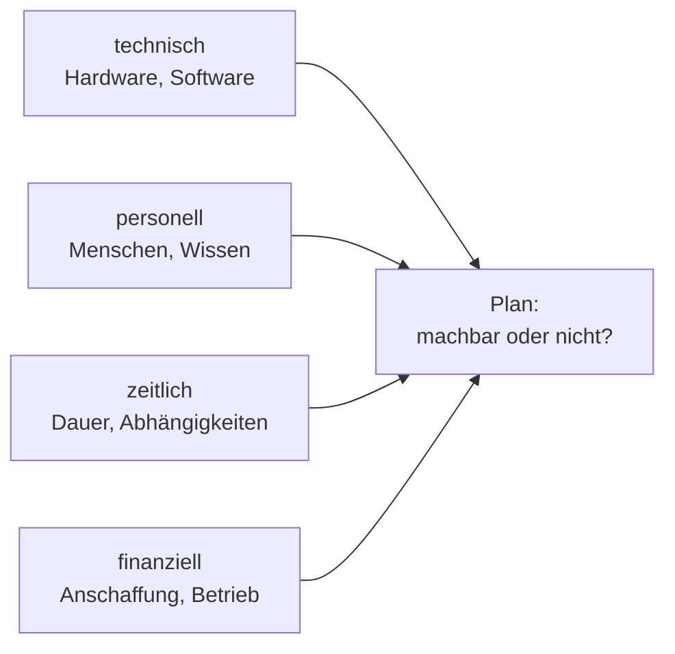

# Ressourcen planen

<span class='badge badge-vertiefung'>Vertiefung</span> &nbsp; Der beste Plan scheitert, wenn Zeit, Geld oder Leute fehlen – Ressourcenplanung sorgt dafür, dass du das vorher merkst, nicht mittendrin.

Auf den letzten Seiten hast du geklärt, **was** gebraucht wird (Anforderungen), **wie** es aussehen soll (Architektur) und **wo** die Daten liegen (Speicher). Jetzt kommt die unbequemste Frage der ganzen Planung: **Können wir das überhaupt stemmen?** Nicht als Bauchgefühl, sondern durchgerechnet – in Stunden, in Köpfen, in Euro.

Die Frage ist deshalb unbequem, weil die ehrliche Antwort oft „nicht so, wie gedacht" lautet. Genau dafür ist diese Seite da: lieber am Planungstisch feststellen, dass drei Monate nicht reichen, als im fünften Monat eines Drei-Monats-Projekts.

---

## Die vier Dimensionen

Wenn im Alltag jemand „Ressourcen" sagt, meint er meistens Geld. Das ist die gefährlichste Verkürzung der ganzen Planung, denn: **Projekte scheitern seltener an der Technik als an fehlender Zeit oder fehlendem Know-how.** Der Server war lieferbar, das Budget war da – aber die eine Kollegin, die das Netzwerk versteht, war drei Wochen im anderen Projekt eingeplant.

Deshalb planst du in **vier Dimensionen**:

| Dimension | Leitfragen | Konkrete Beispiele |
|---|---|---|
| **technische Ressourcen** | Welche Hardware, Software und Infrastruktur brauchen wir? Ist sie vorhanden, lieferbar, kompatibel? | Server, Switches, Speicher, Lizenzen, ein Cluster, eine Testumgebung |
| **personelle Ressourcen** | Wer arbeitet daran? Mit welchem Wissen? Wie viel Zeit haben diese Personen wirklich frei? | zwei Admins zu je 50 %, ein externer Dienstleister für die Migration |
| **zeitliche Ressourcen** | Bis wann muss es fertig sein? Welche Schritte hängen voneinander ab? Wo sind Wartezeiten? | 12 Wochen bis zum Stichtag, 6 Wochen Lieferzeit für die Hardware |
| **finanzielle Ressourcen** | Was kostet Anschaffung, was kostet Betrieb? Über welchen Zeitraum? | 15.000 € Anschaffung, 400 € laufende Kosten je Monat |

Die vier Dimensionen sind keine getrennten Listen, sie hängen zusammen: Weniger Personal heißt mehr Zeit oder mehr externes Geld. Weniger Zeit heißt mehr Personal oder weniger Umfang. Wer an einer Ecke zieht, bewegt die anderen drei mit.



!!! note "Ressourcen sind mehr als das Budget"
    Ein Vorhaben kann an fehlender **Zeit** scheitern, an nicht verfügbarem **Know-how** oder an Technik, die schlicht nicht lieferbar ist – auch wenn das Budget großzügig war. Wer früh grob schätzt und die Engpässe ehrlich benennt, kann gegensteuern, solange Gegensteuern noch etwas kostet, das man hat: Zeit.

---

## Grobschätzung: Größenordnung schlägt Scheingenauigkeit

Am Anfang eines Vorhabens weißt du am wenigsten – trotzdem sollst du genau dann schätzen. Der häufigste Fehler ist, diese Unsicherheit mit Nachkommastellen zu übertünchen: „247,5 Personenstunden" klingt seriös, ist aber geraten wie alles andere auch. Am Anfang zählt die **Größenordnung**: Reden wir über Tage, Wochen oder Monate? Über 5.000 € oder über 50.000 €? Eine Schätzung, die um den Faktor zehn danebenliegt, ruiniert das Vorhaben – eine, die um 15 % danebenliegt, fängt der Puffer ab.

Drei Methoden reichen für den Einstieg:

- **Analogieschätzung** – der Blick zurück: „Die Umstellung der Filiale letztes Jahr hat vier Wochen gedauert, diese hier ist etwa halb so groß." Voraussetzung ist, dass es ein vergleichbares Vorhaben gab und dass jemand dessen Zahlen aufgeschrieben hat.
- **Expertenschätzung** – fragen, wer es schon gemacht hat: Die Admin, die schon drei Migrationen hinter sich hat, schätzt besser als jede Formel. Noch besser: mehrere Fachleute unabhängig voneinander fragen und die Abweichungen diskutieren – genau dort, wo die Schätzungen auseinandergehen, sitzt das unerkannte Risiko.
- **Dreipunktschätzung** – dreimal schätzen statt einmal: ein **optimistischer** Wert (alles läuft glatt), ein **realistischer** (normaler Alltag mit normalen Störungen), ein **pessimistischer** (die Lieferung verspätet sich, ein Kollege fällt aus). Der Abstand zwischen den drei Werten zeigt dir, wie unsicher die Schätzung ist – ein kleiner Abstand heißt „gut verstanden", ein großer heißt „hier vorsichtig planen".

Und dann der Teil, der Überwindung kostet: den **Puffer** offen hinschreiben. Nicht heimlich in die Einzelposten einrechnen, sondern als eigene Position – „plus 20 % Reserve für Unvorhergesehenes". Ein versteckter Puffer wird bei der nächsten Budgetrunde wegverhandelt, weil ihn niemand sieht. Ein offener Puffer ist verhandelbar, aber sichtbar – und genau das ist der Unterschied zwischen Planung und Hoffnung.

!!! tip "Der Maßstab für jede Schätzung"
    **Eine gute Schätzung ist lieber grob und ehrlich als präzise und geschönt.** „Zwischen vier und acht Wochen, je nach Lieferzeit" ist eine brauchbare Aussage. „Genau 31 Arbeitstage", weil die Zahl im Angebot besser aussieht, ist keine Schätzung – das ist ein Wunsch mit Kommastellen.

---

## Qualifikation: Wer kann was?

Die zweite Dimension – Personal – hat einen doppelten Boden: Es reicht nicht, dass **genug** Leute da sind. Sie müssen auch das **Richtige** können. Deshalb gehört zu jeder Aufgabenliste eine zweite Liste: Welches Wissen braucht diese Aufgabe – und wer im Team hat es?

Das Ergebnis ist eine einfache **Qualifikationsmatrix**: Aufgaben in den Zeilen, Personen in den Spalten, in den Zellen „kann es", „kann es mit Anleitung" oder „kann es nicht". Aus den Lücken folgen genau drei mögliche Antworten: **schulen** (dauert, bleibt aber im Haus), **einkaufen** (externer Dienstleister – schnell, aber teuer und das Wissen geht danach wieder) oder **einstellen** (die langsamste, langfristig günstigste Variante).

Ein Punkt wird dabei chronisch unterschätzt: **Eine neue Plattform heißt immer auch Lernzeit für das Team.** Du kennst das aus diesem Kurs aus erster Hand – zwischen „Docker läuft auf meinem Rechner" und „ich verstehe, was ein Kubernetes-Deployment tut" lagen etliche Stunden Übung. Genau diese Stunden fallen im Betrieb auch an, für jedes Teammitglied, neben dem Tagesgeschäft. Ein Plan, der die neue Plattform einrechnet, aber die Lernzeit dafür nicht, hat die halbe Wahrheit aufgeschrieben.

---

## Ressourcen bewerten: drei Fragen an jede Position

Eine Liste von Ressourcen ist noch kein Plan. Zum Plan wird sie, wenn du jede Position an drei Fragen misst:

| Kriterium | Die Frage dahinter | Typische Beispiele |
|---|---|---|
| **Risiko** | Was passiert, wenn diese Ressource ausfällt oder sich verspätet? | Die Schlüsselperson wird krank; die Serverlieferung verschiebt sich um sechs Wochen; der einzige Dienstleister ist ausgebucht |
| **Verfügbarkeit** | Ist die Ressource dann da, wenn wir sie brauchen? | Hardware mit Lieferzeit; das Team steckt noch im Vorgängerprojekt; das Wartungsfenster gibt es nur am Wochenende |
| **Nachhaltigkeit** | Trägt die Ressource über die Nutzungsdauer – energetisch wie wirtschaftlich? | Energieverbrauch im Dauerbetrieb; erwartete Lebensdauer der Hardware; Wiederverwendung vorhandener Geräte statt Neukauf |

Die Risikofrage verdient dabei besondere Aufmerksamkeit, weil sie fast immer eine Person trifft: In vielen Teams gibt es genau einen Menschen, der das alte System wirklich versteht. Solange alles läuft, fällt das nicht auf – im Projekt wird diese Person zum Engpass, durch den jede Aufgabe muss. Wie du solche Risiken systematisch erfasst, bewertest und behandelst, zeigt die Seite [Risikomanagement](../it-sicherheit/risikomanagement.md) – die Denkweise dort passt eins zu eins auf Ressourcen.

---

## Vom Ist zum Soll: der Migrationsweg

Bis hierhin hast du geplant, **was** gebraucht wird. Eine Frage fehlt noch – und sie wird chronisch unterschätzt: **Wie kommst du vom laufenden Alt-System zum neuen, ohne dass der Betrieb dazwischen stillsteht?** Dieser Weg heißt **Migration** und für ihn gibt es drei Grundstrategien:

| Strategie | Prinzip | Stärke | Preis |
|---|---|---|---|
| **Big Bang** | alles an einem Stichtag umgestellt | schnell, günstig, keine Übergangsphase | kein Netz: Misslingt der Stichtag, steht der Betrieb |
| **Schrittweise** | Dienst für Dienst oder Standort für Standort | jeder Schritt bleibt klein und beherrschbar | du lebst länger mit zwei Welten nebeneinander |
| **Parallelbetrieb** | alt und neu laufen eine Zeit lang gleichzeitig | das sicherste Verfahren – das Alte bleibt als Rückzugsort | doppelte Kosten, doppelte Pflege – und die Frage, welcher Datenstand am Ende gilt |

Auf dem Zeitstrahl sieht der Unterschied so aus – die Zeit läuft von links nach rechts:

<div class="mig">
  <p class="mig-titel">Big Bang – hartes Umschalten am Stichtag</p>
  <div class="mig-row">
    <span class="mig-label">alles</span>
    <div class="mig-bar"><span class="mig-alt" style="width:48%">ALT</span><span class="mig-neu" style="width:52%">NEU</span></div>
  </div>
  <p class="mig-titel">Schrittweise – Dienst für Dienst</p>
  <div class="mig-row">
    <span class="mig-label">Dienst A</span>
    <div class="mig-bar"><span class="mig-alt" style="width:28%">ALT</span><span class="mig-neu" style="width:72%">NEU</span></div>
  </div>
  <div class="mig-row">
    <span class="mig-label">Dienst B</span>
    <div class="mig-bar"><span class="mig-alt" style="width:45%">ALT</span><span class="mig-neu" style="width:55%">NEU</span></div>
  </div>
  <div class="mig-row">
    <span class="mig-label">Dienst C</span>
    <div class="mig-bar"><span class="mig-alt" style="width:62%">ALT</span><span class="mig-neu" style="width:38%">NEU</span></div>
  </div>
  <p class="mig-titel">Parallelbetrieb – alt und neu laufen gleichzeitig</p>
  <div class="mig-row">
    <span class="mig-label">alt</span>
    <div class="mig-bar"><span class="mig-alt" style="width:62%">ALT</span><span class="mig-leer" style="width:38%"></span></div>
  </div>
  <div class="mig-row">
    <span class="mig-label">neu</span>
    <div class="mig-bar"><span class="mig-leer" style="width:34%"></span><span class="mig-neu" style="width:66%">NEU</span></div>
  </div>
  <p class="mig-cap">Beim Big Bang ist der Farbwechsel der Stichtag. Beim Parallelbetrieb überlappen sich die Balken – in dieser Phase laufen beide Systeme und kosten beide Geld.</p>
</div>

Die Wahl ist eine **Zeit-Geld-Risiko-Abwägung** – genau deshalb steht sie auf dieser Seite. Big Bang spart Zeit und Geld und bezahlt dafür mit Risiko. Parallelbetrieb kauft Sicherheit und bezahlt mit Geld und Koordinationsaufwand. Die schrittweise Migration liegt dazwischen und ist im Mittelstand der häufigste Weg.

!!! warning "Keine Migration ohne Rückfallplan"
    Egal welche Strategie: Vor dem ersten Schritt muss beantwortet sein, **was passiert, wenn es nicht klappt** – und **bis wann** man noch zurückkann. Ein Rückfallplan benennt den Punkt, an dem abgebrochen wird, den Weg zurück zum alten Stand und wer diese Entscheidung trifft. Ohne ihn wird aus einer misslungenen Umstellung um 2 Uhr nachts eine Improvisation. Das Prinzip kennst du im Kleinen längst: `helm rollback` ist genau so ein vorbereiteter Weg zurück – nur dass er bei einer Infrastruktur-Migration nicht mitgeliefert wird, sondern geplant werden muss.

---

## Kosten verstehen: CapEx, OpEx und das Lastprofil

Jetzt zum Schwerpunkt der Seite – dem Geld. Nicht, weil Geld die wichtigste Dimension wäre, sondern weil sich hier die meisten Denkfehler verstecken. Der erste Schritt ist eine Unterscheidung, die durch jede Kostendiskussion trägt:

**CapEx** (Capital Expenditure, **Investitionsausgaben**) ist Geld, das du **einmal** ausgibst, um etwas zu **besitzen**: einen Server kaufen, ein Storage-System anschaffen, das Rechenzentrum ausbauen. Die Ausgabe fällt am Anfang an und wird buchhalterisch über mehrere Jahre verteilt – das nennt sich **Abschreibung**: Ein Server für 3.000 € mit fünf Jahren Nutzungsdauer belastet das Budget rechnerisch mit 600 € pro Jahr, nicht mit 3.000 € auf einen Schlag.

**OpEx** (Operational Expenditure, **Betriebsausgaben**) ist Geld, das **laufend** fließt, damit etwas **weiterläuft**: Strom, Miete, Wartungsverträge, Software-Abos, die monatliche Cloud-Rechnung, Gehälter.

| | **CapEx** | **OpEx** |
|---|---|---|
| Charakter | einmalige Investition | laufende Ausgabe |
| Beispiele | Server kaufen, Netzwerk verkabeln, Storage anschaffen | Strom, Cloud-Rechnung, Abos, Wartung, Personal |
| Zahlung | groß, am Anfang | klein, jeden Monat wieder |
| Flexibilität | gering – gekauft ist gekauft | hoch – kündbar, skalierbar |
| Typisch für | **on-premise**: eigene Hardware im eigenen Haus | **Cloud**: mieten statt kaufen |

Die letzte Zeile erklärt, warum die Cloud-Entscheidung immer auch eine Kostenstruktur-Entscheidung ist: On-premise verschiebt die Kosten nach vorn (viel CapEx am Anfang, der OpEx-Anteil für Strom, Wartung und Personal kommt trotzdem obendrauf), Cloud verteilt sie über die Zeit (kaum CapEx, dafür jeden Monat OpEx). Keine der beiden Strukturen ist an sich billiger – sie verteilen dasselbe Geld nur anders über die Jahre.

### Pay-as-you-go: zahlen, was läuft

Cloud-Anbieter rechnen typischerweise nach **Pay-as-you-go** ab: Du zahlst pro Stunde (teils pro Sekunde), in der eine Ressource läuft – läuft nichts, kostet fast nichts: Nur gebuchter Speicher und reservierte Adressen laufen weiter. Das klingt nach einem reinen Vorteil, ist aber ein Werkzeug mit zwei Schneiden. Ob es sich lohnt, entscheidet das **Lastprofil**: Wie viele Stunden im Monat läuft das Ding wirklich?

```text
Preis: 0,20 EUR je Stunde für eine mittlere virtuelle Maschine

Fall 1 - Testumgebung, läuft nur zur Arbeitszeit:
    8 h/Tag x 22 Arbeitstage  =  176 h/Monat
    176 h x 0,20 EUR          =   35,20 EUR/Monat

Fall 2 - Dauerbetrieb, läuft rund um die Uhr:
    24 h/Tag x 30 Tage        =  720 h/Monat
    720 h x 0,20 EUR          =  144,00 EUR/Monat  ->  1.728 EUR/Jahr

Zum Vergleich - eigener kleiner Server:
    3.000 EUR Kaufpreis / 5 Jahre  =  50 EUR/Monat Abschreibung
    + Strom, Stellplatz, Wartung, Personalzeit
```

Dieselbe Maschine, derselbe Stundenpreis – aber der Dauerbetrieb kostet gut das Vierfache der Testumgebung, einfach weil sie öfter läuft. Daraus folgt die Faustregel: **Pay-as-you-go glänzt bei allem, was zeitweise oder schwankend läuft** – Testumgebungen, die abends ausgeschaltet werden, Lastspitzen im Weihnachtsgeschäft, ein Experiment für zwei Wochen. **Bei gleichmäßiger Dauerlast holt der gekaufte Server auf**, denn seine 50 € Abschreibung fallen an, egal ob er zu 10 % oder zu 90 % ausgelastet ist – je gleichmäßiger die Last, desto eher rechnet sich Besitz.

Deine minikube-Übungen aus dem Kubernetes-Block sind übrigens das Lastprofil aus Fall 1 in Reinform: Der Cluster lief, solange du geübt hast – danach `minikube stop`, null Verbrauch. Genau solche Arbeitslasten sind in der Cloud pro Stunde bezahlt am günstigsten.

### TCO: die Gesamtrechnung

Der Kaufpreis eines Servers ist nur die Spitze der Rechnung. **TCO** (Total Cost of Ownership) heißt: alle Kosten über die **gesamte Nutzungsdauer** zusammenzählen – Anschaffung **plus** Strom, Kühlung, Stellplatz, Wartungsverträge, Ersatzteile, Personalzeit für den Betrieb, Schulung des Teams, am Ende sogar die Entsorgung. Bei einem Server über fünf Jahre machen die laufenden Posten häufig mehr aus als der Kaufpreis selbst. Wer nur Kaufpreise vergleicht, vergleicht Spitzen von Eisbergen.

Erst auf TCO-Ebene werden on-premise und Cloud überhaupt vergleichbar: Die Cloud-Rechnung enthält Strom, Kühlung, Hardware-Tausch und einen Teil der Betriebsarbeit bereits – beim eigenen Server stehen diese Posten auf getrennten Rechnungen und in der Gehaltsabrechnung. Ein fairer Vergleich stellt Gesamtkosten gegen Gesamtkosten, nicht Mietpreis gegen Kaufpreis.

!!! warning "Der Denkfehler mit dem „automatisch billiger“"
    „Cloud ist automatisch billiger" ist genauso falsch wie „Kaufen ist automatisch billiger". Beides sind Bauchentscheidungen im Kostüm einer Kalkulation. Die ehrliche Antwort hängt am **Lastprofil**: Schwankende oder zeitweise Last spricht für Pay-as-you-go, gleichmäßige Dauerlast über Jahre spricht für eigene Hardware – und die meisten realen Umgebungen mischen beides. Wer die Frage ohne Blick auf das Lastprofil und die TCO beantwortet, hat gewürfelt.

---

!!! quote "Mitnehmen"
    1. **Vier Dimensionen, nicht eine.** Technik, Personal, Zeit, Geld – und gescheitert wird am häufigsten an Zeit und Know-how, nicht an der Technik.
    2. **Grob und ehrlich schlägt präzise und geschönt.** Am Anfang zählt die Größenordnung; Analogie-, Experten- und Dreipunktschätzung liefern sie. Der Puffer steht offen im Plan, nicht versteckt in den Posten.
    3. **Vom Ist zum Soll führt eine Strategie, kein Sprung.** Big Bang, schrittweise oder Parallelbetrieb – die Wahl ist eine Zeit-Geld-Risiko-Abwägung und ohne Rückfallplan startet keine Migration.
    4. **Kosten haben eine Struktur.** CapEx kauft Besitz, OpEx kauft Betrieb, Pay-as-you-go rechnet pro Stunde ab – und ob Cloud oder eigener Server günstiger ist, entscheidet nicht die Überzeugung, sondern das Lastprofil über die gesamte Nutzungsdauer (TCO).

---

!!! example "Jetzt üben"
    Zu dieser Seite gibt es einen eigenen Aufgabensatz: **[Übungen: Ressourcen planen](uebungen-ressourcen.md)** – acht Einzelaufgaben von den vier Dimensionen über Dreipunktschätzung und Qualifikationsmatrix bis zum Rückfallplan und einer TCO-Rechnung über fünf Jahre, jede mit ausführlicher Musterlösung.

---

!!! tip "Verbindung zu den Lizenzmodellen"
    Ein Kostenblock fehlt in dieser Rechnung noch – oft ist er einer der größten: Software-Lizenzen. Ob pro Gerät, pro Nutzer oder als Abo lizenziert wird, entscheidet mit darüber, ob deine Kosten CapEx oder OpEx sind. Genau da macht [Lizenzmodelle](lizenzmodelle.md) weiter. Und wie du Risiken – auch Ressourcen-Risiken – systematisch bewertest, vertieft [Risikomanagement](../it-sicherheit/risikomanagement.md).
