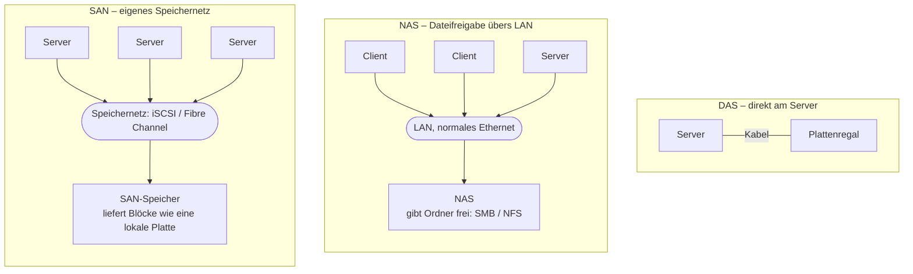
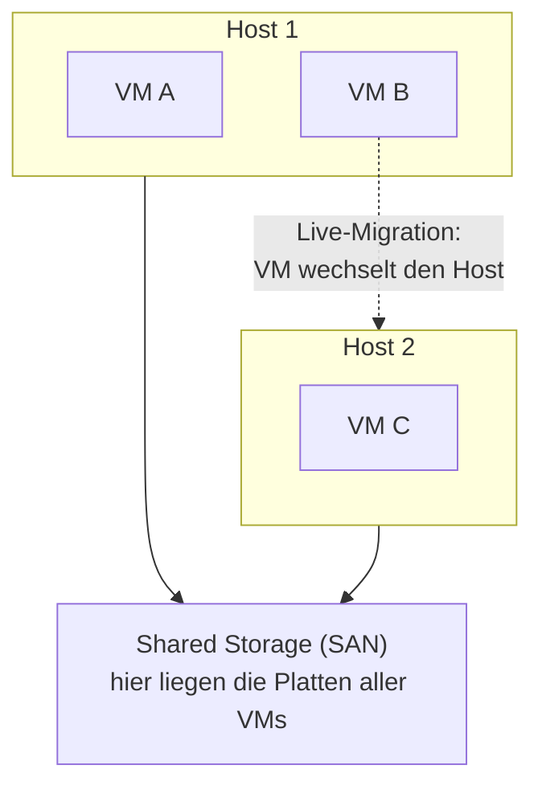

# Speicherlösungen

<span class='badge badge-vertiefung'>Vertiefung</span> &nbsp; Daten brauchen einen Platz – und der will geplant sein, damit er weder ausgeht noch unnötig viel kostet.

Hier lernst du, wie du Speicher so dimensionierst und anbindest, dass er zur Architektur passt – und was hinter den Drei-Buchstaben-Kürzeln DAS, NAS und SAN wirklich steckt. Der rote Faden dabei: Speicher plant man nie nur für heute. Die beiden Fragen, die jede Speicherentscheidung tragen, lauten **„Wie wächst der Bedarf?"** und **„Was passiert bei einem Ausfall?"** – alles auf dieser Seite ist eine Antwort auf eine der beiden.

---

## Wie viel Platz – heute und in drei Jahren?

Der klassische Fehler bei der Speicherplanung ist nicht, zu wenig zu kaufen. Der klassische Fehler ist, **für heute** zu kaufen. Ein Fileserver, der bei der Anschaffung zu 60 Prozent gefüllt ist, fühlt sich großzügig an – bis er 18 Monate später die erste „Laufwerk fast voll"-Meldung schickt und mitten im Betrieb erweitert werden muss. Nachrüsten unter Druck ist immer teurer als vorausschauend planen.

Eine belastbare **Kapazitätsplanung** braucht vier Zutaten:

| Zutat | Frage dahinter | Woher der Wert kommt |
|---|---|---|
| **Ist-Bestand** | Wie viel liegt heute schon da? | messen, nicht schätzen |
| **Wachstumsrate** | Wie schnell wird es mehr? | Verlauf der letzten Jahre, geplante Projekte |
| **Planungshorizont** | Für wie viele Jahre soll es reichen? | üblich sind 3 bis 5 Jahre |
| **Reserve** | Wie viel Puffer für Unvorhergesehenes? | oft 20 bis 30 Prozent obendrauf |

Damit wird aus dem Bauchgefühl eine Rechnung. Ein Beispiel mit runden Zahlen:

```text
Ist-Bestand:        8 TB
Wachstum:           20 % pro Jahr
Planungshorizont:   3 Jahre

Jahr 1:   8,0 TB x 1,2  =   9,6 TB
Jahr 2:   9,6 TB x 1,2  =  11,5 TB
Jahr 3:  11,5 TB x 1,2  =  13,8 TB

+ 20 % Reserve          =  rund 17 TB Netto-Bedarf
```

Auffällig: Aus 8 TB werden nicht 8 + 3 mal 1,6 = knapp 13 TB, sondern fast 14 TB **vor** der Reserve – Wachstum wirkt auf den jeweils neuen Stand, nicht auf den alten. Wer linear rechnet, unterschätzt den Bedarf mit jedem Jahr etwas mehr.

!!! info "Brutto ist nicht Netto"
    Die 17 TB aus der Rechnung sind der **Netto-Bedarf** – das, was am Ende nutzbar sein muss. Kaufen musst du mehr: **RAID** frisst je nach Level einen Teil der Rohkapazität für Redundanz (dazu gleich mehr) und auch Dateisystem-Verwaltung kostet ein paar Prozent. Wer für 17 TB netto ein RAID 5 aus gleich großen Platten plant, landet schnell bei 32 TB brutto – etwa vier Platten zu je 8 TB; die Rechnung dazu folgt im RAID-Abschnitt. In Angeboten immer klarstellen, welche der beiden Zahlen gemeint ist – das Missverständnis ist ein Klassiker.

---

## DAS, NAS, SAN – drei Arten, Speicher anzubinden

Die drei Kürzel beschreiben nicht, **was** für Platten verbaut sind, sondern **wie** der Speicher an die Rechner kommt. Genau daran entscheidet sich, wer ihn nutzen kann.

**DAS** (**Direct Attached Storage**) ist der einfachste Fall: Der Speicher hängt **direkt an einem Rechner** – die interne Platte, das SAS-Regal am Server, im Kleinen sogar die USB-Platte. Schnell, billig, ohne Netz dazwischen. Der Haken: Nur dieser eine Rechner kommt dran. Fällt der Server aus, sind die Daten zwar noch da, aber niemand erreicht sie.

**NAS** (**Network Attached Storage**) ist ein eigenes Gerät im normalen LAN, das **Dateifreigaben** anbietet. Die Clients sehen Ordner und Dateien, gesprochen wird **SMB** (die Windows-Welt) oder **NFS** (die Linux-Welt). Das ist die geborene Team-Dateiablage: viele Nutzer, gemeinsame Ordner, zentrale Berechtigungen – über dasselbe Ethernet, das ohnehin liegt.

**SAN** (**Storage Area Network**) ist die schwere Klasse: ein **eigenes Speichernetz**, über das zentrale Speichersysteme den Servern **Blockspeicher** liefern – der Server sieht keine Freigabe, sondern etwas, das sich wie eine lokale Platte anfühlt. Die Protokolle dafür sind **iSCSI** (Blockzugriff über normales Ethernet) und **Fibre Channel** (eigene, sehr schnelle Netztechnik mit eigener Verkabelung). Das Dateisystem legt der Server selbst darauf an – genau das brauchen Datenbanken und Hypervisoren.



Beim DAS kommt nur der eine Server an die Daten. Beim NAS teilen sich viele Nutzer Ordner über das normale Netz. Beim SAN hängen die Server an einem eigenen Netz und sehen den Speicher wie eine lokale Platte.

Der wichtigste Unterschied steckt im Zugriff: NAS liefert **Dateien**, SAN liefert **Blöcke**. Im Überblick:

| Merkmal | DAS | NAS | SAN |
|---|---|---|---|
| Zugriffsart | Block (lokal) | **Datei** | **Block** |
| Netz | keins – direktes Kabel | normales LAN | eigenes Speichernetz |
| Protokolle | SATA, SAS, USB | SMB, NFS | iSCSI, Fibre Channel |
| Typischer Einsatz | Einzelserver, Arbeitsplatz | Team-Dateiablage, zentrale Ordner | viele Server, Datenbanken, Virtualisierungs-Cluster |
| Kosten | niedrig | mittel | hoch (bei Fibre Channel: eigene Infrastruktur) |

Als Faustregel für die Planung: **Ein** Server mit lokalem Bedarf -> DAS reicht. Ein Team, das gemeinsam auf Dateien arbeitet -> NAS. Viele Server, die sich zentralen, schnellen Speicher teilen sollen (etwa ein Virtualisierungs-Cluster) -> SAN. Die Grenzen sind in der Praxis fließend: Viele NAS-Geräte können zusätzlich iSCSI sprechen und spielen dann für kleine Umgebungen das SAN mit.

---

## RAID: weiterlaufen, wenn eine Platte stirbt

Platten gehen kaputt. Nicht vielleicht – sicher, nur der Zeitpunkt ist offen. **RAID** (Redundant Array of Independent Disks) verbindet mehrere Platten zu einem Verbund, der den Ausfall einzelner Platten **im laufenden Betrieb** wegsteckt: Die defekte Platte wird getauscht, der Verbund baut sich neu auf, niemand merkt etwas. Bis dieser Neuaufbau (**Rebuild**) fertig ist, läuft der Verbund **degradiert** – langsamer und ohne weitere Reserve. Bei großen Platten dauert das viele Stunden; fällt in dieser Zeit eine zweite Platte aus, sind die Daten weg. RAID kauft dir also **Verfügbarkeit** – Zeit, in der der Betrieb trotz Defekt weiterläuft.

Die gängigen Level unterscheiden sich darin, wie viel Kapazität sie für diese Sicherheit opfern:

| Level | Prinzip | Mindestplatten | Nutzbare Kapazität | Verkraftet Ausfälle |
|---|---|---|---|---|
| **RAID 0** | Striping – Daten verteilt, keine Redundanz | 2 | 100 % | **keinen einzigen** |
| **RAID 1** | Spiegelung – alles doppelt | 2 | 50 % | 1 Platte |
| **RAID 5** | Striping mit verteilter Parität | 3 | (n-1) von n Platten | 1 Platte |
| **RAID 6** | wie RAID 5, doppelte Parität | 4 | (n-2) von n Platten | 2 Platten |
| **RAID 10** | Spiegelpaare, darüber Striping | 4 | 50 % | 1 je Spiegelpaar |

RAID 0 fällt aus der Reihe: Es macht schnell, aber unsicherer – fällt **eine** Platte aus, ist **alles** weg. Das „R" im Namen ist hier schlicht gelogen.

Eine Beispielrechnung, wie sich das auf den Einkauf auswirkt: **4 Platten mit je 8 TB als RAID 5** ergeben 32 TB brutto, aber nur **24 TB netto** – die Kapazität einer Platte steckt in der Parität. Dafür darf eine beliebige der vier Platten ausfallen, ohne dass Daten verloren gehen. Genau hier schließt sich der Kreis zur Kapazitätsplanung oben: Der Netto-Bedarf von rund 17 TB wäre mit diesem Verbund gedeckt, inklusive Redundanz.

Dazu gehört oft ein **Hot Spare**: eine zusätzliche Platte, die eingebaut mitläuft, aber nichts speichert. Fällt eine aktive Platte aus, springt sie automatisch ein – der Wiederaufbau startet sofort, nicht erst, wenn jemand mit einer Ersatzplatte im Serverraum steht. Das verkürzt das riskante Zeitfenster, in dem der Verbund ohne Reserve läuft.

!!! warning "RAID ist kein Backup"
    RAID schützt vor genau einem Szenario: **Hardware-Defekt einer Platte.** Gegen alles andere ist es machtlos – schlimmer noch, es repliziert das Unglück zuverlässig mit:

    - **Gelöscht ist gelöscht** – auf allen Platten gleichzeitig.
    - **Verschlüsselt ist verschlüsselt** – ein Erpressungstrojaner verschlüsselt den Verbund, nicht eine einzelne Platte.
    - Überspannung, Brand, Diebstahl, ein defekter RAID-Controller – trifft alle Platten auf einmal.

    Ein Backup ist eine **zeitversetzte Kopie an einem anderen Ort**. RAID ist keins davon: nicht zeitversetzt, nicht woanders. Die Faustregel für echte Datensicherung heißt **3-2-1**: drei Kopien, auf zwei verschiedenen Medien, eine davon außer Haus. Wer „wir haben doch RAID" als Datensicherung verkauft, hat beim ersten versehentlichen Löschen ein Problem, das kein Plattentausch der Welt löst.

---

## Speicher für viele VMs: der gemeinsame Pool

In virtualisierten Umgebungen verschiebt sich die Frage. Es geht nicht mehr darum, **einem** Server Platz zu geben, sondern einem ganzen Cluster: Viele VMs auf mehreren Hosts teilen sich einen zentralen **Speicher-Pool** – klassisch ein SAN, das alle Hosts erreichen können. Man spricht von **Shared Storage**.

Warum das entscheidend ist: Liegen die Platten einer VM auf dem Host selbst, klebt die VM an diesem Host. Liegen sie im gemeinsamen Pool, kann die VM **im laufenden Betrieb den Host wechseln** (Live-Migration) – für Wartung, für Lastverteilung, im Fehlerfall. Fällt ein Host aus, startet der Cluster die VM einfach auf einem anderen Host neu, denn ihre Daten waren nie auf dem toten Gerät. Die Speicheranbindung entscheidet damit über zwei Dinge auf einmal: die **Ausfallsicherheit** des Clusters – und seine gefühlte Geschwindigkeit, denn jede Platten-Operation jeder VM läuft über dieses eine Netz.



Die VM zieht um, ihre Daten nicht – sie lagen nie auf dem Host, sondern immer im gemeinsamen Speicher. Deshalb funktioniert der Umzug im laufenden Betrieb.

Die Grundidee kennst du übrigens längst aus Docker: Ein **Volume** existiert unabhängig vom Container – der Container ist wegwerfbar, die Daten leben weiter. Shared Storage ist dasselbe Prinzip eine Etage tiefer: Die VM ist beweglich, ihre Daten liegen an einem Ort, der alle Bewegungen überlebt.

Beim Anlegen virtueller Platten gibt es zwei Strategien:

| | **Thick Provisioning** | **Thin Provisioning** |
|---|---|---|
| Prinzip | Platz wird sofort vollständig reserviert | Platz wird erst belegt, wenn wirklich geschrieben wird |
| 100-GB-Platte, 10 GB genutzt | belegt 100 GB im Pool | belegt 10 GB im Pool |
| Vorteil | garantiert verfügbar, planbar | Pool wird viel besser ausgenutzt |
| Risiko | verschenkter Platz | **Überbuchung** |

!!! warning "Das Risiko der Überbuchung"
    Thin Provisioning erlaubt, mehr Platz zu **versprechen**, als physisch da ist – zwanzig VMs mit je 100 GB auf einem Pool von 1 TB. Das geht gut, solange die VMs ihre Versprechen nicht einlösen. Wachsen sie aber gleichzeitig, läuft der Pool voll – und dann stehen **alle** VMs auf einmal still, nicht nur die eine, die zu groß wurde. Thin Provisioning ist deshalb kein Ersatz für Kapazitätsplanung, sondern ein Grund mehr dafür: Der tatsächliche Füllstand des Pools gehört ins Monitoring, mit Alarm deutlich vor 100 Prozent.

---

## Ausblick: Objektspeicher in der Cloud

Neben Datei- und Blockzugriff hat sich in der Cloud eine dritte Form etabliert: **Objektspeicher**. Statt eines Dateisystems mit Ordnern gibt es einen flachen Ablageraum, in dem jedes **Objekt** aus den Daten selbst, beschreibenden **Metadaten** und einer eindeutigen Kennung besteht. Zugegriffen wird nicht über Laufwerksbuchstaben oder Einhängepunkte, sondern über eine Schnittstelle im Web.

Das klingt unbequemer als ein Dateisystem – hat aber einen entscheidenden Vorteil: Objektspeicher skaliert **praktisch unbegrenzt**. Keine Partition, die voll läuft, kein RAID-Verbund, der erweitert werden muss – der Anbieter kümmert sich um Redundanz und Wachstum, du zahlst pro abgelegtem Gigabyte. Typische Einsatzfälle sind genau die Daten, die immer nur mehr werden: **Backups, Archive**, Medien-Dateien, Log-Daten. In hybriden Architekturen ist das ein bewährtes Muster: Die schnellen, aktiven Daten liegen im eigenen Haus auf NAS oder SAN – die Sicherungen wandern als Objekte in die Cloud, an den „anderen Ort", den ein echtes Backup braucht.

---

!!! quote "Mitnehmen"
    1. **Speicher plant man nie nur für heute.** Ist-Bestand mal Wachstumsrate über den Planungshorizont, plus Reserve – und dabei sauber zwischen Netto-Bedarf und Brutto-Einkauf trennen, denn RAID kostet Rohkapazität.
    2. **DAS, NAS, SAN beschreiben die Anbindung:** direkt am Server, Dateifreigabe übers LAN (SMB/NFS) oder eigenes Speichernetz mit Blockzugriff (iSCSI/Fibre Channel). Je mehr Systeme sich den Speicher teilen sollen, desto weiter rechts landest du.
    3. **RAID schützt vor Plattenausfall – vor nichts anderem.** Gelöscht ist gelöscht, verschlüsselt ist verschlüsselt, auf allen Platten gleichzeitig. Das Backup bleibt eine eigene, zeitversetzte Kopie an einem anderen Ort.
    4. **In virtualisierten Umgebungen ist Shared Storage das Rückgrat:** Er macht Live-Migration und Ausfallsicherheit erst möglich – und seine Anbindung bestimmt die gefühlte Geschwindigkeit des ganzen Clusters.

---

!!! tip "Verbindung zu Ressourcen & Virtualisierung"
    Die Kapazitätsrechnung von hier ist ein Baustein der größeren Planungsfrage: Was kostet das alles – an Technik, Personal, Zeit und Geld? Genau da macht [Ressourcen planen](ressourcen-planen.md) weiter. Wie VMs, Hypervisoren und Container die Umgebung bilden, die sich den gemeinsamen Speicher teilt, vertieft der Block [Virtualisierung](../virtualisierung/index.md).