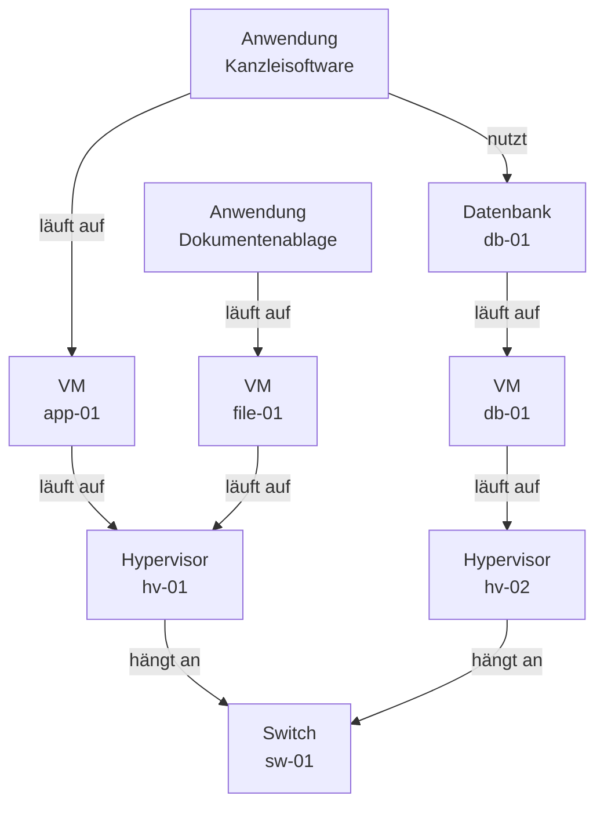

# Übungen – Anforderungen & Sollkonzept

<span class='badge badge-praxis'>Aufgaben</span> &nbsp; Acht Aufgaben, die ausschließlich um die Inhalte der Seite [Anforderungen & Sollkonzept](anforderungen-und-sollkonzept.md) kreisen. Anders als bei den [großen Übungsaufgaben](uebungen.md) gibt es hier **kein durchgehendes Szenario** – jede Aufgabe steht für sich und bringt ihren eigenen kleinen Fall mit. Du kannst also einsteigen, wo du willst.

So arbeitest du damit: Beantworte jede Aufgabe **erst selbst schriftlich** und klapp die Musterlösung danach auf. Wer vorher spickt, verschenkt genau den Lerneffekt, um den es geht. Rechenaufgaben löst du mit Taschenrechner und Zettel – ein Rechner mit Internetzugang ist nicht nötig.

---

## Die Aufgaben

### Aufgabe 1 – Woher weißt du das eigentlich?

!!! info "Worum es geht"
    - Die **Quellen der Bestandsanalyse** bewusst auswählen, statt alles aus einer Liste ziehen zu wollen
    - Erkennen, welche Befunde **keine** Liste liefern kann
    - Theorie dazu: [Anforderungen & Sollkonzept](anforderungen-und-sollkonzept.md)

Du sollst für die **Steuerkanzlei Habermann & Partner** (28 Mitarbeitende, ein Standort) eine Bestandsanalyse machen. Vier Tage sind dafür eingeplant. Für die folgenden sechs Befunde brauchst du je eine belastbare Quelle. **Ordne jedem Befund die Quelle zu, die ihn zuverlässig liefert** – und begründe bei zwei Befunden, warum eine einzelne Quelle dafür nicht reicht.

| Nr. | Das willst du wissen |
|---|---|
| a | Alter und Supportstatus der drei Server |
| b | Welcher Switch an welchem hängt und wo die Uplinks liegen |
| c | Welche Software tatsächlich benutzt wird – nicht nur installiert ist |
| d | Wie stark der Fileserver in den letzten Monaten ausgelastet war |
| e | Dass die „zentrale Ablage" für Vorlagen faktisch ein USB-Stick ist, der durchs Büro wandert |
| f | Für wie viele Arbeitsplätze gültige Lizenzen bezahlt sind |

??? tip "Musterlösung & Erklärung"
    **1. Musterantwort** – Befund, Quelle, Einschränkung:

    | Nr. | Quelle | Einschränkung |
    |---|---|---|
    | a | Beschaffungsunterlagen und Inventarliste (Kaufdatum, Seriennummern), dazu die Support-Datenbank des Herstellers | Papier sagt, was gekauft wurde – nicht, was heute im Rack steht. Ein Blick in den Serverraum gehört dazu. |
    | b | vorhandener Netzplan, abgeglichen mit der Konfiguration der Switches | Netzpläne altern schneller als Netze. Verlässlich wird die Aussage erst mit einer Stichprobe vor Ort. |
    | c | Software-Inventarisierung oder Monitoring **plus** Gespräche mit den Abteilungen | Eine Inventarisierung findet Installationen, keine Nutzung. Ob ein Programm wirklich gebraucht wird, weiß nur, wer damit arbeitet. |
    | d | Auswertung aus dem Monitoring über mehrere Monate | Ohne Monitoring gibt es diesen Wert nicht – dann bleibt nur eine Momentaufnahme, die Lastspitzen verfehlt. |
    | e | **Gespräche** – ausschließlich | Kein Inventar, kein Netzplan und kein Monitoring kennt diesen USB-Stick. Er taucht in keinem System auf, weil er an allen vorbeigebaut wurde. |
    | f | Lizenzverträge, Rechnungen und das Lizenzinventar | Bezahlt heißt nicht passend: Die Zählweise (Gerät, Named User) muss zur tatsächlichen Nutzung passen. |

    **2. Warum so?** – Die Quellen der Bestandsanalyse liefern verschiedene Wahrheiten, keine bessere und schlechtere. Listen und Verträge sagen dir, was **beschafft** wurde. Netzpläne sagen, wie es **gedacht** war. Monitoring sagt, was **tatsächlich passiert** – aber nur, wenn es lief. Und Gespräche sagen, wie **wirklich gearbeitet** wird. Genau die Lücke zwischen diesen vier Bildern ist der interessante Teil einer Bestandsanalyse: Der Server, der in der Liste steht und im Keller fehlt. Die Software, die auf 28 Rechnern liegt und von vier Leuten benutzt wird. Der USB-Stick, den es offiziell nicht gibt.

    **3. Auch gut wäre ...** – weitere Quellen zu nennen, die im Alltag tragen: die Ticket-Historie des Helpdesks (sie zeigt, wo es regelmäßig klemmt), die Wartungs- und Supportverträge (sie verraten, für welche Systeme überhaupt noch jemand zuständig ist) und die Stromrechnung beziehungsweise der USV-Bericht als Hinweis darauf, was im Serverraum tatsächlich läuft. Auch der Hinweis ist richtig, dass eine Bestandsanalyse fotografiert und protokolliert werden sollte – ein Rack-Foto klärt später mehr Rückfragen als drei Tabellen.

    **4. Typischer Stolperstein** – sich auf **eine** Quelle zu verlassen, weil sie bequem verfügbar ist. Die vorhandene Excel-Liste ist in fünf Minuten geöffnet, das Gespräch mit der Buchhaltung kostet eine Stunde – und liefert den Befund, der das Projekt rettet. Der zweite Klassiker: Installiertes mit Genutztem zu verwechseln. Wer den Lizenzbedarf aus der Installationsliste ableitet, kauft regelmäßig zu viel.

---

### Aufgabe 2 – Funktional, nicht-funktional oder gar keine Anforderung?

!!! info "Worum es geht"
    - Die Trennlinie **funktional / nicht-funktional** sicher ziehen
    - Erkennen, wann ein Satz gar keine Anforderung ist, sondern eine Lösung oder ein Wunsch
    - Theorie dazu: [Anforderungen & Sollkonzept](anforderungen-und-sollkonzept.md)

Für die neue Kanzleisoftware der Steuerkanzlei liegen acht Sätze auf dem Tisch. **Sortiere jeden Satz in eine von drei Schubladen: funktionale Anforderung, nicht-funktionale Anforderung oder keine Anforderung.** Bei der dritten Schublade begründe kurz, was mit dem Satz nicht stimmt.

1. Die Software zeigt zu jedem Mandanten die offenen Fristen an.
2. Die Suche über alle Mandantenakten liefert ein Ergebnis in unter 2 Sekunden.
3. Zugriffsrechte lassen sich pro Abteilung vergeben.
4. Die Verbindung zwischen Arbeitsplatz und Server ist durchgehend verschlüsselt.
5. Die Software ist montags bis freitags von 7 bis 19 Uhr zu 99,5 % verfügbar.
6. Gelöschte Dokumente lassen sich 30 Tage lang von den Nutzern selbst wiederherstellen.
7. Wir brauchen einen neuen Server mit 64 GB RAM.
8. Die Software soll benutzerfreundlich sein.

??? tip "Musterlösung & Erklärung"
    **1. Musterantwort**

    | Nr. | Schublade | Kurzbegründung |
    |---|---|---|
    | 1 | **funktional** | Das System **tut** etwas: Es zeigt Fristen an. Fehlt die Funktion, kann es etwas nicht. |
    | 2 | **nicht-funktional** | Die Suche selbst wäre die Funktion – „unter 2 Sekunden" beschreibt, **wie gut** sie sein muss. |
    | 3 | **funktional** | Eine Rechteverwaltung ist eine Fähigkeit des Systems. |
    | 4 | **nicht-funktional** | Sicherheit als Qualitätseigenschaft. Die Übertragung findet ohnehin statt – die Anforderung betrifft ihre Güte. |
    | 5 | **nicht-funktional** | Verfügbarkeit, mit Zahl und Bezugszeitraum. Musterbeispiel. |
    | 6 | **funktional** | Eine konkrete Fähigkeit (Papierkorb mit Selbstbedienung). Die 30 Tage sind der Parameter dazu. |
    | 7 | **keine Anforderung** | Das ist eine **Lösung**, keine Anforderung – und noch dazu eine, die dem Auftragnehmer die Entscheidung wegnimmt. |
    | 8 | **keine Anforderung** | Nicht nachprüfbar. „Benutzerfreundlich" kann jeder Anbieter für sich reklamieren. |

    **2. Warum so?** – Die Prüffrage ist immer dieselbe: **Was** tut das System (funktional) oder **wie gut** tut es das (nicht-funktional)? Und davor liegt eine Vorprüfung, die viele überspringen: Ist es überhaupt eine Anforderung? Ein Satz ist erst dann eine Anforderung, wenn man am Ende mit Ja oder Nein beantworten kann, ob er erfüllt ist – und wenn er nicht bereits die Lösung vorwegnimmt.

    Die Nummern 3 und 4 zeigen dabei den Grenzfall, der in Prüfungen gern gestellt wird: **Sicherheit** taucht in beiden Spalten auf. Die Regel dahinter ist sauber: Eine Sicherheits**funktion** (Rechteverwaltung, Anmeldung, Protokollierung) ist funktional – sie ist ein Baustein, den das System hat oder nicht hat. Eine Sicherheits**eigenschaft** (verschlüsselte Übertragung, Härtungsgrad, Nachweisbarkeit) beschreibt die Güte und ist nicht-funktional. Wenn du in einer Prüfung unsicher bist: Entscheide dich und schreib den Grund dazu. Die Begründung trägt die Antwort.

    **3. Auch gut wäre ...** – bei Satz 6 zu argumentieren, dass die „30 Tage" ein nicht-funktionaler Anteil derselben Anforderung sind. Das ist richtig und in der Praxis üblich: Viele Sätze mischen beides, weil eine Funktion ohne ihren Parameter unvollständig wäre. Ebenfalls gut ist der Hinweis, dass sich Satz 8 **retten** lässt, statt ihn nur zu verwerfen – etwa als „Eine neue Sachbearbeiterin legt nach einer Einweisung von 30 Minuten selbstständig einen Mandanten an". Damit wird aus dem Wunsch eine messbare Anforderung.

    **4. Typischer Stolperstein** – alles, was mit Sicherheit oder Datenschutz zu tun hat, reflexhaft als nicht-funktional abzustempeln. Der zweite Stolperstein ist Satz 7: Er klingt technisch und konkret, deshalb wirkt er wie eine besonders gute Anforderung. Genau das Gegenteil ist der Fall – er beantwortet eine Frage, die noch niemand gestellt hat. Die Anforderung dahinter wäre etwa „Die Software bedient 28 gleichzeitige Nutzer ohne spürbare Wartezeiten"; wie viel RAM das braucht, entscheidet der, der die Lösung baut.

---

### Aufgabe 3 – Aus schwammig mach messbar

!!! info "Worum es geht"
    - Nicht-funktionale Anforderungen so schreiben, dass man sie **abnehmen** kann
    - Das Bauprinzip einer messbaren Anforderung anwenden statt auswendig lernen
    - Theorie dazu: [Anforderungen & Sollkonzept](anforderungen-und-sollkonzept.md)

Aus einem Workshop mit der Geschäftsführung sind fünf Sätze übrig geblieben. Alle fünf sind gut gemeint – keiner ist abnahmefähig. **Formuliere jeden Satz so um, dass am Ende jemand mit Ja oder Nein beantworten kann, ob er erfüllt ist.** Erfinde dabei plausible Zahlen; es geht um die Bauform, nicht um die konkrete Höhe.

1. „Das Backup soll zuverlässig sein."
2. „Die Anwendung soll schnell laufen."
3. „Der Support soll gut erreichbar sein."
4. „Die Lösung soll zukunftssicher sein."
5. „Der Speicher soll ausreichend groß sein."

??? tip "Musterlösung & Erklärung"
    **1. Musterantwort** – jeweils eine von vielen möglichen Fassungen:

    | Schwammig | Messbar |
    |---|---|
    | Das Backup soll zuverlässig sein. | Jede Nacht wird eine vollständige Sicherung erstellt. Einmal im Quartal wird eine Rücksicherung testweise durchgeführt und protokolliert. Nach einem Ausfall ist die Dateiablage in höchstens 4 Stunden wiederhergestellt; es gehen maximal die Daten der letzten 24 Stunden verloren. |
    | Die Anwendung soll schnell laufen. | Die Suche über alle Mandantenakten liefert bei 28 gleichzeitigen Nutzern in 95 % der Fälle in unter 2 Sekunden ein Ergebnis. |
    | Der Support soll gut erreichbar sein. | Der Anbieter ist montags bis freitags von 8 bis 18 Uhr telefonisch erreichbar und reagiert auf Störungsmeldungen der Kategorie „Betrieb steht" innerhalb von 4 Stunden. |
    | Die Lösung soll zukunftssicher sein. | Der Hersteller sagt für die eingesetzte Version ab Abnahme mindestens fünf Jahre lang Sicherheitsupdates zu, mit einem verbindlichen Enddatum im Vertrag. Die Zahl der Arbeitsplätze lässt sich ohne Architekturänderung von 28 auf 60 erhöhen. |
    | Der Speicher soll ausreichend groß sein. | Der Speicher fasst 5 TB netto und deckt damit den prognostizierten Bedarf für 4 Jahre inklusive 20 % Reserve. |

    **2. Warum so?** – Alle fünf Umformulierungen folgen demselben Bauplan aus vier Teilen:

    | Wer oder was | Messgröße | Zielwert | Bezugsbedingung |
    |---|---|---|---|
    | die Suche | Antwortzeit | unter 2 Sekunden | bei 28 gleichzeitigen Nutzern |
    | der Support | Reaktionszeit | höchstens 4 Stunden | Mo–Fr 8–18 Uhr, Kategorie „Betrieb steht" |
    | das Backup | Wiederherstellzeit | höchstens 4 Stunden | nach vollständigem Ausfall |

    Der vierte Teil ist der, den fast alle weglassen – und er entscheidet über den Wert der ganzen Anforderung. „Antwortzeit unter 2 Sekunden" ist bei einem Nutzer nachts um drei etwas völlig anderes als bei 28 Nutzern am Monatsende. Ohne Bezugsbedingung ist selbst eine Zahl noch verhandelbar.

    Bei „zuverlässig" fällt außerdem auf, dass der Satz gleich **drei** Anforderungen enthielt: dass gesichert wird, dass die Sicherung nachweislich zurückspielbar ist und wie schnell im Ernstfall alles wieder läuft. Genau das ist typisch: Schwammige Sätze sind oft Bündel, keine Einzelanforderungen. Für die beiden Zeitwerte am Ende gibt es Fachbegriffe, die dir in Ausschreibungen begegnen – die maximale Wiederanlaufzeit heißt **RTO** (Recovery Time Objective), der maximal tolerierte Datenverlust **RPO** (Recovery Point Objective).

    **3. Auch gut wäre ...** – bei „zukunftssicher" statt auf den Supportzeitraum auf die **Ausstiegsfähigkeit** abzuzielen: „Der Datenbestand ist jederzeit vollständig in einem dokumentierten, offenen Format exportierbar." Das ist eine ebenso messbare Übersetzung desselben Bauchgefühls – und in vielen Projekten die wichtigere. Auch richtig ist, bei „schnell" zwischen typischer und maximaler Antwortzeit zu unterscheiden: Ein Perzentilwert („in 95 % der Fälle") ist ehrlicher als ein absoluter Höchstwert, den ein einziger Ausreißer verletzt.

    **4. Typischer Stolperstein** – eine Zahl anzuhängen und den Rest schwammig zu lassen: „Das Backup soll zu 99 % zuverlässig sein." Das sieht messbar aus, ist es aber nicht – niemand weiß, was hier gezählt wird. Der zweite Stolperstein: unerreichbar hohe Werte zu fordern, weil sie sich gut anfühlen. Eine Verfügbarkeit von 99,99 % klingt beeindruckend und kostet ein Vielfaches von 99,5 % – wer sie ohne Not fordert, bezahlt Redundanz, die niemand gebraucht hätte.

---

### Aufgabe 4 – Was steckt eigentlich hinter 99,5 %?

!!! info "Worum es geht"
    - Eine Verfügbarkeitszusage in **konkrete Ausfallzeit** umrechnen
    - Verstehen, dass der **Bezugszeitraum** die Zahl mehr verändert als die Prozentangabe selbst
    - Theorie dazu: [Anforderungen & Sollkonzept](anforderungen-und-sollkonzept.md)

Ein Anbieter wirbt für sein gehostetes Kanzlei-Paket mit Verfügbarkeitsstufen. Bevor die Kanzlei unterschreibt, sollst du die Zahlen greifbar machen.

1. **Rechne die erlaubte Ausfallzeit pro Monat aus** – für 99,0 %, 99,5 % und 99,9 %, jeweils für zwei Bezugszeiträume: einmal rund um die Uhr (30 Tage = 720 Stunden) und einmal nur für die Bürozeit Mo–Fr 7–19 Uhr (21 Arbeitstage à 12 Stunden = 252 Stunden).
2. **Nenne drei Angaben**, die neben der Prozentzahl in einer belastbaren Verfügbarkeitszusage stehen müssen.
3. Der Anbieter verspricht **99,9 %** – nimmt aber ein **monatliches Wartungsfenster von 4 Stunden** ausdrücklich aus der Messung heraus. Wie hoch ist die Verfügbarkeit, die die Kanzlei tatsächlich erlebt?

??? tip "Musterlösung & Erklärung"
    **1. Musterantwort**

    *Teil 1 – die Rechnung.* Erlaubte Ausfallzeit = Bezugszeitraum × (100 % − Verfügbarkeit):

    ```text
    Bezugszeitraum A: rund um die Uhr      = 30 Tage x 24 h  = 720 h/Monat
    Bezugszeitraum B: Mo-Fr 7-19 Uhr       = 21 Tage x 12 h  = 252 h/Monat

    99,0 %   A: 720 h x 0,010 = 7,20 h   ->  7 h 12 min
             B: 252 h x 0,010 = 2,52 h   ->  2 h 31 min

    99,5 %   A: 720 h x 0,005 = 3,60 h   ->  3 h 36 min
             B: 252 h x 0,005 = 1,26 h   ->  1 h 16 min

    99,9 %   A: 720 h x 0,001 = 0,72 h   ->      43 min
             B: 252 h x 0,001 = 0,25 h   ->      15 min
    ```

    *Teil 2 – drei Angaben, die dazugehören* (drei davon reichen):

    - **Bezugszeitraum**: Rund um die Uhr oder nur zur Servicezeit? Die Rechnung oben zeigt, dass derselbe Prozentsatz je nach Antwort fast den dreifachen Ausfall erlaubt.
    - **Was als Ausfall zählt**: Nur der Totalausfall oder auch massive Verlangsamung? Ab wann läuft die Uhr – ab Eintritt der Störung oder ab Meldung durch den Kunden?
    - **Wie gemessen wird und von wem**: Prüft der Anbieter sich selbst oder gibt es eine unabhängige Messung? In welchem Intervall wird geprüft?
    - **Umgang mit Wartungsfenstern**: angekündigte Wartung eingerechnet oder herausgerechnet – und wenn herausgerechnet, mit welcher Obergrenze?
    - **Konsequenz bei Verfehlung**: Vertragsstrafe, Gutschrift, Sonderkündigungsrecht – oder nur ein Bedauern?

    *Teil 3 – die 99,9 % mit Wartungsfenster.* Der Anbieter misst nicht auf 720 Stunden, sondern auf 720 − 4 = **716 Stunden**:

    ```text
    Erlaubter Ausfall laut Vertrag:  716 h x 0,001  =  0,72 h
    Geplantes Wartungsfenster:                         4,00 h
    Für die Kanzlei nicht nutzbar:                     4,72 h

    Tatsächlich erlebte Verfügbarkeit:
    (720 h - 4,72 h) / 720 h  =  0,9934  ->  rund 99,3 %
    ```

    Aus den beworbenen 99,9 % werden real **etwa 99,3 %** – das ist schlechter als die einfachste Stufe 99,5 % aus Teil 1. Die Prozentzahl im Prospekt und die Erfahrung im Büro sind zwei verschiedene Dinge.

    **2. Warum so?** – Eine Verfügbarkeitszusage ist eine Rechnung mit drei Stellschrauben: dem Prozentsatz, dem Bezugszeitraum und den Ausnahmen. Verhandelt wird meist nur über die erste – dabei bewegen die anderen beiden das Ergebnis oft stärker. Teil 3 ist kein konstruierter Sonderfall: Herausgerechnete Wartungsfenster sind in Verträgen völlig üblich und auch legitim, denn geplante Wartung ist etwas anderes als ein Ausfall. Entscheidend ist nur, dass die Kanzlei die Rechnung **vor** der Unterschrift macht und dann fragt: Wann genau liegt dieses Fenster? Vier Stunden sonntags um drei Uhr nachts sind harmlos, vier Stunden am Monatsende zur Bürozeit sind es nicht.

    Wird ein solcher Wert vertraglich zugesichert, heißt er **SLA** – Service Level Agreement. Der Begriff sagt nur, dass etwas vereinbart wurde, nicht dass es viel wert ist. Das entscheiden die drei Stellschrauben.

    **3. Auch gut wäre ...** – die Jahreswerte danebenzustellen, weil sie in Ausschreibungen häufiger stehen: 99,5 % von 8.760 Stunden sind rund 44 Stunden Ausfall pro Jahr, 99,9 % sind knapp 9 Stunden, 99,99 % sind knapp 53 Minuten. Ebenfalls stark ist die Anschlussfrage, ob eine hohe Verfügbarkeit hier überhaupt der richtige Hebel ist: Für eine Kanzlei, die Mo–Fr zwischen 7 und 19 Uhr arbeitet, ist ein günstigeres 99,5 % **auf die Bürozeit bezogen** mehr wert als ein teures 99,9 % rund um die Uhr. Die Anforderung soll zum Nutzungsmuster passen, nicht zum Prospekt.

    **4. Typischer Stolperstein** – Prozentzahlen ohne Bezugszeitraum vergleichen. „Anbieter A bietet 99,5 %, Anbieter B 99,9 % – also ist B besser" ist keine Aussage, solange nicht feststeht, worauf sich die Zahlen beziehen und was jeweils herausgerechnet wird. Der zweite Stolperstein ist ein Rechenfehler: 0,5 % nicht als 0,005, sondern als 0,05 zu rechnen und damit beim Zehnfachen zu landen. Kurzer Plausibilitätstest – 99,5 % Verfügbarkeit müssen deutlich unter einem halben Tag Ausfall im Monat bleiben.

---

### Aufgabe 5 – Lastenheft oder Pflichtenheft?

!!! info "Worum es geht"
    - Sätze der richtigen Seite zuordnen: **Auftraggeber** oder **Auftragnehmer**
    - Erkennen, wann ein Satz im falschen Dokument steht – und ihn umschreiben
    - Theorie dazu: [Anforderungen & Sollkonzept](anforderungen-und-sollkonzept.md)

Die Kanzlei beauftragt ein Systemhaus. Auf dem Tisch liegen acht Sätze aus beiden Dokumenten, allerdings durcheinander. **Ordne jeden Satz dem Lastenheft oder dem Pflichtenheft zu und benenne, wer ihn schreibt.** Ein Satz steht anschließend zur Nachbearbeitung an – siehe Teil 2.

1. Alle 28 Arbeitsplätze benötigen Zugriff auf eine gemeinsame Dokumentenablage.
2. Wir stellen eine VM mit 8 vCPU, 32 GB RAM und 4 TB Netto-Speicher auf dem vorhandenen Hypervisor bereit.
3. Die Umstellung darf den Kanzleibetrieb an keinem Werktag länger als 2 Stunden unterbrechen.
4. Die Rechtevergabe erfolgt über Gruppen im vorhandenen Verzeichnisdienst.
5. Mandantendaten müssen ausschließlich in Deutschland gespeichert werden.
6. Die Abnahme erfolgt anhand der in Anlage 3 beschriebenen Testfälle.
7. Auf Störungsmeldungen der Kategorie „Betrieb steht" muss innerhalb von 4 Stunden reagiert werden.
8. Wir brauchen eine Dokumentenablage von Hersteller X in der Enterprise-Edition.

**Teil 2:** Ein Satz gehört zwar ins Lastenheft, ist dort aber falsch formuliert. Finde ihn und **schreib ihn lösungsneutral um.**

??? tip "Musterlösung & Erklärung"
    **1. Musterantwort**

    | Nr. | Dokument | Wer schreibt es | Warum |
    |---|---|---|---|
    | 1 | **Lastenheft** | Auftraggeber (Kanzlei) | Bedarf, kein Produkt – WAS gebraucht wird. |
    | 2 | **Pflichtenheft** | Auftragnehmer (Systemhaus) | Konkrete technische Umsetzung bis zur Typenbezeichnung – WIE und WOMIT. |
    | 3 | **Lastenheft** | Auftraggeber | Rahmenbedingung des Betriebs. Organisatorische Vorgaben gehören ins Lastenheft. |
    | 4 | **Pflichtenheft** | Auftragnehmer | Lösungsbeschreibung, die auf einen Befund der Bestandsanalyse aufsetzt. |
    | 5 | **Lastenheft** | Auftraggeber | Rechtliche Rahmenbedingung, lösungsneutral formuliert. |
    | 6 | **Pflichtenheft** | Auftragnehmer | Das Pflichtenheft ist die Messlatte für die Abnahme – hier steht, wie geprüft wird. |
    | 7 | **Lastenheft** | Auftraggeber | Anforderung an den künftigen Service, ohne Vorgabe, wie der Anbieter das organisiert. |
    | 8 | **Lastenheft, aber falsch formuliert** | Auftraggeber | Der Bedarf gehört ins Lastenheft – der Produktname nicht. |

    *Teil 2 – Satz 8 lösungsneutral:*

    > „Die Kanzlei benötigt eine gemeinsame Dokumentenablage für 28 Arbeitsplätze mit einer Startkapazität von 5 TB netto, abteilungsweiser Rechtevergabe und einer Wiederherstellung gelöschter Dokumente innerhalb von 30 Tagen."

    Damit steht im Lastenheft alles, was die Kanzlei wirklich braucht – und das Systemhaus darf antworten, mit welchem Produkt es das löst.

    **2. Warum so?** – Die Zuordnung folgt einer einzigen Frage: **Würde der Satz noch stimmen, wenn das Systemhaus eine völlig andere Technik vorschlägt?** Wenn ja, gehört er ins Lastenheft. Wenn nein, ins Pflichtenheft. Prüf das an Satz 1 (stimmt mit jeder Lösung) gegen Satz 2 (stimmt nur mit genau dieser). Satz 6 fällt aus dem Raster, weil er nicht von Technik handelt – hier hilft die zweite Frage: **Wer verpflichtet sich hier zu etwas?** Beim Abnahmeverfahren ist das der Auftragnehmer, also Pflichtenheft.

    Der Grund für die Trennung ist handfest: Wer als Auftraggeber die Lösung vorschreibt, übernimmt damit auch die Verantwortung dafür. Läuft die vorgeschriebene Software später nicht rund, kann das Systemhaus zu Recht sagen: „Ihr habt es so bestellt." Ein lösungsneutrales Lastenheft schiebt diese Verantwortung dahin, wo die Fachkenntnis sitzt – und wo sie bezahlt wird.

    **3. Auch gut wäre ...** – anzumerken, dass Satz 5 in der Praxis oft schärfer gefasst wird, etwa mit dem Zusatz „Eine Verarbeitung durch Subunternehmer außerhalb der EU ist ausgeschlossen." Auch vertretbar ist die Sicht, dass Satz 6 in beiden Dokumenten Spuren hinterlässt: Der Auftraggeber kann im Lastenheft fordern, **dass** es ein dokumentiertes Abnahmeverfahren gibt – **wie** es aussieht, beschreibt der Auftragnehmer. Wer so argumentiert, hat die Rollenlogik verstanden und liegt damit richtig.

    **4. Typischer Stolperstein** – Produktnamen im Lastenheft, wie in Satz 8. Sie schleichen sich fast immer ein, weil jemand im Haus schon eine Meinung hat. Der zweite Stolperstein ist die Reihenfolge: Ein Pflichtenheft, das vor dem Lastenheft entsteht, beantwortet eine Frage, die nie gestellt wurde – und wird bei jeder Änderung des Bedarfs zur Verhandlungsmasse.

---

### Aufgabe 6 – Aus Sätzen werden Zahlen

!!! info "Worum es geht"
    - Anforderungssätze in **Parameter** übersetzen, mit denen man bauen kann
    - Eine Kapazität so rechnen, dass sie über den Planungshorizont trägt
    - Theorie dazu: [Anforderungen & Sollkonzept](anforderungen-und-sollkonzept.md)

Im Sollkonzept der Kanzlei steht dieser Satz:

> „Alle Mandantendokumente liegen in einer zentralen Ablage. Heute sind es 1,8 TB. Der Bestand ist in den letzten Jahren um etwa 15 % pro Jahr gewachsen; die Ablage soll 4 Jahre tragen. Gelöschte Dokumente müssen 30 Tage wiederherstellbar sein, zusätzlich werden tägliche Snapshots vorgehalten – dafür rechnen wir mit 25 % Aufschlag. Auf das Ergebnis kommt die übliche Reserve von 20 %."

1. **Rechne den Netto-Bedarf aus**, den das Systemhaus im Pflichtenheft zusagen muss.
2. **Nenne drei weitere Parameter**, die sich aus dem Sollkonzept der Kanzlei ableiten lassen – und sag jeweils, aus welcher Art von Anforderung sie stammen.

??? tip "Musterlösung & Erklärung"
    **1. Musterantwort**

    *Teil 1 – die Rechnung.* Wachstum wirkt auf den jeweils neuen Stand, nicht auf den Ausgangswert:

    ```text
    Ist-Bestand:         1,80 TB
    Wachstum:            15 % pro Jahr
    Planungshorizont:    4 Jahre

    Jahr 1:  1,80 TB x 1,15  =  2,07 TB
    Jahr 2:  2,07 TB x 1,15  =  2,38 TB
    Jahr 3:  2,38 TB x 1,15  =  2,74 TB
    Jahr 4:  2,74 TB x 1,15  =  3,15 TB

    + 25 % fuer Papierkorb und Snapshots:  3,15 x 1,25  =  3,94 TB
    + 20 % Reserve:                        3,94 x 1,20  =  4,73 TB

    Netto-Bedarf:  rund 5 TB
    ```

    Die Kurzform derselben Rechnung: 1,8 TB × 1,15⁴ × 1,25 × 1,20 = 4,73 TB.

    *Teil 2 – drei weitere Parameter:*

    | Parameter | Woraus abgeleitet | Art der Anforderung |
    |---|---|---|
    | RAM und CPU der VM | „28 gleichzeitige Nutzer, überwiegend Dokumente und Kanzleisoftware" | funktional plus Nutzungsprofil |
    | Wiederherstellzeit und Sicherungsintervall | „max. 4 Stunden Wiederanlauf, max. 24 Stunden Datenverlust" | nicht-funktional |
    | Bandbreite im LAN, Anzahl Ports | „gleichzeitiger Zugriff auf große Dokumente aus 28 Arbeitsplätzen" | nicht-funktional (Performance) |
    | Aufbewahrungsfrist und Speicherort | gesetzliche Aufbewahrungspflichten, Datenstandort Deutschland | Rahmenbedingung |

    **2. Warum so?** – Der Kern der Rechnung ist das Wort **exponentiell**. Wer linear rechnet, kommt auf 1,8 + 4 × 0,27 = 2,88 TB und liegt fast 10 % unter dem richtigen Wert – und mit jedem weiteren Jahr wird der Fehler größer. Der zweite Punkt ist die Reihenfolge der Aufschläge: Papierkorb und Snapshots liegen **auf dem gewachsenen Bestand**, nicht auf dem heutigen. Deshalb wird erst gewachsen, dann aufgeschlagen.

    Und die eigentliche Botschaft der Aufgabe: Aus einem einzigen Satz im Sollkonzept wird eine Zahl, an der ein Angebot hängt. Genau dieser Übersetzungsschritt trennt ein Zielbild von einer Wunschliste.

    **3. Auch gut wäre ...** – zu ergänzen, dass die 5 TB der **Netto**-Bedarf sind und der Einkauf davon abweicht: Ein RAID kostet Rohkapazität, die Dateisystem-Verwaltung ein paar Prozent obendrauf und die Hersteller-Angabe „TB" (dezimal, 10¹²) fällt kleiner aus als das, was das Betriebssystem als „TiB" anzeigt. Wer für 5 TB netto einkauft, landet je nach RAID-Level schnell beim Doppelten an Rohkapazität – die Rechnung dazu steht auf der Seite [Speicherlösungen](speicherloesungen.md). Ebenfalls stark ist der Hinweis, dass die 15 % Wachstum eine **Annahme** sind: Sie gehören ins Dokument geschrieben, damit man sie in zwei Jahren gegen die Realität prüfen kann.

    **4. Typischer Stolperstein** – die Prozentaufschläge zu addieren statt zu multiplizieren: 25 % + 20 % = 45 % ergäbe 3,15 × 1,45 = 4,57 TB statt 4,73 TB. Der Unterschied ist hier klein, wächst aber mit jedem weiteren Aufschlag. Der zweite Stolperstein ist, die Reserve wegzulassen, weil „da ja schon Puffer drin ist" – Snapshot-Platz ist kein Puffer, sondern belegter Platz mit fester Aufgabe.

---

### Aufgabe 7 – Die Ausfall-Frage an die CMDB

!!! info "Worum es geht"
    - Eine CMDB nicht als Liste, sondern über ihre **Beziehungen** lesen
    - Die Frage beantworten, die im Störungsfall zählt: Was ist alles betroffen?
    - Theorie dazu: [Anforderungen & Sollkonzept](anforderungen-und-sollkonzept.md)

Die Kanzlei hat inzwischen eine CMDB. Dieser Ausschnitt zeigt die erfassten Configuration Items und ihre Beziehungen:



1. **Was fällt aus, wenn der Switch `sw-01` stirbt?**
2. **Was fällt aus, wenn der Hypervisor `hv-02` stirbt?** Formuliere die Antwort so, dass sie einen Geschäftsführer erreicht, nicht nur einen Admin.
3. **Welche Art von Beziehung fehlt in solchen CMDBs am häufigsten?** Nenne zwei Beispiele, die in diesem Bild nicht auftauchen, im Ernstfall aber alles lahmlegen.

??? tip "Musterlösung & Erklärung"
    **1. Musterantwort**

    *Teil 1 – Ausfall von `sw-01`:* Beide Hypervisoren hängen an diesem einen Switch. Fällt er aus, sind `hv-01` und `hv-02` nicht mehr erreichbar – damit alle drei VMs und damit **beide Anwendungen**. Die Kanzlei steht komplett. Der Switch ist ein klassischer **Single Point of Failure**: ein einzelnes Gerät, an dem die gesamte Verfügbarkeit hängt.

    *Teil 2 – Ausfall von `hv-02`:* Auf `hv-02` läuft nur die VM `db-01` mit der Datenbank. Die Dokumentenablage bleibt erreichbar. Die **Kanzleisoftware aber nicht** – ihre eigene VM `app-01` läuft zwar munter weiter auf `hv-01`, aber ohne Datenbank kann sie nichts anzeigen. In der Sprache der Geschäftsführung:

    > „Fällt der zweite Virtualisierungs-Server aus, können die Mandantenakten weiter geöffnet werden – aber es lässt sich keine einzige Frist einsehen, kein Mandant anlegen und nichts buchen. Die Kanzleisoftware steht, bis der Server wieder läuft."

    *Teil 3 – die häufig fehlenden Beziehungen:* Es fehlen die **„nutzt"-Beziehungen zu Diensten, die niemandem gehören, weil sie einfach immer da waren.** Zwei Beispiele:

    - **Verzeichnisdienst und DNS**: Ohne Namensauflösung und Anmeldung findet keine der beiden Anwendungen ihren Weg – auch wenn beide Server tadellos laufen.
    - **Internetanbindung und Lizenzserver**: Prüft die Kanzleisoftware ihre Lizenz online, macht ein Leitungsausfall aus einer lokal installierten Anwendung ein totes Programm.

    Ebenfalls richtig: der gemeinsame Speicher, an dem beide Hypervisoren hängen, die Stromversorgung samt USV, die Klimatisierung des Serverraums – und die Backup-Kette, die im Bild gar nicht vorkommt.

    **2. Warum so?** – Der Mehrwert einer CMDB steckt nicht in der Liste, sondern in den Kanten zwischen den Kästen. Teil 2 zeigt warum: Wer nur die Liste der VMs hat, sieht beim Ausfall von `hv-02` eine einzige betroffene VM. Wer die Beziehungen hat, sieht die **Anwendung**, die daran hängt – und die interessiert die Geschäftsführung. Deshalb ist die Übersetzung in Teil 2 kein Kommunikationstrick, sondern der eigentliche Zweck: Eine CMDB übersetzt technische Ausfälle in Geschäftsauswirkungen.

    Teil 3 zielt auf die Schwäche jeder gepflegten CMDB. Erfasst wird, was beschafft wurde – Server, VMs, Lizenzen. Nicht erfasst wird, was schon immer lief und nie jemand bestellt hat. Genau diese Dienste fehlen dann in der Analyse und tauchen erst um zwei Uhr nachts wieder auf.

    **3. Auch gut wäre ...** – aus dem Befund eine Empfehlung zu machen, denn genau dafür ist die Analyse da: `sw-01` gehört redundant ausgelegt oder die Hypervisoren gehören auf zwei getrennte Switches verteilt. Ebenfalls stark ist die Beobachtung, dass die Aufteilung schon heute halb gedacht ist – zwei Hypervisoren sind vorhanden, aber die Abhängigkeit zwischen `app-01` und `db-01` läuft quer darüber. Eine Anwendung samt Datenbank auf denselben Hypervisor zu legen, würde die Ausfallwirkung nicht kleiner, aber übersichtlicher machen; wirklich hilft nur Redundanz.

    **4. Typischer Stolperstein** – die Pfeile nur in eine Richtung zu lesen. Der Pfeil „läuft auf" zeigt nach unten, die **Ausfallwirkung** läuft nach oben. Wer das Bild von oben nach unten liest, kommt zum Schluss, dass ein Anwendungsausfall den Switch beeinträchtigt. Der zweite Stolperstein ist der Blick auf die direkte Nachbarschaft: Beim Ausfall von `hv-02` nur „die Datenbank ist weg" zu melden, ist technisch korrekt und praktisch wertlos. Betroffen ist die Kanzleisoftware – das ist die Meldung, die zählt.

---

### Aufgabe 8 – Die geschönte Ist-Analyse

!!! info "Worum es geht"
    - Eine Bestandsanalyse als **Diagnose** lesen statt als Rechenschaftsbericht
    - Wertungen von Befunden unterscheiden – und die fehlende Frage formulieren
    - Theorie dazu: [Anforderungen & Sollkonzept](anforderungen-und-sollkonzept.md)

Ein Kollege legt dir seinen Entwurf der Bestandsanalyse vor:

> „Die Serverlandschaft besteht aus drei modernen Servern und ist gut gewartet. Das Backup läuft täglich. Die Netzwerkverkabelung ist ausreichend. Eine Dokumentation ist vorhanden. Insgesamt ist die IT der Kanzlei solide aufgestellt."

**Nenne vier Stellen, an denen dieser Absatz keine Diagnose liefert** – und formuliere zu jeder die **Frage**, die stattdessen beantwortet gehört. Sag zum Schluss in ein bis zwei Sätzen, warum ein solcher Absatz für das Projekt gefährlicher ist als gar keine Bestandsanalyse.

??? tip "Musterlösung & Erklärung"
    **1. Musterantwort** – vier Stellen genügen, hier fünf zur Auswahl:

    | Formulierung | Warum das keine Diagnose ist | Die Frage, die dahin gehört |
    |---|---|---|
    | „drei moderne Server" | „Modern" ist eine Wertung ohne Maßstab. | Baujahr, Betriebssystemstand, Support bis wann, wie ausgelastet? |
    | „gut gewartet" | Behauptung ohne Beleg. | Wann zuletzt gepatcht, welcher Patchstand, gibt es ein Wartungsfenster und wer ist zuständig? |
    | „Das Backup läuft täglich" | Dass es läuft, sagt nichts über die Wiederherstellung. | Wann wurde zuletzt testweise zurückgespielt, wo liegt die Kopie, wie lange dauert eine vollständige Wiederherstellung, welche Daten sind überhaupt erfasst? |
    | „Verkabelung ist ausreichend" | Ausreichend wofür und für wie lange? | Welche Kategorie, wie alt, wie viele freie Ports, welche Uplink-Geschwindigkeit, reicht das nach dem geplanten Wachstum noch? |
    | „Eine Dokumentation ist vorhanden" | Vorhanden heißt nicht aktuell und nicht vollständig. | Stand von wann, welche Systeme deckt sie ab, wer pflegt sie? |
    | „insgesamt solide aufgestellt" | Gesamturteil ohne Kriterium – und ohne eine einzige benannte Schwachstelle. | Woran gemessen? Welche Risiken bleiben offen? |

    *Warum das gefährlicher ist als gar nichts:* Eine fehlende Bestandsanalyse merkt jeder – man plant dann bewusst auf unsicherem Boden und fragt nach. Eine geschönte Bestandsanalyse **sieht aus wie Wissen**. Das Systemhaus baut sein Pflichtenheft darauf auf, die Geschäftsführung entscheidet auf ihrer Grundlage über Budget und Termin – und alle merken erst mitten in der Umsetzung, dass die Grundlage nicht trug.

    **2. Warum so?** – Der Absatz hat ein einziges, durchgehendes Muster: Er ersetzt an jeder Stelle eine **Beobachtung** durch eine **Bewertung**. „Modern", „gut", „ausreichend", „solide" sind Adjektive, keine Befunde. Der Test, mit dem du das schnell erkennst: **Könnten zwei Personen denselben Zustand ansehen und trotzdem verschiedener Meinung sein?** Bei „drei Server, Baujahr 2018, Herstellersupport bis 09/2026, mittlere CPU-Auslastung 12 %" geht das nicht. Bei „drei moderne Server" geht es problemlos.

    Der Backup-Punkt verdient dabei besondere Aufmerksamkeit, weil er der häufigste blinde Fleck echter Projekte ist. Ein Backup-Job, der grün meldet, beweist, dass Daten weggeschrieben wurden – nicht, dass sie zurückkommen. Es gibt keine funktionierende Datensicherung ohne getestete Rücksicherung; alles andere ist eine Hoffnung mit Protokolldatei.

    **3. Auch gut wäre ...** – zu benennen, was in dem Absatz komplett **fehlt**, statt nur das Vorhandene zu kritisieren: kein Wort über Netzwerkanbindung nach außen, über Arbeitsplätze, über Zugriffsrechte, über Verantwortlichkeiten, über laufende Verträge oder über den USV- und Klimastatus des Serverraums. Eine Bestandsanalyse, die nur Server und Kabel kennt, hat zwei Drittel der Infrastruktur nicht angeschaut. Ebenfalls richtig ist der Hinweis, dass der Kollege vermutlich nicht schummeln wollte – Bestandsanalysen werden gern geschönt, wenn derjenige sie schreibt, der die Systeme betreut. Deshalb ist ein Blick von außen wertvoll.

    **4. Typischer Stolperstein** – bei dieser Aufgabe nur „zu ungenau" zu schreiben, ohne die Ersatzfrage zu formulieren. Genau die Frage ist die Leistung: Kritik an einem Text kann jeder, die richtige Frage stellen ist die Arbeit des Analysten. Der zweite Stolperstein liegt in der eigenen Praxis – dieselben Formulierungen in die eigene Analyse zu schreiben, weil die harten Zahlen aufwendig zu beschaffen sind. Sie sind es. Deshalb steht die Bestandsanalyse auch am Anfang und nicht am Rand.

---

## Was du jetzt kannst

Wer diese acht Aufgaben durchgearbeitet hat, beherrscht den ersten Abschnitt der Planungskette sicher: Du weißt, aus welchen Quellen ein belastbares Ist-Bild entsteht und welcher Befund nur aus einem Gespräch kommt. Du sortierst Anforderungen zuverlässig in funktional und nicht-funktional – und erkennst die Sätze, die gar keine Anforderung sind. Du machst aus einem Wunsch eine abnahmefähige Zeile, rechnest eine Verfügbarkeitszusage in echte Ausfallstunden um und übersetzt einen Sollkonzept-Satz in eine Zahl, an der ein Angebot hängt. Und du liest eine CMDB so, wie sie gedacht ist: über ihre Beziehungen.

!!! tip "Weiter geht es"
    Wenn du diese Inhalte am **durchgehenden Szenario** anwenden willst, warten die [großen Übungsaufgaben](uebungen.md) zur TransRegio Spedition. Der nächste Themenblock ist [Architekturen: zentral, dezentral, Cloud](architekturen.md) – mit eigenem Aufgabensatz unter [Übungen: Architekturen](uebungen-architekturen.md).
