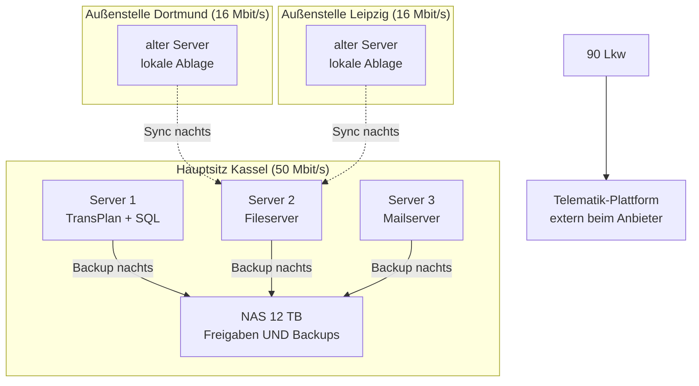

# Übungsaufgaben – Infrastruktur & Architektur

<span class='badge badge-praxis'>Aufgaben</span> &nbsp; Alle Aufgaben auf dieser Seite drehen sich um **ein** durchgehendes Szenario. Es sind schriftliche Denkaufgaben – du brauchst keinen Rechner, außer um auf den Theorieseiten nachzulesen. Zu jeder Aufgabe gibt es eine aufklappbare Musterlösung mit Erklärung.

Kurz zur Arbeitsweise: Beantworte jede Aufgabe **erst selbst schriftlich** – auf Papier oder in einer Textdatei – und klapp die Musterlösung erst danach auf. Wer die Lösung vorab liest, nimmt sich genau den Lerneffekt, um den es hier geht. Die Aufgaben bauen aufeinander auf, funktionieren aber auch einzeln. Wenn du irgendwo hängst, lies die in der Aufgabe verlinkte Theorieseite und versuch es noch einmal. Und was danach offen bleibt, bringst du einfach mit – besprochen wird beim nächsten Termin.

---

## Ausgangslage

Die **TransRegio Spedition GmbH** ist eine mittelständische Spedition mit 140 Mitarbeitern: Hauptsitz in Kassel, zwei Außenstellen in Dortmund und Leipzig. Die IT ist über Jahre gewachsen:

- 3 physische Server im Keller des Hauptsitzes (Windows Server 2019): Dispositionssoftware „TransPlan" mit SQL-Datenbank, Fileserver, Mailserver
- je Außenstelle ein älterer Server für die lokale Dateiablage, der nachts per Skript zum Hauptsitz synchronisiert
- 1 NAS mit 12 TB am Hauptsitz – darauf liegen die Dateifreigaben UND die nächtlichen Backups derselben Server
- Telematik: 90 Lkw senden Positions- und Fahrzeugdaten an eine extern gehostete Plattform des Telematik-Anbieters
- Personalakten und Bewerbungen liegen auf dem Fileserver in einem Ordner, auf den alle Mitarbeiter Lesezugriff haben
- Internetanbindung: Hauptsitz 50 Mbit/s, Außenstellen je 16 Mbit/s
- kein Monitoring, Dokumentation: eine Excel-Liste, zuletzt gepflegt 2021

Die Geschäftsführung plant die Übernahme eines Wettbewerbers (+60 Mitarbeiter, vierter Standort) und wünscht sich „möglichst wenig eigene Hardware in der Zukunft". Der Hersteller von TransPlan bietet die Software inzwischen auch als SaaS-Variante an. Du sollst die neue Ziel-Infrastruktur planen.

Dieselbe Ausgangslage als Bild – als Referenz beim Bearbeiten der Aufgaben:



---

## Die Aufgaben

### Aufgabe 1 – Schwachstellen finden

!!! info "Worum es geht"
    - Den Ist-Zustand mit dem Blick der **Bestandsanalyse** lesen: nicht nur beschreiben, was da ist, sondern erkennen, was daran gefährlich ist
    - Schwachstellen sauber **begründen** – die Folge benennen, nicht nur den Zustand
    - Theorie dazu: [Anforderungen & Sollkonzept](anforderungen-und-sollkonzept.md)

Lies die Ausgangslage noch einmal, diesmal mit dem Blick eines externen Beraters, der zum ersten Mal in den Keller in Kassel geführt wird. **Nenne vier technische oder organisatorische Schwachstellen** der bestehenden TransRegio-Infrastruktur und begründe zu jeder in 1–2 Sätzen, warum sie problematisch ist. Schreib ganze Sätze – die Begründung ist der eigentliche Kern der Aufgabe, nicht das Stichwort.

??? tip "Musterlösung & Erklärung"
    **1. Musterantwort** – vier Schwachstellen mit Begründung, so könnte eine sehr gute Antwort aussehen:

    | Schwachstelle | Warum problematisch? |
    |---|---|
    | Backups liegen auf demselben NAS wie die Originaldaten | Brand, Wasserschaden, Hardwaredefekt oder ein Verschlüsselungstrojaner treffen Original **und** Backup gleichzeitig. Ein Backup, das mit den Originaldaten untergeht, ist keins. |
    | Personalakten mit Lesezugriff für alle Mitarbeiter | Personalakten enthalten besonders schutzwürdige Daten (Gehälter, Krankmeldungen, Bewerbungen). Zugriff müsste auf die Personalabteilung beschränkt sein – die offene Freigabe ist ein Datenschutzverstoß mit realem Haftungsrisiko. |
    | Kein Monitoring | Ausfälle fallen erst auf, wenn sich Nutzer beschweren – im schlimmsten Fall montags um 7 Uhr die Disposition. Schleichende Probleme wie ein volllaufender Speicher werden gar nicht bemerkt, bis es knallt. |
    | Dokumentation: eine Excel-Liste von 2021 | Niemand weiß verlässlich, was wo läuft und wie es konfiguriert ist. Jede Störungssuche dauert länger, jede Planung (etwa die anstehende Übernahme) startet blind und das Wissen steckt in einzelnen Köpfen. |

    **2. Warum so?** – Das Denkmodell dahinter: Geh jede Komponente der Ausgangslage durch und stell zwei Fragen. Erstens: **Was passiert, wenn das ausfällt?** Zweitens: **Wer kann darauf zugreifen – und sollte er das dürfen?** Die erste Frage findet Verfügbarkeits-Schwachstellen, die zweite Vertraulichkeits-Schwachstellen. Eine gute Schwachstellen-Formulierung besteht immer aus zwei Teilen: dem Zustand („Backup auf demselben NAS") plus der Folge („geht bei einem Vorfall zusammen mit den Daten verloren"). Ohne den zweiten Teil ist es nur eine Beobachtung.

    **3. Auch gut wäre ...** – die Ausgangslage gibt deutlich mehr als vier Schwachstellen her. Genauso richtig sind zum Beispiel:

    - **Einzelserver ohne Redundanz:** Fällt der TransPlan-Server aus, steht die Disposition für 90 Lkw. Fällt der Mailserver aus, ist die Kommunikation mit Kunden und Fahrern weg. Es gibt keinen zweiten Server, der übernimmt.
    - **Alte Server in den Außenstellen:** Alter bedeutet steigende Ausfallwahrscheinlichkeit. Dazu kommt die nächtliche Skript-Synchronisation: Tagsüber laufen die Datenstände der Standorte auseinander und ob das Skript letzte Nacht überhaupt lief, merkt ohne Monitoring niemand.
    - **Knappe Anbindung der Außenstellen:** 16 Mbit/s sind schon heute wenig. Sobald Dienste zentralisiert oder in die Cloud verlagert werden, läuft der komplette Arbeitsverkehr über diese Leitung – sie wird zum Flaschenhals.
    - **Betriebssystem-Stand:** Windows Server 2019 ist in der zweiten Hälfte seines Lebenszyklus – der reguläre Support ist ausgelaufen, Sicherheitsupdates gibt es nur noch für begrenzte Zeit. Wer die Migration nicht rechtzeitig plant, betreibt danach Server ohne Sicherheitsupdates – ein offenes Einfallstor.

    Es gibt hier kein „die vier richtigen". Bewertet wird, ob deine vier echte Schwachstellen sind und ob die Begründung trägt.

    **4. Typischer Stolperstein** – zwei Fehler tauchen bei dieser Aufgabe immer wieder auf. Erstens: Stichworte ohne Begründung. „Kein Monitoring" allein ist eine Feststellung, keine Analyse – der Punkt steckt in der Folge. Zweitens: Lösungen statt Schwachstellen. „Die sollten in die Cloud gehen" ist keine Schwachstelle, sondern ein Lösungsvorschlag – der kommt erst später, wenn die Anforderungen stehen. Erst der Befund, dann die Therapie.

---

### Aufgabe 2 – Anforderungen formulieren

!!! info "Worum es geht"
    - Den Unterschied zwischen **funktionalen** und **nicht-funktionalen Anforderungen** anwenden statt nur aufsagen
    - Anforderungen so formulieren, dass man am Ende **nachprüfbar** sagen kann: erfüllt oder nicht erfüllt
    - Theorie dazu: [Anforderungen & Sollkonzept](anforderungen-und-sollkonzept.md)

Aus der Schwachstellenanalyse wird jetzt ein Zielbild. **Formuliere für die neue Ziel-Infrastruktur von TransRegio je drei funktionale und drei nicht-funktionale Anforderungen.** Die Regel dabei: Jede Anforderung muss messbar bzw. nachprüfbar sein. Stell dir vor, das Projekt ist fertig und jemand geht deine Liste durch – bei jeder Zeile muss er mit Ja oder Nein antworten können, ob sie erfüllt ist. „Das System soll zuverlässig sein" fällt bei diesem Test durch.

??? tip "Musterlösung & Erklärung"
    **1. Musterantwort** – so könnte eine sehr gute Antwort aussehen:

    Funktionale Anforderungen (was das System **können** muss):

    1. Die Disposition kann von allen vier Standorten auf denselben aktuellen Datenbestand zugreifen – ohne nächtliche Synchronisation.
    2. Jeder Mitarbeiter erreicht eine zentrale Dateiablage mit Berechtigungsgruppen; Personalakten sind ausschließlich für die Personalabteilung zugreifbar.
    3. Die Positionsdaten der 90 Lkw aus der Telematik-Plattform sind in der Disposition sichtbar.

    Nicht-funktionale Anforderungen (wie **gut** es das tun muss):

    1. TransPlan ist zu Geschäftszeiten (Mo–Sa, 6–20 Uhr) zu 99,5 % verfügbar.
    2. Nach einem Datenverlust ist die Dateiablage in höchstens 4 Stunden wiederhergestellt; es gehen maximal die Daten der letzten 24 Stunden verloren.
    3. Die Anmeldung an TransPlan dauert auch aus den Außenstellen unter 3 Sekunden.

    **2. Warum so?** – Die Trennlinie: Funktionale Anforderungen beschreiben, **was** das System tut (Zugriff, Ablage, Schnittstelle). Nicht-funktionale beschreiben, **wie gut** es das tut (Verfügbarkeit, Wiederherstellzeit, Antwortzeit). Mischformen sind im Alltag übrigens häufig: „Positionsdaten sichtbar und höchstens 5 Minuten alt" packt beides in einen Satz – das Sichtbarmachen ist funktional, die Aktualität wäre der nicht-funktionale Anteil derselben Anforderung. Und die Messbarkeit ist kein Formalismus: Eine schwammige Anforderung kann jeder Anbieter als „erfüllt" verkaufen. Der Unterschied im direkten Vergleich:

    | Schwammig | Messbar |
    |---|---|
    | „Das System soll schnell sein" | „Anmeldung unter 3 Sekunden" |
    | „Das System soll ausfallsicher sein" | „99,5 % Verfügbarkeit, Mo–Sa 6–20 Uhr" |
    | „Backups sollen zuverlässig funktionieren" | „Wiederherstellung in max. 4 Stunden, Datenverlust max. 24 Stunden" |

    Links kann man streiten, rechts kann man messen. Genau deshalb schreibt man Anforderungen so auf.

    **3. Auch gut wäre ...** – völlig andere Themen sind genauso richtig, solange sie nachprüfbar sind: eine Skalierungs-Anforderung („die Übernahme von 60 Mitarbeitern und einem vierten Standort ist ohne Architekturänderung möglich"), eine Monitoring-Anforderung („der Ausfall eines zentralen Dienstes löst innerhalb von 5 Minuten eine Alarmierung aus") oder eine Dokumentations-Anforderung („jede produktive Komponente ist zum Projektende in der Systemdokumentation erfasst"). Wichtig ist nur die Sortierung: Was das System *tut*, ist funktional – wie *gut*, ist nicht-funktional.

    **4. Typischer Stolperstein** – nicht-funktionale Anforderungen ohne Zahl. „Hohe Verfügbarkeit", „gute Performance", „sichere Ablage" klingen nach Anforderung, sind aber keine – ihnen fehlt das Kriterium, an dem man das Ergebnis misst. Der zweite Klassiker: eine Lösung als Anforderung tarnen. „Wir brauchen Microsoft 365" ist keine Anforderung, sondern eine vorweggenommene Entscheidung – die Anforderung dahinter wäre „standortübergreifende Zusammenarbeit an Dokumenten".

---

### Aufgabe 3 – Lastenheft oder Pflichtenheft?

!!! info "Worum es geht"
    - **Lastenheft** und **Pflichtenheft** auseinanderhalten: wer schreibt was, in welcher Reihenfolge, mit welchem Zweck
    - Die Rollenverteilung zwischen Auftraggeber und Auftragnehmer am konkreten Projekt durchspielen
    - Theorie dazu: [Anforderungen & Sollkonzept](anforderungen-und-sollkonzept.md)

TransRegio wird die neue Infrastruktur nicht komplett allein bauen, sondern ein Systemhaus beauftragen. Damit landen die Anforderungen aus Aufgabe 2 in einem Dokument – aber in welchem? **Erkläre in eigenen Worten (2–4 Sätze) den Unterschied zwischen Lastenheft und Pflichtenheft.** Formuliere anschließend **je zwei Beispiel-Einträge** für das TransRegio-Projekt: zwei Einträge, die ins Lastenheft gehören und zwei, die ins Pflichtenheft gehören.

??? tip "Musterlösung & Erklärung"
    **1. Musterantwort** – die Erklärung: Das **Lastenheft** schreibt der **Auftraggeber** (hier: TransRegio). Es beschreibt, **was** gebraucht wird und **wofür** – die Anforderungen und Ziele, bewusst lösungsneutral. Das **Pflichtenheft** schreibt der **Auftragnehmer** (das Systemhaus) als Antwort darauf. Es beschreibt, **wie** und **womit** er die Anforderungen konkret umsetzen will. Erst kommt also das Lastenheft, dann das Pflichtenheft – das eine ist die Frage, das andere die Antwort.

    Beispiel-Einträge fürs **Lastenheft** (TransRegio formuliert den Bedarf):

    1. „Alle vier Standorte benötigen Zugriff auf dieselbe aktuelle Dispositionsdatenbank; der Ausfall eines Standorts darf die anderen nicht beeinträchtigen."
    2. „Personalakten und Bewerbungen dürfen ausschließlich für die Personalabteilung zugänglich sein; jeder Zugriff muss nachvollziehbar sein."

    Beispiel-Einträge fürs **Pflichtenheft** (das Systemhaus beschreibt seine Lösung):

    1. „Die Disposition wird auf die SaaS-Variante von TransPlan umgestellt. Der Zugriff erfolgt je Standort per Browser über eine verschlüsselte Verbindung; die Datenmigration aus der bestehenden SQL-Datenbank übernimmt der Hersteller nach dem in Anlage 2 beschriebenen Verfahren."
    2. „Die Dateiablage wird als zentraler Cloud-Speicher mit Berechtigungsgruppen umgesetzt. Der Bereich ‚Personal‘ erhält eine eigene Gruppe, verschlüsselte Ablage und Zugriffsprotokollierung; die bisherigen offenen Freigaben werden abgelöst."

    **2. Warum so?** – Die Eselsbrücke, die hängen bleibt: Im **Lastenheft** steht die **Last**, die der Auftraggeber loswerden will – **WAS** und **WOFÜR**. Im **Pflichtenheft** stehen die **Pflichten**, zu denen sich der Auftragnehmer verpflichtet – **WIE** und **WOMIT**. Die Trennung hat einen handfesten Grund: Der Auftraggeber kennt sein Geschäft am besten, der Auftragnehmer die technischen Lösungen. Schreibt TransRegio dem Systemhaus die Technik vor, verschenkt es die Kompetenz, für die es bezahlt – und trägt hinterher selbst die Verantwortung, wenn die vorgeschriebene Lösung nicht passt. Vergleich die Einträge oben: Die Lastenheft-Sätze funktionieren mit jeder denkbaren Lösung, die Pflichtenheft-Sätze legen sich fest.

    **3. Auch gut wäre ...** – jede Anforderung aus Aufgabe 2 taugt als Lastenheft-Eintrag, jede konkrete Umsetzungsbeschreibung als Pflichtenheft-Eintrag. Auch organisatorische Punkte gehören ins Lastenheft: „Die Umstellung darf den laufenden Speditionsbetrieb nicht unterbrechen" oder „das Projekt muss vor der Übernahme des Wettbewerbers abgeschlossen sein". Im Pflichtenheft dürfen dafür Produktnamen, Mengen und Verfahren stehen – genau das, was im Lastenheft nichts verloren hat.

    **4. Typischer Stolperstein** – technische Lösungen im Lastenheft. „Wir wollen zwei Server mit je 64 GB RAM und Hypervisor X" ist kein Lastenheft-Eintrag, sondern eine vorweggenommene Pflichtenheft-Entscheidung. Der zweite häufige Fehler ist die Richtung: Wer schreibt was? Merk dir die Reihenfolge als Dialog – der Auftraggeber fragt (Lastenheft), der Auftragnehmer antwortet (Pflichtenheft). Ein Pflichtenheft ohne vorheriges Lastenheft beantwortet eine Frage, die nie gestellt wurde.

---

### Aufgabe 4 – Wohin mit welcher Komponente?

!!! info "Worum es geht"
    - Die Architekturformen **on-premise**, **Public Cloud/SaaS** und **hybrid** auf einen echten Fall anwenden
    - Entscheidungen an **Kriterien** festmachen: Datenempfindlichkeit, Skalierung, Anbindung, Betriebsaufwand
    - Theorie dazu: [Architekturen: zentral, dezentral, Cloud](architekturen.md)

Jetzt wird verortet. Die Geschäftsführung wünscht sich „möglichst wenig eigene Hardware" – aber pauschal alles in die Cloud zu schieben, wäre genauso unüberlegt wie pauschal alles im Keller zu lassen. **Ordne die folgenden vier Komponenten je einer Zielumgebung zu** – on-premise, Public Cloud/SaaS oder hybrid – **und begründe jede Entscheidung mit mindestens einem Kriterium** aus dieser Liste: Datenempfindlichkeit, Skalierung, Anbindung, Betriebsaufwand.

1. Dispositionssoftware TransPlan (SaaS-Variante des Herstellers verfügbar)
2. Dateiablage (heute: Fileserver plus Außenstellen-Server plus Nacht-Sync)
3. Telematik-Plattform (heute schon extern gehostet)
4. Personalakten und Bewerbungen

??? tip "Musterlösung & Erklärung"
    **1. Musterantwort** – eine gut begründete Variante:

    | Komponente | Zielumgebung | Begründung (Kriterium) |
    |---|---|---|
    | TransPlan | Public Cloud (SaaS des Herstellers) | **Betriebsaufwand:** Updates, Datenbank und Verfügbarkeit übernimmt der Hersteller. **Skalierung:** 60 neue Mitarbeiter und ein vierter Standort sind Lizenzen, kein Serverkauf. |
    | Dateiablage | Public Cloud (zentraler Cloud-Speicher) | **Anbindung:** Vier Standorte greifen gleichberechtigt auf einen Stand zu – die fehleranfälligen Nacht-Syncs und die Außenstellen-Server entfallen ersatzlos. |
    | Telematik-Plattform | Public Cloud (SaaS) – bleibt, wo sie ist | **Betriebsaufwand:** Sie läuft bereits extern beim Anbieter und funktioniert. Es gibt keinen Grund, eine Spezialplattform selbst betreiben zu wollen. |
    | Personalakten | on-premise, in einem eigenen, streng berechtigten Bereich | **Datenempfindlichkeit:** Besonders schutzwürdige Daten, kleiner Nutzerkreis (nur Personalabteilung), kein Skalierungsdruck – die Kontrolle im eigenen Haus wiegt hier schwerer als der Betriebsaufwand. |

    In Summe ist die Ziel-Architektur damit **hybrid**: der Großteil in der Cloud, ein bewusst gewählter Rest im eigenen Haus.

    **2. Warum so?** – Das Denkmodell: Es gibt keine richtige Zielumgebung pro Firma, nur eine begründbare Zielumgebung **pro Komponente**. Für jede Komponente wägst du die Kriterien gegeneinander ab – bei TransPlan dominiert der Betriebsaufwand, bei den Personalakten die Datenempfindlichkeit, bei der Dateiablage die Anbindung der Standorte. Der Wunsch der Geschäftsführung („wenig eigene Hardware") ist dabei ein Kriterium unter mehreren – er gibt die Richtung vor, sticht aber nicht automatisch die Datenempfindlichkeit.

    **3. Auch gut wäre ...** – und das ist bei dieser Aufgabe der wichtigste Satz: **Andere Zuordnungen sind mit passender Begründung genauso richtig.** Personalakten in einer europäischen Cloud mit Verschlüsselung, sauberem Berechtigungskonzept und Zugriffsprotokollierung? Vertretbar – viele Unternehmen machen genau das. Die Dateiablage vorerst on-premise lassen, weil die Außenstellen mit 16 Mbit/s einen reinen Cloud-Zugriff kaum stemmen und der Leitungsausbau erst kommt? Ebenfalls vertretbar. Bewertet wird die Begründung, nicht das Lager. Eine schwach begründete „richtige" Zuordnung ist schlechter als eine gut begründete andere.

    **4. Typischer Stolperstein** – Pauschalurteile in beide Richtungen: „Cloud ist unsicher, also bleiben die Personalakten im Keller" ist genauso wenig eine Begründung wie „Cloud ist modern, also alles rein". Beides ersetzt die Abwägung durch ein Bauchgefühl. Der zweite häufige Fehler: die **Anbindung vergessen**. Wer alle Dienste in die Cloud verlagert, macht die Internetleitung zur Lebensader – bei 16 Mbit/s in den Außenstellen muss die Leitung mitgeplant werden, sonst steht die schöne Cloud-Architektur im Stau.

---

### Aufgabe 5 – IaaS, PaaS oder SaaS?

!!! info "Worum es geht"
    - Die drei Cloud-Servicemodelle **IaaS**, **PaaS** und **SaaS** unterscheiden – über die Frage, **wer welche Schicht betreibt**
    - Konkrete Angebote dem richtigen Modell zuordnen, statt Definitionen auswendig aufzusagen
    - Theorie dazu: [Architekturen: zentral, dezentral, Cloud](architekturen.md)

Das Systemhaus legt TransRegio drei Cloud-Angebote vor. **Erkläre zunächst die drei Servicemodelle IaaS, PaaS und SaaS in je einem Satz.** Ordne dann jedes Angebot dem passenden Modell zu und begründe kurz:

- **(a)** TransPlan als Mietsoftware des Herstellers – die Disponenten arbeiten komplett im Browser
- **(b)** eine gemietete virtuelle Maschine bei einem Cloud-Anbieter, auf der die TransRegio-IT den Fileserver selbst installiert und betreibt
- **(c)** eine gemanagte Datenbank beim Cloud-Anbieter, in die die TransPlan-Daten wandern, während TransRegio die Anwendung selbst weiterbetreibt

??? tip "Musterlösung & Erklärung"
    **1. Musterantwort** – die drei Modelle in je einem Satz:

    - **IaaS** (Infrastructure as a Service): Der Anbieter stellt virtuelle Infrastruktur bereit – Rechenleistung, Speicher, Netz – und alles ab dem Betriebssystem aufwärts installierst, patchst und betreibst du selbst.
    - **PaaS** (Platform as a Service): Der Anbieter betreibt zusätzlich die Plattform – etwa Laufzeitumgebung oder Datenbank – und du kümmerst dich nur noch um deine Anwendung und deine Daten.
    - **SaaS** (Software as a Service): Der Anbieter betreibt die komplette, fertige Anwendung – du nutzt sie nur noch, typischerweise im Browser.

    Die Zuordnung: **(a) SaaS** – die Disponenten nutzen eine fertige Anwendung, der Hersteller betreibt alles. **(b) IaaS** – gemietet ist nur die nackte VM; Betriebssystem, Fileserver-Dienst, Patches und Backups bleiben Sache der TransRegio-IT. **(c) PaaS** – die Datenbank ist gemanagt (der Anbieter kümmert sich um Betrieb, Updates, Sicherung der Datenbank-Software), die Anwendung darüber betreibt TransRegio weiter selbst.

    **2. Warum so?** – Das Sortierwerkzeug ist die **Verantwortungs-Treppe**: Schicht für Schicht wandert die Verantwortung vom eigenen Haus zum Anbieter.

    | Schicht | on-premise | IaaS | PaaS | SaaS |
    |---|---|---|---|---|
    | Daten | du | du | du | du |
    | Anwendung | du | du | du | Anbieter |
    | Datenbank / Laufzeit | du | du | Anbieter | Anbieter |
    | Betriebssystem | du | du | Anbieter | Anbieter |
    | Server, Speicher, Netz | du | Anbieter | Anbieter | Anbieter |

    Die entscheidende Frage ist also nie „Wo läuft es?", sondern „**Wer betreibt welche Schicht?**". Genau daran erkennst du jedes Angebot: Bei (a) steht in jeder Betriebs-Zeile „Anbieter" – nur die Daten bleiben Sache von TransRegio –, bei (b) übernimmt der Anbieter nur die unterste Zeile, bei (c) verläuft die Grenze in der Mitte. Und die oberste Zeile ändert sich nie: Für die Daten bist du in jedem Modell selbst verantwortlich.

    **3. Auch gut wäre ...** – wer die Zuordnung über eigene Erfahrung begründet, liegt genauso richtig. Die gemietete VM aus (b) fühlt sich an wie eine selbst erstellte Multipass-VM – nur dass die Hardware darunter jemand anderem gehört; alles, was du dort per Hand installiert hast, müsstest du hier auch installieren. Und ein gemanagter Kubernetes-Cluster beim Cloud-Anbieter ist ein weiteres PaaS-Beispiel: Der Anbieter betreibt die Plattform, du bringst deine Container mit. Auch die Formulierung „SaaS = fertige Software mieten, IaaS = virtuelle Hardware mieten, PaaS = dazwischen" trifft den Kern.

    **4. Typischer Stolperstein** – „Es liegt in der Cloud, also ist es SaaS." Nein: Die gemietete VM aus (b) liegt in der Cloud, ist aber **IaaS** – Patchen, Härten, Sichern und der 2-Uhr-nachts-Anruf bei einem Ausfall des Fileserver-Dienstes bleiben bei der TransRegio-IT. Das Servicemodell beschreibt die **Verantwortungsverteilung**, nicht den Standort. Wer das verwechselt, mietet eine VM, glaubt sich alle Betriebspflichten los und merkt es erst, wenn das erste ungepatchte System kompromittiert ist.

---

### Aufgabe 6 – Private oder public?

!!! info "Worum es geht"
    - Den Unterschied zwischen **Public Cloud** und **Private Cloud** in eigenen Worten erklären
    - Eine pauschale Management-Ansage („alles zum großen Anbieter") gegen die konkreten Daten des Unternehmens prüfen
    - Cloud-Entscheidungen an Anforderungen festmachen statt an Bauchgefühl
    - Theorie dazu: [Architekturen: zentral, dezentral, Cloud](architekturen.md)

Die Geschäftsführung kommt von einem Logistik-Kongress zurück und hat eine klare Ansage mitgebracht: „Wir wollen alles zum großen Cloud-Anbieter – weg mit den Servern im Keller." Bevor du planst, sortierst du erst einmal die Begriffe.

1. Erkläre in je zwei bis drei Sätzen, was eine **Public Cloud** und was eine **Private Cloud** ist.
2. Geh die Daten der TransRegio durch: Für welche Daten wäre „alles zum großen Anbieter" ohne weitere Überlegung problematisch? Begründe kurz.
3. Nenne zwei Optionen, wie TransRegio mit genau diesen Daten umgehen kann, ohne den Cloud-Plan insgesamt zu kippen.

??? tip "Musterlösung & Erklärung"
    **1. Musterantwort**

    *Public Cloud:* Ein großer Anbieter betreibt Rechenzentren, deren Ressourcen sich viele Kunden teilen. TransRegio mietet Rechenleistung, Speicher oder fertige Dienste nach Verbrauch – Betrieb, Wartung und Skalierung liegen beim Anbieter. Die künftige TransPlan-SaaS-Variante wäre ein typisches Public-Cloud-Angebot.

    *Private Cloud:* Dieselbe Cloud-Technik – Selbstbedienung, Ressourcen-Pools, flexible Skalierung –, aber die Infrastruktur steht exklusiv für ein Unternehmen bereit: im eigenen Rechenzentrum oder als dedizierte Umgebung bei einem Dienstleister. Mehr Kontrolle über Ort und Zugriff, dafür mehr eigener Aufwand oder höhere Kosten.

    *Problematischer Kandidat:* die **Personalakten und Bewerbungen**. Das sind besonders schutzwürdige personenbezogene Daten – Gehälter, Krankmeldungen, Bewerbungsunterlagen. Bei ihnen muss TransRegio genau wissen, wo sie liegen, wer zugreifen kann und was vertraglich mit dem Anbieter geregelt ist. Verschärfend: Schon heute ist der Zugriff kaputt, denn alle 140 Mitarbeiter haben Lesezugriff auf den Ordner.

    *Zwei Optionen:*

    - **Hybrid-Ansatz:** Der unkritische Teil (Dateiablage, TransPlan als SaaS) geht in die Public Cloud, die Personaldaten bleiben on-premise oder in einer Private-Cloud-Umgebung mit klar geregeltem Zugriff.
    - **Public Cloud mit Auflagen:** Auch Personaldaten können zum großen Anbieter – dann aber mit vertraglich zugesichertem Datenstandort (z. B. Rechenzentrum in der EU), einem Vertrag zur Auftragsverarbeitung und vor allem einem sauberen **Rechte-Konzept**: Zugriff nur für Personalabteilung und Geschäftsführung, protokolliert.

    **2. Warum so?**

    Die Frage „private oder public?" ist keine Glaubensfrage, sondern eine Anforderungsfrage. Du gehst die Daten durch und fragst pro Kategorie: Wie schutzwürdig ist das, was fordert das Gesetz, was fordert der Betrieb? Frachtdokumente und Tourenpläne haben andere Anforderungen als Personalakten. Erst aus dieser Einordnung folgt die Architektur – meistens landet man bei einem Mix, nicht bei „alles oder nichts".

    **3. Auch gut wäre ...**

    - die **Telematikdaten** als zweiten Diskussionskandidaten zu nennen: Positionsdaten von 90 Lkw sind auf Fahrer beziehbar. Der Punkt ist berechtigt – nur liegen diese Daten heute schon extern beim Telematik-Anbieter, die Frage ist dort also längst eine Vertragsfrage.
    - eine **Community Cloud** als dritte Betriebsform zu erwähnen (gemeinsame Umgebung mehrerer Organisationen mit ähnlichen Anforderungen) – für eine einzelne Spedition praktisch selten, als Begriff aber korrekt.
    - der Hinweis, dass das Rechte-Konzept **unabhängig vom Ort** repariert werden muss: Der offene Personalordner ist auch on-premise nicht in Ordnung.

    **4. Typischer Stolperstein**

    Der Kurzschluss „Public Cloud = unsicher, eigener Keller = sicher". Das ist Bauchgefühl, keine Analyse. Ein großes Cloud-Rechenzentrum ist gegen Einbruch, Brand und Angriffe meist deutlich besser abgesichert als drei Server im Keller einer Spedition – der offene Personalordner liegt heute on-premise und ist trotzdem das größte Datenschutzproblem der Firma. Es geht nicht darum, **wo** ein Logo drüber hängt, sondern um Anforderungen, Verträge und Kontrolle: Wer darf zugreifen, wo liegen die Daten, was ist zugesichert?

---

### Aufgabe 7 – Speicher planen

!!! info "Worum es geht"
    - Die Nettokapazität eines **RAID-5**-Verbunds berechnen und den Plattenausfall durchspielen
    - Den Speicherbedarf mit Wachstum und Reserve kalkulieren und die passende **Anbindungsform** (NAS oder SAN) wählen
    - Die wichtigste Grenze der Speicherplanung ziehen: **Redundanz ist keine Datensicherung**
    - Theorie dazu: [Speicherlösungen](speicherloesungen.md)

Für den Hauptsitz ist – für die Daten, die im Haus bleiben und als lokale Backup-Stufe – ein zentrales Speichersystem geplant: **4 Platten zu je 8 TB, konfiguriert als RAID 5**.

1. Berechne die nutzbare Nettokapazität des Verbunds und erkläre in zwei bis drei Sätzen, was passiert, wenn im laufenden Betrieb eine der vier Platten ausfällt.
2. Heute liegen bei TransRegio die Dateifreigaben **und** die nächtlichen Backups derselben Server auf ein und demselben NAS. Erkläre, warum das auch mit RAID keine Datensicherung ist – nenne mindestens drei Szenarien, in denen dieses Konzept versagt.
3. Auf dem alten NAS liegen heute 9 TB Nutzdaten (Backups nicht mitgerechnet). Kalkuliere mit 15 % Wachstum pro Jahr – die Übernahme des Wettbewerbers ist darin schon enthalten –, einem Planungshorizont von 3 Jahren und 20 % Reserve: Wie viel Nettokapazität muss das neue System bieten und reicht der RAID-5-Verbund aus Teil 1 dafür?
4. TransRegio betreibt heute ein NAS. Erkläre, warum diese Anbindungsform für Dateifreigaben passt – und welche Anbindungsform stattdessen nötig wäre, wenn der Hauptsitz künftig einen Virtualisierungs-Cluster betreiben will, dessen Hosts sich einen gemeinsamen, schnellen Speicher teilen.

??? tip "Musterlösung & Erklärung"
    **1. Musterantwort**

    *Teil a – Nettokapazität:* Bei RAID 5 geht die Kapazität **einer** Platte für Paritätsinformationen ab, die über alle Platten verteilt gespeichert werden. Rechnung:

    ```text
    (4 - 1) x 8 TB = 24 TB Nettokapazität
    ```

    Fällt eine Platte aus, läuft der Verbund **degradiert** weiter: Die fehlenden Daten werden bei jedem Zugriff aus den Paritätsinformationen der übrigen Platten rekonstruiert, der Betrieb geht ohne Datenverlust weiter – aber langsamer und **ohne weitere Reserve**. Fällt jetzt eine zweite Platte aus, sind die Daten weg. Nach dem Tausch der defekten Platte baut der Controller den Verbund im **Rebuild** neu auf; das kann bei 8-TB-Platten viele Stunden dauern und in dieser Zeit bleibt der Verbund verwundbar.

    *Teil b – warum das NAS-Konzept keine Datensicherung ist:* RAID schützt genau gegen eine Sache: den **Hardware-Ausfall einzelner Platten**. Gegen alles andere schützt es nicht – im Gegenteil, das RAID repliziert Fehler zuverlässig mit:

    - **Versehentliches Löschen oder Überschreiben:** Die Löschung landet sofort auf allen Platten des Verbunds.
    - **Verschlüsselungstrojaner:** Ein Erpressungstrojaner verschlüsselt die Freigaben – und die Backups gleich mit, denn sie liegen auf demselben Gerät im selben Netz.
    - **Brand, Wasserschaden, Diebstahl, Überspannung:** Ein einziges Ereignis im Keller des Hauptsitzes vernichtet Original und Backup gleichzeitig.

    Datensicherung braucht deshalb **getrennte Kopien**: mehrere Kopien auf verschiedenen Medien, davon mindestens eine räumlich getrennt vom Original – die **3-2-1-Regel** von der Speicherseite (drei Kopien, zwei verschiedene Medien, eine außer Haus).

    *Teil c – Kapazitätsbedarf:* Wachstum wirkt auf den jeweils neuen Stand, nicht auf den alten:

    ```text
    Jahr 1:   9,0 TB x 1,15  =  10,4 TB
    Jahr 2:  10,4 TB x 1,15  =  11,9 TB
    Jahr 3:  11,9 TB x 1,15  =  13,7 TB

    + 20 % Reserve           =  rund 16,4 TB Netto-Bedarf
    ```

    Die 24 TB netto aus Teil 1 reichen dafür mit ordentlich Luft – gut so, denn zwischen „reicht rechnerisch genau" und „reicht" liegt in der Speicherplanung immer ein Puffer.

    *Teil d – NAS oder SAN:* Ein **NAS** liefert Dateifreigaben (SMB/NFS) übers normale LAN – genau richtig für viele Nutzer auf gemeinsamen Ordnern, also für die heutige Dateiablage. Ein Virtualisierungs-Cluster braucht dagegen **Blockspeicher**, den sich alle Hosts als Shared Storage teilen – also ein **SAN** (iSCSI oder Fibre Channel). Erwähnenswert: Viele NAS-Geräte können zusätzlich iSCSI und spielen für kleine Umgebungen das SAN mit.

    **2. Warum so?**

    RAID und Backup beantworten zwei verschiedene Fragen. RAID beantwortet: „Läuft der Betrieb weiter, wenn eine Platte stirbt?" – das ist **Verfügbarkeit**. Backup beantwortet: „Komme ich an den Stand von gestern, wenn heute etwas zerstört wurde?" – das ist **Wiederherstellbarkeit**. Wer beides auf ein Gerät legt, hat die erste Frage doppelt beantwortet und die zweite gar nicht.

    **3. Auch gut wäre ...**

    - die Rechnung als Formel zu nennen: Nettokapazität bei RAID 5 = (n - 1) x Plattengröße.
    - anzumerken, dass bei so großen Platten **RAID 6** (doppelte, verteilte Parität – es geht die Kapazität von zwei Platten ab, hier dann 16 TB netto) eine Überlegung wert ist – gerade wegen der langen Rebuild-Zeiten, in denen ein zweiter Ausfall bei RAID 5 tödlich wäre.
    - als Lösungsvorschlag fürs Backup ein zweites Ziel zu nennen: ein Backup-System an einer Außenstelle oder ein Cloud-Backup – Hauptsache räumlich und logisch getrennt.

    **4. Typischer Stolperstein**

    Der Satz „Wir haben doch RAID, wir sind gesichert." RAID fühlt sich wie Sicherheit an, weil es gegen den sichtbarsten Ausfall schützt – die kaputte Platte. Die häufigsten Datenverluste im Alltag sind aber versehentliches Löschen und Verschlüsselungstrojaner. Gegen beide ist RAID wirkungslos, weil es jede Änderung sofort mitschreibt – auch die falsche. Und bei Teil c: Wer linear rechnet (9 + 3 x 1,35 = rund 13 TB), unterschätzt den Bedarf – Wachstum wirkt auf den jeweils neuen Stand.

---

### Aufgabe 8 – Vier Dimensionen

!!! info "Worum es geht"
    - Die vier Ressourcen-Dimensionen – technisch, personell, zeitlich, finanziell – auf ein konkretes Projekt anwenden
    - Den Blick dafür üben, dass ein Migrationsprojekt an mehr scheitern kann als an Technik
    - Theorie dazu: [Ressourcen planen](ressourcen-planen.md)

Die TransRegio startet das Migrationsprojekt: TransPlan wird auf die SaaS-Variante umgestellt, die Dateiablage wandert in die Cloud, die Keller-Server werden abgebaut, der vierte Standort kommt dazu.

Benenne für dieses Projekt **je zwei konkrete Beispiele** für technische, personelle, zeitliche und finanzielle Ressourcen, die eingeplant werden müssen. Eine Tabelle ist erlaubt und empfehlenswert. Bleib konkret am Szenario – „ein Server" ist zu allgemein, „Bandbreiten-Upgrade am Hauptsitz" ist konkret.

??? tip "Musterlösung & Erklärung"
    **1. Musterantwort**

    | Dimension | Beispiel 1 | Beispiel 2 |
    |---|---|---|
    | **technisch** | Bandbreiten-Upgrade der Anbindungen: 50 Mbit/s am Hauptsitz und je 16 Mbit/s an den Außenstellen reichen nicht, wenn Disposition und Dateiablage künftig übers Internet laufen | Migrationswerkzeuge und eine Testumgebung, um den Umzug der TransPlan-Datenbank vorab durchzuspielen |
    | **personell** | Schulung der IT-Mitarbeiter für den Cloud-Betrieb (Administration, Rechteverwaltung, Kostenkontrolle) | Arbeitszeit der Fachabteilung Disposition für Tests und Abnahme der SaaS-Variante – die kennen die Abläufe, nicht die IT |
    | **zeitlich** | ein Migrationsfenster für den TransPlan-Umzug außerhalb der Disposition, z. B. ein Wochenende, plus eine Phase Parallelbetrieb | zeitliche Abstimmung mit der Übernahme des Wettbewerbers – der vierte Standort soll auf die **neue** Infrastruktur, nicht erst auf die alte |
    | **finanziell** | laufende Kosten: SaaS-Abos, Cloud-Speicher, stärkere Internetleitungen | einmaliges Projektbudget: externer Dienstleister für die Migration, Schulungen, eventuell Ablösekosten für Altverträge |

    Der wahrscheinlichste **Engpass** ist hier die personelle Dimension: Eine Spedition mit 140 Mitarbeitern hat eine kleine IT, die bisher Windows-Server im Keller betreut hat – Cloud-Administration ist ein anderes Berufsbild. Dass die Dokumentation seit 2021 nicht gepflegt wurde, ist ein deutliches Zeichen, dass das Tagesgeschäft die vorhandenen Leute schon heute auslastet. Ein Migrationsprojekt **neben** dem Tagesgeschäft scheitert selten an fehlenden Servern, oft an fehlenden Stunden und fehlendem Know-how.

    **2. Warum so?**

    Die vier Dimensionen sind eine Checkliste gegen den Tunnelblick. Techniker planen Technik von allein – vergessen aber gern, dass jemand die neue Umgebung bedienen können muss (personell), dass der Umzug ein Zeitfenster braucht, in dem 90 Lkw trotzdem disponiert werden (zeitlich) und dass aus Investitionskosten laufende Kosten werden (finanziell). Wer alle vier Spalten füllen kann, hat das Projekt einmal komplett durchdacht.

    **3. Auch gut wäre ...**

    - andere konkrete Beispiele in jeder Zelle – etwa VPN-Anbindung des vierten Standorts (technisch), Einarbeitung der übernommenen IT-Kollegen (personell), Kündigungsfristen alter Wartungsverträge als zeitliche Randbedingung, Vergleichsangebote mehrerer Cloud-Anbieter (finanziell).
    - eine andere begründete Engpass-Wahl: Auch „zeitlich" ist vertretbar, wenn die Übernahme einen harten Stichtag setzt. Wichtig ist die Begründung, nicht die eine richtige Antwort.

    **4. Typischer Stolperstein**

    Alle vier Spalten mit Technik zu füllen: „Server, Speicher, Netzwerk, Lizenzen" – das sind zwei technische und zwei finanzielle Punkte, keine vier Dimensionen. Die personelle und die zeitliche Spalte fragen nach Menschen und Kalender: Wer macht es, wer lernt es, wann passiert es, was läuft solange parallel?

---

### Aufgabe 9 – CapEx, OpEx und der Stundenpreis

!!! info "Worum es geht"
    - **CapEx** und **OpEx** unterscheiden und reale Kostenposten zuordnen
    - Ein Pay-as-you-go-Beispiel durchrechnen und erkennen, wann nutzungsbasierte Abrechnung ihren Vorteil ausspielt
    - Theorie dazu: [Ressourcen planen](ressourcen-planen.md)

Die Geschäftsführung fragt beim Budgetgespräch: „Was heißt das eigentlich für unsere Kostenstruktur, wenn wir in die Cloud gehen?"

1. Erkläre **CapEx** und **OpEx** in je einem Satz.
2. Ordne zu: die drei Keller-Server von heute, die künftige TransPlan-SaaS-Miete, eine nach Stunden abgerechnete Test-VM in der Cloud.
3. Rechne: Die Test-VM kostet 0,20 Euro pro Stunde und läuft nur werktags 8 Stunden am Tag. Was kostet sie im Monat (ca. 22 Arbeitstage)? Was würde im Vergleich ein 24/7-Dauerbetrieb kosten (30 Tage)?

??? tip "Musterlösung & Erklärung"
    **1. Musterantwort**

    *Definitionen:* **CapEx** (Capital Expenditure) sind einmalige Investitionsausgaben für Anschaffungen, die dem Unternehmen längerfristig gehören und über mehrere Jahre abgeschrieben werden. **OpEx** (Operational Expenditure) sind laufende Betriebsausgaben, die regelmäßig oder nutzungsabhängig anfallen und direkt in die laufenden Kosten gehen.

    *Zuordnung:*

    | Posten | Kategorie | Begründung |
    |---|---|---|
    | drei Keller-Server | **CapEx** | einmalig gekauft, gehören der Firma, werden abgeschrieben |
    | TransPlan-SaaS-Miete | **OpEx** | monatliche Miete, keine Anschaffung, endet mit dem Vertrag |
    | Test-VM nach Stunden | **OpEx** | reine Nutzungsabrechnung – läuft nichts, kostet fast nichts (nur gebuchter Speicher läuft weiter) |

    *Rechnung:*

    ```text
    werktags:      8 h x 22 Tage x 0,20 Euro =  35,20 Euro pro Monat
    Dauerbetrieb: 24 h x 30 Tage x 0,20 Euro = 144,00 Euro pro Monat
    ```

    Der Dauerbetrieb kostet mehr als das Vierfache – für dieselbe VM.

    **2. Warum so?**

    Die Rechnung zeigt das Prinzip hinter **Pay-as-you-go**: Bezahlt wird Nutzung, nicht Besitz. Für eine Test-VM, die nur zu Bürozeiten gebraucht wird, ist das ideal – nachts und am Wochenende fällt einfach nichts an, ein eigener Server im Keller würde dagegen durchlaufen und Strom ziehen. Die Kehrseite steckt in der zweiten Zeile: Bei **Dauerlast** verliert der Stundenpreis seinen Charme. Für Systeme, die sowieso 24/7 laufen müssen, kann eine feste Reservierung beim Cloud-Anbieter oder klassischer Eigenbetrieb günstiger sein. Die Cloud verschiebt Kosten von CapEx zu OpEx – ob das billiger wird, entscheidet das Lastprofil.

    **3. Auch gut wäre ...**

    - der Hinweis, dass auch die Keller-Server laufende Kosten erzeugen (Strom, Kühlung, Wartungsverträge, Admin-Zeit) – die Anschaffung ist CapEx, der Betrieb drumherum ist OpEx. Die Zuordnung „CapEx" meint den Charakter der Hauptausgabe.
    - anzumerken, dass abschaltbare Umgebungen nur sparen, wenn sie **wirklich abgeschaltet werden** – organisatorisch oder per Zeitplan automatisiert. Eine vergessene VM läuft die 144 Euro klaglos voll.
    - der Bezug zur Geschäftsführung: „möglichst wenig eigene Hardware" heißt genau dieser Wechsel – weg von großen Einmalinvestitionen, hin zu planbaren Monatskosten.

    **4. Typischer Stolperstein**

    Aus der ersten Zeile der Rechnung den Schluss zu ziehen: „Cloud ist immer billiger." Der Vergleich 33,60 gegen 144,00 Euro vergleicht nicht Cloud gegen Keller, sondern **Teilzeitbetrieb gegen Dauerbetrieb** in derselben Cloud. Wer eine Dauerlast zum Stundenpreis in die Cloud hebt, zahlt unter Umständen mehr als vorher – der OpEx-Vorteil kommt aus der Flexibilität, nicht aus dem Preisschild.

---

### Aufgabe 10 – Kaufen, mieten oder Open Source?

!!! info "Worum es geht"
    - Eine **Kauflizenz** mit einem **SaaS-Abo** über die Laufzeit vergleichen
    - Erkennen, dass die Rechnung nur die halbe Entscheidung ist: nicht-finanzielle Kriterien und Vertragsdetails entscheiden mit
    - Theorie dazu: [Lizenzmodelle](lizenzmodelle.md)

Der TransPlan-Hersteller macht zwei Angebote:

- **Kauflizenz:** 18.000 Euro einmalig, dazu 20 % des Kaufpreises pro Jahr für Wartung und Updates
- **SaaS-Abo:** 450 Euro pro Monat, Betrieb, Updates und Support inklusive

Dazu drei Arbeitsaufträge:

1. Vergleiche die Gesamtkosten beider Varianten über **5 Jahre**.
2. Nenne **zwei nicht-finanzielle Kriterien**, die in die Entscheidung gehören.
3. Worauf muss TransRegio bei der Abo-Variante **vertraglich** achten? Nenne zwei Punkte.
4. **Zusatz, wenn du schnell warst:** Baue aus deinen Kriterien aus Teil 2 plus den Gesamtkosten eine kleine **Nutzwertanalyse**: Gewichte die Kriterien (zusammen 100 %), vergib für beide Angebote Punkte von 1 bis 10 und bilde die gewichtete Summe. Bei welcher Gewichtung kippt das Ergebnis?

??? tip "Musterlösung & Erklärung"
    **1. Musterantwort**

    *Kostenvergleich:* Die Wartung kostet 20 % von 18.000 Euro = **3.600 Euro pro Jahr**. Jetzt kommt es darauf an, ab wann sie fällig ist – das Angebot lässt es offen, also rechnest du beide Lesarten:

    ```text
    SaaS-Abo:                  60 Monate x 450 Euro           = 27.000 Euro

    Kauf, Wartung ab Jahr 2:   18.000 + 4 x 3.600             = 32.400 Euro
    Kauf, Wartung ab Jahr 1:   18.000 + 5 x 3.600             = 36.000 Euro
    ```

    Über 5 Jahre ist das Abo in beiden Lesarten günstiger. Wichtiger als das Ergebnis ist der Befund dazwischen: Zwischen den beiden Kauf-Lesarten liegen 3.600 Euro – bevor entschieden wird, muss TransRegio beim Hersteller klären, **was die Wartung ab wann kostet** und ob sie überhaupt optional ist.

    *Zwei nicht-finanzielle Kriterien (zwei davon reichen):*

    - **Betrieb und Updates inklusive:** Beim Abo betreibt der Hersteller die Software – kein eigener Server, kein Einspielen von Updates, kein Datenbank-Backup in Eigenregie. Das entlastet genau die personelle Engstelle aus Aufgabe 8.
    - **Internetabhängigkeit:** Fällt die 50-Mbit/s-Leitung am Hauptsitz aus, steht beim SaaS-Modell die Disposition für 90 Lkw still. Das Kriterium heißt dann: redundante Anbindung einplanen.
    - **Abhängigkeit vom Anbieter:** Beim Abo liegen Software **und Daten** beim Hersteller – ein Wechsel wird schwerer (**Vendor Lock-in**).
    - **Datenstandort:** Wo läuft die SaaS-Instanz, wo liegen die Auftrags- und Kundendaten?

    *Zwei Vertragspunkte fürs Abo:*

    - **Lizenzmetrik und Nutzerzahl:** Gilt der Preis pro Unternehmen, pro Nutzer, pro Fahrzeug? Nach der Übernahme wächst TransRegio auf rund 200 Mitarbeiter – was kostet das Abo dann?
    - **Datenexport beim Ausstieg:** In welchem Format bekommt TransRegio die Daten heraus, in welcher Frist, mit welcher Mitwirkung des Herstellers? Ohne diese Klausel ist der Lock-in perfekt.
    - Ebenfalls richtig: **Laufzeit und Kündigungsfristen** – Mindestlaufzeit, automatische Verlängerung, Preisanpassungsklauseln.

    *Zusatz – eine mögliche Nutzwertanalyse* (Punktskala 1 bis 10):

    | Kriterium | Gewichtung | Kauf | Abo |
    |---|---|---|---|
    | Kosten über 5 Jahre | 40 % | 6 | 8 |
    | Betriebsaufwand | 30 % | 4 | 9 |
    | Unabhängigkeit vom Anbieter | 20 % | 8 | 4 |
    | Datenstandort | 10 % | 8 | 6 |
    | **gewichtete Summe** | 100 % | **6,0** | **7,3** |

    Bei dieser Gewichtung gewinnt das Abo. Dreht man die Gewichte – etwa Unabhängigkeit auf 40 % hoch und Betriebsaufwand auf 10 % herunter –, kippt das Ergebnis Richtung Kauf. Genau dieses Offenlegen der Gewichte ist der Wert der Methode: Es gibt keine objektiv richtige Gewichtung, aber eine ehrlich diskutierte.

    **2. Warum so?**

    Ein Lizenzvergleich hat drei Ebenen: die Rechnung, die Betriebsfrage, den Vertrag. Die Rechnung ist die einfachste – sie liefert eine Zahl, aber die Zahl hängt an Annahmen (Wartung ab wann? wirklich 5 Jahre?). Die Betriebsfrage fragt, wer die Arbeit macht. Der Vertrag regelt den Tag, an dem man wieder raus will. Wer nur die erste Ebene rechnet, entscheidet mit einem Drittel der Information.

    **3. Auch gut wäre ...**

    - eine **Break-even-Betrachtung**: Läuft die Software deutlich länger als 5 Jahre, holt die Kaufvariante auf – bei Lesart „Wartung ab Jahr 2" kostet jedes weitere Jahr 3.600 Euro gegenüber 5.400 Euro Abo.
    - der Hinweis, dass die Kaufvariante versteckte Zusatzkosten hat, die im Vergleich fehlen: Sie läuft auf eigenen Servern – Hardware, Strom, Backup und Admin-Zeit kommen obendrauf.
    - die dritte Option aus dem Titel zumindest einzuordnen: **Open-Source-Software** hat keine Lizenzkosten, aber dieselben Betriebs- und Supportkosten – „kostenlos" ist sie nur beim Preisschild. Für eine Branchenlösung wie eine Dispositionssoftware gibt es sie zudem selten in vergleichbarer Tiefe.

    **4. Typischer Stolperstein**

    Nur die beiden Summen zu vergleichen und zu verkünden: „Abo gewinnt mit 27.000 zu 32.400." Der Vergleich hinkt, weil auf der Kaufseite der Betrieb fehlt: eigener Server, Backups, Update-Einspielung, Admin-Stunden. Das Abo enthält diese Leistungen schon. Ein sauberer Vergleich stellt **Gesamtkosten gegen Gesamtkosten** – sonst vergleichst du einen nackten Kaufpreis mit einem Rundum-Paket.

---

## Was du jetzt kannst

Wer alle zehn Aufgaben sauber beantwortet hat, kann das, worum es in diesem Block ging: aus einer unklaren, gewachsenen Ausgangslage einen **begründeten Plan** machen. Du analysierst den Bestand, wählst eine Architektur anhand von Anforderungen statt Bauchgefühl, dimensionierst Speicher mit Blick auf Ausfall **und** Datensicherung, denkst Ressourcen in vier Dimensionen und rechnest Kosten- und Lizenzfragen so durch, dass die Annahmen offenliegen. Genau diese Kette – erst der Bedarf, dann die Lösung, dann die Begründung – unterscheidet Planung von Basteln.

!!! tip "Verbindung zur Virtualisierung"
    Die Ziel-Infrastruktur der TransRegio steht jetzt auf dem Papier – wie so ein Sollkonzept technisch umgesetzt wird, zeigt der Block [Virtualisierung](../virtualisierung/index.md): virtuelle Maschinen, Hypervisoren und Container sind die Bausteine, mit denen aus dem Plan laufende Systeme werden.