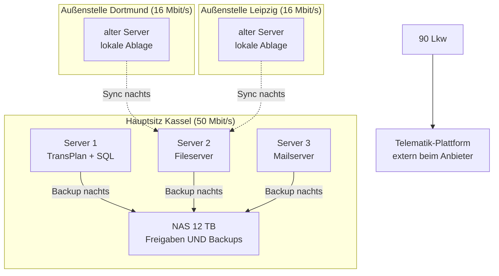

# Übungsaufgaben – Infrastruktur & Architektur

<span class='badge badge-praxis'>Aufgaben</span> &nbsp; Alle Aufgaben auf dieser Seite drehen sich um **ein** durchgehendes Szenario. Es sind schriftliche Denkaufgaben – du brauchst keinen Rechner, außer um auf den Theorieseiten nachzulesen. Zu jeder Aufgabe gibt es eine aufklappbare Musterlösung mit Erklärung.

Kurz zur Arbeitsweise: Beantworte jede Aufgabe **erst selbst schriftlich** – auf Papier oder in einer Textdatei – und klapp die Musterlösung erst danach auf. Wer die Lösung vorab liest, nimmt sich genau den Lerneffekt, um den es hier geht. Die Aufgaben bauen aufeinander auf, funktionieren aber auch einzeln. Wenn du irgendwo hängst, lies die in der Aufgabe verlinkte Theorieseite und versuch es noch einmal. Und was danach offen bleibt, bringst du einfach mit – besprochen wird beim nächsten Termin.

---

## Ausgangslage

Die **TransRegio Spedition GmbH** ist eine mittelständische Spedition mit 140 Mitarbeitern: Hauptsitz in Kassel, zwei Außenstellen in Dortmund und Leipzig. Die IT ist über Jahre gewachsen:

- 3 physische Server im Keller des Hauptsitzes (Windows Server 2019): Dispositionssoftware „TransPlan" mit SQL-Datenbank, Fileserver, Mailserver
- je Außenstelle ein älterer Server für die lokale Dateiablage, der nachts per Skript zum Hauptsitz synchronisiert
- 1 NAS mit 12 TB am Hauptsitz – darauf liegen die Dateifreigaben UND die nächtlichen Backups derselben Server
- Telematik: 90 Lkw senden Positions- und Fahrzeugdaten an eine extern gehostete Plattform des Telematik-Anbieters
- Personalakten und Bewerbungen liegen auf dem Fileserver in einem Ordner, auf den alle Mitarbeiter Lesezugriff haben
- Internetanbindung: Hauptsitz 50 Mbit/s, Außenstellen je 16 Mbit/s
- kein Monitoring, Dokumentation: eine Excel-Liste, zuletzt gepflegt 2021

Die Geschäftsführung plant die Übernahme eines Wettbewerbers (+60 Mitarbeiter, vierter Standort) und wünscht sich „möglichst wenig eigene Hardware in der Zukunft". Der Hersteller von TransPlan bietet die Software inzwischen auch als SaaS-Variante an. Du sollst die neue Ziel-Infrastruktur planen.

Dieselbe Ausgangslage als Bild – als Referenz beim Bearbeiten der Aufgaben:



---

## Die Aufgaben

### Aufgabe 1 – Schwachstellen finden

!!! info "Worum es geht"
    - Den Ist-Zustand mit dem Blick der **Bestandsanalyse** lesen: nicht nur beschreiben, was da ist, sondern erkennen, was daran gefährlich ist
    - Schwachstellen sauber **begründen** – die Folge benennen, nicht nur den Zustand
    - Theorie dazu: [Anforderungen & Sollkonzept](anforderungen-und-sollkonzept.md)

Lies die Ausgangslage noch einmal, diesmal mit dem Blick eines externen Beraters, der zum ersten Mal in den Keller in Kassel geführt wird. **Nenne vier technische oder organisatorische Schwachstellen** der bestehenden TransRegio-Infrastruktur und begründe zu jeder in 1–2 Sätzen, warum sie problematisch ist. Schreib ganze Sätze – die Begründung ist der eigentliche Kern der Aufgabe, nicht das Stichwort.

??? tip "Musterlösung & Erklärung"
    **1. Musterantwort** – vier Schwachstellen mit Begründung, so könnte eine sehr gute Antwort aussehen:

    | Schwachstelle | Warum problematisch? |
    |---|---|
    | Backups liegen auf demselben NAS wie die Originaldaten | Brand, Wasserschaden, Hardwaredefekt oder ein Verschlüsselungstrojaner treffen Original **und** Backup gleichzeitig. Ein Backup, das mit den Originaldaten untergeht, ist keins. |
    | Personalakten mit Lesezugriff für alle Mitarbeiter | Personalakten enthalten besonders schutzwürdige Daten (Gehälter, Krankmeldungen, Bewerbungen). Zugriff müsste auf die Personalabteilung beschränkt sein – die offene Freigabe ist ein Datenschutzverstoß mit realem Haftungsrisiko. |
    | Kein Monitoring | Ausfälle fallen erst auf, wenn sich Nutzer beschweren – im schlimmsten Fall montags um 7 Uhr die Disposition. Schleichende Probleme wie ein volllaufender Speicher werden gar nicht bemerkt, bis es knallt. |
    | Dokumentation: eine Excel-Liste von 2021 | Niemand weiß verlässlich, was wo läuft und wie es konfiguriert ist. Jede Störungssuche dauert länger, jede Planung (etwa die anstehende Übernahme) startet blind und das Wissen steckt in einzelnen Köpfen. |

    **2. Warum so?** – Das Denkmodell dahinter: Geh jede Komponente der Ausgangslage durch und stell zwei Fragen. Erstens: **Was passiert, wenn das ausfällt?** Zweitens: **Wer kann darauf zugreifen – und sollte er das dürfen?** Die erste Frage findet Verfügbarkeits-Schwachstellen, die zweite Vertraulichkeits-Schwachstellen. Eine gute Schwachstellen-Formulierung besteht immer aus zwei Teilen: dem Zustand („Backup auf demselben NAS") plus der Folge („geht bei einem Vorfall zusammen mit den Daten verloren"). Ohne den zweiten Teil ist es nur eine Beobachtung.

    **3. Auch gut wäre ...** – die Ausgangslage gibt deutlich mehr als vier Schwachstellen her. Genauso richtig sind zum Beispiel:

    - **Einzelserver ohne Redundanz:** Fällt der TransPlan-Server aus, steht die Disposition für 90 Lkw. Fällt der Mailserver aus, ist die Kommunikation mit Kunden und Fahrern weg. Es gibt keinen zweiten Server, der übernimmt.
    - **Alte Server in den Außenstellen:** Alter bedeutet steigende Ausfallwahrscheinlichkeit. Dazu kommt die nächtliche Skript-Synchronisation: Tagsüber laufen die Datenstände der Standorte auseinander und ob das Skript letzte Nacht überhaupt lief, merkt ohne Monitoring niemand.
    - **Knappe Anbindung der Außenstellen:** 16 Mbit/s sind schon heute wenig. Sobald Dienste zentralisiert oder in die Cloud verlagert werden, läuft der komplette Arbeitsverkehr über diese Leitung – sie wird zum Flaschenhals.
    - **Betriebssystem-Stand:** Windows Server 2019 ist in der zweiten Hälfte seines Lebenszyklus – der reguläre Support ist ausgelaufen, Sicherheitsupdates gibt es nur noch für begrenzte Zeit. Wer die Migration nicht rechtzeitig plant, betreibt danach Server ohne Sicherheitsupdates – ein offenes Einfallstor.

    Es gibt hier kein „die vier richtigen". Bewertet wird, ob deine vier echte Schwachstellen sind und ob die Begründung trägt.

    **4. Typischer Stolperstein** – zwei Fehler tauchen bei dieser Aufgabe immer wieder auf. Erstens: Stichworte ohne Begründung. „Kein Monitoring" allein ist eine Feststellung, keine Analyse – der Punkt steckt in der Folge. Zweitens: Lösungen statt Schwachstellen. „Die sollten in die Cloud gehen" ist keine Schwachstelle, sondern ein Lösungsvorschlag – der kommt erst später, wenn die Anforderungen stehen. Erst der Befund, dann die Therapie.

---

### Aufgabe 2 – Anforderungen formulieren

!!! info "Worum es geht"
    - Den Unterschied zwischen **funktionalen** und **nicht-funktionalen Anforderungen** anwenden statt nur aufsagen
    - Anforderungen so formulieren, dass man am Ende **nachprüfbar** sagen kann: erfüllt oder nicht erfüllt
    - Theorie dazu: [Anforderungen & Sollkonzept](anforderungen-und-sollkonzept.md)

Aus der Schwachstellenanalyse wird jetzt ein Zielbild. **Formuliere für die neue Ziel-Infrastruktur von TransRegio je drei funktionale und drei nicht-funktionale Anforderungen.** Die Regel dabei: Jede Anforderung muss messbar bzw. nachprüfbar sein. Stell dir vor, das Projekt ist fertig und jemand geht deine Liste durch – bei jeder Zeile muss er mit Ja oder Nein antworten können, ob sie erfüllt ist. „Das System soll zuverlässig sein" fällt bei diesem Test durch.

??? tip "Musterlösung & Erklärung"
    **1. Musterantwort** – so könnte eine sehr gute Antwort aussehen:

    Funktionale Anforderungen (was das System **können** muss):

    1. Die Disposition kann von allen vier Standorten auf denselben aktuellen Datenbestand zugreifen – ohne nächtliche Synchronisation.
    2. Jeder Mitarbeiter erreicht eine zentrale Dateiablage mit Berechtigungsgruppen; Personalakten sind ausschließlich für die Personalabteilung zugreifbar.
    3. Die Positionsdaten der 90 Lkw aus der Telematik-Plattform sind in der Disposition sichtbar.

    Nicht-funktionale Anforderungen (wie **gut** es das tun muss):

    1. TransPlan ist zu Geschäftszeiten (Mo–Sa, 6–20 Uhr) zu 99,5 % verfügbar.
    2. Nach einem Datenverlust ist die Dateiablage in höchstens 4 Stunden wiederhergestellt; es gehen maximal die Daten der letzten 24 Stunden verloren.
    3. Die Anmeldung an TransPlan dauert auch aus den Außenstellen unter 3 Sekunden.

    **2. Warum so?** – Die Trennlinie: Funktionale Anforderungen beschreiben, **was** das System tut (Zugriff, Ablage, Schnittstelle). Nicht-funktionale beschreiben, **wie gut** es das tut (Verfügbarkeit, Wiederherstellzeit, Antwortzeit). Mischformen sind im Alltag übrigens häufig: „Positionsdaten sichtbar und höchstens 5 Minuten alt" packt beides in einen Satz – das Sichtbarmachen ist funktional, die Aktualität wäre der nicht-funktionale Anteil derselben Anforderung. Und die Messbarkeit ist kein Formalismus: Eine schwammige Anforderung kann jeder Anbieter als „erfüllt" verkaufen. Der Unterschied im direkten Vergleich:

    | Schwammig | Messbar |
    |---|---|
    | „Das System soll schnell sein" | „Anmeldung unter 3 Sekunden" |
    | „Das System soll ausfallsicher sein" | „99,5 % Verfügbarkeit, Mo–Sa 6–20 Uhr" |
    | „Backups sollen zuverlässig funktionieren" | „Wiederherstellung in max. 4 Stunden, Datenverlust max. 24 Stunden" |

    Links kann man streiten, rechts kann man messen. Genau deshalb schreibt man Anforderungen so auf.

    **3. Auch gut wäre ...** – völlig andere Themen sind genauso richtig, solange sie nachprüfbar sind: eine Skalierungs-Anforderung („die Übernahme von 60 Mitarbeitern und einem vierten Standort ist ohne Architekturänderung möglich"), eine Monitoring-Anforderung („der Ausfall eines zentralen Dienstes löst innerhalb von 5 Minuten eine Alarmierung aus") oder eine Dokumentations-Anforderung („jede produktive Komponente ist zum Projektende in der Systemdokumentation erfasst"). Wichtig ist nur die Sortierung: Was das System *tut*, ist funktional – wie *gut*, ist nicht-funktional.

    **4. Typischer Stolperstein** – nicht-funktionale Anforderungen ohne Zahl. „Hohe Verfügbarkeit", „gute Performance", „sichere Ablage" klingen nach Anforderung, sind aber keine – ihnen fehlt das Kriterium, an dem man das Ergebnis misst. Der zweite Klassiker: eine Lösung als Anforderung tarnen. „Wir brauchen Microsoft 365" ist keine Anforderung, sondern eine vorweggenommene Entscheidung – die Anforderung dahinter wäre „standortübergreifende Zusammenarbeit an Dokumenten".

---

### Aufgabe 3 – Lastenheft oder Pflichtenheft?

!!! info "Worum es geht"
    - **Lastenheft** und **Pflichtenheft** auseinanderhalten: wer schreibt was, in welcher Reihenfolge, mit welchem Zweck
    - Die Rollenverteilung zwischen Auftraggeber und Auftragnehmer am konkreten Projekt durchspielen
    - Theorie dazu: [Anforderungen & Sollkonzept](anforderungen-und-sollkonzept.md)

TransRegio wird die neue Infrastruktur nicht komplett allein bauen, sondern ein Systemhaus beauftragen. Damit landen die Anforderungen aus Aufgabe 2 in einem Dokument – aber in welchem? **Erkläre in eigenen Worten (2–4 Sätze) den Unterschied zwischen Lastenheft und Pflichtenheft.** Formuliere anschließend **je zwei Beispiel-Einträge** für das TransRegio-Projekt: zwei Einträge, die ins Lastenheft gehören und zwei, die ins Pflichtenheft gehören.

??? tip "Musterlösung & Erklärung"
    **1. Musterantwort** – die Erklärung: Das **Lastenheft** schreibt der **Auftraggeber** (hier: TransRegio). Es beschreibt, **was** gebraucht wird und **wofür** – die Anforderungen und Ziele, bewusst lösungsneutral. Das **Pflichtenheft** schreibt der **Auftragnehmer** (das Systemhaus) als Antwort darauf. Es beschreibt, **wie** und **womit** er die Anforderungen konkret umsetzen will. Erst kommt also das Lastenheft, dann das Pflichtenheft – das eine ist die Frage, das andere die Antwort.

    Beispiel-Einträge fürs **Lastenheft** (TransRegio formuliert den Bedarf):

    1. „Alle vier Standorte benötigen Zugriff auf dieselbe aktuelle Dispositionsdatenbank; der Ausfall eines Standorts darf die anderen nicht beeinträchtigen."
    2. „Personalakten und Bewerbungen dürfen ausschließlich für die Personalabteilung zugänglich sein; jeder Zugriff muss nachvollziehbar sein."

    Beispiel-Einträge fürs **Pflichtenheft** (das Systemhaus beschreibt seine Lösung):

    1. „Die Disposition wird auf die SaaS-Variante von TransPlan umgestellt. Der Zugriff erfolgt je Standort per Browser über eine verschlüsselte Verbindung; die Datenmigration aus der bestehenden SQL-Datenbank übernimmt der Hersteller nach dem in Anlage 2 beschriebenen Verfahren."
    2. „Die Dateiablage wird als zentraler Cloud-Speicher mit Berechtigungsgruppen umgesetzt. Der Bereich ‚Personal‘ erhält eine eigene Gruppe, verschlüsselte Ablage und Zugriffsprotokollierung; die bisherigen offenen Freigaben werden abgelöst."

    **2. Warum so?** – Die Eselsbrücke, die hängen bleibt: Im **Lastenheft** steht die **Last**, die der Auftraggeber loswerden will – **WAS** und **WOFÜR**. Im **Pflichtenheft** stehen die **Pflichten**, zu denen sich der Auftragnehmer verpflichtet – **WIE** und **WOMIT**. Die Trennung hat einen handfesten Grund: Der Auftraggeber kennt sein Geschäft am besten, der Auftragnehmer die technischen Lösungen. Schreibt TransRegio dem Systemhaus die Technik vor, verschenkt es die Kompetenz, für die es bezahlt – und trägt hinterher selbst die Verantwortung, wenn die vorgeschriebene Lösung nicht passt. Vergleich die Einträge oben: Die Lastenheft-Sätze funktionieren mit jeder denkbaren Lösung, die Pflichtenheft-Sätze legen sich fest.

    **3. Auch gut wäre ...** – jede Anforderung aus Aufgabe 2 taugt als Lastenheft-Eintrag, jede konkrete Umsetzungsbeschreibung als Pflichtenheft-Eintrag. Auch organisatorische Punkte gehören ins Lastenheft: „Die Umstellung darf den laufenden Speditionsbetrieb nicht unterbrechen" oder „das Projekt muss vor der Übernahme des Wettbewerbers abgeschlossen sein". Im Pflichtenheft dürfen dafür Produktnamen, Mengen und Verfahren stehen – genau das, was im Lastenheft nichts verloren hat.

    **4. Typischer Stolperstein** – technische Lösungen im Lastenheft. „Wir wollen zwei Server mit je 64 GB RAM und Hypervisor X" ist kein Lastenheft-Eintrag, sondern eine vorweggenommene Pflichtenheft-Entscheidung. Der zweite häufige Fehler ist die Richtung: Wer schreibt was? Merk dir die Reihenfolge als Dialog – der Auftraggeber fragt (Lastenheft), der Auftragnehmer antwortet (Pflichtenheft). Ein Pflichtenheft ohne vorheriges Lastenheft beantwortet eine Frage, die nie gestellt wurde.

---

### Aufgabe 4 – Wohin mit welcher Komponente?

!!! info "Worum es geht"
    - Die Architekturformen **on-premise**, **Public Cloud/SaaS** und **hybrid** auf einen echten Fall anwenden
    - Entscheidungen an **Kriterien** festmachen: Datenempfindlichkeit, Skalierung, Anbindung, Betriebsaufwand
    - Theorie dazu: [Architekturen: zentral, dezentral, Cloud](architekturen.md)

Jetzt wird verortet. Die Geschäftsführung wünscht sich „möglichst wenig eigene Hardware" – aber pauschal alles in die Cloud zu schieben, wäre genauso unüberlegt wie pauschal alles im Keller zu lassen. **Ordne die folgenden vier Komponenten je einer Zielumgebung zu** – on-premise, Public Cloud/SaaS oder hybrid – **und begründe jede Entscheidung mit mindestens einem Kriterium** aus dieser Liste: Datenempfindlichkeit, Skalierung, Anbindung, Betriebsaufwand.

1. Dispositionssoftware TransPlan (SaaS-Variante des Herstellers verfügbar)
2. Dateiablage (heute: Fileserver plus Außenstellen-Server plus Nacht-Sync)
3. Telematik-Plattform (heute schon extern gehostet)
4. Personalakten und Bewerbungen

??? tip "Musterlösung & Erklärung"
    **1. Musterantwort** – eine gut begründete Variante:

    | Komponente | Zielumgebung | Begründung (Kriterium) |
    |---|---|---|
    | TransPlan | Public Cloud (SaaS des Herstellers) | **Betriebsaufwand:** Updates, Datenbank und Verfügbarkeit übernimmt der Hersteller. **Skalierung:** 60 neue Mitarbeiter und ein vierter Standort sind Lizenzen, kein Serverkauf. |
    | Dateiablage | Public Cloud (zentraler Cloud-Speicher) | **Anbindung:** Vier Standorte greifen gleichberechtigt auf einen Stand zu – die fehleranfälligen Nacht-Syncs und die Außenstellen-Server entfallen ersatzlos. |
    | Telematik-Plattform | Public Cloud (SaaS) – bleibt, wo sie ist | **Betriebsaufwand:** Sie läuft bereits extern beim Anbieter und funktioniert. Es gibt keinen Grund, eine Spezialplattform selbst betreiben zu wollen. |
    | Personalakten | on-premise, in einem eigenen, streng berechtigten Bereich | **Datenempfindlichkeit:** Besonders schutzwürdige Daten, kleiner Nutzerkreis (nur Personalabteilung), kein Skalierungsdruck – die Kontrolle im eigenen Haus wiegt hier schwerer als der Betriebsaufwand. |

    In Summe ist die Ziel-Architektur damit **hybrid**: der Großteil in der Cloud, ein bewusst gewählter Rest im eigenen Haus.

    **2. Warum so?** – Das Denkmodell: Es gibt keine richtige Zielumgebung pro Firma, nur eine begründbare Zielumgebung **pro Komponente**. Für jede Komponente wägst du die Kriterien gegeneinander ab – bei TransPlan dominiert der Betriebsaufwand, bei den Personalakten die Datenempfindlichkeit, bei der Dateiablage die Anbindung der Standorte. Der Wunsch der Geschäftsführung („wenig eigene Hardware") ist dabei ein Kriterium unter mehreren – er gibt die Richtung vor, sticht aber nicht automatisch die Datenempfindlichkeit.

    **3. Auch gut wäre ...** – und das ist bei dieser Aufgabe der wichtigste Satz: **Andere Zuordnungen sind mit passender Begründung genauso richtig.** Personalakten in einer europäischen Cloud mit Verschlüsselung, sauberem Berechtigungskonzept und Zugriffsprotokollierung? Vertretbar – viele Unternehmen machen genau das. Die Dateiablage vorerst on-premise lassen, weil die Außenstellen mit 16 Mbit/s einen reinen Cloud-Zugriff kaum stemmen und der Leitungsausbau erst kommt? Ebenfalls vertretbar. Bewertet wird die Begründung, nicht das Lager. Eine schwach begründete „richtige" Zuordnung ist schlechter als eine gut begründete andere.

    **4. Typischer Stolperstein** – Pauschalurteile in beide Richtungen: „Cloud ist unsicher, also bleiben die Personalakten im Keller" ist genauso wenig eine Begründung wie „Cloud ist modern, also alles rein". Beides ersetzt die Abwägung durch ein Bauchgefühl. Der zweite häufige Fehler: die **Anbindung vergessen**. Wer alle Dienste in die Cloud verlagert, macht die Internetleitung zur Lebensader – bei 16 Mbit/s in den Außenstellen muss die Leitung mitgeplant werden, sonst steht die schöne Cloud-Architektur im Stau.

---

### Aufgabe 5 – IaaS, PaaS oder SaaS?

!!! info "Worum es geht"
    - Die drei Cloud-Servicemodelle **IaaS**, **PaaS** und **SaaS** unterscheiden – über die Frage, **wer welche Schicht betreibt**
    - Konkrete Angebote dem richtigen Modell zuordnen, statt Definitionen auswendig aufzusagen
    - Theorie dazu: [Architekturen: zentral, dezentral, Cloud](architekturen.md)

Das Systemhaus legt TransRegio drei Cloud-Angebote vor. **Erkläre zunächst die drei Servicemodelle IaaS, PaaS und SaaS in je einem Satz.** Ordne dann jedes Angebot dem passenden Modell zu und begründe kurz:

- **(a)** TransPlan als Mietsoftware des Herstellers – die Disponenten arbeiten komplett im Browser
- **(b)** eine gemietete virtuelle Maschine bei einem Cloud-Anbieter, auf der die TransRegio-IT den Fileserver selbst installiert und betreibt
- **(c)** eine gemanagte Datenbank beim Cloud-Anbieter, in die die TransPlan-Daten wandern, während TransRegio die Anwendung selbst weiterbetreibt

??? tip "Musterlösung & Erklärung"
    **1. Musterantwort** – die drei Modelle in je einem Satz:

    - **IaaS** (Infrastructure as a Service): Der Anbieter stellt virtuelle Infrastruktur bereit – Rechenleistung, Speicher, Netz – und alles ab dem Betriebssystem aufwärts installierst, patchst und betreibst du selbst.
    - **PaaS** (Platform as a Service): Der Anbieter betreibt zusätzlich die Plattform – etwa Laufzeitumgebung oder Datenbank – und du kümmerst dich nur noch um deine Anwendung und deine Daten.
    - **SaaS** (Software as a Service): Der Anbieter betreibt die komplette, fertige Anwendung – du nutzt sie nur noch, typischerweise im Browser.

    Die Zuordnung: **(a) SaaS** – die Disponenten nutzen eine fertige Anwendung, der Hersteller betreibt alles. **(b) IaaS** – gemietet ist nur die nackte VM; Betriebssystem, Fileserver-Dienst, Patches und Backups bleiben Sache der TransRegio-IT. **(c) PaaS** – die Datenbank ist gemanagt (der Anbieter kümmert sich um Betrieb, Updates, Sicherung der Datenbank-Software), die Anwendung darüber betreibt TransRegio weiter selbst.

    **2. Warum so?** – Das Sortierwerkzeug ist die **Verantwortungs-Treppe**: Schicht für Schicht wandert die Verantwortung vom eigenen Haus zum Anbieter.

    | Schicht | on-premise | IaaS | PaaS | SaaS |
    |---|---|---|---|---|
    | Daten | du | du | du | du |
    | Anwendung | du | du | du | Anbieter |
    | Datenbank / Laufzeit | du | du | Anbieter | Anbieter |
    | Betriebssystem | du | du | Anbieter | Anbieter |
    | Server, Speicher, Netz | du | Anbieter | Anbieter | Anbieter |

    Die entscheidende Frage ist also nie „Wo läuft es?", sondern „**Wer betreibt welche Schicht?**". Genau daran erkennst du jedes Angebot: Bei (a) steht in jeder Betriebs-Zeile „Anbieter" – nur die Daten bleiben Sache von TransRegio –, bei (b) übernimmt der Anbieter nur die unterste Zeile, bei (c) verläuft die Grenze in der Mitte. Und die oberste Zeile ändert sich nie: Für die Daten bist du in jedem Modell selbst verantwortlich.

    **3. Auch gut wäre ...** – wer die Zuordnung über eigene Erfahrung begründet, liegt genauso richtig. Die gemietete VM aus (b) fühlt sich an wie eine selbst erstellte Multipass-VM – nur dass die Hardware darunter jemand anderem gehört; alles, was du dort per Hand installiert hast, müsstest du hier auch installieren. Und ein gemanagter Kubernetes-Cluster beim Cloud-Anbieter ist ein weiteres PaaS-Beispiel: Der Anbieter betreibt die Plattform, du bringst deine Container mit. Auch die Formulierung „SaaS = fertige Software mieten, IaaS = virtuelle Hardware mieten, PaaS = dazwischen" trifft den Kern.

    **4. Typischer Stolperstein** – „Es liegt in der Cloud, also ist es SaaS." Nein: Die gemietete VM aus (b) liegt in der Cloud, ist aber **IaaS** – Patchen, Härten, Sichern und der 2-Uhr-nachts-Anruf bei einem Ausfall des Fileserver-Dienstes bleiben bei der TransRegio-IT. Das Servicemodell beschreibt die **Verantwortungsverteilung**, nicht den Standort. Wer das verwechselt, mietet eine VM, glaubt sich alle Betriebspflichten los und merkt es erst, wenn das erste ungepatchte System kompromittiert ist.

---

### Aufgabe 6 – Private oder public?

!!! info "Worum es geht"
    - Den Unterschied zwischen **Public Cloud** und **Private Cloud** in eigenen Worten erklären
    - Eine pauschale Management-Ansage („alles zum großen Anbieter") gegen die konkreten Daten des Unternehmens prüfen
    - Cloud-Entscheidungen an Anforderungen festmachen statt an Bauchgefühl
    - Theorie dazu: [Architekturen: zentral, dezentral, Cloud](architekturen.md)

Die Geschäftsführung kommt von einem Logistik-Kongress zurück und hat eine klare Ansage mitgebracht: „Wir wollen alles zum großen Cloud-Anbieter – weg mit den Servern im Keller." Bevor du planst, sortierst du erst einmal die Begriffe.

1. Erkläre in je zwei bis drei Sätzen, was eine **Public Cloud** und was eine **Private Cloud** ist.
2. Geh die Daten der TransRegio durch: Für welche Daten wäre „alles zum großen Anbieter" ohne weitere Überlegung problematisch? Begründe kurz.
3. Nenne zwei Optionen, wie TransRegio mit genau diesen Daten umgehen kann, ohne den Cloud-Plan insgesamt zu kippen.

??? tip "Musterlösung & Erklärung"
    **1. Musterantwort**

    *Public Cloud:* Ein großer Anbieter betreibt Rechenzentren, deren Ressourcen sich viele Kunden teilen. TransRegio mietet Rechenleistung, Speicher oder fertige Dienste nach Verbrauch – Betrieb, Wartung und Skalierung liegen beim Anbieter. Die künftige TransPlan-SaaS-Variante wäre ein typisches Public-Cloud-Angebot.

    *Private Cloud:* Dieselbe Cloud-Technik – Selbstbedienung, Ressourcen-Pools, flexible Skalierung –, aber die Infrastruktur steht exklusiv für ein Unternehmen bereit: im eigenen Rechenzentrum oder als dedizierte Umgebung bei einem Dienstleister. Mehr Kontrolle über Ort und Zugriff, dafür mehr eigener Aufwand oder höhere Kosten.

    *Problematischer Kandidat:* die **Personalakten und Bewerbungen**. Das sind besonders schutzwürdige personenbezogene Daten – Gehälter, Krankmeldungen, Bewerbungsunterlagen. Bei ihnen muss TransRegio genau wissen, wo sie liegen, wer zugreifen kann und was vertraglich mit dem Anbieter geregelt ist. Verschärfend: Schon heute ist der Zugriff kaputt, denn alle 140 Mitarbeiter haben Lesezugriff auf den Ordner.

    *Zwei Optionen:*

    - **Hybrid-Ansatz:** Der unkritische Teil (Dateiablage, TransPlan als SaaS) geht in die Public Cloud, die Personaldaten bleiben on-premise oder in einer Private-Cloud-Umgebung mit klar geregeltem Zugriff.
    - **Public Cloud mit Auflagen:** Auch Personaldaten können zum großen Anbieter – dann aber mit vertraglich zugesichertem Datenstandort (z. B. Rechenzentrum in der EU), einem Vertrag zur Auftragsverarbeitung und vor allem einem sauberen **Rechte-Konzept**: Zugriff nur für Personalabteilung und Geschäftsführung, protokolliert.

    **2. Warum so?**

    Die Frage „private oder public?" ist keine Glaubensfrage, sondern eine Anforderungsfrage. Du gehst die Daten durch und fragst pro Kategorie: Wie schutzwürdig ist das, was fordert das Gesetz, was fordert der Betrieb? Frachtdokumente und Tourenpläne haben andere Anforderungen als Personalakten. Erst aus dieser Einordnung folgt die Architektur – meistens landet man bei einem Mix, nicht bei „alles oder nichts".

    **3. Auch gut wäre ...**

    - die **Telematikdaten** als zweiten Diskussionskandidaten zu nennen: Positionsdaten von 90 Lkw sind auf Fahrer beziehbar. Der Punkt ist berechtigt – nur liegen diese Daten heute schon extern beim Telematik-Anbieter, die Frage ist dort also längst eine Vertragsfrage.
    - eine **Community Cloud** als dritte Betriebsform zu erwähnen (gemeinsame Umgebung mehrerer Organisationen mit ähnlichen Anforderungen) – für eine einzelne Spedition praktisch selten, als Begriff aber korrekt.
    - der Hinweis, dass das Rechte-Konzept **unabhängig vom Ort** repariert werden muss: Der offene Personalordner ist auch on-premise nicht in Ordnung.

    **4. Typischer Stolperstein**

    Der Kurzschluss „Public Cloud = unsicher, eigener Keller = sicher". Das ist Bauchgefühl, keine Analyse. Ein großes Cloud-Rechenzentrum ist gegen Einbruch, Brand und Angriffe meist deutlich besser abgesichert als drei Server im Keller einer Spedition – der offene Personalordner liegt heute on-premise und ist trotzdem das größte Datenschutzproblem der Firma. Es geht nicht darum, **wo** ein Logo drüber hängt, sondern um Anforderungen, Verträge und Kontrolle: Wer darf zugreifen, wo liegen die Daten, was ist zugesichert?

---

### Aufgabe 7 – Speicher planen

!!! info "Worum es geht"
    - Die Nettokapazität eines **RAID-5**-Verbunds berechnen und den Plattenausfall durchspielen
    - Den Speicherbedarf mit Wachstum und Reserve kalkulieren und die passende **Anbindungsform** (NAS oder SAN) wählen
    - Die wichtigste Grenze der Speicherplanung ziehen: **Redundanz ist keine Datensicherung**
    - Theorie dazu: [Speicherlösungen](speicherloesungen.md)

Für den Hauptsitz ist – für die Daten, die im Haus bleiben und als lokale Backup-Stufe – ein zentrales Speichersystem geplant: **4 Platten zu je 8 TB, konfiguriert als RAID 5**.

1. Berechne die nutzbare Nettokapazität des Verbunds und erkläre in zwei bis drei Sätzen, was passiert, wenn im laufenden Betrieb eine der vier Platten ausfällt.
2. Heute liegen bei TransRegio die Dateifreigaben **und** die nächtlichen Backups derselben Server auf ein und demselben NAS. Erkläre, warum das auch mit RAID keine Datensicherung ist – nenne mindestens drei Szenarien, in denen dieses Konzept versagt.
3. Auf dem alten NAS liegen heute 9 TB Nutzdaten (Backups nicht mitgerechnet). Kalkuliere mit 15 % Wachstum pro Jahr – die Übernahme des Wettbewerbers ist darin schon enthalten –, einem Planungshorizont von 3 Jahren und 20 % Reserve: Wie viel Nettokapazität muss das neue System bieten und reicht der RAID-5-Verbund aus Teil 1 dafür?
4. TransRegio betreibt heute ein NAS. Erkläre, warum diese Anbindungsform für Dateifreigaben passt – und welche Anbindungsform stattdessen nötig wäre, wenn der Hauptsitz künftig einen Virtualisierungs-Cluster betreiben will, dessen Hosts sich einen gemeinsamen, schnellen Speicher teilen.

??? tip "Musterlösung & Erklärung"
    **1. Musterantwort**

    *Teil a – Nettokapazität:* Bei RAID 5 geht die Kapazität **einer** Platte für Paritätsinformationen ab, die über alle Platten verteilt gespeichert werden. Rechnung:

    ```text
    (4 - 1) x 8 TB = 24 TB Nettokapazität
    ```

    Fällt eine Platte aus, läuft der Verbund **degradiert** weiter: Die fehlenden Daten werden bei jedem Zugriff aus den Paritätsinformationen der übrigen Platten rekonstruiert, der Betrieb geht ohne Datenverlust weiter – aber langsamer und **ohne weitere Reserve**. Fällt jetzt eine zweite Platte aus, sind die Daten weg. Nach dem Tausch der defekten Platte baut der Controller den Verbund im **Rebuild** neu auf; das kann bei 8-TB-Platten viele Stunden dauern und in dieser Zeit bleibt der Verbund verwundbar.

    *Teil b – warum das NAS-Konzept keine Datensicherung ist:* RAID schützt genau gegen eine Sache: den **Hardware-Ausfall einzelner Platten**. Gegen alles andere schützt es nicht – im Gegenteil, das RAID repliziert Fehler zuverlässig mit:

    - **Versehentliches Löschen oder Überschreiben:** Die Löschung landet sofort auf allen Platten des Verbunds.
    - **Verschlüsselungstrojaner:** Ein Erpressungstrojaner verschlüsselt die Freigaben – und die Backups gleich mit, denn sie liegen auf demselben Gerät im selben Netz.
    - **Brand, Wasserschaden, Diebstahl, Überspannung:** Ein einziges Ereignis im Keller des Hauptsitzes vernichtet Original und Backup gleichzeitig.

    Datensicherung braucht deshalb **getrennte Kopien**: mehrere Kopien auf verschiedenen Medien, davon mindestens eine räumlich getrennt vom Original – die **3-2-1-Regel** von der Speicherseite (drei Kopien, zwei verschiedene Medien, eine außer Haus).

    *Teil c – Kapazitätsbedarf:* Wachstum wirkt auf den jeweils neuen Stand, nicht auf den alten:

    ```text
    Jahr 1:   9,0 TB x 1,15  =  10,4 TB
    Jahr 2:  10,4 TB x 1,15  =  11,9 TB
    Jahr 3:  11,9 TB x 1,15  =  13,7 TB

    + 20 % Reserve           =  rund 16,4 TB Netto-Bedarf
    ```

    Die 24 TB netto aus Teil 1 reichen dafür mit ordentlich Luft – gut so, denn zwischen „reicht rechnerisch genau" und „reicht" liegt in der Speicherplanung immer ein Puffer.

    *Teil d – NAS oder SAN:* Ein **NAS** liefert Dateifreigaben (SMB/NFS) übers normale LAN – genau richtig für viele Nutzer auf gemeinsamen Ordnern, also für die heutige Dateiablage. Ein Virtualisierungs-Cluster braucht dagegen **Blockspeicher**, den sich alle Hosts als Shared Storage teilen – also ein **SAN** (iSCSI oder Fibre Channel). Erwähnenswert: Viele NAS-Geräte können zusätzlich iSCSI und spielen für kleine Umgebungen das SAN mit.

    **2. Warum so?**

    RAID und Backup beantworten zwei verschiedene Fragen. RAID beantwortet: „Läuft der Betrieb weiter, wenn eine Platte stirbt?" – das ist **Verfügbarkeit**. Backup beantwortet: „Komme ich an den Stand von gestern, wenn heute etwas zerstört wurde?" – das ist **Wiederherstellbarkeit**. Wer beides auf ein Gerät legt, hat die erste Frage doppelt beantwortet und die zweite gar nicht.

    **3. Auch gut wäre ...**

    - die Rechnung als Formel zu nennen: Nettokapazität bei RAID 5 = (n - 1) x Plattengröße.
    - anzumerken, dass bei so großen Platten **RAID 6** (doppelte, verteilte Parität – es geht die Kapazität von zwei Platten ab, hier dann 16 TB netto) eine Überlegung wert ist – gerade wegen der langen Rebuild-Zeiten, in denen ein zweiter Ausfall bei RAID 5 tödlich wäre.
    - als Lösungsvorschlag fürs Backup ein zweites Ziel zu nennen: ein Backup-System an einer Außenstelle oder ein Cloud-Backup – Hauptsache räumlich und logisch getrennt.

    **4. Typischer Stolperstein**

    Der Satz „Wir haben doch RAID, wir sind gesichert." RAID fühlt sich wie Sicherheit an, weil es gegen den sichtbarsten Ausfall schützt – die kaputte Platte. Die häufigsten Datenverluste im Alltag sind aber versehentliches Löschen und Verschlüsselungstrojaner. Gegen beide ist RAID wirkungslos, weil es jede Änderung sofort mitschreibt – auch die falsche. Und bei Teil c: Wer linear rechnet (9 + 3 x 1,35 = rund 13 TB), unterschätzt den Bedarf – Wachstum wirkt auf den jeweils neuen Stand.

---

### Aufgabe 8 – Vier Dimensionen

!!! info "Worum es geht"
    - Die vier Ressourcen-Dimensionen – technisch, personell, zeitlich, finanziell – auf ein konkretes Projekt anwenden
    - Den Blick dafür üben, dass ein Migrationsprojekt an mehr scheitern kann als an Technik
    - Theorie dazu: [Ressourcen planen](ressourcen-planen.md)

Die TransRegio startet das Migrationsprojekt: TransPlan wird auf die SaaS-Variante umgestellt, die Dateiablage wandert in die Cloud, die Keller-Server werden abgebaut, der vierte Standort kommt dazu.

Benenne für dieses Projekt **je zwei konkrete Beispiele** für technische, personelle, zeitliche und finanzielle Ressourcen, die eingeplant werden müssen. Eine Tabelle ist erlaubt und empfehlenswert. Bleib konkret am Szenario – „ein Server" ist zu allgemein, „Bandbreiten-Upgrade am Hauptsitz" ist konkret.

??? tip "Musterlösung & Erklärung"
    **1. Musterantwort**

    | Dimension | Beispiel 1 | Beispiel 2 |
    |---|---|---|
    | **technisch** | Bandbreiten-Upgrade der Anbindungen: 50 Mbit/s am Hauptsitz und je 16 Mbit/s an den Außenstellen reichen nicht, wenn Disposition und Dateiablage künftig übers Internet laufen | Migrationswerkzeuge und eine Testumgebung, um den Umzug der TransPlan-Datenbank vorab durchzuspielen |
    | **personell** | Schulung der IT-Mitarbeiter für den Cloud-Betrieb (Administration, Rechteverwaltung, Kostenkontrolle) | Arbeitszeit der Fachabteilung Disposition für Tests und Abnahme der SaaS-Variante – die kennen die Abläufe, nicht die IT |
    | **zeitlich** | ein Migrationsfenster für den TransPlan-Umzug außerhalb der Disposition, z. B. ein Wochenende, plus eine Phase Parallelbetrieb | zeitliche Abstimmung mit der Übernahme des Wettbewerbers – der vierte Standort soll auf die **neue** Infrastruktur, nicht erst auf die alte |
    | **finanziell** | laufende Kosten: SaaS-Abos, Cloud-Speicher, stärkere Internetleitungen | einmaliges Projektbudget: externer Dienstleister für die Migration, Schulungen, eventuell Ablösekosten für Altverträge |

    Der wahrscheinlichste **Engpass** ist hier die personelle Dimension: Eine Spedition mit 140 Mitarbeitern hat eine kleine IT, die bisher Windows-Server im Keller betreut hat – Cloud-Administration ist ein anderes Berufsbild. Dass die Dokumentation seit 2021 nicht gepflegt wurde, ist ein deutliches Zeichen, dass das Tagesgeschäft die vorhandenen Leute schon heute auslastet. Ein Migrationsprojekt **neben** dem Tagesgeschäft scheitert selten an fehlenden Servern, oft an fehlenden Stunden und fehlendem Know-how.

    **2. Warum so?**

    Die vier Dimensionen sind eine Checkliste gegen den Tunnelblick. Techniker planen Technik von allein – vergessen aber gern, dass jemand die neue Umgebung bedienen können muss (personell), dass der Umzug ein Zeitfenster braucht, in dem 90 Lkw trotzdem disponiert werden (zeitlich) und dass aus Investitionskosten laufende Kosten werden (finanziell). Wer alle vier Spalten füllen kann, hat das Projekt einmal komplett durchdacht.

    **3. Auch gut wäre ...**

    - andere konkrete Beispiele in jeder Zelle – etwa VPN-Anbindung des vierten Standorts (technisch), Einarbeitung der übernommenen IT-Kollegen (personell), Kündigungsfristen alter Wartungsverträge als zeitliche Randbedingung, Vergleichsangebote mehrerer Cloud-Anbieter (finanziell).
    - eine andere begründete Engpass-Wahl: Auch „zeitlich" ist vertretbar, wenn die Übernahme einen harten Stichtag setzt. Wichtig ist die Begründung, nicht die eine richtige Antwort.

    **4. Typischer Stolperstein**

    Alle vier Spalten mit Technik zu füllen: „Server, Speicher, Netzwerk, Lizenzen" – das sind zwei technische und zwei finanzielle Punkte, keine vier Dimensionen. Die personelle und die zeitliche Spalte fragen nach Menschen und Kalender: Wer macht es, wer lernt es, wann passiert es, was läuft solange parallel?

---

### Aufgabe 9 – CapEx, OpEx und der Stundenpreis

!!! info "Worum es geht"
    - **CapEx** und **OpEx** unterscheiden und reale Kostenposten zuordnen
    - Ein Pay-as-you-go-Beispiel durchrechnen und erkennen, wann nutzungsbasierte Abrechnung ihren Vorteil ausspielt
    - Theorie dazu: [Ressourcen planen](ressourcen-planen.md)

Die Geschäftsführung fragt beim Budgetgespräch: „Was heißt das eigentlich für unsere Kostenstruktur, wenn wir in die Cloud gehen?"

1. Erkläre **CapEx** und **OpEx** in je einem Satz.
2. Ordne zu: die drei Keller-Server von heute, die künftige TransPlan-SaaS-Miete, eine nach Stunden abgerechnete Test-VM in der Cloud.
3. Rechne: Die Test-VM kostet 0,20 Euro pro Stunde und läuft nur werktags 8 Stunden am Tag. Was kostet sie im Monat (ca. 22 Arbeitstage)? Was würde im Vergleich ein 24/7-Dauerbetrieb kosten (30 Tage)?

??? tip "Musterlösung & Erklärung"
    **1. Musterantwort**

    *Definitionen:* **CapEx** (Capital Expenditure) sind einmalige Investitionsausgaben für Anschaffungen, die dem Unternehmen längerfristig gehören und über mehrere Jahre abgeschrieben werden. **OpEx** (Operational Expenditure) sind laufende Betriebsausgaben, die regelmäßig oder nutzungsabhängig anfallen und direkt in die laufenden Kosten gehen.

    *Zuordnung:*

    | Posten | Kategorie | Begründung |
    |---|---|---|
    | drei Keller-Server | **CapEx** | einmalig gekauft, gehören der Firma, werden abgeschrieben |
    | TransPlan-SaaS-Miete | **OpEx** | monatliche Miete, keine Anschaffung, endet mit dem Vertrag |
    | Test-VM nach Stunden | **OpEx** | reine Nutzungsabrechnung – läuft nichts, kostet fast nichts (nur gebuchter Speicher läuft weiter) |

    *Rechnung:*

    ```text
    werktags:      8 h x 22 Tage x 0,20 Euro =  35,20 Euro pro Monat
    Dauerbetrieb: 24 h x 30 Tage x 0,20 Euro = 144,00 Euro pro Monat
    ```

    Der Dauerbetrieb kostet mehr als das Vierfache – für dieselbe VM.

    **2. Warum so?**

    Die Rechnung zeigt das Prinzip hinter **Pay-as-you-go**: Bezahlt wird Nutzung, nicht Besitz. Für eine Test-VM, die nur zu Bürozeiten gebraucht wird, ist das ideal – nachts und am Wochenende fällt einfach nichts an, ein eigener Server im Keller würde dagegen durchlaufen und Strom ziehen. Die Kehrseite steckt in der zweiten Zeile: Bei **Dauerlast** verliert der Stundenpreis seinen Charme. Für Systeme, die sowieso 24/7 laufen müssen, kann eine feste Reservierung beim Cloud-Anbieter oder klassischer Eigenbetrieb günstiger sein. Die Cloud verschiebt Kosten von CapEx zu OpEx – ob das billiger wird, entscheidet das Lastprofil.

    **3. Auch gut wäre ...**

    - der Hinweis, dass auch die Keller-Server laufende Kosten erzeugen (Strom, Kühlung, Wartungsverträge, Admin-Zeit) – die Anschaffung ist CapEx, der Betrieb drumherum ist OpEx. Die Zuordnung „CapEx" meint den Charakter der Hauptausgabe.
    - anzumerken, dass abschaltbare Umgebungen nur sparen, wenn sie **wirklich abgeschaltet werden** – organisatorisch oder per Zeitplan automatisiert. Eine vergessene VM läuft die 144 Euro klaglos voll.
    - der Bezug zur Geschäftsführung: „möglichst wenig eigene Hardware" heißt genau dieser Wechsel – weg von großen Einmalinvestitionen, hin zu planbaren Monatskosten.

    **4. Typischer Stolperstein**

    Aus der ersten Zeile der Rechnung den Schluss zu ziehen: „Cloud ist immer billiger." Der Vergleich 33,60 gegen 144,00 Euro vergleicht nicht Cloud gegen Keller, sondern **Teilzeitbetrieb gegen Dauerbetrieb** in derselben Cloud. Wer eine Dauerlast zum Stundenpreis in die Cloud hebt, zahlt unter Umständen mehr als vorher – der OpEx-Vorteil kommt aus der Flexibilität, nicht aus dem Preisschild.

---

### Aufgabe 10 – Kaufen, mieten oder Open Source?

!!! info "Worum es geht"
    - Eine **Kauflizenz** mit einem **SaaS-Abo** über die Laufzeit vergleichen
    - Erkennen, dass die Rechnung nur die halbe Entscheidung ist: nicht-finanzielle Kriterien und Vertragsdetails entscheiden mit
    - Theorie dazu: [Lizenzmodelle](lizenzmodelle.md)

Der TransPlan-Hersteller macht zwei Angebote:

- **Kauflizenz:** 18.000 Euro einmalig, dazu 20 % des Kaufpreises pro Jahr für Wartung und Updates
- **SaaS-Abo:** 450 Euro pro Monat, Betrieb, Updates und Support inklusive

Dazu drei Arbeitsaufträge:

1. Vergleiche die Gesamtkosten beider Varianten über **5 Jahre**.
2. Nenne **zwei nicht-finanzielle Kriterien**, die in die Entscheidung gehören.
3. Worauf muss TransRegio bei der Abo-Variante **vertraglich** achten? Nenne zwei Punkte.
4. **Zusatz, wenn du schnell warst:** Baue aus deinen Kriterien aus Teil 2 plus den Gesamtkosten eine kleine **Nutzwertanalyse**: Gewichte die Kriterien (zusammen 100 %), vergib für beide Angebote Punkte von 1 bis 10 und bilde die gewichtete Summe. Bei welcher Gewichtung kippt das Ergebnis?

??? tip "Musterlösung & Erklärung"
    **1. Musterantwort**

    *Kostenvergleich:* Die Wartung kostet 20 % von 18.000 Euro = **3.600 Euro pro Jahr**. Jetzt kommt es darauf an, ab wann sie fällig ist – das Angebot lässt es offen, also rechnest du beide Lesarten:

    ```text
    SaaS-Abo:                  60 Monate x 450 Euro           = 27.000 Euro

    Kauf, Wartung ab Jahr 2:   18.000 + 4 x 3.600             = 32.400 Euro
    Kauf, Wartung ab Jahr 1:   18.000 + 5 x 3.600             = 36.000 Euro
    ```

    Über 5 Jahre ist das Abo in beiden Lesarten günstiger. Wichtiger als das Ergebnis ist der Befund dazwischen: Zwischen den beiden Kauf-Lesarten liegen 3.600 Euro – bevor entschieden wird, muss TransRegio beim Hersteller klären, **was die Wartung ab wann kostet** und ob sie überhaupt optional ist.

    *Zwei nicht-finanzielle Kriterien (zwei davon reichen):*

    - **Betrieb und Updates inklusive:** Beim Abo betreibt der Hersteller die Software – kein eigener Server, kein Einspielen von Updates, kein Datenbank-Backup in Eigenregie. Das entlastet genau die personelle Engstelle aus Aufgabe 8.
    - **Internetabhängigkeit:** Fällt die 50-Mbit/s-Leitung am Hauptsitz aus, steht beim SaaS-Modell die Disposition für 90 Lkw still. Das Kriterium heißt dann: redundante Anbindung einplanen.
    - **Abhängigkeit vom Anbieter:** Beim Abo liegen Software **und Daten** beim Hersteller – ein Wechsel wird schwerer (**Vendor Lock-in**).
    - **Datenstandort:** Wo läuft die SaaS-Instanz, wo liegen die Auftrags- und Kundendaten?

    *Zwei Vertragspunkte fürs Abo:*

    - **Lizenzmetrik und Nutzerzahl:** Gilt der Preis pro Unternehmen, pro Nutzer, pro Fahrzeug? Nach der Übernahme wächst TransRegio auf rund 200 Mitarbeiter – was kostet das Abo dann?
    - **Datenexport beim Ausstieg:** In welchem Format bekommt TransRegio die Daten heraus, in welcher Frist, mit welcher Mitwirkung des Herstellers? Ohne diese Klausel ist der Lock-in perfekt.
    - Ebenfalls richtig: **Laufzeit und Kündigungsfristen** – Mindestlaufzeit, automatische Verlängerung, Preisanpassungsklauseln.

    *Zusatz – eine mögliche Nutzwertanalyse* (Punktskala 1 bis 10):

    | Kriterium | Gewichtung | Kauf | Abo |
    |---|---|---|---|
    | Kosten über 5 Jahre | 40 % | 6 | 8 |
    | Betriebsaufwand | 30 % | 4 | 9 |
    | Unabhängigkeit vom Anbieter | 20 % | 8 | 4 |
    | Datenstandort | 10 % | 8 | 6 |
    | **gewichtete Summe** | 100 % | **6,0** | **7,3** |

    Bei dieser Gewichtung gewinnt das Abo. Dreht man die Gewichte – etwa Unabhängigkeit auf 40 % hoch und Betriebsaufwand auf 10 % herunter –, kippt das Ergebnis Richtung Kauf. Genau dieses Offenlegen der Gewichte ist der Wert der Methode: Es gibt keine objektiv richtige Gewichtung, aber eine ehrlich diskutierte.

    **2. Warum so?**

    Ein Lizenzvergleich hat drei Ebenen: die Rechnung, die Betriebsfrage, den Vertrag. Die Rechnung ist die einfachste – sie liefert eine Zahl, aber die Zahl hängt an Annahmen (Wartung ab wann? wirklich 5 Jahre?). Die Betriebsfrage fragt, wer die Arbeit macht. Der Vertrag regelt den Tag, an dem man wieder raus will. Wer nur die erste Ebene rechnet, entscheidet mit einem Drittel der Information.

    **3. Auch gut wäre ...**

    - eine **Break-even-Betrachtung**: Läuft die Software deutlich länger als 5 Jahre, holt die Kaufvariante auf – bei Lesart „Wartung ab Jahr 2" kostet jedes weitere Jahr 3.600 Euro gegenüber 5.400 Euro Abo.
    - der Hinweis, dass die Kaufvariante versteckte Zusatzkosten hat, die im Vergleich fehlen: Sie läuft auf eigenen Servern – Hardware, Strom, Backup und Admin-Zeit kommen obendrauf.
    - die dritte Option aus dem Titel zumindest einzuordnen: **Open-Source-Software** hat keine Lizenzkosten, aber dieselben Betriebs- und Supportkosten – „kostenlos" ist sie nur beim Preisschild. Für eine Branchenlösung wie eine Dispositionssoftware gibt es sie zudem selten in vergleichbarer Tiefe.

    **4. Typischer Stolperstein**

    Nur die beiden Summen zu vergleichen und zu verkünden: „Abo gewinnt mit 27.000 zu 32.400." Der Vergleich hinkt, weil auf der Kaufseite der Betrieb fehlt: eigener Server, Backups, Update-Einspielung, Admin-Stunden. Das Abo enthält diese Leistungen schon. Ein sauberer Vergleich stellt **Gesamtkosten gegen Gesamtkosten** – sonst vergleichst du einen nackten Kaufpreis mit einem Rundum-Paket.

---

### Aufgabe 11 – Reicht die Leitung?

!!! info "Worum es geht"
    - Den **Bandbreitenbedarf** einer geplanten Cloud-Nutzung ausrechnen und gegen die vorhandene Anbindung halten
    - Mit der **Spitzenlast** rechnen statt mit dem Durchschnitt – und „reicht rechnerisch" von „reicht" unterscheiden
    - Erkennen, dass bei SaaS neben der Bandbreite **Verfügbarkeit und Latenz** über die Tauglichkeit entscheiden
    - Theorie dazu: [Anforderungen & Sollkonzept](anforderungen-und-sollkonzept.md)

Die Richtung steht: TransPlan kommt als SaaS-Variante, die Dateiablage wandert in die Cloud. Damit läuft künftig der gesamte Arbeitsalltag über die Internetleitung – heute **50 Mbit/s** am Hauptsitz und je **16 Mbit/s** in den Außenstellen. Bevor jemand einen Vertrag unterschreibt, rechnest du nach. Das Systemhaus liefert dafür Faustwerte:

| Datenstrom | Bedarf |
|---|---|
| TransPlan-Sitzung im Browser | **0,5 Mbit/s** je Arbeitsplatz mit offener TransPlan-Sitzung |
| Kartenansicht mit Live-Positionen | zusätzlich **1,5 Mbit/s** je Arbeitsplatz mit geöffneter Karte |
| Telematik-Abgleich in die Disposition | **2,0 Mbit/s** dauerhaft bei 90 Lkw – nur am Hauptsitz |
| Mail, Kalender, Dateiablage aus der Cloud | **0,3 Mbit/s** je gleichzeitig online arbeitendem Mitarbeiter |
| nächtliche Sicherung in die Cloud | **20 Mbit/s**, solange sie läuft |

Die Spitze liegt montags zwischen 7 und 9 Uhr. Dann sind am **Hauptsitz 73 der 90 Mitarbeiter** gleichzeitig online – Mail, Kalender, Dateiablage. Eine TransPlan-Sitzung haben davon nur die **18 Disponenten** offen, **6** von ihnen zusätzlich die Kartenansicht. In **Dortmund** (28 Mitarbeiter) sind zur selben Zeit **25 gleichzeitig online**, darunter **5 Disponenten** mit TransPlan-Sitzung, davon **2** mit Karte.

1. **Rechne den Spitzenbedarf** für den Hauptsitz und für Dortmund aus, halte ihn gegen die vorhandenen 50 bzw. 16 Mbit/s und beantworte in einem Satz: reicht es?
2. **Rechne die Lage nach der Übernahme** durch. Von den 60 neuen Mitarbeitern sitzen 45 am vierten Standort mit eigener Anbindung, 15 kommen an den Hauptsitz. Der Fuhrpark wächst auf **130 Lkw**, der Telematik-Strom proportional mit. Rechne am Hauptsitz mit **85 gleichzeitig online arbeitenden Mitarbeitern**, darunter **22 Disponenten** mit TransPlan-Sitzung, davon **8** mit Kartenansicht.
3. **Leite vier Maßnahmen ab.** Sag zu jeder, welches Problem sie löst – und ob sie hilft, wenn die Leitung komplett ausfällt.
4. **Erkläre in drei bis vier Sätzen**, warum bei SaaS die Bandbreite allein nichts über die Tauglichkeit aussagt. Nenne anschließend **drei Punkte**, die deshalb in den Vertrag mit dem Leitungsanbieter gehören.

??? tip "Musterlösung & Erklärung"
    **1. Musterantwort**

    *Teil 1 – der Spitzenbedarf heute:*

    ```text
    Hauptsitz Kassel (50 Mbit/s vorhanden)
      TransPlan-Sitzungen      18 x 0,5 Mbit/s  =   9,0 Mbit/s
      Kartenansichten           6 x 1,5 Mbit/s  =   9,0 Mbit/s
      Telematik-Abgleich       90 Lkw           =   2,0 Mbit/s
      Mail, Kalender, Dateien  73 x 0,3 Mbit/s  =  21,9 Mbit/s
                                                  ------------
      Spitzenbedarf                             =  41,9 Mbit/s
      Auslastung               41,9 / 50        =  rund 84 %

    Außenstelle Dortmund (16 Mbit/s vorhanden)
      TransPlan-Sitzungen       5 x 0,5 Mbit/s  =   2,5 Mbit/s
      Kartenansichten           2 x 1,5 Mbit/s  =   3,0 Mbit/s
      Mail, Kalender, Dateien  25 x 0,3 Mbit/s  =   7,5 Mbit/s
                                                  ------------
      Spitzenbedarf                             =  13,0 Mbit/s
      Auslastung               13,0 / 16        =  rund 81 %
    ```

    Rechnerisch reicht es an beiden Standorten – praktisch nicht. Die Montagsspitze ist kein Sekundenausschlag, sondern zwei Stunden am Stück: Ist eine Leitung zwei Stunden lang zu 84 % belegt, laufen die Puffer voll; Wartezeiten und Paketverluste steigen spürbar an, lange bevor die Leitung rechnerisch „voll" ist. Als Planungsregel gilt deshalb, die **Spitze auf höchstens 70 % der Kapazität** auszulegen. Nach dieser Regel reißen schon die heutigen Zahlen die Marke:

    ```text
    Mindestkapazität nach der 70-Prozent-Regel
      Hauptsitz   41,9 / 0,70  =  rund 60 Mbit/s  ->  50 Mbit/s vorhanden
      Dortmund    13,0 / 0,70  =  rund 19 Mbit/s  ->  16 Mbit/s vorhanden
    ```

    Dazu kommt alles, was in der Faustwert-Tabelle fehlt – Videokonferenzen, Updates, ein Video im Aufenthaltsraum. Und die nächtliche Sicherung ist nur harmlos, solange sie wirklich nachts fertig wird: Zieht sie sich in den Morgen, liegen ihre 20 Mbit/s mitten in der Montagsspitze (41,9 + 20,0 = 61,9 Mbit/s auf einer 50-Mbit/s-Leitung).

    *Teil 2 – nach der Übernahme:*

    ```text
    Hauptsitz Kassel nach der Übernahme (weiterhin 50 Mbit/s)
      TransPlan-Sitzungen      22 x 0,5 Mbit/s  =  11,0 Mbit/s
      Kartenansichten           8 x 1,5 Mbit/s  =  12,0 Mbit/s
      Telematik-Abgleich    2,0 x 130 / 90      =   2,9 Mbit/s  (gerundet, exakt 2,89)
      Mail, Kalender, Dateien  85 x 0,3 Mbit/s  =  25,5 Mbit/s
                                                  ------------
      Spitzenbedarf                             =  51,4 Mbit/s  (exakt 51,39)
      vorhanden                                 =  50,0 Mbit/s
      Fehlbetrag                                =   1,4 Mbit/s
    ```

    Der Bedarf liegt über der Kapazität. Der vierte Standort bekommt zwar eine eigene Leitung – aber Telematik, Zentralverwaltung und die zusätzlichen Disponenten landen alle am Hauptsitz. Wendet man dieselbe 70-Prozent-Regel an, ergibt sich ein ganz anderer Mindestausbau: 51,4 / 0,70 = rund **73 Mbit/s**.

    Und diese 73 Mbit/s decken nur die Faustwerte aus der Tabelle. Video- und Telefonkonferenzen, Software-Updates, das Wachstum über die Vertragslaufzeit und die schwache Senderichtung vieler Anschlüsse kommen obendrauf – mit einem Faktor 2 bis 3 auf den gerechneten Mindestwert landest du bei den marktüblichen **200 bis 250 Mbit/s symmetrisch**. Bestellt gehört so ein Anschluss, **bevor** der vierte Standort dazukommt: Anschlussbau hat Vorlaufzeiten von Monaten; das ist eine zeitliche Ressource im Sinne von Aufgabe 8.

    *Teil 3 – die Maßnahmen:*

    | Maßnahme | Löst welches Problem? | Hilft bei Leitungsausfall? |
    |---|---|---|
    | Bandbreite ausbauen, symmetrisch, mindestens 200 Mbit/s | den Kapazitätsengpass aus Teil 2 | nein |
    | Zweite Leitung eines anderen Anbieters über einen anderen physischen Weg, mit automatischer Umschaltung | den Totalausfall der einzigen Leitung | **ja** – als einzige in dieser Liste |
    | Priorisierung im Router (QoS): Disposition vor Mail, Mail vor Updates und Streaming | Überlast wird planbar verteilt statt zufällig; direkt steuerbar ist aber nur die Senderichtung – für die Empfangsrichtung braucht es Shaping knapp unter der Leitungsrate oder eine Zusage des Anbieters | nein, aber unter Last leidet dann zuletzt die Disposition |
    | Sicherung und Synchronisation aus dem Tagesfenster nehmen und in der Bandbreite begrenzen | die 20 Mbit/s treffen nicht die Montagsspitze | nein |

    Die zweite Zeile ist die wichtigste, aus einem Grund, der mit Kapazität nichts zu tun hat: Heute steht bei einem Leitungsausfall die E-Mail – die Disposition läuft weiter, weil TransPlan im Keller steht. Nach der Umstellung steht die **Disposition für den gesamten Fuhrpark**, heute 90 Lkw, nach der Übernahme 130. Fahrer warten auf Aufträge, Kunden auf Auskunft – und niemand im Haus kann etwas tun außer warten. Die Internetleitung wird vom Komfortmerkmal zur Lebensader. Genau diese Verschiebung gehört in die Planung, bevor der erste Keller-Server abgebaut wird.

    Eine Einschränkung gehört dazu: Die zweite Leitung sichert den **Weg** zum Anbieter, nicht den Anbieter selbst. Fällt die SaaS-Plattform aus, steht die Disposition trotz zweier Leitungen. Warum das so ist, zeigt Teil 4.

    *Teil 4 – warum Bandbreite allein nichts sagt:*

    Bandbreite beantwortet nur, wie viel gleichzeitig durchpasst. **Verfügbarkeit** beantwortet, wie oft gar nichts da ist – und zwei Prozentzahlen, die im Angebot fast gleich aussehen, sind es nicht:

    ```text
    Ausfallzeit pro Jahr, bezogen auf die Kalenderzeit (8.760 Stunden)
      99,5 %  ->  8.760 x 0,005  =  43,8 Stunden
      99,9 %  ->  8.760 x 0,001  =   8,8 Stunden

    Kette aus Leitung (99,5 %) und SaaS-Plattform (99,9 %)
      0,995 x 0,999 = 0,994005   ->  99,4 %
      8.760 x 0,005995           =  rund 52,5 Stunden pro Jahr
    ```

    Die Verfügbarkeiten der Glieder multiplizieren sich. Die Kette ist damit **immer schlechter als ihr schwächstes Glied**, nie gleich gut: 99,4 % liegen unter den 99,5 % der Leitung, obwohl die Plattform für sich genommen die bessere Zusage hat. Jedes weitere Glied drückt den Wert zusätzlich.

    Beim nächsten Schritt lohnt sich Genauigkeit, denn hier rechnen sich viele reich oder arm. Die 52,5 Stunden verteilen sich über alle 8.760 Kalenderstunden, also auch über Nächte und Wochenenden – ein Ausfall um drei Uhr morgens kostet keine Disposition. Bei gleichmäßiger Verteilung über die Uhr treffen von den 52,5 Stunden nur rund 12,5 die Kernarbeitszeit, weil auf eine 40-Stunden-Woche nur 40 von 168 Wochenstunden entfallen; das sind gut anderthalb Arbeitstage. Diese 12,5 Stunden sind allerdings ein Erwartungswert, keine Zusage: Im schlechtesten Fall liegen alle 52,5 Stunden mitten in der Arbeitszeit – eine auf die Kalenderzeit bezogene Zusage verbietet das nicht. Hart wird die Zahl erst mit einer **Bezugsgröße** im Vertrag:

    ```text
    Dieselbe Prozentzahl, bezogen auf die Servicezeit Mo-Sa 6-20 Uhr
      52 Wochen x 84 Stunden     =  4.368 Stunden pro Jahr
      4.368 x 0,005995           =  rund 26 Stunden pro Jahr
    ```

    So formuliert ist nach 26 Stunden Schluss – und zwar in genau den Stunden, in denen gearbeitet wird. Die Servicezeit Mo–Sa 6–20 Uhr ist übrigens dieselbe, die schon in der Verfügbarkeitsanforderung aus Aufgabe 2 steht; genau dafür wird sie dort festgelegt. Deshalb gehört die Bezugsgröße in den Vertrag, nicht nur die Prozentzahl. Rund 26 Stunden Ausfall in der Servicezeit sind gut drei Arbeitstage ohne Disposition, verteilt in wenigen Stücken statt in bequemen Häppchen.

    **Latenz** beantwortet, wie lange eine einzelne Anfrage unterwegs ist. Eine Weboberfläche löst pro Maskenwechsel mehrere Anfragen aus, die voneinander abhängen und deshalb nacheinander laufen müssen – jede wartet auf die Antwort der vorherigen:

    ```text
    Maskenwechsel mit 15 voneinander abhängigen Anfragen
      bei  20 ms Round-Trip-Zeit:  15 x 0,020 s  =  0,3 Sekunden
      bei 120 ms Round-Trip-Zeit:  15 x 0,120 s  =  1,8 Sekunden
    ```

    Die **Round-Trip-Zeit (RTT)** ist der Weg hin und zurück, also das, was ein `ping` anzeigt. Anfragen, die nicht voneinander abhängen, holt der Browser parallel – gerechnet wird deshalb mit der Zahl der abhängigen Runden, nicht mit jeder einzelnen Anfrage. Beide Fälle oben laufen auf derselben, kaum ausgelasteten Leitung. Die Anforderung aus Aufgabe 2 – Anmeldung unter 3 Sekunden – scheitert hier nicht an der Bandbreite, sondern am Weg zum Rechenzentrum.

    *Drei Punkte für den Vertrag:*

    - **Zugesicherte statt „bis zu"-Bandbreite:** Entscheidend ist nicht das Etikett „Geschäftskunde", sondern was im Vertrag steht. Auch viele Geschäftskundenanschlüsse nennen nur ein Maximum samt Normal- und Mindestwert; die Kapazität wird im Segment geteilt. Eine wirklich garantierte, symmetrische Datenrate gibt es erst bei dedizierten Anschlüssen mit SLA – und die kosten ein Vielfaches. Genau diese Differenz muss die Geschäftsführung vor der Entscheidung sehen.
    - **Verfügbarkeit mit Bezugsgröße, Entstörzeit und Servicezeit:** nicht nur „99,x %", sondern auch, worauf sich der Wert bezieht, wie schnell entstört wird und wann überhaupt jemand ans Telefon geht. „Wiederherstellung in 4 Stunden, 24/7" ist eine andere Zusage als „Entstörung am nächsten Werktag".
    - **Latenz- und Paketverlustgrenzen:** verbindliche Obergrenzen – sonst ist „Anmeldung unter 3 Sekunden" nicht durchsetzbar.

    **2. Warum so?**

    Das Denkmodell dahinter ist eine Verschiebung, kein Wegfall: Auslagern **verlagert** Risiko, es löscht es nicht. Solange TransPlan im Keller stand, war die Internetleitung eine Bequemlichkeit; läuft TransPlan als SaaS, ist sie Produktionsmittel. Dieselbe Leitung, dieselbe Bandbreite – aber eine andere Bedeutung, sobald der Server weg ist.

    Dazu zwei Regeln fürs Rechnen. Erstens: Netze bemisst man nach dem schlimmsten regelmäßigen Moment, hier Montag zwischen 7 und 9 Uhr. Ein Tagesdurchschnitt sieht immer gemütlich aus, weil er die Nacht mitzählt, in der niemand arbeitet – Beschwerden kommen aber nie aus dem Durchschnitt. Zweitens: Kapazität und Ausfallsicherheit sind zwei Baustellen mit zwei Antworten. Die Rechnung in Teil 2 ruft nach mehr Bandbreite, der Satz „bei Leitungsausfall steht die Disposition" nach einem zweiten Weg. Wer beides in einen Topf wirft, kauft eine dickere Leitung und hält sich für abgesichert.

    **3. Auch gut wäre ...**

    Besonders stark ist der Hinweis auf die **Asymmetrie** vieler Anschlüsse: „50 Mbit/s" meint meist die Empfangsrichtung, während die Senderichtung ein Bruchteil davon ist. SaaS-Eingaben, Dateiuploads und vor allem die nächtliche Sicherung in die Cloud belasten genau diese schwache Richtung – für Cloud-Betrieb gehört deshalb ein **symmetrischer** Anschluss ins Lastenheft.

    Ebenfalls stark ist eine Redundanz-Rechnung. Zwei wirklich unabhängige Leitungen mit je 99,5 % fallen nur dann gemeinsam aus, wenn beide gleichzeitig ausfallen:

    ```text
    Zwei unabhängige Leitungen mit je 99,5 %
      0,005 x 0,005 = 0,000025   ->  99,9975 % Verfügbarkeit
      8.760 x 0,000025           =  rund 13 Minuten pro Jahr

    dieselbe Kette wie oben, jetzt mit doppelter Leitung
      0,999975 x 0,999 (SaaS)    ->  rund 99,90 %
      8.760 x 0,001025           =  rund 9 Stunden pro Jahr
    ```

    Die 13 Minuten gelten nur für das Leitungsglied – wer sie als Ergebnis der Redundanz liest, hält den Dienst für vierzigmal verfügbarer, als er ist. Sobald die SaaS-Plattform wieder in der Kette steht, bleiben rund neun Stunden im Jahr. Die zweite Leitung nimmt also die Leitung als Schwachstelle heraus; ab da bestimmt der SaaS-Anbieter die Obergrenze. Redundanz verschiebt den Engpass, sie hebt ihn nicht auf. Und die Umschaltung selbst ist ebenfalls Ausfallzeit: Sitzungen brechen ab, Anmeldungen laufen neu – ein paar Minuten Störung sind auch bei automatischer Umschaltung die Regel.

    Der Haken steckt im Wort „unabhängig": Unabhängigkeit heißt anderer Anbieter, anderer Weg, im Idealfall andere Technik – etwa Mobilfunk als Rückfallebene, die nicht alles trägt, aber die Disposition am Laufen hält. Liegen beide Leitungen im selben Kabelschacht, ist die Rechnung Papier: Ein Bagger trifft dann beide.

    Beim Vertrag sind außerdem eine **Gutschrift bei Nichteinhaltung** richtig sowie die Frage, ob geplante **Wartungsfenster** aus der Verfügbarkeit herausgerechnet werden. 99,9 % „ohne geplante Wartung" ist eine deutlich schwächere Zusage als 99,9 % brutto. Und zwei Dinge, die fast nichts kosten: eine Woche lang die vorhandene Leitung messen, statt Faustwerten zu glauben – und eine ausgedruckte Tourenliste mit Telefonnummern für den Montag, an dem gar nichts geht.

    **4. Typischer Stolperstein**

    Mit dem Durchschnitt statt mit der Spitze zu rechnen. „140 Mitarbeiter, aber nie alle gleichzeitig, also nehmen wir die Hälfte über den Tag" ergibt eine hübsche Zahl, die über den Montagmorgen nichts aussagt – Leitungen brechen in der Spitze ein, nicht im Mittel. Zum selben Fehlertyp gehört die Einheit: **Mbit/s ist nicht MB/s.** 50 Mbit/s sind 50 / 8 = 6,25 MB/s; wer beides verwechselt, verrechnet sich um den Faktor 8.

    Der zweite Stolperstein ist, Bandbreite und Latenz zu verwechseln. „Wir haben doch genug Bandbreite, warum ist die Maske so zäh?" ist die häufigste Frage nach einer Cloud-Umstellung. Bandbreite ist die Breite der Straße, Latenz die Länge des Weges: Eine Gigabit-Leitung macht die **Maskenwechsel** einer Anwendung, deren Rechenzentrum 120 ms entfernt steht, keinen Klick schneller – große Dateien überträgt sie natürlich sehr wohl schneller. Was an der Laufzeit hängt, heilt keine Bandbreite. Wer auf Klagen über Trägheit reflexhaft mit mehr Bandbreite antwortet, bezahlt eine Rechnung, die das Problem nicht berührt.

---

### Aufgabe 12 – Der Umzug: Migrationsstrategie und Rückfallplan

!!! info "Worum es geht"
    - Eine **Migrationsstrategie** an den Eigenheiten des Systems begründen, statt sie nach Geschmack zu wählen
    - Abhängigkeiten und ein Zeitfenster planen, statt nur einen Termin zu nennen
    - Einen **Rückfallplan** schreiben, der auch die Daten zurückholt – und wissen, wann er abläuft
    - Theorie dazu: [Ressourcen planen](ressourcen-planen.md)

TransPlan zieht um: von der SQL-Datenbank auf dem Keller-Server in Kassel in die SaaS-Umgebung des Herstellers. Betroffen sind **28 Disponenten** an drei Standorten, **90 Lkw**, rund **1.400 offene Aufträge** und der Auftragsbestand der letzten sieben Jahre. Der Hersteller liefert ein Migrationswerkzeug, das die bestehende Datenbank einliest; die **Schnittstelle zur Telematik-Plattform** muss neu eingerichtet werden. Die Geschäftsführung fragt nach einem Termin. Du lieferst mehr als einen Termin.

1. **Wähle eine Migrationsstrategie** – Big Bang, schrittweise oder Parallelbetrieb. Erkläre alle drei in je einem Satz und begründe deine Wahl an den Eigenheiten einer Dispositionssoftware, nicht an allgemeinen Vorlieben.
2. **Setz ein Zeitfenster mit Uhrzeiten.** Wann beginnt der Umzug, wann muss er fertig sein – und welche Wochen im Jahr kommen dafür nicht in Frage?
3. **Benenne vier Abhängigkeiten**, die vorher erledigt sein müssen. Sag zu jeder in einem Satz, was passiert, wenn sie es nicht ist.
4. **Schreib den Rückfallplan.** Er muss vier Fragen beantworten: Woran wird gemessen, dass abgebrochen wird? Wann spätestens fällt die Entscheidung? Wer trifft sie? Und was muss vorbereitet sein, damit der Rückfall überhaupt funktioniert?
5. **Erkläre in zwei bis drei Sätzen**, warum ein Rückfallplan, den niemand geprobt hat, kein Rückfallplan ist.

??? tip "Musterlösung & Erklärung"
    **1. Musterantwort**

    *Teil 1 – die drei Strategien und die Wahl:*

    | Strategie | Verfahren | Passt sie hier? |
    |---|---|---|
    | **Big Bang** | Zu einem Stichtag wird das Alte abgeschaltet, ab da läuft ausschließlich das Neue. | technisch möglich, allein aber riskant |
    | **schrittweise** | Es wird in Teilen umgestellt – nach Modulen, Standorten oder Nutzergruppen. | nur eingeschränkt |
    | **Parallelbetrieb** | Beide Systeme laufen eine Zeit lang produktiv nebeneinander, in beiden wird geschrieben. | für die Disposition nicht sinnvoll |

    Die Begründung steckt in der Software: Eine Dispositionssoftware führt **einen** gemeinsamen Datenbestand. Aufträge, Touren und Fahrzeuge hängen standortübergreifend zusammen – ein Lkw aus Leipzig fährt eine Ladung, die in Kassel angelegt wurde. Damit fällt echter Parallelbetrieb aus: Schreiben beide Systeme produktiv, muss jeder Auftrag doppelt erfasst werden; spätestens am zweiten Tag laufen die Bestände auseinander und niemand weiß mehr, welcher Stand gilt. Aus demselben Grund trägt eine Umstellung Standort für Standort nicht – Dortmund im neuen System und Kassel im alten heißt zwei Wahrheiten über denselben Lkw.

    Die tragfähige Antwort ist deshalb eine **Kombination**: Der Umschalttermin selbst ist ein **Big Bang** – an einem Stichtag schreiben alle im neuen System. Vorbereitet wird er durch eine **Pilotphase auf Testdaten**: zwei bis drei Wochen, eine Handvoll Disponenten, echte Tourenpläne der Vorwoche nachgestellt. Flankiert wird er durch einen **lesenden Nachlauf**: Der alte Server bleibt danach mehrere Wochen eingeschaltet, zum Nachschlagen statt zum Arbeiten. Die Abgrenzung ist wichtig – lesender Zugriff ist **kein** Parallelbetrieb, weil nur ein System schreibt; genau daran hängt, dass es weiterhin nur eine Wahrheit gibt. Big Bang für die Schreibarbeit, lesender Nachlauf für den Blick zurück: kein Kompromiss aus Unentschlossenheit, sondern die einzige Variante, die zu einem gemeinsamen Datenbestand passt.

    *Teil 2 – das Zeitfenster:*

    | Zeitpunkt | Schritt |
    |---|---|
    | Fr 18:00 | Altsystem einfrieren, keine neuen Aufträge mehr, letzte Vollsicherung |
    | Sa 08:00 | Export der SQL-Datenbank, Import in die SaaS-Umgebung |
    | Sa 16:00 | Abgleich der Datenbestände, Telematik-Schnittstelle einrichten und prüfen |
    | So 08:00 | Testdisposition durch die Fachabteilung |
    | So 12:00 | Go/No-Go-Entscheidung |
    | So 16:00 | spätestmöglicher Abschluss eines Rückfalls |
    | Mo 06:00 | Betriebsbeginn Disposition |

    Das Fenster ist ein Wochenende, weil samstags und sonntags am wenigsten disponiert wird – am wenigsten, nicht gar nicht. Nicht in Frage kommen die Tage um den Monatsabschluss, die Vorweihnachtszeit mit der Frachtspitze, Ferienwochen mit dünner Besetzung und die Woche, in der die Übernahme wirksam wird. Entscheidend ist der Puffer am Ende: Zwischen dem spätestmöglichen Abschluss eines Rückfalls (So 16:00) und dem Betriebsbeginn (Mo 06:00) liegen **14 Stunden**. Wer das Fenster bis Montag 5:30 ausreizt, hat keinen Plan, sondern eine Hoffnung.

    *Teil 3 – vier Abhängigkeiten:*

    | Abhängigkeit | Was vorher passieren muss | Wenn sie fehlt |
    |---|---|---|
    | **Datenübernahme** | mindestens zwei Probemigrationen auf einer Testinstanz, jedes Mal mit Abgleich von Datensatzzahlen und Auftragssummen | Am Umzugswochenende zeigt sich zum ersten Mal, dass Altlasten oder ein Feld ohne Entsprechung den Import abbrechen – und die Uhr läuft schon. |
    | **Telematik-Schnittstelle** | Der Anbieter muss die neue Gegenstelle freischalten; Termin und Ansprechpartner schriftlich, mit Vorlauf | Die Disposition läuft, aber blind. Für 90 Lkw heißt das: telefonieren statt sehen. |
    | **Schulung** | Alle 28 Disponenten haben die neue Oberfläche **vor** dem Stichtag bedient, nicht am Montag danach | Montag 6 Uhr, Wochenspitze – und alle lernen gleichzeitig. Die Software funktioniert dann, der Betrieb nicht. |
    | **Leitung, Konten, Berechtigungen** | Bandbreite und Zugriff aus den Außenstellen stehen und sind gemessen (siehe Aufgabe 11) | Die Umstellung wird für ein Netzproblem verantwortlich gemacht, das mit der Software nichts zu tun hat – und der Rückfall behebt es nicht. |

    *Teil 4 – der Rückfallplan:*

    **Woran** – Abbruchkriterien, vorher festgeschrieben und prüfbar:

    - Der Datenabgleich stimmt nicht: Zahl der offenen Aufträge, Zahl der Fahrzeuge und die Auftragssummen der letzten 30 Tage müssen in beiden Systemen identisch sein. Jede Abweichung ist ein Abbruchgrund, kein Diskussionsgrund.
    - Die Telematik-Schnittstelle liefert nicht für alle 90 Lkw Positionen.
    - Drei vorab festgelegte Testdispositionen – Standardtour, Teilladung, Stornierung – lassen sich nicht vollständig durchführen.
    - Die Antwortzeiten liegen aus den Außenstellen über 3 Sekunden.

    **Wann** – Sonntag 12:00 Uhr. Der Zeitpunkt ist gerechnet, nicht gefühlt: Der Rückfall dauert rund vier Stunden (Altsystem starten, Datenstand prüfen, Nutzer zurückschalten, Fachabteilung informieren). Vier Stunden ab 12:00 sind 16:00; bis Montag 6:00 bleiben dann 14 Stunden Puffer für das, was auch beim Rückfall schiefgeht.

    **Wer** – eine namentlich benannte Person mit benannter Vertretung und hinterlegter Nummer: hier die Projektleitung gemeinsam mit der Leitung Disposition, wobei die Fachseite ein Vetorecht hat. Sie muss beurteilen, ob am Montag disponiert werden kann – nicht die IT. „Das Team entscheidet" ist keine Regelung, sondern die Zusicherung, dass niemand entscheidet.

    **Was vorbereitet sein muss:**

    - Das **Altsystem bleibt unangetastet** – nicht abgeschaltet, nicht neu bespielt, nicht abgebaut. Die Keller-Server verschwinden erst, wenn ein vollständiger Monatsabschluss im neuen System sauber durchgelaufen ist und die Frage der Aufbewahrung beantwortet ist.
    - Eine **geprüfte Vollsicherung** von Freitagabend. Geprüft heißt: Jemand hat sie schon einmal zurückgespielt.
    - Ein **Nacherfassungsverfahren** für alles, was am Wochenende bereits im neuen System entstanden ist – Liste ziehen, Formular, benannte Person, die es im Altsystem nachträgt. Ohne diesen Punkt tauscht der Rückfall ein Softwareproblem gegen einen Datenverlust.
    - Eine **Kommunikationsliste**: Wer informiert Disponenten, Fahrer und die wichtigsten Kunden, über welchen Kanal, mit welchem vorbereiteten Text? Dieser Kanal darf nicht an dem System hängen, das gerade umzieht.
    - Der **Kriterienzettel auf Papier** im Raum, in dem entschieden wird. Am Sonntagmittag liest niemand ein Dokument in einem Portal, das gerade nicht erreichbar ist.

    *Teil 5 – warum ein ungeprobter Rückfallplan keiner ist:* Ein aufgeschriebener Rückfallplan ist eine Sammlung von Behauptungen – dass die Sicherung lesbar ist, dass das Altsystem noch startet, dass vier Stunden reichen. Jede davon ist in echten Projekten schon gerissen: das Sicherungsband leer, die Lizenz des Altsystems abgelaufen, der Rückweg statt vier Stunden elf. Erst der Probelauf auf der Testinstanz macht daraus Tatsachen: Er liefert die **gemessene Dauer**, aus der sich der Entscheidungszeitpunkt überhaupt erst ableiten lässt – und er findet die Lücken, solange sie nichts kosten.

    **2. Warum so?**

    Eine Migrationsplanung ist keine Terminplanung. Ein Termin beantwortet „wann". Ein Plan beantwortet zusätzlich „wovon hängt es ab" und „was, wenn nicht". Die letzte Frage fehlt am häufigsten, weil sie unangenehm ist: Sie zwingt dazu, das eigene Vorhaben scheitern zu denken, während man es gerade verkauft.

    Der eigentliche Kern hier ist der Unterschied zwischen einem technischen und einem datenführenden Rückfall. Bei einem Gerät geht es um Technik – zurückstecken, Konfiguration einspielen, fertig. Bei TransPlan geht es um **Daten**, die während des Versuchs weitergewachsen sind. Der Rückweg führt deshalb nie exakt an den Ausgangspunkt zurück, sondern an einen Punkt, der von Hand ergänzt werden muss. Wer das nicht vorbereitet, hat am Ende zwei Systeme mit je einem unvollständigen Datenbestand statt einem vollständigen. Und weil solche Entscheidungen zum schlechtesten Zeitpunkt fallen – von Leuten, die seit Freitag arbeiten und viel investiert haben –, werden Kriterium, Uhrzeit und Entscheider **vorher** festgelegt. Der Plan ist ein Vertrag mit dem eigenen, übermüdeten Ich von Sonntagmittag.

    **3. Auch gut wäre ...**

    Eine andere Strategiewahl ist vertretbar, wenn die Begründung trägt. Wer TransPlan modulweise umstellt – erst Stammdaten und Fakturierung, dann die Disposition –, hat ein sauberes Argument, sofern die Software das zulässt: Der kritische Teil kommt zuletzt. Bewertet wird die Begründung, nicht das Etikett.

    Besonders stark ist der Punkt **Aufbewahrung und Lesbarkeit**. An Speditionsaufträgen hängen buchhalterisch relevante Unterlagen; für die gelten je nach Art gesetzliche Aufbewahrungsfristen von sechs bis zehn Jahren – Buchungsbelege acht Jahre, Handelsbücher und Jahresabschlüsse zehn. Aufbewahren heißt dabei nicht „irgendwo liegen haben", sondern lesbar und auswertbar vorhalten. Der Bestand im Altsystem reicht sieben Jahre zurück, die Fristen reichen weiter: Vor dem Abschalten muss also geklärt sein, welche Daten wie lange aufzubewahren sind und wie sie danach lesbar bleiben – vollständig migriert, als revisionssicherer Export oder über ein bewusst archiviertes Altsystem. Das Abschaltdatum der Keller-Server richtet sich nach dieser Antwort, nicht allein nach dem ersten sauberen Monatsabschluss.

    Besonders stark ist außerdem der Hinweis, dass ein Rückfallplan ein **Verfallsdatum** hat. Nach etwa vier Wochen Produktivbetrieb ist der Rückweg faktisch tot, weil zu viele Daten im neuen System entstanden sind, um sie noch nachzuerfassen. Das gehört ausgesprochen und in den Plan geschrieben – zusammen mit dem Datum, an dem die Keller-Server tatsächlich abgeschaltet werden. Sonst laufen sie in zwei Jahren noch, weil sich niemand traut.

    Ebenfalls stark sind eine **Hypercare-Phase** von zwei Wochen mit erhöhter Betreuung samt schriftlich zugesicherter Reaktionszeit des Herstellers fürs Umstellungswochenende, **Key User je Standort** als erste Anlaufstelle vor Ort – und eine Definition des Gegenteils: Woran erkennen wir, dass es geklappt hat? Ein Plan, der nur den Abbruch definiert, lässt offen, wann das Team nach Hause darf.

    **4. Typischer Stolperstein**

    „Rückfall heißt Backup einspielen." Das Backup stellt den Freitagsstand wieder her – die Aufträge, Statusmeldungen und Änderungen, die am Wochenende bereits im neuen System entstanden sind, stehen darin nicht. Ohne Nacherfassungsverfahren ist der Rückfall kein Rettungsweg, sondern ein zweiter Schaden: Man tauscht eine wacklige Software gegen einen sicheren Datenverlust.

    Der zweite Stolperstein ist ein Rückfallplan ohne Uhrzeit und ohne Namen. „Wenn es gar nicht läuft, gehen wir zurück" liest sich wie eine Absicherung, ist aber keine. Es fehlt der Moment, an dem jemand die Frage stellen **muss** – und es fehlt die Person, die sie beantworten **darf**. Ohne beides entscheidet der Sunk-Cost-Effekt: Wir haben schon 30 Stunden investiert, jetzt ziehen wir es durch. Genau so entstehen die Montage, an denen 90 Lkw ohne Disposition auf den Hof rollen.

---

### Aufgabe 13 – Die Übernahme: was ändert sich bei den Lizenzen?

!!! info "Worum es geht"
    - Prüfen, was bei einer **Firmenübernahme** mit den Lizenzen des übernommenen Betriebs passiert und was der Vertrag dazu typischerweise regelt
    - Einen Softwarebestand nach der Konsolidierung sortieren: **überflüssig**, **weiter gebraucht**, **fehlt plötzlich**
    - Eine **Preisstufe** durchrechnen und erkennen, warum Lizenzkosten nicht linear mit dem Betrieb wachsen
    - Theorie dazu: [Lizenzmodelle](lizenzmodelle.md)

Die Übernahme wird konkret: TransRegio kauft die **Lohmann Transporte GmbH** – **60 Beschäftigte**, **40 Lkw**, ein vierter Standort. Der Betrieb bringt seine eigene IT mit. Die Geschäftsführung sagt in der Vorbesprechung: „Software haben die ja schon, das spart uns was." Du sollst das prüfen. Der Lizenzbestand von Lohmann sieht so aus:

| Software | Lizenzform | Bestand und Kleingedrucktes |
|---|---|---|
| „DispoLine" (Disposition) | Kauflizenz, 2019 erworben | 25 Arbeitsplätze, Wartungsvertrag 2.100 Euro im Jahr, kündbar mit 3 Monaten Frist zum Jahresende |
| Büro-Paket (Mail, Text, Tabellen) | Abo, Named User | 60 Konten zu 9 Euro je Nutzer und Monat, Vertrag auf den Namen der Lohmann Transporte GmbH, Restlaufzeit 14 Monate, danach automatische Verlängerung um 12 Monate |
| „Zollprofi" (Zollabwicklung) | Named User, Kauf plus Pflege | 12 Lizenzen, Pflege 95 Euro je Lizenz und Jahr |
| PDF-Werkzeug, Community-Ausgabe | kostenlos | „kostenfrei für Unternehmen bis 100 Beschäftigte", installierte Stückzahl unbekannt |

Dazu ein zweiter Fund, diesmal auf der eigenen Seite. Das TransPlan-Angebot aus Aufgabe 10 hat eine Anlage, die bei der Kalkulation bisher niemand aufgeschlagen hat: Die 450 Euro im Monat sind kein Festpreis, sondern eine **Stufe**.

| Stufe | benannte Nutzer | Preis je Monat |
|---|---|---|
| Stufe 1 | bis 150 | 450 Euro |
| Stufe 2 | 151 bis 250 | 690 Euro |

Je Stufe enthalten: bis zu 100 angebundene Fahrzeuge; jedes weitere Fahrzeug kostet 3 Euro je Monat. Höhergestuft wird zum Monatsersten nach der Überschreitung, zurückgestuft frühestens zum Ende der Vertragslaufzeit.

In der SaaS-Variante bekommt jede und jeder Beschäftigte ein TransPlan-Konto, weil die Software auch die Zeiten der Fahrer erfasst. Bei heutiger Größe wären das **140 Konten bei 90 angebundenen Lkw**, nach der Übernahme **200 Konten bei 130 Lkw**.

1. **Kläre die Übertragbarkeit.** Gehen die vier Positionen bei einer Übernahme automatisch auf TransRegio über? Erkläre in vier bis sechs Sätzen, wovon das typischerweise abhängt. Geh dabei auf jede der vier Positionen einzeln ein.
2. **Sortiere den Bestand nach der Zusammenlegung.** Welche Position wird überflüssig, welche wird weiter gebraucht? Und welche Lizenzen fehlen nach der Zusammenlegung plötzlich? Begründe jede Zeile.
3. **Rechne den Stufensprung beim TransPlan-Abo durch:** Was kostet das Abo im Jahr, wenn TransRegio heute unterschreibt – 140 Nutzer, 90 Lkw? Was kostet es nach der Übernahme – 200 Nutzer, 130 Lkw? Um wie viel Prozent steigt es? Erkläre anschließend in zwei bis drei Sätzen, warum diese Rechnung **vor** die Unterschrift unter den Abo-Vertrag gehört, nicht danach.
4. **Formuliere drei Fragen**, die vor der Unterschrift unter den Übernahmevertrag an die Lohmann Transporte GmbH gehen. Schreib zu jeder Frage einen Satz, warum die Antwort den Preis der Übernahme beeinflussen kann.

??? tip "Musterlösung & Erklärung"
    **1. Musterantwort**

    *Teil 1 – gehen die Lizenzen automatisch mit über?* Nein, jedenfalls nicht von selbst. Eine Lizenz ist kein Gegenstand im Lager, sondern ein **Nutzungsrecht aus einem Vertrag mit einem Dritten** – dem Hersteller. Der Hersteller ist am Kaufvertrag zwischen TransRegio und Lohmann nicht beteiligt, also entscheidet sein Vertragstext mit. Der Prüfpunkt heißt **Weitergabe & Übertragbarkeit**.

    Zuerst kommt es auf die **Form der Übernahme** an. Kauft TransRegio die **Anteile** der Gesellschaft, bleibt der Vertragspartner formal derselbe: Die Lohmann GmbH besteht weiter und behält ihre Nutzungsrechte. Dafür greifen dann häufig Klauseln, die dem Hersteller beim Wechsel der Eigentümer ein Sonderkündigungs- oder Zustimmungsrecht geben – im Vertragsdeutsch **Change of Control**. Kauft TransRegio dagegen die **Wirtschaftsgüter** und löst die Gesellschaft auf, muss jede Lizenz einzeln auf den neuen Inhaber übergehen. Und genau hier zerfällt der Bestand in zwei Gruppen.

    Bei **Kauflizenzen**, die einmalig bezahlt und zeitlich unbefristet überlassen wurden, ist ein pauschales Weitergabeverbot in der EU häufig nicht durchsetzbar: Mit dem Verkauf ist das Verbreitungsrecht des Herstellers an dieser Kopie **erschöpft**. Die Weitergabe an einen Erwerber ist dann regelmäßig zulässig – allerdings nur als Ganzes und nur, wenn Lohmann seine eigenen Kopien unbrauchbar macht. Bei **Abo- und Wartungsverträgen** sieht es anders aus: Das sind Dauerschuldverhältnisse, deren Übernahme die Zustimmung des Herstellers braucht. Verlass dich im Ernstfall trotzdem nicht auf die Rechtslage allein. Wer sich die Übertragung vorher schriftlich bestätigen lässt, spart sich die Diskussion beim nächsten Audit.

    Positionsweise gelesen:

    | Position | Die eigentliche Frage | Warum |
    |---|---|---|
    | DispoLine (Kauf, 2019) | Geht das unbefristete Nutzungsrecht als Ganzes mit über? Zu welchen Bedingungen? | Bei einer einmalig bezahlten, unbefristeten Lizenz spricht viel für die Übertragbarkeit. Vorausgesetzt ist aber, dass Lohmann alle eigenen Kopien löscht und dass der Bestand nicht aufgeteilt wird. Der Wartungsvertrag ist davon nicht erfasst – der braucht die Zustimmung des Herstellers. |
    | Büro-Abo (Named User) | Kann der Vertrag auf TransRegio umgeschrieben werden? | Der Vertrag lautet auf die alte Firma. Als Dauerschuldverhältnis wandert er nicht von selbst mit; eine Umschreibung ist meist möglich, aber ein eigener Vorgang mit eigener Frist. Die Restlaufzeit läuft davon unbeeindruckt weiter. |
    | Zollprofi (Named User) | Wem sind die 12 Lizenzen namentlich zugeordnet? Bleiben diese Personen im Betrieb? | Named User hängen an Personen. Wechseln die Beschäftigten mit über, muss die Zuordnung neu dokumentiert werden. Wer nicht mitkommt, dessen Lizenz lässt sich in der Regel neu zuweisen – oft allerdings erst nach einer Sperrfrist von einigen Wochen. |
    | PDF-Werkzeug (kostenlos) | Hier gibt es nichts zu übertragen. Die Frage ist die **Schwelle**. | „Kostenfrei bis 100 Beschäftigte" war bei Lohmann mit 60 Personen erfüllt. Bei TransRegio ist die Bedingung schon heute nicht erfüllt, nach der Übernahme erst recht nicht. Aus einem sauberen Zustand wird ein unsauberer, ohne dass jemand etwas installiert. |

    *Teil 2 – der Bestand nach der Zusammenlegung:*

    | Position | Einordnung | Warum |
    |---|---|---|
    | DispoLine, 25 Plätze | wird **überflüssig**, aber nicht am Stichtag | Sobald der vierte Standort auf TransPlan disponiert, wird DispoLine nicht mehr gebraucht; bis dahin muss es laufen. Entscheidend ist die Kündigungsfrist der Wartung: 3 Monate zum Jahresende. Wer den Termin verpasst, zahlt 2.100 Euro für ein weiteres Jahr Wartung an einer abgeschalteten Software. |
    | Büro-Abo, 60 Konten | wird **doppelt**, sobald die 60 Personen in die Umgebung von TransRegio wechseln | Der Vertrag läuft trotzdem bis zum Ende der Restlaufzeit weiter. Im Feuer stehen 60 x 9 Euro x 14 Monate = **bis zu 7.560 Euro**. Wie viel davon tatsächlich doppelt gezahlt wird, hängt am Migrationstermin: Wechseln die Konten erst nach 10 Monaten, sind es 60 x 9 x 4 = **2.160 Euro** echte Doppelkosten. Klassische Überlizenzierung, nur eben eingekauft statt gewachsen. |
    | Zollprofi, 12 Lizenzen | wird **weiter gebraucht** | TransRegio hat nichts Vergleichbares. Die Pflege kostet 12 x 95 = **1.140 Euro im Jahr** und wird damit zu einer dauerhaften Position im neuen Budget. Zwei Anschlussfragen bleiben: Ist die Lizenz übertragbar? Reichen 12 Lizenzen noch, wenn künftig auch Kassel Zollanmeldungen macht? |
    | PDF-Werkzeug | **unbekannt, deshalb zuerst zählen** | Ohne Stückzahl gibt es keine Kostenposition, sondern nur ein Risiko. Läuft es auf 45 Rechnern und kostet die kostenpflichtige Ausgabe 5 Euro je Gerät und Monat, sind das 45 x 5 x 12 = **2.700 Euro im Jahr**, die in keinem Budget stehen. |

    Was nach der Zusammenlegung **fehlt**: 60 zusätzliche TransPlan-Konten sowie die Anbindung der 40 zusätzlichen Fahrzeuge (siehe Teil 3), 60 Konten in der Büro- und Cloud-Umgebung von TransRegio, Zugriff auf die zentrale Dateiablage, dazu alles, was je Gerät zählt – Betriebssysteme, Virenschutz, Backup-Agenten für die Rechner des vierten Standorts.

    *Teil 3 – der Sprung beim TransPlan-Abo:*

    ```text
    bei heutiger Größe (140 Nutzer, 90 Lkw)
      Stufe 1                                    450 Euro je Monat
      90 Lkw, im Paket enthalten                   0 Euro je Monat
      Summe                                      450 Euro je Monat = 5.400 Euro je Jahr

    nach der Übernahme (200 Nutzer, 130 Lkw)
      Stufe 2                                    690 Euro je Monat
      30 Lkw über 100, 30 x 3 Euro                90 Euro je Monat
      Summe                                      780 Euro je Monat = 9.360 Euro je Jahr

    Veränderung
      780 - 450 = 330 Euro je Monat = 3.960 Euro je Jahr
      3.960 / 5.400 = 0,733  ->  rund 73 Prozent mehr
    ```

    Die Beschäftigtenzahl steigt um rund 43 Prozent (140 auf 200), die Lizenzkosten um 73 Prozent. Über fünf Jahre gerechnet – ab Vollzug der Übernahme – sind es 60 x 780 = **46.800 Euro** statt der 27.000 Euro aus dem Vergleich in Aufgabe 10. Solange die Übernahme mitten in der Laufzeit liegt, ist das die Obergrenze.

    Warum das vor die Unterschrift gehört: Erstens gehört der Betrag in die Bewertung der Übernahme, denn der Kaufpreis ist nicht der einzige Preis. Zweitens ist die Verhandlungsposition vorher eine andere. Vor der Unterschrift ist der Hersteller ein Anbieter, der ein Wachstum mitnehmen möchte; danach ist er der Einzige, der die Disposition von 130 Lkw noch am Laufen hält. Drittens steht die nächste Stufengrenze bei 250 Nutzern – wer eine weitere Übernahme für möglich hält, verhandelt die übernächste Stufe gleich mit.

    *Teil 4 – drei Fragen vor der Unterschrift:*

    1. „Wir benötigen das vollständige Lizenzinventar: welche Software, welche Metrik, wie viele Lizenzen, welcher Nachweis." – Ohne Inventar kauft TransRegio eine Unbekannte. Jede Lizenz, die nicht nachgewiesen werden kann, wird nach dem Stichtag zum eigenen Compliance-Problem.
    2. „Welche Verträge enthalten Regelungen zu Weitergabe, Übertragbarkeit oder zum Wechsel der Eigentümer? Wäre dafür eine Zustimmung oder eine Gebühr fällig?" – Die Antwort entscheidet, ob TransRegio den Bestand weiternutzen darf oder nachkaufen muss. Das ist bares Geld und gehört in die Kaufpreisverhandlung.
    3. „Wie lange laufen die Verträge noch, mit welcher Kündigungsfrist und welcher automatischen Verlängerung?" – Restlaufzeiten laufen nach der Zusammenlegung ohne Gegenwert weiter; allein beim Büro-Abo stehen bis zu 7.560 Euro im Feuer.

    **2. Warum so?**

    Das Denkmodell dahinter ist ein Satz: **Eine Lizenz ist ein Vertrag, kein Gegenstand.** Lkw, Gabelstapler und Regale gehen mit dem Kaufvertrag über, weil sie dem Verkäufer gehören. Software gehört ihm nicht – er hat sie nur nutzen dürfen. Deshalb ist bei jeder Übernahme, jeder Verschmelzung und jeder Ausgründung dieselbe Frage zu stellen: Wer ist Vertragspartner, was steht zur Übertragung im Vertrag, wer muss zustimmen?

    Der zweite Kern ist die Sortierung. Bei einer Konsolidierung bewegt sich jeder Bestand in drei Richtungen gleichzeitig: Etwas wird überflüssig, etwas wird weiter gebraucht, etwas fehlt plötzlich. Alle drei Richtungen kosten Geld, wenn man sie nicht plant – die überflüssigen Verträge über ihre Restlaufzeit, die fehlenden Lizenzen als kurzfristiger Nachkauf zu Listenpreisen. Die Übernahme ist damit ein Musterbeispiel für den Auslöser im Lizenz-Kreislauf: Sie ändert Nutzerzahlen, Metriken und Schwellen auf einen Schlag.

    Und der dritte Kern ist die Nichtlinearität. Lizenzkosten wachsen in **Stufen**, nicht in Prozent. Ein einziger Nutzer über der Grenze kostet dieselbe Stufe wie hundert. Das gilt für Preisstufen wie im Preisblatt genauso wie für Größenschwellen in kostenlosen Ausgaben – wer bei 148 Nutzern steht, sollte wissen, was der 151. kostet.

    **3. Auch gut wäre ...**

    Ebenfalls stark ist der Hinweis, dass die kostenlosen Werkzeuge das größere Risiko sind. Sie sind nie über den Einkauf gelaufen und stehen deshalb in keinem Inventar. Dabei hängt gerade bei ihnen die Kostenfreiheit an einer Unternehmensschwelle, die eine Übernahme sofort reißt. Wer daraus die Forderung ableitet, im Rahmen der Prüfung auch die kostenlosen Werkzeuge inventarisieren zu lassen, hat den Punkt verstanden. Genauso richtig sind weitere Prüffragen: nach früheren Hersteller-Audits und offenen Nachforderungen, nach der Zahl der tatsächlich aktiven unter den 60 Konten, nach Open-Source-Bestandteilen in selbst gebauten Auswertungen. Wer die Prüfung nicht selbst leisten will, kann dafür einen Dienstleister für Software Asset Management einsetzen – dieselben Leute, die auch ein Audit vorbereiten.

    Ein starker Zusatz ist die Asymmetrie im Preisblatt: Hochgestuft wird zum nächsten Monatsersten, zurück erst zum Ende der Vertragslaufzeit. Wer die Stufe einmal reißt, sitzt bis zum Vertragsende darin fest. Das ist ein Grund mehr, die Stufengrenzen vor der Unterschrift zu verhandeln. Genauso stark ist der Blick zurück auf Aufgabe 10: Die dortigen 27.000 Euro über fünf Jahre galten für 140 Nutzer, mit 200 Nutzern werden daraus 46.800 Euro. Nur würde auch das Kaufangebot für die größere Menge neu bepreist. Die Lehre ist deshalb nicht „der Kauf gewinnt jetzt doch", sondern: **Jede Mehrjahresrechnung hängt an einer Mengenannahme. Ändert sich die Menge, ist die Rechnung neu zu machen, auf beiden Seiten.**

    **4. Typischer Stolperstein**

    Der erste Fehler steckt schon im Satz der Geschäftsführung: „Software haben die ja schon." Wer die **Wirtschaftsgüter** einer Firma kauft, kauft ihre Nutzungsrechte nicht automatisch mit. Im schlechtesten Fall betreibt TransRegio ab dem Stichtag 25 Arbeitsplätze DispoLine ohne gültiges Nutzungsrecht – eine Unterlizenzierung, die man sich eingekauft hat, ohne eine einzige Installation vorzunehmen. Beim **Anteilskauf** liegt der Fall anders: Dort bleiben die Nutzungsrechte bei der fortbestehenden Gesellschaft; die Gefahr ist dann nicht die Unterlizenzierung, sondern eine Change-of-Control-Klausel, mit der der Hersteller neu verhandeln oder kündigen darf. Beide Wege haben also ein Lizenzproblem, nur ein unterschiedliches.

    Der zweite Stolperstein ist die Annahme, dass eine überflüssige Lizenz an dem Tag aufhört zu kosten, an dem sie überflüssig wird. Das Büro-Abo läuft nach der Zusammenlegung bis zum Ende der Restlaufzeit weiter, die DispoLine-Wartung bis zum nächsten Kündigungstermin. Beides sind keine Entscheidungen, sondern Kalenderarbeit: Kündigungsfristen gehören auf Wiedervorlage, sobald der Übernahmetermin steht, nicht erst, wenn die Migration fertig ist.

---

### Aufgabe 14 – Die Entscheidungsvorlage

!!! info "Worum es geht"
    - Aus Bestandsanalyse, Architektur und Kalkulation **eine Seite** machen, mit der eine Geschäftsführung entscheiden kann
    - Adressatengerecht schreiben: Risiko immer mit **Folge**, Kosten immer als **Spanne mit Annahmen**, Entscheidungen als Fragen mit Ja oder Nein
    - Theorie dazu: [Anforderungen & Sollkonzept](anforderungen-und-sollkonzept.md) und [Ressourcen planen](ressourcen-planen.md)

Der letzte Schritt der Planung ist kein technischer. Alles, was du in diesem Block erarbeitet hast – die Schwachstellen, die Anforderungen, die Verteilung der Komponenten, die Speicher- und Kostenrechnungen –, nützt nichts, solange es niemand entscheidet. Die Geschäftsführung der TransRegio hat für den Tagesordnungspunkt **15 Minuten** eingeplant und liest vorher **eine Seite**. Mehr nicht.

1. **Schreib diese eine Seite.** Sie hat sechs Abschnitte: Ausgangslage in **drei Sätzen**, die **drei größten Risiken** jeweils mit ihrer Folge, die empfohlene **Zielarchitektur in fünf Zeilen**, die **Kosten als Spanne** samt der Annahmen dahinter, die **drei Entscheidungen**, die die Geschäftsführung treffen muss, zum Schluss ein **Zeitplan in Meilensteinen**.
2. **Streich, was dort nicht hineingehört.** Nenne drei Arten von Inhalten, die in einer Entscheidungsvorlage nichts verloren haben. Schreib zu jeder auf, warum sie stört. Wo möglich nennst du dazu den Satz, der stattdessen dort stünde.
3. **Begründe in drei bis fünf Sätzen**, warum die Angabe der Annahmen wichtiger ist als die Genauigkeit der Zahl.
4. **Zusatz, wenn du schnell warst:** Formuliere zu jeder deiner drei Entscheidungen einen Satz, was passiert, wenn sie **nicht** getroffen wird.

??? tip "Musterlösung & Erklärung"
    **1. Musterantwort**

    *Teil 1 – so könnte die Vorlage aussehen.* Hier ist sie zur besseren Lesbarkeit großzügig gesetzt; im Original steht der Inhalt auf einer Seite.

    **Entscheidungsvorlage: Ziel-Infrastruktur TransRegio Spedition GmbH**
    *für die Sitzung der Geschäftsführung, erstellt von der IT*

    *Ausgangslage*

    Die IT ist über Jahre gewachsen: drei Server im Keller des Hauptsitzes, je ein älterer Server in Dortmund und Leipzig, ein NAS, auf dem die Dateifreigaben und die nächtlichen Backups derselben Server gemeinsam liegen. Es gibt keine Überwachung, die Dokumentation ist eine Excel-Liste von 2021; die Außenstellen hängen an je 16 Mbit/s. Mit der Übernahme wächst das Unternehmen auf rund 200 Beschäftigte an vier Standorten – dafür ist die heutige Umgebung weder ausgelegt noch abgesichert.

    *Die drei größten Risiken*

    | Risiko | Folge, wenn nichts geschieht |
    |---|---|
    | Backups liegen auf demselben Gerät wie die Originaldaten | Ein Brand, ein Wasserschaden oder ein Verschlüsselungstrojaner trifft Original und Sicherung gleichzeitig. Es gibt dann keinen Stand, auf den wir zurückgehen können, auch nicht für die Dispositionsdatenbank: Die Disposition von heute 90 und künftig 130 Lkw steht ohne absehbares Ende. |
    | Personalakten sind für alle Beschäftigten lesbar | Verstoß gegen den Datenschutz mit Melde- und Haftungsrisiko. Der Zustand besteht heute und an jedem weiteren Tag, an dem er nicht geändert wird. |
    | Keine Überwachung, Dokumentation von 2021 | Störungen fallen erst auf, wenn die Disposition steht. Jede Fehlersuche dauert länger als nötig; die Integration des vierten Standorts beginnt ohne verlässliche Grundlage. |

    *Empfohlene Zielarchitektur*

    1. **Disposition:** TransPlan als Mietsoftware beim Hersteller – alle vier Standorte arbeiten auf demselben aktuellen Datenbestand. Die Keller-Installation und die Insellösung des vierten Standorts entfallen.
    2. **Dateiablage:** ein zentraler Cloud-Speicher mit Berechtigungsgruppen; die Server der Außenstellen und die nächtliche Synchronisation entfallen.
    3. **Personaldaten:** bleiben im eigenen Haus, in einem eigenen Bereich mit eng gesetzten Rechten und Protokollierung.
    4. **Datensicherung:** getrennt vom Original, mit einem zweiten Ziel außer Haus – Freigaben und Sicherungen liegen nie wieder auf demselben Gerät.
    5. **Betrieb:** Überwachung mit Alarmierung sowie eine gepflegte Dokumentation aller produktiven Systeme, beides ab dem ersten Projektmonat.

    *Kosten – Spanne, nicht Punktwert*

    ```text
    Einmalig (Projekt)
      Migration durch externen Dienstleister      25.000 bis 40.000 Euro
      Speichersystem im Haus                       6.000 bis  9.000 Euro
      Schulung IT und Fachabteilungen              4.000 bis  8.000 Euro
      Summe einmalig                              35.000 bis 57.000 Euro

    Laufend je Jahr
      TransPlan als Mietsoftware                             9.360 Euro
        (200 Nutzer, 130 Lkw, nach vorliegendem Preisblatt)
      Cloud-Ablage und Büroumgebung, 200 Nutzer   19.200 bis 28.800 Euro
      größere Anbindungen, 4 Standorte             6.000 bis 10.800 Euro
      Sicherungsziel außer Haus                    1.200 bis  2.400 Euro
      Zollprofi-Pflege aus Lohmann (12 x 95)                 1.140 Euro
      Summe laufend                               36.900 bis 52.500 Euro

    Gegenzurechnen: entfallende Altkosten
      Ersatz, Strom, Wartung der 5 Altserver       8.000 bis 12.000 Euro

    Netto-Mehrkosten laufend                      24.900 bis 44.500 Euro je Jahr
    ```

    **Annahmen:** 200 Beschäftigte, vier Standorte, 130 angebundene Lkw nach der Übernahme; jede und jeder Beschäftigte bekommt ein Konto in der Disposition und in der Büroumgebung. Das Speichersystem im Haus trägt die Personaldaten und die lokale Sicherungsstufe: 9 TB heute, 15 % Wachstum im Jahr, in drei Jahren 13,7 TB, mit Reserve rund 16,4 TB. Migration durch einen externen Dienstleister ohne Sonderentwicklung an den Schnittstellen. Preise für Cloud-Ablage und Anbindungen aus Vergleichsangeboten, noch nicht verhandelt.

    **Nicht in den Summen enthalten:** die Übergangskosten aus dem übernommenen Bestand – die DispoLine-Wartung mit 2.100 Euro im Jahr bis zum nächsten Kündigungstermin sowie das Büro-Abo der Lohmann Transporte GmbH mit 6.480 Euro im Jahr über die Restlaufzeit von 14 Monaten, insgesamt bis zu 7.560 Euro. Ebenfalls nicht bepreist ist die interne Personalkapazität: Die Freistellung zweier Beschäftigter zu je 50 % über zehn Monate entspricht rund einem Vollzeitäquivalent. Und was TransRegio heute für Wartung und Pflege der eigenen TransPlan-Installation zahlt, liegt nicht vor; diese Position fehlt bei den entfallenden Altkosten, die ausgewiesenen Mehrkosten sind damit eher zu hoch als zu niedrig. Die entfallenden Altkosten selbst sind geschätzt, nicht gemessen – das ist die unsicherste Zahl dieser Vorlage.

    *Zu entscheiden*

    1. **Zielbild:** Bestätigt die Geschäftsführung den gemischten Weg – Disposition und Dateiablage beim Anbieter, Personaldaten im eigenen Haus?
    2. **Budget:** Werden einmalig 35.000 bis 57.000 Euro freigegeben? Und wird akzeptiert, dass aus einmaligen Anschaffungen laufende Kosten von netto rund 25.000 bis 44.500 Euro im Jahr werden?
    3. **Kapazität und Termin:** Der Übernahmestichtag liegt vor dem Ende der Migration. Soll die Umstellung vorgezogen werden, damit der vierte Standort nicht zuerst auf der Altumgebung landet? Dafür brauchen wir einen externen Dienstleister sowie zwei Beschäftigte, die zu je 50 % vom Tagesgeschäft freigestellt werden.

    *Meilensteine*

    | Termin | Meilenstein |
    |---|---|
    | Monat 0 | Entscheidung über Zielbild und Budget |
    | Monat 1 | Sofortmaßnahmen erledigt: Personalordner berechtigt, zweites Sicherungsziel außer Haus, Überwachung aktiv |
    | Monat 3 | Anbindungen aufgerüstet, Lastenheft fertig, Systemhaus beauftragt |
    | Monat 4 | Übernahme vollzogen, vierter Standort zunächst per VPN an der Altumgebung |
    | Monat 6 | Disposition produktiv beim Anbieter, Parallelbetrieb beendet |
    | Monat 8 | Dateiablage migriert, Außenstellen-Server und Nacht-Synchronisation abgeschaltet |
    | Monat 10 | vierter Standort auf der neuen Umgebung, DispoLine abgeschaltet, Keller-Server abgebaut, Dokumentation übergeben |

    *Teil 2 – was nicht hineingehört:*

    | Was rausfliegt | Warum | Was stattdessen dort steht |
    |---|---|---|
    | **Technische Details** – RAID-Stufen, Plattengrößen, VLANs, Portfreigaben | Die Geschäftsführung entscheidet nicht über RAID 5 oder RAID 6. Sie entscheidet über Richtung, Geld und Termin. Details erzeugen Rückfragen, die von der Entscheidung wegführen. | „Der Speicher im Haus ist auf drei Jahre Wachstum ausgelegt." Die Rechnung dahinter liegt im Anhang. |
    | **Produktnamen als Selbstzweck** | Ein Produktname beantwortet keine Frage, die auf dieser Ebene gestellt wird. Er nimmt aber eine Auswahl vorweg, die noch gar nicht getroffen ist. | „ein Cloud-Speicher mit Rechenzentrumsstandort in der EU; die Auswahl erfolgt nach der Freigabe aus drei Vergleichsangeboten." |
    | **Zahlen ohne Annahme** | „Die Migration kostet 42.000 Euro" ist keine Information, sondern eine Behauptung. Sie lässt sich weder prüfen noch anpassen. Zitiert wird sie später trotzdem, als Zusage. | „35.000 bis 57.000 Euro einmalig, angenommen: externer Dienstleister, 200 Nutzer, keine Sonderentwicklung." |

    *Teil 3 – warum die Annahmen wichtiger sind als die Genauigkeit:* Eine Zahl ohne Annahme lässt sich nicht nachrechnen und damit auch nicht reparieren. Werden es am Ende 240 statt 200 Nutzer, rechnet man mit offenen Annahmen genau eine Zeile neu, ohne Annahmen dagegen die ganze Vorlage. Zweitens täuscht ein Punktwert eine Genauigkeit vor, die es zum Zeitpunkt der Entscheidung nicht gibt – und genau deshalb wird er später als Zusage behandelt. Drittens holen offengelegte Annahmen das Wissen ab, das man selbst nicht hat: Zur Frage, ob mit 200 oder mit 260 Beschäftigten zu rechnen ist, kann die Geschäftsführung mehr sagen als die IT. Und viertens verschiebt sich damit die Diskussion vom Bauchgefühl auf die Sachebene – dasselbe Prinzip wie bei der Nutzwertanalyse in Aufgabe 10, wo nicht das Ergebnis den Wert ausmacht, sondern die offengelegte Gewichtung.

    *Teil 4 – Zusatz, wenn nicht entschieden wird:* Ohne Zielbild wird jede Teilfrage einzeln und über Monate widersprüchlich entschieden; ein Systemhaus kann kein belastbares Angebot rechnen, weil die Grundlage fehlt. Ohne Budget bleibt alles, wie es ist – nur wächst das Risiko mit, weil die Übernahme trotzdem kommt und 200 Menschen auf einer Infrastruktur landen, die für 140 schon knapp war. Ohne Entscheidung zu Termin und Kapazität bleibt der vierte Standort auf der alten Umgebung hängen; danach migriert man vier Standorte statt drei, zu einem höheren Preis. Nicht zu entscheiden ist hier die teuerste der drei Varianten.

    **2. Warum so?**

    Eine Entscheidungsvorlage ist kein Projektbericht. Ihr Zweck ist nicht zu zeigen, was du alles herausgefunden hast, sondern die Geschäftsführung in die Lage zu versetzen, drei Fragen mit Ja oder Nein zu beantworten. Alles, was dabei nicht hilft, gehört in den Anhang oder ins Pflichtenheft. Die Beschränkung auf eine Seite ist deshalb keine Schikane, sondern eine Härteprüfung: Was auf einer Seite keinen Platz findet, hat noch keine Priorität. Und wer sein Vorhaben nicht auf eine Seite bringt, hat es meist selbst noch nicht sortiert.

    Das zweite Prinzip ist die Übersetzung. Ein Risiko in technischer Sprache ist auf dieser Ebene wertlos: „Kein Offsite-Backup" ist ein Befund für Fachleute. „Ein Wasserschaden im Keller vernichtet Original und Sicherung gleichzeitig – die Disposition von heute 90 Lkw steht dann ohne absehbares Ende" ist eine Aussage, mit der eine Geschäftsführung arbeiten kann. Deshalb steht in der Risikotabelle nie nur der Zustand, sondern immer der Zustand **plus Folge** – dieselbe Zweiteilung wie in der Schwachstellenanalyse aus Aufgabe 1, nur eine Adressatenebene höher.

    Das dritte Prinzip ist die Ehrlichkeit der Zahl. Eine Spanne mit Annahmen sagt: „So genau wissen wir es heute." Ein Punktwert sagt: „Wir wissen es genau" – und ist damit fast immer falsch. Beachte auch, wie die Spanne gebildet wird: Die untere Grenze summiert alle unteren Werte, die obere alle oberen. Bei den gegenzurechnenden Altkosten wird gekreuzt – die höchste Ersparnis trifft auf die niedrigsten Kosten und umgekehrt. Sonst rechnet man sich eine Spanne schön, die es so nicht gibt. Und was man nicht beziffern kann, wird trotzdem benannt: Die interne Freistellung, die Übergangskosten aus dem übernommenen Bestand und die unbekannte Altwartung stehen als Lücken in den Annahmen, nicht als Nullen in der Summe.

    **3. Auch gut wäre ...**

    Eine besonders starke Vorlage enthält zusätzlich eine **Nullvariante**: eine Zeile dazu, was passiert, wenn nichts entschieden wird – die Antwort aus Teil 4, an prominenter Stelle. Ebenfalls stark ist eine **Empfehlung mit Namen darunter**: Wer eine Vorlage schreibt, ohne eine Variante zu empfehlen, schiebt die Arbeit nach oben. Genauso gut ist eine knappe Alternativenzeile – was wurde geprüft und aus welchem Grund verworfen, ein Satz je Alternative –, damit die Geschäftsführung sieht, dass es eine Auswahl gab.

    Wer die interne Freistellung zusätzlich **beziffert**, macht die Vorlage ehrlicher: Zwei Beschäftigte zu je 50 % über zehn Monate sind rund ein Vollzeitäquivalent; bei 70.000 Euro Vollkosten im Jahr also rund 58.000 Euro. Das ist mehr als der gesamte ausgewiesene Migrationsposten – eine Zahl, die die Diskussion über die Kapazität aus Entscheidung 3 sofort ernster macht.

    Wer den Aufbau noch schärfer machen will, stellt die drei Entscheidungen **nach oben** statt nach unten: Wer nur die ersten Zeilen liest, hat dann trotzdem gesehen, worum es geht. Der Rest der Seite ist dann die Begründung der Empfehlung – auch das ist eine vertretbare Reihenfolge, solange die Risiken und die Kosten nicht darunter leiden.

    **4. Typischer Stolperstein**

    Der häufigste Fehler ist die Vorlage als Statusbericht: drei Seiten Ist-Analyse, viel Technik, am Ende ein „wir bitten um Entscheidung" ohne konkrete Frage. So etwas wird vertagt, weil niemand weiß, wozu genau er Ja sagen soll. Eine Entscheidungsfrage ist erst dann fertig, wenn sie mit Ja oder Nein beantwortbar ist und die Folgen beider Antworten daneben stehen.

    Der zweite Stolperstein ist der Punktwert statt der Spanne – oft aus dem verständlichen Wunsch, kompetent zu wirken. Eine Zahl mit zwei Nachkommastellen wirkt genau, aber sie hält nicht: Bei der ersten Abweichung steht die Frage im Raum, warum man sich verrechnet hat, statt der Frage, welche Annahme sich geändert hat. Nur die Spanne mit offengelegten Annahmen bleibt sechs Monate später noch verteidigbar.

---

## Was du jetzt kannst

Wer alle vierzehn Aufgaben sauber beantwortet hat, kann das, worum es in diesem Block ging: aus einer unklaren, gewachsenen Ausgangslage einen **begründeten Plan** machen. Du analysierst den Bestand, wählst eine Architektur anhand von Anforderungen statt Bauchgefühl, dimensionierst Speicher mit Blick auf Ausfall **und** Datensicherung, denkst Ressourcen in vier Dimensionen und rechnest Kosten- und Lizenzfragen so durch, dass die Annahmen offenliegen. Genau diese Kette – erst der Bedarf, dann die Lösung, dann die Begründung – unterscheidet Planung von Basteln. Dazu kommt der Schritt vom Plan in die Umsetzung: Du prüfst rechnerisch, ob die vorhandene Anbindung einen Cloud-Dienst überhaupt trägt, wählst eine Migrationsstrategie samt Rückfallplan, klärst vor einer Übernahme, welche Lizenzen überhaupt mitgehen – und fasst am Ende alles auf einer Seite so zusammen, dass eine Geschäftsführung damit entscheiden kann.

!!! tip "Verbindung zur Virtualisierung"
    Die Ziel-Infrastruktur der TransRegio steht jetzt auf dem Papier – wie so ein Sollkonzept technisch umgesetzt wird, zeigt der Block [Virtualisierung](../virtualisierung/index.md): virtuelle Maschinen, Hypervisoren und Container sind die Bausteine, mit denen aus dem Plan laufende Systeme werden.