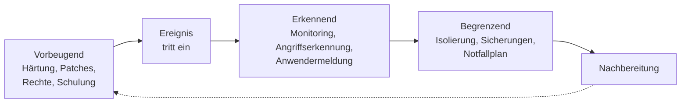

# Beweissicherung & Prävention

<span class='badge badge-vertiefung'>Vertiefung</span> &nbsp; Nach dem Vorfall ist vor dem nächsten. Aus einem Vorfall entstehen zwei Dinge: **Beweise** – für alles, was später jemand nachfragt – und **Lehren**, damit dieselbe Lücke nicht ein zweites Mal zuschlägt.

Die meisten Betriebe merken erst Wochen nach einem Vorfall, was ihnen fehlt. Die Versicherung will wissen, wann genau der Angreifer im System war. Die Aufsichtsbehörde fragt, wie ausgeschlossen wurde, dass Daten abgeflossen sind. Die Geschäftsführung will wissen, wie es passieren konnte. Und die eigene Abteilung würde gern verstehen, welche Maßnahme jetzt wirklich hilft. Alle vier Fragen haben dieselbe Antwort: **Das steht in den Daten, die wir während des Vorfalls gesichert haben – oder eben nicht.**

Deshalb ist Beweissicherung keine Aufgabe für hinterher. Sie beginnt in derselben Minute wie die Eindämmung, sie steht im Zielkonflikt mit ihr, und sie entscheidet darüber, ob aus einem Vorfall Erkenntnis wird oder nur ein unangenehmes Gefühl. Diese Seite zeigt beides: wie man Spuren so sichert, dass sie später etwas wert sind – und wie aus dem Gelernten Maßnahmen werden, die tatsächlich etwas verändern.

!!! abstract "Was du auf dieser Seite lernst"
    - warum Beweissicherung schon bei der **ersten Reaktion** beginnt und welche drei Grundsätze sie trägt
    - was die **Reihenfolge der Flüchtigkeit** ist und in welcher Reihenfolge man deshalb sichert
    - wie **Prüfsummen, Zeitstempel, forensische Kopien und Schreibschutz** zusammenwirken
    - wie **Protokolldaten** manipulationsgeschützt aufbewahrt werden und warum ohne synchrone Uhren nichts davon etwas taugt
    - was **revisionssichere Archivierung** verlangt und wo die eigenen Grenzen liegen, ab denen externe Unterstützung nötig wird
    - wie aus dem Vorfall **Prävention** wird: Nachbereitung, Ursachenanalyse, vorbeugende, erkennende und begrenzende Maßnahmen, Reviews und Sensibilisierung

---

## Warum Beweissicherung mit der ersten Reaktion beginnt

!!! tip "Die Analogie: der Tatort"
    Wenn die Polizei an einem Tatort eintrifft, ist die erste Handlung nicht das Ermitteln, sondern das **Absperren**. Der Grund ist banal: Die wertvollsten Spuren sind die empfindlichsten, und die ersten Menschen am Tatort zerstören unabsichtlich mehr als alle späteren zusammen. Wer den Raum lüftet, die Tür abwischt und den umgestoßenen Stuhl aufstellt, hat aufgeräumt – und aufgeklärt hat er nichts.

    In der IT ist es genau dasselbe, nur schneller. Der Arbeitsspeicher eines Rechners ist innerhalb von Sekunden weg. Ein Neustart „damit es wieder läuft“ ist der aufgestellte Stuhl.

Der Kern des Problems ist, dass man **zum Zeitpunkt der ersten Reaktion nicht weiß, ob man die Spuren jemals brauchen wird.** Die meisten Vorfälle enden ohne Verfahren, ohne Versicherungsfall und ohne behördliche Nachfrage. Aber welche das sind, weiß man erst hinterher. Deshalb gilt derselbe Grundsatz wie bei der Einstufung: **Im Zweifel sichern.** Eine Sicherung, die niemand braucht, kostet ein paar Stunden und ein paar Terabyte. Eine fehlende Sicherung kostet die Beweisführung.

Wofür Beweise gebraucht werden – die Liste ist länger, als die meisten erwarten:

| Zweck | Was gebraucht wird |
|---|---|
| **Eigene Ursachenanalyse** | Wie kam der Angreifer herein, was hat er getan, seit wann war er da? |
| **Ausschluss eines Datenabflusses** | Verbindungsprotokolle über den gesamten Verdachtszeitraum – die Grundlage für die Entscheidung über Meldepflichten |
| **Nachweis gegenüber der Aufsichtsbehörde** | dass angemessen und rechtzeitig reagiert wurde, und worauf die Bewertung beruhte |
| **Versicherung** | Zeitpunkt, Umfang, Schadenshöhe, Nachweis, dass Obliegenheiten eingehalten wurden |
| **Straf- oder Zivilverfahren** | verwertbare, unveränderte Daten mit nachvollziehbarer Herkunft |
| **Arbeitsrechtliche Fragen** | bei Verdacht auf Innentäterschaft – hier gelten besonders strenge Regeln, siehe unten |
| **Wiederherstellung** | Kenntnis darüber, welcher Datenstand noch sauber ist |

!!! warning "Beweissicherung im eigenen Betrieb hat Grenzen"
    Sobald Protokolle einzelnen Beschäftigten zugeordnet werden können, berührt die Auswertung Persönlichkeitsrechte und in aller Regel die Mitbestimmung. Wer bei Verdacht auf eine Innentäterschaft ohne Abstimmung mit Datenschutzbeauftragten, Personalabteilung und Betriebsrat auswertet, produziert unter Umständen einen Beweis, der nicht verwertet werden darf – und ein zweites Problem obendrauf. Diese Abstimmung gehört in die Vorbereitung, nicht in den Vorfall: Eine Vereinbarung darüber, **was im Ernstfall wie ausgewertet werden darf**, ist im Ernstfall Gold wert. Die rechtliche Einordnung dazu steht im Block [Recht & Organisation](../recht-organisation/index.md).

---

## Die drei Grundsätze der Beweissicherung

Alles, was folgt, dient drei Zielen. Wenn du dir nur drei Dinge merkst, dann diese:

### Unverändertheit

Ein Beweis ist wertlos, wenn man ihm nicht ansehen kann, dass er seit der Sicherung unverändert ist. Das gilt in beide Richtungen: gegen absichtliche Manipulation **und** gegen versehentliche Veränderung. Der zweite Fall ist der häufigere. Wer eine Datei nur öffnet, ändert unter Umständen schon ihren Zugriffszeitstempel; wer einen Datenträger einbindet, schreibt eventuell Journaldaten darauf. Deshalb: **niemals am Original arbeiten** – immer an einer Kopie, deren Übereinstimmung mit dem Original nachweisbar ist.

### Nachvollziehbarkeit

Jeder Schritt muss so dokumentiert sein, dass ein sachkundiger Dritter ihn **nachvollziehen und im Ergebnis wiederholen** könnte. Das heißt konkret: Was wurde gesichert, wann, von wem, mit welchem Werkzeug in welcher Version, mit welchem Ergebnis? Ein Satz wie „Wir haben den Server gesichert“ genügt dem nicht. „Datenträger `sda` des Systems SRV-04 mit dem Werkzeug X in der Version Y als bitgenaues Abbild gesichert, Prüfsumme vor und nach der Sicherung identisch, ausgeführt von A. Ohlsen im Beisein von T. Sander“ genügt ihm.

### Lückenlose Übergabekette

Vom Moment der Sicherung bis zur Auswertung muss jederzeit belegbar sein, **wer das Beweismittel in welchem Zeitraum in Händen hatte**. Diese Kette heißt im Fachjargon *Chain of Custody*. Reißt sie an einer Stelle – eine Festplatte lag drei Tage unbeaufsichtigt auf einem Schreibtisch –, ist der Beweis angreifbar, weil sich nicht mehr ausschließen lässt, dass jemand etwas verändert hat.

Ein Übergabeprotokoll hat immer dieselben Spalten:

| Spalte | Inhalt |
|---|---|
| **Beweismittel-Nummer** | eindeutige Kennung, auch physisch am Datenträger angebracht |
| **Beschreibung** | was es ist: Datenträger, Speicherabbild, Protokollauszug, Bildschirmfoto |
| **Herkunft** | von welchem System, aus welchem Einbauplatz, Seriennummer |
| **Prüfsumme** | der Fingerabdruck des Inhalts zum Zeitpunkt der Sicherung |
| **Zeitpunkt** | Datum, Uhrzeit, Zeitzone der Sicherung |
| **Übergaben** | je Zeile: von wem an wen, wann, wozu, Unterschrift beider Seiten |
| **Aufbewahrung** | wo es zwischen den Übergaben lag und wer Zugang zu diesem Ort hatte |

!!! tip "Das Vier-Augen-Prinzip ist hier kein Misstrauen, sondern Schutz"
    Wer allein sichert, kann hinterher nur seine eigene Aussage anbieten. Eine zweite Person, die den Vorgang bezeugt und mitunterschreibt, macht die Sicherung belastbar – und schützt zugleich die sichernde Person vor dem Verdacht, selbst etwas verändert zu haben. Bei Vorfällen mit Verdacht auf Innentäterschaft ist das keine Formalie, sondern Voraussetzung.

---

## Die Reihenfolge der Flüchtigkeit

Nicht alle Spuren halten gleich lang. Manche sind nach Millisekunden weg, andere überstehen Jahre. Daraus folgt eine Sicherungsreihenfolge, die in der Fachliteratur als **Order of Volatility** bekannt ist und schon in einem alten Standarddokument der Internet Engineering Task Force beschrieben wurde – **RFC 3227**, „Guidelines for Evidence Collection and Archiving“. Der Grundsatz lautet: **Sichere zuerst, was zuerst verschwindet.**

| Rang | Datenart | Haltbarkeit | Verloren durch |
|---|---|---|---|
| **1** | Prozessorregister, Zwischenspeicher | Bruchteile von Sekunden | praktisch alles; in der Praxis nicht sicherbar |
| **2** | Arbeitsspeicher: laufende Prozesse, offene Verbindungen, angemeldete Sitzungen, entpackter Schadcode, Schlüsselmaterial | bis zum Ausschalten | **Herunterfahren, Stromverlust, Neustart** |
| **3** | Netzwerkzustand: Verbindungstabellen, Adresszuordnungen im Netz, Routing-Informationen | Sekunden bis Minuten | Netztrennung, Zeitablauf |
| **4** | Temporäre Dateien, Auslagerungsdatei, Zwischenspeicher von Anwendungen | Stunden bis Tage | Neustart, Aufräumroutinen |
| **5** | Datenträgerinhalte einschließlich gelöschter Bereiche | Wochen bis Monate | Überschreiben, Neuinstallation, Zurückspielen einer Sicherung |
| **6** | Protokolldaten auf zentralen Systemen | Tage bis Jahre – je nach Aufbewahrungsregel | **Rotation**, Löschfristen, absichtliches Löschen durch den Angreifer |
| **7** | Physische Gegebenheiten: Netzaufbau, Konfigurationsstände, Zugangsprotokolle des Gebäudes | Monate bis Jahre | Umbau, Neukonfiguration |
| **8** | Archivmedien und Sicherungsbänder | Jahre | Ablauf der Aufbewahrungsfrist, Überschreiben im Rotationsverfahren |

Zwei Zeilen dieser Tabelle sind die praktisch wichtigsten.

**Rang 2 erklärt die Regel „trennen statt abschalten“** von der Seite [Sicherheitsvorfälle](sicherheitsvorfaelle.md) noch einmal von der anderen Seite. Der Arbeitsspeicher enthält bei laufender Schadsoftware oft das Einzige, was sie überhaupt sichtbar macht: Viele moderne Schadprogramme entpacken sich erst im Speicher und hinterlassen auf der Festplatte nur eine unauffällige Hülle. Ein Speicherabbild ist deshalb häufig das wertvollste Beweismittel des ganzen Vorfalls – und es existiert nur, solange der Strom anliegt.

**Rang 6 ist der, den man vorher entscheidet.** Ob Protokolldaten aus dem relevanten Zeitraum noch da sind, hängt nicht vom Geschick im Vorfall ab, sondern von einer Konfigurationsentscheidung Monate vorher. Deshalb der nächste Abschnitt.

!!! danger "Die Reihenfolge kollidiert mit der Eindämmung – und das ist beabsichtigt"
    Es gibt keine Reihenfolge, die beides optimal löst. Die Eindämmung will das System sofort stillsetzen, die Beweissicherung will es laufen lassen. Der übliche Kompromiss löst genau ein Problem zuerst und hält dann an:

    1. **Netz trennen** – die Ausbreitung stoppt, alle flüchtigen Daten bleiben erhalten.
    2. **Nichts weiter anfassen** – keine Programme starten, keine Dateien öffnen, keinen Virenscan über das System laufen lassen. Jede dieser Handlungen verändert den Zustand.
    3. **Speicherabbild ziehen**, sofern die Kompetenz und das Werkzeug dafür vorhanden sind. Wenn nicht: das System isoliert und eingeschaltet lassen und auf die externe Unterstützung warten.
    4. **Danach** erst Datenträgerabbild, Protokolle, Konfigurationsstände.

    Wer Schritt 2 überspringt, weil er „nur mal kurz schauen“ will, hat mit hoher Wahrscheinlichkeit schon Rang 2 bis 4 beschädigt.

---

## Prüfsummen, Zeitstempel und forensische Kopien

### Die Prüfsumme als Fingerabdruck

Eine **kryptografische Prüfsumme** – gebräuchlicher: ein **Hash** – ist eine Zeichenfolge fester Länge, die aus einem beliebig großen Inhalt berechnet wird. Sie hat zwei Eigenschaften, auf denen die gesamte Beweissicherung ruht:

- **Derselbe Inhalt ergibt immer denselben Wert.** Zwei Kopien mit identischem Hash sind bitgenau gleich.
- **Die kleinste Änderung ergibt einen völlig anderen Wert.** Ein einziges gekipptes Bit verändert die Zeichenfolge vollständig – man sieht der Prüfsumme nicht an, wie groß die Änderung war, nur *dass* es eine gab.

Das übliche Verfahren heute ist **SHA-256**. Die älteren Verfahren MD5 und SHA-1 gelten als gebrochen, weil sich mit vertretbarem Aufwand zwei verschiedene Inhalte mit demselben Hash erzeugen lassen. Für den Nachweis, dass niemand absichtlich manipuliert hat, taugen sie deshalb nicht mehr – auch wenn man sie in älteren Werkzeugen noch findet.

Der Ablauf beim Sichern sieht immer gleich aus:

```text
1  Pruefsumme des Originals berechnen        -> H1
2  Bitgenaue Kopie erstellen (Original schreibgeschuetzt)
3  Pruefsumme der Kopie berechnen            -> H2
4  H1 mit H2 vergleichen

   H1 = H2  ->  Kopie ist nachweislich identisch. Beide Werte kommen ins
                Uebergabeprotokoll, gearbeitet wird ab jetzt ausschliesslich
                an der Kopie.
   H1 != H2 ->  Kopie verwerfen, Vorgang wiederholen, Abweichung
                protokollieren.
```

Später lässt sich jederzeit nachweisen, dass ein Beweismittel unverändert ist: Prüfsumme neu berechnen, mit dem Protokolleintrag vergleichen. Stimmen sie überein, ist die Unverändertheit belegt.

!!! note "Prüfsumme und Zeitstempel gehören zusammen"
    Eine Prüfsumme allein belegt nur, dass sich seit **irgendwann** nichts geändert hat. Erst zusammen mit einem glaubwürdigen Zeitpunkt entsteht die Aussage „dieser Inhalt lag zu diesem Zeitpunkt in dieser Form vor“. Im einfachsten Fall ist das der Eintrag im Übergabeprotokoll mit Unterschrift. Wo es auf mehr ankommt, gibt es **qualifizierte Zeitstempel** von Vertrauensdiensteanbietern: Ein unabhängiger Dritter signiert die Prüfsumme zusammen mit der Zeit. Damit kann auch der Betrieb selbst nicht mehr behaupten, der Inhalt habe schon früher oder später so ausgesehen.

### Forensische Kopie gegen normale Kopie

Der Unterschied wird regelmäßig unterschätzt – und er entscheidet darüber, ob eine Sicherung etwas taugt.

| | **Normale Kopie** | **Forensische Kopie (Abbild, Image)** |
|---|---|---|
| **Was kopiert wird** | die Dateien, die das Dateisystem anzeigt | **jedes Bit** des Datenträgers, Sektor für Sektor |
| **Gelöschte Dateien** | nicht enthalten | enthalten, soweit noch nicht überschrieben |
| **Freier und ungenutzter Bereich** | nicht enthalten | enthalten – dort liegen oft Fragmente |
| **Versteckte Bereiche, Partitionstabellen** | nicht enthalten | enthalten |
| **Zeitstempel der Dateien** | werden beim Kopieren verändert | bleiben unverändert |
| **Prüfsumme über das Ganze** | nicht sinnvoll bildbar | über das gesamte Abbild bildbar |
| **Beweiswert** | gering | hoch |

Eine normale Kopie beantwortet die Frage „welche Dateien gibt es?“. Eine forensische Kopie beantwortet zusätzlich „welche gab es einmal, was wurde wann gelöscht, was steht in Bereichen, die niemand mehr sieht?“ – und das ist bei einem Angriff meistens die interessantere Frage.

### Schreibschutz

Damit beim Erstellen der Kopie nichts auf das Original geschrieben wird, wird es **schreibgeschützt** angeschlossen. Zwei Wege:

- **Hardware-Schreibschutz** (Write Blocker): ein Gerät zwischen Datenträger und Auswertungssystem, das Schreibbefehle physisch blockiert. Der belastbarste Weg.
- **Software-Schreibschutz**: der Datenträger wird ausschließlich lesend eingebunden. Funktioniert, ist aber schwächer nachweisbar, weil man darauf vertrauen muss, dass das Betriebssystem sich daran gehalten hat.

Ohne Schreibschutz genügt das bloße Anstecken an ein modernes Betriebssystem, um Änderungen auszulösen – Indizierungsdienste, Journalschreibvorgänge, automatische Prüfläufe. Danach stimmt die Prüfsumme nicht mehr mit dem Zustand zum Zeitpunkt des Vorfalls überein, und die Frage „was haben Sie da eigentlich verändert?“ ist nicht mehr sauber zu beantworten.

---

## Protokolldaten sichern

Protokolle sind das Rückgrat jeder Aufklärung – und gleichzeitig das Erste, was ein Angreifer aufräumt, wenn er kann. Drei Anforderungen entscheiden über ihren Wert.

### Aufbewahrung: was nicht da ist, kann man nicht auswerten

Protokolle auf einem einzelnen System sind aus zwei Gründen unzuverlässig: Sie rotieren nach kurzer Zeit weg, und wer das System übernommen hat, kann sie ändern. Die Antwort auf beides ist dieselbe: **Protokolle werden zeitnah auf ein zentrales System übertragen**, auf das das protokollierende System keinen Schreibzugriff hat.

Wie lange aufbewahrt wird, ist eine Abwägung zwischen zwei Richtungen:

- **Dafür:** Angriffe werden im Median erst Wochen nach dem Eindringen entdeckt. Wer nur vierzehn Tage aufhebt, kann den Verdachtszeitraum in vielen Fällen gar nicht abdecken – und damit einen Datenabfluss weder belegen noch ausschließen.
- **Dagegen:** Protokolle enthalten personenbezogene Daten. Zweckbindung und Datenminimierung verlangen, dass sie nicht unbegrenzt vorgehalten werden.

Als **typischer Richtwert** für sicherheitsrelevante Protokolle findet man in der Praxis Zeiträume in der Größenordnung von **drei bis zwölf Monaten**. Die genaue Festlegung ist keine technische, sondern eine dokumentierte Entscheidung: Sie gehört in ein Lösch- und Aufbewahrungskonzept, wird mit Datenschutzbeauftragten und – wo Beschäftigtendaten betroffen sind – mit der Mitbestimmung abgestimmt und dann eingehalten. „Wir heben mal alles auf“ ist genauso wenig ein Konzept wie „das rotiert nach einer Woche, das war schon immer so“.

### Manipulationsschutz

| Maßnahme | Wirkung |
|---|---|
| **Zentraler Protokollserver** | das kompromittierte System kann seine eigenen Spuren nicht mehr löschen |
| **Getrennte Rechte** | wer auf dem Quellsystem Administrator ist, hat auf dem Protokollserver keine Rechte |
| **Nur-Anfügen-Betrieb** (append-only) | Einträge können hinzugefügt, aber nicht geändert oder gelöscht werden |
| **Einmal beschreibbare Speicherung** (WORM) | technisch erzwungene Unveränderbarkeit für den Aufbewahrungszeitraum |
| **Signatur oder verkettete Prüfsummen** | jeder Eintrag hängt am vorherigen; ein entfernter Eintrag bricht die Kette sichtbar |
| **Überwachung der Protokollierung selbst** | ein Alarm, wenn ein System aufhört zu liefern – das Verstummen ist selbst ein Befund |

Die letzte Zeile wird am häufigsten vergessen und ist eine der nützlichsten. **Eine Lücke in den Protokolldaten ist keine Nichtinformation, sondern ein Fund.** Wenn ein Server drei Stunden lang nichts geliefert hat und danach wieder, sollte jemand wissen wollen, warum.

### Zeitsynchronisation: die unscheinbare Voraussetzung

Ohne gemeinsame Zeitbasis ist die Korrelation aus verschiedenen Quellen wertlos. Das klingt nach einer Kleinigkeit, bis man es einmal in Zahlen sieht:

```text
Beobachtet, mit unsynchronisierten Uhren

  Firewall        14:22:07   ausgehende Verbindung zu unbekannter Adresse
  Dateiserver     14:22:31   Massenzugriff auf Freigabe P beginnt
  Arbeitsplatz    14:21:48   Ausfuehrung eines unbekannten Programms

  Gelesene Reihenfolge:  Programm -> Firewall -> Dateiserver
  Schlussfolgerung:      der Abfluss begann vor dem Massenzugriff


Nach Korrektur der Uhrenabweichungen
  (Arbeitsplatz ging 95 s vor, Firewall 40 s nach)

  Arbeitsplatz    14:20:13   Ausfuehrung eines unbekannten Programms
  Dateiserver     14:22:31   Massenzugriff auf Freigabe P beginnt
  Firewall        14:22:47   ausgehende Verbindung zu unbekannter Adresse

  Tatsaechliche Reihenfolge:  Programm -> Dateiserver -> Firewall
  Schlussfolgerung:           erst wurde gesammelt, dann abgeflossen
```

Dieselben drei Einträge, zwei völlig verschiedene Geschichten – und im ersten Fall eine falsche Schlussfolgerung darüber, was der Angreifer mitgenommen hat. Deshalb:

- Alle Systeme beziehen ihre Zeit aus **derselben Quelle**, üblicherweise über das Network Time Protocol aus einer betriebsinternen Quelle, die ihrerseits an einer verlässlichen Referenz hängt.
- Protokolle werden nach Möglichkeit in **UTC** geschrieben oder tragen die **Zeitzone** ausdrücklich mit. Sonst wird die Sommerzeitumstellung zur Fehlerquelle: Eine Stunde erscheint doppelt, eine fehlt.
- Die **Uhrenabweichung wird überwacht**. Ein Server, der um Minuten abweicht, ist ein Betriebsproblem – und im Vorfall ein Beweisproblem.

!!! warning "Auch der Zeitstempel im Protokoll hat eine Herkunft"
    Es gibt drei verschiedene Zeitpunkte, die alle „Zeitstempel“ heißen: wann das Ereignis passiert ist, wann das System es geschrieben hat, wann der Protokollserver es empfangen hat. Bei einem verzögert übertragenen Protokoll können die drei weit auseinanderliegen. Für die Auswertung muss klar sein, **welcher der drei** in der Spalte steht – gute Protokollsysteme halten alle drei fest.

---

## Revisionssichere Archivierung

Am Ende des Vorfalls entsteht ein Bündel aus Vorfallprotokoll, Beweismitteln, Berichten, Meldungen und Entscheidungen. Das muss irgendwo hin – und zwar so, dass es in zwei Jahren noch auffindbar, lesbar und glaubwürdig ist. Der Fachbegriff dafür lautet **revisionssichere Archivierung**.

Die Anforderungen sind seit Langem dieselben, unabhängig davon, ob es um Buchhaltungsbelege oder Vorfallunterlagen geht:

| Anforderung | Was sie praktisch bedeutet | Typische Umsetzung |
|---|---|---|
| **Unveränderbarkeit** | Ein einmal abgelegtes Dokument kann nicht mehr geändert werden; Korrekturen entstehen als neue Version | einmal beschreibbare Speicherung, Versionierung ohne Überschreiben |
| **Vollständigkeit** | Nichts fehlt, nichts wurde nachträglich entfernt | lückenlose Nummernkreise, Eingangsprotokoll |
| **Nachvollziehbarkeit** | Jede Ablage, Änderung und jeder Zugriff ist protokolliert | Zugriffs- und Änderungsprotokoll des Archivsystems |
| **Wiederauffindbarkeit** | Ein Dokument wird in vertretbarer Zeit gefunden | Verschlagwortung, Metadaten, Volltextsuche |
| **Verfügbarkeit über die gesamte Frist** | Auch in zehn Jahren noch lesbar | Formatwahl, geplante Migration, Prüfung der Medien |
| **Schutz vor Verlust** | Ein Archiv ist kein Ersatz für eine Sicherung – es braucht selbst eine | räumlich getrennte Zweitkopie |
| **Zugriffsbeschränkung** | Nur wer es braucht, kommt heran | Rollenkonzept, Vier-Augen-Prinzip für Löschungen |

!!! danger "Ein Ordner auf dem Dateiserver ist kein Archiv"
    Der häufigste Irrtum: „Wir legen das im Laufwerk Q ab.“ Ein Netzlaufwerk erfüllt keine einzige der sieben Anforderungen. Dateien lassen sich ändern und löschen, ohne dass es jemand merkt; es gibt keine Versionierung, keine Metadaten, kein Zugriffsprotokoll, keine Aufbewahrungssteuerung. Und – der Punkt, der bei einem Verschlüsselungsvorfall bitter wird – **die Vorfallunterlagen liegen dann auf genau dem System, um das es im Vorfall geht.**

    Dafür gibt es **Dokumentenmanagementsysteme**: Sie versionieren, verschlagworten, protokollieren jeden Zugriff, steuern Aufbewahrungsfristen und Löschungen und trennen Rechte sauber. Ob es ein solches System sein muss, hängt vom Umfang ab. Was nicht verhandelbar ist: Die Ablage liegt **außerhalb** der Systeme, über die berichtet wird.

### Aufbewahrungsfristen

Wie lange etwas aufbewahrt werden muss, ergibt sich nicht aus der IT, sondern aus Recht und Verträgen. Drei Ebenen spielen zusammen:

- **Handels- und steuerrechtliche Fristen** (§ 257 HGB, § 147 AO): Im Kern gelten zehn Jahre für Bücher, Inventare und Jahresabschlüsse und sechs Jahre für Handels- und Geschäftsbriefe; für Buchungsbelege wurde die Frist verkürzt. Die genauen Werte gehören in den Rechtsteil des Lehrgangs, weil sie sich ändern – die Anforderung an die Archivierung bleibt dieselbe.
- **Datenschutzrechtliche Grenzen**: Personenbezogene Daten dürfen nicht länger aufbewahrt werden, als es der Zweck erfordert. Hier zieht das Recht die Frist nach **oben** zu, nicht nach unten. Aufbewahrungspflicht und Löschpflicht stehen sich gegenüber, und die Auflösung dieses Widerspruchs gehört ins Löschkonzept.
- **Nachweisbedarf aus dem Vorfall selbst**: Die Dokumentationspflicht für Verletzungen des Schutzes personenbezogener Daten besteht unabhängig davon, ob gemeldet wurde. Solange ein Verfahren, eine Prüfung oder ein Versicherungsfall möglich ist, wird nicht gelöscht.

!!! tip "Der Satz, an dem sich alles entscheidet"
    **Ein Archiv ist kein Ort, an dem Dinge liegen, sondern ein Verfahren, das sie unverändert hält.** Wer diesen Unterschied verstanden hat, versteht auch, warum ein Ordner mit Datum im Namen die Anforderungen nicht erfüllt – und warum revisionssicher nicht dasselbe ist wie „gut sortiert“.

---

## Wann externe Unterstützung nötig ist

Es gibt einen Punkt, an dem die eigene Bearbeitung mehr schadet als nützt. Ihn zu erkennen, ist eine fachliche Leistung – und keine Niederlage.

**Klare Anzeichen, dass Hilfe geholt werden sollte:**

| Anzeichen | Warum es allein nicht mehr geht |
|---|---|
| Der Vorfall betrifft **zentrale Verzeichnis- oder Verwaltungssysteme** | Wenn der Verzeichnisdienst kompromittiert ist, ist keinem Konto und keinem System mehr zu trauen. Die Bereinigung ist ein eigenes Projekt. |
| Ein **Datenabfluss** ist möglich, aber nicht auszuschließen | Der Ausschluss verlangt eine Auswertung, die in Umfang und Methodik über Bordmittel hinausgeht – und ihr Ergebnis ist Grundlage einer Meldeentscheidung. |
| **Verdacht auf Innentäterschaft** | Hier braucht es Unabhängigkeit. Wer selbst Teil des Kreises der Verdächtigen sein könnte, kann nicht ermitteln. |
| Ein **Verfahren** ist wahrscheinlich | Die Anforderungen an die Verwertbarkeit sind höher als das, was ohne Ausbildung und Werkzeug erreichbar ist. |
| Die eigenen **Kapazitäten reichen nicht** | Ein größerer Vorfall bindet eine Abteilung über Tage rund um die Uhr. Übermüdete Menschen machen Fehler, die nicht rückgängig zu machen sind. |
| Es fehlt schlicht die **Kompetenz oder das Werkzeug** | Ein Speicherabbild falsch zu ziehen ist schlechter, als es gar nicht zu ziehen: Man hat die Spur zerstört und trotzdem nichts gewonnen. |

**Wer infrage kommt:** spezialisierte Dienstleister für digitale Forensik und Vorfallbewältigung; Computer-Notfallteams, im deutschsprachigen Raum als CERT oder CSIRT bezeichnet; das Bundesamt für Sicherheit in der Informationstechnik mit Beratungs- und Meldeangeboten; die Zentralen Ansprechstellen Cybercrime der Landeskriminalämter, die auch beraten, wenn noch offen ist, ob Anzeige erstattet wird; sowie Rechtsberatung für die Meldeentscheidungen.

!!! warning "Zwei Dinge, die man vorher klären muss – nicht im Vorfall"
    **Erstens die Versicherung.** Viele Cyberversicherungen enthalten die Vorgabe, dass bestimmte Dienstleister eingeschaltet werden oder dass eine Beauftragung vorher freigegeben wird. Wer im Eifer des Gefechts eigenmächtig beauftragt, riskiert den Schutz genau in dem Moment, in dem er ihn braucht.

    **Zweitens die Erreichbarkeit.** Ein Dienstleister, den man erst im Vorfall sucht, verhandelt Konditionen, während die Verschlüsselung läuft. Deshalb gehört ein **Rahmenvertrag oder eine Bereitschaftsvereinbarung** in die Vorbereitung – zusammen mit einer Kontaktliste, die auch dann erreichbar ist, wenn Dateiserver und E-Mail nicht mehr gehen. Also auf Papier.

    Und der wichtigste Satz für die Zwischenzeit: **Bis die Hilfe da ist, wird nicht „schon mal aufgeräumt“.** Isolieren, laufen lassen, dokumentieren, Finger weg.

---

## Prävention: aus dem Vorfall lernen

Damit endet die Reaktion und beginnt der Teil, der über den nächsten Vorfall entscheidet. Ein Vorfall, aus dem keine Maßnahme folgt, war reiner Schaden. Ein Vorfall, aus dem drei umgesetzte Maßnahmen folgen, war teures Lehrgeld – aber immerhin Lehrgeld.

### Die Nachbereitung

Der Rückblick findet **zeitnah nach dem Abschluss** statt – nah genug, dass die Erinnerung frisch ist, weit genug, dass die Beteiligten geschlafen haben. Teilnehmen alle, die beteiligt waren: Administration, Vorfallverantwortung, betroffene Fachbereiche, Leitung, gegebenenfalls Dienstleister.

Fünf Leitfragen strukturieren die Runde:

1. **Was ist tatsächlich passiert?** Der abgestimmte Ablauf auf Basis des Protokolls – nicht die Version, die jeder für sich erinnert.
2. **Was hat gut funktioniert?** Diese Frage wird fast immer übersprungen, und das ist ein Fehler: Was funktioniert hat, will man behalten und verstärken.
3. **Wo haben wir Zeit verloren – und woran lag es?** Fehlende Zugangsdaten, unklare Zuständigkeit, ein nicht erreichbarer Ansprechpartner, ein Plan, den niemand finden konnte.
4. **Was hätte den Vorfall verhindert oder deutlich kleiner gehalten?** Hier entstehen die Maßnahmen.
5. **Was ändern wir konkret – wer macht es bis wann?** Ohne diese Frage bleibt der Rest Gesprächstherapie.

!!! tip "Ohne Schuldsuche – und das ist keine Nettigkeit"
    Eine Nachbereitung, in der jemand Schuld zugewiesen bekommt, ist die letzte, in der etwas Ehrliches gesagt wird. Beim nächsten Vorfall erfährt man dann nicht mehr, dass jemand vier Stunden lang etwas versucht hat, was nicht funktionierte – und genau diese vier Stunden wären die wichtigste Erkenntnis gewesen.

    Der Grundsatz lautet deshalb: **Man untersucht Systeme und Prozesse, nicht Personen.** Dass jemand auf einen Anhang geklickt hat, ist keine Ursache – es ist ein zu erwartendes Verhalten. Die Ursache ist, dass ein Klick diese Wirkung haben konnte.

### Ursachenanalyse

Die Nachbereitung liefert den Ablauf, die Ursachenanalyse liefert den Ansatzpunkt. Der Unterschied zwischen **Symptom** und **Ursache** entscheidet darüber, ob die Maßnahme wirkt oder nur beruhigt. Das gebräuchlichste Werkzeug ist die wiederholte Warum-Frage:

```text
Beobachtung   Der Dateiserver wurde verschluesselt.

  Warum?      Ein Schadprogramm lief mit Schreibrechten auf der Freigabe.
  Warum?      Es startete auf einem Arbeitsplatz aus einem Makro in einem
              E-Mail-Anhang.
  Warum?      Makros aus externen Dokumenten waren nicht blockiert.
  Warum?      Eine Fachanwendung braucht Makros; die Blockade wurde vor
              Jahren pauschal fuer alle aufgehoben.
  Warum?      Es gab keine Moeglichkeit, die Ausnahme auf diese eine
              Anwendung zu begrenzen - und niemand hat die Ausnahme
              seither ueberprueft.

Ursache       Eine unbefristete, nie ueberpruefte Pauschalausnahme in einer
              Sicherheitseinstellung.

Massnahmen    a) Makros nur noch aus signierten oder aus einem definierten
                 Vertrauensbereich stammenden Dokumenten zulassen
              b) alle bestehenden Sicherheitsausnahmen inventarisieren,
                 begruenden, befristen und mit Wiedervorlage versehen
```

Die Bewegung im Beispiel ist typisch: Man startet bei der Technik und landet bei einer **Entscheidung ohne Wiedervorlage**. Das ist der häufigste Ursachentyp überhaupt – nicht Unwissen, sondern eine einmal getroffene Ausnahme, die niemand je zurückgenommen hat.

!!! note "Wann man aufhört zu fragen"
    Die Warum-Kette endet nicht nach fünf Schritten, weil fünf eine magische Zahl wäre, sondern **wenn man bei etwas angekommen ist, das man tatsächlich ändern kann**. Landet man bei „weil Menschen Fehler machen“, ist man einen Schritt zu weit gegangen – das ist keine Ursache, sondern eine Rahmenbedingung. Für breitere Vorfälle mit mehreren Ursachensträngen eignet sich das Ursache-Wirkungs-Diagramm nach Ishikawa, das in der [Vertiefung zum Risikomanagement](risikomanagement-vertiefung.md) beschrieben ist.

Die gefundenen Ursachen wandern anschließend **zurück ins Risikoregister** – als neue oder neu bewertete Risiken mit Maßnahme, Verantwortlichem und Termin. Genau an dieser Stelle schließt sich der Kreis zum [Risikomanagement](risikomanagement.md): Ein eingetretener Vorfall ist die einzige belastbare Datenquelle, die man für Eintrittswahrscheinlichkeiten hat.

---

## Maßnahmenarten: vorbeugend, erkennend, begrenzend

Maßnahmen werden nach dem Zeitpunkt eingeteilt, an dem sie wirken. Diese Einteilung ist mehr als eine Ordnungshilfe: Sie sagt dir, **auf welchen Faktor der Risikoformel** eine Maßnahme einzahlt.

| Art | Wann sie wirkt | Wirkung auf das Risiko | Beispiele |
|---|---|---|---|
| **Vorbeugend** (präventiv) | vor dem Ereignis | senkt die **Eintrittswahrscheinlichkeit** | Härtung, Patchmanagement, Rechtekonzepte, Mehrfaktor-Anmeldung, Makrosperre, Schulung, Segmentierung |
| **Erkennend** (detektiv) | während des Ereignisses | senkt die **Schadenshöhe**, indem sie die Zeit bis zur Reaktion verkürzt | Monitoring, Angriffserkennung, Protokollauswertung, Alarme, Anwendermeldeweg |
| **Begrenzend** (korrektiv / reaktiv) | nach dem Ereignis | senkt die **Schadenshöhe**, indem sie den Schaden eindämmt und rückgängig macht | Sicherungen, Notfallplan, Wiederanlaufverfahren, Ausweichbetrieb, geübte Vorfallbearbeitung |

Diese Zuordnung ist die praktisch wichtigste Erkenntnis des ganzen Abschnitts – und sie wird regelmäßig falsch gemacht:

!!! warning "Überwachung erkennt, sie verhindert nicht"
    Eine Angriffserkennung macht einen Angriff **nicht unwahrscheinlicher**. Sie verkürzt die Zeit zwischen Eintritt und Reaktion und senkt damit den Schaden. Wer in einer Risikobewertung die Eintrittswahrscheinlichkeit herunterschreibt, weil man jetzt ein Erkennungssystem hat, rechnet sich die Maßnahme schön. Dasselbe gilt für Sicherungen: Ein Backup verhindert keinen Verschlüsselungsangriff, es macht ihn überlebbar.

Ein Vorfall im Zeitverlauf zeigt, wie die drei Arten ineinandergreifen:



Manche Rahmenwerke ergänzen zwei weitere Arten: **abschreckende** Maßnahmen, die potenzielle Täter von vornherein abhalten sollen – sichtbare Zugangskontrollen, angekündigte Protokollierung –, und **wiederherstellende** Maßnahmen, die man auch als Untergruppe der begrenzenden führen kann. Für die Praxis reichen die drei oben.

!!! tip "Der Zusammenhang zur Verteidigung in mehreren Schichten"
    Keine einzelne Maßnahme hält. Das ist keine Schwäche, sondern die Grundannahme: Man baut **mehrere unabhängige Schichten** übereinander, in der Erwartung, dass jede einzelne durchbrochen werden kann. Der Fachbegriff dafür ist *Defense in Depth*. Die entscheidende Prüffrage lautet dabei immer: **Welches einzelne Ereignis hebelt mehrere Schichten gleichzeitig aus?** Ein Konto mit Rechten überall ist so ein Ereignis. Eine Sicherung, die dauerhaft eingebunden ist, ebenfalls.

---

## Der Werkzeugkasten: fünf Maßnahmen, die fast immer greifen

### Härtung

Härtung heißt, ein System auf das zu reduzieren, was es tatsächlich braucht: nicht benötigte Dienste und Rollen abschalten, Standardkonten entfernen oder umbenennen, Voreinstellungen von Herstellern ersetzen, ungenutzte Schnittstellen deaktivieren, sichere Grundkonfigurationen verwenden. Die Wirkung ist unspektakulär und groß zugleich: **Jeder abgeschaltete Dienst ist eine Schwachstelle, die man nie patchen muss.** Für gängige Systeme gibt es veröffentlichte Härtungsvorgaben; man erfindet sie nicht selbst, man wählt eine aus und dokumentiert die Abweichungen.

### Aktualisierung

Patchmanagement ist kein Vorgang, sondern ein Prozess mit fünf Schritten: **Inventar** (was habe ich überhaupt?), **Bewertung** (welche Lücke betrifft mich, wie dringend – siehe die Einordnung mit CVSS auf der Seite [Sicherheitsvorfälle](sicherheitsvorfaelle.md)), **Test**, **Rollout**, **Nachweis**. Der erste Schritt ist der, an dem es scheitert: Man kann nicht patchen, was man nicht weiß. Dazu gehört ein definierter **Notfallweg** für Lücken, die nicht bis zum nächsten Wartungsfenster warten können – mit verkürztem Test und ausdrücklicher Freigabe, statt einfach das reguläre Verfahren zu umgehen.

### Segmentierung

Ein flaches Netz bedeutet: Wer irgendwo drin ist, ist überall drin. Segmentierung zieht Grenzen zwischen Zonen – Verwaltung, Produktion, Server, Gästenetz, Fernwartung – und kontrolliert den Verkehr zwischen ihnen. Für die Vorfallbearbeitung hat sie zwei Effekte: Sie **verlangsamt die Ausbreitung**, und sie macht **Isolierung überhaupt erst möglich**. Man kann nur trennen, was vorher getrennt gedacht wurde. Die technische Umsetzung steht unter [Segmentierung & VPN](../netzwerke/segmentierung-und-vpn.md).

### Zugriffskonzepte

Vier Prinzipien, die zusammen mehr bewirken als jedes einzelne Werkzeug:

- **So wenig Rechte wie nötig.** Kein Alltagskonto mit administrativen Rechten, keine Dienstkonten mit Vollzugriff „weil es sonst nicht lief“.
- **Getrennte privilegierte Konten.** Administrative Tätigkeit läuft über ein eigenes Konto und möglichst von einem eigenen, besonders geschützten Arbeitsplatz aus – nicht von demselben Rechner, auf dem E-Mails gelesen werden.
- **Mehrfaktor-Anmeldung**, mindestens für alle Zugänge von außen und alle privilegierten Konten. Sie ist die wirksamste Einzelmaßnahme gegen gestohlene Zugangsdaten.
- **Rezertifizierung und Offboarding.** Rechte wachsen über Jahre an, wenn niemand sie zurücknimmt. Wer den Betrieb verlässt oder die Abteilung wechselt, verliert seine alten Rechte – und dass das passiert ist, wird nachgewiesen.

### Sicherungen

Die Sicherung ist die letzte Verteidigungslinie, und sie muss davon ausgehen, dass der Angreifer sie sucht. Entscheidend sind drei Punkte: eine Kopie, die **nicht ständig erreichbar** ist – ausgelagert, getrennt oder für den Aufbewahrungszeitraum technisch unveränderbar; **getrennte Zugangsdaten** für das Sicherungssystem, damit ein übernommenes Administratorkonto nicht auch die Sicherungen löscht; und **geübte Wiederherstellung**, weil eine Sicherung, die nie zurückgespielt wurde, keine Sicherung ist, sondern eine Hoffnung. Die Verfahren dazu stehen unter [Backup & Recovery](../betrieb/backup-und-recovery.md).

Wie die fünf Werkzeuge an einem konkreten Angriffsverlauf zusammenwirken:

| Angriffsschritt | Was ihn aufhält |
|---|---|
| Anhang wird geöffnet, Schadcode startet | Härtung (Makrosperre), Schulung, Schutzsoftware |
| Rechteausweitung auf dem Arbeitsplatz | Aktualisierung, keine lokalen Administratorrechte |
| Ausbreitung auf weitere Systeme | Segmentierung, Mehrfaktor-Anmeldung, getrennte privilegierte Konten |
| Verschlüsselung der Freigaben | Erkennung, Rechtekonzept auf den Freigaben |
| Löschen der Sicherungen | getrennte Zugangsdaten, unveränderbare oder ausgelagerte Kopie |
| Erpressung | funktionierende, getestete Wiederherstellung |

Die Zeile, die den Unterschied macht, ist die vorletzte. **Ein Angriff wird nicht dadurch existenzbedrohend, dass Daten verschlüsselt werden, sondern dadurch, dass auch die Sicherungen weg sind.**

---

## Prozesse und Richtlinien überarbeiten

Technik allein hält nicht, was aus einem Vorfall gelernt wurde. Ein Teil der Lehren gehört in Dokumente – und zwar in die richtigen:

| Dokumentart | Was hineingehört | Beispiel |
|---|---|---|
| **Leitlinie** | die Grundsätze, verabschiedet von der Leitung – selten geändert | „Informationssicherheit hat für uns denselben Rang wie Arbeitssicherheit.“ |
| **Richtlinie** | verbindliche Regeln für einen Bereich | „Fernzugänge erfordern eine Mehrfaktor-Anmeldung.“ |
| **Arbeitsanweisung** | wie es konkret gemacht wird, Schritt für Schritt | „So wird ein Konto gesperrt.“ |
| **Checkliste** | was im Ernstfall in welcher Reihenfolge abzuarbeiten ist | Sofortmaßnahmen bei Verschlüsselungsverdacht |

Die letzte Zeile ist die, die aus einem Vorfall am direktesten entsteht. Wenn man während der Bearbeitung dreimal überlegen musste, wer eigentlich informiert werden muss, gehört genau das in eine Karte, die beim nächsten Mal danebenliegt.

Vier Dinge machen den Unterschied zwischen einem wirksamen Dokument und einem abgelegten:

1. **Versionierung und Freigabe.** Wer hat wann was freigegeben? Sonst gelten zwei Fassungen gleichzeitig.
2. **Bekanntgabe.** Eine Richtlinie, die niemand kennt, wirkt nicht. Zur Änderung gehört, wie sie bei den Betroffenen ankommt.
3. **Umsetzbarkeit.** Regeln, die die Arbeit unmöglich machen, werden umgangen – und danach ist die Lage schlechter als vorher, weil man den Umgehungsweg nicht mehr sieht.
4. **Wirksamkeitsprüfung.** Nach einer angemessenen Frist wird geprüft, ob die Regel tatsächlich gelebt wird. Sonst hat man nur die Dokumentation verbessert.

!!! warning "Die häufigste Scheinmaßnahme"
    Nach einem Vorfall entsteht besonders leicht eine Maßnahme, die gut aussieht und nichts bewirkt: „Wir sensibilisieren die Mitarbeitenden noch einmal.“ Das ist keine Maßnahme, sondern eine Absichtserklärung – es fehlen Inhalt, Zielgruppe, Termin, Verantwortlicher und ein Kriterium, an dem man die Wirkung erkennt. Eine brauchbare Formulierung wäre: „Alle Beschäftigten mit E-Mail-Zugang durchlaufen bis zum Ende des Quartals eine zwanzigminütige Unterweisung zum Meldeweg; Ziel ist, dass in der folgenden Übung mindestens die Hälfte der Empfänger meldet. Verantwortlich: …“

---

## Regelmäßige Überprüfungen und Reviews

Maßnahmen verfallen. Rechte wachsen an, Ausnahmen bleiben stehen, Systeme kommen dazu, Zuständigkeiten wechseln. Deshalb braucht Prävention einen Takt. Die folgenden Kadenzen sind **verbreitete Richtwerte**, keine Vorschrift – jeder Betrieb legt sie nach Schutzbedarf und Größe selbst fest.

| Prüfart | Was sie prüft | Typischer Takt |
|---|---|---|
| **Verwundbarkeitsscan** | bekannte Schwachstellen im Bestand | fortlaufend bis monatlich |
| **Rechte-Rezertifizierung** | Hat noch jeder die Rechte, die er braucht? | halbjährlich bis jährlich |
| **Wiederherstellungstest** | Lässt sich aus der Sicherung tatsächlich zurückspielen – vollständig und in der Zielzeit? | mindestens jährlich, für kritische Systeme öfter |
| **Notfall- oder Planübung** | Funktionieren Meldeweg, Rollen und Entscheidungen unter Druck? | jährlich |
| **Internes Audit** | Wird eingehalten, was in den Richtlinien steht? | jährlich, rollierend über die Bereiche |
| **Externes Audit / Zertifizierung** | unabhängige Prüfung des Managementsystems | nach Zyklus des Rahmenwerks |
| **Penetrationstest** | Lassen sich Schwächen tatsächlich verketten und ausnutzen? | anlassbezogen, bei größeren Änderungen |
| **Überprüfung der Ausnahmen** | Gelten die einmal erteilten Sonderregeln noch zu Recht? | jährlich |

Die letzte Zeile ist die, die in kaum einem Betrieb existiert – und die, aus der das Beispiel der Ursachenanalyse weiter oben stammt. **Jede Ausnahme bekommt beim Erteilen eine Begründung, eine Befristung und eine Wiedervorlage.** Ohne das wird aus einer Ausnahme innerhalb von zwei Jahren der Normalzustand.

Der ganze Takt ist nichts anderes als die Check-Phase des Verbesserungszyklus, der jedem Managementsystem zugrunde liegt: planen, umsetzen, prüfen, anpassen. Der Rahmen dafür steht unter [ISMS & Standards](isms.md).

!!! tip "Die Planübung ist die günstigste Prüfung von allen"
    Eine **Tabletop-Übung** braucht keinen Testaufbau und keine Ausfallzeit: Eine Gruppe bekommt ein Szenario und spielt am Tisch durch, was sie täte. Sie deckt genau die Lücken auf, die im Ernstfall am meisten kosten – dass niemand die Nummer des Dienstleisters findet, dass unklar ist, wer die Fertigung anhalten darf, dass der Notfallplan auf dem verschlüsselten Laufwerk liegt. Genau so eine Übung ist die [Übung: Vorfallbearbeitung](uebung-vorfallbearbeitung.md).

---

## Schulung und Sensibilisierung als Präventionsmaßnahme

Der Mensch ist die häufigste Eintrittstür – und zugleich der schnellste Sensor, den ein Betrieb hat. Beides folgt aus derselben Tatsache: Menschen sind überall dort, wo Technik nichts sieht. Welche der beiden Rollen überwiegt, entscheidet die Sensibilisierung.

Was in der Praxis wirkt:

- **Rollenspezifisch statt für alle gleich.** Die Buchhaltung braucht das Thema Zahlungsanweisungen und gefälschte Absender, die Administration braucht privilegierte Konten und Fernwartung, die Fertigung braucht Wechseldatenträger und Fernwartungszugänge von Maschinenlieferanten.
- **Kurz und wiederholt statt einmal und lang.** Zwanzig Minuten viermal im Jahr schlagen vier Stunden einmal im Jahr deutlich.
- **An echten Fällen.** Ein anonymisierter eigener Vorfall wirkt stärker als jedes allgemeine Beispiel – „das ist bei uns passiert“ hört jeder anders zu.
- **Den Meldeweg üben, nicht nur nennen.** Wer den Weg einmal gegangen ist, geht ihn im Ernstfall auch.
- **Übungen mit Testnachrichten mit Vorsicht.** Simulierte Täuschungsversuche sind ein brauchbares Werkzeug, wenn sie **vorher angekündigt**, mit der Mitbestimmung abgestimmt und **nicht personenbezogen ausgewertet** werden. Wer sie als Fangversuch anlegt und Ergebnisse einzelnen Personen zuordnet, erzeugt Misstrauen – und danach meldet niemand mehr etwas.

!!! tip "Die bessere Kennzahl: Meldequote statt Klickquote"
    Die meisten Betriebe messen, **wie viele geklickt haben**. Das ist die schlechtere Zahl, denn sie lässt sich nur schwer auf null bringen – irgendwann klickt immer jemand, und eine gut gemachte Täuschung erwischt auch aufmerksame Menschen.

    Die aussagekräftigere Zahl ist die **Meldequote**: Wie viele haben den Versuch aktiv gemeldet, und **wie schnell**? Denn im echten Angriff entscheidet nicht, ob jemand geklickt hat, sondern wie schnell davon jemand erfährt. Eine Belegschaft, die in vier Minuten meldet, ist ein besserer Sensor als jedes Erkennungssystem.

Wie Schulungen didaktisch aufgebaut und für unterschiedliche Zielgruppen zugeschnitten werden, steht unter [Schulung & Training](../projektmanagement/schulung-und-training.md).

---

## Was du jetzt wissen solltest

- **Beweissicherung beginnt mit der ersten Reaktion**, nicht danach – weil man zu diesem Zeitpunkt noch nicht weiß, ob man die Spuren brauchen wird.
- Die drei Grundsätze sind **Unverändertheit**, **Nachvollziehbarkeit** und die **lückenlose Übergabekette**. Man arbeitet nie am Original.
- Die **Reihenfolge der Flüchtigkeit** bestimmt, was zuerst gesichert wird: Arbeitsspeicher vor Netzzustand vor Datenträger vor Protokollen vor Archiven.
- **Prüfsummen** belegen Unverändertheit, **forensische Kopien** erfassen auch gelöschte und freie Bereiche, **Schreibschutz** verhindert die versehentliche Veränderung des Originals.
- **Protokolldaten** gehören zentral, manipulationsgeschützt und lange genug aufbewahrt – und ohne **synchrone Uhren** ist ihre Korrelation wertlos.
- **Revisionssichere Archivierung** verlangt Unveränderbarkeit, Vollständigkeit, Nachvollziehbarkeit, Wiederauffindbarkeit, Verfügbarkeit über die Frist, Verlustschutz und Zugriffsbeschränkung. Ein Netzlaufwerk erfüllt nichts davon.
- **Externe Unterstützung** ist nötig, wenn zentrale Systeme betroffen sind, ein Datenabfluss auszuschließen ist, Innentäterschaft im Raum steht oder Kompetenz, Werkzeug oder Kapazität fehlen. Bis sie da ist: isolieren, nichts anfassen.
- Die **Nachbereitung** läuft ohne Schuldsuche und endet mit Maßnahmen, die einen Namen und einen Termin haben. Die Ursachen wandern zurück ins Risikoregister.
- Maßnahmen sind **vorbeugend** (senken die Eintrittswahrscheinlichkeit), **erkennend** oder **begrenzend** (senken die Schadenshöhe). Überwachung erkennt, sie verhindert nicht.
- **Regelmäßige Überprüfungen** halten Maßnahmen am Leben – besonders die Überprüfung erteilter Ausnahmen, die sonst zum Normalzustand werden.
- In der Sensibilisierung ist die **Meldequote** die bessere Kennzahl als die Klickquote.

---

## Fragen zur Selbstkontrolle

??? question "Frage 1: Ein Kollege sagt: 'Ich habe die wichtigen Dateien vom befallenen Rechner schnell auf einen USB-Stick kopiert, bevor wir ihn neu aufsetzen.' Was ist daran problematisch?"
    Vier Dinge auf einmal.

    **Es ist eine normale Kopie, kein Abbild.** Sie enthält nur die Dateien, die das Dateisystem anzeigt – nicht gelöschte Dateien, nicht die freien Bereiche, nicht die Auslagerungsdatei, keine Partitionsinformationen. Genau dort liegen bei einem Angriff die interessanten Fragmente.

    **Es wurde am Original gearbeitet, ohne Schreibschutz.** Allein das Kopieren verändert Zugriffszeitstempel; das laufende System schreibt ohnehin weiter. Der Zustand zum Zeitpunkt des Vorfalls ist damit nicht mehr rekonstruierbar.

    **Es fehlt die Absicherung der Unverändertheit.** Ohne Prüfsummen vor und nach dem Kopieren lässt sich nicht belegen, dass die Kopie dem Original entspricht – und ohne Übergabeprotokoll nicht, wer den Stick seither in der Hand hatte.

    **Die flüchtigen Daten sind verloren.** Wenn der Rechner für die Kopie neu gestartet wurde oder gleich danach neu aufgesetzt wird, ist der Arbeitsspeicher weg – und damit oft der einzige Ort, an dem der Schadcode überhaupt sichtbar war.

    Richtig wäre gewesen: Netz trennen, Gerät eingeschaltet lassen, nichts weiter anfassen, Speicherabbild und anschließend ein forensisches Abbild ziehen lassen, Prüfsummen bilden, ins Übergabeprotokoll eintragen – und **erst danach** über Neuaufsetzen sprechen.

??? question "Frage 2: Warum ist Zeitsynchronisation eine Voraussetzung der Beweissicherung und nicht bloß ein Komfortmerkmal?"
    Weil Beweisführung fast immer **Korrelation** ist: Die Aussage entsteht nicht aus einem Eintrag, sondern aus der Reihenfolge mehrerer Einträge aus verschiedenen Quellen.

    Laufen die Uhren auseinander, verschiebt sich diese Reihenfolge. Ein Eintrag der Firewall, der in Wahrheit nach dem Zugriff auf den Dateiserver entstand, erscheint davor – und daraus folgt eine falsche Schlussfolgerung darüber, ob erst gesammelt und dann abgeflossen wurde oder umgekehrt. Diese Unterscheidung entscheidet unter Umständen darüber, ob ein Datenabfluss als ausgeschlossen gelten kann, und damit über eine Meldung.

    Praktisch heißt das: alle Systeme aus derselben Zeitquelle, Protokolle in UTC oder mit ausdrücklicher Zeitzone, Überwachung der Uhrenabweichung – und im Protokoll die Angabe, welcher der drei möglichen Zeitpunkte (Ereignis, Schreiben, Empfang) in der Spalte steht.

??? question "Frage 3: Ordne diese fünf Maßnahmen den Arten vorbeugend, erkennend und begrenzend zu und begründe, worauf sie im Risiko wirken: Mehrfaktor-Anmeldung, tägliche Sicherung, Angriffserkennung im Netz, Netzsegmentierung, geübter Notfallplan."
    | Maßnahme | Art | Wirkung |
    |---|---|---|
    | **Mehrfaktor-Anmeldung** | vorbeugend | senkt die Eintrittswahrscheinlichkeit: gestohlene Zugangsdaten allein genügen nicht mehr |
    | **Tägliche Sicherung** | begrenzend | senkt die Schadenshöhe: der Datenverlust ist auf den Zeitraum seit der letzten Sicherung begrenzt – die Verschlüsselung verhindert sie nicht |
    | **Angriffserkennung im Netz** | erkennend | senkt die Schadenshöhe über die verkürzte Reaktionszeit; die Eintrittswahrscheinlichkeit bleibt unverändert |
    | **Netzsegmentierung** | vorbeugend, mit begrenzender Wirkung | senkt die Wahrscheinlichkeit, dass ein Einbruch weitere Systeme erreicht, und begrenzt gleichzeitig die Ausbreitung im Ereignisfall |
    | **Geübter Notfallplan** | begrenzend | senkt die Schadenshöhe über eine kürzere Wiederanlaufzeit; ohne Übung bleibt die Wirkung theoretisch |

    Die Erkenntnis dahinter: **Nur die vorbeugenden Maßnahmen wirken auf die Eintrittswahrscheinlichkeit.** Alle anderen wirken auf die Schadenshöhe. Wer in einer Risikobewertung die Wahrscheinlichkeit senkt, weil Überwachung oder Sicherungen dazugekommen sind, rechnet sich die Maßnahme schön – und begründet damit unter Umständen eine Investition, die das Risiko gar nicht dort senkt, wo es gemessen wird.

??? question "Frage 4: Die Geschäftsführung fragt nach dem Vorfall: 'Was kostet uns jetzt eigentlich die Beweissicherung, wenn wir sowieso nicht vorhaben, jemanden zu verklagen?' Wie antwortest du?"
    Dass die Strafverfolgung der seltenste der Gründe ist. Beweissicherung wird für mindestens vier andere Zwecke gebraucht, und drei davon sind vor jedem Verfahren fällig:

    - **Meldeentscheidung.** Ob personenbezogene Daten abgeflossen sind, lässt sich nur aus Protokolldaten über den gesamten Verdachtszeitraum beantworten. Ohne diese Daten muss man im Zweifel vom ungünstigeren Fall ausgehen – also melden und betroffene Personen benachrichtigen, mit allen Folgen.
    - **Versicherung.** Der Nachweis über Zeitpunkt, Umfang und die Einhaltung der eigenen Obliegenheiten entscheidet über die Regulierung.
    - **Wiederherstellung.** Ohne zu wissen, seit wann der Angreifer im System war, weiß man nicht, welcher Sicherungsstand noch sauber ist. Man riskiert, den Angriff zurückzuspielen.
    - **Ursachenanalyse.** Ohne Spuren bleibt die Prävention Raten. Man kauft dann Maßnahmen, von denen niemand sagen kann, ob sie dieses Einfallstor schließen.

    Und die praktische Pointe: Ob es doch ein Verfahren gibt, entscheidet man nicht selbst. Es kann sich Wochen später ergeben – aus einer Anzeige, aus einem Kundenanspruch oder aus einer behördlichen Prüfung. Spuren, die dann fehlen, sind nicht nachträglich zu beschaffen.

??? question "Frage 5: Was unterscheidet ein revisionssicheres Archiv von einem gut gepflegten Ordner auf dem Dateiserver?"
    Der Ordner erfüllt keine der sieben Anforderungen; das Archiv erfüllt sie technisch erzwungen.

    - **Unveränderbarkeit:** Auf dem Dateiserver kann jeder mit Schreibrechten eine Datei ändern oder löschen, ohne dass es auffällt. Das Archiv erlaubt nur neue Versionen.
    - **Vollständigkeit:** Im Ordner merkt niemand, wenn etwas fehlt. Das Archiv arbeitet mit lückenlosen Nummernkreisen und Eingangsprotokoll.
    - **Nachvollziehbarkeit:** Der Dateiserver protokolliert Zugriffe in aller Regel nicht. Das Archiv protokolliert jeden Zugriff und jede Änderung.
    - **Wiederauffindbarkeit:** Ordnernamen sind keine Metadaten. Ein Archiv verschlagwortet und durchsucht.
    - **Verfügbarkeit über die Frist:** Niemand kümmert sich darum, ob ein Dateiformat in acht Jahren noch lesbar ist. Ein Archiv plant Migration.
    - **Verlustschutz:** Der Ordner hängt an derselben Sicherung wie alles andere.
    - **Zugriffsbeschränkung:** Freigaben wachsen historisch; am Ende kommen zwanzig Leute heran.

    Dazu kommt das Argument, das im Sicherheitskontext am schwersten wiegt: **Die Vorfallunterlagen liegen im Ordnerfall auf genau der Infrastruktur, über die sie berichten** – und wären bei einem Verschlüsselungsvorfall mit betroffen. Ein Archiv liegt außerhalb.

??? question "Frage 6: Nach einem Phishing-Vorfall lautet die beschlossene Maßnahme: 'Mitarbeitende sensibilisieren.' Warum ist das keine brauchbare Maßnahme, und wie formulierst du sie um?"
    Weil ihr alles fehlt, was eine Maßnahme überprüfbar macht: Zielgruppe, Inhalt, Umfang, Termin, Verantwortlicher und ein Kriterium, an dem man erkennt, ob sie gewirkt hat. In dieser Form lässt sie sich weder umsetzen noch abschließen – sie steht ein Jahr später unverändert im Protokoll.

    Dazu kommt ein inhaltlicher Punkt: Sensibilisierung allein setzt an der schwächsten Stelle an. Die Ursachenanalyse hätte auch die technische Seite treffen müssen – warum konnte ein Klick diese Wirkung haben? Eine Maßnahme, die nur beim Menschen ansetzt, während die technische Ursache bestehen bleibt, verschiebt die Verantwortung nach unten, ohne das Risiko zu senken.

    Eine brauchbare Fassung könnte lauten:

    > „Alle Beschäftigten mit externem E-Mail-Zugang durchlaufen im laufenden Quartal eine zwanzigminütige Unterweisung mit Schwerpunkt Meldeweg. Anschließend wird eine angekündigte, nicht personenbezogen ausgewertete Übung durchgeführt; Zielwert ist eine Meldequote von mindestens fünfzig Prozent innerhalb von dreißig Minuten. Verantwortlich: Leitung IT gemeinsam mit der Personalabteilung. Wiedervorlage nach der Übung.“

    Flankiert wird sie von einer technischen Maßnahme aus derselben Ursachenanalyse – etwa der Beschränkung von Makros aus externen Dokumenten – und beide zusammen wandern mit Termin und Verantwortlichem ins Risikoregister.

---

## Merksatz

!!! success "Merksatz"
    > **Sichere zuerst, was zuerst verschwindet – der Arbeitsspeicher ist nach dem Ausschalten weg, das Archivband nach zehn Jahren. Arbeite nie am Original, belege die Unverändertheit mit einer Prüfsumme und die Herkunft mit einer lückenlosen Übergabekette. Protokolle taugen nur zentral, manipulationsgeschützt und mit synchronen Uhren. Und aus dem Vorfall wird erst dann Prävention, wenn die Ursache einen Namen hat und die Maßnahme einen Termin: vorbeugend senkt die Wahrscheinlichkeit, erkennend und begrenzend senken den Schaden.**

---

## Weiterlesen

- [Sicherheitsvorfälle](sicherheitsvorfaelle.md): Erkennung, Ersteinschätzung, Sofortmaßnahmen und Meldepflichten – der Teil, der zeitgleich zur Beweissicherung läuft
- [Übung: Vorfallbearbeitung](uebung-vorfallbearbeitung.md): der Zielkonflikt zwischen Eindämmung und Beweissicherung an einem durchgespielten Fall
- [Risikomanagement](risikomanagement.md): wohin die Erkenntnisse aus der Nachbereitung zurückwandern – Risikoregister, Bewertung, Maßnahmen
- [ISMS & Standards](isms.md): der Rahmen, der Reviews, Richtlinien und den Verbesserungszyklus organisiert
- [Backup & Recovery](../betrieb/backup-und-recovery.md): die letzte Verteidigungslinie und ihre Prüfung durch den Wiederherstellungstest
- [Incident Response & Business Continuity](../betrieb/incident-und-bcm.md): Notfallpläne, Übungen und der Weg zurück in den Normalbetrieb
- [Segmentierung & VPN](../netzwerke/segmentierung-und-vpn.md): die technische Umsetzung der Zonentrennung, die Ausbreitung begrenzt
- [Recht & Organisation](../recht-organisation/index.md): Aufbewahrungsfristen, Mitbestimmung und die rechtliche Bewertung der hier angerissenen Fragen
