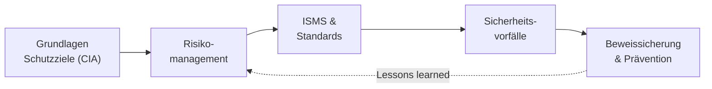

# IT-Sicherheit & Risiko

Ein integriertes System ist nur so viel wert, wie es **sicher und verfügbar** läuft. Sobald du Komponenten vernetzt, Daten austauschst und Anlagen aus der Ferne erreichbar machst, öffnest du auch Angriffsflächen. In diesem Block geht es darum, **Risiken systematisch zu erkennen, zu bewerten und zu beherrschen** – und im Ernstfall richtig zu reagieren.

!!! abstract "Was du in diesem Block lernst"
    - die drei **Schutzziele** Vertraulichkeit, Integrität, Verfügbarkeit (CIA) und warum in der Produktion oft die Verfügbarkeit zuerst kommt
    - wie ein **Risikomanagement-Prozess** abläuft: identifizieren, analysieren, bewerten, steuern, überwachen
    - was ein **ISMS** ist und wie **ISO 27001** und **BSI-Grundschutz** zusammenhängen
    - wie man **Sicherheitsvorfälle** erkennt, protokolliert und mit Sofortmaßnahmen eindämmt
    - was **beweissichere Dokumentation** bedeutet und wie man aus einem Vorfall **Prävention** macht

---

## Wie wichtig ist dieser Block?

Prüfungsrelevant &nbsp; Dieser Block gehört zum **prüfungsrelevanten Kern**. Sicherheit und Risiko ziehen sich durch fast jede Aufgabenstellung – von der Planung über den Betrieb bis zur Abnahme.

!!! note "Status: Platzhalter in Arbeit"
    Die Struktur dieses Blocks steht, die einzelnen Seiten werden Schritt für Schritt mit Inhalten gefüllt. Du siehst hier schon, **welche Themen kommen** und **wie sie zusammenhängen** – damit du den roten Faden kennst, bevor die Details folgen.

---

## Seiten in diesem Block

| Seite | Inhalt | Relevanz |
|-------|--------|----------|
| [Grundlagen & Schutzziele](grundlagen.md) | CIA-Schutzziele, Authentizität, typische Bedrohungen und Angriffswege | Prüfungsrelevant |
| [Risikomanagement](risikomanagement.md) | Der Risikoprozess, Risikomatrix, FMEA, qualitative und quantitative Bewertung | Prüfungsrelevant |
| [ISMS & Standards](isms.md) | Informationssicherheits-Managementsystem, ISO 27001, BSI-Grundschutz, Audits | Prüfungsrelevant |
| [Sicherheitsvorfälle](sicherheitsvorfaelle.md) | Erkennen, protokollieren, Sofortmaßnahmen, Meldepflichten, Wirksamkeit prüfen | Prüfungsrelevant |
| [Beweissicherung & Prävention](beweissicherung-und-praevention.md) | Revisionssichere Dokumentation, Archivierung, Präventionsmaßnahmen, Reviews | Vertiefung |

---

## Roter Faden

Wir bauen das Bild **von der Grundhaltung zur Reaktion**: erst verstehen, was wir schützen (Schutzziele), dann Risiken bewerten, daraus ein Managementsystem ableiten, im Ernstfall sauber reagieren – und aus jedem Vorfall wieder Prävention machen. Der Kreis schließt sich.

---

## Wie hängt das mit den anderen Blöcken zusammen?

- **[Netzwerk-Sicherheit](../netzwerke/netzwerk-sicherheit.md)** liefert die technische Grundlage (Firewall, IDS/IPS, Zero Trust). Hier geht es um die **organisatorische Klammer** darüber.
- **[Betrieb & Verfügbarkeit](../betrieb/index.md)** teilt sich das Thema Verfügbarkeit – Backup, Recovery und Notfall gehören eng zusammen mit Incident Response.
- **[Recht & Datenschutz](../recht-organisation/index.md)** baut direkt darauf auf: Datenschutz ist angewandte Informationssicherheit mit Gesetzescharakter.

---

## Voraussetzungen

- Keine harten Vorkenntnisse. Wer den [Netzwerk-Block](../netzwerke/index.md) kennt, versteht die Angriffswege schneller.
- Bereitschaft, in **Risiken und Worst-Case-Szenarien** zu denken, statt nur an den Normalbetrieb.

---

## Leitfrage

> **Ein Dienst fällt aus oder Daten liegen plötzlich offen – wie hätte ich das Risiko vorher erkennen, bewerten und mit Maßnahmen kleinhalten können?**

Wer diese Frage strukturiert beantwortet – statt in Aktionismus zu verfallen – denkt wie eine Fachkraft, die für Sicherheit verantwortlich ist.
