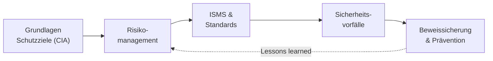

# IT-Sicherheit & Risiko

Ein integriertes System ist nur so viel wert, wie es **sicher und verfügbar** läuft. Sobald du Komponenten vernetzt, Daten austauschst und Anlagen aus der Ferne erreichbar machst, öffnest du auch Angriffsflächen. In diesem Block geht es darum, **Risiken systematisch zu erkennen, zu bewerten und zu beherrschen** – und im Ernstfall richtig zu reagieren.

!!! abstract "Was du in diesem Block lernst"
    - die drei **Schutzziele** Vertraulichkeit, Integrität, Verfügbarkeit (CIA) und warum in der Produktion oft die Verfügbarkeit zuerst kommt
    - wie ein **Risikomanagement-Prozess** abläuft: identifizieren, analysieren, bewerten, steuern, überwachen
    - was ein **ISMS** ist und wie **ISO 27001** und **BSI-Grundschutz** zusammenhängen
    - wie man **Sicherheitsvorfälle** erkennt, protokolliert und mit Sofortmaßnahmen eindämmt
    - was **beweissichere Dokumentation** bedeutet und wie man aus einem Vorfall **Prävention** macht

---

## Wie wichtig ist dieser Block?

Prüfungsrelevant &nbsp; Dieser Block gehört zum **prüfungsrelevanten Kern**. Sicherheit und Risiko ziehen sich durch fast jede Aufgabenstellung – von der Planung über den Betrieb bis zur Abnahme.

---

## Seiten in diesem Block

| Seite | Inhalt | Relevanz |
|-------|--------|----------|
| [Grundlagen & Schutzziele](grundlagen.md) | Vertraulichkeit, Integrität, Verfügbarkeit mit typischen Verletzungen, Verfügbarkeit zuerst in der Produktion, Safety gegen Security, Authentizität, Verbindlichkeit und Zurechenbarkeit, die Abgrenzung von Informationssicherheit, IT-Sicherheit und Datenschutz, Schutzbedarf, Angreifertypen und die Grundprinzipien | Prüfungsrelevant |
| [Risikomanagement](risikomanagement.md) | Der Kern in einer Doppelstunde: Begriffe und Risikosequenz, Erwartungswert, Fünf-Schritte-Prozess, Risikoregister, Risikomatrix, die vier Strategien, Schutzbedarf sowie RTO und RPO | Prüfungsrelevant |
| [Risikomanagement: Vertiefung](risikomanagement-vertiefung.md) | Risikoarten, Migrationsrisiken, Bedrohungsmodellierung, Bewertungsskalen, Schadenserwartungswert, FMEA, Priorisierung, Verfügbarkeit – plus eine komplett durchgerechnete Analyse | Vertiefung |
| [Übungen: Risikoanalyse](uebungen-risikoanalyse.md) | Fünfzehn Aufgaben zum Selbstdurchführen: zwölf zum Verfahren – von der Identifikation über Matrix, Erwartungswert und FMEA bis zur vollständigen Risikoanalyse einer Klinik – und drei im Prüfungsformat, jede mit Musterlösung | Aufgaben |
| [ISMS & Standards](isms.md) | Was ein ISMS ist, der PDCA-Zyklus, die Dokumentenhierarchie von der Leitlinie bis zur Arbeitsanweisung, ISO/IEC 27001 mit Anhang A und Zertifizierung, BSI-Grundschutz mit den Standards 200-1 bis 200-4, Richtlinien formulieren, Audits, Kennzahlen, Umgang mit Verstößen sowie Awareness | Prüfungsrelevant |
| [Übung: Sicherheitsrichtlinie](uebung-sicherheitsrichtlinie.md) | Gruppenübung für 3–5 Personen: für einen Gebäudetechnikbetrieb eine Richtlinie entwerfen – Schutzbedarf begründen, prüfbare Regeln formulieren, Sicherheit gegen Praktikabilität abwägen, Einhaltung überprüfen. Mit Hilfekarten, Bewertungsraster und zwei Musterlösungen | Gruppenarbeit |
| [Sicherheitsvorfälle](sicherheitsvorfaelle.md) | Ereignis, Störung und Vorfall abgrenzen, Erkennung über Monitoring, Anwendermeldungen, Angriffserkennung und Protokolldaten, signaturbasiert gegen verhaltensbasiert, Sicherheitsinformations- und Ereignismanagement, Ersteinschätzung und Auswirkungsanalyse, Schwachstellenbewertung mit CVE und CVSS, technische und organisatorische Sofortmaßnahmen, Wirksamkeitsprüfung, Vorfallprotokoll und Meldepflichten | Prüfungsrelevant |
| [Beweissicherung & Prävention](beweissicherung-und-praevention.md) | Grundsätze der Beweissicherung, Reihenfolge der Flüchtigkeit, Prüfsummen und forensische Kopien, Protokolldaten manipulationsgeschützt sichern, Zeitsynchronisation, revisionssichere Archivierung und Aufbewahrungsfristen, Grenzen der eigenen Möglichkeiten, Nachbereitung und Ursachenanalyse, vorbeugende, erkennende und begrenzende Maßnahmen, Reviews und Sensibilisierung | Vertiefung |
| [Übung: Vorfallbearbeitung](uebung-vorfallbearbeitung.md) | Gruppenübung zu einem Verschlüsselungstrojaner in einem mittelständischen Betrieb: einordnen und bewerten, Sofortmaßnahmen aus Maßnahmenkarten ordnen, Eindämmung gegen Beweissicherung abwägen, Vorfallprotokoll führen, Meldepflichten prüfen, Prävention ableiten – mit Hilfekarten und ausführlicher Musterlösung | Aufgaben |

---

## Roter Faden

Wir bauen das Bild **von der Grundhaltung zur Reaktion**: erst verstehen, was wir schützen (Schutzziele), dann Risiken bewerten, daraus ein Managementsystem ableiten, im Ernstfall sauber reagieren – und aus jedem Vorfall wieder Prävention machen. Der Kreis schließt sich.

---

## Wie hängt das mit den anderen Blöcken zusammen?

- **[Netzwerk-Sicherheit](../netzwerke/netzwerk-sicherheit.md)** liefert die technische Grundlage (Firewall, IDS/IPS, Zero Trust). Hier geht es um die **organisatorische Klammer** darüber.
- **[Betrieb & Verfügbarkeit](../betrieb/index.md)** teilt sich das Thema Verfügbarkeit – Backup, Recovery und Notfall gehören eng zusammen mit Incident Response.
- **[Recht & Datenschutz](../recht-organisation/index.md)** baut direkt darauf auf: Datenschutz ist angewandte Informationssicherheit mit Gesetzescharakter.

---

## Voraussetzungen

- Keine harten Vorkenntnisse. Wer den [Netzwerk-Block](../netzwerke/index.md) kennt, versteht die Angriffswege schneller.
- Bereitschaft, in **Risiken und Worst-Case-Szenarien** zu denken, statt nur an den Normalbetrieb.

---

## Leitfrage

> **Ein Dienst fällt aus oder Daten liegen plötzlich offen – wie hätte ich das Risiko vorher erkennen, bewerten und mit Maßnahmen kleinhalten können?**

Wer diese Frage strukturiert beantwortet – statt in Aktionismus zu verfallen – denkt wie eine Fachkraft, die für Sicherheit verantwortlich ist.
