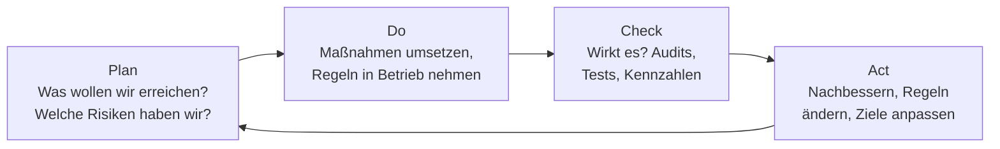

# ISMS & Standards

Prüfungsrelevant &nbsp; Sicherheit ist kein einmaliges Projekt, sondern ein **Dauerbetrieb mit System**. Ein ISMS ist der organisatorische Rahmen, der dafür sorgt, dass Sicherheit nicht von einzelnen Helden abhängt.

In fast jedem Betrieb gibt es eine Person, bei der Sicherheit „irgendwie mitläuft“. Sie merkt sich, welcher Server noch auf einer alten Version steht, sie erinnert an das ablaufende Zertifikat, sie fragt beim Praktikanten nach, ob der Zugang wieder gesperrt wurde. Solange diese Person da ist, funktioniert es erstaunlich gut. Und an dem Tag, an dem sie den Betrieb wechselt, in Elternzeit geht oder einfach überlastet ist, stellt sich heraus, dass Sicherheit nirgends aufgeschrieben war – sie war ein Personenmerkmal, kein Betriebsmerkmal. Ein **Informationssicherheits-Managementsystem** ist genau der Versuch, das umzudrehen: Aus Gewohnheiten werden Regeln, aus Regeln Zuständigkeiten, aus Zuständigkeiten Nachweise. Das Ergebnis ist unspektakulär und wirksam – ein Betrieb, dessen Sicherheitsniveau nicht davon abhängt, wer gerade da ist.

!!! abstract "Was du auf dieser Seite lernst"
    - was ein **ISMS** ist, woraus es besteht – und warum Sicherheit ein **Prozess** und kein Projekt ist
    - wie der **PDCA-Zyklus** ein ISMS antreibt und an welcher Stelle er in der Praxis fast immer stehenbleibt
    - die **Dokumentenhierarchie**: Leitlinie, Richtlinien, Konzepte, Arbeitsanweisungen – und was jeweils hineingehört
    - **ISO/IEC 27001** im Überblick: Aufbau, Anhang A, Erklärung zur Anwendbarkeit, Zertifizierung – und was ein Zertifikat wirklich aussagt
    - den **BSI-IT-Grundschutz**: Standards 200-1 bis 200-4, Bausteine, Schichtenmodell, Basis-, Kern- und Standard-Absicherung
    - wie man **Sicherheitsrichtlinien** formuliert, die Einhaltung **überwacht** und mit **Verstößen** umgeht
    - warum **Awareness** einmal im Jahr nicht reicht und wie man ihre **Wirksamkeit** misst

---

## Warum Sicherheit ein Prozess ist und kein Projekt

Das häufigste Muster in der Praxis sieht so aus: Ein Anlass entsteht – ein Vorfall, eine Kundenanforderung, eine Ausschreibung –, jemand schreibt ein Sicherheitskonzept, es wird verabschiedet, abgeheftet und ist damit erledigt. Zwei Jahre später zieht die Hälfte der Dienste in die Cloud, es kommt ein zweiter Standort dazu, drei Schlüsselpersonen sind gewechselt, und das Konzept beschreibt eine Infrastruktur, die es so nicht mehr gibt. Nicht, weil jemand geschlampt hätte, sondern weil die Voraussetzungen sich ununterbrochen ändern.

Genau hier liegt der Unterschied zwischen einem Projekt und einem System. Ein **Projekt** hat einen Anfang, ein Ende und ein Ergebnis. Ein **Managementsystem** hat kein Ende – es hat einen Takt.

!!! tip "Die Analogie: Ein Fuhrpark wird nicht einmal repariert"
    Niemand käme auf die Idee, die Fahrzeuge eines Betriebs einmal gründlich zu warten und das Thema damit abzuhaken. Es gibt ein Wartungsintervall, eine Hauptuntersuchung, eine Person, die den Überblick hat, ein Fahrtenbuch als Nachweis und eine Regel, was zu tun ist, wenn etwas kaputtgeht. Kein Mensch nennt das „Fuhrpark-Projekt“ – es ist einfach die Art, wie man einen Fuhrpark betreibt.

    Ein ISMS ist dasselbe für Informationen: ein Intervall, eine Zuständigkeit, ein Nachweis und ein Verfahren für den Ausnahmefall. Der einzige Unterschied ist, dass ein liegengebliebenes Auto am Straßenrand steht und ein liegengebliebenes Sicherheitsniveau unsichtbar bleibt, bis etwas passiert.

Ein **ISMS** ist damit kein Dokument und erst recht kein Produkt, das man kauft. Es ist die Gesamtheit aus:

| Bestandteil | Was damit gemeint ist |
|---|---|
| **Geltungsbereich** | Für welchen Teil des Betriebs gilt das System? Welche Standorte, Prozesse, Systeme, Dienstleister sind drin – und was ausdrücklich nicht? |
| **Verantwortung der Leitung** | Die Geschäftsführung setzt die Ziele, stellt Mittel bereit und trägt die Verantwortung. Ohne diesen Punkt ist alles Weitere Freizeitbeschäftigung. |
| **Rollen und Zuständigkeiten** | Wer entscheidet, wer setzt um, wer prüft – benannte Personen, keine Abteilungen. |
| **Werte und Schutzbedarf** | Was ist überhaupt schützenswert, und wie viel Schutz braucht es? Siehe [Grundlagen & Schutzziele](grundlagen.md). |
| **Risikoverfahren** | Ein festgelegtes, wiederholbares Vorgehen zum Erkennen, Bewerten und Steuern von Risiken – siehe [Risikomanagement](risikomanagement.md). |
| **Regelwerk** | Leitlinie, Richtlinien, Konzepte, Arbeitsanweisungen – die Dokumentenhierarchie weiter unten. |
| **Maßnahmen** | Was tatsächlich umgesetzt ist: technisch, organisatorisch, personell, baulich. |
| **Nachweise** | Aufzeichnungen, die belegen, dass es wirklich so gemacht wird – Protokolle, Listen, Prüfergebnisse. |
| **Verbesserung** | Ein Verfahren, mit dem Feststellungen, Vorfälle und Messergebnisse zu Änderungen führen. |

!!! warning "Ein ISMS kann man nicht kaufen"
    Es gibt viele Werkzeuge, die bei einem ISMS helfen – Software für Risikoregister, Maßnahmenverfolgung, Dokumentenlenkung und Nachweisführung. Sie sparen Arbeit, sobald das System läuft. Sie **sind** aber nicht das System. Wer die Software einführt, ohne den Geltungsbereich, die Rollen und den Takt festzulegen, hat eine sehr ordentlich gepflegte Sammlung leerer Felder.

    Dieselbe Verwechslung passiert mit einem Zertifikat: Das Zertifikat ist der Nachweis über ein funktionierendes System, nicht das System selbst.

### Die Rollen

| Rolle | Aufgabe | Wichtig |
|---|---|---|
| **Leitung / Geschäftsführung** | setzt die Leitlinie in Kraft, gibt Ziele und Mittel vor, trägt die Gesamtverantwortung | kann nicht delegiert werden |
| **Informationssicherheitsbeauftragte:r (ISB)** | steuert das ISMS, berät, koordiniert, berichtet an die Leitung | braucht direkten Zugang zur Leitung und Unabhängigkeit vom IT-Betrieb |
| **IT-Betrieb** | setzt technische Maßnahmen um und betreibt sie | setzt um, prüft sich aber nicht selbst |
| **Fachverantwortliche** | kennen den Wert der Informationen und den tragbaren Ausfall ihres Prozesses | liefern den Schutzbedarf – nicht die IT |
| **Datenschutzbeauftragte:r** | prüft die Zulässigkeit der Verarbeitung personenbezogener Daten | eigene Rolle mit eigenem Maßstab, siehe [Grundlagen](grundlagen.md#informationssicherheit-it-sicherheit-und-datenschutz-sauber-trennen) |
| **Interne Revision / Auditoren** | prüfen, ob das System wirkt | müssen unabhängig von dem sein, was sie prüfen |
| **Alle Beschäftigten** | halten die Regeln ein und melden Auffälligkeiten | die größte und wirksamste Gruppe |

Der wichtigste Satz zu dieser Tabelle betrifft die Rolle des ISB: **Wer umsetzt, darf nicht derselbe sein, der die Umsetzung bewertet.** In kleinen Betrieben lässt sich das nicht immer vollständig trennen – dann muss die Bewertung wenigstens von außen kommen, etwa durch einen externen Auditor oder einen Kollegen aus einem anderen Bereich.

---

## Der PDCA-Zyklus als Motor

Das Muster, mit dem ein Managementsystem in Bewegung bleibt, heißt **PDCA** – *Plan, Do, Check, Act*. Es ist derselbe Zyklus, der hinter Qualitätsmanagement, Umweltmanagement und Arbeitsschutz steckt, und man kann ihn in einem Satz zusammenfassen: **aufschreiben, was man tut – tun, was man aufgeschrieben hat – prüfen, ob es wirkt – verbessern.**

| Phase | Leitfrage | Typische Aktivitäten | Ergebnis |
|---|---|---|---|
| **Plan** | Was wollen wir schützen, wogegen, wie gut? | Geltungsbereich festlegen, Werte erfassen, Schutzbedarf feststellen, Risiken bewerten, Ziele und Maßnahmen festlegen, Regelwerk schreiben | Leitlinie, Risikoregister, Maßnahmenplan mit Terminen und Verantwortlichen |
| **Do** | Setzen wir es tatsächlich um? | Technik konfigurieren, Prozesse einführen, schulen, Zuständigkeiten übergeben, Aufzeichnungen anlegen | umgesetzte Maßnahmen und Nachweise darüber |
| **Check** | Wirkt es – und halten sich alle daran? | interne Audits, Sicherheitstests, technische Überwachung, Kennzahlen auswerten, Vorfälle auswerten, Managementbewertung | Feststellungen, Abweichungen, Messergebnisse |
| **Act** | Was ändern wir daraufhin? | Maßnahmen korrigieren, Regeln anpassen, Ziele nachschärfen, Ursachen beseitigen statt Symptome | geänderte Dokumente, neue Maßnahmen – Eingang in die nächste Plan-Phase |

### Ein Durchlauf am Beispiel

Nehmen wir ein Thema, das jeder Betrieb hat: das Einspielen von Sicherheitsupdates.

- **Plan.** Der Betrieb stellt fest, dass Serversysteme im Mittel mehrere Monate hinterherhinken. Er legt ein Ziel fest: kritische Sicherheitsupdates auf Servern innerhalb von 14 Tagen, auf Arbeitsplatzrechnern innerhalb von 7 Tagen. Er schreibt eine Richtlinie zum Patchmanagement, benennt Verantwortliche und legt ein Wartungsfenster fest.
- **Do.** Die Aktualisierung wird für Arbeitsplatzrechner automatisiert, für Server wird eine feste Reihenfolge mit Testsystem und Rückfallpunkt eingeführt. Die Beteiligten werden eingewiesen. Jeder Durchlauf wird protokolliert.
- **Check.** Nach zwei Quartalen zeigt die Auswertung: Arbeitsplatzrechner liegen bei durchschnittlich 5 Tagen – Ziel erreicht. Server liegen bei 26 Tagen, und die Verzögerung tritt immer bei denselben vier Systemen auf. Ein internes Audit findet den Grund: Für diese vier Systeme gibt es keine Freigabe des Anwendungsherstellers.
- **Act.** Das Ziel bleibt, aber die Regel wird realistischer: Für Systeme mit Herstellerabhängigkeit gilt eine eigene Frist und eine Pflicht zu kompensierenden Maßnahmen – Netztrennung und engere Überwachung, solange der Patch aussteht. Die Richtlinie wird geändert, die Ausnahme dokumentiert und mit einer Wiedervorlage versehen.

Beachte, was im **Act**-Schritt passiert ist: Nicht die Menschen wurden korrigiert, sondern die Regel. Das ist der Normalfall. Eine Regel, an die sich vier von vierzig Systemen nicht halten können, ist meistens keine Disziplinfrage.

!!! warning "Wo der Zyklus in der Praxis abbricht"
    Fast immer beim **Check**. Planen macht Freude, Umsetzen ist sichtbar – aber nachzumessen, ob etwas wirkt, ist unbequem, kostet Zeit und liefert manchmal Ergebnisse, die niemand hören will. Bricht der Zyklus dort ab, entsteht ein charakteristisches Muster: ein Regelwerk, das aussieht wie ein ISMS, ohne jede Aussage darüber, ob es der Wirklichkeit entspricht.

    Das Erkennungsmerkmal ist einfach. Frag nach der letzten Änderung, die **aufgrund einer Messung** vorgenommen wurde. Wo darauf keine Antwort kommt, läuft nur PD, nicht PDCA.

---

## Die Dokumentenhierarchie

Ein ISMS erzeugt Papier – und der häufigste Fehler dabei ist, alles in ein Dokument zu schreiben. Das Ergebnis ist ein achtzigseitiges Werk, das niemand liest, das bei jeder Änderung neu freigegeben werden muss und in dem der Grundsatz „Informationen werden nach Schutzbedarf behandelt“ neben der Anleitung steht, in welchem Menü man die Verschlüsselung aktiviert.

Die Lösung ist eine Hierarchie mit vier Ebenen. Von oben nach unten werden die Dokumente **konkreter, umfangreicher, kurzlebiger** – und ihre Freigabe wandert von der Geschäftsführung zur Fachebene.

<figure>
<svg viewBox="0 0 720 380" width="100%" height="380" role="img" aria-label="Eine Pyramide aus vier Ebenen. Ganz oben und am schmalsten steht die Leitlinie: Wozu und wer, von der Leitung unterschrieben, ein bis zwei Seiten. Darunter die Richtlinien: was gilt, für wen, verbindlich, je Thema wenige Seiten. Darunter die Konzepte: wie es fachlich gelöst wird, mit Technik, Architektur und Verfahren. Ganz unten und am breitesten die Arbeitsanweisungen: Schritt für Schritt für eine einzelne Tätigkeit. Ein Pfeil an der linken Seite zeigt nach unten und trägt die Beschriftung, dass die Dokumente nach unten hin konkreter werden und häufiger geändert werden. Unter der Pyramide steht, dass darunter noch die Aufzeichnungen liegen: Protokolle, Listen und Nachweise, die belegen, dass es wirklich so gemacht wird.">
  <polygon points="255,50 345,50 375,110 225,110" fill="rgba(125,255,154,0.16)" stroke="#7dff9a" stroke-width="2"/>
  <polygon points="225,110 375,110 405,180 195,180" fill="rgba(122,162,255,0.14)" stroke="#7aa2ff" stroke-width="2"/>
  <polygon points="195,180 405,180 435,250 165,250" fill="rgba(224,179,92,0.14)" stroke="#e0b35c" stroke-width="2"/>
  <polygon points="165,250 435,250 465,320 135,320" fill="rgba(143,164,152,0.16)" stroke="#8fa498" stroke-width="2"/>
  <text x="300" y="88" text-anchor="middle" fill="#7dff9a" font-family="system-ui, sans-serif" font-size="16" font-weight="700">Leitlinie</text>
  <text x="300" y="152" text-anchor="middle" fill="#7aa2ff" font-family="system-ui, sans-serif" font-size="16" font-weight="700">Richtlinien</text>
  <text x="300" y="222" text-anchor="middle" fill="#e0b35c" font-family="system-ui, sans-serif" font-size="16" font-weight="700">Konzepte</text>
  <text x="300" y="292" text-anchor="middle" fill="#e2ece6" font-family="system-ui, sans-serif" font-size="16" font-weight="700">Arbeitsanweisungen</text>
  <text x="492" y="80" fill="#e2ece6" font-family="system-ui, sans-serif" font-size="12">Wozu und wer – von der Leitung</text>
  <text x="492" y="98" fill="#8fa498" font-family="system-ui, sans-serif" font-size="12">unterschrieben, ein bis zwei Seiten</text>
  <text x="492" y="146" fill="#e2ece6" font-family="system-ui, sans-serif" font-size="12">Was gilt, für wen, verbindlich –</text>
  <text x="492" y="164" fill="#8fa498" font-family="system-ui, sans-serif" font-size="12">je Thema wenige Seiten</text>
  <text x="492" y="216" fill="#e2ece6" font-family="system-ui, sans-serif" font-size="12">Wie es fachlich gelöst wird –</text>
  <text x="492" y="234" fill="#8fa498" font-family="system-ui, sans-serif" font-size="12">Technik, Architektur, Verfahren</text>
  <text x="492" y="286" fill="#e2ece6" font-family="system-ui, sans-serif" font-size="12">Schritt für Schritt, eine Tätigkeit</text>
  <text x="492" y="304" fill="#8fa498" font-family="system-ui, sans-serif" font-size="12">wer tut was, in welcher Reihenfolge</text>
  <line x1="105" y1="58" x2="105" y2="308" stroke="#8fa498" stroke-width="2"/>
  <polygon points="105,322 98,306 112,306" fill="#8fa498"/>
  <text transform="rotate(-90 76 188)" x="76" y="188" text-anchor="middle" fill="#8fa498" font-family="system-ui, sans-serif" font-size="11">konkreter, umfangreicher, häufiger geändert</text>
  <text x="60" y="352" fill="#8fa498" font-family="system-ui, sans-serif" font-size="12">Darunter: die Aufzeichnungen – Protokolle, Listen, Prüfergebnisse als Nachweis, dass es so gemacht wird.</text>
</svg>
<figcaption>Vier Ebenen mit klarer Arbeitsteilung. Je weiter oben ein Satz steht, desto länger überlebt er einen Technikwechsel – und desto weniger sagt er darüber, wie man ihn umsetzt.</figcaption>
</figure>

| Ebene | Beantwortet | Wer gibt frei | Umfang | Beispielinhalt |
|---|---|---|---|---|
| **Leitlinie** (Sicherheitsleitlinie, *Policy*) | **Warum** und **wer** – Bekenntnis, Ziele, Geltungsbereich, Rollen, Verbindlichkeit | Geschäftsführung, mit Unterschrift | 1–2 Seiten | „Informationssicherheit ist Aufgabe der Leitung. Alle Informationen werden nach ihrem Schutzbedarf behandelt. Die Leitlinie gilt für alle Beschäftigten und alle Dienstleister mit Zugriff.“ |
| **Richtlinie** (*Guideline*, Sicherheitsrichtlinie) | **Was** gilt, **für wen**, ab wann – verbindliche Regeln zu einem Thema | ISB und Leitung, oft mit Beteiligung des Betriebsrats | 2–6 Seiten je Thema | „Dienstliche Notebooks sind vollständig zu verschlüsseln. Der Verlust eines Geräts ist unverzüglich der Servicestelle zu melden.“ |
| **Konzept** | **Wie** es fachlich gelöst wird – Architektur, Verfahren, Auswahlentscheidung | Fachverantwortung, abgestimmt mit dem ISB | 5–30 Seiten | Berechtigungskonzept, Datensicherungskonzept, Netzkonzept, Kryptokonzept, Notfallkonzept |
| **Arbeitsanweisung** (auch *Verfahrensanweisung*, *Handbuch*) | **Wie genau** eine einzelne Tätigkeit abläuft – Schritt für Schritt | Fachverantwortung | 1–5 Seiten je Tätigkeit | „Neues Notebook einrichten“, „Konto beim Austritt sperren“, „Sicherung zurückspielen“ |
| *(Aufzeichnungen)* | **Dass** es gemacht wurde – Nachweis | – | fortlaufend | Geräteliste, Übergabeprotokoll, Schulungsnachweis, Prüfbericht, Ticket |

### Eine Kette durch alle Ebenen

An einem Beispiel wird das Prinzip sofort klar. Thema: mobile Geräte.

1. **Leitlinie:** „Informationen des Betriebs werden auch außerhalb der Betriebsstätten so geschützt, dass ihr Schutzbedarf gewahrt bleibt.“
2. **Richtlinie „Mobile Geräte und Heimarbeit“:** „Dienstliche mobile Geräte sind vollständig verschlüsselt zu betreiben, nach spätestens fünf Minuten automatisch zu sperren und in das zentrale Geräteverwaltungssystem einzubinden. Betriebliche Daten dürfen nicht auf privaten Geräten gespeichert werden.“
3. **Konzept „Verwaltung mobiler Endgeräte“:** Welche Geräteklassen es gibt, welches Verwaltungssystem eingesetzt wird, wie die Trennung von dienstlichen und privaten Daten technisch umgesetzt ist, wie Fernlöschung funktioniert und was sie tut.
4. **Arbeitsanweisung „Notebook ausgeben“:** Gerät aus dem Bestand entnehmen, Registrierung im Verwaltungssystem, Verschlüsselung prüfen, Wiederherstellungsschlüssel hinterlegen, Übergabeprotokoll unterschreiben lassen, Eintrag in die Geräteliste.
5. **Aufzeichnung:** die ausgefüllte Geräteliste und das unterschriebene Übergabeprotokoll.

!!! tip "Die Prüffrage: auf welche Ebene gehört dieser Satz?"
    Stell dir vor, der Betrieb wechselt den Hersteller des Verwaltungssystems.

    - Ändert sich der Satz **nicht**, gehört er in die Leitlinie oder in die Richtlinie.
    - Ändert er sich, gehört er in ein Konzept oder eine Arbeitsanweisung.

    Genau deshalb steht in einer Richtlinie „Geräte sind in das zentrale Verwaltungssystem einzubinden“ und nicht der Produktname. Wer Produktnamen in Richtlinien schreibt, muss bei jedem Werkzeugwechsel die Geschäftsführung um eine neue Unterschrift bitten.

Zur Dokumentenhierarchie gehört immer auch eine **Dokumentenlenkung**: Jedes Dokument braucht einen Verantwortlichen, eine Versionsnummer, ein Datum des Inkrafttretens, einen Überprüfungsrhythmus und einen Ablageort, an dem alle die **gültige** Fassung finden. Drei Versionen derselben Richtlinie in drei Ordnern sind schlimmer als gar keine Richtlinie, weil sich jeder auf die berufen kann, die ihm passt.

---

## ISO/IEC 27001 im Überblick

**ISO/IEC 27001** ist die international maßgebliche Norm für Informationssicherheits-Managementsysteme – und die einzige der Familie, gegen die man sich **zertifizieren** lassen kann. Sie beschreibt **Anforderungen an das System**, nicht an die Technik: Sie schreibt nicht vor, welche Firewall zu kaufen ist, sondern verlangt, dass Risiken erkannt, bewertet und begründet behandelt werden und dass das nachweisbar ist.

### Der Aufbau

Der verbindliche Teil sind die Kapitel 4 bis 10. Sie folgen dem Aufbau, den alle neueren Managementsystem-Normen teilen – deshalb lässt sich ein ISMS ohne Bruch neben ein Qualitätsmanagement nach ISO 9001 stellen.

| Kapitel | Inhalt | PDCA |
|---|---|---|
| **4 Kontext der Organisation** | Wer sind wir, welche interessierten Parteien gibt es, was ist der Geltungsbereich? | Plan |
| **5 Führung** | Verpflichtung der Leitung, Leitlinie, Rollen und Verantwortlichkeiten | Plan |
| **6 Planung** | Risiken und Chancen, Risikobeurteilung und -behandlung, Sicherheitsziele | Plan |
| **7 Unterstützung** | Ressourcen, Kompetenz, Bewusstsein, Kommunikation, dokumentierte Information | Plan |
| **8 Betrieb** | Durchführung der geplanten Prozesse, Risikobeurteilung und -behandlung im Betrieb | Do |
| **9 Bewertung der Leistung** | Überwachung und Messung, internes Audit, Managementbewertung | Check |
| **10 Verbesserung** | Nichtkonformitäten und Korrekturmaßnahmen, fortlaufende Verbesserung | Act |

Die aktuelle Fassung nennt PDCA nicht mehr ausdrücklich beim Namen, ihre Kapitelfolge bildet ihn aber unverändert ab. Wer die vier Buchstaben im Kopf hat, findet sich in der Norm sofort zurecht.

### Anhang A: der Maßnahmenkatalog

An die Kapitel schließt sich **Anhang A** an – eine Liste von Maßnahmen (*Controls*), gegen die man das eigene Vorgehen abgleicht. In der aktuellen Fassung enthält er **93 Maßnahmen in vier Themenbereichen**:

| Themenbereich | Anzahl | Beispiele |
|---|---|---|
| **Organisatorisch** | 37 | Richtlinien, Rollen, Umgang mit Werten, Lieferantenbeziehungen, Umgang mit Vorfällen |
| **Personenbezogen** | 8 | Überprüfung vor der Einstellung, Sensibilisierung und Schulung, Regelungen bei Austritt, Heimarbeit |
| **Physisch** | 14 | Sicherheitszonen, Zutrittskontrolle, Schutz vor Umwelteinflüssen, sicheres Entsorgen von Datenträgern |
| **Technologisch** | 34 | Zugriffsrechte, Kryptografie, Protokollierung, Netztrennung, Schutz vor Schadsoftware, sichere Entwicklung |

Ältere Fassungen der Norm hatten 114 Maßnahmen in 14 Abschnitten; man begegnet dieser Zählung in Bestandsunterlagen noch häufig.

!!! note "Der Anhang ist eine Prüfliste, keine Einkaufsliste"
    Anhang A ist **nicht** die Vorgabe, alle 93 Maßnahmen umzusetzen. Er ist eine Vollständigkeitsprüfung: Für jede Maßnahme muss der Betrieb sagen, ob sie anwendbar ist, und wenn nicht, warum nicht. Das Ergebnis heißt **Erklärung zur Anwendbarkeit** (englisch *Statement of Applicability*, SoA) und ist eines der wichtigsten Dokumente eines zertifizierten ISMS.

    Die SoA verhindert genau zwei Fehler: das stillschweigende Übersehen einer relevanten Maßnahme – und das blinde Einführen von Maßnahmen, die zum Betrieb nicht passen. Ein Betrieb ohne eigene Softwareentwicklung darf die Maßnahmen zur sicheren Entwicklung ausschließen. Er muss es nur **begründen**.

### Zertifizierung – und was sie aussagt

Zertifiziert wird von einer akkreditierten Zertifizierungsstelle, nicht vom Normungsgremium. Der übliche Ablauf:

- **Stufe 1** – Prüfung der Dokumentation und der Bereitschaft: Gibt es Geltungsbereich, Leitlinie, Risikoverfahren, SoA, interne Audits und eine Managementbewertung?
- **Stufe 2** – Prüfung vor Ort: Wird tatsächlich so gearbeitet? Stichproben, Interviews, Einsicht in Aufzeichnungen.
- **Zertifikat** mit einer typischen Laufzeit von drei Jahren, dazwischen **jährliche Überwachungsaudits**, am Ende ein **Rezertifizierungsaudit**.

!!! warning "Was ein Zertifikat aussagt – und was nicht"
    **Es sagt aus:** Der Betrieb hat für einen genau benannten Geltungsbereich ein Managementsystem, das die Anforderungen der Norm erfüllt – Risiken werden systematisch behandelt, es gibt Regeln, Nachweise, Audits und ein Verfahren zur Verbesserung. Das ist deutlich mehr, als die meisten nicht zertifizierten Betriebe vorweisen können.

    **Es sagt nicht aus:** dass der Betrieb sicher ist, dass er nicht angegriffen werden kann oder dass ein bestimmtes technisches Schutzniveau erreicht ist. Ein Zertifikat ist eine Aussage über das **Verfahren**, nicht über das Ergebnis.

    Der praktisch wichtigste Punkt beim Lesen eines fremden Zertifikats ist deshalb der **Geltungsbereich**. Steht dort nur „Rechenzentrumsbetrieb am Standort X“, sagt das Zertifikat über die Entwicklungsabteilung und den zweiten Standort nichts. Wer ein Zertifikat als Nachweis von einem Dienstleister verlangt, muss den Geltungsbereich lesen – sonst kauft er ein Stück Papier über einen Teil des Betriebs, mit dem er gar nicht zusammenarbeitet.

### Die Normenfamilie

| Norm | Wofür sie gut ist |
|---|---|
| **ISO/IEC 27000** | Begriffe und Überblick über die Familie – frei verfügbar |
| **ISO/IEC 27001** | Anforderungen an das ISMS – die zertifizierbare Norm |
| **ISO/IEC 27002** | Leitfaden zu den Maßnahmen aus Anhang A: Erläuterungen und Umsetzungshinweise |
| **ISO/IEC 27005** | Leitfaden für das Informationssicherheits-Risikomanagement |
| **ISO/IEC 27017 / 27018** | Maßnahmen für Cloud-Dienste bzw. für personenbezogene Daten in der Cloud |
| **ISO/IEC 27019** | Maßnahmen für Prozesssteuerungssysteme der Energieversorgung |
| **ISO/IEC 27701** | Erweiterung des ISMS um ein Datenschutz-Managementsystem |
| **ISO 22301** | Business Continuity Management – der Notfall- und Fortführungsteil |

In der Automobilbranche begegnet man zusätzlich **TISAX**, einem Prüf- und Austauschverfahren auf Basis eines eigenen Fragenkatalogs der Branche. Es ist keine ISO-Norm, orientiert sich aber inhaltlich stark an 27001 und wird von vielen Herstellern von ihren Zulieferern verlangt.

---

## BSI-IT-Grundschutz

Der **IT-Grundschutz** des Bundesamts für Sicherheit in der Informationstechnik verfolgt dasselbe Ziel wie ISO 27001, geht aber einen anderen Weg. Wo die Norm sagt „behandle deine Risiken systematisch“ und dir überlässt, wie, sagt der Grundschutz: „Für typische Situationen wissen wir schon, welche Gefährdungen auftreten und was dagegen hilft – nimm den fertigen Baustein.“

!!! tip "Die Analogie: Norm ist das Baurecht, Grundschutz ist der Katalog"
    Das Baurecht schreibt vor, dass ein Gebäude standsicher sein muss, und überlässt den Nachweis dem Statiker. Ein Bauteilkatalog geht weiter: Für eine Wand dieser Höhe mit dieser Last nimm diesen Aufbau – nachgerechnet, erprobt, dokumentiert.

    ISO 27001 ist das Baurecht, der IT-Grundschutz ist der Katalog. Deshalb schließen sie sich nicht aus: Der Katalog ist ein Weg, die Anforderung des Baurechts zu erfüllen.

### Die Standards 200-1 bis 200-4

| Standard | Titel | Inhalt |
|---|---|---|
| **BSI 200-1** | Managementsysteme für Informationssicherheit | Was ein ISMS ist und leisten muss – die allgemeinen Anforderungen, bewusst kompatibel zu ISO 27001 gehalten |
| **BSI 200-2** | IT-Grundschutz-Methodik | Das Vorgehen: Strukturanalyse, Schutzbedarfsfeststellung, Modellierung, Grundschutz-Check, Umsetzung – und die drei Vorgehensweisen |
| **BSI 200-3** | Risikoanalyse auf der Basis von IT-Grundschutz | Wie man dort weiterarbeitet, wo die Standardanforderungen nicht ausreichen – bei hohem und sehr hohem Schutzbedarf oder fehlendem Baustein |
| **BSI 200-4** | Business Continuity Management | Aufbau eines Notfall- und Fortführungsmanagements, gestuft nach Reifegrad |

### Drei Vorgehensweisen

Die Methodik erlaubt drei Einstiege – das ist einer der praktischsten Punkte am Grundschutz, weil er den Einstieg für kleinere Betriebe überhaupt erst möglich macht.

| Vorgehensweise | Was sie leistet | Wann sie passt |
|---|---|---|
| **Basis-Absicherung** | Nur die **Basis-Anforderungen** aller relevanten Bausteine – ein breiter Grundschutz in kurzer Zeit | Einstieg, kleinere Betriebe, wenn erst einmal eine Fläche abgedeckt werden soll |
| **Kern-Absicherung** | Volle Absicherung für die **wenigen wirklich kritischen Werte** („Kronjuwelen“) | wenn ein Betrieb sehr schützenswerte Einzelbereiche hat – Konstruktionsdaten, Rezepturen, Patientendaten |
| **Standard-Absicherung** | Der vollständige Weg über den gesamten Informationsverbund: Basis- **und** Standard-Anforderungen, plus Risikoanalyse bei erhöhtem Schutzbedarf | wenn ein durchgängiges, prüfbares Niveau erreicht werden soll – Voraussetzung für eine Zertifizierung |

Basis- und Kern-Absicherung sind ausdrücklich als **Zwischenschritte** gedacht: schnell zu einem spürbaren Niveau kommen und später auf die Standard-Absicherung ausbauen. Der Unterschied zwischen Kern- und Standard-Absicherung ist dabei nicht die Tiefe, sondern die **Breite**: Die Kern-Absicherung schützt wenige Werte vollständig, die Standard-Absicherung den gesamten Verbund.

### Bausteine und das Schichtenmodell

Der eigentliche Inhalt steckt im **IT-Grundschutz-Kompendium**: einer Sammlung von **Bausteinen**, die jeweils ein Thema behandeln. Jeder Baustein hat denselben Aufbau – eine Beschreibung, die typische **Gefährdungslage** und dann die **Anforderungen**, gestuft in:

- **Basis-Anforderungen** – MUSS, in jedem Fall umzusetzen
- **Standard-Anforderungen** – SOLLTE, umzusetzen, sofern nicht begründet abgewichen wird
- **Anforderungen bei erhöhtem Schutzbedarf** – Vorschläge für hohen und sehr hohen Schutzbedarf

Die Bausteine sind in zehn Schichten geordnet. Die ersten fünf betreffen **Prozesse**, die letzten fünf **Systeme**:

| Kürzel | Schicht | Beispiele für Bausteine |
|---|---|---|
| **ISMS** | Sicherheitsmanagement | Aufbau und Betrieb des Managementsystems |
| **ORP** | Organisation und Personal | Organisation, Personal, Sensibilisierung und Schulung, Identitäts- und Berechtigungsmanagement |
| **CON** | Konzepte und Vorgehensweisen | Kryptokonzept, Datensicherungskonzept, Löschen und Vernichten, Softwareentwicklung |
| **OPS** | Betrieb | Patch- und Änderungsmanagement, Protokollierung, Fernwartung, Outsourcing |
| **DER** | Detektion und Reaktion | Behandlung von Sicherheitsvorfällen, Vorsorge für die IT-Forensik, Notfallmanagement |
| **APP** | Anwendungen | Webserver, Verzeichnisdienst, Office-Produkte, Datenbanken, Mail |
| **SYS** | IT-Systeme | Allgemeiner Client, Server, Virtualisierung, mobile Endgeräte, Drucker |
| **IND** | Industrielle IT | Betriebs- und Steuerungstechnik, speicherprogrammierbare Steuerungen, Sensoren |
| **NET** | Netze und Kommunikation | Netzarchitektur und -design, Netzkomponenten, WLAN, VPN |
| **INF** | Infrastruktur | Gebäude, Rechenzentrum und Serverraum, Verkabelung, Arbeitsplatz, häuslicher Arbeitsplatz |

Der Ablauf, der diese Bausteine mit dem eigenen Betrieb verbindet, ist in 200-2 beschrieben:

1. **Strukturanalyse** – Was gibt es überhaupt? Geschäftsprozesse, Anwendungen, IT-Systeme, Räume, Netze, Beteiligte. Das Ergebnis heißt **Informationsverbund**.
2. **Schutzbedarfsfeststellung** – normal, hoch, sehr hoch, je Schutzziel; mit Maximumprinzip, Kumulations- und Verteilungseffekt (siehe [Risikomanagement](risikomanagement.md#schutzbedarf-wie-viel-schutz-ist-genug)).
3. **Modellierung** – Welcher Baustein passt auf welches Objekt? Am Ende hat jedes Objekt seine Bausteine.
4. **IT-Grundschutz-Check** – Soll-Ist-Vergleich: Für jede Anforderung wird festgehalten, ob sie umgesetzt ist, teilweise, nicht – oder entbehrlich, mit Begründung.
5. **Risikoanalyse nach 200-3** – überall dort, wo der Schutzbedarf hoch oder sehr hoch ist, wo kein passender Baustein existiert oder das Einsatzszenario ungewöhnlich ist.
6. **Umsetzung** – Maßnahmen priorisieren, terminieren, zuweisen, umsetzen und nachhalten.

!!! note "Wie sich Grundschutz und ISO 27001 zueinander verhalten"
    Sie sind keine Konkurrenten, sondern zwei Detailgrade desselben Gedankens.

    | | **ISO/IEC 27001** | **BSI-IT-Grundschutz** |
    |---|---|---|
    | Beschreibt | **was** ein ISMS leisten muss | **wie** man dahin kommt |
    | Umfang | knapp, allgemein gehalten | sehr umfangreich, sehr konkret |
    | Maßnahmen | Anhang A als Abgleichliste | Bausteine mit ausformulierten Anforderungen |
    | Verbreitung | international | vor allem im deutschsprachigen Raum, stark in der Verwaltung |
    | Zertifizierung | Zertifikat einer akkreditierten Stelle | „ISO 27001-Zertifikat auf der Basis von IT-Grundschutz“ – vom BSI vergeben |

    Die letzte Zeile ist der Schlüssel: Wer den Grundschutz vollständig umsetzt, erfüllt damit auch die Anforderungen der Norm. Für kleinere Betriebe ist der Grundschutz oft der leichtere Einstieg, weil er die Frage „was soll ich denn konkret tun?“ mit einer Liste beantwortet, statt sie zurückzugeben. Umgekehrt ist die Norm für international tätige Betriebe die anerkanntere Währung.

---

## Sicherheitsrichtlinien formulieren

Eine Richtlinie ist der Ort, an dem ein Managementsystem den einzelnen Beschäftigten erreicht. Damit sie das schafft, muss sie zwei Bedingungen erfüllen, die sich scheinbar widersprechen: Sie muss **verbindlich** sein und **verstanden werden**.

### Was hineingehört

| Abschnitt | Inhalt | Warum er nötig ist |
|---|---|---|
| **Zweck und Ziel** | Wovor schützt diese Richtlinie, welches Schutzziel steht dahinter | Wer den Grund kennt, hält sich eher daran – und kann im Zweifelsfall sinnvoll entscheiden |
| **Geltungsbereich** | Für wen gilt sie, für welche Geräte, Standorte, Daten – und ausdrücklich, wofür nicht | Ohne diesen Abschnitt streitet man später darüber, ob Werkstudenten, Leiharbeit und Dienstleister gemeint waren |
| **Begriffe** | nur die wenigen, die missverstanden werden können | „Mobiles Gerät“ heißt für jeden etwas anderes |
| **Regeln** | die eigentlichen Festlegungen, jede prüfbar formuliert | der Kern |
| **Rollen und Verantwortung** | wer setzt um, wer entscheidet, wer kontrolliert | ohne Namen passiert nichts |
| **Ausnahmen** | wie man eine beantragt, wer sie genehmigt, wie lange sie gilt | ohne geregelte Ausnahme entstehen ungeregelte |
| **Verstöße** | was passiert, wenn die Regel nicht eingehalten wird | Ehrlichkeit von Anfang an; verhindert Willkür |
| **Inkrafttreten und Überprüfung** | ab wann, Version, wann sie das nächste Mal geprüft wird | verhindert stille Verjährung |

### Wie man Regeln formuliert

Die verbreitete Konvention unterscheidet drei Verbindlichkeitsgrade, und sie sollte am Anfang der Richtlinie erklärt werden:

- **MUSS / ist zu** – zwingend, keine Abweichung ohne genehmigte Ausnahme
- **SOLL / sollte** – Regelfall; eine Abweichung ist möglich, muss aber begründet und dokumentiert werden
- **KANN / darf** – Empfehlung oder Wahlmöglichkeit

Und jede Regel sollte den **Prüfbarkeitstest** bestehen: Kann ein Außenstehender ohne Rückfrage feststellen, ob sie eingehalten wird?

| So nicht | So besser | Warum |
|---|---|---|
| „Passwörter sind sicher zu wählen.“ | „Kennwörter für dienstliche Konten müssen mindestens zwölf Zeichen lang sein. Für alle Zugänge von außerhalb des Betriebsnetzes ist zusätzlich ein zweiter Faktor zu verwenden.“ | „Sicher“ ist nicht prüfbar; die zweite Fassung schon |
| „Der Verlust von Geräten ist zeitnah zu melden.“ | „Der Verlust eines dienstlichen Geräts ist unverzüglich, spätestens innerhalb einer Stunde nach Bemerken, an die Servicestelle (Telefon …) zu melden – auch außerhalb der Arbeitszeit.“ | „Zeitnah“ heißt für jeden etwas anderes; ohne Kontaktweg meldet niemand |
| „Es ist auf Vertraulichkeit zu achten.“ | „In öffentlichen Verkehrsmitteln und Wartebereichen dürfen Dokumente mit dem Vermerk *vertraulich* nicht geöffnet werden. Bildschirme sind mit Sichtschutzfolie zu betreiben.“ | Appelle sind keine Regeln |
| „Private Nutzung ist untersagt, außer in Einzelfällen.“ | „Die private Nutzung dienstlicher Geräte ist nicht gestattet. Ausnahmen genehmigt die Bereichsleitung schriftlich für höchstens zwölf Monate.“ | Eine Ausnahme ohne benannte Genehmigungsstelle ist eine Einladung |
| „Der Einsatz von Cloud-Diensten ist verboten.“ | „Betriebliche Daten dürfen ausschließlich in den freigegebenen Diensten gespeichert werden (aktuelle Liste im Intranet). Weitere Dienste werden auf Antrag über die IT-Leitung geprüft und freigegeben.“ | Ein Verbot ohne erlaubten Weg erzeugt Schatten-IT |

!!! warning "Die fünf häufigsten Fehler in Sicherheitsrichtlinien"
    1. **Nicht prüfbar.** „Angemessen“, „sorgfältig“, „nach Möglichkeit“, „zeitnah“ – all das kann man nicht auditieren und niemand kann sich daran halten oder dagegen verstoßen.
    2. **Zu lang.** Eine Richtlinie, die man nicht in zehn Minuten lesen kann, wird nicht gelesen. Details gehören ins Konzept.
    3. **Produktnamen und Menüwege.** Sie machen das Dokument bei jedem Werkzeugwechsel ungültig – sie gehören in die Arbeitsanweisung.
    4. **Verbote ohne Alternative.** Die Aufgabe verschwindet nicht, wenn man den Weg dahin verbietet. Sie wandert nur dorthin, wo man sie nicht sieht.
    5. **Keine Ausnahmeregelung.** Es gibt immer Fälle, die die Regel nicht vorhergesehen hat. Wenn es keinen geregelten Weg für sie gibt, entsteht ein ungeregelter – und der wird zum Normalfall.

---

## Die Einhaltung überwachen

Eine Regel, deren Einhaltung niemand prüft, ist keine Regel, sondern eine Empfehlung. Die Prüfung geschieht auf vier verschiedenen Wegen, die einander nicht ersetzen, sondern ergänzen.

| Weg | Was er prüft | Stärke | Grenze |
|---|---|---|---|
| **Internes Audit** | Stimmt die gelebte Praxis mit dem Regelwerk überein? | kennt den Betrieb, findet organisatorische Lücken, ist regelmäßig möglich | Betriebsblindheit; braucht Unabhängigkeit vom geprüften Bereich |
| **Externes Audit** | dasselbe, mit fremdem Blick – bei Zertifizierungen zusätzlich gegen die Norm | unabhängig, vergleichbar, nach außen belastbar | Momentaufnahme, Stichprobe, teuer |
| **Sicherheitstests** | Hält die Technik einem gezielten Versuch stand? | findet echte technische Schwachstellen statt Papierlagen | prüft Technik, nicht Organisation; braucht klare Beauftragung |
| **Technische Überwachung** | Weicht die Wirklichkeit laufend von der Vorgabe ab? | dauerhaft statt punktuell, automatisierbar | erzeugt Datenmengen; ohne Auswertung wertlos |

### Audits

Ein Audit ist kein Verhör, sondern ein strukturierter Abgleich. Es läuft immer nach demselben Muster: Auditplan mit Umfang und Terminen, Prüfung anhand von Dokumenten, Interviews und Stichproben, Feststellungen, Abschlussgespräch, Bericht, Maßnahmenplan, Nachverfolgung.

Die Feststellungen werden dabei üblicherweise abgestuft:

- **Schwerwiegende Abweichung** – eine Anforderung ist nicht erfüllt, das System ist an dieser Stelle wirkungslos. Muss vor einer Zertifizierung behoben werden.
- **Geringfügige Abweichung** – ein Einzelfall oder eine begrenzte Lücke. Braucht eine Korrekturmaßnahme mit Termin.
- **Verbesserungspotenzial / Hinweis** – kein Verstoß, aber ein Vorschlag.

Zwei Punkte entscheiden über den Wert eines Audits. Erstens die **Unabhängigkeit**: Wer eine Maßnahme umgesetzt hat, darf sie nicht selbst auditieren. In kleinen Betrieben löst man das über Kollegen aus anderen Bereichen oder über externe Unterstützung. Zweitens die **Nachverfolgung**: Ein Auditbericht ohne Maßnahmenplan mit Terminen und Namen ist ein Text. Der Wert entsteht erst in der nächsten Runde, wenn geprüft wird, ob die Punkte erledigt sind.

### Sicherheitstests

| Testart | Was passiert | Wozu |
|---|---|---|
| **Schwachstellenscan** | automatisiertes Prüfen von Systemen auf bekannte Lücken und Fehlkonfigurationen | regelmäßig, breit, günstig – die Grundversorgung |
| **Penetrationstest** | ein Fachmensch versucht gezielt, in ein definiertes Ziel einzudringen | zeigt, ob Lücken tatsächlich ausnutzbar sind und wie weit man kommt |
| **Red-Team-Übung** | ein Angriff wird über längere Zeit realistisch nachgestellt, ohne Vorwarnung des Betriebs | prüft die **Erkennung und Reaktion**, nicht nur die Abwehr |
| **Phishing-Simulation** | dem Betrieb werden nachgebaute Angriffsmails zugestellt | prüft Verhalten und Meldewege – mit Einschränkungen, siehe unten |
| **Wiederherstellungstest** | eine Sicherung wird zurückgespielt und das Ergebnis überprüft | die einzige Methode, aus einem vermuteten Backup ein nachgewiesenes zu machen |

!!! danger "Ohne schriftliche Beauftragung kein Test"
    Jeder Test, der über reines Beobachten hinausgeht, braucht eine **schriftliche Beauftragung** durch die Leitung, einen genau abgegrenzten Prüfumfang, einen Zeitraum und einen benannten Ansprechpartner auf beiden Seiten. Sonst ist der Vorgang im Zweifel kein Test, sondern ein unbefugter Zugriff – mit allen rechtlichen Folgen für die prüfende Person.

    Dazu kommt der praktische Grund: Ohne Absprache wird ein Test irgendwann als echter Vorfall behandelt, und dann eskaliert eine Übung in einen Betriebsstillstand. Wenn Beschäftigte betroffen sind, sind außerdem Datenschutz und Mitbestimmung frühzeitig einzubinden.

### Kennzahlen

Kennzahlen machen aus „gefühlt besser“ eine Aussage. Brauchbar sind sie nur, wenn sie **eine Entscheidung** ermöglichen.

| Kennzahl | Was sie zeigt | Fallstrick |
|---|---|---|
| Durchschnittliche Zeit bis zum Einspielen kritischer Updates | ob das Patchmanagement wirkt | Mittelwerte verstecken einzelne Ausreißer – lieber zusätzlich den schlechtesten Wert betrachten |
| Anteil der Systeme im Inventar mit bekanntem Verantwortlichen | ob die Grundlagen stimmen | ein gepflegtes Inventar ist Voraussetzung für fast alles andere |
| Anteil der Zugänge von außen mit zweitem Faktor | Abdeckung einer Kernmaßnahme | die Ausnahmen sind interessanter als der Prozentsatz |
| Zeit vom Austritt bis zur Kontosperrung | ob der Austrittsprozess funktioniert | wird oft nur für Festangestellte gemessen, nicht für Dienstleister |
| Anzahl gemeldeter verdächtiger Mails | ob Awareness ankommt | eine **steigende** Zahl ist hier ein gutes Zeichen |
| Anteil erfolgreicher Wiederherstellungstests | ob die Sicherung wirklich trägt | „durchgeführt“ ist nicht „erfolgreich“ |
| Zahl offener Maßnahmen aus Audits, mit Überfälligkeit | ob der Act-Schritt funktioniert | die aussagekräftigste Zahl von allen |

!!! warning "Kennzahlen erzeugen Verhalten"
    Sobald eine Zahl zum Ziel wird, verändert sie das Verhalten der Menschen, die sie erzeugen – und nicht immer in die gewünschte Richtung.

    Ein Beispiel, das häufig vorkommt: Ein Betrieb misst die **Klickrate** in Phishing-Simulationen und macht sie zur Zielgröße. Die Rate sinkt. Was tatsächlich passiert ist: Die Beschäftigten warnen sich gegenseitig, sobald die erste Testmail auftaucht, und melden im Ernstfall trotzdem nichts, weil sie eine Blamage fürchten. Die Zahl ist besser geworden, die Lage nicht.

    Die bessere Kennzahl in diesem Beispiel ist die **Melderate** und die **Zeit bis zur ersten Meldung** – denn im Ernstfall entscheidet nicht, ob niemand klickt (irgendwann klickt immer jemand), sondern wie schnell es jemand meldet.

---

## Umgang mit Verstößen

Verstöße gegen Sicherheitsregeln sind kein Ausnahmefall, sondern eine feste Größe im Betrieb. Wie man mit ihnen umgeht, entscheidet darüber, ob das ISMS lernt oder nur bestraft.

Der erste Schritt ist immer dieselbe Unterscheidung:

| Fall | Erkennungsmerkmal | Richtige Reaktion |
|---|---|---|
| **Regel war unbekannt** | die Person kann die Regel nicht wiedergeben; Häufung bei neuen Beschäftigten | Schulung, Onboarding nachbessern – der Fehler liegt im Kommunikationsweg |
| **Regel war unpraktikabel** | Häufung an derselben Stelle, quer durch alle Personen | Regel überarbeiten; die Menschen haben ein Verfahrensproblem sichtbar gemacht |
| **Regel wurde aus Bequemlichkeit umgangen** | Einzelfälle, Regel bekannt, Alternative vorhanden | Ansprache, Erinnerung, bei Wiederholung Eskalation |
| **Regel wurde bewusst und wiederholt missachtet** | Vorsatz, Verschleierung, Umgehung von Kontrollen | Eskalation, Beteiligung der Personalabteilung, arbeitsrechtliche Prüfung |

Die Eskalation sollte in der Richtlinie stehen und für alle gleich gelten: Ansprache durch die Führungskraft, dann eine dokumentierte Ermahnung, dann arbeitsrechtliche Schritte. Die letzte Stufe gehört nicht in die Hände der IT: Abmahnungen und weitergehende Maßnahmen sind Sache der Personalabteilung, in aller Regel unter Beteiligung der Interessenvertretung. Das ist hier eine Einordnung, keine Rechtsberatung – die arbeitsrechtliche Seite gehört immer geprüft.

!!! danger "Der teuerste Fehler: Melden bestrafen"
    Stell dir zwei Betriebe vor. In beiden klickt jemand auf einen Schadanhang.

    Im ersten Betrieb weiß die Person, dass der letzte Kollege in dieser Lage vor versammelter Mannschaft vorgeführt wurde. Sie schließt das Fenster, sagt nichts und hofft. Der Vorfall wird elf Tage später bemerkt – über die Verschlüsselung der Dateiserver.

    Im zweiten Betrieb greift die Person nach zwei Minuten zum Telefon. Das Gerät wird vom Netz genommen, die Zugangsdaten werden zurückgesetzt, die Mail wird aus allen Postfächern entfernt. Der Vorfall kostet einen halben Tag.

    Der Unterschied ist keine Frage der Technik, sondern der **Fehlerkultur**. Deshalb gilt in jedem funktionierenden Sicherheitsbetrieb der Grundsatz: **Wer meldet, hat das Richtige getan** – auch dann, wenn er vorher den Fehler gemacht hat. Sanktioniert wird das Verschweigen, nicht das Melden.

    Das ist kein Widerspruch zur Eskalation weiter oben. Vorsätzliches Umgehen von Kontrollen bleibt ein Verstoß. Aber ein Fehler, der gemeldet wird, ist eine Information, die den Betrieb schützt – und Informationen bestraft man nicht.

Und schließlich gehören Verstöße in den **Check**-Schritt: Sie sind Messdaten. Häufen sich Verstöße gegen dieselbe Regel, ist mit hoher Wahrscheinlichkeit die Regel das Problem und nicht die Belegschaft. Wer das ernst nimmt, gewinnt aus jedem Verstoß eine Verbesserung – wer nur Schuldige sucht, gewinnt Schweigen.

---

## Awareness und Schulung

Die meisten erfolgreichen Angriffe brauchen an irgendeiner Stelle einen Menschen, der etwas anklickt, jemanden hereinlässt, ein Kennwort weitergibt oder eine geänderte Bankverbindung übernimmt. Deshalb ist Sensibilisierung keine weiche Begleitmaßnahme, sondern eine Maßnahme wie jede andere – mit Zielgruppe, Inhalt, Termin und Wirksamkeitsprüfung.

### Warum einmal im Jahr nicht reicht

Drei Gründe, jeder für sich ausreichend:

- **Wissen verblasst.** Was in einer Unterweisung vermittelt wird, ist nach wenigen Wochen zu einem großen Teil nicht mehr abrufbar. Wiederholung in kurzen Abständen wirkt nachweislich besser als eine lange Veranstaltung.
- **Die Belegschaft wechselt.** Wer zwei Monate nach der Jahresschulung anfängt, hat zehn Monate ohne. Ohne Sensibilisierung im Onboarding ist das Thema für neue Beschäftigte schlicht nicht existent.
- **Die Maschen ändern sich.** Angriffsformen entwickeln sich weiter – von der schlecht übersetzten Massenmail über gezielte Nachrichten mit echten Vorgangsdaten bis zu Anrufen mit nachgebildeten Stimmen. Eine Schulung, die die aktuelle Form nicht kennt, immunisiert gegen die vorletzte.

Dazu kommt der entscheidende Punkt: **Wissen ist nicht Verhalten.** Fast alle Beschäftigten wissen, dass man Anhänge unbekannter Absender nicht öffnet. Trotzdem geschieht es – unter Zeitdruck, bei plausiblem Vorwand, bei scheinbarer Autorität. Awareness zielt deshalb nicht auf Wissen, sondern auf zwei Verhaltensweisen: **innehalten** bei Ungewöhnlichem und **melden**, wenn etwas nicht stimmt.

### Zielgruppen

| Zielgruppe | Schwerpunkt |
|---|---|
| **Alle Beschäftigten** | Phishing erkennen, Meldeweg kennen, Umgang mit Geräten und Zugangsdaten, Umgang mit Besuchern |
| **Neue Beschäftigte** | dieselben Inhalte, aber am ersten Tag – zusammen mit der Übergabe der Geräte |
| **Führungskräfte** | Vorbildwirkung, Freigabeentscheidungen, Umgang mit Ausnahmen, Reaktion auf gemeldete Fehler |
| **IT-Betrieb und Administration** | privilegierte Konten, Änderungsverfahren, Protokollierung, Umgang mit Fernwartung |
| **Buchhaltung und Einkauf** | Zahlungsfreigaben, geänderte Bankverbindungen, gefälschte Rechnungen, Rückrufverfahren |
| **Empfang, Poststelle, Werkschutz** | unbekannte Besucher, Lieferungen, Datenträger, Telefonanfragen |
| **Außendienst und Heimarbeit** | Geräte unterwegs, fremde Netze, Sichtschutz, Papierunterlagen, Verlustmeldung |
| **Entwicklung / Konstruktion** | Umgang mit Quellcode und Konstruktionsdaten, Fremdbibliotheken, Testdaten |

Besonders lohnend ist die Zeile zu **Buchhaltung und Einkauf**: Der wirtschaftlich größte Einzelschaden entsteht in vielen Betrieben nicht durch Schadsoftware, sondern durch eine erfolgreich untergeschobene Zahlungsanweisung. Die wirksamste Maßnahme dagegen ist keine Technik, sondern eine Regel – **Rückruf unter der bekannten, nicht der in der Mail genannten Nummer**, bevor eine geänderte Bankverbindung übernommen wird.

### Formate

| Format | Stärke | Grenze |
|---|---|---|
| Präsenzveranstaltung | Rückfragen, Diskussion, gemeinsame Beispiele | teuer in Arbeitszeit, schwer zu wiederholen |
| Lerneinheit am Rechner | skalierbar, nachweisbar, jederzeit verfügbar | wird oft nebenbei durchgeklickt |
| Kurzformate: Aushang, Intranet-Meldung, fünf Minuten in der Teambesprechung | Wiederholung in kurzen Abständen, geringer Aufwand | wirkt nur in der Menge |
| Phishing-Simulation | prüft Verhalten statt Wissen | heikel, siehe Kasten |
| Tabletop-Übung / Planspiel | die Beteiligten spielen einen Vorfall am Tisch durch | braucht Vorbereitung und Moderation |
| Onboarding-Baustein | erreicht jeden, garantiert, am ersten Tag | muss gepflegt werden |

!!! warning "Phishing-Simulationen: wirksam, aber nur richtig eingesetzt"
    Simulationen sind eines der wenigen Mittel, mit denen sich Verhalten überhaupt messen lässt. Sie kippen aber leicht ins Gegenteil, wenn sie als Fangaktion angelegt sind.

    Vier Regeln, die den Unterschied machen:

    - **Vorher ankündigen, dass es solche Übungen gibt** – nicht wann, aber dass.
    - **Keine Einzelauswertung, keine Namen.** Ausgewertet wird die Gruppe, nicht die Person.
    - **Wer klickt, landet sofort auf einer kurzen Lernseite** statt auf einer Rüge – Lernangebot statt Pranger.
    - **Datenschutz und Interessenvertretung frühzeitig einbinden.** Es handelt sich um eine Auswertung des Verhaltens von Beschäftigten; das ist mitbestimmungsrelevant.

    Und inhaltlich: Testmails, die mit Gehaltserhöhungen, Kündigungen oder Todesfällen arbeiten, funktionieren gut und zerstören Vertrauen. Der kurzfristige Erfolg ist den langfristigen Schaden nicht wert.

### Wirksamkeit messen

Die häufigste Kennzahl ist die **Teilnahmequote** – und sie misst nur, wer anwesend war. Für die Wirksamkeit braucht es Kennzahlen, die Verhalten abbilden:

- die **Melderate**: Wie viele Empfänger einer Testmail haben sie gemeldet? (Die interessantere Hälfte der Klickraten-Auswertung.)
- die **Zeit bis zur ersten Meldung** nach dem Versand.
- die Zahl der **im Alltag gemeldeten verdächtigen Nachrichten** über die Zeit – steigt sie, funktioniert der Meldeweg.
- die Zahl der **Vorfälle mit Ursache Fehlbedienung** über die Zeit.
- stichprobenartige **Begehungen**: unverschlossene Räume, unbeaufsichtigte Ausdrucke, nicht gesperrte Bildschirme.

Für all diese Zahlen gilt derselbe Grundsatz wie oben: Sie sind Eingaben für den Check-Schritt, nicht Noten für Menschen.

---

!!! example "Jetzt üben"
    Zu dieser Seite gehört eine Gruppenübung: **[Übung: Sicherheitsrichtlinie entwerfen](uebung-sicherheitsrichtlinie.md)**. Ihr entwerft für einen vorgegebenen Betrieb eine vollständige Richtlinie zu einem konkreten Thema – mit Begründung des Schutzbedarfs, Maßnahmen, Abwägung zwischen Sicherheit und Praktikabilität und einem Vorschlag, wie die Einhaltung überprüft wird. Mit Hilfekarten, Bewertungsraster und ausführlicher Musterlösung.

---

## Was du jetzt wissen solltest

- Ein **ISMS** ist kein Dokument und kein Produkt, sondern die Kombination aus Geltungsbereich, Leitungsverantwortung, Rollen, Risikoverfahren, Regelwerk, Maßnahmen, Nachweisen und einem Verbesserungsverfahren.
- **Sicherheit ist ein Prozess**, weil sich die Voraussetzungen laufend ändern. Der Takt dafür ist der **PDCA-Zyklus** – und er bricht in der Praxis fast immer beim **Check** ab.
- Die **Dokumentenhierarchie** hat vier Ebenen: **Leitlinie** (warum und wer), **Richtlinie** (was gilt für wen), **Konzept** (wie es fachlich gelöst wird), **Arbeitsanweisung** (Schritt für Schritt) – darunter die **Aufzeichnungen** als Nachweis.
- **ISO/IEC 27001** stellt Anforderungen an das System (Kapitel 4–10) und liefert mit **Anhang A** einen Abgleichkatalog von **93 Maßnahmen in vier Themenbereichen**; die **Erklärung zur Anwendbarkeit** begründet Ein- und Ausschlüsse.
- Ein **Zertifikat** belegt ein funktionierendes Verfahren in einem **benannten Geltungsbereich** – nicht, dass ein Betrieb sicher ist. Den Geltungsbereich muss man lesen.
- Der **BSI-IT-Grundschutz** liefert mit den Standards **200-1 bis 200-4** und dem **Kompendium** aus Bausteinen in zehn Schichten den konkreten Weg; **Basis-**, **Kern-** und **Standard-Absicherung** sind drei Einstiegstiefen.
- Eine gute **Richtlinie** ist kurz, prüfbar formuliert, nennt Verbindlichkeitsgrade, regelt Ausnahmen und Verstöße – und enthält keine Produktnamen.
- Die Einhaltung wird über **interne und externe Audits**, **Sicherheitstests**, **technische Überwachung** und **Kennzahlen** geprüft; wer umsetzt, prüft nicht.
- Bei **Verstößen** zuerst klären, ob die Regel unbekannt, unpraktikabel oder bewusst umgangen war. **Melden darf nie bestraft werden.**
- **Awareness** braucht Zielgruppen, kurze Wiederholungen und eine Messung von **Verhalten** statt von Teilnahme – die **Melderate** ist aussagekräftiger als die Klickrate.

---

## Fragen zur Selbstkontrolle

??? question "Frage 1: Ein Kunde verlangt in der Ausschreibung ein ISO-27001-Zertifikat. Ein Mitbewerber legt eines vor, ihr nicht. Worauf schaust du in diesem Zertifikat – und was sagt es über die Sicherheit des Mitbewerbers aus?"
    Zuerst auf den **Geltungsbereich**. Ein Zertifikat gilt immer nur für einen genau benannten Ausschnitt – bestimmte Standorte, Prozesse, Dienstleistungen. Steht dort „Betrieb des Rechenzentrums am Standort A“, ist über die Entwicklungsabteilung, den Standort B und die eingesetzten Unterauftragnehmer nichts ausgesagt. Zweitens auf **Gültigkeitsdauer und Zertifizierungsstelle** – gültig ist ein Zertifikat typischerweise drei Jahre, mit jährlichen Überwachungsaudits dazwischen.

    Inhaltlich sagt es aus: Dieser Betrieb hat für den genannten Bereich ein funktionierendes Managementsystem – Risiken werden systematisch behandelt, es gibt ein Regelwerk, Nachweise, interne Audits und ein Verbesserungsverfahren. Es sagt **nicht** aus, dass der Betrieb sicher ist oder ein bestimmtes technisches Schutzniveau hat. Es ist eine Aussage über das Verfahren, nicht über das Ergebnis.

    Für die eigene Situation folgt daraus: Wer kein Zertifikat hat, kann trotzdem nachweisen, dass er die Substanz hat – mit Leitlinie, Richtlinien, Risikoregister, Maßnahmenplan, Nachweisen aus internen Audits und Tests. Ob das im Vergabeverfahren zählt, ist eine andere Frage; fachlich ist es dasselbe Argument.

??? question "Frage 2: In welche Dokumentenebene gehören diese vier Sätze – Leitlinie, Richtlinie, Konzept oder Arbeitsanweisung?"
    - „Die Geschäftsführung bekennt sich zur Informationssicherheit und stellt die erforderlichen Mittel bereit.“ → **Leitlinie**. Bekenntnis und Zuständigkeit, wird von der Leitung unterschrieben, überlebt jeden Technikwechsel.
    - „Dienstliche mobile Geräte müssen vollständig verschlüsselt betrieben werden.“ → **Richtlinie**. Eine verbindliche, prüfbare Regel zu einem Thema, ohne Produktbezug.
    - „Die Verschlüsselung erfolgt mit der im Betriebssystem enthaltenen Funktion; die Wiederherstellungsschlüssel werden im Verzeichnisdienst hinterlegt und quartalsweise auf Vollständigkeit geprüft.“ → **Konzept**. Fachliche Lösung, Architektur, Verfahren – ändert sich, wenn die Technik wechselt.
    - „Neues Notebook: Gerät registrieren, Verschlüsselung prüfen, Wiederherstellungsschlüssel prüfen, Übergabeprotokoll unterschreiben lassen, Eintrag in die Geräteliste.“ → **Arbeitsanweisung**. Schritt für Schritt für eine einzelne Tätigkeit.

    Die Prüffrage, mit der man das immer entscheiden kann: **Ändert sich der Satz, wenn wir den Hersteller oder das Werkzeug wechseln?** Wenn ja, gehört er nach unten.

??? question "Frage 3: Der Geschäftsführer sagt: „Wir haben doch alle Richtlinien geschrieben und im Intranet abgelegt – damit haben wir ein ISMS.“ Was fehlt?"
    Es fehlt alles außer der Plan- und einem Teil der Do-Phase. Ein ISMS besteht nicht aus dem Regelwerk allein.

    Konkret fehlen mindestens: ein festgelegter **Geltungsbereich**; benannte **Rollen** mit Zuständigkeiten; ein wiederholbares **Risikoverfahren**, aus dem hervorgeht, warum gerade diese Regeln und keine anderen aufgestellt wurden; **Nachweise**, dass die Regeln tatsächlich gelebt werden (Aufzeichnungen, Protokolle, Listen); der **Check**-Schritt mit internen Audits, Tests und Kennzahlen; die **Managementbewertung**, in der die Leitung die Ergebnisse bewertet; und ein Verfahren, mit dem aus Feststellungen Änderungen werden (**Act**).

    Das Erkennungsmerkmal in einem Satz: Ein Regelwerk ohne Check-Schritt ist eine Absichtserklärung. Die Prüffrage lautet – welche Änderung wurde zuletzt aufgrund einer **Messung** vorgenommen?

??? question "Frage 4: Ein Betrieb misst seit einem Jahr die Klickrate in Phishing-Simulationen. Sie ist von 18 auf 4 Prozent gefallen. Die Zahl der real gemeldeten verdächtigen Mails ist gleichzeitig von 40 auf 12 pro Monat gesunken. Wie bewertest du das?"
    Das ist mit hoher Wahrscheinlichkeit **kein Erfolg**, sondern ein Kennzahlenproblem. Eine sinkende Klickrate bei gleichzeitig sinkender Melderate deutet darauf hin, dass die Beschäftigten gelernt haben, die **Simulationen** zu erkennen und einander zu warnen – nicht, dass sie sicherer handeln. Denkbar ist außerdem, dass Meldungen unterbleiben, weil sie als lästig oder als Eingeständnis eines Fehlers empfunden werden.

    Die Klickrate ist als alleinige Zielgröße untauglich, weil sie zum Ziel geworden ist und dadurch das Verhalten in eine unerwünschte Richtung verschiebt. Aussagekräftiger sind die **Melderate**, die **Zeit bis zur ersten Meldung** und die Zahl der im Alltag gemeldeten Nachrichten – denn im Ernstfall klickt irgendwann jemand, und dann entscheidet die Geschwindigkeit der Meldung über den Schaden.

    Was zu tun ist: die Zielgröße auf Meldeverhalten umstellen, den Meldeweg vereinfachen (ein Knopf im Mailprogramm), ausdrücklich klarstellen, dass Melden folgenlos ist, und den Rückkanal bedienen – wer meldet, sollte eine kurze Rückmeldung bekommen.

??? question "Frage 5: Worin unterscheiden sich Kern-Absicherung und Standard-Absicherung im BSI-Grundschutz – und wann wählt man welche?"
    Der Unterschied ist die **Breite**, nicht die Tiefe. Die **Kern-Absicherung** sichert wenige, besonders schützenswerte Werte vollständig ab – die „Kronjuwelen“: Konstruktionsdaten, Rezepturen, Patientendaten, das zentrale Steuerungssystem. Der übrige Informationsverbund bleibt zunächst außen vor. Die **Standard-Absicherung** deckt den **gesamten** Informationsverbund ab, mit Basis- und Standard-Anforderungen aller zugeordneten Bausteine, plus einer Risikoanalyse nach 200-3 überall dort, wo der Schutzbedarf hoch oder sehr hoch ist.

    Dazu kommt als dritter Einstieg die **Basis-Absicherung**: nur die Basis-Anforderungen, dafür in der Breite – ein schneller Grundschutz für alles.

    Die Wahl: Basis-Absicherung, wenn bislang wenig existiert und man schnell eine Fläche abdecken will. Kern-Absicherung, wenn wenige Werte den Betrieb tragen und deren Verlust existenzbedrohend wäre. Standard-Absicherung, wenn ein durchgängiges, prüfbares Niveau erforderlich ist – etwa als Grundlage für eine Zertifizierung oder wegen Kundenanforderungen. Basis- und Kern-Absicherung sind ausdrücklich als Zwischenschritte gedacht, nicht als Dauerzustand.

??? question "Frage 6: In eurem Betrieb verstoßen auffällig viele Beschäftigte gegen die Regel, große Dateien ausschließlich über den internen Dateiaustausch zu versenden. Wie gehst du vor?"
    Nicht mit Ermahnungen anfangen, sondern mit der Unterscheidung: War die Regel **unbekannt**, **unpraktikabel** oder wurde sie **bewusst umgangen**?

    Die Häufung über viele verschiedene Personen hinweg spricht klar gegen Vorsatz und für ein **Verfahrensproblem**. Also erst die Ursache suchen: Ist die Größenbeschränkung zu niedrig? Funktioniert der Dienst mit externen Empfängern nicht? Braucht der Empfänger ein Konto? Dauert die Freigabe zu lange? Kennt niemand den Weg?

    Danach handeln: den erlaubten Weg so bequem machen, dass er der einfachste ist; die Richtlinie im Zweifel ändern statt sie zu verteidigen; den Weg kurz und sichtbar erklären; eine geregelte Ausnahme für die Fälle schaffen, die der Dienst nicht abdeckt, mit benannter Genehmigungsstelle. Erst wenn danach einzelne Personen weiterhin bewusst umgehen, ist es ein Disziplinthema.

    Und die Verstöße gehören in die Auswertung: Sie sind Messdaten für den Check-Schritt. Eine Häufung an derselben Stelle ist fast immer ein Befund über die Regel, nicht über die Menschen.

---

## Merksatz

!!! success "Merksatz"
    > **Ein ISMS ist der Rahmen, der Sicherheit vom Menschen löst und an den Betrieb bindet: Geltungsbereich, Rollen, Risikoverfahren, Regelwerk, Nachweise, Verbesserung. Sein Motor ist PDCA – aufschreiben, was man tut; tun, was man aufgeschrieben hat; prüfen, ob es wirkt; verbessern. Das Regelwerk hat vier Ebenen: Leitlinie sagt warum, Richtlinie sagt was, Konzept sagt wie, Arbeitsanweisung sagt Schritt für Schritt. ISO 27001 beschreibt, was ein ISMS leisten muss, der BSI-Grundschutz, wie man dahin kommt. Und eine Regel, deren Einhaltung niemand prüft, ist keine Regel, sondern eine Empfehlung.**

---

## Weiterlesen

- [Grundlagen & Schutzziele](grundlagen.md): die Schutzziele und der Schutzbedarf, auf denen jedes ISMS aufsetzt
- [Risikomanagement](risikomanagement.md): das Risikoverfahren, das im Plan-Schritt steckt – Bewertung, Matrix, Steuerungsstrategien
- [Übung: Sicherheitsrichtlinie entwerfen](uebung-sicherheitsrichtlinie.md): die Gruppenübung zu dieser Seite
- [Sicherheitsvorfälle](sicherheitsvorfaelle.md): was das ISMS für den Ernstfall vorbereitet haben muss
- [Beweissicherung & Prävention](beweissicherung-und-praevention.md): revisionssichere Nachweise und der Weg vom Vorfall zurück in die Verbesserung
- [Governance & Compliance](../recht-organisation/governance-und-compliance.md): der übergeordnete Rahmen aus Vorgaben, Verantwortung und Nachweispflichten
- [Tests & Qualität](../testen-qualitaet/index.md): Testarten und Nachweisführung – dieselbe Denkweise, anderer Gegenstand
