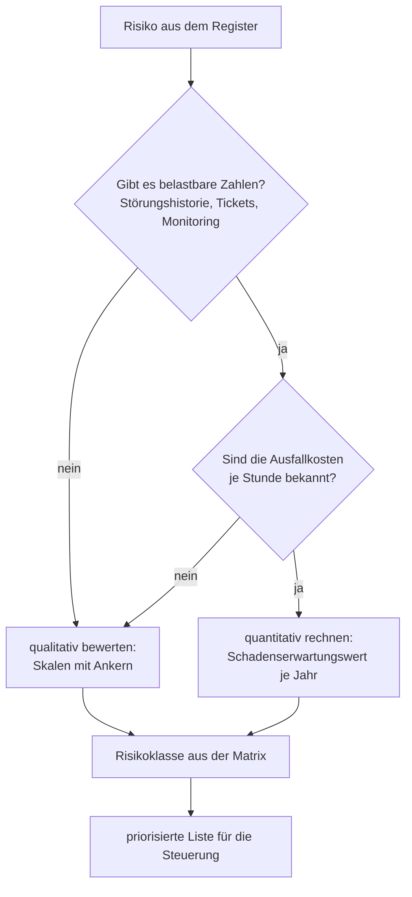
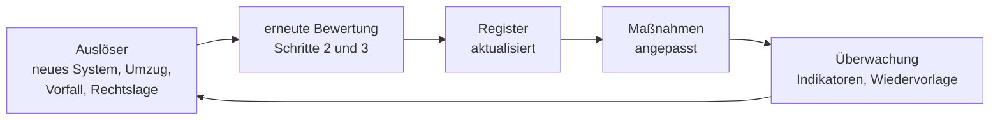

# Risikomanagement: Vertiefung

<span class='badge badge-vertiefung'>Vertiefung</span> &nbsp; Diese Seite setzt die Seite [Risikomanagement](risikomanagement.md) fort. Dort steht der Kern des Verfahrens – hier stehen die Teile, die man beim ersten Durchgang nicht braucht, für eine saubere Analyse aber schon.

Du kannst die Abschnitte einzeln lesen; sie bauen nicht zwingend aufeinander auf. Am Ende steht eine **vollständig durchgerechnete Risikoanalyse** über alle fünf Schritte – das ausführlichste Beispiel des ganzen Blocks.

!!! note "Zur Schrittnummerierung"
    Die Schrittnummern folgen dem [Fünf-Schritte-Prozess](risikomanagement.md#der-prozess-ein-kreislauf-kein-projekt) der Kernseite. Ausführlich ausgearbeitet stehen hier die **Schritte 1 bis 3** (identifizieren, analysieren, bewerten); **Schritt 4** (steuern) und **Schritt 5** (überwachen) stehen auf der Kernseite. Was diese Seite darüber hinaus zu den beiden letzten Schritten bringt – Maßnahmen formulieren, Restrisiken freigeben, Wiedervorlage –, ergänzt sie.

---

## Gleicher Erwartungswert, völlig anderer Charakter

Der Erwartungswert hat allerdings eine Eigenschaft, die man kennen muss, sonst führt er in die Irre:

```text
Risiko A: Ausfall der Kuehlung im Serverraum
  Eintrittswahrscheinlichkeit  0,25 je Jahr       (statistisch alle 4 Jahre)
  Schadenshoehe               48.000 EUR
  Erwartungswert              0,25 x  48.000 EUR  =  12.000 EUR je Jahr

Risiko B: Verschluesselung aller Fertigungsdaten durch Schadsoftware
  Eintrittswahrscheinlichkeit  0,02 je Jahr       (statistisch alle 50 Jahre)
  Schadenshoehe              600.000 EUR
  Erwartungswert              0,02 x 600.000 EUR  =  12.000 EUR je Jahr
```

Rechnerisch sind beide Risiken exakt gleich groß. Betriebswirtschaftlich sind sie es überhaupt nicht. Risiko A tritt in der Lebensdauer der Anlage mehrfach ein, jedes Mal unangenehm, jedes Mal überlebbar – so etwas kann man einplanen wie eine Reparaturrücklage. Risiko B tritt vermutlich nie ein; wenn doch, steht die Existenz des Betriebs zur Debatte.

Daraus folgt ein Merksatz, der in jeder Bewertung mitläuft: **Der Erwartungswert sagt, wie teuer ein Risiko im Mittel ist – nicht, ob man den Einzelfall überlebt.** Deshalb ist die Schadenshöhe nie nur eine Zahl neben der Wahrscheinlichkeit, sondern ein eigenes Kriterium: Alles, was ein Unternehmen im Einzelfall umwirft, wird behandelt, egal wie unwahrscheinlich es ist.

!!! note "Warum die 0,02 hier so niedrig angesetzt ist"
    Die Wahrscheinlichkeit für Risiko B ist in diesem Beispiel bewusst so gewählt, dass beide Erwartungswerte auf denselben Betrag kommen – nur dann lässt sich der Unterschied zeigen. In der Praxis wird das Risiko einer Verschlüsselung durch Schadsoftware für einen Fertigungsbetrieb heute deutlich höher geschätzt. Das schwächt den Merksatz nicht ab, im Gegenteil: Es schiebt Risiko B noch weiter nach oben.

## Beide Faktoren sind Schätzungen – und das ist kein Makel

Jetzt die unbequeme Wahrheit hinter der schönen Formel: **Keiner der beiden Faktoren ist gemessen.** Die Wahrscheinlichkeit für „Brand im Serverraum“ lässt sich aus der eigenen Historie nicht ableiten, weil es die Historie glücklicherweise nicht gibt; drei Temperaturereignisse in zwölf Jahren sind eine dünne Grundlage für eine Zahl mit zwei Nachkommastellen. Und die Schadenshöhe hängt an Annahmen, die selbst geschätzt sind: Warum acht Stunden und nicht sechzehn? Woher kommen die 1.800 Euro Deckungsbeitrag je Stunde? Was ist mit dem Kunden, der nach dem zweiten verspäteten Liefertermin den Rahmenvertrag kündigt?

Wer daraus schließt, die Rechnung sei wertlos, zieht die falsche Konsequenz. Sie ist aus drei Gründen trotzdem die beste verfügbare Grundlage:

- **Sie macht Annahmen sichtbar.** Sobald „acht Stunden“ auf dem Papier steht, kann die Fertigungsleitung widersprechen und „eher zwölf, wir müssen jede Charge nachverfolgen“ sagen. Über ein Bauchgefühl kann niemand widersprechen.
- **Sie erlaubt Vergleiche, keine Prognosen.** Für die Entscheidung, welches der zwanzig Risiken zuerst bearbeitet wird, reicht die Größenordnung völlig aus. Ob am Ende 48.000 oder 61.000 Euro herauskommen, ändert die Reihenfolge selten.
- **Sie ist überprüfbar.** Nach einem echten Vorfall lässt sich nachrechnen, wie gut die Schätzung war – und die nächste wird besser. Das ist der Grund, warum aus Störungen Lernstoff wird statt nur Ärger.

Die Zahl ist also nicht wahr, sie ist **nachvollziehbar** – und genau das ist ihr Zweck. Daraus folgt eine handwerkliche Regel: Zu jeder Schätzung gehört die Annahme, auf der sie beruht, in dieselbe Zeile. „48.000 Euro“ allein ist eine Behauptung; „48.000 Euro bei acht Stunden Stillstand, Basis: 60 Personen, 1.800 Euro Deckungsbeitrag je Stunde“ ist eine Grundlage, über die man streiten kann.

Aus demselben Grund arbeiten viele Betriebe gar nicht mit Euro-Beträgen, sondern mit Klassen von 1 bis 5. Welche der beiden Sichtweisen wann die richtige ist, klären wir bei der Bewertung.

!!! warning "Zwei Zahlen, eine davon in Prozent – und schon rechnet jemand falsch"
    Achte in Aufgaben und in der Praxis darauf, worauf sich die Wahrscheinlichkeit bezieht. „20 %“ ohne Zeitraum ist keine Angabe: 20 % je Jahr, 20 % je Projekt und 20 % je Deployment sind drei sehr verschiedene Aussagen. Üblich ist der Bezug auf ein Jahr, weil Budgets in Jahren gedacht werden. Steht daneben eine Schadenshöhe je Ereignis, ergibt die Multiplikation einen Betrag **je Jahr** – und nur mit dieser Einheit lässt er sich mit den Kosten einer Maßnahme vergleichen, die ebenfalls jährlich anfällt.

---

## Risikoarten: eine Checkliste gegen blinde Flecken

Risiken einzuteilen ist kein Selbstzweck. Die Kategorien sind eine Suchhilfe: Sie zwingen dazu, in Ecken zu schauen, in die man von allein nicht schaut.

| Kategorie | Worum es geht | Drei Beispiele aus dem IT-Alltag |
|---|---|---|
| **technisch** | Hardware, Software, Netz, Kapazität – alles, was kaputtgehen oder nicht mehr reichen kann | Defekt am zentralen Speichersystem; Fehler nach einem Update, der erst im Produktivbetrieb auffällt; die Datenbank wächst schneller als der Speicher |
| **organisatorisch** | Abläufe, Zuständigkeiten, Dokumentation – Risiken, die aus fehlender Ordnung entstehen | kein beschriebener Wiederanlauf nach einem Ausfall; Änderungen gehen ohne Freigabe direkt in die Produktion; für ein System ist niemand schriftlich zuständig |
| **rechtlich / Compliance** | Verstöße gegen Verträge, Gesetze oder Aufbewahrungspflichten | Unterlizenzierung fällt beim Hersteller-Audit auf; Echtdaten liegen in einem Testsystem; Aufbewahrungsfristen werden vom Archiv nicht eingehalten |
| **wirtschaftlich** | Geld, Verträge, Abhängigkeit von Anbietern | Cloud-Preise steigen mitten in der Laufzeit; das Projektbudget reicht nicht bis zur Abnahme; ein Anbieterwechsel ist wegen fehlender Exportmöglichkeit unbezahlbar |
| **personell** | Menschen: Wissen, Verfügbarkeit, Verhalten | Wissen über ein System steckt nur in einem Kopf; eine Schlüsselperson kündigt mitten in der Migration; Fehlbedienung nach fehlender Einarbeitung |
| **extern** | alles, was von außen kommt und nur begrenzt beeinflussbar ist | Stromausfall, Hochwasser oder Hitzewelle; ein Dienstleister fällt aus oder wird selbst angegriffen; neue regulatorische Anforderungen |

Der Nutzen dieser Liste zeigt sich in jedem Workshop auf dieselbe Weise. Eine IT-Runde sammelt in den ersten zwanzig Minuten fast ausschließlich **technische** Risiken, weil das ihr Arbeitsgebiet ist. Die teuersten Ausfälle der letzten Jahre gehen aber selten auf defekte Hardware zurück, sondern auf fehlende Zuständigkeiten, nicht dokumentierte Sonderlocken oder eine einzige Person, die als Einzige weiß, wie die Fertigungssteuerung konfiguriert ist. Die Kategorien wirken deshalb wie eine Checkliste: Zu jeder Zeile muss die Runde mindestens einen Eintrag liefern oder begründen, warum es dort nichts gibt. **Ein leeres Feld ist kein Beweis für Sicherheit, sondern meistens ein Hinweis darauf, dass niemand am Tisch sitzt, der diesen Bereich kennt.**

Ein Sonderfall verdient eine eigene Bemerkung. Bei der Kategorie **extern** taucht regelmäßig das Argument auf, ein ausgelagerter Dienst sei „nicht mehr unser Risiko“. Das trifft nicht zu. Ausgelagert wird die **Ausführung**, nicht die **Verantwortung**: Fällt der Dienstleister aus, steht trotzdem der eigene Betrieb still – und gegenüber Kunden und Betroffenen bleibt das eigene Unternehmen in der Pflicht. Ein Dienstleisterrisiko gehört deshalb genauso ins Register wie ein eigener Server, nur sind die Maßnahmen andere: vertraglich zugesicherte Verfügbarkeiten, ein zweiter Anbieter, ein beschriebener Weg zurück ins eigene Haus.

---

## Der Sonderfall: Integration und Migration

Es gibt eine Situation, in der überdurchschnittlich viel schiefgeht – und in der du fast sicher landen wirst: wenn ein System **neu eingebunden** oder **in eine andere Umgebung umgezogen** wird. Der Umzug ins Rechenzentrum eines Anbieters, der Wechsel auf eine neue Fachanwendung, die Zusammenführung zweier IT-Landschaften nach einer Übernahme: In all diesen Fällen laufen zwei Zustände nebeneinander, Verantwortungen sind unklar und die Beteiligten arbeiten unter Termindruck an einem System, das sie noch nicht kennen.

Für diesen Fall lohnt eine eigene, engere Checkliste. Fünf Risikofelder decken den größten Teil dessen ab, was in Migrationsprojekten tatsächlich passiert:

| Risikofeld | Was konkret passiert | Typische Gegenmaßnahme |
|---|---|---|
| **Datenverlust oder Datenbeschädigung** | Datensätze gehen bei der Übernahme verloren, Sonderzeichen und Umlaute werden falsch übernommen, Verknüpfungen zwischen Tabellen brechen, historische Daten fehlen | Testmigration mit echten Daten, Abgleich der Datensatzzahlen vorher und nachher, Stichprobenprüfung durch die Fachabteilung, Rückfallpunkt vor der Umstellung |
| **Inkompatibilität zwischen den Systemen** | Schnittstellen sprechen unterschiedliche Formate, eine Anwendung erwartet eine ältere Version, ein Treiber fehlt in der neuen Umgebung, Sonderanpassungen der Altanwendung gibt es nicht mehr | Testumgebung mit derselben Version wie später produktiv, frühe Prüfung aller Schnittstellen, schriftliche Freigabe des Herstellers für die Zielumgebung |
| **Probleme mit der Systemperformance** | Im Test läuft alles, im Produktivbetrieb bricht die Antwortzeit ein, weil die echte Last, die echte Datenmenge oder der Weg über das Netz fehlten | Lasttest mit realistischer Nutzerzahl und Datenmenge, Messung der Antwortzeiten vor und nach dem Umzug, Bandbreite und Laufzeit auf der neuen Strecke rechnen |
| **Fehlende oder mangelhafte Backups** | Die Sicherung des Altsystems ist älter als gedacht, für das neue System ist noch keine eingerichtet, oder es wurde nie geprüft, ob sich die Sicherung zurückspielen lässt | Vollsicherung unmittelbar vor der Umstellung, nachgewiesener Wiederherstellungstest, Sicherung des neuen Systems vom ersten Tag an |
| **Datenschutz und Datensicherheit** | Personenbezogene Daten landen in einer Umgebung ohne geklärte Rechtsgrundlage, Testsysteme werden mit Echtdaten gefüllt, Zugriffsrechte werden bei der Übernahme großzügiger als vorher | Vor der Migration klären, wo die Daten liegen und wer darauf zugreift; Testdaten anonymisieren; Berechtigungen nicht übernehmen, sondern neu vergeben |

!!! warning "Das Risiko, das in keiner Liste steht"
    Der gefährlichste Zeitpunkt einer Migration ist nicht die Umstellung selbst, sondern der **Parallelbetrieb** danach. Solange zwei Systeme nebeneinander laufen, ist oft nicht eindeutig geregelt, welches führt. Es entstehen Daten in beiden, die sich auseinanderentwickeln – und beim Abschalten des alten Systems fällt auf, dass ein Teil der Arbeit der letzten Wochen nur dort steht.

    Deshalb gehört zu jeder Migration eine schriftliche Antwort auf drei Fragen: Welches System ist ab wann das führende? Wer entscheidet anhand welchen Kriteriums, dass umgestellt wird? Und bis wann muss der Rückweg offen bleiben?

Wer eine Migration plant, kann diese Tabelle direkt als Startpunkt für das Register verwenden: fünf Zeilen, die schon da sind, bevor der erste Workshop beginnt. Wie eine Migrationsstrategie samt Rückfallplan aussieht, steht bei den [Übungsaufgaben der Infrastruktur-Planung](../infrastruktur-planung/uebungen.md).

---

## Schritt 1: Risiken identifizieren

Der erste Schritt entscheidet über die Qualität aller folgenden. Ein Risiko, das niemand aufgeschrieben hat, wird nicht bewertet, nicht gesteuert und nicht überwacht – es passiert einfach. Deshalb gilt hier eine einzige Regel: **erst sammeln, dann bewerten.** Wer schon beim Sammeln diskutiert, ob etwas „realistisch“ ist, verliert genau die Einträge, die später wehtun.

Sechs Methoden, die sich in der Praxis bewährt haben – am besten kombiniert, weil jede etwas anderes findet:

- **Strukturiertes Sammeln im Team.** Ein moderierter Termin mit allen Rollen, die etwas beitragen können: Administration, Anwendungsbetreuung, Fachabteilung, Einkauf, oft auch der Dienstleister. Die Kategorien aus dem letzten Abschnitt geben die Struktur vor, damit die Runde nicht in der Technik hängen bleibt.
- **Checklisten und Gefährdungskataloge.** Fertige Sammlungen typischer Gefährdungen – der IT-Grundschutz des BSI ist die bekannteste im deutschsprachigen Raum – finden zuverlässig das, woran im eigenen Haus niemand denkt. Ihr Nachteil ist die Gegenrichtung: Sie kennen deine Besonderheiten nicht.
- **Interviews mit den Fachabteilungen.** Die IT weiß, welche Server es gibt. Was es bedeutet, wenn die Fertigungssteuerung vier Stunden steht, weiß nur die Fertigung. Diese Gespräche liefern die Schadenshöhen, die sonst geraten werden.
- **Auswertung vergangener Störungen.** Das Ticketsystem ist das ehrlichste Risikoarchiv im Haus. Interessant sind nicht die Einzelfälle, sondern die Häufungen: dreimal dieselbe Ursache in einem Jahr ist kein Pech mehr, sondern ein ungesteuertes Risiko.
- **Begehung.** Einmal mit offenen Augen durch Serverraum, Technikräume und Lager gehen. Kartons vor der Brandschutztür, ein offener Serverschrank, eine Steckdosenleiste als Notstromlösung, ein Netzwerkschrank im Pausenraum – solche Funde stehen in keinem Ticket.
- **Ursache-Wirkungs-Diagramm.** Für ein bekanntes oder befürchtetes Problem systematisch alle möglichen Ursachen sammeln, statt bei der erstbesten stehen zu bleiben.
- **Bedrohungsmodellierung.** Ein System wird gedanklich zerlegt und für jeden Baustein gefragt, wer ihm auf welchem Weg schaden könnte. Dazu gleich mehr.

Keine dieser Methoden ist für sich vollständig, deshalb die Kombination. Die Kataloge liefern das Allgemeine, die Interviews das Betriebsspezifische, das Ticketsystem das bereits Eingetretene, die Begehung das Sichtbare – der Workshop bringt die Ergebnisse an einen Tisch.

### Bedrohungsmodellierung: das System aus Sicht des Angreifers

Die bisherigen Methoden fragen: Was könnte bei uns passieren? Die **Bedrohungsmodellierung** dreht die Perspektive und fragt: Wenn jemand diesem System schaden wollte – wo würde er ansetzen? Das ist keine Denksportaufgabe, sondern ein geordnetes Verfahren in vier Schritten:

1. **Das System zerlegen.** Welche Bausteine gibt es, welche Daten fließen wohin, wo verlässt eine Information den eigenen Verantwortungsbereich? Die Stellen, an denen Daten eine Grenze überschreiten – ins Internet, zu einem Dienstleister, in ein anderes Netz –, heißen **Vertrauensgrenzen** und sind die interessantesten Punkte.
2. **Angreifer benennen.** Ein externer Angreifer aus dem Internet, ein unzufriedener Beschäftigter mit gültigem Zugang, ein Dienstleister mit Fernwartungszugriff, eine Schadsoftware ohne Absicht – jede dieser Rollen hat andere Möglichkeiten.
3. **Bedrohungen je Baustein sammeln.** Für jeden Baustein und jede Grenze durchgehen, was dort schiefgehen kann: Kann sich jemand als ein anderer ausgeben? Lassen sich Daten unbemerkt verändern? Kann jemand eine Handlung später abstreiten? Können Informationen abfließen? Lässt sich der Dienst lahmlegen? Kann jemand mehr Rechte erlangen, als ihm zustehen?
4. **Gegenmaßnahmen zuordnen** und offene Punkte als Risiken ins Register übernehmen.

Die sechs Fragen aus Schritt 3 sind kein Zufall – sie decken genau die Schutzziele ab. „Sich als jemand anderes ausgeben“ verletzt die Authentizität, „Daten unbemerkt verändern“ die Integrität, „Informationen abfließen“ die Vertraulichkeit, „lahmlegen“ die Verfügbarkeit. Wer die Fragen einmal verinnerlicht hat, findet auch in einem unbekannten System schnell die wunden Punkte.

!!! tip "Wo sich Bedrohungsmodellierung besonders lohnt"
    Immer dann, wenn etwas **neu gebaut oder umgezogen** wird. Bei einer Migration in die Cloud verschieben sich sämtliche Vertrauensgrenzen: Was vorher im eigenen Haus lag, liegt danach bei einem Anbieter – und der Weg dorthin führt durch das Internet. Genau diese verschobenen Grenzen sind die Stellen, an denen die neuen Risiken sitzen.

### Risikoszenarien: aus einer Liste werden Geschichten

Ein Registereintrag ist knapp – bewusst, sonst liest ihn niemand. Für die Bewertung ist diese Knappheit aber ein Problem: „Ausfall der Kühlung“ sagt nichts darüber, wie ein solcher Ausfall abläuft, wie lange er dauert und wen er trifft. Deshalb arbeitet man mit **Risikoszenarien**: Ein Risiko wird zu einem konkreten Ablauf ausgeschrieben, mit Zeitpunkt, Dauer, Betroffenen und Folgen.

| | Registereintrag | Risikoszenario |
|---|---|---|
| Formulierung | „Ausfall der Kühlung im Serverraum“ | „An einem Freitagabend im Juli fällt die Kühlung aus. Bis Montagfrüh bemerkt es niemand, weil keine Temperaturüberwachung meldet. Zwei Server schalten sich über Nacht thermisch ab, die Fertigungssteuerung ist am Montag ab Schichtbeginn nicht verfügbar. Der Wiederanlauf dauert sechs Stunden, eine Tagesschicht entfällt.“ |
| Taugt für | Übersicht, Sortierung | Bewertung, Diskussion, Notfallübung |

Der Nutzen zeigt sich sofort: Am Szenario lässt sich die Schadenshöhe schätzen, weil Dauer und Betroffene darinstehen. Es lässt sich mit der Fachabteilung besprechen, weil es eine Geschichte erzählt statt ein Stichwort zu liefern. Und es lässt sich **durchspielen** – wer das Szenario einmal am Tisch durchgeht, merkt schnell, ob der Notfallplan trägt.

Sinnvoll ist, je Risiko **zwei** Szenarien zu beschreiben: einen wahrscheinlichen Verlauf und einen ungünstigen. Der wahrscheinliche Verlauf trägt die Bewertung, der ungünstige zeigt, wie viel Luft nach oben im Schaden steckt.

### Das Ursache-Wirkungs-Diagramm

Das **Ursache-Wirkungs-Diagramm** – nach seiner Form auch Fischgräten-Diagramm genannt, nach seinem Urheber Ishikawa-Diagramm – dreht die Blickrichtung um. Statt von möglichen Ereignissen auszugehen, schreibst du eine unerwünschte Wirkung an die Spitze und arbeitest dich von dort rückwärts zu den Ursachen. Die Hauptäste sind vorgegeben, damit die Suche nicht einseitig wird; im deutschsprachigen Raum sind es meist die fünf M: **Mensch, Maschine, Methode, Material und Mitwelt**. Erweiterte Fassungen ergänzen **Messung** und **Management**; entscheidend ist nicht die Anzahl der Äste, sondern dass sie vorher feststehen.

<figure>
<svg viewBox="0 0 720 400" width="100%" height="400" role="img" aria-label="Fischgräten-Diagramm. Eine waagerechte Mittellinie führt von links nach rechts auf ein rot umrandetes Kästchen zu, in dem die unerwünschte Wirkung steht: Fertigungssteuerung steht still. Von der Mittellinie zweigen fünf schräge Hauptäste ab. Oberhalb liegen die Äste Mensch mit der Ursache Wartung nicht beauftragt, Maschine mit der Ursache Klimaanlage ungewartet und Methode mit der Ursache kein Grenzwert festgelegt. Unterhalb liegen die Äste Material mit der Ursache kein Ersatzteil vorrätig und Mitwelt mit der Ursache Hitzewelle über Tage. Links an der Mittellinie steht die Beschriftung Ursachen, rechts über dem Kästchen die Beschriftung Wirkung.">
  <!-- Mittelgräte -->
  <line x1="40" y1="212" x2="546" y2="212" stroke="#7dff9a" stroke-width="2.5"/>
  <polygon points="552,212 538,205 538,219" fill="#7dff9a"/>
  <!-- Kopf: die unerwünschte Wirkung -->
  <text x="633" y="168" text-anchor="middle" fill="#8fa498" font-family="system-ui, sans-serif" font-size="11">Wirkung</text>
  <rect x="556" y="180" width="154" height="64" rx="5" fill="rgba(224,108,108,0.12)" stroke="#e06c6c" stroke-width="2"/>
  <text x="633" y="206" text-anchor="middle" fill="#e2ece6" font-family="system-ui, sans-serif" font-size="13">Fertigungssteuerung</text>
  <text x="633" y="225" text-anchor="middle" fill="#e2ece6" font-family="system-ui, sans-serif" font-size="13">steht still</text>
  <!-- obere Äste -->
  <line x1="175" y1="212" x2="105" y2="112" stroke="#56c374" stroke-width="2"/>
  <text x="105" y="98" text-anchor="middle" fill="#7aa2ff" font-family="system-ui, sans-serif" font-size="14">Mensch</text>
  <text x="105" y="78" text-anchor="middle" fill="#8fa498" font-family="system-ui, sans-serif" font-size="11">Wartung nicht beauftragt</text>
  <line x1="320" y1="212" x2="250" y2="112" stroke="#56c374" stroke-width="2"/>
  <text x="250" y="98" text-anchor="middle" fill="#7aa2ff" font-family="system-ui, sans-serif" font-size="14">Maschine</text>
  <text x="250" y="78" text-anchor="middle" fill="#8fa498" font-family="system-ui, sans-serif" font-size="11">Klimaanlage ungewartet</text>
  <line x1="465" y1="212" x2="395" y2="112" stroke="#56c374" stroke-width="2"/>
  <text x="395" y="98" text-anchor="middle" fill="#7aa2ff" font-family="system-ui, sans-serif" font-size="14">Methode</text>
  <text x="395" y="78" text-anchor="middle" fill="#8fa498" font-family="system-ui, sans-serif" font-size="11">kein Grenzwert festgelegt</text>
  <!-- untere Äste -->
  <line x1="245" y1="212" x2="175" y2="312" stroke="#56c374" stroke-width="2"/>
  <text x="175" y="330" text-anchor="middle" fill="#7aa2ff" font-family="system-ui, sans-serif" font-size="14">Material</text>
  <text x="175" y="350" text-anchor="middle" fill="#8fa498" font-family="system-ui, sans-serif" font-size="11">kein Ersatzteil vorrätig</text>
  <line x1="395" y1="212" x2="325" y2="312" stroke="#56c374" stroke-width="2"/>
  <text x="325" y="330" text-anchor="middle" fill="#7aa2ff" font-family="system-ui, sans-serif" font-size="14">Mitwelt</text>
  <text x="325" y="350" text-anchor="middle" fill="#8fa498" font-family="system-ui, sans-serif" font-size="11">Hitzewelle über Tage</text>
  <!-- Beschriftung der Mittelgräte -->
  <text x="40" y="200" fill="#8fa498" font-family="system-ui, sans-serif" font-size="11">Ursachen</text>
</svg>
<figcaption>Das Ursache-Wirkungs-Diagramm zerlegt ein Problem in Ursachengruppen – die Wirkung steht an der Spitze, die Äste zwingen dazu, auch dort zu suchen, wo man sonst nicht hinsieht.</figcaption>
</figure>

Der Wert der Methode liegt nicht in den Ästen, die man ohnehin gefunden hätte, sondern in denen, an denen sonst niemand entlanggeht. Bei einem Serverraum-Problem hätte eine IT-Runde „Klimaanlage ungewartet“ wahrscheinlich von allein genannt. Der Ast **Methode** bringt dagegen die Frage hervor, ob überhaupt jemand festgelegt hat, ab welcher Raumtemperatur ein Alarm ausgelöst wird – und der Ast **Mensch** die Frage, warum die Wartung nicht beauftragt wurde. Nicht selten endet man bei einer Ursache, die mit Technik nichts mehr zu tun hat: Der Wartungsvertrag lief über eine Abteilung, die es nach einer Umstrukturierung nicht mehr gibt.

Zwei praktische Hinweise. Erstens lohnt es sich, an jedem Ast zwei- bis dreimal „warum?“ nachzufragen, bis eine Ursache übrig bleibt, an der man tatsächlich etwas ändern kann – „menschliches Versagen“ ist keine Ursache, sondern das Ende der Suche. Zweitens gehört das fertige Diagramm nicht ins Archiv, sondern ins Risikoregister: Jede Ursache, die niemand abgestellt hat, ist ein Kandidat für einen eigenen Eintrag.

---

## So sieht das gefüllt aus

Drei Einträge aus dem Register der Feinwerk Präzisionstechnik GmbH. Zuerst die Analyse-Seite:

| ID | Beschreibung | Kategorie | Eintrittswahrscheinlichkeit | Schadenshöhe je Ereignis | Erwartungswert |
|---|---|---|---|---|---|
| **R-01** | Weil der Wartungsvertrag für die Klimaanlage im Serverraum nicht verlängert wurde, kann die Kühlung ausfallen, wodurch die Server abschalten und die Fertigungssteuerung stillsteht. | technisch | 0,25 je Jahr | 48.000 Euro | 12.000 Euro je Jahr |
| **R-02** | Weil die übernommenen Stammdaten vor dem Umschalttermin nicht gegen das Altsystem abgeglichen werden, können fehlerhafte Stücklisten unbemerkt ins neue ERP gelangen, wodurch nach der Umstellung Ausschuss gefertigt wird. | organisatorisch | 0,30 je Umstellung | 90.000 Euro | 27.000 Euro je Umstellung |
| **R-03** | Weil die Konfiguration der Fertigungssteuerung nur einem Mitarbeiter bekannt und nicht dokumentiert ist, kann bei dessen längerem Ausfall niemand Änderungen vornehmen, wodurch Störungen Tage statt Stunden dauern. | personell | 0,15 je Jahr | 40.000 Euro | 6.000 Euro je Jahr |

Achte auf die Einheiten in der vierten Spalte, hier steckt eine Falle. R-01 und R-03 sind **Betriebsrisiken**: Sie können in jedem Jahr eintreten, ihr Erwartungswert ist ein Jahresbetrag. R-02 ist dagegen ein **Projektrisiko**. Die ERP-Umstellung findet genau einmal statt, also bezieht sich die Wahrscheinlichkeit auf dieses eine Vorhaben und der Erwartungswert von 27.000 Euro ebenfalls – nicht auf ein Jahr. Weil die Umstellung in das laufende Planungsjahr fällt, lassen sich die drei Werte hier trotzdem nebeneinanderstellen; sobald das Projekt abgeschlossen ist, verschwindet R-02 aus dem Register und wird durch die Betriebsrisiken des neuen Systems ersetzt. **Wer Einheiten mischt, ohne sie zu kennzeichnen, produziert eine Rangfolge, die keine ist.**

Und dieselben drei Zeilen auf der Steuerungs-Seite:

| ID | Bewertung | Strategie | Maßnahme | Verantwortlich | Termin | Status |
|---|---|---|---|---|---|---|
| **R-01** | hoch | Reduktion | Wartungsvertrag neu abschließen, zusätzlich Temperaturüberwachung mit Alarm auf die Rufbereitschaft aufschalten | M. Renner (Leitung IT-Betrieb) | 31.05. | in Umsetzung |
| **R-02** | kritisch | Reduktion | Testmigration mit dokumentiertem Abgleich gegen das Altsystem, schriftlicher Rückfallplan mit definiertem Abbruchkriterium | S. Aydin (Projektleitung ERP) | 15.09., vier Wochen vor der Umstellung | offen |
| **R-03** | mittel | Reduktion | Betriebsdokumentation erstellen, zweite Person einarbeiten und an einer realen Änderung beteiligen | T. Kowalski (Leitung Fertigungs-IT) | 31.12. | offen |

An diesen beiden Tabellen lässt sich gut sehen, was ein Register leistet.

- **R-02** hat den höchsten Erwartungswert, obwohl es kein technisches Problem ist und in keinem Monitoring auftaucht – es existiert ausschließlich, weil jemand es aufgeschrieben hat. Kein Werkzeug hätte es gemeldet.
- **R-03** wirkt mit 6.000 Euro harmlos, ist aber der Eintrag mit der billigsten Maßnahme: Dokumentation und eine zweite eingearbeitete Person kosten Arbeitszeit, sonst nichts. Der Erwartungswert allein bestimmt also noch nicht die Reihenfolge der Umsetzung – dazu gehört immer der Aufwand der Maßnahme.
- **R-01** zeigt, wofür die Spalte **Termin** da ist. Der 31. Mai steht dort nicht, weil das Datum schön ist, sondern weil die erste Hitzeperiode erfahrungsgemäß im Juni beginnt. Ein Termin im Oktober hieße, einen ganzen Sommer lang genau das Risiko zu tragen, das man gerade beschlossen hat zu reduzieren.

Zwei Spalten sind bis hierhin allerdings nur behauptet. Woher die **Bewertung** „hoch“ kommt und wie man aus zwei Schätzwerten eine belastbare Rangfolge macht, ist der nächste Schritt – und die vier möglichen Einträge in der Spalte **Strategie** verdienen ein eigenes Kapitel.

---

## Schritt 2 und 3: analysieren und bewerten

Nach der Identifikation steht im Risikoregister eine Liste. Sie ist zunächst nur das: eine Liste. Jede Zeile behauptet, dass etwas schiefgehen kann – keine sagt, wie schlimm das wäre oder womit man anfangen sollte. Genau das leisten die nächsten beiden Schritte. Die **Analyse** klärt für jedes Risiko zwei Größen: Wie wahrscheinlich ist der Eintritt, wie groß wäre der Schaden? Die **Bewertung** setzt beide zusammen zu einer Klasse oder einer Zahl – und macht die Liste damit sortierbar.

Wo genau die Analyse aufhört und die Bewertung anfängt, ist in der Praxis Auslegungssache; das ist auch nicht der Punkt. Der Punkt ist die Reihenfolge: **erst schätzen, dann urteilen.** Wer mit dem Urteil anfängt, sucht sich anschließend die Zahlen dazu – und bekommt am Ende genau das Ergebnis heraus, das er von Anfang an haben wollte.

### Qualitativ oder quantitativ?

Für die Bewertung gibt es zwei Grundwege. Der **qualitative** Weg arbeitet mit Stufen: gering, mittel, hoch. Der **quantitative** Weg arbeitet mit Geld: so und so viel Euro Schaden je Jahr. Dazwischen liegt der **semi-quantitative** Weg, der Stufen benutzt, ihnen aber Zahlenbereiche hinterlegt.

| Verfahren | Datenbedarf | Ergebnis | Grenzen |
|---|---|---|---|
| **qualitativ** | Erfahrung, Einschätzung mehrerer Fachleute, Skalen mit Ankern | eine Risikoklasse: gering, mittel, hoch, kritisch | subjektiv; Klassen kann man nicht addieren; ohne Anker versteht jeder etwas anderes unter „mittel“ |
| **semi-quantitativ** | Skalenstufen plus grobe Euro- und Häufigkeitsbereiche je Stufe | Punktwert plus Klasse, grob in Geld übersetzbar | die Punktzahl täuscht eine Genauigkeit vor, die die Schätzung dahinter nicht hat |
| **quantitativ** | Ausfallkosten je Stunde, belastbare Häufigkeiten, Statistik aus Monitoring, Tickets, Versicherungsdaten | Schadenserwartungswert in Euro je Jahr | die Zahlen liegen selten vor; seltene Großereignisse werden vom Mittelwert glattgebügelt |

Die ehrliche Aussage dazu lautet: **Qualitativ ist der Normalfall.** Nicht, weil es die bessere Methode wäre, sondern weil die Daten für alles andere meist fehlen. Kein mittelständischer Betrieb hat eine Statistik darüber, wie oft bei ihm ein Verschlüsselungstrojaner durchkommt. Wer trotzdem eine Häufigkeit von „0,17 Ereignissen je Jahr“ in die Tabelle schreibt, hat nichts gemessen, sondern eine Schätzung mit Nachkommastelle verkleidet.

Es gibt allerdings Bereiche, in denen quantitativ sauber funktioniert – überall dort, wo Ereignisse häufig genug sind, um sie zu zählen: Festplatten- und Netzteilausfälle, Störungen aus dem Ticketsystem, ungeplante Ausfallzeiten aus dem Monitoring, Fehlversuche bei Anmeldungen. Für diese Risiken solltest du rechnen, weil du es kannst. Für den Brand im Serverraum bleibt die Schätzung – und dann ist eine ehrliche Stufe mehr wert als eine unehrliche Zahl.



### Die Skalen: ohne Anker ist jede Stufe wertlos

Eine qualitative Bewertung braucht zwei Skalen, üblicherweise mit fünf Stufen. Entscheidend ist nicht die Stufenzahl, sondern der **Anker**: eine Beschreibung, die aus „mittel“ etwas Nachprüfbares macht.

Die erste Skala misst die **Eintrittswahrscheinlichkeit**. Ihr Anker ist eine Häufigkeit:

| Stufe | Bezeichnung | Anker: wie oft? | grob in Ereignissen je Jahr |
|---|---|---|---|
| **1** | sehr selten | seltener als alle zehn Jahre – im Betrieb noch nie vorgekommen | unter 0,1 |
| **2** | selten | etwa alle fünf bis zehn Jahre – einmal erlebt oder aus der Branche bekannt | 0,1 bis 0,2 |
| **3** | gelegentlich | häufiger als alle fünf Jahre, aber seltener als jährlich | über 0,2 bis unter 1 |
| **4** | wahrscheinlich | etwa einmal im Jahr | rund 1 |
| **5** | häufig | mehrmals im Jahr – gehört zum Alltag | über 1 |

Die zweite Skala misst die **Schadenshöhe**. Sie braucht zwei Anker nebeneinander, einen in Euro und einen in Auswirkung – weil in der Diskussion beide gebraucht werden: Das Controlling denkt in Euro, die Fachabteilung denkt in Stillstand.

| Stufe | Bezeichnung | Anker in Euro | Anker in Auswirkung |
|---|---|---|---|
| **1** | unbedeutend | bis 5.000 Euro | eine einzelne Person behindert, innerhalb von Stunden erledigt |
| **2** | gering | über 5.000 bis 25.000 Euro | ein Team arbeitet einen Tag lang eingeschränkt |
| **3** | spürbar | über 25.000 bis 100.000 Euro | eine Abteilung steht, Liefertermine wackeln, Überstunden nötig |
| **4** | schwer | über 100.000 bis 500.000 Euro | die Fertigung steht mehrere Tage, Vertragsstrafen greifen, Kunden merken es |
| **5** | existenzbedrohend | über 500.000 Euro | Betrieb über Wochen gestört, Kunden wandern ab, der Fortbestand steht zur Debatte |

Achte auf die Grenzen: Jeder Wert darf nur in **eine** Stufe fallen. Sobald zwei Stufen sich denselben Betrag teilen, streiten zwei Leute wieder über die Einordnung – genau das soll die Skala ja verhindern.

Diese Zahlen sind kein Gesetz, sondern eine Festlegung des jeweiligen Betriebs. Für die **Feinwerk Präzisionstechnik GmbH** mit 180 Beschäftigten sind 400.000 Euro ein Schaden der Stufe 4; für einen Konzern wären sie ein Rundungsfehler, für einen Fünf-Personen-Betrieb das Ende. Genau deshalb gehört die Skala einmal verabschiedet, dokumentiert – und dann für alle Risiken gleich benutzt. Sonst vergleicht man am Ende Bewertungen, die auf verschiedenen Maßstäben beruhen.

!!! warning "Ohne Anker ist die Skala Dekoration"
    Setz drei Leute an einen Tisch und lass sie ohne Anker bewerten. Der Vertrieb hält alles für „hoch“, weil Kunden betroffen sein könnten. Die IT hält dasselbe für „mittel“, weil sie den Ausfall schon dreimal repariert hat. Die Geschäftsführung hält es für „gering“, weil noch nie jemand deswegen angerufen hat. Alle drei haben recht – sie messen nur mit verschiedenen Linealen.

    Der Anker beendet diesen Streit, weil er die Frage verschiebt: nicht mehr „Wie schlimm findest du das?“, sondern **„Wie oft ist das in den letzten zehn Jahren passiert – und was hat es beim letzten Mal gekostet?“** Das sind Fragen, die man beantworten oder ehrlich mit „wissen wir nicht“ abschließen kann. Beides ist mehr wert als ein Bauchgefühl im Tabellenformat.

---

## Wenn Zahlen vorliegen: der Schadenserwartungswert

Wo sich Häufigkeiten und Kosten belastbar schätzen lassen, lohnt der quantitative Weg – weil er eine Frage beantwortet, die die Matrix offenlässt: **Wie viel darf die Maßnahme kosten?** Dafür braucht es drei Größen:

| Größe | Was sie beschreibt | Einheit |
|---|---|---|
| **Einzelschaden** | was ein einzelnes Ereignis kostet, von der ersten Störungsminute bis zur letzten Nacharbeit | Euro je Ereignis |
| **erwartete Häufigkeit** | wie oft das Ereignis im Mittel je Jahr eintritt | Ereignisse je Jahr |
| **Schadenserwartungswert** | Einzelschaden × Häufigkeit | Euro je Jahr |

Der **Schadenserwartungswert** ist damit das, was ein Risiko den Betrieb im langjährigen Mittel je Jahr kostet – auch in den Jahren, in denen nichts passiert. In der englischsprachigen Literatur begegnen dir dieselben drei Größen als *Single Loss Expectancy*, *Annual Rate of Occurrence* und *Annualized Loss Expectancy*. Die Häufigkeit darf ausdrücklich kleiner als eins sein: Ein Ereignis, das etwa alle zwei Jahre eintritt, hat die Häufigkeit 0,5; eines alle vier Jahre die Häufigkeit 0,25.

Ein durchgerechnetes Beispiel aus der Feinwerk Präzisionstechnik GmbH. Das ERP-System läuft auf einem einzelnen Server im hauseigenen Rechenzentrum; fällt er aus, steht die Auftragsabwicklung – und kurz darauf die Materialbereitstellung in der Fertigung.

```text
Risiko: Ausfall des ERP-Servers durch Hardware- oder Speicherdefekt

  Einzelschaden je Ereignis                            48.000 EUR
  erwartete Haeufigkeit                                   0,5 Ereignisse je Jahr
                                                    ---------
  Schadenserwartungswert   48.000 x 0,5   =            24.000 EUR je Jahr
```

Die 48.000 Euro sind keine gegriffene Zahl – wie man auf sie kommt, rechnet der übernächste Abschnitt Posten für Posten vor. Die Häufigkeit 0,5 stammt aus der eigenen Störungshistorie: In den letzten zehn Jahren gab es fünf Ausfälle dieser Art.

### Die Maßnahme dagegenrechnen

Ein Erwartungswert allein entscheidet nichts. Interessant wird er erst, wenn man ihm die Kosten einer Maßnahme gegenüberstellt – und zwar auf derselben Zeitachse, also ebenfalls je Jahr. Eine Maßnahme kann an zwei Stellen wirken: Sie senkt die **Häufigkeit** oder sie senkt den **Einzelschaden**. Manche tun beides, die meisten nur eines von beidem.

```text
Massnahme: zweiter Serverknoten im Cluster mit automatischem Failover

Kosten der Massnahme je Jahr
  Hardware 14.000 EUR, verteilt auf 5 Jahre             2.800 EUR
  Lizenzen und Wartung                                  3.400 EUR
  Betriebsaufwand (Einrichtung, Tests, Pflege)          2.800 EUR
                                                    ---------
  Summe                                                 9.000 EUR je Jahr

Wirkung
  Haeufigkeit    unveraendert                             0,5 Ereignisse je Jahr
  Ausfalldauer   6 Stunden  ->  0,3 Stunden

Neuer Einzelschaden je Ereignis
  Ausfallzeit 0,3 Stunden x 5.000 EUR je Stunde         1.500 EUR
  Reparatur des defekten Knotens                        6.500 EUR
  Vertragsstrafe und Nacharbeit entfallen                   0 EUR
                                                    ---------
  Summe                                                 8.000 EUR

Rechnung
  Schadenserwartungswert vorher                        24.000 EUR je Jahr
  Schadenserwartungswert nachher    8.000 x 0,5  =      4.000 EUR je Jahr
                                                    ---------
  Nutzen der Massnahme             24.000 - 4.000 =    20.000 EUR je Jahr
  Kosten der Massnahme                                  9.000 EUR je Jahr
                                                    ---------
  Netto-Vorteil                    20.000 - 9.000 =    11.000 EUR je Jahr
```

Beachte, was hier passiert ist – die Häufigkeit hat sich **nicht** geändert. Ein zweiter Knoten verhindert keinen einzigen Hardwaredefekt; Netzteile brennen genauso oft durch wie vorher. Die Maßnahme wirkt ausschließlich auf die Ausfalldauer: Statt sechs Stunden Stillstand übernimmt der zweite Knoten in 0,3 Stunden, also in unter zwanzig Minuten. Damit fallen Vertragsstrafe und Nacharbeit weg – aus 48.000 Euro Einzelschaden werden 8.000.

Das Ergebnis ist eindeutig: 20.000 Euro Nutzen gegen 9.000 Euro Kosten, ein Verhältnis von rund 2,2 zu 1. Die Maßnahme lohnt sich – und was diese Rechnung wirklich wert ist, merkst du im Gespräch mit der Geschäftsführung. „Wir brauchen einen zweiten Server“ ist eine Bitte. „Ein zweiter Server kostet 9.000 Euro im Jahr und spart 20.000“ ist eine Entscheidungsvorlage.

### Wenn sich die Maßnahme nicht rechnet

Jetzt derselbe Rechenweg für ein Risiko, bei dem am Ende ein Minus steht. Feinwerk betreibt das Rechenzentrum im Keller; für den Serverraum steht eine Brandfrüherkennung mit automatischer Löschanlage zur Debatte.

```text
Risiko: Brand im Serverraum

  Einzelschaden je Ereignis                           400.000 EUR
  erwartete Haeufigkeit                                  0,01 Ereignisse je Jahr
                                                    ---------
  Schadenserwartungswert   400.000 x 0,01  =            4.000 EUR je Jahr

Massnahme: Brandfrueherkennung mit automatischer Loeschanlage

  Investition 60.000 EUR, verteilt auf 15 Jahre         4.000 EUR je Jahr
  Wartung und wiederkehrende Pruefung                   2.500 EUR je Jahr
                                                    ---------
  Kosten                                                6.500 EUR je Jahr

Wirkung
  Haeufigkeit     unveraendert                           0,01 Ereignisse je Jahr
  Einzelschaden   400.000 EUR  ->  80.000 EUR
                  (Frueherkennung begrenzt den Brand
                   auf einen Schrank)

Rechnung
  Schadenserwartungswert nachher   80.000 x 0,01  =       800 EUR je Jahr
  Nutzen                            4.000 - 800   =     3.200 EUR je Jahr
  Kosten                                                6.500 EUR je Jahr
                                                    ---------
  Netto                             3.200 - 6.500 =    -3.300 EUR je Jahr
```

Rein rechnerisch ist die Sache klar: Die Anlage kostet 6.500 Euro im Jahr und bringt 3.200 – ein Minus von 3.300 Euro je Jahr. Nach der Logik des Erwartungswerts müsste man sie ablehnen.

Man baut sie trotzdem. Und die Gründe dafür sind keine Schwäche der Methode, sondern die Grenzen ihres Anwendungsbereichs:

- **Menschen.** In dem Gebäude arbeiten Menschen. Personenschäden gehören nicht in eine Erwartungswertrechnung – nicht, weil man sie nicht beziffern könnte, sondern weil man es nicht tut. Sobald Leib und Leben im Spiel sind, ist die Kosten-Nutzen-Frage die falsche Frage.
- **Rechtliche und vertragliche Pflichten.** Brandschutz ist keine freiwillige Leistung. Was konkret gefordert ist, ergibt sich aus Bauordnung, Vorgaben der Berufsgenossenschaft und Auflagen des Versicherers – das klärt man nicht in der Risikorechnung, sondern mit den Zuständigen. Wo eine Maßnahme gefordert ist, wird sie umgesetzt; die Rechnung sagt dann höchstens noch, ob man beim Umfang sparen kann.
- **Reputation und Kundenbindung.** Ein Fertigungsbetrieb, dessen Rechenzentrum abbrennt, verliert nicht nur Hardware. Er verliert Liefertermine, Zertifizierungen, im schlimmsten Fall Kunden, die nicht wiederkommen. Das steht in keiner der beiden Zahlen oben.
- **Der Erwartungswert kennt kein Einzelschicksal.** 4.000 Euro je Jahr sind ein Mittelwert über hundert Jahre. Feinwerk erlebt keine hundert Jahre mit je 4.000 Euro Brandschaden, sondern mit hoher Wahrscheinlichkeit gar keinen Brand – oder eben einen, der 400.000 Euro kostet und auf einen Schlag fällig wird. Ob der Betrieb diesen einen Schlag verkraftet, ist eine ganz andere Frage als die nach dem Mittelwert.

Übrigens greift hier auch die Sonderregel aus der [Risikomatrix](risikomanagement.md#die-risikomatrix-das-bild-auf-das-sich-alle-einigen-konnen): Wahrscheinlichkeit 1 mal Schadenshöhe 4 ergibt das Produkt 4, rechnerisch also „gering“ – eines der drei gestrichelt umrandeten Felder im Bild dort. Über die Sonderregel wird daraus „hoch“ – damit landet der Fall auf dem Tisch der Geschäftsführung statt in der jährlichen Durchsicht.

**Eine negative Rechnung ist kein Verbot, sondern eine Information.** Sie sagt dir, dass du die Maßnahme nicht mit Wirtschaftlichkeit begründen kannst – also brauchst du eine andere Begründung; die gehört dann genauso dokumentiert. Umgekehrt gilt dasselbe: Eine positive Rechnung ist noch keine Genehmigung. Ob und wie ein Risiko beantwortet wird – vermeiden, reduzieren, übertragen oder akzeptieren –, entscheidet sich im nächsten Prozessschritt.

---

## Woher die Schadenshöhe kommt: Ausfallkosten beziffern

Die schwierigste Zahl in jeder Risikorechnung ist die Schadenshöhe. „Wenn das ERP ausfällt, wird es teuer“ ist keine Zahl, sondern eine Stimmung. Der Weg zur Zahl führt über eine simple Struktur:

**Schadenshöhe = Ausfalldauer × Kosten je Stunde + einmalige Zusatzkosten**

Die Kosten je Stunde setzen sich dabei aus mehreren Posten zusammen, die man einzeln schätzt – weil sie aus verschiedenen Quellen kommen und weil man sich beim Einzelschätzen weniger vertut als beim Gesamtraten.

| Bestandteil | Woher die Zahl kommt | Typischer Fehler |
|---|---|---|
| **Produktionsausfall** | Deckungsbeitrag je Stunde aus dem Controlling – Umsatz abzüglich der Kosten, die im Stillstand gar nicht anfallen | den vollen Umsatz ansetzen, obwohl Material und Energie in der Stillstandszeit nicht verbraucht werden |
| **unproduktive Personalzeit** | Zahl der tatsächlich blockierten Personen × Vollkostensatz je Stunde (Gehalt plus Nebenkosten plus Arbeitsplatzkosten) | alle Beschäftigten mitzählen – ein ERP-Ausfall stoppt nicht die Kollegin an der Drehbank |
| **Wiederherstellungsaufwand** | Überstunden, externer Dienstleister, Ersatzteile, Neuinstallation, Datennacherfassung | ganz vergessen, weil er in bestehenden Budgets untergeht |
| **Vertragsstrafen und Pönalen** | Liefer- und Serviceverträge: Was steht dort für verspätete Lieferung oder verfehlte Verfügbarkeit? | nur die eigene Sicht rechnen – die Strafe steht im Vertrag des Kunden, nicht im eigenen Wunschdenken |
| **Reputations- und Folgeschaden** | Erfahrungswert oder eine bewusst gesetzte, offengelegte Pauschale | entweder auf null setzen oder ins Unermessliche schätzen; beides macht die Rechnung unbrauchbar |

Damit lässt sich der Einzelschaden aus dem ERP-Beispiel Posten für Posten aufbauen. Feinwerk hat 180 Beschäftigte, davon arbeiten rund 40 in Auftragsabwicklung, Einkauf, Arbeitsvorbereitung und Fertigungsplanung direkt mit dem ERP-System:

```text
Ausfall des ERP-Servers, sechs Stunden an einem normalen Werktag

Kosten je Stunde
  Produktionsausfall (Deckungsbeitrag)                  3.200 EUR je Stunde
  unproduktive Personalzeit
    40 Betroffene x 45 EUR Vollkostensatz               1.800 EUR je Stunde
                                                    ---------
  Summe                                                 5.000 EUR je Stunde

Ausfalldauer
  6 Stunden x 5.000 EUR je Stunde                      30.000 EUR

Einmalige Zusatzkosten
  Wiederherstellung (Dienstleister, Ueberstunden)       6.500 EUR
  Vertragsstrafe wegen verspaeteter Lieferung           8.000 EUR
  Nacharbeit, Datennacherfassung, Kundenbetreuung       3.500 EUR
                                                    ---------
  Zwischensumme                                        18.000 EUR

                                                    ---------
  Schadenshoehe je Ereignis        30.000 + 18.000 =   48.000 EUR
```

Zwei Feinheiten, die diese Rechnung ehrlich halten. Erstens der **Nachholeffekt**: Wenn die Fertigung die verlorenen sechs Stunden am Samstag mit Überstunden aufholt, ist der Deckungsbeitrag nicht verloren – dann sind die Mehrkosten der Überstunden der Schaden, nicht die entgangene Marge. Wer beides ansetzt, zählt doppelt. Zweitens die **Tageszeit**: Derselbe Ausfall kostet um drei Uhr nachts einen Bruchteil dessen, was er um zehn Uhr vormittags kostet. Wer eine einzige Zahl braucht, rechnet mit dem typischen Fall – wer sauber arbeitet, notiert die Annahme daneben.

!!! note "Zwei Größen, die man hier gern verwechselt"
    In dieser Rechnung stecken zwei Vorgaben aus der Verfügbarkeitsplanung, die verschiedene Zeiträume betreffen.

    Die **RTO** (Recovery Time Objective) ist die Zeit **nach** der Störung: Wie lange darf es dauern, bis das System wieder läuft? Sie steckt oben in der Ausfalldauer. Wer die RTO von sechs auf eine Stunde drückt, streicht fünf Sechstel des Postens „Ausfalldauer mal Kosten je Stunde“.

    Die **RPO** (Recovery Point Objective) betrifft die Zeit **vor** der Störung: Wie viele Daten aus dem Zeitraum vor dem Ausfall dürfen verloren gehen? Dieser Verlust taucht in der Rechnung nicht in der Ausfalldauer auf, sondern in der Nacherfassung – jede Stunde, die zwischen der letzten Sicherung und dem Ausfall liegt, muss jemand von Hand nachtragen.

Diese Rechnung ist der Kern dessen, was in der Verfügbarkeitsplanung **Business Impact Analyse** heißt: die systematische Ermittlung, was ein Ausfall je Geschäftsprozess kostet. Ausführlich steht sie auf der Seite [Hochverfügbarkeit](../betrieb/hochverfuegbarkeit.md), zusammen mit der Frage, wie viel Redundanz sich daraus rechtfertigen lässt. Wer wissen will, welche Systeme überhaupt geschützt werden müssen, findet den Einstieg auf der Kernseite im Abschnitt [Schutzbedarf](risikomanagement.md#schutzbedarf-wie-viel-schutz-ist-genug).

---

## FMEA: der Blick auf einzelne Fehler

Risikomatrix und Erwartungswert betrachten Risiken von außen: Etwas fällt aus, etwas kostet Geld. Die **FMEA** – Fehlermöglichkeits- und Einflussanalyse – geht von innen heran. Sie fragt für jeden einzelnen Bestandteil eines Systems oder Prozesses: Was kann hier konkret kaputtgehen, was folgt daraus – **und würden wir es überhaupt merken, bevor es wirkt?**

Die Methode stammt aus der Fertigung und der Produktentwicklung, wo sie seit Jahrzehnten Standard ist. In der IT eignet sie sich überall dort, wo es nicht um „das System“ als Ganzes geht, sondern um konkrete Fehlerstellen: einen Backup-Job, eine Firewall-Regel, einen Update-Vorgang, eine Schnittstelle zwischen zwei Anwendungen.

### Die drei Faktoren und die Risikoprioritätszahl

Jeder Fehler wird mit drei Zahlen von 1 bis 10 bewertet:

| Faktor | Was er misst | 1 bedeutet ... | 10 bedeutet ... |
|---|---|---|---|
| **A – Auftreten** | wie oft der Fehler vorkommt | praktisch ausgeschlossen | tritt ständig auf |
| **B – Bedeutung** | wie schwer die Folge für den Betroffenen wiegt | kaum spürbar | Ausfall mit Gefahr für Personen oder für den Fortbestand |
| **E – Entdeckung** | wie **schlecht** der Fehler auffällt, bevor er wirkt | wird mit Sicherheit vorher entdeckt | wird praktisch nie vorher entdeckt |

Aus den drei Werten entsteht die **Risikoprioritätszahl (RPZ)** als schlichtes Produkt:

**RPZ = A × B × E** – ein Wert zwischen 1 und 1.000.

!!! warning "Bei E ist eine hohe Zahl schlecht, keine gute Nachricht"
    Hier verrechnen sich fast alle, die zum ersten Mal eine FMEA ausfüllen – der Name führt in die Irre. „Entdeckungswahrscheinlichkeit“ klingt so, als sei viel davon gut. In der FMEA ist es genau umgekehrt: **Eine 10 bei E heißt, dass der Fehler unbemerkt bleibt, bis er zuschlägt.** Eine 1 heißt, dass er garantiert vorher auffällt.

    Der Grund dafür ist rein rechnerisch. Alle drei Faktoren müssen in dieselbe Richtung zeigen, damit das Produkt eine sinnvolle Rangfolge ergibt: hohe Zahl gleich schlechte Lage. Bei A und B ist das intuitiv, bei E muss man es umdrehen. Wer im Kopf nicht „Entdeckungswahrscheinlichkeit“ liest, sondern **„Unentdeckbarkeit“**, macht diesen Fehler nie wieder.

Eine gefüllte FMEA für die Feinwerk Präzisionstechnik GmbH, sortiert nach RPZ:

| Fehler / Schwachstelle | Mögliche Folge | A | B | E | RPZ |
|---|---|---|---|---|---|
| **Backup läuft nächtlich, wurde aber nie zurückgespielt** | im Ernstfall kein wiederherstellbarer Datenbestand – der Ausfall wird zum Datenverlust | 4 | 10 | 9 | **360** |
| **Firewall-Regel öffnet das Fertigungsnetz zum Büronetz** | unbefugter Zugriff auf Maschinensteuerungen, Ausbreitung von Schadsoftware in die Produktion | 4 | 9 | 8 | **288** |
| **Klimatisierung im Serverraum fällt aus** | Überhitzung, Server schalten sich zum Selbstschutz ab | 5 | 7 | 3 | **105** |
| **Firmware-Update des Speichersystems schlägt fehl** | Datenzugriff für alle angeschlossenen Systeme weg | 3 | 9 | 2 | **54** |

Achte auf die Skala: Die FMEA rechnet mit 1 bis 10, die Risikomatrix mit 1 bis 5. Die 5 beim Auftreten des Klimaausfalls bedeutet hier also etwas anderes als die 3 in der [Risikomatrix](risikomanagement.md#die-risikomatrix-das-bild-auf-das-sich-alle-einigen-konnen) – Werte aus beiden Verfahren darf man nicht ineinander schieben.

Die Rangfolge ist aufschlussreich, weil sie nicht der Bauchreihenfolge entspricht. Das fehlgeschlagene Firmware-Update fühlt sich dramatisch an – es ist der klassische Albtraum des Wartungsfensters. In der FMEA landet es auf dem letzten Platz, weil es sofort auffällt: Man steht daneben, man merkt es in derselben Minute, man hat einen Rückfallplan. Das nie getestete Backup dagegen fühlt sich nach gar nichts an, weil der grüne Haken jede Nacht erscheint. Es steht ganz oben, weil seine Bedeutung maximal ist **und** niemand es merkt, bevor es zu spät ist.

Genau das ist die Leistung der Methode: Sie bringt die Sichtbarkeit eines Fehlers als eigene Größe in die Bewertung – und Sichtbarkeit ist das, was Bauchgefühle systematisch falsch einschätzen.

Aus der Bewertung folgt die Maßnahme, danach wird neu bewertet. Führt Feinwerk einen vierteljährlichen Wiederherstellungstest ein, sinkt E von 9 auf 2:

```text
vorher     A 4  x  B 10  x  E 9   =  360
nachher    A 4  x  B 10  x  E 2   =   80
```

Wichtig ist, was sich dabei **nicht** ändert. Die Bedeutung bleibt bei 10 – ein Restore-Test macht den Fehler sichtbar, er verhindert ihn nicht. Auch das Auftreten bleibt bei 4: Ein Test sorgt nicht dafür, dass Sicherungen seltener kaputtgehen. Wer die Bedeutung senken will, braucht eine zweite, unabhängige Sicherungskette. Die technische Seite dazu steht auf [Backup & Recovery](../betrieb/backup-und-recovery.md).

### Was die RPZ nicht kann

Die RPZ hat eine Schwäche, die man kennen muss, bevor man nach ihr sortiert: **Dieselbe Zahl entsteht aus völlig verschiedenen Kombinationen.**

```text
Fall 1    A  2  x  B 10  x  E 10   =  200
Fall 2    A 10  x  B 10  x  E  2   =  200
Fall 3    A  5  x  B  8  x  E  5   =  200
```

Dreimal 200, drei grundverschiedene Lagen. Fall 1 ist ein seltener, katastrophaler Fehler, den niemand kommen sieht – das ist der gefährlichste der drei. Fall 2 passiert ständig, wird aber jedes Mal sofort bemerkt und abgefangen; er ist ein Ärgernis mit hohem Aufwand, kein Sicherheitsproblem. Fall 3 ist überall mittelmäßig. Eine Sortierung allein nach RPZ behandelt alle drei gleich – und das ist falsch.

Daraus folgen zwei Regeln für die Praxis. Erstens: **Nach der RPZ sortieren, aber immer die Einzelwerte danebenlegen.** Zweitens – das ist die wichtigere Regel: **Eine Bedeutung von 9 oder 10 löst eine Maßnahme aus, egal wie klein die RPZ ist.** Das ist dieselbe Sonderregel wie in der Risikomatrix, nur in anderer Verpackung – ein Fehler, der Personen gefährdet oder den Betrieb beendet, wird nicht dadurch harmlos, dass er selten ist.

Schwellenwerte für die RPZ – ab welchem Wert gehandelt werden muss – legt jeder Betrieb selbst fest; einen allgemeingültigen Grenzwert gibt es nicht. In der Automobilindustrie ist die RPZ inzwischen ohnehin durch eine dreistufige Aufgabenpriorität abgelöst worden – und zwar aus genau dem Grund, der oben in den drei Zeilen steht.

---

## Priorisieren: aus der Bewertung wird eine Reihenfolge

Am Ende von Analyse und Bewertung steht kein Ergebnis, sondern eine sortierte Liste. Die Reihenfolge ergibt sich aus drei Kriterien in dieser Rangfolge:

1. **Risikoklasse zuerst.** Kritisch vor hoch vor mittel vor gering – ergänzt um die Sonderregel, dass existenzbedrohende Schäden unabhängig von der Wahrscheinlichkeit nach oben rutschen.
2. **Innerhalb der Klasse nach Erwartungswert**, wo einer vorliegt – sonst nach Schadenshöhe. Bei gleicher Klasse gewinnt das teurere Risiko.
3. **Zuletzt nach Wirkung je eingesetztem Euro.** Wenn zwei Risiken gleich dringend sind, kommt das zuerst dran, dessen Maßnahme günstiger oder schneller wirkt.

Punkt drei führt zu einer Beobachtung, die in der Praxis viel Geld spart: **Eine gute Maßnahme senkt selten nur ein Risiko.** Ein getestetes, offline gehaltenes Backup wirkt gegen Ransomware, gegen den Ausfall des Speichersystems und gegen versehentliches Löschen zugleich. Rechnet man die Erwartungswerte dieser drei Zeilen zusammen, sieht die Sache anders aus als bei der Einzelbetrachtung:

```text
Drei Risiken, auf die ein getestetes Offline-Backup wirkt

  Ransomware-Befall            600.000 x 0,25  =      150.000 EUR je Jahr
  Ausfall des Speichersystems   45.000 x 0,2   =        9.000 EUR je Jahr
  versehentliches Loeschen       2.000 x 2,0   =        4.000 EUR je Jahr
                                                    ---------
  Summe                                               163.000 EUR je Jahr

Wirkung der Massnahme je Risiko (geschaetzt und dokumentiert)
  Ransomware-Befall            150.000 x 0,60  =       90.000 EUR je Jahr
  Ausfall des Speichersystems    9.000 x 0,70  =        6.300 EUR je Jahr
  versehentliches Loeschen       4.000 x 0,80  =        3.200 EUR je Jahr
                                                    ---------
  Nutzen gesamt                                        99.500 EUR je Jahr

Kosten der Massnahme je Jahr
  zweites Sicherungsziel 30.000 EUR auf 5 Jahre         6.000 EUR
  Medien, Lizenzen, Auslagerung                         4.000 EUR
  Betrieb und vierteljaehrliche Restore-Tests           8.000 EUR
                                                    ---------
  Kosten gesamt                                        18.000 EUR je Jahr

                                                    ---------
  Netto-Vorteil                 99.500 - 18.000 =      81.500 EUR je Jahr
```

Rechnet man das Backup nur gegen das versehentliche Löschen, stehen 3.200 Euro Nutzen gegen 18.000 Euro Kosten – ein klares Minus. Erst die Summe über alle drei Zeilen zeigt, was die Maßnahme wirklich wert ist: rund 99.500 von 163.000 Euro, also gut 60 Prozent des gebündelten Erwartungswerts. Deshalb gehört zur Priorisierung immer der Blick, welche Maßnahme auf **mehrere** Zeilen des Registers gleichzeitig wirkt.

!!! warning "Diese Rechnung ist eine Schätzung – und sie muss sich so nennen"
    Die 0,25 Ereignisse je Jahr für den Ransomware-Befall sind genau die Art von Zahl, vor der weiter oben gewarnt wurde: Kein Mittelständler hat dazu eine belastbare Statistik. Dasselbe gilt für die Wirkungsgrade von 60, 70 und 80 Prozent – das sind Annahmen, keine Messwerte.

    Für den Vergleich mehrerer Risiken untereinander taugt so eine Rechnung trotzdem, unter zwei Bedingungen: Sie ist als Schätzung gekennzeichnet und alle Zeilen wurden mit derselben Sorgfalt gebildet. Was nicht geht, ist die Zahl aus dem Zusammenhang zu reißen und als gemessenen Wert weiterzugeben.

### Risikotragfähigkeit: wer darf was akzeptieren?

Die zweite Hälfte der Priorisierung ist keine Rechnung, sondern eine Frage der Zuständigkeit. Sie hängt an der **Risikotragfähigkeit**: der Summe an Schäden, die ein Betrieb verkraften kann, ohne in Schieflage zu geraten. Aus ihr leitet sich der **Schwellenwert** ab – die Grenze, ab der ein Risiko nicht mehr einfach hingenommen werden darf.

Damit das im Alltag funktioniert, braucht jede Klasse drei Festlegungen: Was folgt daraus, wer darf über die Annahme entscheiden, bis wann?

| Klasse | Was daraus folgt | Wer über die Annahme entscheidet | Frist |
|---|---|---|---|
| **gering** | im Register führen, beobachten | die Fachverantwortlichen im Team | jährliche Durchsicht |
| **mittel** | Maßnahme vorschlagen und durchrechnen | IT-Leitung | Entscheidung binnen drei Monaten |
| **hoch** | Maßnahme verbindlich planen, mit Termin und namentlich Verantwortlichen | Geschäftsführung, schriftlich begründet | Umsetzung binnen sechs Monaten |
| **kritisch** | Sofortmaßnahme, danach dauerhafte Lösung als Projekt | nicht ohne dokumentierte Ausnahmeentscheidung der Geschäftsführung | sofort |

Diese Tabelle ist der eigentliche Kern des ganzen Verfahrens – mit Technik hat sie wenig zu tun. Sie beantwortet die Frage, die in vielen Betrieben unbeantwortet bleibt: **Wer trägt ein Risiko, das nicht behoben wird?** Die Antwort darf nicht lauten „die Administratorin, die es gemeldet hat“. Wer ein Risiko akzeptiert, muss es auch tragen können – und deshalb wandert die Unterschrift mit der Klasse nach oben.

Daran ändert auch die Auslagerung an einen Dienstleister nichts. Wer den Betrieb eines Systems vergibt, gibt die **Ausführung** ab, nicht die **Verantwortung** für das Risiko. Die Zeile bleibt im eigenen Register stehen; was sich ändert, ist die Frage, wen man in die Pflicht nimmt, wenn sie eintritt – und das steht dann im Vertrag, nicht in der Matrix.

Genau deshalb ist eine bewusste Akzeptanz auch kein Versagen, sondern ein legitimes Ergebnis. Was nicht geht, ist die stille Akzeptanz: ein Risiko, das erkannt, bewertet und dann einfach nicht weiterverfolgt wurde, weil niemand zuständig war. Der Unterschied zwischen beidem ist ein einziger Satz im Register – mit Datum, Begründung und Namen darunter.

!!! note "Zwischenstand: was jetzt im Register steht"
    Nach Schritt 2 und 3 hat jede Zeile des Registers vier neue Felder – und keines davon darf leer bleiben:

    1. **Eintrittswahrscheinlichkeit** als Stufe, mit dem Anker daneben, auf den man sich gestützt hat
    2. **Schadenshöhe** als Stufe, wo möglich ergänzt um den gerechneten Einzelschaden in Euro
    3. **Risikoklasse** aus Produkt und Schwellenwert, samt Vermerk, falls die Sonderregel gegriffen hat
    4. **Rangplatz** in der Gesamtliste, plus der Name der Person, die über die weitere Behandlung entscheidet

    Fehlt eines dieser Felder, ist die Bewertung nicht fertig, sondern nur begonnen.

Damit steht die Reihenfolge. Was jetzt fehlt, ist die Antwort: Für jedes Risiko oben auf der Liste muss entschieden werden, **was** damit geschieht.

---

### Wer darf ein Restrisiko freigeben?

Nicht, wer die Maßnahme umsetzt. Die Faustregel ist einfach: **Freigeben darf, wer die Folgen wirtschaftlich zu verantworten hätte.** Diese Person heißt **Risikoeigentümer** – sie ist nicht identisch mit dem Maßnahmenverantwortlichen, der die Umsetzung erledigt.

Die Staffel ist dieselbe wie bei der Risikotragfähigkeit im vorigen Abschnitt, nur angewendet auf das Risiko **nach** den Maßnahmen:

| Klasse des Nettorisikos | Freigabe durch | Form |
|---|---|---|
| gering | Fachverantwortliche im Team | Eintrag im Register |
| mittel | IT-Leitung | Eintrag mit Begründung und Wiedervorlage |
| hoch | Geschäftsführung | schriftliche Freigabe, befristet |
| kritisch | Geschäftsführung | dokumentierte Ausnahmeentscheidung mit Auflagen und Frist |

Ein Systemadministrator kann kein Restrisiko freigeben, dessen Eintritt den Betrieb Hunderttausende kostet – nicht weil er es fachlich nicht beurteilen könnte, sondern weil er die Folgen nicht zu tragen hat. Umgekehrt gilt genauso: Wenn die Geschäftsführung ein hohes Restrisiko trägt, muss sie es auch erfahren haben. Ein Risiko, das nie den Weg nach oben gefunden hat, ist nicht akzeptiert, sondern verschwiegen.

Fünf Angaben braucht jedes akzeptierte Restrisiko: **was** genau übrig bleibt, **wie** es nach Umsetzung der Maßnahmen bewertet ist, **warum** es getragen wird, **wer** das entschieden hat – und **wann** die Entscheidung erneut geprüft wird. Fehlt eine davon, ist der Eintrag im Ernstfall wertlos.

!!! danger "Das dokumentierte Restrisiko schützt zweimal"
    Es schützt fachlich, weil ein bekanntes Restrisiko überwacht werden kann und ein unbekanntes nicht. Und es schützt organisatorisch: Nach einem Vorfall kommt gleich nach der Frage „Warum ist das passiert?" die Frage „Wer hat das gewusst?". Ein Eintrag mit Datum, Bewertung und Unterschrift beantwortet sie in dreißig Sekunden.

    Umgekehrt ist der schlechteste Zustand nicht das hohe Restrisiko, sondern das unbenannte. Bis zum Eintritt ist es unsichtbar, weil alles funktioniert – und danach ist es ein Versäumnis.

---

## Maßnahmen, die auch jemand umsetzt

Zwischen einer Maßnahme und einem Vorsatz liegen vier Eigenschaften. Eine brauchbare Maßnahme ist **konkret** (was genau geschieht), **zuständig** (eine Person, keine Abteilung), **terminiert** (ein Datum, keine Absichtserklärung) und **überprüfbar** (woran erkennt man, dass sie wirkt). Fehlt eine davon, steht sie in einem Jahr unverändert im Protokoll.

| Schwache Formulierung | Warum sie nicht trägt | Starke Formulierung |
|---|---|---|
| „Backups verbessern" | kein Gegenstand, kein Maß, niemand zuständig | „Bis 30.09. richtet der Systemadministrator eine dritte, vom Netz getrennte Kopie der ERP-Datenbank ein; die Rückspielung wird quartalsweise getestet und protokolliert." |
| „Mitarbeiter sensibilisieren" | keine Zielgruppe, kein Zeitpunkt, keine Prüfung | „Bis 31.12. absolvieren alle 180 Beschäftigten eine 45-minütige Phishing-Schulung; die Personalabteilung meldet die Teilnahmequote monatlich an die IT-Leitung." |
| „Server absichern" | absichern wogegen – und woran misst man das? | „Die Fertigungssteuerung erhält bis KW 40 ein eigenes VLAN; Zugriff ausschließlich über den Sprungserver mit Mehrfaktor-Anmeldung. Verantwortlich: Netzwerkadministration." |
| „Monitoring einführen" | benennt ein Werkzeug statt einer Wirkung | „Bis 15.11. erzeugt das Monitoring eine Warnung, sobald ein Datenträger 80 % Füllstand überschreitet; Empfänger ist die Rufbereitschaft, Eskalation nach 4 Stunden." |
| „Notfallplan erstellen" | ein Dokument allein ändert nichts | „Bis 31.03. liegt ein Wiederanlaufplan für das ERP vor; er wird einmal jährlich in einer Übung erprobt, das Protokoll geht an die Geschäftsführung." |

Auffällig ist, was die rechte Spalte gemeinsam hat: Jede starke Formulierung nennt einen Termin, eine Person oder Rolle und einen Punkt, an dem sich die Wirkung überprüfen lässt. Das ist kein Formalismus, sondern der Unterschied zwischen einer Maßnahme und einem guten Vorsatz.

### Vorbeugen oder begrenzen – zwei verschiedene Hebel

Maßnahmen zur Verminderung greifen an verschiedenen Stellen an – und man verwechselt sie leicht:

| Art | Wirkt auf | Beispiele | Wirkt, wenn ... |
|---|---|---|---|
| **vorbeugend** (präventiv) | die Eintrittswahrscheinlichkeit | Patchmanagement, Mehrfaktor-Anmeldung, Zugangskontrolle, Härtung, Schulung, Vier-Augen-Prinzip bei Änderungen | ... nichts passiert – der Erfolg ist unsichtbar |
| **erkennend** (detektierend) | die Zeit bis zur Reaktion | Monitoring, Protokollierung, Angriffserkennung, Rückspieltest, Prüfsummen | ... es gerade passiert |
| **schadensbegrenzend** (mitigierend) | die Schadenshöhe | Backup, Redundanz, Netzsegmentierung, Brandabschottung, Wiederanlaufplan, Notfallübung | ... es bereits passiert ist |

Die Kernunterscheidung ist die zwischen der ersten und der dritten Zeile: **Vorbeugende Maßnahmen senken die Wahrscheinlichkeit, schadensbegrenzende senken die Höhe.** Die erkennenden liegen dazwischen; sie ändern für sich genommen keine der beiden Größen, verkürzen aber die Dauer – und über die Dauer wieder die Höhe.

Ein Betrieb, der nur vorbeugt, hat keinen Plan für den Tag, an dem die Vorbeugung versagt – und genau dieser Tag kommt. Umgekehrt ist ein Betrieb, der ausschließlich in Backups und Redundanz investiert, dauerhaft damit beschäftigt, Folgen aufzuräumen. **Ein tragfähiges Maßnahmenpaket enthält aus allen drei Zeilen etwas.**

### Rechnet sich die Maßnahme?

Die Grenze ist der Erwartungswert, den die Maßnahme senkt. Ein Beispiel, das gleich im großen Durchlauf weiter unten als **R2** wiederkommt: Ein Betrieb braucht in etwa 30 % aller Jahre überhaupt eine vollständige Wiederherstellung der ERP-Datenbank. Ohne getestetes Verfahren schätzt das Team die Fehlschlagwahrscheinlichkeit auf 40 %; geht die Wiederherstellung schief, kostet das 250.000 Euro. Das Sicherungskonzept mit drei Kopien und quartalsweisem Rückspieltest – dasselbe Paket, das im vorigen Abschnitt mit 18.000 Euro je Jahr durchgerechnet wurde – senkt die Fehlschlagquote auf 5 %.

Beide Größen gehören multipliziert. Nur ein Teil der Jahre braucht überhaupt eine Wiederherstellung; nur ein Teil davon geht schief:

```text
Erwartungswert vorher:   0,30 x 0,40 x 250.000 EUR  =  30.000 EUR je Jahr
Erwartungswert nachher:  0,30 x 0,05 x 250.000 EUR  =   3.750 EUR je Jahr
                                                       -----------
Risikoreduktion                                     =  26.250 EUR je Jahr
Kosten der Massnahme                                =  18.000 EUR je Jahr
                                                       -----------
Netto-Nutzen                                        =   8.250 EUR je Jahr
```

Die Maßnahme kostet 18.000 Euro je Jahr und senkt den Erwartungswert um 26.250 Euro – sie rechnet sich, wenn auch nicht üppig. Wäre es umgekehrt, wäre Akzeptanz die wirtschaftlich richtige Antwort. Im vorigen Abschnitt wurde dasselbe Paket gegen drei andere Zeilen des Registers gerechnet und kam dort auf einen viel größeren Nutzen. Das ist kein Widerspruch, sondern derselbe Befund aus einer anderen Richtung: Eine gute Maßnahme wirkt auf mehrere Zeilen gleichzeitig – verbuchen darf man ihren Nutzen trotzdem nur einmal.

Zwei Einschränkungen gehören dazu. Erstens gilt die Rechnung nicht für **existenzbedrohende** Risiken: Ein Schaden, den der Betrieb nicht überlebt, wird nicht gegen einen Erwartungswert aufgerechnet, sondern behandelt. Zweitens sind die Prozentwerte Schätzungen – die Rechnung ist ein Argument, kein Beweis. Ihr Wert liegt darin, dass sie die Diskussion von „das ist mir zu teuer" auf „welche Zahl in dieser Rechnung hältst du für falsch?" umstellt.

---

### Monitoring erkennt, es schützt nicht

Hier lohnt eine klare Trennung, weil sie in Konzepten regelmäßig schiefgeht: **Monitoring verhindert keinen einzigen Ausfall.** Es ist kein Schutz, sondern ein Erkennungsinstrument. Was es tut, ist die Zeit zwischen Eintritt und Reaktion zu verkürzen – und weil die Schadenshöhe fast immer an der **Dauer** hängt, senkt es das Risiko trotzdem, nur eben über die zweite Achse.

Daraus folgt zweierlei. Erstens gehört Monitoring in die Zeile „erkennend", nicht in die Zeile „vorbeugend" – wer es als Schutzmaßnahme verbucht, hat eine Lücke im Konzept und merkt es nicht. Zweitens wirkt es nur, solange jemand die Meldungen liest. Ein Monitoring, das täglich vierhundert Warnungen erzeugt, erzeugt keine Aufmerksamkeit, sondern **Alarmmüdigkeit**: Nach zwei Wochen klickt sie jeder weg – und die eine echte Meldung geht mit unter. Wie man Schwellen und Meldewege so baut, dass das nicht passiert, steht auf [Monitoring](../betrieb/monitoring.md).

### Wiedervorlage: Kalender und Auslöser

Ein Teil der Überwachung läuft nach Turnus, gestaffelt nach der Klasse des Nettorisikos:

| Klasse des Nettorisikos | Wiedervorlage | Wer schaut darauf |
|---|---|---|
| kritisch | monatlich | Geschäftsführung |
| hoch | quartalsweise | IT-Leitung, Bericht an die Geschäftsführung |
| mittel | halbjährlich | IT-Leitung |
| gering | jährlich | Fachverantwortliche |

Der wichtigere Teil läuft aber nicht nach Kalender, sondern nach **Ereignissen**. Eine erneute Bewertung ist fällig, sobald sich etwas an der Grundlage ändert:

- **Neue Systeme oder Anwendungen** – jedes neue System bringt eigene Risiken mit und verändert die Bewertung der bestehenden.
- **Umzug oder Umbau** – ein neuer Serverraum, ein zweiter Standort, ein Wechsel in die Cloud ändert die physischen Risiken vollständig.
- **Personalwechsel** – der Weggang eines Wissensträgers, ein neuer Dienstleister, eine veränderte Rufbereitschaft.
- **Geänderte Rechts- oder Vertragslage** – neue Auflagen, ein Kundenvertrag mit Verfügbarkeitszusage, geänderte Lizenzbedingungen eines Herstellers.
- **Eingestellter Herstellersupport** – sobald für ein System keine Sicherheitsupdates mehr kommen, ist jede Wahrscheinlichkeitsschätzung von vorgestern.
- **Ein eingetretener Vorfall** – der stärkste Auslöser überhaupt, weil er eine Schätzung durch eine Beobachtung ersetzt. Was einmal passiert ist, war offensichtlich nicht so unwahrscheinlich wie angenommen.
- **Ein Vorfall bei einem vergleichbaren Betrieb** – dieselbe Branche, dieselbe Software, dieselbe Angriffsart. Das kostet nichts außer Aufmerksamkeit.



Wer das Register nur nach Kalender pflegt, bewertet zuverlässig den Betrieb von vorgestern. Wer es an Ereignisse hängt, bewertet den von heute.

---

## Datenklassifizierung: dieselbe Frage, eine Ebene tiefer

Der Schutzbedarf gilt für Anwendungen und Systeme. Für die **Daten** selbst gibt es das Gegenstück: die **Datenklassifizierung**. Sie teilt Informationen nach ihrer Schutzwürdigkeit ein und legt je Stufe fest, wie damit umzugehen ist. Vier Stufen sind üblich:

| Stufe | Wer darf es sehen | Beispiel | Typische Vorgaben |
|---|---|---|---|
| **öffentlich** | jeder, auch außerhalb des Betriebs | Produktseiten, Stellenanzeigen, Pressemitteilungen | keine besonderen |
| **intern** | alle Beschäftigten | Intranet, Telefonliste, allgemeine Arbeitsanweisungen | nicht nach außen weitergeben |
| **vertraulich** | ein benannter Kreis | Angebote, Konstruktionsdaten, Verträge | Zugriff nach Rolle, verschlüsselte Übertragung, Protokollierung |
| **streng vertraulich** | namentlich benannte Personen | Personalakten, Gesundheitsdaten, Zugangsdaten | zusätzlich Verschlüsselung im Speicher, Vier-Augen-Prinzip, enge Aufbewahrungsfristen |

Der Nutzen liegt in der Übersetzung: Aus „diese Daten sind wichtig“ wird eine Stufe – aus der Stufe folgen konkrete Regeln, die man in eine Richtlinie schreiben kann. Wichtig ist dabei die Reihenfolge – **erst klassifizieren, dann Technik auswählen**. Wer zuerst ein Werkzeug kauft und danach überlegt, welche Daten hineindürfen, hat die Entscheidung dem Werkzeug überlassen.

Zwei Fallen gehören dazu. Die erste: Wenn die Einstufung freiwillig ist, wird alles „vertraulich“, weil niemand haften will – dann ist die Klassifizierung wertlos, weil sie nicht mehr unterscheidet. Die zweite: Klassifiziert wird die Information, nicht die Datei. Dieselben Gehaltsdaten sind auch dann streng vertraulich, wenn sie in einer Tabelle auf einem Netzlaufwerk liegen, in einer Mail zitiert werden oder als Ausdruck im Drucker.

---

## Vier Prozesse einer Klinik, vier verschiedene Antworten

Ein zweites Beispiel, weil eine Klinik die Spreizung dieser Werte deutlicher zeigt als ein Maschinenbaubetrieb: Die **Stadtklinik Bergheim** mit 320 Betten hat für ihre Kernprozesse eine BIA durchgeführt.

| Geschäftsprozess | MTA | RTO | RPO | Technische Konsequenz |
|---|---|---|---|---|
| **Patienteninformationssystem** | 4 Stunden | 2 Stunden | 15 Minuten | Datenbank in einen zweiten Brandabschnitt gespiegelt, Transaktionsprotokolle im 15-Minuten-Takt; auf jeder Station ein aktueller Ausdruck der Belegung als Notfallzugriff |
| **OP-Planung** | 8 Stunden | 4 Stunden | 1 Stunde | zweites System im Standby, stündliche Sicherung; für den laufenden Tag ein erprobtes Rückfallverfahren auf Papier |
| **Labor-Anbindung** | 12 Stunden | 8 Stunden | 4 Stunden | Tagessicherung reicht nicht – die Auftragsdatenbank wird alle vier Stunden gesichert; Befunde gehen im Störungsfall auf Papier an die Stationen |
| **Telefonanlage mit Notrufweiterleitung** | 1 Stunde | 30 Minuten | 24 Stunden | zweite Anlage am anderen Standort mit automatischer Umschaltung, Rückfall auf Mobilfunk; die RPO betrifft hier keine Nutzdaten, sondern nur den Konfigurationsstand |

In jeder Zeile liegt die RTO unter der MTA – das ist die Grundregel, an der man eine BIA zuerst prüft. Wäre die RTO gleich groß oder größer, wäre der Wiederanlauf planmäßig zu spät.

Die letzte Zeile ist die interessanteste. Die Telefonanlage hat die **kürzeste** tolerierbare Ausfallzeit im ganzen Haus – ohne interne Alarmierung und Notrufweiterleitung ist eine Klinik nach einer Stunde nicht mehr betreibbar –, aber die **längste** RPO, weil dort schlicht keine laufenden Nutzdaten entstehen. Wer RTO und RPO als ein Wertepaar behandelt, das immer zusammen steigt oder fällt, hätte diese Zeile falsch geplant.

Auffällig ist außerdem die Kostenrichtung: Je kürzer RTO und RPO, desto teurer die Technik – und zwar nicht gleichmäßig, sondern sprunghaft. Zwischen einer nächtlichen Sicherung und einer RPO von 15 Minuten liegt kein schnelleres Sicherungsgerät, sondern eine andere Architektur. Deshalb ist eine BIA kein Wunschzettel: Jede Verkürzung muss der Fachbereich begründen – und sie taucht anschließend im Budget auf.

---

## Der ganze Prozess an einem Betrieb

Jetzt einmal komplett, an einem Stück und mit Zahlen. Die **Feinwerk Präzisionstechnik GmbH** kennst du bereits: ein Maschinenbaubetrieb mit **180 Beschäftigten** an **zwei Standorten**, im Keller des Hauptwerks ein eigener Serverraum mit ERP-System, Dateiablagen und Fertigungssteuerung, in der Konstruktion dreißig CAD-Arbeitsplätze. Für die folgenden Rechnungen hat das Controlling eine Tagesgröße beigesteuert: **Ein voller Tag Fertigungsstillstand kostet rund 45.000 Euro** an entgangenem Deckungsbeitrag, Personalzeit, Nacharbeit und Sonderschichten. Das passt zu den Stundensätzen der vorigen Abschnitte – dort kam ein ERP-Ausfall auf 5.000 Euro je Stunde, ein achtstündiger Ausfall der Fertigungssteuerung auf 48.000 Euro.

!!! tip "So liest du das Beispiel"
    Es läuft durch alle fünf Schritte in der Reihenfolge, in der sie im Betrieb auch abliefen: identifizieren, analysieren, bewerten, steuern, überwachen. Jeder Schritt liefert genau das Material, das der nächste braucht. Wenn du nur einen Teil mitnimmst, dann die Reihenfolge – **zuerst beschreiben, dann schätzen, dann einordnen, erst danach entscheiden.** Wer bei „entscheiden" anfängt, kauft Technik gegen das Risiko, das ihm zuerst eingefallen ist.

### Schritt 1 – Identifikation

Die Risiken wurden in einem Workshop mit IT, Fertigungsleitung und Controlling gesammelt und anschließend als **Ursache-Ereignis-Folge-Satz** formuliert. Diese Form ist keine Schönschreiberei: Sie zwingt dazu, Ursache und Folge zu trennen – und nur an der Ursache kann man später ansetzen.

| Nr. | Risiko als Ursache-Ereignis-Folge-Satz |
|---|---|
| **R1** | Weil der Serverraum im Keller liegt und die Regenwasserleitung des Nachbargebäudes durch denselben Raum führt, kann **Wasser eindringen und die Serverschränke fluten**, sodass ERP, Dateiablagen und Fertigungssteuerung mehrere Tage stillstehen. |
| **R2** | Weil die Rückspielung der ERP-Sicherung seit zwei Jahren nicht mehr getestet wurde, kann eine **Wiederherstellung im Ernstfall fehlschlagen**, sodass der Datenbestand seit dem letzten funktionierenden Stand neu erfasst werden muss. |
| **R3** | Weil die Fertigungssteuerung auf einem Serverbetriebssystem läuft, für das der Hersteller keine Sicherheitsupdates mehr liefert, kann **Schadsoftware über eine bekannte Schwachstelle eindringen und sich im flachen Netz ausbreiten**, sodass die Fertigung steht und Daten verschlüsselt werden. |
| **R4** | Weil nur ein einziger Mitarbeiter die ERP-Schnittstellen zur Fertigung kennt und nichts davon dokumentiert ist, kann sein **Ausfall durch Kündigung oder längere Krankheit** dazu führen, dass Änderungen und Störungsbehebungen wochenlang liegen bleiben. |

Vier Risiken aus vier verschiedenen Familien: **physisch** (R1), **prozessual** (R2), **technisch** (R3) und **personell** (R4). Genau diese Streuung ist das Ziel der Identifikation – eine Liste mit acht technischen Risiken und keinem personellen ist keine Risikoanalyse, sondern ein Wunschzettel der IT-Abteilung.

### Schritt 2 – Analyse

Für jedes Risiko werden zwei Größen geschätzt: die Eintrittswahrscheinlichkeit je Jahr und die Schadenshöhe in Euro. Die Schadenshöhen wurden mit dem Controlling aufgeschlüsselt:

```text
R1  Wassereinbruch im Serverraum
    Hardware (Server, Speicher, Netz, Klimatechnik)   190.000 EUR
    Stillstand Fertigung 8 Tage x 45.000 EUR          360.000 EUR
    Datenrettung, Neuaufbau, externe Dienstleister    150.000 EUR
    Wiederanlauf, Nacharbeit, Sonderschichten         100.000 EUR
                                                    -------------
                                    Summe             800.000 EUR

R2  Wiederherstellung schlaegt fehl
    Datenneuerfassung ERP (rund 3 Wochen)              90.000 EUR
    Stillstand 3 Tage x 45.000 EUR                    135.000 EUR
    externe Unterstuetzung bei der Rettung             25.000 EUR
                                                    -------------
                                    Summe             250.000 EUR

R3  Schadsoftware ueber das Altsystem
    Stillstand Fertigung 8 Tage x 45.000 EUR          360.000 EUR
    Wiederaufbau der Systeme, externe Forensik        130.000 EUR
    Vertragsstrafen, Sonderfahrten zu Kunden           65.000 EUR
    Meldepflichten, Rechtsberatung, Kommunikation      45.000 EUR
                                                    -------------
                                    Summe             600.000 EUR

R4  Wissensmonopol ERP-Schnittstellen
    externe Beratung / Interim 60 Tage x 900 EUR       54.000 EUR
    verzoegerte Projekte, Mehraufwand                  36.000 EUR
                                                    -------------
                                    Summe              90.000 EUR
```

Die Wahrscheinlichkeiten sind Schätzungen – aber begründete. Jede ist so zerlegt, dass man über die einzelnen Teile streiten kann:

| Nr. | angesetzte Häufigkeit | Woraus die Schätzung stammt |
|---|---|---|
| **R1** | 0,05 je Jahr | In 25 Jahren am Standort gab es einen Wassereintritt im Keller; das sind rund 4 % je Jahr, aufgerundet auf 5 % – also etwa ein Ereignis in zwanzig Jahren. Die Regenwasserleitung ist seither unverändert. |
| **R2** | 0,12 je Jahr | Zusammengesetzt: In etwa 30 % aller Jahre braucht der Betrieb überhaupt eine vollständige Wiederherstellung. Dass sie ungetestet fehlschlägt, schätzt das Team auf 40 %. Zusammen 0,30 × 0,40 = 0,12. |
| **R3** | 0,25 je Jahr | Derselbe Wert, mit dem im vorigen Abschnitt der Ransomware-Befall gerechnet wurde – dort ausdrücklich als Schätzung gekennzeichnet. Sie stützt sich auf zwei abgewehrte Vorfälle in drei Jahren und darauf, dass für das Altsystem keine Sicherheitsupdates mehr kommen. |
| **R4** | 0,25 je Jahr | Rund 10 % Kündigungswahrscheinlichkeit je Jahr, dazu rund 15 % für längere Ausfälle aus anderen Gründen. Streng gerechnet 1 − 0,90 × 0,85 = 0,235, aufgerundet auf 0,25. |

Der Blick auf R2 lohnt besonders, weil die Zerlegung dort den Unterschied macht: Nicht jedes Jahr braucht eine Wiederherstellung; nicht jede Wiederherstellung geht schief. Wer stattdessen eine einzige große Zahl in die Tabelle schreibt, kann sie hinterher nicht mehr verteidigen.

```text
R1  Wassereinbruch      0,05 je Jahr  x  800.000 EUR  =   40.000 EUR je Jahr
R2  Restore misslingt   0,12 je Jahr  x  250.000 EUR  =   30.000 EUR je Jahr
R3  Schadsoftware       0,25 je Jahr  x  600.000 EUR  =  150.000 EUR je Jahr
R4  Wissensmonopol      0,25 je Jahr  x   90.000 EUR  =   22.500 EUR je Jahr
                                                         -----------
                                 Summe Erwartungswert    242.500 EUR je Jahr
```

Die Summe ist kein Betrag, den der Betrieb je Jahr tatsächlich zahlt – in den meisten Jahren zahlt er nichts und in einem einzigen sehr viel. Der Erwartungswert dient dem **Vergleich** der Risiken untereinander und der Frage, wie viel eine Maßnahme kosten darf. Als Budgetposten taugt er nicht.

### Schritt 3 – Bewertung

Jetzt werden die Schätzungen in die Skalen des Betriebs übersetzt. Zur Erinnerung, in Kurzform:

| Stufe | Eintrittswahrscheinlichkeit | Schadenshöhe |
|---|---|---|
| **1** | sehr selten – unter 0,1 je Jahr | unbedeutend – bis 5.000 Euro |
| **2** | selten – 0,1 bis 0,2 je Jahr | gering – über 5.000 bis 25.000 Euro |
| **3** | gelegentlich – über 0,2 bis unter 1 je Jahr | spürbar – über 25.000 bis 100.000 Euro |
| **4** | wahrscheinlich – rund 1 je Jahr | schwer – über 100.000 bis 500.000 Euro |
| **5** | häufig – über 1 je Jahr | existenzbedrohend – über 500.000 Euro |

Risikowert = Eintritt × Schaden, Klassen: **gering** 1 bis 4, **mittel** 5 bis 9, **hoch** 10 bis 15, **kritisch** ab 16. Dazu die Sonderregel: Schadensstufe 4 oder 5 bedeutet **mindestens** die Klasse hoch.

| Nr. | Eintritt | Schaden | Risikowert | Klasse | Erwartungswert |
|---|---|---|---|---|---|
| **R3** Schadsoftware | 3 (0,25 je Jahr) | 5 (600.000 Euro) | **15** | hoch | 150.000 Euro |
| **R1** Wassereinbruch | 1 (0,05 je Jahr) | 5 (800.000 Euro) | **5** | mittel → **hoch** (Sonderregel) | 40.000 Euro |
| **R2** Restore misslingt | 2 (0,12 je Jahr) | 4 (250.000 Euro) | **8** | mittel → **hoch** (Sonderregel) | 30.000 Euro |
| **R4** Wissensmonopol | 3 (0,25 je Jahr) | 3 (90.000 Euro) | **9** | mittel | 22.500 Euro |

An dieser Tabelle sind zwei Dinge bemerkenswert. Erstens fallen die beiden Ranglisten **auseinander**: Nach dem Risikowert steht R4 mit 9 vor R2 mit 8, nach dem Erwartungswert ist es genau umgekehrt – 30.000 gegen 22.500 Euro. Der Grund liegt in der Breite der Stufen: R4 sitzt mit 0,25 ganz am unteren Rand der Wahrscheinlichkeitsstufe 3, die bis knapp 1 reicht – die Stufe schreibt ihm also eine Häufigkeit zu, die er gar nicht hat. R2 kommt mit 0,12 nur auf Stufe 2, trägt dafür aber eine Schadenshöhe von 250.000 Euro. Klassen glätten solche Unterschiede weg; deshalb gehören beide Zahlen nebeneinander.

Zweitens greift die Sonderregel gleich zweimal. R1 hat mit 5 den kleinsten Risikowert der vier – und trotzdem einen Einzelschaden von 800.000 Euro, der den Betrieb in einer einzigen Nacht treffen würde. **Ein Risiko dieser Schadensstufe wird nicht akzeptiert, nur weil sein Produkt klein ist.** Nach der Priorisierungsregel – erst Klasse, dann Erwartungswert – ergibt sich die Bearbeitungsreihenfolge R3, R1, R2, R4.

### Schritt 4 – Steuerung

| Nr. | Strategie | Maßnahme – konkret, zuständig, terminiert | Kosten |
|---|---|---|---|
| **R3** | vermindern, mittelfristig vermeiden | Bis KW 40 erhält die Fertigungssteuerung ein eigenes VLAN; Zugriff nur über einen gehärteten Sprungserver mit Mehrfaktor-Anmeldung, ausgehende Verbindungen gesperrt. Verantwortlich: Netzwerkadministration. Bis Q2 des Folgejahres wird das Altsystem durch eine unterstützte Version abgelöst. Verantwortlich: IT-Leitung, Freigabe durch die Geschäftsführung. | 12.000 Euro einmalig, 8.000 Euro je Jahr; Ablöseprojekt 180.000 Euro |
| **R1** | übertragen und vermindern | Bis 30.09. schließt die kaufmännische Leitung eine Elektronik- und Betriebsunterbrechungsversicherung ab, Deckung bis 750.000 Euro, Selbstbehalt 25.000 Euro. Bis 31.08. installiert die IT-Infrastruktur Wassermelder unter dem Doppelboden mit Alarm auf die Rufbereitschaft und setzt die Schränke auf 15-cm-Sockel. | 9.500 Euro Prämie je Jahr, 4.200 Euro einmalig |
| **R2** | vermindern | Bis 30.11. wird das Sicherungskonzept auf drei Kopien umgestellt, davon eine unveränderbar bei einem Dienstleister. Die vollständige Rückspielung der ERP-Datenbank wird quartalsweise getestet und protokolliert. Verantwortlich: Systemadministration. | 18.000 Euro je Jahr |
| **R4** | vermindern, Rest akzeptieren | Bis 31.10. sind alle ERP-Schnittstellen im Betriebshandbuch beschrieben; eine zweite Person wird in zehn Tagen eingearbeitet. Zusätzlich Wartungsvertrag mit dem ERP-Partner als Rückfallebene. Verantwortlich: IT-Leitung. | 4.800 Euro je Jahr |

Wer diese vier Zeilen mit dem [Quadrantenbild der vier Strategien](risikomanagement.md#schritt-4-steuern-vier-strategien-mehr-gibt-es-nicht) vergleicht, findet die Faustregel wieder: R3 – wahrscheinlich und teuer – wird vermindert und mittelfristig vermieden, R1 – selten und sehr teuer – wird übertragen, R2 und R4 werden vermindert. Kein Risiko wird unbehandelt akzeptiert; akzeptiert wird nur der Rest, der nach den Maßnahmen bleibt.

Und so sieht die Bewertung **nach** Umsetzung aus:

| Nr. | Brutto | Netto | Was das Restrisiko ausmacht |
|---|---|---|---|
| **R3** | 3 × 5 = **15** (hoch) | 2 × 4 = **8** (mittel → **hoch** per Sonderregel) | Die Segmentierung senkt die Wahrscheinlichkeit auf 0,10 und begrenzt die Ausbreitung: Stillstand 3 statt 8 Tage, Restschaden 300.000 Euro (Aufstellung unten). Die Schadensstufe bleibt 4 – die Klasse deshalb hoch. Nach der Ablösung im Folgejahr sinkt der Eintritt auf rund 0,04 und damit auf Stufe 1 – in der Klasse hoch bleibt der Eintrag trotzdem, solange ein Befall 300.000 Euro kosten kann. |
| **R1** | 1 × 5 = **5** (mittel → **hoch**) | 1 × 3 = **3** (gering) | Versichert sind bis zu 750.000 Euro; beim Betrieb bleiben der Selbstbehalt von 25.000 Euro und rund 60.000 Euro nicht versicherte Folgen – zusammen 85.000 Euro. Damit fällt die Schadensstufe von 5 auf 3, die Sonderregel greift nicht mehr. Melder und Sockel senken den Sachschaden zusätzlich; das ist hier bewusst nicht eingerechnet. Die Wiederanlaufzeit verkürzt die Versicherung um keine Minute. |
| **R2** | 2 × 4 = **8** (mittel → **hoch**) | 1 × 4 = **4** (gering → **hoch** per Sonderregel) | Der Rückspieltest senkt die Fehlschlagquote von 40 % auf 5 %, die Gesamtwahrscheinlichkeit damit auf 0,30 × 0,05 = 0,015. Die Schadenshöhe bleibt unverändert – wenn es schiefgeht, geht es genauso teuer schief. Wer auch die Höhe senken will, braucht eine zweite, unabhängige Sicherungskette. |
| **R4** | 3 × 3 = **9** (mittel) | 3 × 2 = **6** (mittel) | Der Mensch kann weiterhin gehen – die Wahrscheinlichkeit bleibt. Gesunken ist der Schaden: Mit Dokumentation und eingearbeiteter Vertretung kostet der Ausfall noch rund 8.000 Euro Übergabeaufwand. Die Klasse springt nicht, der Erwartungswert fällt trotzdem auf weniger als ein Zehntel. |

So setzt sich der Restschaden von R3 zusammen – dieselben Posten wie vorher, nur mit begrenzter Ausbreitung:

```text
R3  Restschaden nach Segmentierung
    Stillstand Fertigung 3 Tage x 45.000 EUR          135.000 EUR
    Wiederaufbau der Systeme, externe Forensik         90.000 EUR
    Vertragsstrafen, Sonderfahrten zu Kunden           30.000 EUR
    Meldepflichten, Rechtsberatung, Kommunikation      45.000 EUR
                                                    -------------
                                    Summe             300.000 EUR
```

Damit lässt sich die Wirtschaftlichkeit über alle vier Risiken aufstellen. Die Spalte „nachher" ergibt sich aus den Nettowahrscheinlichkeiten und Restschäden der Tabelle darüber:

```text
                      Erwartungswert    Massnahmen- Erwartungswert      Reduktion
                              vorher    kosten/Jahr        nachher          netto
R1 Wassereinbruch         40.000 EUR      9.500 EUR      4.250 EUR     26.250 EUR
R2 Restore misslingt      30.000 EUR     18.000 EUR      3.750 EUR      8.250 EUR
R3 Schadsoftware         150.000 EUR      8.000 EUR     30.000 EUR    112.000 EUR
R4 Wissensmonopol         22.500 EUR      4.800 EUR      2.000 EUR     15.700 EUR
                         -----------    -----------    -----------    -----------
Summe                    242.500 EUR     40.300 EUR     40.000 EUR    162.200 EUR
```

Die vier Werte der Spalte „nachher" im Einzelnen: 0,05 × 85.000 = 4.250 Euro (R1), 0,015 × 250.000 = 3.750 Euro (R2), 0,10 × 300.000 = 30.000 Euro (R3) und 0,25 × 8.000 = 2.000 Euro (R4).

Für 40.300 Euro laufende Kosten je Jahr sinkt der Erwartungswert von 242.500 auf 40.000 Euro – ein rechnerischer Nutzen von 162.200 Euro je Jahr. Die einmaligen Beträge von 4.200 und 12.000 Euro fallen im ersten Jahr zusätzlich an, das Ablöseprojekt über 180.000 Euro wird als Investition getrennt beantragt; nach der Ablösung sinkt der Erwartungswert von R3 noch einmal von 30.000 auf rund 12.000 Euro je Jahr. Zwei Zahlen fehlen in dieser Tabelle bewusst: Das getestete Offline-Backup aus R2 wirkt auch gegen R3; die Wassermelder senken zusätzlich den Sachschaden aus R1. Beides ist nicht angesetzt – die Rechnung bleibt damit auf der vorsichtigen Seite.

Selbst so bleibt sie eindeutig – genau das ist ihr Zweck: Sie verwandelt „wir sollten mal was für die Sicherheit tun" in einen Antrag mit einer Zahl darunter.

Freigeben musste die Geschäftsführung die Restrisiken von R2 und R3: Beide stehen auch nach den Maßnahmen in der Klasse hoch. R1 fällt durch die Versicherung auf „gering" und liegt damit wieder bei den Fachverantwortlichen, R4 bleibt bei der IT-Leitung. Die Freigabe erfolgte am selben Termin, an dem das Ablöseprojekt bewilligt wurde – mit einer Auflage: Solange das Altsystem läuft, berichtet die IT-Leitung monatlich über den Projektfortschritt.

### Schritt 5 – Überwachung

| Nr. | Frühwarnindikator | Schwelle für eine Meldung | Wiedervorlage |
|---|---|---|---|
| **R3** | offene kritische Updates auf dem Sprungserver; abgewiesene Verbindungsversuche aus dem Fertigungs-VLAN; Fortschritt des Ablöseprojekts | mehr als drei offene Updates älter als 14 Tage; jede abgewiesene Verbindung nach außen | quartalsweise (Klasse hoch), bis zur Ablösung zusätzlich monatlicher Statusbericht |
| **R1** | Meldungen der Wassermelder; Prüfprotokoll der Kellerentwässerung; Nachweis der Versicherungsauflagen | jede Meldung; ein ausgefallener Prüftermin | jährlich (Klasse gering) |
| **R2** | Ergebnis des quartalsweisen Rückspieltests; Alter des letzten erfolgreichen Tests | ein nicht bestandener Test; letzter erfolgreicher Test älter als 100 Tage | quartalsweise (Klasse hoch) |
| **R4** | Zahl der Vorgänge, die nur eine Person bearbeiten kann; Anteil dokumentierter Schnittstellen | mehr als fünf offene Vorgänge; Dokumentationsstand unter 90 % | halbjährlich (Klasse mittel) |

Die Turnusse folgen der Tabelle von oben. Auffällig ist R2: Die Maßnahme wirkt hervorragend – der Erwartungswert fällt von 30.000 auf 3.750 Euro –, trotzdem bleibt die Wiedervorlage quartalsweise, weil die Schadenshöhe unverändert hoch ist. Eine Wiedervorlage darf strenger sein als der Regelfall; lockerer nur, wenn es jemand begründet.

Dazu drei Ereignisse, die eine Neubewertung außer der Reihe auslösen: der geplante Umbau des Kellergeschosses, ein Wechsel des ERP-Partners und jeder gemeldete Angriff auf einen vergleichbaren Betrieb der Branche.

Was am Ende dieses Durchlaufs steht, ist kein Zustand von Sicherheit. Es ist ein Register aus vier Einträgen, vier Verantwortlichen, vier Terminen und vier Zahlen, die man in einem Jahr wieder ansehen kann. Genau das ist der Unterschied, den Risikomanagement macht: Es beseitigt keine Risiken, es macht sie **entscheidbar**. Wer dieses Register hat, kann erklären, warum er etwas nicht getan hat. Wer es nicht hat, kann nach einem Vorfall nur noch erklären, dass niemand daran gedacht hat.

---

!!! tip "Zurück zum Kern"
    Der Kurzüberblick über das ganze Verfahren steht auf [Risikomanagement](risikomanagement.md). Angewandt wird alles in den [Übungen: Risikoanalyse](uebungen-risikoanalyse.md) – die Aufgaben zu Schadenserwartungswert, FMEA und Migrationsrisiken greifen direkt auf diese Seite zurück.
