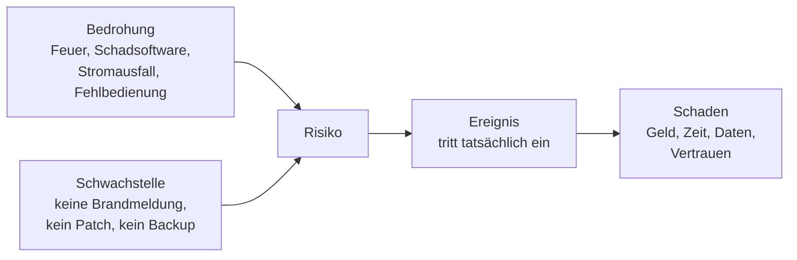
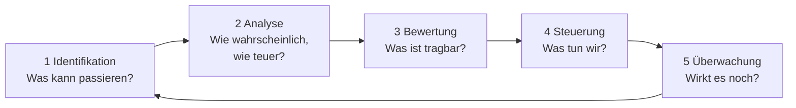

# Risikomanagement

<span class='badge badge-pruefung'>Prüfungsrelevant</span> &nbsp; Risiko ist kein Bauchgefühl, sondern eine **Rechnung**: Wie wahrscheinlich ist ein Schaden – und wie groß wäre er? Risikomanagement macht aus dieser Frage einen wiederholbaren Prozess.

Jeder Betrieb hat eine Liste von Dingen, die schiefgehen können – ausgesprochen oder nicht. Was fast keiner hat, ist eine **Reihenfolge**. Und die braucht es, weil kein Betrieb Geld, Zeit und Personal hat, um gegen alles gleichzeitig etwas zu tun. Genau diese Reihenfolge herzustellen ist die Aufgabe des Risikomanagements: Es macht aus einer Sammlung von Befürchtungen eine begründete Rangfolge – und aus der Rangfolge Entscheidungen, die man aufschreiben kann.

!!! abstract "Diese Seite ist der Kern"
    Sie enthält das, was du für eine Risikoanalyse wirklich brauchst – zugeschnitten auf eine gute halbe Stunde Vortrag. Alles Weitere – Risikoarten im Detail, Bedrohungsmodellierung, Schadenserwartungswert, FMEA, Migrationsrisiken und ein komplett durchgerechnetes Beispiel – steht auf der Seite [Risikomanagement: Vertiefung](risikomanagement-vertiefung.md). Für die Übungsaufgaben brauchst du beide Seiten; für den Einstieg reicht diese hier.

---

## Wer erst beim Ausfall rechnet, rechnet zu spät

Der ganze Aufwand dieses Kapitels lässt sich auf einen Satz eindampfen: **Ist der Ausfall erst eingetreten, ist der Schaden schon da.** Alles, was danach kommt – Notbetrieb, Wiederherstellung, Entschuldigungen an Kunden –, ist Schadensbegrenzung. Die einzige Phase, in der ein Risiko noch günstig zu haben ist, liegt **davor**. Deshalb muss es vorher erkannt, bewertet und gesteuert werden.

Das klingt banal, bis man sich ansieht, wie echte Ausfälle zustande kommen. Drei Muster, die sich in Berichten immer wieder finden:

!!! note "Ein Kurzschluss im Keller – und die Klinik arbeitet auf Papier"
    In einem Krankenhaus löst an einem Samstagabend ein Kurzschluss in der Stromverteilung des Serverraums einen Schwelbrand aus. Es brennt fast nichts, aber Rauch und Löschmittel machen den Raum unbenutzbar. Weil Patienteninformationssystem, OP-Planung und Labor-Anbindung in genau diesem einen Raum stehen, sind sie über Tage nicht erreichbar. Die Station arbeitet mit ausgedruckten Listen, Befunde werden telefonisch durchgegeben, planbare Eingriffe werden verschoben.

    **Ursache:** eine seit Jahren ungeprüfte Stromverteilung, dazu die gesamte kritische Technik in einem einzigen Raum. **Folge:** mehrere Tage Notbetrieb auf Papier, verschobene Eingriffe, Nacherfassung von Hand.

    Was vorher hätte auffallen können: Die Verteilung war jahrelang nicht geprüft worden, es gab keinen zweiten Brandabschnitt für die kritischen Systeme – und niemand hatte je durchgespielt, wie lange eine Station ohne diese Systeme tatsächlich arbeitsfähig bleibt. Jede dieser drei Feststellungen ist eine Frage, die man an einem ruhigen Dienstagvormittag hätte stellen können.

!!! note "Eine Konfigurationsänderung, die das eigene Werkzeug mitreißt"
    Bei einem großen Internetdienst wird eine Änderung an der Netzwerkkonfiguration zentral ausgerollt. Sie enthält einen Fehler und trennt die Rechenzentren praktisch vom Rest des Netzes. Der eigentliche Ärger beginnt erst danach: Die Werkzeuge, mit denen man den Fehler zurücknehmen könnte, hängen an derselben Infrastruktur. Auch die interne Kommunikation und die Zutrittssysteme sind betroffen, sodass die Leute, die den Schaden beheben sollen, weder miteinander reden noch in die richtigen Räume kommen.

    **Ursache:** eine fehlerhafte Änderung, die überall gleichzeitig wirkt, plus ein Notfallpfad über dieselbe Technik. **Folge:** stundenlanger Totalausfall, dessen Behebung sich selbst blockiert.

    Was vorher hätte auffallen können: Dass eine Änderung überall gleichzeitig wirkt, ist kein Zufall, sondern eine Bauentscheidung. Und dass der Notfallpfad über dieselbe Technik läuft wie der Normalbetrieb, ist eine Abhängigkeit, die man aufschreiben kann, lange bevor sie zuschlägt.

!!! note "Ein abgelaufenes Zertifikat legt zweihundert Arbeitsplätze still"
    Ein Mittelständler betreibt für das Home-Office ein VPN-Gateway. An einem Montagmorgen kommt niemand mehr ins Firmennetz: Das Zertifikat des Gateways ist am Wochenende abgelaufen. Die Erinnerungsmail des Ausstellers lag im Postfach eines Kollegen, der das Haus vor vier Monaten verlassen hat. Bis das neue Zertifikat beantragt, ausgestellt und eingespielt ist, vergeht ein halber Arbeitstag für rund zweihundert Beschäftigte.

    **Ursache:** ein bekannter Termin, für den nach einem Personalwechsel niemand mehr zuständig war. **Folge:** ein halber Tag ohne Zugriff für die gesamte Belegschaft im Home-Office.

    Was vorher hätte auffallen können: Ablaufdaten von Zertifikaten sind keine Überraschung, sondern bekannte Termine. Eine Liste mit Laufzeiten und eine Überwachung, die dreißig Tage vorher warnt, kosten fast nichts – sie müssen nur jemandem gehören.

Die drei Fälle sehen verschieden aus, folgen aber demselben Muster. Die Ursache war jedes Mal vorher vorhanden, sie war sogar mit einer einzigen nüchternen Frage sichtbar zu machen. Nur hat diese Frage niemand gestellt, weil es keinen Anlass gab: **Bis dahin ist das Risiko unsichtbar, weil alles funktioniert.**

Auffällig ist außerdem, dass in keinem der drei Fälle die Technik selbst das eigentliche Problem war. Eine Stromverteilung, eine Konfigurationsdatei und ein Zertifikat sind beherrschbare Dinge. Gefehlt hat jeweils etwas anderes: eine Prüfung, eine aufgeschriebene Abhängigkeit, eine Zuständigkeit. Genau daraus besteht Risikomanagement.

Es ist der organisierte Versuch, diese Fragen zu stellen, bevor die Realität sie stellt. Wer sie systematisch stellt, entscheidet selbst, welche Ausfälle er in Kauf nimmt. Wer sie nicht stellt, erfährt die Entscheidung hinterher aus der Rechnung.

---

## Die Begriffe sauber trennen

In Besprechungen werden „Gefahr“, „Schwachstelle“ und „Risiko“ gern synonym benutzt. Für eine Bewertung taugt das nicht, denn die drei Begriffe stehen an verschiedenen Stellen derselben Kette – und nur an einer davon kann man überhaupt etwas ändern.



Diese Kette hat einen Namen: Sie heißt **Risikosequenz**. Bedrohung und Schwachstelle treffen zusammen, daraus wird ein Risiko; tritt es ein, wird daraus ein Ereignis – und aus dem Ereignis folgt der Schaden. Der Begriff ist mehr als eine Vokabel – er sagt dir, an welcher Stelle du eingreifen kannst. Jede Maßnahme setzt an genau einem Glied dieser Kette an – welches das ist, entscheidet über ihre Wirkung.

Das Diagramm zeigt die entscheidende Stelle: **Ein Risiko entsteht erst, wenn Bedrohung und Schwachstelle zusammentreffen.** Eine Bedrohung allein bleibt folgenlos – Feuer bedroht jeden Serverraum der Welt; wo es eine Brandmeldeanlage, Löschtechnik und einen zweiten Standort gibt, bleibt das Risiko trotzdem klein. Eine Schwachstelle allein bleibt ebenfalls folgenlos: Ein ungepatchter Dienst auf einem Rechner ohne Netzanschluss und ohne Nutzer hat schlicht keine Bedrohung, die ihn erreicht. Das ist keine Wortklauberei, sondern der praktische Hebel: An der Bedrohung kannst du meistens nichts ändern, an der Schwachstelle fast immer.

| Begriff | Was er bedeutet | Beispiel |
|---|---|---|
| **Wert** (Asset) | das, was überhaupt schützenswert ist: Daten, Systeme, Prozesse, Ruf | die Fertigungssteuerung, ohne die keine Maschine läuft |
| **Gefahr / Bedrohung** | ein Ereignis oder Umstand, der einem Wert schaden kann – unabhängig davon, ob du verwundbar bist | Überhitzung, Schadsoftware, Ausfall eines Dienstleisters |
| **Schwachstelle** | eine Eigenschaft des eigenen Systems oder der Organisation, die eine Bedrohung wirksam werden lässt | Klimaanlage ohne Wartungsvertrag, kein Vier-Augen-Prinzip bei Änderungen |
| **Risiko** | die Möglichkeit, dass Bedrohung und Schwachstelle zusammenkommen, ausgedrückt als Wahrscheinlichkeit **und** Auswirkung | „Kühlung fällt aus, Fertigung steht“ – geschätzt mit 0,25 je Jahr und 48.000 Euro je Ereignis |
| **Eintrittswahrscheinlichkeit** | wie oft mit dem Ereignis in einem Zeitraum zu rechnen ist, meist bezogen auf ein Jahr | 0,25 je Jahr heißt: statistisch alle vier Jahre einmal |
| **Schadenshöhe** | wie teuer ein einzelnes Eintreten wäre, in Geld oder in Zeit | acht Stunden Stillstand, 48.000 Euro |
| **Schaden** | der tatsächlich eingetretene Verlust – aus dem Risiko ist Wirklichkeit geworden | die Rechnung nach dem Vorfall |

Ein Punkt aus dieser Tabelle wird im Alltag regelmäßig übersprungen: der **Wert**. Wer sofort mit Bedrohungen anfängt, sammelt Gefahren ohne Bezugsgröße. Erst wenn klar ist, was ein System für den Betrieb leistet, lässt sich sagen, was sein Ausfall kostet. Wie man den Schutzbedarf eines Werts bestimmt, steht weiter unten im Abschnitt [Schutzbedarf](#schutzbedarf-wie-viel-schutz-ist-genug); wie daraus eine Zahl in Euro und Stunden wird, im Abschnitt [Business Impact Analyse](#business-impact-analyse-wie-lange-darf-es-stillstehen).

!!! tip "Der Unterschied in einem Satz"
    Die **Bedrohung** kommt von außen auf dich zu, die **Schwachstelle** gehört dir. Deshalb steht in einer Maßnahme fast nie „Feuer verhindern“, sondern „Brandmeldeanlage installieren“ – gearbeitet wird immer an der eigenen Seite der Gleichung.

---

## Risiko = Eintrittswahrscheinlichkeit × Schadenshöhe

Damit Risiken vergleichbar werden, brauchen sie eine gemeinsame Größe. Die klassische Formel dafür ist denkbar schlicht:

```text
Risikowert  =  Eintrittswahrscheinlichkeit  x  Schadenshoehe
```

Das Ergebnis heißt **Erwartungswert**: der Betrag, den ein Risiko über die Jahre gerechnet im Durchschnitt kostet. Er ist keine Vorhersage für das nächste Jahr, sondern eine Umrechnung – sie macht ein seltenes, teures Ereignis mit einem häufigen, billigen vergleichbar.

Rechnen wir das an der **Feinwerk Präzisionstechnik GmbH** durch, einem Maschinenbauer mit 180 Beschäftigten, zwei Standorten und einem eigenen kleinen Rechenzentrum im Keller. Dort steht die Fertigungssteuerung. Zuerst die Schadenshöhe für ein einzelnes Ereignis:

```text
Ausfall der Fertigungssteuerung, angenommene Dauer 8 Stunden

  Stillstand Fertigung         60 Personen x 45 EUR/h x 8 h  =  21.600 EUR
  entgangener Deckungsbeitrag  1.800 EUR/h x 8 h             =  14.400 EUR
  Wiederanlauf und Nacharbeit (Pauschale)                    =   9.000 EUR
  externe Unterstuetzung Klimatechnik (Notdienst)            =   3.000 EUR
                                                                ----------
  Schadenshoehe je Ereignis                                  =  48.000 EUR
```

Zwei Dinge an dieser Aufstellung sind wichtiger als das Ergebnis. Erstens taucht der Personalaufwand scheinbar doppelt auf, tatsächlich aber aus zwei verschiedenen Gründen: Die 60 Beschäftigten werden bezahlt, obwohl sie nicht produzieren können – diese Kosten fallen trotzdem an. Der Deckungsbeitrag ist dagegen das Geld, das der Betrieb in diesen acht Stunden nicht verdient. Beides ist real, beides gehört hinein. Zweitens steht in jeder Zeile eine Annahme, der jemand widersprechen können muss; darauf kommen wir gleich zurück.

Die Eintrittswahrscheinlichkeit schätzt der Betrieb auf **0,25 je Jahr**. Die Grundlage: Die Klimaanlage ist alt, in den letzten zwölf Jahren gab es drei kritische Temperaturereignisse – drei Ereignisse in zwölf Jahren ergeben rechnerisch 0,25 je Jahr. Daraus folgt:

```text
Erwartungswert  =  0,25 je Jahr  x  48.000 EUR  =  12.000 EUR je Jahr
```

Diese eine Zahl macht die Diskussion erst führbar. Ein Wartungsvertrag für die Klimaanlage kostet 4.000 Euro im Jahr und senkt die Eintrittswahrscheinlichkeit nach Einschätzung des Anbieters auf 0,05. Der Erwartungswert sinkt damit auf **2.400 Euro je Jahr**, das sind 9.600 Euro weniger als vorher – bei 4.000 Euro Aufwand.

!!! warning "Wartung senkt die Wahrscheinlichkeit, Überwachung senkt sie nicht"
    Zum selben Angebot gehört eine Temperaturüberwachung mit Alarm. Die ist sinnvoll, wirkt aber an einer anderen Stelle: **Monitoring erkennt, es verhindert nicht.** Ein Alarm macht den Kühlungsausfall nicht unwahrscheinlicher – er verkürzt die Zeit bis zur Reaktion und damit die Ausfalldauer. Sein Beitrag steckt also in der **Schadenshöhe**, nicht in der Eintrittswahrscheinlichkeit. In der Rechnung oben ist er bewusst nicht enthalten; die 0,05 stammen allein aus der regelmäßigen Wartung. Wer beide Effekte in denselben Faktor packt, rechnet sich die Maßnahme schön.

Was man mit dieser Rechnung anstellt, gehört zur Steuerung weiter hinten; hier zählt nur, dass aus „wäre wohl sinnvoll“ ein Vergleich zweier Zahlen geworden ist.

??? tip "Dieselbe Formel in englischsprachigen Quellen"
    Herstellerdokumentation und Normtexte verwenden für genau diese Rechnung oft drei Abkürzungen: **SLE** (Single Loss Expectancy) ist die Schadenshöhe je Ereignis, **ARO** (Annual Rate of Occurrence) die erwartete Anzahl Ereignisse pro Jahr, **ALE** (Annualized Loss Expectancy) das Produkt aus beidem. ALE = ARO × SLE ist also dieselbe Formel in anderer Schreibweise: 0,25 × 48.000 EUR = 12.000 EUR je Jahr.

---

## Der Prozess: ein Kreislauf, kein Projekt

Risikomanagement ist eine Abfolge von fünf Schritten, die immer in derselben Reihenfolge durchlaufen werden – und danach wieder von vorn.



| Schritt | Leitfrage | Ergebnis |
|---|---|---|
| **1 Identifikation** | Was kann bei uns schiefgehen – und warum? | eine Liste benannter Risiken, jedes als vollständiger Satz formuliert |
| **2 Analyse** | Wie wahrscheinlich ist das, wie groß wäre der Schaden? | je Risiko zwei Schätzwerte samt der Annahmen, auf denen sie beruhen |
| **3 Bewertung** | Welche Risiken sind tragbar, welche nicht? | eine Rangfolge und eine Grenze, ab der gehandelt werden muss |
| **4 Steuerung** | Was tun wir konkret, wer macht es bis wann? | je Risiko eine Strategie, eine Maßnahme, ein Name, ein Termin |
| **5 Überwachung** | Wirkt die Maßnahme, hat sich das Risiko verändert? | aktualisierte Bewertungen, neu aufgenommene Risiken, geschlossene Punkte |

Der Pfeil von Schritt 5 zurück zu Schritt 1 ist der wichtigste im ganzen Diagramm. **Risikomanagement ist ein Kreislauf, kein Projekt mit Abschlussbericht.** Der Grund ist unspektakulär: Die Voraussetzungen ändern sich dauernd. Ein neuer Standort kommt dazu, ein Dienst zieht in die Cloud, ein Anbieter ändert seine Lizenzbedingungen, eine Schlüsselperson geht in Rente, eine Schwachstelle wird veröffentlicht. Jedes dieser Ereignisse verschiebt Wahrscheinlichkeiten oder Schadenshöhen, ohne dass jemand einen Termin dafür eingetragen hätte.

In der Praxis hat der Kreislauf deshalb zwei Taktgeber. Der eine ist der **Kalender**: einmal im Jahr eine vollständige Runde, quartalsweise ein kurzer Blick auf die obersten Einträge. Der andere sind **Auslöser** – ein Vorfall, ein größerer Umbau, ein neues System, ein Wechsel beim Dienstleister. Wer nur den Kalender hat, bewertet ein Jahr lang eine Infrastruktur, die es so nicht mehr gibt.

Die Schritte 1 bis 3 wirken auf den ersten Blick wie einer, sie liefern aber verschiedene Ergebnisse. Die **Identifikation** sammelt, ohne zu werten. Die **Analyse** hängt Zahlen an die gesammelten Einträge. Die **Bewertung** vergleicht diese Zahlen mit dem, was der Betrieb tragen will – erst dort fällt die Entscheidung, ob überhaupt etwas passiert. Wer die drei Schritte zusammenzieht, diskutiert schon beim Sammeln über Maßnahmen; am Ende steht dann eine kurze Liste bekannter Probleme statt eines Überblicks.

!!! tip "Der Prozess läuft nicht nur in der Sicherheit"
    Dieselben fünf Schritte findest du im Projektmanagement wieder, wenn dort über Projektrisiken gesprochen wird – ebenso in der Planung, sobald es um Ressourcen- und Terminrisiken geht. Die Methode ist identisch, nur die Risiken sind andere – siehe [Projektmanagement](../projektmanagement/index.md) und [Ressourcen planen](../infrastruktur-planung/ressourcen-planen.md). Wer sie einmal beherrscht, wendet sie überall an.

---

## Das Risikoregister: der Ort, an dem Risiken wohnen

Alles, was gefunden wird, muss irgendwo stehen – sonst ist es nach dem Workshop wieder weg. Dieser Ort heißt **Risikoregister** (auch Risikoinventar oder schlicht Risikoliste): eine gepflegte Tabelle, in der jedes Risiko eine eigene Zeile mit einer eigenen Nummer bekommt. Sie ist zugleich Arbeitsmittel und Nachweis. Kommt es zum Vorfall, ist die entscheidende Frage nämlich nicht, ob man ihn verhindert hat, sondern ob man ihn **gekannt und bewusst entschieden** hat.

| Spalte | Was hineingehört |
|---|---|
| **ID** | eindeutige Nummer, etwa R-01 – damit in Protokollen und Maßnahmenlisten dasselbe gemeint ist |
| **Beschreibung** | das Risiko als vollständiger Ursache-Ereignis-Folge-Satz, nicht als Stichwort |
| **Kategorie** | technisch, organisatorisch, rechtlich, wirtschaftlich, personell, extern |
| **Eintrittswahrscheinlichkeit** | geschätzt, mit Zeit- oder Anlassbezug – als Prozentwert oder als Klasse |
| **Schadenshöhe** | geschätzt, in Euro oder in Zeit, mit der Annahme dahinter |
| **Bewertung** | das Ergebnis aus beidem: Erwartungswert oder Feld in der Risikomatrix |
| **Strategie** | wie mit dem Risiko umgegangen wird – vermeiden, reduzieren, übertragen, akzeptieren |
| **Maßnahme** | was konkret getan wird, in einem Satz, den ein Außenstehender versteht |
| **Verantwortlich** | eine **Person**, keine Abteilung – Rollen erledigen keine Aufgaben |
| **Termin** | bis wann die Maßnahme umgesetzt ist, nicht „zeitnah“ |
| **Status** | offen, in Umsetzung, umgesetzt, akzeptiert – und wer das wann festgestellt hat |

Zwei dieser Spalten haben eine unauffällige Sprengkraft. **Verantwortlich** ist der Punkt, an dem sich ein Register vom Wunschzettel unterscheidet: Solange dort „IT“ steht, ist niemand zuständig. Und **Status** verhindert die häufigste Form von Selbstbetrug, nämlich eine Liste voller sinnvoller Maßnahmen, von denen keine je umgesetzt wurde.

### Der Ursache-Ereignis-Folge-Satz

Die wichtigste handwerkliche Fertigkeit an dieser Stelle ist die Formulierung der Beschreibung. **Ein Risiko ist kein Substantiv, sondern ein Satz.** „Serverausfall“ ist eine Überschrift, kein Risiko: Man kann daraus weder eine Maßnahme ableiten noch eine Schadenshöhe schätzen – und drei Personen verstehen drei verschiedene Dinge darunter. Ein brauchbarer Eintrag hat immer drei Teile:

- die **Ursache** – warum das Ereignis eintreten kann. Hier greift später die Maßnahme an.
- das **Ereignis** – was tatsächlich passiert. Das ist der Punkt, für den die Wahrscheinlichkeit geschätzt wird.
- die **Folge** – was das für den Betrieb bedeutet. Daraus ergibt sich die Schadenshöhe.

Als Schablone: **„Weil URSACHE, kann EREIGNIS eintreten, wodurch FOLGE.“**

| So nicht | So besser |
|---|---|
| Serverausfall | Weil die Klimaanlage im Serverraum seit zwei Jahren nicht gewartet wurde, kann die Kühlung ausfallen, wodurch die Server wegen Übertemperatur abschalten und die Fertigung stillsteht. |
| Datenschutz | Weil Testsysteme mit einer Kopie der Echtdaten befüllt werden, können personenbezogene Daten in einer ungeschützten Umgebung liegen, wodurch ein Datenschutzverstoß entsteht, der je nach Sachverhalt auch meldepflichtig ist. |
| Migrationsrisiko | Weil für die Übernahme der Stammdaten kein Rückweg beschrieben ist, kann ein Abbruch mitten in der Umstellung nicht rückgängig gemacht werden, wodurch die Fertigung mit unvollständigen Stücklisten weiterarbeitet. |
| Personalrisiko | Weil die Konfiguration der Fertigungssteuerung nur einer Person bekannt und nirgends dokumentiert ist, kann bei deren Ausfall keine Änderung vorgenommen werden, wodurch Störungen Tage statt Stunden dauern. |

Achte auf den Unterschied zwischen Ursache und Ereignis: Die Ursache ist ein Zustand, der schon jetzt besteht – „nicht gewartet“, „nicht dokumentiert“, „kein Rückweg beschrieben“. Das Ereignis ist etwas, das erst noch passieren kann: „Kühlung fällt aus“. Genau deshalb greift die Maßnahme immer an der Ursache an, nie am Ereignis. Gegen „Kühlung fällt aus“ lässt sich nichts unternehmen, gegen „seit zwei Jahren nicht gewartet“ sehr wohl.

Die Schablone hat einen Nebeneffekt, der fast wertvoller ist als das Ergebnis: **Wenn du einen der drei Teile nicht ausfüllen kannst, hast du schon etwas gefunden.** Fehlt die Ursache, weißt du nicht, wogegen du eine Maßnahme richten sollst. Fehlt die Folge, kannst du das Risiko nicht bewerten – und meistens stellt sich heraus, dass niemand weiß, welche Prozesse an dem System eigentlich hängen. Wer das nicht beantworten kann, hat kein Formulierungsproblem, sondern eine Lücke in der Dokumentation.

!!! warning "Zwei Fehler, die in Aufgaben regelmäßig auftauchen"
    Der erste: Die **Folge** wiederholt nur das Ereignis. „…, kann der Server ausfallen, wodurch der Server nicht verfügbar ist“ sagt nichts über den Betrieb aus. Die Folge muss den Sprung in die Fachwelt schaffen – Stillstand, Lieferverzug, Datenverlust, Meldepflicht.

    Der zweite: Die **Ursache** ist bereits die fehlende Maßnahme. „Weil es kein Backup gibt“ klingt richtig, verengt die Lösung aber auf genau eine Antwort. Formuliere die Ursache eine Ebene tiefer – „weil für die Fertigungsdatenbank kein Sicherungslauf eingerichtet ist“ –, dann bleibt offen, ob Sicherung, Replikation oder ein anderer Weg die passende Maßnahme ist.

---

## Die Risikomatrix: das Bild, auf das sich alle einigen können

Zwei Skalen mit je fünf Stufen ergeben fünfundzwanzig Kombinationen. Die **Risikomatrix** macht daraus ein Bild: Auf der einen Achse steht die Eintrittswahrscheinlichkeit, auf der anderen die Schadenshöhe – jedes Risiko bekommt seinen Platz im Raster, jedes Feld eine Farbe.

<figure>
<svg viewBox="0 0 720 470" width="100%" height="470" role="img" aria-label="Eine Risikomatrix als Raster aus fünf mal fünf Feldern. Auf der waagerechten Achse steht die Eintrittswahrscheinlichkeit von 1 bis 5, auf der senkrechten Achse die Schadenshöhe von 1 unten bis 5 oben. In jedem Feld steht das Produkt der beiden Werte. Felder mit einem Produkt bis 4 sind grün und gelten als geringes Risiko, Felder von 5 bis 9 sind bernsteinfarben und gelten als mittleres Risiko, Felder von 10 bis 15 sind rot und gelten als hohes Risiko, Felder ab 16 sind kräftig rot und gelten als kritisch. Vier Beispielrisiken sind als Punkte eingetragen: R1 Ransomware bei Wahrscheinlichkeit 3 und Schaden 5, R2 Ausfall der Klimatisierung bei 3 und 3, R3 Defekt eines CAD-Arbeitsplatzes bei 5 und 1, R4 Wassereinbruch im Kellerrechenzentrum bei 1 und 5. Drei Felder sind gestrichelt umrandet: Schaden 5 bei Wahrscheinlichkeit 1 sowie Schaden 4 bei Wahrscheinlichkeit 1 und 2. Für sie gilt eine Sonderregel, die sie auf die Klasse hoch anhebt.">
  <text transform="rotate(-90 26 196)" x="26" y="196" text-anchor="middle" fill="#e2ece6" font-family="system-ui, sans-serif" font-size="12">Schadenshöhe 1 (unbedeutend) bis 5 (existenzbedrohend)</text>
  <!-- Zeile Schaden 5 -->
  <rect x="110" y="46" width="84" height="60" fill="rgba(224,179,92,0.16)" stroke="#e0b35c" stroke-width="1"/>
  <text x="118" y="63" fill="#8fa498" font-family="system-ui, sans-serif" font-size="11">5</text>
  <rect x="194" y="46" width="84" height="60" fill="rgba(224,108,108,0.20)" stroke="#e06c6c" stroke-width="1"/>
  <text x="202" y="63" fill="#8fa498" font-family="system-ui, sans-serif" font-size="11">10</text>
  <rect x="278" y="46" width="84" height="60" fill="rgba(224,108,108,0.20)" stroke="#e06c6c" stroke-width="1"/>
  <text x="286" y="63" fill="#8fa498" font-family="system-ui, sans-serif" font-size="11">15</text>
  <rect x="362" y="46" width="84" height="60" fill="rgba(224,108,108,0.42)" stroke="#e06c6c" stroke-width="1"/>
  <text x="370" y="63" fill="#e2ece6" font-family="system-ui, sans-serif" font-size="11">20</text>
  <rect x="446" y="46" width="84" height="60" fill="rgba(224,108,108,0.42)" stroke="#e06c6c" stroke-width="1"/>
  <text x="454" y="63" fill="#e2ece6" font-family="system-ui, sans-serif" font-size="11">25</text>
  <!-- Zeile Schaden 4 -->
  <rect x="110" y="106" width="84" height="60" fill="rgba(125,255,154,0.13)" stroke="#56c374" stroke-width="1"/>
  <text x="118" y="123" fill="#8fa498" font-family="system-ui, sans-serif" font-size="11">4</text>
  <rect x="194" y="106" width="84" height="60" fill="rgba(224,179,92,0.16)" stroke="#e0b35c" stroke-width="1"/>
  <text x="202" y="123" fill="#8fa498" font-family="system-ui, sans-serif" font-size="11">8</text>
  <rect x="278" y="106" width="84" height="60" fill="rgba(224,108,108,0.20)" stroke="#e06c6c" stroke-width="1"/>
  <text x="286" y="123" fill="#8fa498" font-family="system-ui, sans-serif" font-size="11">12</text>
  <rect x="362" y="106" width="84" height="60" fill="rgba(224,108,108,0.42)" stroke="#e06c6c" stroke-width="1"/>
  <text x="370" y="123" fill="#e2ece6" font-family="system-ui, sans-serif" font-size="11">16</text>
  <rect x="446" y="106" width="84" height="60" fill="rgba(224,108,108,0.42)" stroke="#e06c6c" stroke-width="1"/>
  <text x="454" y="123" fill="#e2ece6" font-family="system-ui, sans-serif" font-size="11">20</text>
  <!-- Zeile Schaden 3 -->
  <rect x="110" y="166" width="84" height="60" fill="rgba(125,255,154,0.13)" stroke="#56c374" stroke-width="1"/>
  <text x="118" y="183" fill="#8fa498" font-family="system-ui, sans-serif" font-size="11">3</text>
  <rect x="194" y="166" width="84" height="60" fill="rgba(224,179,92,0.16)" stroke="#e0b35c" stroke-width="1"/>
  <text x="202" y="183" fill="#8fa498" font-family="system-ui, sans-serif" font-size="11">6</text>
  <rect x="278" y="166" width="84" height="60" fill="rgba(224,179,92,0.16)" stroke="#e0b35c" stroke-width="1"/>
  <text x="286" y="183" fill="#8fa498" font-family="system-ui, sans-serif" font-size="11">9</text>
  <rect x="362" y="166" width="84" height="60" fill="rgba(224,108,108,0.20)" stroke="#e06c6c" stroke-width="1"/>
  <text x="370" y="183" fill="#8fa498" font-family="system-ui, sans-serif" font-size="11">12</text>
  <rect x="446" y="166" width="84" height="60" fill="rgba(224,108,108,0.20)" stroke="#e06c6c" stroke-width="1"/>
  <text x="454" y="183" fill="#8fa498" font-family="system-ui, sans-serif" font-size="11">15</text>
  <!-- Zeile Schaden 2 -->
  <rect x="110" y="226" width="84" height="60" fill="rgba(125,255,154,0.13)" stroke="#56c374" stroke-width="1"/>
  <text x="118" y="243" fill="#8fa498" font-family="system-ui, sans-serif" font-size="11">2</text>
  <rect x="194" y="226" width="84" height="60" fill="rgba(125,255,154,0.13)" stroke="#56c374" stroke-width="1"/>
  <text x="202" y="243" fill="#8fa498" font-family="system-ui, sans-serif" font-size="11">4</text>
  <rect x="278" y="226" width="84" height="60" fill="rgba(224,179,92,0.16)" stroke="#e0b35c" stroke-width="1"/>
  <text x="286" y="243" fill="#8fa498" font-family="system-ui, sans-serif" font-size="11">6</text>
  <rect x="362" y="226" width="84" height="60" fill="rgba(224,179,92,0.16)" stroke="#e0b35c" stroke-width="1"/>
  <text x="370" y="243" fill="#8fa498" font-family="system-ui, sans-serif" font-size="11">8</text>
  <rect x="446" y="226" width="84" height="60" fill="rgba(224,108,108,0.20)" stroke="#e06c6c" stroke-width="1"/>
  <text x="454" y="243" fill="#8fa498" font-family="system-ui, sans-serif" font-size="11">10</text>
  <!-- Zeile Schaden 1 -->
  <rect x="110" y="286" width="84" height="60" fill="rgba(125,255,154,0.13)" stroke="#56c374" stroke-width="1"/>
  <text x="118" y="303" fill="#8fa498" font-family="system-ui, sans-serif" font-size="11">1</text>
  <rect x="194" y="286" width="84" height="60" fill="rgba(125,255,154,0.13)" stroke="#56c374" stroke-width="1"/>
  <text x="202" y="303" fill="#8fa498" font-family="system-ui, sans-serif" font-size="11">2</text>
  <rect x="278" y="286" width="84" height="60" fill="rgba(125,255,154,0.13)" stroke="#56c374" stroke-width="1"/>
  <text x="286" y="303" fill="#8fa498" font-family="system-ui, sans-serif" font-size="11">3</text>
  <rect x="362" y="286" width="84" height="60" fill="rgba(125,255,154,0.13)" stroke="#56c374" stroke-width="1"/>
  <text x="370" y="303" fill="#8fa498" font-family="system-ui, sans-serif" font-size="11">4</text>
  <rect x="446" y="286" width="84" height="60" fill="rgba(224,179,92,0.16)" stroke="#e0b35c" stroke-width="1"/>
  <text x="454" y="303" fill="#8fa498" font-family="system-ui, sans-serif" font-size="11">5</text>
  <!-- Sonderregel: die drei Felder mit Schadensklasse 4 oder 5, die sonst unter "hoch" blieben -->
  <rect x="110" y="46" width="84" height="60" fill="none" stroke="#e06c6c" stroke-width="2" stroke-dasharray="5 4"/>
  <rect x="110" y="106" width="84" height="60" fill="none" stroke="#e06c6c" stroke-width="2" stroke-dasharray="5 4"/>
  <rect x="194" y="106" width="84" height="60" fill="none" stroke="#e06c6c" stroke-width="2" stroke-dasharray="5 4"/>
  <!-- Achsenbeschriftung senkrecht -->
  <text x="98" y="80" text-anchor="end" fill="#e2ece6" font-family="system-ui, sans-serif" font-size="13">5</text>
  <text x="98" y="140" text-anchor="end" fill="#e2ece6" font-family="system-ui, sans-serif" font-size="13">4</text>
  <text x="98" y="200" text-anchor="end" fill="#e2ece6" font-family="system-ui, sans-serif" font-size="13">3</text>
  <text x="98" y="260" text-anchor="end" fill="#e2ece6" font-family="system-ui, sans-serif" font-size="13">2</text>
  <text x="98" y="320" text-anchor="end" fill="#e2ece6" font-family="system-ui, sans-serif" font-size="13">1</text>
  <!-- Achsenbeschriftung waagerecht -->
  <text x="152" y="366" text-anchor="middle" fill="#e2ece6" font-family="system-ui, sans-serif" font-size="13">1</text>
  <text x="236" y="366" text-anchor="middle" fill="#e2ece6" font-family="system-ui, sans-serif" font-size="13">2</text>
  <text x="320" y="366" text-anchor="middle" fill="#e2ece6" font-family="system-ui, sans-serif" font-size="13">3</text>
  <text x="404" y="366" text-anchor="middle" fill="#e2ece6" font-family="system-ui, sans-serif" font-size="13">4</text>
  <text x="488" y="366" text-anchor="middle" fill="#e2ece6" font-family="system-ui, sans-serif" font-size="13">5</text>
  <text x="320" y="392" text-anchor="middle" fill="#e2ece6" font-family="system-ui, sans-serif" font-size="12">Eintrittswahrscheinlichkeit 1 (sehr selten) bis 5 (häufig)</text>
  <!-- Beispielrisiken -->
  <circle cx="320" cy="76" r="14" fill="#0e1013" stroke="#7dff9a" stroke-width="2"/>
  <text x="320" y="81" text-anchor="middle" fill="#7dff9a" font-family="system-ui, sans-serif" font-size="12" font-weight="700">R1</text>
  <circle cx="320" cy="196" r="14" fill="#0e1013" stroke="#7dff9a" stroke-width="2"/>
  <text x="320" y="201" text-anchor="middle" fill="#7dff9a" font-family="system-ui, sans-serif" font-size="12" font-weight="700">R2</text>
  <circle cx="488" cy="316" r="14" fill="#0e1013" stroke="#7dff9a" stroke-width="2"/>
  <text x="488" y="321" text-anchor="middle" fill="#7dff9a" font-family="system-ui, sans-serif" font-size="12" font-weight="700">R3</text>
  <circle cx="152" cy="76" r="14" fill="#0e1013" stroke="#7dff9a" stroke-width="2"/>
  <text x="152" y="81" text-anchor="middle" fill="#7dff9a" font-family="system-ui, sans-serif" font-size="12" font-weight="700">R4</text>
  <!-- Legende Risikoklassen -->
  <text x="548" y="58" fill="#8fa498" font-family="system-ui, sans-serif" font-size="12">Risikoklasse</text>
  <rect x="548" y="72" width="14" height="14" fill="rgba(125,255,154,0.13)" stroke="#56c374" stroke-width="1"/>
  <text x="570" y="84" fill="#e2ece6" font-family="system-ui, sans-serif" font-size="12">gering (1–4)</text>
  <rect x="548" y="100" width="14" height="14" fill="rgba(224,179,92,0.16)" stroke="#e0b35c" stroke-width="1"/>
  <text x="570" y="112" fill="#e2ece6" font-family="system-ui, sans-serif" font-size="12">mittel (5–9)</text>
  <rect x="548" y="128" width="14" height="14" fill="rgba(224,108,108,0.20)" stroke="#e06c6c" stroke-width="1"/>
  <text x="570" y="140" fill="#e2ece6" font-family="system-ui, sans-serif" font-size="12">hoch (10–15)</text>
  <rect x="548" y="156" width="14" height="14" fill="rgba(224,108,108,0.42)" stroke="#e06c6c" stroke-width="1"/>
  <text x="570" y="168" fill="#e2ece6" font-family="system-ui, sans-serif" font-size="12">kritisch (16–25)</text>
  <rect x="548" y="184" width="14" height="14" fill="none" stroke="#e06c6c" stroke-width="2" stroke-dasharray="4 3"/>
  <text x="570" y="196" fill="#e2ece6" font-family="system-ui, sans-serif" font-size="12">Sonderregel</text>
  <!-- Legende Beispielrisiken -->
  <text x="110" y="422" fill="#e2ece6" font-family="system-ui, sans-serif" font-size="12"><tspan fill="#7dff9a" font-weight="700">R1</tspan> Ransomware-Befall (3 × 5 = 15)</text>
  <text x="400" y="422" fill="#e2ece6" font-family="system-ui, sans-serif" font-size="12"><tspan fill="#7dff9a" font-weight="700">R2</tspan> Klimaausfall Serverraum (3 × 3 = 9)</text>
  <text x="110" y="446" fill="#e2ece6" font-family="system-ui, sans-serif" font-size="12"><tspan fill="#7dff9a" font-weight="700">R3</tspan> Defekt CAD-Arbeitsplatz (5 × 1 = 5)</text>
  <text x="400" y="446" fill="#e2ece6" font-family="system-ui, sans-serif" font-size="12"><tspan fill="#7dff9a" font-weight="700">R4</tspan> Wassereinbruch Keller-RZ (1 × 5 = 5)</text>
</svg>
<figcaption>Die Risikomatrix der Feinwerk Präzisionstechnik GmbH. Die Zahl in jedem Feld ist das Produkt aus Wahrscheinlichkeit und Schadenshöhe, die Farbe die daraus abgeleitete Klasse. R3 und R4 stehen auf derselben Zahl – trotzdem sind es grundverschiedene Probleme.</figcaption>
</figure>

Die Klasse ist aus dem Produkt ablesbar gemacht: Wahrscheinlichkeit mal Schadenshöhe ergibt eine Zahl zwischen 1 und 25. Für diese Zahl legt der Betrieb einmalig Schwellen fest – hier 1 bis 4 gering, 5 bis 9 mittel, 10 bis 15 hoch, ab 16 kritisch. Diese Schwellen sind eine Festlegung, keine Naturkonstante. Ein Betrieb mit hoher Risikotragfähigkeit setzt sie höher, ein Krankenhaus setzt sie niedriger. Wichtig ist nur, dass sie **vor** der Bewertung feststehen – sonst verschiebt man sie hinterher genau so weit, bis das Wunschergebnis herauskommt.

Der Nutzen der Matrix liegt weniger im Ergebnis als im Gespräch davor. Solange zwei Leute darüber streiten, ob etwas „gefährlich“ ist, reden sie über Gefühle. Sobald sie darüber streiten, ob die Wahrscheinlichkeit eine 3 oder eine 4 ist, reden sie über Häufigkeiten – und das ist eine Frage, die man klären kann. Die Matrix hebt das Gespräch von „gefährlich oder ungefährlich“ auf **„wahrscheinlich mal teuer“**.

### Warum die Diagonale trügt

Jetzt zur wichtigsten Einschränkung. Wirf einen Blick auf R3 und R4 im Bild: Beide stehen auf der Zahl 5.

- **R3 – Defekt eines CAD-Arbeitsplatzes.** Wahrscheinlichkeit 5, Schaden 1. Das passiert mehrmals im Jahr, kostet ein paar tausend Euro und ist mit einem Ersatzgerät aus dem Schrank in zwei Stunden erledigt.
- **R4 – Wassereinbruch im Kellerrechenzentrum.** Wahrscheinlichkeit 1, Schaden 5. Das ist noch nie passiert, würde aber die gesamte Serverlandschaft auf einmal treffen.

Dieselbe Kennzahl, zwei völlig verschiedene Probleme. R3 ist streng genommen kein Risiko, sondern ein **Kostenposten**: Es tritt planbar ein, man kann es budgetieren und mit Ersatzgeräten abfedern. R4 tritt vielleicht nie ein – wenn doch, ist es kein Kostenposten mehr, sondern eine Existenzfrage.

Die Rechnung macht den Unterschied noch deutlicher. Setzt man R3 mit fünf Ereignissen je Jahr zu je 3.000 Euro an und R4 mit einem Ereignis alle zwanzig Jahre zu 800.000 Euro, sieht das so aus:

```text
R3  CAD-Arbeitsplatz     5,00 Ereignisse je Jahr x   3.000 EUR  =  15.000 EUR je Jahr
R4  Wassereinbruch       0,05 Ereignisse je Jahr x 800.000 EUR  =  40.000 EUR je Jahr
```

Die Matrix sagt „gleich“, die Rechnung sagt „R4 ist deutlich teurer“ – 40.000 gegen 15.000 Euro, ein Verhältnis von rund 2,7 zu 1. Der Grund liegt in der Skala selbst: Stufe 1 deckt Schäden bis 5.000 Euro ab, Stufe 5 alles über 500.000 Euro – nach oben offen. Zwischen der obersten und der untersten Stufe liegt nicht der Faktor fünf, den die Zahlen 1 und 5 suggerieren, sondern ein Faktor von hundert und mehr. **Ein Produkt aus zwei Klassen ist eine Sortierhilfe, kein Urteil.**

!!! danger "Selten und existenzbedrohend gehört nach oben, nicht nach hinten"
    Risiken mit sehr kleiner Wahrscheinlichkeit und existenzbedrohendem Schaden landen in der Matrix rechnerisch in der Klasse „mittel“ – und genau deshalb fallen sie in der Praxis so oft hinten runter. Sie sind nie passiert, sie fühlen sich unwirklich an, die Maßnahme dagegen ist teuer.

    Die Klassenzahl glättet sie weg, weil sie zwei ungleich gedehnte Skalen miteinander multipliziert. Und selbst der Erwartungswert, der die Sache wie oben bei R4 immerhin sichtbar macht, hilft nur begrenzt weiter: Er ist ein Mittelwert über viele Jahre. Ein Betrieb erlebt aber keine hundert Jahre. Er erlebt entweder null Wassereinbrüche oder einen – und im zweiten Fall hilft ihm die Auskunft nicht, dass so etwas im Mittel selten vorkommt.

    Deshalb hat fast jede brauchbare Risikomatrix eine Sonderregel: **Alles mit Schadensklasse 4 oder 5 wird mindestens als „hoch“ behandelt, unabhängig von der Wahrscheinlichkeit.** Im Bild oben sind das die drei gestrichelt umrandeten Felder – alle übrigen Felder mit Schadensklasse 4 oder 5 liegen ohnehin schon bei „hoch“ oder darüber. Akzeptieren darf ein solches Risiko dann nur noch die Geschäftsführung, schriftlich, mit Begründung. Bis dahin bleibt es unsichtbar, weil ja alles funktioniert.

---

## Schritt 4: steuern – vier Strategien, mehr gibt es nicht

Bis hierhin hast du ein sortiertes Bild: Was kann passieren, wie wahrscheinlich ist es, was würde es kosten, welche Risiken sind die dringendsten. Nur ändert das an der Lage noch gar nichts. Eine Risikobewertung, die zu keiner Entscheidung führt, ist kein Sicherheitsinstrument, sondern ein Textdokument.

Der Schritt, der aus der Bewertung eine Entscheidung macht, heißt **Risikosteuerung**. Für jedes bewertete Risiko gibt es genau vier Grundentscheidungen – eine fünfte gibt es nicht:

<figure>
<svg viewBox="0 0 720 430" width="100%" height="430" role="img" aria-label="Ein Quadrantenbild mit der Eintrittswahrscheinlichkeit auf der waagerechten und der Schadenshöhe auf der senkrechten Achse. Unten links, bei geringer Wahrscheinlichkeit und geringem Schaden, steht Akzeptieren. Unten rechts, bei hoher Wahrscheinlichkeit und geringem Schaden, steht Vermindern. Oben links, bei geringer Wahrscheinlichkeit und hohem Schaden, steht Übertragen. Oben rechts, bei hoher Wahrscheinlichkeit und hohem Schaden, steht Vermeiden.">
  <rect x="120" y="40" width="270" height="145" rx="5" fill="rgba(122,162,255,0.10)" stroke="#7aa2ff" stroke-width="2"/>
  <rect x="390" y="40" width="270" height="145" rx="5" fill="rgba(224,108,108,0.12)" stroke="#e06c6c" stroke-width="2"/>
  <rect x="120" y="185" width="270" height="145" rx="5" fill="rgba(125,255,154,0.10)" stroke="#56c374" stroke-width="2"/>
  <rect x="390" y="185" width="270" height="145" rx="5" fill="rgba(224,179,92,0.12)" stroke="#e0b35c" stroke-width="2"/>
  <text x="255" y="84" text-anchor="middle" fill="#7aa2ff" font-family="system-ui, sans-serif" font-size="17" font-weight="700">ÜBERTRAGEN</text>
  <text x="255" y="112" text-anchor="middle" fill="#e2ece6" font-family="system-ui, sans-serif" font-size="13">selten, aber sehr teuer</text>
  <text x="255" y="138" text-anchor="middle" fill="#8fa498" font-family="system-ui, sans-serif" font-size="12">Versicherung, Dienstleister</text>
  <text x="255" y="158" text-anchor="middle" fill="#8fa498" font-family="system-ui, sans-serif" font-size="12">mit vertraglicher Haftung</text>
  <text x="525" y="84" text-anchor="middle" fill="#e06c6c" font-family="system-ui, sans-serif" font-size="17" font-weight="700">VERMEIDEN</text>
  <text x="525" y="112" text-anchor="middle" fill="#e2ece6" font-family="system-ui, sans-serif" font-size="13">wahrscheinlich und teuer</text>
  <text x="525" y="138" text-anchor="middle" fill="#8fa498" font-family="system-ui, sans-serif" font-size="12">Altsystem ablösen, Zugang</text>
  <text x="525" y="158" text-anchor="middle" fill="#8fa498" font-family="system-ui, sans-serif" font-size="12">schließen, Vorhaben lassen</text>
  <text x="255" y="229" text-anchor="middle" fill="#7dff9a" font-family="system-ui, sans-serif" font-size="17" font-weight="700">AKZEPTIEREN</text>
  <text x="255" y="257" text-anchor="middle" fill="#e2ece6" font-family="system-ui, sans-serif" font-size="13">selten und billig</text>
  <text x="255" y="283" text-anchor="middle" fill="#8fa498" font-family="system-ui, sans-serif" font-size="12">bewusst tragen – mit Namen,</text>
  <text x="255" y="303" text-anchor="middle" fill="#8fa498" font-family="system-ui, sans-serif" font-size="12">Datum und Wiedervorlage</text>
  <text x="525" y="229" text-anchor="middle" fill="#e0b35c" font-family="system-ui, sans-serif" font-size="17" font-weight="700">VERMINDERN</text>
  <text x="525" y="257" text-anchor="middle" fill="#e2ece6" font-family="system-ui, sans-serif" font-size="13">häufig, aber verkraftbar</text>
  <text x="525" y="283" text-anchor="middle" fill="#8fa498" font-family="system-ui, sans-serif" font-size="12">patchen, härten, schulen,</text>
  <text x="525" y="303" text-anchor="middle" fill="#8fa498" font-family="system-ui, sans-serif" font-size="12">redundant auslegen, sichern</text>
  <line x1="120" y1="40" x2="120" y2="330" stroke="#8fa498" stroke-width="2"/>
  <line x1="120" y1="330" x2="660" y2="330" stroke="#8fa498" stroke-width="2"/>
  <polygon points="120,28 114,44 126,44" fill="#8fa498"/>
  <polygon points="672,330 656,324 656,336" fill="#8fa498"/>
  <text transform="rotate(-90 34 185)" x="34" y="185" text-anchor="middle" fill="#7aa2ff" font-family="system-ui, sans-serif" font-size="14">Schadenshöhe</text>
  <text transform="rotate(-90 74 112)" x="74" y="112" text-anchor="middle" fill="#8fa498" font-family="system-ui, sans-serif" font-size="12">hoch</text>
  <text transform="rotate(-90 74 258)" x="74" y="258" text-anchor="middle" fill="#8fa498" font-family="system-ui, sans-serif" font-size="12">gering</text>
  <text x="390" y="392" text-anchor="middle" fill="#7aa2ff" font-family="system-ui, sans-serif" font-size="14">Eintrittswahrscheinlichkeit</text>
  <text x="255" y="356" text-anchor="middle" fill="#8fa498" font-family="system-ui, sans-serif" font-size="12">gering</text>
  <text x="525" y="356" text-anchor="middle" fill="#8fa498" font-family="system-ui, sans-serif" font-size="12">hoch</text>
</svg>
<figcaption>Welche Strategie wohin gehört: Die Kombination aus Eintrittswahrscheinlichkeit und Schadenshöhe legt die Grundrichtung fest – nicht die Entscheidung selbst.</figcaption>
</figure>

Das Bild ist eine Faustregel, kein Automat. Es sagt dir, **welche Strategie du zuerst prüfst**, nicht welche du am Ende nimmst. In der Praxis werden fast immer zwei kombiniert: Man vermindert, so weit es wirtschaftlich ist, überträgt den finanziellen Rest per Versicherung und akzeptiert, was danach noch übrig bleibt.

| Strategie | Was mit dem Risiko passiert | Woran sie ansetzt | Typische IT-Umsetzung |
|---|---|---|---|
| **Vermeiden** | es verschwindet, weil die Ursache verschwindet | an der Tätigkeit selbst | Altsystem ablösen, Fernzugang abschalten, Daten gar nicht erst erheben |
| **Vermindern** | es bleibt, wird aber kleiner | an Wahrscheinlichkeit oder Schadenshöhe | Patchmanagement, Netzsegmentierung, Redundanz, Backup, Schulung |
| **Übertragen** | der finanzielle Schaden trifft einen Dritten | an den Folgen, nicht an der Ursache | Versicherung, Dienstleistervertrag mit Haftung und Vertragsstrafe |
| **Akzeptieren** | es bleibt unverändert – bewusst | an gar nichts | dokumentierte Freigabe mit Name, Datum und Wiedervorlage |

### Vermeiden: die Ursache abschalten

**Vermeidung** heißt, die risikobehaftete Tätigkeit nicht durchzuführen. Kein Fernzugang aus dem Internet auf die Fertigungssteuerung, also auch kein Angriff über diesen Weg. Kein Weiterbetrieb des abgekündigten Servers, also auch keine ungepatchte Schwachstelle darauf. Keine Speicherung von Daten, die man nicht braucht, also auch kein Datenschutzvorfall damit.

Sie passt, wenn Wahrscheinlichkeit und Schaden beide hoch sind und keine Maßnahme das Risiko auf ein tragbares Maß bringt – oder wenn der Nutzen der Tätigkeit ohnehin klein ist. Sie kostet allerdings genau diesen Nutzen: eine Funktion, eine Bequemlichkeit, manchmal ein Geschäft. Vermeidung ist deshalb nicht die sicherste Strategie, sondern die teuerste in Form entgangener Möglichkeiten. Wer jedes Risiko vermeidet, betreibt am Ende keine IT mehr, sondern ein Archiv.

Sie hat außerdem eine Nebenwirkung, die man mitdenken muss: Vermeidung verschiebt Risiken oft, statt sie zu beseitigen. Wer den Fernzugang abschaltet, hat kein Zugangsrisiko mehr. Dafür fährt der Techniker nachts zweihundert Kilometer; die Störung dauert vier Stunden länger. Das ist eine saubere Entscheidung, solange das neue Risiko ebenfalls im Register landet.

### Vermindern: der Normalfall

**Verminderung** – oft *Reduktion* genannt – lässt das Risiko bestehen, macht es aber kleiner. Das ist die Strategie, unter die weit über die Hälfte aller Maßnahmen fällt; sie hat zwei Angriffspunkte: die **Eintrittswahrscheinlichkeit** oder die **Schadenshöhe**. Genau diese Unterscheidung nehmen wir uns weiter unten noch einmal gesondert vor.

Sie passt bei allem, was oft passiert und dabei verkraftbar bleibt – und bei allem, wo Vermeidung wirtschaftlich unsinnig wäre. Sie kostet Geld, Zeit und Aufmerksamkeit – dauerhaft: Jede Maßnahme ist selbst ein kleines System, das betrieben, überwacht und irgendwann ersetzt werden muss. Ein Backup-Konzept ohne Rückspieltest, eine Firewall-Regel ohne Pflege oder ein zweiter Server ohne Wartungsfenster sind Maßnahmen, die es nur noch auf dem Papier gibt.

### Übertragen: den Schaden verlagern, nicht die Verantwortung

Beim **Transfer** trägt ein Dritter den finanziellen Schaden: eine Versicherung, ein Dienstleister mit vertraglich zugesagter Verfügbarkeit und Vertragsstrafe, ein Rechenzentrumsbetreiber. Typische Bausteine sind eine Cyberversicherung, eine Elektronikversicherung für die Hardware und eine Betriebsunterbrechungsversicherung für den Stillstand.

Sie passt für das, was selten passiert und dann sehr teuer wird – Brand, Wasser, ein großflächiger Angriff. Genau dort ist Verminderung unwirtschaftlich, weil man ganzjährig für ein Ereignis zahlen würde, das vielleicht alle zwanzig Jahre eintritt.

Sie kostet Prämie, Selbstbehalt und Auflagen: Versicherer verlangen inzwischen regelmäßig Mindestmaßnahmen – Mehrfaktor-Anmeldung, getrennte Sicherungen, Patchstand – und können die Leistung je nach Vertragsgestaltung kürzen, wenn diese fehlen. Was im Einzelfall gilt, steht in den Bedingungen; sie gehören gelesen, bevor man sich auf sie verlässt.

Der wichtigste Punkt steht ohnehin in keinem Angebot: **Übertragen wird der finanzielle Schaden, nicht die Verantwortung.** Der Ruf des Betriebs, die Meldepflichten gegenüber Aufsichtsbehörden und Kunden, die Frage, warum das passieren konnte – all das bleibt im Haus. Dasselbe gilt für die Auslagerung an einen Dienstleister, wie schon bei der Risikotragfähigkeit im vorigen Abschnitt: Vergeben wird die **Ausführung**, nicht die Verantwortung. Wer auslagert, muss den Dienstleister weiterhin auswählen, steuern und prüfen. Eine Versicherung ist deshalb kein Ersatz für eine Maßnahme, sondern eine Zahlung für den Fall, dass die Maßnahme nicht gereicht hat.

### Akzeptieren: eine Entscheidung, kein Unterlassen

**Akzeptanz** heißt, das Risiko bewusst zu tragen. Das ist völlig legitim und in vielen Fällen die einzig wirtschaftliche Antwort: Ein Testsystem läuft ohne Redundanz, das WLAN im Besprechungsraum hat keinen Ersatzweg, ein Bauteil wird nicht auf Vorrat gelegt. Auch die Wirtschaftlichkeit führt zur Akzeptanz: Kostet die Absicherung dauerhaft mehr, als sie an Erwartungswert einspart, wäre sie ein Verlustgeschäft.

Der Unterschied zwischen Akzeptanz und Nachlässigkeit ist keine Frage der Haltung, sondern der Dokumentation. Akzeptiert ist ein Risiko erst, wenn eine benannte Person zu einem benannten Datum entschieden hat, es zu tragen – mit Begründung und mit einem Termin, an dem die Entscheidung erneut geprüft wird. Alles andere ist kein akzeptiertes Risiko, sondern ein übersehenes.

!!! warning "Die Matrix entscheidet nicht, sie sortiert"
    Das Quadrantenbild hat dieselbe Schwäche wie die Matrix aus dem vorigen Abschnitt. Ein Ereignis, das alle zwanzig Jahre eintritt und dann 400.000 Euro kostet, steht auf Wahrscheinlichkeit 1 und Schadenshöhe 4 – Produkt 4, rechnerisch also „gering". Eine Druckerstörung, die jede Woche 200 Euro kostet, steht auf 5 und 1 – Produkt 5, rechnerisch „mittel". Wer nur nach dem Produkt sortiert, akzeptiert den Wasserschaden im Rechenzentrum und bekämpft die Druckerstörung.

    Der Erwartungswert sagt das Gegenteil: 400.000 Euro alle zwanzig Jahre sind 20.000 Euro je Jahr, die Druckerstörung kommt auf 52 × 200 Euro = 10.400 Euro je Jahr. Der seltene Großschaden ist also fast doppelt so teuer – und landet in der Matrix trotzdem eine Klasse tiefer.

    Genau dafür gibt es die **Sonderregel**: Alles mit Schadensstufe 4 oder 5 wird mindestens als „hoch" behandelt, unabhängig von der Wahrscheinlichkeit. Solche Risiken werden übertragen, vermindert oder ausdrücklich von der Geschäftsführung getragen – akzeptiert werden sie nie allein deshalb, weil ihr Produkt klein ist. Der Risikowert ordnet die Liste; er trifft die Entscheidung nicht.

---

## Schutzbedarf: wie viel Schutz ist genug?

Die Risikoanalyse fragt: Was kann passieren? Die **Schutzbedarfsfeststellung** fragt davor etwas anderes: Wie schlimm wäre es, wenn es passiert? Sie liefert damit den Maßstab, an dem sich später entscheidet, wie viel Aufwand angemessen ist – und sie ist der Grund, warum nicht jedes System dieselbe Behandlung bekommt.

Der Schutzbedarf wird nicht in Euro angegeben, sondern in **Auswirkung**. Drei Kategorien haben sich durchgesetzt:

| Kategorie | Definition über die Schadensauswirkung | Beispiel |
|---|---|---|
| **normal** | Die Auswirkungen sind begrenzt und überschaubar. Der Betrieb kann sie ohne besondere Anstrengung auffangen. | interne Terminverwaltung, Intranet-Seiten, Testumgebung |
| **hoch** | Die Auswirkungen können beträchtlich sein: Vertragsstrafen, spürbare finanzielle Verluste, Beschwerden, verlorene Arbeitszeit in großem Umfang. | ERP-Datenbank, Personalakten, Konstruktionsdaten |
| **sehr hoch** | Die Auswirkungen können ein existenziell bedrohliches Ausmaß erreichen – für den Betrieb oder für Betroffene. | Patientendaten einer Klinik, Fertigungssteuerung, Zahlungsverkehr |

Beurteilt wird die Auswirkung über mehrere Schadensarten hinweg – die höchste zählt: Verstoß gegen Gesetze oder Verträge, Beeinträchtigung der Aufgabenerfüllung, Gefahr für Leib und Leben, finanzieller Schaden sowie Ruf- und Vertrauensverlust. Für einen Maschinenbaubetrieb ist der Verlust der Konstruktionsdaten ein Schaden anderer Art als für eine Klinik der Verlust eines Befunds – die Kategorie ist trotzdem in beiden Fällen dieselbe Sprache.

!!! note "Woher diese Systematik kommt"
    Die drei Kategorien und das Vorgehen dahinter stammen aus dem **IT-Grundschutz des BSI**. Dort ist die Schutzbedarfsfeststellung in **BSI-Standard 200-2** beschrieben, das Verfahren für die anschließende Risikoanalyse in **BSI-Standard 200-3**. Du musst diese Dokumente nicht auswendig können – aber es hilft zu wissen, dass die Begriffe nicht erfunden sind, sondern aus einem verbreiteten Rahmenwerk stammen. Wenn ein Kunde oder Auditor von „Schutzbedarf normal, hoch, sehr hoch“ spricht, meint er genau diese Systematik.

---

### Der Schutzbedarf gilt je Schutzziel, nicht je System

Ein System hat nicht **einen** Schutzbedarf, sondern drei – je einen für **Vertraulichkeit** (nur Befugte sehen die Daten), **Integrität** (die Daten sind unverfälscht) und **Verfügbarkeit** (sie sind da, wenn sie gebraucht werden). Diese drei Schutzziele werden **getrennt** bewertet, weil sie sich völlig unterschiedlich verhalten:

| Objekt | Vertraulichkeit | Integrität | Verfügbarkeit |
|---|---|---|---|
| **Fertigungssteuerung** | normal | sehr hoch | sehr hoch |
| **Patientendaten** | sehr hoch | sehr hoch | hoch |
| **Öffentliche Webseite** | normal | hoch | normal |

Die erste Zeile ist die lehrreichste: Wen die Steuerdaten einer Fräsmaschine interessieren, ist überschaubar – die Vertraulichkeit ist normal. Aber ein manipulierter Wert produziert Ausschuss oder zerstört das Werkzeug; jede Minute Stillstand kostet. Wer nur „kritisch" oder „unkritisch" vergibt, verliert genau diese Unterscheidung – und baut anschließend Verschlüsselung, wo Redundanz gefehlt hätte.

---

## Business Impact Analyse: wie lange darf es stillstehen?

Alles bisher Beschriebene blickt von der Technik auf den Schaden: Was kann kaputtgehen, was kostet das? Die **Business Impact Analyse** – kurz **BIA** – dreht die Blickrichtung um. Sie fragt nicht, was kaputtgehen kann, sondern: **Welcher Geschäftsprozess darf wie lange stillstehen – und was braucht er, um wieder zu laufen?**

Der Ablauf ist kurz beschrieben: kritische Geschäftsprozesse benennen, den Schadensverlauf über die Zeit beschreiben, daraus die tragbare Ausfallzeit ableiten, die dafür nötigen Ressourcen auflisten – Anwendungen, Systeme, Daten, Personen, Dienstleister – und erst ganz am Schluss die technischen Zielwerte festlegen.

Der wichtigste Befund einer BIA ist fast immer derselbe: **Der Schaden wächst nicht gleichmäßig.** In der ersten Stunde passiert oft gar nichts, weil Puffer greifen. Nach vier Stunden verschieben sich Termine. Nach zwei Tagen werden Vertragsstrafen fällig. Nach einer Woche wandern Kunden ab. Eine einzelne Euro-Zahl kann das nicht abbilden – deshalb arbeitet die BIA mit Zeitmarken.

### Drei Kennzahlen, ein Nullpunkt

- Die **maximal tolerierbare Ausfallzeit** (MTA) ist die Zeitspanne, nach der der Stillstand nicht mehr tragbar wäre – wirtschaftlich, rechtlich oder für Menschen. Sie ist eine Aussage des Fachbereichs, nicht der IT.
- Die **RTO** (Recovery Time Objective) ist die vorgegebene **Zielzeit für den Wiederanlauf**, gemessen ab dem Störungszeitpunkt. Sie muss deutlich unter der MTA liegen, sonst ist sie kein Ziel, sondern eine Wette.
- Die **RPO** (Recovery Point Objective) ist der **maximal tolerierbare Datenverlust**, gemessen als Zeitspanne **zurück** vom Störungszeitpunkt. Sie bestimmt, wie eng die Sicherungen liegen müssen.

<figure>
<svg viewBox="0 0 720 320" width="100%" height="320" role="img" aria-label="Zeitstrahl mit vier Marken. Links liegen frühere Sicherungen, dann die letzte Sicherung, in der Mitte der Störungszeitpunkt, rechts der Moment, in dem der Betrieb wieder läuft. Die Spanne zwischen letzter Sicherung und Störung ist die RPO, der maximal tolerierbare Datenverlust. Die Spanne zwischen Störung und Wiederherstellung ist die RTO, die Zielzeit für den Wiederanlauf. Darunter reicht eine dritte Spanne vom Störungszeitpunkt bis zur maximal tolerierbaren Ausfallzeit, die deutlich weiter reicht als die RTO.">
  <rect x="210" y="150" width="190" height="25" fill="rgba(224,179,92,0.18)"/>
  <rect x="400" y="150" width="180" height="25" fill="rgba(122,162,255,0.18)"/>
  <line x1="60" y1="175" x2="686" y2="175" stroke="#8fa498" stroke-width="2"/>
  <polygon points="698,175 682,169 682,181" fill="#8fa498"/>
  <text x="662" y="163" text-anchor="middle" fill="#8fa498" font-family="system-ui, sans-serif" font-size="11">Zeit</text>
  <line x1="100" y1="166" x2="100" y2="184" stroke="#56c374" stroke-width="2" opacity="0.45"/>
  <line x1="155" y1="166" x2="155" y2="184" stroke="#56c374" stroke-width="2" opacity="0.45"/>
  <text x="128" y="202" text-anchor="middle" fill="#8fa498" font-family="system-ui, sans-serif" font-size="10">frühere Sicherungen</text>
  <line x1="210" y1="140" x2="210" y2="210" stroke="#56c374" stroke-width="3"/>
  <line x1="400" y1="132" x2="400" y2="212" stroke="#e06c6c" stroke-width="4"/>
  <line x1="580" y1="140" x2="580" y2="210" stroke="#7dff9a" stroke-width="3"/>
  <text x="210" y="232" text-anchor="middle" fill="#e2ece6" font-family="system-ui, sans-serif" font-size="13">letzte Sicherung</text>
  <text x="210" y="250" text-anchor="middle" fill="#8fa498" font-family="system-ui, sans-serif" font-size="11">Stand, auf den du zurückkannst</text>
  <text x="400" y="232" text-anchor="middle" fill="#e06c6c" font-family="system-ui, sans-serif" font-size="13" font-weight="700">Störung</text>
  <text x="400" y="250" text-anchor="middle" fill="#8fa498" font-family="system-ui, sans-serif" font-size="11">Nullpunkt</text>
  <text x="580" y="232" text-anchor="middle" fill="#e2ece6" font-family="system-ui, sans-serif" font-size="13">Betrieb läuft wieder</text>
  <line x1="210" y1="126" x2="400" y2="126" stroke="#e0b35c" stroke-width="2"/>
  <line x1="210" y1="120" x2="210" y2="132" stroke="#e0b35c" stroke-width="2"/>
  <line x1="400" y1="120" x2="400" y2="132" stroke="#e0b35c" stroke-width="2"/>
  <text x="305" y="96" text-anchor="middle" fill="#e0b35c" font-family="system-ui, sans-serif" font-size="16" font-weight="700">RPO</text>
  <text x="305" y="112" text-anchor="middle" fill="#8fa498" font-family="system-ui, sans-serif" font-size="11">tolerierbarer Datenverlust</text>
  <line x1="400" y1="126" x2="580" y2="126" stroke="#7aa2ff" stroke-width="2"/>
  <line x1="580" y1="120" x2="580" y2="132" stroke="#7aa2ff" stroke-width="2"/>
  <text x="490" y="96" text-anchor="middle" fill="#7aa2ff" font-family="system-ui, sans-serif" font-size="16" font-weight="700">RTO</text>
  <text x="490" y="112" text-anchor="middle" fill="#8fa498" font-family="system-ui, sans-serif" font-size="11">Zielzeit für den Wiederanlauf</text>
  <line x1="650" y1="175" x2="650" y2="280" stroke="#e06c6c" stroke-width="2" stroke-dasharray="5 4"/>
  <line x1="400" y1="274" x2="650" y2="274" stroke="#e06c6c" stroke-width="2"/>
  <line x1="400" y1="268" x2="400" y2="280" stroke="#e06c6c" stroke-width="2"/>
  <line x1="650" y1="268" x2="650" y2="280" stroke="#e06c6c" stroke-width="2"/>
  <text x="525" y="298" text-anchor="middle" fill="#e06c6c" font-family="system-ui, sans-serif" font-size="12">MTA – ab hier ist der Stillstand nicht mehr tragbar</text>
</svg>
<figcaption>Der Störungszeitpunkt ist der Nullpunkt: Die RPO misst nach hinten, die RTO nach vorn – und beide müssen innerhalb der maximal tolerierbaren Ausfallzeit bleiben.</figcaption>
</figure>

Die Merkhilfe dazu ist kurz: **Die RPO schaut nach hinten, die RTO nach vorn.** Alles, was zwischen der letzten Sicherung und der Störung entstanden ist, ist weg – deshalb bestimmt die RPO den **Sicherungsabstand**. Und alles zwischen Störung und Wiederanlauf ist Stillstand – deshalb bestimmt die RTO die **Wiederherstellungstechnik**. Eine RPO von 15 Minuten ist mit einer nächtlichen Vollsicherung nicht erreichbar, egal wie schnell das Band ist.

---

!!! quote "Mitnehmen"
    1. **Ein Risiko entsteht erst, wenn Bedrohung und Schwachstelle zusammentreffen.** An der Bedrohung kannst du selten etwas ändern, an der Schwachstelle fast immer – dort setzt jede Maßnahme an.
    2. **Risiko ist Eintrittswahrscheinlichkeit mal Schadenshöhe.** Beide Faktoren sind Schätzungen; das macht die Rechnung nicht wertlos, sondern verlangt, die Annahmen offenzulegen.
    3. **Ein Risiko gehört als Ursache-Ereignis-Folge-Satz ins Register.** „Serverausfall" ist kein Risiko, sondern ein Stichwort – und ein Stichwort lässt sich weder bewerten noch steuern.
    4. **Die Matrix macht Risiken vergleichbar, nicht objektiv.** Dieselbe Kennzahl aus 5 mal 1 und aus 1 mal 5 beschreibt zwei völlig verschiedene Probleme.
    5. **Es gibt vier Strategien, mehr nicht:** vermeiden, vermindern, übertragen, akzeptieren. Auch Akzeptieren ist eine Entscheidung – sie gehört dokumentiert und freigegeben.

---

!!! example "Jetzt üben"
    Zu dieser Seite gehört ein eigener Aufgabensatz: **[Übungen: Risikoanalyse](uebungen-risikoanalyse.md)** – fünfzehn Aufgaben, jede mit ausführlicher Musterlösung. Die Aufgaben 1 bis 4 üben das Identifizieren und Formulieren, 5 bis 8 das Bewerten und Rechnen, 9 bis 11 das Steuern. Aufgabe 12 führt alles an einer Klinik zusammen und trägt eine bis anderthalb Stunden Gruppenarbeit. Die letzten drei stehen im Prüfungsformat.

---

!!! tip "Verbindung"
    Die Zeitkennzahlen dieser Seite werden im Betriebs-Block in Technik übersetzt: [Hochverfügbarkeit & Redundanz](../betrieb/hochverfuegbarkeit.md), [Incident Response & Business Continuity](../betrieb/incident-und-bcm.md) und [Backup & Recovery](../betrieb/backup-und-recovery.md). In der [Infrastruktur-Planung](../infrastruktur-planung/index.md) bewertest du mit derselben Matrix Migrations-, Liefer- und Abhängigkeitsrisiken – dieselbe Methode, anderer Kontext.
