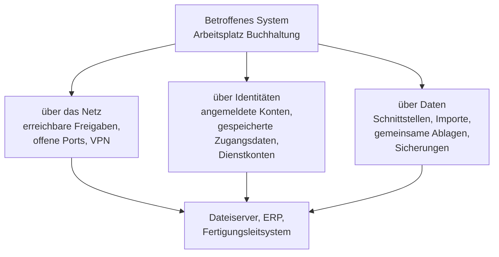

# Sicherheitsvorfälle

<span class='badge badge-pruefung'>Prüfungsrelevant</span> &nbsp; Irgendwann passiert es – die Frage ist nicht *ob*, sondern **wie schnell und wie geordnet** reagiert wird. Diese Seite beschreibt den Weg vom ersten Hinweis bis zur wirksamen Eindämmung.

Fast jeder größere Schaden beginnt harmlos. Eine Kollegin ruft an, weil eine Datei sich nicht öffnen lässt. Ein Server ist zwei Minuten langsamer als sonst. Ein Anmeldeversuch schlägt nachts um kurz nach drei fehl – und danach klappt einer. Jeder dieser Hinweise geht in einem normalen Arbeitstag unter, wenn niemand dafür zuständig ist, ihn einzuordnen. Der Unterschied zwischen einem Betrieb, der einen Angriff nach zwanzig Minuten stoppt, und einem, der ihn nach vier Wochen aus einer Erpressernachricht erfährt, liegt selten in besserer Technik. Er liegt darin, dass jemand den ersten Hinweis **ernst genommen und eingeordnet** hat.

Genau darum geht es hier: um ein Verfahren, das aus einem diffusen „irgendwas ist komisch“ eine belastbare Bewertung macht, daraus die richtigen Sofortmaßnahmen ableitet – und dabei nicht versehentlich die Spuren zerstört, die man später braucht.

!!! abstract "Was du auf dieser Seite lernst"
    - warum die Abgrenzung von **Ereignis, Störung und Sicherheitsvorfall** über die gesamte weitere Reaktion entscheidet
    - aus welchen vier Quellen Hinweise kommen und was **signaturbasierte** von **verhaltensbasierter** Angriffserkennung unterscheidet
    - wie eine **Ersteinschätzung** abläuft: Ist es echt? Wie kritisch? Welche Systeme sind betroffen?
    - wie Schwachstellen mit **CVE** und **CVSS** eingeordnet werden – und warum ein hoher Punktwert noch kein hohes Risiko ist
    - welche **technischen und organisatorischen Sofortmaßnahmen** es gibt und wie man Eindämmung gegen Beweissicherung abwägt
    - woran man erkennt, dass eine Maßnahme wirklich **gegriffen** hat, was in ein **Vorfallprotokoll** gehört und welche **Meldepflichten** greifen können

---

## Ereignis, Störung, Sicherheitsvorfall – und warum das kein Wortspiel ist

Drei Begriffe, die im Alltag durcheinandergehen. Für die Reaktion sind sie aber der wichtigste Sortierschritt überhaupt, denn an jedem der drei hängt ein **anderer Prozess mit anderen Beteiligten und anderen Fristen**.

!!! tip "Die Analogie: Rauchmelder, Kaffeemaschine, Brandgeruch"
    In einem Bürogebäude passieren ständig **Ereignisse**: Die Tür geht auf, das Licht schaltet sich ein, der Rauchmelder meldet seinen Selbsttest. Niemand reagiert darauf, es wird nur mitgeschrieben.

    Eine **Störung** ist die kaputte Kaffeemaschine. Etwas funktioniert nicht mehr wie vorgesehen, jemand ist genervt, der Hausmeister repariert es. Ein normaler Vorgang mit einem normalen Zuständigen.

    Ein **Sicherheitsvorfall** ist der Brandgeruch im Treppenhaus. Jetzt gilt eine andere Regel: Nicht mehr der Hausmeister allein entscheidet, es gibt eine Meldekette, die Ursache muss geklärt werden, und man darf nicht einfach das Fenster aufreißen, weil das die Sache verschlimmern kann. Derselbe Geruch kann sich als angebranntes Essen herausstellen – **das weiß man erst hinterher**, und bis dahin behandelt man ihn als Brand.

| Begriff | Was er bedeutet | Wer reagiert | Beispiel |
|---|---|---|---|
| **Ereignis** (Event) | eine beobachtbare Zustandsänderung in einem System – zunächst wertfrei | niemand; es wird protokolliert | erfolgreiche Anmeldung, Dienstneustart, Sicherungslauf beendet |
| **Störung** (Incident) | die Leistung eines Dienstes ist beeinträchtigt oder ausgefallen | der reguläre Betrieb, meist über ein Ticket | Drucker offline, Anwendung reagiert langsam, Festplatte defekt |
| **Sicherheitsvorfall** | ein Ereignis oder eine Ereigniskette, die ein Schutzziel verletzt oder zu verletzen droht – Vertraulichkeit, Integrität oder Verfügbarkeit | ein festgelegter Kreis mit eigenem Meldeweg | Schadsoftware auf einem Arbeitsplatz, Datenabfluss, unbefugter Zugriff, Erpressungsschreiben |
| **Notfall** | ein Vorfall, der so groß ist, dass der normale Betrieb ihn nicht mehr bewältigt | Krisenstab, Notfallorganisation | Ausfall des gesamten Rechenzentrums, Verschlüsselung aller Dateiserver |
| **Schwachstelle** | eine bekannte Lücke, die *noch nicht* ausgenutzt wurde | Schwachstellenmanagement, kein Vorfall | ungepatchter Dienst, offener Port, Standardkennwort |

Zwei Zeilen dieser Tabelle werden besonders oft verwechselt. Die erste ist die Grenze zwischen **Störung und Sicherheitsvorfall**. „Der Dateiserver ist langsam“ ist eine Störung – bis jemand feststellt, dass ein Prozess gerade Dateien verschlüsselt. Dann war es von Anfang an ein Sicherheitsvorfall, nur hat es niemand gemerkt. Deshalb hat jeder brauchbare Störungsprozess einen **Abzweig**: Der Bearbeiter muss bei jeder Störung kurz prüfen, ob eine Sicherheitsrelevanz vorliegen könnte, und im Zweifel eskalieren.

Die zweite ist die Grenze zwischen **Schwachstelle und Vorfall**. Eine ungepatchte Software ist kein Vorfall, sondern ein Risiko – es fehlt das Ereignis. Wird die Lücke ausgenutzt, wird daraus ein Vorfall. Das ist genau die Risikosequenz aus dem [Risikomanagement](risikomanagement.md): Bedrohung trifft auf Schwachstelle, daraus wird ein Ereignis, aus dem Ereignis ein Schaden.

!!! warning "Im Zweifel hochstufen, nicht abstufen"
    Die Einstufung erfolgt **mit dem Wissen von jetzt**, nicht mit dem Wissen von später. Wer wartet, bis er sicher ist, verschenkt genau die Zeit, in der Eindämmung noch billig wäre. Der Grundsatz lautet deshalb: **Bei begründetem Verdacht wird als Sicherheitsvorfall behandelt.** Eine Hochstufung, die sich als Fehlalarm herausstellt, kostet ein paar Stunden Arbeit und wird im Protokoll vermerkt. Eine zu späte Hochstufung kostet den Rest.

### Der Ablauf im Überblick

Damit die folgenden Abschnitte eine Reihenfolge haben, hier der Rahmen. Er stammt in dieser Form aus der Fachliteratur zur Vorfallbehandlung und taucht in fast allen Rahmenwerken mit leicht anderen Schnitten wieder auf:


Diese Seite arbeitet die Schritte 2 und 3 aus – Erkennung, Bewertung, Sofortmaßnahmen und ihre Wirksamkeitsprüfung. Die Schritte 4 bis 6 und die Beweisführung, die parallel dazu läuft, stehen auf der Seite [Beweissicherung & Prävention](beweissicherung-und-praevention.md); die technische Wiederherstellung und der Notfallplan gehören zu [Incident Response & Business Continuity](../betrieb/incident-und-bcm.md) und [Backup & Recovery](../betrieb/backup-und-recovery.md).

Der Pfeil von 6 zurück zu 1 ist derselbe Kreisschluss wie im Risikomanagement: **Der Vorfall von heute ist die Vorbereitung von morgen.**

!!! note "Wo das in Normen und Standards steht"
    Du musst diese Quellen nicht auswendig können, aber es hilft zu wissen, dass die Begriffe nicht erfunden sind. Die **ISO/IEC 27035** beschreibt das Management von Informationssicherheitsvorfällen als eigene Normenreihe. Im **IT-Grundschutz des BSI** decken die Bausteine der Schicht DER („Detektion und Reaktion“) das Thema ab – DER.1 die Detektion sicherheitsrelevanter Ereignisse, DER.2.1 die Behandlung von Sicherheitsvorfällen. Aus dem englischsprachigen Raum ist der *Computer Security Incident Handling Guide* des NIST (SP 800-61) der meistzitierte Leitfaden; er fasst die Phasen 3 bis 5 zu einer zusammen.

---

## Erkennung: woher der erste Hinweis kommt

Ein Vorfall meldet sich nicht an. Er wird **entdeckt** – und zwar aus vier Richtungen, die sich in Geschwindigkeit, Genauigkeit und Zuverlässigkeit stark unterscheiden.

| Quelle | Typischer Hinweis | Stärke | Schwäche |
|---|---|---|---|
| **Monitoring** | Auslastung springt, Speicherplatz schrumpft rasant, ein Dienst antwortet nicht mehr, ein Sicherungslauf schlägt fehl | erkennt Wirkungen zuverlässig und sofort | sieht die Wirkung, nicht die Ursache – Verschlüsselung sieht aus wie hohe Last |
| **Meldung von Anwendern** | „Meine Dateien haben eine komische Endung“, „ich habe auf einen Link geklickt“, „da war ein Fenster, das ich nicht kenne“ | erkennt Dinge, für die es keinen Sensor gibt; oft die schnellste Quelle | kommt nur, wenn Melden leicht und angstfrei ist |
| **Technische Erkennungssysteme** | Angriffserkennung im Netz, Schutzsoftware auf dem Endgerät, Warnung eines Dienstleisters | erkennt Muster, die kein Mensch sieht | Fehlalarme; erkennt nur, was es kennt oder als abweichend einstuft |
| **Protokolldaten** | Anmeldungen zu ungewöhnlichen Zeiten, viele Fehlversuche gefolgt von einem Erfolg, neu angelegte Konten, gelöschte Protokolle | die einzige Quelle, die auch rückwirkend etwas zeigt | riesige Menge; ohne Auswertung liegt der Fund unbemerkt in der Datei |

Die zweite Zeile ist die, die in Betrieben am meisten unterschätzt wird. **Anwendermeldungen sind statistisch eine der häufigsten Entdeckungsquellen** – und die einzige, die auch dann funktioniert, wenn der Angreifer die technischen Sensoren umgangen hat. Sie ist aber auch die empfindlichste: Wer einmal erlebt hat, dass eine Meldung mit „warum haben Sie denn da draufgeklickt“ beantwortet wurde, meldet beim nächsten Mal nichts mehr. Und dann vergehen nicht zwanzig Minuten bis zur Entdeckung, sondern drei Wochen.

!!! tip "Drei Bedingungen, damit Anwendermeldungen ankommen"
    **Ein Weg, der immer funktioniert.** Eine Nummer, eine Adresse, ein Knopf – und alles davon auch dann erreichbar, wenn die E-Mail nicht geht. Ein Meldeweg, der nur per Mail existiert, fällt genau im Ernstfall aus.

    **Keine Schuldzuweisung.** Wer einen Klick meldet, hat die Lage verbessert, nicht verschlechtert. Das muss so kommuniziert und so gelebt werden, sonst ist es eine Absichtserklärung.

    **Eine Rückmeldung.** Wer nie erfährt, was aus seiner Meldung wurde, meldet beim dritten Mal nicht mehr. Zwei Sätze reichen.

### Angriffserkennung: signaturbasiert gegen verhaltensbasiert

Systeme zur Angriffserkennung heißen im Netz **Intrusion Detection System** (IDS) beziehungsweise **Intrusion Prevention System** (IPS), wenn sie nicht nur melden, sondern auch blockieren; auf dem Endgerät heißen sie heute meist **Endpoint Detection and Response** (EDR). Die technische Einordnung dieser Systeme steht im Netzwerk-Block unter [Netzwerk-Sicherheit](../netzwerke/netzwerk-sicherheit.md). Hier interessiert nur die eine Frage, an der ihre Stärken und Schwächen hängen: **Woran erkennen sie eigentlich einen Angriff?**

Es gibt genau zwei Antworten, und praktisch jedes Produkt kombiniert beide.

| | **Signaturbasiert** | **Verhaltensbasiert (Anomalieerkennung)** |
|---|---|---|
| **Prinzip** | vergleicht mit einer Datenbank bekannter Muster – Dateikennungen, Schadcode-Fragmente, typische Angriffsabläufe | vergleicht mit einem gelernten oder definierten Normalzustand und schlägt bei Abweichung an |
| **Analogie** | der Türsteher mit der Fahndungsliste: Wer draufsteht, kommt nicht rein | der Nachbar, der weiß, dass hier sonntags um vier niemand die Kellertür aufschließt |
| **Erkennt** | bekannte Schadsoftware, bekannte Angriffswerkzeuge – schnell und sehr präzise | neue, unbekannte oder gezielt angepasste Angriffe; auch Innentäter |
| **Erkennt nicht** | alles, was neu ist oder leicht verändert wurde | Angriffe, die sich innerhalb der normalen Bandbreite bewegen |
| **Typische Schwäche** | **falsch negativ**: der Angriff läuft, das System schweigt | **falsch positiv**: das System meldet, es war aber der neue Kollege im Nachtdienst |
| **Pflegeaufwand** | Signaturen aktuell halten | Normalzustand definieren und nachziehen, wenn sich der Betrieb ändert |

Die beiden Fehlerarten sind der Kern der Sache und tauchen in Prüfungsaufgaben regelmäßig auf:

- **Falsch positiv** (Fehlalarm): Das System meldet einen Angriff, es war keiner. Kostet Zeit – und wenn es zu oft passiert, Aufmerksamkeit. Eine Meldung, die zum hundertsten Mal grundlos kam, liest irgendwann niemand mehr. Das ist der teuerste Nebeneffekt, weil er die echte Meldung mit begräbt.
- **Falsch negativ** (verpasster Angriff): Das System schweigt, der Angriff läuft. Kostet unter Umständen alles.

Beide lassen sich nicht gleichzeitig minimieren. Wer die Schwellen scharf stellt, bekommt mehr Fehlalarme; wer sie entschärft, übersieht mehr. Die Antwort ist deshalb nie „das perfekte Werkzeug“, sondern **mehrere Quellen, die sich gegenseitig bestätigen** – genau das leistet der nächste Abschnitt.

### Sicherheitsinformations- und Ereignismanagement

Ein einzelnes Protokoll sagt selten etwas aus. Interessant wird es, wenn man Protokolle **verschiedener Systeme nebeneinanderlegt**. Genau das macht ein **Sicherheitsinformations- und Ereignismanagement** – im Sprachgebrauch fast immer als **SIEM** abgekürzt (Security Information and Event Management).

!!! tip "Die Analogie: die Pförtnerloge"
    Ein einzelner Wachmann an einer einzelnen Tür sieht nur seine Tür. In der Pförtnerloge laufen alle Kameras, alle Türprotokolle und alle Alarmkontakte auf einem Tisch zusammen. Erst dort fällt auf, dass dieselbe Ausweisnummer innerhalb von zwei Minuten an zwei Türen benutzt wurde, die zwölf Fahrminuten auseinanderliegen. Jede einzelne Türmeldung war völlig unauffällig. **Auffällig ist erst die Kombination.**

Ein SIEM arbeitet in vier Schritten:

1. **Sammeln.** Protokolle aus Servern, Netzkomponenten, Firewalls, Anwendungen, Verzeichnisdiensten und Schutzsoftware laufen zentral zusammen.
2. **Normalisieren.** Jedes System schreibt anders. Aus zwanzig Formaten wird ein einheitliches Feldschema: Wer, was, wann, woher, wohin, Ergebnis.
3. **Korrelieren.** Regeln verknüpfen Ereignisse über Systeme und Zeit hinweg. Genau hier entsteht der Mehrwert.
4. **Alarmieren.** Trifft eine Regel zu, entsteht eine Meldung – idealerweise mit Priorität, Kontext und einer Handlungsanweisung.

Ein Korrelationsbeispiel, an dem der Nutzen sichtbar wird:

```text
Einzeln betrachtet unauffaellig
  1  Verzeichnisdienst   40 fehlgeschlagene Anmeldungen fuer "m.brandt"
  2  Verzeichnisdienst   1 erfolgreiche Anmeldung fuer "m.brandt"
  3  VPN-Gateway         Einwahl "m.brandt" aus einem unbekannten Netz
  4  Dateiserver         "m.brandt" oeffnet 12.000 Dateien in 4 Minuten
  5  Firewall            ausgehende Verbindung zu einer bisher nie genutzten Adresse

Als Kette betrachtet
  1 + 2   Kennwortangriff mit Erfolg
  + 3     Zugang von aussen, nicht vom Arbeitsplatz
  + 4     massenhafter Datenzugriff, kein normales Arbeitsmuster
  + 5     Abfluss nach draussen
  =       begruendeter Verdacht auf Kontouebernahme mit Datenabfluss
```

Keiner der fünf Einträge hätte für sich einen Alarm gerechtfertigt. Die Kette schon. Dafür braucht das SIEM allerdings eine Voraussetzung, an der es in der Praxis am häufigsten scheitert: **Alle beteiligten Systeme müssen dieselbe Zeit haben.** Laufen die Uhren auseinander, stimmt die Reihenfolge nicht mehr, und die Kette ist nicht mehr rekonstruierbar. Wie man das absichert, steht im Abschnitt zur Zeitsynchronisation auf der [nächsten Seite](beweissicherung-und-praevention.md).

!!! warning "Ein SIEM ist ein Werkzeug, kein Ergebnis"
    Der häufigste Fehler beim Einsatz solcher Systeme ist die Annahme, mit der Beschaffung sei die Aufgabe erledigt. Ein SIEM ohne gepflegte Regeln erzeugt eine sehr teure Menge unsortierter Meldungen. Und Meldungen, die niemand liest, sind wertlos – deshalb gehört zu jedem Erkennungssystem die Frage, **wer** die Meldung sieht, **wann** er sie sieht und **was** er dann tun soll. Betriebe, die das rund um die Uhr leisten wollen, richten dafür eine eigene Stelle ein oder kaufen sie ein; die übliche Bezeichnung dafür ist **Security Operations Center** (SOC).

---

## Ersteinschätzung: die drei Fragen der ersten halben Stunde

Ein Hinweis liegt vor. Bevor irgendjemand ein Kabel zieht, werden drei Fragen beantwortet. Dieser Schritt heißt in der Praxis oft **Triage** – wie in der Notaufnahme geht es nicht darum, alles zu klären, sondern darum, in kurzer Zeit die richtige Dringlichkeit zu bestimmen.

### Frage 1: Ist es echt?

Ein erheblicher Teil aller Meldungen ist kein Vorfall. Ein Schwellwert war zu eng gesetzt, ein Wartungsfenster war nicht angekündigt, ein Testlauf sah aus wie ein Angriff, eine Anwenderin hat ein legitimes Werkzeug zum ersten Mal benutzt. Die Verifikation besteht darin, den Hinweis **an einer zweiten, unabhängigen Quelle** zu prüfen:

- Ein Alarm der Schutzsoftware wird gegen das Protokoll des betroffenen Systems geprüft.
- Eine Anwendermeldung wird durch einen Blick auf das Gerät oder die Freigabe bestätigt.
- Ein Monitoring-Ausschlag wird gegen den Änderungskalender geprüft: Hat jemand etwas ausgerollt?

Wichtig ist die Reihenfolge: **Erst verifizieren, dann eskalieren – aber nur, solange das Verifizieren Minuten dauert und nicht Stunden.** Bei einem laufenden, sichtbaren Schaden entfällt dieser Schritt; da wird sofort eingedämmt.

### Frage 2: Wie kritisch ist es?

Die Kritikalität steuert alles Weitere: wer informiert wird, wie schnell reagiert werden muss, ob nachts jemand geweckt wird. Sie wird aus zwei Größen gebildet – **wie schwer wiegt die Verletzung** und **wie wichtig ist das betroffene System**. Der Schutzbedarf des Systems ist dabei keine neue Erfindung, sondern kommt aus der Schutzbedarfsfeststellung im [Risikomanagement](risikomanagement.md).

| Stufe | Merkmale | Beispiel | Reaktion (typischer Richtwert) |
|---|---|---|---|
| **Kritisch** | zentrale Systeme betroffen, laufende Ausbreitung, Gefahr für Menschen oder für die Produktion, Verdacht auf Abfluss personenbezogener Daten | Verschlüsselung auf Dateiservern, Kompromittierung des Verzeichnisdienstes | sofort, rund um die Uhr, Krisenstab |
| **Hoch** | ein wichtiges System betroffen, Ausbreitung möglich, aber noch nicht belegt | Schadsoftware auf einem Server, übernommenes privilegiertes Konto | innerhalb einer Stunde, Leitung informiert |
| **Mittel** | einzelnes System, begrenzte Wirkung, kein Hinweis auf Ausbreitung | Schadsoftware auf einem Einzelarbeitsplatz, blockiert von der Schutzsoftware | innerhalb des Arbeitstages |
| **Niedrig** | kein produktives System, kein Datenbezug, reine Auffälligkeit | Portscan von außen ohne Erfolg, Fehlalarm mit Klärungsbedarf | im Rahmen der normalen Bearbeitung |

Die Zahlen in der letzten Spalte sind **Richtwerte, keine Vorschrift**. Jeder Betrieb legt sie selbst fest – aber er legt sie **vorher** fest, in einer Richtlinie. Wer die Stufen erst im Vorfall definiert, definiert sie unter Druck und im Zweifel so, dass niemand geweckt werden muss.

!!! danger "Die Stufe wird nach unten korrigiert, nicht nach oben verschleppt"
    Eine Ersteinschätzung ist eine Momentaufnahme. Sie muss **nachgeführt** werden, sobald neue Erkenntnisse vorliegen – in beide Richtungen. In der Praxis wird fast nur eine Richtung genutzt: Das Ausmaß wächst. Ein Vorfall, der als „ein Arbeitsplatz“ begann, ist zwei Stunden später „der Dateiserver und drei Arbeitsplätze“. Deshalb gehört zu jeder Einstufung ein Zeitpunkt für die Neubewertung – und die alte Einstufung bleibt im Protokoll stehen, sie wird nicht überschrieben.

### Frage 3: Welche Systeme sind betroffen?

Diese Frage hat zwei Teile, und der zweite wird gern vergessen.

**Direkt betroffen** ist, was nachweislich verändert, verschlüsselt, ausgelesen oder erreicht wurde. **Potenziell betroffen** ist alles, was von dort aus erreichbar war. Der Unterschied ist entscheidend, weil sich die Sofortmaßnahmen nach der zweiten Menge richten müssen, nicht nach der ersten. Wer nur das absichert, was er bereits gesehen hat, ist dem Angreifer immer einen Schritt hinterher.

### Auswirkungsanalyse auf verbundene Systeme

Systeme sind selten allein. Sie hängen über drei Arten von Wegen zusammen, und jeder davon ist ein Ausbreitungsweg:



- **Über das Netz.** Was war von dem betroffenen Gerät aus erreichbar? Hier zeigt sich der Wert von Segmentierung: In einem flachen Netz ist die Antwort „alles“. Wie man das anders baut, steht unter [Segmentierung & VPN](../netzwerke/segmentierung-und-vpn.md).
- **Über Identitäten.** Welche Konten waren auf dem Gerät angemeldet oder dort gespeichert? Ein übernommenes privilegiertes Konto ist gefährlicher als jede Schadsoftware, weil es überall legitim aussieht. Das ist auch der Grund, warum Administratoren sich nicht mit ihrem privilegierten Konto an normalen Arbeitsplätzen anmelden sollten.
- **Über Daten.** Welche Schnittstellen ziehen Daten von dort ab oder liefern dorthin? Und – der wichtigste Punkt – **hängen die Sicherungen mit dran?** Eine Sicherung, die über eine dauerhaft eingebundene Freigabe erreichbar ist, wird mitverschlüsselt.

!!! warning "Die unangenehme Frage zuerst stellen"
    In der Auswirkungsanalyse gibt es eine Frage, die man sich früh stellen muss, weil ihre Antwort alles Weitere bestimmt: **Sind personenbezogene Daten betroffen?** Wenn ja, läuft ab dem Zeitpunkt der Kenntnis eine Frist – siehe den Abschnitt zu den Meldepflichten weiter unten. Diese Frist läuft, ob man sie kennt oder nicht.

---

## Schwachstellenbewertung und Verwundbarkeitsscans

Die Ersteinschätzung fragt „was ist passiert?“. Die Schwachstellenbewertung fragt „**was kann bei uns passieren?**“ – sie gehört damit eigentlich in die Vorbereitung, taucht aber in jedem Vorfall wieder auf, sobald die Frage kommt: Über welche Lücke ist das hereingekommen, und wo haben wir sie noch?

Drei Begriffe müssen sauber auseinandergehalten werden:

- Eine **Schwachstelle** (Vulnerability) ist eine Eigenschaft eines Systems, die einen Angriff ermöglicht – ein Programmfehler, eine unsichere Voreinstellung, ein fehlender Patch.
- Ein **Exploit** ist das Werkzeug oder Verfahren, mit dem die Schwachstelle tatsächlich ausgenutzt wird.
- Ein **Verwundbarkeitsscan** (Vulnerability Scan) ist die automatisierte Suche nach Schwachstellen im eigenen Bestand.

### Wie ein Scan arbeitet – und was er nicht kann

Ein Schwachstellenscanner prüft erreichbare Systeme gegen eine ständig aktualisierte Datenbank bekannter Lücken. Man unterscheidet zwei Betriebsarten:

| | **Unauthentifiziert** | **Authentifiziert** |
|---|---|---|
| **Vorgehen** | von außen, ohne Zugangsdaten – wie ein Angreifer, der noch nicht drin ist | mit Zugangsdaten, liest die tatsächlich installierten Versionsstände aus |
| **Sieht** | offene Dienste, Versionsbanner, offensichtliche Fehlkonfigurationen | den vollständigen Softwarestand, fehlende Patches, lokale Einstellungen |
| **Genauigkeit** | mehr Vermutung, mehr Fehlalarme | deutlich präziser |
| **Blickwinkel** | Angreifersicht | Inventarsicht |

Wichtig ist die Abgrenzung zum **Penetrationstest**: Ein Scan findet, was in der Datenbank steht, und meldet es. Ein Penetrationstest versucht, gefundene Schwächen tatsächlich zu verketten und auszunutzen – mit menschlichem Urteilsvermögen und in einem vereinbarten Rahmen. Ein Scan ist Routine und läuft regelmäßig; ein Penetrationstest ist ein Projekt.

### CVE und CVSS: die gemeinsame Sprache

Damit weltweit alle über dieselbe Lücke reden, bekommt jede öffentlich bekannte Schwachstelle eine eindeutige Kennung nach dem Schema **CVE** (Common Vulnerabilities and Exposures) – zum Beispiel `CVE-2021-44228`, die als „Log4Shell“ bekannte Lücke in einer weit verbreiteten Protokollierungsbibliothek. Die Kennung sagt nur: *Wir reden über dieselbe Sache.* Sie sagt nichts über den Schweregrad.

Dafür gibt es das **Common Vulnerability Scoring System (CVSS)** – das gängige Bewertungssystem für Schweregrade. Es liefert einen Punktwert von **0,0 bis 10,0** und eine Einstufung:

| Punktwert | Einstufung |
|---|---|
| 0,0 | keine |
| 0,1 – 3,9 | niedrig |
| 4,0 – 6,9 | mittel |
| 7,0 – 8,9 | hoch |
| 9,0 – 10,0 | kritisch |

Der Punktwert entsteht nicht aus dem Bauch, sondern aus einer Reihe fest definierter Merkmale: Ist die Lücke über das Netz oder nur lokal ausnutzbar? Wie aufwendig ist der Angriff? Braucht der Angreifer Rechte? Muss ein Benutzer mitwirken? Und welche Schutzziele – Vertraulichkeit, Integrität, Verfügbarkeit – wären wie stark betroffen? In der verbreiteten Version 3.1 sind diese Merkmale in drei Gruppen geordnet: **Basismetriken** (die unveränderlichen Eigenschaften der Lücke), **temporale Metriken** (gibt es schon einen Exploit, gibt es einen Patch?) und **Umgebungsmetriken** (wie wichtig ist das betroffene System bei uns?). Version 4.0 hat diesen Schnitt überarbeitet, das Prinzip bleibt gleich.

!!! danger "Der Basiswert ist kein Risiko"
    In der Praxis wird fast immer nur der **Basiswert** verwendet – der ist überall veröffentlicht und kostet keine Arbeit. Genau da liegt die Falle: Der Basiswert beschreibt die Lücke, nicht **deine** Lage. Zwei Beispiele:

    | | Lücke A | Lücke B |
    |---|---|---|
    | CVSS-Basiswert | 9,8 („kritisch“) | 6,5 („mittel“) |
    | betroffenes System | Testserver, nur intern erreichbar, keine echten Daten | Gateway, aus dem Internet erreichbar, Zugang zum Firmennetz |
    | Exploit öffentlich verfügbar | nein | ja, wird aktiv ausgenutzt |
    | **tatsächliche Dringlichkeit** | überschaubar | **sofort** |

    Die Reihenfolge beim Patchen ergibt sich also aus **drei** Dingen: dem Schweregrad, der Erreichbarkeit und dem Schutzbedarf des betroffenen Systems – und aus der Frage, ob die Lücke bereits ausgenutzt wird. Genau dafür gibt es ergänzende Quellen: Listen bekannter, aktiv ausgenutzter Schwachstellen und Wahrscheinlichkeitsschätzungen für eine baldige Ausnutzung. **Ein Scanbericht ist eine Sortieraufgabe, keine Abarbeitungsliste.**

---

## Sofortmaßnahmen: technisch und organisatorisch

Jetzt geht es ans Handeln. Sofortmaßnahmen verfolgen genau ein Ziel: **die Ausbreitung stoppen und den laufenden Schaden begrenzen.** Sie beheben die Ursache nicht – das kommt später und heißt Beseitigung. Man unterscheidet zwei Familien, und beide werden gebraucht.

| | **Technische Sofortmaßnahmen** | **Organisatorische Sofortmaßnahmen** |
|---|---|---|
| **Ziel** | den Angriff physisch oder logisch stoppen | die richtigen Menschen in Kenntnis und in Bewegung setzen |
| **Beispiele** | Netztrennung des betroffenen Geräts, Deaktivieren von Konten, Sperren von Fernzugängen, Anhalten von Diensten, Schreibschutz auf Freigaben, Blockieren von Adressen an der Firewall, Trennen der Sicherungsmedien | Krisenstab einberufen, Leitung informieren, Datenschutzbeauftragte einbinden, Fachbereiche und Betriebsrat informieren, Dienstleister und Versicherung verständigen, Meldepflichten prüfen, Vorfallprotokoll eröffnen |
| **Wer** | Administration, oft in Abstimmung mit einem Dienstleister | Vorfallverantwortlicher, Leitung |
| **Wirkung** | sofort und messbar | mittelbar, aber ohne sie fehlt jede Entscheidungsbefugnis |

Der häufigste Fehler ist, nur die linke Spalte abzuarbeiten. Technisch kann man einen Vorfall eindämmen und trotzdem alles falsch machen – nämlich dann, wenn niemand entscheiden darf, ob die Fertigung angehalten wird, und wenn drei Tage später auffällt, dass eine gesetzliche Meldefrist verstrichen ist.

### Die entscheidende Abwägung: Eindämmung gegen Spurenvernichtung

Hier liegt der schwierigste Punkt der ganzen Vorfallbearbeitung. **Fast jede schnelle technische Maßnahme vernichtet Spuren.** Und Spuren braucht man später – um die Ursache zu finden, um zu belegen, dass keine Daten abgeflossen sind, für die Versicherung, für die Aufsichtsbehörde und unter Umständen für ein Verfahren.

| Maßnahme | Wirkung auf die Ausbreitung | Wirkung auf die Beweislage |
|---|---|---|
| **Netzwerkkabel ziehen / Port am Switch deaktivieren** | stoppt Ausbreitung und Abfluss sofort | Arbeitsspeicher, laufende Prozesse und offene Verbindungen bleiben erhalten – **die beste Kombination** |
| **In ein Quarantänesegment verschieben** | stoppt Ausbreitung, System bleibt für die Analyse erreichbar | erhält alles, braucht aber Vorbereitung |
| **System herunterfahren** | stoppt alles | **vernichtet den Arbeitsspeicher** und damit oft die einzigen Spuren des Angriffs: Schlüssel, entpackter Schadcode, Verbindungen, angemeldete Sitzungen |
| **System vom Strom trennen** | stoppt alles sofort | vernichtet zusätzlich alles, was ein sauberes Herunterfahren noch geschrieben hätte; kann Dateisysteme beschädigen |
| **Konto deaktivieren** | stoppt die Nutzung dieses Zugangs | unkritisch; das Konto selbst und seine Protokolle bleiben |
| **Neu installieren / aus Sicherung zurückspielen** | beseitigt den Befall auf diesem System | **löscht alles** – und zwar unwiederbringlich |

Daraus folgt eine Faustregel, die man sich merken kann:

!!! danger "Trennen statt abschalten"
    **Ziehe das Netz, lass den Strom.** Ein isoliertes, aber laufendes System richtet keinen Schaden mehr an und behält alle flüchtigen Spuren. Ein abgeschaltetes System ist ebenfalls harmlos, aber die Hälfte der Beweise ist weg.

    Es gibt genau zwei Gründe, diese Regel zu brechen – und beide muss jemand mit Entscheidungsbefugnis verantworten, nicht der Erste am Gerät:

    1. **Gefahr für Menschen oder Sachwerte.** Wenn eine Steuerung Anlagen in einen gefährlichen Zustand fahren kann, hat Sicherheit für Leib und Leben Vorrang vor allem anderen.
    2. **Massiver, laufender, unaufhaltbarer Schaden.** Wenn eine Verschlüsselung gerade läuft und nicht anders zu stoppen ist, zählt jede Sekunde mehr als jede Spur.

    In allen anderen Fällen gilt: erst trennen, dann in Ruhe entscheiden. Wie die flüchtigen Spuren anschließend gesichert werden, steht auf der Seite [Beweissicherung & Prävention](beweissicherung-und-praevention.md).

Zwei weitere Abwägungen gehören dazu, die seltener genannt werden:

**Beobachten oder sofort stoppen?** In manchen Fällen liefert ein kurzes, kontrolliertes Weiterlaufenlassen die Information, die man zum vollständigen Ausschluss braucht – etwa, welche Systeme der Angreifer noch anspricht. Diese Entscheidung ist heikel, sie gehört nicht in die erste Viertelstunde und nicht in die Hand einer einzelnen Person. **Im Zweifel und ohne forensische Unterstützung: stoppen.**

**Alarmiere ich den Angreifer?** Wer alle privilegierten Kennwörter gleichzeitig zurücksetzt, teilt einem noch anwesenden Angreifer mit, dass er entdeckt wurde – und provoziert unter Umständen genau das, was man verhindern will. Deshalb werden solche Maßnahmen **koordiniert und gebündelt** ausgeführt, nicht nach und nach.

### Organisatorisch: informieren, melden, eskalieren

Drei Dinge, die man nicht durcheinanderbringen darf:

- **Informieren** heißt: Wer muss es wissen, um arbeiten oder entscheiden zu können? Leitung, betroffene Fachbereiche, Datenschutzbeauftragte, gegebenenfalls Betriebsrat und Dienstleister.
- **Melden** heißt: Wer muss es von Gesetzes wegen oder laut Vertrag erfahren? Aufsichtsbehörden, Kunden, Versicherung – dazu gleich mehr.
- **Eskalieren** heißt: Die Bearbeitung wird auf eine höhere Ebene gehoben, weil Befugnis, Ressourcen oder Wissen auf der aktuellen Ebene nicht ausreichen.

!!! tip "Der Kommunikationsweg gehört zur Sicherheitsplanung"
    Wenn der Verdacht besteht, dass der Angreifer noch im Netz ist, ist die interne E-Mail der falsche Kanal – er liest mit, und die eigene Krisenkommunikation wird zur Aufklärung für die Gegenseite. Deshalb gehört ein **Ausweichweg** zur Vorbereitung: Telefonliste auf Papier, Mobilnummern, ein unabhängiger Messenger. Und die Liste liegt nicht auf dem Dateiserver, der gerade verschlüsselt wurde.

---

## Wirksamkeit prüfen: woran erkennt man, dass es gegriffen hat?

Eine Maßnahme ist nicht deshalb wirksam, weil sie ausgeführt wurde. **Die Abwesenheit von Alarmen ist kein Beweis** – sie kann auch bedeuten, dass die Erkennung ausgefallen ist oder der Angreifer nur leiser geworden ist. Zu jeder Sofortmaßnahme gehört deshalb ein **Prüfkriterium**, das vorher festgelegt und nachher geprüft wird.

| Maßnahme | Prüfkriterium | Wie geprüft wird |
|---|---|---|
| Gerät vom Netz getrennt | keine Netzaktivität dieses Geräts mehr | Portstatus am Switch, Firewall-Protokoll, keine neuen Verbindungen im Protokoll |
| Konto deaktiviert | keine erfolgreiche Anmeldung mehr mit diesem Konto | Protokoll des Verzeichnisdienstes, gezielter Testversuch |
| Fernzugang gesperrt | keine aktiven Sitzungen, keine neuen Einwahlen | Sitzungsliste am Gateway, Protokoll |
| Ausbreitung gestoppt | keine neuen betroffenen Systeme über einen definierten Zeitraum | Vergleich der Prüfsummen bekannter Merkmale, erneuter Suchlauf, Dateiserver auf neue Verschlüsselungen prüfen |
| Datenabfluss ausgeschlossen | keine ungewöhnlichen ausgehenden Datenmengen und keine Verbindungen zu unbekannten Zielen im relevanten Zeitraum | Auswertung der Verbindungsprotokolle von Firewall und Proxy über den gesamten Verdachtszeitraum, nicht nur ab jetzt |
| Verfügbarkeit wiederhergestellt | der Fachbereich kann tatsächlich arbeiten | fachlicher Test durch die Anwender, nicht nur „Dienst läuft“ |

Die letzten beiden Zeilen sind die wichtigen.

**Ein Datenabfluss lässt sich nur rückwirkend ausschließen.** Wer erst ab dem Zeitpunkt der Entdeckung schaut, prüft die falsche Zeitspanne. Die Auswertung muss den gesamten Zeitraum abdecken, in dem der Angreifer im System gewesen sein könnte – und der beginnt oft Wochen vor der Entdeckung. Genau deshalb sind ausreichend lange aufbewahrte Protokolldaten so wertvoll: **Was man nicht aufgehoben hat, kann man nicht ausschließen.** Und wenn es sich nicht ausschließen lässt, muss man im Zweifel vom schlechteren Fall ausgehen – mit allen Folgen für die Meldepflicht.

**„Der Dienst läuft“ ist nicht dasselbe wie „es funktioniert“.** Eine Anwendung, die startet, aber auf eine halb wiederhergestellte Datenbank zeigt, ist verfügbar und trotzdem unbrauchbar. Die Freigabe für den Normalbetrieb erteilt der Fachbereich nach einem fachlichen Test, nicht die IT nach einem Blick auf den Statusmonitor.

!!! danger "Der teuerste Fehler bei der Wiederherstellung"
    Wer aus einer Sicherung zurückspielt, die nach dem Eindringen des Angreifers entstanden ist, holt sich den Angriff zurück – nur diesmal mit dem guten Gefühl, das Problem gelöst zu haben. Vor jeder Wiederherstellung müssen deshalb zwei Fragen beantwortet sein: **Seit wann war der Angreifer im System?** Und: **Ist die Ursache beseitigt, über die er hereinkam?** Solange beides offen ist, ist Wiederherstellen keine Lösung, sondern eine Wiederholung.

---

## Das Vorfallprotokoll

Alles, was in einem Vorfall passiert, gehört mitgeschrieben – ab dem ersten Hinweis, nicht ab dem Zeitpunkt, an dem klar ist, dass es ernst wird. Das Protokoll erfüllt gleich vier Zwecke: Es ist **Arbeitsmittel** während der Bearbeitung, **Übergabegrundlage** bei Schichtwechsel, **Nachweis** gegenüber Dritten und **Lerngrundlage** für die Nachbereitung.

### Was hineingehört

| Abschnitt | Inhalt |
|---|---|
| **Kopf** | Vorfallnummer, Zeitpunkt und Weg des Meldeeingangs, meldende und aufnehmende Person, Kurzbeschreibung in einem Satz |
| **Erstbewertung** | Kritikalitätsstufe mit Begründung, betroffene und potenziell betroffene Systeme, Bezug zu personenbezogenen Daten |
| **Verlauf** | fortlaufende, nummerierte Einträge: Zeitpunkt, wer, was beobachtet oder getan wurde, Ergebnis, Verweis auf den Beleg |
| **Entscheidungen** | wer hat wann was entschieden – und **warum**, insbesondere bei Abwägungen wie „abschalten oder nicht“ |
| **Meldungen** | an wen wurde wann was gemeldet, mit Aktenzeichen oder Rückmeldung |
| **Abschluss** | festgestellte Ursache, Nachweis der Wirksamkeit, Freigabe des Normalbetriebs durch wen, offene Punkte, Termin für die Nachbereitung |

Ein Auszug aus einem Verlauf, wie er aussehen sollte:

```text
Nr  Zeitpunkt (Datum, Uhrzeit, Zeitzone)  Wer     Eintrag
--  ------------------------------------  ------  -----------------------------------------------
01  ausgeschrieben im echten Protokoll     Weber   Meldung per Telefon von R. Timm, Vertrieb: hat
                                                   auf einen Link in einer angeblichen Paket-
                                                   benachrichtigung geklickt und Zugangsdaten
                                                   eingegeben. Zeitpunkt laut Melder ca. 40 min
                                                   zuvor.
02  + 3 min                                Weber   Pruefung Verzeichnisdienst: seit dem genannten
                                                   Zeitraum zwei erfolgreiche Anmeldungen des
                                                   Kontos "r.timm" aus einem unbekannten Netz.
                                                   Beleg: Protokollauszug, Pruefsumme notiert.
03  + 5 min                                Weber   Einstufung: Sicherheitsvorfall, Stufe hoch.
                                                   Begruendung: Kontouebernahme bestaetigt,
                                                   Ausbreitung moeglich, kein zentrales System.
04  + 6 min                                Weber   Konto "r.timm" deaktiviert, aktive Sitzungen
                                                   beendet. Pruefung: Testanmeldung schlaegt fehl.
                                                   Beleg: Screenshot Sitzungsliste.
05  + 9 min                                Weber   Eskalation an Vorfallverantwortliche (Ohlsen)
                                                   per Mobiltelefon, nicht per E-Mail.
06  + 14 min                               Ohlsen  Negativbefund: Postfachregeln des Kontos
                                                   geprueft, keine Weiterleitung eingerichtet.
```

Fünf Regeln machen den Unterschied zwischen einem Protokoll und einer Notizsammlung:

1. **Zeitstempel vollständig.** Datum, Uhrzeit **und Zeitzone**. Und dazu die Angabe, woher die Zeit stammt – die Uhr des Servers, die Uhr des Protokollierenden oder die Uhr der Firewall können auseinanderlaufen.
2. **Ereigniszeit und Erkennungszeit trennen.** Wann ist es passiert, wann haben wir es bemerkt, wann haben wir es eingetragen? Diese drei Zeitpunkte sind fast nie identisch, und die Differenz zwischen den ersten beiden ist eine der aussagekräftigsten Kennzahlen überhaupt.
3. **Beobachtung und Bewertung trennen.** „Auf dem Bildschirm stand X“ ist eine Beobachtung. „Der Angreifer kam über das VPN“ ist eine Bewertung – die kennzeichnet man als solche, weil sie sich später als falsch herausstellen kann.
4. **Nicht nachträglich glätten.** Ein Protokoll, in dem Einträge korrigiert oder gelöscht wurden, verliert seinen Wert als Nachweis. Korrekturen kommen als **neuer Eintrag** dazu: „Eintrag 07 war falsch, richtig ist …“.
5. **Auch Negativbefunde eintragen.** „Freigabe Q geprüft, keine verschlüsselten Dateien gefunden“ ist ein wertvoller Eintrag. Wer nur Treffer notiert, kann hinterher nicht mehr sagen, was geprüft wurde und was nur niemand angeschaut hat.

!!! tip "Die Person, die schreibt, ist nicht die Person, die schraubt"
    Sobald ein Vorfall größer wird, braucht die Protokollführung eine **eigene Rolle**. Wer gerade an der Firewall arbeitet, schreibt nicht gleichzeitig mit – und rekonstruiert hinterher aus dem Gedächtnis, was in der Regel schiefgeht. Das ist einer der Gründe, warum Vorfallbearbeitung im Team stattfindet und die Rollen vorher verteilt sind.

---

## Meldepflichten im Überblick

Ein Vorfall bleibt oft nicht im Haus. Es gibt gesetzliche und vertragliche Pflichten, ihn nach außen zu melden – und die Fristen sind kurz. Dieser Abschnitt gibt den Überblick auf **Begriffsebene**; die rechtlichen Einzelheiten, Ausnahmen und Zuständigkeiten gehören in den Rechtsteil des Lehrgangs, siehe [Datenschutz & DSGVO](../recht-organisation/datenschutz-dsgvo.md) und [Governance & Compliance](../recht-organisation/governance-und-compliance.md).

### Verletzung des Schutzes personenbezogener Daten

Sobald personenbezogene Daten betroffen sind, greift das Datenschutzrecht. Wichtig ist gleich vorweg: Eine solche Verletzung liegt nicht nur bei einem **Abfluss** vor. Auch der **Verlust** und die **Unzugänglichkeit** zählen dazu – eine Verschlüsselung durch einen Angreifer ist also auch dann eine Verletzung, wenn nachweislich nichts nach draußen gegangen ist. Der Verlust der Verfügbarkeit ist ein Schutzzielverstoß wie jeder andere.

Die Grundzüge:

- **Meldung an die Aufsichtsbehörde**, sofern ein Risiko für die Rechte und Freiheiten der betroffenen Personen besteht – **binnen 72 Stunden ab Kenntnis** (Art. 33 DSGVO).
- **Benachrichtigung der betroffenen Personen**, wenn ein **voraussichtlich hohes** Risiko besteht – unverzüglich und in klarer, einfacher Sprache (Art. 34 DSGVO).
- **Dokumentationspflicht für jede Verletzung**, auch für die, die nicht gemeldet wird – inklusive der Begründung, warum nicht gemeldet wurde (Art. 33 Abs. 5 DSGVO). Genau dafür ist das Vorfallprotokoll da.
- Verarbeitet ein Dienstleister Daten im Auftrag, muss er den Auftraggeber **unverzüglich** informieren; die Meldung an die Behörde macht der Verantwortliche.

!!! warning "Die Frist läuft ab Kenntnis, nicht ab Aufklärung"
    Der häufigste und teuerste Irrtum: „Wir melden, wenn wir wissen, was passiert ist.“ Die Frist beginnt mit der **Kenntnis der Verletzung**, nicht mit ihrer vollständigen Aufklärung. Nach 72 Stunden ist ein Vorfall dieser Größenordnung typischerweise noch längst nicht aufgeklärt – deshalb ist die Meldung ausdrücklich als **erste Meldung mit späterer Ergänzung** vorgesehen. Wer wartet, hat die Frist versäumt und die Aufklärung trotzdem nicht.

    Die Entscheidung über die Meldung trifft übrigens nicht die IT. Sie trifft der Verantwortliche – die Geschäftsführung –, beraten durch die Datenschutzbeauftragten. Die Aufgabe der IT ist es, den Sachverhalt so aufzubereiten, dass diese Entscheidung möglich ist. Und zwar schnell.

### Betreiber wichtiger Einrichtungen

Für Betriebe in bestimmten Sektoren gelten zusätzliche Meldepflichten gegenüber der zuständigen nationalen Stelle. Der Kreis der betroffenen Einrichtungen ist mit der europäischen Richtlinie zur Netz- und Informationssicherheit in ihrer zweiten Fassung – kurz **NIS2** – deutlich erweitert worden. Unterschieden werden **besonders wichtige** und **wichtige Einrichtungen**; die Einordnung ergibt sich aus dem Sektor und der Größe des Betriebs. Betroffen sind längst nicht mehr nur Energie, Wasser und Gesundheit, sondern unter anderem auch Teile des verarbeitenden Gewerbes, Logistik, Abfallwirtschaft und digitale Dienste. Daneben besteht der ältere Begriff der **kritischen Infrastruktur** (KRITIS) mit eigenen Schwellenwerten fort.

Charakteristisch ist ein **gestuftes Meldeverfahren**:

| Stufe | Frist ab Kenntnis | Inhalt |
|---|---|---|
| **Frühwarnung** | 24 Stunden | dass etwas vorliegt, erste Einschätzung, Verdacht auf rechtswidrige Handlung |
| **Meldung** | 72 Stunden | Bewertung, Schweregrad, Auswirkungen, bekannte Merkmale |
| **Abschlussbericht** | ein Monat | Ursache, ergriffene Maßnahmen, grenzüberschreitende Auswirkungen |

!!! note "Prüfen, nicht schätzen"
    Ob ein Betrieb betroffen ist, lässt sich nicht am Gefühl entscheiden. Die Prüfung geht immer in derselben Reihenfolge: **Fällt der Betrieb in einen der aufgeführten Sektoren? Erreicht er die Größenschwellen? Greift eine Sonderregel?** Für einen Zulieferer der Automobilindustrie kann die Antwort durchaus „ja“ lauten, auch wenn sich niemand im Haus als kritische Infrastruktur fühlt. Die Einzelheiten der nationalen Umsetzung, die Zuständigkeiten und die Sanktionen behandelt der Rechtsteil des Lehrgangs – hier zählt, dass du die Frage **stellst** und die Antwort dokumentierst.

### Vertragliche und sonstige Meldewege

Neben dem Gesetz stehen Verträge – und die werden regelmäßig übersehen:

- **Kundenverträge und Rahmenvereinbarungen** enthalten häufig eigene Meldefristen, gerade in der Automobil- und Zulieferindustrie. Vierundzwanzig Stunden sind dort keine Seltenheit.
- **Cyberversicherungen** verlangen eine unverzügliche Anzeige und schreiben oft vor, dass bestimmte Dienstleister eingeschaltet werden – wer vorher eigenmächtig einen anderen beauftragt, riskiert den Versicherungsschutz.
- **Auftraggeber** müssen informiert werden, wenn ihre Daten betroffen sind.
- Eine **Strafanzeige** ist freiwillig. Die Landeskriminalämter unterhalten dafür Zentrale Ansprechstellen Cybercrime, die auch beraten, wenn man noch unschlüssig ist.

!!! tip "Die Meldematrix gehört in die Vorbereitung"
    Im Vorfall hat niemand Zeit, Verträge zu lesen. Deshalb entsteht **vorher** eine Übersicht: Wer ist zu informieren, unter welcher Bedingung, in welcher Frist, über welchen Kanal, wer entscheidet, wer schreibt. Eine Seite reicht. Sie liegt ausgedruckt neben der Telefonliste – und beide liegen nicht auf dem Dateiserver.

---

## Was du jetzt wissen solltest

- **Ereignis, Störung und Sicherheitsvorfall** unterscheiden sich nicht in der Schwere, sondern im ausgelösten Prozess. Bei begründetem Verdacht wird hochgestuft, nicht abgewartet.
- Hinweise kommen aus **vier Quellen**: Monitoring, Anwendermeldungen, technische Erkennungssysteme und Protokolldaten. Die Anwendermeldung ist die meistunterschätzte davon.
- **Signaturbasierte** Erkennung findet Bekanntes präzise, **verhaltensbasierte** findet Unbekanntes mit mehr Fehlalarmen. Die Fehlerarten heißen falsch positiv und falsch negativ und lassen sich nicht gleichzeitig minimieren.
- Ein **Sicherheitsinformations- und Ereignismanagement** sammelt, normalisiert, korreliert und alarmiert. Ohne synchrone Uhren funktioniert die Korrelation nicht.
- Die **Ersteinschätzung** beantwortet drei Fragen: Ist es echt? Wie kritisch? Welche Systeme sind betroffen – direkt und potenziell?
- **CVE** benennt eine Schwachstelle, **CVSS** bewertet ihren Schweregrad von 0,0 bis 10,0. Der Basiswert allein ist kein Risiko; Erreichbarkeit und Schutzbedarf entscheiden über die Reihenfolge.
- **Trennen statt abschalten**: Das Netz ziehen stoppt die Ausbreitung und erhält die flüchtigen Spuren. Ausnahmen nur bei Gefahr für Menschen oder massivem laufendem Schaden – und nur durch jemanden mit Entscheidungsbefugnis.
- Zu jeder Maßnahme gehört ein **Prüfkriterium**. Keine Alarme sind kein Nachweis; ein Datenabfluss lässt sich nur über den gesamten Verdachtszeitraum rückwirkend ausschließen.
- Das **Vorfallprotokoll** wird ab dem ersten Hinweis fortlaufend geführt, mit vollständigen Zeitstempeln, getrennter Beobachtung und Bewertung, ohne nachträgliche Glättung.
- Meldefristen laufen **ab Kenntnis**, nicht ab Aufklärung: 72 Stunden bei einer Verletzung des Schutzes personenbezogener Daten, gestufte Fristen für Betreiber wichtiger Einrichtungen, dazu vertragliche Pflichten.

---

## Fragen zur Selbstkontrolle

??? question "Frage 1: Ein Anwender meldet, dass sein Rechner seit dem Morgen sehr langsam ist. Das Ticket landet im normalen Störungsprozess. Woran erkennst du, dass es ein Sicherheitsvorfall sein könnte – und was änderst du am Prozess, damit so etwas nicht durchrutscht?"
    Ein langsamer Rechner ist zunächst eine **Störung**. Sicherheitsrelevant wird sie, wenn zusätzliche Merkmale auftreten: ungewöhnlich hohe Festplatten- oder Netzaktivität ohne erkennbaren Grund, unbekannte Prozesse, neue Dateiendungen auf Netzlaufwerken, deaktivierte Schutzsoftware, Meldungen anderer Anwender im selben Zeitraum, ein Alarm der Schutzsoftware kurz zuvor.

    Am Prozess ändert man zwei Dinge. Erstens bekommt jede Störungsbearbeitung eine **Abzweigfrage**: „Gibt es Hinweise auf eine Sicherheitsrelevanz?“ – als Pflichtfeld, nicht als guter Vorsatz. Zweitens braucht es eine klare, niedrigschwellige **Eskalationsregel**: Im Zweifel wird als Sicherheitsvorfall behandelt, und zwar von der Person, die die Störung bearbeitet, ohne dass sie dafür jemanden um Erlaubnis fragen muss. Eine Hochstufung, die sich als Fehlalarm herausstellt, darf keine negativen Folgen für die meldende Person haben – sonst wird beim nächsten Mal nicht eskaliert.

??? question "Frage 2: Der Verwundbarkeitsscan meldet auf einem internen Testserver eine Lücke mit CVSS 9,8 und auf dem Firewall-Gateway eine mit CVSS 6,5. Womit fängst du an? Begründe."
    Mit der **6,5 auf dem Gateway** – und die Begründung ist genau das, was die Aufgabe prüft.

    Der CVSS-Basiswert beschreibt die Eigenschaften der Schwachstelle, nicht die Lage im eigenen Betrieb. Für die Reihenfolge kommen drei Faktoren dazu:

    - **Erreichbarkeit.** Das Gateway ist aus dem Internet erreichbar, der Testserver nur intern. Eine Lücke, die niemand erreichen kann, ist schwer auszunutzen.
    - **Schutzbedarf.** Am Gateway hängt der Zugang zum gesamten Firmennetz; auf dem Testserver liegen keine echten Daten. Fällt der Testserver aus, merkt es niemand.
    - **Ausnutzung in der Praxis.** Gibt es einen öffentlich verfügbaren Exploit, wird die Lücke bereits aktiv ausgenutzt? Eine Lücke mit mittlerem Punktwert, die weltweit angegriffen wird, ist dringender als eine kritische, für die es kein Werkzeug gibt.

    Die saubere Formulierung lautet: Der Basiswert liefert die **Sortierung nach Schwere**, die Entscheidung fällt nach **Schwere mal Erreichbarkeit mal Schutzbedarf**. Das ist dieselbe Logik wie im Risikomanagement – ein hoher Schadenswert allein ergibt noch kein hohes Risiko.

??? question "Frage 3: Auf einem Arbeitsplatz läuft nachweislich Schadsoftware. Eine Kollegin will das Gerät sofort ausschalten. Wie reagierst du?"
    Ich widerspreche und trenne stattdessen das **Netz** – Kabel ziehen oder den Switchport deaktivieren –, lasse das Gerät aber **eingeschaltet**.

    Begründung: Beide Varianten stoppen die Ausbreitung gleich gut. Das Ausschalten vernichtet aber den **Arbeitsspeicher** und damit oft die einzigen verwertbaren Spuren: laufende Prozesse, offene Netzverbindungen, entpackter Schadcode, unter Umständen Schlüsselmaterial, angemeldete Sitzungen. Diese Informationen brauche ich später für die Ursachenklärung, für den Ausschluss eines Datenabflusses und möglicherweise für die Versicherung oder eine Anzeige. Sie sind unwiederbringlich.

    Es gibt zwei Ausnahmen, in denen sofort abgeschaltet oder vom Strom getrennt wird: wenn **Menschen oder Sachwerte gefährdet** sind, und wenn ein **massiver laufender Schaden** anders nicht zu stoppen ist. Beide Fälle entscheidet nicht der Erste am Gerät, sondern die Person mit Vorfallverantwortung – und die Entscheidung samt Begründung kommt ins Protokoll.

??? question "Frage 4: Nach der Eindämmung sagt ein Kollege: 'Seit zwei Stunden kommen keine Alarme mehr, wir sind durch.' Was entgegnest du?"
    Dass die Abwesenheit von Alarmen kein Nachweis ist. Sie kann drei Ursachen haben: Die Maßnahme hat gewirkt – oder die Erkennung ist selbst betroffen und meldet nicht mehr – oder der Angreifer verhält sich nur unauffällig.

    Wirksamkeit weist man **aktiv** nach, mit vorher festgelegten Prüfkriterien:

    - **Ausbreitung gestoppt?** Erneuter Suchlauf über die betroffenen Systeme, Dateiserver auf neu verschlüsselte Dateien prüfen, Anzahl betroffener Systeme über die Zeit vergleichen.
    - **Zugänge wirklich zu?** Portstatus am Switch prüfen, Sitzungslisten am Fernzugang leeren, einen Testanmeldeversuch mit dem gesperrten Konto machen.
    - **Datenabfluss ausgeschlossen?** Verbindungsprotokolle über den **gesamten Verdachtszeitraum** auswerten, nicht erst ab der Entdeckung – und der Verdachtszeitraum beginnt beim frühesten auffälligen Ereignis, nicht bei der Meldung.
    - **Erkennung selbst intakt?** Prüfen, ob die Sensoren noch Daten liefern und ob Protokolle lückenlos sind. Eine Lücke in den Protokollen ist selbst ein Befund.

    Und erst wenn Ursache und Einfallstor geklärt sind, wird über Wiederherstellung gesprochen – sonst holt man sich den Angriff aus der Sicherung zurück.

??? question "Frage 5: Bei einem Verschlüsselungsvorfall stellt sich heraus, dass auf einer betroffenen Freigabe Personalakten lagen. Ein Datenabfluss ist nicht belegt, aber auch nicht ausgeschlossen. Was folgt daraus?"
    Es liegt eine **Verletzung des Schutzes personenbezogener Daten** vor – unabhängig davon, ob etwas abgeflossen ist. Auch der Verlust der Verfügbarkeit durch Verschlüsselung ist eine solche Verletzung.

    Daraus folgt:

    1. Die **72-Stunden-Frist** läuft ab dem Zeitpunkt der Kenntnis, nicht ab der vollständigen Aufklärung. Sie ist eine Frist für die Meldung, nicht für die Untersuchung; unvollständige Angaben dürfen nachgereicht werden.
    2. **Datenschutzbeauftragte sofort einbinden.** Sie beraten; die Entscheidung über die Meldung trifft der Verantwortliche, also die Geschäftsführung.
    3. **Risikobewertung für die betroffenen Personen**: Personalakten enthalten typischerweise sensible Angaben. Ist von einem voraussichtlich hohen Risiko auszugehen, kommt zur Meldung an die Aufsichtsbehörde die **Benachrichtigung der betroffenen Personen** hinzu.
    4. **Dokumentationspflicht** in jedem Fall – auch wenn am Ende nicht gemeldet wird, muss die Begründung dafür festgehalten sein.
    5. Da der Abfluss nicht ausgeschlossen werden kann, wird im Zweifel vom ungünstigeren Fall ausgegangen. Genau hier zahlt sich vorher aufbewahrte Protokolldatenhaltung aus: Wer die Verbindungsprotokolle des relevanten Zeitraums noch hat, kann den Abfluss unter Umständen tatsächlich ausschließen und muss nicht spekulieren.

??? question "Frage 6: Warum reicht es nicht, technische Sofortmaßnahmen zu ergreifen? Nenne drei organisatorische Maßnahmen und begründe jeweils, was ohne sie schiefgeht."
    Technische Maßnahmen stoppen den Angriff, aber sie treffen keine Entscheidungen und wahren keine Fristen. Drei Beispiele:

    - **Krisenstab einberufen beziehungsweise Leitung informieren.** Ohne diesen Schritt gibt es niemanden, der entscheiden darf, ob die Fertigung angehalten, ein Standort abgekoppelt oder ein teurer Dienstleister beauftragt wird. Die Administration hat diese Befugnis nicht – und wenn sie trotzdem entscheidet, trägt sie hinterher die Verantwortung für eine Entscheidung, die ihr nicht zustand.
    - **Datenschutzbeauftragte einbinden.** Ohne sie läuft die Meldefrist unbemerkt ab. Der technische Befund allein löst keine Meldung aus; jemand muss ihn rechtlich bewerten.
    - **Vorfallprotokoll eröffnen und führen.** Ohne Protokoll gibt es hinterher keinen Nachweis darüber, was wann getan wurde – weder gegenüber Versicherung und Aufsicht noch für die eigene Nachbereitung. Die Rekonstruktion aus dem Gedächtnis nach drei durchgearbeiteten Tagen ist wertlos.

    Dazu kommt der Kanal: Die Information läuft im Verdachtsfall **nicht über die interne E-Mail**, weil ein noch anwesender Angreifer mitliest.

---

## Merksatz

!!! success "Merksatz"
    > **Ereignis, Störung, Vorfall – im Zweifel hochstufen. Erkennen lebt von vier Quellen, und die Anwendermeldung ist die unterschätzteste. Erst verifizieren, dann einstufen, dann fragen: Was hängt noch dran? Trennen statt abschalten, weil das Netz die Ausbreitung stoppt und der Strom die Spuren hält. Jede Maßnahme braucht ein Prüfkriterium – keine Alarme sind kein Beweis. Und alles kommt ins Protokoll, ab der ersten Minute, denn Meldefristen laufen ab Kenntnis, nicht ab Aufklärung.**

---

## Weiterlesen

- [Beweissicherung & Prävention](beweissicherung-und-praevention.md): wie die Spuren gesichert werden, die diese Seite bewusst erhält – und wie aus dem Vorfall Vorsorge wird
- [Übung: Vorfallbearbeitung](uebung-vorfallbearbeitung.md): der ganze Ablauf an einem Verschlüsselungstrojaner in einem mittelständischen Betrieb, als Gruppenarbeit
- [Risikomanagement](risikomanagement.md): woher Schutzbedarf, Kritikalität und die Risikosequenz kommen, auf denen die Bewertung hier aufsetzt
- [ISMS & Standards](isms.md): der organisatorische Rahmen, in dem Meldewege, Rollen und Richtlinien festgelegt werden
- [Netzwerk-Sicherheit](../netzwerke/netzwerk-sicherheit.md): die technische Seite von Angriffserkennung, Firewall und Zero Trust
- [Incident Response & Business Continuity](../betrieb/incident-und-bcm.md): was nach der Eindämmung kommt – Wiederanlauf, Notfallpläne und Übungen
- [Datenschutz & DSGVO](../recht-organisation/datenschutz-dsgvo.md): die rechtliche Vertiefung der hier nur angerissenen Meldepflichten
