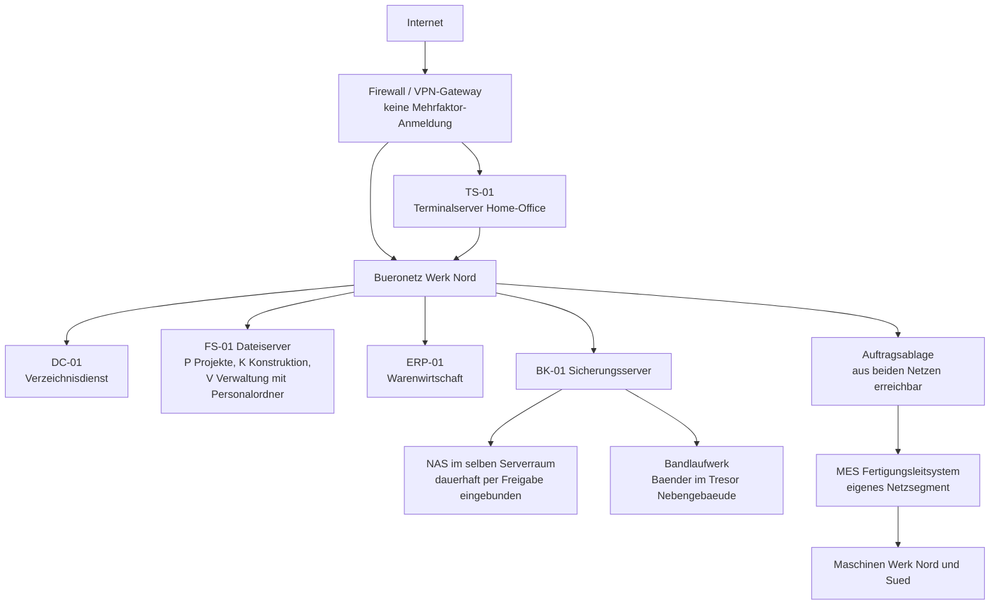

# Übung: Vorfallbearbeitung

<span class='badge badge-praxis'>Aufgaben</span> &nbsp; Eine Tabletop-Übung: kein Rechner nötig, kein Testaufbau, keine Spezialsoftware. Ihr bekommt ein Szenario, ein Bündel Befunde und einen Stapel Maßnahmenkarten – und müsst daraus in Kleingruppen eine Entscheidung machen, die ihr vor der Geschäftsführung begründen könnt.

Vorfallbearbeitung lässt sich nicht lesen, sie muss gespielt werden. Der Grund ist der Zielkonflikt, um den sich alles dreht: **Jede schnelle Maßnahme, die den Schaden stoppt, vernichtet Spuren, die man später braucht.** Wer diesen Konflikt einmal am Tisch durchgestritten hat, trifft die Entscheidung im Ernstfall nicht zum ersten Mal.

!!! abstract "Was ihr in dieser Übung macht"
    - einen gemeldeten Sachverhalt **einordnen** – Ereignis, Störung oder Sicherheitsvorfall – und die Kritikalität begründen
    - die **betroffenen und potenziell betroffenen Systeme** über die drei Ausbreitungswege bestimmen
    - **Sofortmaßnahmen** aus sechzehn Maßnahmenkarten in eine begründete Reihenfolge bringen und dabei Eindämmung gegen Beweissicherung abwägen
    - ein **Vorfallprotokoll** so führen, dass es später als Nachweis taugt
    - die **Meldepflichten** prüfen: an wen, unter welcher Bedingung, in welcher Frist, wer entscheidet
    - **Präventionsmaßnahmen** ableiten und sie den Arten vorbeugend, erkennend und begrenzend zuordnen

!!! note "Vorher lesen"
    Die Übung setzt die beiden Theorieseiten voraus: [Sicherheitsvorfälle](sicherheitsvorfaelle.md) für Einordnung, Ersteinschätzung, Sofortmaßnahmen und Meldepflichten sowie [Beweissicherung & Prävention](beweissicherung-und-praevention.md) für den Umgang mit Spuren und die Ableitung von Maßnahmen. Ohne diese beiden Seiten ist die Übung lösbar, aber deutlich zäher.

---

## So läuft die Übung

| | |
|---|---|
| **Gruppengröße** | 3 bis 5 Personen |
| **Dauer** | 75 bis 90 Minuten Bearbeitung, danach gemeinsame Auswertung |
| **Material** | dieses Dokument, Papier oder ein geteiltes Dokument, ein Zeitnehmer |
| **Ergebnis** | fünf ausgefüllte Teilergebnisse und eine fünfminütige Entscheidungsvorlage für die Geschäftsführung |

**Rollen in der Gruppe.** Verteilt sie am Anfang, das spart später Diskussion:

- **Vorfallverantwortung** – trifft im Zweifel die Entscheidung, damit die Gruppe nicht in Endlosschleifen läuft
- **Protokollführung** – schreibt mit, ab der ersten Minute, und macht sonst nichts anderes
- **Technik** – argumentiert aus Sicht der Administration
- **Fachbereich und Recht** – vertritt Fertigung, Personalabteilung und die Meldepflichten
- (bei fünf Personen) **Beobachtung** – notiert, wo die Gruppe hängen blieb, für die Auswertung

**Zeitrichtwerte je Aufgabe:** Aufgabe 1 rund 20 Minuten, Aufgabe 2 rund 25, Aufgabe 3 rund 15, Aufgabe 4 rund 15, Aufgabe 5 rund 15. Wer schneller ist, nimmt die Zusatzaufgabe.

!!! tip "Zwei Konventionen für diese Übung"
    **Zeitangaben** sind relativ zum Meldeeingang notiert: `T+0:00` ist der Anruf, `T+0:07` sieben Minuten später, `T-11 d` elf Tage vorher. So bleibt die Übung unabhängig von einem konkreten Kalender – im echten Protokoll stünden dort Datum, Uhrzeit und Zeitzone.

    **Alle Zahlen sind erfundene Beispielwerte.** Sie sind so gewählt, dass die Rechnungen aufgehen und die Entscheidungen realistisch sind. Rechtliche Einordnungen in dieser Übung sind fachliche Orientierung, keine Rechtsberatung.

---

## Das Szenario

### Der Betrieb

Die **Kunststofftechnik Marwede GmbH** fertigt im Spritzgussverfahren Bauteile für die Automobilzulieferindustrie und Gehäuse für Medizintechnik. 240 Beschäftigte an zwei Standorten: Werk Nord mit Verwaltung, Konstruktion und Fertigung, Werk Süd mit reiner Fertigung, angebunden über eine Standleitung.

Die IT besteht aus vier Personen – einer Leitung und drei Administratoren – und wird von einem Systemhaus unterstützt, das den Virtualisierungsunterbau betreut.

Zwei Randbedingungen aus dem Geschäft:

- Ein Automobilwerk wird **just in sequence** beliefert: zweimal täglich, in der Reihenfolge, in der beim Kunden montiert wird. Fällt die Belieferung länger als acht Stunden aus, steht dort ein Band. Der Rahmenvertrag sieht dafür Vertragsstrafen vor **und** verpflichtet zur Meldung von IT-Sicherheitsvorfällen mit möglicher Auswirkung auf die Lieferfähigkeit **binnen 24 Stunden**.
- In der Personalabteilung liegen Personalakten, Bewerbungsunterlagen und Unterlagen aus dem betrieblichen Eingliederungsmanagement – letztere mit Gesundheitsbezug.

Eine Cyberversicherung besteht seit gut einem Jahr.

### Die IT-Landschaft



| Bereich | Ist-Zustand |
|---|---|
| **Verzeichnisdienst** | eine Domäne für beide Standorte, DC-01 im Werk Nord |
| **Dateiserver FS-01** | drei große Freigaben: P (Projekte), K (Konstruktion, CAD-Daten), V (Verwaltung, darin `V:\Personal` und `V:\IT\Notfall`) |
| **Terminalserver TS-01** | Zugang für rund 60 Home-Office-Arbeitsplätze, über das VPN erreichbar |
| **Fernzugang** | VPN-Gateway, Anmeldung mit Benutzername und Kennwort, **keine Mehrfaktor-Anmeldung** |
| **Fertigungsnetz** | eigenes Segment mit Firewall zum Büronetz; Auftragsdaten kommen einmal je Schicht als Datei über eine Ablage, die **aus beiden Netzen** erreichbar ist |
| **Sicherung** | nächtlich vom Sicherungsserver auf ein NAS im selben Serverraum, dauerhaft per Freigabe eingebunden; wöchentlich Vollsicherung auf Band, Bänder im Tresor im Nebengebäude |
| **Schutzsoftware** | auf allen Endgeräten und Servern, zentrale Konsole |
| **Überwachung** | Grundüberwachung von Verfügbarkeit und Auslastung, Alarme per E-Mail an ein Sammelpostfach |
| **Protokolle** | liegen lokal auf den Systemen; die Firewall bewahrt ihre Verbindungsprotokolle **14 Tage** auf; kein zentrales Sicherheitsinformations- und Ereignismanagement |
| **Zeitsynchronisation** | nicht durchgängig eingerichtet |

### Der Vorfall

| Zeit | Was passiert |
|---|---|
| **T+0:00** | Anruf in der IT. A. Kranz aus der Buchhaltung: „Ich komme an keine Datei mehr ran. Die heißen jetzt alle anders, hinten steht `.lkd7`. Und in jedem Ordner liegt eine Textdatei `WIEDERHERSTELLUNG.txt`.“ |
| **T+0:03** | Zweiter Anruf aus der Konstruktion: dieselbe Beobachtung auf der Freigabe K. |
| **T+0:05** | Blick ins Monitoring: FS-01 zeigt seit etwa **90 Minuten** ungewöhnlich hohe Schreib- und Netzlast. |
| **T+0:06** | Im Sammelpostfach der Überwachung liegen **41 ungelesene Alarme**, der älteste rund zwei Stunden alt. |
| **T+0:08** | Ein dritter Anruf, diesmal aus Werk Süd: dort ist bislang nichts aufgefallen. |

### Die Befunde

Diese Informationen liegen vor beziehungsweise lassen sich in den ersten Minuten beschaffen. Sie sind bewusst ungeordnet – das Sortieren ist Teil der Aufgabe.

| Nr. | Befund |
|---|---|
| **B1** | Die Konsole der Schutzsoftware zeigt **vor 11 Tagen** einen Fund auf TS-01, Status „in Quarantäne verschoben“. Danach kein weiterer Eintrag zu diesem System. Niemand hat den Fund nachverfolgt. |
| **B2** | Das VPN-Protokoll zeigt **seit 9 Tagen** wiederholte erfolgreiche Anmeldungen des Kontos `svc_wartung` außerhalb der Arbeitszeiten, aus wechselnden Netzen. Das Konto gehört zu einem Maschinenlieferanten für die Fernwartung und besitzt **Domänen-Administratorrechte** – vor Jahren so eingerichtet, „weil es sonst nicht lief“. |
| **B3** | Die **letzten beiden nächtlichen Sicherungsläufe** auf das NAS sind fehlgeschlagen, Meldung „Ziel nicht erreichbar“. Der letzte erfolgreiche Lauf liegt **drei Nächte** zurück. Die Fehlermeldungen liegen ungelesen im Sammelpostfach. |
| **B4** | Die NAS-Freigabe ist auf BK-01 **dauerhaft eingebunden**, mit dem Dienstkonto des Sicherungsprogramms, das darauf Vollzugriff hat. Ob die Sicherungsdateien noch lesbar sind, hat bisher niemand geprüft. |
| **B5** | Die letzte **Bandsicherung** ist **6 Tage alt**. Das Band liegt im Tresor im Nebengebäude. |
| **B6** | `V:\Personal` liegt auf demselben Dateiserver wie die übrigen Freigaben. Ob die Dateien dort verschlüsselt sind, ist noch nicht geprüft. |
| **B7** | Das Firewall-Protokoll zeigt **seit 5 Tagen** jede Nacht ausgehende Verbindungen von TS-01 zu einer Adresse, die vorher nie kontaktiert wurde – jeweils mehrere hundert Megabyte. |
| **B8** | Das Fertigungsleitsystem läuft unauffällig. Die laufende Schicht hat ihre Aufträge bereits. Die **nächste Schichtübergabe** braucht neue Auftragsdaten aus dem ERP – über die Ablage, die aus beiden Netzen erreichbar ist. |
| **B9** | Die Uhren von Firewall, FS-01 und TS-01 weichen um bis zu **drei Minuten** voneinander ab. Die Firewall-Protokolle reichen **14 Tage** zurück. |
| **B10** | Der Notfallplan und die Kontaktliste mit den Nummern von Systemhaus, Versicherung und Geschäftsführung liegen unter `V:\IT\Notfall`. |
| **B11** | Der Text in `WIEDERHERSTELLUNG.txt` nennt eine Frist von 72 Stunden, einen Kontaktweg und die Behauptung, es seien vor der Verschlüsselung **Daten kopiert** worden, die veröffentlicht würden, wenn nicht gezahlt wird. |

---

## Material

### M1 – Kritikalitätsstufen des Betriebs

Diese Einstufung ist in der Sicherheitsrichtlinie der Marwede GmbH festgelegt – also **vor** dem Vorfall.

| Stufe | Merkmale | Reaktion |
|---|---|---|
| **Kritisch** | zentrale Systeme betroffen, Ausbreitung läuft, Gefahr für die Lieferfähigkeit oder Verdacht auf Betroffenheit personenbezogener Daten | sofort, rund um die Uhr, Krisenstab einberufen, Geschäftsführung informieren |
| **Hoch** | ein wichtiges System betroffen, Ausbreitung möglich | innerhalb einer Stunde, Leitung informieren |
| **Mittel** | einzelnes System, begrenzte Wirkung | innerhalb des Arbeitstages |
| **Niedrig** | kein produktives System, kein Datenbezug | im Rahmen der normalen Bearbeitung |

### M2 – Maßnahmenkarten

Sechzehn Karten. Jede kann in eine von drei Schubladen: **sofort**, **danach (koordiniert)** oder **später beziehungsweise gar nicht**. Mehrere Karten dürfen parallel laufen, wenn genug Personen da sind – dann müsst ihr das dazuschreiben.

| Karte | Maßnahme |
|---|---|
| **A** | Den gemeldeten Arbeitsplatz vom Netz trennen (Kabel ziehen oder Switchport deaktivieren), Gerät eingeschaltet lassen |
| **B** | Den gemeldeten Arbeitsplatz herunterfahren |
| **C** | Auf FS-01 die Freigaben entfernen beziehungsweise den Dateidienst anhalten, Server weiterlaufen lassen |
| **D** | Alle Server im Rechenzentrum herunterfahren |
| **E** | Geschäftsführung informieren und Krisenstab einberufen |
| **F** | Sicherungsmedien schützen: NAS vom Netz trennen, Band im Tresor lassen und Tresor nicht öffnen |
| **G** | Kennwörter aller privilegierten Konten und Dienstkonten zurücksetzen |
| **H** | Speicherabbild und forensisches Datenträgerabbild der verdächtigen Systeme erstellen |
| **I** | VPN und alle Fernzugänge deaktivieren |
| **J** | Die Belegschaft informieren |
| **K** | Die Kopplung zwischen Büronetz und Fertigungsnetz trennen |
| **L** | Erpresserschreiben, Bildschirmfotos, Dateinamen und Endungen sichern |
| **M** | Datenschutzbeauftragte einbinden |
| **N** | Verschlüsselte Daten aus der Sicherung zurückspielen |
| **O** | Externe Forensik beauftragen und Cyberversicherung verständigen |
| **P** | Vorfallprotokoll eröffnen und ab sofort lückenlos führen |

### M3 – Vorlage Vorfallprotokoll

**Kopfdaten**

| Feld | Eintrag |
|---|---|
| Vorfallnummer | |
| Meldeeingang (Datum, Uhrzeit, Zeitzone) | |
| Meldeweg | |
| Meldende Person | |
| Aufnehmende Person | |
| Kurzbeschreibung in einem Satz | |
| Erstbewertung (Stufe) und Begründung | |
| Direkt betroffene Systeme | |
| Potenziell betroffene Systeme | |
| Personenbezogene Daten betroffen? | ja / nein / unklar – Begründung |
| Vorfallverantwortung | |
| Protokollführung | |
| Status | offen / in Bearbeitung / eingedämmt / abgeschlossen |

**Verlauf**

| Nr. | Zeitpunkt | Quelle der Zeit | Wer | Beobachtung oder Maßnahme | Ergebnis | Beleg |
|---|---|---|---|---|---|---|
| 01 | | | | | | |
| 02 | | | | | | |

**Abschluss**

| Feld | Eintrag |
|---|---|
| Festgestellte Ursache | |
| Nachweis der Wirksamkeit | |
| Erfolgte Meldungen (an wen, wann, Aktenzeichen) | |
| Freigabe Normalbetrieb durch | |
| Offene Punkte | |
| Termin Nachbereitung | |

---

## Die Aufgaben

### Aufgabe 1 – Einordnen und bewerten

!!! info "Worum es geht"
    - Ereignis, Störung und Sicherheitsvorfall trennen und die Einstufung **begründen**
    - die Kritikalität aus M1 ableiten
    - direkt und potenziell betroffene Systeme über die drei Ausbreitungswege bestimmen
    - den **Verdachtszeitraum** benennen – seit wann könnte der Angreifer im System sein?

1. Ordnet den Sachverhalt ein: Ereignis, Störung oder Sicherheitsvorfall? Begründet in zwei Sätzen.
2. Bestimmt die **Kritikalitätsstufe** nach M1 und begründet sie an mindestens drei Merkmalen aus dem Szenario.
3. Erstellt zwei Listen: **direkt betroffen** und **potenziell betroffen**. Geht dabei die drei Ausbreitungswege durch – über das Netz, über Identitäten, über Daten – und schreibt zu jedem potenziell betroffenen System dazu, **warum** es auf der Liste steht.
4. Bestimmt den **Verdachtszeitraum**: Ab wann müsst ihr davon ausgehen, dass der Angreifer im Netz war? Welche Befunde stützen das? Und: Reichen eure Protokolldaten aus, um diesen Zeitraum auszuwerten?

### Aufgabe 2 – Sofortmaßnahmen in der richtigen Reihenfolge

!!! info "Worum es geht"
    - aus den Maßnahmenkarten eine **begründete Reihenfolge** bilden
    - für jede Karte die Wirkung auf **Eindämmung** und auf die **Beweislage** benennen
    - die heiklen Abwägungen ausdrücklich machen, statt sie zu umgehen

1. Sortiert alle sechzehn Karten aus M2 in die drei Schubladen **sofort**, **danach (koordiniert)** und **später beziehungsweise gar nicht**. Innerhalb der ersten Schublade legt ihr eine Reihenfolge fest.
2. Schreibt zu jeder Karte zwei knappe Spalten: **Wirkung auf die Ausbreitung** und **Wirkung auf die Beweislage**.
3. Benennt die **drei schwierigsten Abwägungen** eurer Liste und begründet, wie ihr euch entschieden habt und was dagegen sprach.
4. Eine der Maßnahmen hat eine unmittelbare Folge für die Fertigung. Welche? Wer darf diese Entscheidung treffen, und welchen Behelfsweg schlagt ihr vor?

### Aufgabe 3 – Das Vorfallprotokoll

!!! info "Worum es geht"
    - ein Protokoll führen, das später als Nachweis taugt
    - Beobachtung und Bewertung trennen, Zeitstempel vollständig führen

1. Füllt die **Kopfdaten** aus M3 vollständig aus.
2. Schreibt **mindestens zehn Verlaufseinträge**, die die erste Stunde abdecken – beginnend mit dem Meldeeingang. Nutzt die Zeitmarken `T+…`.
3. Mindestens zwei eurer Einträge müssen **Negativbefunde** sein („geprüft, nichts gefunden“).
4. Mindestens ein Eintrag muss eine **Entscheidung mit Begründung** dokumentieren.
5. Markiert in euren Einträgen, was **Beobachtung** und was **Bewertung** ist.

### Aufgabe 4 – Meldepflichten prüfen

!!! info "Worum es geht"
    - erkennen, welche Meldewege überhaupt in Frage kommen
    - Fristen, Auslöser und Zuständigkeiten trennen

Erstellt eine Meldematrix mit diesen Spalten: **An wen** – **Auslöser / Bedingung** – **Frist** – **Wer entscheidet** – **Wer erstellt** – **Kanal**.

Prüft dabei mindestens:

1. die Aufsichtsbehörde für den Datenschutz
2. die betroffenen Personen
3. die zuständige Stelle für Betreiber wichtiger Einrichtungen
4. den Automobilkunden
5. die Cyberversicherung
6. Strafverfolgungsbehörden

Schreibt zu jeder Zeile dazu, **welcher Befund aus dem Szenario** sie auslöst – und wo ihr noch etwas prüfen müsst, bevor ihr entscheiden könnt.

### Aufgabe 5 – Präventionsmaßnahmen ableiten

!!! info "Worum es geht"
    - vom Symptom zur Ursache kommen
    - Maßnahmen so formulieren, dass man sie abschließen kann

1. Führt für **einen** der Befunde eine kurze Ursachenanalyse mit der Warum-Kette durch, bis ihr bei etwas ankommt, das ihr tatsächlich ändern könnt.
2. Leitet **mindestens sechs Maßnahmen** ab. Für jede: Ursache, auf die sie zielt · Art (vorbeugend, erkennend, begrenzend) · Wirkung auf Eintrittswahrscheinlichkeit oder Schadenshöhe · verantwortliche Rolle · Termin · Kriterium, an dem man erkennt, dass sie wirkt.
3. Markiert die **drei Maßnahmen mit dem besten Verhältnis aus Wirkung und Aufwand** und begründet die Auswahl.

### Zusatzaufgabe – Die Entscheidungsvorlage

Die Geschäftsführung hat fünf Minuten. Bereitet einen Vortrag von **maximal fünf Minuten** vor, der genau vier Dinge liefert: **Was ist passiert · Was haben wir bereits getan · Welche Entscheidungen brauchen wir jetzt von Ihnen · Was kostet uns das Warten.** Keine Technikbegriffe ohne Übersetzung.

---

## Hilfekarten

Nutzt sie erst, wenn ihr wirklich hängt – und dann eine nach der anderen.

??? tip "Hilfekarte 1 – Die Gruppe kommt bei der Einstufung nicht weiter"
    Die Leitfrage ist nicht „wie schlimm fühlt sich das an“, sondern: **Ist ein Schutzziel verletzt?** Geht die drei einzeln durch:

    - **Verfügbarkeit:** Kommen Leute an ihre Daten? (Nein.)
    - **Integrität:** Sind Daten verändert worden? (Ja, verschlüsselt.)
    - **Vertraulichkeit:** Könnten Daten abgeflossen sein? (Schaut euch B7 und B11 an.)

    Für die Stufe nach M1 reicht schon **ein** erfülltes Merkmal aus der Zeile „kritisch“. Zählt, wie viele erfüllt sind.

??? tip "Hilfekarte 2 – Die Liste der potenziell betroffenen Systeme bleibt zu kurz"
    Ihr habt wahrscheinlich nur aufgeschrieben, was ihr schon gesehen habt. Stellt stattdessen drei Fragen:

    - **Netz:** Was war von TS-01 und von FS-01 aus erreichbar? Und was von einem Konto mit Domänen-Administratorrechten (B2)?
    - **Identität:** Welche Konten waren wo angemeldet oder gespeichert? Was kann `svc_wartung` alles?
    - **Daten:** Wo fließen Daten hin? Denkt an B4 (Sicherung) und B8 (Auftragsablage zum Fertigungsnetz).

    Ein Hinweis: Wenn eure Liste den Verzeichnisdienst nicht enthält, prüft B2 noch einmal.

??? tip "Hilfekarte 3 – Die Reihenfolge der Maßnahmen wird zur Endlosdiskussion"
    Sortiert nicht nach „wichtig“, sondern nach dieser Frage: **Was ist in fünf Minuten unwiederbringlich verloren, wenn wir es jetzt nicht tun?**

    Drei Kandidaten für diese Kategorie:

    - Daten, die gerade noch verschlüsselt werden (jede Minute mehr)
    - die Sicherung, wenn sie erreichbar ist (B4)
    - flüchtige Spuren, wenn jemand ein System ausschaltet

    Alles, was in einer Stunde noch genauso gut geht, gehört nicht in die erste Schublade.

??? tip "Hilfekarte 4 – Ihr seid euch bei „abschalten oder nicht“ uneinig"
    Trennt zwei Fragen, die ihr gerade vermischt:

    1. **Muss die Ausbreitung sofort stoppen?** Ja.
    2. **Muss das System dafür ausgeschaltet werden?** Fast nie.

    Netz trennen stoppt die Ausbreitung genauso gut wie Ausschalten – und erhält den Arbeitsspeicher. Es gibt genau zwei Gründe, davon abzuweichen: Gefahr für Menschen oder Sachwerte, und massiver laufender Schaden, der anders nicht zu stoppen ist. Prüft, ob einer davon hier vorliegt, und schreibt die Antwort ins Protokoll.

??? tip "Hilfekarte 5 – Bei den Meldepflichten fehlt euch der Einstieg"
    Fangt nicht bei den Gesetzen an, sondern bei den Befunden. Fragt zu jedem Befund: **Löst der eine Meldung aus?**

    - B6 und B11 → personenbezogene Daten
    - B8 und die Lieferverpflichtung → Kunde
    - die Branche und die Betriebsgröße → besonders wichtige oder wichtige Einrichtung? Das ist eine **Prüffrage**, keine Selbstverständlichkeit.
    - der Versicherungsvertrag → Obliegenheit zur unverzüglichen Anzeige

    Und die wichtigste Regel: Die Fristen laufen ab **Kenntnis**, nicht ab Aufklärung.

??? tip "Hilfekarte 6 – Eure Präventionsmaßnahmen bleiben zu allgemein"
    Prüft jede Maßnahme mit drei Fragen: Kann man sie **abschließen**? Merkt man, wenn sie **fehlt**? Hat sie einen **Namen und einen Termin**?

    „Mitarbeitende sensibilisieren“ scheitert an allen dreien. Nehmt stattdessen einen Befund und beantwortet: Was genau hätte diesen Befund verhindert? Beispiel B2: ein Dienstkonto mit Domänen-Administratorrechten und ohne Mehrfaktor-Anmeldung am Fernzugang. Daraus werden zwei sehr konkrete Maßnahmen.

---

## Musterlösung

??? success "Musterlösung Aufgabe 1 – Einordnen und bewerten"
    **1. Einordnung**

    Es ist ein **Sicherheitsvorfall**, kein Störungsfall. Begründung: Mit der Verschlüsselung sind mindestens zwei Schutzziele verletzt – die **Verfügbarkeit** (niemand kommt an die Daten) und die **Integrität** (die Daten wurden verändert). Hinzu kommt der begründete Verdacht auf eine Verletzung der **Vertraulichkeit**: B7 zeigt seit fünf Nächten ausgehende Datenmengen zu einer unbekannten Adresse, B11 behauptet einen Abfluss. Ein Verdacht genügt für die Einstufung; er muss nicht bewiesen sein.

    Wichtig für die Auswertung: Die ersten beiden Anrufe hätten in vielen Betrieben als **Störung** im Ticketsystem gelandet – „Dateien lassen sich nicht öffnen“ klingt zunächst danach. Der Abzweig zur Sicherheitsbewertung ist genau der Schritt, der hier den Unterschied macht.

    **2. Kritikalität: kritisch**

    Nach M1 reicht ein erfülltes Merkmal. Hier sind es vier:

    - **Zentrale Systeme betroffen:** FS-01 trägt alle drei großen Freigaben.
    - **Ausbreitung läuft:** die Schreiblast auf FS-01 hält seit rund 90 Minuten an; es wird also gerade weiter verschlüsselt.
    - **Gefahr für die Lieferfähigkeit:** Die nächste Schichtübergabe braucht Auftragsdaten aus dem ERP (B8); der Kunde wird just in sequence beliefert.
    - **Personenbezogene Daten:** `V:\Personal` liegt auf demselben Server (B6), darunter Unterlagen mit Gesundheitsbezug.

    **3. Betroffene Systeme**

    *Direkt betroffen (belegt):*

    | System | Beleg |
    |---|---|
    | FS-01, Freigaben P und K | zwei unabhängige Anwendermeldungen, hohe Schreiblast |
    | Arbeitsplatz Buchhaltung | Erpresserschreiben lokal auf dem Desktop |
    | Arbeitsplatz Konstruktion | zweite Meldung |

    *Potenziell betroffen – mit Begründung über die drei Ausbreitungswege:*

    | System | Weg | Warum es auf der Liste steht |
    |---|---|---|
    | **DC-01 Verzeichnisdienst** | Identität | `svc_wartung` hat Domänen-Administratorrechte (B2) und wird seit neun Tagen fremd genutzt. Wer Domänenadministrator ist, ist überall. **Dieser Eintrag ist der wichtigste der ganzen Liste.** |
    | **TS-01 Terminalserver** | Netz, Identität | Fund vor 11 Tagen (B1), ausgehende Verbindungen seit 5 Nächten (B7). Wahrscheinlicher Ausgangspunkt. |
    | **Freigabe V inkl. `V:\Personal`** | Netz | liegt auf demselben Server wie P und K; getrennte Prüfung nötig |
    | **BK-01 und NAS** | Daten | NAS dauerhaft eingebunden mit Vollzugriff (B4); die beiden fehlgeschlagenen Läufe (B3) sind ein Alarmzeichen, kein Zufall |
    | **ERP-01** | Netz, Identität | im selben Netz, mit denselben Konten erreichbar |
    | **Auftragsablage und darüber das MES** | Daten | die Ablage ist aus beiden Netzen erreichbar (B8) – die Segmentierung hat genau hier ein Loch |
    | **Werk Süd** | Netz | über die Standleitung an dieselbe Domäne angebunden; „bislang nichts aufgefallen“ ist kein Nachweis |
    | **Home-Office-Arbeitsplätze** | Netz, Identität | hängen an TS-01 |

    **4. Verdachtszeitraum**

    Der früheste auffällige Befund ist **B1: der Fund vor 11 Tagen**. Also gilt zunächst: **mindestens 11 Tage**. Weil der Fund selbst schon eine Folge und nicht der Anfang gewesen sein kann, ist der reale Beginn womöglich früher.

    Und hier kommt die unangenehme Rechnung:

    ```text
    Firewall-Protokolle reichen zurueck            =  14 Tage
    Frueheste bekannte Auffaelligkeit (B1)         =  11 Tage
                                                     --------
    Puffer, um noch frueher zu schauen             =   3 Tage
    ```

    Drei Tage Puffer. Liegt der tatsächliche Einstieg mehr als vierzehn Tage zurück, **ist er nicht mehr nachweisbar** – und damit lässt sich ein Datenabfluss aus diesem Zeitraum weder belegen noch ausschließen. Das ist keine akademische Feststellung: Genau daran hängt später die Entscheidung über die Meldung an die betroffenen Personen.

    Dazu kommt B9: Die Uhren weichen um bis zu drei Minuten ab. Für eine Korrelation über mehrere Systeme muss diese Abweichung **gemessen und dokumentiert** werden, bevor jemand aus der Reihenfolge der Einträge eine Schlussfolgerung zieht.

??? success "Musterlösung Aufgabe 2 – Sofortmaßnahmen"
    **Sofort – in dieser Reihenfolge**

    | # | Karte | Wirkung auf die Ausbreitung | Wirkung auf die Beweislage |
    |---|---|---|---|
    | 1 | **P** Protokoll eröffnen | keine | **Grundlage für alles Weitere.** Kostet niemanden Zeit, weil eine eigene Person es übernimmt. Ab jetzt wird jede Handlung mitgeschrieben. |
    | 2 | **F** Sicherungsmedien schützen | verhindert, dass die Sicherung mitverschlüsselt wird | neutral. **Höchste Dringlichkeit**, siehe Begründung unten. |
    | 3 | **C** Freigaben auf FS-01 stoppen | stoppt die laufende Verschlüsselung – der größte Schaden je Minute | neutral, solange der Server läuft. **Nicht herunterfahren.** |
    | 4 | **A** Gemeldete Arbeitsplätze vom Netz | stoppt einen möglichen weiteren Verschlüsselungsherd | erhält Arbeitsspeicher und Verbindungszustand |
    | 5 | **L** Erpresserschreiben sichern | keine | hoch: Textdatei, Dateiendung `.lkd7` und Bildschirmfoto erlauben die Zuordnung der Schadsoftware und sind Beweismittel. Dauert zwei Minuten. |
    | 6 | **E** Geschäftsführung und Krisenstab | keine unmittelbare | keine. **Ohne diesen Schritt darf niemand entscheiden**, ob die Fertigung angehalten wird oder ob Geld ausgegeben wird. |
    | 7 | **I** VPN und Fernzugänge deaktivieren | schließt den wahrscheinlichen Zugangsweg (B2) | erhält alles; das Gateway und seine Protokolle bleiben |
    | 8 | **K** Kopplung zum Fertigungsnetz trennen | schützt das MES und damit die Lieferfähigkeit | neutral |
    | 9 | **O** Forensik und Versicherung | keine | **entscheidend** – ab hier arbeiten Leute mit dem passenden Werkzeug. Versicherung **vor** der Beauftragung anrufen. |
    | 10 | **M** Datenschutzbeauftragte einbinden | keine | keine – aber ab Kenntnis läuft die Frist |

    **Warum F vor C?** Das ist die schwierigste Entscheidung der ganzen Übung, und beide Reihenfolgen sind vertretbar, wenn man sie begründet. Das Argument für F zuerst: Verschlüsselte Dateien sind wiederherstellbar, **solange die Sicherung intakt ist**. Eine zerstörte Sicherung ist durch nichts zu ersetzen. B3 und B4 zusammen sind ein deutliches Alarmzeichen – zwei fehlgeschlagene Läufe hintereinander bei einem dauerhaft eingebundenen Ziel mit Vollzugriff sehen nicht nach einem Netzwerkproblem aus. Wenn genug Personen da sind, laufen F und C ohnehin parallel; die Frage stellt sich nur, wenn eine Person allein anfängt.

    **Danach – koordiniert**

    | # | Karte | Begründung |
    |---|---|---|
    | 11 | **H** Abbilder erstellen | mindestens von TS-01, FS-01 und einem betroffenen Arbeitsplatz – möglichst durch die Forensik oder in Abstimmung mit ihr. Ein falsch gezogenes Abbild ist schlechter als keines. |
    | 12 | **G** Privilegierte Kennwörter zurücksetzen | zwingend, weil `svc_wartung` kompromittiert ist. Aber **gebündelt und vollständig** in einem Zug: alle Domänenadministratoren, alle Dienstkonten, das Sicherungskonto. Ein halber Reset über mehrere Stunden alarmiert den Angreifer und lässt ihm einen Weg. Zeitpunkt mit der Forensik abstimmen. |
    | 13 | **J** Belegschaft informieren | **nicht per E-Mail** – der Angreifer liest möglicherweise mit, und außerdem ist unklar, ob die Mail überhaupt läuft. Weg: Vorgesetzte, Aushang, Telefonkette. Inhalt: Geräte **nicht ausschalten**, nichts anfassen, keine Dateien öffnen, Auffälligkeiten unter dieser Nummer melden. |

    **Später oder gar nicht**

    | Karte | Entscheidung | Begründung |
    |---|---|---|
    | **B** Arbeitsplatz herunterfahren | **nicht jetzt** | Vernichtet den Arbeitsspeicher – oft die einzige Stelle, an der die Schadsoftware überhaupt sichtbar ist. Karte A leistet dasselbe für die Eindämmung, ohne den Verlust. |
    | **N** Aus der Sicherung zurückspielen | **nicht jetzt** | Solange Einfallstor und Verweildauer unklar sind, holt man den Angriff zurück. Voraussetzungen: Ursache geklärt, Systeme bereinigt oder neu aufgesetzt, Zugangsdaten getauscht, saubere Umgebung. |
    | **D** Alle Server herunterfahren | **nein** | Überzogen: Es stoppt nicht mehr als die gezielten Maßnahmen C, I und K, vernichtet dafür alle flüchtigen Spuren auf allen Systemen und legt zusätzlich Systeme still, die noch gebraucht werden – unter anderem für den Behelfsbetrieb der Fertigung. |

    **Die drei schwierigsten Abwägungen**

    1. **Sicherung schützen oder laufende Verschlüsselung stoppen?** Siehe oben. Auflösung im Regelfall: parallel; wenn nicht möglich, erst die Sicherung, weil dieser Verlust endgültig ist.
    2. **Fertigungsnetz trennen und damit die Lieferfähigkeit gefährden – oder gekoppelt lassen und die Ausbreitung riskieren?** Trennen. Der Ausfall der Auftragsübergabe ist mit einem Behelfsweg überbrückbar, ein verschlüsseltes Fertigungsleitsystem nicht.
    3. **Kennwörter sofort zurücksetzen oder erst nach der Beweissicherung?** Nicht als Erstes, aber auch nicht auf die lange Bank: gebündelt, vollständig, mit der Forensik abgestimmt – und zuvor die Zugangswege von außen schließen (Karte I), damit der Angreifer nicht sofort neu hereinkommt.

    **Die Folge für die Fertigung (Teil 4)**

    Karte **K** unterbricht die Auftragsdatenübergabe aus dem ERP. Die laufende Schicht hat ihre Daten, die nächste hätte keine.

    - **Entscheiden darf das die Geschäftsführung**, nicht die IT – es ist eine Abwägung zwischen Lieferverzug und Ausbreitungsrisiko, also eine Geschäftsentscheidung.
    - **Behelfsweg:** Auftragsdaten für die nächste Schicht aus dem ERP ausdrucken oder telefonisch durchgeben und im MES manuell erfassen, bis eine geprüfte Übergabe wieder möglich ist. Kein Datenträger aus dem Büronetz ins Fertigungsnetz – das wäre genau der Weg, den man gerade geschlossen hat.
    - Parallel läuft die Kundenmeldung (Aufgabe 4): Der Kunde kann sich auf einen möglichen Verzug einstellen, wenn er früh Bescheid weiß. Diese Meldung ist ohnehin vertraglich fällig.

??? success "Musterlösung Aufgabe 3 – Das Vorfallprotokoll"
    **Kopfdaten**

    | Feld | Eintrag |
    |---|---|
    | Vorfallnummer | SV-001 |
    | Meldeeingang | T+0:00, Datum, Uhrzeit und Zeitzone im echten Protokoll ausgeschrieben |
    | Meldeweg | Telefon, IT-Sammelnummer |
    | Meldende Person | A. Kranz, Buchhaltung |
    | Aufnehmende Person | T. Sander, IT |
    | Kurzbeschreibung | Auf mehreren Netzfreigaben sind Dateien verschlüsselt; auf betroffenen Geräten liegt ein Erpresserschreiben. |
    | Erstbewertung | **kritisch** – zentrale Systeme betroffen, Ausbreitung läuft, Lieferfähigkeit gefährdet, personenbezogene Daten möglicherweise betroffen |
    | Direkt betroffen | FS-01 (Freigaben P und K), AP Buchhaltung, AP Konstruktion |
    | Potenziell betroffen | DC-01, TS-01, Freigabe V inkl. `V:\Personal`, BK-01 und NAS, ERP-01, Auftragsablage und MES, Werk Süd, Home-Office-Arbeitsplätze |
    | Personenbezogene Daten | **unklar, im Zweifel ja** – `V:\Personal` liegt auf FS-01; Prüfung läuft |
    | Vorfallverantwortung | K. Ohlsen, IT-Leitung |
    | Protokollführung | M. Reineke |
    | Status | in Bearbeitung |

    **Verlauf – Auszug**

    | Nr. | Zeit | Quelle der Zeit | Wer | Beobachtung / Maßnahme | Ergebnis | Beleg |
    |---|---|---|---|---|---|---|
    | 01 | T+0:00 | Uhr IT-Telefon | Sander | *Beobachtung:* Meldung A. Kranz, Dateien auf P nicht zu öffnen, Endung `.lkd7`, Datei `WIEDERHERSTELLUNG.txt` in jedem Ordner | aufgenommen | Anrufnotiz |
    | 02 | T+0:03 | Uhr IT-Telefon | Sander | *Beobachtung:* zweite Meldung aus der Konstruktion, Freigabe K betroffen | bestätigt, zwei unabhängige Quellen | Anrufnotiz |
    | 03 | T+0:05 | Monitoringserver | Sander | *Beobachtung:* FS-01 seit ca. 90 min hohe Schreib- und Netzlast | Verschlüsselung läuft vermutlich noch | Bildschirmfoto Monitoring |
    | 04 | T+0:07 | Uhr IT-Telefon | Ohlsen | *Bewertung:* Einstufung als Sicherheitsvorfall, Stufe kritisch. Begründung siehe Kopf. Vorfallverantwortung übernommen. | Krisenstab wird einberufen | – |
    | 05 | T+0:09 | Uhr BK-01 | Reineke | *Maßnahme:* NAS-Freigabe auf BK-01 getrennt, NAS-Switchport deaktiviert. Tresor bleibt geschlossen. | Sicherungsziel nicht mehr erreichbar | Bildschirmfoto Switch |
    | 06 | T+0:12 | Uhr FS-01 | Sander | *Maßnahme:* Freigaben P, K, V auf FS-01 entfernt, Dateidienst angehalten. **Server bewusst nicht heruntergefahren** (Erhalt flüchtiger Spuren). *Entscheidung durch Ohlsen.* | Schreiblast fällt binnen 2 min auf Normalwert | Bildschirmfoto Ressourcenanzeige |
    | 07 | T+0:15 | Uhr AP | Sander | *Maßnahme:* Netzwerkkabel an AP Buchhaltung und AP Konstruktion gezogen, Geräte eingeschaltet gelassen | Portstatus am Switch: down | Bildschirmfoto Switch |
    | 08 | T+0:18 | Uhr AP | Sander | *Beweissicherung:* `WIEDERHERSTELLUNG.txt` auf Wechselmedium gesichert, Prüfsumme SHA-256 gebildet und notiert, zwei Bildschirmfotos erstellt | Beweismittel BM-001 | Übergabeprotokoll |
    | 09 | T+0:21 | Uhr Firewall | Reineke | *Beobachtung:* Firewall-Protokoll zeigt seit 5 Nächten ausgehende Verbindungen von TS-01 zu unbekanntem Ziel, je mehrere hundert MB. *Bewertung:* Verdacht auf Datenabfluss. | Verdachtszeitraum auf mind. 11 Tage erweitert (siehe Eintrag 12) | Protokollauszug, Prüfsumme |
    | 10 | T+0:24 | Uhr VPN | Reineke | *Maßnahme:* VPN und alle Fernzugänge deaktiviert, aktive Sitzungen getrennt | keine aktive Sitzung mehr, Testeinwahl schlägt fehl | Bildschirmfoto Sitzungsliste |
    | 11 | T+0:29 | Uhr Firewall | Ohlsen | *Maßnahme:* Kopplung Büronetz ↔ Fertigungsnetz getrennt. *Entscheidung durch Geschäftsführung (Hensler) um T+0:27, Begründung: Schutz der Fertigung hat Vorrang vor der automatisierten Auftragsübergabe; Behelfsweg vereinbart.* | MES weiterhin unauffällig | Regeländerung protokolliert |
    | 12 | T+0:33 | Konsole Schutzsoftware | Reineke | *Beobachtung:* Fund auf TS-01 vor 11 Tagen, Status Quarantäne, keine Nachverfolgung. *Bewertung:* frühester bekannter Anhaltspunkt. | Verdachtszeitraum ≥ 11 Tage | Bildschirmfoto Konsole |
    | 13 | T+0:38 | Uhr FS-01 | Sander | **Negativbefund:** Freigabe V stichprobenartig geprüft, in `V:\Personal` bisher **keine** verschlüsselten Dateien gefunden. Prüfung nicht abgeschlossen. | Betroffenheit weiter unklar, im Zweifel ja | Prüfvermerk, Dateiliste |
    | 14 | T+0:41 | Uhr Werk Süd | Sander | **Negativbefund:** Stichprobe auf drei Arbeitsplätzen Werk Süd, keine Auffälligkeiten. Keine abschließende Aussage. | – | Prüfvermerk |
    | 15 | T+0:46 | Uhr IT-Telefon | Ohlsen | *Maßnahme:* Systemhaus und Forensikdienstleister verständigt; **zuvor** Cyberversicherung angerufen und Beauftragung freigeben lassen | Forensik trifft in ca. 3 h ein | Schadennummer der Versicherung |
    | 16 | T+0:52 | Uhr IT-Telefon | Ohlsen | *Maßnahme:* Datenschutzbeauftragte informiert, Sachverhalt übergeben | Fristprüfung nach Art. 33 DSGVO läuft, Kenntniszeitpunkt T+0:07 festgehalten | Gesprächsnotiz |

    **Worauf es bei der Bewertung ankommt**

    - Jeder Eintrag hat **Zeit, Quelle der Zeit, Person, Inhalt, Ergebnis und Beleg**. Die Spalte „Quelle der Zeit“ ist wegen B9 kein Luxus.
    - **Beobachtung und Bewertung sind gekennzeichnet.** Eintrag 09 enthält beides und trennt es sauber.
    - **Negativbefunde** stehen drin (13, 14). Ohne sie kann später niemand unterscheiden, ob etwas geprüft und für sauber befunden wurde oder ob nur niemand hingeschaut hat.
    - **Entscheidungen tragen einen Namen und eine Begründung** (06, 11). Das ist der Teil, der Monate später am wichtigsten ist.
    - Der **Kenntniszeitpunkt** ist ausdrücklich festgehalten (16). An ihm hängt die Meldefrist.

??? success "Musterlösung Aufgabe 4 – Meldepflichten"
    | An wen | Auslöser | Frist | Wer entscheidet | Wer erstellt | Kanal |
    |---|---|---|---|---|---|
    | **Datenschutz-Aufsichtsbehörde** | Verletzung des Schutzes personenbezogener Daten mit Risiko für Betroffene – ausgelöst durch B6 (Personaldaten auf FS-01) und B11 (behaupteter Abfluss) | **72 Stunden ab Kenntnis** (Art. 33 DSGVO) | Verantwortlicher, also die Geschäftsführung | Datenschutzbeauftragte mit Zuarbeit der IT | Meldeportal der zuständigen Aufsichtsbehörde |
    | **Betroffene Personen** | voraussichtlich **hohes** Risiko – hier naheliegend wegen Personalakten und Unterlagen mit Gesundheitsbezug | unverzüglich (Art. 34 DSGVO) | Geschäftsführung, beraten durch Datenschutzbeauftragte | Personalabteilung gemeinsam mit Datenschutz | schriftlich, in klarer und einfacher Sprache |
    | **Zuständige Stelle für wichtige Einrichtungen** | **erst prüfen:** Fällt der Betrieb unter die erfassten Sektoren, und werden die Größenschwellen erreicht? Bei 240 Beschäftigten und Fertigung von Kraftwagenteilen ist das eine ernsthafte Möglichkeit, keine Formalie. | gestuft: **Frühwarnung 24 h**, Meldung 72 h, Abschlussbericht ein Monat | Geschäftsführung | IT-Leitung mit Rechtsberatung | vorgesehenes Meldeportal |
    | **Automobilkunde** | vertragliche Pflicht bei möglicher Auswirkung auf die Lieferfähigkeit – ausgelöst durch B8 und die Trennung des Fertigungsnetzes | **24 Stunden** laut Rahmenvertrag | Geschäftsführung / Vertrieb | Vertrieb mit Zuarbeit der IT | vertraglich festgelegter Weg, in der Regel Kundenportal oder benannter Ansprechpartner |
    | **Cyberversicherung** | Obliegenheit zur unverzüglichen Anzeige; zusätzlich Freigabe vor der Beauftragung von Dienstleistern | unverzüglich, **vor** der Beauftragung externer Hilfe | Geschäftsführung | IT-Leitung | Notfallnummer des Versicherers |
    | **Strafverfolgung** | freiwillig; Ansprechpartner sind die Zentralen Ansprechstellen Cybercrime der Landeskriminalämter | keine Frist | Geschäftsführung | IT-Leitung | Zentrale Ansprechstelle Cybercrime |

    **Die vier Punkte, an denen Gruppen typischerweise danebenliegen**

    1. **„Wir melden, wenn wir es aufgeklärt haben.“** Falsch. Die Frist läuft ab **Kenntnis der Verletzung**, nicht ab der Aufklärung. Nach 72 Stunden ist ein Vorfall dieser Größe regelmäßig noch nicht aufgeklärt – deshalb ist die Meldung ausdrücklich als erste Meldung mit späterer Ergänzung vorgesehen.

    2. **„Es ist nichts abgeflossen, also keine Meldung.“** Falsch, gleich doppelt. Erstens ist auch die **Verschlüsselung** eine Verletzung des Schutzes personenbezogener Daten – der Verlust der Verfügbarkeit reicht. Zweitens ist der Abfluss hier nicht ausgeschlossen: B7 und B11 sprechen dafür, und wegen der 14-Tage-Grenze der Protokolle lässt er sich womöglich gar nicht ausschließen. **Was man nicht ausschließen kann, muss man annehmen.**

    3. **„Das entscheidet die IT.“** Falsch. Die IT liefert den Sachverhalt, die Datenschutzbeauftragten beraten, entschieden wird durch den Verantwortlichen – die Geschäftsführung. Die IT-Aufgabe lautet: den Sachverhalt so schnell und so vollständig aufbereiten, dass die Entscheidung möglich ist.

    4. **„Wir sind doch keine kritische Infrastruktur.“** Zu schnell. Der Kreis der erfassten Einrichtungen ist deutlich weiter als der klassische KRITIS-Begriff und umfasst auch Teile des verarbeitenden Gewerbes. Die Prüfung geht in drei Schritten: **Sektor – Größe – Sonderregeln.** Das Ergebnis dieser Prüfung gehört ins Protokoll, egal wie es ausfällt.

    Zusätzlich zu dokumentieren, unabhängig von jeder Meldung: die **Dokumentationspflicht** für jede Verletzung des Schutzes personenbezogener Daten, einschließlich der Begründung, falls **nicht** gemeldet wird.

??? success "Musterlösung Aufgabe 5 – Prävention"
    **1. Ursachenanalyse am Beispiel B2**

    ```text
    Beobachtung   Ein Wartungskonto wurde 9 Tage lang unbemerkt von aussen
                  benutzt.

      Warum?      Die Anmeldung am Fernzugang braucht nur Benutzername und
                  Kennwort.
      Warum?      Eine Mehrfaktor-Anmeldung wurde nie eingefuehrt.
      Warum?      Sie galt als aufwendig, und "das Konto braucht ja nur der
                  Maschinenlieferant".
      Warum?      Niemand hat je aufgeschrieben, welche Rechte dieses Konto
                  hat - naemlich Domaenen-Administrator.
      Warum?      Die Rechte wurden vor Jahren pauschal vergeben, weil es
                  "sonst nicht lief", und seither nie ueberprueft.

    Ursache       Eine unbefristete, nie ueberpruefte Rechteausnahme fuer ein
                  externes Dienstkonto an einem Zugang ohne zweiten Faktor.
    ```

    Beachtenswert: Die Kette endet nicht bei „der Dienstleister war unvorsichtig“, sondern bei einer **eigenen Entscheidung ohne Wiedervorlage**. Das ist der häufigste Ursachentyp überhaupt.

    **2. Maßnahmen**

    | Ursache | Maßnahme | Art | Wirkt auf | Rolle | Termin | Woran man die Wirkung erkennt |
    |---|---|---|---|---|---|---|
    | B2 – Fernzugang ohne zweiten Faktor | Mehrfaktor-Anmeldung für alle Fernzugänge und alle privilegierten Konten verpflichtend | vorbeugend | Eintrittswahrscheinlichkeit | IT-Leitung | 6 Wochen | Anteil der Zugänge mit zweitem Faktor = 100 %; Nachweis aus der Konfiguration |
    | B2 – Dienstkonto mit Domänen-Administratorrechten | Alle Dienst- und Fremdkonten inventarisieren, Rechte auf das Nötige reduzieren, Fernwartungszugänge nur nach Anforderung freischalten und danach wieder schließen | vorbeugend | Eintrittswahrscheinlichkeit **und** Schadenshöhe (weniger Reichweite) | IT-Leitung | 8 Wochen | Liste aller Dienstkonten mit begründeten Rechten; kein Fremdkonto mehr mit Domänen-Administratorrechten |
    | B3, B4 – Sicherung erreichbar und Fehler unbemerkt | Eine Kopie der Sicherung dauerhaft unerreichbar halten: ausgelagert oder für die Aufbewahrungsdauer technisch unveränderbar; eigene Zugangsdaten für das Sicherungssystem | begrenzend | Schadenshöhe | IT-Leitung | 10 Wochen | Nachweis, dass ein übernommenes Domänenkonto die Sicherung nicht löschen kann; erfolgreicher Wiederherstellungstest |
    | B3 – Alarme im Sammelpostfach | Fehlgeschlagene Sicherungsläufe und Funde der Schutzsoftware erzeugen ein **Ticket mit Bearbeiter**, nicht nur eine Mail; unbearbeitete Tickets eskalieren nach 24 h | erkennend | Schadenshöhe | IT-Leitung | 4 Wochen | Kennzahl: Zeit bis zur ersten Bearbeitung eines Sicherheitsalarms, Zielwert unter 4 Stunden |
    | B1 – Fund nicht nachverfolgt | Verbindliche Regel: Jeder Fund der Schutzsoftware auf einem Server wird innerhalb eines Arbeitstages nachverfolgt und der Vorgang abgeschlossen dokumentiert | erkennend | Schadenshöhe | IT-Leitung | 4 Wochen | Stichprobe: Zu jedem Fund existiert ein abgeschlossener Vorgang |
    | B8 – Loch in der Segmentierung | Auftragsdatenübergabe über einen kontrollierten, einseitig gerichteten Weg statt über eine aus beiden Netzen erreichbare Ablage | vorbeugend | Eintrittswahrscheinlichkeit für das Fertigungsnetz | IT-Leitung mit Fertigung | 12 Wochen | Nachweis, dass aus dem Büronetz kein schreibender Zugriff ins Fertigungsnetz mehr möglich ist |
    | B9 – Protokolle zu kurz, Uhren asynchron | Zentrale Protokollsammlung mit mindestens 90 Tagen Aufbewahrung; durchgängige Zeitsynchronisation aus einer Quelle; Überwachung der Uhrenabweichung | erkennend | Schadenshöhe | IT-Leitung | 12 Wochen | Stichprobe: Ereignis von vor 60 Tagen über drei Systeme rekonstruierbar |
    | B10 – Notfallplan auf dem betroffenen Server | Notfallplan und Kontaktliste ausgedruckt und zusätzlich außerhalb der Domäne vorhalten, halbjährlich aktualisieren | begrenzend | Schadenshöhe | IT-Leitung | 2 Wochen | Der Plan ist im Ernstfall greifbar – in der nächsten Planübung geprüft |
    | Meldeprozess | Meldematrix nach dem Muster aus Aufgabe 4 erstellen, ausdrucken, jährlich prüfen | begrenzend | Schadenshöhe | Geschäftsführung mit Datenschutz | 6 Wochen | In der nächsten Planübung wird die richtige Frist ohne Nachschlagen genannt |

    **3. Die drei mit dem besten Verhältnis aus Wirkung und Aufwand**

    1. **Mehrfaktor-Anmeldung am Fernzugang.** Sie hätte den wahrscheinlichen Einstieg (B2) allein verhindert. Aufwand überschaubar, Wirkung sehr groß – die wirksamste Einzelmaßnahme gegen gestohlene Zugangsdaten.
    2. **Sicherung unerreichbar machen.** Sie entscheidet darüber, ob dieser Vorfall ein teurer Tag oder eine Existenzfrage wird. Ohne sie ist jede andere Maßnahme nur ein Aufschub.
    3. **Alarme mit Bearbeiter statt Sammelpostfach.** Fast kostenlos. Sie hätte den Vorfall über B1 elf Tage früher und über B3 zwei Tage früher sichtbar gemacht. Die 41 ungelesenen Alarme sind der eigentliche Skandal des Szenarios – die Technik hat funktioniert, gefehlt hat die Zuständigkeit.

    **Was in dieser Tabelle bewusst nicht steht:** „Mitarbeitende sensibilisieren.“ Nicht weil Sensibilisierung unwichtig wäre – sondern weil sie in dieser Form keine Maßnahme ist. Eine brauchbare Fassung hätte Zielgruppe, Inhalt, Umfang, Termin, Verantwortlichen und ein Wirksamkeitskriterium. Und im vorliegenden Fall wäre sie ohnehin zweitrangig: Der Einstieg lief nicht über einen Klick, sondern über ein Konto mit zu vielen Rechten an einem Zugang ohne zweiten Faktor.

??? success "Musterlösung Zusatzaufgabe – Die Entscheidungsvorlage"
    **Was ist passiert.** Seit heute Vormittag verschlüsselt ein Angreifer unsere Dateiserver. Wir haben Hinweise darauf, dass er seit mindestens elf Tagen im Netz war und in den letzten fünf Nächten Daten nach außen übertragen hat. Der Zugang lief mit hoher Wahrscheinlichkeit über ein Wartungskonto eines Lieferanten mit weitreichenden Rechten.

    **Was wir bereits getan haben.** Die Verschlüsselung ist gestoppt, die Freigaben sind abgeschaltet. Die Sicherungen sind vom Netz getrennt und geschützt. Alle Zugänge von außen sind gesperrt. Das Fertigungsnetz ist vom Büronetz getrennt; die laufende Schicht produziert weiter. Forensik und Versicherung sind verständigt, die Datenschutzbeauftragte ist eingebunden.

    **Was wir jetzt von Ihnen brauchen – vier Entscheidungen.**

    1. **Freigabe für die externe Forensik** und für die Kosten. Ohne sie können wir einen Datenabfluss weder belegen noch ausschließen – und davon hängt Punkt 3 ab.
    2. **Behelfsbetrieb der Fertigung**: Auftragsdaten für die nächste Schicht manuell übergeben, bis eine geprüfte Verbindung wieder steht. Wir brauchen dafür zwei Personen aus der Arbeitsvorbereitung.
    3. **Meldeentscheidungen**: Der Kunde ist binnen 24 Stunden zu informieren, die Aufsichtsbehörde binnen 72 Stunden ab heute Vormittag. Beides entscheiden Sie, wir bereiten es vor.
    4. **Keine Zahlung** an die Erpresser, solange wir die Wiederherstellung nicht bewertet haben. Wir empfehlen ausdrücklich, das Bandmedium zuerst zu prüfen.

    **Was uns das Warten kostet.** Die aktuelle Datenlage bedeutet im günstigen Fall drei Tage, im ungünstigen sechs Tage Datenverlust:

    ```text
    Ziel fuer den maximalen Datenverlust laut Konzept  =   24 Stunden
    Letzte erfolgreiche Sicherung auf das NAS          =   72 Stunden  (3 Naechte)
    Letzte Bandsicherung                               =  144 Stunden  (6 Tage)

    Fall A  NAS noch verwertbar    ->  72 h Datenverlust  =  3-facher Zielwert
    Fall B  NAS mitbetroffen       -> 144 h Datenverlust  =  6-facher Zielwert
    ```

    Jede Stunde ohne Entscheidung über die Forensik verlängert den Zeitraum, in dem wir nicht sagen können, ob Personaldaten abgeflossen sind – und damit den Zeitraum, in dem wir die Frist gegenüber der Aufsichtsbehörde nur noch mit einer unvollständigen Meldung halten können.

---

## Typische Fehler

Diese Punkte kommen in fast jeder Runde vor. Sie eignen sich für die gemeinsame Auswertung besser als jede Musterlösung.

| Fehler | Warum er teuer ist |
|---|---|
| **Sofort alles herunterfahren** | Vernichtet auf allen Systemen die flüchtigen Spuren, ohne mehr einzudämmen als eine gezielte Trennung. Danach ist die Ursachenklärung Rätselraten. |
| **Die Sicherung zu spät bedenken** | Die Karte F rutscht oft nach hinten, weil sie unspektakulär wirkt. Genau sie entscheidet aber darüber, ob der Vorfall überlebbar ist. |
| **Sofort wiederherstellen wollen** | Ohne geklärtes Einfallstor und ohne bereinigte Systeme holt man den Angriff zurück – diesmal mit dem Gefühl, fertig zu sein. |
| **Per E-Mail kommunizieren** | Der Angreifer liest womöglich mit, und die Mail läuft eventuell gar nicht mehr. Der Ausweichkanal gehört in die Vorbereitung. |
| **Mit der Meldung warten, bis alles geklärt ist** | Die Frist läuft ab Kenntnis. Eine unvollständige erste Meldung ist vorgesehen; eine verspätete ist ein eigener Verstoß. |
| **Nur technisch handeln** | Ohne Krisenstab darf niemand entscheiden, ob die Fertigung angehalten wird oder Geld ausgegeben wird – und ohne Datenschutz läuft die Frist unbemerkt ab. |
| **Das Protokoll hinterher schreiben** | Nach drei durchgearbeiteten Tagen erinnert niemand mehr Reihenfolgen und Uhrzeiten. Damit ist der Nachweis wertlos. |
| **Kennwörter verstreut zurücksetzen** | Ein halber Reset über mehrere Stunden alarmiert den Angreifer und lässt ihm einen Weg. Gebündelt oder gar nicht. |
| **Den Verdachtszeitraum erst ab der Meldung ansetzen** | Dann prüft man genau den Zeitraum, in dem nichts mehr passiert ist. Der Verdachtszeitraum beginnt beim frühesten auffälligen Befund. |
| **Das Fertigungsnetz für sicher halten** | „Eigenes Segment“ klingt gut, bis man B8 liest. Eine aus beiden Netzen erreichbare Ablage ist ein Loch in der Segmentierung. |
| **Personaldaten übersehen** | `V:\Personal` liegt auf demselben Server. Wer das nicht prüft, verpasst den Auslöser der wichtigsten Frist. |
| **Zahlen als Plan A** | Eine Zahlung garantiert weder Entschlüsselung noch, dass die abgeflossenen Daten nicht doch veröffentlicht werden. Sie finanziert das Geschäftsmodell und ändert nichts an den Meldepflichten. Vom Bundesamt für Sicherheit in der Informationstechnik wird ausdrücklich davon abgeraten. |

---

## Reflexionsfragen für die Auswertung

1. **An welcher Stelle habt ihr am längsten diskutiert – und woran lag es?** Fehlte eine Information, eine Regel oder eine Zuständigkeit? Fast immer ist es die Zuständigkeit, und genau die kann man vorher festlegen.
2. **Welche eurer Sofortmaßnahmen hätte Spuren vernichtet, die ihr später gebraucht hättet?** Und hättet ihr das im Moment der Entscheidung überhaupt gemerkt?
3. **Welcher einzelne Befund im Szenario hätte den Vorfall am frühesten sichtbar gemacht?** Warum ist er trotzdem liegen geblieben – und was sagt das über den Unterschied zwischen einem Alarm und einer Zuständigkeit?
4. **Was hättet ihr im eigenen Betrieb im Ernstfall nicht griffbereit?** Kontaktliste, Netzplan, Rechteübersicht, Meldematrix, Versicherungsnummer – prüft ehrlich, was davon auf einem Server liegt, der betroffen sein könnte.
5. **Die Geschäftsführung fragt: „Sollen wir zahlen?“ Wie antwortet ihr in drei Sätzen?** Und welche Informationen braucht ihr, um überhaupt antworten zu können?
6. **Welche drei Maßnahmen würdet ihr im eigenen Betrieb als Erstes anstoßen** – und wie begründet ihr die Reihenfolge gegenüber jemandem, der das Budget freigeben muss?

---

## Bewertungsraster

Zur Selbsteinschätzung oder für die Auswertung im Plenum.

| Kriterium | Erfüllt, wenn … |
|---|---|
| **Einordnung** | die Einstufung an Schutzzielen begründet ist, nicht am Bauchgefühl |
| **Auswirkungsanalyse** | die potenziell betroffenen Systeme über alle drei Ausbreitungswege bestimmt sind und der Verzeichnisdienst dabei ist |
| **Verdachtszeitraum** | er beim frühesten Befund beginnt und die Reichweite der Protokolldaten geprüft wurde |
| **Reihenfolge** | jede Karte eine Begründung hat und die Beweislage ausdrücklich mitbedacht ist |
| **Abwägung** | mindestens die Abwägung „trennen statt abschalten“ und der Konflikt Fertigung gegen Ausbreitung sauber ausformuliert sind |
| **Protokoll** | Zeitstempel mit Quelle, Trennung von Beobachtung und Bewertung, Negativbefunde und mindestens eine begründete Entscheidung enthalten sind |
| **Meldepflichten** | Auslöser, Frist, Entscheider und Kanal getrennt sind und der Kenntniszeitpunkt festgehalten ist |
| **Prävention** | jede Maßnahme eine Ursache, eine Art, eine Rolle, einen Termin und ein Wirksamkeitskriterium hat |
| **Vorlage** | die fünf Minuten ohne unübersetzte Fachbegriffe auskommen und mit vier klaren Entscheidungsfragen enden |

---

## Weiterlesen

- [Sicherheitsvorfälle](sicherheitsvorfaelle.md): die Theorie zu Erkennung, Ersteinschätzung, Sofortmaßnahmen, Wirksamkeitsprüfung und Meldepflichten
- [Beweissicherung & Prävention](beweissicherung-und-praevention.md): Reihenfolge der Flüchtigkeit, Prüfsummen, Protokollsicherung und die Ableitung von Maßnahmen
- [Risikomanagement](risikomanagement.md): wohin die Maßnahmen aus Aufgabe 5 wandern – Risikoregister, Bewertung, Steuerung
- [Übungen: Risikoanalyse](uebungen-risikoanalyse.md): fünfzehn weitere Aufgaben zum Verfahren, darunter drei im Prüfungsformat
- [Backup & Recovery](../betrieb/backup-und-recovery.md): warum die Sicherung in diesem Szenario die entscheidende Karte ist
- [Incident Response & Business Continuity](../betrieb/incident-und-bcm.md): der Weg zurück in den Normalbetrieb nach der Eindämmung
