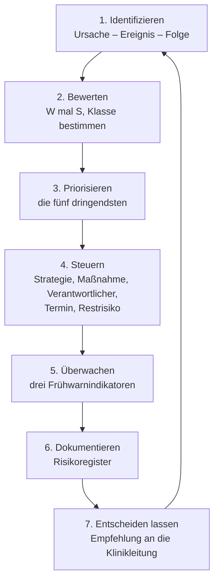

# Übungen – Risikoanalyse

<span class='badge badge-praxis'>Aufgaben</span> &nbsp; Fünfzehn Aufgaben, in denen du das Verfahren von der Seite [Risikomanagement](risikomanagement.md) selbst anwendest. Jede Aufgabe steht für sich – du kannst einsteigen, wo du willst.

Der Satz ist so gebaut, dass er den Prozess nachzeichnet: Die Aufgaben 1 bis 4 üben das **Identifizieren und Formulieren**, die Aufgaben 5 bis 8 das **Bewerten und Rechnen**, die Aufgaben 9 bis 11 das **Steuern**. Aufgabe 12 führt alles an einem großen Szenario zusammen und eignet sich als Gruppenarbeit über eine bis anderthalb Stunden. Die drei **[Aufgaben im Prüfungsformat](#aufgaben-im-prufungsformat)** am Ende üben zusätzlich die Form: knappe Fragestellungen mit Punktzahlen, aus denen du die erwartete Antworttiefe selbst ableitest.

Ein Hinweis vorweg: Alle Wahrscheinlichkeiten, Schadenshöhen und Kosten sind **erfundene Beispielwerte**. In der Praxis kommen solche Zahlen aus Störungsstatistiken, Verträgen und Gesprächen mit den Fachabteilungen – und sie bleiben auch dort Schätzungen. Geübt wird hier das Verfahren, nicht das Auswendiglernen von Zahlen. Wo es um rechtliche Fragen geht, gilt derselbe Vorbehalt wie überall: Das sind Einordnungen, keine Rechtsberatung.

!!! tip "So arbeitest du damit"
    Beantworte jede Aufgabe **erst selbst schriftlich** und klapp die Musterlösung danach auf. Bei den Bewertungsaufgaben ist deine Zahl nicht automatisch falsch, wenn sie von der Musterlösung abweicht – entscheidend ist die **Begründung**. Genau darauf kommt es auch in der Praxis an: Eine Bewertung, die niemand begründen kann, überlebt die erste Rückfrage nicht.

---

## Die Aufgaben

### Aufgabe 1 – Bedrohung, Schwachstelle oder Risiko?

!!! info "Worum es geht"
    - Die vier Begriffe **Bedrohung**, **Schwachstelle**, **Risiko** und **Schaden** sauber auseinanderhalten
    - Erkennen, dass ein Risiko erst dort entsteht, wo eine Bedrohung auf eine Schwachstelle trifft
    - Theorie dazu: [Risikomanagement](risikomanagement.md)

In einem Risiko-Workshop bei der **Zerspanungstechnik Gerling GmbH** trägt die Runde zusammen, was ihr einfällt. Der Protokollant schreibt alles ungefiltert mit – so, wie es gesagt wird. Am Ende stehen zehn Zeilen an der Wand:

| Nr. | Aussage aus dem Protokoll |
|---|---|
| **1** | Der Serverraum hat keine Brandmeldeanlage. |
| **2** | Ein Brand bricht aus. |
| **3** | Die Fertigung steht seit drei Tagen still. |
| **4** | Die Firewall-Regeln wurden seit zwei Jahren nicht geprüft. |
| **5** | Über E-Mail-Anhänge verbreitete Verschlüsselungstrojaner sind seit Jahren im Umlauf. |
| **6** | Auf dem Terminalserver läuft ein Betriebssystem, für das der Hersteller keine Sicherheitsupdates mehr liefert. |
| **7** | Weil Makros in Office-Dokumenten nicht blockiert sind, kann ein Verschlüsselungstrojaner aus einem E-Mail-Anhang die Dateiserver erreichen; die Auftragsbearbeitung stünde dann mehrere Tage still. |
| **8** | Bei der Migration im März sind die Stammdaten von 400 Kunden verloren gegangen. |
| **9** | Das Kennwort für das Sicherungssystem kennt genau eine Person. |
| **10** | Im Gewerbegebiet fällt der Strom mehrmals im Jahr für einige Minuten aus. |

1. **Ordne jede der zehn Aussagen einer der vier Kategorien zu** – Bedrohung, Schwachstelle, Risiko oder Schaden. Schreib zu jeder Zuordnung einen halben Satz Begründung.
2. **Bau aus je einer Bedrohung und einer passenden Schwachstelle ein Risiko.** Formuliere zwei vollständige Risikosätze nach dem Muster „Weil …, kann … eintreten, mit der Folge, dass …".
3. **Warum ist eine Bedrohung ohne passende Schwachstelle kein Risiko?** Begründe es an einer der Bedrohungen aus der Liste.

??? tip "Musterlösung & Erklärung"
    **1. Musterantwort**

    *Teil 1 – die Zuordnung:*

    | Nr. | Kategorie | Begründung |
    |---|---|---|
    | **1** | Schwachstelle | Eine Eigenschaft des eigenen Hauses. Sie schadet von allein niemandem – sie macht angreifbar. |
    | **2** | Bedrohung | Ein schädigendes Ereignis. Die Aussage sagt nichts darüber, ob wir dagegen gewappnet sind oder was es kosten würde. |
    | **3** | Schaden | Eingetreten. Hier ist nichts mehr zu schätzen, hier wird gezählt. |
    | **4** | Schwachstelle | Ein Versäumnis im eigenen Prozess – ungeprüfte Regeln sammeln über Jahre Ausnahmen an, die niemand mehr begründen kann. |
    | **5** | Bedrohung | Eine Lage draußen in der Welt, für jeden Betrieb der Branche identisch. |
    | **6** | Schwachstelle | Wieder eine Eigenschaft des eigenen Systems, diesmal eine technische. |
    | **7** | **Risiko** | Der einzige vollständige Risikosatz im Protokoll: Schwachstelle (Makros nicht blockiert), Bedrohung (Trojaner im Anhang), Ereignis (Dateiserver verschlüsselt) und Folge (Auftragsbearbeitung steht). |
    | **8** | Schaden | Eingetreten, mit Datum. |
    | **9** | Schwachstelle | Organisatorisch statt technisch – aber genauso eine Angriffsfläche. |
    | **10** | Bedrohung | Kommt von außen und lässt sich vom Betrieb nicht abstellen. |

    Ausgezählt ergibt das drei Bedrohungen (2, 5, 10), vier Schwachstellen (1, 4, 6, 9), zwei Schäden (3, 8) – und **genau ein Risiko** (7). Das ist die eigentliche Beobachtung dieser Aufgabe: In einem frischen Workshop-Protokoll steht fast nie ein Risiko. Es stehen Bruchstücke darin, die erst noch zusammengesetzt werden müssen.

    *Teil 2 – zwei Risikosätze:*

    Aus **2 + 1** (Brand trifft auf fehlende Brandmeldung):

    > „Weil der Serverraum keine Brandmeldeanlage hat und ein Feuer damit erst bemerkt wird, wenn Rauch im Flur steht, kann ein Brand die zentrale Technik zerstören, mit der Folge, dass Fertigungsplanung, Warenwirtschaft und Telefonie für mehrere Wochen ausfallen."

    Aus **5 + 6** (Trojaner trifft auf ein System ohne Sicherheitsupdates):

    > „Weil auf dem Terminalserver ein Betriebssystem ohne Sicherheitsupdates läuft, kann ein Verschlüsselungstrojaner aus einem E-Mail-Anhang eine öffentlich bekannte Schwachstelle ausnutzen und sich auf alle angemeldeten Sitzungen ausbreiten, mit der Folge, dass sämtliche Bildschirmarbeitsplätze gleichzeitig stehen."

    Beide Sätze verbinden dieselben drei Bausteine: eine Bedrohung, die es unabhängig von uns gibt, eine Schwachstelle, die uns gehört – und eine Folge, die man in Zeit und Geld ausdrücken kann.

    *Teil 3 – die Bedrohung ohne Schwachstelle:*

    Nimm Nummer 10, den Stromausfall im Gewerbegebiet. Er passiert mehrmals im Jahr, das ist gesetzt. Steht im Serverraum eine unterbrechungsfreie Stromversorgung mit regelmäßig geprüften Batterien und überbrücken die Systeme die üblichen Minuten ohne Abschaltung, dann trifft diese Bedrohung auf keine Angriffsfläche. Es gibt kein Ereignis, keine Folge – und damit kein Risiko, das man bewerten müsste.

    Dieselbe Mechanik lässt sich am Brand aus Nummer 2 auch durchrechnen. Dort ist die Schwachstelle nicht ganz geschlossen, sondern nur verkleinert – das macht die Bewegung sichtbarer als ein Nullwert:

    ```text
    Risiko  =  Eintrittswahrscheinlichkeit  x  Schadenshoehe

    Fall A  Bedrohung Brand trifft auf offene Schwachstelle
            kein Melder, Feuer faellt erst im Vollbrand auf
      p   Brand etwa alle 50 Jahre       =  1/50  =      0,02 je Jahr
      S   Technik, Wiederanlauf, Stillstand      =  250.000 EUR
      Erwartungswert   0,02 x 250.000             =    5.000 EUR je Jahr

    Fall B  Dieselbe Bedrohung, Schwachstelle geschlossen
            Melder schlaegt frueh an, Feuer bleibt oertlich begrenzt
      p   unveraendert                   =  1/50  =      0,02 je Jahr
      S   Schaden bleibt auf einen Raum begrenzt =   40.000 EUR
      Erwartungswert   0,02 x 40.000              =      800 EUR je Jahr

    Differenz   5.000 - 800                      =    4.200 EUR je Jahr
    ```

    An dieser Rechnung hängt ein zweiter, oft übersehener Punkt: **Gesunken ist nur die Schadenshöhe, nicht die Eintrittswahrscheinlichkeit.** Eine Brandmeldeanlage löscht nicht, sie meldet. Sie verkürzt die Zeit bis zum Eingreifen und begrenzt damit den Schaden – wie oft es brennt, ändert sie nicht. Dasselbe gilt für jede Form von Überwachung: Sie erkennt, sie verhindert nicht. Maßnahmen, die auf p wirken, sehen anders aus – Brandlasten aus dem Raum räumen, die Elektroinstallation prüfen lassen, das Rauchverbot durchsetzen.

    Die Bedrohung ist in beiden Rechnungen dieselbe – Brände brechen weiter aus, ganz gleich, was der Betrieb tut. Was sich ändert, ist ausschließlich die Schwachstelle; mit ihr fällt der Erwartungswert von 5.000 auf 800 Euro je Jahr. Denkt man diese Bewegung zu Ende, also die Schwachstelle vollständig geschlossen, landet man bei Nummer 10: Es bleibt eine Bedrohung, aber nichts mehr, was sie treffen könnte. **Bedrohungen sind für alle Betriebe gleich; Schwachstellen sind der Grund, warum zwei Betriebe mit derselben Bedrohungslage völlig verschiedene Risiken haben.**

    Ein Zusatz gehört zur Ehrlichkeit dazu: „kein Risiko" heißt in der Praxis nie null. Die Batterie kann leer sein, der Ausfall länger dauern als geplant, die Prüfung ausgefallen sein. Was bleibt, ist ein **Restrisiko** – klein genug, um es bewusst zu akzeptieren, aber nicht klein genug, um es aus dem Register zu streichen.

    **2. Warum so?** – Die vier Begriffe stehen nicht nebeneinander, sondern hintereinander. Eine Bedrohung liegt draußen, eine Schwachstelle liegt bei uns; treffen sie aufeinander, entsteht ein Risiko; tritt das Risiko ein, entsteht ein Schaden.

    ```mermaid
    flowchart LR
      B["Bedrohung<br/>liegt draußen<br/>Brand, Trojaner, Stromausfall"] --> R["Risiko<br/>liegt in der Zukunft<br/>bewertbar, steuerbar"]
      S["Schwachstelle<br/>liegt bei uns<br/>kein Melder, kein Update"] --> R
      R --> D["Schaden<br/>liegt hinter uns<br/>gezählt, nicht geschätzt"]
      D -- "zeigt, welche Lücke offen war" --> S
    ```

    Der Rückweg vom Schaden zur Schwachstelle ist kein Schmuck: Ein eingetretener Schaden zeigt, welche Schwachstelle wirklich offen war – und liefert die einzige belastbare Zahl für die nächste Bewertung.

    | Begriff | Wo er liegt | Was du damit machen kannst |
    |---|---|---|
    | **Bedrohung** | außerhalb, in der Welt | beobachten, einschätzen – aber nicht abschaffen |
    | **Schwachstelle** | im eigenen Haus | schließen, verkleinern, absichern |
    | **Risiko** | in der Zukunft | bewerten, priorisieren, steuern |
    | **Schaden** | in der Vergangenheit | zählen, aufarbeiten, daraus lernen |

    Aus dieser Anordnung folgen drei Prüfungen, mit denen sich fast jede Aussage einsortieren lässt. Erstens: **Steht das draußen oder bei uns?** Das trennt Bedrohung von Schwachstelle. Zweitens: **Ist es schon passiert?** Das erkennt den Schaden. Drittens: **Enthält der Satz beides plus eine Folge?** Nur dann ist es ein Risiko.

    Der praktische Wert dieser Sortierung liegt in der dritten Spalte der Tabelle. Maßnahmen setzen fast immer an der Schwachstelle an, seltener an der Folge – an der Bedrohung praktisch nie. Wer ein Register voller Bedrohungen führt, hat eine Liste, an der er nichts ändern kann. Wer ein Register voller Schwachstellen führt, hat eine To-do-Liste ohne Reihenfolge. Erst der zusammengesetzte Risikosatz macht beides steuerbar.

    **3. Auch gut wäre ...** – zu bemerken, dass die Zuordnung mancher Aussagen an der Zeitform hängt. „Ein Brand bricht aus" ist als mögliches Ereignis eine Bedrohung; „am 14. März brach im Serverraum ein Brand aus" wäre ein Schaden. Wer das erkennt, hat den Kern verstanden: Der Unterschied liegt nicht am Thema, sondern daran, ob das Ereignis noch vor uns liegt oder hinter uns.

    Ebenfalls stark ist der Hinweis, dass die beiden Schäden – Nummer 3 und Nummer 8 – im Risikoregister nichts zu suchen haben, für die Bewertung aber wertvoll sind. Sie sind die einzigen belastbaren Zahlen im ganzen Protokoll: Wer weiß, dass die Fertigung im letzten Fall drei Tage stand, kann die Schadenshöhe des nächsten Ausfalls begründen statt raten. Eingetretene Schäden sind der Eingang in den Lernkreis, nicht sein Abfallprodukt.

    Ergänzend richtig ist die Bemerkung, dass Nummer 9 zwei Lesarten hat. Als **Verfügbarkeitsproblem** ist es Wissen, das an einer einzigen Person hängt; als **Vertraulichkeitsproblem** wäre es das Gegenteil – ein Kennwort, das nur einer kennt, ist eng geführt. Welche Lesart gilt, entscheidet erst der ausformulierte Risikosatz. Genau deshalb reicht das Stichwort nicht.

    **4. Typischer Stolperstein** – Nummer 1 und Nummer 2 in denselben Topf zu werfen, weil in beiden „Brand" vorkommt. Das Thema ist dasselbe, die Kategorie nicht: Die eine Aussage beschreibt die Welt, die andere beschreibt unser Haus. Der zweite Stolperstein ist Nummer 7. Der Satz enthält eine Schwachstelle – „Makros sind nicht blockiert" – und wird deshalb gern als Schwachstelle einsortiert. Entscheidend ist aber, was der Satz als Ganzes leistet: Er verbindet Ursache, Ereignis und Folge und ist damit die einzige Zeile im Protokoll, die man bewerten kann.

---

### Aufgabe 2 – Risiken sauber formulieren

!!! info "Worum es geht"
    - Aus Stichworten vollständige **Ursache-Ereignis-Folge-Sätze** machen
    - Erkennen, dass ein Register erst mit dieser Satzform bewertbar und steuerbar wird
    - Theorie dazu: [Risikomanagement](risikomanagement.md)

Die **Sanitär- und Heizungsbau Wernicke GmbH** (70 Beschäftigte, Hauptsitz plus eine Filiale) hat nach einem halbtägigen Workshop ihr erstes Risikoregister. Es sieht so aus:

| Nr. | Eintrag | Verantwortlich | Bewertung |
|---|---|---|---|
| 1 | Serverausfall | IT | hoch |
| 2 | Datenschutz | – | mittel |
| 3 | Mitarbeiter | GF | hoch |
| 4 | Cloud | IT | mittel |
| 5 | Backup-Problem | IT | hoch |
| 6 | Netzwerk | IT | mittel |

Aus der Bestandsaufnahme des Betriebs sind außerdem diese Punkte bekannt:

- Die Warenwirtschaft läuft auf **einem einzelnen Server** im Keller. Ein Ersatzgerät gibt es nicht, Ersatzteile liefert der Händler nach **48 Stunden**.
- Die nächtliche Sicherung schreibt auf ein Gerät im selben Raum. Sie wurde seit der Einrichtung **2022 nie zurückgespielt**.
- Die Filiale hängt über **eine einzige VDSL-Leitung** ohne Ersatzweg am Hauptsitz.
- Zeiterfassung und Dokumentenablage liegen bei einem **Cloud-Anbieter**, eine lokale Zweitkopie gibt es nicht.
- Die Personalakten liegen digital im Ordner „Personal" auf dem Dateiserver. Die Zugriffsrechte sind über die Jahre gewachsen und wurden nie überprüft.
- **Ein Disponent** beherrscht als Einziger die Preisfindung im Warenwirtschaftssystem; dokumentiert ist davon nichts.
- Ein Ausfalltag kostet den Betrieb nach Einschätzung der Geschäftsführung rund **8.500 Euro** entgangenen Deckungsbeitrag.

1. **Formuliere jeden der sechs Einträge als vollständigen Risikosatz um** – nach dem Muster „Weil [Ursache], kann [Ereignis] eintreten, mit der Folge, dass [Auswirkung]." Nutze dafür die Angaben zum Betrieb.
2. **Warum ist ein Ein-Wort-Eintrag im Register wertlos?** Nenne mindestens drei Gründe.
3. **Zwei der sechs Einträge sind in Wahrheit mehrere Risiken.** Welche zwei sind es, wie trennst du sie – und nach welcher Regel entscheidest du überhaupt, wann getrennt wird und wann nicht?

??? tip "Musterlösung & Erklärung"
    **1. Musterantwort**

    *Teil 1 – die sechs Einträge als Risikosätze:*

    | Nr. | Risikosatz |
    |---|---|
    | **1** | Weil die Warenwirtschaft auf einem einzelnen Server ohne Ersatzgerät läuft und Ersatzteile erst nach 48 Stunden geliefert werden, kann ein Hardwaredefekt zum vollständigen Ausfall der Auftragsbearbeitung führen, mit der Folge, dass mindestens zwei Arbeitstage lang weder Aufträge angenommen noch Monteure disponiert oder Rechnungen geschrieben werden können. |
    | **2** | Weil die Zugriffsrechte auf den Ordner „Personal" über Jahre gewachsen sind und nie überprüft wurden, können Beschäftigte ohne Personalaufgabe Gehalts- und Krankheitsdaten einsehen, mit der Folge, dass eine Verletzung des Schutzes personenbezogener Daten entsteht, die je nach Umfang zu melden ist und das Vertrauen der Belegschaft beschädigt. |
    | **3** | Weil die Preisfindung im Warenwirtschaftssystem nur ein einziger Disponent beherrscht und nichts davon dokumentiert ist, kann diese Person durch Krankheit oder Kündigung für Wochen ausfallen, mit der Folge, dass Angebote nur noch grob geschätzt kalkuliert werden und Deckungsbeiträge verloren gehen. |
    | **4** | Weil Zeiterfassung und Dokumentenablage ausschließlich beim Cloud-Anbieter liegen, kann ein mehrstündiger Ausfall des Anbieters eintreten, mit der Folge, dass an beiden Standorten weder Arbeitszeiten erfasst noch Aufmaße und Abnahmeprotokolle abgerufen werden können. |
    | **5** | Weil die Sicherung seit ihrer Einrichtung 2022 nie zurückgespielt wurde, kann sich im Ernstfall herausstellen, dass sie unvollständig oder nicht lesbar ist, mit der Folge, dass die Wiederherstellung scheitert, obwohl eine Sicherung vorhanden ist. |
    | **6** | Weil die Filiale über eine einzige VDSL-Leitung ohne Ersatzweg angebunden ist, kann eine Leitungsstörung den Zugriff auf die Warenwirtschaft für Stunden bis Tage unterbrechen, mit der Folge, dass dort weder Angebote noch Lieferscheine erstellt werden und die Monteure ihre Aufträge telefonisch beim Hauptsitz erfragen müssen. |

    Die Zeilen 3 und 4 sind dabei nur je ein erster Satz von mehreren – warum, steht in Teil 3.

    *Teil 2 – warum ein Ein-Wort-Eintrag wertlos ist:*

    | Was fehlt | Was deshalb nicht geht |
    |---|---|
    | das **Ereignis** | Es gibt nichts, dessen Eintrittswahrscheinlichkeit man schätzen könnte. „Netzwerk" tritt nicht ein. |
    | die **Folge** | Ohne Auswirkung keine Schadenshöhe – und ohne Schadenshöhe kein Erwartungswert. |
    | die **Ursache** | Maßnahmen setzen an der Ursache an. Steht dort keine, gibt es keinen Ansatzpunkt, nur ein Thema. |
    | die **Eingrenzung** | Keine klare Zuständigkeit: „Mitarbeiter" gehört gleichzeitig der IT, der Personalabteilung und der Geschäftsführung – also niemandem. |
    | die **Prüfbarkeit** | Niemand kann später feststellen, ob das Risiko gesunken ist. Der Eintrag „Netzwerk" steht in fünf Jahren unverändert da, egal was inzwischen gebaut wurde. |

    Was das praktisch bedeutet, zeigt der Vergleich am ersten Eintrag:

    ```text
    Eintrag Serverausfall
      p   =  ?
      S   =  ?
      Erwartungswert  =  nicht rechenbar

    Derselbe Sachverhalt als Risikosatz
      p   Hardwaredefekt am Einzelserver, erwartet
          etwa einmal in fuenf Jahren    =  1/5  =      0,2 je Jahr
      S   2 Ausfalltage x 8.500 EUR entgangener
          Deckungsbeitrag je Tag                 =   17.000 EUR
      Erwartungswert   0,2 x 17.000               =    3.400 EUR je Jahr
    ```

    Die zwei Ausfalltage sind dabei konservativ gerechnet: Sie decken die 48 Stunden Lieferzeit ab, nicht den Einbau und den Wiederanlauf danach. Wer diese Annahme offenlegt, macht die Zahl angreifbar – genau das ist gewollt. Erst der Satz macht aus einem Stichwort eine Zahl, über die man streiten kann; Streit über eine Zahl ist produktiver als Einigkeit über ein Stichwort. **Wer nicht sagen kann, was passiert, kann auch nicht sagen, wie oft und wie teuer.** Ein Register aus Ein-Wort-Einträgen ist kein Risikoregister, sondern ein Inhaltsverzeichnis.

    *Teil 3 – die beiden Sammelbegriffe:*

    Es sind **Nummer 3 („Mitarbeiter")** und **Nummer 4 („Cloud")**. Beide sind keine Risiken, sondern Bereiche, in denen mehrere sehr verschiedene Risiken liegen.

    „Mitarbeiter" zerfällt in mindestens drei:

    | Teilrisiko | Ursache | Maßnahme, die dazugehört |
    |---|---|---|
    | **3a Schlüsselperson** | Wissen liegt bei einer Person, nichts ist dokumentiert | Vertretung einarbeiten, Preisfindung dokumentieren |
    | **3b Fehlhandlung** | Anhänge werden geöffnet, Empfänger falsch gewählt | Schulung, technische Sperren, Warnhinweis bei externer Post |
    | **3c Rechte nach dem Austritt** | Konten und Zugänge werden beim Ausscheiden nicht entzogen | Offboarding-Prozess mit Checkliste und fester Zuständigkeit |

    „Cloud" ebenso:

    | Teilrisiko | Ursache | Maßnahme, die dazugehört |
    |---|---|---|
    | **4a Ausfall des Anbieters** | Dienst liegt vollständig außerhalb des eigenen Zugriffs | Zusagen im Vertrag prüfen, Notfallweg auf Papier festlegen |
    | **4b Ausfall der eigenen Anbindung** | eine Leitung, kein Ersatzweg – der Dienst läuft, wir kommen nicht hin | zweite Leitung oder Mobilfunk-Rückfall |
    | **4c Ausstieg und Datenexport** | keine Klausel zu Format und Frist der Datenrückgabe | Exportklausel verhandeln, Testexport einmal im Jahr |

    Bei 4a lohnt ein Satz, der in vielen Registern fehlt: **Die Auslagerung an einen Dienstleister verlagert die Ausführung, nicht die Verantwortung.** Fällt die Zeiterfassung beim Anbieter aus, erklärt das gegenüber Belegschaft und Kunden nichts – der Betrieb bleibt derjenige, der liefern muss. Ein ausgelagerter Dienst verschwindet deshalb nicht aus dem Register; er wechselt nur die Risikoart von technisch zu extern – die Maßnahmen wandern dabei vom Serverraum in den Vertrag.

    Die Regel für das Trennen ist die brauchbarste Faustregel für jedes Register:

    > **Getrennt wird, wenn zwei Risiken verschiedene Maßnahmen brauchen. Zusammengefasst wird, wenn dieselbe Maßnahme beide erledigt.**

    Dazu zwei Gegenproben. Ein Eintrag ist **zu grob**, wenn er mehr als einen Verantwortlichen braucht – 3a gehört der Geschäftsführung, 3b der IT, 3c der Personalabteilung, deshalb kann „Mitarbeiter" nicht eine Zeile sein. Ein Eintrag ist **zu fein**, wenn zwei Zeilen dieselbe Maßnahme auslösen; dann wird die Maßnahme doppelt gezählt und das Register unlesbar.

    **2. Warum so?** – Der Satzbau ist keine Formalie. Jeder seiner drei Teile wird in einem späteren Prozessschritt gebraucht – wer ihn weglässt, muss ihn dort nachliefern:

    | Satzteil | Wofür er gebraucht wird |
    |---|---|
    | „Weil …" – Ursache und Schwachstelle | Ansatzpunkt für Maßnahmen; hier senkt man die Eintrittswahrscheinlichkeit |
    | „… kann … eintreten" – das Ereignis | Bezugspunkt für die Schätzung der Eintrittswahrscheinlichkeit |
    | „… mit der Folge, dass …" – die Auswirkung | Grundlage für die Schadenshöhe und für die Frage, wer überhaupt betroffen ist |

    Ein Risikoregister ist ein Arbeitsmittel, kein Protokoll. An der Satzform entscheidet sich, ob darin später gearbeitet wird oder ob es einmal im Jahr aufgeschlagen und wieder zugeklappt wird. Das ist kein Formalismus, sondern der Unterschied zwischen einer wirksamen Liste und einer, die nur existiert.

    Es kommt noch etwas hinzu: Die Bewertung hängt an der Formulierung. Derselbe Sachverhalt kann „mittel" oder „kritisch" sein, je nachdem, welche Folge man in den Satz schreibt – „die Filiale ist offline" klingt nach mittel, „die Filiale kann zwei Tage keine Lieferscheine erstellen" nach etwas, das Geld kostet. Wer die Folge nicht ausformuliert, überlässt die Bewertung dem Tagesgefühl der Person, die gerade die Spalte ausfüllt.

    **3. Auch gut wäre ...** – die Spalten zu ergänzen, die ein Register überhaupt erst arbeitsfähig machen: laufende Nummer, Risikoart, Eintrittswahrscheinlichkeit, Schadenshöhe, Risikowert, gewählte Strategie, Maßnahme, Verantwortlicher mit Namen, Termin, Restrisiko nach der Maßnahme und das Datum der letzten Prüfung. Besonders die beiden letzten fehlen fast immer – ohne sie weiß niemand, ob ein Eintrag von gestern oder von 2019 stammt.

    Ebenfalls stark ist der Hinweis, dass die Folge in **Zeit und Geld** gehört und nicht in Adjektive. „Erheblicher Schaden" ist keine Schadenshöhe, „zwei Ausfalltage, rund 17.000 Euro entgangener Deckungsbeitrag" schon. Woher solche Zahlen kommen, zeigt die Business Impact Analyse auf [Hochverfügbarkeit](../betrieb/hochverfuegbarkeit.md).

    Zu Eintrag 5 lassen sich zwei Ergänzungen machen. Erstens enthält er streng genommen eine zweite Ursache, die oben bewusst weggelassen wurde: Die Sicherung liegt im selben Raum wie der Server. Ein Ereignis, das den Raum trifft – Feuer, Wasser, Diebstahl –, nimmt beides zugleich mit. Das ist ein eigenes Risiko mit einer eigenen Maßnahme (Kopie außer Haus) und gehört als eigene Zeile ins Register. Zweitens braucht die Folge zwei Zahlen aus der Notfallplanung, um überhaupt bezifferbar zu werden: wie viel **Datenverlust vor** der Störung hinnehmbar ist und wie schnell **nach** der Störung wieder gearbeitet werden muss. Beides steht auf [Backup & Recovery](../betrieb/backup-und-recovery.md).

    **4. Typischer Stolperstein** – die Maßnahme in den Risikosatz zu schreiben: „Weil kein Rücksicherungstest stattfindet, muss ein Rücksicherungstest eingeführt werden." Das ist eine To-do-Zeile, kein Risiko. Sie überspringt die Bewertung vollständig – die Maßnahme steht fest, bevor irgendjemand weiß, wie dringend sie im Vergleich zu den anderen fünf Einträgen ist. Genau dafür ist das Register aber da.

    Der zweite Stolperstein ist die Folge, die nur das Ereignis wiederholt: „… mit der Folge, dass der Server ausfällt." Das ist ein Zirkelschluss und liefert keine Schadenshöhe. Die Folge muss immer eine Ebene weiter gehen als das Ereignis: Wer merkt es, wie lange dauert es, was kostet es und wer außerhalb der IT bekommt ein Problem?

---

### Aufgabe 3 – Risiken identifizieren und kategorisieren

!!! info "Worum es geht"
    - Aus einer gewachsenen IT-Landschaft **Risiken systematisch herausarbeiten** statt Missstände abzuschreiben
    - Risikoarten als **Suchraster** benutzen und erkennen, welche Spalte verdächtig leer bleibt
    - Theorie dazu: [Risikomanagement](risikomanagement.md) und [Vertiefung](risikomanagement-vertiefung.md)

Die **Elektrotechnik Brandhoff GmbH** installiert und wartet Elektroanlagen für Gewerbekunden. **60 Beschäftigte**, davon 44 im Außendienst, 16 im Büro. Ein Standort. Die IT ist über zwanzig Jahre mitgewachsen, geplant hat sie nie jemand. Eine Begehung mit dem Geschäftsführer ergibt folgendes Bild:

- Der **Serverraum** ist zugleich Abstellraum: Kartonagen, Reinigungsmittel, zwei Leitern und ein Regal mit Farbeimern. Klimatisiert ist er nicht, ein Standventilator läuft im Sommer durch, die Tür steht dann mit einem Keil offen. Eine Temperaturüberwachung gibt es nicht.
- Es gibt **genau einen Administrator**, Herrn Küppers, seit 14 Jahren im Haus. Vertretung: keine. Die Kennwörter der zentralen Systeme kennt nur er, aufgeschrieben ist nichts – weder Systeme noch Zugänge noch Wiederanlaufschritte.
- Die **Sicherung** läuft nachts auf eine zweite Festplatte im selben Server. Zurückgespielt wurde sie noch nie.
- Der **Fernzugriff** der Monteure läuft über ein einziges, gemeinsam genutztes Kennwort. Einen zweiten Faktor gibt es nicht.
- Die **Warenwirtschaft** läuft auf einem Server mit einem Betriebssystem, für das der Hersteller seit über einem Jahr keine Sicherheitsupdates mehr liefert.
- **Personal- und Kundenakten in Papierform** stehen in einem offenen Regal im Durchgangsflur zwischen Büro und Werkstatt. Dort kommen auch Lieferanten und Kunden vorbei.
- Das **WLAN**, über das auch die Lagerscanner laufen, hat seit der Einrichtung denselben Schlüssel. Er wurde mehrfach an Subunternehmer weitergegeben.
- **Softwarelizenzen** wurden nie inventarisiert. Gekauft wurde, „wie es gerade nötig war", die Rechnungen liegen in Ordnern.
- Die Warenwirtschaft betreut ein **regionales Softwarehaus** – faktisch eine einzelne Person, die den Betrieb seit zwanzig Jahren kennt und in absehbarer Zeit in den Ruhestand geht.

1. **Identifiziere mindestens acht Risiken.** Ordne jedem eine **Risikoart** zu und formuliere jedes als vollständigen Ursache-Ereignis-Folge-Satz.
2. **Welche Risikoart ist in deiner Liste unterbesetzt** – und mit welchen Methoden hättest du sie gefunden? Nenne zwei.
3. **Welche drei Personen im Betrieb würdest du befragen** und was erwartest du von jeder? Begründe dabei, warum der Administrator allein nicht genügt.

??? tip "Musterlösung & Erklärung"
    **1. Musterantwort**

    Ein Hinweis vorweg, weil er über die ganze Aufgabe entscheidet: Die neun aufgezählten Punkte sind **Schwachstellen**, keine Risiken. Aus einer Schwachstelle wird erst dann ein Risiko, wenn eine Bedrohung dazukommt und eine Folge benannt ist – und manche Schwachstelle trägt mehr als ein Risiko.

    *Teil 1 – das Suchraster:*

    | Risikoart | Was darunter fällt |
    |---|---|
    | **technisch** | Hardware, Software, Netz, Daten |
    | **baulich und umweltbedingt** | Räume, Strom, Klima, Wasser, Feuer, Zutritt |
    | **organisatorisch** | Prozesse, Zuständigkeiten, Dokumentation, Notfallplanung |
    | **personell** | Ausfall, Fehlhandlung, Absicht, Qualifikation |
    | **rechtlich und vertraglich** | Datenschutz, Lizenzen, Aufbewahrung, Verträge |
    | **extern** | Lieferanten, Dienstleister, Anbieter, Angreifer von außen |

    *Teil 1 – die Risiken:*

    | Nr. | Risikoart | Risiko als Ursache-Ereignis-Folge-Satz |
    |---|---|---|
    | **1** | technisch | Weil die nächtliche Sicherung auf eine zweite Festplatte im selben Server geschrieben wird, können Produktivdaten und Sicherung von demselben Hardwaredefekt oder derselben Verschlüsselung durch Schadsoftware getroffen werden, mit der Folge, dass keine Wiederherstellung mehr möglich ist und der gesamte Datenbestand verloren ist. |
    | **2** | technisch | Weil die Warenwirtschaft auf einem Betriebssystem ohne Sicherheitsupdates läuft, können öffentlich bekannte Schwachstellen ausgenutzt werden, mit der Folge, dass Angreifer Zugriff auf Kunden-, Auftrags- und Preisdaten erhalten. |
    | **3** | technisch | Weil der Fernzugriff der Monteure über ein gemeinsam genutztes Kennwort ohne zweiten Faktor läuft, kann ein einmal abgeflossenes Kennwort dauerhaft von Unbefugten verwendet werden, mit der Folge, dass ein Zugriff weder verhindert noch einer Person zugeordnet werden kann. |
    | **4** | technisch | Weil der WLAN-Schlüssel seit der Einrichtung unverändert ist und auch an Subunternehmer weitergegeben wurde, kann sich ein fremdes Gerät im internen Netz anmelden, mit der Folge, dass von dort aus Server und Lagerscanner unmittelbar erreichbar sind. |
    | **5** | baulich | Weil im Serverraum Kartonagen, Reinigungsmittel und Leitern lagern, kann ein Schwelbrand entstehen oder die Verkabelung mechanisch beschädigt werden, mit der Folge, dass die gesamte zentrale Technik ausfällt und wochenlang weder Aufträge noch Rechnungen bearbeitet werden können. |
    | **6** | baulich | Weil der Serverraum weder klimatisiert noch temperaturüberwacht ist, kann es an heißen Tagen zu Übertemperatur kommen, mit der Folge, dass Server sich abschalten oder vorzeitig ausfallen, ohne dass es vorher jemand bemerkt. |
    | **7** | baulich | Weil die Serverraumtür im Sommer mit einem Keil offen steht, können Unbefugte den Raum unbemerkt betreten, mit der Folge, dass Geräte manipuliert oder entwendet werden und im Brandfall zusätzlich die Abschottung des Raums fehlt. |
    | **8** | organisatorisch | Weil die Wiederherstellung aus der Sicherung seit ihrer Einrichtung nie getestet wurde, kann sich im Ernstfall herausstellen, dass sie unvollständig oder nicht lesbar ist, mit der Folge, dass die Wiederherstellung scheitert, obwohl eine Sicherung vorhanden ist. |
    | **9** | organisatorisch | Weil es keine schriftliche Dokumentation der Systeme, Zugänge und Wiederanlaufschritte gibt, kann im Störungsfall niemand außer dem Administrator handeln, mit der Folge, dass auch ein hinzugezogener Dienstleister Stunden bis Tage nur mit Erkundung verbringt, bevor er überhaupt reparieren kann. |
    | **10** | personell | Weil es genau einen Administrator ohne eingearbeitete Vertretung gibt und nur er die Kennwörter kennt, kann dieser durch Krankheit, Unfall oder Kündigung ungeplant ausfallen, mit der Folge, dass Störungen tagelang unbearbeitet bleiben und der Zugang zu den zentralen Systemen zunächst überhaupt nicht möglich ist. |
    | **11** | rechtlich | Weil Personal- und Kundenakten in Papierform in einem offenen Regal im Durchgangsflur stehen, können Unbefugte – auch Besucher, Lieferanten und Kunden – sie einsehen oder mitnehmen, mit der Folge, dass eine Verletzung des Schutzes personenbezogener Daten entsteht, die je nach Umfang zu melden ist. |
    | **12** | rechtlich | Weil die eingesetzten Softwarelizenzen nie inventarisiert wurden, kann bei einer Prüfung durch einen Hersteller eine Unterlizenzierung festgestellt werden, mit der Folge, dass Nachzahlungen zu Listenpreisen gefordert werden und der Betrieb die Forderung nicht einmal selbst nachrechnen kann. |
    | **13** | extern | Weil die Warenwirtschaft faktisch von einer einzelnen externen Person betreut wird, kann diese Person mit dem Ruhestand wegfallen, mit der Folge, dass für ein über zwanzig Jahre gewachsenes System kein Betreuer mehr verfügbar ist und ein ungeplanter Systemwechsel erzwungen wird. |

    Gefordert waren acht. Dreizehn zeigen etwas, das acht noch nicht zeigen – nämlich die Verteilung:

    | Risikoart | gefundene Risiken | Nummern |
    |---|---|---|
    | technisch | 4 | 1, 2, 3, 4 |
    | baulich und umweltbedingt | 3 | 5, 6, 7 |
    | organisatorisch | 2 | 8, 9 |
    | rechtlich und vertraglich | 2 | 11, 12 |
    | personell | 1 | 10 |
    | extern | 1 | 13 |
    | **Summe** | **13** | |

    <figure>
    <svg viewBox="0 0 720 300" width="100%" height="300" role="img" aria-label="Balkendiagramm der gefundenen Risiken je Risikoart. Technisch vier Risiken, baulich und umweltbedingt drei, organisatorisch zwei, rechtlich und vertraglich zwei, personell eins, extern eins. Die waagerechte Achse zaehlt die gefundenen Risiken von null bis vier. Die beiden kuerzesten Balken, personell und extern, sind amberfarben hervorgehoben.">
      <line x1="310" y1="34" x2="310" y2="252" stroke="#3a4658" stroke-width="1" opacity="0.5"/>
      <line x1="410" y1="34" x2="410" y2="252" stroke="#3a4658" stroke-width="1" opacity="0.5"/>
      <line x1="510" y1="34" x2="510" y2="252" stroke="#3a4658" stroke-width="1" opacity="0.5"/>
      <line x1="610" y1="34" x2="610" y2="252" stroke="#3a4658" stroke-width="1" opacity="0.5"/>
      <line x1="210" y1="34" x2="210" y2="252" stroke="#3a4658" stroke-width="1.5"/>
      <line x1="210" y1="252" x2="630" y2="252" stroke="#3a4658" stroke-width="1.5"/>
      <rect x="210" y="40" width="400" height="24" rx="3" fill="rgba(125,255,154,0.12)" stroke="#56c374" stroke-width="2"/>
      <text x="200" y="57" text-anchor="end" fill="#e2ece6" font-family="system-ui, sans-serif" font-size="13">technisch</text>
      <text x="620" y="57" text-anchor="start" fill="#7dff9a" font-family="system-ui, sans-serif" font-size="13">4</text>
      <rect x="210" y="76" width="300" height="24" rx="3" fill="rgba(125,255,154,0.12)" stroke="#56c374" stroke-width="2"/>
      <text x="200" y="93" text-anchor="end" fill="#e2ece6" font-family="system-ui, sans-serif" font-size="13">baulich und umweltbedingt</text>
      <text x="520" y="93" text-anchor="start" fill="#7dff9a" font-family="system-ui, sans-serif" font-size="13">3</text>
      <rect x="210" y="112" width="200" height="24" rx="3" fill="rgba(125,255,154,0.12)" stroke="#56c374" stroke-width="2"/>
      <text x="200" y="129" text-anchor="end" fill="#e2ece6" font-family="system-ui, sans-serif" font-size="13">organisatorisch</text>
      <text x="420" y="129" text-anchor="start" fill="#7dff9a" font-family="system-ui, sans-serif" font-size="13">2</text>
      <rect x="210" y="148" width="200" height="24" rx="3" fill="rgba(125,255,154,0.12)" stroke="#56c374" stroke-width="2"/>
      <text x="200" y="165" text-anchor="end" fill="#e2ece6" font-family="system-ui, sans-serif" font-size="13">rechtlich und vertraglich</text>
      <text x="420" y="165" text-anchor="start" fill="#7dff9a" font-family="system-ui, sans-serif" font-size="13">2</text>
      <rect x="210" y="184" width="100" height="24" rx="3" fill="rgba(224,179,92,0.16)" stroke="#e0b35c" stroke-width="2"/>
      <text x="200" y="201" text-anchor="end" fill="#e2ece6" font-family="system-ui, sans-serif" font-size="13">personell</text>
      <text x="320" y="201" text-anchor="start" fill="#e0b35c" font-family="system-ui, sans-serif" font-size="13">1</text>
      <rect x="210" y="220" width="100" height="24" rx="3" fill="rgba(224,179,92,0.16)" stroke="#e0b35c" stroke-width="2"/>
      <text x="200" y="237" text-anchor="end" fill="#e2ece6" font-family="system-ui, sans-serif" font-size="13">extern</text>
      <text x="320" y="237" text-anchor="start" fill="#e0b35c" font-family="system-ui, sans-serif" font-size="13">1</text>
      <text x="210" y="270" text-anchor="middle" fill="#8fa498" font-family="system-ui, sans-serif" font-size="12">0</text>
      <text x="310" y="270" text-anchor="middle" fill="#8fa498" font-family="system-ui, sans-serif" font-size="12">1</text>
      <text x="410" y="270" text-anchor="middle" fill="#8fa498" font-family="system-ui, sans-serif" font-size="12">2</text>
      <text x="510" y="270" text-anchor="middle" fill="#8fa498" font-family="system-ui, sans-serif" font-size="12">3</text>
      <text x="610" y="270" text-anchor="middle" fill="#8fa498" font-family="system-ui, sans-serif" font-size="12">4</text>
      <text x="420" y="290" text-anchor="middle" fill="#8fa498" font-family="system-ui, sans-serif" font-size="12">Anzahl gefundener Risiken</text>
    </svg>
    <figcaption>Die Verteilung der gefundenen Risiken über die sechs Risikoarten. Die beiden kurzen Balken sind kein Befund über den Betrieb, sondern einer über die Suchmethode.</figcaption>
    </figure>

    *Teil 2 – die unterbesetzte Risikoart:*

    **Extern und personell** sind mit je einem Eintrag die dünnsten Spalten. Das ist kein Zufall, sondern eine Folge der Methode: Eine Begehung findet, was im Haus steht. Externe Abhängigkeiten stehen nicht im Haus – sie stehen im Vertrag. Und Menschen zeigt eine Begehung nur als Personen, nicht als Risikoquelle.

    Tatsächlich hängt der Betrieb an weit mehr als einem externen Faden: am Internetanbieter, am Hersteller der Warenwirtschaft, am Lohnbüro, am Steuerberater, an der Wartungsfirma für die Anlagen, an den Subunternehmern mit WLAN-Zugang. Bei „personell" fehlen die Fehlhandlung, das Anklicken eines präparierten Anhangs, der Innentäter, die Fluktuation im Büro – alles Risiken, die es unabhängig von Herrn Küppers gibt.

    Zwei Methoden, die das gefunden hätten:

    | Methode | Warum sie genau hier greift |
    |---|---|
    | **Prozessbegehung statt Raumbegehung** – einen Auftrag von der Anfrage bis zur Rechnung durchgehen und bei jedem Schritt fragen: Wer außerhalb dieses Hauses muss dafür funktionieren? | Der Weg des Auftrags führt zwangsläufig durch alle externen Abhängigkeiten. Eine Raumbegehung tut das nie. |
    | **Strukturierte Interviews außerhalb der IT** plus ein Blick in das **Vertrags- und Lieferantenverzeichnis** | Jeder Vertrag ist eine Abhängigkeit, jede Abhängigkeit ein Risikokandidat. Die Verträge liegen beim Geschäftsführer, nicht im Serverraum. |

    Als dritte Möglichkeit taugen **Gefährdungskataloge und Checklisten**, wie sie etwa der BSI-Grundschutz mitbringt. Ihr Wert liegt genau darin, dass sie Kategorien enthalten, an die im eigenen Haus niemand denkt – freies Assoziieren findet vor allem das, was zuletzt wehgetan hat.

    *Teil 3 – wen du befragst:*

    | Person | Was du von ihr bekommst | Warum gerade sie |
    |---|---|---|
    | **Der Administrator** (Herr Küppers) | den tatsächlichen technischen Stand, jede Notlösung mit ihrer Vorgeschichte, die Stellen, an denen es schon einmal knapp war | Er ist der Einzige, der weiß, wie es wirklich läuft. Zugleich ist er befangen: Jede Schwachstelle ist auch ein Stück seiner Arbeit. Was er mit „läuft doch" abtut, gehört trotzdem auf die Liste. |
    | **Die Sachbearbeiterin in der Auftragsabwicklung** | was im Tagesgeschäft wirklich wehtut, wie lange welcher Ausfall tragbar ist, welche Umgehungslösungen es gibt: Excel-Listen, private Cloud-Ordner, Fotos von Aufträgen auf dem Diensthandy | Sie liefert die Schadenshöhe, nicht die Technik. Und sie kennt die Schatten-IT, die in keinem Serverraum steht und in keinem Inventar auftaucht. |
    | **Der Geschäftsführer** | Verträge, Kundenzusagen, Fristen, Versicherungen, die Frage, was ein Stillstand kostet und was er zu tragen bereit ist | Nur er kann eine Risikoakzeptanz aussprechen. Außerdem liegen die externen Abhängigkeiten bei ihm im Schrank – genau die Lücke aus Teil 2. |

    Warum der Administrator allein nicht genügt, hat drei Gründe. **Befangenheit**: Er müsste seine eigene Arbeit als mangelhaft beschreiben. **Betriebsblindheit**: Was seit Jahren so ist, fällt niemandem mehr auf – der Keil in der Serverraumtür ist für ihn Lüftung, für den Prüfer ein offener Zutritt. **Perspektive**: Er kennt die Technik, aber nicht den Preis eines Ausfalls; die Schadenshöhe entsteht im Geschäft, nicht im Serverschrank.

    Als vierte Person lohnt sich ein Monteur aus dem Außendienst. Vierundvierzig der sechzig Beschäftigten arbeiten dort – sie sind die eigentlichen Nutzer des Fernzugriffs und wissen als Einzige, wie das gemeinsame Kennwort im Alltag tatsächlich weitergegeben wird.

    **2. Warum so?** – Die Identifikation ist der einzige Schritt im ganzen Prozess, in dem **Vollständigkeit** das Ziel ist. Alles danach dient der Auswahl: Die Analyse schätzt, die Bewertung sortiert, die Steuerung entscheidet, was liegen bleibt. Ein Risiko aber, das niemand aufgeschrieben hat, wird nicht bewertet, nicht gesteuert und nicht überwacht. Bis es eintritt, ist es unsichtbar, weil alles funktioniert.

    Daraus folgt die wichtigste Regel dieser Phase: **Erst sammeln, dann bewerten – nie beides gleichzeitig.** Wer beim Sammeln schon bewertet, sammelt weniger. Jedes „das ist doch unwahrscheinlich" beendet einen Gedanken, bevor er im Register steht. Gemerkt wird das nicht einmal, weil eine unvollständige Liste genauso aussieht wie eine vollständige.

    Die Risikoarten sind deshalb kein Ordnungsmerkmal für ein Archiv, sondern ein **Suchraster**. Ihr eigentlicher Zweck zeigt sich erst, wenn eine Spalte auffällig leer bleibt – dann ist nämlich nicht das Risiko klein, sondern die Suche unvollständig. Genau das ist der Inhalt von Teil 2: Nicht das Ergebnis der Kategorisierung ist wertvoll, sondern die Lücke, die sie sichtbar macht.

    **3. Auch gut wäre ...** – jedem Risiko das betroffene **Schutzziel** zuzuordnen und die Schutzziele anschließend als zweiten Suchdurchgang zu benutzen: Was passiert, wenn bei den Auftragsdaten die Vertraulichkeit verletzt wird, was bei der Integrität, was bei der Verfügbarkeit? Das Raster steht im Abschnitt [Schutzbedarf](risikomanagement.md#schutzbedarf-wie-viel-schutz-ist-genug) und findet zuverlässig die Integritätsrisiken, an die bei einer Begehung niemand denkt – stille Datenveränderung fällt in keinem Serverraum auf.

    Ebenfalls stark ist der Hinweis, dass mehrere dieser Risiken **gekoppelt** sind. Risiko 1 und Risiko 5 greifen ineinander: Ein Brand im Serverraum vernichtet Produktivdaten und Sicherung in einem Zug, weil beide in derselben Maschine stecken – zwei Einträge mit je „mittel" ergeben zusammen einen Totalverlust. Risiko 10 wiederum verstärkt jedes andere Risiko in der Liste, weil ohne Administrator keine Maßnahme greift. Solche Kopplungen sind der Grund, warum Risiken nicht nur einzeln bewertet werden dürfen.

    Zwei weitere Beobachtungen tragen. Erstens ist die Zuordnung mancher Risiken zu einer Risikoart **strittig – und das ist in Ordnung**: Risiko 4 (WLAN-Schlüssel an Subunternehmer) lässt sich technisch, organisatorisch oder extern einsortieren – je nachdem, ob man den statischen Schlüssel, das fehlende Verfahren zur Schlüsselübergabe oder den fremden Zugang für das Kernproblem hält. Die Kategorie ist ein Suchhilfsmittel, kein Selbstzweck; wichtig ist nur, dass keine Spalte aus Bequemlichkeit leer bleibt.

    Zweitens verschieben Notlösungen Risiken, statt sie zu beseitigen: Die offene Serverraumtür ist die Maßnahme gegen die Wärme aus Risiko 6 und zugleich der Grund für Risiko 7. Und eine Temperaturüberwachung, die man dort nachrüstet, kühlt nichts – sie verschafft nur die Zeit, jemanden zu rufen, bevor die Server abschalten. Die Lizenzfrage aus Risiko 12 gehört schließlich nicht in die IT, sondern in die Vertragsverwaltung; die Systematik dazu steht auf [Lizenzmodelle](../infrastruktur-planung/lizenzmodelle.md).

    **4. Typischer Stolperstein** – die Missstände abzuschreiben statt Risiken zu formulieren. „Backups liegen auf derselben Hardware" ist keine Zeile für ein Risikoregister, sondern eine Schwachstelle. Ohne Ereignis lässt sich keine Wahrscheinlichkeit schätzen, ohne Folge keine Schadenshöhe – und ohne beides steht die Zeile in drei Jahren unverändert da.

    Der zweite Stolperstein ist der Sprung in die Maßnahmen: „zweiten Administrator einstellen", „Serverraum aufräumen", „Betriebssystem austauschen". Das fühlt sich produktiv an und ist der sicherste Weg zu einer To-do-Liste ohne Reihenfolge. Am Ende steht die teuerste Maßnahme neben der wichtigsten, ohne dass jemand begründen kann, welche zuerst kommt – und bei 60 Beschäftigten wird nicht alles gleichzeitig bezahlt.

---

### Aufgabe 4 – Ursache-Wirkungs-Analyse

!!! info "Worum es geht"
    - Ein wiederkehrendes Problem entlang der fünf Hauptäste **Mensch, Maschine, Methode, Material, Mitwelt** aufschlüsseln
    - **Symptom und Ursache** trennen und die Kandidaten am beobachteten Muster prüfen
    - Theorie dazu: [Risikomanagement](risikomanagement.md) und [Vertiefung](risikomanagement-vertiefung.md)

Die **Rohrbach Großhandel GmbH** beliefert Handwerksbetriebe mit Sanitär- und Heizungsmaterial. 140 Beschäftigte, davon **22 in Auftragsannahme und Innendienst**. Seit gut einem Jahr gibt es eine Klage, die immer gleich klingt:

Am **ersten bis dritten Werktag jedes Monats**, zwischen **8 und etwa 12 Uhr**, braucht die Auftragsmaske im Warenwirtschaftssystem **rund 30 Sekunden** pro Vorgang statt sonst unter einer Sekunde. Jede Kraft im Innendienst legt in diesem Zeitfenster grob **90 Vorgänge** an. Ab dem frühen Nachmittag ist alles wieder normal. Den Rest des Monats fällt nichts auf. Es wird langsam schlimmer.

Die IT hat bereits reagiert: Der Arbeitsspeicher des Datenbankservers wurde verdoppelt. Es hat nichts gebracht. Der Hersteller der Software antwortet auf Nachfrage: „Ihre Datenbank ist zu groß."

Das Gerüst für die Analyse steht, gefüllt ist es nicht:

<figure>
<svg viewBox="0 0 720 400" width="100%" height="400" role="img" aria-label="Gerüst einer Ursache-Wirkungs-Analyse: Eine waagerechte Hauptlinie führt von links nach rechts auf ein Problemfeld zu, das den Text 'ERP-Auftragsmaske am Monatsanfang 30 Sekunden statt unter 1 Sekunde' trägt. Von der Hauptlinie zweigen fünf leere Hauptäste ab: oben Mensch, Maschine und Methode, unten Material und Mitwelt. An jedem Ast sind zwei kurze Striche vorgezeichnet, auf denen die möglichen Ursachen eingetragen werden.">
  <line x1="30" y1="215" x2="500" y2="215" stroke="#56c374" stroke-width="2.5"/>
  <polygon points="516,215 500,208 500,222" fill="#56c374"/>
  <rect x="520" y="179" width="190" height="72" rx="6" fill="rgba(125,255,154,0.16)" stroke="#7dff9a" stroke-width="2"/>
  <text x="615" y="201" text-anchor="middle" fill="#e2ece6" font-family="system-ui, sans-serif" font-size="13">ERP-Auftragsmaske</text>
  <text x="615" y="219" text-anchor="middle" fill="#e2ece6" font-family="system-ui, sans-serif" font-size="13">am Monatsanfang</text>
  <text x="615" y="237" text-anchor="middle" fill="#7dff9a" font-family="system-ui, sans-serif" font-size="13">30 s statt unter 1 s</text>
  <line x1="95" y1="215" x2="150" y2="100" stroke="#56c374" stroke-width="2"/>
  <line x1="113" y1="177" x2="147" y2="177" stroke="#56c374" stroke-width="1.5" opacity="0.45"/>
  <line x1="132" y1="138" x2="166" y2="138" stroke="#56c374" stroke-width="1.5" opacity="0.45"/>
  <rect x="100" y="66" width="100" height="28" rx="4" fill="rgba(125,255,154,0.10)" stroke="#56c374" stroke-width="1.5"/>
  <text x="150" y="85" text-anchor="middle" fill="#7aa2ff" font-family="system-ui, sans-serif" font-size="13">Mensch</text>
  <line x1="240" y1="215" x2="295" y2="100" stroke="#56c374" stroke-width="2"/>
  <line x1="258" y1="177" x2="292" y2="177" stroke="#56c374" stroke-width="1.5" opacity="0.45"/>
  <line x1="277" y1="138" x2="311" y2="138" stroke="#56c374" stroke-width="1.5" opacity="0.45"/>
  <rect x="245" y="66" width="100" height="28" rx="4" fill="rgba(125,255,154,0.10)" stroke="#56c374" stroke-width="1.5"/>
  <text x="295" y="85" text-anchor="middle" fill="#7aa2ff" font-family="system-ui, sans-serif" font-size="13">Maschine</text>
  <line x1="385" y1="215" x2="440" y2="100" stroke="#56c374" stroke-width="2"/>
  <line x1="403" y1="177" x2="437" y2="177" stroke="#56c374" stroke-width="1.5" opacity="0.45"/>
  <line x1="422" y1="138" x2="456" y2="138" stroke="#56c374" stroke-width="1.5" opacity="0.45"/>
  <rect x="390" y="66" width="100" height="28" rx="4" fill="rgba(125,255,154,0.10)" stroke="#56c374" stroke-width="1.5"/>
  <text x="440" y="85" text-anchor="middle" fill="#7aa2ff" font-family="system-ui, sans-serif" font-size="13">Methode</text>
  <line x1="140" y1="215" x2="195" y2="330" stroke="#56c374" stroke-width="2"/>
  <line x1="158" y1="253" x2="192" y2="253" stroke="#56c374" stroke-width="1.5" opacity="0.45"/>
  <line x1="177" y1="292" x2="211" y2="292" stroke="#56c374" stroke-width="1.5" opacity="0.45"/>
  <rect x="145" y="336" width="100" height="28" rx="4" fill="rgba(125,255,154,0.10)" stroke="#56c374" stroke-width="1.5"/>
  <text x="195" y="355" text-anchor="middle" fill="#7aa2ff" font-family="system-ui, sans-serif" font-size="13">Material</text>
  <line x1="300" y1="215" x2="355" y2="330" stroke="#56c374" stroke-width="2"/>
  <line x1="318" y1="253" x2="352" y2="253" stroke="#56c374" stroke-width="1.5" opacity="0.45"/>
  <line x1="337" y1="292" x2="371" y2="292" stroke="#56c374" stroke-width="1.5" opacity="0.45"/>
  <rect x="305" y="336" width="100" height="28" rx="4" fill="rgba(125,255,154,0.10)" stroke="#56c374" stroke-width="1.5"/>
  <text x="355" y="355" text-anchor="middle" fill="#7aa2ff" font-family="system-ui, sans-serif" font-size="13">Mitwelt</text>
</svg>
<figcaption>Das leere Gerüst der Ursache-Wirkungs-Analyse – wegen seiner Form auch Fischgrätdiagramm genannt. Gearbeitet wird von rechts nach links: erst das Problem genau beschreiben, dann Ursachen sammeln.</figcaption>
</figure>

1. **Fülle die fünf Hauptäste.** Sammle zu Mensch, Maschine, Methode, Material und Mitwelt jeweils **mindestens zwei** mögliche Ursachen. Bewerte noch nicht, sammle nur.
2. **Wie unterscheidest du Symptom und Ursache?** Nenne zwei Prüfungen und wende sie auf die Aussage des Herstellers an: „Ihre Datenbank ist zu groß."
3. **Welche zwei Ursachen prüfst du zuerst und mit welcher Messung?** Begründe die Auswahl und nenne für jede Messung, welches Ergebnis deine Vermutung bestätigen und welches sie widerlegen würde.

??? tip "Musterlösung & Erklärung"
    **1. Musterantwort**

    *Teil 1 – die fünf Äste:*

    **Mensch**

    - Am ersten Werktag ziehen sich alle 22 Innendienstkräfte und die Buchhaltung ihre Monatsauswertungen – gleichzeitig, weil die Zahlen bis zur Vertriebsrunde um 11 Uhr vorliegen sollen.
    - Der Standardzeitraum in der Auswertungsmaske steht auf „alle Jahre". Niemand ändert ihn, weil niemand weiß, was er kostet.
    - Der Außendienst ist zum Monatswechsel im Haus und meldet sich zusätzlich an.
    - Niemand meldet die Störung als Ticket, weil „das immer so ist" – deshalb gibt es keine einzige Messreihe.

    **Maschine**

    - Der Datenbankserver ist eine VM auf einem Host, der zur selben Zeit die monatliche Vollsicherung wegschreibt.
    - Das Speichersystem ist mit anderen VMs geteilt. Die Grenze liegt nicht beim Platz, sondern bei den Ein- und Ausgabevorgängen je Sekunde.
    - Der Arbeitsspeicher wurde verdoppelt, die Obergrenze der Datenbankinstanz aber nie angehoben – die Maschine hat mehr, die Datenbank nutzt es nicht.
    - Indizes und Statistiken werden nicht gepflegt; einen Wartungsauftrag dafür gibt es nicht.
    - Der Netzanschluss des Hosts liegt bei 1 Gbit/s und wird von allen VMs geteilt.

    **Methode**

    - Faktura-, Mahn- und Bewertungslauf stehen auf „erster Werktag, 08:00" und laufen damit mitten in der Kernarbeitszeit.
    - Die monatliche Vollsicherung startet ebenfalls am Ersten um 8 Uhr.
    - Erfassung und Auswertung laufen auf derselben Datenbank; ein getrenntes Auswertungssystem gibt es nicht.
    - Alte Bewegungsdaten werden nie ausgelagert, eine Reorganisation ist nicht vorgesehen.
    - Änderungen am System werden ohne Lasttest eingespielt – Langsamkeit fällt erst im Betrieb auf.

    **Material** – im IT-Kontext sind das Daten, Datenmengen, Datenqualität, Lizenzen und Zulieferungen

    - Die Bewegungsdatentabellen enthalten 14 Jahre Historie, nie archiviert.
    - Am Monatsanfang kommen die Sammelrechnungsdateien zweier Lieferanten als Massenimport.
    - Aus der Migration von 2017 stammen doppelte Artikel- und Kundensätze, die die Indizes aufblähen.
    - Die eingesetzte Datenbank-Edition nutzt nur einen Teil des vorhandenen Arbeitsspeichers – eine Lizenzgrenze, keine Hardwaregrenze.

    **Mitwelt** – alles, was von außerhalb des Systems auf den Betrieb wirkt

    - Der wöchentliche Vollscan des Virenschutzes ist auf Montag 08:00 gestellt und trifft dann auf die Batch-Läufe.
    - Betriebssystem-Updates werden am ersten Wochenende des Monats eingespielt; am Montag danach laufen Nacharbeiten und Neustarts.
    - Der zweite Standort schiebt seine Sicherung über dieselbe Standleitung.
    - An heißen Tagen drosseln die Prozessoren im schlecht belüfteten Serverraum.

    Gesammelt wird ohne Filter – auch Kandidaten, die offensichtlich nicht passen, bleiben zunächst stehen. Aussortiert wird erst in Teil 2.

    *Teil 2 – Symptom und Ursache trennen:*

    | Prüfung | Frage | Was sie aussortiert |
    |---|---|---|
    | **Die Abstell-Probe** | Wenn ich das abstelle, verschwindet dann das Symptom? | Alles, was sich gar nicht abstellen lässt – dazu alles, dessen Abstellen nichts ändert. |
    | **Die Musterprobe** | Erklärt dieser Kandidat das beobachtete Muster vollständig? | Alles, was dauerhaft da ist, obwohl das Symptom es nicht ist. |

    Das Muster ist hier ungewöhnlich reichhaltig und besteht aus drei Eigenschaften: **nur die ersten drei Werktage**, **nur vormittags**, **seit rund einem Jahr zunehmend**. Jeder Kandidat muss sich an allen dreien messen lassen.

    Angewandt auf die Aussage des Herstellers: Die Datenbank ist am 15. genauso groß wie am 1. und um 15 Uhr genauso groß wie um 9 Uhr. Die ersten beiden Eigenschaften des Musters erklärt sie damit **nicht** – in diesem Punkt fällt die Musterprobe durch. Die dritte erklärt sie sehr wohl: Eine langsam wachsende Datenbank ist genau die Art von Größe, die ein Problem über Monate schlimmer werden lässt. Auch die Abstell-Probe bleibt unbefriedigend: Man könnte die Datenbank verkleinern, das ist aufwendig und langwierig – danach liefe die Überlagerung am Monatsanfang unverändert weiter, nur etwas schwächer. Die Größe ist damit ein **Verstärker, keine Ursache**. Sie macht jeden einzelnen Vorgang etwas teurer; spürbar wird das erst, wenn ohnehin alles gleichzeitig läuft. Genau so lesen sich viele Herstellerauskünfte: nicht falsch, aber an der Stelle unbrauchbar, an der eine Entscheidung fällig ist.

    Dieselben zwei Proben räumen den Ast Mitwelt auf. Der Vollscan des Virenschutzes läuft montags – der erste Werktag eines Monats ist aber nur etwa in jedem fünften Monat ein Montag, das Symptom tritt jeden Monat auf. Die Prozessordrosselung an heißen Tagen erklärt weder den Monatsbezug noch das Ende um die Mittagszeit. Beide Kandidaten bleiben im Diagramm stehen, wandern aber ans Ende der Prüfliste. Genau dafür ist das Sammeln ohne Filter da: Aussortieren ist billig, Nachdenken ist teuer.

    Eine dritte Prüfung ist das mehrfache Nachfragen – so lange, bis die Antwort keine weitere Warum-Frage mehr trägt:

    1. Warum ist die Auftragsmaske langsam? – Weil die Datenbank auf Antworten des Speichersystems wartet.
    2. Warum wartet sie? – Weil das Speichersystem in diesem Zeitfenster an seiner Grenze arbeitet.
    3. Warum arbeitet es an der Grenze? – Weil zusätzlich zur normalen Last der Faktura-Lauf und die monatliche Vollsicherung laufen.
    4. Warum laufen die beiden vormittags? – Weil ihr Zeitplan auf „erster Werktag, 08:00" steht.
    5. Warum steht er so? – Weil er bei der Einführung so eingerichtet und seither nie überprüft wurde.

    Am Ende steht keine Kapazitätsfrage, sondern ein **Zeitplan**. Das erklärt auch, warum der verdoppelte Arbeitsspeicher nichts gebracht hat: Er war die Antwort auf eine Ursache, die es nicht gab. Beachte dabei, was die Kette leistet und was nicht – sie ist eine Hypothese, keine Messung. Bewiesen ist bis hierher gar nichts; die Schritte 2 und 3 sind Vermutungen, die genau deshalb in Teil 3 gemessen werden.

    *Teil 3 – die beiden ersten Prüfungen:*

    Ausgewählt wird nach drei Kriterien: Der Kandidat muss das Muster **vollständig** erklären, er muss sich in **einem einzigen Monatsanfang** messen lassen und die Messung darf **nichts kosten und nichts kaputt machen**.

    **Prüfung A – Überlagerung von Batch-Läufen und Sicherung mit der Kernarbeitszeit**

    Messung: Start- und Endzeiten aller Aufträge aus den Protokollen der letzten sechs Monate herausziehen. Parallel am nächsten Monatsanfang im Minutenraster die Kennzahlen des Speichersystems mitschreiben – Antwortzeit je Lesevorgang in Millisekunden, Länge der Warteschlange, Ein- und Ausgabevorgänge je Sekunde. Dazu eine schlichte Liste, wann Beschäftigte die Langsamkeit bemerken.

    - **Bestätigt**, wenn die Antwortzeit genau im Zeitfenster der Läufe von unter 5 auf über 20 Millisekunden steigt, mit deren Ende zurückfällt und sich die Beobachtungen der Beschäftigten damit decken.
    - **Widerlegt**, wenn die Antwortzeit unauffällig bleibt, schon deutlich vor dem Start der Läufe ansteigt oder nach ihrem Ende weiter hoch bleibt. Dann liegt die Ursache woanders.
    - Gegenprobe fast ohne Aufwand: **einen** der beiden Läufe testweise auf 20 Uhr verlegen und den nächsten Monatsanfang messen. Nur einen – sonst weiß hinterher niemand, welcher es war.

    **Prüfung B – gleichzeitige Auswertungen über den vollen Datenbestand**

    Messung: Im betroffenen Zeitfenster die teuersten Abfragen protokollieren – Laufzeit, gelesene Datenmenge, Zahl der Aufrufe – und nach Programmfunktion und Benutzer gruppieren.

    - **Bestätigt**, wenn wenige Auswertungsabfragen den Großteil aller Lesevorgänge erzeugen und sich ihre Aufrufe zwischen 8 und 11 Uhr häufen.
    - **Widerlegt**, wenn sich die Last gleichmäßig über die normalen Erfassungsvorgänge verteilt. Dann sind die Auswertungen unauffällig und der Ast Mensch ist erledigt.
    - Gegenprobe: den Standardzeitraum der Auswertungsmaske auf den laufenden Monat setzen und erneut messen.

    Beide Prüfungen brauchen einen **Vergleichswert aus einer ruhigen Woche** – dieselben Kennzahlen am 15. des Monats, zur selben Uhrzeit. Ohne Referenz sagt die Zahl „18 Millisekunden" nichts; erst der Abstand zum Normalfall macht sie zur Aussage.

    Was ausdrücklich **nicht** zuerst kommt: aufrüsten. Der Arbeitsspeicher wurde bereits einmal verdoppelt, ohne Wirkung. Wer die Messung überspringt, kauft ein zweites Mal – diesmal nur teurer. Und für beide Prüfungen gilt dieselbe Disziplin: **Immer nur eine Änderung je Messzyklus.** Wer zwei Maßnahmen gleichzeitig umsetzt, hat das Problem vielleicht gelöst, aber nichts gelernt und steht beim nächsten Mal wieder am Anfang.

    **2. Warum so?** – Die fünf Äste sind kein Ordnungsschema, sondern ein **Zwang zur Breite**. Ohne sie sucht jede Beteiligte dort, wo sie zu Hause ist: Der Datenbankmensch findet Datenbankursachen, der Netzwerkmensch findet Netzursachen, die Anwenderin findet Bedienursachen. Die Äste erzwingen, dass auch die vier anderen Richtungen besetzt werden – und erfahrungsgemäß liefert genau der Ast die überraschendsten Kandidaten, der einem am fremdesten ist.

    Ebenso wichtig ist, was die Analyse **nicht** liefert. Sie liefert Hypothesen, keine Befunde. Am Ende steht kein Ergebnis, sondern eine Prüfliste – deshalb ist Teil 3 nicht der Anhang der Aufgabe, sondern ihr Zweck. Eine Ursache-Wirkungs-Analyse, aus der niemand eine Messung ableitet, ist ein hübsch sortiertes Meinungsbild.

    Das dritte Prinzip ist das Muster. Ein Problem, das immer da ist, ist schwer zu analysieren, weil nichts es eingrenzt. Ein Problem mit einem klaren zeitlichen Muster hat sich dagegen schon halb verraten: Wer das Muster ernst nimmt, sortiert die Hälfte der Kandidaten aus, bevor er die erste Zahl gemessen hat. Deshalb lohnt es sich, vor der Analyse in die genaue Beschreibung des Problems zu investieren – wann genau, wie oft genau, seit wann genau, für wen genau.

    Schließlich der Bezug zum Rest dieser Seite: Hier ist der Schaden längst eingetreten, die Analyse arbeitet rückwärts. Dieselbe Methode funktioniert vorwärts, wenn in der Identifikation gefragt wird, welche Ursachen ein noch nicht eingetretenes Ereignis haben könnte. Der Ast **Mitwelt** ist dabei besonders nützlich, weil er systematisch nach externen Einflüssen fragt – nach genau der Risikoart, die in der vorigen Aufgabe unterbesetzt geblieben ist.

    **3. Auch gut wäre ...** – die Kosten des Symptoms auszurechnen, bevor über Maßnahmen gesprochen wird:

    ```text
    Wartezeit je Person und Vormittag
      rund 90 Vorgaenge  x  30 s        =   2.700 s  =  45 min

    Wartezeit je Monat
      22 Beschaeftigte x 3 Vormittage x 45 min
                                        =   2.970 min  =  49,5 h

    Bewertet je Jahr
      49,5 h  x  12 Monate              =     594 h
      594 h   x  45 EUR Vollkosten je h =  26.730 EUR je Jahr

    Zum Vergleich
      Ausbau des Speichersystems laut Angebot  =  18.000 EUR einmalig
      Verlegen von zwei Zeitplaenen            =  eine halbe Stunde Arbeit
    ```

    Die Zahl macht aus einem Ärgernis eine Position, über die entschieden wird. Sie zeigt außerdem etwas Unbequemes: Das Problem ist seit einem Jahr teurer als jede der beiden Lösungen, die im Raum stehen – trotzdem hat niemand etwas beauftragt, weil Wartezeit sich auf keine Rechnung schreibt. Genau dafür ist die Schätzung der Schadenshöhe da. Wichtig ist dabei die Ehrlichkeit über die Annahmen: Die 90 Vorgänge und die 45 Euro Vollkosten je Stunde sind Schätzwerte. Halbiert man beide, landet man bei rund 6.700 Euro je Jahr – die Verlegung der zwei Zeitpläne lohnt sich immer noch, der Ausbau des Speichersystems für 18.000 Euro nicht mehr. Genau das prüft man mit einer solchen Gegenrechnung: nicht, ob die Zahl stimmt, sondern ab wann die Entscheidung kippt.

    Ebenfalls stark ist der Hinweis, dass im Ast Material eine Lizenzfrage steckt. Begrenzt die eingesetzte Datenbank-Edition den nutzbaren Arbeitsspeicher, hilft kein weiterer Speicherriegel, sondern nur eine andere Lizenz – die Systematik dahinter steht auf [Lizenzmodelle](../infrastruktur-planung/lizenzmodelle.md). Ergänzend richtig ist der Vorschlag, die gesammelten Ursachen nach Aufwand und erwarteter Wirkung zu sortieren: Was billig zu prüfen ist und viel erklären würde, kommt zuerst.

    **4. Typischer Stolperstein** – die Analyse mit einer Lieblingsursache zu beginnen. Wer schon weiß, dass „es der Speicher ist", füllt vier Äste pro forma und einen ernsthaft. Das Ergebnis sieht aus wie eine vollständige Analyse und ist eine Bestätigungsübung – erkennbar daran, dass ein Ast dreimal so viele Einträge hat wie die übrigen zusammen.

    Der zweite Stolperstein ist, Maßnahmen statt Ursachen einzutragen. „Mehr Arbeitsspeicher" ist keine Ursache, sondern eine Antwort auf eine – und zwar auf eine, die noch gar nicht feststeht. Ein Ast, in dem Maßnahmen stehen, ist keine Analyse mehr, sondern eine Wunschliste. Die Probe ist einfach: Eine Ursache beantwortet die Frage „warum?", eine Maßnahme beantwortet die Frage „was tun wir?" – im Diagramm hat nur die erste etwas verloren.

---

### Aufgabe 5 – Die Risikomatrix füllen

!!! info "Worum es geht"
    - Risiken mit **verankerten Skalen** bewerten, statt „hoch" und „niedrig" zu raten
    - Erkennen, dass zwei Risiken mit derselben Kennzahl völlig unterschiedlich zu behandeln sein können
    - Theorie dazu: [Risikomanagement](risikomanagement.md)

Die **Kranz Kunststofftechnik GmbH** fertigt Spritzgussteile für die Fahrzeugzulieferung, **120 Beschäftigte**, ein Standort. Im Keller steht der Serverraum mit ERP, Dateiserver, Konstruktionsdaten und der Anbindung an die Maschinensteuerung. In einem Workshop tragen IT, Betriebsleitung und Konstruktion acht Risiken zusammen.

Für die Bewertung gelten diese beiden Skalen:

| Stufe | Eintrittswahrscheinlichkeit | Anker |
|---|---|---|
| **1** | sehr unwahrscheinlich | seltener als alle zehn Jahre – noch nie vorgekommen |
| **2** | unwahrscheinlich | etwa alle fünf bis zehn Jahre |
| **3** | möglich | etwa alle drei bis fünf Jahre |
| **4** | wahrscheinlich | etwa einmal im Jahr |
| **5** | sehr wahrscheinlich | mehrmals im Jahr |

| Stufe | Schadenshöhe | Anker |
|---|---|---|
| **1** | unerheblich | unter 2.000 Euro, Störung unter einer Stunde, nur eine Person betroffen |
| **2** | gering | 2.000 bis 20.000 Euro, bis zu einem halben Tag Störung, intern spürbar |
| **3** | spürbar | 20.000 bis 100.000 Euro, ein bis zwei Tage Störung, Kunden merken es |
| **4** | schwer | 100.000 bis 500.000 Euro, mehrere Tage Stillstand, Vertragsstrafen oder Meldepflichten |
| **5** | existenzbedrohend | über 500.000 Euro, mehr als eine Woche Stillstand, der Bestand des Betriebs steht in Frage |

!!! note "Regel für die Anwendung der Anker"
    Jede Zeile beschreibt ein Bündel aus Betrag, Dauer und Reichweite. Diese drei Kriterien passen selten alle gleichzeitig. Dann entscheidet das **am stärksten betroffene Kriterium** – und die Wahl wird in einem Satz begründet. Ohne diese Regel diskutiert eine Runde eine halbe Stunde darüber, ob ein Fall „eher 2 oder eher 3" ist.

Das sind die acht Risiken samt dem, was der Workshop dazu weiß:

| Nr. | Risiko | Was bekannt ist |
|---|---|---|
| **R1** | Phishing-Mail, jemand gibt seine Zugangsdaten ein | Wöchentlich kommen Phishing-Mails an. Zweimal im letzten Jahr hat jemand seine Zugangsdaten eingegeben; beide Male wurde das Konto gesperrt, bevor Geld abfloss. Je Fall: ein halber Tag IT-Arbeit, Prüfung des Postfachs auf verschickte Nachrichten, Kennwortwechsel im ganzen Bereich, Information der Betroffenen. |
| **R2** | Ausfall eines Arbeitsplatzrechners | Vier- bis fünfmal im Jahr fällt ein Rechner aus (Netzteil, SSD). Zwei Ersatzgeräte stehen im Schrank, der Tausch dauert eine Stunde. |
| **R3** | Ausfall der Internetanbindung | Ein Anschluss, kein zweiter Anbieter. Im Schnitt einmal im Jahr für mehrere Stunden weg. ERP und Maschinen laufen intern weiter; Bestellwesen, Mail und Fernwartung stehen still. |
| **R4** | Verschlüsselungstrojaner auf dem Dateiserver | Im eigenen Haus noch nie passiert, in der Branche häufen sich die Fälle. Die IT rechnet mit einem Fall in drei bis fünf Jahren. Folge: mehrere Tage Stillstand, Wiederherstellung aus der Sicherung, externe Hilfe – je nach Betroffenheit personenbezogener Daten zusätzlich eine Meldung an die Aufsichtsbehörde. |
| **R5** | Fehlerhaftes Update der ERP-Schnittstelle zur Maschinensteuerung | Zweimal in zwei Jahren standen nach einem Update falsche Auftragsdaten an den Maschinen. Folge je Fall: ein Tag Nacharbeit, Ausschuss, verspätete Lieferung. |
| **R6** | Totalausfall des zentralen Speichersystems | Das System ist sechs Jahre alt, Ersatzteile gibt es noch. Die IT schätzt einen Totalausfall auf alle fünf bis zehn Jahre. Folge: zwei bis drei Tage ohne ERP und ohne Konstruktionsdaten. |
| **R7** | Abfluss von Konstruktionsdaten durch eine ausscheidende Person | Alle in der Konstruktion haben Vollzugriff auf das Projektlaufwerk, ein Protokoll über Kopiervorgänge gibt es nicht. Ein Verdachtsfall lag vor sieben Jahren vor. Folge: Verlust des Entwicklungsvorsprungs bei einer ganzen Produktfamilie, Rechtsstreit, Vertrauensschaden beim Großkunden. |
| **R8** | Brand oder Wasserschaden im Serverraum | Der Raum liegt im Keller unter einer Sanitärleitung. Die Sicherungsplatten liegen im Schrank daneben – im selben Raum. So ein Ereignis hat es hier noch nie gegeben. |

1. **Bewerte jedes Risiko** mit einer Stufe für Eintrittswahrscheinlichkeit und einer für Schadenshöhe. Schreibe zu jedem Wert einen Satz Begründung – eine Zahl ohne Begründung ist im nächsten Workshop nicht mehr überprüfbar.
2. **Trage die Risiken in eine Matrix ein** und bilde die Risikoklasse aus dem Produkt: 1 bis 4 gering, 5 bis 9 mittel, 10 bis 14 hoch, 15 bis 25 sehr hoch.
3. **Vergleiche R1 und R7.** Beide landen bei derselben Kennzahl. Begründe, warum die Kennzahl allein nicht ausreicht, um zu entscheiden, was zuerst zu tun ist.
4. **Ordne R8 ein.** Nach dem Produkt teilt es sich den letzten Platz mit dem defekten Arbeitsplatzrechner aus R2. Begründe, warum es trotzdem nach oben gehört – und beschreibe, wie du das sichtbar machst, ohne an den Zahlen zu drehen.

??? tip "Musterlösung & Erklärung"
    **1. Musterantwort**

    *Teil 1 – die Bewertung mit Begründung je Wert:*

    | Risiko | Eintrittswahrscheinlichkeit | Schadenshöhe | Produkt / Klasse |
    |---|---|---|---|
    | **R1** Phishing | **5** – zwei tatsächliche Fälle im letzten Jahr, dazu wöchentliche Versuche. Das ist der Anker „mehrmals im Jahr". | **2** – über den halben Tag IT-Arbeit hinaus Postfachprüfung, Kennwortwechsel im Bereich und Information der Betroffenen: intern deutlich spürbar, nach außen ohne Wirkung. Der Fall liegt am unteren Rand von Stufe 2. | **10 – hoch** |
    | **R2** Arbeitsplatzrechner | **5** – vier- bis fünfmal im Jahr, belegt durch die Tickets. | **1** – Ersatzgerät steht bereit, eine Stunde Tausch, eine Person betroffen. Unter 2.000 Euro. | **5 – mittel** |
    | **R3** Internetanbindung | **4** – etwa einmal im Jahr, der Anker passt exakt. | **2** – Fertigung und ERP laufen intern weiter, betroffen sind Bestellwesen und Kommunikation für einige Stunden. Damit bleibt der Fall unter dem Anker „ein bis zwei Tage Störung" von Stufe 3. | **8 – mittel** |
    | **R4** Verschlüsselungstrojaner | **3** – „alle drei bis fünf Jahre" ist die Schätzung der IT, gestützt auf Branchenberichte, nicht auf eigene Erfahrung. | **4** – mehrere Tage Stillstand, externe Hilfe, mögliche Meldepflichten: der Bereich 100.000 bis 500.000 Euro ist realistisch. | **12 – hoch** |
    | **R5** Update der Schnittstelle | **4** – zwei Fälle in zwei Jahren, also etwa einmal im Jahr. | **3** – ein Tag Nacharbeit plus Ausschuss und Lieferverzug: mittlerer fünfstelliger Bereich – der Kunde merkt es. | **12 – hoch** |
    | **R6** Speichersystem | **2** – Alter und Ersatzteillage sprechen für „alle fünf bis zehn Jahre". | **4** – zwei bis drei Tage ohne ERP und ohne Konstruktion legen den ganzen Betrieb lahm. | **8 – mittel** |
    | **R7** Datenabfluss | **2** – ein Verdachtsfall in sieben Jahren, keine technische Hürde dagegen. | **5** – der Entwicklungsvorsprung einer ganzen Produktfamilie plus Rechtsstreit plus Kundenvertrauen: über 500.000 Euro sind plausibel. | **10 – hoch** |
    | **R8** Brand oder Wasser im Serverraum | **1** – noch nie vorgekommen, seltener als alle zehn Jahre. | **5** – Original und Sicherung liegen im selben Raum. Die Konstruktionsdaten vieler Jahre wären weg, ein Wiederanlauf ist nicht geplant. | **5 – mittel** |

    *Teil 2 – die gefüllte Matrix:*

    <figure>
    <svg viewBox="0 0 720 440" width="100%" height="440" role="img" aria-label="Risikomatrix mit fünf Stufen Eintrittswahrscheinlichkeit auf der waagerechten Achse und fünf Stufen Schadenshöhe auf der senkrechten Achse. Eingetragen sind acht Risiken: R8 bei 1 und 5, R7 bei 2 und 5, R6 bei 2 und 4, R4 bei 3 und 4, R5 bei 4 und 3, R3 bei 4 und 2, R1 bei 5 und 2 sowie R2 bei 5 und 1. Die Felder sind nach dem Produkt aus beiden Werten eingefärbt: gering, mittel, hoch und sehr hoch.">
      <rect x="110" y="60" width="100" height="60" fill="rgba(224,179,92,0.14)" stroke="#3a4658" stroke-width="1"/>
      <rect x="210" y="60" width="100" height="60" fill="rgba(224,179,92,0.30)" stroke="#3a4658" stroke-width="1"/>
      <rect x="310" y="60" width="100" height="60" fill="rgba(224,108,108,0.32)" stroke="#3a4658" stroke-width="1"/>
      <rect x="410" y="60" width="100" height="60" fill="rgba(224,108,108,0.32)" stroke="#3a4658" stroke-width="1"/>
      <rect x="510" y="60" width="100" height="60" fill="rgba(224,108,108,0.32)" stroke="#3a4658" stroke-width="1"/>
      <rect x="110" y="120" width="100" height="60" fill="rgba(125,255,154,0.12)" stroke="#3a4658" stroke-width="1"/>
      <rect x="210" y="120" width="100" height="60" fill="rgba(224,179,92,0.14)" stroke="#3a4658" stroke-width="1"/>
      <rect x="310" y="120" width="100" height="60" fill="rgba(224,179,92,0.30)" stroke="#3a4658" stroke-width="1"/>
      <rect x="410" y="120" width="100" height="60" fill="rgba(224,108,108,0.32)" stroke="#3a4658" stroke-width="1"/>
      <rect x="510" y="120" width="100" height="60" fill="rgba(224,108,108,0.32)" stroke="#3a4658" stroke-width="1"/>
      <rect x="110" y="180" width="100" height="60" fill="rgba(125,255,154,0.12)" stroke="#3a4658" stroke-width="1"/>
      <rect x="210" y="180" width="100" height="60" fill="rgba(224,179,92,0.14)" stroke="#3a4658" stroke-width="1"/>
      <rect x="310" y="180" width="100" height="60" fill="rgba(224,179,92,0.14)" stroke="#3a4658" stroke-width="1"/>
      <rect x="410" y="180" width="100" height="60" fill="rgba(224,179,92,0.30)" stroke="#3a4658" stroke-width="1"/>
      <rect x="510" y="180" width="100" height="60" fill="rgba(224,108,108,0.32)" stroke="#3a4658" stroke-width="1"/>
      <rect x="110" y="240" width="100" height="60" fill="rgba(125,255,154,0.12)" stroke="#3a4658" stroke-width="1"/>
      <rect x="210" y="240" width="100" height="60" fill="rgba(125,255,154,0.12)" stroke="#3a4658" stroke-width="1"/>
      <rect x="310" y="240" width="100" height="60" fill="rgba(224,179,92,0.14)" stroke="#3a4658" stroke-width="1"/>
      <rect x="410" y="240" width="100" height="60" fill="rgba(224,179,92,0.14)" stroke="#3a4658" stroke-width="1"/>
      <rect x="510" y="240" width="100" height="60" fill="rgba(224,179,92,0.30)" stroke="#3a4658" stroke-width="1"/>
      <rect x="110" y="300" width="100" height="60" fill="rgba(125,255,154,0.12)" stroke="#3a4658" stroke-width="1"/>
      <rect x="210" y="300" width="100" height="60" fill="rgba(125,255,154,0.12)" stroke="#3a4658" stroke-width="1"/>
      <rect x="310" y="300" width="100" height="60" fill="rgba(125,255,154,0.12)" stroke="#3a4658" stroke-width="1"/>
      <rect x="410" y="300" width="100" height="60" fill="rgba(125,255,154,0.12)" stroke="#3a4658" stroke-width="1"/>
      <rect x="510" y="300" width="100" height="60" fill="rgba(224,179,92,0.14)" stroke="#3a4658" stroke-width="1"/>
      <rect x="110" y="60" width="500" height="300" fill="none" stroke="#56c374" stroke-width="2"/>
      <text x="160" y="87" text-anchor="middle" fill="#7dff9a" font-family="system-ui, sans-serif" font-size="15" font-weight="700">R8</text>
      <text x="160" y="105" text-anchor="middle" fill="#8fa498" font-family="system-ui, sans-serif" font-size="11">1 × 5 = 5</text>
      <text x="260" y="87" text-anchor="middle" fill="#7dff9a" font-family="system-ui, sans-serif" font-size="15" font-weight="700">R7</text>
      <text x="260" y="105" text-anchor="middle" fill="#8fa498" font-family="system-ui, sans-serif" font-size="11">2 × 5 = 10</text>
      <text x="260" y="147" text-anchor="middle" fill="#7dff9a" font-family="system-ui, sans-serif" font-size="15" font-weight="700">R6</text>
      <text x="260" y="165" text-anchor="middle" fill="#8fa498" font-family="system-ui, sans-serif" font-size="11">2 × 4 = 8</text>
      <text x="360" y="147" text-anchor="middle" fill="#7dff9a" font-family="system-ui, sans-serif" font-size="15" font-weight="700">R4</text>
      <text x="360" y="165" text-anchor="middle" fill="#8fa498" font-family="system-ui, sans-serif" font-size="11">3 × 4 = 12</text>
      <text x="460" y="207" text-anchor="middle" fill="#7dff9a" font-family="system-ui, sans-serif" font-size="15" font-weight="700">R5</text>
      <text x="460" y="225" text-anchor="middle" fill="#8fa498" font-family="system-ui, sans-serif" font-size="11">4 × 3 = 12</text>
      <text x="460" y="267" text-anchor="middle" fill="#7dff9a" font-family="system-ui, sans-serif" font-size="15" font-weight="700">R3</text>
      <text x="460" y="285" text-anchor="middle" fill="#8fa498" font-family="system-ui, sans-serif" font-size="11">4 × 2 = 8</text>
      <text x="560" y="267" text-anchor="middle" fill="#7dff9a" font-family="system-ui, sans-serif" font-size="15" font-weight="700">R1</text>
      <text x="560" y="285" text-anchor="middle" fill="#8fa498" font-family="system-ui, sans-serif" font-size="11">5 × 2 = 10</text>
      <text x="560" y="327" text-anchor="middle" fill="#7dff9a" font-family="system-ui, sans-serif" font-size="15" font-weight="700">R2</text>
      <text x="560" y="345" text-anchor="middle" fill="#8fa498" font-family="system-ui, sans-serif" font-size="11">5 × 1 = 5</text>
      <text x="98" y="94" text-anchor="end" fill="#8fa498" font-family="system-ui, sans-serif" font-size="12">5</text>
      <text x="98" y="154" text-anchor="end" fill="#8fa498" font-family="system-ui, sans-serif" font-size="12">4</text>
      <text x="98" y="214" text-anchor="end" fill="#8fa498" font-family="system-ui, sans-serif" font-size="12">3</text>
      <text x="98" y="274" text-anchor="end" fill="#8fa498" font-family="system-ui, sans-serif" font-size="12">2</text>
      <text x="98" y="334" text-anchor="end" fill="#8fa498" font-family="system-ui, sans-serif" font-size="12">1</text>
      <text x="160" y="380" text-anchor="middle" fill="#8fa498" font-family="system-ui, sans-serif" font-size="12">1</text>
      <text x="260" y="380" text-anchor="middle" fill="#8fa498" font-family="system-ui, sans-serif" font-size="12">2</text>
      <text x="360" y="380" text-anchor="middle" fill="#8fa498" font-family="system-ui, sans-serif" font-size="12">3</text>
      <text x="460" y="380" text-anchor="middle" fill="#8fa498" font-family="system-ui, sans-serif" font-size="12">4</text>
      <text x="560" y="380" text-anchor="middle" fill="#8fa498" font-family="system-ui, sans-serif" font-size="12">5</text>
      <text transform="rotate(-90 44 210)" x="44" y="210" text-anchor="middle" fill="#7aa2ff" font-family="system-ui, sans-serif" font-size="13">Schadenshöhe →</text>
      <text x="360" y="402" text-anchor="middle" fill="#7aa2ff" font-family="system-ui, sans-serif" font-size="13">Eintrittswahrscheinlichkeit →</text>
      <rect x="110" y="414" width="14" height="14" fill="rgba(125,255,154,0.12)" stroke="#3a4658" stroke-width="1"/>
      <text x="132" y="426" fill="#e2ece6" font-family="system-ui, sans-serif" font-size="12">gering (1–4)</text>
      <rect x="250" y="414" width="14" height="14" fill="rgba(224,179,92,0.14)" stroke="#3a4658" stroke-width="1"/>
      <text x="272" y="426" fill="#e2ece6" font-family="system-ui, sans-serif" font-size="12">mittel (5–9)</text>
      <rect x="390" y="414" width="14" height="14" fill="rgba(224,179,92,0.30)" stroke="#3a4658" stroke-width="1"/>
      <text x="412" y="426" fill="#e2ece6" font-family="system-ui, sans-serif" font-size="12">hoch (10–14)</text>
      <rect x="525" y="414" width="14" height="14" fill="rgba(224,108,108,0.32)" stroke="#3a4658" stroke-width="1"/>
      <text x="547" y="426" fill="#e2ece6" font-family="system-ui, sans-serif" font-size="12">sehr hoch (15–25)</text>
    </svg>
    <figcaption>Die acht Risiken der Kranz Kunststofftechnik in der Matrix. Auffällig ist die leere obere rechte Ecke: Kein einziges Risiko liegt in der Klasse „sehr hoch". Die Einträge reihen sich stattdessen an einer Diagonalen entlang, von „selten und schwer" oben links nach „häufig und harmlos" unten rechts.</figcaption>
    </figure>

    Die Rangfolge nach Produkt lautet damit: **R4 und R5 (je 12), R1 und R7 (je 10), R3 und R6 (je 8), R2 und R8 (je 5)**. Vier Paare mit identischer Kennzahl – und in keinem einzigen Paar bedeuten die beiden gleichen Zahlen dasselbe. Genau das ist der Punkt der nächsten beiden Teilaufgaben.

    *Teil 3 – R1 gegen R7: gleiche Zahl, gegensätzliche Aufgabe:*

    | | **R1 Phishing** (5 × 2) | **R7 Datenabfluss** (2 × 5) |
    |---|---|---|
    | Charakter | häufiges Ereignis mit kleinem Schaden | seltenes Ereignis mit sehr großem Schaden |
    | Datenlage | belegt durch eigene Tickets, gut schätzbar | eine Vermutung aus sieben Jahren, kaum schätzbar |
    | Verlauf | tritt planbar immer wieder auf, die Jahreskosten sind stabil | tritt einmal ein oder nie – ein Mittelwert existiert nicht |
    | Wirkung von Maßnahmen | sofort messbar (weniger Fälle, kürzere Bearbeitung) | nie messbar – man merkt nur, wenn sie **nicht** gewirkt haben |
    | Strategie | **Reduktion** im Regelbetrieb: Zwei-Faktor-Anmeldung, Meldeweg, kurze Schulungen | **Reduktion** durch Berechtigungskonzept, Offboarding und Protokollierung, dazu ein Rest bewusster **Akzeptanz** |
    | Zuständig | Regelbetrieb der IT, laufend | Geschäftsführung und Personalabteilung, projekthaft |
    | Erfolgskontrolle | Kennzahl je Quartal: Zahl der Fälle, Zeit bis zur Sperrung | Stichprobe: Wurde beim letzten Austritt wirklich alles entzogen? |

    Beide Risiken tragen die Zahl 10 und beide gehören in die Klasse „hoch". Wer daraus ableitet, dass sie gleich zu behandeln sind, gibt sie derselben Person mit derselben Frist – bei einem von beiden geht das zwangsläufig schief. R1 ist ein Prozessrisiko: Es wird nie verschwinden, das Ziel ist ein kleiner Einzelschaden bei bekannter Häufigkeit. R7 ist ein Ereignisrisiko: Es passiert einmal oder nie, aber wenn es passiert, hilft kein eingespielter Ablauf mehr, sondern nur, was vorher aufgebaut wurde. Der Merksatz dazu: **Die Kennzahl sagt, wie viel Aufmerksamkeit ein Risiko verdient – nicht, welche Art von Aufmerksamkeit.**

    *Teil 4 – R8 auf dem letzten Platz:*

    Nach der Rechnung liegt der Totalverlust des Serverraums mit 5 Punkten gleichauf mit einem defekten Netzteil im Arbeitsplatzrechner. Dieses Ergebnis ist rechnerisch korrekt und als Entscheidungsgrundlage unbrauchbar. Drei Gründe sprechen dafür, R8 nach oben zu ziehen:

    - **Der Schaden ist nicht groß, sondern abschließend.** Original und Sicherung liegen im selben Raum – es gibt keine zweite Chance, keinen Wiederanlauf, keine Rückfallebene. Ein Ereignis, das den Betrieb beendet, lässt sich mit keinem Erwartungswert vergleichen, weil es keinen Durchschnitt über viele Jahre gibt: Man erlebt es genau einmal.
    - **Die Stufe 1 ist der unsicherste Wert der ganzen Tabelle.** „Noch nie passiert" ist keine Häufigkeit, sondern das Fehlen von Daten. Bei Ereignissen, die selten und dafür endgültig sind, ist die Schätzung der Wahrscheinlichkeit der schwächste Teil der Rechnung – ausgerechnet dieser Wert entscheidet hier über die Klasse.
    - **Die Gegenmaßnahme kostet fast nichts.** Die Sicherung aus dem Raum zu holen ist eine Frage von Tagen, nicht von Budget. Ein Risiko, dessen Behebung günstig und sofort wirksam ist, braucht keine Priorisierungsdebatte – die Details dazu stehen unter [Backup & Recovery](../betrieb/backup-und-recovery.md).

    Sichtbar machen lässt sich das mit vier Mitteln, die alle ohne Zahlenkosmetik auskommen:

    1. **Übersteuerungsregel**: Jedes Risiko mit Schadenshöhe 5 wird unabhängig vom Produkt behandelt und der Geschäftsführung vorgelegt. Das ist die übliche Ergänzung zur Matrix – die Kennzahl bestimmt die Reihenfolge, nicht den Zugang.
    2. **Nach Feldern färben statt nach Produkt**: Die obere linke Ecke – selten, aber existenzbedrohend – bekommt eine eigene Farbe. Dann verrät die Position, was die Zahl verdeckt.
    3. **Eine zweite Frage neben der Kennzahl**: „Gibt es eine Rückfallebene?" Lautet die Antwort nein, steigt die Priorität unabhängig vom Produkt.
    4. **Aufwand als drittes Kriterium**: Risiken, die mit geringem Aufwand deutlich sinken, werden vorgezogen. Das ist keine Bewertung, sondern Reihenfolgeplanung – und sie räumt die Liste schnell auf.

    Was ausdrücklich **nicht** geht: die Eintrittswahrscheinlichkeit auf 3 hochzusetzen, damit die Zahl das gewünschte Ergebnis liefert. Damit ist die Skala unbrauchbar – und jede spätere Bewertung, die dieselbe Skala benutzt, gleich mit.

    **2. Warum so?** – Eine Risikomatrix leistet zwei Dinge, die eine Diskussionsrunde allein nicht schafft. Sie zwingt erstens dazu, **zwei Fragen getrennt** zu beantworten: Wie oft? Wie schlimm? In der Alltagssprache verschmelzen beide zu „gefährlich". Genau diese Trennung macht später den Unterschied, weil sie auf verschiedene Maßnahmen zeigt: Gegen die Häufigkeit hilft Vorbeugung, gegen die Höhe hilft Begrenzung und Wiederherstellung.

    Zweitens macht die Matrix die **Anker** zur eigentlichen Arbeit. Ohne verankerte Skala bedeutet „4" für die Fertigung etwas anderes als für die IT – die Bewertung ist am nächsten Tag nicht mehr reproduzierbar. Mit Ankern wird aus einem Gefühl eine überprüfbare Aussage: Wer R4 mit Stufe 3 bewertet, behauptet „alle drei bis fünf Jahre" – und das kann man bestreiten, belegen oder in einem Jahr nachhalten.

    Der dritte Punkt ist die Grenze der Methode, die diese Aufgabe absichtlich vorführt. Das Produkt aus zwei Stufen ist eine **Ordnungszahl, keine Messgröße**. 5 × 2 und 2 × 5 ergeben dasselbe Produkt und beschreiben zwei völlig verschiedene Welten. Wer nur die Spalte „Produkt" sortiert und danach arbeitet, hat die Information weggeworfen, für die er die Matrix gebaut hat. **Die Matrix ist ein Gesprächswerkzeug, keine Rechenmaschine.**

    **3. Auch gut wäre ...** – anzumerken, dass die Bewertung von R7 die am stärksten umstrittene der ganzen Tabelle ist. Wer dort Stufe 4 statt 5 vergibt, landet bei Produkt 8 und damit in einer anderen Klasse. Dass eine einzige Stufe die Einordnung dreht, ist kein Mangel der Methode, sondern ihre wichtigste Rückmeldung: Die Entscheidung hängt an einer Schätzung. Genau deshalb gehört die Begründung neben die Zahl – und deshalb lohnt eine kurze **Sensitivitätsprüfung**: Welchen Wert müsste man nur um eine Stufe ändern, damit sich die Reihenfolge dreht?

    Drei Abweichungen sind mit guter Begründung ebenfalls vertretbar. Wichtig ist, dass die Folge mitgedacht wird:

    | Abweichung | neues Produkt | Folge für die Rangfolge |
    |---|---|---|
    | R1 mit Schadenshöhe 1, weil nur der halbe Tag zählt | 5 × 1 = 5, mittel | Das Paar mit R7 zerfällt, R1 landet gleichauf mit R2 und R8 |
    | R3 mit Schadenshöhe 3, weil Kunden den stehenden Mailverkehr merken | 4 × 3 = 12, hoch | R3 rückt neben R4 und R5 an die Spitze |
    | R7 mit Schadenshöhe 4, weil der Vorsprung ersetzbar ist | 2 × 4 = 8, mittel | R7 fällt aus der Klasse „hoch" heraus |

    Ebenfalls stark ist der Hinweis, dass die acht Risiken nicht unabhängig voneinander sind. R8 vernichtet die Sicherung, die bei R4 und R6 die Rettung wäre – die drei stehen in der Tabelle nebeneinander, hängen aber zusammen. Solche Kopplungen bildet eine Matrix nicht ab; dafür braucht es ein **Ursache-Wirkungs-Diagramm** oder eine Betrachtung der Abhängigkeiten. Wer den Zusammenhang benennt, hat mehr verstanden als jemand, der acht Zahlen korrekt multipliziert.

    **4. Typischer Stolperstein** – die Schadenshöhe an der eigenen Betroffenheit zu messen statt an der Skala. R2 fühlt sich für die betroffene Person wie ein ganzer Tag Ärger an, ist nach den Ankern aber Stufe 1. Umgekehrt wird R7 gern kleingeredet, weil „so etwas macht bei uns niemand" – das ist eine Aussage über die Wahrscheinlichkeit, nicht über die Höhe. Sie gehört damit in die andere Spalte. Der zweite Stolperstein ist die Verwechslung von Kennzahl und Priorität: Die Klasse „hoch" beschreibt, wo ein Risiko in der Matrix liegt, nicht, was zuerst zu tun ist. Reihenfolge entsteht erst aus Kennzahl **plus** Aufwand, Wirkung und der Frage, ob es eine Rückfallebene gibt.

---

### Aufgabe 6 – Den Schadenserwartungswert rechnen

!!! info "Worum es geht"
    - Aus Einzelschaden und Häufigkeit einen **jährlichen Schadenserwartungswert** rechnen – auch bei Häufigkeiten unter eins pro Jahr
    - Maßnahmen an ihrem Nutzen messen statt an ihrem Preis – und erkennen, wo diese Rechnung an ihre Grenze stößt
    - Theorie dazu: [Risikomanagement](risikomanagement.md) und [Vertiefung](risikomanagement-vertiefung.md)

Die **Grothe Logistik GmbH** ist eine Spedition mit eigenem Lager, **90 Beschäftigte**. Das Transportmanagementsystem (TMS) läuft als Mietsoftware beim Anbieter, die Kommissionierung im Lager hängt an einem eigenen Server mit Funkscannern. Nach der Risikoidentifikation liegen vier Risiken mit geschätzten Zahlen auf dem Tisch:

| Nr. | Risiko | Einzelschaden | Erwartete Häufigkeit |
|---|---|---|---|
| **R1** | Ausfall der Internetanbindung, das TMS ist nicht erreichbar | 6.000 Euro | dreimal pro Jahr |
| **R2** | Ausfall des Lagerservers, Kommissionierung nur noch auf Papier | 40.000 Euro | alle vier Jahre |
| **R3** | Verschlüsselungstrojaner, mehrtägiger Stillstand des ganzen Betriebs | 250.000 Euro | alle zehn Jahre |
| **R4** | Fehlbuchung im TMS durch Bedienfehler, Fehlsendung plus Nachlieferung | 1.500 Euro | zwölfmal pro Jahr |

Für drei Maßnahmen liegen Angebote vor. Sie betreffen zwei der vier Risiken; zu R2 und R4 hat niemand ein Angebot eingeholt. Jede Maßnahme wird zunächst **einzeln gegen die Ausgangslage** gerechnet:

| Maßnahme | gegen | Jahreskosten | Wirkung laut Anbieter |
|---|---|---|---|
| **A** Zweitanbindung über Mobilfunk mit automatischer Umschaltung | R1 | 3.600 Euro | Die Ausfälle treten weiterhin dreimal jährlich auf, der Einzelschaden sinkt auf 1.500 Euro |
| **B** Sicherung außer Haus ohne Netzzugriff, jährlicher Wiederanlauftest, Erkennungssoftware auf allen Servern | R3 | 14.000 Euro | Die Häufigkeit sinkt auf alle zwanzig Jahre, der Einzelschaden auf 90.000 Euro |
| **C** Cyber-Versicherung, Deckung 200.000 Euro je Fall, Selbstbehalt 50.000 Euro | R3 | 22.000 Euro | Häufigkeit und Einzelschaden bleiben unverändert, im Schadensfall werden 200.000 Euro erstattet |

1. **Rechne den jährlichen Schadenserwartungswert** für jedes der vier Risiken aus und bilde die Summe. Rechne die Häufigkeiten dafür zuerst auf ein Jahr um.
2. **Prüfe Maßnahme A und Maßnahme B.** Lohnen sie sich? Gib den Nutzen jeweils als Zahl an.
3. **Maßnahme C rechnet sich nach dieser Logik klar nicht.** Zeig das mit Zahlen – und begründe, warum sie trotzdem richtig sein kann.
4. **Was ist die größte Schwäche dieser Rechenweise?**

??? tip "Musterlösung & Erklärung"
    **1. Musterantwort**

    *Teil 1 – die Umrechnung und der Erwartungswert:*

    ```text
    Haeufigkeit auf ein Jahr umgerechnet
      dreimal pro Jahr     =  3,0
      alle vier Jahre      =  1 / 4   =  0,25
      alle zehn Jahre      =  1 / 10  =  0,1
      zwoelfmal pro Jahr   = 12,0

    Schadenserwartungswert je Jahr  =  Haeufigkeit x Einzelschaden
      R1  Internetanbindung    3,00  x    6.000 EUR  =  18.000 EUR
      R2  Lagerserver          0,25  x   40.000 EUR  =  10.000 EUR
      R3  Verschluesselung     0,10  x  250.000 EUR  =  25.000 EUR
      R4  Fehlbuchung         12,00  x    1.500 EUR  =  18.000 EUR
                                                        ----------
      Summe                                             71.000 EUR
    ```

    Der Betrieb trägt also rechnerisch **71.000 Euro Risiko pro Jahr**. Zwei Beobachtungen lohnen den zweiten Blick. Erstens liegt der spektakulärste Fall – der Verschlüsselungstrojaner – mit 25.000 Euro nur knapp vor zwei unauffälligen Posten. Zweitens sind R1 und R4 exakt gleich groß, obwohl der eine Fall dreimal im Jahr auftritt und der andere zwölfmal. **Die Häufigkeit allein sagt nichts, der Einzelschaden allein auch nicht – erst das Produkt macht sie vergleichbar.**

    *Teil 2 – lohnen sich A und B?*

    ```text
    Massnahme A  (Zweitanbindung ueber Mobilfunk)
      vorher      3,0  x   6.000 EUR  =  18.000 EUR je Jahr
      nachher     3,0  x   1.500 EUR  =   4.500 EUR je Jahr
      Ersparnis                          13.500 EUR je Jahr
      Kosten                          -   3.600 EUR je Jahr
                                        -----------
      Nettonutzen                         9.900 EUR je Jahr
    ```

    ```text
    Massnahme B  (Sicherung ausser Haus, Wiederanlauftest, Erkennung)
      alle zwanzig Jahre  =  1 / 20  =  0,05

      vorher      0,10 x  250.000 EUR  =  25.000 EUR je Jahr
      nachher     0,05 x   90.000 EUR  =   4.500 EUR je Jahr
      Ersparnis                           20.500 EUR je Jahr
      Kosten                           -  14.000 EUR je Jahr
                                         -----------
      Nettonutzen                          6.500 EUR je Jahr
    ```

    Beide Maßnahmen lohnen sich, aber unterschiedlich stark. Je eingesetztem Euro bringt A rund **3,75 Euro** an vermiedenem Schaden (13.500 : 3.600), B rund **1,46 Euro** (20.500 : 14.000). A ist der bessere Hebel, B deckt das größere Ereignis ab – beides sind gute Gründe, beide umzusetzen:

    ```text
    Nach A und B
      R1  4.500 + R2 10.000 + R3 4.500 + R4 18.000  =  37.000 EUR
      Kosten der Massnahmen A und B                 =  17.600 EUR
                                                       ----------
      Gesamtbelastung                                  54.600 EUR
      Ausgangslage                                     71.000 EUR
      Verbesserung                                     16.400 EUR je Jahr
    ```

    Die Verbesserung entspricht exakt der Summe der beiden Einzelnutzen: 9.900 + 6.500 = 16.400 Euro. Das ist ein guter Kontrollrechenweg – wenn die Summe nicht aufgeht, steckt in einer der beiden Rechnungen ein Fehler.

    <figure>
    <svg viewBox="0 0 720 350" width="100%" height="350" role="img" aria-label="Balkendiagramm der vier jährlichen Schadenserwartungswerte der Grothe Logistik, je Risiko ein Balken für die Ausgangslage und einer für den Stand nach den Maßnahmen A und B. R1 sinkt von 18.000 auf 4.500 Euro, R2 bleibt bei 10.000 Euro, R3 sinkt von 25.000 auf 4.500 Euro, R4 bleibt bei 18.000 Euro.">
      <line x1="120" y1="50" x2="120" y2="290" stroke="#56c374" stroke-width="2"/>
      <line x1="216" y1="50" x2="216" y2="290" stroke="#3a4658" stroke-width="1"/>
      <line x1="312" y1="50" x2="312" y2="290" stroke="#3a4658" stroke-width="1"/>
      <line x1="408" y1="50" x2="408" y2="290" stroke="#3a4658" stroke-width="1"/>
      <line x1="504" y1="50" x2="504" y2="290" stroke="#3a4658" stroke-width="1"/>
      <line x1="600" y1="50" x2="600" y2="290" stroke="#3a4658" stroke-width="1"/>
      <text x="120" y="40" text-anchor="middle" fill="#8fa498" font-family="system-ui, sans-serif" font-size="11">0</text>
      <text x="216" y="40" text-anchor="middle" fill="#8fa498" font-family="system-ui, sans-serif" font-size="11">5.000</text>
      <text x="312" y="40" text-anchor="middle" fill="#8fa498" font-family="system-ui, sans-serif" font-size="11">10.000</text>
      <text x="408" y="40" text-anchor="middle" fill="#8fa498" font-family="system-ui, sans-serif" font-size="11">15.000</text>
      <text x="504" y="40" text-anchor="middle" fill="#8fa498" font-family="system-ui, sans-serif" font-size="11">20.000</text>
      <text x="600" y="40" text-anchor="middle" fill="#8fa498" font-family="system-ui, sans-serif" font-size="11">25.000</text>
      <text x="110" y="82" text-anchor="end" fill="#e2ece6" font-family="system-ui, sans-serif" font-size="12">R1 Internet</text>
      <rect x="120" y="56" width="346" height="18" fill="rgba(224,108,108,0.32)" stroke="#e06c6c" stroke-width="1"/>
      <text x="474" y="69" fill="#8fa498" font-family="system-ui, sans-serif" font-size="11">18.000</text>
      <rect x="120" y="82" width="86" height="18" fill="rgba(125,255,154,0.18)" stroke="#56c374" stroke-width="1"/>
      <text x="214" y="95" fill="#8fa498" font-family="system-ui, sans-serif" font-size="11">4.500</text>
      <text x="110" y="142" text-anchor="end" fill="#e2ece6" font-family="system-ui, sans-serif" font-size="12">R2 Lagerserver</text>
      <rect x="120" y="116" width="192" height="18" fill="rgba(224,108,108,0.32)" stroke="#e06c6c" stroke-width="1"/>
      <text x="320" y="129" fill="#8fa498" font-family="system-ui, sans-serif" font-size="11">10.000</text>
      <rect x="120" y="142" width="192" height="18" fill="rgba(125,255,154,0.18)" stroke="#56c374" stroke-width="1"/>
      <text x="320" y="155" fill="#8fa498" font-family="system-ui, sans-serif" font-size="11">10.000 – unverändert</text>
      <text x="110" y="202" text-anchor="end" fill="#e2ece6" font-family="system-ui, sans-serif" font-size="12">R3 Trojaner</text>
      <rect x="120" y="176" width="480" height="18" fill="rgba(224,108,108,0.32)" stroke="#e06c6c" stroke-width="1"/>
      <text x="608" y="189" fill="#8fa498" font-family="system-ui, sans-serif" font-size="11">25.000</text>
      <rect x="120" y="202" width="86" height="18" fill="rgba(125,255,154,0.18)" stroke="#56c374" stroke-width="1"/>
      <text x="214" y="215" fill="#8fa498" font-family="system-ui, sans-serif" font-size="11">4.500</text>
      <text x="110" y="262" text-anchor="end" fill="#e2ece6" font-family="system-ui, sans-serif" font-size="12">R4 Fehlbuchung</text>
      <rect x="120" y="236" width="346" height="18" fill="rgba(224,108,108,0.32)" stroke="#e06c6c" stroke-width="1"/>
      <text x="474" y="249" fill="#8fa498" font-family="system-ui, sans-serif" font-size="11">18.000</text>
      <rect x="120" y="262" width="346" height="18" fill="rgba(125,255,154,0.18)" stroke="#56c374" stroke-width="1"/>
      <text x="474" y="275" fill="#8fa498" font-family="system-ui, sans-serif" font-size="11">18.000 – unverändert</text>
      <text x="360" y="312" text-anchor="middle" fill="#7aa2ff" font-family="system-ui, sans-serif" font-size="13">Schadenserwartungswert je Jahr in Euro →</text>
      <rect x="170" y="328" width="13" height="13" fill="rgba(224,108,108,0.32)" stroke="#e06c6c" stroke-width="1"/>
      <text x="190" y="339" fill="#e2ece6" font-family="system-ui, sans-serif" font-size="12">Ausgangslage</text>
      <rect x="320" y="328" width="13" height="13" fill="rgba(125,255,154,0.18)" stroke="#56c374" stroke-width="1"/>
      <text x="340" y="339" fill="#e2ece6" font-family="system-ui, sans-serif" font-size="12">nach den Maßnahmen A und B</text>
    </svg>
    <figcaption>Die vier Erwartungswerte vor und nach den Maßnahmen. Nach A und B ist die Fehlbuchung R4 mit 18.000 Euro der größte verbliebene Posten – ausgerechnet der, zu dem niemand ein Angebot eingeholt hat.</figcaption>
    </figure>

    *Teil 3 – die Versicherung:*

    ```text
    Massnahme C  (Cyber-Versicherung)
      Einzelschaden                     250.000 EUR
      abzueglich Selbstbehalt        -   50.000 EUR
                                       -----------
      erstattungsfaehig                 200.000 EUR   (genau die Deckungsgrenze)

      erwartete Erstattung   0,10  x  200.000 EUR  =  20.000 EUR je Jahr
      Praemie                                      -  22.000 EUR je Jahr
                                                     -----------
      Nettonutzen                                  -   2.000 EUR je Jahr
    ```

    Im Erwartungswert ist die Police ein Minusgeschäft – und das ist kein Rechenfehler, sondern das Geschäftsmodell: Der Versicherer rechnet mit denselben Zahlen und muss über dem Erwartungswert liegen, sonst gäbe es die Police nicht. **Im reinen Erwartungswert kann sich eine Versicherung praktisch nie lohnen.** Wer ausschließlich danach entscheidet, dürfte konsequenterweise auch keine Gebäudeversicherung abschließen.

    Richtig ist sie trotzdem, weil sie eine andere Größe verändert. Sie senkt nicht den Erwartungswert, sondern die **Streuung**. Der Betrieb erlebt nämlich nie „25.000 Euro Schaden pro Jahr" – er erlebt neun Jahre lang nichts und im zehnten Jahr 250.000 Euro. Die Frage ist deshalb nicht, ob sich das über zehn Jahre rechnet, sondern ob die Spedition das zehnte Jahr übersteht. Die Police tauscht ein seltenes, existenzbedrohendes Ereignis gegen eine feste, planbare Ausgabe – das ist die Risikostrategie **Transfer** in Reinform. Zwei weitere Argumente kommen typischerweise dazu: Solche Policen bringen im Schadensfall Leistungen mit, die ein Betrieb dieser Größe nicht selbst vorhält – forensische Analyse, Rechtsberatung, Krisenkommunikation. Und der Versicherer verlangt vor der Annahme Mindeststandards, sodass allein die Prüfung schon wie eine Maßnahme wirkt.

    Was der Transfer **nicht** leistet: Er verschiebt die finanzielle Folge, nicht die Verantwortung. Erstattet wird Geld; wiederherstellen, melden und die Kunden informieren muss der Betrieb weiterhin selbst. Wichtig bleibt deshalb die Reihenfolge: **vermeiden, reduzieren, den Rest übertragen, den verbleibenden Rest bewusst akzeptieren.** Eine Versicherung ersetzt keine Sicherung.

    *Teil 4 – die größte Schwäche:*

    Die Rechnung sieht nach Buchhaltung aus und ist eine Schätzung mit vier Nachkommastellen Selbstbewusstsein. Alle acht Eingangswerte sind geraten oder grob hergeleitet; das Ergebnis von 71.000 Euro trägt diese Unsicherheit weiter, ohne sie zu zeigen. Ein einziger geänderter Wert genügt:

    ```text
    R3 mit "alle fuenf Jahre" statt "alle zehn Jahre"
      0,2 x 250.000 EUR  =  50.000 EUR statt 25.000 EUR
      neue Summe         =  96.000 EUR statt 71.000 EUR
    ```

    Eine einzige Annahme, an der niemand ernsthaft zweifeln würde, verschiebt das Gesamtergebnis um gut ein Drittel. Direkt daneben steht die zweite Schwäche, die Teil 3 schon vorgeführt hat: **Der Erwartungswert glättet genau die Spitze weg, die den Betrieb umwirft.** Er beschreibt einen Durchschnitt über viele Jahre, den kein einzelnes Jahr je annimmt. Für häufige, kleine Ereignisse ist er hervorragend, für seltene und große ist er als alleinige Entscheidungsgrundlage ungeeignet.

    Und drittens: Was nicht in Euro steht, fällt aus der Rechnung heraus – Vertrauensverlust bei Kunden, Meldepflichten, Belastung der Belegschaft. Wer sie weglässt, bewertet sie faktisch mit null.

    **2. Warum so?** – Der Schadenserwartungswert ist die Brücke von der qualitativen Bewertung zur **quantitativen**. Er macht Risiken über Fachgrenzen hinweg vergleichbar, weil er sie in dieselbe Einheit bringt – und er macht Maßnahmen bewertbar, weil sich Kosten und Nutzen plötzlich in derselben Währung gegenüberstehen. In englischsprachiger Literatur begegnen dir dafür die Kürzel SLE für den Einzelschaden, ARO für die Häufigkeit pro Jahr und ALE für den Jahreserwartungswert; die Rechnung dahinter ist dieselbe.

    Der eigentliche Gewinn liegt in der Reihenfolge, die dabei entsteht. Ohne Zahlen priorisiert ein Betrieb das, was zuletzt weh getan hat. Mit Zahlen fällt auf, dass die zwölf Fehlbuchungen im Jahr genauso teuer sind wie drei Netzausfälle – und dass gegen sie keine Technik hilft, sondern eine Plausibilitätsprüfung im TMS und eine Einweisung. Für Maßnahme A gilt außerdem eine Beobachtung, die sich verallgemeinern lässt: Sie senkt nicht die Häufigkeit, sondern die **Auswirkung**. Beides sind gültige Hebel – die Leitung fällt weiterhin dreimal im Jahr aus, es merkt nur niemand mehr.

    **3. Auch gut wäre ...** – zu bemerken, dass Maßnahmen **nicht additiv** sind. Wer B umsetzt, muss C komplett neu rechnen: Der Restschaden liegt dann bei 90.000 Euro, davon trägt der Selbstbehalt 50.000 Euro; erstattet werden also nur noch 40.000 Euro – die Deckungsgrenze von 200.000 Euro greift gar nicht mehr.

    ```text
    Massnahme C, gerechnet NACH Massnahme B
      Restschaden je Fall                    90.000 EUR
      abzueglich Selbstbehalt             -  50.000 EUR
                                            ----------
      Erstattung je Fall                     40.000 EUR
      erwartete Erstattung  0,05 x 40.000  =  2.000 EUR je Jahr
      Praemie                              - 22.000 EUR je Jahr
                                            ----------
      Nettonutzen                          - 20.000 EUR je Jahr
    ```

    Aus minus 2.000 Euro wird minus 20.000 Euro pro Jahr. Die Reihenfolge, in der man Maßnahmen prüft, verändert also ihre Bewertung – wer alle einzeln gegen die Ausgangslage rechnet und dann alle umsetzt, rechnet den Nutzen mehrfach. Umgekehrt gilt: Die Police deckt Leistungen ab, die in den 90.000 Euro gar nicht stecken. „Rechnet sich nicht" ist deshalb ein Ergebnis der Rechnung, keine fertige Entscheidung.

    Ebenfalls stark ist der Hinweis, dass für R4 gar keine Maßnahme angeboten wurde, obwohl der Posten mit 18.000 Euro zu den größten gehört. Zwölf Fehlbuchungen im Jahr sind ein Prozessproblem, kein Technikproblem – und genau deshalb kommt dazu kein Angebot ins Haus. Ergänzend richtig: Die Einzelschäden sollten als Spanne erhoben werden statt als Punktwert. Ein Netzausfall am 30. eines Monats kostet ein Vielfaches eines Ausfalls am Monatsanfang; ein Mittelwert verdeckt das.

    **4. Typischer Stolperstein** – die Häufigkeit nicht umzurechnen. „Alle vier Jahre" wird gern als 4 in die Formel geschrieben statt als 0,25 – aus 10.000 Euro werden dann 160.000 Euro. Der Fehler ist um den Faktor 16 daneben und fällt in einer Tabelle mit vielen Zeilen kaum auf. Der zweite Stolperstein ist, Maßnahmen an ihrem Preis statt an ihrem Nutzen zu messen: Maßnahme B ist mit 14.000 Euro fast viermal so teuer wie A und trotzdem sinnvoll. Die Frage lautet nie „was kostet das", sondern immer „was bringt es gegen das, was es kostet".

---

### Aufgabe 7 – FMEA und Risikoprioritätszahl

!!! info "Worum es geht"
    - Eine **FMEA** an einem echten System durchrechnen und aus Auftreten, Bedeutung und Entdeckung eine Rangfolge bilden
    - Erkennen, dass dieselbe Risikoprioritätszahl aus ganz verschiedenen Ursachen entstehen kann – und was diese Kennzahl systematisch übersieht
    - Theorie dazu: [Risikomanagement](risikomanagement.md) und [Vertiefung](risikomanagement-vertiefung.md)

Die **Reinhardt Schaltanlagenbau GmbH** fertigt Schaltanlagen für den Anlagenbau, **160 Beschäftigte**, zwei Personen in der IT. Gesichert wird nachts über eine Sicherungssoftware auf einen Sicherungsserver im Haus, zusätzlich einmal wöchentlich auf Wechselplatten. Bevor der Betrieb auf ein neues ERP wechselt, nimmt sich das Team die gesamte Sicherungskette mit einer **Fehlermöglichkeits- und Einflussanalyse (FMEA)** vor.

Bewertet wird auf drei Skalen von 1 bis 10:

| Wert | **A – Auftreten** | **B – Bedeutung** | **E – Entdeckung** |
|---|---|---|---|
| **1 bis 3** | praktisch ausgeschlossen bis selten | kaum spürbar, leicht auszugleichen | wird zuverlässig und sofort entdeckt |
| **4 bis 6** | kommt gelegentlich vor | spürbarer Schaden, Nacharbeit nötig | wird meist entdeckt, aber nicht sofort |
| **7 bis 8** | kommt häufig vor | schwerer Schaden, Betrieb betroffen | wird nur zufällig oder spät entdeckt |
| **9 bis 10** | tritt regelmäßig auf | Datenverlust ohne Wiederherstellung, existenzbedrohend | wird praktisch nicht entdeckt – erst im Schadensfall |

!!! warning "Leserichtung der dritten Skala"
    Bei **E** ist ein hoher Wert eine **schlechte** Nachricht: 10 heißt „fällt niemandem auf", 1 heißt „wird sofort bemerkt". Alle drei Skalen laufen damit in dieselbe Richtung – hoch ist immer ungünstig. Die Werte sind außerdem **Ordnungszahlen**: A = 6 bedeutet „häufiger als A = 3", nicht „doppelt so oft".

Fünf mögliche Fehler der Sicherungskette hat das Team zusammengetragen:

| Nr. | Fehler | A | B | E |
|---|---|---|---|---|
| **F1** | Der nächtliche Sicherungslauf bricht ab. Die Fehlermeldung geht an ein Sammelpostfach, in das niemand regelmäßig schaut. | 7 | 8 | 9 |
| **F2** | Das im Frühjahr neu angelegte Projektlaufwerk der Konstruktion wurde nie in den Sicherungsauftrag aufgenommen. | 3 | 7 | 10 |
| **F3** | Die Rücksicherung wurde nie getestet. Im Ernstfall lässt sich das Sicherungsabbild nicht zurückspielen. | 4 | 10 | 8 |
| **F4** | Sicherungsserver und Wechselplatten stehen im selben Raum wie die Originaldaten. | 2 | 10 | 2 |
| **F5** | Der Sicherungslauf passt nicht mehr ins nächtliche Zeitfenster und wird morgens abgebrochen, damit die Fertigung nicht ausgebremst wird. Die zuletzt eingeplanten Datenbereiche fehlen. | 6 | 7 | 5 |

1. **Rechne für jeden Fehler die Risikoprioritätszahl aus** und bilde die Rangfolge.
2. **F2 ist der seltenste Fehler der Liste** und landet trotzdem nicht am Ende. Erkläre, woran das liegt – und rechne nach, wo F2 stünde, wenn er zuverlässig entdeckt würde (E = 2).
3. **Zwei Fehler haben dieselbe Risikoprioritätszahl.** Welche sind es, welchen gehst du zuerst an und warum?
4. **Schlage für den Spitzenreiter eine Maßnahme vor** und rechne die Zahl danach neu. Welcher der drei Werte ändert sich – und welcher ausdrücklich nicht?
5. **Warum ist die Risikoprioritätszahl allein eine gefährliche Kennzahl?** Nimm F4 als Beleg.

??? tip "Musterlösung & Erklärung"
    **1. Musterantwort**

    *Teil 1 – die Rechnung:*

    ```text
    RPZ  =  A x B x E

      F1   7 x  8 x  9   =   56 x  9  =  504
      F3   4 x 10 x  8   =   40 x  8  =  320
      F2   3 x  7 x 10   =   21 x 10  =  210
      F5   6 x  7 x  5   =   42 x  5  =  210
      F4   2 x 10 x  2   =   20 x  2  =   40
    ```

    | Rang | Fehler | RPZ | Was die Zahl treibt |
    |---|---|---|---|
    | 1 | **F1** abgebrochener Sicherungslauf | **504** | alle drei Werte hoch – häufig, folgenreich, unbemerkt |
    | 2 | **F3** nie getestete Rücksicherung | **320** | die Bedeutung: 10 ist das Maximum der Skala |
    | 3 | **F2** Projektlaufwerk fehlt im Auftrag | **210** | allein die Entdeckung mit 10 |
    | 3 | **F5** Sicherungsfenster zu kurz | **210** | Häufigkeit und Bedeutung, bei mittlerer Entdeckung |
    | 5 | **F4** Sicherung im selben Raum | **40** | rechnerisch das Schlusslicht – siehe Teil 5 |

    <figure>
    <svg viewBox="0 0 720 330" width="100%" height="330" role="img" aria-label="Balkendiagramm der fünf Risikoprioritätszahlen vor dem theoretischen Maximum von 1000. F1 erreicht 504, F3 erreicht 320, F2 und F5 erreichen je 210, F4 erreicht nur 40 – obwohl F4 die Bedeutung 10 trägt.">
      <line x1="120" y1="55" x2="120" y2="285" stroke="#56c374" stroke-width="2"/>
      <line x1="216" y1="55" x2="216" y2="285" stroke="#3a4658" stroke-width="1"/>
      <line x1="312" y1="55" x2="312" y2="285" stroke="#3a4658" stroke-width="1"/>
      <line x1="408" y1="55" x2="408" y2="285" stroke="#3a4658" stroke-width="1"/>
      <line x1="504" y1="55" x2="504" y2="285" stroke="#3a4658" stroke-width="1"/>
      <line x1="600" y1="55" x2="600" y2="285" stroke="#3a4658" stroke-width="1"/>
      <text x="120" y="45" text-anchor="middle" fill="#8fa498" font-family="system-ui, sans-serif" font-size="11">0</text>
      <text x="216" y="45" text-anchor="middle" fill="#8fa498" font-family="system-ui, sans-serif" font-size="11">200</text>
      <text x="312" y="45" text-anchor="middle" fill="#8fa498" font-family="system-ui, sans-serif" font-size="11">400</text>
      <text x="408" y="45" text-anchor="middle" fill="#8fa498" font-family="system-ui, sans-serif" font-size="11">600</text>
      <text x="504" y="45" text-anchor="middle" fill="#8fa498" font-family="system-ui, sans-serif" font-size="11">800</text>
      <text x="600" y="45" text-anchor="middle" fill="#8fa498" font-family="system-ui, sans-serif" font-size="11">1000</text>
      <text x="110" y="82" text-anchor="end" fill="#e2ece6" font-family="system-ui, sans-serif" font-size="12">F1 Abbruch</text>
      <rect x="120" y="67" width="242" height="22" fill="rgba(224,108,108,0.32)" stroke="#e06c6c" stroke-width="1"/>
      <text x="372" y="82" fill="#8fa498" font-family="system-ui, sans-serif" font-size="11">7 × 8 × 9 = 504</text>
      <text x="110" y="128" text-anchor="end" fill="#e2ece6" font-family="system-ui, sans-serif" font-size="12">F3 Rücksicherung</text>
      <rect x="120" y="113" width="154" height="22" fill="rgba(224,179,92,0.30)" stroke="#e0b35c" stroke-width="1"/>
      <text x="284" y="128" fill="#8fa498" font-family="system-ui, sans-serif" font-size="11">4 × 10 × 8 = 320</text>
      <text x="110" y="174" text-anchor="end" fill="#e2ece6" font-family="system-ui, sans-serif" font-size="12">F2 Laufwerk</text>
      <rect x="120" y="159" width="101" height="22" fill="rgba(224,179,92,0.30)" stroke="#e0b35c" stroke-width="1"/>
      <text x="231" y="174" fill="#8fa498" font-family="system-ui, sans-serif" font-size="11">3 × 7 × 10 = 210</text>
      <text x="110" y="220" text-anchor="end" fill="#e2ece6" font-family="system-ui, sans-serif" font-size="12">F5 Zeitfenster</text>
      <rect x="120" y="205" width="101" height="22" fill="rgba(224,179,92,0.30)" stroke="#e0b35c" stroke-width="1"/>
      <text x="231" y="220" fill="#8fa498" font-family="system-ui, sans-serif" font-size="11">6 × 7 × 5 = 210</text>
      <text x="110" y="266" text-anchor="end" fill="#e2ece6" font-family="system-ui, sans-serif" font-size="12">F4 selber Raum</text>
      <rect x="120" y="251" width="19" height="22" fill="rgba(125,255,154,0.18)" stroke="#56c374" stroke-width="1"/>
      <text x="149" y="266" fill="#8fa498" font-family="system-ui, sans-serif" font-size="11">2 × 10 × 2 = 40</text>
      <text x="272" y="266" fill="#e06c6c" font-family="system-ui, sans-serif" font-size="11">← Bedeutung 10, trotzdem letzter Platz</text>
      <text x="360" y="308" text-anchor="middle" fill="#7aa2ff" font-family="system-ui, sans-serif" font-size="13">Risikoprioritätszahl, theoretisches Maximum 1000 →</text>
    </svg>
    <figcaption>Die fünf Zahlen im Verhältnis zum theoretischen Höchstwert 1000. F4 trägt dieselbe Bedeutung wie F3, erscheint aber nur als schmaler Strich – weil zwei niedrige Faktoren das Produkt nach unten ziehen.</figcaption>
    </figure>

    *Teil 2 – warum F2 so weit oben steht:*

    F2 tritt mit A = 3 am seltensten von allen fünf Fehlern auf und ist mit B = 7 nicht der schlimmste. Nach oben getragen wird er allein von der **Entdeckung**: Ein Laufwerk, das nie im Sicherungsauftrag stand, meldet nichts. Es gibt keine Fehlermeldung, kein rotes Protokoll, keinen fehlgeschlagenen Job – die Sicherung läuft jede Nacht erfolgreich durch, nur eben ohne dieses Verzeichnis. Auffallen kann das genau einmal: bei der Wiederherstellung.

    ```text
    F2 mit zuverlaessiger Entdeckung
      3 x 7 x  2  =  21 x 2  =   42   statt   210
    ```

    Mit E = 2 fiele F2 auf den vorletzten Platz, praktisch gleichauf mit F4 (40). Die Entdeckbarkeit allein multipliziert die Zahl mit fünf. **Ein Fehler, den niemand sehen kann, ist gefährlicher als ein größerer Fehler, den alle sehen** – genau das bildet die dritte Skala ab; genau deshalb gehört sie in die FMEA.

    *Teil 3 – F2 und F5 mit je 210:*

    | | **F2** Laufwerk fehlt im Auftrag | **F5** Zeitfenster zu kurz |
    |---|---|---|
    | Wie oft | nach der Skala selten (A = 3), dafür dauerhaft wirksam | nach der Skala deutlich häufiger (A = 6) |
    | Sichtbarkeit | keine – nichts meldet etwas (E = 10) | im Protokoll dokumentiert (E = 5) |
    | Betroffen | Konstruktionsdaten, das Kerngeschäft | die zuletzt eingeplanten Bereiche, benennbar |
    | Aufwand zur Behebung | eine Stunde: Auftrag prüfen, Laufwerk aufnehmen, Abgleich der Freigabenliste als wiederkehrende Aufgabe | Wochen: Sicherungskonzept ändern, inkrementell sichern, Fenster mit der Fertigung neu verhandeln |

    **Zuerst F2** – aus zwei Gründen. Erstens ist der Fehler unsichtbar: Solange er besteht, wächst der Schaden im Ernstfall mit jedem Tag, an dem die Konstruktion in dieses Laufwerk arbeitet. Bei F5 dagegen weiß das Team jeden Morgen, dass etwas fehlt – handeln kann es sofort. Zweitens ist F2 in einer Stunde behoben, F5 braucht ein neues Sicherungskonzept. Wer die Liste nach Wirkung je Aufwand abarbeitet, beginnt zwingend bei F2.

    Vertretbar ist auch die Gegenposition, mit F5 zu beginnen, weil er nach der Skala häufiger auftritt und damit jede Woche neue Lücken erzeugt – solange die Begründung dabeisteht. Genau das ist die Lehre: **Dieselbe Zahl beantwortet die Frage nach der Reihenfolge nicht.** Die Rangfolge liefert die Kandidaten, entschieden wird über Sichtbarkeit, Aufwand und Wirkung.

    *Teil 4 – Maßnahme für den Spitzenreiter F1:*

    Jeder Sicherungslauf meldet sein Ergebnis aktiv an die zentrale Überwachung. Bleibt die Erfolgsmeldung bis 7 Uhr aus, erzeugt das Überwachungssystem **von sich aus** ein Ticket und eskaliert an beide IT-Kollegen. Zusätzlich steht die Sichtprüfung des Sicherungsberichts als fester Punkt auf der Tagescheckliste.

    ```text
    F1 vorher    7 x 8 x 9  =  504
    F1 nachher   7 x 8 x 2  =  112
    ```

    Geändert hat sich ausschließlich **E**, von 9 auf 2. **A bleibt bei 7**, denn die Überwachung verhindert keinen einzigen Abbruch – sie meldet ihn nur. Und **B bleibt bei 8**, denn wenn ein Sicherungslauf fehlt, fehlt er; an der Bedeutung ändert eine Meldung nichts. Der Wert sinkt trotzdem auf gut ein Fünftel, weil ein am selben Morgen bemerkter Abbruch am selben Tag nachgeholt werden kann.

    Der zweite Schritt ist die Ursachenanalyse: Warum bricht der Lauf überhaupt so oft ab? Dafür ist das **Ursache-Wirkungs-Diagramm** das passende Werkzeug. Sinkt A dadurch von 7 auf 3, steht die Rechnung so:

    ```text
    F1 nach Ursachenbehebung   3 x 8 x 2  =  48
    ```

    Damit ist F1 kein Spitzenreiter mehr – neuer Erster wird F3 mit 320. Das ist kein Nebeneffekt, sondern der Normalfall: **Nach jeder Maßnahme wird neu bewertet und neu priorisiert.** Eine FMEA ist ein Kreislauf, keine einmalige Tabelle.

    *Teil 5 – warum die Kennzahl allein gefährlich ist:*

    F4 ist der Beleg. Sicherungsserver und Wechselplatten stehen im selben Raum wie die Originaldaten: ein einzelner Fehlerpunkt, der im Ereignisfall Daten und Sicherung gleichzeitig vernichtet, ohne Rückfallebene. Die Bedeutung steht folgerichtig auf 10. Die Zahl beträgt trotzdem 40 – letzter Platz. Zwei Gründe treiben sie nach unten: Das auslösende Ereignis ist selten (A = 2); zusätzlich ist der Zustand **gut sichtbar** (E = 2), weil ihn jeder sieht, der die Tür öffnet. Die Kennzahl belohnt hier also ausgerechnet die Sichtbarkeit eines Missstands. Wer die Liste stur von oben abarbeitet, kommt bei F4 nie an.

    Dazu kommen vier weitere Schwächen:

    - **Es werden Ordnungszahlen multipliziert.** Der Abstand zwischen 2 und 3 ist nicht derselbe wie der zwischen 9 und 10, trotzdem entsteht ein Produkt, das wie eine Messgröße aussieht. Die erreichbaren Werte liegen außerdem sehr ungleichmäßig zwischen 1 und 1000 – ein Unterschied von 30 Punkten bedeutet oben etwas anderes als unten.
    - **Die Zahl ist nicht eindeutig.** 210 entsteht aus 3 × 7 × 10 genauso wie aus 6 × 7 × 5. Gleiche Zahl, völlig andere Maßnahme. Wer nur das Produkt weitergibt, hat die Information vernichtet, die man zum Handeln braucht.
    - **Sie verführt zum billigsten Hebel.** Die Entdeckung lässt sich mit Überwachung fast immer schnell senken, das Auftreten selten. Wer nach der Kennzahl steuert, optimiert am Ende die Kennzahl statt das System.
    - **Die dritte Skala ist mehrdeutig.** Bei F1 bewertet E, ob ein Ereignis bemerkt wird; bei F4 bewertet E, ob ein Zustand auffällt. Das ist nicht dasselbe – wer beides in einer Spalte vermischt, vergleicht Werte, die verschieden gemeint sind.

    Die übliche Gegenmaßnahme sind **Zusatzregeln neben der Zahl**: Jede Bedeutung ab 8 wird unabhängig vom Produkt behandelt, jede Entdeckung ab 8 ebenso – und die drei Einzelwerte werden immer mitgeführt, nie nur das Produkt. Im 2019 erschienenen gemeinsamen FMEA-Handbuch von AIAG und VDA wurde die Risikoprioritätszahl aus genau diesen Gründen durch eine **Aufgabenpriorität** ersetzt, die die drei Werte nicht mehr multipliziert, sondern nach festen Regeln zu „hoch", „mittel" oder „niedrig" zusammenfasst. Nach dieser Logik wäre F4 wegen der Bedeutung 10 sofort im Blick – die reine Multiplikation lässt ihn durchrutschen.

    **2. Warum so?** – Die FMEA fragt konsequent von der Fehlerseite her: nicht „welches Risiko haben wir", sondern „was kann an diesem System kaputtgehen, was folgt daraus und würden wir es merken". Diese dritte Frage unterscheidet sie von der Risikomatrix, die nur Häufigkeit und Höhe kennt. Für technische Ketten ist genau das der entscheidende Zusatz, denn eine Kette bricht nicht am schlimmsten Glied, sondern am unbeobachteten.

    Die Sicherungskette ist dafür das Musterbeispiel. Sie hat die unangenehme Eigenschaft, im Normalbetrieb **keine Rückmeldung über ihre eigene Funktion** zu geben: Ob sie funktioniert, zeigt sich erst in dem Moment, in dem man sie braucht – und dann ist es zu spät, etwas zu ändern. Alle fünf Fehler dieser Aufgabe teilen dieses Muster. Bis dahin ist das Risiko unsichtbar, weil scheinbar alles funktioniert.

    Daraus folgt die praktische Regel, die diese Aufgabe transportiert: **Eine Sicherung, die nicht überwacht und nicht zurückgespielt wird, ist keine Sicherung, sondern eine Hoffnung.** Die technische Seite dazu steht unter [Backup & Recovery](../betrieb/backup-und-recovery.md).

    **3. Auch gut wäre ...** – für F4 gleich die Maßnahme mitzuliefern, weil sie so billig ist: Die Wechselplatten kommen in einen anderen Brandabschnitt oder ganz aus dem Gebäude, zusätzlich wird eine Kopie ohne Netzzugriff vorgehalten. Danach fällt B von 10 auf 6, weil ein Raumereignis nicht mehr alles vernichtet – die Zahl liegt dann bei 2 × 6 × 2 = 24. Dass sie kaum sinkt, obwohl der einzige Totalverlustpfad des Betriebs verschwunden ist, ist die schärfste Kritik an dieser Kennzahl, die diese Aufgabe hergibt.

    Ebenfalls stark ist der Hinweis, dass F3 – die nie getestete Rücksicherung – die einzige Position der Liste ist, deren Bewertung selbst geraten ist: Ob die Rücksicherung funktioniert, weiß niemand, solange sie niemand ausprobiert. Der erste Wiederanlauftest ist deshalb keine Maßnahme gegen ein Risiko, sondern die Messung, mit der man das Risiko überhaupt erst kennt.

    Ergänzend richtig: Ein neues ERP verändert die ganze Tabelle. Andere Datenmengen, andere Datenbank, anderes Sicherungsverfahren – die FMEA gehört nach der Umstellung wiederholt, nicht abgeheftet.

    **4. Typischer Stolperstein** – die Entdeckungsskala andersherum zu lesen. Ein hoher Wert bei E bedeutet **schlechte** Entdeckbarkeit, nicht gute; wer das verdreht, dreht die gesamte Rangfolge um und hält ausgerechnet die unsichtbaren Fehler für harmlos. Der zweite Stolperstein ist, nach einer Maßnahme alle drei Werte zu senken, weil sich „das Risiko ja verringert hat". Eine Überwachung senkt die Entdeckung, sonst nichts – sie erkennt, sie verhindert nicht. Wer A und B gleich mit absenkt, rechnet sich die Tabelle schön; die nächste Bewertung baut dann auf einer Zahl auf, die es nie gab.

---

### Aufgabe 8 – Qualitativ oder quantitativ?

!!! info "Worum es geht"
    - Für eine konkrete Entscheidungssituation das **angemessene Bewertungsverfahren** wählen und begründen
    - Erkennen, welche Daten eine quantitative Bewertung wirklich braucht – und was eine qualitative Bewertung belastbar macht
    - Theorie dazu: [Risikomanagement](risikomanagement.md) und [Vertiefung](risikomanagement-vertiefung.md)

Die **Wendland Fördertechnik GmbH** baut Förderanlagen, **230 Beschäftigte**, zwei Werke. Der erste Risikoworkshop hat 40 Einträge hervorgebracht. In den nächsten Wochen stehen fünf Situationen an, in denen jeweils eine Bewertung gebraucht wird:

| | Situation |
|---|---|
| **A** | **Ersteinschätzung im Workshop.** 90 Minuten mit Betriebsleitung, Fertigung, IT und Einkauf. Am Ende soll feststehen, an welchen Risiken überhaupt weitergearbeitet wird. Belastbare Zahlen gibt es zu keinem einzigen. |
| **B** | **Investitionsantrag über sechs Jahre.** Ein zweiter Serverraum im Nebengebäude: 240.000 Euro einmalig, 30.000 Euro laufend pro Jahr. Die Geschäftsführung fragt, ob sich das rechnet. |
| **C** | **Versicherungsgespräch.** Der Makler will für eine Cyber-Police wissen, welche Deckungssumme und welchen Selbstbehalt der Betrieb braucht. |
| **D** | **Priorisierung von 40 Risiken.** Drei Personen haben zusammen zwei Tage Zeit, bevor der Lenkungskreis tagt. |
| **E** | **Begründung gegenüber der Geschäftsführung.** 60.000 Euro pro Jahr für Ausfallsicherheit sollen freigegeben werden. Auf demselben Tisch liegt der Antrag für eine neue Fräsmaschine. |

1. **Entscheide für jede Situation**, ob eine qualitative oder eine quantitative Bewertung angemessen ist – oder eine Kombination. Begründe jede Entscheidung in zwei Sätzen.
2. **Welche Daten bräuchtest du** für eine saubere quantitative Bewertung von Situation B? Nenne mindestens fünf und sag zu jeder, warum sie in einem Betrieb dieser Größe selten vorliegt.
3. **Wie machst du eine qualitative Bewertung belastbarer**, ohne quantitativ zu werden? Nenne mindestens vier Maßnahmen.

??? tip "Musterlösung & Erklärung"
    **1. Musterantwort**

    *Teil 1 – Verfahren je Situation:*

    | | Verfahren | Begründung |
    |---|---|---|
    | **A** | **qualitativ** | In 90 Minuten mit vier Bereichen entsteht keine Datenbasis – das Ziel ist auch keine Zahl, sondern eine vollständige Liste mit grober Reihenfolge. Eine Matrix mit verankerten Stufen von 1 bis 5 liefert genau das – und alle können mitreden, was bei einer Euro-Schätzung nicht der Fall wäre. |
    | **B** | **quantitativ** | Eine Investition wird gegen andere Investitionen gestellt; „hoch" ist dafür keine Größe. Gebraucht wird der vermiedene Schadenserwartungswert über sechs Jahre gegen 240.000 + 6 × 30.000 = 420.000 Euro Gesamtkosten, also 70.000 Euro pro Jahr, die der zweite Serverraum mindestens abfangen muss. |
    | **C** | **quantitativ, zwingend** | Deckungssumme und Selbstbehalt sind Beträge; die Gegenseite rechnet in Euro und in Häufigkeiten. Ohne einen selbst hergeleiteten Höchstschaden bestimmt der Makler die Deckungssumme – ergänzend liefert man qualitative Angaben zum Stand der Maßnahmen, weil davon Prämie und Annahme abhängen. |
    | **D** | **erst qualitativ, dann quantitativ** | 40 Risiken in zwei Tagen quantitativ zu bewerten ist nicht zu leisten – für die meisten wäre es ohnehin verschwendete Zeit. Die Matrix siebt auf die acht bis zehn, die oben liegen; nur diese werden anschließend durchgerechnet. |
    | **E** | **quantitativ, mit qualitativer Ergänzung** | Der Antrag konkurriert mit einer Fräsmaschine, deren Nutzen in Euro dasteht – „Risiko hoch" verliert diesen Vergleich immer. Also muss die Frage beantwortet werden, was das Nichtstun pro Jahr kostet; was sich nicht rechnen lässt – Meldepflichten, Kundenanforderungen, Zusagen aus Verträgen – gehört ausdrücklich als eigene Begründung daneben statt als Euro-Schätzung getarnt. |

    Zur Rechnung in Situation B gehört eine offengelegte Vereinfachung: 420.000 Euro durch sechs Jahre zu teilen unterstellt, dass ein Euro heute so viel wert ist wie ein Euro in sechs Jahren. Für eine erste Entscheidungsvorlage genügt das, solange es dabeisteht. Wer die Investition gegen eine Fräsmaschine mit eigener Nutzungsdauer stellt, rechnet sauberer mit Abschreibung und Kapitalkosten.

    *Teil 2 – die Daten für Situation B und warum sie fehlen:*

    | Benötigte Daten | Warum sie selten vorliegen |
    |---|---|
    | **Ausfallkosten je Stunde und Prozess** – was kostet eine Stunde ohne ERP, ohne Konstruktion, ohne Fertigungssteuerung? | Das ist eine betriebswirtschaftliche Zahl, keine IT-Zahl. Sie stammt aus der Business Impact Analyse (siehe [Hochverfügbarkeit](../betrieb/hochverfuegbarkeit.md)) – und die ist Arbeit im Fachbereich, die selten jemand beauftragt hat. |
    | **Ausfalldauer je Szenario** – wie lange steht welches System bei welchem Ereignis tatsächlich still? | Dafür bräuchte es einen Wiederanlauftest. Ohne ihn ist jede Dauerangabe eine Hoffnung, meist die optimistische. |
    | **Eintrittshäufigkeit je Szenario** aus eigener Historie | Kleine Störungen werden per Zuruf erledigt und nie erfasst, große gab es noch nie. Ausgerechnet dort, wo Daten entstehen könnten, entstehen keine – und für die teuren Fälle gibt es prinzipiell keine eigene Statistik. |
    | **Die Zielwerte, an denen die Maßnahme gemessen wird**: Wie viel Datenverlust ist je System hinnehmbar (**RPO**, der Zeitraum vor der Störung), wie schnell muss es wieder laufen (**RTO**, die Zeit nach der Störung)? | Beides sind Entscheidungen des Fachbereichs, keine technischen Größen. Solange sie fehlen, lässt sich nicht sagen, ob ein zweiter Serverraum überhaupt das richtige Mittel ist – gegen zu viel Datenverlust hilft er nämlich gar nicht, das ist eine Frage des Sicherungsintervalls. |
    | **Was der zweite Serverraum wirklich abfängt** – er hilft gegen Raumausfall, nicht gegen Verschlüsselungstrojaner, Bedienfehler oder eine fehlerhafte Konfiguration | In der Diskussion verschmilzt alles zu „Ausfallsicherheit". Ohne saubere Trennung wird der Maßnahme ein Nutzen zugerechnet, den sie gar nicht erbringt. |
    | **Folgekosten der Maßnahme selbst** – doppelte Lizenzen, doppelte Wartung, Leitung zwischen den Gebäuden, zusätzliche Personalzeit, höhere Komplexität | Im Antrag steht die Investition, die Betriebskosten stehen im Kleingedruckten. Das ist dieselbe TCO-Lücke wie in [Ressourcen planen](../infrastruktur-planung/ressourcen-planen.md). |
    | **Spannen statt Punktwerte** – bester Fall, wahrscheinlicher Fall, schlechter Fall | Eine Spanne wirkt im Antrag unsicher, deshalb wird gerundet und ein einzelner Wert eingetragen. Dabei ist ein Punktwert nur eine Spanne, die man verschwiegen hat. |

    Dazu kommt der Anteil, der sich grundsätzlich nicht sauber in Euro fassen lässt: Vertrauen bei Kunden, Wirkung auf die Belegschaft, Nachweispflichten gegenüber Auftraggebern. Wer ihn aus der Rechnung streicht, bewertet ihn faktisch mit null – deshalb gehört er als eigener Abschnitt in den Antrag, nicht in die Tabelle.

    *Teil 3 – qualitative Bewertungen belastbarer machen:*

    1. **Skalen mit Ankern statt Etiketten.** Nicht „mittel", sondern „20.000 bis 100.000 Euro oder ein bis zwei Tage Stillstand". Damit wird aus einem Gefühl eine Behauptung, die man bestreiten oder belegen kann.
    2. **Referenzfälle verankern.** Ein tatsächlich eingetretener Vorfall wird als Stufe 3 festgelegt, alles andere daran gemessen. Menschen vergleichen zuverlässiger, als sie absolut schätzen.
    3. **Erst einzeln, dann gemeinsam.** Jede Person bewertet still für sich, danach werden nur die Abweichungen besprochen. Das verhindert, dass die zuerst genannte Zahl oder die lauteste Stimme die ganze Runde prägt.
    4. **Begründungspflicht je Wert.** Ein Satz neben jeder Stufe. Der Satz ist im nächsten Jahr überprüfbar, die Zahl allein nicht.
    5. **Rollen mischen.** Wer nur die IT fragt, bekommt IT-Risiken. Fertigung, Einkauf und Vertrieb sehen andere Ausfälle – und kennen die Folgen besser.
    6. **Regeln, die die Kennzahl übersteuern.** Alles mit der höchsten Schadensstufe wird unabhängig vom Produkt vorgelegt.
    7. **Sensitivität prüfen.** Ändert eine einzige Stufe die Reihenfolge, ist die Entscheidung fragil – dann lohnt es sich, für dieses eine Risiko doch Zahlen zu beschaffen.
    8. **Kalibrieren.** Nach einem Jahr dieselbe Liste gegen die tatsächlich eingetretenen Ereignisse halten: Was mit Stufe 4 bewertet wurde – ist es eingetreten? Das ist der eigentliche Hebel: **Eine Bewertung, die nie überprüft wird, wird nie besser.**

    **2. Warum so?** – Die Frage ist nie „welches Verfahren ist besser", sondern **welche Entscheidung die Bewertung tragen soll**. Daraus folgt alles Weitere fast von allein:

    ```mermaid
    flowchart TB
      A["Wofür wird die<br/>Bewertung gebraucht?"] --> B{"Muss am Ende<br/>ein Betrag stehen?"}
      B -->|ja| C["quantitativ:<br/>Erwartungswert in Euro"]
      B -->|nein| D{"Viele Risiken,<br/>wenig Zeit?"}
      D -->|ja| E["erst qualitativ sieben,<br/>dann die oberen<br/>quantitativ vertiefen"]
      D -->|nein| F{"Gibt es belastbare<br/>Daten – oder wird<br/>es sie geben?"}
      F -->|ja| C
      F -->|nein| G["qualitativ mit<br/>verankerten Skalen<br/>und Begründung"]
    ```

    In Worten, mit den fünf Situationen daneben:

    | Wenn ... | dann ... | Situation |
    |---|---|---|
    | es nur um eine Reihenfolge geht | reicht qualitativ | A |
    | ein Betrag herauskommen muss – Investition, Deckungssumme, Budget | ist quantitativ Pflicht | B, C |
    | viele Risiken auf wenig Zeit treffen | erst qualitativ sieben, dann quantitativ vertiefen | D |
    | die Gegenseite in Euro rechnet | quantitativ, sonst verliert das Argument unabhängig von seiner Richtigkeit | E |
    | es keine Datenbasis gibt und auch keine geben wird | qualitativ, dafür sauber verankert und dokumentiert | A |

    Dahinter steht ein Verhältnismäßigkeitsgedanke, der auch anderswo im Kurs auftaucht: **Der Aufwand der Bewertung muss zur Tragweite der Entscheidung passen.** Eine Woche Datenerhebung für ein Risiko, dessen Maßnahme 800 Euro kostet, ist genauso falsch wie ein Bauchgefühl für eine Investition über 420.000 Euro.

    Der zweite Punkt ist unbequemer: **Quantitativ heißt nicht objektiv.** In einer Euro-Zahl steckt dieselbe Schätzung wie in einer Stufe – sie ist nur besser versteckt. „Stufe 4" und „180.000 Euro" sind beides Annahmen; die zweite sieht lediglich so aus, als hätte sie jemand gemessen. Der Vorteil der quantitativen Bewertung liegt nicht in der Genauigkeit, sondern in der **Vergleichbarkeit** mit anderen Anträgen im Haus.

    **3. Auch gut wäre ...** – den praktischen Mittelweg zu benennen: die **halbquantitative** Bewertung, bei der jede Stufe der qualitativen Skala mit einer Euro-Spanne und einer Zeitspanne hinterlegt ist. Man diskutiert weiter in Stufen, kann aber jederzeit übersetzen – genau so waren die Skalen aus Aufgabe 5 gebaut.

    Ebenfalls stark ist der Hinweis, dass Situation C und Situation E dieselbe Zahl brauchen: Wer für die Versicherung einen begründeten Höchstschaden herleitet, hat die Hälfte des Budgetantrags schon geschrieben. Und wer die Ausfallsicherheit aus Situation E umsetzt, verändert damit die Ausgangslage für Situation C – Deckungssumme und Selbstbehalt gehören danach neu verhandelt.

    Ergänzend richtig: In Situation D lohnt es sich, die aussortierten 30 Risiken nicht zu löschen, sondern mit Datum und Begründung abzulegen – bei der nächsten Runde ist die Vorarbeit sonst verloren. Eine bewusste Nichtbearbeitung ist ebenfalls eine dokumentierte Entscheidung. Und bei Situation C gehört dazugesagt, dass eine Police die finanzielle Folge verschiebt, nicht die Verantwortung für den Betrieb: Wiederherstellen, melden und die Kunden informieren muss der Betrieb weiterhin selbst.

    **4. Typischer Stolperstein** – im Workshop mit Euro-Beträgen einzusteigen. Die Runde streitet dann eine Stunde über die Zahl statt über das Risiko; wer für seinen Bereich keine Euro-Zahlen kennt, verstummt. Das Ergebnis ist eine Liste, die nur noch die Sicht der Kaufleute abbildet. Der zweite Stolperstein ist die Gegenrichtung: einen Investitionsantrag mit einer Risikomatrix zu begründen. Eine Geschäftsführung, die 420.000 Euro freigeben soll, bekommt eine gelb eingefärbte Tabelle vorgelegt und fragt zu Recht, was das in Euro heißt – wer darauf keine Antwort hat, bekommt das Geld nicht.

---

### Aufgabe 9 – Die richtige Strategie wählen

!!! info "Worum es geht"
    - Die vier Risikostrategien **vermeiden**, **vermindern**, **übertragen** und **akzeptieren** begründet auswählen statt reflexhaft „irgendetwas tun"
    - Erkennen, dass Übertragen die Ausführung verschiebt, nicht die Verantwortung – und dass bewusstes Akzeptieren eine Entscheidung mit Unterschrift ist
    - Theorie dazu: [Risikomanagement](risikomanagement.md)

Die **Kessler & Sohn Metallbau GmbH** (140 Beschäftigte, ein Standort, eigene CNC-Fertigung) hat ihre Risiken erhoben und bewertet. Die Skala läuft je Faktor von 1 bis 5, der Punktwert ist das Produkt aus Eintrittswahrscheinlichkeit und Schadenshöhe. Die Klassen: **1 bis 4 gering**, **5 bis 9 mittel**, **10 bis 14 hoch**, **15 bis 25 kritisch**.

| Nr. | Risiko | W | S | Punkte | Klasse |
|---|---|---|---|---|---|
| **R1** | Die Steuerungssoftware der CNC-Fertigung läuft auf einem Betriebssystem ohne Sicherheitsupdates und hängt im selben Netz wie die Büroarbeitsplätze | 4 | 5 | 20 | kritisch |
| **R2** | Ein Verschlüsselungsangriff über einen Mailanhang trifft die Warenwirtschaft; die einzige Sicherung liegt auf einer dauerhaft verbundenen Festplatte | 3 | 5 | 15 | kritisch |
| **R3** | Ein Blitzeinschlag zerstört über eine Überspannung Server- und Netzwerktechnik | 2 | 4 | 8 | mittel |
| **R4** | Der einzige Administrator fällt aus; nur er kennt die Warenwirtschaft und die Schnittstelle zur Fertigung | 4 | 3 | 12 | hoch |
| **R5** | Fehlbuchungen im Lagermodul führen zu falschen Beständen und Fehlmengen in der Fertigung | 4 | 2 | 8 | mittel |
| **R6** | Das Gäste-WLAN im Besprechungsbereich fällt aus | 3 | 1 | 3 | gering |

Beteiligte: **Herr Petrik** (Administrator, zugleich IT-Verantwortlicher), **Herr Baumgart** (Fertigungsleitung), **Herr Sobotta** (Lager), **Frau Lindner** (kaufmännische Leitung), **Frau Kessler** (Geschäftsführung).

1. **Wähle für jedes Risiko eine Strategie** und begründe in einem Satz, warum die anderen ausscheiden.
2. **Formuliere je Risiko eine konkrete Maßnahme** mit verantwortlicher Person und Termin – und benenne das **Restrisiko**, das danach bleibt. Gib zu jeder Maßnahme an, **auf welchen Faktor** sie wirkt – daraus leitest du den Nettowert ab.
3. **Bei welchem Risiko ist Akzeptieren die richtige Antwort?** Begründe und sag, was zu einer sauberen Akzeptanz gehört.
4. Frau Lindner sagt in der Besprechung:

    > „Die Datensicherung übernimmt ab nächstem Monat ein Systemhaus. Damit ist R2 übertragen – wenn etwas schiefgeht, ist das deren Problem."

    **Welcher Denkfehler steckt darin?** Was ändert sich durch die Auslagerung tatsächlich, was nicht – und welche neuen Risiken entstehen?
5. **Wer darf welches Restrisiko freigeben?** Entwirf eine Freigaberegel für den Betrieb und wende sie auf die sechs Risiken an.

??? tip "Musterlösung & Erklärung"
    **1. Musterantwort**

    *Teil 1 und 2 – Strategie, Maßnahme, Restrisiko:*

    | Nr. | Strategie | Maßnahme, Verantwortlicher, Termin | Wirkt auf | Restrisiko | netto |
    |---|---|---|---|---|---|
    | **R1** | **vermindern** (Vermeidung geprüft, nicht möglich) | Herr Petrik trennt die Fertigung bis Woche 8 in ein eigenes Netzsegment ohne Internetzugang, mit einer schriftlichen Freigabeliste für die wenigen erlaubten Verbindungen zur Warenwirtschaft. USB-Anschlüsse an den Steuerrechnern werden gesperrt, die Fernwartung des Maschinenherstellers nur noch auf Anforderung freigeschaltet. Nachweis: Regelwerk mit Kommentar je Regel. | **W** 4 → 2; S bleibt 5 | Die Steuerrechner bleiben verwundbar. Wer physisch an der Maschine steht oder den Wartungslaptop des Herstellers mitbringt, kommt weiterhin durch. Trifft es die Fertigung doch, steht sie genauso lange wie vorher. | 2 × 5 = **10 hoch** |
    | **R2** | **vermindern**, ergänzend **übertragen** (finanzieller Anteil) | Frau Lindner beauftragt bis Woche 6 eine zweite Sicherung auf ein Wechselmedium, das nach jedem Lauf physisch getrennt wird; Herr Petrik führt ab Quartal 3 vierteljährlich eine vollständige Wiederherstellung auf einem Testsystem durch und protokolliert Dauer und Ergebnis. Ergänzend prüft Frau Lindner bis Monat 4 eine Cyberversicherung. | **S** 5 → 3; W bleibt 3 | Ein Angriff bleibt genauso wahrscheinlich – gesichert wird gegen die Folge, nicht gegen den Angriff. Es gehen die Daten seit der letzten Sicherung verloren; der Wiederanlauf dauert mehrere Stunden. Die Versicherung ersetzt Geld, keine Betriebszeit. | 3 × 3 = **9 mittel** |
    | **R3** | **übertragen** plus **vermindern** | Frau Lindner schließt bis Monat 3 eine Elektronikversicherung mit Baustein für den Ertragsausfall ab; Herr Petrik lässt bis Monat 4 einen Überspannungsschutz für die Einspeisung des Serverraums setzen. Nachweis: Police und Abnahmeprotokoll des Elektrobetriebs. | **S** 4 → 2; W bleibt 2 | Das Gewitter kommt weiter. Versichert ist der Sachschaden, nicht die Ausfallzeit bis zur Ersatzbeschaffung und nicht der Datenverlust. Lieferzeiten für Ersatzgeräte trägt der Betrieb. | 2 × 2 = **4 gering** |
    | **R4** | **vermindern**; nur in einem schmalen Teil **übertragen** | Herr Petrik dokumentiert bis Monat 3 Aufbau, Zugänge und Wiederanlauf der Warenwirtschaft nach fester Vorlage; Frau Kessler schließt bis Monat 4 einen Rahmenvertrag mit einem Systemhaus mit zugesicherter Reaktionszeit und Gutschriften bei Überschreitung. Frau Lindner arbeitet ab Monat 2 eine zweite Person in die Anwenderbetreuung ein. | **S** 3 → 2; W bleibt 4 | Abwesenheit passiert weiter. Ein Vertreter braucht länger als der Stammadministrator; der Rahmenvertrag deckt nur die vereinbarten Servicezeiten ab. Übertragen ist allein die bezifferte Gutschrift, nicht der Stillstand. | 4 × 2 = **8 mittel** |
    | **R5** | **vermindern** | Herr Sobotta führt bis Woche 6 das Vier-Augen-Prinzip für Korrekturbuchungen über 50 Stück ein; Herr Petrik aktiviert bis Woche 8 die Plausibilitätsprüfung im Lagermodul. Ab Quartal 3 monatliche Stichprobeninventur in zwei Lagerbereichen. | **W** 4 → 2 durch Vier-Augen-Prinzip und Plausibilitätsprüfung; die Stichprobeninventur hält S bei 2, statt es mit der Zeit steigen zu lassen | Fehlbuchungen bleiben möglich, werden aber innerhalb eines Monats entdeckt statt bei der Jahresinventur. | 2 × 2 = **4 gering** |
    | **R6** | **akzeptieren** | Keine Maßnahme. Herr Petrik hält die Entscheidung im Register fest, Wiedervorlage in 12 Monaten. | – | Bei Ausfall arbeiten Gäste über Mobilfunk. Es bleiben Unmut und ein schlechter Eindruck bei Besuchern. | 3 × 1 = **3 gering** |

    Warum die jeweils anderen Strategien ausscheiden, in je einem Satz:

    - **R1:** Vermeidung wäre die stärkste Antwort – die Ursache verschwände mit der Ablösung der Steuerungssoftware –, sie scheidet aber aus, weil der Maschinenhersteller keine Freigabe für ein neueres Betriebssystem erteilt und die Maschine noch mindestens acht Jahre laufen soll. Übertragen deckt allenfalls den finanziellen Teil; die Fertigung steht trotzdem still. Akzeptieren verbietet sich bei einem kritischen Risiko, für das eine wirksame und bezahlbare Maßnahme vorliegt.
    - **R2:** Vermeidung hieße, auf Mail zu verzichten, was den Betrieb lahmlegt; Akzeptieren scheidet bei 15 Punkten aus. Übertragen allein genügt nicht – dazu Teil 4.
    - **R3:** Vermeidung ist unmöglich, weil niemand das Gewitter abbestellt. Vermindern allein lässt einen großen Sachschaden im Haus; deshalb die Kombination.
    - **R4:** Vermeidung hieße, die Warenwirtschaft abzuschaffen. Akzeptieren scheidet aus, weil die Maßnahme wenig kostet und stark wirkt.
    - **R5:** Übertragen ist sinnlos, weil kein Versicherer Fehlbuchungen ersetzt. Akzeptieren wäre bei 8 Punkten vertretbar, ist aber teurer als die Maßnahme.
    - **R6:** Jede Maßnahme kostet mehr, als der Schaden wert ist – das ist genau der Fall, für den es die vierte Strategie gibt.

    Zwei Nettowerte lohnen einen zweiten Blick, weil sie regelmäßig falsch gerechnet werden. Bei **R2** bleibt die Wahrscheinlichkeit bei 3: Eine zweite Sicherung, ein Wiederherstellungstest und eine Police ändern nichts daran, wie oft ein Mailanhang durchkommt. Wer hier auf 2 × 3 senkt, hat eine Wirkung eingerechnet, die keine der genannten Maßnahmen hat – dafür bräuchte es zusätzlich ein Mailgateway oder eine Schulung. Und bei **R4** bleibt die Wahrscheinlichkeit bei 4: Dokumentation und Rahmenvertrag verhindern keinen Krankheitsfall, sie verkürzen nur seine Folgen.

    *Teil 3 – wo Akzeptieren richtig ist:* Bei **R6**. Die Schadenshöhe ist 1, das Risiko liegt in der Klasse gering. Jede Maßnahme – zweiter Accesspoint, Mobilfunk-Rückfall, Wartungsvertrag – kostet mehr als der Schaden, den sie verhindert. Zu einer sauberen Akzeptanz gehören fünf Angaben:

    - die **konkrete Formulierung** des akzeptierten Restrisikos, nicht nur die Nummer
    - der **Name der Person**, die akzeptiert, dazu das **Datum**
    - die **abgelehnte Alternative** mit Kosten und Wirkung, damit erkennbar ist, worüber entschieden wurde
    - eine **Befristung** – akzeptiert wird nie „für immer", sondern bis zur nächsten Prüfung
    - ein **Wiedervorlagedatum**

    Ohne diese Angaben ist es keine Akzeptanz, sondern ein unerledigter Punkt mit besserem Namen.

    *Teil 4 – der Denkfehler bei R2:* Frau Lindner verwechselt **Auslagerung** mit **Risikotransfer**. Ein Dienstleistervertrag verschiebt die **Ausführung** einer Tätigkeit, nicht die **Folge** ihres Scheiterns. Versagt die Sicherung, fehlen weiterhin die Daten dieses Betriebs, steht diese Fertigung still, rufen diese Kunden hier an – und die Aufsicht fragt nicht das Systemhaus, sondern den Betrieb. Ersetzt wird höchstens, was der Vertrag hergibt; Haftungshöchstsummen liegen typischerweise weit unter dem tatsächlichen Schaden, Folgeschäden sind in aller Regel ausgeschlossen.

    Was sich tatsächlich ändert und was nicht:

    | | vorher | nach der Auslagerung |
    |---|---|---|
    | Wer sichert | Herr Petrik nebenbei | ein Dienstleister mit Werkzeugen, Fachwissen und Rufbereitschaft |
    | Ausführungsqualität | schwankend | vermutlich besser – das ist **Reduktion**, nicht Transfer |
    | Wem die Daten fehlen | Kessler & Sohn | Kessler & Sohn |
    | Wer den Stillstand trägt | Kessler & Sohn | Kessler & Sohn |
    | Wer nachweispflichtig ist | Kessler & Sohn | Kessler & Sohn |

    Neue Risiken durch die Auslagerung – vier, die in kein Angebot geschrieben werden:

    - **Abhängigkeit und Servicezeiten.** Was außerhalb der vereinbarten Zeiten passiert, wartet. Eine Reaktionszeit ist außerdem keine Wiederherstellungszeit.
    - **Vertraulichkeit.** Wer sichert, liest mit. Das braucht einen Vertrag zur Auftragsverarbeitung, geregelte Zugänge und Protokollierung.
    - **Übergabepunkt.** Wer sichert die nächste neue VM? Genau an dieser Naht entstehen Lücken, die erst im Ernstfall auffallen.
    - **Verlust der eigenen Beurteilungsfähigkeit.** Wer nicht mehr selbst sichert, kann irgendwann auch nicht mehr beurteilen, ob gut gesichert wird. Dagegen hilft nur eines: der eigene Wiederherstellungstest, im eigenen Haus, mit eigener Stoppuhr.

    So müsste die Registerzeile lauten: Strategie **vermindern** (Ausführung durch einen Dienstleister mit vereinbartem Rückspielziel, Testrhythmus, Nachweispflicht und Prüfrecht) – ergänzt um **übertragen** für den finanziellen Anteil, soweit Versicherung und Haftung reichen. Verantwortlich bleibt eine Person im eigenen Haus. Restrisiko: „Der Datenverlust bleibt im Ergebnis unser Schaden; die Haftung des Dienstleisters ist auf die vereinbarte Höchstsumme begrenzt."

    *Teil 5 – die Freigaberegel:* Freigeben darf, wer die Folge trägt und über die Mittel entscheidet. Daraus folgt eine Staffel:

    | Klasse des Restrisikos | Freigabe durch | Form |
    |---|---|---|
    | **gering** | Fachverantwortlicher oder IT | Vermerk im Register, Wiedervorlage 12 Monate |
    | **mittel** | IT-Verantwortlicher, Geschäftsführung wird informiert | Eintrag mit Begründung und Wiedervorlage 6 Monate |
    | **hoch** | Geschäftsführung | schriftlich, befristet, mit benannter Auflage |
    | **kritisch** | Geschäftsführung; in größeren Häusern zusätzlich das Aufsichtsgremium | schriftlich, befristet, mit Termin für die Nachbesserung |

    Angewendet auf die sechs Risiken:

    | Nr. | Restrisiko netto | Freigabe |
    |---|---|---|
    | R1 | 10 hoch | Frau Kessler (Geschäftsführung), befristet bis zur Maschinenablösung |
    | R2 | 9 mittel | Herr Petrik (IT), Information an Frau Kessler |
    | R3 | 4 gering | Frau Lindner |
    | R4 | 8 mittel | Herr Petrik (IT), Information an Frau Kessler |
    | R5 | 4 gering | Herr Sobotta gemeinsam mit Herrn Petrik |
    | R6 | 3 gering | Herr Petrik, Vermerk im Register |

    Zwei Zusätze machen die Regel praxistauglich. Erstens: **Bis eine Maßnahme umgesetzt und nachgewiesen ist, gilt das Bruttorisiko.** R1 und R2 sind heute kritisch – die Freigabe liegt also bis zur Umsetzung bei der Geschäftsführung, unabhängig vom geplanten Nettowert; die Spalte oben nennt die Stufe, die **danach** gilt. Zweitens: Wo Arbeitsschutz, Personengefährdung oder eine gesetzliche Pflicht betroffen sind, ist Akzeptanz in der Regel keine Option; dort hilft keine Unterschrift, sondern nur eine Maßnahme.

    **2. Warum so?** – Die vier Strategien sehen wie eine Auswahlliste aus und sind in Wahrheit eine **Reihenfolge**. Man prüft sie von links nach rechts:

    | Strategie | Die Frage dahinter | Wann sie ausscheidet |
    |---|---|---|
    | **vermeiden** | Können wir die Ursache ganz abstellen? | wenn damit auch der Nutzen verschwindet – kein Betrieb ohne Mail, ohne Fertigung, ohne Daten |
    | **vermindern** | Können wir Wahrscheinlichkeit oder Schadenshöhe senken? | wenn keine Maßnahme wirkt oder jede mehr kostet als der Schaden |
    | **übertragen** | Kann ein Dritter die **finanzielle** Folge tragen? | wenn der Schaden nicht in Geld besteht – Fertigungsstillstand, Patientengefährdung, Vertrauensverlust |
    | **akzeptieren** | Können wir mit dem Rest bewusst leben? | wenn das Risiko groß und die Maßnahme verfügbar und bezahlbar ist |

    Auffällig ist, wie selten die erste Strategie zur Verfügung steht. **Vermeidung ist die stärkste Strategie und die am seltensten verfügbare**, weil die risikoauslösende Tätigkeit meistens genau die ist, mit der der Betrieb sein Geld verdient. In der Praxis landen deshalb die meisten Zeilen bei „vermindern", oft in Kombination mit einer der anderen drei.

    Und noch etwas fällt in der Tabelle auf: **Akzeptieren steht ganz am Ende, nicht ganz unten.** Es ist keine schlechtere Strategie als die anderen, sondern die richtige, sobald die Maßnahme teurer ist als der Schaden. Was es von Nichtstun unterscheidet, ist ausschließlich die Dokumentation. Wer R6 bewusst akzeptiert, hat entschieden. Wer R6 vergisst, hat dasselbe Ergebnis und keine Entscheidung – und beim nächsten Vorfall keine Erklärung.

    **3. Auch gut wäre ...** – konsequent mitzuschreiben, **auf welchen Faktor** eine Maßnahme wirkt; in der Musterlösung steht dafür eine eigene Spalte. Die Segmentierung bei R1 senkt die Wahrscheinlichkeit und lässt die Schadenshöhe bei 5. Die zweite Sicherung bei R2 senkt die Schadenshöhe und lässt die Wahrscheinlichkeit bei 3. Der Rahmenvertrag bei R4 senkt ebenfalls nur die Schadenshöhe – die Abwesenheit des Administrators verhindert er nicht. Ohne diese Spalte lässt sich das Nettorisiko nicht ableiten, sondern nur raten; geraten wird fast immer zu optimistisch.

    Ebenfalls stark ist der Hinweis, dass jede Maßnahme **eigene neue Risiken** mitbringt: Die Segmentierung bei R1 kann Schnittstellen brechen und braucht deshalb ein Wartungsfenster und einen Rückfallplan; das Vier-Augen-Prinzip bei R5 verlangsamt die Korrektur im Tagesgeschäft und wird umgangen, wenn es zu eng gesetzt ist. Wer Maßnahmen ohne diese Gegenprobe beschließt, tauscht ein bekanntes Risiko gegen ein unbekanntes.

    Eine dritte gute Ergänzung betrifft R3: Vor dem Abschluss einer Versicherung gehört geprüft, welche **Obliegenheiten** darin stehen. Policen setzen typischerweise Mindeststandards voraus – regelmäßige Sicherungen, aktuelle Systeme, Zugangsschutz. Wer sie nicht einhält, hat eine Police bezahlt und im Schadensfall trotzdem eine Diskussion. Eine Versicherung ersetzt die Maßnahmen also nicht, sie setzt sie voraus.

    **4. Typischer Stolperstein** – „übertragen" anzukreuzen, sobald ein Dritter im Spiel ist. Ausgelagert wird die Tätigkeit, übertragen wird nur die bezifferte finanzielle Folge – und auch die nur, soweit ein Vertrag oder eine Police sie ausdrücklich trägt. Kurz: **Auslagern verschiebt die Tätigkeit, nicht die Folge.** Am Rahmenvertrag bei R4 lässt sich das gut zeigen: Er ist zu neunzig Prozent Reduktion und nur in Höhe der vereinbarten Gutschrift Transfer.

    Der zweite Stolperstein ist die Maßnahme ohne Eigentümer. „Die IT kümmert sich zeitnah um die Sicherung" ist keine Maßnahme, sondern eine Absichtserklärung: Verantwortlich ist eine **Person**, keine Abteilung; ein Termin ist ein **Datum**, kein Adverb. Beides ist keine Formsache – es entscheidet darüber, ob im nächsten Quartalsbericht eine Umsetzung steht oder eine Erinnerung.

---

### Aufgabe 10 – Maßnahmen bewerten und das Restrisiko bestimmen

!!! info "Worum es geht"
    - Alternative Maßnahmen an ihrer **Wirkung in der Matrix** vergleichen statt am Preisschild
    - Verstehen, warum es einen Unterschied macht, ob eine Maßnahme auf die **Wahrscheinlichkeit** oder auf die **Schadenshöhe** wirkt
    - Schwache von starken Maßnahmenformulierungen unterscheiden und schwache umschreiben
    - Theorie dazu: [Risikomanagement](risikomanagement.md) und [Vertiefung](risikomanagement-vertiefung.md)

Die **Weidner Logistik GmbH** (90 Beschäftigte, Speditionsbetrieb mit eigener Tourenplanung, 35 Notebooks im Außendienst) hat drei Risiken bewertet. Es gilt dieselbe Skala wie zuvor: 1 bis 5 je Faktor, Klassen **1 bis 4 gering**, **5 bis 9 mittel**, **10 bis 14 hoch**, **15 bis 25 kritisch**.

| Nr. | Risiko | W | S | brutto |
|---|---|---|---|---|
| **R1** | Verschlüsselungsangriff über einen Mailanhang; Tourenplanung und Auftragsdaten sind betroffen | 4 | 5 | 20 kritisch |
| **R2** | Ausfall der einzigen Klimaanlage im Serverraum an einem Sommertag | 3 | 4 | 12 hoch |
| **R3** | Verlust eines Außendienst-Notebooks mit unverschlüsselter Festplatte samt Kundendaten | 3 | 4 | 12 hoch |

Zu jedem Risiko liegen zwei Angebote vor:

| Nr. | Maßnahme A | Kosten A | Wirkung A | Maßnahme B | Kosten B | Wirkung B |
|---|---|---|---|---|---|---|
| **R1** | Sicherung mit getrennter Offline-Kopie, dazu vierteljährlicher Wiederherstellungstest | 9.000 EUR einmalig + 2.000 EUR je Jahr | Wiederanlauf in Stunden statt Tagen: S von 5 auf 2 | Mailgateway mit Anhangsprüfung, dazu zwei Schulungen je Jahr | 4.800 EUR je Jahr | weniger Schadmails erreichen die Postfächer: W von 4 auf 2 |
| **R2** | zweites, redundantes Klimagerät | 14.000 EUR einmalig + 900 EUR je Jahr | Ausfall beider Geräte zugleich unwahrscheinlich: W von 3 auf 1 | Temperaturüberwachung mit Alarm auf die Rufbereitschaft, dazu ein mobiles Ersatzgerät im Lager | 2.600 EUR einmalig + 300 EUR je Jahr | früh bemerkt, Übergangskühlung vorhanden: S von 4 auf 2 |
| **R3** | Festplattenverschlüsselung auf allen 35 Notebooks, zentral verwaltet | 3.500 EUR einmalig | Datenabfluss entfällt, Gerätewert bleibt: S von 4 auf 1 | Dienstanweisung zum Umgang mit Notebooks, dazu eine Schulung | 600 EUR einmalig | sorgfältigerer Umgang: W von 3 auf 2 |

Der Betrachtungszeitraum für alle Kostenvergleiche sind **fünf Jahre**.

1. **Entscheide je Risiko, welche Maßnahme du wählst.** Bestimme das Nettorisiko in der Matrix und begründe die Wahl.
2. Eine Maßnahme wirkt nur auf die Schadenshöhe, eine andere nur auf die Eintrittswahrscheinlichkeit. **Erkläre, was dieser Unterschied für die Praxis bedeutet** – und nenne je zwei Beispiele aus dem eigenen Betrieb.
3. **Beurteile die folgenden sechs Formulierungen**: Welche taugen als Maßnahme in einem Risikoregister, welche nicht? **Schreib die schwachen um.**

    | Nr. | Formulierung |
    |---|---|
    | 1 | „Backups verbessern." |
    | 2 | „Bis zum 30. April richtet Herr Krause (IT) eine wöchentliche Offline-Kopie der Auftragsdatenbank auf ein Wechselmedium ein; die Wiederherstellung wird quartalsweise getestet und protokolliert." |
    | 3 | „Mitarbeiter für Phishing sensibilisieren." |
    | 4 | „Die Firewall-Regeln werden überprüft." |
    | 5 | „Frau Adam (Personal) führt bis zum 15. Mai eine verbindliche Offboarding-Checkliste ein; ohne abgezeichnete Rückgabe von Konten und Geräten wird kein Austritt abgeschlossen." |
    | 6 | „Ab dem 1. Juni sind alle 35 Außendienst-Notebooks mit aktivierter Festplattenverschlüsselung ausgestattet; die Wiederherstellungsschlüssel liegen zentral verwaltet vor. Verantwortlich: Herr Nowak (IT), Nachweis: Bericht aus der Geräteverwaltung." |

??? tip "Musterlösung & Erklärung"
    **1. Musterantwort**

    *Teil 1 – die drei Entscheidungen:*

    ```text
    R1  brutto  4 x 5 = 20  kritisch
        A       4 x 2 =  8  mittel     Wahrscheinlichkeit unveraendert
        B       2 x 5 = 10  hoch       Schadenshoehe unveraendert
        A + B   2 x 2 =  4  gering

    R2  brutto  3 x 4 = 12  hoch
        A       1 x 4 =  4  gering
        B       3 x 2 =  6  mittel

    R3  brutto  3 x 4 = 12  hoch
        A       3 x 1 =  3  gering
        B       2 x 4 =  8  mittel
    ```

    **R1: Maßnahme A** – aus zwei Gründen. Rechnerisch führt sie mit 8 gegen 10 Punkten. Wichtiger ist der zweite Grund: A wirkt gegen **jede** Ursache – Verschlüsselung, Hardwaredefekt, Fehlbedienung, Wasserschaden –, während B nur einen einzigen Weg verschließt. Wer das Budget hat, nimmt beide: 4 Punkte, Klasse gering.

    ```text
    Kosten ueber 5 Jahre
      A      9.000 + 5 x 2.000  =  19.000 EUR
      B          5 x 4.800      =  24.000 EUR
      A + B                     =  43.000 EUR
    ```

    Bemerkenswert: Die teurere Maßnahme ist die schwächere. B senkt die Wahrscheinlichkeit auf 2 und lässt die Schadenshöhe bei 5 – der Betrieb wird also seltener getroffen und liegt dann genauso lange am Boden. Bei einem Risiko mit Schadenshöhe 5 ist das die falsche Reihenfolge.

    **R2: Maßnahme B als Sofortmaßnahme, A als Investition einplanen.** Rechnerisch ist A besser (4 gegen 6 Punkte), kostet über fünf Jahre aber das Viereinhalbfache:

    ```text
    Kosten ueber 5 Jahre
      A     14.000 + 5 x 900  =  18.500 EUR   Risiko 12 -> 4   =  8 Punkte gesenkt
      B      2.600 + 5 x 300  =   4.100 EUR   Risiko 12 -> 6   =  6 Punkte gesenkt

    Verhaeltnis der Kosten     18.500 : 4.100  =  4,51
    Anteil B an A               4.100 : 18.500 =  22,2 %
    Anteil der Wirkung               6 : 8     =  75,0 %

    Kosten je gesenktem Punkt
      A     18.500 : 8  =  2.312,50 EUR
      B      4.100 : 6  =    683,33 EUR
    ```

    B bringt für ein knappes Viertel des Geldes drei Viertel der Wirkung und ist in zwei Wochen umgesetzt. A braucht Planung, einen Elektrobetrieb und eine Außeneinheit. Die saubere Antwort lautet deshalb nicht „A oder B", sondern: **B sofort, A in die Investitionsplanung des Folgejahres** – und bis dahin gilt das Restrisiko von 6 Punkten als bewusst getragen.

    **R3: Maßnahme A**, klar und ohne Gegenrede. Sie kostet einmalig 3.500 Euro, senkt das Risiko von 12 auf 3 und wirkt **ohne Zutun der Beschäftigten**. B kostet zwar nur 600 Euro, lässt aber die Schadenshöhe bei 4: Ein verlorenes Notebook ist weiterhin ein Datenabfluss mit allem, was daran hängt – Meldepflichten, Benachrichtigung Betroffener, Vertrauensschaden. Und B verlässt sich auf Disziplin, die bei Termindruck als Erstes nachgibt.

    *Teil 2 – Wahrscheinlichkeit oder Schadenshöhe:*

    | | Maßnahmen auf die **Wahrscheinlichkeit** | Maßnahmen auf die **Schadenshöhe** |
    |---|---|---|
    | Sie wirken ... | **bevor** etwas passiert | **wenn** etwas passiert ist |
    | Ziel | das Ereignis verhindern | die Folgen begrenzen |
    | Beispiele hier | Mailgateway (R1 B), zweites Klimagerät (R2 A), Dienstanweisung (R3 B) | Offline-Sicherung (R1 A), Alarm und Ersatzgerät (R2 B), Verschlüsselung (R3 A) |
    | Weitere Beispiele | Patchen, Zugangskontrolle, Vier-Augen-Prinzip, Schulung | Notfallplan, Ersatzteillager, Versicherung, geübter Wiederanlauf |
    | Wie sie sich anfühlen | man merkt nie, ob sie gewirkt haben | sie wirken wie Geldverschwendung, bis sie einmal gebraucht werden |

    Für die Praxis bedeutet das dreierlei. Erstens: **Maßnahmen auf die Wahrscheinlichkeit verschieben den Tag; Maßnahmen auf die Schadenshöhe entscheiden, was an diesem Tag passiert.** Zweitens: Keine Wahrscheinlichkeit wird durch eine Maßnahme null. Deshalb braucht jedes Risiko mit hoher Schadenshöhe mindestens **eine** Maßnahme der zweiten Sorte – gleich, wie klein die Wahrscheinlichkeit gerechnet wurde. Drittens: Beide Sorten sind schlecht darin, ihren Nutzen zu zeigen. Die eine, weil nichts passiert; die andere, weil sie jahrelang nur Geld kostet. Genau deshalb gehört die erwartete Wirkung in Punkten in die Maßnahme hinein – sie ist die einzige Begründung, die später noch nachvollziehbar ist.

    Zwei Sonderfälle sind wichtig. Erstens wirken einige Maßnahmen auf **beides**: Die Netzsegmentierung erschwert den Zugang – das senkt die Wahrscheinlichkeit – und sie begrenzt die Ausbreitung, was die Schadenshöhe senkt. Das ist kein Ausreißer, sondern das Kennzeichen der wirksamsten Maßnahmen – im Register gehören dann beide Wirkungen benannt. Zweitens gibt es eine Sorte, die auf keinen der beiden Faktoren direkt wirkt: **Monitoring erkennt, es verhindert nicht.** Ein Temperaturalarm hält die Klimaanlage nicht am Laufen. Er verkürzt die Zeit bis zur Reaktion – und darüber, nur darüber, senkt er die Schadenshöhe. Wer Überwachung als Maßnahme auf die Wahrscheinlichkeit einträgt, rechnet sich das Register schön.

    *Teil 3 – die sechs Formulierungen:* Eine Maßnahme taugt für ein Register, wenn sie fünf Fragen beantwortet: **Was genau, wer, bis wann, woran erkennt man die Umsetzung, welche Wirkung wird erwartet?**

    | Nr. | Urteil | Was fehlt |
    |---|---|---|
    | 1 | **schwach** | alles außer der Richtung: kein Was, kein Wer, kein Wann, kein Nachweis |
    | 2 | **stark** | fast vollständig – es fehlt nur die erwartete Wirkung |
    | 3 | **schwach** | „sensibilisieren" ist kein überprüfbarer Zustand; kein Wer, kein Wann, kein Zielwert |
    | 4 | **schwach** | Passivsatz ohne handelnde Person, ohne Termin, ohne Prüfmaßstab – „überprüft" gegen was? |
    | 5 | **stark** | vollständig, mit eingebauter Durchsetzung: ohne Haken kein Austritt |
    | 6 | **stark** | vollständig, mit Nachweis aus einem System statt aus einer Zusage |

    Die drei schwachen Formulierungen, umgeschrieben:

    **Nummer 1:** „Bis zum 31. Mai ergänzt Herr Krause (IT) das Sicherungskonzept um eine wöchentliche Kopie auf ein Wechselmedium, das nach jedem Lauf physisch getrennt und im Tresor des Nebengebäudes gelagert wird. Ab Juni wird je Quartal eine vollständige Wiederherstellung der Auftragsdatenbank auf einem Testsystem durchgeführt und mit Datum, Dauer und Ergebnis protokolliert. Erwartete Wirkung: Schadenshöhe von 5 auf 2, weil die Wiederanlaufzeit von mehreren Tagen auf unter acht Stunden sinkt."

    **Nummer 3:** „Ab dem dritten Quartal führt Frau Berger (IT) je Halbjahr eine Phishing-Simulation mit anschließender 45-minütiger Schulung durch. Zielgröße ist eine Klickrate unter fünf Prozent im zweiten Durchgang; neue Beschäftigte durchlaufen die Schulung in den ersten vier Wochen. Nachweis: Teilnahmeliste und Auswertung der Simulation. Erwartete Wirkung: Eintrittswahrscheinlichkeit von 4 auf 3."

    **Nummer 4:** „Bis zum 15. Juli prüft Herr Nowak (IT) gemeinsam mit dem Systemhaus alle eingehenden Regeln der Standort-Firewall gegen eine dokumentierte Freigabeliste. Regeln ohne benannten Zweck und ohne benannten Verantwortlichen werden deaktiviert, jede verbleibende Regel bekommt einen Kommentar mit Zweck, Antragsteller und Datum. Wiederholung jährlich, Termin im Wartungskalender. Nachweis: Prüfprotokoll mit Datum und Unterschrift."

    Bei Nummer 3 lohnt ein ehrlicher Zusatz: Schulung senkt die Wahrscheinlichkeit, sie beseitigt sie nicht. Die Schulung allein trägt deshalb nur einen Schritt von 4 auf 3 – die zwei Schritte auf 2 aus der Angebotstabelle setzen das Mailgateway voraus. Wer als erwartete Wirkung „W von 4 auf 1" hineinschreibt, hat sich die Zahl gewünscht statt begründet.

    **2. Warum so?** – Die drei Fälle in Teil 1 zeigen dasselbe Muster aus drei Richtungen: **Nicht die billigste Maßnahme gewinnt, sondern die billigste, die das Ziel erreicht.** Wer nur auf die Wirtschaftlichkeit schaut, bekommt eine hübsche Kennzahl und eine falsche Entscheidung:

    ```text
    Kosten je gesenktem Risikopunkt, sechs Massnahmen, Betrachtung ueber 5 Jahre
    (R3 A und R3 B fallen nur einmalig an, deshalb steht dort der Anschaffungspreis)

      R3 B      600 EUR :  4 Punkte  =    150 EUR    Restrisiko  8  mittel
      R3 A    3.500 EUR :  9 Punkte  =    389 EUR    Restrisiko  3  gering
      R2 B    4.100 EUR :  6 Punkte  =    683 EUR    Restrisiko  6  mittel
      R1 A   19.000 EUR : 12 Punkte  =  1.583 EUR    Restrisiko  8  mittel
      R2 A   18.500 EUR :  8 Punkte  =  2.313 EUR    Restrisiko  4  gering
      R1 B   24.000 EUR : 10 Punkte  =  2.400 EUR    Restrisiko 10  hoch
    ```

    Ganz oben in dieser Rangfolge steht ausgerechnet **R3 B** – die Maßnahme, die in Teil 1 als falsche Wahl ausgeschieden ist. Sie hat das beste Verhältnis und lässt das Risiko trotzdem in der Klasse mittel stehen. Daraus folgt die Reihenfolge, in der solche Entscheidungen getroffen werden: **erst die Zielklasse festlegen, dann unter den Maßnahmen, die sie erreichen, die günstigste wählen.** Die Wirtschaftlichkeitsrechnung kommt zuletzt und entscheidet nur noch zwischen gleichwertigen Wegen.

    Dazu eine methodische Warnung, die zum Rechnen dazugehört: Die Punktwerte sind **Ordinalzahlen**. Ein Risiko mit 20 Punkten ist nicht doppelt so schlimm wie eines mit 10; ein „gesenkter Punkt" ist keine Einheit, die man kaufen kann. Die Rechnung oben ist eine Argumentationshilfe für ein Gespräch, keine Kalkulation. Wer daraus eine Investitionsrechnung machen will, braucht Beträge statt Punkte – also eine Business Impact Analyse, die die Schadenshöhe in Euro und Ausfallzeit übersetzt. Wie das geht, steht auf [Hochverfügbarkeit](../betrieb/hochverfuegbarkeit.md).

    **3. Auch gut wäre ...** – bei R1 zu erkennen, dass die beiden Maßnahmen nicht konkurrieren, sondern sich ergänzen, weil sie an verschiedenen Faktoren angreifen. Genau deshalb ist die Kombination mit 4 Punkten so viel besser als jede Einzelmaßnahme: Der Punktwert ist ein Produkt; wer an beiden Faktoren ansetzt, wirkt multiplikativ – aus 20 werden 4 statt 8 oder 10. Wo zwei Maßnahmen denselben Faktor senken, ist der Zusatznutzen der zweiten dagegen klein – zwei Mailfilter hintereinander bringen nicht die doppelte Reduktion.

    Ebenfalls stark ist der Hinweis, dass bei R3 nach der Verschlüsselung ein **anderes** Restrisiko bleibt als vorher. Verschlüsselung schützt das ausgeschaltete oder gesperrte Gerät; ein Notebook, das aufgeklappt und angemeldet im Zug liegen bleibt, ist offen. Zum Restrisiko gehören deshalb die Bildschirmsperre nach kurzer Zeit, ein geregelter Umgang mit den Wiederherstellungsschlüsseln – ohne die ist ein defektes Gerät auch für den Betrieb selbst verschlossen – und die Meldung des Verlusts, damit Konten gesperrt werden können. Und ein dritter Punkt: Die Wirkungsangaben in der Angebotstabelle sind **Herstellerversprechen**. Sie gehören nach der Umsetzung überprüft, sonst steht im Register ein Nettorisiko, das nie eingetreten ist.

    **4. Typischer Stolperstein** – die Maßnahme mit der größten Wirkung auf den Punktwert zu wählen, ohne zu schauen, **an welchem Faktor** sie ansetzt. Bei R1 senken beide Maßnahmen zweistellig, aber nur eine davon sorgt dafür, dass der Betrieb nach einem Treffer am selben Tag weiterarbeitet. Ein Risiko mit Schadenshöhe 5 wird nicht dadurch beherrschbar, dass es seltener eintritt.

    Der zweite Stolperstein ist, das Nettorisiko am Tag der Entscheidung ins Register zu schreiben. Solange die Maßnahme nicht umgesetzt und nachgewiesen ist, gilt das Bruttorisiko – alles andere ist eine Buchung auf eine Absicht. Im Register gehören deshalb beide Werte nebeneinander, mit dem Datum, an dem der Nettowert erstmals gilt.

---

### Aufgabe 11 – Schutzbedarf, RTO und RPO

!!! info "Worum es geht"
    - Den **Schutzbedarf** je System getrennt nach Vertraulichkeit, Integrität und Verfügbarkeit feststellen und begründen
    - **Maximumprinzip**, **Kumulationseffekt** und **Verteilungseffekt** an konkreten Fällen erkennen
    - Aus **RTO** und **RPO** die technische Konsequenz ableiten – und eine unerfüllbare Forderung sachlich beantworten
    - Theorie dazu: [Risikomanagement](risikomanagement.md)

Das **Medizinische Versorgungszentrum Talblick** vereint vier Facharztpraxen unter einem Dach: Innere Medizin, Orthopädie, Radiologie und Allgemeinmedizin. **70 Beschäftigte**, rund **400 Patientenkontakte am Tag**. Die IT besteht aus zwei Personen. Fünf Systeme tragen den Betrieb:

| System | Was darauf läuft |
|---|---|
| **Praxisverwaltung (PVS)** | Stammdaten, Befunde, Diagnosen, Medikation, Abrechnung. Datenbestand rund **800 GB** |
| **Mailserver** | Kommunikation mit Kliniken, Laboren und Patienten; Arztbriefe gehen als Anhang raus |
| **Dateiablage** | Verwaltung: Verträge, Personalakten, Dienstpläne, Formulare – dazu seit Kurzem die eingescannten Arztbriefe der letzten acht Jahre |
| **Zeiterfassung** | Kommen und Gehen aller 70 Beschäftigten, Grundlage der monatlichen Lohnabrechnung |
| **Öffentliche Webseite** | Sprechzeiten, Notdienstplan des Wochenendes, Kontaktformular |

Gesichert wird heute einmal nachts auf ein Speichersystem im selben Haus. Für die Wiederherstellung ist keine Zeit vereinbart; niemand hat sie je vollständig durchgeführt.

Zur Auffrischung die beiden Kennzahlen, um die es in den Teilen 3 und 4 geht:

<figure>
<svg viewBox="0 0 720 270" width="100%" height="270" role="img" aria-label="Zeitstrahl zu RPO und RTO. Auf der Achse liegen von links nach rechts drei Zeitpunkte: die letzte brauchbare Sicherung, der Eintritt der Störung und der Moment, in dem der Betrieb wieder läuft. Die Spanne zwischen letzter Sicherung und Störung ist der RPO, also der hinnehmbare Datenverlust vor der Störung; er wird im Sicherungsplan geregelt. Die Spanne zwischen Störung und Wiederaufnahme des Betriebs ist der RTO, also die Wiederanlaufzeit nach der Störung; sie wird im Wiederanlaufplan geregelt.">
  <line x1="40" y1="160" x2="690" y2="160" stroke="#3a4658" stroke-width="2"/>
  <path d="M 690 160 L 676 154 L 676 166 Z" fill="#3a4658"/>
  <text x="688" y="146" text-anchor="end" fill="#8fa498" font-family="system-ui, sans-serif" font-size="12">Zeit</text>
  <line x1="200" y1="72" x2="200" y2="178" stroke="#56c374" stroke-width="2"/>
  <line x1="360" y1="60" x2="360" y2="178" stroke="#e06c6c" stroke-width="3"/>
  <line x1="560" y1="72" x2="560" y2="178" stroke="#7aa2ff" stroke-width="2"/>
  <circle cx="200" cy="160" r="5" fill="#56c374"/>
  <circle cx="360" cy="160" r="6" fill="#e06c6c"/>
  <circle cx="560" cy="160" r="5" fill="#7aa2ff"/>
  <line x1="200" y1="110" x2="360" y2="110" stroke="#e0b35c" stroke-width="2"/>
  <path d="M 200 110 L 213 105 L 213 115 Z" fill="#e0b35c"/>
  <path d="M 360 110 L 347 105 L 347 115 Z" fill="#e0b35c"/>
  <text x="280" y="97" text-anchor="middle" fill="#e0b35c" font-family="system-ui, sans-serif" font-size="15">RPO</text>
  <text x="280" y="133" text-anchor="middle" fill="#8fa498" font-family="system-ui, sans-serif" font-size="12">Datenverlust</text>
  <line x1="360" y1="110" x2="560" y2="110" stroke="#7aa2ff" stroke-width="2"/>
  <path d="M 360 110 L 373 105 L 373 115 Z" fill="#7aa2ff"/>
  <path d="M 560 110 L 547 105 L 547 115 Z" fill="#7aa2ff"/>
  <text x="460" y="97" text-anchor="middle" fill="#7aa2ff" font-family="system-ui, sans-serif" font-size="15">RTO</text>
  <text x="460" y="133" text-anchor="middle" fill="#8fa498" font-family="system-ui, sans-serif" font-size="12">Wiederanlaufzeit</text>
  <text x="200" y="200" text-anchor="middle" fill="#e2ece6" font-family="system-ui, sans-serif" font-size="13">letzte Sicherung</text>
  <text x="360" y="200" text-anchor="middle" fill="#e2ece6" font-family="system-ui, sans-serif" font-size="13">Störung</text>
  <text x="560" y="200" text-anchor="middle" fill="#e2ece6" font-family="system-ui, sans-serif" font-size="13">Betrieb läuft wieder</text>
  <text x="200" y="219" text-anchor="middle" fill="#8fa498" font-family="system-ui, sans-serif" font-size="12">im Sicherungsplan geregelt</text>
  <text x="560" y="219" text-anchor="middle" fill="#8fa498" font-family="system-ui, sans-serif" font-size="12">im Wiederanlaufplan geregelt</text>
  <text x="360" y="250" text-anchor="middle" fill="#8fa498" font-family="system-ui, sans-serif" font-size="12">Der RPO zeigt nach hinten, der RTO nach vorn – beide werden in Zeit gemessen.</text>
</svg>
<figcaption>RPO und RTO auf einer Zeitachse: Der RPO liegt vor der Störung und bemisst den Datenverlust, der RTO liegt danach und bemisst die Wiederanlaufzeit.</figcaption>
</figure>

1. **Stell für jedes der fünf Systeme den Schutzbedarf fest** – getrennt nach Vertraulichkeit, Integrität und Verfügbarkeit, jeweils **normal**, **hoch** oder **sehr hoch**. Begründe jede Einstufung in einem Satz.
2. **Ordne die drei folgenden Beobachtungen dem passenden Prinzip zu** und begründe:

    | | Beobachtung |
    |---|---|
    | **A** | Auf der Dateiablage lagen bisher nur Dienstpläne und Formulare. Seit dem Frühjahr liegen dort auch die eingescannten Arztbriefe. |
    | **B** | Der Ausfall eines einzelnen Praxisdruckers wäre verschmerzbar. Alle vier Praxen drucken aber über einen einzigen Druckserver – Rezepte, Überweisungen und Laboraufträge. |
    | **C** | Die Terminvergabe läuft über zwei unabhängige Wege: das PVS im Haus und ein Online-Terminportal beim Dienstleister. Fällt einer aus, trägt der andere. |

3. **Lege für PVS, Mail und Zeiterfassung je einen RTO und einen RPO fest**, begründe sie – und benenne die **technische Konsequenz**: welche Sicherungsfrequenz und welche Redundanz folgen daraus?
4. Der ärztliche Leiter sagt: „Ich will für alles RTO null und RPO null. Bei uns geht es um Patienten." **Wie antwortest du?**

??? tip "Musterlösung & Erklärung"
    **1. Musterantwort**

    *Teil 1 – der Schutzbedarf:*

    | System | Vertraulichkeit | Integrität | Verfügbarkeit |
    |---|---|---|---|
    | **PVS** | **sehr hoch** – Gesundheitsdaten sind besonders schützenswerte personenbezogene Daten; ein Abfluss ist nicht rückholbar und meldepflichtig | **sehr hoch** – eine falsch zugeordnete Diagnose, ein vertauschter Befund oder eine veränderte Medikation gefährdet unmittelbar Patienten | **hoch** – der Betrieb lässt sich für Stunden auf Papier führen, ab einem halben Tag bricht die Terminlage zusammen und die Nacherfassung wird selbst zur Fehlerquelle |
    | **Mailserver** | **sehr hoch** – über ihn gehen Arztbriefe und Befunde; die Vertraulichkeit richtet sich nach dem empfindlichsten Inhalt, nicht nach dem Durchschnitt | **hoch** – manipulierte Anhänge oder gefälschte Absender führen zu falschen Behandlungs- oder Zahlungsentscheidungen | **normal** – ein Tag ohne Mail ist unangenehm, aber Telefon und die vereinbarten Ersatzwege tragen die dringenden Fälle |
    | **Dateiablage** | **sehr hoch** – Personalakten allein wären hoch; mit den eingescannten Arztbriefen liegt dort derselbe Inhalt wie im PVS | **hoch** – ein veralteter Dienstplan oder ein falsch abgelegter Arztbrief wirkt direkt in den Betrieb hinein | **normal** – der Zugriff kann einen Tag warten, ohne dass die Versorgung leidet |
    | **Zeiterfassung** | **normal** – Beschäftigtendaten ohne besondere Kategorie; die Einsicht ist zu regeln, ein Abfluss wäre unangenehm und nicht gefährlich | **hoch** – die Daten sind die Grundlage der Lohnabrechnung; falsche Zeiten bedeuten falsches Geld und Streit | **normal** – Erfassung auf Papier ist über Tage möglich; in den drei Tagen vor dem Lohnlauf steigt der Bedarf auf hoch |
    | **Webseite** | **normal** für die Inhalte – **hoch** für das Kontaktformular, weil Patienten dort Beschwerden schildern | **hoch** – falsche Notdienstzeiten oder eine veränderte Seite schicken Patienten zur falschen Zeit an den falschen Ort und beschädigen das Vertrauen | **normal** – am Wochenende mit dem Notdienstplan steigt der Bedarf auf hoch |

    Zwei Einstufungen verdienen einen Kommentar. Beim **PVS** ist die Verfügbarkeit mit „hoch" bewusst nicht auf „sehr hoch" gesetzt: Ein MVZ ohne Notaufnahme kann einen Vormittag auf Papier arbeiten. In einer Klinik mit Notfallversorgung wäre dieselbe Zeile „sehr hoch" – **der Schutzbedarf hängt am Prozess, nicht am Produkt.** Und bei der **Zeiterfassung** zeigt sich, dass der Verfügbarkeitsbedarf nicht konstant sein muss: Am 3. des Monats ist er hoch, am 17. normal. Wer solche Spitzen kennt, vermerkt sie im Register – sonst wird die Einstufung genau im falschen Moment als zu niedrig entlarvt.

    *Teil 2 – die drei Prinzipien:*

    | | Prinzip | Begründung |
    |---|---|---|
    | **A** | **Maximumprinzip** | Der Schutzbedarf eines Systems richtet sich nach der **höchsten** Anforderung dessen, was darauf liegt. Ein einziger eingescannter Arztbrief hebt die Vertraulichkeit der gesamten Dateiablage von normal auf sehr hoch – der Rest der Ablage ändert daran nichts. |
    | **B** | **Kumulationseffekt** | Jede einzelne Anforderung ist normal; erst die **Häufung** auf einem System macht daraus einen hohen Bedarf. Vier Praxen, ein Druckserver: Fällt er aus, stehen Rezepte, Überweisungen und Laboraufträge im ganzen Haus. |
    | **C** | **Verteilungseffekt** | Der Prozess „Termine vergeben" hat einen hohen Verfügbarkeitsbedarf, die Aufgabe ist aber auf **zwei unabhängige Wege verteilt**. Für das einzelne Teilsystem sinkt der Bedarf damit von hoch auf normal. |

    Beim Verteilungseffekt gehört die Gegenprobe dazu, sonst wird er zur Ausrede: Der zweite Weg zählt nur, wenn er die Last **allein** trägt – also genug Kapazität hat, die nötigen Daten kennt und von Personal bedient werden kann, das ihn beherrscht. Läuft das Terminportal in Wahrheit gegen dieselbe Datenbank im Haus, gibt es keine zwei Wege, sondern zwei Oberflächen. Und der Verteilungseffekt wirkt fast immer nur auf die **Verfügbarkeit**: Vertraulichkeit sinkt durch Verteilung nicht, sie wird meistens schlechter, weil es nun zwei Orte gibt, an denen Daten liegen.

    Als Merkbild für die Richtung: **Maximumprinzip und Kumulation stufen herauf, der Verteilungseffekt stuft herunter.** Und weil Heraufstufen Geld kostet, wird in der Praxis der Verteilungseffekt viel öfter behauptet, als er trägt.

    *Teil 3 – RTO und RPO:*

    Zur Erinnerung: Der **RTO** (Recovery Time Objective) ist die Zeit **nach** der Störung, die bis zur Wiederaufnahme des Betriebs vergehen darf. Der **RPO** (Recovery Point Objective) ist der Datenverlust **vor** der Störung, der hinnehmbar ist – gemessen als Zeitspanne bis zum letzten brauchbaren Sicherungsstand.

    | Prozess | RTO | RPO | Begründung |
    |---|---|---|---|
    | **PVS / Behandlungsbetrieb** | 4 Stunden | 15 Minuten | Ein Vormittag auf Papier ist machbar, ein ganzer Tag nicht. Beim RPO zählt nicht die Datenmenge, sondern das Risiko: 400 Patientenkontakte am Tag heißen bei RPO 24 Stunden bis zu 400 nachzuerfassende Dokumentationen – aus Notizen, die es teilweise nicht gibt. Eine verlorene Befundzuordnung ist ein Patientenrisiko. |
    | **Mail** | 8 Stunden (ein Arbeitstag) | 4 Stunden | Dringendes läuft im Zweifel über Telefon. Der RPO ist knapper als der RTO, weil eingehende Laborbefunde und Arztbriefe sonst spurlos verschwinden – der Absender weiß nicht, dass er erneut senden müsste. |
    | **Zeiterfassung** | 3 Arbeitstage | 24 Stunden | Erfassung per Liste überbrückt Tage, Nacherfassung eines Tages ist Fleißarbeit. Ausnahme: In den drei Tagen vor dem Lohnlauf sinkt der tragbare RTO auf einen Tag. |

    Die technische Konsequenz ist keine Geschmacksfrage, sondern ergibt sich fast zwangsläufig:

    | RPO | Was daraus folgt |
    |---|---|
    | 24 Stunden | eine tägliche Sicherung, meist nachts – das ist der heutige Stand |
    | 4 Stunden | mehrere Sicherungsläufe am Tag oder Momentaufnahmen im Vier-Stunden-Takt |
    | 15 Minuten | Datenbank mit Transaktionsprotokoll, dessen Sicherung alle 15 Minuten läuft – ein Vollbackup allein erreicht diesen Wert nie |
    | nahe null | synchrone Spiegelung auf ein zweites System |

    | RTO | Was daraus folgt |
    |---|---|
    | Tage | Wiederherstellung aus der Sicherung, Hardware darf noch beschafft werden |
    | Stunden | Ersatzhardware steht bereit, der Wiederanlauf ist dokumentiert und geübt |
    | unter einer Stunde | ein zweites System läuft mit, die Umschaltung ist vorbereitet |
    | nahe null | Cluster mit automatischer Übernahme, zwei Räume, zwei Stromwege |

    Für das PVS lohnt die Gegenrechnung, weil sie eine unangenehme Wahrheit sichtbar macht. Der RTO ist nicht die Dauer des Rückspielens, sondern die Summe aller Schritte. Zuerst die reine Übertragungszeit:

    ```text
    Rueckspielzeit  800 GB = 800.000 MB bei rund 100 MB/s
                    800.000 : 100  =  8.000 Sekunden
                      8.000 :  60  =    133 Minuten  =  2:13
    ```

    Und damit das vollstaendige Zeitbudget:

    ```text
    Erkennen und Melden                             0:20
    Entscheidung zur Wiederherstellung              0:20
    Zielsystem bereitstellen                        0:30   nur mit vorgehaltener Hardware
    Daten zurueckspielen (Rechnung oben)            2:13
    Datenbank pruefen, Dienste starten              0:30
    Funktionspruefung durch die Praxen              0:20
                                                    ----
    Summe                                           4:13
    ```

    Das Ziel von vier Stunden ist damit **knapp verfehlt** – und das unter günstigen Annahmen: volle Übertragungsleistung, jemand ist erreichbar, die Sicherung ist brauchbar, die Hardware steht schon da. Muss erst ein Server beschafft werden, liegt der Wert bei Tagen statt Stunden. Daraus folgen zwei mögliche ehrliche Antworten: entweder den RTO auf sechs Stunden korrigieren oder in ein bereitstehendes Zweitsystem investieren, das den Posten „Zielsystem bereitstellen" auf wenige Minuten drückt. Nicht möglich ist die dritte Variante, die man am häufigsten sieht – vier Stunden hinschreiben und nichts ändern.

    Als Merksatz: **Der RPO steht im Sicherungsplan, der RTO im Wiederanlaufplan.** Der eine bestimmt, wie oft gesichert wird; der andere, wie das System zurückkommt.

    *Teil 4 – die Antwort auf „null und null":*

    Nicht mit „geht nicht" beginnen, sondern mit der Sache. Vier Bausteine:

    **Erstens die Übersetzung.** RTO null heißt unterbrechungsfreier Betrieb, RPO null heißt kein einziger verlorener Datensatz. Technisch bedeutet das doppelte Systeme in zwei Brandabschnitten mit synchroner Spiegelung, doppelter Stromversorgung und automatischer Übernahme. Selbst dann bleibt eine Umschaltzeit von Sekunden bis Minuten – „null" ist also auch mit unbegrenztem Budget ein Ziel, dem man sich nur nähert.

    **Zweitens die Zahl.** Die Forderung wird erst dann diskutierbar, wenn sie ein Preisschild hat:

    ```text
    heute            taegliche Sicherung          RPO 24 h   RTO ca. 2 Tage
                     rund   3.000 EUR je Jahr

    Stufe 2  PVS     Zweitsystem plus Protokollsicherung
                                                  RPO 15 min RTO 4 h
                     rund  28.000 EUR einmalig,  5.000 EUR je Jahr

    Stufe 3  alle 5  zwei Brandabschnitte, doppelte Hardware, synchrone
                     Spiegelung, Clusterlizenzen, doppelte Netzanbindung
                     150.000 bis 250.000 EUR einmalig,
                      30.000 bis  50.000 EUR je Jahr

    Verhaeltnis Stufe 3 zu Stufe 2, einmalige Kosten
      150.000 : 28.000 = 5,4        250.000 : 28.000 = 8,9
    ```

    Zwischen Stufe 2 und Stufe 3 liegt also das Fünf- bis Neunfache – für vier weitere Systeme, deren Ausfall niemanden gefährdet. Damit steht keine Verweigerung im Raum, sondern eine Auswahl. Alle Beträge sind Beispielwerte für die Übung, keine Angebotspreise.

    **Drittens der fachliche Einwand, der am schwersten wiegt.** RPO null schützt nicht vor dem häufigsten Fall. Eine synchrone Spiegelung überträgt auch die Verschlüsselung durch ein Schadprogramm, das versehentliche Löschen und den Bedienfehler – in Echtzeit, auf beide Seiten. Wer null Datenverlust will, bekommt auch null Verzögerung beim Schaden. Deshalb braucht es zusätzlich eine zeitversetzte, getrennte, unveränderbare Kopie – also genau den Datenverlust, den man ausschließen wollte. **Spiegelung ist Verfügbarkeit, Sicherung ist Wiederherstellbarkeit. Das eine ersetzt das andere nie.**

    **Viertens die Gegenfrage.** „Bei welchem Prozess tut eine Stunde Stillstand am meisten weh – und was passiert in dieser Stunde konkret?" Damit wird aus „alles" eine Reihenfolge. Und die Reihenfolge ist der eigentliche Gewinn: „Alles ist gleich wichtig" heißt im Ernstfall, dass die Reihenfolge davon abhängt, womit jemand zufällig anfängt.

    Zum Schluss gehört Anerkennung dazu, keine Belehrung. Hinter der Forderung steckt eine berechtigte Sorge – oft ein früherer Vorfall. Die richtige Antwort ist deshalb nicht „das ist unrealistisch", sondern: **„Für das PVS bekommen wir vier Stunden und eine Viertelstunde Datenverlust – für rund 28.000 Euro. Für die anderen vier Systeme wäre derselbe Aufwand nicht zu rechtfertigen. Wo genau liegt Ihre Sorge?"** Wer beide Zahlen kennt, entscheidet. Wer keine kennt, fordert null.

    **2. Warum so?** – Schutzbedarf, RTO und RPO beantworten dieselbe Frage in verschiedenen Einheiten: **Wie viel Verlust verträgt dieser Prozess?** Der Schutzbedarf beantwortet sie qualitativ und in drei Richtungen, RTO und RPO beantworten sie in Zeit. Deshalb gehört die Reihenfolge eingehalten: **Zuerst der Prozess, dann der Schutzbedarf, dann die Kennzahlen, dann die Technik.** Wer umgekehrt anfängt – „wir haben eine tägliche Sicherung, also ist der RPO 24 Stunden" –, dreht eine Anforderung aus dem vorhandenen Zustand heraus. Genau so entstehen Sicherungskonzepte, die niemand je gewollt hat.

    Die drei Prinzipien aus Teil 2 sind die Werkzeuge, mit denen der Schutzbedarf **vererbt** wird. Sie werden gebraucht, weil Systeme nicht für sich stehen: Ein Virtualisierungshost trägt den höchsten Bedarf aller VMs darauf, ein Netzsegment den höchsten Bedarf aller Geräte darin, eine Datensicherung den höchsten Bedarf aller gesicherten Systeme. Der praktische Wert liegt in der Richtung: Maximumprinzip und Kumulation stufen **hoch**, der Verteilungseffekt stuft **herunter** – und weil Heraufstufen Geld kostet, wird der Verteilungseffekt in der Praxis viel zu oft und viel zu großzügig behauptet.

    Beobachtung A ist dabei der Fall mit der größten Alltagsrelevanz: Der Schutzbedarf eines Systems kann sich ändern, ohne dass am System etwas geändert wurde. Es genügt, dass jemand etwas anderes darauf ablegt. Bis zum nächsten Vorfall ist das unsichtbar, weil alles funktioniert.

    **3. Auch gut wäre ...** – zu erkennen, dass beim Mailserver **zwei Rollen** in einem System stecken: Transportweg und Archiv. Als Transportweg ist die Verfügbarkeit normal, als Ablage für ausgehende Arztbriefe trägt er Nachweispflichten, die eine eigene Aufbewahrung verlangen. Sauber ist deshalb, den Nachweis nicht dem Postfach zu überlassen, sondern der Dokumentation im PVS. Ebenfalls stark ist der Hinweis, dass ein Kumulationseffekt auch bei der **Vertraulichkeit** auftritt: Die Terminliste einer einzelnen Praxis sagt wenig; alle vier Listen zusammen ergeben ein Bewegungsprofil samt Fachrichtung – aus vier normalen Beständen wird ein hoher.

    Eine dritte gute Ergänzung ist die Frage nach dem **maximal tragbaren Ausfall** aus Sicht der Patienten statt aus Sicht der IT, samt der Gegenprüfung, ob das Ersatzverfahren auf Papier überhaupt existiert, aktuell ist und einmal geübt wurde. Ein RTO von vier Stunden ist nur so viel wert wie der Notbetrieb, der diese vier Stunden überbrücken soll. Wie daraus ein Notfallkonzept wird, steht auf [Incident-Management & BCM](../betrieb/incident-und-bcm.md); die Ermittlung der Schadenshöhe in Euro und Zeit gehört zur Business Impact Analyse auf [Hochverfügbarkeit](../betrieb/hochverfuegbarkeit.md).

    **4. Typischer Stolperstein** – den Schutzbedarf für das System als Ganzes anzugeben statt getrennt nach den drei Zielen. „Das PVS ist sehr hoch" klingt entschlossen und führt zu falschen Maßnahmen: Vertraulichkeit verlangt Verschlüsselung und Zugriffskontrolle, Verfügbarkeit verlangt Redundanz und Wiederanlauf, Integrität verlangt Protokollierung und Prüfsummen. Wer alles in einen Wert wirft, kauft entweder zu viel oder das Falsche.

    Der zweite Stolperstein ist die Verwechslung von RTO und RPO. Eine Eselsbrücke: Der **RPO zeigt nach hinten** – wie weit zurück liegt der letzte brauchbare Stand? Der **RTO zeigt nach vorn** – wie lange dauert es, bis wieder gearbeitet wird? Beide werden in Zeit gemessen und sind völlig unabhängig voneinander: Ein System kann in fünf Minuten wieder laufen und dabei einen ganzen Tag Arbeit verloren haben.

---

### Aufgabe 12 – Die vollständige Risikoanalyse

!!! info "Worum es geht"
    - Eine Risikoanalyse **vollständig und in getrennten Schritten** durchführen: identifizieren, bewerten, priorisieren, steuern, überwachen
    - Ein **Risikoregister** aufbauen, das eine Geschäftsführung lesen kann – und daraus eine Empfehlung mit drei Zahlen ableiten
    - Theorie dazu: [Risikomanagement](risikomanagement.md)

!!! tip "So arbeitet ihr damit"
    Diese Aufgabe ist die Abschlussaufgabe des Satzes und eignet sich für **Gruppenarbeit über 60 bis 90 Minuten**. Ein bewährter Zuschnitt: 30 Minuten für die Schritte 1 und 2, 30 Minuten für die Schritte 3 bis 5, 20 Minuten für Register und Empfehlung, danach 10 Minuten Vorstellung je Gruppe.

    Verteilt vorher die Rollen – IT-Betrieb, Medizintechnik, Verwaltung, Datenschutz. Jede Rolle findet Risiken, die den anderen entgehen; genau darin liegt der Ertrag der Gruppenarbeit.

Die **Stadtklinik Bergheim** ist ein Haus der Grund- und Regelversorgung: **320 Betten**, zwölf Fachabteilungen, acht OP-Säle, rund 1.400 Beschäftigte, eine Notaufnahme rund um die Uhr. Die IT-Landschaft ist über zwanzig Jahre gewachsen.

| System | Bedeutung |
|---|---|
| **Patienteninformationssystem (PIS)** | die zentrale Akte: Aufnahme, Diagnosen, Medikation, Dokumentation, Entlassung. Ohne PIS läuft das Haus auf Papier |
| **OP-Planung** | Belegung der acht Säle, Team- und Materialplanung; eng an das PIS gekoppelt |
| **Labor-Anbindung** | Schnittstelle zum externen Labor; Befunde laufen automatisch in die Patientenakte |
| **Telefonanlage** | eine VoIP-Anlage; über sie läuft auch die interne Alarmierung des Reanimationsteams |
| **Verwaltungssysteme** | Abrechnung, Personal, Materialwirtschaft |

Aus der Begehung mit der Technischen Leitung und der IT sind folgende Punkte dokumentiert:

- Es gibt **zwei Serverräume**. Raum A liegt im Erdgeschoss des Verwaltungstrakts. **Raum B liegt im Untergeschoss, direkt neben der Fernwärmeübergabe und der Trinkwasserverteilung.** In Raum B stehen die Virtualisierungshosts für PIS und OP-Planung, die Telefonanlage und das Sicherungssystem.
- Das Haus hat **eine einzige Stromeinspeisung**. Für OP und Intensivstation existiert eine Sicherheitsstromversorgung; **die beiden Serverräume hängen nicht daran.**
- Die **USV** wurde 2016 beschafft. Ein Batteriewechsel ist nicht dokumentiert, der letzte Lasttest niemandem bekannt.
- **Gesichert wird täglich auf ein NAS im Serverraum B.** Eine zweite Kopie außer Haus gibt es nicht. Eine vollständige Wiederherstellung wurde nie durchgeführt.
- Die **IT besteht aus drei Personen**: einem Leiter und zwei Administratoren. Es gibt keine geregelte Rufbereitschaft. Das PIS betreut faktisch eine Person.
- Für das PIS besteht ein Vertrag mit einem externen Dienstleister: **Reaktionszeit vier Stunden, werktags 8 bis 17 Uhr.** Eine Wiederherstellungszeit ist nicht vereinbart.
- Der **Fernwartungszugang des PIS-Herstellers** steht dauerhaft offen. Genutzt wird ein gemeinsamer Sammelaccount; die Sitzungen werden nicht protokolliert.
- **Personal- und Gäste-WLAN laufen auf denselben Accesspoints im selben Netzsegment.** Im gleichen Netz hängen auch die Steuerrechner mehrerer Medizingeräte, teils mit Betriebssystemen ohne Sicherheitsupdates.

Für die Bewertung gilt die folgende Skala. Beide Faktoren laufen von 1 bis 5, der Punktwert ist ihr Produkt:

| Wert | Eintrittswahrscheinlichkeit | Schadenshöhe |
|---|---|---|
| **1** | seltener als alle zehn Jahre zu erwarten | unerheblich: unter 5.000 Euro, keine Auswirkung auf die Versorgung |
| **2** | etwa alle fünf bis zehn Jahre | spürbar: bis 25.000 Euro, einzelne Bereiche für Stunden eingeschränkt |
| **3** | etwa alle zwei bis fünf Jahre | erheblich: bis 100.000 Euro, mehrere Bereiche für einen Tag eingeschränkt |
| **4** | etwa einmal im Jahr | schwer: bis 500.000 Euro, Versorgung über Tage eingeschränkt, Abmeldung von der Notfallversorgung, Meldepflichten |
| **5** | mehrmals im Jahr oder der Zustand besteht bereits | existenzbedrohend: über 500.000 Euro oder unmittelbare Gefährdung von Patienten |

<figure>
<svg viewBox="0 0 720 430" width="100%" height="430" role="img" aria-label="Risikomatrix mit fünf mal fünf Feldern. Die waagerechte Achse zeigt die Schadenshöhe von 1 bis 5, die senkrechte Achse die Eintrittswahrscheinlichkeit von 1 bis 5. In jedem Feld steht der Punktwert als Produkt beider Faktoren. Die Felder sind nach Risikoklasse eingefärbt: 1 bis 4 gering, 5 bis 9 mittel, 10 bis 14 hoch, 15 bis 25 kritisch. Kritische Werte liegen rechts oben, geringe links unten.">
  <rect x="90" y="40" width="116" height="56" rx="3" fill="rgba(224,179,92,0.13)" stroke="#3a4658" stroke-width="1"/>
  <rect x="206" y="40" width="116" height="56" rx="3" fill="rgba(224,179,92,0.30)" stroke="#3a4658" stroke-width="1"/>
  <rect x="322" y="40" width="116" height="56" rx="3" fill="rgba(224,108,108,0.30)" stroke="#3a4658" stroke-width="1"/>
  <rect x="438" y="40" width="116" height="56" rx="3" fill="rgba(224,108,108,0.30)" stroke="#3a4658" stroke-width="1"/>
  <rect x="554" y="40" width="116" height="56" rx="3" fill="rgba(224,108,108,0.30)" stroke="#3a4658" stroke-width="1"/>
  <rect x="90" y="96" width="116" height="56" rx="3" fill="rgba(125,255,154,0.13)" stroke="#3a4658" stroke-width="1"/>
  <rect x="206" y="96" width="116" height="56" rx="3" fill="rgba(224,179,92,0.13)" stroke="#3a4658" stroke-width="1"/>
  <rect x="322" y="96" width="116" height="56" rx="3" fill="rgba(224,179,92,0.30)" stroke="#3a4658" stroke-width="1"/>
  <rect x="438" y="96" width="116" height="56" rx="3" fill="rgba(224,108,108,0.30)" stroke="#3a4658" stroke-width="1"/>
  <rect x="554" y="96" width="116" height="56" rx="3" fill="rgba(224,108,108,0.30)" stroke="#3a4658" stroke-width="1"/>
  <rect x="90" y="152" width="116" height="56" rx="3" fill="rgba(125,255,154,0.13)" stroke="#3a4658" stroke-width="1"/>
  <rect x="206" y="152" width="116" height="56" rx="3" fill="rgba(224,179,92,0.13)" stroke="#3a4658" stroke-width="1"/>
  <rect x="322" y="152" width="116" height="56" rx="3" fill="rgba(224,179,92,0.13)" stroke="#3a4658" stroke-width="1"/>
  <rect x="438" y="152" width="116" height="56" rx="3" fill="rgba(224,179,92,0.30)" stroke="#3a4658" stroke-width="1"/>
  <rect x="554" y="152" width="116" height="56" rx="3" fill="rgba(224,108,108,0.30)" stroke="#3a4658" stroke-width="1"/>
  <rect x="90" y="208" width="116" height="56" rx="3" fill="rgba(125,255,154,0.13)" stroke="#3a4658" stroke-width="1"/>
  <rect x="206" y="208" width="116" height="56" rx="3" fill="rgba(125,255,154,0.13)" stroke="#3a4658" stroke-width="1"/>
  <rect x="322" y="208" width="116" height="56" rx="3" fill="rgba(224,179,92,0.13)" stroke="#3a4658" stroke-width="1"/>
  <rect x="438" y="208" width="116" height="56" rx="3" fill="rgba(224,179,92,0.13)" stroke="#3a4658" stroke-width="1"/>
  <rect x="554" y="208" width="116" height="56" rx="3" fill="rgba(224,179,92,0.30)" stroke="#3a4658" stroke-width="1"/>
  <rect x="90" y="264" width="116" height="56" rx="3" fill="rgba(125,255,154,0.13)" stroke="#3a4658" stroke-width="1"/>
  <rect x="206" y="264" width="116" height="56" rx="3" fill="rgba(125,255,154,0.13)" stroke="#3a4658" stroke-width="1"/>
  <rect x="322" y="264" width="116" height="56" rx="3" fill="rgba(125,255,154,0.13)" stroke="#3a4658" stroke-width="1"/>
  <rect x="438" y="264" width="116" height="56" rx="3" fill="rgba(125,255,154,0.13)" stroke="#3a4658" stroke-width="1"/>
  <rect x="554" y="264" width="116" height="56" rx="3" fill="rgba(224,179,92,0.13)" stroke="#3a4658" stroke-width="1"/>
  <text x="148" y="76" text-anchor="middle" fill="#e2ece6" font-family="system-ui, sans-serif" font-size="15">5</text>
  <text x="264" y="76" text-anchor="middle" fill="#e2ece6" font-family="system-ui, sans-serif" font-size="15">10</text>
  <text x="380" y="76" text-anchor="middle" fill="#e2ece6" font-family="system-ui, sans-serif" font-size="15">15</text>
  <text x="496" y="76" text-anchor="middle" fill="#e2ece6" font-family="system-ui, sans-serif" font-size="15">20</text>
  <text x="612" y="76" text-anchor="middle" fill="#e2ece6" font-family="system-ui, sans-serif" font-size="15">25</text>
  <text x="148" y="132" text-anchor="middle" fill="#e2ece6" font-family="system-ui, sans-serif" font-size="15">4</text>
  <text x="264" y="132" text-anchor="middle" fill="#e2ece6" font-family="system-ui, sans-serif" font-size="15">8</text>
  <text x="380" y="132" text-anchor="middle" fill="#e2ece6" font-family="system-ui, sans-serif" font-size="15">12</text>
  <text x="496" y="132" text-anchor="middle" fill="#e2ece6" font-family="system-ui, sans-serif" font-size="15">16</text>
  <text x="612" y="132" text-anchor="middle" fill="#e2ece6" font-family="system-ui, sans-serif" font-size="15">20</text>
  <text x="148" y="188" text-anchor="middle" fill="#e2ece6" font-family="system-ui, sans-serif" font-size="15">3</text>
  <text x="264" y="188" text-anchor="middle" fill="#e2ece6" font-family="system-ui, sans-serif" font-size="15">6</text>
  <text x="380" y="188" text-anchor="middle" fill="#e2ece6" font-family="system-ui, sans-serif" font-size="15">9</text>
  <text x="496" y="188" text-anchor="middle" fill="#e2ece6" font-family="system-ui, sans-serif" font-size="15">12</text>
  <text x="612" y="188" text-anchor="middle" fill="#e2ece6" font-family="system-ui, sans-serif" font-size="15">15</text>
  <text x="148" y="244" text-anchor="middle" fill="#e2ece6" font-family="system-ui, sans-serif" font-size="15">2</text>
  <text x="264" y="244" text-anchor="middle" fill="#e2ece6" font-family="system-ui, sans-serif" font-size="15">4</text>
  <text x="380" y="244" text-anchor="middle" fill="#e2ece6" font-family="system-ui, sans-serif" font-size="15">6</text>
  <text x="496" y="244" text-anchor="middle" fill="#e2ece6" font-family="system-ui, sans-serif" font-size="15">8</text>
  <text x="612" y="244" text-anchor="middle" fill="#e2ece6" font-family="system-ui, sans-serif" font-size="15">10</text>
  <text x="148" y="300" text-anchor="middle" fill="#e2ece6" font-family="system-ui, sans-serif" font-size="15">1</text>
  <text x="264" y="300" text-anchor="middle" fill="#e2ece6" font-family="system-ui, sans-serif" font-size="15">2</text>
  <text x="380" y="300" text-anchor="middle" fill="#e2ece6" font-family="system-ui, sans-serif" font-size="15">3</text>
  <text x="496" y="300" text-anchor="middle" fill="#e2ece6" font-family="system-ui, sans-serif" font-size="15">4</text>
  <text x="612" y="300" text-anchor="middle" fill="#e2ece6" font-family="system-ui, sans-serif" font-size="15">5</text>
  <text x="76" y="74" text-anchor="end" fill="#8fa498" font-family="system-ui, sans-serif" font-size="13">5</text>
  <text x="76" y="130" text-anchor="end" fill="#8fa498" font-family="system-ui, sans-serif" font-size="13">4</text>
  <text x="76" y="186" text-anchor="end" fill="#8fa498" font-family="system-ui, sans-serif" font-size="13">3</text>
  <text x="76" y="242" text-anchor="end" fill="#8fa498" font-family="system-ui, sans-serif" font-size="13">2</text>
  <text x="76" y="298" text-anchor="end" fill="#8fa498" font-family="system-ui, sans-serif" font-size="13">1</text>
  <text transform="rotate(-90 34 180)" x="34" y="180" text-anchor="middle" fill="#7aa2ff" font-family="system-ui, sans-serif" font-size="13">Eintrittswahrscheinlichkeit</text>
  <text x="148" y="340" text-anchor="middle" fill="#8fa498" font-family="system-ui, sans-serif" font-size="13">1</text>
  <text x="264" y="340" text-anchor="middle" fill="#8fa498" font-family="system-ui, sans-serif" font-size="13">2</text>
  <text x="380" y="340" text-anchor="middle" fill="#8fa498" font-family="system-ui, sans-serif" font-size="13">3</text>
  <text x="496" y="340" text-anchor="middle" fill="#8fa498" font-family="system-ui, sans-serif" font-size="13">4</text>
  <text x="612" y="340" text-anchor="middle" fill="#8fa498" font-family="system-ui, sans-serif" font-size="13">5</text>
  <text x="380" y="362" text-anchor="middle" fill="#7aa2ff" font-family="system-ui, sans-serif" font-size="13">Schadenshöhe</text>
  <rect x="90" y="386" width="16" height="16" rx="3" fill="rgba(125,255,154,0.13)" stroke="#3a4658" stroke-width="1"/>
  <text x="114" y="399" fill="#8fa498" font-family="system-ui, sans-serif" font-size="13">1–4 gering</text>
  <rect x="222" y="386" width="16" height="16" rx="3" fill="rgba(224,179,92,0.13)" stroke="#3a4658" stroke-width="1"/>
  <text x="246" y="399" fill="#8fa498" font-family="system-ui, sans-serif" font-size="13">5–9 mittel</text>
  <rect x="352" y="386" width="16" height="16" rx="3" fill="rgba(224,179,92,0.30)" stroke="#3a4658" stroke-width="1"/>
  <text x="376" y="399" fill="#8fa498" font-family="system-ui, sans-serif" font-size="13">10–14 hoch</text>
  <rect x="490" y="386" width="16" height="16" rx="3" fill="rgba(224,108,108,0.30)" stroke="#3a4658" stroke-width="1"/>
  <text x="514" y="399" fill="#8fa498" font-family="system-ui, sans-serif" font-size="13">15–25 kritisch</text>
</svg>
<figcaption>Die Bewertungsmatrix für diese Aufgabe: Punktwert gleich Eintrittswahrscheinlichkeit mal Schadenshöhe, dazu die vier Risikoklassen.</figcaption>
</figure>

Führt die Risikoanalyse in sieben Schritten durch. Haltet die Schritte auseinander – wer beim Sammeln schon bewertet, findet weniger.



1. **Identifiziert mindestens acht Risiken.** Formuliert jedes als **Ursache-Ereignis-Folge**-Satz und ordnet ihm eine Risikoart zu.
2. **Bewertet alle Risiken** nach der Skala oben und bestimmt die Klasse.
3. **Priorisiert die fünf dringendsten** und begründet die Reihenfolge – nicht nur mit dem Punktwert.
4. **Legt je Risiko fest:** Strategie, konkrete Maßnahme, verantwortliche Person, Termin, Restrisiko. Haltet dabei fest, **auf welchen Faktor** die Maßnahme wirkt.
5. **Definiert drei Frühwarnindikatoren** mit Schwellenwert und hinterlegter Reaktion.
6. **Stellt das Ergebnis als Risikoregister dar.**
7. **Schreibt eine Empfehlung an die Klinikleitung:** die drei Maßnahmen, die zuerst Geld bekommen sollen, mit je zwei Sätzen Begründung.

Verantwortliche im Haus: **Herr Sander** (IT-Leitung), **Frau Özdemir** und **Herr Reineke** (Administration), **Herr Wolter** (Technische Leitung), **Frau Brandt** (Kaufmännische Leitung), **Dr. Mahler** (Ärztliche Direktion), **Frau Kilic** (Pflegedirektion). Termine sind als Wochen beziehungsweise Monate ab Freigabe angegeben. Für die Freigabe von Restrisiken gilt die Staffel aus Aufgabe 9.

??? tip "Musterlösung & Erklärung"
    **1. Musterantwort**

    *Schritt 1 – die Risiken als Ursache-Ereignis-Folge-Sätze:*

    | Nr. | Ursache → Ereignis → Folge | Art |
    |---|---|---|
    | **R1** | Weil das Haus nur eine Stromeinspeisung hat und die Serverräume nicht an der Sicherheitsstromversorgung hängen, kann ein längerer Netzausfall die gesamte IT abschalten, sobald die USV-Batterien erschöpft sind – mit der Folge, dass PIS, OP-Planung, Labor-Anbindung und Telefonanlage gleichzeitig ausfallen. | technisch, extern |
    | **R2** | Weil Serverraum B im Untergeschoss neben Fernwärme und Trinkwasserverteilung liegt und keine Leckageüberwachung existiert, kann ein Rohrschaden den Raum fluten oder überhitzen – mit der Folge, dass die Hosts für PIS und OP-Planung, die Telefonanlage **und** das Sicherungssystem in einem Zug verloren gehen. | technisch, baulich |
    | **R3** | Weil die einzige Sicherung im selben Raum steht wie die gesicherten Systeme und eine vollständige Wiederherstellung nie erprobt wurde, kann im Ernstfall die Sicherung mit zerstört, mitverschlüsselt oder schlicht unbrauchbar sein – mit der Folge, dass Patientendokumentation dauerhaft verloren geht. | organisatorisch |
    | **R4** | Weil Gäste-WLAN, Personal-WLAN, Server und Medizingeräte im selben Netzsegment liegen, kann sich ein Schadprogramm von einem einzigen infizierten Gerät ungehindert ausbreiten – mit der Folge, dass PIS und OP-Planung verschlüsselt werden und das Haus sich über Tage von der Notfallversorgung abmelden muss. | technisch, organisatorisch |
    | **R5** | Weil der Fernwartungszugang des Herstellers dauerhaft offen steht, über einen Sammelaccount genutzt und nicht protokolliert wird, kann er mit erbeuteten Zugangsdaten missbraucht werden – mit der Folge eines Zugriffs auf Patientendaten, der weder erkannt noch einer Person zugeordnet werden kann. | technisch, rechtlich |
    | **R6** | Weil der Dienstleistervertrag nur eine Reaktionszeit werktags 8 bis 17 Uhr zusichert und keine Wiederherstellungszeit, kann ein PIS-Ausfall am Freitagabend bis Montag ohne vertraglich geschuldete Hilfe bleiben – mit der Folge eines unbestimmt langen Papierbetriebs ohne Anspruch auf schnellere Unterstützung. | organisatorisch, vertraglich |
    | **R7** | Weil das PIS-Wissen bei einer einzigen Person liegt, es keine Rufbereitschaft und keine Betriebsdokumentation gibt, kann eine Störung während Urlaub oder Krankheit auf niemanden treffen, der sie beheben kann – mit der Folge, dass sich jede Störungsdauer vervielfacht. | personell |
    | **R8** | Weil die VoIP-Anlage als Einzelsystem in Raum B steht und zugleich die interne Alarmierung des Reanimationsteams trägt, kann ihr Ausfall die Alarmierung unterbrechen – mit der Folge einer unmittelbaren Gefährdung von Patienten. | technisch |
    | **R9** | Weil die Labor-Schnittstelle über einen einzigen, unüberwachten Weg läuft, kann sie stillstehen, ohne dass es auffällt – mit der Folge, dass Befunde die Akte verspätet oder gar nicht erreichen und Behandlungsentscheidungen auf unvollständiger Grundlage getroffen werden. | technisch, organisatorisch |
    | **R10** | Weil Steuerrechner mehrerer Medizingeräte ohne Sicherheitsupdates im allgemeinen Netz hängen, kann eine bekannte Schwachstelle ausgenutzt werden – mit der Folge, dass Diagnostikgeräte ausfallen und Untersuchungen verschoben werden, wobei eine Änderung am Gerät die Herstellerfreigabe berühren kann. | technisch, rechtlich |
    | **R11** | Weil das Gäste-WLAN nur einen Accesspoint je Etage hat, kann es bei Besucherandrang überlastet ausfallen – mit der Folge von Beschwerden ohne Bezug zur Versorgung. | technisch |

    *Schritt 2 – Bewertung und Klasse:*

    | Nr. | W | S | Punkte | Klasse | Kurzbegründung der Werte |
    |---|---|---|---|---|---|
    | R1 | 3 | 5 | **15** | kritisch | längere Netzausfälle sind alle paar Jahre real; alles Kritische fällt gleichzeitig aus |
    | R2 | 2 | 5 | **10** | hoch | Rohrschäden sind selten, träfen hier aber Produktivsystem und Sicherung zugleich |
    | R3 | 3 | 5 | **15** | kritisch | die Sicherung wird alle paar Jahre wirklich gebraucht; versagt sie, ist der Verlust endgültig |
    | R4 | 4 | 5 | **20** | kritisch | Angriffsversuche auf Kliniken sind Alltag, das flache Netz macht Erfolg wahrscheinlich |
    | R5 | 3 | 4 | **12** | hoch | der Zustand besteht dauerhaft; Schaden schwer, aber nicht unmittelbar patientengefährdend |
    | R6 | 3 | 4 | **12** | hoch | PIS-Störungen kommen vor, die Vertragslücke wirkt jedes Mal |
    | R7 | 4 | 3 | **12** | hoch | Abwesenheit tritt jährlich ein; Folge ist verlängerte Dauer, nicht Totalverlust |
    | R8 | 3 | 5 | **15** | kritisch | Einzelsystem ohne Redundanz; die Alarmierung macht daraus ein Patientenrisiko |
    | R9 | 3 | 4 | **12** | hoch | Schnittstellen bleiben regelmäßig stehen; der stille Ausfall ist das eigentliche Problem |
    | R10 | 3 | 4 | **12** | hoch | bekannte Schwachstellen, aber begrenzte Gerätezahl und begrenzte Folge |
    | R11 | 4 | 1 | **4** | gering | tritt häufig ein, tut nichts weh |

    Verteilung: **vier kritische**, **sechs hohe** und **ein geringes** Risiko – die Klasse mittel bleibt leer. Das ist bei einem Haus in diesem Zustand nicht ungewöhnlich: Die Befunde sind entweder gravierend oder kosmetisch, dazwischen liegt wenig. Dass überhaupt ein Risiko in der untersten Klasse landet, ist trotzdem ein Prüfzeichen – eine Analyse, in der alles kritisch ist, hat ihre Anker nicht ernst genommen.

    *Schritt 3 – die fünf dringendsten, mit Begründung der Reihenfolge:*

    | Rang | Nr. | Punkte | Warum an dieser Stelle |
    |---|---|---|---|
    | **1** | R3 | 15 | Die Sicherung ist die **Rückfallebene aller anderen Risiken**. Solange sie im selben Raum steht und ungeprüft ist, wird aus jedem der anderen Ereignisse ein möglicher Totalverlust. Zugleich ist sie die billigste der großen Maßnahmen und in Wochen umsetzbar. |
    | **2** | R4 | 20 | Höchster Punktwert im Register und der wahrscheinlichste Weg in die Katastrophe. Nicht auf Rang 1, weil die Segmentierung Monate braucht – sie startet parallel, nicht danach. |
    | **3** | R1 | 15 | Trifft alle vier kritischen Systeme gleichzeitig. Die Sofortmaßnahme – Lasttest und Batteriebefund – ist in drei Wochen machbar, die vollständige Lösung ist ein Bauvorhaben. |
    | **4** | R8 | 15 | Das einzige Risiko mit **unmittelbarer** Patientengefährdung. Es steht nicht höher, weil ein organisatorischer Rückfallweg für die Alarmierung binnen zwei Wochen und ohne Investition greift. |
    | **5** | R7 | 12 | Vor die übrigen Zwölfer gezogen, weil es die **Reaktionsfähigkeit auf alle anderen Risiken** verschlechtert. Ein Risiko, das die Bewältigung aller anderen verlängert, wiegt schwerer als sein Punktwert. |

    Die Reihenfolge folgt damit drei Regeln, die über den Punktwert hinausgehen. Erstens: **Risiken, die die Rückfallebene oder die Reaktionsfähigkeit betreffen, werden vorgezogen** – sie wirken auf alle anderen Zeilen. Zweitens: Bei gleichem Punktwert entscheidet die **Schadenshöhe**, nicht die Wahrscheinlichkeit; häufige kleine Schäden übersteht ein Haus, einen einzigen sehr großen nicht. Drittens: Wo eine Maßnahme in Tagen wirkt, wird sie sofort gestartet, auch wenn das Risiko nicht ganz oben steht – Reihenfolge im Register und Reihenfolge im Kalender sind nicht dasselbe.

    *Schritte 4 und 6 – das Risikoregister:* In der Praxis ist das eine Tabelle. Hier steht sie aus Platzgründen in zwei Teilen; die Spalten gehören zusammen.

    **Register, Teil 1 – Identifikation und Bewertung**

    | Nr. | Risiko | Art | W | S | Punkte | Klasse |
    |---|---|---|---|---|---|---|
    | R1 | Netzausfall trifft die gesamte IT, Serverräume ohne Sicherheitsstrom | technisch, extern | 3 | 5 | 15 | kritisch |
    | R2 | Wasser oder Hitze in Serverraum B trifft Systeme und Sicherung | technisch, baulich | 2 | 5 | 10 | hoch |
    | R3 | Sicherung im selben Raum, Wiederherstellung nie erprobt | organisatorisch | 3 | 5 | 15 | kritisch |
    | R4 | Schadprogramm breitet sich im flachen Netz ungehindert aus | technisch, organisatorisch | 4 | 5 | 20 | kritisch |
    | R5 | Fernwartung dauerhaft offen, Sammelaccount, ohne Protokoll | technisch, rechtlich | 3 | 4 | 12 | hoch |
    | R6 | Vertrag sichert Reaktion zu, nicht Wiederherstellung | organisatorisch, vertraglich | 3 | 4 | 12 | hoch |
    | R7 | PIS-Wissen bei einer Person, keine Rufbereitschaft | personell | 4 | 3 | 12 | hoch |
    | R8 | Ausfall der Telefonanlage unterbricht die Reanimationsalarmierung | technisch | 3 | 5 | 15 | kritisch |
    | R9 | Labor-Schnittstelle fällt still aus, Befunde fehlen unbemerkt | technisch, organisatorisch | 3 | 4 | 12 | hoch |
    | R10 | Medizingeräte ohne Updates im allgemeinen Netz | technisch, rechtlich | 3 | 4 | 12 | hoch |
    | R11 | Gäste-WLAN überlastet | technisch | 4 | 1 | 4 | gering |

    **Register, Teil 2 – Steuerung**

    | Nr. | Strategie | Maßnahme und Nachweis | Verantwortlich | Termin | Wirkt auf | Restrisiko | netto | Freigabe |
    |---|---|---|---|---|---|---|---|---|
    | R1 | vermindern | Lasttest der USV, Batteriebefund und Austausch; danach jährlicher Lasttest mit Protokoll. Parallel Planung und Beauftragung der Auflage beider Serverräume auf die Sicherheitsstromversorgung. | Herr Wolter mit Herrn Sander | Woche 3 / Monat 9 | **S** 5 → 2; W bleibt 3, denn Netzausfälle kommen weiter vor | Ausfall des Notstromaggregats selbst; beim Umschalten können einzelne Dienste neu starten | 3 × 2 = 6 mittel | IT-Leitung, Info GF |
    | R2 | vermindern | Leckage- und Temperaturmelder mit Alarm auf die Rufbereitschaft, Geräte auf Sockel. Verlagerung der PIS- und OP-Hosts nach Raum A, Sicherung getrennt nach Zeile R3. | Herr Reineke / Herr Sander | Woche 6 / Monat 6 | **S** 5 → 3; W bleibt 2, denn das Rohr altert unverändert | Raum B bleibt ein Risikoraum für die dort verbleibenden Systeme | 2 × 3 = 6 mittel | IT-Leitung, Info GF |
    | R3 | vermindern | Zweite Sicherungskopie in Raum A, davon eine unveränderbare Fassung außer Haus. Vierteljährliche vollständige Wiederherstellung auf ein Testsystem, mit gemessener Dauer protokolliert. Dokumentierte Wiederanlaufreihenfolge der fünf wichtigsten Systeme. | Frau Özdemir | Woche 8, danach laufend | **S** 5 → 2; W bleibt 3, denn gesichert wird gegen die Folge | Datenverlust seit der letzten Sicherung; der Wiederanlauf dauert weiterhin Stunden | 3 × 2 = 6 mittel | IT-Leitung, Info GF |
    | R4 | vermindern, ergänzend übertragen | Netzsegmentierung in Stufen: Medizintechnik, Server, Personal-WLAN und Gäste-WLAN in getrennte Segmente mit Freigabeliste. Mailgateway mit Anhangsprüfung, MFA für alle administrativen Zugänge, zwei Awareness-Schulungen je Jahr. Cyberversicherung prüfen. | Herr Sander / Frau Brandt | Monat 6 / Monat 3 | **W** 4 → 3 und **S** 5 → 3; die Segmentierung greift an beiden Faktoren | Ein erfolgreicher Angriff bleibt möglich; mit Segmentierung und geprüfter Wiederherstellung wird daraus ein Vorfall von Stunden statt Wochen | 3 × 3 = 9 mittel | IT-Leitung, Info GF |
    | R5 | vermindern | Fernwartung nur auf Anforderung freischalten, persönliche Konten statt Sammelaccount, MFA, vollständige Protokollierung, monatliche Stichprobe. Vertragliche Regelung mit dem Hersteller. | Frau Özdemir / Frau Brandt | Woche 6 / Monat 4 | **W** 3 → 2; S bleibt 4, denn ein erfolgreicher Zugriff wiegt unverändert schwer | Der Hersteller braucht im Störungsfall weiterhin Zugriff; Missbrauch während einer freigegebenen Sitzung bleibt möglich, ist dann aber nachweisbar | 2 × 4 = 8 mittel | IT-Leitung, Info GF |
    | R6 | übertragen, ergänzend vermindern | Zur Verlängerung nachverhandeln: Servicezeiten rund um die Uhr für das PIS, zugesicherte Wiederherstellungszeit statt nur Reaktionszeit, Eskalationsstufen mit Namen, Gutschriften bei Überschreitung. Parallel schriftlicher Papier-Notbetrieb je Station, einmal geübt. | Frau Brandt / Frau Kilic | Monat 8 / Monat 2 | **S** 4 → 3; W bleibt 3, denn ein Vertrag verhindert keine Störung | Auch ein Vertrag rund um die Uhr stellt nichts schneller wieder her, als der Dienstleister kann; die Gutschrift ersetzt Geld, keine Betriebszeit | 3 × 3 = 9 mittel | IT-Leitung, Info GF |
    | R7 | vermindern | Betriebsdokumentation der fünf wichtigsten Systeme nach fester Vorlage, Rufbereitschaftsplan mit zwei Personen je Woche, Einarbeitung einer zweiten Person ins PIS mit festen Terminen, Rahmenvertrag für Vertretung. | Herr Sander | Monat 4 | **S** 3 → 2; W bleibt 4, denn Abwesenheit tritt weiter jährlich ein | Die Vertretung arbeitet langsamer als der Stammbetreuer; der Rahmenvertrag deckt nur die vereinbarten Servicezeiten | 4 × 2 = 8 mittel | IT-Leitung, Info GF |
    | R8 | vermindern | Sofort: schriftlicher Rückfallweg für die Reanimationsalarmierung, in jedem Bereich ausgehängt und einmal geübt. Danach zweiter Anlagenknoten in Raum A mit eigener Stromversorgung, Notrufweiterleitung über einen zweiten Weg. | Frau Kilic mit Dr. Mahler / Herr Reineke | Woche 2 / Monat 9 | **W** 3 → 2 durch den zweiten Knoten, **S** 5 → 3 durch den geübten Rückfallweg | Der Rückfallweg ist langsamer als die reguläre Alarmierung und muss regelmäßig geübt werden | 2 × 3 = 6 mittel | IT-Leitung, Info GF |
    | R9 | vermindern | Überwachung der Schnittstelle mit Alarm, wenn 60 Minuten kein Befund eingeht oder die Warteschlange wächst. Schriftliches Ersatzverfahren mit dem Labor. | Herr Reineke / Dr. Mahler | Woche 6 / Monat 2 | **S** 4 → 2; W bleibt 3 – die Überwachung verhindert den Stillstand nicht, sie verkürzt ihn | Befunde können weiterhin verspätet eintreffen; der Stillstand fällt jetzt binnen einer Stunde auf | 3 × 2 = 6 mittel | IT-Leitung, Info GF |
    | R10 | vermindern, Rest befristet akzeptieren | Eigenes Medizintechnik-Segment ohne Internetzugang, Verbindungen nur nach Freigabeliste. Bestandsliste aller Geräte mit Betriebssystemstand und Herstellerfreigabe. Ablösung in die Investitionsplanung. | Herr Sander mit der Medizintechnik / Frau Brandt | Monat 6 / Monat 12 | **W** 3 → 2; S bleibt 4, denn die Geräte selbst bleiben verwundbar | Der Rest wird bis zur Ablösung befristet akzeptiert, Wiedervorlage Monat 12 | 2 × 4 = 8 mittel | Geschäftsführung, weil befristet akzeptiert |
    | R11 | akzeptieren | Keine Maßnahme. Vermerk im Register, Wiedervorlage in 12 Monaten. | Herr Sander | Monat 12 | – | Beschwerden von Besuchern | 4 × 1 = 4 gering | IT-Leitung, Vermerk |

    Drei Regeln zum Register gehören ausgesprochen.

    Erstens: **Bis eine Maßnahme umgesetzt und nachgewiesen ist, gilt das Bruttorisiko.** Zehn der elf Zeilen liegen brutto in hoch oder kritisch – bis zum Nachweis der Umsetzung liegt die Freigabe also durchgehend bei der Geschäftsführung. Die Spalte „Freigabe" nennt die Stufe, die **danach** gilt.

    Zweitens: Die Nettowerte sind **nicht unabhängig**. Der Wert für R4 setzt voraus, dass R3 umgesetzt ist – ohne geprüfte Wiederherstellung bleibt die Schadenshöhe bei 5, auch mit perfekter Segmentierung; aus 9 würde dann 15. Solche Abhängigkeiten gehören in eine eigene Spalte oder wenigstens in eine Fußnote.

    Drittens: Die Spalte „Wirkt auf" ist keine Zierde, sondern der einzige Ort, an dem sich prüfen lässt, ob ein Nettowert begründet oder gewünscht ist. Auffällig ist, wie viele Zeilen ausschließlich die **Schadenshöhe** senken – R1, R2, R3, R6, R7 und R9. Das ist kein Zufall: In einem Haus, das seine Grundlagen erst nachziehen muss, geht es zuerst darum, die Folgen beherrschbar zu machen. Die Wahrscheinlichkeit senken vor allem die Segmentierung und die Zugangsmaßnahmen.

    *Schritt 5 – drei Frühwarnindikatoren:*

    | Indikator | Wie gemessen | Schwelle | Reaktion |
    |---|---|---|---|
    | **Zustand der Datensicherung** | Erfolgsquote der nächtlichen Läufe, dazu das Alter des letzten erfolgreichen Wiederherstellungstests | mehr als zwei fehlgeschlagene Läufe im Monat **oder** letzter erfolgreicher Test älter als 90 Tage | Meldung an die IT-Leitung binnen 24 Stunden, Behebung binnen zwei Wochen, danach Eskalation an die Geschäftsführung |
    | **Überbrückungszeit der USV** | monatlicher Selbsttest, jährlicher Lasttest unter realer Last | gemessene Zeit unter 10 Minuten **oder** Rückgang um mehr als 20 Prozent gegenüber dem Vormonat | Batterietausch beauftragen, bis dahin die Rufbereitschaft über den Zustand informieren |
    | **Systeme ohne aktuellen Sicherheitsstand** | Auswertung der Verwaltungswerkzeuge, Medizintechnik getrennt ausgewiesen | mehr als 5 Prozent der Server **oder** ein einziges von außen erreichbares System älter als 30 Tage | Ticket mit Frist von 14 Tagen, monatlicher Bericht an die IT-Leitung |

    Was einen Frühwarnindikator ausmacht, ist nicht die Zahl, sondern die drei Bestandteile daneben: Er misst einen **Zustand vor dem Schaden**, er hat eine **Schwelle**, an dieser Schwelle hängt eine **hinterlegte Reaktion mit Frist**. Fehlt eines davon, ist es eine Statistik. Und eine Grenze gehört dazugesagt: Ein Indikator **erkennt** eine Verschlechterung, er **verhindert** sie nicht. Er ersetzt keine der elf Maßnahmen; er sorgt nur dafür, dass ihr Verfall auffällt, bevor der Ernstfall ihn zeigt.

    *Schritt 7 – die Empfehlung an die Klinikleitung:*

    **1. Zweite, getrennte und unveränderbare Datensicherung samt vierteljährlichem Wiederherstellungstest – rund 45.000 Euro einmalig, 9.000 Euro je Jahr.** Die Klinik hat heute genau eine Sicherung – sie steht im selben Raum wie die Systeme, die sie sichern soll. Solange das so ist, macht jedes Feuer, jeder Wasserschaden und jeder Verschlüsselungsangriff aus einer Störung einen dauerhaften Verlust der Patientendokumentation.

    **2. Beide Serverräume an die Sicherheitsstromversorgung, dazu Batterietausch und jährlicher Lasttest der USV – rund 12.000 Euro sofort und rund 60.000 Euro für die Elektroarbeiten.** Heute hängen OP und Intensivstation am Notstrom, die Server nicht: Im Ernstfall arbeiten also die OP-Leuchten, während weder OP-Plan noch Befund noch die interne Alarmierung verfügbar sind. Der Batterietausch ist in Wochen erledigt, die Auflage der Serverräume ist ein Bauvorhaben, das jetzt beauftragt werden muss, damit es in einem Jahr fertig ist.

    **3. Netzsegmentierung in Stufen – rund 35.000 Euro einmalig zuzüglich interner Arbeitszeit.** Heute erreicht ein privates Notebook aus dem Gäste-WLAN dieselben Systeme wie ein Verwaltungsarbeitsplatz; ein einziges infiziertes Gerät genügt für einen Stillstand des ganzen Hauses. Die Segmentierung senkt drei Risiken gleichzeitig – Verschlüsselung, veraltete Medizintechnik und missbrauchte Fernwartung – und ist mit der vorhandenen Netztechnik stufenweise umsetzbar, ohne den Betrieb anzuhalten.

    ```text
    Summe der drei Empfehlungen (Beispielwerte fuer die Uebung)

      Sicherung                 45.000 EUR einmalig +  9.000 EUR je Jahr
      Strom gesamt              72.000 EUR einmalig
        USV-Batterien           12.000
        Elektroarbeiten         60.000
      Segmentierung             35.000 EUR einmalig
                               ------------------------------------------
      Summe                    152.000 EUR einmalig +  9.000 EUR je Jahr

    Zum Vergleich: Ein Tag Vollausfall von PIS und OP-Planung wurde in der
    Bewertung mit rund 250.000 EUR angesetzt. Nach der Skala liegt das in
    Stufe 4; ueber mehrere Tage erreicht es Stufe 5.

      152.000  <  250.000    Die drei Massnahmen kosten zusammen weniger
                             als ein einziger solcher Tag.
    ```

    Bewusst **nicht** in dieser Runde: die Ablösung der veralteten Medizingeräte-Rechner und der Vertrag rund um die Uhr. Die Geräteablösung kostet ein Vielfaches, braucht die Medizintechnik und wird durch die Segmentierung so weit entschärft, dass sie in die reguläre Investitionsplanung passt. Der Vertrag wirkt erst zur nächsten Verlängerung und kostet dauerhaft Geld – er ersetzt keine der drei Sofortmaßnahmen, sondern kommt danach.

    Dazu gehört ein Satz zur Form: Die Klinikleitung liest kein Risikoregister. Sie liest drei Sätze und eine Summe – das Register ist die Begründung dahinter, nicht die Vorlage.

    **2. Warum so?** – Eine Risikoanalyse ist ein **Verfahren, kein Talent**. Ihre Schritte sind bewusst getrennt, weil sie sich gegenseitig verderben: Wer beim Identifizieren schon bewertet, schreibt weniger auf („das ist doch unwahrscheinlich"); wer beim Bewerten schon an Maßnahmen denkt, bewertet zu optimistisch („das haben wir im Griff"); wer beim Priorisieren schon ans Budget denkt, streicht die teuren Risiken statt der kleinen. Die Regel lautet deshalb: **Erst sammeln, dann bewerten, dann entscheiden – niemals in einem Durchgang.**

    Die Bewertung ist dabei eine **Schätzung mit Ankern**, keine Messung. Anker machen sie wiederholbar, nicht wahr: Zwei Personen mit denselben Ankern kommen auf ähnliche Zahlen, zwei Personen ohne Anker auf zwei Meinungen. Deshalb steht in der Aufgabe eine Tabelle mit Häufigkeiten und Beträgen und nicht nur „gering bis sehr hoch". Und deshalb wird über die **Klasse** gesteuert und nicht über die Punktdifferenz: 20 ist nicht doppelt so schlimm wie 10, sondern nur weiter rechts oben.

    In einer Klinik kommt eine Besonderheit dazu, die man in der Skala sehen kann: Die Schadenshöhe ist nicht nur Geld. Sobald die Patientenversorgung betroffen ist, verliert der Eurobetrag seine Führungsrolle – deshalb nennen die Anker beides – und deshalb steht R8 mit einem vergleichsweise unspektakulären technischen Auslöser in der obersten Klasse.

    Der wichtigste Ertrag der Aufgabe ist aber ein anderer: Die Klinik hat kein Bündel aus elf Einzelrisiken, sondern ein **Netz**. Der Strom trägt alles. Raum B trägt PIS, OP-Planung, Telefonanlage und die Sicherung. Das flache Netz verbindet jedes Gerät mit jedem. Genau deshalb sind die wirksamsten Maßnahmen die, die mehrere Zeilen gleichzeitig senken – und genau deshalb ist die Reihenfolge in Schritt 3 keine Sortierung nach Punktwert, sondern eine Entscheidung über Abhängigkeiten.

    **3. Auch gut wäre ...** – die Risiken zu ergänzen, die niemand gern aufschreibt, weil sie auf das eigene Haus zeigen: Innentäter mit legitimen Zugängen, eine Fehlkonfiguration bei der Umsetzung der Maßnahmen selbst und das Projektrisiko der Segmentierung, die im laufenden Betrieb Schnittstellen unterbrechen kann. Daraus folgt eine gute Angewohnheit: **Jede Maßnahme bekommt eine eigene kurze Risikobetrachtung.** Die Segmentierung braucht ein Wartungsfenster, einen Rückfallplan und eine stufenweise Einführung; MFA für Administratoren braucht einen dokumentierten Notfallzugang, sonst sperrt sich die IT im Ernstfall selbst aus.

    Ebenfalls stark ist, die Bewertung mit Zahlen zu unterfüttern statt mit Punkten: Was kostet ein Tag ohne PIS wirklich – verschobene Eingriffe, abgemeldete Notfallversorgung, Nacherfassung, Überstunden? Das ist die Business Impact Analyse von [Hochverfügbarkeit](../betrieb/hochverfuegbarkeit.md). Dazu gehören RTO und RPO je Prozess, sonst hat die Maßnahme „bessere Sicherung" keine Zielgröße; die Kennzahlen und die Notfallplanung dahinter stehen auf [Incident-Management & BCM](../betrieb/incident-und-bcm.md), die technische Seite der Wiederherstellung auf [Backup & Recovery](../betrieb/backup-und-recovery.md). Wer über die Meldewege nachdenkt, findet sie unter [Sicherheitsvorfälle](sicherheitsvorfaelle.md) – für Krankenhäuser gelten je nach Größe und Versorgungsauftrag zusätzliche gesetzliche Anforderungen, die im Einzelfall mit der Rechtsabteilung zu klären sind.

    Eine dritte gute Ergänzung ist der Blick nach vorn: Ein Register, das nach der Analyse in einen Ordner wandert, ist in einem halben Jahr falsch. Es braucht dieselben Auslöser wie jede andere Betriebsdokumentation – jede neue Anwendung, jeder Umbau, jeder Vorfall, jede Vertragsverlängerung, dazu ein fester Wiedervorlagetermin. Damit schließt sich der Kreis zum Monitoring: Die Frühwarnindikatoren aus Schritt 5 sind nichts anderes als der automatisierte Teil dieser Wiedervorlage.

    **4. Typischer Stolperstein** – alles als kritisch zu bewerten. Wenn elf von elf Risiken in der obersten Klasse landen, ordnet die Analyse nichts mehr und ist wertlos: Eine Priorisierung, in der alles vorn steht, ist keine. Ein Register ohne ein einziges geringes Risiko ist deshalb ein Warnzeichen für die Ankerdisziplin – dann sind entweder die Anker zu weich oder es wurde nach Gefühl statt nach Tabelle bewertet.

    Der zweite Stolperstein sind Maßnahmen ohne Eigentümer und ohne Datum. „Die IT kümmert sich zeitnah um die Netztrennung" liest sich wie eine Maßnahme und ist keine: Verantwortlich ist eine **Person**, ein Termin ist ein **Datum**, der Nachweis ist ein **Dokument oder ein Bericht aus einem System** – nicht eine Zusage in einer Besprechung. In einem Haus mit drei IT-Personen entscheidet genau das darüber, ob im nächsten Quartalsbericht eine Umsetzung steht oder dieselbe Zeile noch einmal.

    Ein dritter Stolperstein steckt in der Spalte „netto": Wer den Nettowert aus dem Bauch heraus setzt, senkt fast immer beide Faktoren zugleich. Fast keine Maßnahme kann das. Die Gegenprobe ist die Frage, die in dieser Aufgabe an jeder Zeile hängt – **welchen Faktor senkt diese Maßnahme – und warum den anderen nicht?**

---

## Aufgaben im Prüfungsformat

Die bisherigen zwölf Aufgaben üben das Verfahren. Die folgenden drei üben etwas anderes: die **Form**, in der solche Aufgaben gestellt werden. Sie sind knapper formuliert, arbeiten mit **Punktzahlen** statt mit Erklärungen – und sie verlangen, dass du die Antworttiefe selbst aus der Aufgabenstellung ableitest.

!!! tip "Punkte lesen können ist die halbe Aufgabe"
    Am Anfang solcher Aufgaben steht ein **Operator** wie „nenne", „erläutere" oder „beschreibe", dahinter eine Punktzahl. Beides zusammen sagt dir, wie viel Text erwartet wird. Wer auf „Erläutere fünf Maßnahmen (10 Punkte)" nur fünf Stichworte schreibt, verschenkt die Hälfte der Punkte – obwohl er die Sache kann. Aufgabe 13 übt genau das.

### Aufgabe 13 – Nennen, erläutern, beschreiben

!!! info "Worum es geht"
    - Die **Operatoren** unterscheiden und die Antworttiefe an der Punktzahl ausrichten
    - Aus einer Bestandsaufnahme **Verbesserungsmaßnahmen** ableiten und begründen
    - Theorie dazu: [Risikomanagement](risikomanagement.md)

Die **Sanitas Datenservice GmbH** ist ein Dienstleister für digitale Dokumentenverwaltung mit **80 Beschäftigten**. Sie verarbeitet Patientenunterlagen für Arztpraxen. Die gesamte IT läuft auf eigenen Servern im Haus:

- 2 physische Server, Betriebssystem seit zwei Jahren ohne Sicherheitsupdates
- 1 NAS mit 20 TB – darauf liegen die Patientendaten **und** die Sicherungen
- 1 Firewall, deren Herstellersupport ausgelaufen ist
- ein flaches Netz: Server, Arbeitsplätze, Drucker und Gäste-WLAN im selben Segment
- Internetanbindung 100 Mbit/s
- kein Monitoring
- Sicherung wöchentlich, von Hand auf eine externe Festplatte

Dieselbe Sachfrage, drei Mal – achte auf Operator und Punktzahl:

1. **Nenne fünf Maßnahmen**, mit denen sich die IT-Sicherheit der Sanitas Datenservice GmbH verbessern lässt. *(5 Punkte)*
2. **Erläutere fünf Maßnahmen**, mit denen sich die IT-Sicherheit verbessern lässt. *(10 Punkte)*
3. **Beschreibe fünf Maßnahmen**, mit denen sich die IT-Sicherheit verbessern lässt. *(15 Punkte)*
4. **Erkläre in eigenen Worten**, worin sich deine drei Antworten unterscheiden – und woran du die erwartete Tiefe erkannt hast.

??? tip "Musterlösung & Erklärung"
    **1. Musterantwort**

    *Teil 1 – nennen, 5 Punkte:* Ein Punkt je Maßnahme, also **ein Stichwort oder ein knapper Satz** genügt. Kein Grund, mehr zu schreiben.

    1. Netzsegmentierung einführen
    2. Firewall mit gültigem Support ersetzen
    3. Betriebssysteme aktualisieren und einen Patchprozess einrichten
    4. Sicherungskonzept mit räumlicher Trennung und Automatisierung
    5. Monitoring mit Alarmierung einführen

    *Teil 2 – erläutern, 10 Punkte:* Zwei Punkte je Maßnahme. Erwartet wird **die Maßnahme plus ihre Begründung**: Welches Problem löst sie? Ein bis zwei Sätze je Punkt.

    | Maßnahme | Erläuterung |
    |---|---|
    | **Netzsegmentierung** | Server, Arbeitsplätze und Gäste-WLAN kommen in getrennte Segmente. Heute erreicht ein befallener Gästerechner die Server direkt; nach der Trennung endet ein Angriff an der Segmentgrenze. |
    | **Firewall ersetzen** | Ohne Herstellersupport gibt es keine Sicherheitsupdates mehr. Bekannte Lücken bleiben dauerhaft offen, obwohl das Gerät die Grenze zum Internet bewacht. |
    | **Patchprozess** | Zwei Jahre ohne Updates heißt: alle seither veröffentlichten Schwachstellen sind nutzbar. Ein fester Rhythmus mit Testfenster schließt sie planbar statt zufällig. |
    | **Sicherungskonzept** | Sicherungen auf demselben NAS wie die Nutzdaten sind bei Brand, Diebstahl oder Verschlüsselung mit betroffen. Eine getrennte, automatische und geprüfte Sicherung stellt die Wiederherstellbarkeit sicher. |
    | **Monitoring** | Ohne Überwachung fällt eine Störung erst auf, wenn jemand anruft. Mit Schwellwerten und Alarmierung lassen sich Engpässe und Ausfälle erkennen, bevor sie den Betrieb treffen. |

    *Teil 3 – beschreiben, 15 Punkte:* Drei Punkte je Maßnahme. Erwartet wird zusätzlich die **Umsetzung**: was konkret getan wird, in welcher Reihenfolge, womit, mit welchem erkennbaren Ergebnis. Zwei Beispiele ausformuliert – die übrigen drei nach demselben Muster:

    **Netzsegmentierung.** Die vorhandene Struktur wird in mindestens vier Segmente aufgeteilt: Server, Arbeitsplätze, Drucker und Gäste-WLAN. Die Trennung erfolgt über VLANs auf den Switches, der Verkehr zwischen den Segmenten läuft ausschließlich über die Firewall und ist dort standardmäßig verboten; freigegeben werden nur die tatsächlich benötigten Verbindungen, dokumentiert in einer Freigabeliste. Das Gäste-WLAN erhält gar keinen Weg ins interne Netz, sondern nur ins Internet. Ergebnis: Ein befallenes Gerät im Arbeitsplatz- oder Gastsegment erreicht die Server nicht mehr direkt, der Schaden bleibt auf ein Segment begrenzt. Nachweis über einen Verbindungstest aus jedem Segment.

    **Sicherungskonzept.** Umgestellt wird auf eine automatische tägliche Sicherung nach dem Grundsatz, drei Kopien auf zwei verschiedenen Medien zu halten, davon eine außer Haus. Die Sicherung läuft nachts ohne Zutun, die Zielsysteme sind so eingerichtet, dass ein kompromittierter Server die Sicherungen nicht überschreiben kann. Die Aufbewahrung folgt einer festen Staffel – tägliche Stände für vier Wochen, monatliche für ein Jahr –, abgelegt wird verschlüsselt. Einmal im Quartal läuft ein vollständiger Wiederherstellungstest mit Protokoll. Ergebnis: Der Datenverlust ist auf maximal einen Tag begrenzt und die Wiederherstellbarkeit ist nachgewiesen statt angenommen.

    *Teil 4 – der Unterschied:*

    | Operator | Was verlangt wird | Umfang je Punkt |
    |---|---|---|
    | **nennen** | nur die Bezeichnung, ohne Begründung | ein Stichwort |
    | **erläutern** | die Maßnahme **und warum** sie hilft | ein bis zwei Sätze |
    | **beschreiben** | zusätzlich **wie** sie umgesetzt wird und **woran** man den Erfolg erkennt | drei bis fünf Sätze |

    Erkennbar ist die erwartete Tiefe an zwei Stellen: am Operator selbst und am Verhältnis **Punkte zu Teilaufgaben**. Fünf Maßnahmen bei fünf Punkten heißt ein Punkt je Maßnahme; fünf Maßnahmen bei fünfzehn Punkten heißt drei Punkte je Maßnahme – und drei Punkte bekommt niemand für ein Stichwort.

    **2. Warum so?** – Diese Aufgabe hat keinen neuen fachlichen Inhalt. Sie übt eine Fertigkeit, die davon unabhängig ist: **die Antwort auf die Frage zuzuschneiden.** Der häufigste Punktverlust entsteht nicht durch Nichtwissen, sondern durch die falsche Länge – zu knapp bei „beschreibe", ausschweifend bei „nenne", wo die Zeit dann hinten fehlt.

    Die zweite Fertigkeit ist das **Ableiten aus einem Bestand**. Jede der fünf Maßnahmen lässt sich direkt aus einer Zeile der Bestandsaufnahme herleiten: flaches Netz, Firewall ohne Support, fehlende Updates, Sicherung auf demselben Gerät, kein Monitoring. Wer die Aufzählung im Aufgabentext systematisch durchgeht, findet die Maßnahmen, ohne sie zu erraten. Genau deshalb steht so eine Liste dort.

    **3. Auch gut wäre ...** – die Maßnahmen zu **priorisieren** statt sie nur aufzuzählen. Bei diesem Bestand wäre die Reihenfolge nicht beliebig: Die Sicherung ist zuerst dran, weil sie das Einzige ist, was nach einem erfolgreichen Angriff noch hilft; danach die Segmentierung, weil sie die Ausbreitung begrenzt; die Firewall folgt, weil sie ohne Segmentierung ohnehin wenig durchsetzen kann. Ebenfalls stark ist der Hinweis, dass bei Patientenunterlagen zusätzliche Pflichten aus dem Datenschutz greifen – Verschlüsselung, Zugriffsprotokollierung und ein Vertrag mit jedem Dienstleister, der die Daten verarbeitet.

    **4. Typischer Stolperstein** – bei „nenne" ausführlich zu antworten und bei „beschreibe" dieselbe Antwort noch einmal zu liefern. Dann steht dreimal dasselbe da – zweimal davon falsch dimensioniert. Der zweite Stolperstein ist, Maßnahmen zu nennen, die im geschilderten Bestand gar kein Problem lösen. Eine Zwei-Faktor-Anmeldung ist eine gute Maßnahme, sie steht hier aber in Konkurrenz zu fünf offenen Baustellen, die in der Aufzählung ausdrücklich benannt sind. Punkte gibt es für das, was zum Fall passt.

---

### Aufgabe 14 – RTO, RPO und Verfügbarkeit rechnen

!!! info "Worum es geht"
    - Aus **Sicherungsplan und Ausfallzeitpunkt** den tatsächlichen Datenverlust bestimmen
    - Verfügbarkeitszusagen in **Ausfallstunden** umrechnen und Ketten richtig behandeln
    - Theorie dazu: [Risikomanagement](risikomanagement.md)

Ein mittelständisches Unternehmen sichert **täglich um 02:00 Uhr** vollständig. Am **Dienstag um 14:00 Uhr** fällt der Server aus.

1. **Berechne den tatsächlich eingetretenen Datenverlust** und erkläre, was dieser Wert bedeutet.
2. Das Unternehmen gibt eine **RTO von 4 Stunden** an. **Erkläre, was dieser Wert aussagt** – und nenne zwei technische Maßnahmen, die ihn senken.
3. Die Fachabteilung fordert eine **RPO von 1 Stunde**. **Was folgt daraus** für die Sicherungstechnik? Reicht eine häufigere Vollsicherung?
4. Für den Dienst wird eine Verfügbarkeit von **99,9 %** zugesagt. **Rechne die zulässige Ausfallzeit je Jahr aus.** Wie viel davon verbraucht ein einziger Ausfall mit vier Stunden Wiederanlauf?
5. Der Dienst läuft in einem Rechenzentrum mit **99,9 %** und ist über eine Leitung mit **99,5 %** angebunden. **Berechne die Verfügbarkeit der Kette** und die daraus folgende Ausfallzeit je Jahr.

??? tip "Musterlösung & Erklärung"
    **1. Musterantwort**

    *Teil 1 – der tatsächliche Datenverlust:*

    ```text
    letzte erfolgreiche Sicherung   Dienstag  02:00 Uhr
    Stoerung                        Dienstag  14:00 Uhr
                                    ---------------------
    Datenverlust                    12 Stunden
    ```

    Verloren sind **alle Änderungen von 02:00 bis 14:00 Uhr**, also zwölf Stunden Arbeit: Buchungen, Dokumente, Änderungen an Stammdaten. Der Wert heißt **tatsächlich eingetretener RPO** und ist zu unterscheiden vom **geforderten** RPO. Die Forderung ist ein Ziel, dieser Wert ist das Ergebnis – und er fällt hier so groß aus, weil nur einmal täglich gesichert wird.

    Wichtig für die Einordnung: **Zwölf Stunden gilt für diesen Ausfallzeitpunkt, es ist kein Kennwert des Systems.** Bei einer täglichen Sicherung um 02:00 Uhr schwankt der tatsächliche Verlust je nach Uhrzeit zwischen fast null (Ausfall um 02:05 Uhr) und fast 24 Stunden (Ausfall um 01:55 Uhr). Planerisch setzt man den **schlechtesten** Fall an – die Sicherungsfrequenz bestimmt die Obergrenze.

    *Teil 2 – was die RTO aussagt:* Die **RTO von 4 Stunden** ist die Zielzeit für den Wiederanlauf: Vier Stunden nach dem Ausfall soll der Dienst wieder nutzbar sein. Sie sagt nichts über Daten aus – ein System kann pünktlich wieder laufen und trotzdem zwölf Stunden Arbeit verloren haben. Gemessen wird ab dem Störungszeitpunkt, nicht ab dem Moment, in dem es jemand bemerkt. Zwei Maßnahmen, die sie senken:

    - **Ein bereitstehendes Zweitsystem**, auf das umgeschaltet wird, statt aus der Sicherung neu aufzubauen. Der Wiederanlauf verkürzt sich von Stunden auf Minuten, weil die Installation entfällt.
    - **Virtualisierung mit Image-Sicherung**, sodass eine komplette Maschine als Ganzes zurückgespielt wird, statt Betriebssystem, Anwendung und Daten einzeln herzustellen.

    Ebenfalls richtig: geprobter Wiederanlauf mit schriftlicher Anleitung, Ersatzhardware vorhalten, Monitoring mit Alarmierung – Letzteres verkürzt nicht den Wiederanlauf selbst, aber die Zeit bis zu seinem Beginn.

    *Teil 3 – RPO von einer Stunde:* Aus der Forderung folgt, dass **höchstens eine Stunde Arbeit verloren gehen darf**. Eine häufigere Vollsicherung reicht dafür in der Praxis **nicht**: Eine stündliche Vollsicherung erzeugt eine Datenmenge und eine Last, die kein normaler Betrieb trägt. Der übliche Weg ist ein anderer:

    - **Transaktionsprotokolle** der Datenbank im Stundentakt oder enger sichern, zusätzlich zur täglichen Vollsicherung. Beim Wiederanlauf wird die Vollsicherung eingespielt und mit den Protokollen bis kurz vor die Störung nachgefahren.
    - Alternativ **Snapshots** in kurzen Abständen oder eine **Spiegelung** auf ein zweites System.

    Die Merkregel: Die **RPO bestimmt den Sicherungsabstand**, die **RTO die Wiederherstellungstechnik**. Beide Werte lassen sich unabhängig voneinander verbessern – und sie kosten unabhängig voneinander Geld.

    *Teil 4 – Verfügbarkeit 99,9 %:*

    ```text
    Ein Jahr                     =  8.760 Stunden
    zulaessige Ausfallzeit       =  8.760 x 0,001  =  8,76 Stunden je Jahr

    Anteil eines einzelnen Ausfalls mit 4 Stunden Wiederanlauf
      4 : 8,76  =  0,4566  =  rund 46 %
    ```

    Ein **einziger** Vorfall verbraucht knapp die Hälfte des Jahresbudgets. Zwei solche Vorfälle im Jahr reißen die Zusage. Das ist die eigentliche Aussage der Rechnung: Eine RTO von vier Stunden und eine Zusage von 99,9 Prozent passen nur zusammen, wenn im Jahr höchstens ein bis zwei Ausfälle auftreten – und das ist eine Aussage über die **Eintrittshäufigkeit**, also über das Risiko.

    *Teil 5 – die Kette:*

    ```text
    Rechenzentrum 99,9 %  und  Leitung 99,5 %  liegen hintereinander

      0,999 x 0,995  =  0,994005    ->  99,4005 %
      Ausfallzeit  8.760 x 0,005995  =  rund 52,5 Stunden je Jahr
    ```

    Aus zwei ordentlichen Zusagen wird gemeinsam eine deutlich schlechtere: **52,5 statt 8,76 Stunden**. Der Grund ist, dass beide Komponenten **hintereinander** liegen – fällt eine aus, ist der Dienst weg. Verfügbarkeiten in Reihe werden multipliziert; das Ergebnis ist immer kleiner als der schlechteste Einzelwert.

    Daraus folgt der praktische Hinweis: Wer 99,9 Prozent für den **Dienst aus Nutzersicht** zusagen will, braucht bei jeder einzelnen Komponente mehr als 99,9 Prozent – oder Redundanz. Zwei unabhängige Leitungen mit je 99,5 Prozent fallen nur gemeinsam aus, wenn 0,005 mal 0,005 eintritt: 0,000025, also 99,9975 Prozent. Vorausgesetzt, sie sind wirklich unabhängig – zwei Verträge über dasselbe Kabel im selben Graben sind eine Leitung mit zwei Rechnungen.

    **2. Warum so?** – Diese Aufgabe verbindet drei Kennzahlen, die in Verträgen ständig auftauchen und regelmäßig durcheinandergeraten. Die saubere Trennung lautet:

    | Kennzahl | Blickrichtung | Bestimmt |
    |---|---|---|
    | **RPO** | zurück vom Störungszeitpunkt | den Sicherungsabstand |
    | **RTO** | vorwärts vom Störungszeitpunkt | die Wiederherstellungstechnik |
    | **Verfügbarkeit** | über das ganze Jahr summiert | wie oft ein Ausfall überhaupt vorkommen darf |

    Teil 4 zeigt, wie die drei zusammenhängen: RTO und Eintrittshäufigkeit ergeben zusammen die erreichbare Verfügbarkeit. Wer eine Verfügbarkeit zusagt, ohne beides zu kennen, sagt eine Zahl zu, die er nicht steuern kann.

    **3. Auch gut wäre ...** – anzumerken, dass in Teil 1 eine stillschweigende Annahme steckt: dass die Sicherung von 02:00 Uhr **erfolgreich** war und sich **zurückspielen lässt**. Beides ist ungeprüft, solange es keinen Wiederherstellungstest gibt – und eine Sicherung, die sich nicht einspielen lässt, macht aus zwölf Stunden Verlust einen Totalverlust. Ebenfalls stark ist der Hinweis, dass Verfügbarkeitszusagen fast immer **geplante Wartungsfenster ausnehmen**. Wer 99,9 Prozent liest, sollte nachsehen, worauf sich die Zahl bezieht und wie viele Wartungsstunden zusätzlich erlaubt sind.

    **4. Typischer Stolperstein** – RTO und RPO zu vertauschen. Die Merkhilfe: **RPO schaut nach hinten** zur letzten Sicherung, **RTO nach vorn** zum Wiederanlauf. Der zweite Stolperstein ist Teil 5: die beiden Verfügbarkeiten zu mitteln statt zu multiplizieren. Der Mittelwert aus 99,9 und 99,5 wäre 99,7 Prozent – tatsächlich sind es 99,4 Prozent. Eine Kette ist immer schlechter als ihr schwächstes Glied, nie der Durchschnitt.

---

### Aufgabe 15 – Risikoanalyse für eine Cloud-Migration

!!! info "Worum es geht"
    - Die **Migrationsrisiken** aus der Theorie auf einen konkreten Umzug anwenden
    - Erkennen, wie eine Migration **Vertrauensgrenzen** und damit Risiken verschiebt
    - Theorie dazu: [Risikomanagement](risikomanagement.md) und [Vertiefung](risikomanagement-vertiefung.md)

Die **Sanitas Datenservice GmbH** aus Aufgabe 13 verlagert ihre gesamte IT zu einem Cloud-Anbieter. Ziel sind höhere Verfügbarkeit, bessere Skalierbarkeit und weniger Administrationsaufwand. Verarbeitet werden Patientenunterlagen für Arztpraxen; **20 TB** Bestandsdaten müssen mit umziehen. Die Anbindung liegt bei 100 Mbit/s.

1. **Identifiziere für jedes der fünf Migrationsrisikofelder** aus der Theorie mindestens ein konkretes Risiko dieses Vorhabens – als Ursache-Ereignis-Folge-Satz.
2. **Bewerte deine Risiken** (Eintrittswahrscheinlichkeit und Schadenshöhe je 1 bis 5) und benenne die drei dringendsten.
3. **Rechne nach, wie lange die Erstübertragung der 20 TB über die vorhandene Leitung dauern würde.** Welche Konsequenz ziehst du daraus?
4. **Nenne drei Anforderungen aus dem Datenschutz**, die bei diesem Vorhaben zwingend zu klären sind – und je eine Maßnahme dazu.
5. **Was ändert sich durch die Migration an den Risiken?** Nenne je zwei Risiken, die kleiner werden, die größer werden und die neu entstehen.

??? tip "Musterlösung & Erklärung"
    **1. Musterantwort**

    | Feld | Risiko als Ursache-Ereignis-Folge-Satz |
    |---|---|
    | **Datenverlust / -beschädigung** | Weil die Altdaten in einem gewachsenen Ablagesystem ohne dokumentierte Struktur liegen, können bei der Übernahme Verknüpfungen zwischen Dokument und Patientenakte verlorengehen, wodurch Unterlagen zwar vorhanden, aber nicht mehr auffindbar sind. |
    | **Inkompatibilität** | Weil die Fachanwendung für ein Betriebssystem ohne Herstellersupport entwickelt wurde, kann sie in der Zielumgebung nicht freigegeben sein, wodurch die Migration kurz vor der Umstellung abgebrochen werden muss. |
    | **Systemperformance** | Weil künftig jeder Dokumentenzugriff über die 100-Mbit/s-Leitung läuft statt über das lokale Netz, können die Antwortzeiten beim Öffnen großer Scans deutlich steigen, wodurch die Bearbeitung je Vorgang länger dauert. |
    | **Fehlende oder mangelhafte Backups** | Weil die wöchentliche Sicherung nie zurückgespielt wurde, kann sich beim ersten Wiederherstellungsversuch herausstellen, dass sie unbrauchbar ist, wodurch im Fehlerfall der Rückweg auf den Altstand fehlt. |
    | **Datenschutz / Datensicherheit** | Weil Patientenunterlagen künftig bei einem Dienstleister verarbeitet werden, kann die Verarbeitung ohne geklärte Grundlage und ohne Vertrag erfolgen, wodurch ein meldepflichtiger Verstoß entsteht. |

    *Teil 2 – Bewertung* (Skala 1 bis 5, Klasse aus dem Produkt):

    | Risiko | EW | SH | Produkt | Klasse |
    |---|---|---|---|---|
    | Datenschutz ohne geklärte Grundlage | 4 | 5 | 20 | kritisch |
    | Sicherung nicht wiederherstellbar | 3 | 5 | 15 | hoch |
    | Verknüpfungen gehen verloren | 3 | 4 | 12 | hoch |
    | Antwortzeiten steigen | 4 | 3 | 12 | hoch |
    | Anwendung nicht freigegeben | 2 | 4 | 8 | mittel |

    Die drei dringendsten sind **Datenschutz**, **nicht wiederherstellbare Sicherung** und **Verlust der Verknüpfungen**. Begründung für die Reihenfolge: Der Datenschutzverstoß hat die höchste Schadenshöhe und ist bei Gesundheitsdaten unmittelbar meldepflichtig. Die unbrauchbare Sicherung ist deshalb so gefährlich, weil sie den **Rückweg** versperrt – sie wirkt genau dann, wenn alles andere schon schiefgegangen ist. Der Verlust der Verknüpfungen ist schwer umkehrbar, weil er oft erst Wochen später auffällt.

    *Teil 3 – die Übertragungsdauer:*

    ```text
    Datenmenge   20 TB  =  20.000 GB  =  160.000 Gigabit   (1 Byte = 8 Bit)

    Leitung      100 Mbit/s  =  0,1 Gbit/s  theoretisch
    realistisch  rund 70 %               =  0,07 Gbit/s

    Dauer        160.000 : 0,07     =  rund 2.286.000 Sekunden
                 2.286.000 : 3.600  =  rund 635 Stunden
                 635 : 24           =  rund 26 Tage
    ```

    **Konsequenz:** Eine Erstübertragung über die Leitung ist nicht praktikabel – sie würde knapp einen Monat dauern und in dieser Zeit die Anbindung für das Tagesgeschäft blockieren. Sinnvoll sind stattdessen ein **physischer Datentransport** über ein verschlüsseltes Speichergerät zum Anbieter, ein **gestaffelter Umzug** in Teilmengen über Wochen mit einer abschließenden Übertragung nur der Änderungen – oder eine vorübergehende Erhöhung der Bandbreite. In jedem Fall gehört diese Rechnung **vor** den Terminplan, nicht danach.

    *Teil 4 – drei Anforderungen aus dem Datenschutz:*

    | Anforderung | Maßnahme |
    |---|---|
    | **Auftragsverarbeitung vertraglich regeln** | Vor der ersten Datenübertragung einen Vertrag mit dem Anbieter schließen, der Zweck, Umfang, Weisungsrechte, Unterauftragnehmer und Löschung regelt |
    | **Verarbeitungsort und Zugriff klären** | Schriftlich festhalten, in welchem Land die Daten liegen, ob Unterauftragnehmer eingesetzt werden und ob Supportpersonal auf Klardaten zugreifen kann |
    | **Technische Absicherung** | Verschlüsselung bei Übertragung und Speicherung, rollenbasierte Zugriffsrechte, Protokollierung der Zugriffe auf Patientenunterlagen |

    Ebenfalls richtig: Löschkonzept und Aufbewahrungsfristen, Meldewege für Datenschutzverletzungen sowie bei Gesundheitsdaten in diesem Umfang eine vorherige Abschätzung der Folgen für die Betroffenen. Wichtig ist die Einordnung: Das sind **organisatorische Voraussetzungen**, nicht Technik. Sie müssen geklärt sein, bevor der erste Datensatz umzieht.

    *Teil 5 – wie sich die Risiken verschieben:*

    | | Risiken |
    |---|---|
    | **kleiner** | Hardwareausfall im eigenen Serverraum entfällt; Brand, Wasser und Stromausfall am eigenen Standort treffen die Systeme nicht mehr; Kapazitätsengpässe lassen sich schneller beheben |
    | **größer** | Abhängigkeit von der Internetanbindung – ohne Leitung steht der gesamte Betrieb, nicht nur der Fernzugriff; Abhängigkeit von einem einzigen Anbieter samt dessen Preisgestaltung |
    | **neu** | Fehlkonfiguration in der Cloud macht Daten öffentlich erreichbar; ein kompromittiertes Administrationskonto gibt Zugriff auf **alles** auf einmal, ohne dass jemand ein Gebäude betreten muss; Kostenrisiko durch nutzungsabhängige Abrechnung |

    **2. Warum so?** – Die wichtigste Erkenntnis dieser Aufgabe steckt in Teil 5: **Eine Migration beseitigt Risiken nicht, sie tauscht sie aus.** Der Serverraum im Keller verschwindet – und mit ihm eine ganze Klasse von Risiken. An seine Stelle treten andere, die vorher gar nicht existierten. Wer eine Migration als reine Verbesserung darstellt, hat die zweite Hälfte der Analyse nicht gemacht.

    Fachlich dahinter steht der Gedanke der **Vertrauensgrenzen**: Bei einer Migration verschieben sich alle Grenzen, an denen Daten den eigenen Verantwortungsbereich verlassen. Was vorher im eigenen Haus lag, liegt danach beim Anbieter – und der Weg dorthin führt durch das Internet. Genau an diesen verschobenen Grenzen sitzen die neuen Risiken – deshalb lohnt es sich, sie vor dem Umzug aufzuzeichnen.

    Teil 3 ist die Rechnung, die am häufigsten übersprungen wird. Eine Datenmenge und eine Bandbreite stehen beide im Angebot; sie miteinander zu verrechnen tut trotzdem kaum jemand. Das Ergebnis ändert hier den kompletten Projektplan.

    **3. Auch gut wäre ...** – den **Rückweg** ausdrücklich als eigenes Risiko zu führen. Ist der Umzug einmal vollzogen und der Serverraum abgebaut, gibt es kein Zurück mehr – die Entscheidung ist ab einem bestimmten Tag unumkehrbar. Diesen Tag zu benennen und bis dahin den Altstand betriebsbereit zu halten, ist die wirksamste einzelne Maßnahme des ganzen Vorhabens. Ebenfalls stark ist der Hinweis, dass die versprochene höhere Verfügbarkeit nachzurechnen ist: Der Anbieter mag 99,9 Prozent zusagen, aus Sicht der Beschäftigten liegt aber zusätzlich die eigene Leitung in der Kette – und die Kette ist immer schlechter als ihr schwächstes Glied.

    **4. Typischer Stolperstein** – die Cloud pauschal als „sicherer" oder pauschal als „unsicherer" einzuordnen. Beides ist keine Analyse, sondern eine Haltung. Richtig ist die Frage, **welches konkrete Risiko** sich in welche Richtung verschiebt. Der zweite Stolperstein ist Teil 4: Datenschutz für ein technisches Thema zu halten. Verschlüsselung ist notwendig und reicht nicht – ohne geklärte Grundlage und ohne Vertrag ist die Verarbeitung auch dann unzulässig, wenn sie technisch einwandfrei abgesichert ist.

---

## Was du jetzt kannst

Wer diese fünfzehn Aufgaben durchgearbeitet hat, kann eine Risikoanalyse nicht nur beschreiben, sondern durchführen. Du trennst Bedrohung, Schwachstelle, Risiko und Schaden sauber – und weißt, dass nur die Schwachstelle der Hebel ist, an dem du wirklich ziehen kannst. Du formulierst Risiken als Ursache-Ereignis-Folge-Satz statt als Stichwort und merkst dabei, wie oft hinter einem Wort mehrere Risiken stecken. Du findest Risiken in einer gewachsenen Umgebung systematisch statt nach Gefühl und weißt, welche Methode welche blinden Flecken aufdeckt.

Du bewertest mit verankerten Skalen, trägst in die Matrix ein und erkennst, warum dieselbe Kennzahl aus 5 mal 1 und aus 1 mal 5 zwei völlig verschiedene Probleme beschreibt. Du rechnest Schadenserwartungswerte, hältst Maßnahmenkosten dagegen und kannst begründen, warum eine Maßnahme richtig sein kann, obwohl die Rechnung dagegen spricht. Du wertest eine FMEA aus, ohne in die Entdeckungsfalle zu tappen.

Und du entscheidest: vermeiden, vermindern, übertragen oder akzeptieren – mit einer Maßnahme, die jemandem gehört und einen Termin hat, mit einem benannten Restrisiko und mit Frühwarnindikatoren, die anschlagen, bevor es teuer wird.

Dazu kommt das Handwerkliche für eine Prüfungssituation: Du liest an Operator und Punktzahl ab, wie ausführlich eine Antwort sein muss, leitest Maßnahmen systematisch aus einer Bestandsaufnahme ab statt sie zu raten, rechnest aus Sicherungszeitpunkt und Ausfallzeitpunkt den tatsächlichen Datenverlust, rechnest Verfügbarkeitszusagen in Ausfallstunden um – und weißt, dass Verfügbarkeiten in einer Kette multipliziert und nicht gemittelt werden. Und du analysierst eine Migration so, dass am Ende dasteht, welche Risiken kleiner werden, welche größer und welche überhaupt erst entstehen.

!!! tip "Wohin es weitergeht"
    Die Kennzahlen aus Aufgabe 11 führen direkt in den Betriebs-Block: Wie aus RTO und RPO konkrete Technik wird, steht unter [Hochverfügbarkeit & Redundanz](../betrieb/hochverfuegbarkeit.md) und [Incident Response & Business Continuity](../betrieb/incident-und-bcm.md). Und dieselbe Bewertungslogik begegnet dir in der [Infrastruktur-Planung](../infrastruktur-planung/index.md) wieder, dort angewandt auf Migrations- und Abhängigkeitsrisiken.
