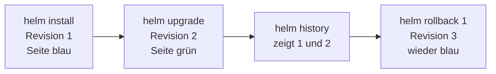

# Templating und der Release-Lebenszyklus

In [Ein Chart von innen](02-chart-anatomie.md) hast du gesehen, **woraus** ein Chart besteht. Jetzt klären wir die zwei Fragen, die beim Lesen einer Vorlage sofort aufkommen: **Woher kommen die Werte**, die Helm in die doppelten geschweiften Klammern einsetzt? Und was passiert eigentlich mit dem, was du installiert hast – **wie kommst du wieder zurück**, wenn ein Update danebengeht?

---

## Die zwei Quellen im Template

Ein Template ist gewöhnliches YAML mit Lücken. Beim Rendern füllt Helm diese Lücken – und der Inhalt kommt fast immer aus einer von **zwei** Quellen: aus den **Werten** oder aus dem **Release**.

| Platzhalter | Woher der Wert kommt | So steht es in unserem Chart | Bei `helm install station ./webserver` wird daraus |
|-------------|----------------------|------------------------------|-----------------------------------------------------|
| `.Values.color` | aus `values.yaml`, aus einer Datei per `-f` oder per `--set` | die `COLOR:`-Zeile in `templates/configmap.yaml` | `COLOR: "#2563a8"` |
| `.Values.replicaCount` | dieselben drei Quellen | `replicas: {{ .Values.replicaCount }}` in `templates/deployment.yaml` | `replicas: 2` |
| `.Release.Name` | der Name, den **du** beim Installieren vergibst | `name: {{ .Release.Name }}-config` in `templates/configmap.yaml` | `name: station-config` |

Merk dir die Trennung so: **`.Values` ist das, woran du drehen darfst. `.Release` ist das, was Helm über diese eine Installation weiß.**

Drei weitere Platzhalter begegnen dir häufig – du musst sie nicht auswendig können, nur wiedererkennen:

- **`.Release.Revision`** – die laufende Nummer dieser Installation (dazu gleich mehr)
- **`.Chart.Name`** und **`.Chart.Version`** – Name und Version des Pakets, direkt aus der `Chart.yaml`

!!! note "Kurz erklärt: warum `.Release.Name` bei uns überall auftaucht"
    Unser Chart hängt den Release-Namen vor jeden Objektnamen: `{{ .Release.Name }}-config`. Das wirkt nach Kleinkram, ist aber der Grund, warum du dasselbe Chart **mehrfach** im selben Cluster installieren kannst. Installierst du es einmal als `station` und einmal als `probe`, entstehen `station-config` und `probe-config` – zwei getrennte Objekte, kein Zusammenstoß. Ein Chart mit fest verdrahteten Namen ginge beim zweiten Mal schief.

---

## Die Pipes: den Wert unterwegs noch anfassen

Hinter einem Platzhalter kannst du den Wert durch eine kleine Funktion schicken. Das Zeichen dafür ist der senkrechte Strich, die **Pipe** – dasselbe Prinzip wie in der Shell: Links steht der Wert, rechts steht, was damit passieren soll.

**`quote` – setzt Anführungszeichen um den Wert.** Genau so steht es in unserer `templates/configmap.yaml`:

```yaml
data:
  VERSION: {{ .Values.version | quote }}
  COLOR: {{ .Values.color | quote }}
  STANDORT: {{ .Values.standort | quote }}
```

Aus `version: "1"` in der `values.yaml` wird beim Rendern `VERSION: "1"`. Warum das weit mehr als Kosmetik ist, steht im nächsten Abschnitt – er ist der wichtigste dieser Seite.

**`default` – ein Ersatzwert, falls nichts gesetzt ist.**

```yaml
  STANDORT: {{ .Values.standort | default "unbekannt" | quote }}
```

Sagt keine der Werte-Quellen etwas über `standort`, rendert Helm `STANDORT: "unbekannt"` statt einer leeren Zeile. So bleibt ein Chart benutzbar, auch wenn jemand einen Wert vergisst. Nebenbei siehst du hier: Pipes lassen sich **aneinanderhängen** – erst `default`, dann `quote`.

**`upper` und `b64enc`** – zwei, die dir in fremden Charts oft begegnen. `upper` schreibt den Wert in Großbuchstaben. `b64enc` kodiert ihn nach base64 und taucht vor allem in Secret-Vorlagen auf, die ihre Werte unter `data` statt unter `stringData` ablegen. Base64 kennst du schon aus [Teil 2](../kubernetes-aufbau/02-config-und-secrets.md#die-wichtigste-ehrliche-wahrheit-secret-verschlusselt). Unser Chart braucht `b64enc` nicht: Wir nutzen `stringData` und lassen Kubernetes selbst kodieren.

---

## Warum `quote` keine Kosmetik ist

Das hier ist der Abschnitt, den du dir merken sollst. Nimm die Zeile aus unserer ConfigMap und lass die Pipe weg. Sieht harmlos aus:

```yaml
data:
  VERSION: {{ .Values.version }}
```

Jetzt installierst du mit einem Wert, der wie eine Zahl aussieht:

```bash
helm install probe ./webserver --set version=1
```

Und hier wird es unangenehm. Schau, was die üblichen Prüfwerkzeuge dazu sagen – **alle drei schweigen**:

- **`helm template probe ./webserver --set version=1`** rendert klaglos. Der entscheidende Ausschnitt:

    ```text
      VERSION: 1
    ```

    Das ist kein `"1"` mehr, sondern die **Zahl** 1. YAML macht daraus einen Integer.

- **`helm lint ./webserver`** meldet keinen Fehler.
- **`helm install --dry-run`** meldet **auch keinen Fehler**. Das ist der fiese Teil: Der Probelauf findet es nicht.

Erst der **echte** `helm install` bricht ab:

```text
Error: INSTALLATION FAILED: server-side apply failed for object default/probe-config /v1, Kind=ConfigMap: failed to create typed patch object (default/probe-config; /v1, Kind=ConfigMap): .data.VERSION: expected string, got &value.valueUnstructured{Value:1}
```

Lies nur das Ende, der Rest ist Rauschen: **`.data.VERSION: expected string, got …`** – erwartet wurde Text, gekommen ist eine Zahl. Eine **ConfigMap speichert ausschließlich Text**. Kein Integer, kein Boolean, nur Zeichenketten. Der Fehler kommt vom Cluster, nicht von Helm – deshalb hat ihn vorher niemand gesehen.

Nebenbei siehst du hier `.Release.Name` in freier Wildbahn: Der Release hieß `probe`, deshalb heißt die ConfigMap in der Fehlermeldung `probe-config`.

Mit der Pipe zurück im Template rendert derselbe `--set version=1` sauber:

```text
  VERSION: "1"
```

!!! warning "Merksatz"
    **`--dry-run` ist gut, aber kein Beweis.** Ein Probelauf zeigt dir, was Helm **rendert** – er garantiert dir nicht, dass der Cluster es **annimmt**. Und der Grund dahinter: **Eine ConfigMap nimmt nur Text.** Deshalb steht hinter jedem Wert, der in einer ConfigMap oder einem Secret landet, ein `| quote`.

!!! tip "Wann brauchst du `quote` und wann nicht?"
    Faustregel: **Überall dort `quote` setzen, wo Text hingehört.** Bei `replicas: {{ .Values.replicaCount }}` in unserem Deployment steht bewusst **kein** `quote` – dort will Kubernetes tatsächlich eine Zahl und `replicas: "2"` wäre falsch herum. Genau deshalb gibt es keine Automatik: Nur du weißt, was an der Stelle stehen soll.

---

## Der Werte-Vorrang: wer gewinnt?

Die `values.yaml` im Chart ist nur der **Standard**. Beim Installieren kannst du sie auf zwei Wegen überschreiben – und wenn mehrere Quellen über denselben Wert reden, gewinnt die **speziellere**.

<figure>
<svg viewBox="0 0 640 280" width="100%" height="280" role="img" aria-label="Treppe der Werte-Quellen: values.yaml wird von einer eigenen Werte-Datei überschrieben, diese wiederum von --set">
  <!-- Stufe 1: values.yaml -->
  <text x="115" y="172" text-anchor="middle" fill="#8fa498" font-family="system-ui, sans-serif" font-size="11">Standard des Charts</text>
  <rect x="30" y="180" width="170" height="62" rx="8" fill="rgba(143,164,152,0.12)" stroke="#8fa498" stroke-width="2"/>
  <text x="115" y="206" text-anchor="middle" fill="#c9d4e3" font-family="JetBrains Mono, monospace" font-size="13">values.yaml</text>
  <text x="115" y="227" text-anchor="middle" fill="#8fa498" font-family="JetBrains Mono, monospace" font-size="11">replicaCount: 2</text>

  <!-- Stufe 2: eigene Datei -->
  <text x="320" y="112" text-anchor="middle" fill="#8fa498" font-family="system-ui, sans-serif" font-size="11">deine Umgebungs-Datei</text>
  <rect x="235" y="120" width="170" height="62" rx="8" fill="rgba(122,162,255,0.12)" stroke="#7aa2ff" stroke-width="2"/>
  <text x="320" y="146" text-anchor="middle" fill="#c9d4e3" font-family="JetBrains Mono, monospace" font-size="13">-f values-prod.yaml</text>
  <text x="320" y="167" text-anchor="middle" fill="#8fa498" font-family="JetBrains Mono, monospace" font-size="11">replicaCount: 3</text>

  <!-- Stufe 3: Kommandozeile -->
  <text x="525" y="52" text-anchor="middle" fill="#8fa498" font-family="system-ui, sans-serif" font-size="11">der Griff auf der Kommandozeile</text>
  <rect x="440" y="60" width="170" height="62" rx="8" fill="rgba(46,158,91,0.12)" stroke="#2e9e5b" stroke-width="2"/>
  <text x="525" y="86" text-anchor="middle" fill="#c9d4e3" font-family="JetBrains Mono, monospace" font-size="13">--set replicaCount=5</text>
  <text x="525" y="107" text-anchor="middle" fill="#2e9e5b" font-family="system-ui, sans-serif" font-size="11" font-weight="700">gewinnt</text>

  <!-- Vorrang-Zeichen -->
  <text x="217" y="158" text-anchor="middle" fill="#7dff9a" font-family="JetBrains Mono, monospace" font-size="22" font-weight="700">&lt;</text>
  <text x="422" y="98" text-anchor="middle" fill="#7dff9a" font-family="JetBrains Mono, monospace" font-size="22" font-weight="700">&lt;</text>

  <text x="320" y="266" text-anchor="middle" fill="#8fa498" font-family="system-ui, sans-serif" font-size="12">Je weiter oben rechts, desto stärker: Die rechte Quelle überschreibt die linke.</text>
</svg>
<figcaption>Der Werte-Vorrang als Treppe: values.yaml &lt; eigene Datei per -f &lt; --set. Rechts gewinnt.</figcaption>
</figure>

Das lässt sich in einem einzigen Befehl zeigen – ganz ohne Installation, denn `helm template` rendert nur:

```bash
helm template station ./webserver -f values-prod.yaml --set replicaCount=5
```

Drei Quellen reden hier über denselben Wert: Die `values.yaml` sagt `2`, die `values-prod.yaml` sagt `3`, das `--set` sagt `5`. Im gerenderten Deployment steht:

```text
  replicas: 5
```

`--set` gewinnt. Das ist keine Willkür, sondern die Reihenfolge von **allgemein nach speziell**: Das Chart bringt einen vernünftigen Standard mit, deine Umgebungs-Datei legt fest, was für Test oder Produktion gilt – und `--set` ist der schnelle Griff für den Einzelfall.

!!! note "Kurz erklärt: mehrere Dateien hintereinander"
    Du kannst mehrere Werte-Dateien angeben (`-f basis.yaml -f prod.yaml`). Auch dann gilt: Rechts gewinnt, die letzte Datei überschreibt die vorherigen. Genau dieses Prinzip trägt später die [Praxis: Drei Umgebungen](07-lab-drei-umgebungen.md): ein Chart, drei Werte-Dateien, drei Umgebungen.

!!! warning "Die Regel, über die alle stolpern: Helm merkt sich dein `--set` nicht"
    Jeder Aufruf rendert das Chart **frisch von vorn**: `values.yaml` als Grundlage, darüber die Dateien aus `-f`, darüber genau die `--set`-Werte, die du **in diesem einen Aufruf** mitgibst. Alles, was du diesmal nicht mitgibst, fällt auf den Standard zurück.

    Praktisch heißt das: Du setzt heute `--set standort="Halle 4"`. Morgen tippst du ein `helm upgrade` mit einem anderen `--set` – und der Standort ist wieder „Rechenzentrum Nord". Nicht kaputt, sondern genau so gedacht.

    Was dauerhaft gelten soll, gehört deshalb in eine **Datei**, nicht in ein `--set`. Das ist zugleich der Grund, warum du bei Drei Umgebungen mit `values-dev.yaml` und Co. arbeitest und nicht mit einer Handvoll `--set`: Was per `--set` passiert, steht in keiner Datei – und am Montag weiß niemand mehr, warum dort fünf Instanzen laufen.

---

## Der Release-Lebenszyklus

Ein **Release** ist eine Installation eines Charts unter einem Namen. Und ein Release ist nichts Statisches – es hat einen Lebenslauf, den Helm mitschreibt.



Jeder Befehl in einer Zeile:

- **`helm install station ./webserver`** – installiert das Chart als Release `station`. Das ist **Revision 1**.
- **`helm upgrade station ./webserver --set color="#2e9e5b"`** – rendert mit neuen Werten und schiebt die Änderung in den Cluster. Das ist **Revision 2**.
- **`helm history station`** – zeigt alle Revisionen dieses Releases mit Zeitstempel, Status und Grund.
- **`helm rollback station 1`** – setzt den Zustand von Revision 1 wieder ein. Und weil auch das eine Änderung ist, wird daraus **Revision 3**.

Der Punkt, auf den alles hinausläuft: **Jedes `upgrade` erzeugt eine neue Revision – die alte verschwindet nicht.** Helm wirft den vorherigen Stand nicht weg, sondern legt ihn ab. Genau deshalb ist `rollback` überhaupt möglich: Der alte Zustand liegt vollständig da und Helm muss ihn nur wieder anwenden. Du brauchst dafür weder deine alten Befehle noch deine alte Werte-Datei – nicht einmal dann, wenn eine Kollegin das Upgrade gemacht hat.

Beachte auch, dass ein Rollback **vorwärts** zählt. Revision 3 ist inhaltlich der Stand von Revision 1, aber sie ist trotzdem eine neue Revision. Helm schreibt Geschichte fort, es radiert nichts aus.

!!! tip "Und das rollt sich von selbst aus"
    In [Teil 2](../kubernetes-aufbau/03-praxis-config-secrets.md) musstest du nach einer Config-Änderung noch von Hand `kubectl rollout restart` hinterherschicken. Bei unserem Chart entfällt das: Das Deployment trägt eine Annotation mit einer **Prüfsumme der gerenderten ConfigMap**. Ändert sich ein Wert, ändert sich die Prüfsumme – damit sieht die Pod-Vorlage anders aus und Kubernetes rollt von selbst neu aus. Ein `helm upgrade` mit neuer Farbe macht die Seite also grün, ohne dass du etwas nachschiebst. Das siehst du in der [Praxis](05-praxis-upgrade-rollback.md) gleich selbst.

---

## Wo Helm den Zustand hält

Jetzt die Frage, die an dieser Stelle immer kommt – und der hartnäckigste Irrtum zu Helm: „Wenn Helm sich merkt, was Revision 1 war – liegt das dann auf meinem Laptop?"

**Nein.** Helm legt den Zustand jedes Releases **im Cluster** ab, an einem Ort, den du längst kennst: in einem **Secret**.

- Der Name folgt einem festen Muster: **`sh.helm.release.v1.<release>.v<revision>`** – für unser Release also `sh.helm.release.v1.station.v1`, dann `...station.v2`, dann `...station.v3`.
- Es liegt im **Namespace des Releases**. Installierst du nach `prod`, liegt es in `prod`.
- **Pro Revision ein Secret.** Deshalb wächst die Liste mit jedem Upgrade.

Nachsehen kannst du selbst, denn Helm markiert seine Secrets mit einem Label:

```bash
kubectl get secret -l owner=helm
```

Du bekommst eine Liste mit **einer Zeile pro Revision** – nach install, upgrade und rollback also drei Zeilen, deren Namen genau dem Muster oben folgen. Das ist Helms Gedächtnis, offen im Cluster einsehbar.

Zwei Folgen daraus, beide praktisch wichtig:

- **Die Kollegin am anderen Rechner sieht dieselben Releases.** Sie hat auf ihrem Laptop nie ein `helm install` getippt – zeigt ihr `kubectl` aber auf denselben Cluster, listet ihr `helm list` dein `station` mitsamt Revision 3 auf. Der Zustand hängt am **Cluster**, nicht an deinem Werkzeug.
- **Wer den Cluster aufräumt, räumt die Historie mit weg.** Löschst du den Namespace, ist auch die Rollback-Möglichkeit verschwunden. Die Historie ist bequem, aber sie ist **kein Backup**.

!!! note "Brücke zu Teil 2"
    Secrets kennst du aus [ConfigMap & Secret](../kubernetes-aufbau/02-config-und-secrets.md) – dort hast du selbst eines angelegt und es als base64 entlarvt. Hier begegnet dir dieselbe Sache aus der anderen Richtung: **Helm legt sich selbst eines an**, ungefragt. Und es gilt dieselbe ehrliche Wahrheit wie damals – wer im Namespace Secrets lesen darf, kann auch hier hineinsehen.

---

## Drei Zähler, die gern verwechselt werden

An einem Release hängen **drei** Nummern und sie zählen völlig Verschiedenes. Wer sie durcheinanderbringt, sucht später an der falschen Stelle.

| Zähler | Was er zählt | Wo er festgelegt wird | Beispiel |
|--------|--------------|-----------------------|----------|
| **Revision** | wie oft **dieses Release** angefasst wurde: die Installation, jedes Upgrade, jeder Rollback | Helm zählt selbst hoch – du kannst sie nicht setzen | `1`, `2`, `3` |
| **Chart version** | den Stand des **Pakets** – ändert sich, wenn jemand am Chart schraubt | `version:` in der `Chart.yaml` | `0.1.0` |
| **appVersion** | den Stand der **Software** im Paket | `appVersion:` in der `Chart.yaml` | `"1"` |

Das Praktische: Du siehst alle drei nebeneinander. Genau diese Ausgabe entsteht nach install, upgrade und rollback:

```bash
helm history station
```

```text
REVISION	UPDATED                 	STATUS    	CHART          	APP VERSION	DESCRIPTION
1       	Thu Jul 16 15:00:33 2026	superseded	webserver-0.1.0	1          	Install complete
2       	Thu Jul 16 15:01:02 2026	superseded	webserver-0.1.0	1          	Upgrade complete
3       	Thu Jul 16 15:01:20 2026	deployed  	webserver-0.1.0	1          	Rollback to 1
```

Lies die Tabelle spaltenweise: **REVISION** zählt hoch (1, 2, 3). **CHART** zeigt `webserver-0.1.0` – Chart-Name und Chart-Version zusammengeschrieben. **APP VERSION** steht auf `1`. Nur die erste Spalte bewegt sich, die anderen beiden stehen still – und das ist genau richtig: Du hast dreimal an diesem Release gedreht, aber weder das Paket noch die Software darin verändert. An **STATUS** siehst du außerdem, welche Revision gerade `deployed` ist – die übrigen sind `superseded`, also abgelöst.

!!! warning "Die Stolperfalle in unserer eigenen Übung"
    In der Praxis machst du gleich ein Upgrade mit `--set version=2` und die Seite zeigt danach groß **Version 2**. In `helm history` bleibt die Spalte **APP VERSION** trotzdem bei `1`. Das ist kein Fehler, sondern der Beweis, dass es zwei verschiedene Dinge sind:

    - **`--set version=2`** setzt `.Values.version` – **unsere** Stellschraube für die Beschriftung der Seite. Der Wert geht über die ConfigMap in die Umgebungsvariable `VERSION` und landet im Text auf dem Bildschirm.
    - **`appVersion`** steht fest in der `Chart.yaml` und wird von `--set` überhaupt nicht berührt. Sie ändert sich nur, wenn jemand das **Chart** anfasst.

    Dass beide „version" heißen, ist ein Zufall unserer Übung – und ein gutes Beispiel dafür, warum man die drei Zähler sauber auseinanderhalten muss.

---

!!! quote "Mitnehmen"
    - Werte im Template kommen aus **zwei** Quellen: **`.Values.…`** (aus `values.yaml`, per `-f` oder per `--set`) und **`.Release.…`** (was du beim Installieren vergibst). `.Release.Name` vor jedem Objektnamen ist der Grund, warum dasselbe Chart mehrfach installiert werden kann.
    - **`| quote` ist keine Kosmetik.** Ohne quote wird aus `--set version=1` eine **Zahl** – und eine ConfigMap nimmt nur **Text**. `helm template`, `helm lint` und `helm install --dry-run` schweigen dazu, erst der echte Install bricht ab. **Ein Probelauf ist kein Beweis.**
    - **Werte-Vorrang: `values.yaml` < `-f datei.yaml` < `--set`.** Rechts gewinnt, von allgemein nach speziell.
    - **Helm merkt sich dein `--set` nicht.** Jeder Aufruf rendert frisch ab `values.yaml`. Was du diesmal nicht mitgibst, fällt auf den Standard zurück. Was dauerhaft gelten soll, gehört in eine Datei.
    - **Jedes Upgrade erzeugt eine neue Revision – die alte bleibt erhalten.** Genau deshalb funktioniert `rollback`. Auch ein Rollback zählt vorwärts.
    - Helm hält den Zustand **als Secret im Cluster** (`sh.helm.release.v1.<release>.v<revision>`), nicht auf deinem Laptop. Deshalb sieht die Kollegin dieselben Releases – und deshalb ist die Historie kein Backup.
    - **Revision**, **Chart-Version** und **appVersion** sind drei verschiedene Zähler. `helm history` zeigt sie nebeneinander.

---

## Weiter

- [Praxis: Upgrade & Rollback](05-praxis-upgrade-rollback.md) – jetzt drehst du selbst an den Werten, machst ein Upgrade und holst mit einem einzigen Befehl die alte Version zurück
- [Helm-Cheatsheet](../cheatsheets/helm.md) – die Befehle dieser Seite auf einen Blick
