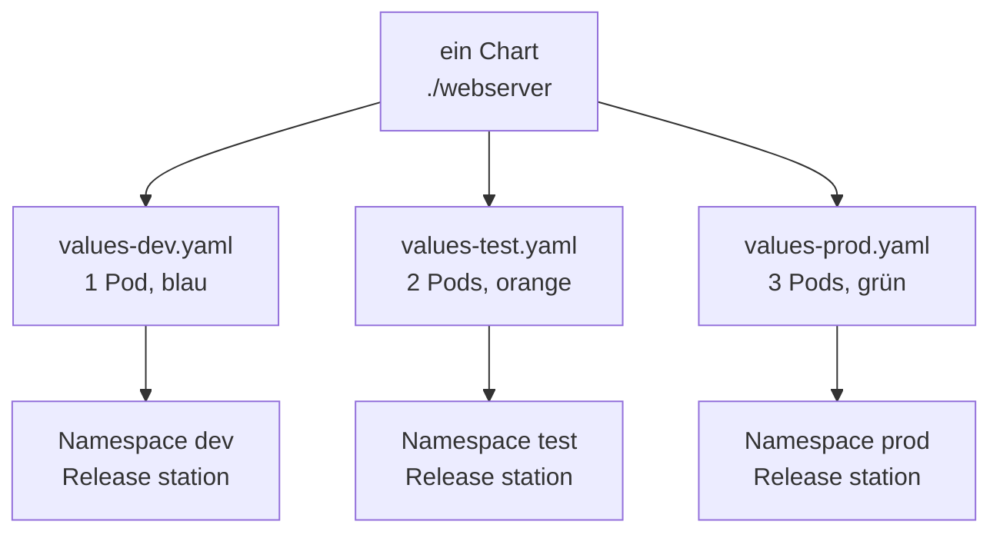

# Praxis – drei Umgebungen, ein Chart

<span class='badge badge-praxis'>Praxis – Pflicht</span> &nbsp; Dieselbe App, dreimal ausgerollt: einmal zum Entwickeln, einmal zum Testen, einmal für den Ernstfall. Gleiches Paket, andere Werte, andere Größe.

Unser Beispiel bleibt die **Aurora Station**: Ihre Statusanzeige soll in drei Umgebungen laufen – **Entwicklung**, **Test** und **Produktion**. Das ist die Geschichte drumherum. Die Technik darunter ist **1:1 die**, mit der echte Teams arbeiten: ein Chart im Git, pro Umgebung eine kleine Werte-Datei, pro Umgebung ein Release. Wer das hier kann, kann es auch im Betrieb.



!!! info "Voraussetzung"
    Dein Cluster läuft (`kubectl get nodes` zeigt `Ready`), `helm version` antwortet und die Projektdateien liegen lokal:

    ```bash
    git clone https://github.com/JacobMenge/kurs-unterlagen.git
    cd kurs-unterlagen/apps/kubernetes-helm
    ```

    Alle Befehle auf dieser Seite gehen von diesem Ordner aus – dort liegen das Chart (`webserver/`) und die drei Werte-Dateien nebeneinander. Inhaltlich brauchst du die [Praxis: Upgrade & Rollback](05-praxis-upgrade-rollback.md): `helm install`, `helm list`, `helm uninstall`.

!!! tip "Zeitrahmen"
    Rund **45 bis 60 Minuten**. Die Seite ist zum Alleindurcharbeiten gebaut – zu zweit an einem Rechner funktioniert sie genauso gut. Halte **drei Terminals** bereit, für Aufgabe 4 brauchst du sie.

---

# Dein Auftrag

## Aufgabe 1 – Die drei Werte-Dateien lesen

Öffne `values-dev.yaml`, `values-test.yaml` und `values-prod.yaml`. Zusammen sind das keine 20 Zeilen. `values-dev.yaml` sieht so aus:

```yaml
replicaCount: 1
version: "1-dev"
color: "#2563a8"
standort: "Entwicklung"
```

**Mach dir klar**, warum darin **nur die Abweichungen** stehen. Wo kommen `image.repository`, `image.tag`, `appToken` und `service.port` her, wenn sie in keiner der drei Dateien auftauchen?

??? tip "Wenn du nicht draufkommst (kleiner Schubs)"
    Schau in `webserver/values.yaml`. Helm legt deine Datei **über** die Standardwerte des Charts – Schlüssel für Schlüssel. Was du angibst, gewinnt. Was du weglässt, bleibt beim Standard.

    Der Vorrang von links nach rechts, rechts gewinnt:

    ```text
    values.yaml   <   eigene Datei per -f   <   --set
    ```

    Praktisch heißt das: In der Werte-Datei steht nur das, was für diese Umgebung **besonders** ist. Alles andere ist Sache des Charts – und wenn sich der Standard ändert, ändert er sich für alle drei Umgebungen auf einmal.

---

## Aufgabe 2 – Drei Umgebungen ausrollen

Jede Umgebung bekommt ihren **eigenen Namespace**. `--create-namespace` legt ihn gleich mit an:

```bash
helm install station ./webserver -f values-dev.yaml  -n dev  --create-namespace
helm install station ./webserver -f values-test.yaml -n test --create-namespace
helm install station ./webserver -f values-prod.yaml -n prod --create-namespace
```

Nach jedem Befehl druckt Helm den Text aus `NOTES.txt` – dort steht schon der passende `port-forward`-Befehl und was du erwarten darfst.

!!! note "Fällt dir etwas auf?"
    Alle drei Releases heißen **`station`**. Das ist kein Tippfehler und auch kein Trick: **Release-Namen gelten pro Namespace.** In `dev` gibt es genau ein `station`, in `test` eines, in `prod` eines – für Helm sind das drei verschiedene Releases, die nichts voneinander wissen. Genau deshalb musst du dir keine Namen wie `station-dev-2` ausdenken. Der Namespace sagt schon, welche Umgebung gemeint ist.

    Umgekehrt heißt das aber auch: **Ohne `-n` landet alles im Namespace `default`.** Das `-n` ist hier kein Beiwerk, sondern die halbe Miete.

---

## Aufgabe 3 – Beweise, dass es funktioniert hat

Nicht raten – nachsehen. Drei Beweise, einer nach dem anderen.

**Beweis 1: Alle Releases auf einen Blick.** Das `-A` heißt „über alle Namespaces":

```bash
helm list -A
```

```text
NAME   	NAMESPACE	REVISION	UPDATED                               	STATUS  	CHART          	APP VERSION
station	default  	3       	2024-03-15 15:01:20.7176141 +0100 CET 	deployed	webserver-0.1.0	1
station	dev      	1       	2024-03-15 15:01:41.5624155 +0100 CET 	deployed	webserver-0.1.0	1
station	prod     	1       	2024-03-15 15:01:42.391452 +0100 CET  	deployed	webserver-0.1.0	1
station	test     	1       	2024-03-15 15:01:41.9583803 +0100 CET 	deployed	webserver-0.1.0	1
```

Viermal `station`, vier Namespaces, alle `deployed`. Die Zeile mit `default` ist das Release aus der [vorherigen Praxis](05-praxis-upgrade-rollback.md) – deshalb steht dort auch schon **Revision 3**, während deine drei neuen bei **Revision 1** anfangen. Wenn du `default` vorher aufgeräumt hast, fehlt die Zeile einfach.

**Beweis 2: Die Größen stimmen.** Zähl die Pods pro Namespace:

```bash
kubectl get pods -n dev
kubectl get pods -n test
kubectl get pods -n prod
```

Erwartet: **dev 1 Pod**, **test 2 Pods**, **prod 3 Pods** – genau die `replicaCount` aus den drei Werte-Dateien. Dieselbe Vorlage, drei Größen.

**Beweis 3: Die Werte stimmen.** Jedes Release hat seine eigene ConfigMap gebaut – und die heißt in jedem Namespace gleich, weil sie aus dem Release-Namen entsteht (`station-config`):

```bash
kubectl get cm station-config -n dev  -o jsonpath='{.data}'
kubectl get cm station-config -n test -o jsonpath='{.data}'
kubectl get cm station-config -n prod -o jsonpath='{.data}'
```

Das muss herauskommen:

| Namespace | STANDORT | VERSION | COLOR | Pods |
|---|---|---|---|---|
| `dev` | Entwicklung | `1-dev` | `#2563a8` (blau) | 1 |
| `test` | Testsystem | `1-test` | `#c2680a` (orange) | 2 |
| `prod` | Rechenzentrum Nord | `1` | `#2e9e5b` (grün) | 3 |

Drei ConfigMaps, drei Inhalte – geschrieben hast du keine davon. Sie sind aus **einer** Vorlage entstanden, dreimal mit anderen Werten gerendert.

---

## Aufgabe 4 – Alle drei im Browser

Jetzt siehst du den Unterschied statt ihn zu lesen. Jede Umgebung bekommt ihren **eigenen lokalen Port**:

```bash
kubectl port-forward svc/station 8081:80 -n dev
kubectl port-forward svc/station 8082:80 -n test
kubectl port-forward svc/station 8083:80 -n prod
```

!!! warning "Ein Tunnel belegt sein Terminal"
    `port-forward` läuft im Vordergrund und blockiert das Fenster, solange der Tunnel steht. Für **drei gleichzeitige** Tunnel brauchst du **drei Terminals**. Wer nur eines hat, macht es nacheinander: Tunnel starten, Seite ansehen, **Ctrl+C**, nächster.

Dann der Reihe nach öffnen:

- <http://localhost:8081> – **blau**, „Version 1-dev", Standort: Entwicklung
- <http://localhost:8082> – **orange**, „Version 1-test", Standort: Testsystem
- <http://localhost:8083> – **grün**, „Version 1", Standort: Rechenzentrum Nord

Die Farbe ist kein Selbstzweck. Sie beantwortet die Frage, die im Betrieb wirklich gestellt wird: **Auf welcher Umgebung bin ich hier gerade?** Wer schon einmal aus Versehen auf der Produktion geklickt hat, weil zwei Fenster gleich aussahen, weiß, warum das eine eigene Zeile in der Werte-Datei wert ist.

Was dir dabei **nicht** passiert: Die Zeile **Server name** wechselt nicht, auch nicht in `prod` mit seinen drei Pods. `kubectl port-forward` tunnelt zu genau einem Pod und bleibt dabei – es ist ein Debug-Werkzeug, kein Lastverteiler. Dass hinter `prod` wirklich drei Pods stehen, siehst du mit `kubectl get pods -n prod`, nicht im Browser.

---

## Aufgabe 5 – Die Denkaufgabe

Das ist der eigentliche Kern dieser Seite. Nimm dir dafür ein paar Minuten und denk es **wirklich** durch – gern laut, wenn ihr zu mehreren an einem Rechner sitzt – bevor du unten aufklappst.

> **Warum nehmen wir drei Werte-Dateien und nicht einfach drei Kopien des Charts?**
>
> Drei Kopien wären ja auch machbar: `webserver-dev/`, `webserver-test/`, `webserver-prod/`, in jeder die Werte fest eingetragen. Fertig. Was spricht dagegen?
>
> **Und dann der Härtetest:** Morgen kommt ein **Sicherheitsupdate**, das eine Änderung an `templates/deployment.yaml` nötig macht – sagen wir, der Container darf nicht mehr als `root` laufen. Spiel beide Welten durch:
>
> - **Drei Werte-Dateien:** Wo musst du die Änderung eintragen? Wie oft? Wie stellst du sicher, dass Test wirklich das prüft, was später in Produktion läuft?
> - **Drei Chart-Kopien:** Wo musst du die Änderung eintragen? Wie oft? Was passiert, wenn jemand eine der drei vergisst – und wann fällt das auf?

Ein paar Gedanken, die dir weiterhelfen, wenn du feststeckst:

- Wie viele Zeilen sind an den drei Werte-Dateien **verschieden**? Wie viele wären es bei drei Chart-Kopien?
- Bei drei Kopien: Woran siehst du, ob sie noch gleich sind? Und wer merkt es, wenn nicht?
- Was testest du in `test` eigentlich, wenn `test` ein **anderes** Chart benutzt als `prod`?
- Wer neu im Team ist: Was muss die Person lesen, um zu verstehen, wie sich Test von Produktion unterscheidet – drei Chart-Ordner oder drei kurze Dateien?

??? quote "Erst selbst überlegen – dann hier aufklappen"
    Bei drei Werte-Dateien gibt es **eine Wahrheit** über den Aufbau der Anwendung – die Unterschiede stehen sauber daneben und sind auf einen Blick lesbar. Bei drei Kopien gibt es **drei Wahrheiten**, die ab dem ersten Tag auseinanderlaufen. Und sie laufen leise auseinander: Es gibt keine Fehlermeldung dafür, dass eine Kopie vergessen wurde. Es gibt nur irgendwann eine Störung in Produktion, die auf Test nicht auftrat.

    Der Fachbegriff dafür lautet **Drift**: Umgebungen, die eigentlich gleich sein sollten, sind es nicht mehr – und keiner weiß, seit wann. Ein Chart plus Werte-Dateien ist die einfachste Versicherung dagegen, die es gibt.

    Wenn deine Antwort in diese Richtung geht: Du hast es. Wenn du noch etwas gefunden hast, was hier nicht steht: umso besser – dann hast du die Frage wirklich durchdacht.

---

## Aufgabe 6 – Aufräumen

!!! tip "Noch Zeit und Lust? Dann erst die Kür"
    Die [Zusatzaufgaben](#zusatzaufgaben-wenn-du-schneller-bist) weiter unten brauchen die **laufenden** Releases. Wenn du sie machen willst, spring jetzt dorthin und räum danach hier auf.

Drei Umgebungen wieder abbauen ist genauso schnell wie aufbauen:

```bash
helm uninstall station -n dev
helm uninstall station -n test
helm uninstall station -n prod
```

Helm entfernt pro Release alles, was es angelegt hat: Deployment, Service, ConfigMap, Secret. Was Helm **nicht** anfasst, sind die Namespaces – die hast du mit `--create-namespace` erzeugt, aber sie gehören zu keinem Release. Die gehst du selbst an:

```bash
kubectl delete namespace dev test prod
```

Kontrolle zum Schluss: `helm list -A` zeigt keine `station`-Zeile mehr in `dev`, `test` oder `prod`.

---

# Zusatzaufgaben, wenn du schneller bist

<span class='badge badge-bonus'>Bonus</span> &nbsp; Alles ab hier ist **Kür**. Nur wenn du vor der Zeit fertig bist – und **vor** dem Aufräumen aus Aufgabe 6. Wenn die Zeit nicht reicht: überspringen, das ist völlig in Ordnung.

## a) Prod kurzfristig auf 5 Instanzen

Es wird eng, die Produktion braucht sofort mehr Luft: **5 statt 3 Instanzen**. Die Bedingung: **ohne** `values-prod.yaml` zu ändern.

??? tip "Schritt für Schritt (Lösung)"
    **Schritt 1 – trocken prüfen, wer gewinnt.** `helm template` rendert nur, ohne etwas am Cluster zu tun:

    ```bash
    helm template station ./webserver -f values-prod.yaml --set replicaCount=5
    ```

    Im gerenderten Deployment steht `replicas: 5` – obwohl `values-prod.yaml` klar `replicaCount: 3` sagt. Das ist der Vorrang aus Aufgabe 1 in Aktion: **`--set` gewinnt gegen `-f`.**

    **Schritt 2 – wirklich ausrollen:**

    ```bash
    helm upgrade station ./webserver -f values-prod.yaml --set replicaCount=5 -n prod
    ```

    ```bash
    kubectl get pods -n prod
    ```

    Erwartet: **5 Pods**. Das Release in `prod` steht danach auf **Revision 2**, zu sehen mit `helm history station -n prod`.

    **Schritt 3 – und jetzt der wichtige Teil: warum nur im Notfall?**

    Was per `--set` passiert ist, steht in **keiner Datei**. Es lebt nur in der Release-Historie im Cluster. Die Folge:

    - Beim nächsten `helm upgrade station ./webserver -f values-prod.yaml -n prod` **ohne** `--set` sind es wieder 3 Pods. Lautlos. Niemand hat es gelöscht – es stand ja nirgends.
    - Wer in Git nachsieht, liest `replicaCount: 3` und glaubt, in Produktion laufen 3.
    - Am Montag fragt jemand: „Warum laufen hier 5?" Und die Antwort steht nur noch im Terminal-Verlauf von jemandem, der Urlaub hat.

    Deshalb die Regel: `--set` ist das Werkzeug für **jetzt sofort** – zum Ausprobieren und für den Notfall um 3 Uhr nachts. Alles, was bleiben soll, gehört danach **in die Werte-Datei und ins Git**. Der Notfall-Befehl rettet den Abend, der Commit rettet die nächsten Wochen.

## b) Beweise, wo Helm seinen Zustand speichert

Woher weiß Helm eigentlich, dass es in `prod` ein Release namens `station` gibt? Liegt das auf deinem Laptop?

```bash
kubectl get secret -n prod -l owner=helm
```

??? tip "Was du siehst (Lösung)"
    Du siehst **Secrets im Namespace `prod`** – eines pro Revision, benannt nach dem Muster `sh.helm.release.v1.station.v1` (bei Revision 2 kommt `...v2` dazu). Darin steckt der komplette Zustand des Releases: welches Chart, welche Werte, was ausgerollt wurde.

    Der Beweis daraus: **Helm merkt sich nichts auf deinem Rechner.** Der Zustand liegt **im Cluster**, im Namespace des Releases. Drei Schlussfolgerungen für den Betrieb:

    - **Jeder, der auf denselben Cluster zugreift, sieht mit `helm list -A` dieselben Releases.** Helm ist kein persönliches Werkzeug, sondern liest den gemeinsamen Stand. (In dieser Übung merkst du davon nichts: Du hast deinen eigenen minikube, deine Kollegin hat ihren. Im Betrieb teilt sich ein ganzes Team einen Cluster – und genau dann zählt dieser Punkt.)
    - `helm rollback` funktioniert deshalb auch von einem anderen Rechner aus – die alte Revision liegt im Cluster, nicht in deinem Terminal-Verlauf.
    - Wer `kubectl delete namespace prod` macht, löscht die Historie gleich mit. Das Chart im Git bleibt, die Release-Geschichte ist weg.

    Übrigens: Genau deshalb war in Aufgabe 6 `helm uninstall` **vor** dem Löschen der Namespaces die richtige Reihenfolge.

---

??? success "Erwartung"
    Am Ende kannst du zeigen:

    1. **`helm list -A`** mit `station` in `dev`, `test` und `prod` – alle drei `deployed`, alle drei aus demselben Chart `webserver-0.1.0`.
    2. **Drei verschiedene Größen**: 1 Pod in `dev`, 2 in `test`, 3 in `prod` – ohne dass du das Chart angefasst hast.
    3. **Drei verschiedene Seiten** im Browser auf 8081, 8082 und 8083: blau, orange, grün. Auf einen Blick unterscheidbar.
    4. **Deine Antwort auf Aufgabe 5** in eigenen Worten – warum drei Werte-Dateien und nicht drei Chart-Kopien – und was beim Sicherheitsupdate passiert.
    5. **Aufgeräumt**: `helm uninstall` in allen drei Namespaces, danach die Namespaces gelöscht.

    Und du kannst erklären, warum alle drei Releases `station` heißen dürfen: Release-Namen gelten **pro Namespace**.

---

## Reflexionsfragen

Zur Selbstkontrolle. Wenn du die hier beantworten kannst, sitzt das Thema. Denk erst selbst nach – die Antworten stehen darunter zum Aufklappen.

1. Warum stehen in `values-test.yaml` nur vier Zeilen und nicht der ganze Satz an Werten?
2. Warum dürfen alle drei Releases `station` heißen?
3. Du willst eine vierte Umgebung („Schulung", 1 Pod, gelb). Wie viele Dateien legst du an, wie viele änderst du?
4. Warum ist `--set` für eine dauerhafte Änderung die falsche Wahl – obwohl es funktioniert?
5. Eine Kollegin hat gestern etwas in `prod` ausgerollt und ist heute krank. Woran siehst du, was sie getan hat?
6. Du betreust nicht eine App, sondern zwölf Dienste, die miteinander reden – in drei Umgebungen, im Team, mit Bereitschaft am Wochenende. Was genau gewinnst du da durch ein Chart pro Dienst, was du mit einem Ordner voller Manifeste nicht hast?

??? quote "Die Antworten – erst selbst überlegen"
    **1.** Weil Helm deine Datei **über** die Standardwerte aus `webserver/values.yaml` legt, Schlüssel für Schlüssel. In der Umgebungs-Datei steht nur, was abweicht – `image`, `appToken` und `service` kommen weiterhin aus dem Chart. Ändert sich dort etwas, gilt es sofort für alle drei Umgebungen.

    **2.** Release-Namen gelten **pro Namespace**. In `dev` gibt es genau ein `station`, in `test` eines, in `prod` eines. Für Helm sind das drei Releases, die nichts voneinander wissen.

    **3.** **Eine** neue Datei: `values-schulung.yaml` mit vier Zeilen. Geändert wird **nichts** – weder das Chart noch die anderen drei Werte-Dateien. Dann `helm install station ./webserver -f values-schulung.yaml -n schulung --create-namespace`. Genau das ist der Gewinn: Eine neue Umgebung kostet vier Zeilen, keinen neuen Ordner.

    **4.** Weil es in **keiner Datei** steht. Der Wert lebt nur in der Release-Historie im Cluster. Beim nächsten `helm upgrade` ohne dieses `--set` fällt er lautlos auf den Standard zurück. Wer in Git nachsieht, liest dann etwas anderes, als tatsächlich läuft. `--set` ist für sofort, die Datei ist für dauerhaft.

    **5.** Du fragst den Cluster, nicht die Kollegin: `helm history station -n prod` zeigt, wann welche Revision kam. `helm get values station -n prod` zeigt, welche Werte sie mitgegeben hat. `helm get manifest station -n prod` zeigt das YAML, das dabei herauskam. Und wenn es schiefging: `helm rollback station <nummer> -n prod`. Der Zustand hängt am Cluster, nicht an ihrem Rechner.

    **6.** Drei Dinge. Erstens **eine Wahrheit pro Dienst** statt drei Kopien, die leise auseinanderlaufen – der Schutz gegen Drift. Zweitens einen **Rückweg**, den auch jemand anderes findet: `helm rollback` braucht weder deine alten Befehle noch dein Gedächtnis. Drittens **Übergabefähigkeit** – zwölf Dienste als zwölf Pakete mit demselben Handgriff, statt zwölf Ordner mit je eigener Geschichte. Um drei Uhr nachts zählt genau das.

---

## Checkliste

| Kriterium | Erfüllt? |
|---|---|
| Die drei Werte-Dateien gelesen und den Vorrang erklärt | ☐ |
| Drei Releases in `dev`, `test`, `prod` ausgerollt | ☐ |
| `helm list -A` zeigt alle drei als `deployed` | ☐ |
| Pods gezählt: 1 / 2 / 3 | ☐ |
| Werte je Namespace über die ConfigMap geprüft | ☐ |
| Alle drei Seiten im Browser gesehen: blau, orange, grün | ☐ |
| Antwort auf die Denkaufgabe formuliert | ☐ |
| Releases deinstalliert und Namespaces gelöscht | ☐ |
| *Bonus (nur bei Restzeit):* mindestens ein Zusatzauftrag geschafft | ☐ |

---

## Wenn du nicht weiterkommst

Erst selbst noch einmal hinsehen, dann hier nachlesen – und wenn es dann immer noch hakt, frag nach:

- [Stolpersteine](09-stolpersteine.md) – die häufigsten Fallen auf dieser Seite (falscher Namespace, `--set` und Anführungszeichen)
- [Helm-Cheatsheet](../cheatsheets/helm.md) – alle Befehle dieser Seite auf einen Blick
- [Templating & Releases](04-templating-und-releases.md) – wenn der Vorrang der Werte noch wackelt

---

## Weiter

- [Weitere Übungen](08-uebungen.md) – zum Vertiefen, allein oder zu zweit
- [Rückblick & Abschluss](10-rueckblick.md) – was du aus dem Helm-Block mitnimmst
