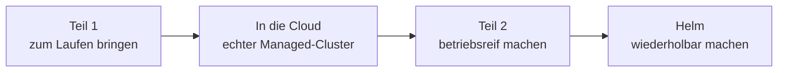

# Rückblick & Abschluss

Aus „mein Dienst ist betriebsreif“ ist „mein Dienst ist ein Paket“ geworden. Du hast dieselbe kleine App, die dich durch drei Blöcke begleitet hat, genommen und ihre Manifeste in ein **Chart** verwandelt: eine Vorlage, ein paar Stellschrauben, ein Befehl. Was du vorher in mehreren YAML-Dateien von Hand gepflegt hast, installierst du jetzt in einer Zeile – und drehst es genauso schnell wieder zurück.

Und damit schließen wir das Kubernetes-Thema in diesem Kurs ab.

---

## Was du gelernt hast

Du hast an einem echten Cluster ein Chart gebaut, benutzt, kaputt gemacht und wieder zurückgeholt. Konkret hast du:

- ein **Chart von innen** gelesen: `Chart.yaml` als Steckbrief, `values.yaml` als Stellschrauben, `templates/` als Vorlagen – und mit `helm template` gesehen, dass am Ende ganz normales Kubernetes-YAML herauskommt,
- das Chart mit `helm install station ./webserver` ausgerollt und im Cluster **genau die Objekte** wiedergefunden, die du in Teil 1 und Teil 2 von Hand geschrieben hast: Deployment, Service, ConfigMap, Secret,
- **Werte statt Manifest-Kopien** gepflegt: `version`, `color`, `standort` und `replicaCount` sind Stellschrauben des Pakets geworden – dieselbe Vorlage, andere Werte, kein zweiter Ordner voller fast gleicher Dateien,
- ein **`helm upgrade`** gemacht und gesehen, wie daraus eine neue **Revision** wird – die `checksum/config`-Annotation im Chart stößt den Rollout dabei von selbst an, das `kubectl rollout restart` aus Teil 2 entfällt,
- den **Rückweg als eigenen Befehl** kennengelernt: `helm history` zeigt, was war, `helm rollback station 1` holt es zurück – die Seite wurde wieder blau, ohne dass du eine einzige Datei angefasst hast,
- **drei Umgebungen aus einem Chart** gebaut: dev, test und prod je mit einer eigenen kleinen Werte-Datei (`-f values-dev.yaml`), jede in ihrem Namespace, alle nebeneinander in `helm list -A`,
- gesehen, wie man ein **fremdes Chart liest, bevor man es laufen lässt**: `helm template` auf `kube-prometheus-stack` wirft rund 6.800 Zeilen YAML aus – ein kompletter Monitoring-Stack, den du im [Monitoring-Block](../monitoring-praxis/index.md) noch von Hand in Compose verdrahtet hast.

!!! note "Und einmal genau hingeschaut"
    Zwei Dinge aus diesem Block sind mehr als Handgriffe. Erstens: `| quote` im Template ist keine Kosmetik – ohne die Anführungszeichen wird aus einer `1` eine Zahl und die Installation bricht ab, obwohl `lint` und `--dry-run` vorher nichts gemeldet haben. Zweitens: als Broadcom den Bitnami-Katalog umgestellt hat, verschwanden über Nacht versionierte Images. Ein fremdes Chart ist bequem – es ist aber auch eine Abhängigkeit von jemandem, den du nicht kennst. Beides steht ausführlich bei den [Stolpersteinen](09-stolpersteine.md).

---

## Der ganze Weg

Drei Blöcke, eine App. So sieht der Bogen aus, den du hinter dir hast:

| Station | Worum es ging | Deine Werkzeuge |
|---------|---------------|-----------------|
| [Teil 1: Kubernetes-Praxis](../kubernetes-praxis/index.md) | **Zum Laufen bringen** | Pod, Deployment, Service, Skalieren, Selbstheilung, Rolling Update |
| [In die Cloud](../kubernetes-praxis/11-cloud-labs.md) | **Dasselbe auf einem echten Cluster** | ein Managed-Cluster mit mehreren echten Knoten statt minikube auf dem Laptop |
| [Teil 2: Kubernetes-Aufbau](../kubernetes-aufbau/index.md) | **Betriebsreif machen** | ConfigMap, Secret, readiness und liveness, Requests und Limits |
| Helm (dieser Block) | **Wiederholbar und verteilbar machen** | Chart, Values, Release, Revision, `upgrade` und `rollback` |

Der rote Faden dahinter ist eine einzige Bewegung. In Teil 1 ging es um **„es läuft“**: du hast einen Soll-Zustand beschrieben und der Cluster hat ihn gehalten. In Teil 2 wurde daraus **„es läuft zuverlässig“**: konfigurierbar ohne neues Image, prüfbar durch Probes, begrenzt durch Limits. Und in diesem Block ist daraus **„es lässt sich immer wieder gleich ausrollen und zurückdrehen“** geworden – nicht mehr nur auf deinem Cluster und nicht mehr nur einmal, sondern als Paket, das eine Kollegin morgen genauso installiert wie du heute. Von „läuft bei mir“ über „läuft im Betrieb“ zu „lässt sich ausliefern“. Genau diese drei Stufen unterscheiden ein Bastelprojekt von einem Dienst, für den jemand Verantwortung trägt.

---

## Die drei wichtigsten Merksätze

!!! quote "Mitnehmen"
    1. **Ein Chart, viele Releases.** Die Vorlage bleibt gleich, die **Werte** machen den Unterschied. dev, test und prod sind kein dreifach kopiertes YAML, sondern dasselbe Paket mit drei kleinen Werte-Dateien. Wer den Vorrang kennt (`values.yaml` < eigene Datei per `-f` < `--set`), weiß immer, welcher Wert am Ende gewinnt.
    2. **Helm ersetzt `kubectl` nicht – es schreibt das YAML, das du sonst selbst tippst.** Im Cluster liegen am Ende dieselben Objekte wie in Teil 1 und Teil 2 – du kannst sie weiterhin mit `kubectl get`, `describe` und `logs` untersuchen. Helm ist die Schreibkraft, nicht die Zauberei. Deshalb bleibt alles, was du über Kubernetes gelernt hast, gültig.
    3. **Jedes `upgrade` ist eine neue Revision, deshalb gibt es einen Rückweg.** Ein Rollback löscht nichts – es **stellt wieder her**. Helm merkt sich jeden Stand als Secret im Cluster, `helm history` zeigt ihn dir und `helm rollback` bringt ihn zurück. Der Weg nach vorn und der Weg zurück sind derselbe Handgriff.

---

## Wie es weitergeht

!!! info "Eine Landkarte, keine Hausaufgabe"
    Hier endet Kubernetes in diesem Kurs. Die folgende Liste musst du nicht durcharbeiten – sie ist dafür da, dass du die Begriffe **einordnen** kannst, wenn sie dir im Job über den Weg laufen. Dann weißt du, wo sie hingehören und dass du das Fundament darunter schon hast.

- **Ingress** – regelt den Zugang von außen: mehrere Dienste unter sauberen Adressen und Pfaden, mit echtem DNS und TLS, statt für jeden ein `port-forward`.
- **Autoscaling (HPA)** – der Horizontal Pod Autoscaler ändert die `replicas` automatisch anhand der Last. Er rechnet dabei genau auf den `requests`, die du in Teil 2 gesetzt hast.
- **PersistentVolumes und StatefulSets** – für Dienste, die Daten behalten müssen (Datenbanken zum Beispiel), statt bei jedem Neustart von vorn zu beginnen.
- **GitOps (Argo CD, Flux)** – Werkzeuge, die im Cluster sitzen, ein Git-Repository beobachten und Helm-Charts von selbst ausrollen, sobald sich dort etwas ändert. Der Cluster holt sich den Stand, statt dass jemand ihn hineinschiebt.

!!! tip "Der naheliegende nächste Schritt"
    Ein Helm-Chart aus einer **GitHub-Actions-Pipeline** ausrollen – das verbindet zwei Dinge, die du beide schon kannst. Im Block [CI/CD](../ci-cd/index.md) stand in den [Begriffen](../ci-cd/begriffe.md) längst ein Kasten im Diagramm: „Paketieren (Image, Artifact, Helm-Chart)“. Damals war der dritte Punkt vermutlich nur ein Wort. Jetzt weißt du, was da paketiert wird: ein Chart mit einer Version, das eine Pipeline bauen, veröffentlichen und am Ende mit einem `helm upgrade` in den Cluster bringen kann.

---

## Leitfrage – nochmal

> **Meine App läuft betriebsreif im Cluster – aber wie rolle ich sie immer wieder gleich aus, in Entwicklung, Test und Produktion, ohne für jede Umgebung eine eigene Kopie meiner Manifeste zu pflegen? Und wie komme ich zurück, wenn ein Update danebengeht?**

Die Antwort hast du selbst gebaut:

- **Immer wieder gleich ausrollen?** Ein **Chart** als Paket. `helm install` rendert die Vorlagen zu fertigem YAML und schickt es an den Cluster – dieselbe Vorlage, jedes Mal dasselbe Ergebnis, egal wer den Befehl tippt.
- **Drei Umgebungen ohne drei Kopien?** Eine Vorlage, drei **Werte-Dateien**. `-f values-prod.yaml` überschreibt nur, was anders sein soll. Der Rest kommt aus `values.yaml` und bleibt an einer einzigen Stelle gepflegt.
- **Update danebengegangen?** Jedes `upgrade` legt eine neue **Revision** an. `helm history` zeigt dir alle Stände, `helm rollback` stellt einen davon wieder her – in einem Befehl, ohne Suchen im Git-Verlauf.

Und weil Helm den Zustand als Secret **im Cluster** ablegt und nicht auf deinem Laptop, sieht deine Kollegin dieselben Releases wie du. Das Paket gehört dem Cluster, nicht deinem Rechner.

---

## Geschafft

Du hast bei `kubectl run` angefangen und bist bei `helm rollback` gelandet. Dazwischen liegen ein selbst aufgesetzter Cluster, ein echter Managed-Cluster in der Cloud, ein Dienst, der sich selbst heilt, Konfiguration außerhalb des Images, Probes, die Kubernetes für dich hinschauen lassen, Grenzen, die einen Ausreißer allein beenden statt den ganzen Node mitzureißen – und zum Schluss ein Paket, das all das in einem Befehl ausrollt und in einem zweiten zurückholt.

Das ist kein Spielzeugwissen. Genau so laufen produktive Dienste in echten Betrieben: als Chart, mit Werten pro Umgebung, mit einer Revisionsgeschichte, auf die man sich um drei Uhr nachts verlassen können muss. Der Unterschied zwischen dir und den Leuten, die das beruflich machen, ist von hier an vor allem Übung.

Zum Nachschlagen geht es zurück zum [Überblick](index.md), zu den [Stolpersteinen](09-stolpersteine.md), wenn etwas hakt, oder zum [Helm-Cheatsheet](../cheatsheets/helm.md), wenn dir nur der Befehl fehlt.
