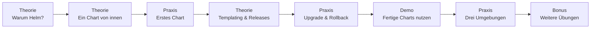

# Kubernetes – Helm: Pakete statt YAML-Halde

In [Teil 1](../kubernetes-praxis/index.md) hast du deinen Dienst zum Laufen gebracht, in [Teil 2](../kubernetes-aufbau/index.md) hast du ihn betriebsreif gemacht: ConfigMap, Secret, Probes, Requests und Limits. Dabei ist nebenbei etwas gewachsen, das dir vielleicht gar nicht aufgefallen ist: **eine Halde YAML**. Deployment, Service, ConfigMap, Secret – jedes Objekt eine Datei, jede Datei von Hand gepflegt. Für **eine** App auf **einem** Cluster geht das gut. Für dieselbe App in Entwicklung, Test und Produktion nicht mehr.

Dieser Block ist der **letzte** des Kubernetes-Themas. Er bringt Ordnung in die Halde – und schließt damit den Bogen von „ich habe einen Pod gestartet" bis „ich rolle dieselbe App kontrolliert in drei Umgebungen aus und komme jederzeit zurück".

!!! info "Worauf wir aufbauen"
    Wir bleiben bei **derselben** Demo-App und **demselben** lokalen Cluster wie in Teil 1 und Teil 2: das schlanke nginx, das dir groß seine **Version**, den **Standort** und den **Pod-Namen** anzeigt. Neu ist kein einziges Kubernetes-Objekt – im Chart dieses Blocks steckt exakt das Deployment, der Service, die ConfigMap und das Secret, die du in Teil 2 selbst geschrieben hast. Neu ist allein die **Verpackung**. Du brauchst also kein neues Vorwissen, nur einen laufenden minikube und ein zusätzliches Werkzeug: `helm`.

Drei Probleme löst Helm – und zu jedem gibt es eine sichtbare Übung:

- **Dieselbe App, drei Umgebungen.** Entwicklung, Test und Produktion unterscheiden sich in ein paar Werten: Anzahl der Pods, Farbe, Standort. Von Hand hieße das dreimal derselbe YAML-Stapel und dreimal Pflege. Ein **Chart** ist ein Paket mit **Stellschrauben** – einmal gebaut, dreimal anders installiert.
- **Kein Zurück-Knopf.** Das Update ist raus, es war falsch – und jetzt? Bisher: die alten Dateien zusammensuchen und hoffen. Helm merkt sich jede **Revision** und dreht sie mit einem Befehl zurück.
- **Alles selbst verdrahten.** Prometheus und Grafana hast du im [Monitoring-Block](../monitoring-praxis/index.md) noch von Hand zusammengesteckt. Für Kubernetes gibt es dafür **fertige Charts**: ein Befehl statt tausender Zeilen YAML.

!!! note "Warum das für dich wichtig ist"
    Du wirst im Beruf selten die eine App auf dem einen Cluster betreuen. Du bekommst ein Dutzend Dienste, die voneinander abhängen, drei Umgebungen, in denen sie gleich laufen müssen, dazu Kollegen, die morgen dasselbe ausrollen wie du heute. Genau da hört „ich tippe das schnell von Hand" auf: Ein Paket ist die Form, in der ein Dienst **übergabefähig** wird – wiederholbar, nachvollziehbar und mit einem Rückweg, den auch jemand anderes findet.

    Der Weg dahin geht über drei Stufen: von „läuft bei mir" über „läuft im Betrieb" zu „**lässt sich ausliefern**". Die ersten beiden hast du hinter dir. Heute kommt die dritte.

---

## Was du in diesem Block lernst

- **was Helm ist** – der Paketmanager für Kubernetes, dazu die vier Begriffe **Chart**, **Release**, **Revision** und **Repository**
- wie ein **Chart von innen** aussieht: `Chart.yaml`, `values.yaml` und der Ordner `templates/` – und wo darin deine Manifeste aus Teil 2 stecken
- **Templating** – aus festen Werten werden Platzhalter, aus einem Paket viele Umgebungen: `--set`, eigene Werte-Dateien und wer gewinnt, wenn sich zwei Werte widersprechen
- **`helm upgrade`, `helm history`, `helm rollback`** – ein Update ausrollen, seine Geschichte lesen und ein misslungenes in einem einzigen Befehl zurückdrehen
- **fertige Charts aus dem Netz nutzen** – suchen, vorher hineinschauen, installieren – statt blind zu vertrauen
- wo Helm den Zustand eines Releases **speichert** – nämlich im Cluster, nicht auf deinem Laptop

---

## So ist dieser Block aufgebaut

Gleicher roter Faden wie in Teil 1 und Teil 2: erst ein Konzept verstehen, dann sofort selbst anfassen.



| Seite | Inhalt | Art |
|-------|--------|-----|
| [Warum Helm?](01-warum-helm.md) | Was an einer Halde einzelner Manifeste weh tut – und was ein Paketmanager daran ändert | Theorie |
| [Ein Chart von innen](02-chart-anatomie.md) | `Chart.yaml`, `values.yaml`, `templates/` – der Aufbau eines Pakets | Theorie |
| [Praxis: Dein erstes Chart](03-praxis-erstes-chart.md) | Das Chart der Demo-App prüfen, installieren und die Werte drehen | Praxis – Pflicht |
| [Templating & Releases](04-templating-und-releases.md) | Platzhalter, Werte-Vorrang, Release und Revision – und wo Helm das alles merkt | Theorie |
| [Praxis: Upgrade & Rollback](05-praxis-upgrade-rollback.md) | Ein Update ausrollen, die History lesen, per Rollback zurück | Praxis – Pflicht |
| [Fertige Charts nutzen](06-fertige-charts-nutzen.md) | Ein fremdes Chart finden und hineinschauen – mit dem nötigen Misstrauen. Das Ausrollen zeige ich im Hauptraum | Demo – zuschauen |
| [Praxis: Drei Umgebungen](07-lab-drei-umgebungen.md) | Dieselbe App als dev, test und prod – aus einem einzigen Chart | Praxis – Pflicht |
| [Weitere Übungen](08-uebungen.md) | Elf Zusatzaufgaben zum Vertiefen, jeweils mit Lösung | Bonus |
| [Stolpersteine](09-stolpersteine.md) | Die Fallen, die wirklich zuschlagen – und woran du sie erkennst | Referenz |
| [Rückblick & Abschluss](10-rueckblick.md) | Was du mitnimmst und wie das Kubernetes-Thema endet | Referenz |

!!! info "Die Theorieseiten sind länger als das, was wir besprechen"
    Das ist Absicht. Im Hauptraum gehen wir den roten Faden durch, hier steht die ganze Geschichte – mit jedem Befehl, jeder Ausgabe und den Details, für die live keine Zeit ist. Wenn dir etwas zu schnell ging: Genau dafür sind diese Seiten da. Du musst sie vorher nicht lesen.

    Die Übungen sind alle so gebaut, dass du sie **allein durcharbeiten** kannst – Schritt für Schritt, mit aufklappbarer Lösung. Niemand muss alles schaffen. Arbeite dich der Reihe nach durch und frag, wenn etwas klemmt.

---

## Voraussetzungen

- **Teil 1 und Teil 2 sitzen.** Deployment, Service, ConfigMap, Secret, `kubectl apply`, `port-forward`, `rollout restart` – wenn dir diese Begriffe etwas sagen, bist du bereit. Falls nicht: erst [Teil 1](../kubernetes-praxis/index.md) und [Teil 2](../kubernetes-aufbau/index.md).
- Dein **lokaler Cluster läuft**. Schneller Check:

    ```bash
    kubectl get nodes
    ```

    Erwartet: ein Node mit Status `Ready`. Falls nicht, [minikube starten](../kubernetes-praxis/03-installation.md).
- **Helm ist installiert.** Das ist das einzige neue Werkzeug in diesem Block:

    === "Windows (PowerShell)"
        ```powershell
        winget install --id Helm.Helm --exact
        ```

        !!! warning "Danach PowerShell schließen und neu öffnen"
            Dein **laufendes** Fenster kennt den Befehl `helm` noch nicht – der Pfad landet erst in einer **neuen** Sitzung im `PATH`. Wenn also gleich „Der Begriff helm wurde nicht erkannt" erscheint: Fenster zu, Fenster auf, nochmal.

    === "macOS"
        ```bash
        brew install helm
        ```

    === "Linux"
        Je nach Distribution unterschiedlich – die aktuellen Wege stehen in der [Helm-Dokumentation](https://helm.sh/docs/intro/install/).

    Prüfen (in einer **neuen** Sitzung):

    ```bash
    helm version
    ```

    ```text
    version.BuildInfo{Version:"v4.2.3", GitCommit:"43e8b7feece8beb0fcba47059ec9b522fd929a64", GitTreeState:"clean", GoVersion:"go1.26.5", KubeClientVersion:"v1.36"}
    ```

    Eine Zeile mit `Version:"v4...."` genügt – dann bist du startklar.
- Die **Projektdateien** liegen lokal. Das fertige Chart dieses Blocks liegt in einem eigenen Ordner:

    ```bash
    git clone https://github.com/JacobMenge/kurs-unterlagen.git
    cd kurs-unterlagen/apps/kubernetes-helm
    ```

    Alle `helm`-Befehle in diesem Block gehen relativ von diesem Ordner aus (`./webserver`, `values-dev.yaml`).

!!! note "Kurz erklärt: Es ist Helm 4"
    Du installierst **Helm 4** – seit Ende 2025 die stabile Fassung. Viele Anleitungen im Netz beschreiben noch **Helm 3**, weil sie älter sind. Für alles in diesem Block ist das harmlos: Charts sind abwärtskompatibel. `install`, `upgrade`, `rollback`, `history`, `template` und `lint` verhalten sich gleich. Wo es wirklich einen Unterschied gibt, sagen wir es an Ort und Stelle dazu.

---

## Leitfrage

> **Meine App läuft betriebsreif im Cluster – aber wie rolle ich sie immer wieder gleich aus, in Entwicklung, Test und Produktion, ohne für jede Umgebung eine eigene Kopie meiner Manifeste zu pflegen? Und wie komme ich zurück, wenn ein Update danebengeht?**

Wer das am Ende mit **Chart**, **Werte-Datei** und **`helm rollback`** beantworten kann, hat den letzten Schritt gemacht: vom einzelnen Handgriff am Cluster zum Paket, das man ausliefert.

---

## Weiter

- [Warum Helm?](01-warum-helm.md) – der Einstieg
