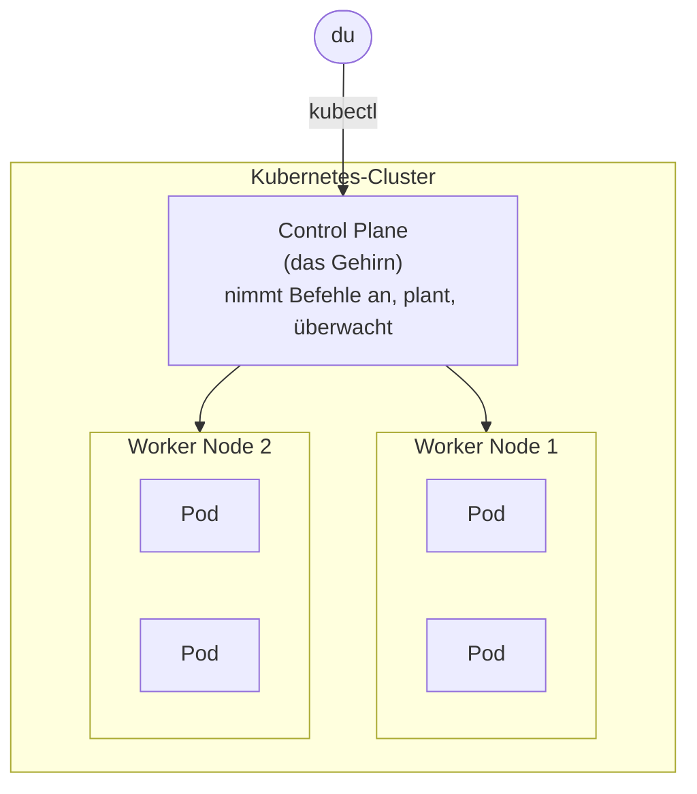
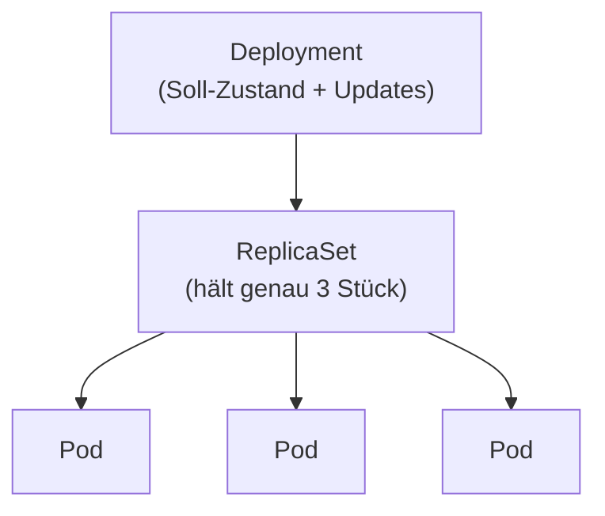

# Grundbegriffe

Ein paar Vokabeln, dann kannst du loslegen. Lies die Seite einmal in Ruhe – sie ist auch zum **Zurückblättern** gedacht, wenn dir in der Praxis ein Begriff wieder begegnet. Du musst dir nichts auswendig merken; du sollst jeden Begriff **einordnen** können.

!!! tip "So gehst du an die Begriffe heran"
    Lies sie **von außen nach innen**: Ein **Cluster** besteht aus **Nodes**, auf den Nodes laufen **Pods**, in den Pods stecken deine **Container**. Ein **Deployment** sorgt für die richtige Zahl Pods, ein **Service** macht sie erreichbar. Mehr ist es für den Anfang nicht.

---

## Cluster und Node

Ein **Cluster** ist der ganze Verbund: mehrere Rechner, die zusammen als eine Einheit arbeiten. Jeder einzelne Rechner darin heißt **Node** (Knoten) – das kann ein Server im Rechenzentrum sein, eine virtuelle Maschine in der Cloud oder, in unserer Übung, einfach ein Stück deines Laptops.

Es gibt zwei Sorten von Nodes:

- **Control Plane** (das „Gehirn“) – verteilt die Arbeit, überwacht den Soll-Zustand, trifft die Entscheidungen. Hier läuft unter anderem der **API-Server** – die zentrale Anlaufstelle, an die `kubectl` all deine Befehle schickt.
- **Worker Nodes** (die „Arbeiter“) – hier laufen tatsächlich deine Container.



!!! note "Kurz erklärt: in unserer Übung ist alles auf einem Rechner"
    Wir richten gleich einen **Ein-Knoten-Cluster** auf deinem eigenen Rechner ein (mit **minikube**). Control Plane und Worker stecken dann zusammen in **einer** virtuellen Maschine. Das ist normal zum Lernen: die Befehle und Konzepte sind **exakt dieselben** wie bei einem großen Cluster aus hundert Servern – nur kleiner.

---

## Pod – die kleinste Einheit

In Kubernetes startest du keine Container direkt. Die kleinste Einheit, die Kubernetes verwaltet, ist der **Pod**. Ein Pod ist eine **Hülle um einen Container** (manchmal auch um mehrere eng zusammengehörige). Fast immer gilt: **ein Pod = ein Container**.

<figure>
<svg viewBox="0 0 420 170" width="100%" height="170" role="img" aria-label="Ein Pod als Hülle um einen Container">
  <rect x="40" y="30" width="160" height="110" rx="10" fill="rgba(125,255,154,0.06)" stroke="#7dff9a" stroke-width="2.5"/>
  <text x="120" y="22" text-anchor="middle" fill="#7dff9a" font-family="JetBrains Mono, monospace" font-size="13" font-weight="bold">Pod</text>
  <rect x="70" y="60" width="100" height="60" rx="5" fill="rgba(122,162,255,0.16)" stroke="#7aa2ff" stroke-width="2"/>
  <text x="120" y="95" text-anchor="middle" fill="#7aa2ff" font-family="JetBrains Mono, monospace" font-size="12">Container</text>
  <text x="290" y="70" text-anchor="middle" fill="#8fa498" font-size="13">Der Pod bekommt eine</text>
  <text x="290" y="90" text-anchor="middle" fill="#8fa498" font-size="13">eigene IP-Adresse im</text>
  <text x="290" y="110" text-anchor="middle" fill="#8fa498" font-size="13">Cluster und ist sterblich.</text>
</svg>
<figcaption>Ein Pod umschließt deinen Container. Er ist die kleinste Einheit, die Kubernetes startet, plant und überwacht.</figcaption>
</figure>

Das Entscheidende, das dich durch den ganzen Block begleitet:

!!! warning "Pods sind sterblich"
    Ein Pod ist **kurzlebig**. Er kann jederzeit verschwinden – weil er abstürzt, weil sein Node gewartet wird oder weil du herunterskalierst. Ein neuer Pod kommt dann an anderer Stelle hoch und bekommt eine **neue IP-Adresse**. Deshalb verlässt man sich nie auf einen einzelnen Pod oder seine Adresse – dafür gibt es Deployment und Service.

---

## Deployment – der Manager der Pods

Ein **Deployment** ist die Einheit, mit der man in echt arbeitet. Es beschreibt den **Soll-Zustand** für eine Gruppe gleicher Pods: „Halte mir **3** Kopien dieser App am Laufen.“ Kubernetes sorgt dann dauerhaft dafür, dass es stimmt.

Daraus ergeben sich von selbst zwei der wichtigsten Fähigkeiten:

- **Selbstheilung** – stirbt ein Pod, fehlt einer zum Soll. Kubernetes startet sofort einen neuen.
- **Skalierung** – du änderst die Zahl von 3 auf 10 – und es kommen sieben dazu (oder zurück).

<figure>
<svg viewBox="0 0 520 210" width="100%" height="210" role="img" aria-label="Deployment hält drei Pods, einer stirbt, ein neuer kommt nach">
  <text x="260" y="20" text-anchor="middle" fill="#7dff9a" font-family="JetBrains Mono, monospace" font-size="13" font-weight="bold">Deployment: "halte 3 Pods"</text>
  <rect x="20" y="35" width="480" height="150" rx="10" fill="rgba(125,255,154,0.04)" stroke="#56c374" stroke-width="2" stroke-dasharray="5 4"/>

  <!-- Pod 1 ok -->
  <rect x="55" y="80" width="90" height="60" rx="6" fill="rgba(125,255,154,0.07)" stroke="#7dff9a" stroke-width="2"/>
  <text x="100" y="115" text-anchor="middle" fill="#7dff9a" font-family="JetBrains Mono, monospace" font-size="12">Pod ✓</text>

  <!-- Pod 2 stirbt -->
  <rect x="215" y="80" width="90" height="60" rx="6" fill="rgba(224,108,108,0.07)" stroke="#e06c6c" stroke-width="2" stroke-dasharray="4 3"/>
  <line x1="230" y1="92" x2="290" y2="128" stroke="#e06c6c" stroke-width="2.5"/>
  <line x1="290" y1="92" x2="230" y2="128" stroke="#e06c6c" stroke-width="2.5"/>
  <text x="260" y="160" text-anchor="middle" fill="#e06c6c" font-size="11">stirbt</text>

  <!-- Pfeil zum Ersatz -->
  <path d="M310 110 L360 110" fill="none" stroke="#e0a05a" stroke-width="2.5" marker-end="url(#g)"/>

  <!-- Pod 3 neu -->
  <rect x="375" y="80" width="90" height="60" rx="6" fill="rgba(125,255,154,0.07)" stroke="#7dff9a" stroke-width="2"/>
  <text x="420" y="111" text-anchor="middle" fill="#7dff9a" font-family="JetBrains Mono, monospace" font-size="12">neuer</text>
  <text x="420" y="127" text-anchor="middle" fill="#7dff9a" font-family="JetBrains Mono, monospace" font-size="12">Pod ✓</text>

  <defs><marker id="g" markerWidth="9" markerHeight="9" refX="7" refY="3" orient="auto"><path d="M0,0 L7,3 L0,6 Z" fill="#e0a05a"/></marker></defs>
</svg>
<figcaption>Das Deployment wacht über die Soll-Zahl. Stirbt ein Pod, ist die Zahl zu niedrig – Kubernetes startet automatisch Ersatz. Das ist Selbstheilung.</figcaption>
</figure>

!!! note "Kurz erklärt: ReplicaSet – das Rädchen darunter"
    Zwischen Deployment und Pods arbeitet **im Hintergrund** ein **ReplicaSet** (du begegnest ihm in Praxis 2 in `kubectl get all`). Es ist der eigentliche „Zähler“, der dafür sorgt, dass genau *N* gleiche Pods existieren. Das **Deployment** sitzt obendrauf, verwaltet das ReplicaSet und kommt zusätzlich für die **Rolling Updates** ins Spiel. Kurz: Du arbeitest fast immer nur mit dem **Deployment** – um das ReplicaSet kümmert es sich selbst.



---

## Service – die stabile Adresse

Pods sind sterblich und wechseln ihre IP. Wie erreicht man dann zuverlässig eine App? Über einen **Service**. Ein Service ist eine **feste Adresse** (ein stabiler Name plus eine gleichbleibende IP im Cluster), die **vor** einer Gruppe von Pods steht. Er hat zwei Jobs:

1. **stabil erreichbar bleiben**, egal wie oft die Pods dahinter neu starten,
2. **die Last verteilen** – Anfragen reihum auf alle passenden Pods (Load-Balancing).

<figure>
<svg viewBox="0 0 520 220" width="100%" height="220" role="img" aria-label="Ein Service verteilt Anfragen auf drei Pods">
  <!-- Client -->
  <circle cx="60" cy="110" r="28" fill="rgba(122,162,255,0.12)" stroke="#7aa2ff" stroke-width="2"/>
  <text x="60" y="115" text-anchor="middle" fill="#7aa2ff" font-size="12">Anfrage</text>

  <!-- Service -->
  <rect x="160" y="80" width="120" height="60" rx="8" fill="rgba(125,255,154,0.1)" stroke="#7dff9a" stroke-width="2.5"/>
  <text x="220" y="105" text-anchor="middle" fill="#7dff9a" font-family="JetBrains Mono, monospace" font-size="13" font-weight="bold">Service</text>
  <text x="220" y="124" text-anchor="middle" fill="#8fa498" font-size="11">stabile Adresse</text>

  <path d="M88 110 L160 110" fill="none" stroke="#7aa2ff" stroke-width="2" marker-end="url(#b)"/>

  <!-- drei Pods -->
  <rect x="370" y="30" width="110" height="44" rx="6" fill="rgba(125,255,154,0.06)" stroke="#56c374" stroke-width="2"/>
  <text x="425" y="57" text-anchor="middle" fill="#7dff9a" font-family="JetBrains Mono, monospace" font-size="12">Pod</text>
  <rect x="370" y="88" width="110" height="44" rx="6" fill="rgba(125,255,154,0.06)" stroke="#56c374" stroke-width="2"/>
  <text x="425" y="115" text-anchor="middle" fill="#7dff9a" font-family="JetBrains Mono, monospace" font-size="12">Pod</text>
  <rect x="370" y="146" width="110" height="44" rx="6" fill="rgba(125,255,154,0.06)" stroke="#56c374" stroke-width="2"/>
  <text x="425" y="173" text-anchor="middle" fill="#7dff9a" font-family="JetBrains Mono, monospace" font-size="12">Pod</text>

  <path d="M280 105 L370 52" fill="none" stroke="#56c374" stroke-width="2" marker-end="url(#b)"/>
  <path d="M280 110 L370 110" fill="none" stroke="#56c374" stroke-width="2" marker-end="url(#b)"/>
  <path d="M280 115 L370 168" fill="none" stroke="#56c374" stroke-width="2" marker-end="url(#b)"/>

  <defs><marker id="b" markerWidth="9" markerHeight="9" refX="7" refY="3" orient="auto"><path d="M0,0 L7,3 L0,6 Z" fill="#56c374"/></marker></defs>
</svg>
<figcaption>Der Service ist die feste Tür. Dahinter dürfen Pods kommen und gehen – die Anfrage trifft immer einen lebenden Pod, die Last verteilt sich automatisch.</figcaption>
</figure>

!!! note "Kurz erklärt: woher der Service „seine“ Pods kennt"
    Über **Labels**. Ein Label ist einfach eine kleine Markierung an einem Pod – wie ein **Aufkleber** `app: hello`. Der Service hat einen **Selektor**, also eine Suchregel: „schick alles an jeden Pod mit dem Aufkleber `app: hello`“. Tauchen neue Pods mit diesem Label auf (z.B. weil du hochskalierst), nimmt der Service sie automatisch mit auf. Labels sind das Klebeband, das in Kubernetes alles verbindet – das siehst du in [Praxis 3](08-praxis-service.md) live.

---

## kubectl – deine Fernbedienung

**`kubectl`** (gesprochen „kube-control“ oder „kube-c-t-l“) ist das Kommandozeilen-Werkzeug, mit dem du mit dem Cluster redest. Jeder Befehl geht an den **API-Server** der Control Plane. Das Muster ist fast immer gleich:

```text
kubectl  <verb>     <ressource>   <name>
         get        pods
         describe   pod           hello
         delete     deployment    hello
         scale      deployment    hello --replicas=5
```

Ein paar Befehle, die du immer wieder brauchst – mehr Vokabeln sind es kaum:

| Befehl | Was er tut |
|---|---|
| `kubectl get pods` | listet die Pods auf |
| `kubectl get all` | zeigt Pods, Deployments, Services … auf einen Blick |
| `kubectl describe pod <name>` | zeigt alle Details und Ereignisse eines Pods |
| `kubectl logs <name>` | zeigt die Ausgabe (Logs) des Containers |
| `kubectl apply -f datei.yaml` | wendet einen Soll-Zustand aus einer Datei an |
| `kubectl delete -f datei.yaml` | entfernt, was in der Datei steht |

---

## Deklarativ: das YAML-Manifest

Genau wie bei der `compose.yaml` beschreibst du den Soll-Zustand in einer **YAML-Datei** – einem **Manifest**. Vier Felder hat jedes Manifest:

```yaml
apiVersion: apps/v1     # welche API-Version (hängt von der Ressource ab)
kind: Deployment        # was für ein Objekt? Pod, Deployment, Service …
metadata:
  name: hello           # wie heißt es?
spec:                   # der eigentliche Soll-Zustand
  replicas: 3
  # ...
```

Du musst YAML nicht auswendig können. Du sollst die vier Felder **wiedererkennen** – `apiVersion`, `kind`, `metadata`, `spec`. In den Praxis-Teilen liegen die fertigen Manifeste bereit – wir gehen sie Zeile für Zeile durch.

!!! note "Kurz erklärt: warum YAML statt Klick-für-Klick?"
    Weil ein Manifest **wiederholbar** und **versionierbar** ist. Dieselbe Datei erzeugt überall denselben Zustand – auf deinem Laptop, beim Kollegen, auf dem Produktiv-Cluster. Du kannst sie in [Git](../git/index.md) ablegen, Änderungen nachvollziehen und zurückrollen. Genau dieser Gedanke trägt später bis zu „GitOps“ – aber das ist Zukunftsmusik, hier reicht: **eine Datei beschreibt den Zustand**.

---

## Die Begriffsbrücke: von Compose zu Kubernetes

Vieles kennst du sinngemäß schon aus dem Compose-Block – es heißt nur anders und ist auf „viele Rechner“ gedacht:

| Docker / Compose | Kubernetes | Unterschied |
|---|---|---|
| `docker run` (ein Container) | **Pod** | kleinste Einheit, aber sterblich und ersetzbar |
| `--restart` / von Hand neu starten | **Deployment** | hält die Soll-Zahl automatisch, heilt selbst |
| `--scale` in Compose | `replicas:` im Deployment | Skalierung über den ganzen Cluster |
| Service-Name im Compose-Netzwerk | **Service** | stabile Adresse **plus** Load-Balancing |
| ein Host | **Cluster** aus Nodes | viele Rechner als einer |
| `compose.yaml` | **Manifest(e)** (`apply -f`) | derselbe deklarative Gedanke |

!!! quote "Wenn du dir drei Begriffe merkst"
    **Pod** = dein Container, verpackt und sterblich. **Deployment** = hält die richtige Zahl Pods am Leben. **Service** = die stabile Adresse davor. Damit kannst du dem Rest folgen.

---

## Weiter

- [Installation](03-installation.md) – jetzt richten wir einen kleinen Cluster auf deinem Rechner ein
