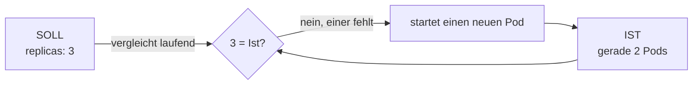
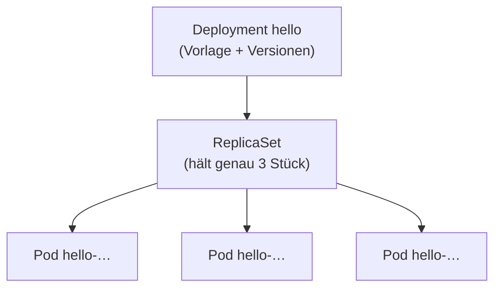

# Deployments & Skalierung

In [Praxis 1](04-praxis-hello-world.md) hast du einen einzelnen **Pod** gestartet, hineingeschaut und ihn dann gelöscht. Was ist passiert? **Nichts kam zurück.** Der Pod war weg – keiner hat sich beschwert, außer der App, die nicht mehr lief. Genau das fühlt sich falsch an: Eigentlich soll so etwas doch von selbst wieder hochkommen.

Genau dieses Problem löst das **Deployment**. Es ist der Schritt vom „ich habe einen Container gestartet“ zum „ich will, dass dieser Dienst **immer** läuft – und zwar in der Anzahl, die ich vorgebe“. In dieser Theorieseite klären wir vier Dinge, die du danach in [Praxis 2](06-praxis-deployment.md) selbst auslöst: den **Soll-Zustand**, die **Selbstheilung**, die **Skalierung** und das **Rolling Update**.

!!! quote "Der rote Faden"
    Ein nackter Pod ist wie ein Eimer ohne Boden: einmal umgekippt, ist er leer. Ein Deployment ist der Helfer, der danebensteht und den Eimer immer wieder aufstellt – und auf Wunsch gleich drei davon hinstellt.

---

## Das Deployment: der Soll-Zustand

Ein **Deployment** beschreibt nicht *einen* Pod, sondern eine **Gruppe gleicher Pods** als **Ziel**: „Halte mir **3** Kopien dieser App am Laufen.“ Du sagst nur die **Zahl** und die **Vorlage** – wie der Pod aussehen soll. Den Rest erledigt Kubernetes.

Dahinter steckt exakt der Regelkreis aus [Warum Kubernetes?](01-warum-kubernetes.md): Kubernetes vergleicht laufend den **Soll-Zustand** (was du willst) mit dem **Ist-Zustand** (was gerade läuft) und gleicht den Unterschied aus. Sind zu wenige Pods da, startet es welche nach. Sind zu viele da, fährt es welche herunter.



!!! note "Kurz erklärt: warum „Soll-Zustand“ statt „starte einen Container“?"
    Bei Docker sagst du **imperativ**: „starte diesen Container“. Ist er weg, ist er weg – niemand kümmert sich. Ein Deployment ist **deklarativ**: du beschreibst das **Ziel** (3 Pods) – Kubernetes hält es **dauerhaft**. Der Unterschied klingt klein, ist aber der Kern: Du gibst kein einmaliges Kommando, sondern ein **Versprechen**, das laufend eingelöst wird.

---

## Selbstheilung

Aus dem Soll-Zustand ergibt sich die erste Superkraft ganz von allein. Stirbt ein Pod – weil er abstürzt, weil sein Node neu startet oder weil du ihn von Hand löschst –, dann sind plötzlich nur noch 2 von 3 Pods da. Der Ist-Zustand passt nicht mehr zum Soll. Kubernetes bemerkt das **sofort** und startet **automatisch** einen Ersatz-Pod. Du musst nichts tun.

Das ist genau der Kontrast, den du in der Praxis siehst:

| Du löschst einen … | Was passiert |
|---|---|
| **nackten Pod** (`hello-pod.yaml`) | nichts – er bleibt weg, niemand ersetzt ihn |
| **Pod eines Deployments** | Kubernetes startet sofort einen neuen, das Soll wird wiederhergestellt |

!!! tip "Genau das hast du in Praxis 1 vermisst"
    In [Praxis 1](04-praxis-hello-world.md) hast du einen nackten Pod gelöscht – und er kam **nicht** zurück. Mit einem Deployment dahinter wäre er es. In [Praxis 2](06-praxis-deployment.md) löschst du gleich einen Pod aus einem Deployment und siehst zu, wie der Ersatz in Sekunden hochkommt.

!!! note "Kurz erklärt: „Selbstheilung“ heißt nicht „reparieren“"
    Kubernetes flickt keinen kaputten Pod. Es **ersetzt** ihn durch einen frischen, gebaut nach derselben Vorlage. Die Heilung besteht darin, die **Stückzahl** wiederherzustellen – nicht den einzelnen Pod zu retten. Deshalb sind Pods auch austauschbar: Es zählt, dass *drei* laufen, nicht *welche* drei.

---

## Skalierung

Die zweite Superkraft ist genauso bequem. Brauchst du mehr Kopien, weil die Last steigt? Du startest sie nicht von Hand – du **änderst nur die Zahl**. Aus `replicas: 3` wird `replicas: 5` – Kubernetes startet zwei dazu. Senkst du wieder auf 2, fährt es drei herunter. Hoch wie runter ist es **eine einzige Zahl**.

```bash
kubectl scale deployment hello --replicas=5
```

Das passt den Soll-Zustand live an: „ab jetzt will ich 5“. Du kannst dabei zusehen, wie die neuen Pods erscheinen:

```bash
kubectl get pods -w
```

Das `-w` (für **watch**) hält die Anzeige offen und aktualisiert sie live – jede neue Zeile ist ein Pod, der hochfährt. Beenden mit `Ctrl+C`.

!!! note "Kurz erklärt: skalieren statt selbst starten"
    Ohne Orchestrierung müsstest du jede zusätzliche Kopie selbst starten, auf einen Rechner legen und im Blick behalten. Mit einem Deployment sagst du nur **wie viele** – das *Wo* und das *Wie* übernimmt Kubernetes. Aus „zehn Container von Hand verteilen“ wird `--replicas=10`. Das ist der ganze Trick hinter dem Wort **Skalierung**.

!!! tip "Zwei Wege, dieselbe Wirkung"
    `kubectl scale …` ändert die Zahl **sofort** – praktisch zum Ausprobieren. Genauso gut kannst du im Manifest `replicas:` anpassen und neu `kubectl apply -f` ausführen. Der deklarative Weg über die Datei ist der, den man im echten Betrieb nimmt, weil die Datei in [Git](../git/index.md) nachvollziehbar bleibt.

---

## Das ReplicaSet darunter

Wer genau hinschaut, sieht zwischen Deployment und Pods noch eine Zwischenebene: das **ReplicaSet**. Das hast du in den [Grundbegriffen](02-grundbegriffe.md) schon kurz gestreift – hier die Arbeitsteilung in einem Satz:

- Das **Deployment** ist der Manager. Es kennt die Vorlage und kümmert sich um **Versionen** – also um Rolling Updates und Rollbacks.
- Das **ReplicaSet** ist der Zähler darunter. Sein einziger Job: dafür sorgen, dass genau *N* gleiche Pods existieren.



!!! note "Kurz erklärt: warum du das ReplicaSet kaum anfasst"
    Du arbeitest fast immer mit dem **Deployment** – das ReplicaSet legt es selbst an und führt es im Hintergrund. Trotzdem ist gut zu wissen, dass es da ist: Beim Rolling Update gleich verstehst du dadurch, **warum** das alte ReplicaSet stehen bleibt – es ist die „gespeicherte Vorversion“, zu der du jederzeit zurück kannst.

---

## Rolling Update und Rollback

Jetzt zur dritten Superkraft – der, die im echten Betrieb am meisten wert ist. Du willst eine **neue Version** ausrollen, ohne dass der Dienst auch nur eine Sekunde weg ist. Das Deployment macht das **wellenweise**: Es startet einen neuen Pod mit der neuen Version, wartet bis er läuft, nimmt dann einen alten heraus – und so weiter, Pod für Pod. Zu jedem Zeitpunkt sind genug Pods da, um Anfragen zu beantworten. Das nennt man **Rolling Update**.

<figure>
<svg viewBox="0 0 640 280" width="100%" height="280" role="img" aria-label="Rolling Update in drei Wellen: alte blaue Pods werden Pod fuer Pod durch neue gruene Pods ersetzt">
  <!-- Welle 1: alle alt -->
  <text x="80" y="30" text-anchor="middle" fill="#8fa498" font-family="JetBrains Mono, monospace" font-size="12">Start</text>
  <rect x="40" y="45" width="80" height="34" rx="5" fill="rgba(122,162,255,0.16)" stroke="#7aa2ff" stroke-width="2"/>
  <text x="80" y="67" text-anchor="middle" fill="#7aa2ff" font-family="JetBrains Mono, monospace" font-size="12">alt</text>
  <rect x="40" y="89" width="80" height="34" rx="5" fill="rgba(122,162,255,0.16)" stroke="#7aa2ff" stroke-width="2"/>
  <text x="80" y="111" text-anchor="middle" fill="#7aa2ff" font-family="JetBrains Mono, monospace" font-size="12">alt</text>
  <rect x="40" y="133" width="80" height="34" rx="5" fill="rgba(122,162,255,0.16)" stroke="#7aa2ff" stroke-width="2"/>
  <text x="80" y="155" text-anchor="middle" fill="#7aa2ff" font-family="JetBrains Mono, monospace" font-size="12">alt</text>

  <text x="160" y="110" text-anchor="middle" fill="#7dff9a" font-size="22">→</text>

  <!-- Welle 2: einer neu -->
  <text x="240" y="30" text-anchor="middle" fill="#8fa498" font-family="JetBrains Mono, monospace" font-size="12">Welle 1</text>
  <rect x="200" y="45" width="80" height="34" rx="5" fill="rgba(125,255,154,0.1)" stroke="#7dff9a" stroke-width="2"/>
  <text x="240" y="67" text-anchor="middle" fill="#7dff9a" font-family="JetBrains Mono, monospace" font-size="12">neu</text>
  <rect x="200" y="89" width="80" height="34" rx="5" fill="rgba(122,162,255,0.16)" stroke="#7aa2ff" stroke-width="2"/>
  <text x="240" y="111" text-anchor="middle" fill="#7aa2ff" font-family="JetBrains Mono, monospace" font-size="12">alt</text>
  <rect x="200" y="133" width="80" height="34" rx="5" fill="rgba(122,162,255,0.16)" stroke="#7aa2ff" stroke-width="2"/>
  <text x="240" y="155" text-anchor="middle" fill="#7aa2ff" font-family="JetBrains Mono, monospace" font-size="12">alt</text>

  <text x="320" y="110" text-anchor="middle" fill="#7dff9a" font-size="22">→</text>

  <!-- Welle 3: zwei neu -->
  <text x="400" y="30" text-anchor="middle" fill="#8fa498" font-family="JetBrains Mono, monospace" font-size="12">Welle 2</text>
  <rect x="360" y="45" width="80" height="34" rx="5" fill="rgba(125,255,154,0.1)" stroke="#7dff9a" stroke-width="2"/>
  <text x="400" y="67" text-anchor="middle" fill="#7dff9a" font-family="JetBrains Mono, monospace" font-size="12">neu</text>
  <rect x="360" y="89" width="80" height="34" rx="5" fill="rgba(125,255,154,0.1)" stroke="#7dff9a" stroke-width="2"/>
  <text x="400" y="111" text-anchor="middle" fill="#7dff9a" font-family="JetBrains Mono, monospace" font-size="12">neu</text>
  <rect x="360" y="133" width="80" height="34" rx="5" fill="rgba(122,162,255,0.16)" stroke="#7aa2ff" stroke-width="2"/>
  <text x="400" y="155" text-anchor="middle" fill="#7aa2ff" font-family="JetBrains Mono, monospace" font-size="12">alt</text>

  <text x="480" y="110" text-anchor="middle" fill="#7dff9a" font-size="22">→</text>

  <!-- Welle 4: alle neu -->
  <text x="560" y="30" text-anchor="middle" fill="#7dff9a" font-family="JetBrains Mono, monospace" font-size="12">fertig</text>
  <rect x="520" y="45" width="80" height="34" rx="5" fill="rgba(125,255,154,0.1)" stroke="#7dff9a" stroke-width="2"/>
  <text x="560" y="67" text-anchor="middle" fill="#7dff9a" font-family="JetBrains Mono, monospace" font-size="12">neu</text>
  <rect x="520" y="89" width="80" height="34" rx="5" fill="rgba(125,255,154,0.1)" stroke="#7dff9a" stroke-width="2"/>
  <text x="560" y="111" text-anchor="middle" fill="#7dff9a" font-family="JetBrains Mono, monospace" font-size="12">neu</text>
  <rect x="520" y="133" width="80" height="34" rx="5" fill="rgba(125,255,154,0.1)" stroke="#7dff9a" stroke-width="2"/>
  <text x="560" y="155" text-anchor="middle" fill="#7dff9a" font-family="JetBrains Mono, monospace" font-size="12">neu</text>

  <!-- Hinweiszeile -->
  <text x="320" y="205" text-anchor="middle" fill="#8fa498" font-size="13">Zu jedem Zeitpunkt sind genug Pods da → kein Ausfall.</text>
  <text x="320" y="230" text-anchor="middle" fill="#e0a05a" font-family="JetBrains Mono, monospace" font-size="12">blau = alte Version (hello:latest)</text>
  <text x="320" y="252" text-anchor="middle" fill="#7dff9a" font-family="JetBrains Mono, monospace" font-size="12">gruen = neue Version (hello:plain-text)</text>
</svg>
<figcaption>Beim Rolling Update tauscht das Deployment die Pods wellenweise aus: erst einen neuen hoch, dann einen alten weg – bis alle erneuert sind. Der Dienst bleibt durchgehend erreichbar.</figcaption>
</figure>

So löst du es aus – unser Beispiel-Image hat dafür einen zweiten Tag. `hello:plain-text` zeigt dieselbe Info wie `hello:latest`, nur als Klartext – die Änderung ist also **sichtbar**:

```bash
kubectl set image deployment/hello hello=nginxdemos/hello:plain-text
```

Der Befehl heißt sinngemäß: „im Deployment `hello` setze für den Container namens `hello` ein neues Image“. Den Fortschritt beobachtest du, die Geschichte rufst du ab:

```bash
kubectl rollout status deployment/hello      # läuft das Update noch oder ist es durch?
kubectl rollout history deployment/hello     # welche Versionen gab es?
```

Geht etwas schief – die neue Version ist kaputt, die Pods kommen nicht hoch –, brauchst du keine Panik. Das **alte ReplicaSet bleibt erhalten**, also kannst du in einem Befehl zurück:

```bash
kubectl rollout undo deployment/hello        # zurück zur vorigen Version
```

!!! note "Kurz erklärt: warum es ohne Ausfall geht – und warum Rollback so einfach ist"
    Beim Update legt das Deployment ein **zweites ReplicaSet** für die neue Version an und verschiebt die Pods schrittweise vom alten ins neue. Solange es nur „einen hoch, dann einen runter“ macht, sind nie alle gleichzeitig weg – **kein Ausfall**. Das alte ReplicaSet wird dabei nicht gelöscht, nur auf 0 Pods gesetzt. Genau deshalb ist `rollout undo` so schnell: Kubernetes muss nur das alte ReplicaSet wieder hochfahren und das neue herunter.

!!! warning "Merksatz"
    **Container nicht ersetzen, sondern erneuern.** Ein Rolling Update tauscht Pod für Pod, ohne den Dienst zu unterbrechen – und jeder Stand ist über `rollout undo` reversibel. Genau das macht es im Betrieb so wertvoll: Du rollst tagsüber aus, nicht nachts um drei mit angehaltenem Atem.

---

## Das Deployment-Manifest Zeile für Zeile

Das ist das echte Manifest aus `apps/kubernetes-praxis/manifests/hello-deployment.yaml`, das du in [Praxis 2](06-praxis-deployment.md) mit `kubectl apply -f` anwendest. Lies es einmal von oben nach unten – darunter erklären wir jede Ebene.

```yaml
apiVersion: apps/v1
kind: Deployment
metadata:
  name: hello
  labels:
    app: hello
spec:
  replicas: 3                 # gewünschte Anzahl gleicher Pods
  selector:
    matchLabels:
      app: hello              # dieses Deployment verwaltet Pods mit diesem Label
  template:                   # die Vorlage, nach der jeder Pod gebaut wird
    metadata:
      labels:
        app: hello            # jeder erzeugte Pod bekommt dieses Label
    spec:
      containers:
        - name: hello
          image: nginxdemos/hello:latest   # zeigt den Pod-Namen an (gut fürs Load-Balancing)
          ports:
            - containerPort: 80
```

Feld für Feld:

| Feld | Bedeutung |
|---|---|
| `apiVersion: apps/v1` | Welche API-Gruppe das Objekt beschreibt. Deployments leben in `apps/v1` (ein nackter Pod dagegen in `v1`). |
| `kind: Deployment` | Was für ein Objekt das ist – hier ein Deployment. |
| `metadata.name: hello` | Der Name des Deployments. Darüber sprichst du es an: `kubectl scale deployment hello …`. |
| `metadata.labels` | Markierungen am Deployment selbst – praktisch zum Filtern und Aufräumen. |
| `spec.replicas: 3` | Der **Soll-Zustand**: so viele gleiche Pods sollen laufen. Diese eine Zahl ist deine Skalierung. |
| `spec.selector.matchLabels` | Woran das Deployment „seine“ Pods erkennt: an Pods mit dem Label `app: hello`. |
| `spec.template` | Die **Vorlage**, nach der jeder Pod gebaut wird – im Grunde ein Pod-Manifest im Inneren. |
| `template.metadata.labels` | Die Labels, die **jeder erzeugte Pod** bekommt. |
| `template.spec.containers` | Was im Pod läuft: ein Container namens `hello`, das Image `nginxdemos/hello:latest`, lauschend auf Port `80`. |

!!! warning "Merksatz: Selektor und Vorlage müssen zusammenpassen"
    `spec.selector.matchLabels` und `template.metadata.labels` **müssen dasselbe Label tragen** – hier beide `app: hello`. Über dieses Label findet das Deployment „seine“ Pods. Passen die beiden nicht zusammen, baut das Deployment Pods, die es selbst nicht wiedererkennt – Kubernetes lehnt ein solches Manifest sogar ab. Merke dir die zwei Stellen als ein zusammengehöriges Paar.

!!! note "Kurz erklärt: zweimal `name: hello`, aber zwei verschiedene Dinge"
    Oben `metadata.name: hello` ist der Name des **Deployments**. Unten `containers: - name: hello` ist der Name des **Containers** im Pod. Beide heißen zufällig gleich – das ist Absicht, macht es übersichtlich. Wichtig wird der **Container-Name** beim Rolling Update: In `kubectl set image deployment/hello hello=…` ist das zweite `hello` genau dieser Container-Name.

!!! tip "Der Bezug zum Pod aus Praxis 1"
    Schau dir den Teil ab `template:` an – das ist fast wortgleich das `hello-pod.yaml` aus [Praxis 1](04-praxis-hello-world.md). Ein Deployment ist also kein neues Wesen, sondern „ein Pod-Bauplan plus eine Stückzahl plus ein Manager, der beides am Leben hält“. Mehr ist es nicht.

---

## Weiter

- [Praxis 2: Deployment](06-praxis-deployment.md) – jetzt legst du das Deployment an, skalierst es, heilst einen Ausfall und rollst eine neue Version aus
- Wenn etwas hakt: [Hilfekarten](09-hilfekarten.md)
