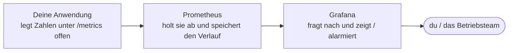

# Grundlagen

Der kurze Theorieteil. Lies ihn einmal durch – das reicht, um loszulegen. Die Seite ist auch zum Zurückblättern gedacht.

---

## Metrik vs. Log

Eine **Metrik** ist eine **Zahl zu einem Zeitpunkt**: „Antwortzeit = 120 ms", „freier Speicher = 4 GB". Misst man sie immer wieder, entsteht eine **Zeitreihe** – und daraus ein Graph.

Ein **Log** ist ein **Text-Ereignis**: „14:03:12 Dienst gestartet". Logs erzählen, *was* passiert ist. Metriken zeigen, *wie viel* und *wie der Trend* ist.

> Heute geht es um **Metriken**. Logs hast du in den Docker-Blöcken mit `docker compose logs` schon gesehen.

---

## Die zwei Werkzeuge

| Werkzeug | Rolle | Merksatz |
|---|---|---|
| **Prometheus** | Sammler & Speicher | „Ich hole die Zahlen regelmäßig ab und merke sie mir." |
| **Grafana** | Cockpit | „Ich zeige die Zahlen und schlage Alarm." |

**Prometheus** ist eine Datenbank speziell für Metriken. Es **holt** sich die Werte aktiv ab: in festen Abständen (bei uns alle 5 Sekunden) ruft es bei jeder überwachten Anwendung die Adresse `/metrics` auf und speichert, was dort steht. Das nennt man **Pull-Prinzip** oder **Scraping**. Prometheus hat eine eigene Oberfläche (Port `9090`) zum Testen von Abfragen.

**Grafana** speichert selbst keine Messwerte. Es fragt sie bei einer **Datenquelle** ab (hier Prometheus) und macht daraus **Dashboards** und **Alarme**. Bei uns ist die Datenquelle schon vorkonfiguriert – du loggst dich ein und baust sofort Panels.

!!! note "Exporter (später als Bonus)"
    Software, die nicht selbst Metriken liefert, bekommt einen **Exporter** vorgeschaltet – ein kleines Programm, das misst und unter `/metrics` bereitstellt. **cAdvisor** (Container) und **node-exporter** (Host) tauchen in den Bonus-Aufgaben auf. Unsere Beispiel-App liefert ihre Metriken schon selbst.

---

## Die drei Metrik-Typen

| Typ | Was er tut | Beispiel |
|---|---|---|
| **Gauge** | Wert geht **rauf und runter** | freier Speicher, Antwortzeit, Temperatur |
| **Counter** | Wert **steigt nur** (bis Neustart) | Anzahl Anfragen insgesamt |
| **Histogram** | verteilt Messwerte auf **Klassen** | Antwortzeiten nach Dauer-Klassen |

So sehen die drei Typen typischerweise aus:

<div style="display:flex;gap:1.25rem;flex-wrap:wrap;margin:1.25rem 0;">
  <figure style="margin:0;flex:1;min-width:160px;text-align:center;">
    <svg viewBox="0 0 220 80" width="100%" height="80" role="img" aria-label="Gauge: Linie schwankt auf und ab">
      <polyline fill="none" stroke="#27e0a0" stroke-width="3" stroke-linejoin="round" points="5,46 33,28 61,54 89,22 117,56 145,30 173,48 201,24 215,40"/>
    </svg>
    <figcaption><strong>Gauge</strong> – rauf und runter</figcaption>
  </figure>
  <figure style="margin:0;flex:1;min-width:160px;text-align:center;">
    <svg viewBox="0 0 220 80" width="100%" height="80" role="img" aria-label="Counter: Linie steigt nur">
      <polyline fill="none" stroke="#7aa2ff" stroke-width="3" stroke-linejoin="round" points="5,70 40,70 40,56 85,56 85,40 130,40 130,26 175,26 175,13 215,13"/>
    </svg>
    <figcaption><strong>Counter</strong> – steigt nur</figcaption>
  </figure>
  <figure style="margin:0;flex:1;min-width:160px;text-align:center;">
    <svg viewBox="0 0 220 80" width="100%" height="80" role="img" aria-label="Histogram: Balken unterschiedlicher Hoehe">
      <g fill="#e0a05a">
        <rect x="8" y="60" width="26" height="14"/>
        <rect x="39" y="44" width="26" height="30"/>
        <rect x="70" y="24" width="26" height="50"/>
        <rect x="101" y="14" width="26" height="60"/>
        <rect x="132" y="28" width="26" height="46"/>
        <rect x="163" y="48" width="26" height="26"/>
        <rect x="194" y="62" width="18" height="12"/>
      </g>
    </svg>
    <figcaption><strong>Histogram</strong> – Werte in Klassen (Balken)</figcaption>
  </figure>
</div>

!!! tip "Counter nie direkt ansehen"
    „Anfragen insgesamt" steigt immer weiter – die nackte Zahl sagt wenig. Interessant ist die **Rate**: „Anfragen **pro Sekunde**". Dafür gibt es `rate()`.

---

## Labels

Metriken können **Labels** tragen – Merkmale in geschweiften Klammern:

```text
http_requests_total{status="200"}   1500
http_requests_total{status="500"}     12
```

Das ist **eine** Metrik mit mehreren Zeitreihen, getrennt nach `status`. Mit Labels filterst und gruppierst du.

---

## Wie sieht eine Architektur damit aus?

Stell dir ein laufendes System vor – etwa einen Webshop mit Datenbank. Damit du es im Blick behältst, kommen drei Bausteine dazu, die zusammenspielen. Jeder hat **genau eine Aufgabe**:



- Die **Anwendung** legt ihre Messwerte offen hin – wie ein Armaturenbrett, das seine Zahlen öffentlich anzeigt. Mehr muss sie nicht tun.
- **Prometheus** ist der Sammler. Es geht in festem Takt vorbei, liest die Zahlen ab und merkt sie sich. So wird aus einzelnen Momentaufnahmen ein **Verlauf über die Zeit**.
- **Grafana** ist das Schaufenster. Es speichert selbst nichts, sondern fragt bei Prometheus nach und macht aus den Zahlen **Anzeigen, Graphen und Warnungen**.

Das Schöne daran: An **ein** Prometheus kannst du **viele** Anwendungen und Server hängen und alles in **einem** Grafana zusammenführen. Genauso behält ein Team in echt ein ganzes System im Blick – ob drei Dienste oder dreihundert.

---

## Wofür ist PromQL?

Immer wenn Grafana (oder du selbst) eine Zahl von Prometheus braucht, stellt es eine **Frage**. Die Sprache dieser Fragen heißt **PromQL**. Du musst sie nicht auswendig können: meistens nennst du einfach den **Namen der Metrik**, die dich interessiert – „gib mir den Sauerstoffwert". Manchmal legst du eine kleine Funktion darum, die den Wert nützlicher macht:

- **`rate(...)`** macht aus einem ewig steigenden Zähler eine **Rate pro Sekunde** – „wie viele Anfragen kommen *gerade* rein?".
- **`sum(...)`** fasst viele Einzelwerte zu **einem** zusammen – „wie viele insgesamt?".

Zur Orientierung die wichtigsten Bausteine auf einen Blick:

| Das brauchst du | So sieht die PromQL-Frage aus |
|---|---|
| Aktueller Wert einer Metrik | `aurora_oxygen_percent` |
| Nur bestimmte Label-Werte | `aurora_modules_total{status="online"}` |
| Rate pro Sekunde (für Counter) | `rate(aurora_http_requests_total[1m])` |
| Werte zu einem zusammenfassen | `sum(aurora_modules_total)` |
| Ist ein Ziel erreichbar? | `up` (1 = ja, 0 = nein) |

Das reicht für den Anfang. In den [ersten Übungen](05-erste-uebungen.md) stellst du Prometheus selbst ein paar dieser Fragen und siehst, wie es antwortet.

---

## Weiter

- [Installation](03-installation.md) – jetzt richten wir die Werkzeuge ein
