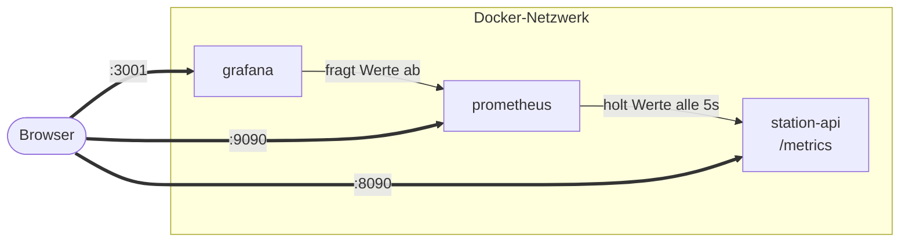

# Beispiel-Anwendung starten

Um Monitoring zu üben, brauchen wir etwas zum Überwachen. Dafür liegt im Projekt eine **kleine Beispiel-Anwendung** bereit – zusammen mit dem fertigen Monitoring-Stack. Du startest alles mit **einem Befehl**.

!!! info "Was die Beispiel-Anwendung ist – und was nicht"
    Es ist eine kleine Anwendung, die **Messwerte bereitstellt, genau wie ein echter Webdienst**: Anzahl Anfragen, Antwortzeiten, Erreichbarkeit. Zusätzlich liefert sie ein paar **fachliche** Werte. Damit diese anschaulich sind, ist die App als **Telemetrie einer kleinen Raumstation** gestaltet (Sauerstoff, Energielast, Hüllentemperatur).

    Das Raumstations-Thema ist nur **Beispiel-Verpackung**. In einem echten Projekt stünden an dieser Stelle Werte wie „Bestellungen pro Minute", „Warteschlangen-Länge" oder „Temperatur im Serverraum". **Die Technik und die Werkzeuge sind identisch** mit dem, was man in echten Systemen einsetzt.

---

## Was zusammen startet

| Dienst | Aufgabe | Im Browser erreichbar |
|---|---|---|
| `station-api` | die Beispiel-App; liefert Messwerte unter `/metrics` | <http://localhost:8090> |
| `prometheus` | sammelt die Messwerte ein und speichert sie | <http://localhost:9090> |
| `grafana` | zeigt die Werte als Dashboard und alarmiert | <http://localhost:3001> |



Prometheus **holt** die Werte aktiv bei der App ab (Pull-Prinzip). Grafana speichert selbst nichts, sondern fragt bei Prometheus an und zeichnet.

---

## Starten – Schritt für Schritt

**Schritt 1:** In den Projektordner wechseln (aus dem vorigen Schritt):

```bash
cd kurs-unterlagen/apps/monitoring-praxis
```

**Schritt 2:** Den Stack starten:

```bash
docker compose up -d --build
```

Beim ersten Mal wird die kleine App gebaut und die Images für Prometheus und Grafana geladen. Das dauert einen Moment.

**Schritt 3:** Prüfen, dass alle drei laufen:

```bash
docker compose ps
```

Erwartet: `station-api`, `prometheus`, `grafana` mit Status `Up`.

!!! tip "Port belegt?"
    Wenn `8090`, `9090` oder `3001` bei dir schon belegt ist: [Hilfekarte 6](07-hilfekarten.md#hilfekarte-6-port-ist-bereits-belegt) zeigt, wie du die Ports änderst.

---

## Welche Werte die App liefert

Unter <http://localhost:8090/metrics> stehen die Messwerte im Prometheus-Format. Es gibt zwei Sorten:

**Technische Werte – die hat jeder echte Dienst:**

| Metrik | Typ | Bedeutung |
|---|---|---|
| `aurora_http_requests_total` | Counter | Anzahl HTTP-Anfragen |
| `aurora_http_request_duration_seconds` | Histogram | Antwortzeiten |
| `up` (von Prometheus gesetzt) | – | 1 = Dienst erreichbar, 0 = weg |

**Fachliche Werte – hier die „Stationswerte" als Beispiel:**

| Metrik | Typ | Bedeutung |
|---|---|---|
| `aurora_oxygen_percent` | Gauge | „Sauerstoff" – steht für einen fachlichen Sollwert |
| `aurora_power_load_percent` | Gauge | „Energielast" |
| `aurora_hull_temp_celsius` | Gauge | „Hüllentemperatur" |
| `aurora_modules_total{status="…"}` | Gauge | Anzahl „Module" je Status |

> Merke: `aurora_http_request_duration_seconds` ist dasselbe, was du bei einem echten Webshop misst. `aurora_oxygen_percent` ist das Beispiel-Pendant zu einem fachlichen Wert wie „Lagerbestand".

---

## Weiter

- [Erste Übungen](05-erste-uebungen.md) – prüfen, ob alles läuft und warm werden
- Falls etwas hakt: [Hilfekarten](07-hilfekarten.md)
