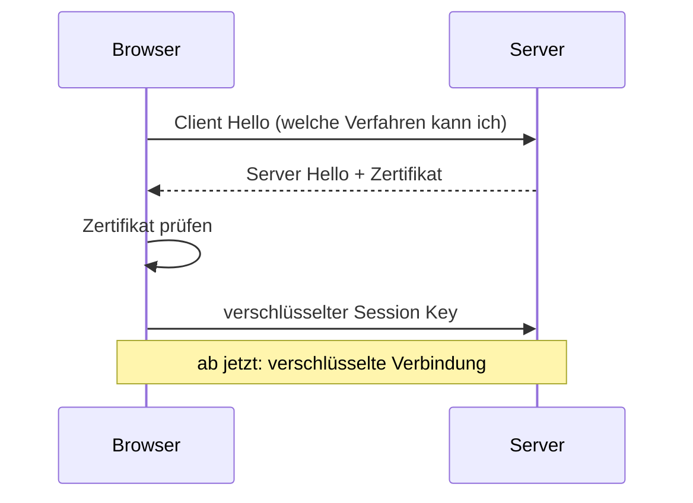
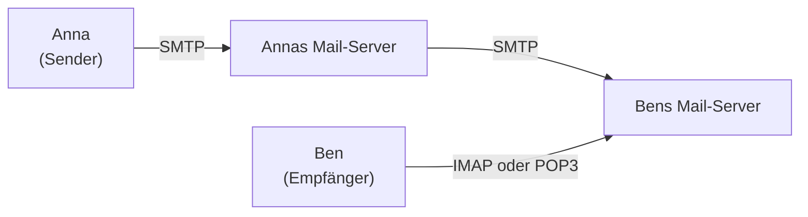

# Anwendungs-Protokolle: HTTP, SSH, FTP, SMTP, IMAP

Auf **Layer 7 (Anwendungsschicht)** leben die Protokolle, mit denen Programme tatsächlich miteinander reden. Hier wohnt das Web (HTTP/HTTPS), die E-Mail (SMTP, IMAP, POP3), der sichere Remote-Zugriff (SSH) und die Datei-Übertragung (FTP, SFTP, SCP). Das sind die Protokolle, von denen du als IT-Mensch im Berufsalltag täglich hörst – auch wenn die meisten Anwender nicht wissen, dass es sie gibt.

!!! abstract "Lernziel"
    Nach dieser Seite kannst du:

    - die wichtigsten **Layer-7-Protokolle** nennen und einordnen
    - **HTTP-Methoden**, **Status-Codes** und den Unterschied zu HTTPS erklären
    - **SSH** in den Anwendungsfällen Remote-Login, Tunneling und Datei-Transfer benennen
    - **FTP, SFTP, SCP** unterscheiden und sagen, welches Verfahren wann Sinn macht
    - den E-Mail-Ablauf mit **SMTP, IMAP und POP3** erklären
    - **Telnet** verorten und sagen, warum man es nicht mehr nutzt

---

## HTTP – das Web-Protokoll

**HTTP** (Hypertext Transfer Protocol) ist das **wichtigste Anwendungsprotokoll überhaupt**. Jede Webseite, jede API, jeder Webhook spricht HTTP.

### Wie HTTP funktioniert

HTTP ist **textbasiert** und folgt einem einfachen Request/Response-Muster:

```text
GET /index.html HTTP/1.1
Host: github.com
User-Agent: Mozilla/5.0
Accept: text/html
```

Der Server antwortet:

```text
HTTP/1.1 200 OK
Content-Type: text/html
Content-Length: 4567

<!DOCTYPE html>
<html>
...
```

In Worten:

1. Der Client sendet eine **Methode** (`GET`), den **Pfad** (`/index.html`), die **HTTP-Version** (`1.1`) und einige **Header**.
2. Der Server antwortet mit einer **Status-Zeile** (`200 OK`), Headern und dem eigentlichen **Inhalt** (Body).

### HTTP-Methoden

Die wichtigsten:

| Methode | Wofür | Hat einen Body? |
|---------|-------|-----------------|
| **GET** | Daten abrufen | nein (idealerweise) |
| **POST** | Daten senden, neue Ressource anlegen | ja |
| **PUT** | bestehende Ressource ersetzen | ja |
| **PATCH** | bestehende Ressource teilweise ändern | ja |
| **DELETE** | Ressource löschen | meistens nein |
| **HEAD** | wie GET, nur Header (kein Body) | nein |
| **OPTIONS** | welche Methoden erlaubt sind | nein |

In modernen REST-APIs siehst du alle davon. In normalen Browser-Anfragen siehst du fast nur GET und POST.

### HTTP-Status-Codes

Die Status-Zahlen folgen einem Muster:

| Bereich | Bedeutung | Beispiele |
|---------|-----------|-----------|
| **1xx** | Information | 100 Continue |
| **2xx** | Erfolg | 200 OK, 201 Created, 204 No Content |
| **3xx** | Weiterleitung | 301 Moved Permanently, 302 Found, 304 Not Modified |
| **4xx** | Client-Fehler | 400 Bad Request, 401 Unauthorized, 403 Forbidden, 404 Not Found, 429 Too Many Requests |
| **5xx** | Server-Fehler | 500 Internal Server Error, 502 Bad Gateway, 503 Service Unavailable, 504 Gateway Timeout |

Die zwei, die jeder kennen sollte:

- **404 Not Found** – die angefragte Ressource gibt es nicht.
- **500 Internal Server Error** – der Server hat einen Bug.

Im Berufsleben kommen noch **502** (Server hinter Reverse Proxy antwortet nicht) und **503** (Server überlastet) als sehr häufige Fehler dazu.

### HTTP-Versionen

| Version | Jahr | Was sie bringt |
|---------|------|----------------|
| **HTTP/1.0** | 1996 | das ursprüngliche Web. Eine Verbindung pro Request. |
| **HTTP/1.1** | 1997 | Keep-Alive (Verbindung wiederverwenden), Pipelining, Host-Header |
| **HTTP/2** | 2015 | Multiplexing (mehrere Streams gleichzeitig), Header-Komprimierung, Server-Push |
| **HTTP/3** | 2022 | basiert auf QUIC/UDP, schnellerer Verbindungsaufbau |

Im Berufsalltag sieht man **HTTP/1.1** noch viel, **HTTP/2** ist Standard auf den meisten großen Websites, **HTTP/3** verbreitet sich.

### HTTP ist zustandslos

Eine wichtige Eigenschaft: **HTTP merkt sich nichts** zwischen Anfragen. Jeder Request steht für sich.

Wie kommen dann Sitzungen zustande (z.B. dass du auf Amazon eingeloggt bleibst)? Über **Cookies** – kleine Textdateien, die mit jedem Request automatisch mitgeschickt werden. Der Server identifiziert dich an deinem Cookie-Wert.

---

## HTTPS – HTTP mit Verschlüsselung

**HTTPS** ist nichts anderes als **HTTP + TLS**. Das `s` steht für **Secure**. Vor dem eigentlichen HTTP-Austausch handeln Client und Server eine **verschlüsselte Verbindung** aus.

### Was TLS macht

- **Verschlüsselung**: niemand zwischen Client und Server kann mitlesen.
- **Identitätsprüfung**: über **Zertifikate** beweist der Server, dass er wirklich der ist, für den er sich ausgibt.
- **Integrität**: niemand kann Daten unterwegs manipulieren, ohne dass es auffällt.

### Der TLS-Handshake (vereinfacht)



In TLS 1.2 sind das mehrere Round-Trips, TLS 1.3 reduziert das deutlich.

### Zertifikate

Ein **Zertifikat** ist eine digitale Identitätsbestätigung. Es enthält:

- Domain-Name (z.B. `github.com`)
- öffentlicher Schlüssel
- Signatur einer **Certificate Authority (CA)** (z.B. Let's Encrypt, DigiCert)
- Gültigkeitsdauer

Der Browser hat eine Liste **vertrauenswürdiger CAs**. Wenn das Zertifikat von einer dieser CAs signiert ist und passt, gilt die Seite als sicher (grünes Schloss).

!!! info "Selbstsignierte Zertifikate"
    Du kannst dir selbst Zertifikate ausstellen (z.B. mit `openssl`). Das funktioniert technisch genauso – nur sind sie **nicht vertrauenswürdig** für andere, weil keine CA dahinter steht.

    Für **interne Tests** völlig OK. Für **öffentliche Webseiten** ist **Let's Encrypt** seit Jahren der Standard – kostenlose, automatisch erneuerte Zertifikate.

---

## SSH – sicherer Remote-Zugriff

**SSH** (Secure Shell) ist das Werkzeug, um sich **verschlüsselt** auf einem anderen Computer anzumelden und Befehle auszuführen. Es ersetzt das alte **Telnet** komplett.

### Anwendungsfälle

- **Remote-Login:** dich an einen Server anmelden und ihn bedienen.
- **Datei-Übertragung:** mit **SCP** oder **SFTP**.
- **Port-Forwarding:** lokale Ports auf einen Remote-Server tunneln (oder umgekehrt).
- **Git-Zugriff:** GitHub-Repos via SSH klonen statt HTTPS.

### Wie eine SSH-Verbindung aussieht

```bash
ssh user@server.example.com
```

Beim ersten Verbinden zeigt SSH den **Fingerabdruck** des Server-Schlüssels:

```text
The authenticity of host 'server.example.com (192.0.2.1)' can't be established.
ED25519 key fingerprint is SHA256:abc...xyz.
Are you sure you want to continue connecting (yes/no/[fingerprint])?
```

Du tippst `yes`. Ab da merkt sich dein Client den Schlüssel in `~/.ssh/known_hosts`. Wenn sich der Schlüssel später ändert (was bei einer **Man-in-the-Middle-Attacke** der Fall wäre), bricht SSH die Verbindung mit einem deutlichen Warnhinweis ab.

### Authentifizierung: Passwort oder Schlüssel

Es gibt zwei Arten, sich anzumelden:

**Passwort:** einfacher Login mit Username + Passwort. Funktioniert, ist aber für Server unsicher.

**Schlüsselpaar (Public Key):** sicherer und gängiger.

- Du erzeugst auf deinem Rechner ein **Schlüsselpaar**: einen **privaten Schlüssel** (bleibt geheim auf deinem Rechner) und einen **öffentlichen Schlüssel** (gebt du dem Server).
- Der öffentliche Schlüssel landet auf dem Server in `~/.ssh/authorized_keys`.
- Beim Anmelden beweist du, dass du den privaten Schlüssel hast – ohne ihn zu übertragen.

```bash
ssh-keygen -t ed25519     # Schlüsselpaar erzeugen
ssh-copy-id user@server   # öffentlichen Schlüssel hochladen
```

Bei GitHub und anderen Diensten lädst du den öffentlichen Schlüssel direkt in deinem Profil hoch.

### SSH-Port

Standard-Port: **22**. Aus Sicherheitsgründen verlegen viele Admins SSH auf einen anderen Port, um automatisierte Angriffe zu reduzieren:

```bash
ssh -p 2222 user@server
```

In `~/.ssh/config` kannst du Verbindungen abkürzen:

```text
Host meinserver
    HostName server.example.com
    User jacob
    Port 2222
    IdentityFile ~/.ssh/id_meinserver
```

Dann reicht `ssh meinserver`.

### Port-Forwarding (Tunneling)

Ein sehr nützliches Feature: SSH kann **TCP-Ports tunneln**.

```bash
# Lokal: Port 5432 → Server: Port 5432 (PostgreSQL)
ssh -L 5432:localhost:5432 user@server
```

Du kannst lokal auf `localhost:5432` zugreifen, und SSH leitet alles verschlüsselt zum Remote-Server weiter. So erreichst du **interne Dienste**, die nicht öffentlich exponiert sind.

---

## FTP, SFTP, SCP – Datei-Übertragung

Drei verwandte Verfahren, die unterschiedlich gut sind.

### FTP (File Transfer Protocol)

Das **Original** aus den 70ern. Funktioniert immer noch, aber:

- **Unverschlüsselt** – Passwort und Daten gehen im Klartext über das Netz.
- **Komplizierter Verbindungsaufbau** mit zwei Ports (21 für Steuerung, 20 für Daten) – schwierig hinter Firewalls.

**Heute solltest du FTP vermeiden.** Es lebt nur noch in Legacy-Systemen.

### FTPS (FTP über TLS)

FTP mit **TLS-Verschlüsselung**. Macht das Sicherheits-Problem weg, das Port-Drama bleibt.

### SFTP (SSH File Transfer Protocol)

**Datei-Übertragung über SSH.** Trotz des Namens hat SFTP **nichts** mit FTP zu tun – es ist ein eigenes Protokoll, das nur über die SSH-Verbindung läuft.

```bash
sftp user@server
# interaktive Shell ähnlich wie FTP, aber sicher
```

Oder mit grafischen Clients wie **WinSCP**, **FileZilla** oder **Cyberduck**.

**Vorteile:** verschlüsselt, einfache Firewall-Konfiguration (nur Port 22), nutzt die SSH-Authentifizierung.

### SCP (Secure Copy)

Auch über SSH. Sehr einfach:

```bash
scp datei.txt user@server:/pfad/zum/ziel/
scp user@server:/datei.txt ./
scp -r ordner/ user@server:/ziel/
```

Schneller zu schreiben als SFTP-Interaktivität, aber weniger flexibel. Modernes `scp` nutzt im Hintergrund eigentlich SFTP, aber die Kommandozeilen-Syntax bleibt.

### Welches nehmen?

| Bedarf | Wähle |
|--------|-------|
| Alte System-Integration | FTP oder FTPS (notgedrungen) |
| Einzelne Datei hochschieben | SCP |
| Interaktiv arbeiten, viele Dateien | SFTP mit GUI-Client |
| Synchronisation großer Verzeichnisse | **rsync** (über SSH) |

---

## E-Mail-Protokolle: SMTP, IMAP, POP3

E-Mail hat drei Hauptprotokolle, jeweils mit klarer Rollenverteilung.



### SMTP – das Versand-Protokoll

**SMTP** (Simple Mail Transfer Protocol) versendet E-Mails **vom Client zum Server** und **von Server zu Server**.

- **Port 25** – traditioneller SMTP-Port, **nur zwischen Servern**
- **Port 587** – mit STARTTLS-Verschlüsselung, **von Clients zum Server** („Submission")
- **Port 465** – SMTPS, ältere Variante mit direktem TLS

In der Praxis solltest du als Client immer **587 mit STARTTLS** oder **465 mit SMTPS** nutzen.

### POP3 – das alte Empfangs-Protokoll

**POP3** (Post Office Protocol Version 3) holt E-Mails vom Server **ab** – und **löscht sie dort** standardmäßig.

- Du holst eine Mail ab, sie ist auf deinem Computer, sie ist vom Server weg.
- Wenn du zwei Geräte hast (PC und Handy), siehst du nicht überall dieselbe Mailbox.

**Heute kaum noch sinnvoll.** Nur, wenn du wirklich **einen einzigen Mail-Empfänger** hast und auf dem Server keine Mails behalten willst.

- Port 110 (unverschlüsselt) oder 995 (POP3S, verschlüsselt)

### IMAP – das moderne Empfangs-Protokoll

**IMAP** (Internet Message Access Protocol) lässt deine Mails **auf dem Server** und synchronisiert sie mit allen Clients.

- Eine Mail markierst du auf dem Handy als gelesen → auf dem PC ist sie auch als gelesen markiert.
- Ordner-Strukturen werden auf allen Geräten gleich angezeigt.
- Du kannst überall auf alle Mails zugreifen, auch alte.

**Heute Standard.** Außer du nutzt eine eigene Sync-Lösung wie Exchange/Microsoft 365 oder Gmail's eigene Protokolle.

- Port 143 (unverschlüsselt) oder 993 (IMAPS, verschlüsselt)

### E-Mail-Sicherheit: SPF, DKIM, DMARC

E-Mail ist historisch **unsicher** – jeder kann eine Mail mit gefälschtem Absender verschicken. Drei Mechanismen mildern das ab:

| Verfahren | Was es macht |
|-----------|--------------|
| **SPF** (Sender Policy Framework) | DNS-Eintrag, der sagt: „Diese IP-Adressen dürfen für meine Domain Mails verschicken." |
| **DKIM** (DomainKeys Identified Mail) | Mail-Server signiert ausgehende Mails kryptographisch |
| **DMARC** | sagt, was passieren soll, wenn SPF/DKIM fehlschlagen (zurückweisen, Quarantäne) |

Alle drei werden in DNS als TXT-Records hinterlegt. Wer eine eigene Mail-Domain betreibt, **muss** alle drei konfigurieren – sonst landen Mails oft im Spam.

---

## Telnet – das Museum

**Telnet** war früher das Standard-Protokoll für Remote-Login. Heute ist es **veraltet**, weil:

- komplett **unverschlüsselt** – Passwörter im Klartext
- keine Authentifizierungs-Optionen über Schlüssel

**Heute nutzt man stattdessen SSH.**

Telnet hat allerdings noch eine **kleine Nische**: als **Test-Werkzeug** für TCP-Verbindungen.

```bash
telnet smtp.gmail.com 25
```

Damit kannst du prüfen, ob ein Port offen ist und was er sagt. Aber selbst dafür gibt es bessere Alternativen wie `nc` (netcat) oder `curl`.

---

## Übersicht: Welches Protokoll spricht welcher Port?

Eine handliche Tabelle zum Nachschlagen:

| Dienst | Protokoll | Port | TCP/UDP | Verschlüsselt? |
|--------|-----------|------|---------|----------------|
| Web (alt) | HTTP | 80 | TCP | nein |
| Web (modern) | HTTPS | 443 | TCP (HTTP/3: UDP) | ja |
| Remote-Login | SSH | 22 | TCP | ja |
| Remote-Login (alt) | Telnet | 23 | TCP | nein |
| E-Mail-Versand (Server-Server) | SMTP | 25 | TCP | optional |
| E-Mail-Versand (Submission) | SMTP+TLS | 587 | TCP | ja |
| E-Mail-Empfang | IMAP | 143 / 993 | TCP | optional / ja |
| E-Mail-Empfang (alt) | POP3 | 110 / 995 | TCP | optional / ja |
| Datei (alt) | FTP | 20, 21 | TCP | nein |
| Datei (modern) | SFTP | 22 (über SSH) | TCP | ja |
| DNS | DNS | 53 | UDP (meist), TCP (selten) | nein (außer DoT/DoH) |
| Auto-IP | DHCP | 67, 68 | UDP | nein |
| Zeit | NTP | 123 | UDP | nein |
| Remote-Desktop | RDP | 3389 | TCP | ja |

---

## Was du jetzt wissen solltest

- **HTTP** ist textbasiert mit Methoden (GET, POST, …) und Status-Codes (200, 404, 500, …). **HTTPS** ist HTTP + TLS-Verschlüsselung mit Zertifikaten.
- **SSH** ist der sichere Remote-Zugriff. Kann mit **Schlüsselpaaren** statt Passwort arbeiten und **Ports tunneln**.
- **FTP ist tot** (unverschlüsselt). Heute: **SFTP** oder **SCP** über SSH, oder **FTPS** in Legacy-Fällen.
- **E-Mail**: **SMTP** versendet, **IMAP** synchronisiert, **POP3** ist veraltet. **SPF/DKIM/DMARC** verhindern Fälschungen.
- **Telnet** ist Museum, nur als Test-Werkzeug noch lebendig.
- Wichtige Ports im Schlaf: **22 (SSH), 53 (DNS), 80 (HTTP), 443 (HTTPS), 25/587 (SMTP), 143/993 (IMAP)**.

---

## Beispielfragen zur Selbstkontrolle

??? question "Frage 1: Du sollst einer Firma die Daten-Übertragung zwischen zwei Servern absichern. Sie nutzt aktuell noch FTP. Was empfiehlst du?"
    **FTP komplett ablösen.** FTP überträgt Anmeldedaten **im Klartext** und ist heute nicht mehr vertretbar.

    Sinnvolle Alternativen:

    - **SFTP** (über SSH, Port 22) – wenn interaktive Übertragung oder Datei-Verwaltung gefragt ist
    - **SCP** – für einfache einmalige Kopien
    - **rsync über SSH** – für Synchronisation großer Verzeichnisse
    - Notfalls **FTPS** (FTP über TLS), wenn ein Legacy-System nichts anderes kann

    Bei Auswahl auf Schlüsselauthentifizierung statt Passwort setzen.

??? question "Frage 2: Eine Webseite zeigt im Browser HTTP-Status 502. Was bedeutet das, und wo liegt der Fehler?"
    **502 Bad Gateway:** ein zwischengeschalteter Server (typisch ein **Reverse Proxy** wie Nginx oder ein Load Balancer) kann den eigentlichen Webserver dahinter nicht erreichen oder bekommt keine sinnvolle Antwort.

    Mögliche Ursachen:

    - Backend-Server ist abgestürzt oder überlastet
    - falsche Konfiguration im Reverse Proxy (falscher Backend-Port)
    - Firewall blockt zwischen Proxy und Backend
    - Backend antwortet langsamer als das Timeout des Proxys

    Diagnose immer am **Backend-Server** und an den **Proxy-Logs** beginnen.

??? question "Frage 3: Warum landen E-Mails von einer neu eingerichteten Domain oft im Spam-Ordner, obwohl die Adresse vertrauenswürdig aussieht?"
    Weil die Empfänger-Server prüfen, ob die Mail **legitim** verschickt wurde. Drei Kriterien:

    - **SPF:** Darf diese IP für die Domain Mails verschicken? DNS-TXT-Record sagt's.
    - **DKIM:** Ist die Mail kryptographisch signiert von einem Schlüssel, der zur Domain gehört?
    - **DMARC:** Was soll der Empfänger tun, wenn SPF/DKIM fehlschlagen?

    Wer eine neue Domain einrichtet und **alle drei DNS-Einträge vergisst**, verschickt zwar Mails, sie landen aber bei den meisten Empfängern im Spam-Filter.

??? question "Frage 4: SSH-Zugang zu einem Server – warum solltest du Schlüsselpaare statt Passwörter nutzen, und wie funktioniert das technisch?"
    Vorteile von Schlüsselpaaren:

    - **kein Passwort über das Netz** (Schlüssel-Beweis statt Passwort-Übertragung)
    - **resistent gegen Brute-Force**, weil Schlüssel viel länger sind als Passwörter
    - **revozierbar pro Schlüssel**: ein abhanden gekommener Mitarbeiter-Schlüssel kann einzeln entfernt werden, ohne dass alle ihr Passwort ändern müssen

    Technisch: du erzeugst ein **Paar** aus privatem (geheim, bleibt bei dir) und öffentlichem Schlüssel. Den öffentlichen kopierst du in `~/.ssh/authorized_keys` auf dem Server. Beim Login beweist dein Client mit dem privaten Schlüssel, dass er dazugehört, **ohne ihn zu übertragen**.

---

## Merksatz

!!! success "Merksatz"
    > **HTTP läuft auf 80, HTTPS auf 443. SSH auf 22 ersetzt Telnet (23). SMTP versendet (587), IMAP synchronisiert (993). FTP ist tot, lang lebe SFTP. E-Mail ohne SPF, DKIM und DMARC landet im Spam. Alles Wichtige ist heute verschlüsselt – das `s` macht den Unterschied.**

---

## Weiterlesen

- [Transport-Protokolle](transport-protokolle.md): die Schicht unter den hier genannten Protokollen
- [Netzwerk-Sicherheit](netzwerk-sicherheit.md): wie diese Protokolle abgesichert werden
- [DNS](dns.md): vor jedem dieser Protokolle steht meist eine DNS-Anfrage
