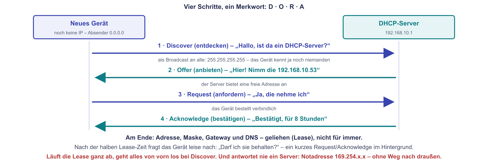
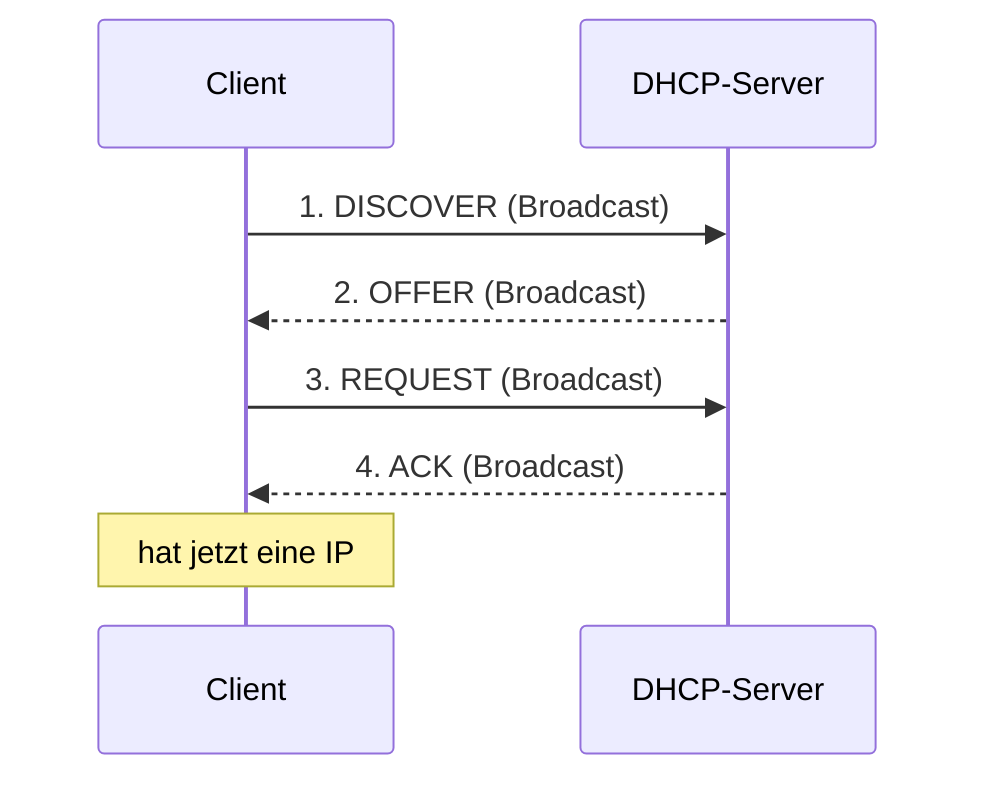
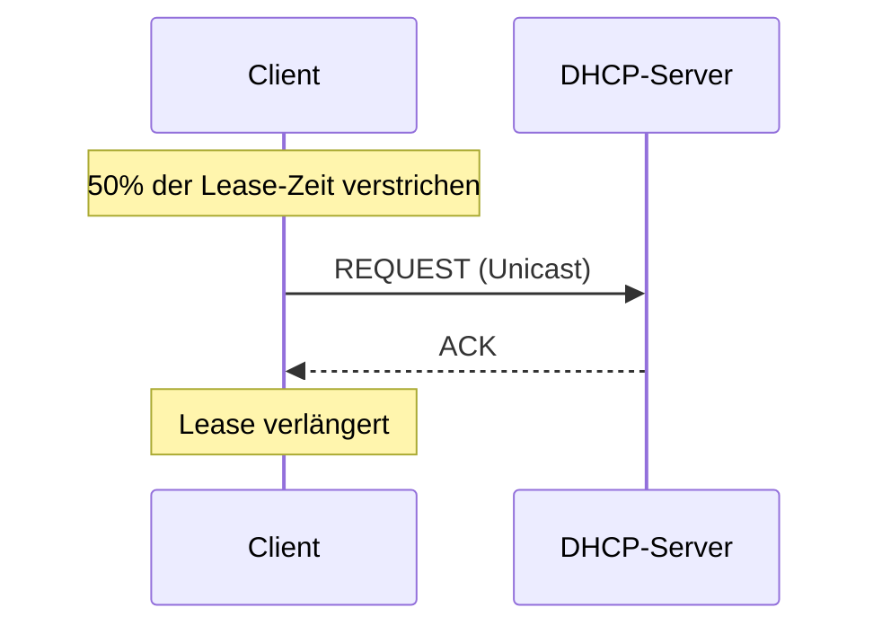
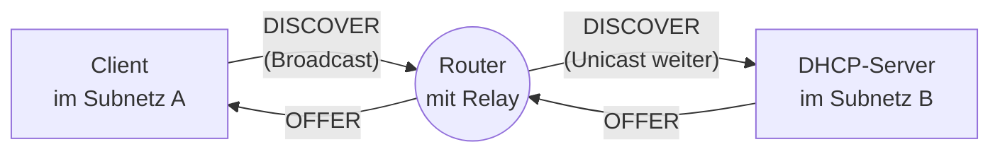

# DHCP – automatische Adressvergabe

Wenn du dein Notebook mit dem WLAN verbindest, bekommt es **innerhalb von Sekunden** alles, was es zum Netzwerken braucht: eine IP-Adresse, eine Subnetzmaske, einen Default Gateway, einen DNS-Server. Du tippst nichts. Es funktioniert einfach.

Verantwortlich dafür ist **DHCP** – das **Dynamic Host Configuration Protocol**. Es ist eines der wichtigsten unsichtbaren Dienste in jedem modernen Netzwerk.

!!! abstract "Lernziel"
    Nach dieser Seite kannst du:

    - erklären, **wozu DHCP gut ist** und welches Problem es löst
    - den **DORA-Ablauf** (Discover, Offer, Request, Acknowledge) in eigenen Worten beschreiben
    - typische **DHCP-Optionen** (Default Gateway, DNS-Server, NTP, etc.) benennen
    - den Unterschied zwischen **dynamischer Vergabe**, **Reservierung** und **statischer IP** verstehen
    - typische DHCP-Probleme einordnen, z.B. **DHCP-Konflikte** oder **fehlender DHCP-Server**

---

## Was DHCP löst

Stell dir vor, du müsstest jedem Gerät in einem Büro die IP-Adresse **per Hand** eintippen. Plus Subnetzmaske, plus Default Gateway, plus DNS-Server. Bei 50 Geräten dauert das Stunden. Bei einem Hotel mit 200 Gästegeräten pro Tag völlig unmöglich.

DHCP automatisiert das. Es gibt einen **DHCP-Server** (oft im WLAN-Router oder als eigene Komponente), der für ein Netzwerk die Adressvergabe übernimmt.

!!! tip "Hotel-Analogie"
    Stell dir ein Hotel vor. Du checkst ein. Du bekommst:

    - eine **Zimmernummer** (deine IP-Adresse)
    - einen **Schlüssel** (Konfigurations-Details)
    - die Info, wo die Rezeption ist (Default Gateway), das Restaurant (DNS-Server) und wo die Notausgänge sind (weitere Optionen)

    Wenn du auscheckst, gibst du Zimmer und Schlüssel zurück – das Zimmer kann an den nächsten Gast vergeben werden.

    Genauso macht DHCP das mit IP-Adressen. Jedes Gerät bekommt eine **Lease** – eine Zuteilung auf Zeit. Wenn die Zeit abläuft (oder das Gerät weggeht), wird die Adresse frei.

---

## Was DHCP alles vergibt

Du denkst vielleicht nur an die IP-Adresse. Aber DHCP liefert **viel mehr**:

| Pflicht | Information | Beispiel |
|---------|-------------|----------|
| ja | **IP-Adresse** | `192.168.1.50` |
| ja | **Subnetzmaske** | `255.255.255.0` (`/24`) |
| nein | **Default Gateway** | `192.168.1.1` |
| nein | **DNS-Server** | `192.168.1.1` oder `8.8.8.8` |
| nein | **NTP-Server** (Zeit) | `pool.ntp.org` |
| nein | **Domain-Name** | `firma.local` |
| nein | **Domain-Suchliste** | `firma.local, abteilung.local` |
| nein | **Boot-Server / TFTP** | für PXE-Boot von Festplatten-losen Clients |
| nein | **WINS-Server** (alt) | nur in Windows-Netzen mit NetBIOS |

Was tatsächlich vergeben wird, hängt vom DHCP-Server ab. In Standard-Heimnetzen kommen meist: IP, Subnetzmaske, Default Gateway und DNS-Server.

---

## Der DORA-Ablauf

{ .diagramm }

Wenn ein neuer Client (z.B. dein Notebook) sich verbindet, läuft ein **vierstufiger Vorgang** ab, der unter dem Eselsbrücken-Wort **DORA** bekannt ist:



### 1. DISCOVER – „Ist da jemand?"

Der Client hat **noch keine IP**. Er sendet einen **Broadcast** an `255.255.255.255` mit dem Inhalt: „Ich suche einen DHCP-Server. Wer ist da?"

- Quell-IP: `0.0.0.0` (weil noch keine)
- Ziel-IP: `255.255.255.255` (alle)
- Quell-MAC: die echte MAC der Netzwerkkarte
- Ziel-MAC: `ff:ff:ff:ff:ff:ff` (alle)

### 2. OFFER – „Hier wäre eine"

Ein DHCP-Server hört den Broadcast und antwortet. Er bietet eine konkrete IP-Adresse plus Konfiguration an.

- „Du könntest `192.168.1.50` bekommen, Maske `/24`, Gateway `192.168.1.1`, DNS `8.8.8.8`, Lease-Dauer 24 Stunden."

Wenn mehrere DHCP-Server im Netz sind, kommen ggf. **mehrere Angebote** zurück. Normalerweise gibt es aber nur einen pro Subnetz.

### 3. REQUEST – „Die nehme ich"

Der Client wählt eines der Angebote (typisch das erste) und schickt eine **REQUEST**-Nachricht – wieder als Broadcast, damit alle DHCP-Server wissen, welches Angebot angenommen wurde (und die anderen ihre nicht-genommenen Angebote zurücknehmen können).

### 4. ACK – „Bestätigt"

Der gewählte DHCP-Server bestätigt mit einem **ACK** (Acknowledgement). Der Client kann die Adresse jetzt nutzen.

Wenn etwas schiefläuft (z.B. die Adresse wurde zwischenzeitlich an jemanden anderen vergeben), bekommt der Client stattdessen ein **NAK** und muss neu anfangen.

!!! info "DORA – eine Eselsbrücke"
    **D**iscover, **O**ffer, **R**equest, **A**cknowledge. In Prüfungen wird der Ablauf gerne abgefragt. Wer „DORA" sagen kann und den Ablauf kennt, ist hier durch.

---

## DHCP-Lease – Mietvertrag auf Zeit

Eine IP-Adresse wird einem Client nicht für immer zugeteilt, sondern für eine bestimmte **Lease-Zeit**. Typisch:

- **Heim-Router (Fritzbox)**: 10 Tage
- **Firmen-Router**: 1–7 Tage
- **Öffentliches WLAN**: oft nur Stunden

Bevor die Lease abläuft, versucht der Client automatisch zu **erneuern** (RENEW). Das funktioniert ähnlich wie der initiale DORA, aber **gezielt an den bekannten DHCP-Server** (Unicast statt Broadcast).



Wenn der Server nicht erreichbar ist, versucht es der Client später nochmal. Wenn auch das nicht klappt, fällt das Gerät irgendwann in einen Zustand **ohne IP** und versucht einen kompletten DORA-Neustart.

---

## Wo ist der DHCP-Server?

In typischen Setups:

| Umgebung | Wo läuft der DHCP-Server? |
|----------|---------------------------|
| **Heim-Netz** | im WLAN-Router (Fritzbox, Speedport, ...) |
| **Kleines Büro** | im Router oder einem dedizierten Server |
| **Mittlere/große Firma** | auf einem dedizierten Server (oft Microsoft AD oder Linux-DHCP) |
| **VMware / Hyper-V** | in der Hypervisor-Plattform (für virtuelle Netzwerke) |
| **Docker** | im Docker-Daemon (für Container-Netzwerke) |
| **ISP (Internet-Provider)** | bei Mietleitungen oft beim Provider |

Der DHCP-Server muss **im selben Broadcast-Bereich** wie die Clients sein – sonst kommt der DISCOVER-Broadcast nicht an. Bei großen Netzen mit mehreren Subnetzen gibt es einen Trick: den **DHCP-Relay-Agent**.

### DHCP-Relay

Wenn DHCP-Server und Client in **verschiedenen Subnetzen** sind, leitet der Router die DHCP-Anfragen weiter. Das nennt sich **DHCP-Relay** (oder DHCP-Helper).



So kann **ein einziger DHCP-Server** mehrere Subnetze versorgen.

---

## Statische IP, Reservierung oder dynamisch?

Drei Möglichkeiten, einem Gerät eine IP zuzuweisen:

### Dynamische Vergabe

Standardfall: das Gerät bekommt **irgendeine** freie Adresse aus dem **DHCP-Pool** (z.B. `192.168.1.100` bis `192.168.1.199`). Die kann sich beim nächsten Verbinden ändern.

- **Vorteil:** kein Aufwand, jedes Gerät funktioniert sofort.
- **Nachteil:** unvorhersehbar, was für **Drucker oder Server** ungeeignet ist.

### DHCP-Reservierung

Der DHCP-Server merkt sich: „Für die MAC-Adresse `aa:bb:cc:dd:ee:ff` vergebe ich **immer** die IP `192.168.1.10`."

- **Vorteil:** Gerät hat immer dieselbe IP, kann aber trotzdem über DHCP komplett konfiguriert werden.
- **Nachteil:** muss auf dem DHCP-Server eingerichtet werden.
- **Praxis:** ideal für **Drucker, NAS, lokale Server, Heim-Server**.

### Statische IP

Du trägst die IP **direkt am Gerät** ein. Kein DHCP beteiligt.

- **Vorteil:** funktioniert auch, wenn DHCP ausfällt.
- **Nachteil:** muss am Gerät selbst gepflegt werden und kollidiert ggf. mit DHCP-Vergaben, wenn die Pools nicht sauber getrennt sind.
- **Praxis:** für **Router, Firewalls, Switches** und dedizierte Server.

!!! warning "IP-Konflikt"
    Wenn ein Gerät eine statische IP hat, die **gleichzeitig** im DHCP-Pool ist, kann der Server diese IP irgendwann an einen anderen Client vergeben. Plötzlich haben **zwei Geräte dieselbe IP** – das nennt sich **IP-Konflikt** und ist eine Quelle bizarrer Fehler.

    **Lösung:** statische IPs **außerhalb** des DHCP-Pools vergeben. Beispiel:

    - DHCP-Pool: `192.168.1.100` – `192.168.1.199`
    - Statische Bereiche: `192.168.1.1` – `192.168.1.99` und `192.168.1.200` – `192.168.1.254`

---

## Wenn DHCP versagt: APIPA und Link-Local

Was passiert, wenn ein Client **keinen DHCP-Server** findet?

Bei **IPv4** vergibt das Betriebssystem selbst eine Adresse aus dem **APIPA**-Bereich (`169.254.0.0/16`). Das nennt sich auch **Link-Local-Adresse**.

- Vorteil: zwei Geräte können trotzdem im selben LAN miteinander reden.
- Nachteil: kein Internet, kein DNS, kein Gateway.

Wenn du siehst, dass dein PC eine `169.254.x.x`-Adresse hat: **DHCP funktioniert nicht.** Typische Ursachen:

- Kabel nicht eingesteckt
- Falsches WLAN-Passwort
- DHCP-Server ausgefallen
- Falsches VLAN konfiguriert
- DHCP-Pool erschöpft

Bei **IPv6** ist das anders: jedes Gerät hat **immer** eine Link-Local-Adresse (`fe80::/10`), auch wenn kein DHCPv6 da ist. Das ist Teil der Spezifikation.

---

## DHCP und Sicherheit

DHCP ist historisch **nicht authentifiziert** – jedes Gerät, das einen Broadcast hört, könnte sich als DHCP-Server ausgeben. Das nennt sich **Rogue DHCP** und ist ein Angriffsvektor in offenen Netzen.

**Mögliche Folgen:**

- Angreifer-Gerät vergibt sich selbst als Gateway → alle Pakete laufen über den Angreifer (Man-in-the-Middle)
- Falsche DNS-Server → Phishing-Seiten werden ausgeliefert

**Schutzmaßnahmen** in geschützten Netzen:

- **DHCP Snooping** auf Switches: nur erlaubte Ports dürfen als DHCP-Server agieren.
- **Trusted Ports** definieren – nur der eine Switch-Port zum echten DHCP-Server gilt als „trusted".
- **VLAN-Trennung**: Clients und Server in unterschiedlichen Segmenten.

---

## DHCPv6 vs. SLAAC

Für IPv6 gibt es zwei Wege der Adress-Vergabe:

| Verfahren | Wer macht's? | Was wird vergeben? |
|-----------|--------------|---------------------|
| **SLAAC** (Stateless Address Auto-Configuration) | das Gerät selbst, mit Hilfe von Router Advertisements | nur IP + Gateway, kein DNS |
| **DHCPv6** | DHCPv6-Server | wie DHCPv4 – IP, DNS, Optionen |

In der Praxis sieht man oft eine **Kombination**: SLAAC für die Adress-Vergabe, DHCPv6 nur für DNS-Server und andere Optionen.

---

## DHCP-Befehle und -Werkzeuge

Auf der Kommandozeile kannst du DHCP-Aktionen sehen oder anstoßen.

### Lease anzeigen

=== "Windows"
    ```cmd
    ipconfig /all
    ```

    Zeigt dir die aktuell vergebene Adresse, den Server, die Lease-Zeiten.

=== "Linux"
    ```bash
    cat /var/lib/dhcp/dhclient.leases
    # oder, je nach Distribution:
    journalctl -u systemd-networkd
    ```

=== "macOS"
    ```bash
    ipconfig getpacket en0
    ```

### Lease erzwingen

=== "Windows"
    ```cmd
    ipconfig /release      # aktuelle Lease zurückgeben
    ipconfig /renew        # neue anfordern
    ```

=== "Linux"
    ```bash
    sudo dhclient -r       # zurückgeben
    sudo dhclient          # neu anfordern
    ```

Nützlich, wenn du eine veraltete oder falsche Lease loswerden willst.

---

## Was du jetzt wissen solltest

- **DHCP** vergibt automatisch IP, Subnetzmaske, Gateway, DNS und weitere Optionen.
- Der Ablauf ist **DORA**: Discover, Offer, Request, Acknowledge.
- Eine **Lease** ist auf Zeit – Renewals halten sie aktuell.
- **DHCP-Server** sitzt im Router, dedizierten Server oder im Hypervisor.
- Über **DHCP-Relay** kann **ein** Server **mehrere Subnetze** versorgen.
- Drei Vergabe-Arten: **dynamisch**, **reserviert** (per MAC), **statisch** (am Gerät direkt).
- Ohne DHCP fällt IPv4 auf **APIPA** (`169.254.x.x`) zurück – nutzbar nur lokal.
- **Rogue DHCP** ist ein Sicherheitsrisiko, **DHCP Snooping** auf Switches schützt.

---

## Beispielfragen zur Selbstkontrolle

??? question "Frage 1: Ein Drucker im Büro hat regelmäßig eine andere IP – Mitarbeiter beklagen, dass sie ihn nicht mehr finden. Was machst du?"
    Der Drucker bekommt jedes Mal eine neue IP aus dem DHCP-Pool. Lösung: **DHCP-Reservierung** für die MAC-Adresse des Druckers einrichten.

    So bekommt er **dynamisch immer dieselbe Adresse**, ohne dass du am Drucker selbst eine statische IP konfigurieren musst. Vorteil: bei einem Drucker-Tausch kannst du die Reservierung einfach auf die neue MAC umstellen.

??? question "Frage 2: Du hast eine Firma mit drei VLANs, aber nur einem DHCP-Server. Wie löst du das?"
    Du konfigurierst **DHCP-Relay** auf dem Router/Layer-3-Switch, der zwischen den VLANs vermittelt.

    Wenn ein Client in VLAN B einen DISCOVER-Broadcast schickt, fängt der Router den ab und leitet ihn als Unicast an den DHCP-Server im VLAN A weiter. Antwort geht denselben Weg zurück.

    So kann **ein** DHCP-Server **alle drei VLANs** versorgen – ohne dass du drei separate Server brauchst.

??? question "Frage 3: Warum vergibt man Drucker, Server und Router statt dynamisch besser per Reservierung oder statisch?"
    Weil **andere Geräte sich auf ihre Adressen verlassen**:

    - Computer haben Drucker-Treiber, die auf eine feste IP zeigen
    - Backup-Software adressiert Server fest
    - Anwendungen kennen Datenbank-Server unter bestimmter IP
    - Router-Adressen sind in Routing-Tabellen anderer Geräte eingetragen

    Wenn ein solches Gerät plötzlich eine neue IP bekommt, fallen viele Verbindungen weg.

    Empfehlung: **dynamische Vergabe** nur für Endgeräte (PCs, Notebooks, Handys). **Statische IP oder Reservierung** für alles, was Server-Charakter hat.

??? question "Frage 4: Erkläre den DORA-Ablauf in eigenen Worten."
    1. **Discover:** Der Client sendet einen Broadcast: „Suche DHCP-Server, wer ist da?"
    2. **Offer:** Ein DHCP-Server antwortet: „Hier wäre eine IP für dich, plus Maske, Gateway, DNS."
    3. **Request:** Der Client wählt ein Angebot und sagt allen Servern (per Broadcast): „Ich nehme dieses Angebot."
    4. **Acknowledge:** Der gewählte Server bestätigt: „Bestätigt, die Adresse gehört dir für X Stunden."

    Danach kann der Client kommunizieren. Vor Ablauf der Lease verlängert er per kurzem Renew-Vorgang.

---

## Merksatz

!!! success "Merksatz"
    > **DHCP automatisiert die IP-Vergabe. Vier Schritte: DORA. Ein Gerät bekommt nicht nur eine Adresse, sondern auch Maske, Gateway, DNS und mehr – auf Zeit (Lease). Statisch, Reservierung, dynamisch sind die drei Arten der Zuteilung. `169.254.x.x` = DHCP hat versagt. DHCP Snooping schützt vor gefälschten DHCP-Servern.**

---

## Weiterlesen

- [DNS](dns.md): DHCP vergibt den DNS-Server-Eintrag – hier siehst du, was der dann tut
- [Adressierung](adressierung.md): die IP-Adressen, die DHCP vergibt
- [Routing und Switching](routing-und-switching.md): das **Default Gateway**, das DHCP mitliefert
