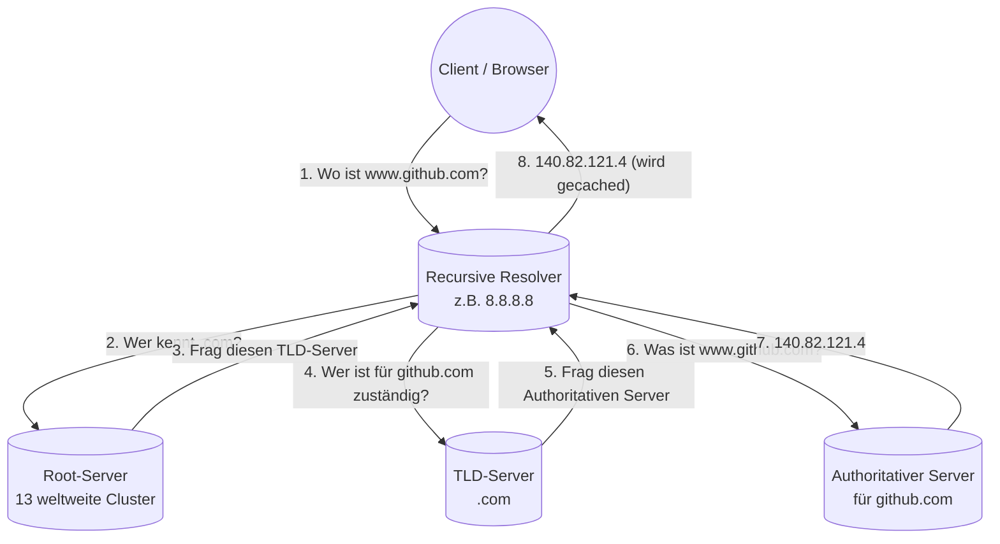

# DNS – Namensauflösung

Stell dir vor, du müsstest jede Webseite über ihre IP-Adresse aufrufen. `https://140.82.121.4` statt `https://github.com`. Niemand könnte sich das merken. Und schlimmer: wenn GitHub seine IP wechselt, hätte plötzlich niemand mehr Zugriff.

Dafür gibt es **DNS** – das **Domain Name System**. Es übersetzt **Namen in IP-Adressen** (und umgekehrt). Ohne DNS würde das Internet, wie wir es kennen, nicht funktionieren.

!!! abstract "Lernziel"
    Nach dieser Seite kannst du:

    - in eigenen Worten erklären, was DNS macht und warum es nötig ist
    - die **Hierarchie** der DNS-Welt benennen (Root → TLD → Domain → Subdomain)
    - die wichtigsten **DNS-Record-Typen** (A, AAAA, MX, CNAME, TXT, NS) unterscheiden
    - den **Ablauf einer DNS-Anfrage** Schritt für Schritt nachvollziehen
    - die Begriffe **Resolver, Authoritativer Server, Caching** einordnen
    - typische Probleme wie **„DNS-Fehler"** im Browser einordnen

---

## Was DNS löst

Computer arbeiten mit **Zahlen** (IP-Adressen). Menschen mit **Namen**. DNS ist das **Telefonbuch des Internets**, das beides verbindet.

!!! tip "Telefonbuch-Analogie"
    Früher hattest du ein Telefonbuch. Du schlägst den Namen nach, findest die Nummer, wählst.

    DNS macht genau dasselbe – nur automatisch und im Sekundenbruchteil. Du tippst `github.com` ein, dein Computer schlägt nach und findet `140.82.121.4`. Dann erst kann er die Anfrage los schicken.

    Wenn das Telefonbuch ausfällt, kannst du niemanden mehr anrufen, obwohl die Telefonleitungen alle funktionieren. Genauso ist es im Internet: ohne DNS sind alle Seiten weg, obwohl die Server noch laufen.

---

## Wer ist beteiligt?

Eine DNS-Anfrage durchläuft mehrere Stationen. Hier die Rollen:

| Rolle | Aufgabe |
|-------|---------|
| **Client (Stub Resolver)** | dein Computer / Browser – stellt die Frage |
| **Recursive Resolver** | meistens vom Provider oder als öffentlicher Server (z.B. `8.8.8.8`) – fragt sich durch die Hierarchie |
| **Root-Server** | die obersten DNS-Server der Welt, kennen die TLD-Server |
| **TLD-Server** | Top-Level-Domain-Server – kennt z.B. alle `.com`-Domains und ihre Authoritativen Server |
| **Authoritativer Server** | der Server, der die **echte Antwort** für eine bestimmte Domain hat |

Dazu kommen **Caches** auf jeder Stufe, damit das Spiel nicht jedes Mal von vorne losgeht.

---

## Die DNS-Hierarchie

DNS-Namen sind **hierarchisch aufgebaut**, von rechts nach links. Lies das so:

```text
www.github.com.
└┬┘ └──┬───┘ └┬┘ └─ (Root, normalerweise unsichtbar)
Sub-  Domain TLD
domain
```

- **`.`** (ganz rechts) – die **Root**, normalerweise unsichtbar
- **`.com`** – die **TLD** (Top-Level Domain), z.B. `.com`, `.de`, `.org`, `.io`
- **`github`** – die **Domain** unter der TLD
- **`www`** – eine **Subdomain** der Domain

Beim Auflösen wird die Hierarchie **von rechts nach links** durchgegangen: erst Root fragen, dann TLD, dann die Domain.

### TLD-Typen

| Typ | Beispiele | Wer vergibt? |
|-----|-----------|--------------|
| **gTLD** (generic) | `.com`, `.org`, `.net`, `.io`, `.app` | ICANN bzw. Registrare |
| **ccTLD** (country code) | `.de`, `.fr`, `.uk`, `.jp` | jeweilige Länderbehörde |
| **sTLD** (sponsored) | `.gov`, `.edu`, `.mil` | spezielle Träger |
| **neue gTLDs** | `.shop`, `.tech`, `.berlin` | seit ca. 2014, Vielzahl von Anbietern |

---

## Ablauf einer DNS-Anfrage

Was passiert, wenn du `www.github.com` aufrufst und dein Computer die IP noch nicht im Cache hat?



In Worten:

1. **Du tippst** `www.github.com` in den Browser.
2. Dein Computer fragt seinen konfigurierten **DNS-Server** (Resolver) – meistens den Router zu Hause oder einen öffentlichen Resolver.
3. Der Resolver schaut in seinem **Cache**: kenne ich `www.github.com` schon? Wenn nein:
4. Er fragt einen **Root-Server**: „Wer ist für `.com` zuständig?"
5. Root-Server antwortet mit der Adresse des **`.com`-TLD-Servers**.
6. Resolver fragt den TLD-Server: „Wer ist für `github.com` zuständig?"
7. TLD-Server antwortet mit den **Authoritativen Servern** für `github.com` (in den **NS-Records**).
8. Resolver fragt den Authoritativen Server: „Was ist die IP von `www.github.com`?"
9. Authoritativer Server antwortet mit `140.82.121.4`.
10. Resolver speichert die Antwort im **Cache** (mit Ablaufzeit) und schickt sie an deinen Computer.
11. Dein Browser kann jetzt die TCP-Verbindung aufbauen.

**Insgesamt:** typisch 4 bis 6 Anfragen, die meist in **wenigen Millisekunden** erledigt sind – wenn alles ohne Cache laufen müsste. **Mit Caching** geht es oft in **unter einer Millisekunde**.

---

## DNS-Records

Auf den Authoritativen Servern liegen die **Records** (Einträge), die DNS dann zurückliefert. Die wichtigsten Typen:

### A-Record

**Name → IPv4-Adresse.**

```text
github.com.      A    140.82.121.4
```

Der Klassiker. Wenn du nach `github.com` fragst, kommt eine IPv4-Adresse zurück.

### AAAA-Record (sprich: „Quad-A")

**Name → IPv6-Adresse.**

```text
github.com.      AAAA    2606:50c0:8000::153
```

Genau wie A, nur für IPv6.

### CNAME-Record

**Name → anderer Name.** Ein Alias.

```text
www.github.com.  CNAME    github.com.
```

Wenn jemand `www.github.com` anfragt, sagt DNS: „Frag mal nach `github.com`." Der eigentliche A-Record liegt dann auf `github.com`.

**Nutzung:** flexible Verwaltung. Wenn sich die IP ändert, musst du sie nur einmal am Ende der Kette anpassen.

### MX-Record (Mail Exchange)

**Name → Mailserver für diese Domain.**

```text
github.com.      MX    10  aspmx.l.google.com.
```

Sagt: „Wenn jemand eine E-Mail an `*@github.com` schicken will, soll der zuständige Mailserver `aspmx.l.google.com` sein. Priorität 10 (niedriger = wichtiger)."

### NS-Record (Name Server)

**Welche Server sind zuständig für diese Domain?**

```text
github.com.      NS    dns1.p08.nsone.net.
github.com.      NS    dns2.p08.nsone.net.
```

Der TLD-Server liefert diese Information aus, damit der Resolver weiß, wen er als Nächstes fragen muss.

### TXT-Record

**Beliebiger Text.**

```text
github.com.      TXT    "v=spf1 ip4:192.30.252.0/22 -all"
```

Wird oft für **E-Mail-Sicherheit** (SPF, DKIM, DMARC) oder für **Domain-Verifizierungen** genutzt (z.B. „Beweise mir, dass du Inhaber der Domain bist, indem du diesen TXT-Record setzt").

### PTR-Record (Reverse Lookup)

**IP → Name.**

```text
4.121.82.140.in-addr.arpa.   PTR    lb-140-82-121-4-fra.github.com.
```

Wird seltener gebraucht, aber wichtig z.B. bei Mail-Servern – Spam-Filter prüfen oft, ob die sendende IP einen passenden PTR hat.

### Übersicht

| Record | Wozu |
|--------|------|
| **A** | Name → IPv4 |
| **AAAA** | Name → IPv6 |
| **CNAME** | Name → anderer Name (Alias) |
| **MX** | Name → Mailserver |
| **NS** | Name → zuständige DNS-Server |
| **TXT** | beliebiger Text (SPF, Verifizierung) |
| **PTR** | IP → Name (Reverse Lookup) |
| **SOA** | Verwaltungs-Info zur DNS-Zone (Seriennummer, Refresh-Intervall) |
| **SRV** | Dienst → Server (z.B. für SIP, XMPP, Active Directory) |

---

## Caching – warum DNS oft schnell ist

Damit nicht jede Anfrage die volle Hierarchie durchläuft, gibt es **Caching** auf mehreren Ebenen:

- **Browser-Cache** – einige Minuten
- **Betriebssystem-Cache** – einige Minuten bis Stunden
- **Resolver-Cache** beim Provider/Heimrouter – Stunden bis Tage
- **Cache auf jedem DNS-Server** auf dem Weg

Jeder Eintrag hat einen **TTL** (Time To Live, hier in Sekunden), der sagt: „Diese Information ist X Sekunden lang gültig." Beispiel: ein A-Record mit TTL `3600` darf eine Stunde lang gecached werden.

!!! info "Warum manche DNS-Änderungen Tage dauern"
    Wenn du eine Domain umziehst und der A-Record vorher mit TTL `86400` (24 Stunden) gecached war, dauert es **bis zu einen Tag**, bis weltweit alle Caches die neue Adresse sehen.

    Vor einem Domain-Umzug setzt man darum die TTL **vorher** auf einen kleinen Wert (z.B. 300 = 5 Minuten), wartet bis sich das verbreitet hat, und macht erst dann die eigentliche Änderung.

---

## Wichtige öffentliche DNS-Resolver

Wenn dein Internet-Provider dir keinen Resolver gibt oder du nicht vertraust:

| Anbieter | IPv4 | IPv6 |
|----------|------|------|
| **Google Public DNS** | `8.8.8.8`, `8.8.4.4` | `2001:4860:4860::8888` |
| **Cloudflare** | `1.1.1.1`, `1.0.0.1` | `2606:4700:4700::1111` |
| **Quad9** | `9.9.9.9` | `2620:fe::fe` |
| **OpenDNS** | `208.67.222.222` | `2620:119:35::35` |

`8.8.8.8` und `1.1.1.1` sind die am einfachsten zu merkenden. **Cloudflare** wirbt mit Schnelligkeit, **Quad9** mit zusätzlicher Malware-Filterung.

---

## DNS-Tools auf der Kommandozeile

Drei Werkzeuge, die du kennen solltest:

### `nslookup`

Steht auf praktisch jedem System (Windows, Linux, macOS) zur Verfügung.

```bash
nslookup github.com
```

Ausgabe ungefähr:

```text
Server:    192.168.1.1
Address:   192.168.1.1#53

Non-authoritative answer:
Name:      github.com
Address:   140.82.121.4
```

### `dig`

Mächtiger, mehr Optionen. Auf Linux/Mac vorinstalliert.

```bash
dig github.com
dig github.com MX
dig @8.8.8.8 github.com    # frage gezielt einen anderen Resolver
```

### `host`

Kompakte Ausgabe.

```bash
host github.com
```

Drei Varianten desselben Ablaufs. **`dig`** ist das Werkzeug der Wahl, wenn du Detailinformationen brauchst.

---

## DNS und Sicherheit

DNS ist historisch **nicht verschlüsselt**. Wer in deinem Netz mitliest, sieht alle Anfragen. Drei neuere Verfahren wollen das ändern:

| Verfahren | Was es macht |
|-----------|--------------|
| **DNS over HTTPS (DoH)** | DNS-Anfragen verstecken sich in normalem HTTPS-Verkehr |
| **DNS over TLS (DoT)** | dedizierte verschlüsselte DNS-Verbindung |
| **DNSSEC** | kryptographisch signierte DNS-Antworten gegen Manipulation |

In Firefox und Chrome ist **DoH** mittlerweile Standard (zumindest optional). Damit kann der Provider nicht mehr so einfach sehen, welche Domains du aufrufst.

!!! warning "DNS-Probleme erkennen"
    Wenn der Browser sagt **„Server konnte nicht gefunden werden"** oder **„DNS_PROBE_FINISHED_NXDOMAIN"**, ist es meist ein DNS-Problem. Schnelltest:

    ```bash
    ping 8.8.8.8       # geht? → Internet okay
    ping github.com    # geht nicht? → DNS-Problem
    ```

    Lösung: DNS-Cache leeren oder einen anderen Resolver einstellen (z.B. `8.8.8.8`).

---

## Lokale Namensauflösung: hosts-Datei

Bevor DNS gefragt wird, schauen die meisten Betriebssysteme in eine kleine lokale Datei – die **`hosts`-Datei**:

- **Linux/macOS:** `/etc/hosts`
- **Windows:** `C:\Windows\System32\drivers\etc\hosts`

Beispielinhalt:

```text
127.0.0.1       localhost
::1             localhost
192.168.1.50    drucker.local
```

Wenn dort ein Eintrag passt, wird **DNS gar nicht gefragt**. Das ist:

- **Nützlich** zum Testen (z.B. eine Webseite mit eigener Domain auf einem lokalen Server)
- **Gefährlich** bei Malware (man kann damit Browser umleiten)

---

## Was du jetzt wissen solltest

- **DNS** übersetzt **Namen in IP-Adressen** und ist das Telefonbuch des Internets.
- DNS ist **hierarchisch**: Root → TLD → Domain → Subdomain.
- Eine Anfrage durchläuft **Stub-Resolver → Recursive Resolver → Root → TLD → Authoritative** Server.
- Die wichtigsten **Record-Typen**: A, AAAA, CNAME, MX, NS, TXT, PTR.
- **Caching mit TTL** macht DNS schnell, kann aber Änderungen verzögern.
- Öffentliche Resolver: **8.8.8.8** (Google), **1.1.1.1** (Cloudflare), **9.9.9.9** (Quad9).
- Werkzeuge: `nslookup`, `dig`, `host`.
- **DoH/DoT** verschlüsseln DNS, **DNSSEC** signiert Antworten.
- Die **`hosts`-Datei** überlistet DNS lokal – praktisch zum Testen, gefährlich bei Malware.

---

## Beispielfragen zur Selbstkontrolle

??? question "Frage 1: Ein Kunde sagt: 'Unsere Webseite ist seit dem Domain-Umzug für manche Besucher noch immer nicht erreichbar.' Was vermutest du?"
    Die alten DNS-Einträge sind in den **Caches** verschiedener Resolver weltweit noch nicht abgelaufen. Solange ihr **TTL** hoch war (z.B. 24 h), kann es **bis zu einen Tag** dauern, bis alle Caches die neue IP übernommen haben.

    Lösung: Geduld haben. In Zukunft **vor dem Umzug** die TTL eine Weile (z.B. eine Woche vorher) auf 300 Sekunden senken – dann sind alte Einträge maximal 5 Min später weg.

??? question "Frage 2: Welche DNS-Records musst du anlegen, damit eine neue Domain (z.B. firma-xy.de) erreichbar ist und E-Mails empfängt?"
    Minimum für Web + Mail:

    - **NS-Records** beim Registrar setzen, damit die Domain auf deine DNS-Server zeigt (oft schon vorausgewählt)
    - **A-Record** (oder AAAA für IPv6) für `firma-xy.de` und `www.firma-xy.de`
    - **MX-Record**, der den zuständigen Mailserver nennt
    - **SPF-, DKIM-, DMARC-TXT-Records**, damit deine Mails nicht im Spam-Filter landen

    Optional: **CNAME-Records** für weitere Subdomains.

??? question "Frage 3: Im Browser kommt 'DNS_PROBE_FINISHED_NXDOMAIN'. Was bedeutet das, und was tust du?"
    NXDOMAIN heißt: **die angefragte Domain existiert nicht** (laut DNS).

    Mögliche Ursachen:

    1. Tippfehler in der URL
    2. DNS-Resolver erreicht den autoritativen Server nicht
    3. Die Domain ist tatsächlich nicht (mehr) registriert

    Schnelldiagnose: `ping 8.8.8.8` (Internet allgemein da?), dann `nslookup firma-xy.de` und `nslookup firma-xy.de 8.8.8.8` (anderer Resolver). Wenn beide NXDOMAIN sagen, ist die Domain tatsächlich nicht da.

??? question "Frage 4: Warum nutzen moderne Browser DNS over HTTPS (DoH) statt klassisches DNS?"
    Klassisches DNS ist **unverschlüsselt**. Der Internet-Provider und jeder, der den Traffic mitliest, sieht alle Anfragen.

    **DoH** versteckt DNS-Anfragen in normalem HTTPS-Verkehr. Vorteile:

    - der Provider kann nicht mehr einfach mitlesen, welche Seiten du aufrufst
    - manche Filter-Versuche werden umgangen
    - Schutz vor manipulierten Antworten in unsicheren Netzen (z.B. öffentliches WLAN)

    Nachteile: schwerer für Firmen-Administratoren, die DNS-Filter zur Malware-Abwehr einsetzen. Darum schalten viele Firmen DoH in ihren Browsern wieder aus.

---

## Merksatz

!!! success "Merksatz"
    > **DNS ist das Telefonbuch des Internets: Namen rein, IP raus. Aufgebaut hierarchisch von Root → TLD → Domain. Caching macht es schnell, TTL bestimmt die Frische. Die wichtigsten Records: A (IPv4), AAAA (IPv6), CNAME (Alias), MX (Mail), NS (zuständige Server), TXT (alles Mögliche). Ohne DNS ist das Internet nicht weg – nur unerreichbar.**

---

## Weiterlesen

- [DHCP](dhcp.md): wie dein Computer den DNS-Server-Eintrag bekommt
- [Anwendungs-Protokolle](anwendungs-protokolle.md): die Protokolle, die DNS-Auflösung voraussetzen
