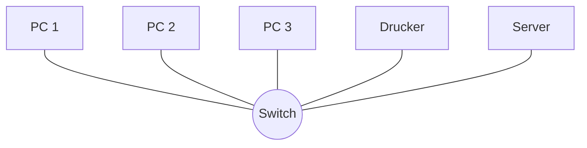
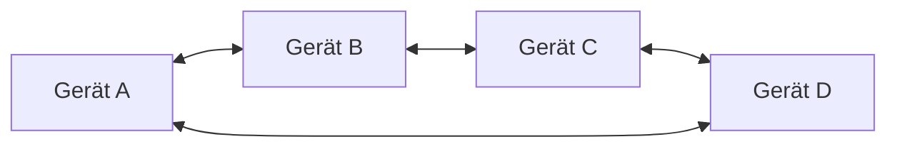
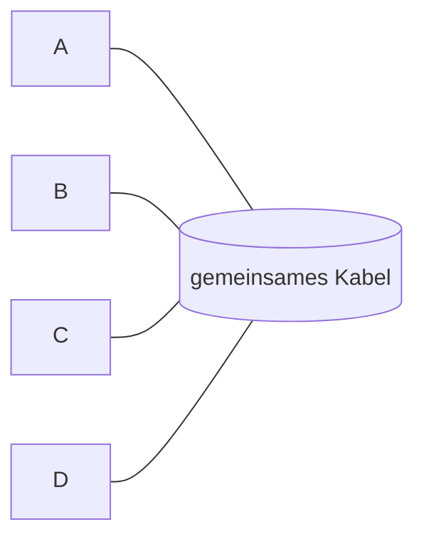
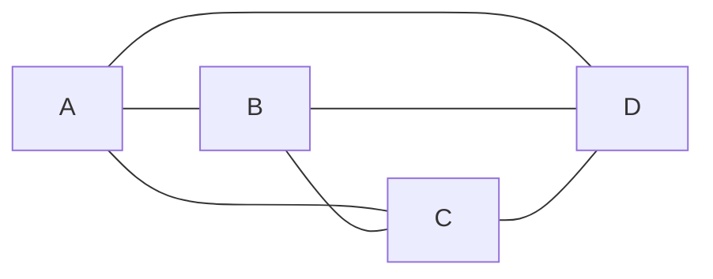
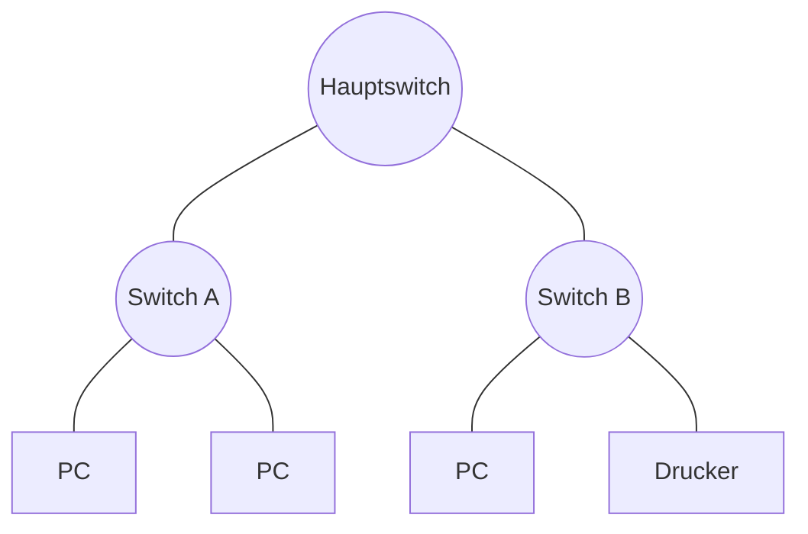
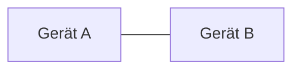
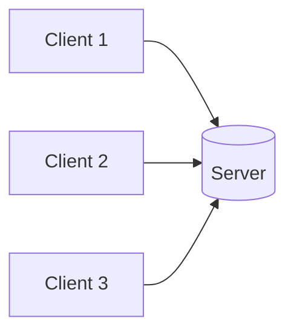
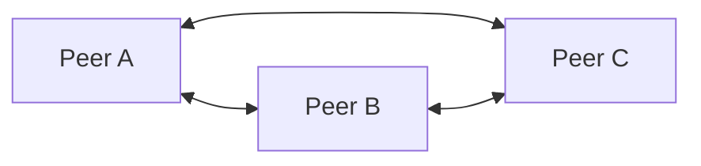

# Grundbegriffe von Netzwerken

Bevor wir uns die Modelle und Protokolle anschauen, klären wir die Vokabeln. **Wer das hier verinnerlicht, versteht jeden weiteren Begriff im Block sofort.** Wer die Begriffe überspringt, läuft später in jeden zweiten Satz unsicher.

!!! abstract "Lernziel"
    Nach dieser Seite kannst du:

    - **LAN, WAN, MAN, PAN** auseinanderhalten und Beispiele nennen
    - die wichtigsten **Topologien** (Stern, Ring, Bus, Mesh, Baum) skizzieren
    - **Client/Server** und **Peer-to-Peer** unterscheiden und ein Beispiel für jedes nennen
    - die Begriffe **Frame, Paket, Segment** und **Datagramm** in den richtigen Schichten verorten
    - **Bandbreite, Latenz, Jitter und Paketverlust** in eigenen Worten erklären

---

## Netzwerk-Typen nach Reichweite

Netzwerke unterscheidet man als erstes nach **Reichweite und Größe**. Vier Begriffe musst du kennen:

| Kürzel | Volle Bezeichnung | Reichweite | Beispiel |
|--------|-------------------|-----------|----------|
| **PAN** | Personal Area Network | wenige Meter | Bluetooth-Kopfhörer am Handy |
| **LAN** | Local Area Network | ein Gebäude, ein Stockwerk | Büro-Netz, Heim-WLAN |
| **MAN** | Metropolitan Area Network | eine Stadt | Stadtwerke-Netz, mehrere Firmenstandorte in einer Stadt |
| **WAN** | Wide Area Network | Länder, Kontinente | das Internet, Firmen mit mehreren Standorten |

!!! tip "Wann nutzt man welchen Begriff?"
    In der Praxis hörst du im Berufsalltag **LAN** und **WAN** ständig, **MAN** und **PAN** dagegen selten. Wichtig zu wissen: die Übergänge sind fließend. Wenn dein Firmen-LAN zwei Standorte verbindet, ist es im Grunde schon ein **kleines WAN**. Wenn dein WLAN nur dein Handy mit dem Lautsprecher verbindet, ist das eher ein **PAN**.

    Was ein Netzwerk zu was macht, ist nicht die Technik, sondern die **Skalierung und der Einsatzort**.

---

## Topologien – wie die Geräte verbunden sind

Eine **Topologie** beschreibt, **wie die Geräte verkabelt** (oder verbunden) sind. Sechs Grundformen, alle wichtig:

### Stern-Topologie

Ein zentrales Gerät (meist ein **Switch**), an dem alle anderen direkt hängen.

- **Vorteile:** einfach zu erweitern, Ausfall eines Geräts bringt nicht das ganze Netz mit
- **Nachteile:** fällt der Switch aus, ist alles weg
- **Heute Standard** in Büros, Wohnungen, kleinen Rechenzentren

### Ring-Topologie

Jedes Gerät hat genau zwei Nachbarn, die Daten laufen im Kreis – bei einem **redundanten Ring** in beide Richtungen.

- **Vorteile:** sehr ausfallsicher, wenn als **redundanter Ring** ausgelegt (Daten können in beide Richtungen fließen)
- **Nachteile:** komplexer zu verkabeln und zu verwalten
- **Heute** vor allem in **Industrie-Netzen** und Backbone-Strukturen

### Bus-Topologie

Alle Geräte hängen an einem gemeinsamen Kabel (dem „Bus").

- **Historisch** der Klassiker (frühes Ethernet mit Koaxialkabel)
- **Heute kaum noch** in IT, aber relevant in der **Industrie** (z.B. Feldbus-Systeme wie Modbus oder CAN-Bus)

### Maschen-Topologie (Mesh)

Jedes Gerät ist mit mehreren anderen verbunden, im Extremfall mit allen anderen („Full Mesh").

- **Vorteile:** sehr ausfallsicher, viele alternative Pfade
- **Nachteile:** sehr aufwändig zu verkabeln, viele Verbindungen
- **Praxis:** **Backbone-Netze**, das **Internet** als Ganzes ist ein Teil-Mesh. Auch **WLAN-Mesh-Systeme** (Fritzbox, Eero, etc.) nutzen das Prinzip.

### Baum-Topologie

Hierarchische Anordnung: ein zentrales Gerät, daran hängen mehrere, daran wieder mehrere.

- Mischung aus Stern-Topologien
- **Klassische Firmenstruktur**: ein Core-Switch im Serverraum, daran hängen Etagen-Switches, daran die Arbeitsplätze

### Punkt-zu-Punkt

Nur zwei Geräte direkt miteinander verbunden.

- Einfachster Fall
- **Beispiele:** Notebook ↔ Drucker per USB, Router ↔ Modem per Kabel, zwei Switches per Glasfaser-Trunk

---

## Client/Server vs. Peer-to-Peer

Eine wichtige Unterscheidung, **wie Geräte miteinander reden**.

### Client-Server-Modell

Ein **Server** stellt einen Dienst bereit. **Clients** nutzen den Dienst. Klare Rollenverteilung.

**Beispiele:**

- Browser ↔ Webserver
- Mail-Programm ↔ E-Mail-Server
- Druckauftrag ↔ Druck-Server
- Docker-Client ↔ Docker-Daemon

Der Server **wartet auf Anfragen** und antwortet. Der Client **stellt die Anfragen**. Das ist heute das **dominante Modell** im Geschäftsalltag.

!!! info "„Server" hat zwei Bedeutungen"
    Achtung – das Wort „Server" wird doppelt benutzt:

    1. **Software-Rolle:** das Programm, das auf Anfragen wartet. Z.B. Apache HTTP Server, PostgreSQL Server.
    2. **Hardware:** der Computer, auf dem ein Server-Programm läuft – meistens eine ausgewachsene Maschine im Rechenzentrum.

    Aus dem Kontext muss klar werden, was du meinst. Ein **Server** im Rolle-Sinn kann auch auf einem **Raspberry Pi** laufen. Ein **Server** im Hardware-Sinn kann auch nur Excel und einen Browser haben.

### Peer-to-Peer (P2P)

**Keine feste Rollenverteilung.** Jedes Gerät ist gleichzeitig Client und Server.

**Beispiele:**

- BitTorrent (Filesharing)
- WLAN-Direct, Bluetooth zwischen Handys
- Blockchain-Netze (z.B. Bitcoin)
- alte Filesharing-Programme (Napster, Kazaa)

P2P spielt im Geschäftsalltag eine kleinere Rolle als Client-Server, aber **es lebt** – vor allem dort, wo es keine zentrale Instanz geben soll.

---

## Was fließt durch ein Netz? – Frame, Paket, Segment

Daten werden im Netzwerk nicht als großer Block übertragen, sondern in kleine **Häppchen** zerlegt. Je nachdem, auf welcher Schicht du gerade bist, heißt das Häppchen anders.

| Begriff | Schicht | Was er enthält |
|---------|---------|----------------|
| **Bit** | Layer 1 (Physisch) | nur ein einzelnes 0 oder 1 |
| **Frame** | Layer 2 (Sicherung) | hat MAC-Adressen (Quelle + Ziel), enthält Nutzdaten |
| **Paket** | Layer 3 (Vermittlung) | hat IP-Adressen (Quelle + Ziel), enthält Nutzdaten |
| **Segment** | Layer 4 (Transport, TCP) | hat Port-Nummern, Reihenfolge, Bestätigungen |
| **Datagramm** | Layer 4 (Transport, UDP) | hat Port-Nummern, **keine** Reihenfolge oder Bestätigung |

  

    Schicht 4 · Segment / Datagramm
    
PortNutzdaten

  

  

    Schicht 3 · Paket
    
IP-AdressenPortNutzdaten

  

  

    Schicht 2 · Frame
    
MAC-AdressenIPPortNutzdatenPrüfsumme

  

*Von oben nach unten gelesen: **jede Schicht packt ihren eigenen Kopf (Header) um dieselben Nutzdaten.** Nach unten wird die Verpackung größer – darum heißt dasselbe Häppchen pro Schicht anders.*

!!! tip "Brief-Analogie"
    Stell dir einen Brief vor:

    - Die **Nutzdaten** sind dein Brief-Text.
    - Das **Segment / Datagramm** ist der Briefumschlag, der Versandart und Absender-Postfach kennt.
    - Das **Paket** ist die Sortiernummer der Deutschen Post, mit der dein Brief im Postsystem unterwegs ist.
    - Das **Frame** ist die Adresse der **nächsten Sortierstation** (Briefträger 12 im Sortierzentrum Hamburg).
    - Das **Bit** ist die einzelne elektrische Ladung im Kabel, ein Lichtimpuls im Glasfaser, oder eine Funkwelle.

    Bei jedem Sprung von einer Station zur nächsten wird der Brief ausgepackt, mit einer neuen Frame-Adresse versehen und weitergeschickt. Das Paket darin bleibt aber gleich, bis es am Ziel ankommt.

Diese Idee – **dieselben Nutzdaten, unterschiedliche Verpackung pro Schicht** – ist das Kernkonzept des [OSI-Modells](osi-und-tcp-ip-modell.md).

---

## Bandbreite, Latenz und Co.

Vier Kennzahlen, die du ständig hörst, wenn es um Netzwerk-Qualität geht.

### Bandbreite

**Wie viel Daten pro Sekunde durch das Netz passen.** Angegeben in **Bit pro Sekunde** (bit/s), heute meistens in Megabit (Mbit/s) oder Gigabit (Gbit/s).

- Heim-DSL: typisch 50–250 Mbit/s
- Glasfaser zu Hause: 500 Mbit/s bis 10 Gbit/s
- Unternehmens-Anbindung: 100 Mbit/s bis mehrere Gbit/s
- Im LAN (Ethernet-Kabel): 1 Gbit/s ist Standard, 10 Gbit/s im Server-Bereich

!!! warning "Megabit vs. Megabyte"
    **1 Byte = 8 Bit.** Wenn dein Anbieter „100 Mbit/s" verspricht, kannst du also maximal **12,5 MB/s** herunterladen. Die meisten verwechseln das auf ihre Kosten.

### Latenz

**Wie lange braucht ein Paket vom Sender zum Empfänger?** Angegeben in **Millisekunden** (ms).

- Im LAN: 1 ms oder weniger
- Lokal zu deinem Provider: 5–20 ms
- Innerhalb Deutschlands über Internet: 10–30 ms
- Deutschland → USA: 80–150 ms
- Deutschland → Australien über Glasfaser: 250–300 ms
- Über Satellit (GEO): 600+ ms
- Über Satellit (LEO, z.B. Starlink): 20–50 ms

!!! info "Hohe Bandbreite ≠ niedrige Latenz"
    Du kannst eine **schnelle** Leitung haben, die **langsam reagiert** – und umgekehrt.

    **Analogie:** Eine Autobahn mit 10 Spuren kann viele Autos parallel fahren lassen (hohe Bandbreite). Aber jedes einzelne Auto braucht trotzdem 30 Minuten von Hamburg nach Bremen (hohe Latenz). Eine zweispurige Bundesstraße könnte schneller sein, wenn sie kürzer ist (niedrige Latenz), aber weniger Autos gleichzeitig (geringe Bandbreite).

    Bei Latenz-kritischen Anwendungen (Videospiele, Echtzeit-Steuerungen) ist Latenz wichtiger als Bandbreite. Bei Datentransfer (Backups, Downloads) ist Bandbreite wichtiger als Latenz.

### Jitter

**Schwankung der Latenz.** Wenn die Latenz mal 10 ms und mal 80 ms ist, dann ist der Jitter hoch.

- **Wann wichtig?** Bei Echtzeit-Anwendungen wie Videotelefonie, VoIP, Online-Gaming. Konstante 100 ms sind besser als schwankende 10–80 ms.
- **Wann egal?** Beim Filehosting, Backups, normalen Webseiten.

### Paketverlust

**Anteil von Paketen, die unterwegs verloren gehen.** Angegeben in **Prozent**.

- Ein gesundes Netz: < 0,1 % Paketverlust
- Bei 1–2 % merkt man schon, dass Streams ruckeln
- Über 5 % wird das Netz praktisch unbrauchbar

Verlorene Pakete werden bei TCP automatisch nochmal gesendet. Das macht TCP zuverlässig, aber langsamer bei schlechten Netzen. **UDP** ignoriert verlorene Pakete – akzeptabel bei Echtzeit-Streams, katastrophal bei Datenübertragung.

---

## Übertragungsmedien

**Wie** die Daten transportiert werden – Kabel, Funk oder Licht.

<figure markdown="span">
{ loading=lazy }
<figcaption>RJ45-Stecker an Kupfer-Patchkabeln – der Klassiker im LAN. Daneben stehen Glasfaser (Licht) und Funk (WLAN).Foto: Albert Stoynov / Unsplash</figcaption>
</figure>

| Medium | Reichweite | Typische Bandbreite | Eigenschaften |
|--------|-----------|---------------------|---------------|
| **Twisted-Pair-Kupfer (CAT5e/CAT6/CAT7)** | bis ca. 100 m | 1–10 Gbit/s | Standard im LAN, billig |
| **Glasfaser (Singlemode/Multimode)** | viele Kilometer (Singlemode) | bis 100 Gbit/s und mehr | sehr schnell, hohe Reichweite, teurer |
| **WLAN (Wi-Fi 5, Wi-Fi 6, Wi-Fi 7)** | 10–50 m (drinnen) | 100 Mbit/s bis 10 Gbit/s | kabellos, Interferenz-empfindlich |
| **Bluetooth** | ca. 10 m | 1–3 Mbit/s | Geräte-zu-Gerät, niedriger Stromverbrauch |
| **Mobilfunk (4G/5G)** | viele Kilometer | 50 Mbit/s bis mehrere Gbit/s (5G) | überall verfügbar, kostenpflichtig |
| **Satellit** | global | 50–250 Mbit/s | dort, wo kein Kabel hinkommt |

In modernen Netzwerken werden diese Medien **kombiniert**: dein WLAN zu Hause endet am Router, der via Twisted-Pair-Kabel oder Glasfaser an das Internet angebunden ist, das wiederum über Tausende Glasfaser-Backbones und an manchen Stellen Satelliten arbeitet.

---

## Vollduplex vs. Halbduplex

Eine kleine, aber wichtige Unterscheidung:

- **Vollduplex:** beide Seiten können **gleichzeitig** senden und empfangen. Wie ein normales Telefongespräch.
- **Halbduplex:** nur einer kann zur Zeit senden. Wie ein **Funkgerät** mit Drück-zum-Sprechen.

Modernes Ethernet ist **vollduplex** – Sender und Empfänger nutzen getrennte Adern im Kabel. WLAN ist auf der Luftschnittstelle dagegen **prinzipiell halbduplex**: auf einem Kanal kann immer nur eine Station zur Zeit senden, die anderen müssen warten. Moderne Standards wie **Wi-Fi 6 mit OFDMA** mildern das durch parallele Multi-User-Übertragungen, ändern aber nichts am Grundprinzip.

---

## Was du jetzt wissen solltest

- Netzwerke unterscheidet man nach Reichweite: **PAN, LAN, MAN, WAN**.
- Die wichtigsten **Topologien**: Stern, Ring, Bus, Mesh, Baum, Punkt-zu-Punkt. Heute ist Stern Standard, Ring in Industrie, Baum in Firmen.
- **Client-Server** ist die Standard-Architektur, **Peer-to-Peer** lebt in Spezialfällen.
- Pro Schicht hat das Daten-Häppchen einen anderen Namen: **Bit → Frame → Paket → Segment**.
- **Bandbreite ≠ Latenz.** Bandbreite ist „wie viel pro Sekunde", Latenz ist „wie lange dauert eine Anfrage".
- **Jitter** ist Latenz-Schwankung, **Paketverlust** ist Anteil verlorener Pakete – beide entscheiden über Netz-Qualität.

---

## Beispielfragen zur Selbstkontrolle

??? question "Frage 1: Du planst die Vernetzung eines neuen Bürogebäudes mit zwei Etagen. Welche Topologie nimmst du vermutlich – und warum?"
    **Eine Baum-Topologie** (Mischung aus mehreren Sternen). Konkret: pro Etage ein **Access-Switch**, an dem die Arbeitsplätze sternförmig hängen. Die Etagen-Switches gehen wiederum sternförmig zu einem zentralen **Core-Switch** im Serverraum.

    Vorteile: einfach erweiterbar, einzelne Ausfälle bleiben lokal begrenzt, klare Verkabelungs-Struktur.

??? question "Frage 2: Eine Videokonferenz ruckelt. Du misst 100 Mbit/s Bandbreite und 200 ms Latenz mit hoher Schwankung. Worauf tippst du?"
    Die hohe **Latenz allein** ist für Sprache schon grenzwertig. Die **Schwankung** (Jitter) ist aber das Hauptproblem – bei Videokonferenzen brauchst du **konstante** kleine Verzögerungen, nicht „mal 50, mal 300 ms".

    Lösung: nicht mehr Bandbreite einkaufen (würde nichts bringen), sondern Ursache des Jitters finden – z.B. überlastetes WLAN, schlechte Leitung zum Provider, QoS-Konfiguration prüfen.

??? question "Frage 3: Welche Daten-'Päckchen-Namen' findest du auf welcher OSI-Schicht – und in welcher Reihenfolge werden sie ineinander verpackt?"
    Von oben nach unten beim Senden:

    - Layer 4 (Transport): **Segment** (TCP) oder **Datagramm** (UDP)
    - Layer 3 (Vermittlung): **Paket**
    - Layer 2 (Sicherung): **Frame**
    - Layer 1 (Physisch): **Bits**

    Beim Senden wird jede Schicht in die darunterliegende verpackt (**Encapsulation**), beim Empfangen wird Schicht für Schicht ausgepackt.

??? question "Frage 4: Du betreibst ein Klassen-C-Heimnetz (192.168.1.0/24). Wie viele Geräte können maximal IP-Adressen bekommen?"
    **254 nutzbare Hostadressen.** Mathematisch wären es 256 (2⁸), aber `.0` ist die Netzadresse und `.255` ist die Broadcast-Adresse – beide nicht nutzbar.

    In der Praxis hat man oft noch weniger frei, weil **Router**, **statische Server** und ggf. **Reservierungen** schon Adressen belegen.

---

## Merksatz

!!! success "Merksatz"
    > **PAN, LAN, MAN, WAN unterscheiden Netzwerke nach Reichweite. Topologien beschreiben, wie sie verkabelt sind. Pro Schicht hat das Daten-Päckchen einen anderen Namen: Frame auf Layer 2, Paket auf Layer 3, Segment auf Layer 4. Bandbreite, Latenz, Jitter und Paketverlust sind die vier Kennzahlen, an denen man Netzqualität misst.**

---

## Weiterlesen

- [OSI- und TCP/IP-Modell](osi-und-tcp-ip-modell.md): die Schichten, in denen sich diese Begriffe einordnen
- [Adressierung](adressierung.md): wie aus „Sender und Empfänger" konkrete Adressen werden
