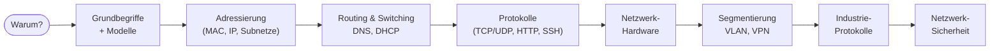

# Netzwerke – Grundlagen für Systemintegration und Vernetzung

Wenn du Container betreibst, virtuelle Maschinen einrichtest oder Server in Betrieb nimmst, redest du die ganze Zeit über Netzwerke – auch wenn du sie nicht direkt anfasst. Eine Anwendung erreicht ihre Datenbank über das Netzwerk. Ein Pull Request landet bei GitHub über das Netzwerk. Ein Produktionsroboter meldet seine Sensorwerte an die Leitstelle über das Netzwerk.

In diesem Block schauen wir uns das **Fundament** an, auf dem all diese Verbindungen aufbauen. Du lernst, wie aus einem Namen wie `github.com` eine erreichbare Adresse wird, warum ein Router etwas anderes ist als ein Switch, was MAC-Adressen mit IP-Adressen zu tun haben und warum es in der Industrie eigene Protokolle wie OPC UA und MQTT gibt, die im klassischen Office-IT-Bereich niemand kennt.

!!! abstract "Was du in diesem Block lernst"
    - die Idee der **Schichtenmodelle** (OSI, TCP/IP) und wozu sie da sind
    - **MAC-Adressen, IPv4, IPv6**, sowie **Subnetting** und **CIDR** im Kopf rechnen
    - was **Routing und Switching** voneinander unterscheidet
    - wie **DNS und DHCP** automatisch im Hintergrund arbeiten
    - die wichtigsten Transport- und Anwendungs-Protokolle: **TCP, UDP, HTTP/HTTPS, SSH, FTP, SMTP**
    - welche **Netzwerk-Hardware** es gibt und wofür sie da ist (Switch, Router, Firewall, Access Point)
    - was **VLAN, DMZ, NAT und VPN** machen
    - die **Industrieprotokolle** der modernen Vernetzung: Profinet, OPC UA, MQTT, AMQP, SCADA
    - die Grundlagen von **Netzwerk-Sicherheit**: Firewall-Typen, IDS/IPS, Zero Trust

---

## Warum dieser Block wichtig ist

Der Lehrplan zum **Berufsspezialisten für Systemintegration und Vernetzung** setzt Netzwerkwissen praktisch überall voraus:

- Wer eine **Cloud-Architektur** plant, muss VPNs, Subnetze und Firewall-Regeln verstehen.
- Wer **Industrieanlagen integriert**, kommt um OPC UA, Profinet und MQTT nicht herum.
- Wer **IT-Sicherheitskonzepte** umsetzt, muss wissen, was Layer 3 von Layer 7 unterscheidet.
- Wer **Backups oder Monitoring** aufbaut, braucht Wissen über TCP, UDP, Ports und Protokolle.

Anders gesagt: ohne dieses Block fehlt dir das Vokabular, mit dem alle anderen Themen erst greifbar werden.

---

## Seiten in diesem Block

| Seite | Inhalt |
|-------|--------|
| [Warum Netzwerke?](warum-netzwerke.md) | Motivation, alltägliche Beispiele, was wirklich passiert, wenn du eine URL eintippst |
| [Grundbegriffe](grundbegriffe.md) | LAN, WAN, Topologien, Client/Server, Bandbreite, Latenz, Paket vs. Frame |
| [OSI- und TCP/IP-Modell](osi-und-tcp-ip-modell.md) | Die zwei Schichtenmodelle und warum es überhaupt zwei gibt |
| [Adressierung (MAC, IPv4, IPv6, Subnetting)](adressierung.md) | Wie Geräte im Netzwerk angesprochen werden – mit Subnetting im Kopf rechnen |
| [Routing und Switching](routing-und-switching.md) | Wie Datenpakete den Weg ins Ziel finden |
| [DNS – Namensauflösung](dns.md) | Wie aus `github.com` eine IP-Adresse wird |
| [DHCP – automatische Adressvergabe](dhcp.md) | Wie ein Gerät beim Verbinden seine Adresse bekommt |
| [Transport-Protokolle (TCP/UDP)](transport-protokolle.md) | Der zuverlässige Brief vs. die schnelle Postkarte |
| [Anwendungs-Protokolle](anwendungs-protokolle.md) | HTTP/HTTPS, SSH, FTP, SMTP, IMAP – die alltäglichen Protokolle |
| [Netzwerk-Hardware](netzwerk-hardware.md) | Switch, Router, Firewall, Access Point, Modem – wer macht was |
| [Segmentierung und VPN](segmentierung-und-vpn.md) | VLAN, DMZ, NAT, VPN – wie Netze logisch aufgeteilt werden |
| [Industrie- und IoT-Protokolle](industrie-protokolle.md) | Profinet, OPC UA, MQTT, AMQP, SCADA – warum sie existieren |
| [Netzwerk-Sicherheit](netzwerk-sicherheit.md) | Firewall-Typen, IDS/IPS, Zero Trust, sichere Architektur |
| [Merksätze](merksaetze.md) | Die Kern-Sätze des ganzen Blocks auf einer Seite |

---

## Roter Faden

Wir bauen das Bild **von unten nach oben**: erst die Modelle und Adressen, dann die Wegfindung, dann die Protokolle, dann die Hardware drumherum, am Schluss Segmentierung, Industrie-Spezifika und Sicherheit.

---

## Wie tief gehen wir?

Du musst nach diesem Block nicht jedes Bit von IPv6 auswendig kennen oder den OPC-UA-Standard zitieren können. Was du **wirklich** mitnimmst:

- ein **mentales Modell**, wie Netzwerke aufgebaut sind
- die richtige **Sprache**, um mit Netzwerktechnikern und Sicherheits-Architekten zu reden
- ein **Bauchgefühl**, an welcher Stelle ein Problem meistens liegt – Layer 1, 2, 3, 4 oder 7
- genug **Begriffsklarheit**, dass die Themen der Prüfung dich nicht überraschen können

Wo es Sinn macht, gibt es kleine Berechnungs-Beispiele (vor allem bei Subnetting). Wo es um Konzepte geht, arbeiten wir mit **Analogien aus dem Alltag** – Postwesen, Telefonnetz, Strassenverkehr.

---

## Voraussetzungen

- Keine. Du brauchst kein Vorwissen über Netzwerke. Wer schon mit Docker- oder VM-Netzwerken gearbeitet hat, hat einen kleinen Vorsprung, aber auch komplette Einsteiger holen wir hier ab.
- Ein **PC oder Laptop**, mit dem du im Browser unsere Beispiele und Konfigurationen nachschauen kannst.
- Etwas **Geduld**: Netzwerke sind ein großes Thema. Lieber langsam und gründlich als oberflächlich und schnell vergessen.

!!! tip "Tipp zum Mitlesen"
    Versuch nicht, eine Seite in einem Rutsch durchzulesen. Lies einen Abschnitt, denk kurz nach, mach eine Pause. Netzwerkwissen wächst in Schichten – jede Seite baut auf der vorherigen auf. Wer den Mittelteil von OSI nicht verstanden hat, scheitert später beim Routing. Lieber zweimal eine Seite lesen als einmal alles überfliegen.

---

## Leitfrage

> **Was passiert technisch, wenn ich `https://github.com` in den Browser eintippe – und welche Komponenten sind alle daran beteiligt?**

Am Ende dieses Blocks beantwortest du diese Frage in zehn Minuten am Whiteboard, ohne ins Stocken zu kommen. Von der DNS-Anfrage über die TCP-Verbindung, die TLS-Aushandlung, den HTTP-Request, das Routing über mehrere Hops, bis zur fertig gerenderten Seite. Wer das im Schlaf erklären kann, kann den Rest des Lehrplans bedient angehen.
