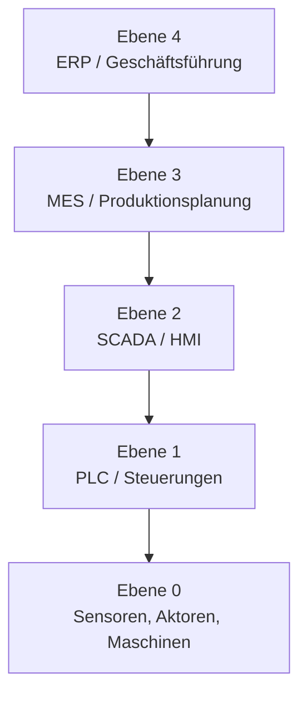
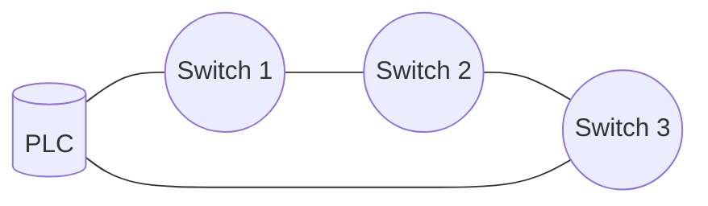
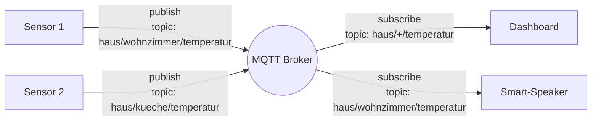
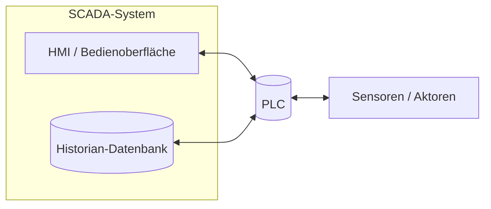
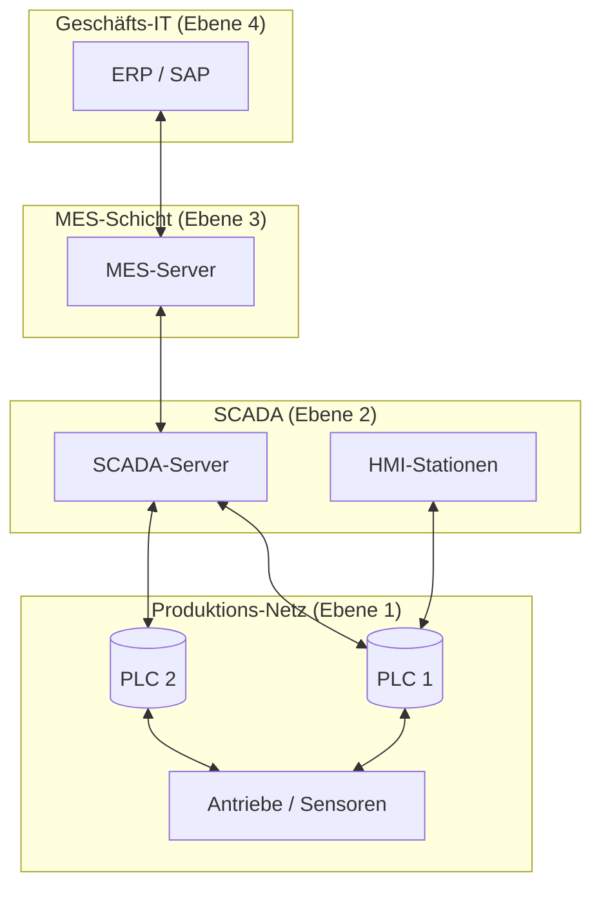
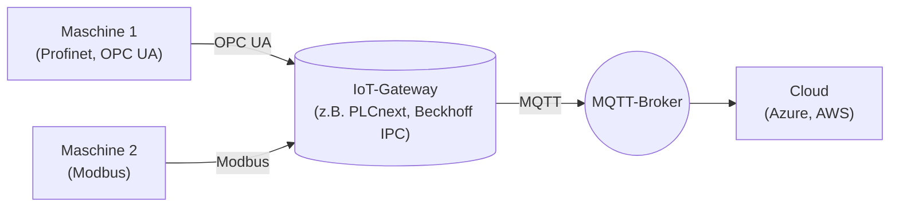

# Industrie- und IoT-Protokolle

In Büros redet die Welt **HTTP**. In Produktionshallen redet die Welt **anders**. Eine Werkzeugmaschine, ein Schweißroboter, ein Förderband, ein PLC-Controller – sie alle nutzen Protokolle, die du im normalen IT-Alltag nie siehst. Aber als Berufsspezialist für **Systemintegration und Vernetzung** wirst du genau an dieser Schnittstelle arbeiten: zwischen klassischer IT und industrieller Steuerung.

Diese Seite gibt dir die wichtigsten Industrie- und IoT-Protokolle als **Konzepte** an die Hand. Es geht nicht um Detail-Bits, sondern um: **wozu ist das gut, wann nehme ich es, wo läuft es?**

!!! abstract "Lernziel"
    Nach dieser Seite kannst du:

    - die **Eigenheiten industrieller Netze** im Vergleich zu Office-IT benennen
    - **Profinet**, **EtherCAT**, **Modbus** und **OPC UA** als Industrie-Klassiker einordnen
    - die IoT-Protokolle **MQTT** und **AMQP** beschreiben und ihren Einsatz erklären
    - **SCADA-Systeme** und ihre Rolle in der Steuerung verstehen
    - sagen, **warum Office-Sicherheitskonzepte in der Industrie nicht 1:1 funktionieren**
    - das Schichtenmodell **„OT vs. IT"** (Operational Technology vs. Information Technology) im Kopf haben

---

## OT vs. IT – die zwei Welten

Bevor wir in die Protokolle einsteigen, eine wichtige Unterscheidung:

| Aspekt | IT (Information Technology) | OT (Operational Technology) |
|--------|---------------------------|----------------------------|
| **Was läuft hier?** | Mail, Web, Datenbanken, Office | Maschinen, Sensoren, Aktoren, PLCs |
| **Wichtigster Wert** | Daten-Vertraulichkeit | Maschinen-Verfügbarkeit und Sicherheit von Personen |
| **Erwartete Lebensdauer** | 3–5 Jahre | 15–30 Jahre |
| **Patch-Zyklus** | wöchentlich/monatlich | Monate bis Jahre |
| **Akzeptable Downtime** | Stunden, ggf. ein Tag | Minuten, oft Null |
| **Echtzeit-Anforderung** | meist nicht kritisch | oft kritisch (Mikrosekunden) |
| **Sicherheit** | Confidentiality, Integrity, Availability (CIA) | Safety zuerst, dann Availability, dann Integrity |

Die **Werte sind gegensätzlich** sortiert. In der IT ist es schlimm, wenn Daten geleaked werden. In der OT ist es schlimm, wenn die Anlage stillsteht – oder schlimmer noch, wenn jemand verletzt wird.

Das hat **direkte Folgen für die Vernetzung**:

- ein Office-Update wird einfach eingespielt → in einer Industriehalle kann ein Update die Produktion lahmlegen
- ein Server-Reboot ist normal → ein PLC-Reboot mitten in einem Produktionslauf kann katastrophal sein
- ein Office-Switch im Plastikgehäuse reicht → in einer Halle braucht es ein Schaltschrank-taugliches Gerät mit DIN-Rail-Montage, Vibrations-Toleranz und weitem Temperatur-Bereich

---

## Das Automatisierungs-Pyramide (ISA-95)

Die klassische Darstellung der Industrie-IT ist eine **Pyramide** mit fünf Ebenen:



- **Ebene 0:** physische Welt – Sensoren (was passiert?), Aktoren (was sollen wir tun?), Maschinen.
- **Ebene 1:** **PLCs** (Programmable Logic Controllers) – die Mikro-Computer, die direkt mit den Maschinen reden.
- **Ebene 2:** **SCADA** (Supervisory Control And Data Acquisition) und **HMI** (Human Machine Interface) – die Bedienoberflächen für den Operator.
- **Ebene 3:** **MES** (Manufacturing Execution System) – plant und verfolgt die Produktion.
- **Ebene 4:** **ERP** (Enterprise Resource Planning, z.B. SAP) – Geschäftsebene.

**Die Protokolle dieser Seite** leben hauptsächlich zwischen den unteren drei Ebenen.

---

## Profinet – Industrielles Ethernet

**Profinet** ist eine **Ethernet-basierte Industrie-Norm**, die von Siemens vorangetrieben wurde. Heute der **dominante Standard** in europäischen Produktionsanlagen.

### Was Profinet besonders macht

- läuft über **Standard-Ethernet-Kabel** (Cat 5e/6, RJ45)
- **kein Routing nötig** – arbeitet auf Layer 2 mit speziellen Erweiterungen
- bietet **Echtzeit-Klassen**:
  - **RT (Real Time):** Zykluszeiten unter 10 ms
  - **IRT (Isochronous Real Time):** unter 1 ms, mit Jitter im Mikrosekunden-Bereich
- nutzt **MAC-Adressen** zur Adressierung der Teilnehmer

### Wofür wird es eingesetzt?

- **Antriebe** (Motoren, Servos)
- **PLCs**
- **dezentrale Peripherie** (z.B. ET 200SP von Siemens)
- **Vision-Systeme** (Kameras in der Qualitätssicherung)

### Typische Topologie

Profinet wird oft in **Ring-Topologie** verkabelt, mit **MRP (Media Redundancy Protocol)**. Wenn ein Kabel reißt, schaltet das Netz innerhalb von 200 ms auf den anderen Ring-Weg um.



---

## EtherCAT – die schnelle Alternative

**EtherCAT** (Ethernet for Control Automation Technology) ist ein **anderer** Industrie-Ethernet-Standard, der vor allem in Hochgeschwindigkeits-Anwendungen genutzt wird.

### Charakteristik

- Zykluszeiten unter **100 Mikrosekunden**
- ein einzelnes Ethernet-Frame durchläuft alle Geräte „im Vorbeifahren" – jedes Gerät liest und schreibt seinen Anteil
- sehr deterministisch

EtherCAT wird häufig bei sehr schnellen Bewegungssteuerungen eingesetzt (z.B. Robotik, CNC-Maschinen).

---

## Modbus – der alte Klassiker

**Modbus** ist eines der **ältesten noch verbreiteten** Industrie-Protokolle (von 1979, ursprünglich von Modicon). Es ist **extrem einfach** – fast schon spartanisch – und gerade deshalb noch überall.

### Varianten

| Variante | Medium | Eigenschaften |
|----------|--------|---------------|
| **Modbus RTU** | serielle Verbindung (RS-485) | bit-effizient, Binär |
| **Modbus ASCII** | seriell | textbasiert, langsamer |
| **Modbus TCP** | Ethernet | über Port 502, weit verbreitet |

### Wie Modbus funktioniert

Ein **Master** (typisch ein PLC oder eine SCADA-Station) fragt **Slaves** (Sensoren, Aktoren, Geräte) ab:

- „Lies mir Register 100 bis 110."
- „Schreibe in Register 200 den Wert 42."

Mehr ist es nicht. Keine Verschlüsselung, keine Authentifizierung, keine komplexen Datenstrukturen.

### Wo siehst du Modbus heute?

- **Photovoltaik-Wechselrichter** (SMA, Fronius, Huawei)
- **Energie-Zähler**
- **Klimaanlagen**
- **alte SPS-Anlagen** mit Erweiterungs-Modulen
- **IoT-Bridges**, die Modbus-Daten ins moderne IT-Netz übersetzen

**Sicherheit:** Modbus hat keine eingebaute Sicherheit. Wer im Netz mitlesen kann, kann auch schreiben. Darum muss Modbus **immer in einem isolierten Netz** laufen.

---

## OPC UA – der moderne Industriestandard

**OPC UA** (Open Platform Communications Unified Architecture) ist der **moderne Stern** in der Industrie-Vernetzung. Anders als Profinet oder Modbus ist OPC UA **plattform- und herstellerunabhängig** und beschreibt **nicht nur Daten, sondern auch deren Bedeutung**.

### Was OPC UA besonders macht

- **Hersteller-unabhängig** – jeder kann es implementieren
- **Plattform-unabhängig** – läuft auf Linux, Windows, embedded, in der Cloud
- **Strukturiertes Daten-Modell** – nicht nur „Register 100", sondern „Temperatur des Pumpenmotors in °C"
- **Sicherheit eingebaut**: TLS-Verschlüsselung, Zertifikate, Benutzer-Authentifizierung
- **Skalierbar** – vom kleinen Sensor bis zur Cloud
- **Plug-and-Play** durch Discovery-Mechanismen

### Architektur

OPC UA folgt einem **Client-Server-Modell**:

- Ein **OPC-UA-Server** läuft auf einem Gerät (PLC, Maschine, Gateway) und stellt Daten bereit.
- **OPC-UA-Clients** verbinden sich und lesen/schreiben Daten – oder abonnieren Änderungen.

Daten sind in einem **Adressraum** organisiert, mit Strukturen, Datentypen und semantischer Beschreibung:

```text
Werkshalle 1
├── Maschine A
│   ├── Motor
│   │   ├── Drehzahl (1450 U/min)
│   │   ├── Temperatur (62 °C)
│   │   └── Status (running)
│   └── Förderband
│       ├── Geschwindigkeit (0.8 m/s)
│       └── Last (45 kg)
└── Maschine B
    └── ...
```

Ein Client kann jetzt nicht nur „Wert holen" sagen, sondern auch **abonnieren**: „Schick mir Bescheid, wenn sich die Temperatur ändert."

### Pub/Sub-Erweiterung

Seit einigen Jahren hat OPC UA auch ein **Publish/Subscribe-Modell** (siehe MQTT unten), das auf UDP-Multicast oder MQTT/AMQP aufsetzt. Damit lässt sich OPC UA noch besser für **Cloud-Anbindungen** und **massive Skalierung** einsetzen.

### Warum OPC UA der Stern wird

Die Industrie wandelt sich Richtung **Industrie 4.0**. Maschinen sollen mit der **Cloud** und mit anderen Maschinen reden, oft herstellerübergreifend. Genau das ist OPC UAs Stärke.

Außerdem ist OPC UA inzwischen Teil mehrerer **internationaler Normen** und wird von praktisch jedem großen Industrie-Anbieter (Siemens, Beckhoff, B&R, Rockwell) unterstützt.

---

## MQTT – das IoT-Protokoll

**MQTT** (Message Queuing Telemetry Transport) ist ein **leichtgewichtiges Protokoll** für das Senden kleiner Nachrichten – ideal für **IoT-Geräte**, schmale Internet-Verbindungen und massive Skalierung.

### Pub/Sub-Modell

MQTT folgt einem **Publish/Subscribe-Modell** mit einem **zentralen Broker**:



- **Publisher** senden Nachrichten an **Topics** (hierarchische Namen wie `haus/wohnzimmer/temperatur`).
- **Subscriber** abonnieren Topics und bekommen alle Nachrichten dazu.
- Der **Broker** verteilt die Nachrichten zwischen Publishern und Subscribern.

### Warum MQTT für IoT ideal ist

- **sehr kleiner Overhead** – das Protokoll ist binär und schlank
- **Verbindungsorientiert** über TCP, aber **dauerhaft offen** – kein neuer Handshake pro Nachricht
- **QoS-Level**: 0 = „fire and forget", 1 = „mindestens einmal", 2 = „genau einmal"
- **Retained Messages**: der letzte Wert für ein Topic bleibt gespeichert
- **Last Will**: wenn ein Client unsauber abbricht, kann der Broker eine vordefinierte Nachricht senden

### Typische Anwendungen

- **Smart Home** (Home Assistant, openHAB, Tasmota, Zigbee2MQTT)
- **Industrie-Telemetrie** (Sensoren-Daten in die Cloud)
- **Mobile Apps** mit Push-Charakter
- **Tausende Geräte** mit kleinen Datenmengen

### Bekannte Broker

- **Eclipse Mosquitto** – Open Source, sehr verbreitet
- **HiveMQ** – Open Source und kommerzielle Variante
- **AWS IoT Core**, **Azure IoT Hub** – Cloud-basiert
- **EMQX** – performante Open-Source-Variante

---

## AMQP – die Enterprise-Variante

**AMQP** (Advanced Message Queuing Protocol) ist ähnlich wie MQTT, aber **schwerer und mit mehr Features**. Es kommt aus der **Enterprise-Welt** (Finanzdienste, Versicherungen) und unterstützt komplexere Szenarien.

### Vergleich MQTT vs. AMQP

| Aspekt | MQTT | AMQP |
|--------|------|------|
| **Komplexität** | sehr schlank | umfangreich |
| **Routing** | einfach (Topics) | komplexer (Exchanges, Queues, Routing Keys) |
| **Garantien** | QoS 0/1/2 | feinere Steuerung |
| **Verbreitung in IoT** | dominant | seltener |
| **Verbreitung in Enterprise** | wachsend | etabliert |
| **Beispiel-Broker** | Mosquitto, HiveMQ | RabbitMQ, ActiveMQ |

In der Praxis:

- **MQTT für viele kleine IoT-Geräte**
- **AMQP für komplexe Backend-Workflows** mit vielen Queues und unterschiedlichen Routing-Regeln

---

## SCADA-Systeme

**SCADA** (Supervisory Control And Data Acquisition) ist **kein Protokoll**, sondern eine **Architektur-Klasse**: ein System, mit dem Operatoren eine technische Anlage **überwachen und steuern**.

### Typischer Aufbau



- **PLCs** steuern direkt die Maschinen.
- Das **SCADA-System** sammelt Daten von den PLCs, zeigt sie auf grafischen HMI-Oberflächen, speichert Historie und ermöglicht manuelle Eingriffe.
- Ein **Historian** ist eine spezialisierte Datenbank für Zeitreihen-Daten (Messwerte über die Zeit).

### Typische Aufgaben eines SCADA-Systems

- **Live-Überwachung** aller Sensoren auf einem Übersichts-Bildschirm
- **Alarme** bei Grenzwert-Überschreitung
- **Trend-Analysen** über Stunden, Tage, Wochen
- **Manuelle Eingriffe** (z.B. Ventil schließen, Pumpe abschalten)
- **Reporting** für Behörden und Qualitätssicherung

### Bekannte SCADA-Lösungen

- **Siemens WinCC**
- **Rockwell FactoryTalk**
- **Wonderware (AVEVA)**
- **Ignition**
- **Zenon**

### Sicherheits-Implikation

SCADA-Systeme steuern **kritische Infrastruktur** – Stromnetze, Wasserwerke, Pipelines, Chemieanlagen. Wenn ein Angreifer ins SCADA kommt, kann er **physische Anlagen manipulieren**.

Berühmt: **Stuxnet** (2010) – ein Schadprogramm, das gezielt SCADA-Komponenten in iranischen Anreicherungsanlagen sabotierte. Seitdem ist „SCADA-Sicherheit" ein eigenes Spezialgebiet.

---

## Wo all das im Netz hängt

Eine moderne Industriehalle hat oft mehrere **getrennte Netze**:



Zwischen den Schichten stehen typischerweise **Firewalls** oder **Daten-Dioden** (Hardware, die Daten nur in eine Richtung lässt), um Übergriffe zu verhindern.

- **Ebene 0–1:** Profinet, EtherCAT, Modbus
- **Ebene 1–2:** OPC UA, Modbus TCP, proprietäre Protokolle
- **Ebene 2–3:** OPC UA, MQTT, AMQP, REST/HTTP
- **Ebene 3–4:** klassisches IT: REST, SQL, MQTT, AMQP, EDI

---

## Alarmierungs- und Benachrichtigungs-Strategie

In Industrie-Anlagen reicht es nicht, **Daten zu sammeln** – man muss auch **rechtzeitig reagieren**, wenn etwas aus dem Ruder läuft. Genau dafür gibt es die **Alarmierungs-Strategie**.

### Grundprinzip

Für jeden wichtigen Messwert (Temperatur, Druck, Strom, Drehzahl, Vibration, …) gibt es einen **Sollbereich**. Verlässt der Messwert diesen Bereich, soll **etwas passieren**.

Klassische Alarmstufen:

| Stufe | Bedeutung | Reaktion |
|-------|-----------|----------|
| **Warnung** | Wert verlässt den optimalen Bereich, aber noch nicht kritisch | Eintrag im Log, ggf. E-Mail an Schicht-Leiter |
| **Alarm** | Wert ist deutlich außerhalb, Eingriff nötig | Sirene, SMS an Bereitschaftsdienst, Display am HMI rot |
| **Notabschaltung** | Wert gefährdet die Anlage oder Personen | Anlage stoppt automatisch, Eskalation an Sicherheitsverantwortliche |

### Wo wird das umgesetzt?

- **In der PLC** selbst (für sehr schnelle, sicherheitsrelevante Reaktionen wie Notabschaltung)
- **Im SCADA-System** (für die Operator-Sicht und die Eskalation)
- **Im darüber liegenden MES oder einem dedizierten Alarm-Management-System** (für Auswertung, Schichtübergaben, Reports)

### Typische Anti-Patterns

- **Alarm-Müdigkeit:** zu viele unwichtige Alarme führen dazu, dass Operatoren sie ignorieren – und den einen kritischen verpassen.
- **Doppelte Alarme:** ein Sensor löst aus, daraufhin meldet sich der nachgelagerte – beide alarmieren parallel, ohne Mehrwert.
- **Fehlende Eskalation:** wenn niemand auf den Alarm reagiert, sollte er nach X Minuten an die nächste Ebene eskaliert werden. Wird oft vergessen.

Eine **gute Alarmierungs-Strategie** ist deshalb mindestens so wertvoll wie die Sensoren selbst. Sie unterscheidet eine Anlage, die im Notfall korrekt reagiert, von einer, in der Operatoren im Logfile-Sturm untergehen.

---

## Datenanalyse, Big Data und Predictive Maintenance

Die Maschinendaten landen aus den Sensoren in der Cloud oder in einer **Historian-Datenbank**. Aber Daten allein sind nutzlos – sie müssen **ausgewertet** werden. Dafür gibt es heute eine ganze Werkzeugkette.

### Was wird analysiert?

- **Trends:** wie verändert sich die Vibration des Motors über Wochen?
- **Korrelationen:** steigt der Stromverbrauch immer dann, wenn die Hallen-Temperatur über 28 °C geht?
- **Ausreißer:** wann gab es ungewöhnliche Spitzen? Was ist da passiert?
- **Muster:** welche Sequenz von Werten geht typischerweise einem Ausfall voraus?

### Werkzeuge

| Werkzeug-Klasse | Beispiele | Typische Nutzung |
|-----------------|-----------|------------------|
| **Time-Series-Datenbanken** | InfluxDB, TimescaleDB, Prometheus | Messwerte effizient speichern und abfragen |
| **Visualisierung** | Grafana, Power BI, Tableau | Dashboards für Operator und Management |
| **Big-Data-Plattformen** | Azure Synapse, AWS Redshift, Databricks | sehr große Datenmengen analytisch auswerten |
| **Machine-Learning-Plattformen** | Azure ML, AWS SageMaker, Google Vertex AI | Modelle trainieren und Vorhersagen automatisieren |

### Predictive Maintenance – vorausschauende Wartung

Der heilige Gral der Industrie 4.0: **Ausfälle vorhersagen, bevor sie passieren.**

Klassischer Wartungs-Ablauf:

- **Reaktiv:** Maschine geht kaputt, dann reparieren. Teuer wegen ungeplantem Stillstand.
- **Präventiv:** alle X Betriebsstunden wechseln, egal ob nötig. Teuer wegen unnötigem Teile-Tausch.
- **Predictive:** Sensor-Daten + ML-Modell sagen voraus, **wann** ein Teil tatsächlich auszufallen droht. **Genau dann** wird gewechselt.

Wie funktioniert das technisch?

1. **Daten sammeln** über lange Zeiträume (Vibration, Strom, Temperatur, …).
2. **Historische Ausfälle** im Datensatz markieren.
3. **ML-Modell trainieren**, das die Muster vor einem Ausfall erkennt.
4. **Im Live-Betrieb** wird das Modell mit neuen Daten gefüttert und gibt Wahrscheinlichkeiten aus: „Lager wird in den nächsten 3 Wochen ausfallen, Wahrscheinlichkeit 87 %."

Vorteile:

- weniger ungeplante Stillstände
- effizienterer Teile-Einsatz
- bessere Plan-Sicherheit für Wartungsteams

Voraussetzung:

- **Sehr gute Datenbasis** (Monate bis Jahre an Messwerten)
- **Stabile Vernetzung** der Maschinen ins zentrale Datensystem
- **Datenwissenschaftler** oder fertige ML-Plattformen für die Modell-Pflege

In der Praxis ist Predictive Maintenance in **großen Anlagen** (Kraftwerke, Großmaschinen) inzwischen Standard, in **mittelständischen Betrieben** noch eher die Ausnahme – aber stark im Kommen.

---

## Die typische Architektur „IT trifft OT"

Ein häufiger Auftrag in der Praxis: **„Wir wollen die Maschinendaten in die Cloud schicken."**

Eine bewährte Architektur:



Das **IoT-Gateway** ist der Übersetzer:

- Es liest die **Industrie-Protokolle** (Modbus, Profinet, OPC UA) von den Maschinen.
- Es schickt die Daten in einem **modernen, sicheren Protokoll** (MQTT, HTTPS) in die Cloud.
- Es ist die **einzige Stelle**, an der das Produktionsnetz und das Office-/Cloud-Netz sich berühren.

So bleibt das Produktionsnetz **abgeschottet**, und die Maschinendaten sind trotzdem in der Cloud auswertbar.

---

## Was du jetzt wissen solltest

- **OT** und **IT** haben unterschiedliche Werte und Anforderungen – Verfügbarkeit und Safety dominieren in der OT.
- Die **Automatisierungs-Pyramide** (ISA-95) gibt die Schichten: Sensoren → PLC → SCADA → MES → ERP.
- **Profinet** und **EtherCAT** sind Industrie-Ethernet-Standards mit Echtzeit-Eigenschaften.
- **Modbus** ist alt, einfach, weit verbreitet – ohne eingebaute Sicherheit.
- **OPC UA** ist der moderne, plattform-unabhängige Industriestandard mit semantischer Datenstruktur und eingebauter Sicherheit.
- **MQTT** ist das IoT-Protokoll der Wahl: schlank, Publish/Subscribe, ideal für viele kleine Geräte.
- **AMQP** ist die Enterprise-Variante mit mehr Features, oft im Backend.
- **SCADA-Systeme** überwachen und steuern technische Anlagen – ihr Schutz ist kritisch.
- **IoT-Gateways** sind die typische Brücke zwischen geschütztem Produktionsnetz und Cloud.

---

## Beispielfragen zur Selbstkontrolle

??? question "Frage 1: Ein Auftrag: alle Maschinendaten einer Halle in die Cloud bringen, damit Ingenieure sie auswerten können. Wie planst du das?"
    Schrittweise:

    1. **Bestandsaufnahme:** Welche Maschinen, welche Protokolle? (Profinet, OPC UA, Modbus, …)
    2. **IoT-Gateway** auswählen, das die Maschinen-Protokolle liest und in ein modernes Format übersetzt
    3. Vom Gateway zur Cloud: **MQTT** zu einem Broker (z.B. Azure IoT Hub, AWS IoT Core) – verschlüsselt über TLS
    4. **Klare Netzwerk-Trennung:** Produktionsnetz und das Gateway nur durch eine Firewall verbunden, keine direkten Verbindungen Maschine ↔ Internet
    5. **Daten-Speicherung** in einer Time-Series-Datenbank (z.B. InfluxDB, TimescaleDB)
    6. **Visualisierung** mit Grafana oder Power BI
    7. **Optional: ML-Modell** für Predictive Maintenance

??? question "Frage 2: Warum reicht in einer industriellen Anlage normales HTTPS oft nicht als Protokoll – auch nicht zwischen den PLCs und der Steuerung?"
    HTTPS ist für **Web-Anwendungen** optimiert: Request-Response, variable Antwortzeiten, akzeptierte Latenzen im Bereich 50–200 ms.

    In Produktionsanlagen brauchst du:

    - **Echtzeit-Fähigkeit** (oft < 1 ms Reaktionszeit)
    - **Determinismus** (garantierte maximale Antwortzeiten)
    - **stabile Cycle Times** (z.B. alle 4 ms)
    - **kompakte Frames** mit minimalem Overhead

    Genau dafür gibt es **Profinet IRT** (Isochronous Real Time) oder **EtherCAT** – mit kleinen Frames und garantierten Zyklen. HTTPS würde diese Anforderungen weit verfehlen.

??? question "Frage 3: Welche Aufgabe hat ein SCADA-System, und warum ist seine Absicherung besonders kritisch?"
    Ein **SCADA**-System (Supervisory Control And Data Acquisition) sammelt Sensordaten von PLCs, zeigt sie auf grafischen HMI-Bedienoberflächen, ermöglicht **manuelle Eingriffe** in den Prozess, alarmiert bei Grenzwert-Überschreitungen und speichert Historie für spätere Auswertung.

    Absicherung ist kritisch, weil SCADA **direkten Einfluss auf physische Anlagen** hat: Pumpen, Ventile, Förderbänder, Roboter. Ein kompromittiertes SCADA kann **echte materielle und körperliche Schäden** verursachen.

    Der berühmte **Stuxnet** (2010) sabotierte gezielt SCADA-Komponenten in iranischen Anreicherungsanlagen und beschädigte Zentrifugen.

??? question "Frage 4: Wann nimmst du MQTT, wann AMQP – und wann normales HTTP?"
    - **MQTT:** viele kleine Geräte, häufige kurze Nachrichten, oft IoT/Industrie-Telemetrie. Sehr schlank, Publish/Subscribe-Modell, Broker als Mittelpunkt.
    - **AMQP:** komplexe Backend-Workflows mit feinerem Routing, Queues und Garantien. Eher Enterprise-Backend (Finanz, Versicherung) als IoT.
    - **HTTP/REST:** wenn du **Anfrage-Antwort-Logik** brauchst (z.B. „hol mir den aktuellen Zustand der Maschine"). Gut für gelegentliche Befehle, schlecht für viele kleine Push-Daten.

    Eine moderne Industrie-Architektur nutzt oft **MQTT für Sensordaten** und **HTTP/REST für gezielte Steuerbefehle und Konfiguration**.

---

## Merksatz

!!! success "Merksatz"
    > **In der IT zählt Vertraulichkeit, in der OT zählt Verfügbarkeit und Safety. Profinet und EtherCAT für Echtzeit-Steuerungen, Modbus für alles Einfache, OPC UA für die moderne, herstellerunabhängige Vernetzung. MQTT für IoT-Massendaten, AMQP für komplexere Enterprise-Flows. SCADA überwacht und steuert, das IoT-Gateway ist die Brücke zur Cloud. Produktionsnetz und Office-Netz gehören streng getrennt.**

---

## Weiterlesen

- [Netzwerk-Sicherheit](netzwerk-sicherheit.md): warum gerade Industrie-Netze besonders gehärtet sein müssen
- [Segmentierung und VPN](segmentierung-und-vpn.md): wie Produktions- und Office-Netze sauber getrennt werden
- [Transport-Protokolle](transport-protokolle.md): MQTT läuft über TCP, hier siehst du, wie das im Detail funktioniert
