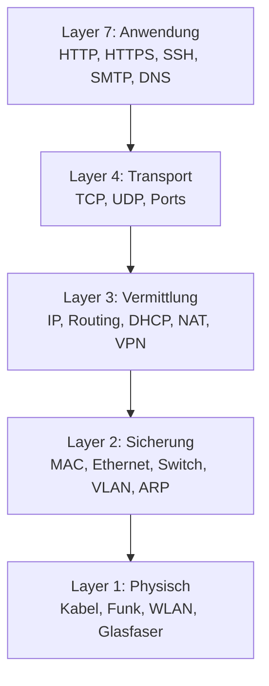
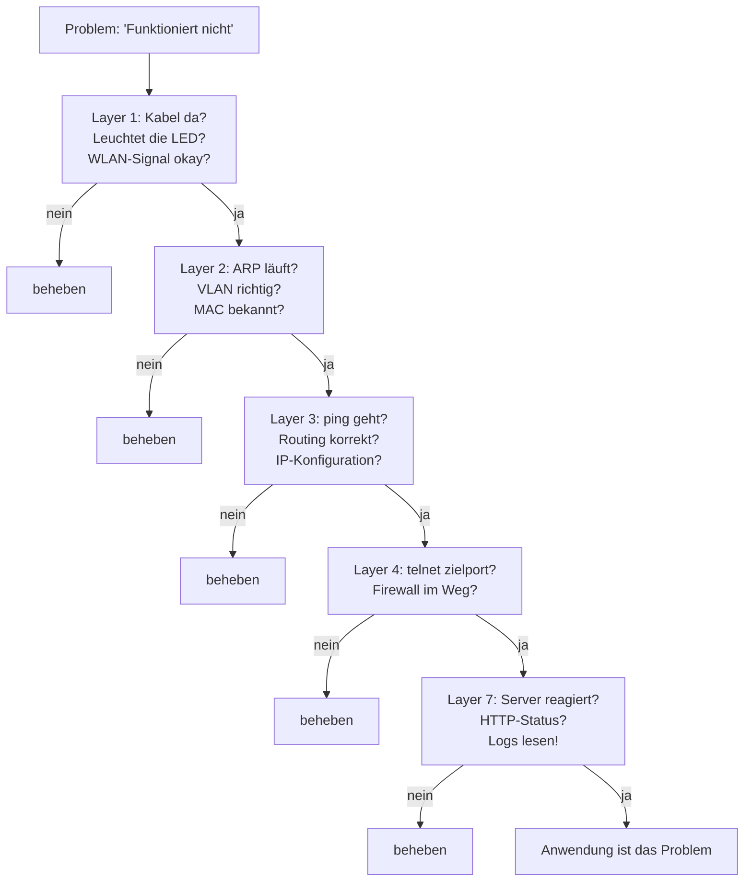

# Merksätze: Netzwerke

---

## 1. Was Netzwerke im Kern sind

!!! success "Merksatz 1"
    > **Ein Netzwerk ist nur: Medium + Regelwerk + Adressen + Pfade. Wer das versteht, versteht alles davon – von der Heimat-Fritzbox bis zum globalen Internet, vom Office-LAN bis zur Industrieanlage. Netzwerkwissen ist nicht ein Spezialthema, es ist das Fundament.**

Mehr dazu: [Warum Netzwerke?](warum-netzwerke.md)

---

## 2. Grundbegriffe und Topologien

!!! success "Merksatz 2"
    > **PAN, LAN, MAN, WAN unterscheiden Netzwerke nach Reichweite. Topologien beschreiben, wie sie verkabelt sind. Pro Schicht hat das Daten-Päckchen einen anderen Namen: Frame auf Layer 2, Paket auf Layer 3, Segment auf Layer 4. Bandbreite, Latenz, Jitter und Paketverlust sind die vier Kennzahlen, an denen man Netzqualität misst.**

Mehr dazu: [Grundbegriffe](grundbegriffe.md)

---

## 3. Schichtenmodelle

!!! success "Merksatz 3"
    > **Sieben Schichten OSI, vier Schichten TCP/IP. Jede Schicht löst genau eine Aufgabe und redet nur mit ihren Nachbarn. Bei jedem Hop wird das Paket aus seinem Umschlag genommen, neu adressiert, wieder eingepackt und weitergeschickt. Wer in Schichten denkt, findet jeden Netzwerkfehler doppelt so schnell.**

Mehr dazu: [OSI- und TCP/IP-Modell](osi-und-tcp-ip-modell.md)

---

## 4. Adressierung

!!! success "Merksatz 4"
    > **MAC ist Hardware (Layer 2), IP ist Logik (Layer 3). Eine IP-Adresse ist Netz + Host, die Subnetzmaske trennt beides. Private Bereiche sind 10er, 172.16er, 192.168er. IPv6 löst die Knappheit mit 128 Bit. ARP verbindet im LAN IP und MAC. Subnetting heißt im Kern: wo verläuft die Grenze zwischen Netz und Host?**

Mehr dazu: [Adressierung](adressierung.md)

---

## 5. Routing und Switching

!!! success "Merksatz 5"
    > **Switch = Layer 2 = MAC-Adressen = innerhalb des LAN. Router = Layer 3 = IP-Adressen = zwischen LANs. Was nicht zum lokalen Netz gehört, geht zum Default Gateway. Routing-Tabellen entscheiden den Weg, „Longest Prefix Match" ist die Regel. Auf jedem Hop ändert sich die MAC, die IP bleibt.**

Mehr dazu: [Routing und Switching](routing-und-switching.md)

---

## 6. DNS

!!! success "Merksatz 6"
    > **DNS ist das Telefonbuch des Internets: Namen rein, IP raus. Aufgebaut hierarchisch von Root → TLD → Domain. Caching macht es schnell, TTL bestimmt die Frische. Die wichtigsten Records: A (IPv4), AAAA (IPv6), CNAME (Alias), MX (Mail), NS (zuständige Server), TXT (alles Mögliche). Ohne DNS ist das Internet nicht weg – nur unerreichbar.**

Mehr dazu: [DNS](dns.md)

---

## 7. DHCP

!!! success "Merksatz 7"
    > **DHCP automatisiert die IP-Vergabe. Vier Schritte: DORA. Ein Gerät bekommt nicht nur eine Adresse, sondern auch Maske, Gateway, DNS und mehr – auf Zeit (Lease). Statisch, Reservierung, dynamisch sind die drei Arten der Zuteilung. `169.254.x.x` = DHCP hat versagt. DHCP Snooping schützt vor gefälschten DHCP-Servern.**

Mehr dazu: [DHCP](dhcp.md)

---

## 8. TCP und UDP

!!! success "Merksatz 8"
    > **TCP ist der Einschreibebrief mit Empfangsbestätigung: zuverlässig, geordnet, langsamer. UDP ist die Postkarte: schnell, ohne Bestätigung, manchmal kommt sie an. Ports sind die Hausnummern für Anwendungen auf einem Computer. Wer Echtzeit braucht, nimmt UDP. Wer Vollständigkeit braucht, nimmt TCP.**

Mehr dazu: [Transport-Protokolle](transport-protokolle.md)

---

## 9. Anwendungs-Protokolle

!!! success "Merksatz 9"
    > **HTTP läuft auf 80, HTTPS auf 443. SSH auf 22 ersetzt Telnet (23). SMTP versendet (587), IMAP synchronisiert (993). FTP ist tot, lang lebe SFTP. E-Mail ohne SPF, DKIM und DMARC landet im Spam. Alles Wichtige ist heute verschlüsselt – das `s` macht den Unterschied.**

Mehr dazu: [Anwendungs-Protokolle](anwendungs-protokolle.md)

---

## 10. Netzwerk-Hardware

!!! success "Merksatz 10"
    > **Switch macht Layer 2, Router macht Layer 3, Firewall filtert auf 3/4/7. Access Point macht WLAN, Modem wandelt Signale. Heim-Router ist alles in einem, Firma trennt das auf separate Geräte. Managed > Unmanaged. PoE versorgt Telefone, APs und Kameras über das Netzwerkkabel mit Strom. Hardware ist schnell, Software ist flexibel.**

Mehr dazu: [Netzwerk-Hardware](netzwerk-hardware.md)

---

## 11. Segmentierung und VPN

!!! success "Merksatz 11"
    > **VLAN trennt logisch im LAN, DMZ ist die Pufferzone zwischen Internet und Intern. NAT übersetzt private in öffentliche IPs (SNAT) oder leitet umgekehrt rein (DNAT). VPN baut einen verschlüsselten Tunnel über das Internet. Zero-Trust ersetzt zunehmend VPN: jede Verbindung muss sich beweisen. Schotten halten ein Schiff schwimmfähig – Segmentierung hält ein Netz sicher.**

Mehr dazu: [Segmentierung und VPN](segmentierung-und-vpn.md)

---

## 12. Industrie- und IoT-Protokolle

!!! success "Merksatz 12"
    > **In der IT zählt Vertraulichkeit, in der OT zählt Verfügbarkeit und Safety. Profinet und EtherCAT für Echtzeit-Steuerungen, Modbus für alles Einfache, OPC UA für die moderne, herstellerunabhängige Vernetzung. MQTT für IoT-Massendaten, AMQP für komplexere Enterprise-Flows. SCADA überwacht und steuert, das IoT-Gateway ist die Brücke zur Cloud. Produktionsnetz und Office-Netz gehören streng getrennt.**

Mehr dazu: [Industrie-Protokolle](industrie-protokolle.md)

---

## 13. Netzwerk-Sicherheit

!!! success "Merksatz 13"
    > **CIA: Vertraulichkeit, Integrität, Verfügbarkeit. Firewall ist die erste Schicht, IDS/IPS überwacht den Verkehr. Defense in Depth statt einer Linie, Zero Trust statt blindem Vertrauen nach innen. Verschlüsselung überall, MFA für jeden Login. Sicherheit ist kein Produkt, sondern eine Architektur und Kultur.**

Mehr dazu: [Netzwerk-Sicherheit](netzwerk-sicherheit.md)

---

## Das große Bild

Das ist das gesamte Bild des Blocks. Alles, was wir besprochen haben, findet sich auf einer dieser fünf Ebenen wieder.

---

## Wenn dich jemand mit einem Problem konfrontiert: die Schicht-Checkliste

Diese Checkliste rettet dir den Tag, wenn jemand „das Netzwerk geht nicht" sagt. Geh sie systematisch durch, von unten nach oben.

---

## Letzter Tipp

Netzwerke lernt man wie Sprachen: durch **regelmäßiges Sehen und Anfassen**. 

- Schau dir die Routing-Tabelle deines Computers mal an.
- Tippe `nslookup example.com` und schau, was zurückkommt.
- Öffne in deinem Browser die Devtools (Netzwerk-Tab) und sieh dir an, was beim Laden einer Seite passiert.
- Lass `traceroute` zu verschiedenen Zielen laufen und schau, welche Wege deine Pakete nehmen.

Theorie ohne Anschauung verfliegt schnell. Theorie mit Anschauung bleibt für immer.

!!! tip "Eine Faustregel"
    Wenn etwas im Netzwerk nicht funktioniert, ist das Problem zu 80 % auf **Layer 1 bis 4** zu finden. Layer 1 (Kabel), Layer 2 (Switch / MAC), Layer 3 (IP / Routing) oder Layer 4 (Port / Firewall). Erst danach lohnt es sich, die Anwendung selbst zu verdächtigen.

    Wer das verinnerlicht hat, wird zu der Person, die andere fragen, wenn das Netz hakt.

---

## Wie du weitermachst

Du hast jetzt die **Theorie** des ganzen Blocks. Was als Nächstes kommt:

- **Praxis-Übungen** zum Anfassen (in zukünftigen Blöcken)
- **Vertiefung** in einzelne Themen – z.B. **IT-Sicherheit** als eigener Block
- **Spezialthemen** wie **Cloud-Netzwerke** und **Software Defined Networking**

Aber egal, wohin es weitergeht: das, was du hier gelernt hast, ist das **Fundament**. Es bleibt.
