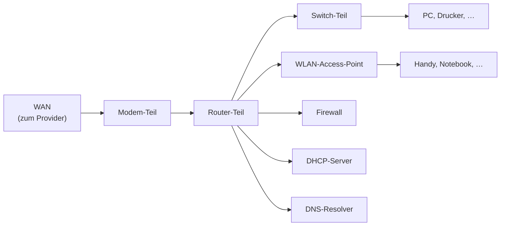
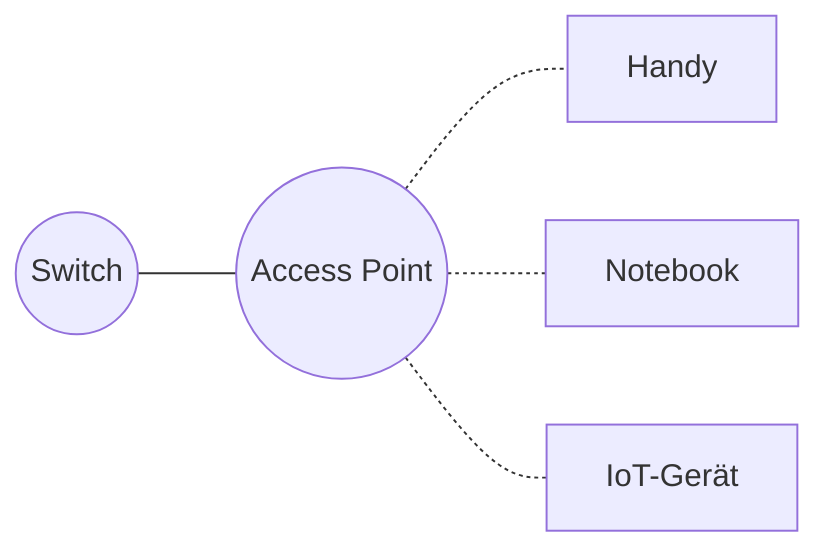
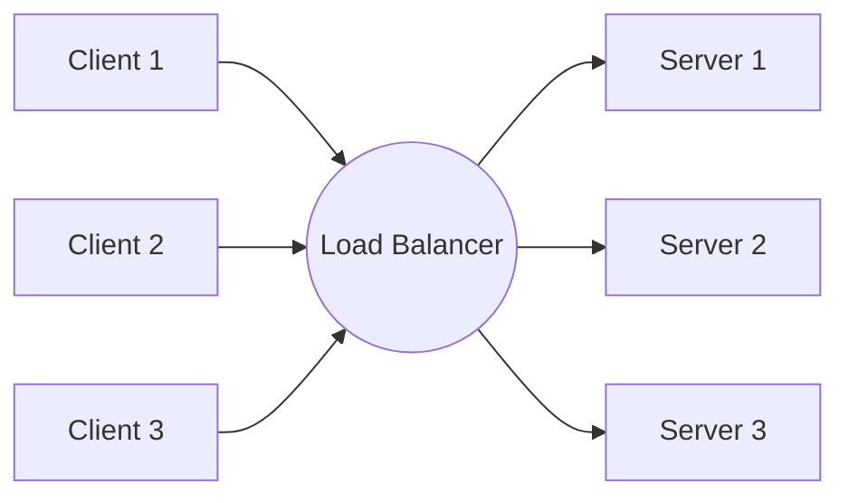
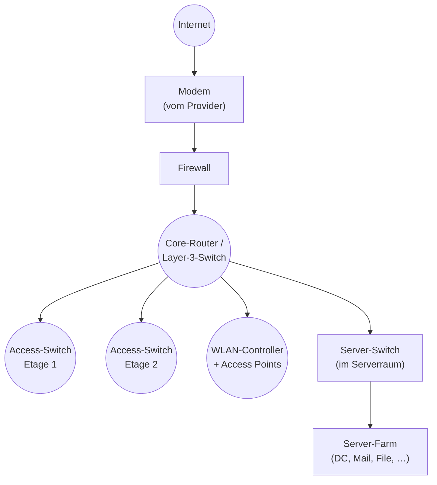

# Netzwerk-Hardware: Switch, Router, Firewall, Access Point

Bisher haben wir über Protokolle und Konzepte gesprochen. Jetzt schauen wir uns die **realen Geräte** an, die das alles ausführen. Wenn du in ein Rechenzentrum gehst oder einen Netzwerkschrank im Büro öffnest, siehst du diese Hardware-Kästen.

!!! abstract "Lernziel"
    Nach dieser Seite kannst du:

    - die wichtigsten **Netzwerk-Hardware-Typen** unterscheiden: Switch, Router, Firewall, Access Point, Modem, Load Balancer, Hub
    - auf welcher **OSI-Schicht** sie jeweils arbeiten
    - in einem **typischen Firmen-Setup** identifizieren, welche Geräte wofür da sind
    - sagen, wann man **Hardware** und wann **Software-Lösungen** für eine Aufgabe nimmt
    - typische **Buzzwords** rund um Hardware einordnen (Layer-3-Switch, Managed/Unmanaged, PoE, …)

---

## Geräte-Übersicht auf einen Blick

Bevor wir ins Detail gehen, die Landkarte:

| Gerät | OSI-Schicht | Hauptaufgabe |
|-------|-------------|--------------|
| **Hub** | 1 | „dummes" Verteilen (veraltet) |
| **Switch** | 2 (manche auch 3) | gezieltes Frame-Weiterleiten im LAN |
| **Router** | 3 | Pakete zwischen Netzen weiterleiten |
| **Firewall** | 3, 4 (manche auch 7) | Pakete filtern |
| **Access Point** | 1, 2 | WLAN-Funkbrücke zum LAN |
| **Modem** | 1 | Konvertiert Signale (z.B. DSL ↔ Ethernet) |
| **Load Balancer** | 4 oder 7 | Verteilt Anfragen auf mehrere Server |
| **Gateway** | unterschiedlich | übergeordneter Begriff (oft Router) |
| **Repeater / Extender** | 1 | Signal verstärken / verlängern |

---

## Hub – das Museum

Ein **Hub** ist die einfachste (und längst überholte) Form. Er nimmt ein Frame an einem Port entgegen und schickt es **stupide an alle anderen Ports**.

**Probleme:**

- **Ineffizient**: zehnfacher Traffic
- **Unsicher**: jeder kann mitlesen
- **Kollisionen**: wenn zwei gleichzeitig senden, muss neu gesendet werden

**Heute** sind Hubs **komplett verschwunden** – jeder „Hub" am Markt ist faktisch ein Switch. Sie tauchen nur noch in alten Schulbüchern oder in Industrie-Anlagen aus den 1990er-Jahren auf.

---

## Switch – das Pferd des LANs

Der **Switch** ist das **wichtigste LAN-Gerät**. Er arbeitet auf **Layer 2** mit MAC-Adressen und sorgt dafür, dass Frames **gezielt** an den richtigen Empfänger gehen.

Mehr zur Funktionsweise: [Routing und Switching](routing-und-switching.md).

<figure markdown="span">
{ loading=lazy }
<figcaption>Ein Switch mit seinen Ethernet-Ports – jedes Patchkabel führt zu genau einem Gerät im LAN.Foto: User_Pascal / Unsplash</figcaption>
</figure>

### Switch-Klassen

| Typ | Was er kann | Wo eingesetzt |
|-----|-------------|---------------|
| **Unmanaged Switch** | Plug-and-Play, keine Konfiguration | Heim, kleines Büro |
| **Managed Switch** | VLAN, QoS, Spanning Tree, Port-Konfiguration | Firmen-Netze, Server-Räume |
| **Layer-3-Switch** | wie Managed + Routing-Fähigkeiten | mittlere/große Firmen, Datacenter |
| **Industrial Switch** | robust, Lüfter-los, weite Temperatur, redundant | Produktionshallen, Outdoor |

**Im Berufsalltag** sind die meisten Switches in Firmen **managed**, und in Rechenzentren oft **Layer-3** mit hoher Port-Dichte (24, 48 oder mehr Ports, oft inkl. 10-Gbit/s).

### Port-Geschwindigkeiten

| Standard | Geschwindigkeit | Wo eingesetzt |
|----------|-----------------|---------------|
| **Fast Ethernet** (100BASE-TX) | 100 Mbit/s | alt, kaum noch verbaut |
| **Gigabit Ethernet** | 1 Gbit/s | Standard heute |
| **2.5 GbE / 5 GbE** | 2,5 / 5 Gbit/s | neuer Standard für moderne Heim-/Office-Netze |
| **10 GbE** | 10 Gbit/s | Server-Räume, Backbone |
| **25, 40, 100, 400 GbE** | bis 400 Gbit/s | Rechenzentrums-Backbone, Cloud-Provider |

Standardmäßig haben Switches eine Mischung – z.B. 24× 1 Gbit/s plus 2× 10 Gbit/s Uplink-Ports.

### PoE – Power over Ethernet

Manche Switches können **Strom über das Netzwerkkabel** liefern. Das ist sehr praktisch für Geräte, die kein eigenes Netzteil brauchen sollen:

- **VoIP-Telefone**
- **WLAN-Access-Points**
- **IP-Kameras**
- **kleine IoT-Geräte**

PoE gibt's in mehreren Klassen (Type 1: 15 W, Type 4 / PoE++: bis ~90 W am Switch-Port (~71 W am Gerät)). Bei der Planung musst du das Gesamt-Watt-Budget des Switches im Auge behalten.

---

## Router – das Tor zur Welt

Ein **Router** arbeitet auf **Layer 3** mit IP-Adressen. Er entscheidet, **zu welchem Netz** ein Paket muss.

Mehr Details: [Routing und Switching](routing-und-switching.md).

### Router-Klassen

| Klasse | Anwendung |
|--------|-----------|
| **Heim-Router** (Fritzbox, Speedport) | LAN + WLAN + Modem + Firewall, alles in einem |
| **Branch-Router** | für kleine Filialen, oft mit VPN-Funktion |
| **Core-Router** | Hochleistungs-Router im Datacenter oder bei Providern |
| **ISP-Router** | bei Internet-Service-Providern, mit BGP-Fähigkeit |

### Heim-Router – die Multifunktions-Box

Die typische Fritzbox ist eigentlich **mehrere Geräte in einem**:

In **professionellen Setups** sind diese Funktionen auf **getrennte Geräte** verteilt:

- ein dedizierter **Router** (kein Switch-Teil)
- ein oder mehrere **Switches** mit vielen Ports
- separate **Access Points** verteilt im Gebäude
- eine separate **Firewall** als Sicherheitsschicht
- ein dedizierter **DHCP-/DNS-Server**

So bekommt man **mehr Leistung, mehr Kontrolle und bessere Ausfallsicherheit**.

---

## Firewall – der Türsteher

Eine **Firewall** filtert Netzwerk-Verkehr nach Regeln: was darf rein, was darf raus, was darf wohin? Sie kann **Hardware** oder **Software** sein.

Mehr im Detail: [Netzwerk-Sicherheit](netzwerk-sicherheit.md).

### Firewall-Typen nach Schicht

| Typ | Schicht | Filtert nach |
|-----|---------|--------------|
| **Paketfilter-Firewall** | 3, 4 | IP-Adresse, Port |
| **Stateful Firewall** | 3, 4 | wie oben, **plus** Verbindungs-Zustand |
| **Application Firewall / WAF** | 7 | versteht HTTP-Inhalte, kann SQL-Injection erkennen |
| **Next-Generation Firewall (NGFW)** | 3, 4, 7 | Kombiniert alles oben + DPI (Deep Packet Inspection) + IPS |

### Hardware-Firewall vs. Software-Firewall

- **Hardware-Firewall**: dediziertes Gerät vor dem Netz (z.B. Fortinet, Palo Alto, Sophos). Sehr leistungsfähig.
- **Software-Firewall**: auf einem Server oder PC installiert. Windows Defender Firewall, iptables/nftables auf Linux.
- **Cloud-Firewall**: bei AWS, Azure, Google Cloud als Service (Security Groups, NACLs).

Im **Heim-Netz** ist die Firewall im Router meist ausreichend. In **Firmen** gibt es typischerweise eine **Perimeter-Firewall** zum Internet plus **Host-Firewalls** auf jedem Server.

---

## Access Point (AP) – die WLAN-Brücke

Ein **Access Point** stellt **WLAN bereit** und verbindet drahtlose Geräte mit dem kabelgebundenen LAN. Er arbeitet auf **Layer 1 + 2**.

### Wichtige WLAN-Standards

| Standard | Anderer Name | Frequenz | Max-Speed (theoretisch) |
|----------|--------------|----------|-------------------------|
| **Wi-Fi 4** | 802.11n | 2,4 + 5 GHz | 600 Mbit/s |
| **Wi-Fi 5** | 802.11ac | 5 GHz | ca. 3,5 Gbit/s |
| **Wi-Fi 6** | 802.11ax | 2,4 + 5 GHz | 9,6 Gbit/s |
| **Wi-Fi 6E** | 802.11ax + 6 GHz | + 6 GHz | wie Wi-Fi 6, aber mit freiem 6-GHz-Band |
| **Wi-Fi 7** | 802.11be | 2,4 + 5 + 6 GHz | ca. 46 Gbit/s |

**In der Praxis** erreichst du nie die theoretische Geschwindigkeit – Wände, Interferenz, Abstand und die Geschwindigkeit der einzelnen Clients begrenzen.

### Frequenz-Bänder

- **2,4 GHz**: weite Reichweite, aber überlaufen (auch Bluetooth, Microwellen, alte WLANs nutzen es)
- **5 GHz**: kürzere Reichweite, aber höhere Bandbreite und weniger Interferenz
- **6 GHz**: neueste Band, fast leer, hohe Bandbreite, aber kürzere Reichweite

### Mehrere APs: Roaming, Mesh, Controller

In Firmen oder größeren Gebäuden braucht man **mehrere APs**. Damit Geräte sich nahtlos zwischen ihnen bewegen können:

- **Roaming**: das Gerät wechselt selbst von AP A zu AP B – setzt sauber konfigurierte APs voraus
- **Mesh** (z.B. Fritzbox Mesh, Eero, Google Nest WiFi): mehrere APs verbinden sich untereinander, oft drahtlos
- **WLAN-Controller**: zentrale Verwaltung dutzender/hunderter APs (Cisco Meraki, Ubiquiti UniFi, Aruba)

---

## Modem – der Signalwandler

Ein **Modem** (kurz für **Modulator/Demodulator**) wandelt das **Signal**, das dein Provider liefert, in **Ethernet** um.

- **DSL-Modem** für Kupfer-Telefonleitung
- **Kabel-Modem** für Koax-TV-Anschluss
- **Glasfaser-Modem** (ONT) für Glasfaser
- **LTE-/5G-Modem** für mobiles Internet

In modernen Heim-Routern (Fritzbox & Co.) ist das Modem **integriert**. In Firmen-Setups ist das Modem oft ein **separates Gerät**, das vom Provider gestellt wird, dahinter dein eigener Router.

---

## Load Balancer – Verkehrs-Verteiler

Ein **Load Balancer** verteilt eingehende Verbindungen auf **mehrere Server**.

**Warum?**

- **Skalierung**: mehr Last als ein Server bewältigt
- **Ausfallsicherheit**: fällt ein Server aus, übernimmt der andere
- **Wartungs-Freundlichkeit**: einen Server in Wartung nehmen, ohne Downtime

### Layer 4 vs. Layer 7 Load Balancer

| Typ | Arbeitsweise | Vorteile |
|-----|--------------|----------|
| **Layer 4** (TCP/UDP) | verteilt anhand IP+Port | schnell, einfach |
| **Layer 7** (HTTP) | versteht den HTTP-Verkehr, kann z.B. nach URL routen | flexibler, kann Cookies/Sticky-Sessions |

**Beispiele für Software-Load-Balancer:**

- **HAProxy**, **Nginx**, **Envoy** (alle Layer 4/7)
- **Cloud-Load-Balancer**: AWS ELB, Azure Load Balancer, Google Cloud Load Balancer

**Hardware-Load-Balancer** (F5, Citrix) sind teuer, aber sehr leistungsfähig – heute eher in großen Unternehmen.

---

## Gateway – das Wort mit vielen Bedeutungen

„Gateway" ist ein **Sammelbegriff**. Was genau gemeint ist, hängt vom Kontext ab:

| Kontext | Bedeutung |
|---------|-----------|
| **Default Gateway** | die IP-Adresse des Routers, an den dein Computer alles schickt, was nicht im LAN ist |
| **VPN-Gateway** | Endpunkt eines VPN-Tunnels |
| **Application-Gateway** | Layer-7-Proxy, oft mit Firewall-Funktion |
| **IoT-Gateway** | Bindeglied zwischen IoT-Geräten (z.B. Zigbee) und IP-Netzwerk |

Wenn du „Gateway" hörst, frag nach: welches genau ist gemeint?

---

## Repeater, Extender, Mediakonverter

Drei Klein-Geräte, die im Alltag vorkommen können:

### Repeater / Extender

**Verlängert** ein Signal. Klassisch bei WLAN, wenn die Reichweite nicht ausreicht. Sind bequem, aber meist:

- halbieren die Bandbreite (weil sie auf demselben Kanal senden und empfangen)
- erhöhen die Latenz

In gut geplanten Netzen nimmt man stattdessen lieber **zusätzliche APs**, die per Ethernet angebunden sind („Wired Backhaul").

### Mediakonverter

Wandelt ein Medium in ein anderes – z.B. **Glasfaser zu Twisted-Pair-Kupfer**. Wird gebraucht, wenn ein Switch nur Kupfer-Ports hat, aber ein Glasfaser-Kabel ankommt.

### SFP-Module

Statt eines fertigen Mediakonverters haben moderne Switches **SFP-/SFP+-Slots** – kleine Steckmodule, in die du ein Glasfaser- oder Kupfer-Transceiver steckst. Sehr flexibel.

---

## Typisches Firmen-Setup

Damit du das zusammen siehst, ein typisches Layout für eine kleine Firma (50 Mitarbeiter):

- **Modem** kommt vom Provider, bringt das Internet rein.
- **Firewall** ist die Sicherheitsschicht: erlaubt nur, was wirklich rein/raus soll.
- **Core-Router/Switch** ist die Mitte des Netzes, verbindet alle Bereiche.
- **Access-Switches** pro Etage sammeln die Endgeräte ein.
- **WLAN-Controller** managt zentral alle Access Points.
- **Server-Switch** hat hohe Port-Geschwindigkeit (10/25 Gbit/s) für Datacenter-Traffic.

In **größeren Firmen** wird das mehrfach redundant aufgebaut, mit zwei Routern, zwei Firewalls, Cluster-Switches.

---

## Speicher im Netzwerk: SAN, NAS und iSCSI

Server und Anwendungen brauchen Speicher. Den kann man **direkt im Server** verbauen (DAS – Direct Attached Storage), oder man **bindet Speicher über das Netzwerk an**. Letzteres ist im professionellen Umfeld der Normalfall.

### NAS – Network Attached Storage

Ein **NAS** ist ein Gerät, das Dateien (z.B. PDFs, Videos, Office-Dokumente) **über das Netzwerk freigibt**. Klingt einfach, ist es auch.

- Typische Protokolle: **SMB** (Windows), **NFS** (Unix/Linux), **AFP** (Apple, veraltet)
- Du siehst es als **gemounteten Ordner** oder Netzlaufwerk
- Bekannte Anbieter: Synology, QNAP, NetApp

**Wofür?** Klassische Datei-Freigaben: Firmenlaufwerk, Backup-Ziel, Foto-Archiv.

### SAN – Storage Area Network

Ein **SAN** ist etwas anderes: hier wird Speicher **blockweise** über das Netzwerk angeboten, **nicht** als Datei.

- Der Server sieht eine **virtuelle Festplatte**, als wäre sie lokal eingebaut
- Erst der Server entscheidet, wie er sie formatiert (NTFS, ext4, ZFS, …)
- Sehr hohe Performance, oft mit dedizierten Glasfaser-Netzen
- Typische Protokolle: **Fibre Channel** (FC), **FCoE**, **iSCSI** (siehe unten)

**Wofür?** Datenbanken, Virtualisierungs-Cluster, alles wo viele schnelle Zugriffe nötig sind.

### iSCSI – SAN über normales Ethernet

**iSCSI** (Internet Small Computer System Interface) bringt SAN-artigen Blockspeicher über **normales TCP/IP-Netzwerk**, statt über teure Glasfaser-FC-Hardware.

- läuft typisch auf **Port 3260**
- Funktioniert über jedes Standard-Ethernet, im Idealfall mit dediziertem 10-Gbit/s-Netz
- Sehr verbreitet in kleineren Rechenzentren, weil deutlich günstiger als FC

### NAS vs. SAN – das wichtigste Unterscheidungsmerkmal

| Aspekt | NAS | SAN |
|--------|-----|-----|
| **Was wird angeboten?** | ganze Dateien | rohe Blöcke |
| **Wie sieht es der Server?** | als Netzlaufwerk / gemounteter Ordner | wie eine eingebaute Festplatte |
| **Typische Nutzung** | File-Sharing, Backups | Datenbanken, Virtualisierungs-Cluster |
| **Performance** | gut, aber durch Datei-System-Overhead begrenzt | sehr hoch |
| **Komplexität** | gering | hoch |

!!! info "Hyperkonvergente Infrastruktur (HCI) – der moderne Trend"
    In modernen Rechenzentren verschwimmen die Grenzen. **HCI-Systeme** (z.B. VMware vSAN, Nutanix) kombinieren Compute, Storage und Netzwerk auf denselben Knoten. Statt eines separaten SAN nutzen alle Server lokal verbaute SSDs, die sich über das Netzwerk **gegenseitig spiegeln** und ein virtuelles SAN bilden. Sehr flexibel, sehr beliebt, aber komplex zu betreiben.

---

## Hardware vs. Software – wo ist die Grenze?

Vieles, was früher in dedizierter Hardware lief, läuft heute auch als **Software** auf normalen Servern:

| Aufgabe | Klassisch | Heute auch |
|---------|-----------|------------|
| Firewall | Hardware-Firewall | iptables, pfSense, OPNsense (Software) |
| Router | Hardware-Router | VyOS, Mikrotik, Cumulus Linux |
| Load Balancer | F5, Citrix | HAProxy, Nginx, Envoy |
| Switch | Hardware-Switch | virtuelle Switches (Open vSwitch, vSphere DVS) |

**Trends:**

- **SDN (Software Defined Networking)**: das ganze Netzwerk wird per Software gesteuert
- **NFV (Network Function Virtualization)**: Netzwerkfunktionen als VM oder Container

Für **kleine Setups** kann ein Mini-PC mit pfSense alles ersetzen, was früher als teure Hardware-Firewall verkauft wurde. Für **Hochleistungs-Szenarien** ist dedizierte Hardware oft trotzdem unvermeidlich, weil Software-Lösungen bei sehr hohen Paketraten nicht mithalten.

---

## Was du jetzt wissen solltest

- **Hub:** tot. Veraltet, nicht mehr in Verwendung.
- **Switch:** das Pferd im LAN, arbeitet auf Layer 2 mit MAC-Adressen. **Managed Switches** in Firmen, **Layer-3-Switches** in größeren Setups.
- **Router:** verbindet Netze, arbeitet auf Layer 3. Heim-Router sind Multifunktionsgeräte (Router + Switch + AP + Firewall + Modem).
- **Firewall:** filtert Verkehr. Es gibt Paketfilter, Stateful, WAF (Layer 7) und NGFW (alles kombiniert).
- **Access Point:** stellt WLAN bereit. Wi-Fi 6/6E/7 sind aktuell, mehrere APs brauchen Roaming oder einen Controller.
- **Modem:** wandelt das Provider-Signal in Ethernet (oft im Router integriert).
- **Load Balancer:** verteilt Anfragen auf mehrere Server. Layer 4 oder Layer 7.
- **Gateway:** Sammelbegriff – immer kontextabhängig.
- Vieles davon gibt es heute auch als **Software** – aber für sehr hohe Leistung bleibt Hardware oft Pflicht.

---

## Beispielfragen zur Selbstkontrolle

??? question "Frage 1: Du planst die Netzwerk-Infrastruktur für ein Bürogebäude mit 80 Mitarbeitern auf drei Etagen. Was wählst du an Hardware?"
    Typische Auslegung:

    - **Pro Etage** ein **Access-Switch** mit ~24–48 Ports, PoE-fähig (für Telefone, APs, IP-Kameras)
    - **Im Serverraum** ein **Core-Switch** (oder Layer-3-Switch), an dem die Etagen-Switches sternförmig hängen
    - **Mehrere Access Points** pro Etage, zentral verwaltet über einen WLAN-Controller
    - **Firewall** als Perimeter zum Internet
    - **Router/Modem** vom Provider mit getrennter Anbindung
    - **Patch-Panel** und **strukturierte Verkabelung** (Cat6 oder Cat6a für 10 Gbit/s zukunftssicher)

    Verbindung Access-Switch ↔ Core über **Glasfaser** (10 Gbit/s) für genug Durchsatz.

??? question "Frage 2: Worin unterscheidet sich NAS von SAN, und wann nimmst du was?"
    **NAS** (Network Attached Storage): bietet **Dateien** über das Netz (SMB, NFS). Sieht aus wie ein Netzlaufwerk. **Wofür?** Datei-Freigaben, Backups, Archive.

    **SAN** (Storage Area Network): bietet **rohe Blöcke** über das Netz (Fibre Channel oder iSCSI). Sieht aus wie eine eingebaute Festplatte. **Wofür?** Datenbanken, Virtualisierungs-Cluster, hohe Performance-Anforderungen.

    Faustregel: **NAS für Menschen** (Datei-Zugriff), **SAN für Server** (Performance).

??? question "Frage 3: Du sollst entscheiden, ob Hardware-Firewall oder Software-Firewall (z.B. pfSense auf eigener Hardware). Welche Aspekte sprechen wofür?"
    **Hardware-Firewall** (Fortinet, Palo Alto, Sophos):

    - sehr hohe Performance, dedizierte ASICs
    - Hersteller-Support
    - oft Pflicht in regulierten Branchen
    - **teurer**, Lizenzkosten

    **Software-Firewall** (pfSense, OPNsense, Linux-iptables):

    - flexibel, läuft auf Standard-Hardware
    - kostengünstig (oft Open Source)
    - Performance reicht für kleine bis mittlere Netze
    - **mehr Eigen-Verantwortung** bei Konfiguration und Pflege

    Faustregel: kleine Firmen kommen mit Software-Lösungen sehr weit, große Firmen wollen Vendor-Support und entscheiden für Hardware.

??? question "Frage 4: Ein Access Point überträgt laut Datenblatt 'bis zu 9,6 Gbit/s'. Warum erreichst du diesen Wert in der Praxis nie?"
    Die Datenblatt-Angabe ist die **theoretische Brutto-Geschwindigkeit** unter Idealbedingungen: Sichtkontakt, kein Interferenz-Störer, alle Antennen optimal genutzt, ein Client mit Maximal-Standard.

    Realität:

    - Wände, Möbel, Türen dämpfen das Signal
    - andere Netze auf demselben Kanal stören
    - die Geschwindigkeit teilen sich **alle Clients** im AP
    - der schwächste Client begrenzt oft das ganze WLAN
    - **WLAN ist halbduplex** – nur einer kann zur gleichen Zeit auf einem Kanal senden

    Praktische Faustregel: rechne mit **20–30 %** der Datenblatt-Werte unter realen Bedingungen.

---

## Merksatz

!!! success "Merksatz"
    > **Switch macht Layer 2, Router macht Layer 3, Firewall filtert auf 3/4/7. Access Point macht WLAN, Modem wandelt Signale. Heim-Router ist alles in einem, Firma trennt das auf separate Geräte. Managed > Unmanaged. PoE versorgt Telefone, APs und Kameras über das Netzwerkkabel mit Strom. Hardware ist schnell, Software ist flexibel.**

---

## Weiterlesen

- [Segmentierung und VPN](segmentierung-und-vpn.md): wie diese Geräte zusammen Netze logisch trennen
- [Netzwerk-Sicherheit](netzwerk-sicherheit.md): die Rolle der Firewall im Detail
- [Routing und Switching](routing-und-switching.md): wie Switch und Router intern entscheiden
