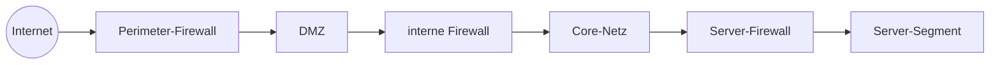
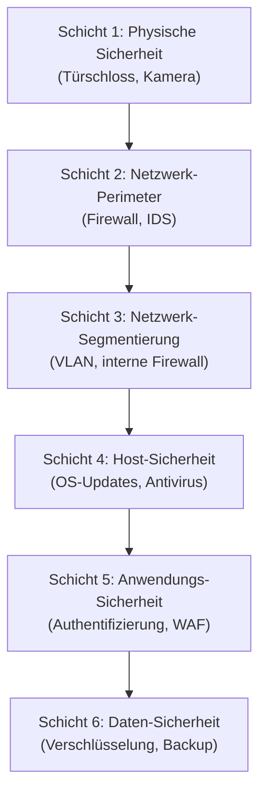

# Netzwerk-Sicherheit: Firewall, IDS/IPS, Zero Trust

Ein Netzwerk ohne Sicherheits-Konzept ist eine Tür, die jeder aufmachen kann. **Sicherheit** ist deshalb kein Anhängsel, sondern eine **Querschnittsdisziplin**, die in jedem anderen Teil dieses Blocks mitschwingt. Diese Seite gibt dir die wichtigsten Konzepte, mit denen du Netze gegen Angriffe schützt.

Wichtig: das hier ist eine **Übersicht**, keine vollständige Sicherheits-Schulung. Wer als Sicherheits-Spezialist arbeiten will, geht später in den eigenen Block **„IT-Sicherheit"** rein. Hier lernst du, was du als Systemintegrator über **Netzwerk-Sicherheit** wissen musst.

!!! abstract "Lernziel"
    Nach dieser Seite kannst du:

    - die **drei Säulen der IT-Sicherheit** (CIA – Confidentiality, Integrity, Availability) benennen
    - **Firewall-Typen** (Paketfilter, Stateful, Application, NGFW) unterscheiden
    - die Unterschiede zwischen **IDS** und **IPS** erklären
    - das Konzept **Defense in Depth** in eigenen Worten beschreiben
    - **Zero Trust** als modernes Sicherheits-Modell einordnen
    - typische **Netzwerk-Angriffe** (Man-in-the-Middle, DDoS, ARP-Spoofing) benennen und die Schutzmaßnahmen kennen

---

## Die drei Säulen: CIA

In der IT-Sicherheit dreht sich alles um **drei Schutzziele**, abgekürzt als **CIA**:

| Säule | Bedeutung | Beispiel |
|-------|-----------|----------|
| **Confidentiality** | Vertraulichkeit | nur Berechtigte sehen die Daten |
| **Integrity** | Integrität | Daten werden nicht unbemerkt verändert |
| **Availability** | Verfügbarkeit | Daten sind, wenn sie gebraucht werden, da |

Wenn nur eine dieser Säulen fällt, ist der Schutz hinfällig. Sicherheit denkt deshalb immer in **allen drei** Dimensionen.

In der **OT-Welt** (Industrie) kommt eine vierte Säule dazu: **Safety** – der Schutz von **Personen**. Wenn eine Anlage Menschen gefährden kann, hat Safety oberste Priorität, noch vor Verfügbarkeit.

---

## Firewalls – die erste Verteidigungslinie

Eine **Firewall** entscheidet nach Regeln, **welcher Verkehr** ein Netz passieren darf. Die Regeln sind typischerweise eine Liste von Bedingungen:

```text
ERLAUBE:  von 192.168.1.0/24  zu  beliebig  Port 443 (HTTPS)
ERLAUBE:  von beliebig         zu  10.0.0.5  Port 22 (SSH) wenn aus 192.168.10.0/24
VERBIETE: von beliebig         zu  beliebig  Port 23 (Telnet)
VERBIETE: alles andere
```

Eine gute Firewall folgt dem **Default-Deny-Prinzip**: alles, was nicht explizit erlaubt ist, wird abgelehnt.

### Firewall-Typen nach Schicht

Wir haben sie schon in [Netzwerk-Hardware](netzwerk-hardware.md) gesehen. Hier nochmal vertieft:

#### Paketfilter (Layer 3/4)

Schaut nur die Header an: Quell-IP, Ziel-IP, Quell-Port, Ziel-Port, Protokoll.

- **Vorteile:** sehr schnell, kostengünstig
- **Nachteile:** keine Kontext-Information, kann z.B. nicht erkennen, ob eine TCP-Verbindung aktiv aufgebaut wurde

#### Stateful Firewall (Layer 3/4)

Wie Paketfilter, aber sie führt eine **Verbindungs-Tabelle**: „Diese TCP-Verbindung wurde von innen nach außen aufgebaut, daher dürfen Antworten zurückkommen."

- **Vorteile:** schützt vor vielen Angriffen, die Paketfilter durchlassen
- **Nachteile:** mehr Speicher- und CPU-Bedarf

**Heute Standard.** Praktisch jede Firewall, die du kaufen kannst, ist stateful.

#### Application-Layer Firewall (Layer 7) / WAF

Versteht den **Inhalt** der Protokolle – z.B. HTTP-Verkehr. Kann gezielt Angriffe wie **SQL-Injection** oder **Cross-Site-Scripting** erkennen.

- **Vorteile:** sehr feine Kontrolle, kann Anwendungs-spezifische Angriffe abfangen
- **Nachteile:** komplexer, langsamer, Regelpflege aufwändig

**Eine WAF** (Web Application Firewall) ist eine spezielle Application Firewall vor Web-Servern. Beispiele: **Cloudflare**, **AWS WAF**, **ModSecurity** vor Nginx oder Apache.

#### Next-Generation Firewall (NGFW)

Kombiniert alles oben **plus**:

- **Deep Packet Inspection (DPI)**: schaut auch den Nutzlast-Inhalt an
- **Intrusion Prevention** (siehe gleich)
- **TLS-Inspection**: bricht verschlüsselte Verbindungen auf, prüft, packt wieder ein
- **Bekannte Bedrohungs-Datenbank**: Signaturen von Malware
- **User-Identifikation**: nicht nur „IP X darf", sondern „User Anna darf"

Hersteller: **Palo Alto**, **Fortinet**, **Check Point**, **Cisco Firepower**, **Sophos XG**, **Sonicwall**.

### Wo Firewalls platziert werden

Eine durchdachte Architektur hat **mehrere Firewalls** an verschiedenen Stellen:



Pro Schicht ein Filter. Wer eine Schicht durchbricht, steht vor der nächsten. Das nennt sich **Defense in Depth** – mehr dazu gleich.

---

## IDS und IPS

Eine Firewall **erlaubt oder verbietet**. Sie merkt sich nicht, ob jemand **versucht hat anzugreifen**. Das machen **IDS** und **IPS**.

### IDS – Intrusion Detection System

**Erkennt Angriffe** und **alarmiert**. Es greift selbst **nicht ein**.

- läuft passiv (oft mit einem Mirror-Port am Switch, sieht den Verkehr nur, ohne zu beeinflussen)
- gibt Alarm, wenn verdächtige Muster auftreten
- die Konsequenz zieht ein **Security-Team** oder ein **SIEM** (Security Information and Event Management)

### IPS – Intrusion Prevention System

**Erkennt Angriffe** und **blockiert** sie.

- sitzt aktiv im Datenfluss
- kann Pakete verwerfen, Verbindungen abbrechen, IPs sperren
- ist Bestandteil moderner NGFWs

### Wie erkennen IDS/IPS Angriffe?

Zwei Hauptansätze:

| Ansatz | Wie es funktioniert | Stärke | Schwäche |
|--------|---------------------|--------|----------|
| **Signatur-basiert** | wie ein Virenscanner: bekannte Angriffsmuster werden erkannt | sehr zuverlässig bei bekannten Angriffen | erkennt keine **neuen** Angriffe (Zero-Days) |
| **Anomalie-basiert** | lernt „normales" Verhalten und erkennt Abweichungen | kann Zero-Days erkennen | viele **False Positives** (Fehlalarme) |

Moderne Systeme **kombinieren** beide Ansätze, oft erweitert um Machine Learning.

### Bekannte Open-Source-Lösungen

- **Snort** – der Klassiker, sehr verbreitet
- **Suricata** – modernerer Nachfolger, multi-threaded
- **Zeek** (früher Bro) – stärker auf Netzwerk-Analyse als auf reine Erkennung

---

## Defense in Depth – mehrere Schichten

Das **Defense-in-Depth-Prinzip** sagt: **vertraue nicht einer einzigen Schutzmaßnahme**. Baue **mehrere Schichten** auf, sodass jede die nächste schützt.



Wenn ein Angreifer Schicht 2 (Perimeter-Firewall) durchbricht, steht er noch vor Schicht 3 (Segmentierung). Schafft er die auch, vor Schicht 4 (Host-Härtung). Und so weiter. Bis er aufgibt oder gefasst wird.

!!! tip "Zwiebel-Analogie"
    Defense in Depth ist wie eine **Zwiebel**. Mehrere Schichten umhüllen den Kern. Wer in den Kern will, muss alle Schichten durchstoßen.

    Das ist anstrengender als nur ein einzelnes Schloss zu knacken – und genau das ist der Sinn.

---

## Zero Trust

Klassische Netzwerk-Sicherheit basiert auf der Idee einer **vertrauenswürdigen Innenwelt** und einer **bösen Außenwelt**. Das Problem: sobald jemand einmal drinnen ist (z.B. ein Mitarbeiter mit gestohlenen Zugangsdaten), kann er sich frei bewegen.

**Zero Trust** dreht die Logik um:

> **Niemand wird vertraut, nur weil er „drinnen" ist. Jede einzelne Verbindung muss sich beweisen.**

### Die Grundprinzipien

1. **Niemals vertrauen, immer prüfen.** Auch ein Server im selben Subnetz muss sich identifizieren.
2. **Least Privilege**: jeder bekommt nur die Rechte, die er wirklich braucht.
3. **Assume Breach**: gehe davon aus, dass Angreifer schon im Netz sind – plane entsprechend.
4. **Mikro-Segmentierung**: nicht „Office-Netz" und „Produktion", sondern feinere Gruppen.
5. **Identitätsbasierte Zugriffskontrolle**: nicht „IP X darf", sondern „User Anna mit Gerät Y und MFA darf".

### Wie das in der Praxis aussieht

- **Multi-Faktor-Authentifizierung (MFA)** überall
- **Single Sign-On (SSO)** mit zentraler Identitätsverwaltung
- **Kontinuierliche Verifikation**: ist das Gerät auf dem aktuellen Patch-Stand? Befindet es sich an einem unüblichen Ort?
- **Verschlüsselung überall**, nicht nur am Perimeter
- **detailliertes Logging** und Anomalie-Erkennung

### Bekannte Zero-Trust-Lösungen

- **Cloudflare Zero Trust**
- **Zscaler**
- **Google BeyondCorp**
- **Microsoft Azure AD Conditional Access**
- **Tailscale** (auf WireGuard-Basis)

Zero Trust ist **kein einzelnes Produkt**, sondern eine **Architektur-Philosophie**. Die Werkzeuge unterstützen, aber die eigentliche Arbeit ist organisatorisch.

---

## Typische Angriffe und Schutzmaßnahmen

Eine Auswahl der Klassiker, die du kennen solltest.

### Man-in-the-Middle (MITM)

Ein Angreifer setzt sich **zwischen** zwei Kommunikations-Partner und liest mit oder verändert die Daten.

**Beispiele:**

- offenes WLAN im Café: Angreifer betreibt einen falschen Access Point mit gleichem Namen
- **ARP-Spoofing** im LAN
- **DNS-Hijacking**: falsche Antworten leiten zu Phishing-Seiten

**Schutz:**

- **HTTPS** überall (verifiziert Server durch Zertifikate)
- **VPN** über unbekannte Netze
- **DNSSEC** für signierte DNS-Antworten
- in der Firma: **802.1X** (Netzwerk-Zugangskontrolle), **ARP Inspection** auf Switches

### DDoS – Distributed Denial of Service

Ein Angreifer überflutet ein Ziel mit so viel Traffic, dass es **nicht mehr antworten** kann.

**Varianten:**

- **Volumetrisch**: einfach massenhaft Pakete
- **Protocol Attacks**: nutzen Schwächen wie SYN-Flood
- **Application Layer**: gezielt teure HTTP-Anfragen

**Schutz:**

- **DDoS-Schutz-Dienste**: Cloudflare, AWS Shield, Akamai
- **Rate Limiting** auf Webservern
- **Anycast-Routing**: die Last verteilt sich auf viele Server weltweit

### ARP-Spoofing

Ein Angreifer im LAN antwortet auf ARP-Requests mit **seiner eigenen MAC** und gibt sich als Gateway aus. Allen Traffic, der eigentlich ans Internet sollte, fängt er ab.

**Schutz:**

- **Dynamic ARP Inspection (DAI)** auf Switches
- **statische ARP-Einträge** bei kritischen Geräten
- **Netzwerk-Zugangskontrolle (NAC, 802.1X)**

### DNS-Hijacking / DNS-Spoofing

Manipulation der DNS-Antworten, sodass `bank.de` plötzlich auf eine Phishing-Seite zeigt.

**Schutz:**

- **DNSSEC**
- **DoH / DoT** (verschlüsselte DNS-Anfragen)
- öffentliche Resolver mit guter Reputation nutzen (`1.1.1.1`, `9.9.9.9`)

### Port-Scanning

Ein Angreifer probiert systematisch durch, welche Ports auf einem Server offen sind, um Schwachstellen zu finden.

**Schutz:**

- **Firewall mit Default-Deny**
- **Fail2Ban** auf Linux-Servern: blockiert IPs mit auffälligem Verhalten
- **IPS** auf der Netzwerk-Ebene

### Brute-Force / Credential Stuffing

Wiederholtes Ausprobieren von Passwörtern.

**Schutz:**

- **Multi-Faktor-Authentifizierung (MFA)**
- **Account-Lockouts** nach mehreren Fehlversuchen
- **starke Passwörter erzwingen**
- **Fail2Ban** und Ähnliches

---

## Verschlüsselung – das Querschnitt-Thema

In modernen Netzen ist **Verschlüsselung der Standard**, nicht die Ausnahme:

| Verschlüsselungs-Lage | Beispiel |
|----------------------|----------|
| **In Transit** | HTTPS (TLS), SSH, VPN, IPsec |
| **At Rest** | Festplatten-Verschlüsselung (BitLocker, LUKS), verschlüsselte Datenbanken |
| **End-to-End** | Signal, ProtonMail – nur Sender und Empfänger können lesen |

**Wichtig zu wissen:**

- **TLS 1.2** und **TLS 1.3** sind aktuell sicher. Alles ältere (SSL 3.0, TLS 1.0, TLS 1.1) gilt als unsicher.
- **Selbstsignierte Zertifikate** sind technisch ok für interne Tests, **niemals** für öffentliche Dienste.
- **Verschlüsselte Verbindungen** schützen vor Mitlesern, nicht vor kompromittierten Endpunkten.

---

## NAC – Network Access Control

**Network Access Control** entscheidet, **wer überhaupt ans Netz darf**.

- **802.1X**: Authentifizierung am Switch-Port. Wer sich nicht ausweisen kann, kommt nicht ins Netz – oder nur in ein **Quarantäne-VLAN**.
- **MAC-Authentifizierung**: nur erlaubte MAC-Adressen kommen rein (schwächere Form).
- **Postur-Checks**: ist das Gerät auf aktuellem Patch-Stand? Läuft Antivirus? Erst dann Zugang.

In Firmen mit hohen Sicherheitsanforderungen Standard. Im Heim-Netz nicht üblich.

---

## SIEM – das zentrale Auge

Ein **SIEM** (Security Information and Event Management) sammelt **Logs aus allen Systemen** an einer Stelle und korreliert sie:

- Firewall-Logs
- Server-Authentifizierungs-Logs
- IDS/IPS-Alarme
- DNS-Anfragen
- Anwendungs-Logs

Ein SIEM erkennt Muster, die in einzelnen Logs nicht auffallen würden. Beispiel: 100 fehlgeschlagene Logins von einer IP, dann ein erfolgreicher → **Brute-Force-Verdacht**.

**Bekannte SIEM-Lösungen:**

- **Splunk** (kommerziell, sehr verbreitet)
- **Elastic Stack** (ELK – Elasticsearch + Logstash + Kibana) – Open Source
- **Microsoft Sentinel** (Cloud-basiert)
- **Wazuh** – Open Source

---

## Was du jetzt wissen solltest

- IT-Sicherheit steht auf drei Säulen: **Confidentiality, Integrity, Availability** (CIA). In der OT kommt **Safety** dazu.
- **Firewalls** filtern nach Regeln; je nach Schicht: Paketfilter, Stateful, Application/WAF, NGFW.
- **IDS** erkennt nur, **IPS** erkennt und blockiert. Signatur-basiert + anomalie-basiert.
- **Defense in Depth**: mehrere Schichten statt einer einzigen Linie.
- **Zero Trust**: niemand wird vertraut, nur weil er „drinnen" ist – jede Verbindung muss sich beweisen.
- Klassische Angriffe: **MITM, DDoS, ARP-Spoofing, DNS-Hijacking, Port-Scanning, Brute-Force**. Jeder hat seine Schutzmaßnahmen.
- **Verschlüsselung** ist heute Standard, in transit und at rest.
- **NAC** entscheidet, wer überhaupt ans Netz darf. **SIEM** sammelt und korreliert alle Sicherheits-Logs.

---

## Merksatz

!!! success "Merksatz"
    > **CIA: Vertraulichkeit, Integrität, Verfügbarkeit. Firewall ist die erste Schicht, IDS/IPS überwacht den Verkehr. Defense in Depth statt einer Linie, Zero Trust statt blindem Vertrauen nach innen. Verschlüsselung überall, MFA für jeden Login. Sicherheit ist kein Produkt, sondern eine Architektur und Kultur.**

---

## Weiterlesen

- [Segmentierung und VPN](segmentierung-und-vpn.md): VLAN, DMZ und Tunneling sind Bausteine der Sicherheit
- [Industrie-Protokolle](industrie-protokolle.md): warum OT-Sicherheit eigene Regeln hat
- [DNS](dns.md): DNSSEC und DoT/DoH als Sicherheits-Erweiterungen
- [Anwendungs-Protokolle](anwendungs-protokolle.md): HTTPS, SSH, SPF/DKIM – die sicheren Versionen
