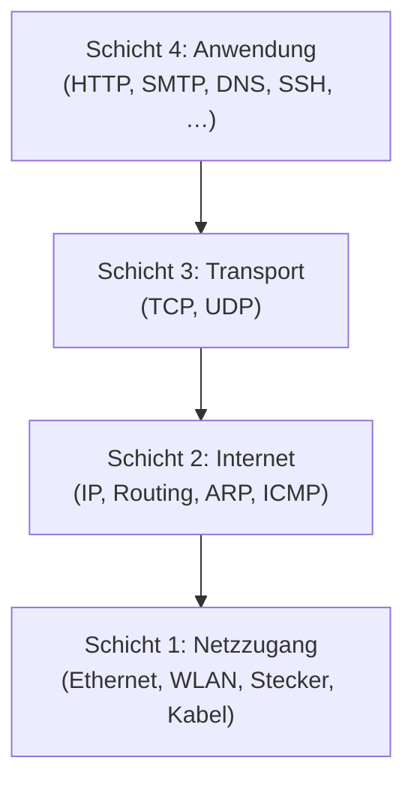

# OSI- und TCP/IP-Modell

Netzwerke sind kompliziert. **Sehr kompliziert.** Damit man nicht in jedem einzelnen Problem ertrinkt, hat man sich zwei Modelle ausgedacht, mit denen wir die Komplexität in **Schichten** zerlegen. Jede Schicht hat eine klare Aufgabe und redet nur mit ihren direkten Nachbarn.

Diese Schichten-Idee ist das **wichtigste Denk-Werkzeug** in der Netzwerktechnik. Wer sie verinnerlicht, kann jedes Netzwerkproblem in zwei Sätzen einordnen.

!!! abstract "Lernziel"
    Nach dieser Seite kannst du:

    - die **sieben Schichten** des OSI-Modells benennen, von 1 bis 7
    - das **vierstufige TCP/IP-Modell** und seinen Bezug zum OSI-Modell erklären
    - sagen, **was auf jeder Schicht passiert** und welche Protokolle dort wohnen
    - die **Post-Analogie** verwenden, um jemandem das OSI-Modell in 60 Sekunden zu erklären
    - bei einem Netzwerk-Problem grob ansprechen, auf **welcher Schicht** es vermutlich liegt

---

## Warum zwei Modelle?

Gleich zur Klarstellung: es gibt **zwei** Schichtenmodelle und beide sind relevant. Du musst beide kennen.

| Modell | Schichten | Wer hat's gemacht? | Heutige Rolle |
|--------|-----------|-------------------|---------------|
| **OSI-Modell** | 7 | ISO (Standardisierungs-Organisation), 1984 | **Theoretisches Referenz-Modell.** Wird im Unterricht, in Büchern und in Prüfungen genutzt. |
| **TCP/IP-Modell** | 4 | praktisch entstanden mit dem Internet | **Das real existierende.** Beschreibt das, was tatsächlich im Internet läuft. |

Verwirrend? Nicht wenn du verstehst, **warum** das so ist.

- Das **OSI-Modell** ist ein theoretisches Ideal-Modell. Es ist sauber durchstrukturiert, aber so feingranular niemals durchgesetzt worden.
- Das **TCP/IP-Modell** ist das, was die Ingenieure beim Bau des Internets tatsächlich umgesetzt haben. Pragmatisch, mit weniger Schichten.

**In der Praxis** redet man bei konkreten Protokollen meistens vom **TCP/IP-Modell**, aber wenn man eine bestimmte Aufgabe in einer Schicht verorten will, nutzt man oft die **OSI-Schichten 1 bis 7** als Vokabular.

!!! tip "Eselsbrücke: „Layer 7" oder „Layer 2""
    Im Berufsjargon hörst du oft Sätze wie „das ist ein Layer-7-Problem" oder „der Switch arbeitet auf Layer 2". Damit ist immer die **OSI-Schicht** gemeint, weil das die feinere Skala ist.

    Die TCP/IP-Schichten werden seltener mit Nummern angesprochen, eher mit Namen („Internet-Schicht", „Transportschicht").

---

## Das OSI-Modell – sieben Schichten

Von **unten nach oben**, weil das die Reihenfolge ist, in der die Daten beim Senden verarbeitet werden.

<figure class="schaubild" markdown="span">
{ loading=lazy }
<figcaption>Das OSI-Referenzmodell – sieben Schichten von unten (physisch) nach oben (anwendungsnah).Bild: Deadlyhappen / <a href="https://commons.wikimedia.org/wiki/File:ISO-OSI-7-Schichten-Modell(in_Deutsch).svg">Wikimedia Commons</a>, CC BY-SA 4.0</figcaption>
</figure>

Merk dir die Reihenfolge **von unten nach oben** – das ist die Reihenfolge, in der die Daten beim Senden verarbeitet werden. Hier jede Schicht im Detail.

### Schicht 1: Physische Schicht (Layer 1)

**Worum es geht:** elektrische Spannungen, Lichtimpulse, Funkwellen – die **physische Übertragung der einzelnen Bits**.

- Was sind die **Stecker-Formen**? (RJ45, Glasfaser-SC, USB-C, …)
- Welche **Spannung** signalisiert eine 0, welche eine 1?
- Welche **Frequenzen** nutzt das WLAN?
- Wie **lang** dürfen Kabel sein?

**Geräte hier:** Kabel, Hub (alt), Repeater, Antenne, Modem.

**Wenn etwas auf Layer 1 kaputt ist:** Kabel beschädigt, Stecker locker, kein Strom am Switch, WLAN-Antenne abgebrochen.

### Schicht 2: Sicherungsschicht (Layer 2)

**Worum es geht:** Bits werden zu **Frames** gebündelt. Diese Schicht sorgt dafür, dass eine **direkte Verbindung** zwischen **zwei Geräten im selben Netz** funktioniert.

- **MAC-Adressen** (Media Access Control) – jede Netzwerkkarte hat eine weltweit eindeutige
- Frame-Format mit Quell- und Ziel-MAC, Nutzdaten, Prüfsumme
- **Fehlererkennung** mit Prüfsummen
- Wenn ein Switch entscheidet, an welchem Port er ein Frame rauslässt: Layer-2-Entscheidung

**Geräte hier:** **Switch**, **Netzwerkkarte** (NIC), **Bridge**.

**Wenn etwas auf Layer 2 kaputt ist:** doppelte MAC-Adressen im Netz, Switch-Loop ohne STP, VLAN falsch konfiguriert.

### Schicht 3: Vermittlungsschicht (Layer 3)

**Worum es geht:** Daten von **einem Netz ins andere** transportieren. Das ist die Schicht, in der das Internet stattfindet.

- **IP-Adressen** (IPv4, IPv6) – logische Adressen, im Gegensatz zur physischen MAC-Adresse
- **Routing-Tabellen**: welcher Weg führt zu welchem Ziel-Netz?
- **Pakete** statt Frames
- Hier wohnen die Protokolle **IP, ICMP** (ping!), **ARP** (sitzt an der Grenze zu Schicht 2: übersetzt IP- in MAC-Adressen, wird nicht geroutet)

**Geräte hier:** **Router**, Layer-3-Switch.

**Wenn etwas auf Layer 3 kaputt ist:** falsche IP-Konfiguration, falsches Default-Gateway, fehlende Route, doppelte IP.

### Schicht 4: Transportschicht (Layer 4)

**Worum es geht:** **Ende-zu-Ende-Kommunikation** zwischen zwei Anwendungen. Diese Schicht sorgt dafür, dass aus einer Verbindung zwischen **zwei Computern** eine Verbindung zwischen **zwei laufenden Programmen** wird.

- **Port-Nummern**: 80 für HTTP, 443 für HTTPS, 22 für SSH, 25 für SMTP, …
- **TCP** – zuverlässig, mit Bestätigung, geordnet
- **UDP** – schnell, ohne Bestätigung, ohne Ordnung
- **Segmente** (TCP) und **Datagramme** (UDP)

**Geräte hier:** klassischerweise keine eigenständigen Layer-4-Geräte (außer Load Balancer). Diese Schicht lebt in der **Software** der Endgeräte.

**Wenn etwas auf Layer 4 kaputt ist:** Port blockiert durch Firewall, Port schon belegt, Anwendung lauscht auf falschem Port.

### Schicht 5: Sitzungsschicht (Layer 5)

**Worum es geht:** **Auf- und Abbau von Sitzungen** zwischen zwei Anwendungen, plus **Synchronisation**.

- Wer macht den Anfang einer Verbindung? Wer beendet sie?
- Wie wird eine **unterbrochene Sitzung wieder aufgenommen**, ohne von vorne anzufangen?
- **Sitzungs-IDs**, z. B. eine TLS-Session (Web-Cookies sind technisch erst Schicht 7)

In der Praxis ist diese Schicht im **TCP/IP-Modell verschmolzen** mit den Schichten 4 und 7. Wenn jemand sagt „Layer 5", meinen viele die Sitzung im logischen Sinn – z.B. eine TLS-Sitzung oder eine TCP-Verbindung.

### Schicht 6: Darstellungsschicht (Layer 6)

**Worum es geht:** **Datenformate und Verschlüsselung**.

- Wird der Text als UTF-8, ASCII oder Latin-1 verschickt?
- Werden Bilder als JPEG, PNG oder GIF kodiert?
- Werden Daten **verschlüsselt** (TLS) oder **komprimiert** (gzip)?

Auch hier ist die Trennung in der Praxis nicht so sauber. **TLS** lebt formal auf Layer 6, in der Praxis sieht man es oft zusammen mit TCP auf Layer 4 oder mit HTTP auf Layer 7.

### Schicht 7: Anwendungsschicht (Layer 7)

**Worum es geht:** die **Anwendung selbst**. Was der Nutzer am Ende sieht und bedient.

- **HTTP/HTTPS** – Web
- **SMTP, IMAP, POP3** – E-Mail
- **FTP, SFTP** – Datei-Übertragung
- **SSH** – Sicherer Login
- **DNS** – Namensauflösung
- **DHCP** – Adressvergabe

**Wenn etwas auf Layer 7 kaputt ist:** Anwendungs-Konfiguration falsch, Webseite gibt HTTP 500 zurück, E-Mail-Server kennt deine Adresse nicht.

---

## Das TCP/IP-Modell – vier Schichten

Das praktische Modell, mit dem das Internet wirklich gebaut wurde:

Du siehst: die TCP/IP-Anwendungsschicht **bündelt** OSI-Schichten 5, 6 und 7. Die TCP/IP-Netzzugangsschicht bündelt OSI-Schichten 1 und 2. Die mittleren beiden Schichten (Transport und Internet) entsprechen exakt OSI 4 und 3.

### Gegenüberstellung

| TCP/IP-Schicht | Entspricht OSI | Beispiel-Protokolle |
|---------------|----------------|---------------------|
| **Anwendung** | 5, 6, 7 | HTTP, HTTPS, SSH, FTP, SMTP, IMAP, DNS, DHCP |
| **Transport** | 4 | TCP, UDP |
| **Internet** | 3 | IP (IPv4 + IPv6), ICMP, ARP |
| **Netzzugang** | 1, 2 | Ethernet, WLAN, PPP, MAC-Adressen, Kabel und Funk |

---

## Die Post-Analogie

Damit das alles greifbar wird, eine durchgängige Analogie. Stell dir vor, du verschickst einen Brief an eine Freundin in Hamburg. So funktioniert das im Postnetz – und genauso (nur abstrakter) im Computernetz.

| OSI-Schicht | Briefpost-Analogie |
|-------------|-------------------|
| **7 – Anwendung** | Du schreibst den eigentlichen **Brief-Text**. „Liebe Anna, …" |
| **6 – Darstellung** | Du **übersetzt** den Brief vielleicht in eine andere Sprache, oder du **verschlüsselst** ihn mit einem geheimen Code |
| **5 – Sitzung** | Du **stellst eine Beziehung** her, indem du regelmäßig schreibst – „Brief 5 von 20 in unserer Korrespondenz" |
| **4 – Transport** | Du wählst **Versandart**: Einschreiben mit Empfangsbestätigung (TCP) oder normale Postkarte (UDP) |
| **3 – Vermittlung** | Du schreibst die **Adresse** drauf: „Anna Müller, Musterstr. 5, 22301 Hamburg" – das ist die IP-Adresse |
| **2 – Sicherung** | Im **Sortierzentrum** kommt eine Sortiernummer drauf: „in den nächsten LKW nach Hamburg" – das ist die MAC-Adresse |
| **1 – Physisch** | Der **LKW fährt** auf der Straße, das **Flugzeug fliegt**. Die physische Bewegung |

Bei jedem **Postzentrum** wird der Brief **ausgepackt** (Frame abgenommen), die nächste Station bestimmt (Routing) und er wird wieder **eingepackt** (neues Frame) und weitergeschickt. Das Paket darin (die IP-Adresse) bleibt aber gleich.

Auf der Empfängerseite läuft alles in umgekehrter Reihenfolge: vom LKW über das Sortierzentrum zum Briefkasten, bis Anna den Text vor der Nase hat.

!!! tip "Encapsulation – das Verpacken auf jeder Schicht"
    Was wir gerade beschrieben haben, heißt im Fachjargon **Encapsulation** („Einkapselung"). Auf jeder Schicht beim Sender wird der bisherige Inhalt in einen weiteren „Umschlag" gepackt – Schicht 4 packt einen TCP-Header drumherum, Schicht 3 einen IP-Header, Schicht 2 einen Ethernet-Header. Beim Empfänger werden die Umschläge wieder Schicht für Schicht entfernt (**Decapsulation**).

---

## Wozu hilft mir das Schicht-Denken?

Das Schichtenmodell ist nicht nur Theorie – es hilft dir **praktisch im Berufsalltag**.

### Beispiel 1: Fehlersuche

„Die Webseite lädt nicht."

Frag dich:

- **Layer 1:** ist das Netzwerkkabel eingesteckt? Leuchtet die LED am Switch?
- **Layer 2:** kommt das Gerät überhaupt im LAN an? Kannst du andere lokale Geräte erreichen?
- **Layer 3:** stimmt die IP-Konfiguration? Erreichst du das **Default-Gateway** mit `ping`?
- **Layer 4:** ist der Ziel-Port erreichbar? Geht `telnet zielserver 443`?
- **Layer 7:** funktioniert der Web-Server? Was sagt sein Log?

Wer von oben nach unten oder von unten nach oben durchgeht, findet die Ursache schneller als jemand, der wild rumprobiert.

### Beispiel 2: Sicherheits-Architektur

Eine **Firewall** kann auf verschiedenen Schichten arbeiten:

- **Layer 3/4-Firewall** (klassisch): filtert nach IP-Adresse und Port. „Erlaube alles von 192.168.1.0/24 zu Port 443."
- **Layer 7-Firewall** (Application Firewall / WAF): versteht den HTTP-Verkehr und kann z.B. einen SQL-Injection-Versuch erkennen.

Welche Schicht du brauchst, hängt von deiner Anforderung ab.

### Beispiel 3: Performance-Analyse

„Die Anwendung ist langsam."

- **Layer 1/2:** Schwacher WLAN-Empfang, Halbduplex-Verbindung?
- **Layer 3:** Routing-Schleife? Zu viele Hops?
- **Layer 4:** Hohe Latenz, viele Retransmissions wegen Paketverlust?
- **Layer 7:** Anwendung selbst lahm, Datenbank überlastet?

Ohne Schicht-Denken weißt du nicht, **wo du anfangen sollst zu messen**.

---

## Wichtige Protokolle pro Schicht (Übersicht)

Eine Mini-Landkarte. Du musst noch nichts davon im Detail kennen – wir behandeln alle wichtigen in eigenen Kapiteln.

| Schicht | Protokoll | Wofür |
|---------|-----------|-------|
| **7 – Anwendung** | **HTTP/HTTPS** | Web |
| **7** | **SMTP, IMAP, POP3** | E-Mail (Versand / Empfang) |
| **7** | **FTP, SFTP** | Datei-Übertragung |
| **7** | **SSH** | Sicherer Login auf entfernte Systeme |
| **7** | **DNS** | Namensauflösung |
| **7** | **DHCP** | Auto-IP-Vergabe |
| **6** | **TLS / SSL** | Verschlüsselung |
| **4 – Transport** | **TCP** | zuverlässige Verbindung |
| **4** | **UDP** | schnelle, unzuverlässige Übertragung |
| **3 – Vermittlung** | **IPv4 / IPv6** | logische Adressierung, Routing |
| **3** | **ICMP** | Diagnose (ping, traceroute) |
| **3** | **ARP** | MAC-Adresse zu IP-Adresse finden |
| **2 – Sicherung** | **Ethernet** | LAN-Frames |
| **2** | **WLAN (802.11)** | drahtlose Frames |
| **1 – Physisch** | – | (Stecker, Spannungen, Funkwellen) |

---

## Was ist ein **Layer-2-Switch**, was ein **Layer-3-Switch**?

Eine häufige Verwirrung:

- Ein **Layer-2-Switch** entscheidet anhand der **MAC-Adresse**, an welchen Port er ein Frame leitet. Klassischer Switch. Sehr schnell.
- Ein **Layer-3-Switch** kann zusätzlich anhand der **IP-Adresse** entscheiden. Faktisch hat er Router-Fähigkeiten in Switch-Form. Schneller als ein klassischer Router, weil er Hardware-Beschleunigung hat.

Im Berufsjargon wird oft einfach „Switch" gesagt, wenn ein Layer-2-Switch gemeint ist und „Router" für alles, was Layer-3-Entscheidungen trifft. Genauer wird's dann in [Netzwerk-Hardware](netzwerk-hardware.md).

---

## Was du jetzt wissen solltest

- Es gibt **zwei Modelle**: OSI (7 Schichten, theoretisch) und TCP/IP (4 Schichten, praktisch).
- **OSI von unten nach oben:** Physisch, Sicherung, Vermittlung, Transport, Sitzung, Darstellung, Anwendung.
- Auf jeder Schicht haben Daten einen anderen Namen (Frame, Paket, Segment) und werden in einen anderen „Umschlag" verpackt (**Encapsulation**).
- Das Schicht-Denken ist deine **Fehlersuch-Schablone** für jedes Netzwerk-Problem.
- Wichtige Schicht-Zuordnungen: **Switch = Layer 2**, **Router = Layer 3**, **TCP/UDP = Layer 4**, **HTTP = Layer 7**.

---

## Beispielfragen zur Selbstkontrolle

??? question "Frage 1: Ein Kollege sagt: 'Mein Netzwerk geht nicht.' Wie gehst du systematisch vor?"
    Schicht für Schicht von unten nach oben:

    - **Layer 1:** Kabel eingesteckt? Leuchtet die LED am Switch und am Gerät?
    - **Layer 2:** Bekommt das Gerät überhaupt ein Frame, eine MAC-Adresse? Im richtigen VLAN?
    - **Layer 3:** Hat es eine IP, ein Default Gateway, einen DNS-Server? Geht `ping`?
    - **Layer 4:** Ist der Ziel-Port erreichbar (`telnet ziel port`)? Blockt eine Firewall?
    - **Layer 7:** Reagiert die Anwendung selbst? Was sagen ihre Logs?

    Wer von unten nach oben durchgeht, findet 80 % aller Probleme im unteren Bereich.

??? question "Frage 2: Wo liegt der Unterschied zwischen einem Layer-2-Switch und einem Layer-3-Switch in der Praxis?"
    Ein **Layer-2-Switch** kann nur **MAC-Adressen** lesen und Frames innerhalb eines Netzes weiterleiten. Er kann **nicht zwischen Subnetzen routen**.

    Ein **Layer-3-Switch** kann zusätzlich **IP-Adressen** lesen und **wie ein Router** zwischen verschiedenen Subnetzen vermitteln. Praktisch ist das eine Switch-Router-Kombination in einem Gerät, oft mit Hardware-Beschleunigung und sehr hoher Performance. In modernen Rechenzentren ersetzt der Layer-3-Switch oft den klassischen Router.

??? question "Frage 3: Eine Anwendung läuft auf dem Server, aber Kunden können sie über das Internet nicht erreichen. Wo könnte das Problem liegen?"
    Mehrere Möglichkeiten in verschiedenen Schichten:

    - **Layer 3:** Default Gateway fehlt am Server, Route fehlt im Router, NAT-Regel im Router falsch
    - **Layer 4:** Firewall blockt den Port, Anwendung lauscht auf falschem Port oder nur auf localhost
    - **Layer 7:** DNS-Eintrag fehlt oder zeigt auf falsche IP, Anwendung gibt 500-Fehler

    Lösung: Schicht für Schicht testen, am Anfang vom Server aus, dann von außen.

??? question "Frage 4: Wofür gibt es überhaupt zwei Modelle (OSI und TCP/IP), wenn doch das eine das andere ersetzt?"
    Sie ersetzen sich nicht – sie ergänzen sich. **OSI** ist das **didaktisch saubere Referenz-Modell** mit sieben Schichten, sehr fein granuliert. Es eignet sich, um Aufgaben präzise zu verorten („das ist ein Layer-4-Problem").

    **TCP/IP** ist das **real existierende Modell** der Praxis. Es hat nur vier Schichten, weil die Ingenieure damals einige der OSI-Schichten zu einer zusammengefasst haben. **Beide Modelle reden über dasselbe Internet** – nur mit anderem Detail-Grad.

    Im Berufsalltag nennst du Schichten mit den OSI-Nummern und Protokolle mit dem TCP/IP-Verständnis. Du brauchst beide.

---

## Merksatz

!!! success "Merksatz"
    > **Sieben Schichten OSI, vier Schichten TCP/IP. Jede Schicht löst genau eine Aufgabe und redet nur mit ihren Nachbarn. Bei jedem Hop wird das Paket aus seinem Umschlag genommen, neu adressiert, wieder eingepackt und weitergeschickt. Wer in Schichten denkt, findet jeden Netzwerkfehler doppelt so schnell.**

---

## Weiterlesen

- [Adressierung](adressierung.md): die konkreten Adressen, die auf Layer 2 (MAC) und Layer 3 (IP) verwendet werden
- [Routing und Switching](routing-und-switching.md): wie Switches und Router die Schichten 2 und 3 in der Praxis bedienen
- [Transport-Protokolle](transport-protokolle.md): TCP und UDP auf Layer 4 im Detail
