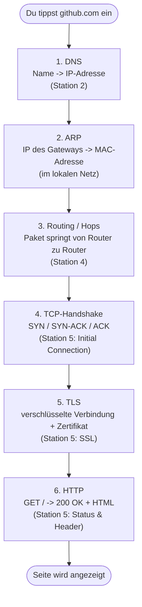

# Praxis: github.com – die Spurensuche

<span class='badge badge-praxis'>Praxis</span> &nbsp; Du tippst jeden Tag `github.com` ein – jetzt schnüffelst du mit eigenen Befehlen heraus, was in der halben Sekunde danach wirklich im Netz passiert.

!!! info "Auf einen Blick"
    - **Dauer:** ca. 45–60 Minuten
    - **Wer:** 2–3 Personen pro Team (geht auch allein)
    - **Material:** dein eigener Rechner + ein Browser – **keine Installation nötig**, alles sind Bordmittel
    - **Voraussetzung:** Du hast [DNS](dns.md), [Transport-Protokolle](transport-protokolle.md) und [Anwendungs-Protokolle](anwendungs-protokolle.md) gelesen.

In den Theorie-Seiten hast du gelesen, *wie* das Internet funktioniert. Jetzt drehst du den Spieß um: Du **misst** es an deinem eigenen Rechner. Am Ende hast du ein ausgefülltes **Reiseprotokoll**, das den kompletten Weg eines Webaufrufs dokumentiert – und du kannst die Leitfrage dieses Blocks aus eigener Erfahrung beantworten.

---

## Dein Auftrag

Du tippst `github.com` in den Browser. Bis die Seite erscheint, läuft im Hintergrund eine erstaunlich lange Kette ab: ein Name wird zur Adresse, Pakete suchen sich einen Weg über viele Zwischenstationen, eine Verbindung wird ausgehandelt und verschlüsselt, dann erst kommen die Daten.

**Eure Mission:** Findet mit eigenen Befehlen jede Station dieser Reise – und tragt eure Messwerte ins **Reiseprotokoll** ganz unten ein. Wer fertig ist, vergleicht mit den anderen Teams: Eure Zahlen werden sich unterscheiden und genau das ist spannend.

!!! tip "Spielregel"
    Erst **selbst probieren**, im Team diskutieren, raten, was die Ausgabe bedeutet. Die [Hilfekarten](#hilfekarten) und die [Lösung](#losung-deutung) gibt's am Ende – erst aufklappen, wenn ihr wirklich feststeckt oder eure Deutung überprüfen wollt.

!!! note "Kein Code, kein Setup"
    Ihr installiert nichts. Jeder der folgenden Befehle ist auf einem normalen Windows-, macOS- oder Linux-Rechner bereits vorhanden. Tippt sie in ein Terminal:

    - **Windows:** Startmenü → `cmd` oder `PowerShell` eintippen → Enter
    - **macOS:** `Terminal.app` (über Spotlight: `Cmd` + `Leertaste`, dann `Terminal` tippen)
    - **Linux:** euer Terminal-Programm (oft `Strg` + `Alt` + `T`)

---

## Station 1: Wo stehe ich?

Bevor wir die Reise zu GitHub antreten, klären wir den **Startpunkt**: Welche Adresse hat dein Rechner gerade? Über welchen Router (das **Gateway**) verlässt du dein Heim- oder Schulnetz? Und welchen **DNS-Server** fragt dein Rechner nach Namen?

=== "Windows"
    ```powershell
    ipconfig
    ```

    Das zeigt deine IP-Adresse und das **Standardgateway**. Für die volle Info – inklusive **DNS-Server** – nimm:

    ```powershell
    ipconfig /all
    ```

=== "macOS / Linux"
    Eigene IP-Adresse anzeigen:

    ```bash
    ip a          # Linux
    ifconfig      # macOS (und ältere Linux-Systeme)
    ```

    Das Gateway (die „Tür ins Internet") findest du in der Routing-Tabelle:

    ```bash
    ip route          # Linux  -> Zeile mit "default via ..."
    netstat -rn       # macOS  -> Zeile "default" in der Spalte Gateway
    ```

    Welchen DNS-Server du nutzt:

    ```bash
    cat /etc/resolv.conf       # Linux (Zeile "nameserver ...")
    scutil --dns | grep nameserver   # macOS
    ```

!!! tip "Mehrere Adapter? Nimm den mit Gateway"
    Moderne Rechner zeigen in `ipconfig` oft mehrere Adapter (WLAN, Ethernet, dazu virtuelle von VirtualBox, Hyper-V oder VPN). **Dein aktiver Adapter ist der, bei dem ein Standardgateway eingetragen ist** – virtuelle Adapter haben meist keins. Auf den beziehst du dich. Schneller Überblick in der PowerShell: `Get-NetIPConfiguration`.

**Was bedeutet das?**

- **Eigene IP** (z.B. `192.168.1.42`): die Adresse deines Rechners **in deinem lokalen Netz**. Meist eine private Adresse, die nur zu Hause/in der Schule gilt.
- **Gateway** (z.B. `192.168.1.1`): dein Router. Alles, was **nicht** im lokalen Netz liegt – also auch GitHub – schickt dein Rechner an diese Adresse. Das Gateway ist deine Tür ins Internet.
- **DNS-Server**: die Adresse, die dein Rechner fragt, um aus `github.com` eine IP zu machen. Oft ist das ebenfalls der Router (`192.168.1.1`), der die Frage dann weiterreicht.

??? question "Notiere für dein Reiseprotokoll"
    - deine eigene IP-Adresse: `____________`
    - dein Gateway: `____________`
    - dein DNS-Server: `____________`

---

## Station 2: Vom Namen zur Adresse (DNS)

Dein Rechner kann nichts mit dem Namen `github.com` anfangen – er braucht eine **IP-Adresse**. Diese Übersetzung macht **DNS** (das Telefonbuch des Internets, siehe [DNS](dns.md)). Fragen wir nach:

=== "Windows"
    ```powershell
    nslookup github.com
    ```

=== "macOS / Linux"
    ```bash
    nslookup github.com
    ```

Die Ausgabe nennt oben den **Server**, der geantwortet hat (dein DNS-Server aus Station 1) und darunter unter **Address** die IP-Adresse(n) von GitHub.

**Bonus** – nach dem Mailserver der Domain fragen (MX-Record):

=== "Windows"
    ```powershell
    nslookup -type=MX github.com
    ```

=== "macOS / Linux"
    ```bash
    nslookup -type=MX github.com
    ```

!!! info "GitHub steckt hinter einem CDN"
    Wundere dich nicht, wenn dein Team eine **andere** GitHub-IP sieht als das Nachbarteam. Große Dienste wie GitHub stehen nicht auf einem einzigen Server, sondern auf vielen – verteilt über die ganze Welt (**CDN** / **Anycast**). DNS gibt dir die IP, die zu deinem Standort am besten passt. Mehr dazu im [Wettbewerb](#wettbewerb).

??? question "Notiere für dein Reiseprotokoll"
    - IP-Adresse(n) von `github.com`: `____________`

---

## Station 3: Ist der Server erreichbar?

Wir haben eine Adresse – aber antwortet dort überhaupt jemand? Der klassische „Lebenszeichen"-Test ist `ping`. Er schickt kleine Pakete (ICMP Echo) und misst, wie lange die Antwort braucht.

=== "Windows"
    ```powershell
    ping github.com
    ```

    (Windows schickt standardmäßig 4 Pakete und hört dann auf.)

=== "macOS / Linux"
    ```bash
    ping -c 4 github.com
    ```

    Das `-c 4` begrenzt auf 4 Pakete – sonst läuft `ping` endlos (Abbruch mit `Strg` + `C`).

Du siehst pro Antwort eine **Zeit in Millisekunden** (`time=…ms`) und am Ende eine Statistik mit Paketverlust.

!!! warning "„Keine Antwort" heißt NICHT automatisch „down"!"
    Viele große Server – auch GitHub kann dazugehören – beantworten **kein** Ping, weil ICMP aus Sicherheitsgründen blockiert wird. Wenn `ping` nur Timeouts (`Request timed out` / `Anfrage-Zeitüberschreitung`) liefert, heißt das **nicht**, dass der Server offline ist. Er kann über HTTPS (Port 443) trotzdem tadellos erreichbar sein – das prüfen wir in [Station 5](#station-5-was-sieht-der-browser-devtools).

    Merke: `ping` testet nur, ob der Server **auf ICMP antwortet** – nicht, ob die Webseite läuft.

---

## Station 4: Welchen Weg nehmen die Pakete? (Hops)

Zwischen deinem Rechner und GitHub liegen viele Zwischenstationen – **Router**, die das Paket jeweils einen Schritt weiterreichen. Jeden solchen Schritt nennt man einen **Hop**. Mit einem Trace-Befehl machst du diese sonst unsichtbare Kette sichtbar.

=== "Windows"
    ```powershell
    tracert -d github.com
    ```

    Das `-d` unterdrückt die Rückwärts-Namensauflösung jeder Zwischenstation – ohne `-d` wird `tracert` quälend langsam, weil es zu jeder Hop-IP noch einen Namen sucht.

=== "macOS / Linux"
    ```bash
    traceroute -n github.com
    ```

    Falls `traceroute` auf einem Linux-System nicht installiert ist, gibt es fast immer eine Bordmittel-Alternative:

    ```bash
    tracepath github.com
    ```

!!! note "Anderer Name, gleiche Idee"
    Der Befehl heißt unter **Windows** `tracert`, unter **macOS/Linux** `traceroute` (bzw. `tracepath`). Inhaltlich machen alle dasselbe: Sie zeigen jeden Router auf dem Weg zum Ziel, samt der Zeit bis dorthin.

Jede Zeile der Ausgabe ist ein Hop. Die erste Zeile ist meist dein **Gateway** aus Station 1 (das Heimnetz). Danach kommen die Router deines Providers, dann der weite Weg durchs Internet bis zu GitHub.

!!! tip "Sternchen sind normal"
    Tauchen in einer Zeile nur Sterne (`* * *`) auf, antwortet dieser Router absichtlich nicht auf die Trace-Pakete – das Paket läuft trotzdem weiter. Kein Grund zur Sorge.

??? question "Notiere für dein Reiseprotokoll"
    - Anzahl der Hops bis `github.com`: `____________`
    - In welcher Zeile verlässt du dein Heimnetz (erste „öffentliche" IP nach dem Gateway)? `____________`

---

## Station 5: Was sieht der Browser? (DevTools)

Bisher haben wir Adresse und Weg untersucht. Jetzt schauen wir dem Browser bei der eigentlichen **HTTP(S)-Verbindung** über die Schulter – mit den eingebauten **Entwicklertools** (DevTools). Auch das ist ein Bordmittel, keine Installation.

So geht's (Chrome, Edge oder Firefox):

1. Öffne `https://github.com` im Browser.
2. Drücke **`F12`** (oder Rechtsklick → „Untersuchen"). Die DevTools öffnen sich.
3. Wechsle auf den Reiter **Netzwerk** (englisch **Network**).
4. Lade die Seite mit **`F5`** neu, damit die DevTools alle Anfragen mitschneiden.
5. Klicke in der Liste auf den **obersten Eintrag** (meist `github.com` selbst, Typ „document").

Im Detailbereich rechts findest du jetzt:

- **Status-Code**: Bei Erfolg steht hier **`200`** (OK). GitHub leitet `https://github.com` ggf. erst um – dann siehst du vielleicht auch ein **`301`** (dauerhafte Weiterleitung) weiter oben in der Liste.
- **Timing** (Reiter „Timing"/„Zeitanalyse"): die Verbindung zerlegt in Phasen – darunter **DNS Lookup** (die Namensauflösung aus Station 2), **Initial Connection** (der TCP-Handshake) und **SSL** (die TLS-Aushandlung). Hier liest du die **DNS-Dauer in Millisekunden** ab.
- **Response-Header** (Reiter „Header"/„Kopfzeilen", Abschnitt „Antwort"): Metadaten der Antwort, z.B. **`Server`** (welche Software antwortet) und **`content-type`** (`text/html`, der Seiteninhalt).

!!! info "Das Wasserfall-Diagramm"
    Der Netzwerk-Reiter zeigt rechts pro Anfrage einen **Balken** – zusammen ergeben sie ein **„Wasserfall"-Diagramm** (englisch *waterfall*). Es liest sich wie eine Zeitleiste von links nach rechts: Jeder Balken beginnt, wenn die Anfrage startet und endet, wenn die Antwort da ist. Die farbigen Abschnitte eines Balkens sind dieselben Phasen wie im Timing (DNS, Verbindung, TLS, Warten, Download). So siehst du auf einen Blick, **was wie lange dauert** und **was worauf wartet**.

??? question "Notiere für dein Reiseprotokoll"
    - HTTP-Status der Hauptseite: `____________`
    - DNS-Dauer laut Timing (ms): `____________`
    - Verschlüsselt (TLS/SSL-Phase vorhanden)? `ja / nein`
    - Wert des `Server`-Headers: `____________`

---

## Das Reiseprotokoll

Tragt eure gemessenen Werte hier ein. Das ist euer Beweis, dass ihr den ganzen Weg selbst nachvollzogen habt:

| Station | Was | Euer Wert |
|---|---|---|
| 1 | Eigene IP-Adresse | |
| 1 | Gateway (Router) | |
| 1 | DNS-Server | |
| 2 | IP-Adresse von `github.com` | |
| 4 | Anzahl Hops bis `github.com` | |
| 5 | DNS-Dauer (ms, aus Timing) | |
| 5 | HTTP-Status | |
| 5 | TLS / verschlüsselt? (ja/nein) | |

!!! success "Geschafft?"
    Wenn diese acht Felder ausgefüllt sind, habt ihr den kompletten Weg von der Eingabe bis zur Antwort dokumentiert – über mehrere Netzwerk-Schichten hinweg. Genau das ist die Leitfrage dieses Blocks.

---

## Wettbewerb

!!! tip "Teamvergleich – wer gewinnt?"
    Vergleicht eure Reiseprotokolle:

    1. **Wer hat die wenigsten Hops** zu `github.com`? (Tipp: hängt oft davon ab, wie „nah" euer Provider an einem großen Internet-Knoten sitzt.)
    2. **Welche github-IP** hat euer Team in Station 2 bekommen – und sind die IPs der Teams **unterschiedlich**?

    Wenn verschiedene Teams **verschiedene IPs** für denselben Namen sehen, habt ihr **Anycast/CDN** live erlebt: GitHub betreibt viele baugleiche Server weltweit. Per **Anycast** wird dieselbe IP an mehreren Standorten angekündigt und das Routing schickt euch automatisch zum nächstgelegenen. Über DNS bekommt ihr je nach Standort sogar unterschiedliche Adressen. Ergebnis: kurze Wege, schnelle Antworten – egal, wo auf der Welt ihr sitzt. Mehr zur Wegfindung in [Routing und Switching](routing-und-switching.md).

---

## Hilfekarten

!!! tip "Spielregel"
    Erst selbst denken und im Team diskutieren – **dann** aufklappen.

### Hilfekarte 1 – Was bedeutet „Gateway"?

??? info "Aufklappen"
    Das **Gateway** (Standardgateway) ist die IP-Adresse deines Routers. Alles, was **nicht** in deinem lokalen Netz liegt, schickt dein Rechner zuerst dorthin. Der Router entscheidet dann, wohin es weitergeht.

    In `ipconfig` (Windows) heißt die Zeile **Standardgateway**, bei `ip route` (Linux) erkennst du sie an **`default via 192.168.x.1`**, bei `netstat -rn` (macOS) an der Zeile **`default`**.

    Es ist fast immer eine private Adresse wie `192.168.0.1`, `192.168.1.1` oder `10.0.0.1`.

### Hilfekarte 2 – Was sind „Hops" und was hat das mit TTL zu tun?

??? info "Aufklappen"
    Ein **Hop** ist ein Sprung von einem Router zum nächsten. `tracert`/`traceroute` zeigt jeden Hop als eigene Zeile mit der Zeit bis dorthin.

    Technischer Trick dahinter: Jedes IP-Paket hat ein **TTL**-Feld (Time To Live), das bei jedem Router um 1 sinkt. Erreicht es 0, wirft der Router das Paket weg und meldet das zurück. Der Trace-Befehl nutzt genau das aus: Er schickt Pakete mit TTL 1, 2, 3 … und sieht so der Reihe nach jeden Router auf dem Weg.

    !!! note "Zwei Bedeutungen von TTL"
        Verwechsle dieses **IP-TTL** (Hop-Zähler) nicht mit dem **DNS-TTL** aus der [DNS-Seite](dns.md) – das ist die Caching-Dauer eines DNS-Eintrags. Gleicher Name, völlig anderer Zweck.

### Hilfekarte 3 – Wie lese ich eine DNS-Antwort?

??? info "Aufklappen"
    Typische `nslookup`-Ausgabe:

    ```text
    Server:    192.168.1.1
    Address:   192.168.1.1#53

    Nicht autorisierende Antwort:
    Name:      github.com
    Address:   140.82.121.4
    ```

    - **Server / Address** oben: **wer** geantwortet hat – dein DNS-Server (Port `53`).
    - **Nicht autorisierende Antwort** (englisch *Non-authoritative answer*): die Antwort kommt aus dem **Cache** des Resolvers, nicht direkt vom zuständigen GitHub-DNS-Server. Völlig normal und schnell.
    - **Name / Address** unten: das Ergebnis – Name und zugehörige **IP-Adresse**.

    Mehrere `Address`-Zeilen bedeuten: Der Name hat mehrere IPs (z.B. IPv4 **und** IPv6, oder mehrere Server zur Lastverteilung).

### Hilfekarte 4 – Was bedeuten die HTTP-Status 200, 301, 403?

??? info "Aufklappen"
    Der Status-Code ist die kurze Antwort des Servers auf deine Anfrage (siehe [Anwendungs-Protokolle](anwendungs-protokolle.md)):

    - **`200 OK`** – alles bestens, hier ist die Seite.
    - **`301 Moved Permanently`** – „Die Seite ist dauerhaft woanders." Der Browser folgt automatisch zur neuen Adresse. Häufig beim Sprung von `http://` zu `https://` oder von `github.com` zu `www.github.com`.
    - **`403 Forbidden`** – „Ich verstehe deine Anfrage, aber du darfst hier nicht rein." (Im Gegensatz zu `404 Not Found`, das heißt: „Diese Ressource gibt es gar nicht.")

    Eselsbrücke: **2xx = Erfolg**, **3xx = Umleitung**, **4xx = du hast einen Fehler gemacht**, **5xx = der Server hat einen Fehler.**

---

## Lösung & Deutung

!!! warning "Erst nach der eigenen Arbeit aufklappen!"
    Hier stehen Beispiel-Ausgaben und die Deutung der ganzen Reise. Schau erst rein, wenn ihr selbst gemessen habt – sonst nehmt ihr euch den Aha-Effekt.

### Beispiel-Ausgaben

??? success "Station 1 – eigene Adresse & Gateway (Beispiel)"
    Windows (`ipconfig`, gekürzt):

    ```text
    Drahtlos-LAN-Adapter WLAN:

       Verbindungsspezifisches DNS-Suffix: fritz.box
       IPv4-Adresse  . . . . . . . . . . : 192.168.178.42
       Subnetzmaske  . . . . . . . . . . : 255.255.255.0
       Standardgateway . . . . . . . . . : 192.168.178.1
    ```

    Mit `ipconfig /all` zusätzlich:

    ```text
       DNS-Server  . . . . . . . . . . . : 192.168.178.1
    ```

    **Deutung:** Der Rechner hat die private IP `192.168.178.42`. Sein Tor ins Internet (Gateway) ist der Router `192.168.178.1`, der hier zugleich der DNS-Server ist.

??? success "Station 2 – DNS-Auflösung (Beispiel)"
    ```text
    Server:    192.168.178.1
    Address:   192.168.178.1#53

    Nicht autorisierende Antwort:
    Name:      github.com
    Address:   140.82.121.3
    ```

    **Deutung:** Aus dem Namen `github.com` ist die IP `140.82.121.3` geworden. Bei dir steht hier vielleicht `140.82.121.4` oder eine ganz andere Zahl – das ist wegen **Anycast/CDN** normal.

??? success "Station 3 – ping (Beispiel)"
    Antwortet der Server:

    ```text
    Ping wird ausgeführt für github.com [140.82.121.3] mit 32 Bytes Daten:
    Antwort von 140.82.121.3: Bytes=32 Zeit=24ms TTL=52
    Antwort von 140.82.121.3: Bytes=32 Zeit=23ms TTL=52
    ```

    Antwortet er **nicht** (ICMP geblockt):

    ```text
    Zeitüberschreitung der Anforderung.
    Zeitüberschreitung der Anforderung.
    ```

    **Deutung:** Im zweiten Fall ist GitHub **nicht** offline – der Server ignoriert nur Ping. Über HTTPS ist er trotzdem erreichbar (siehe Station 5).

??? success "Station 4 – traceroute (Beispiel, gekürzt)"
    ```text
     1    1 ms   192.168.178.1        (dein Router / Gateway)
     2   12 ms   62.155.xxx.xxx       (erster Router beim Provider)
     3   15 ms   80.157.xxx.xxx
     ...
     8   23 ms   140.82.121.3         (Ziel: github.com)
    ```

    **Deutung:** Hop 1 ist dein Heimnetz-Router. Ab Hop 2 bist du **draußen im Internet**, bei deinem Provider. Nach ein paar weiteren Hops landest du bei GitHub. Wenige Hops = kurzer Weg.

??? success "Station 5 – DevTools (Beispiel)"
    ```text
    Status: 200 OK
    Timing:
      DNS Lookup .......... 6 ms
      Initial Connection .. 30 ms   (TCP-Handshake)
      SSL ................. 45 ms   (TLS-Aushandlung)
    Response-Header:
      server: GitHub.com
      content-type: text/html; charset=utf-8
    ```

    **Deutung:** Status `200` = Seite geladen. Die `SSL`-Phase beweist: Die Verbindung ist **verschlüsselt** (HTTPS). Der `server`-Header verrät die Gegenstelle.

### Der ganze Weg in einem Bild

So fügen sich eure fünf Stationen zur kompletten Reise zusammen – das ist die Antwort auf die Leitfrage:



In Worten, in der richtigen Reihenfolge:

1. **DNS** – Dein Rechner fragt seinen DNS-Server: „Welche IP hat `github.com`?" und bekommt z.B. `140.82.121.3` (Station 2).
2. **ARP** – Um das erste Paket loszuschicken, braucht dein Rechner die **MAC-Adresse** des Gateways. Per ARP fragt er im lokalen Netz: „Wem gehört `192.168.178.1`?" (Das passiert unsichtbar im Hintergrund – Details in [Routing und Switching](routing-und-switching.md).)
3. **Routing / Hops** – Das Paket reist über viele Router zum Ziel. Jeder Router ist ein Hop (Station 4).
4. **TCP-Handshake** – Am Ziel handeln Browser und Server per **SYN / SYN-ACK / ACK** eine zuverlässige Verbindung auf Port 443 aus (siehe [Transport-Protokolle](transport-protokolle.md); in den DevTools die Phase „Initial Connection").
5. **TLS** – Darüber wird eine **verschlüsselte** Verbindung aufgebaut und das Zertifikat geprüft (DevTools-Phase „SSL"). Das `s` in HTTPS.
6. **HTTP** – Erst jetzt sendet der Browser den eigentlichen Request (`GET /`), der Server antwortet mit **`200 OK`** und dem HTML. Die Seite wird gerendert.

Und genau deshalb ist `ping` ohne Antwort kein Beweis für „offline": Die Schritte 4–6 laufen über TCP/TLS/HTTP – völlig unabhängig davon, ob der Server auf das ICMP-Ping aus Schritt „Station 3" reagiert.

---

## Was du dabei gelernt hast

- Du hast mit **reinen Bordmitteln** (ohne Installation) den **kompletten Weg** eines Webaufrufs gemessen – von deinem Rechner bis zu GitHub und zurück.
- Du kannst deinen **Startpunkt** im Netz bestimmen: eigene IP, Gateway und DNS-Server und du weißt, was jede dieser Adressen bedeutet.
- Du hast **DNS** in Aktion gesehen: aus einem Namen wird eine IP – und dank **Anycast/CDN** kann diese IP je nach Standort anders ausfallen.
- Du weißt, dass `ping` nur **ICMP-Erreichbarkeit** testet und „keine Antwort" **nicht** „Server down" bedeutet.
- Du hast mit `tracert`/`traceroute` die unsichtbare Kette der **Router (Hops)** sichtbar gemacht und gesehen, wo dein Heimnetz ins Internet übergeht.
- Du kannst in den **DevTools** Status-Code, Timing (DNS, Verbindung, TLS) und Response-Header ablesen und das **Wasserfall-Diagramm** deuten.
- Vor allem: Du kannst die **Leitfrage dieses Blocks** jetzt aus eigener Erfahrung beantworten – den Weg **DNS → ARP → Routing/Hops → TCP-Handshake → TLS → HTTP**.

!!! abstract "Bezug zur Leitfrage"
    > **Was passiert technisch, wenn ich `https://github.com` in den Browser eintippe – und welche Komponenten sind daran beteiligt?**

    Genau diese Frage hast du gerade nicht nur gelesen, sondern an deinem eigenen Rechner **gemessen und protokolliert**. Wenn du sie jetzt erklärst, hast du echte Zahlen im Kopf.

---

## Weiterlesen

- [DNS – Namensauflösung](dns.md): die Theorie hinter Station 2
- [Transport-Protokolle (TCP/UDP)](transport-protokolle.md): der TCP-Handshake aus Station 5
- [Anwendungs-Protokolle](anwendungs-protokolle.md): HTTP-Status-Codes und HTTPS/TLS
- [Routing und Switching](routing-und-switching.md): wie die Pakete aus Station 4 ihren Weg finden
