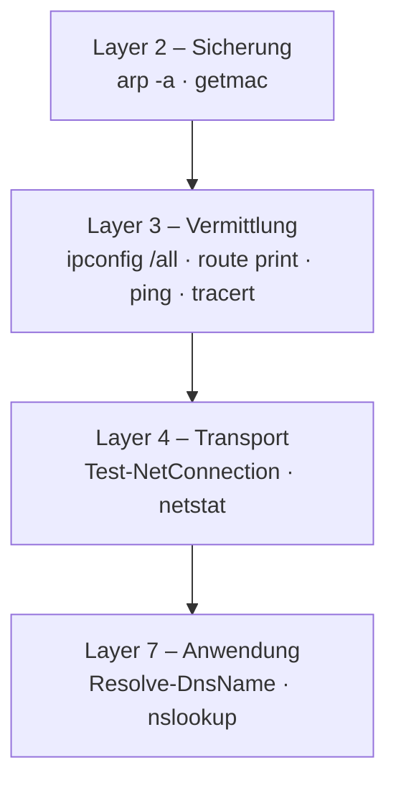

# Praxis: Netzwerk-Werkstatt

<span class='badge badge-praxis'>Praxis</span> &nbsp; Dein eigener Rechner ist das beste Netzwerk-Labor, das du hast – du musst nur wissen, wo du hinschauen musst. In den nächsten anderthalb Stunden baust du dir mit reinen Bordmitteln einen **Diagnose-Werkzeugkasten** auf und nimmst dein Netz Schicht für Schicht auseinander.

!!! info "Auf einen Blick"
    - **Dauer:** ca. 75–90 Minuten (sechs Stationen + Abschluss)
    - **Wer:** allein oder zu zweit pro Rechner (zu zweit ist es spannender – einer tippt, einer deutet)
    - **Material:** dein eigener Rechner mit **PowerShell** – **keine Installation nötig**, alles sind Bordmittel
    - **Voraussetzung:** Idealerweise der ganze Netzwerk-Block. Mindestens [Adressierung](adressierung.md), [Routing und Switching](routing-und-switching.md), [DNS](dns.md) und [Transport-Protokolle](transport-protokolle.md).

In der [Spurensuche](praxis-github-spurensuche.md) bist du **einer** Anfrage bis nach `github.com` gefolgt. Hier drehst du den Blick um: Du nimmst **deinen eigenen Rechner** unter die Lupe und lernst die Befehle, mit denen Profis im Alltag Netze prüfen. Am Ende füllst du einen **Netz-Steckbrief** aus und weißt, welcher Befehl welchen Fehler aufdeckt – die perfekte Vorbereitung für den [Netzwerk-Notruf](praxis-netzwerk-notruf.md).

!!! tip "Spielregel"
    Tipp jeden Befehl **selbst** und lies die Ausgabe Zeile für Zeile, bevor du weiterklickst. Die Beispiel-Ausgaben und Deutungen stehen jeweils zum Aufklappen darunter – erst aufmachen, wenn du selbst geschaut hast. Deine Werte sehen anders aus als die Beispiele, das ist genau richtig.

!!! warning "Warum PowerShell und nicht die Eingabeaufforderung?"
    Öffne unter Windows die **PowerShell** (Startmenü → `PowerShell` tippen → Enter), nicht die alte Eingabeaufforderung (`cmd`). Die klassischen Befehle (`ipconfig`, `ping`, `tracert`, `nslookup`, `arp`, `route`, `netstat`) laufen in **beiden** – aber die modernen Cmdlets dieser Übung (`Test-NetConnection`, `Resolve-DnsName`, `Get-NetTCPConnection`) gibt es **nur** in der PowerShell. Mit der PowerShell hast du also alles in einem Fenster.

---

## Station 0: Den richtigen Adapter finden

Bevor wir messen, ein Realitäts-Check: Ein moderner Windows-Rechner hat fast nie nur **eine** Netzwerkkarte. Typisch sind WLAN **und** ein Ethernet-Anschluss, dazu virtuelle Adapter von VirtualBox, VMware, Hyper-V oder einem VPN. `ipconfig` zeigt sie **alle** untereinander – und Anfänger lesen reflexhaft die erste Zeile, die oft die falsche ist.

=== "Windows (PowerShell)"
    ```powershell
    Get-NetIPConfiguration
    ```

    Diese eine Zeile zeigt dir pro Adapter kompakt die IP, das Gateway und den DNS-Server. **Dein aktiver Adapter ist der, bei dem ein `IPv4DefaultGateway` eingetragen ist.** Virtuelle Adapter (VirtualBox, Hyper-V) haben meist **kein** Gateway – die ignorierst du.

=== "macOS / Linux"
    ```bash
    ip route get 1.1.1.1     # Linux: zeigt, über welchen Adapter es rausgeht
    route get 1.1.1.1        # macOS: dito
    ```

**Die Faustregel:** Der Adapter mit einem **Standardgateway** ist der, über den du tatsächlich ins Netz gehst. Merke dir seinen Namen (z. B. `Ethernet` oder `WLAN`) – auf den beziehst du dich die ganze Übung über.

??? question "Notiere"
    - Name deines aktiven Adapters: `____________`
    - Hast du mehr als einen Adapter mit IP-Adresse? Welche sind virtuell? `____________`

---

## Station 1: Dein Steckbrief – Layer 3

Jetzt holen wir die volle Konfiguration deines Adapters. `ipconfig /all` ist der Klassiker und zeigt dir auf einen Schlag alles, was dein Rechner über sein Netz weiß.

=== "Windows (PowerShell)"
    ```powershell
    ipconfig /all
    ```

=== "macOS / Linux"
    ```bash
    ip addr            # Linux: IP + Maske (z. B. "192.168.2.33/24")
    ip route           # Linux: Zeile "default via ..." = Gateway
    resolvectl status  # Linux: DNS-Server (oder: cat /etc/resolv.conf)

    ifconfig           # macOS: IP + Maske
    netstat -rn        # macOS: Zeile "default" = Gateway
    scutil --dns       # macOS: DNS-Server
    ```

Such im Block deines aktiven Adapters diese sechs Zeilen heraus:

| Zeile in `ipconfig /all` | Bedeutung | Schicht |
|---|---|---|
| **IPv4-Adresse** | deine Adresse im lokalen Netz | 3 |
| **Subnetzmaske** | wie groß dein Netz ist (`255.255.255.0` = /24) | 3 |
| **Standardgateway** | dein Router – die Tür ins Internet | 3 |
| **DHCP-Server** | wer dir die Adresse zugeteilt hat | – |
| **DNS-Server** | wen du nach Namen fragst | 7 |
| **Physische Adresse** | deine MAC-Adresse (Layer 2!) | 2 |

??? success "Beispiel-Ausgabe (Windows, gekürzt)"
    ```text
    Ethernet-Adapter Ethernet:

       Physische Adresse . . . . . . . . : 10-FF-E0-63-60-6C
       DHCP aktiviert. . . . . . . . . . : Ja
       IPv4-Adresse  . . . . . . . . . . : 192.168.2.33(Bevorzugt)
       Subnetzmaske  . . . . . . . . . . : 255.255.255.0
       Lease erhalten. . . . . . . . . . : Dienstag, 2. Juni 2026 11:22:41
       Lease läuft ab. . . . . . . . . . : Dienstag, 23. Juni 2026 11:22:37
       Standardgateway . . . . . . . . . : 192.168.2.1
       DHCP-Server . . . . . . . . . . . : 192.168.2.1
       DNS-Server  . . . . . . . . . . . : 192.168.2.1
    ```

    **Deutung:** Dieser Rechner hat die private IP `192.168.2.33` in einem /24-Netz. Sein Router `192.168.2.1` ist zugleich Gateway, DHCP- und DNS-Server – das ist im Heim- und kleinen Büronetz der Normalfall. Die **Lease**-Zeilen zeigen, dass die Adresse geliehen ist (DHCP) und wann sie erneuert werden muss.

**Rechne kurz im Kopf** (Wiederholung aus [Adressierung](adressierung.md)): Bei Maske `255.255.255.0` (/24) ist dein **Netzanteil** die ersten drei Zahlen. Dein Netz heißt also `<die ersten drei Zahlen>.0/24` und reicht von `.1` bis `.254`.

??? question "Notiere für deinen Steckbrief"
    - Eigene IPv4-Adresse: `____________`
    - Subnetzmaske + CIDR (z. B. /24): `____________`
    - Standardgateway: `____________`
    - DNS-Server: `____________`
    - Deine MAC-Adresse: `____________`
    - Per DHCP oder fest? `____________`

---

## Station 2: Die Nachbarschaft – Layer 2 (ARP & MAC)

Dein Rechner spricht im lokalen Netz **nicht** über IP-Adressen, sondern über **MAC-Adressen** (siehe [Routing und Switching](routing-und-switching.md)). Die Übersetzungstabelle „welche IP gehört zu welcher MAC" heißt **ARP-Tabelle**. Schauen wir rein:

=== "Windows (PowerShell)"
    ```powershell
    arp -a
    ```

=== "macOS / Linux"
    ```bash
    arp -a           # macOS und Linux
    ip neigh         # Linux (moderne Variante)
    ```

Jede `dynamisch`/`dynamic`-Zeile ist ein Gerät, mit dem dein Rechner kürzlich im **lokalen Netz** gesprochen hat – Router, Drucker, Kollegen-PC. Die `statisch`-Einträge (Multicast/Broadcast) ignorierst du.

??? success "Beispiel-Ausgabe (Windows, gekürzt)"
    ```text
    Schnittstelle: 192.168.2.33 --- 0xd
      Internetadresse       Physische Adresse     Typ
      192.168.2.1           74-90-bc-7e-95-9c     dynamisch
      192.168.2.35          04-09-86-5f-e4-b8     dynamisch
      192.168.2.41          d8-8c-79-4e-80-bb     dynamisch
    ```

    **Deutung:** Die erste Zeile ist das **Gateway** (`192.168.2.1`) mit seiner MAC. Genau diese MAC trägt dein Rechner als Ziel-MAC ein, wenn er ein Paket „nach draußen" schickt – die Ziel-**IP** ist dann aber GitHub. Die Ziel-MAC zeigt also immer auf den **nächsten Hop**, die Ziel-IP auf das **Endziel**.

**Probier's aus – ARP live entstehen sehen:**

1. Ping zuerst dein Gateway an, damit garantiert ein frischer Eintrag entsteht:
   ```powershell
   ping 192.168.2.1
   ```
   (Setz **deine** Gateway-Adresse aus Station 1 ein.)
2. Schau direkt danach wieder in die Tabelle (`arp -a`). Die MAC deines Gateways steht jetzt sicher drin.

Deine eigenen MAC-Adressen pro Adapter bekommst du übrigens so:

=== "Windows (PowerShell)"
    ```powershell
    Get-NetAdapter | Format-Table Name, MacAddress, Status
    ```

=== "macOS / Linux"
    ```bash
    ip link          # Linux
    ifconfig         # macOS (Feld "ether")
    ```

Unter Windows zeigt dir die Spalte `Status` gleich mit, welcher Adapter `Up` (aktiv) ist – praktisch, wenn mehrere verbaut sind.

??? question "Notiere"
    - MAC-Adresse deines Gateways (aus `arp -a`): `____________`
    - Wie viele Geräte stehen in deiner ARP-Tabelle? `____________`

---

## Station 3: Welcher Weg nach draußen? – Die Routing-Tabelle

Woher weiß dein Rechner, ob ein Ziel **im eigenen Netz** liegt (direkt zustellen) oder **draußen** ist (ans Gateway geben)? Er schaut in seine **Routing-Tabelle**. Jeder Rechner hat eine – nicht nur Router.

=== "Windows (PowerShell)"
    ```powershell
    route print -4
    ```

=== "macOS / Linux"
    ```bash
    ip route          # Linux
    netstat -rn       # macOS
    ```

Die wichtigste Zeile ist die **Default-Route** mit dem Ziel `0.0.0.0` und der Maske `0.0.0.0`: „Alles, wofür ich keine speziellere Regel habe, schicke ich ans Gateway."

??? success "Beispiel-Ausgabe (Windows, gekürzt)"
    ```text
    IPv4-Routentabelle
    ===========================================================================
    Aktive Routen:
         Netzwerkziel    Netzwerkmaske          Gateway    Schnittstelle Metrik
              0.0.0.0          0.0.0.0      192.168.2.1     192.168.2.33     25
          127.0.0.0        255.0.0.0   Auf Verbindung         127.0.0.1    331
        192.168.2.0    255.255.255.0   Auf Verbindung      192.168.2.33    281
    ```

    **Deutung:** Drei Arten von Routen:

    - `0.0.0.0 / 0.0.0.0 → 192.168.2.1`: die **Default-Route**. Alles Unbekannte (also das ganze Internet) geht ans Gateway.
    - `192.168.2.0 / 255.255.255.0 → Auf Verbindung`: dein **eigenes Netz**. „Auf Verbindung" heißt: direkt zustellen, kein Router nötig.
    - `127.0.0.0 → Auf Verbindung`: der **Loopback** (dein Rechner selbst, `127.0.0.1`).

**Denk-Aufgabe (keine Tipperei):** Dein Rechner will ein Paket an `8.8.8.8` schicken. Welche Zeile der Tabelle passt? Und an `192.168.2.50`? Genau diese Entscheidung – „passt eine speziellere Route, sonst Default" – trifft dein Rechner millionenfach am Tag. Es ist dieselbe „lokal oder raus?"-Entscheidung, die hinter jedem einzelnen Paket steckt.

??? question "Notiere"
    - Über welche Gateway-IP läuft deine Default-Route? `____________`
    - Stimmt sie mit deinem Standardgateway aus Station 1 überein? `____________`

---

## Station 4: Namen auflösen – DNS samt Cache

Jetzt zu [DNS](dns.md), dem Telefonbuch des Internets. Du fragst aktiv nach – und schaust danach in den versteckten Zwischenspeicher deines Rechners.

### 4a – Verschiedene Record-Typen abfragen

=== "Windows (PowerShell)"
    ```powershell
    Resolve-DnsName github.com -Type A      # IPv4-Adresse
    Resolve-DnsName google.com  -Type AAAA  # IPv6-Adresse
    Resolve-DnsName github.com -Type MX     # Mailserver
    Resolve-DnsName github.com -Type NS     # zuständige Nameserver
    ```

=== "macOS / Linux"
    ```bash
    nslookup github.com
    nslookup -type=AAAA google.com
    nslookup -type=MX github.com
    # falls 'dig' installiert ist, schöner:  dig github.com MX +short
    ```

!!! note "Warum `google.com` für IPv6?"
    Nicht jede Domain hat eine IPv6-Adresse. `github.com` liefert (Stand heute) **nur** IPv4 – `Resolve-DnsName github.com -Type AAAA` kommt leer zurück. `google.com` hat IPv6, deshalb nehmen wir die zum Zeigen. Das ist selbst schon eine Erkenntnis: IPv6 ist noch lange nicht überall.

### 4b – Den eigenen DNS-Server gegen einen öffentlichen vergleichen

Frag denselben Namen einmal über deinen Router und einmal direkt bei Cloudflare (`1.1.1.1`):

=== "Windows (PowerShell)"
    ```powershell
    nslookup github.com
    nslookup github.com 1.1.1.1
    ```

=== "macOS / Linux"
    ```bash
    nslookup github.com
    nslookup github.com 1.1.1.1
    ```

Oft bekommst du **zwei verschiedene IPs** für denselben Namen. Kein Fehler – große Dienste stehen weltweit verteilt hinter einem **CDN/Anycast** und jeder Resolver gibt dir die Adresse, die zu seinem Standort passt.

### 4c – Der DNS-Cache deines Rechners

Dein Rechner merkt sich Antworten eine Weile, um nicht jedes Mal neu zu fragen.

=== "Windows (PowerShell)"
    ```powershell
    ipconfig /displaydns      # zeigt den Cache
    ipconfig /flushdns        # leert den Cache
    ```

=== "macOS / Linux"
    ```bash
    # Linux (systemd):
    resolvectl statistics
    sudo resolvectl flush-caches
    # macOS:
    sudo dscacheutil -flushcache
    ```

**Probier's aus:** Ruf im Browser eine Seite auf, die du heute noch nicht besucht hast. Tipp dann `ipconfig /displaydns` – der Name taucht im Cache auf, mit einer **Gültigkeitsdauer** (TTL), die langsam herunterzählt. Danach `ipconfig /flushdns` und nochmal schauen: leer.

??? success "Beispiel: ein Cache-Eintrag (Windows)"
    ```text
    github.com
    ----------------------------------------
    Eintragsname . . . . . : github.com
    Eintragstyp  . . . . . : 1
    Gültigkeitsdauer . . . : 238
    Datenlänge . . . . . . : 4
    Abschnitt. . . . . . . : Antwort
    (Host-)A-Eintrag  . . : 140.82.121.4
    ```

    **Deutung:** `Eintragstyp 1` = A-Record (IPv4). Die `Gültigkeitsdauer` (238 Sekunden) ist die DNS-TTL – so lange gilt der Eintrag als frisch, danach wird neu gefragt. **Nicht** zu verwechseln mit dem IP-TTL (Hop-Zähler) aus Station 6!

??? question "Notiere"
    - IP von `github.com` über deinen Router-DNS: `____________`
    - IP über `1.1.1.1`: `____________` – gleich oder verschieden?
    - Eine IPv6-Adresse von `google.com`: `____________`

---

## Station 5: Türen & Dienste – Ports (Layer 4)

`ping` sagt dir nur, ob ein Rechner **da** ist – nicht, ob der gewünschte **Dienst** läuft. Dafür klopfst du an einen **Port**. Auf Windows ist `Test-NetConnection` das Werkzeug der Wahl.

### 5a – Ist ein Port offen?

=== "Windows (PowerShell)"
    ```powershell
    Test-NetConnection github.com -Port 443    # HTTPS
    Test-NetConnection github.com -Port 80     # HTTP
    ```

=== "macOS / Linux"
    ```bash
    nc -vz github.com 443      # "succeeded" = offen
    nc -vz github.com 80
    ```

Die entscheidende Zeile heißt **`TcpTestSucceeded`**: `True` = die Tür geht auf (Dienst erreichbar), `False` = zu (Firewall blockt oder kein Dienst).

??? success "Beispiel: offen vs. zu (Windows)"
    Offener Port:
    ```text
    ComputerName     : github.com
    RemoteAddress    : 140.82.121.3
    RemotePort       : 443
    TcpTestSucceeded : True
    ```

    Geschlossener/gefilterter Port (hier ein Test-Port auf dem eigenen Rechner):
    ```text
    WARNUNG: TCP connect to (127.0.0.1 : 9999) failed
    ComputerName     : 127.0.0.1
    RemotePort       : 9999
    TcpTestSucceeded : False
    ```

    **Deutung:** `True` heißt: TCP-Handshake auf diesem Port hat geklappt – der Dienst nimmt Verbindungen an. `False` ist genau das Bild aus [Fall 5 des Netzwerk-Notrufs](praxis-netzwerk-notruf.md): Rechner da, aber die Tür zu.

!!! warning "Geschlossene Ports brauchen Geduld"
    Ist ein Port **gefiltert** (Firewall verschluckt das Paket lautlos), wartet `Test-NetConnection` einige Sekunden bis zum `False` – das ist normal, nicht hängengeblieben. `telnet` als Alternative ist auf Windows 11 **nicht vorinstalliert** (müsste erst als Windows-Feature aktiviert werden); `Test-NetConnection` ist der bessere Weg.

### 5b – Welche Ports hört dein eigener Rechner ab?

Dein Rechner hat selbst offene Türen. Schau nach, welche Programme gerade „lauschen":

=== "Windows (PowerShell)"
    ```powershell
    Get-NetTCPConnection -State Listen | Sort-Object LocalPort | Select-Object LocalAddress,LocalPort,OwningProcess

    netstat -ano                       # klassische Variante (Status: ABHÖREN / HERGESTELLT)
    Get-Process -Id <PID>              # PID aus netstat zu einem Programmnamen auflösen
    ```

=== "macOS / Linux"
    ```bash
    ss -tlnp          # Linux: lauschende TCP-Ports + Prozess
    netstat -an       # macOS/Linux
    lsof -i -P -n     # macOS: offene Netz-Sockets
    ```

??? success "Beispiel: netstat (Windows, gekürzt)"
    ```text
      Proto  Lokale Adresse         Remoteadresse          Status           PID
      TCP    0.0.0.0:135            0.0.0.0:0              ABHÖREN          1428
      TCP    0.0.0.0:445            0.0.0.0:0              ABHÖREN          4
      TCP    192.168.2.33:52240     140.82.121.3:443      HERGESTELLT      9012
    ```

    **Deutung:** `ABHÖREN` (LISTENING) = ein Dienst wartet auf diesem Port auf Verbindungen (`135`, `445` sind typische Windows-Dienste). `HERGESTELLT` (ESTABLISHED) = eine aktive Verbindung – hier deine eigene HTTPS-Verbindung zu einem Server auf dessen Port `443`. Die **PID** in der letzten Spalte verrät dir mit `Get-Process -Id <PID>`, welches Programm dahintersteckt.

??? question "Notiere"
    - `github.com` Port 443 – `TcpTestSucceeded`? `____________`
    - Ein Port, auf dem **dein** Rechner lauscht: `____________`
    - Welches Programm steckt hinter einer `HERGESTELLT`-Verbindung? `____________`

---

## Station 6: Der Weg & seine Qualität – Hops

Zum Schluss machst du die sonst unsichtbare Kette der **Router** zwischen dir und einem Ziel sichtbar – jeden Sprung nennt man einen **Hop**.

=== "Windows (PowerShell)"
    ```powershell
    tracert -d github.com
    ```

    Das `-d` ist wichtig: Es unterdrückt die Rückwärts-Namensauflösung jeder Zwischenstation – ohne `-d` wird `tracert` im Unterricht quälend langsam. Mit `-h 15` kannst du zusätzlich die maximale Hop-Zahl begrenzen.

=== "macOS / Linux"
    ```bash
    traceroute -n github.com     # -n = ohne Namensauflösung (schneller)
    tracepath github.com         # falls traceroute fehlt
    ```

??? success "Beispiel-Ausgabe (Windows, gekürzt)"
    ```text
    Routenverfolgung zu github.com [140.82.121.4] über maximal 20 Hops:

      1     5 ms     4 ms     4 ms  192.168.2.1
      2     8 ms    12 ms     6 ms  62.155.241.107
      3    14 ms    16 ms    14 ms  62.154.46.14
      ...
     10     *        *        *     Zeitüberschreitung der Anforderung.
     12    30 ms    18 ms    18 ms  140.82.121.4

    Ablaufverfolgung beendet.
    ```

    **Deutung:** **Hop 1 ist immer dein Gateway** aus Station 1. Ab Hop 2 bist du draußen beim Provider. Die `* * *`-Zeilen sind Router, die absichtlich nicht auf Trace-Pakete antworten – das Paket läuft trotzdem weiter, kein Grund zur Sorge. Die letzte Zeile ist dein Ziel.

**Optional – Wegqualität statt nur Weg:** `pathping github.com` läuft denselben Weg, misst danach aber pro Hop den **Paketverlust**. Achtung: Es sammelt rund 25 Sekunden je Hop, dauert also einige Minuten – nur starten, wenn ihr die Zeit habt.

??? question "Notiere"
    - Anzahl Hops bis `github.com`: `____________`
    - Stimmt Hop 1 mit deinem Gateway überein? `____________`

---

## Abschluss: Dein Netz-Steckbrief

Trag deine gesammelten Werte zusammen. Das ist die Visitenkarte deines Rechners im Netz – und der Beweis, dass du jede Schicht selbst vermessen hast.

| # | Was | Befehl | Dein Wert |
|---|---|---|---|
| 1 | Aktiver Adapter | `Get-NetIPConfiguration` | |
| 1 | Eigene IPv4 + CIDR | `ipconfig /all` | |
| 1 | Standardgateway | `ipconfig /all` | |
| 1 | DNS-Server | `ipconfig /all` | |
| 1 | Eigene MAC | `ipconfig /all` | |
| 2 | MAC des Gateways | `arp -a` | |
| 3 | Default-Route-Gateway | `route print -4` | |
| 4 | IP von github.com | `Resolve-DnsName` | |
| 5 | github.com:443 offen? | `Test-NetConnection` | |
| 6 | Hops bis github.com | `tracert -d` | |

---

## Der Werkzeugkasten auf einen Blick

Jeder Befehl gehört zu einer Schicht – und genau das macht ihn zum Diagnose-Werkzeug. Dieses Bild ist deine Brücke zum [Netzwerk-Notruf](praxis-netzwerk-notruf.md):



!!! question "Welcher Befehl findet welchen Fehler?"
    Ordne jedem Symptom den Befehl zu, der es als Erstes sichtbar macht. (Lösung darunter – erst selbst überlegen.)

    1. „Ich habe gar keine richtige IP-Adresse."
    2. „Die IP geht, aber der Name wird nicht aufgelöst."
    3. „Lokal komme ich überall hin, nur nicht ins Internet."
    4. „Der Server antwortet auf Ping, aber die Webseite lädt nicht."

??? success "Lösung: Symptom → Befehl"
    1. **Keine richtige IP** → `ipconfig /all` (Adresse beginnt mit `169.254.` = kein DHCP). → Layer 3.
    2. **Name geht nicht** → `Resolve-DnsName` / `nslookup` (Server antwortet nicht oder falsch). → Layer 7 (DNS).
    3. **Nur Internet fehlt** → `route print` / `ipconfig` (Gateway falsch oder nicht im eigenen Netz) plus `ping <gateway>`. → Layer 3.
    4. **Ping ja, App nein** → `Test-NetConnection host -Port 443` (`TcpTestSucceeded : False` = Port/Firewall). → Layer 4.

    Genau diese vier Muster spielst du gleich im [Netzwerk-Notruf](praxis-netzwerk-notruf.md) als echte Fälle durch – jetzt mit dem Werkzeug, das du gerade selbst bedient hast.

---

## Was du dabei gelernt hast

- Du findest auf einem realen Rechner mit mehreren Adaptern den **richtigen** und liest seine komplette Konfiguration (IP, Maske, Gateway, DNS, MAC, DHCP).
- Du kennst die **ARP-Tabelle** und hast gesehen, wie aus einer IP eine MAC wird – die Brücke zwischen Layer 3 und Layer 2.
- Du kannst die **Routing-Tabelle** lesen und erklären, wie dein Rechner „lokal oder raus?" entscheidet.
- Du fragst **DNS** gezielt nach verschiedenen Record-Typen, vergleichst Resolver und kennst den **DNS-Cache** samt `flushdns`.
- Du prüfst mit `Test-NetConnection`, ob ein **Port** offen ist und siehst mit `netstat`, welche Dienste **dein** Rechner anbietet.
- Du machst mit `tracert -d` die **Hops** zum Ziel sichtbar und weißt, dass `* * *` normal ist.
- Vor allem: Du hast einen **Werkzeugkasten**, den du jeder Schicht zuordnen kannst – die Grundlage für systematisches Troubleshooting.

!!! success "Geschafft?"
    Wenn dein Netz-Steckbrief ausgefüllt ist und du die Symptom→Befehl-Tabelle ohne Spickzettel hinbekommst, bist du bereit für den [Netzwerk-Notruf](praxis-netzwerk-notruf.md) – dort bist du der Detektiv.

---

## Weiterlesen

- [Adressierung (MAC, IPv4, IPv6, Subnetting)](adressierung.md) – die Theorie hinter Station 1 bis 3
- [Routing und Switching](routing-und-switching.md) – warum ARP und Routing-Tabelle so zusammenspielen
- [DNS – Namensauflösung](dns.md) – die Theorie hinter Station 4
- [Transport-Protokolle (TCP/UDP)](transport-protokolle.md) – Ports und der Handshake aus Station 5
- [Praxis: github.com – die Spurensuche](praxis-github-spurensuche.md) – einer Anfrage von Anfang bis Ende folgen
- [Praxis: Netzwerk-Notruf](praxis-netzwerk-notruf.md) – dein Werkzeugkasten im Einsatz an echten Störungen
