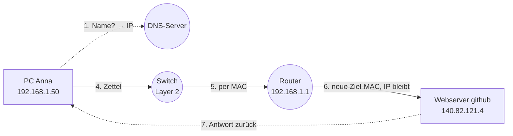

# Praxis: Die Reise eines Pakets

<span class='badge badge-praxis'>Praxis</span> &nbsp; Vergiss die Folien – heute **seid ihr das Netzwerk**, und ein Zettel reist als Datenpaket quer durch den Raum bis zu `github.com`.

In der [Theorie zu Routing und Switching](routing-und-switching.md) hast du gelesen, wie ein Paket vom Schreibtisch bis zum GitHub-Server findet. Jetzt spielt ihr genau diesen Weg nach – mit Rollen, einem Paket-Zettel und einer MAC-Tabelle am Whiteboard. Am Ende habt ihr den wichtigsten Satz des Themas nicht nur gelesen, sondern **mit den Händen erlebt**: Die Ziel-MAC ändert sich bei jedem Hop, die Ziel-IP bleibt.

---

!!! info "Auf einen Blick"
    - **Dauer:** ca. 15–25 Minuten
    - **Gruppengröße:** 6–10 Personen
    - **Material:** Rollenkarten (siehe unten), ein paar Paket-Zettel nach Vorlage, ein Whiteboard oder Flipchart, ein Stift
    - **Voraussetzung:** Ihr habt [Routing und Switching](routing-und-switching.md) gelesen. Ein Blick ins [OSI- und TCP/IP-Modell](osi-und-tcp-ip-modell.md) und in [DNS](dns.md) schadet nicht.
    - **Kein PC nötig:** Das Ganze läuft komplett analog. Genau das ist der Trick – ihr seht die Schritte, die ein Rechner in Millisekunden macht, in Zeitlupe.

---

## Die Idee

Ein Netzwerk klingt abstrakt, solange es in Kabeln und Chips versteckt ist. Also holen wir es ins Klassenzimmer: **Jede Person wird ein Gerät.** Eine spielt den PC, eine den Switch, eine den Router, eine den DNS-Server, eine den Webserver.

Ein **Datenpaket** ist ein einfacher Zettel. Dieser Zettel wandert **physisch von Hand zu Hand** durch den Raum – vom PC über den Switch zum Router und weiter Richtung Internet. An jeder Station passiert genau das, was auch ein echtes Gerät tun würde.

Das Schöne daran: Wo eine Animation einfach abläuft, müsst ihr hier **selbst entscheiden**, was als Nächstes passiert. Und wenn jemand einen Fehler macht, kommt der Zettel nicht an – und ihr merkt sofort, **warum**.

---

## Die Rollen

Verteilt die Rollen in der Gruppe. Jede Person bekommt ihre **Rollenkarte** und stellt oder setzt sich an einen festen Platz im Raum – am besten in der Reihenfolge, in der die Daten fließen.

!!! abstract "PC „Anna"  ·  IP 192.168.1.50  ·  MAC AA:AA:AA:AA:AA:AA"
    Du bist ein ganz normaler Arbeitsplatz-Rechner. Du willst eine Website aufrufen.

    - Du kennst **deine eigene IP** (`192.168.1.50`), deine **Subnetzmaske** (`/24`, also `255.255.255.0`) und dein **Default Gateway** (`192.168.1.1`).
    - Du weißt: Dein eigenes Netz ist `192.168.1.0/24` – also alle Adressen von `192.168.1.1` bis `192.168.1.254`.
    - Du kennst **Namen** wie `github.com` – aber **keine IP-Adressen** dazu. Dafür musst du den DNS-Server fragen.
    - Du füllst am Ende den Paket-Zettel aus und gibst ihn ab.

!!! abstract "Switch  ·  arbeitet auf Layer 2"
    Du verbindest die Geräte im lokalen Netz. Du bist schnell und stur.

    - Du verstehst **nur MAC-Adressen**. IP-Adressen sagen dir **nichts** – du liest sie nicht einmal.
    - Du führst eine **MAC-Tabelle am Whiteboard**: Welche MAC hängt an welchem Port?
    - Bekommst du einen Zettel, liest du nur die **Ziel-MAC** und reichst ihn an den passenden Port (= die passende Person) weiter.

!!! abstract "Router / Default Gateway  ·  IP 192.168.1.1  ·  MAC RR:RR:RR:RR:RR:RR"
    Du bist das Tor zur großen weiten Welt. Alles, was nicht ins lokale Netz gehört, kommt zu dir.

    - Du arbeitest auf **Layer 3** und triffst die **Routing-Entscheidung**: Wohin als Nächstes?
    - Du hast eine kleine Routing-Tabelle (siehe deine Karte unten). Für alles Unbekannte gilt: ab Richtung Internet/Webserver.
    - **Dein wichtigster Job:** Du **schreibst die Ziel-MAC auf dem Zettel neu** – auf die MAC des nächsten Geräts. Die **Ziel-IP fasst du nicht an.**

!!! abstract "DNS-Server  ·  das Telefonbuch"
    Du löst Namen in IP-Adressen auf. Mehr nicht, aber das richtig.

    - Du hast genau **eine Karte**: `github.com` → `140.82.121.4`.
    - Fragt dich jemand „Welche IP hat `github.com`?", antwortest du mit `140.82.121.4`.
    - Du verschickst selbst keine Pakete – du beantwortest nur die Namens-Frage.

!!! abstract "Webserver „github"  ·  IP 140.82.121.4"
    Du bist das Ziel der Reise – ein Server irgendwo im Internet.

    - Du lauschst auf **Port 443** (HTTPS).
    - Kommt ein Paket bei dir an, prüfst du kurz: Stimmt meine IP? Stimmt der Port? Dann **antwortest du** – und die Antwort tritt die Rückreise an.

??? abstract "Optional: Firewall  ·  der Türsteher (nur bei 7+ Personen)"
    Du sitzt zwischen Router und Internet und entscheidest, was durch darf.

    - Du kennst eine einfache Regel: **Port 443 (HTTPS) ist erlaubt.** Alles andere blockst du.
    - Kommt ein Paket mit Ziel-Port 443, winkst du es durch. Bei einem anderen Port hältst du den Zettel an und rufst: „Blockiert!"
    - In der Grundrunde kannst du dich erst mal danebenstellen und nur zuschauen – spannend wird deine Rolle in der Sabotage-Runde.

---

## Material: der Paket-Zettel

Das Herzstück der Übung. Malt diese Vorlage ein paar Mal auf Zettel (DIN A5 reicht, ruhig groß). Jeder Zettel ist **ein Paket**.

```text
┌─────────────────────────────────────────────┐
│  📦  DATENPAKET                               │
├─────────────────────────────────────────────┤
│  Quell-IP   : ____________________            │
│  Quell-MAC  : ____________________            │
│  Ziel-IP    : ____________________            │
│  Ziel-MAC   : ____________________   ◄ ändert │
│  Ziel-Port  : ____________________            │
│  Daten      : ____________________            │
└─────────────────────────────────────────────┘
```

Schreibt mit **Bleistift** oder lasst beim Feld „Ziel-MAC" bewusst Platz zum Durchstreichen – denn genau dieses Feld wird unterwegs geändert.

!!! warning "Der Aha-Moment dieser Übung"
    Achtet die ganze Zeit auf zwei Felder:

    - **Ziel-IP** = das *endgültige* Ziel (`140.82.121.4`). Sie bleibt vom Start bis zum Schluss **unverändert**.
    - **Ziel-MAC** = der *nächste* Empfänger auf dem Weg. Sie wird bei **jedem Hop neu geschrieben**.

    Wenn ihr am Ende auf den durchgestrichenen Zettel schaut, seht ihr es schwarz auf weiß: Die IP stand nur einmal da, die MAC wurde mehrfach überschrieben. **Das ist der ganze Trick hinter Routing.**

---

## So läuft's – Schritt für Schritt

Geht die Schritte gemeinsam und **laut** durch. Wer dran ist, sagt vor, was er tut, und gibt dann den Zettel weiter.

### Schritt 1 – Anna hat einen Wunsch

Anna sagt laut: *„Ich will `github.com` aufrufen, und zwar über HTTPS – also Port 443."*

Anna hat aber ein Problem: Sie kennt nur den **Namen**, nicht die IP. Ein Paket braucht aber eine Ziel-**IP**. Also zuerst: fragen.

### Schritt 2 – Anna fragt den DNS-Server

Anna dreht sich zum DNS-Server und fragt: *„Welche IP hat `github.com`?"*

Der DNS-Server schaut auf seine Karte und antwortet: *„`140.82.121.4`."*

!!! tip "Merke"
    **DNS kommt immer zuerst.** Ohne Name-zu-IP-Auflösung weiß Anna gar nicht, wohin das Paket überhaupt soll. Mehr dazu in [DNS](dns.md).

### Schritt 3 – Anna überlegt: lokal oder raus?

Jetzt vergleicht Anna die Ziel-IP `140.82.121.4` mit ihrem eigenen Netz `192.168.1.0/24`.

Anna sagt laut: *„`140.82.121.4` fängt nicht mit `192.168.1.` an – das liegt **nicht** in meinem Netz. Also muss das Paket zum **Default Gateway**, dem Router `192.168.1.1`."*

Aber: Um den Zettel überhaupt loszuschicken, braucht Anna die **MAC-Adresse** des Routers (denn der Switch versteht nur MACs). Also macht Anna einen **ARP-Ruf** in den Raum:

> *„Wer hat `192.168.1.1`? Bitte deine MAC!"*

Der Router meldet sich: *„Das bin ich – meine MAC ist `RR:RR:RR:RR:RR:RR`."*

!!! info "Warum fragt Anna nach der Router-MAC und nicht nach der GitHub-MAC?"
    Weil GitHub **nicht im lokalen Netz** ist. Im LAN stellt man Pakete per MAC zu – und lokal erreichbar ist nur der nächste Hop, der Router. Die MAC von GitHub kennt hier niemand, und das ist auch gar nicht nötig: Der Router kümmert sich um den Rest des Weges.

### Schritt 4 – Anna füllt den Zettel aus

Anna nimmt einen Paket-Zettel und trägt ein:

```text
Quell-IP   : 192.168.1.50            (Anna)
Quell-MAC  : AA:AA:AA:AA:AA:AA       (Anna)
Ziel-IP    : 140.82.121.4            (GitHub – das ENDZIEL)
Ziel-MAC   : RR:RR:RR:RR:RR:RR       (Router – der nächste Hop!)
Ziel-Port  : 443                     (HTTPS)
Daten      : "Hallo GitHub, schick mir die Startseite"
```

Dann gibt Anna den Zettel an den **Switch**.

!!! tip "Schaut genau hin"
    Die **Ziel-IP** ist GitHub. Die **Ziel-MAC** ist aber der **Router**. Das fühlt sich erst komisch an – ist aber goldrichtig: Ziel-IP = wohin am Ende, Ziel-MAC = wer als Nächstes.

### Schritt 5 – Der Switch leitet weiter (Layer 2)

Der Switch nimmt den Zettel und liest **nur die Ziel-MAC**: `RR:RR:RR:RR:RR:RR`.

Er schaut in seine **MAC-Tabelle am Whiteboard**:

| Port | MAC-Adresse | Gerät |
|------|-------------|-------|
| 1 | `AA:AA:AA:AA:AA:AA` | Anna |
| 2 | `RR:RR:RR:RR:RR:RR` | Router |

Der Switch sagt: *„Ziel-MAC `RR:...` hängt an Port 2 – das ist der Router."* Und reicht den Zettel an den Router weiter.

!!! info "Der Switch ist blind für IPs"
    Der Switch hat die Ziel-IP `140.82.121.4` nicht einmal angeschaut. Layer 2 interessiert sich ausschließlich für MAC-Adressen. Das ist kein Versäumnis – es ist seine Aufgabe.

### Schritt 6 – Der Router entscheidet und schreibt die MAC neu (Layer 3)

Jetzt kommt die Schlüsselszene. Der Router nimmt den Zettel und liest die **Ziel-IP**: `140.82.121.4`.

Er schaut in seine Routing-Tabelle:

| Ziel-Netz | Maske | Nächster Hop |
|-----------|-------|--------------|
| `192.168.1.0` | `/24` | direkt im LAN |
| `0.0.0.0` | `/0` (alles andere) | Richtung Internet → Webserver |

Der Router sagt laut: *„`140.82.121.4` ist nicht mein lokales Netz – das geht über die Default-Route Richtung Internet."*

Und jetzt der entscheidende Handgriff: Der Router **streicht die alte Ziel-MAC durch** und schreibt die MAC des nächsten Geräts hin (in unserer kleinen Welt direkt die des Webservers). Die **Ziel-IP rührt er nicht an.**

```text
Quell-IP   : 192.168.1.50
Quell-MAC  : AA:AA:AA:AA:AA:AA   →  jetzt eigentlich RR:... (Router als Absender)
Ziel-IP    : 140.82.121.4            ◄ UNVERÄNDERT
Ziel-MAC   : ~~RR:RR:RR:RR:RR:RR~~  →  WW:WW:WW:WW:WW:WW   ◄ NEU geschrieben!
Ziel-Port  : 443
Daten      : "Hallo GitHub, schick mir die Startseite"
```

Dann schickt der Router den Zettel weiter Richtung Webserver. (Habt ihr eine **Firewall** dabei, wandert der Zettel erst dort vorbei – Port 443 ist erlaubt, also winkt sie durch.)

!!! warning "Genau hier sitzt die Kern-Erkenntnis"
    Schaut auf den Zettel: Die **Ziel-MAC wurde durchgestrichen und neu geschrieben**, die **Ziel-IP steht unverändert** da. Bei jedem weiteren Router im echten Internet passiert exakt dasselbe – Hop für Hop, bis zum Ziel. **IP bleibt, MAC ändert sich pro Hop.**

### Schritt 7 – Ankunft und Rückreise

Der Webserver „github" bekommt den Zettel und prüft: *„Ziel-IP `140.82.121.4` – das bin ich. Ziel-Port 443 – HTTPS, höre ich. Passt!"*

Er antwortet, indem er einen **neuen Zettel** ausfüllt: Jetzt sind **Quelle und Ziel vertauscht** – Quell-IP ist GitHub, Ziel-IP ist Anna (`192.168.1.50`). Diese Antwort tritt nun den **Rückweg** an: über die Router zurück, durch den Switch, bis sie bei Anna ankommt.

Anna hält den Antwort-Zettel hoch: *„Die Seite ist da!"* 🎉



---

## Sabotage-Runde

!!! tip "Jetzt wird's spannend: Wir bauen Fehler ein"
    Habt ihr die Grundrunde einmal sauber gespielt? Dann mischt eure drei **Sabotage-Karten**, lasst eine Person ziehen – und **verratet den anderen nicht, welche** es ist. Spielt die Paketreise erneut. Die Gruppe muss herausfinden: **Warum kommt das Paket diesmal nicht an?** Wer die Schicht und die Ursache zuerst benennt, gewinnt die Runde.

??? danger "Sabotage-Karte A – Das Default-Gateway fällt aus"
    Der Router setzt sich demonstrativ hin und sagt: *„Ich bin offline."* Auf den ARP-Ruf von Anna antwortet niemand.

    **Was die Gruppe erkennen soll:** Anna bekommt keine Router-MAC und kann den Zettel nicht losschicken. Lokale Pakete (an `192.168.1.x`) würden noch funktionieren – aber **alles Richtung Internet ist tot**, weil das Default Gateway fehlt. Anna sitzt in ihrem eigenen Subnetz fest.

    *Schicht:* Layer 3 (Routing). *Symptom im echten Leben:* „Internet geht nicht, aber der Drucker im selben Netz schon."

??? danger "Sabotage-Karte B – Der DNS-Server lügt"
    Auf Annas Frage „Welche IP hat `github.com`?" antwortet der DNS-Server mit einer **falschen** IP, z. B. `6.6.6.6`.

    **Was die Gruppe erkennen soll:** Anna füllt den Zettel mit der falschen Ziel-IP aus. Der Switch und der Router arbeiten **technisch völlig korrekt** – sie transportieren das Paket brav zu `6.6.6.6`. Nur kommt es eben beim **falschen Server** (oder nirgends sinnvoll) an. Der echte GitHub-Server hebt nie ab.

    *Schicht:* Layer 7 / Namensauflösung. *Symptom im echten Leben:* „Die Seite lädt, aber es ist die falsche" – das Prinzip hinter DNS-Spoofing und Phishing.

??? danger "Sabotage-Karte C – Anna hat die falsche Subnetzmaske"
    Anna bekommt heimlich die Maske `/8` statt `/24` zugesteckt. Damit denkt Anna, ihr eigenes Netz sei `192.0.0.0/8` – also riesig.

    **Was die Gruppe erkennen soll:** Beim Schritt-3-Vergleich sagt Anna fälschlich: *„`140.82.121.4`... fängt zwar nicht mit `192.` an – aber GitHub liegt ja angeblich in meinem Netz!"* Moment – mit `/8` glaubt Anna, sie könne den Server **direkt** erreichen, und macht einen ARP-Ruf nach `140.82.121.4`. Darauf antwortet im LAN aber **niemand**, denn GitHub ist nicht da. Anna schickt das Paket **nie zum Router** – und es bleibt liegen.

    *Schicht:* Layer 3 (IP-Konfiguration). *Symptom im echten Leben:* „Manche Ziele erreiche ich, andere unerklärlicherweise nicht" – eine der fiesesten Fehlkonfigurationen überhaupt.

---

## Hilfekarten

!!! tip "Spielregel"
    Diese Karten sind **Spickzettel pro Rolle**. Klappt nur eure eigene auf, wenn ihr unsicher seid, was ihr tun sollt. Erst überlegen, dann klicken.

??? info "Karte: PC „Anna""
    Du startest die Reise. Deine Schritte in Reihenfolge:

    1. **Name → IP:** Du kennst nur `github.com`. Frag den DNS-Server nach der IP.
    2. **Lokal oder raus?** Vergleiche die Ziel-IP mit deinem Netz `192.168.1.0/24`. Liegt sie drin → direkt zustellen. Liegt sie draußen → zum **Default Gateway** `192.168.1.1`.
    3. **ARP:** Ruf in den Raum, wessen MAC du brauchst (hier: die des Routers).
    4. **Zettel ausfüllen:** Ziel-IP = GitHub, Ziel-MAC = **nächster Hop** (Router!), Ziel-Port = 443.
    5. Gib den Zettel an den **Switch**.

??? info "Karte: Switch"
    Du arbeitest auf **Layer 2** – du kennst **nur MAC-Adressen**, **keine IPs**. IP-Felder liest du gar nicht.

    - Lies die **Ziel-MAC** auf dem Zettel.
    - Schau in deine **MAC-Tabelle am Whiteboard**: An welchem Port hängt diese MAC?
    - Reich den Zettel **genau an diese eine Person** weiter. Du veränderst am Zettel **nichts**.

??? info "Karte: Router / Default Gateway"
    Du arbeitest auf **Layer 3** – du triffst Entscheidungen anhand der **IP**.

    1. Lies die **Ziel-IP** auf dem Zettel.
    2. Schau in deine Routing-Tabelle: lokales Netz `192.168.1.0/24`, alles andere → Default-Route Richtung Internet/Webserver.
    3. **Schreib die Ziel-MAC neu** – auf die MAC des nächsten Geräts. Die **Ziel-IP lässt du unangetastet.**
    4. Schick den Zettel weiter (ggf. über die Firewall).

??? info "Karte: DNS-Server"
    Du bist das **Telefonbuch**. Du transportierst keine Pakete.

    - Deine einzige Karte: `github.com` → `140.82.121.4`.
    - Wird ein Name abgefragt, nenne die IP. Fertig.

??? info "Karte: Webserver „github""
    Du bist das **Endziel** auf IP `140.82.121.4`, du hörst auf **Port 443**.

    - Kommt ein Zettel: Prüfe, ob Ziel-IP = deine IP und Ziel-Port = 443.
    - Passt es, **antworte**: neuer Zettel, Quelle und Ziel vertauscht. Schick ihn auf den Rückweg.

??? info "Karte: Firewall (optional)"
    Du bist der **Türsteher** zwischen Router und Internet.

    - Regel: **Port 443 erlaubt**, alles andere blockiert.
    - Ziel-Port 443 → durchwinken. Anderer Port → Zettel anhalten und „Blockiert!" rufen.

---

## Auflösung

??? success "Der korrekte Ablauf in Worten – erst nach dem eigenen Spielen aufklappen!"
    1. **DNS zuerst:** Anna kennt nur den Namen `github.com` und fragt den DNS-Server. Antwort: `140.82.121.4`.
    2. **Lokal oder raus?** Anna vergleicht die Ziel-IP mit ihrem Netz `192.168.1.0/24`. GitHub liegt draußen → also zum **Default Gateway** `192.168.1.1`.
    3. **ARP:** Anna holt sich per Ruf die **MAC des Routers**, weil im LAN per MAC zugestellt wird und der Router der nächste erreichbare Hop ist.
    4. **Zettel:** Ziel-IP = GitHub (Endziel), Ziel-MAC = Router (nächster Hop), Port = 443.
    5. **Switch (Layer 2):** liest nur die Ziel-MAC, findet den Port in der MAC-Tabelle, reicht weiter – IPs ignoriert er.
    6. **Router (Layer 3):** liest die Ziel-IP, trifft die Routing-Entscheidung, **schreibt die Ziel-MAC neu**, lässt die **Ziel-IP unverändert**, schickt weiter.
    7. **Webserver:** prüft IP und Port, antwortet, und die Antwort läuft denselben Weg zurück.

    **Die fünf Kern-Erkenntnisse:**

    - **DNS kommt immer zuerst** – ohne IP kein Ziel.
    - **Switch = Layer 2 = MAC.** Er kennt keine IPs.
    - **Router = Layer 3 = IP.** Er trifft die Wegentscheidung.
    - **Die Ziel-MAC ändert sich bei jedem Hop** – sie zeigt immer nur auf den *nächsten* Empfänger.
    - **Die Ziel-IP bleibt vom Start bis zum Ziel gleich** – sie zeigt auf das *endgültige* Ziel.

    Genau das steht auch im Merksatz aus der Theorie: *Auf jedem Hop ändert sich die MAC, die IP bleibt.* Jetzt habt ihr es mit den Händen nachgespielt.

---

## Was du dabei gelernt hast

- **DNS ist der erste Schritt:** Ohne Namensauflösung weiß ein Rechner gar nicht, an welche IP er sein Paket schicken soll.
- **Switch und Router arbeiten auf verschiedenen Schichten:** Der Switch (Layer 2) kennt nur MAC-Adressen, der Router (Layer 3) entscheidet anhand von IP-Adressen.
- **„Lokal oder raus?"** ist die zentrale Frage jedes Rechners: Liegt das Ziel im eigenen Subnetz, wird direkt zugestellt; sonst geht es ans Default Gateway.
- **Die Ziel-MAC wird bei jedem Hop neu geschrieben**, weil sie immer nur den nächsten Empfänger meint.
- **Die Ziel-IP bleibt konstant**, weil sie das endgültige Ziel beschreibt – sie überlebt die ganze Reise.
- **Eine falsche Subnetzmaske oder ein lügender DNS-Server** kann ein Netzwerk lahmlegen, obwohl alle Geräte „technisch korrekt" arbeiten – Fehler sitzen oft in der Konfiguration, nicht in der Hardware.

!!! abstract "Weiterlesen"
    - [Routing und Switching](routing-und-switching.md) – die Theorie hinter dieser Übung, mit MAC-Tabelle, Routing-Tabelle und Default Gateway im Detail.
    - [OSI- und TCP/IP-Modell](osi-und-tcp-ip-modell.md) – warum „der Umschlag bei jedem Hop neu beschriftet wird" und welche Schicht welche Aufgabe hat.
    - [DNS](dns.md) – das Telefonbuch des Internets, das in Schritt 2 die Reise überhaupt erst möglich macht.
