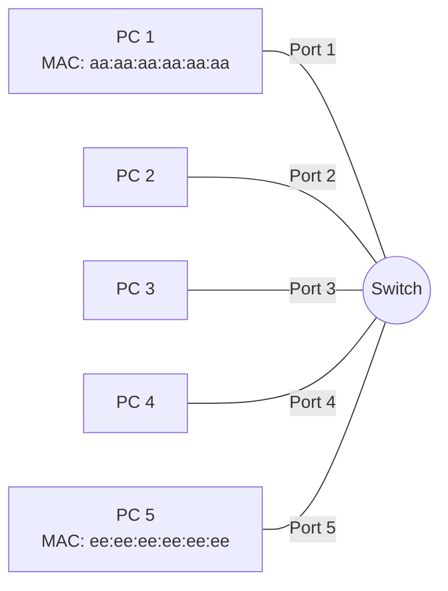
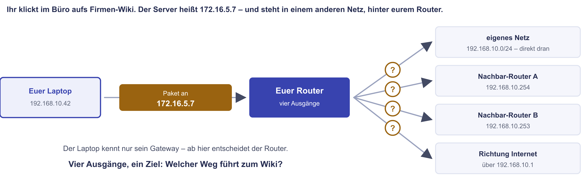
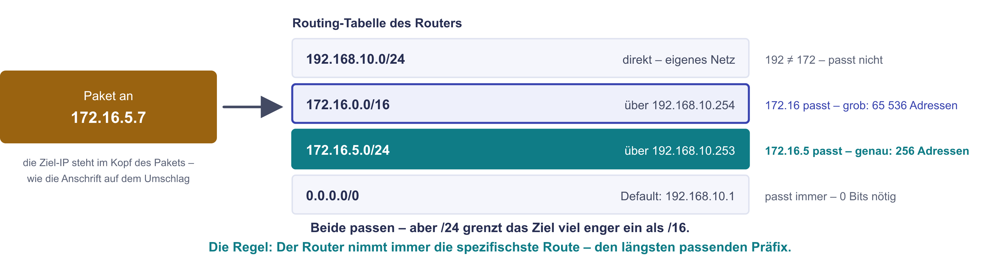
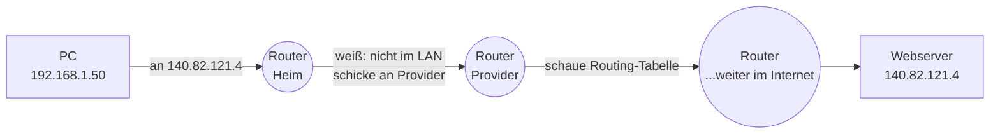
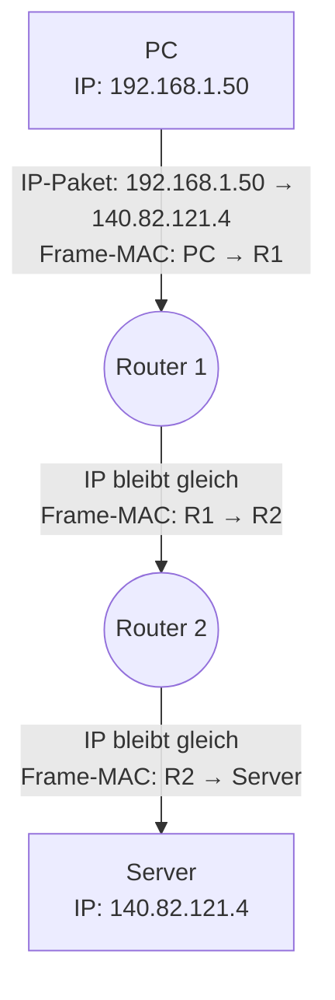
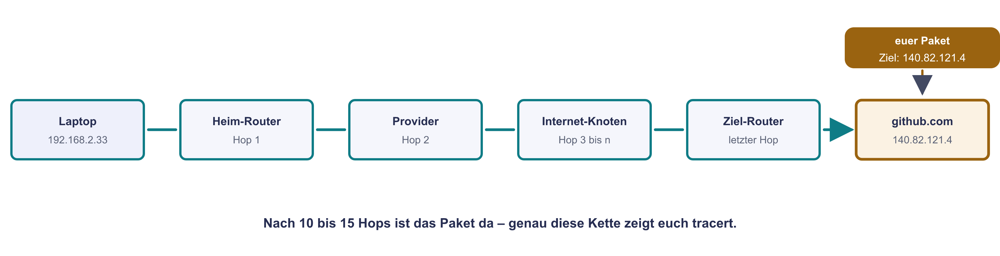
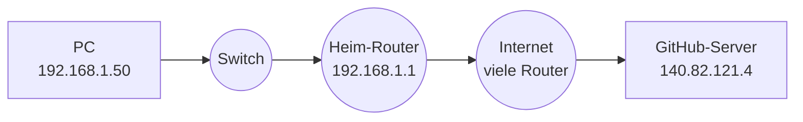

# Routing und Switching

Du hast jetzt **Adressen** verstanden (MAC, IPv4, IPv6). Aber damit Datenpakete tatsächlich von **A nach B** kommen, brauchen wir zwei verschiedene Wege:

- **Switching** ist die **kurze Strecke**, innerhalb eines lokalen Netzes.
- **Routing** ist die **lange Strecke**, von einem Netz ins andere.

Auf dieser Seite schauen wir uns beide an. Am Ende verstehst du, **wie ein Paket den ganzen Weg vom Schreibtisch bis zum GitHub-Server findet**.

!!! abstract "Lernziel"
    Nach dieser Seite kannst du:

    - erklären, was ein **Switch** auf Layer 2 macht und warum er schnell ist
    - eine **MAC-Adresstabelle** lesen
    - sagen, was ein **Router** auf Layer 3 macht und woher er weiß, welchen Weg ein Paket nehmen soll
    - das **Default Gateway** in eigenen Worten erklären
    - die Begriffe **statisches Routing**, **dynamisches Routing**, **OSPF**, **BGP** einordnen
    - in einer kleinen Skizze nachvollziehen, wie ein Paket vom Heim-PC bis zum Webserver wandert

---

## Switching – die kurze Strecke

Ein **Switch** ist ein Gerät, das auf **Layer 2** arbeitet. Er kennt nur **MAC-Adressen**. Innerhalb eines LANs verbindet er die Geräte miteinander.

### Was ein Switch tut

Stell dir vor, du hast fünf Computer, die an einem Switch hängen. Ein Computer (Port 1) will an einen anderen (Port 5) ein Frame schicken.



Der Switch hat eine interne **MAC-Adresstabelle** (auch **CAM-Tabelle** – Content Addressable Memory):

| Port | MAC-Adresse |
|------|-------------|
| 1 | `aa:aa:aa:aa:aa:aa` |
| 2 | `bb:bb:bb:bb:bb:bb` |
| 3 | `cc:cc:cc:cc:cc:cc` |
| 4 | `dd:dd:dd:dd:dd:dd` |
| 5 | `ee:ee:ee:ee:ee:ee` |

Wenn nun PC 1 ein Frame an `ee:ee:ee:ee:ee:ee` (PC 5) schickt:

1. Der Switch liest die **Ziel-MAC** im Frame.
2. Er schaut in seine Tabelle: aha, die MAC liegt an Port 5.
3. Er leitet das Frame **nur an Port 5** weiter – nicht an alle anderen Ports.

So bleibt der Verkehr **gezielt** und die Bandbreite wird effizient genutzt.

!!! info "Was ist ein Hub und warum hat er ausgedient?"
    Ein **Hub** (vor 25 Jahren Standard) macht das **nicht**. Er leitet **jedes** Frame an **alle** Ports weiter – egal, wer der Empfänger ist. Das ist:

    - **ineffizient** (zehnfacher Traffic)
    - **unsicher** (jeder kann mitlesen)
    - **fehleranfällig** (Kollisionen, wenn zwei gleichzeitig senden)

    Heute sieht man Hubs eigentlich nur noch in Museen oder als sehr alte „dumme" Geräte.

### Wie der Switch die Tabelle lernt

Ein Switch **lernt selbst**, welche MAC an welchem Port hängt – durch **Beobachtung**.

1. **Frame kommt rein** an Port X.
2. Switch liest die **Quell-MAC** und merkt sich: „Diese MAC ist an Port X."
3. Wenn die **Ziel-MAC unbekannt** ist, leitet er das Frame an **alle Ports außer Eingangsport** weiter (das heißt **Flooding**).
4. Antwortet der Empfänger, sieht der Switch dessen Quell-MAC und kennt von nun an auch seinen Port.

Die Einträge in der MAC-Tabelle haben einen **Alterungs-Timer** (typisch 5 Minuten), damit sie nicht ewig stehen bleiben. Ein Gerät, das umzieht, wird so automatisch wieder gefunden.

### Wann macht ein Switch nichts mehr?

Drei Situationen, in denen ein Layer-2-Switch nicht mehr weiterhilft:

- **Ziel ist außerhalb des LANs** – braucht Routing.
- **VLAN-getrennt** – braucht VLAN-fähigen Switch oder Router (siehe [Segmentierung und VPN](segmentierung-und-vpn.md)).
- **Unbekannte MAC und kein Antwortgerät vorhanden** – Frame verschwindet im Flooding.

Hier kommt der Router ins Spiel.

---

## Routing – die lange Strecke

{ .diagramm }

{ .diagramm }

Ein **Router** ist ein Gerät, das auf **Layer 3** arbeitet. Er kennt **IP-Adressen** und entscheidet, **zu welchem Netzwerk** ein Paket geht.

### Was ein Router tut

Stell dir vor, dein Heim-Netz hat den Adressbereich `192.168.1.0/24`. Dein Computer hat `192.168.1.50`. Du willst eine Website aufrufen, deren Server-IP `140.82.121.4` ist.



Der Computer ruft den Webserver an. Aber `140.82.121.4` ist **nicht** in seinem LAN (`192.168.1.0/24`). Wohin damit?

Antwort: zum **Default Gateway**.

### Default Gateway

Das **Default Gateway** ist die **IP-Adresse des Routers**, an den alle Pakete gehen, deren Ziel nicht im lokalen Netz liegt.

In einem typischen Heim-Setup:

- PC: `192.168.1.50`
- Default Gateway: `192.168.1.1` (die Fritzbox / der Router)

Wenn der PC ein Paket an eine fremde IP schicken will, sagt er sich: „Das ist nicht in meinem Netz, also an das Default Gateway."

```bash
# Default Gateway anzeigen:
# Linux:
ip route show

# Windows:
ipconfig

# macOS:
netstat -nr
```

### Routing-Tabelle

Jeder Router (und jeder Computer!) hat eine **Routing-Tabelle**. Sie listet: „Für welches Ziel-Netz nehme ich welche Verbindung?"

Eine vereinfachte Tabelle könnte so aussehen:

| Ziel-Netz | Maske | Nächster Hop (Next Hop) | Interface |
|-----------|-------|------------------------|-----------|
| `192.168.1.0` | `/24` | direkt verbunden | `eth0` |
| `10.10.0.0` | `/16` | `192.168.1.254` (VPN-Gateway) | `eth0` |
| `0.0.0.0` | `/0` (alles andere) | `192.168.1.1` (Default Gateway) | `eth0` |

Beim Verschicken eines Pakets schaut der Router von oben nach unten:

1. **Passt** die Ziel-IP zu einem Eintrag? Wenn ja, nimm den nächsten Hop.
2. Wenn **nichts spezifisches** passt, nimm den **Default Gateway-Eintrag** (`0.0.0.0/0`).

Das Prinzip nennt sich **„Longest Prefix Match"** – die Route mit der **spezifischsten** (längsten) Maske gewinnt.

!!! tip "Routing-Tabelle anschauen"
    Du kannst die Routing-Tabelle deines Computers ansehen:

    ```bash
    ip route          # Linux
    route print       # Windows
    netstat -nr       # macOS / Linux
    ```

    Schau mal rein. Du wirst eine `default`- oder `0.0.0.0/0`-Zeile finden – das ist dein Default Gateway.

### Was passiert bei jedem Hop?

Wenn ein Paket von einem Router zum nächsten reist, passiert auf jedem Sprung dasselbe Spiel:

1. Router bekommt ein Frame, packt das IP-Paket aus.
2. Liest die Ziel-IP.
3. Schaut in seine Routing-Tabelle.
4. Bestimmt den nächsten Hop.
5. **Packt ein neues Frame** mit der MAC-Adresse des nächsten Routers (oder Ziel-Geräts, wenn lokal).
6. Schickt es raus.

**Wichtig:** die **IP-Adressen im Paket ändern sich nicht** während der Reise. Die **MAC-Adressen im Frame ändern sich aber bei jedem Sprung**, weil sie nur lokal gelten.



**IP bleibt konstant, MAC ändert sich pro Hop.**

Ein praktisches Werkzeug, um das zu sehen, ist `traceroute` (Linux/Mac) oder `tracert` (Windows):

```bash
traceroute github.com
```

Du siehst die Liste aller Router, durch die dein Paket reist. Typisch sind 10–20 Hops.

---

## Statisches vs. dynamisches Routing

Routen können auf zwei Arten in einer Tabelle landen:

### Statisches Routing

Ein Administrator trägt **manuell** ein: „Pakete an 10.10.0.0/16 schickst du nach 192.168.1.254."

- **Vorteile:** einfach, vorhersehbar, geringer Overhead.
- **Nachteile:** muss bei jeder Änderung **per Hand** angepasst werden. In großen Netzen unpraktikabel.
- **Wo eingesetzt?** kleine Netze, Heim-Setups, einzelne dedizierte Routen.

### Dynamisches Routing

Router **tauschen sich miteinander aus** – sie sagen sich gegenseitig, welche Netze sie erreichen können. Dafür gibt es **Routing-Protokolle**.

- **Vorteile:** passt sich automatisch an Änderungen an (Ausfall, neue Verbindung), skaliert auf große Netze.
- **Nachteile:** komplexer zu konfigurieren, kleiner Overhead.
- **Wo eingesetzt?** in fast jedem größeren Netz und im gesamten Internet.

### Die wichtigsten Routing-Protokolle (Übersicht)

Du musst die Details nicht kennen, aber die Namen begegnen dir ständig.

| Protokoll | Anwendungsbereich | Typ |
|-----------|------------------|-----|
| **RIP** (Routing Information Protocol) | sehr alt, kleine Netze | Distance Vector |
| **OSPF** (Open Shortest Path First) | mittlere bis große Firmen-Netze | Link State |
| **EIGRP** | Cisco-Umfeld | Hybrid |
| **IS-IS** | Service Provider | Link State |
| **BGP** (Border Gateway Protocol) | das **Internet** | Path Vector |

Was du dir merken solltest:

- **OSPF** ist der **Standard innerhalb** von Firmen-Netzen.
- **BGP** ist das Protokoll, mit dem **das Internet zusammengehalten** wird. Jeder ISP redet via BGP mit seinen Nachbarn.

!!! info "BGP-Ausfälle – die Internet-Apokalypse"
    Es gibt ein paarmal pro Jahr News à la „BGP-Konfigurationsfehler bei Provider X – große Teile des Internets sind down". Das passiert, weil ein einzelner falsch konfigurierter BGP-Router weltweit Routen verkündet, die nicht stimmen. Die Konsequenz: Cloudflare, Facebook oder ein ganzer Provider sind **plötzlich unerreichbar**.

    BGP ist eigentlich extrem robust, aber es vertraut den Aussagen seiner Nachbarn. Wer sich einmal verschreibt, kann das ganze Netz aus dem Rhythmus bringen.

---

## Switching + Routing zusammen: der ganze Weg

{ .diagramm }

Lass uns ein durchgängiges Beispiel anschauen: dein PC zu Hause ruft `github.com` auf.



Im **LAN** (PC → Switch → Heim-Router) wird per **MAC-Adresse** zugestellt, **zwischen** den Routern wird per **IP-Adresse geroutet** – die Details Schritt für Schritt:

1. **PC erkennt:** `140.82.121.4` ist nicht in `192.168.1.0/24`. Also an das **Default Gateway** schicken.
2. **PC fragt per ARP:** „Wer hat 192.168.1.1?" → Router antwortet mit seiner MAC.
3. **PC sendet Frame** mit Router-MAC, aber IP-Ziel `140.82.121.4`.
4. **Switch** im Heim-Router leitet das Frame an den Routing-Teil weiter (Layer 2).
5. **Router** packt Frame aus, schaut Routing-Tabelle: nichts spezifisches → Default Gateway. Sendet das Paket mit neuer MAC zum ISP-Router.
6. **ISP-Router** und alle folgenden machen dasselbe: Tabelle, nächster Hop, neue MAC, weiter.
7. Bei **GitHub** angekommen: wieder Layer-2-Switching im internen Rechenzentrum-Netz.
8. **Server** bekommt das Paket, antwortet.

Auf dem **Rückweg** läuft alles in umgekehrter Reihenfolge und die meisten Router wählen ähnliche (oder andere!) Wege.

!!! info "Was kann auf diesem Weg schiefgehen?"
    Eine ganze Menge:

    - **Layer 1:** Kabel kaputt
    - **Layer 2:** Switch zu voll, Frame verworfen
    - **Layer 3:** Router fällt aus, BGP-Fehlkonfiguration im Internet, falsches Default-Gateway
    - **Layer 4:** Port blockiert von Firewall
    - **Layer 7:** Server antwortet mit HTTP 500

    `traceroute` zeigt dir, wo es bei Layer 3 hakt. `ping` testet Layer-3-Erreichbarkeit. `telnet ziel port` testet Layer-4-Erreichbarkeit.

---

## Hop-Limit und Pakete im Kreis

Was passiert, wenn ein Paket durch falsche Routing-Konfiguration **im Kreis** läuft? Damit das nicht ewig dauert, hat jedes IP-Paket ein **TTL** (Time To Live) im Header – der Startwert hängt vom Betriebssystem ab – Linux/macOS setzen 64, Windows 128.

Bei **jedem Hop** zieht der Router 1 von der TTL ab. **Wenn TTL bei 0 angekommen ist**, verwirft der Router das Paket und sendet eine **ICMP-Nachricht** zurück: „TTL exceeded".

Diese Mechanik nutzt **`traceroute`** aus: es sendet Pakete mit absichtlich niedriger TTL (1, 2, 3, …) und liest aus den „TTL exceeded"-Antworten heraus, welche Router auf dem Weg liegen.

Bei IPv6 heißt das Gegenstück **Hop Limit**, funktioniert aber genauso.

---

## Routing in Software – warum jedes Gerät eine Routing-Tabelle hat

Erstaunlich, aber wahr: **jedes Gerät**, auch dein normaler Computer, hat eine **Routing-Tabelle**. Auch wenn du gar kein Router bist.

Warum?

- Dein Computer muss entscheiden: ist das Ziel im **lokalen Netz** (direkt erreichbar, Layer 2 reicht) oder **außerhalb** (an Default Gateway)?
- Bei mehreren Netzwerk-Adaptern (z.B. WLAN + Ethernet + VPN): welche Route nimmt der Verkehr?
- Wenn ein VPN aktiv ist, fügt es Routen hinzu: „Pakete an `10.0.0.0/8` sollen durch den VPN-Tunnel."

Du kannst deine eigene Routing-Tabelle ansehen mit `ip route` (Linux), `route print` (Windows) oder `netstat -nr` (macOS).

---

## Was du jetzt wissen solltest

- **Switching** ist Layer 2, basiert auf **MAC-Adressen**, gilt nur **innerhalb eines LANs**.
- **Routing** ist Layer 3, basiert auf **IP-Adressen**, verbindet **verschiedene Netze**.
- Ein **Switch lernt** seine MAC-Tabelle automatisch durch Beobachtung des Verkehrs.
- Ein **Router** entscheidet anhand seiner **Routing-Tabelle**, wohin ein Paket geht. Bei nichts Spezifischem geht es ans **Default Gateway**.
- **Statische Routen** trägt ein Admin manuell ein, **dynamische Routen** lernen sich Router gegenseitig durch Routing-Protokolle (OSPF intern, BGP zwischen ISPs).
- Auf dem Weg ändern sich **MAC-Adressen pro Hop**, **IP-Adressen bleiben konstant**.
- **TTL/Hop Limit** verhindert, dass Pakete ewig im Kreis laufen.

---

## Beispielfragen zur Selbstkontrolle

??? question "Frage 1: Du sollst zwei Standorte einer Firma verbinden. Die Server in Standort A sollen die Drucker in Standort B erreichen. Welche Geräte und Konfigurationen brauchst du?"
    Du brauchst mindestens:

    - **Router** in beiden Standorten (oder eine Firewall mit Routing-Funktion)
    - eine **Verbindung** zwischen beiden – z.B. Site-to-Site-VPN über das Internet
    - **Routen** in beiden Routing-Tabellen, die das jeweils andere Subnetz kennen
    - **Firewall-Regeln**, die den Drucker-Verkehr passieren lassen
    - ggf. **DNS-Einträge**, damit die Drucker per Namen erreichbar sind

    Ohne mindestens **statische Routen** oder ein dynamisches Routing-Protokoll (z.B. OSPF zwischen den Sites) wissen die Router nicht, wohin sie Pakete schicken sollen.

??? question "Frage 2: Welche Rolle spielt das Default Gateway und was passiert ohne korrekt konfiguriertes Default Gateway?"
    Das **Default Gateway** ist die IP-Adresse des Routers, an den dein Computer alle Pakete schickt, deren Ziel **nicht im lokalen Subnetz** liegt.

    Ohne Default Gateway:

    - lokale Kommunikation funktioniert weiter (Switch reicht)
    - **Internet ist unerreichbar**
    - andere Subnetze (z.B. Druck-Netz) sind unerreichbar
    - DNS-Server außerhalb des LANs sind unerreichbar

    Ergebnis: der Rechner ist in seinem eigenen Subnetz „eingesperrt".

??? question "Frage 3: Du machst 'traceroute github.com' und siehst nach 5 Hops nur noch Sterne (*). Was bedeutet das?"
    Möglichkeiten:

    1. Der Router an dieser Stelle **antwortet absichtlich nicht** auf ICMP-Pakete (häufig bei Backbone-Routern aus Sicherheitsgründen). Das ist normal, dein Paket kommt aber trotzdem an.
    2. Der Router **ist tatsächlich nicht erreichbar** – dann brechen Pings durch.
    3. Eine **Firewall** zwischen euch blockiert die TTL-Expired-Antworten.

    Wenn die Webseite trotzdem lädt, ist es Fall 1 (kein Problem). Wenn nicht, hast du wirklich ein Verbindungs-Problem.

??? question "Frage 4: Welches Routing-Protokoll würdest du intern in einem Firmen-Netz mit 50 Routern einsetzen – und welches nicht?"
    **Sinnvoll:** **OSPF** (Open Shortest Path First) – schnell, skaliert gut für mittlere bis große Netze, herstellerunabhängig.

    **Auch möglich:** EIGRP (nur in Cisco-Umgebungen) oder IS-IS (sehr große Provider-Netze).

    **Eher nicht:** **RIP** (zu alt, max. 15 Hops) und **BGP** (BGP nutzt man zwischen Autonomous Systems, nicht intern – obwohl es auch interne BGP-Varianten gibt für Spezialfälle).

---

## Merksatz

!!! success "Merksatz"
    > **Switch = Layer 2 = MAC-Adressen = innerhalb des LAN. Router = Layer 3 = IP-Adressen = zwischen LANs. Was nicht zum lokalen Netz gehört, geht zum Default Gateway. Routing-Tabellen entscheiden den Weg, „Longest Prefix Match" ist die Regel. Auf jedem Hop ändert sich die MAC, die IP bleibt.**

---

## Weiterlesen

- [DNS](dns.md): bevor das Paket verschickt wird, muss der Name aufgelöst werden
- [DHCP](dhcp.md): woher das Gerät seine IP-Adresse, das Default Gateway und den DNS-Server bekommt
- [Netzwerk-Hardware](netzwerk-hardware.md): Switches, Router und andere Geräte im Detail
