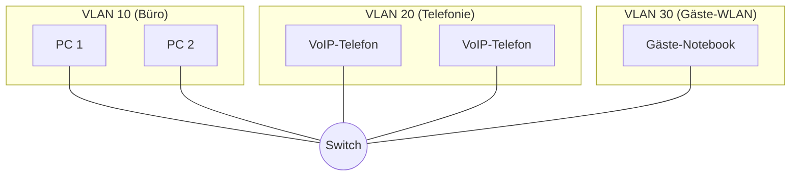
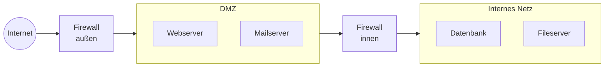
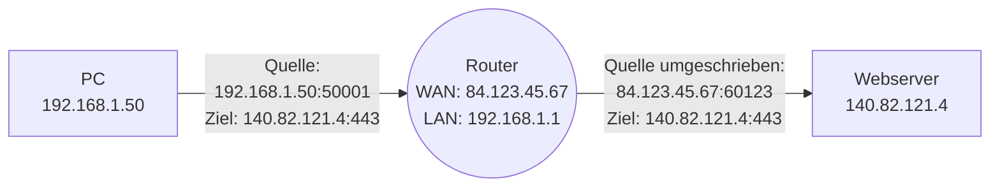
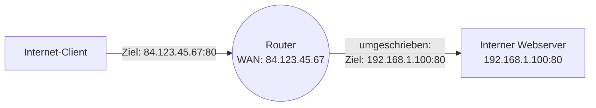
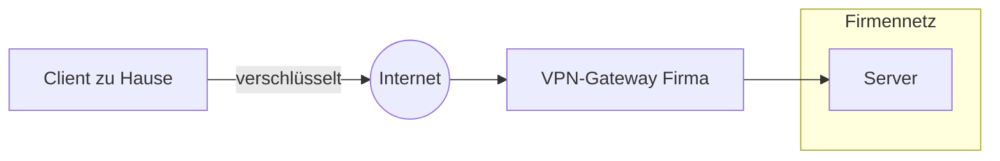
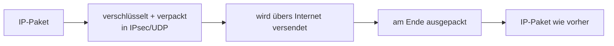

# Segmentierung und VPN: VLAN, DMZ, NAT, Tunneling

Ein **flaches Netz**, in dem jedes Gerät jedes andere erreicht, ist einfach zu bauen – aber **gefährlich**. Eine einzige kompromittierte Workstation könnte sich auf alle Server, Drucker, Kameras und IoT-Geräte ausbreiten. Deswegen baut man Netze **segmentiert** – mit logischen Trennungen, die genau festlegen, wer was darf.

In diesem Kapitel: **VLAN** für die Trennung **innerhalb** eines Standorts, **DMZ** als Schutzzone für öffentliche Dienste, **NAT** für die Brücke zwischen privaten und öffentlichen IPs, und **VPN** für sichere Verbindungen **über** das öffentliche Internet.

!!! abstract "Lernziel"
    Nach dieser Seite kannst du:

    - die Idee von **Netzwerk-Segmentierung** in eigenen Worten erklären und ihre Vorteile nennen
    - **VLAN** verstehen und einordnen, wann man es einsetzt
    - die **DMZ** als Sicherheitszone benennen und beschreiben
    - **NAT** in seinen Hauptformen (Source-NAT, Destination-NAT, PAT) unterscheiden
    - **VPN-Typen** (Site-to-Site, Client-to-Site) auseinanderhalten und gängige Protokolle (IPsec, OpenVPN, WireGuard) zuordnen
    - **Tunneling** als Konzept erklären

---

## Warum Segmentierung?

Ohne Segmentierung:

- ein einziger virusbefallener PC infiziert das ganze Netz
- der Praktikant kommt versehentlich an die Buchhaltungs-Server
- die Cyber-Security-Maßnahmen sind eine einzige Linie statt mehrerer
- das gesamte Netz ist eine **flache** Broadcast-Domäne, was bei vielen Geräten zu Performance-Problemen führt

Mit Segmentierung:

- **kleinere Broadcast-Domänen** → besseres Skalierungsverhalten
- **klare Trennung** zwischen Office-Geräten, Produktion, Gäste-WLAN, Servern
- **klare Sicherheits-Grenzen**: Firewall-Regeln können zwischen Segmenten greifen
- **Compliance**: viele Regularien (PCI-DSS, ISO 27001) verlangen Segmentierung

!!! tip "Schiffs-Analogie"
    Ein Frachtschiff hat **Schotten** – wasserdichte Trennwände zwischen den Abteilungen. Wenn der Rumpf an einer Stelle leck wird, läuft nicht das ganze Schiff voll, sondern nur eine Abteilung. So bleibt das Schiff schwimmfähig.

    Genauso ist Netzwerk-Segmentierung. Wenn ein Bereich kompromittiert wird, breitet sich das Problem nicht aufs ganze Netz aus. Es bleibt in seiner „Schotte".

---

## VLAN – virtuelles LAN

Ein **VLAN** (Virtual LAN) ist eine **logische Trennung** innerhalb eines physischen Netzwerks. Mehrere VLANs nutzen dieselben Switches und Kabel, sind aber **so getrennt, als wären sie separate Switches**.

Auf dem **gleichen Switch** laufen drei voneinander **isolierte** Netze. Geräte in VLAN 10 können Geräte in VLAN 20 oder 30 **nicht direkt erreichen**, obwohl sie am selben Switch hängen.

### Wie VLAN technisch funktioniert

Jedes Frame bekommt einen **VLAN-Tag** (eine kleine ID, das **802.1Q-Tag**). Der Switch entscheidet anhand des Tags, wo das Frame hin darf.

**Port-Konfigurationen:**

| Port-Typ | Bedeutung |
|----------|-----------|
| **Access Port** | gehört zu **einem** VLAN. Der angeschlossene Computer weiß nichts vom VLAN. |
| **Trunk Port** | kann **mehrere VLANs** transportieren. Frames werden mit ihrem Tag versehen. |

Ein Trunk-Port verbindet typischerweise **Switches untereinander** oder einen Switch mit einem **VLAN-fähigen Server** (z.B. einem Hypervisor mit mehreren VLANs).

### Wann braucht man Routing zwischen VLANs?

VLANs trennen die Layer-2-Welt. Wenn ein Gerät in VLAN 10 ein Gerät in VLAN 20 erreichen will, geht das nur **über einen Router** oder **Layer-3-Switch**, der dann die Verbindung erlaubt – oder eben blockiert per Firewall-Regel.

**Typische VLAN-Aufteilung in einer Firma:**

| VLAN | Wofür |
|------|-------|
| 10 | Office-PCs |
| 20 | Server |
| 30 | VoIP |
| 40 | Gäste-WLAN |
| 50 | Drucker |
| 99 | Management (Switche, APs, etc.) |

Welche VLAN miteinander reden dürfen, steuert die Firewall.

### Vorteile von VLAN

- **Sicherheits-Trennung** ohne neue Kabel
- **Bessere Performance** (kleinere Broadcast-Domänen)
- **Flexible Umgestaltung** ohne physisches Umstecken
- **Compliance** (z.B. Trennung von Produktions- und Office-Netz)

### Nachteile

- braucht **managed Switches** (kostet)
- braucht **Planung und Dokumentation**
- ein Konfigurations-Fehler kann mehr Schaden anrichten als bei einem flachen Netz

---

## DMZ – die entmilitarisierte Zone

Eine **DMZ** (DeMilitarized Zone) ist eine **Pufferzone** zwischen dem **Internet** und dem **internen Netz**, in der man **öffentliche Dienste** platziert.

**Idee:** wenn ein Server in der DMZ gehackt wird, kommt der Angreifer **nicht** ins interne Netz. Die innere Firewall stoppt ihn.

In der **DMZ stehen** typischerweise:

- öffentlich erreichbare **Webserver**
- **Mail-Gateways**
- **DNS-Server**
- **Reverse Proxies**

Im **internen Netz** stehen:

- **Datenbanken**
- **Fileserver**
- **Verzeichnisdienste** (Active Directory)
- **Backup-Systeme**

**Datenfluss:**

- Internet → DMZ: erlaubt (z.B. HTTPS auf den Webserver)
- DMZ → Intern: **streng kontrolliert** (nur die nötigen Verbindungen, z.B. Webserver darf SQL-Anfragen an die Datenbank stellen)
- Intern → DMZ: erlaubt
- Intern → Internet: erlaubt (mit Proxy/Firewall-Regeln)

Heute ist der reine **Drei-Zonen-Aufbau** (Internet ↔ DMZ ↔ Intern) oft erweitert oder durch **Zero-Trust-Architekturen** ersetzt – mehr dazu in [Netzwerk-Sicherheit](netzwerk-sicherheit.md).

---

## NAT – Network Address Translation

**NAT** „übersetzt" eine IP-Adresse beim Durchqueren eines Routers. Der Hauptgrund: **private IP-Adressen** im LAN, **öffentliche IP-Adressen** im Internet.

### Source-NAT (SNAT) – der Klassiker

Dein Heim-Router macht das ständig.

Ablauf:

1. Dein PC `192.168.1.50` schickt eine Anfrage an den Webserver.
2. Der Router schreibt die **Quell-IP** (`192.168.1.50`) auf **seine eigene öffentliche IP** (`84.123.45.67`) um.
3. Der Router merkt sich in seiner **NAT-Tabelle**: „Antwort auf Port 60123 gehört zu `192.168.1.50:50001`."
4. Antwort vom Server kommt an `84.123.45.67:60123`, der Router schreibt wieder um auf `192.168.1.50:50001`.

So **teilen sich Millionen Geräte** weltweit eine kleine Anzahl öffentlicher IPs.

### PAT – Port Address Translation

Wenn **mehrere interne Geräte** über **eine** öffentliche IP nach außen gehen, muss der Router pro Verbindung einen **anderen Quell-Port** wählen, um die Antworten auseinander zu halten. Das nennt sich **PAT** (auch **NAT Overload**).

In der Praxis nutzt jeder Heim-Router PAT – nur sagt es niemand so technisch.

### Destination-NAT (DNAT) – Port Forwarding

Anders herum: jemand von außen will einen internen Server erreichen.

Im Heim-Router heißt das **Port-Weiterleitung**. „Wenn jemand auf meinem WAN-Port 80 ankommt, leite das zu 192.168.1.100:80."

Vorsicht: Port-Weiterleitungen **öffnen Türen ins interne Netz**. Nur einsetzen, wo wirklich nötig.

### Vor- und Nachteile von NAT

**Vorteile:**

- spart öffentliche IPv4-Adressen
- bietet einen **„Beifang-Schutz"** (interne Geräte sind von außen nicht direkt erreichbar)

**Nachteile:**

- erschwert manche Anwendungen (z.B. VoIP, Online-Gaming, manche Peer-to-Peer-Szenarien)
- **bricht das Ende-zu-Ende-Prinzip** des Internets
- in **IPv6 nicht mehr nötig** (genug Adressen für alle)

---

## VPN – Virtual Private Network

Ein **VPN** ist ein **verschlüsselter Tunnel** über ein öffentliches Netz, der zwei Netzpunkte verbindet, als wären sie im selben LAN.

Sobald das VPN aufgebaut ist, kann der Client den Server erreichen, als säße er direkt im Firmennetz.

### Zwei Haupt-Typen

| Typ | Wer mit wem | Beispiel |
|-----|-------------|----------|
| **Client-to-Site** | einzelner Anwender → Firmennetz | Home-Office |
| **Site-to-Site** | zwei Netze → ein gemeinsames Netz | zwei Filialen verbinden, Cloud anbinden |

### Wichtige VPN-Protokolle

| Protokoll | Charakteristik |
|-----------|----------------|
| **IPsec** | Industriestandard, komplex zu konfigurieren, sehr ausgereift |
| **OpenVPN** | Open-Source, läuft über TCP oder UDP, sehr verbreitet |
| **WireGuard** | modern (seit ca. 2018), schlank, schnell, einfacher zu konfigurieren |
| **L2TP/IPsec** | älter, oft mit IPsec kombiniert |
| **PPTP** | veraltet, **unsicher**, nicht mehr verwenden |
| **SSL-VPN** | über HTTPS, läuft auch durch restriktive Firewalls (z.B. Cisco AnyConnect, Fortinet) |

**Heutige Empfehlung:**

- **WireGuard** für neue Setups – einfach, schnell, sicher
- **IPsec** in großen Unternehmen, oft die etablierte Lösung
- **OpenVPN** wenn Flexibilität und Kompatibilität zählen

### Was VPN nicht ist

- **Kein Anonymisierungs-Werkzeug per se.** Ein VPN verbirgt deine IP gegenüber dem Endserver, aber dein VPN-Provider sieht alles. Wenn der mitschreibt, gibt es nichts „anonymes".
- **Kein Schutz vor Tracking.** Cookies, Fingerprinting & Co. funktionieren weiter.
- **Kein Schutz vor Malware** auf deinem Endgerät.

VPN ist ein Werkzeug für **sichere Verbindungen**, nicht für **Privacy in den sozialen Medien**.

---

## Tunneling – das Prinzip hinter VPN

**Tunneling** ist das allgemeine Prinzip: man verpackt ein Protokoll **in einem anderen Protokoll**.

Anwendungen:

- **VPNs**: ein IP-Paket im verschlüsselten Tunnel
- **GRE-Tunnel**: ein IP-Paket in einem GRE-Header (für Routing-Topologie ohne Verschlüsselung)
- **SSH-Port-Tunneling**: ein TCP-Stream im SSH-Tunnel
- **IPv6 over IPv4**: 6to4, 6in4 – damit man IPv6 über alte IPv4-Netze fahren kann

---

## Cloud-VPN und Zero-Trust

Zwei neuere Trends, die hier auftauchen:

### Cloud-VPN

Bei Cloud-Anbietern wie AWS, Azure oder Google Cloud baust du Site-to-Site-VPNs **als Service**. Ein paar Klicks im Portal, ein Stück Konfiguration auf deiner Firmen-Firewall – und schon hängen Cloud und On-Premise zusammen.

**Beispiel-Komponenten:**

- AWS Site-to-Site VPN
- Azure VPN Gateway
- Google Cloud HA VPN

### Zero-Trust statt VPN

In modernen Setups ersetzt man VPNs zunehmend durch **Zero-Trust-Architekturen** (siehe [Netzwerk-Sicherheit](netzwerk-sicherheit.md#zero-trust)). Statt eines Tunnels ins Firmennetz wird **jede einzelne Verbindung** authentifiziert – egal, wo der Nutzer sitzt.

**Tools wie:**

- **Cloudflare Zero Trust**
- **Tailscale** (auf WireGuard-Basis, aber zentral verwaltet)
- **Zscaler**
- **Google BeyondCorp**

Diese Modelle gehen davon aus, dass auch das interne Netz **kein vertrauenswürdiger Ort** ist. Jeder Zugriff muss sich neu beweisen.

---

## Was du jetzt wissen solltest

- **Segmentierung** trennt Netze logisch, um Sicherheit und Performance zu erhöhen.
- **VLAN** ist die Standardtechnik dafür im LAN. Braucht managed Switches und VLAN-Tags.
- **DMZ** ist eine Pufferzone zwischen Internet und internem Netz für öffentliche Dienste.
- **NAT** übersetzt IP-Adressen: SNAT verbirgt interne, DNAT (Port-Weiterleitung) macht interne Dienste von außen erreichbar.
- **VPN** verbindet entfernte Netze oder einzelne Clients sicher über das Internet.
- Wichtige VPN-Protokolle: **IPsec** (Standard), **OpenVPN**, **WireGuard** (modern). **PPTP** vermeiden.
- **Tunneling** ist das allgemeine Prinzip – ein Protokoll in einem anderen.
- **Zero-Trust** verändert die Spielregeln: nicht mehr „Tunnel ins Netz", sondern „jede Verbindung einzeln prüfen".

---

## Merksatz

!!! success "Merksatz"
    > **VLAN trennt logisch im LAN, DMZ ist die Pufferzone zwischen Internet und Intern. NAT übersetzt private in öffentliche IPs (SNAT) oder leitet umgekehrt rein (DNAT). VPN baut einen verschlüsselten Tunnel über das Internet. Zero-Trust ersetzt zunehmend VPN: jede Verbindung muss sich beweisen. Schotten halten ein Schiff schwimmfähig – Segmentierung hält ein Netz sicher.**

---

## Weiterlesen

- [Netzwerk-Sicherheit](netzwerk-sicherheit.md): Firewalls, IDS/IPS und Zero-Trust im Detail
- [Industrie-Protokolle](industrie-protokolle.md): warum Produktionsnetze besonders gut segmentiert sein müssen
- [Adressierung](adressierung.md): warum NAT überhaupt nötig wurde (private vs. öffentliche IPs)
