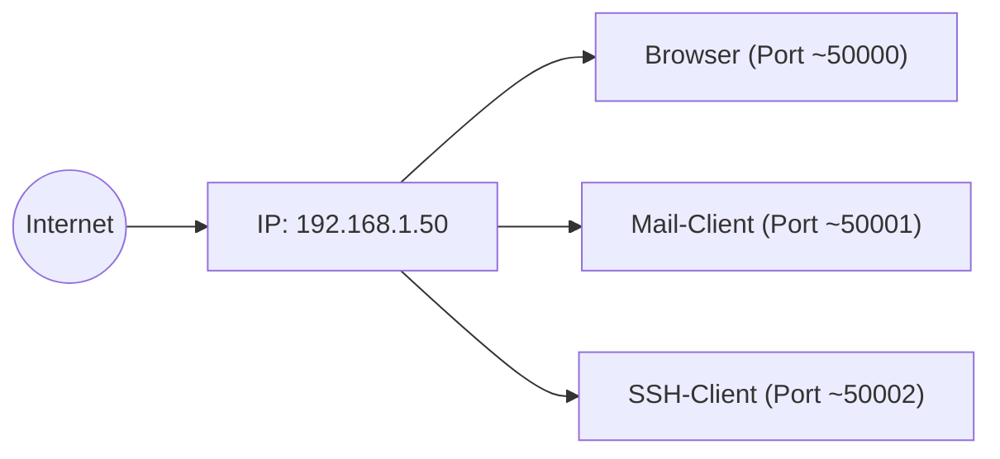
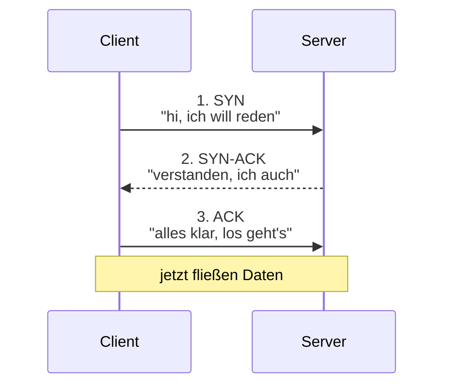
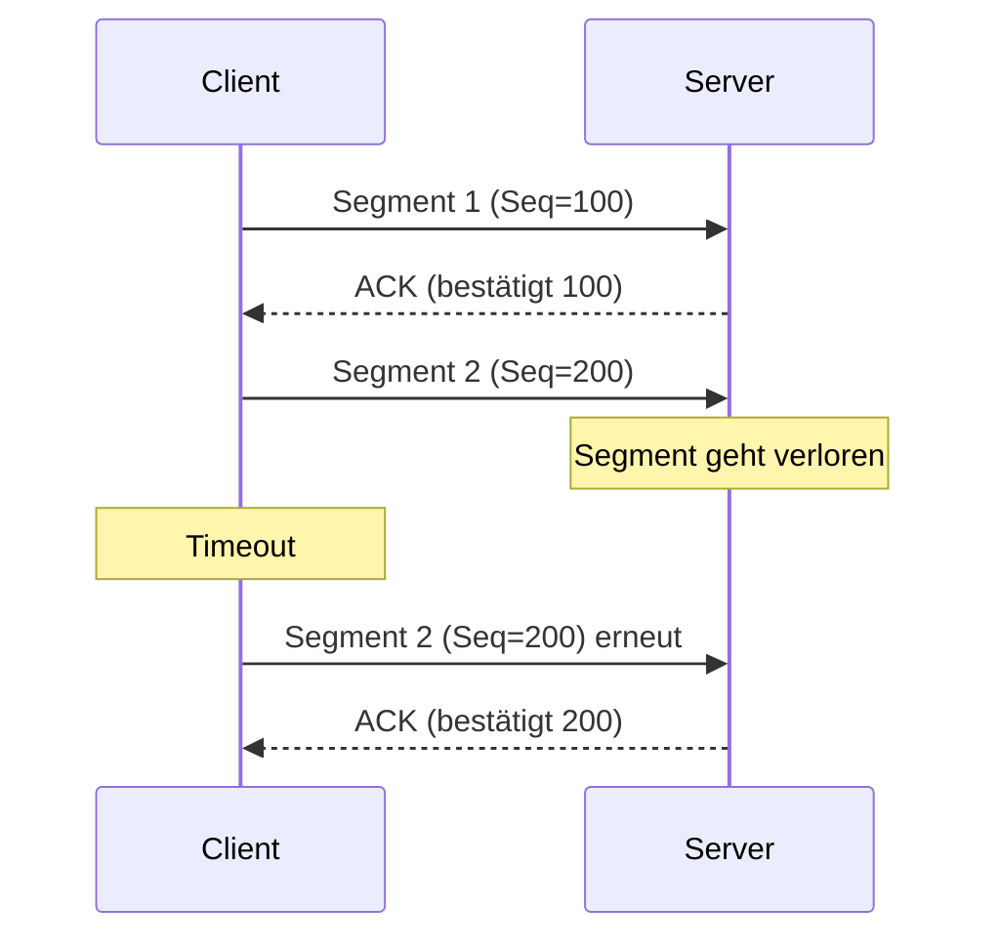

# Transport-Protokolle: TCP und UDP

Auf der **Vermittlungsschicht (Layer 3)** transportieren IP-Pakete deine Daten irgendwie zum Ziel-Computer. Aber ein Computer hat **viele Anwendungen** gleichzeitig laufen: Browser, Mail, Spotify, Zoom, ein Datenbank-Server, ein Web-Server. Welche Anwendung soll das ankommende Paket bekommen?

Das ist die Aufgabe der **Transportschicht (Layer 4)**. Sie sorgt dafür, dass aus einer Verbindung **zwischen Rechnern** eine Verbindung **zwischen Anwendungen** wird. Dafür gibt es zwei wichtige Protokolle: **TCP** und **UDP**.

!!! abstract "Lernziel"
    Nach dieser Seite kannst du:

    - in einem Satz sagen, was die Transportschicht macht
    - **Ports** und ihre Rolle erklären, wichtige **Well-Known Ports** nennen
    - den **TCP-3-Way-Handshake** beschreiben
    - die wichtigsten **TCP-Features** auseinanderhalten: Reihenfolge, Bestätigung, Retransmissions, Flow Control, Congestion Control
    - **UDP** in eigenen Worten erklären und Anwendungsfälle nennen
    - sagen, **wann TCP und wann UDP** das richtige Protokoll ist

---

## Was die Transportschicht macht

Ein Rechner hat **eine** IP-Adresse. Aber **mehrere Anwendungen** laufen gleichzeitig.



Damit der Computer weiß, welches Paket zu welcher Anwendung gehört, gibt es **Ports**. Eine **IP + Port** zusammen heisst **Socket** und beschreibt eindeutig eine **Verbindungs-Endpunkt**.

---

## Ports

Ein **Port** ist eine 16-Bit-Zahl (0 bis 65.535). Er wird auf beiden Seiten einer Verbindung verwendet:

- **Server-Port:** typisch ein **Well-Known Port** (0 bis 1023), z.B. 80 für HTTP, 443 für HTTPS.
- **Client-Port:** typisch ein **dynamischer Port** (49.152 bis 65.535), wird zufällig gewählt.

Eine Verbindung hat also vier Werte: **Quell-IP, Quell-Port, Ziel-IP, Ziel-Port.** Das nennt man **4-Tupel** oder **Connection-Tuple**.

### Wichtige Well-Known Ports

Diese musst du kennen:

| Port | Protokoll | Wofür |
|------|-----------|-------|
| **20, 21** | FTP | Datei-Übertragung (Daten, Steuerung) |
| **22** | SSH | sicherer Remote-Login |
| **23** | Telnet | alter Remote-Login (unverschlüsselt, veraltet) |
| **25** | SMTP | E-Mail-Versand |
| **53** | DNS | Namensauflösung |
| **67, 68** | DHCP | Adress-Vergabe (Server/Client) |
| **80** | HTTP | Web (unverschlüsselt) |
| **110** | POP3 | E-Mail-Empfang (alt) |
| **143** | IMAP | E-Mail-Empfang (modern) |
| **443** | HTTPS | Web (verschlüsselt) |
| **587** | SMTP (mit STARTTLS) | E-Mail-Versand sicher |
| **993** | IMAPS | IMAP über TLS |
| **3389** | RDP | Windows Remote Desktop |
| **5432** | PostgreSQL | Datenbank |
| **3306** | MySQL/MariaDB | Datenbank |
| **6379** | Redis | Key-Value-Store |
| **8080** | HTTP-Alternative | oft für Test-Server |

Du musst sie nicht alle auswendig kennen. Aber **22, 53, 80, 443** solltest du im Schlaf können.

### Port-Bereiche

| Bereich | Name | Wer entscheidet darüber? |
|---------|------|--------------------------|
| **0 – 1023** | Well-Known Ports | von IANA vergeben (für Server-Dienste) |
| **1024 – 49.151** | Registered Ports | von IANA registriert, aber freier |
| **49.152 – 65.535** | Dynamic / Ephemeral Ports | für Client-Verbindungen |

Auf Linux und macOS dürfen Programme **unter Port 1024** nur mit Admin-Rechten gestartet werden – damit nicht jeder einen Web-Server mit Schadcode auf Port 80 hochziehen kann.

---

## TCP – die zuverlässige Variante

**TCP** steht für **Transmission Control Protocol**. Es ist das Standard-Protokoll für **fast alles**, wo es auf Vollständigkeit und Reihenfolge ankommt.

### Was TCP garantiert

- **Verbindungsorientiert:** Sender und Empfänger handeln **zuerst eine Verbindung** aus, dann fließen Daten, am Schluss wird die Verbindung sauber abgebaut.
- **Zuverlässig:** verloren gegangene Pakete werden **automatisch neu gesendet** (Retransmissions).
- **In Reihenfolge:** wenn Pakete in falscher Reihenfolge ankommen, sortiert der Empfänger sie wieder, bevor er sie an die Anwendung gibt.
- **Fluss-Kontrolle (Flow Control):** der Empfänger sagt dem Sender, wie viel er gerade verarbeiten kann.
- **Stau-Vermeidung (Congestion Control):** TCP merkt, wenn das Netz überlastet ist, und drosselt sich selbst.
- **Datenintegrität:** Prüfsummen erkennen kaputte Pakete.

All das kostet **Overhead**, weshalb TCP nicht für alles ideal ist.

### Der 3-Way-Handshake

Bevor Daten fließen, müssen Sender und Empfänger sich „bekannt machen". Das passiert in **drei Schritten**:



- **SYN** (Synchronize): „Ich möchte eine Verbindung aufbauen."
- **SYN-ACK**: „Bestätigt – ich bin bereit, hier ist meine Antwort."
- **ACK** (Acknowledge): „Bestätigt deine Bestätigung. Lass uns reden."

Mit dem Handshake einigen sich beide Seiten auf **Sequenznummern**, um spätere Pakete zu nummerieren und zu sortieren.

!!! tip "Telefon-Analogie"
    Du rufst eine Freundin an:

    1. Du wählst, das Telefon klingelt (SYN).
    2. Sie nimmt ab und sagt „Hallo?" (SYN-ACK).
    3. Du antwortest „Hi, hier ist Anna" (ACK).

    Jetzt erst beginnt das Gespräch. Genauso macht es TCP – drei Höflichkeitsschritte, bevor die eigentlichen Daten fließen.

### Datenübertragung mit Bestätigung

Während der Verbindung gehen Pakete (eigentlich **Segmente** auf Layer 4) hin und her. Für jedes empfangene Segment schickt der Empfänger ein **ACK** zurück. Wenn ein ACK ausbleibt, sendet TCP nach einem Timeout neu.



Das funktioniert pro Segment und macht TCP **robust**, aber **langsamer** als ungesicherte Übertragung.

### Verbindungsabbau

Am Ende wird die Verbindung sauber abgebaut. Das geht in **vier Schritten**:

- **FIN** vom Sender: „Ich bin mit dem Senden fertig."
- **ACK** vom Empfänger: „Verstanden."
- **FIN** vom Empfänger: „Ich auch."
- **ACK** vom Sender: „Verstanden. Verbindung zu."

So sind beide Richtungen ordentlich geschlossen. Das ist wichtig, weil eine TCP-Verbindung **bidirektional** ist – beide Seiten können bis zum Schluss noch Daten senden.

### Flow Control

Der Empfänger sagt dem Sender mit jedem ACK: **„Mein Empfangsfenster ist gerade X Bytes groß."** Wenn der Empfänger gerade voll ist (weil die Anwendung die Daten nicht schnell genug abholt), wird das Fenster kleiner und der Sender drosselt.

Das verhindert, dass ein schneller Sender einen langsamen Empfänger überfährt.

### Congestion Control

Wenn TCP merkt, dass Pakete verloren gehen, **verkleinert es seine Senderate**. Wenn alles glatt läuft, **erhöht es sie** wieder.

Die genauen Algorithmen (Reno, CUBIC, BBR, …) sind ein eigenes Thema. Wichtig zu wissen: **TCP ist ein guter Netz-Bürger** und drosselt sich, damit das Netz nicht zusammenbricht.

---

## UDP – die schnelle Variante

**UDP** steht für **User Datagram Protocol**. Es ist das **Gegenstück zu TCP** und macht **viel weniger**.

### Was UDP garantiert

…fast nichts.

- **Verbindungslos:** keine Handshakes, kein Aufbau, kein Abbau.
- **Unzuverlässig:** verlorene Pakete werden **nicht** neu gesendet.
- **Ohne Reihenfolge:** Pakete kommen in der Reihenfolge an, in der sie das Netz durchquert haben.
- **Keine Flow Control, keine Congestion Control.**
- **Datenintegrität:** nur per Prüfsumme erkennen, ob ein Paket kaputt ist – nicht korrigieren.

Klingt schlecht? Manchmal ist genau das **gewollt**.

### Wann UDP Sinn macht

- **Echtzeit-Anwendungen**: Sprachübertragung (VoIP), Videokonferenzen, Online-Spiele. Wenn ein Paket verloren geht, ist es zu spät, es neu zu senden – das verlorene Stück Sprache ist eh schon vorbei.
- **Massive Sender**: DNS-Anfragen, NTP (Zeit-Synchronisation) – kurze Anfrage, schnelle Antwort, kein Verbindungs-Overhead.
- **Broadcasts/Multicasts**: TCP kann das nicht, UDP schon.
- **Streaming**: viele Streaming-Protokolle nutzen UDP-basierte Verfahren (RTP, QUIC).

### UDP-Header

UDP ist sehr schlank. Ein UDP-Header hat nur:

- Quell-Port (16 Bit)
- Ziel-Port (16 Bit)
- Länge (16 Bit)
- Prüfsumme (16 Bit)

= **8 Byte** Overhead. TCP hat dagegen 20–60 Byte. Bei kleinen Anfragen ist UDP daher massiv effizienter.

---

## TCP vs. UDP im direkten Vergleich

| Aspekt | TCP | UDP |
|--------|-----|-----|
| **Verbindung** | ja (Handshake nötig) | nein |
| **Zuverlässigkeit** | ja (Retransmissions) | nein |
| **Reihenfolge** | ja | nein |
| **Flow Control** | ja | nein |
| **Congestion Control** | ja | nein |
| **Header-Overhead** | 20–60 Byte | 8 Byte |
| **Geschwindigkeit** | langsamer | schneller |
| **Typische Anwendung** | HTTP, HTTPS, SSH, FTP, SMTP | DNS, NTP, VoIP, Video, Spiele |
| **Beispiel-Port** | 80, 443, 22, 25 | 53, 67/68, 123 |

!!! tip "Eselsbrücke"
    - **TCP** = **T**otal **C**ontrol **P**rotocol – kümmert sich um alles.
    - **UDP** = **U**nzuverlässig, **D**afür **P**fundig schnell.

    Im echten Berufsleben siehst du beides ständig.

---

## QUIC – das moderne Hybrid

Seit etwa 2020 verbreitet sich **QUIC** (Quick UDP Internet Connections). Es ist **TCP-Funktionalität auf UDP-Basis**, optimiert für moderne Web-Anwendungen.

- Eigentlich **UDP** auf Layer 4
- Aber **Zuverlässigkeit, Reihenfolge, Verschlüsselung** in der Anwendungsschicht
- **HTTP/3** läuft über QUIC

Vorteil: weniger Round-Trips beim Verbindungsaufbau, besseres Verhalten bei Netzwerkwechsel (z.B. von WLAN zu Mobilfunk).

Wenn du in der Browser-Devtools mal `h3` als Protokoll siehst – das ist QUIC.

---

## Sockets und Verbindungs-Tracking

Auf der Programmier-Seite spricht man von **Sockets**. Ein Socket ist eine Programmier-Schnittstelle, um auf TCP- oder UDP-Verbindungen zuzugreifen.

Typischer Server-Code (vereinfacht):

```python
import socket

server = socket.socket(socket.AF_INET, socket.SOCK_STREAM)  # TCP
server.bind(("0.0.0.0", 8080))
server.listen()
client, addr = server.accept()
data = client.recv(1024)
```

Auf der **System-Seite** kannst du sehen, welche Verbindungen offen sind:

```bash
ss -tuln          # zeigt alle hörenden TCP/UDP-Sockets
ss -tn            # alle aktiven TCP-Verbindungen
netstat -tuln     # ältere Variante
```

Sehr nützlich, wenn du wissen willst: „Auf welchen Ports lauscht mein System?"

---

## Was du jetzt wissen solltest

- **Transport-Schicht (Layer 4)** sorgt dafür, dass Daten die **richtige Anwendung** auf einem Computer erreichen.
- Adressierung pro Anwendung über **Ports** (0–65.535). Wichtige: 22 (SSH), 53 (DNS), 80 (HTTP), 443 (HTTPS), 25 (SMTP).
- **TCP** ist **zuverlässig**: 3-Way-Handshake, ACKs, Retransmissions, Flow Control, Congestion Control.
- **UDP** ist **schnell, aber ohne Garantien**: kein Handshake, keine Bestätigung. Gut für Echtzeit und kurze Anfragen.
- **QUIC** ist die moderne Hybrid-Lösung – UDP-basiert, aber mit TCP-Komfort.
- **Sockets** sind die Programmier-Schnittstelle, `ss` oder `netstat` zeigen aktuelle Verbindungen.

---

## Merksatz

!!! success "Merksatz"
    > **TCP ist der Einschreibebrief mit Empfangsbestätigung: zuverlässig, geordnet, langsamer. UDP ist die Postkarte: schnell, ohne Bestätigung, manchmal kommt sie an. Ports sind die Hausnummern für Anwendungen auf einem Computer. Wer Echtzeit braucht, nimmt UDP. Wer Vollständigkeit braucht, nimmt TCP.**

---

## Weiterlesen

- [Anwendungs-Protokolle](anwendungs-protokolle.md): HTTP, SSH, FTP, SMTP – die meisten nutzen TCP
- [DNS](dns.md): einer der wenigen Klassiker, der UDP nutzt
- [Netzwerk-Sicherheit](netzwerk-sicherheit.md): Firewalls filtern oft nach IP und Port
