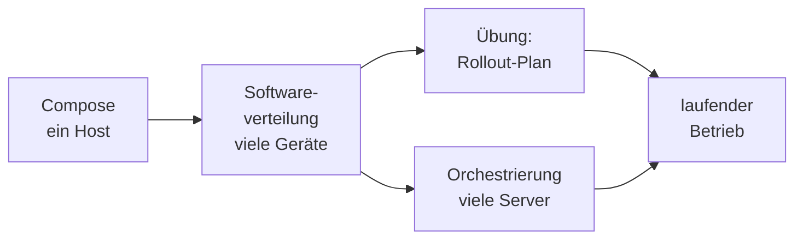

# Orchestrierung & Verteilung

Im [Compose-Block](../docker-compose/index.md) hast du gelernt, einen kompletten Stack mit **einem** Befehl auf **einem** Rechner hochzufahren. Das ist ein großer Schritt – aber in der Praxis hört es da nicht auf. Software muss auf **viele** Geräte verteilt werden, Anwendungen müssen über **viele** Server gespannt werden, und beides soll **wiederholbar** passieren, nicht von Hand.

In diesem Block geht es um die Skalierung in zwei Richtungen: Wie bringe ich Software **zuverlässig auf viele Zielsysteme** – und wie verteile ich Anwendungen **über einen ganzen Cluster** statt nur über einen Host? Beides läuft unter dem Stichwort *Orchestrierung*: das Zusammenspiel vieler Teile geplant dirigieren, wie ein Dirigent ein Orchester.

Und beides beantwortet am Ende dieselbe Frage. Nicht *„Wie kommt die Software hin?“* – das ist der leichte Teil. Sondern: **„Wie kommen wir zurück, wenn sie nicht taugt?“**

!!! abstract "Was du in diesem Block lernst"
    - wie der **Softwareverteilungsprozess** abläuft: analysieren, planen, einführen, pflegen
    - was **Paketierung** und **stille Installation** bedeuten – und was ein brauchbares Paket enthält
    - wann ein **Systemabbild** der richtige Weg ist und wann **Installationsprogramme**
    - nach welchen **Kriterien** man Verteilungs- und Inventarisierungswerkzeuge auswählt
    - warum **Inventar** und **CMDB** die Voraussetzung jeder Verteilung sind
    - die **Deployment-Strategien** Ring, Rolling Update, Blau-Grün und Canary – mit ihren Rückwegen
    - wie **Wartungsfenster**, **Rollback-Plan** und **Abbruchkriterien** zusammengehören
    - **warum** Container-Orchestrierung nötig wird und welche Begriffe du dafür kennen musst

---

## Wie wichtig ist dieser Block?

Prüfungsrelevant &nbsp; Die **Softwareverteilung** steht so im Rahmenplan – analysieren, planen, einführen, pflegen – und sie ist ein typisches Thema für eine betriebliche Situation: Ein Betrieb muss etwas ausrollen, und du sollst einen Weg vorschlagen und begründen.

Vertiefung &nbsp; Die **Container-Orchestrierung** solltest du einordnen können: Welches Problem löst sie, wann lohnt sie sich, wie heißen die Bausteine? Jede Zeile YAML auswendig zu beherrschen ist nicht das Ziel – dafür gibt es den Praxisblock.

---

## Seiten in diesem Block

| Seite | Inhalt | Relevanz |
|-------|--------|----------|
| [Softwareverteilung & Deployment](softwareverteilung.md) | Warum Handarbeit ab wenigen Dutzend Geräten scheitert · der Vier-Schritte-Prozess · Paketierung und stille Installation · Imaging, Golden Image, Zero-Touch · Auswahlkriterien und Produktkategorien · Inventar und CMDB · Ring, Rolling Update, Blau-Grün, Canary · Wartungsfenster, Rollback-Plan, Abbruchkriterien | Prüfungsrelevant |
| [Container-Orchestrierung (Kubernetes)](kubernetes-grundlagen.md) | Was Orchestrierung als Konzept löst · wann sie sich lohnt und wann nicht · die Begriffe Cluster, Node, Pod, Deployment, Service, Selbstheilung, Skalierung · Soll-Zustand statt Befehlsfolge | Vertiefung |
| [Übung: Rollout-Plan](uebung-rollout.md) | Gruppenübung: 460 Arbeitsplätze, drei Standorte, eine neue ERP-Hauptversion – Reihenfolge, Ringe, Pilot, Zeitfenster, Rückfallplan, Abbruchkriterien, Kommunikation. Mit Hilfekarten und Musterlösung | Gruppenarbeit |

---

## Roter Faden

Wir bauen das Bild **von eng nach weit**: Compose hat dir einen Stack auf einem Rechner gegeben. Von dort geht es zur **Verteilung** von Software auf viele Zielgeräte – das ist der prüfungsrelevante Kern, und die **Übung** setzt ihn sofort in einen vollständigen Rollout-Plan um. Parallel dazu steht die **Orchestrierung**, die Anwendungen über einen ganzen Cluster spannt und am Laufen hält. Beide Wege münden in denselben laufenden Betrieb.

Der gemeinsame Nenner ist der **Rückweg**. Ob du ein Deinstallationspaket verteilst, auf eine zweite Umgebung umschaltest oder ein Deployment auf die vorherige Fassung zurückrollst: Die Technik ist verschieden, die Planungsfrage ist identisch.

---

## Wie hängt das mit den anderen Blöcken zusammen?

- **[Docker Compose](../docker-compose/index.md)** ist der direkte Vorgänger: ein Stack, ein Befehl, **ein** Rechner. Dieser Block fragt: *Was mache ich, wenn es viele werden?*
- **[Praxis: Kubernetes](../kubernetes-praxis/index.md)** ist der Hands-on-Block: dort richtest du selbst einen kleinen Cluster ein und bedienst ihn Schritt für Schritt – die praktische Vertiefung zur Einordnung hier.
- **[CI/CD](../ci-cd/index.md)** beschreibt denselben Vier-Schritte-Prozess aus Sicht der Softwareentwicklung: Eine Pipeline analysiert, plant, führt ein und pflegt.
- **[Betrieb & Verfügbarkeit](../betrieb/index.md)** schließt direkt an: Wer verteilt und orchestriert, muss das Ergebnis danach **überwachen, sichern und am Leben halten**.
- **[Risikomanagement](../it-sicherheit/risikomanagement.md)** liefert die Methode, mit der du entscheidest, welches Rollout-Risiko du eingehst und welches nicht.
- Die **[Netzwerk-Grundlagen](../netzwerke/index.md)** helfen an zwei Stellen: bei der Bandbreitenfrage der Verteilung und beim Cluster, der nichts anderes ist als viele Knoten, die über das Netz zusammenarbeiten.

---

## Voraussetzungen

- Den [Compose-Block](../docker-compose/index.md) solltest du gemacht haben – wir bauen auf der Idee des deklarativen Stacks auf.
- Ein Grundgefühl für **Container** (Image, Container, Port, Volume) aus den Docker-Blöcken.
- Für die Übung: keine Vorkenntnisse über die Theorieseite hinaus, aber Bereitschaft, sich auf Zahlen und Namen festzulegen.

---

## Leitfrage

> **Meine Software läuft – wie bringe ich sie zuverlässig auf hunderte Geräte oder über einen ganzen Server-Cluster, ohne jeden Schritt von Hand zu machen und ohne den Rückweg zu verlieren?**

Wer diese Frage beantworten kann, hat den Sprung vom einzelnen System zur Verteilung in der Fläche verstanden – und damit den Kern dieses Blocks.
