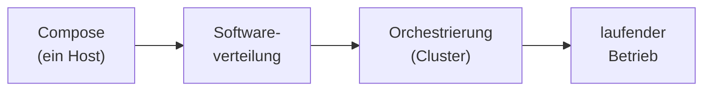

# Orchestrierung & Verteilung

Im [Compose-Block](../docker-compose/index.md) hast du gelernt, einen kompletten Stack mit **einem** Befehl auf **einem** Rechner hochzufahren. Das ist ein riesiger Schritt – aber in der Praxis hört es da nicht auf. Software muss auf **viele** Geräte verteilt werden, Container müssen auf **viele** Server gespannt werden, und das alles soll **automatisch** und **wiederholbar** passieren, nicht von Hand.

In diesem Block geht es um genau diese Skalierung in zwei Richtungen: Wie bringe ich Software **zuverlässig auf viele Zielsysteme**, und wie verteile ich Container-Anwendungen **über einen ganzen Cluster** statt nur über einen Host? Beides läuft unter dem Stichwort *Orchestrierung* – das Zusammenspiel vieler Teile geplant dirigieren, wie ein Dirigent ein Orchester.

!!! abstract "Was du in diesem Block lernst"
    - wie ein **Softwareverteilungsprozess** abläuft: von der Analyse über die Planung und Einführung bis zur Pflege
    - nach welchen **Kriterien** man Werkzeuge zur automatischen Verteilung und Inventarisierung auswählt
    - welche **Deployment-Strategien** es gibt – vom Imaging bis zum stillen Installationsprogramm
    - **warum** ein einzelner Container irgendwann nicht mehr reicht und Orchestrierung nötig wird
    - die wichtigsten **Kubernetes-Grundbegriffe** im Überblick – Pod, Deployment, Service, Node
    - den Unterschied zwischen **Docker Compose (ein Rechner)** und **Kubernetes (viele Rechner)**

---

## Wie wichtig ist dieser Block?

Vertiefung &nbsp; Dieser Block vertieft das Verständnis und schlägt die Brücke vom einzelnen Container zum echten Betrieb in der Fläche. Die Grundideen solltest du kennen und einordnen können – jede Zeile Kubernetes-YAML auswendig zu beherrschen ist nicht das Ziel.

!!! note "Status: Platzhalter in Arbeit"
    Die Struktur dieses Blocks steht, die einzelnen Seiten werden Schritt für Schritt mit Inhalten gefüllt. Du siehst hier schon, **welche Themen kommen** und **wie sie zusammenhängen** – damit du den roten Faden kennst, bevor die Details folgen.

---

## Seiten in diesem Block

| Seite | Inhalt | Relevanz |
|-------|--------|----------|
| [Softwareverteilung & Deployment](softwareverteilung.md) | Verteilungsprozess, Auswahl von Verteilungs- und Inventarisierungswerkzeugen, Deployment-Strategien (Imaging, Installer) | Vertiefung |
| [Container-Orchestrierung (Kubernetes)](kubernetes-grundlagen.md) | Warum Orchestrierung, Grundbegriffe (Pod, Deployment, Service, Node), Skalierung, Compose vs. Kubernetes | Vertiefung |

---

## Roter Faden

Wir bauen das Bild **von eng nach weit**: Compose hat dir einen Stack auf einem Rechner gegeben. Von dort geht es zur **Verteilung** von Software auf viele Zielsysteme – und schließlich zur **Orchestrierung**, die Container über einen ganzen Cluster spannt und am Laufen hält. Am Ende mündet alles im laufenden Betrieb.

---

## Wie hängt das mit den anderen Blöcken zusammen?

- **[Docker Compose](../docker-compose/index.md)** ist der direkte Vorgänger: ein Stack, ein Befehl, **ein** Rechner. Dieser Block fragt: *Was mache ich, wenn es viele Rechner werden?*
- **[Betrieb & Verfügbarkeit](../betrieb/index.md)** schließt direkt an: Wer Software verteilt und Container orchestriert, muss das Ergebnis danach **überwachen, sichern und am Leben halten**.
- Die [Netzwerk-Grundlagen](../netzwerke/index.md) helfen, weil ein Cluster nichts anderes ist als viele Knoten, die **über das Netzwerk** zusammenarbeiten.

---

## Voraussetzungen

- Den [Compose-Block](../docker-compose/index.md) solltest du gemacht haben – wir bauen direkt auf der Idee des deklarativen Stacks auf.
- Ein Grundgefühl für **Container** (Image, Container, Port, Volume) aus den Docker-Blöcken.
- Bereitschaft, in **„viele statt eins“** zu denken: viele Geräte, viele Server, viele Instanzen.

---

## Leitfrage

> **Mein Stack läuft auf meinem Rechner – wie bringe ich ihn zuverlässig auf hunderte Geräte oder über einen ganzen Server-Cluster, ohne jeden Schritt von Hand zu machen?**

Wer diese Frage beantworten kann, hat den Sprung vom einzelnen Container zur Verteilung in der Fläche verstanden – und damit den Kern dieses Blocks.
