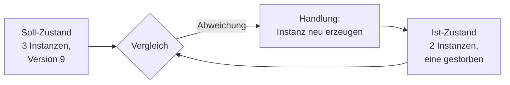

# Container-Orchestrierung (Kubernetes)

Vertiefung &nbsp; Diese Seite ordnet ein. Sie erklärt, welches Problem Orchestrierung löst, wann der Schritt dorthin sinnvoll ist – und welche Begriffe du dafür beherrschen musst.

Die [Softwareverteilung](softwareverteilung.md) hat gezeigt, wie Software auf viele **Geräte** kommt. Orchestrierung stellt dieselbe Frage für Anwendungen auf vielen **Servern** – und beantwortet sie grundlegend anders. Der Unterschied ist nicht die Größenordnung, sondern die Haltung gegenüber dem einzelnen System: Ein Arbeitsplatzrechner wird repariert, eine Container-Instanz wird weggeworfen und neu erzeugt.

!!! abstract "Was du auf dieser Seite lernst"
    - welches Problem **Orchestrierung als Konzept** löst – unabhängig vom Produktnamen
    - **wann** sich der Schritt vom einzelnen Host zum Cluster lohnt und wann er unangemessen ist
    - die Begriffe **Cluster, Node, Pod, Deployment, Service, Selbstheilung, Skalierung** in je zwei bis drei Sätzen
    - warum **Soll-Zustand statt Befehlsfolge** der eigentliche Kern der Idee ist
    - wo die **Vertiefung** steht, wenn du damit arbeiten willst

!!! tip "Diese Seite ersetzt den Praxisblock nicht"
    Hier steht die **Einordnung** – das, was du für eine Prüfungsaufgabe brauchst, in der Kubernetes vorkommt, ohne dass du es bedienen musst. Wenn du damit **arbeiten** willst – Cluster einrichten, `kubectl` bedienen, ein Deployment skalieren, einen Service veröffentlichen –, geh in den Hands-on-Block **[Praxis: Kubernetes](../kubernetes-praxis/index.md)**. Er baut das Ganze Schritt für Schritt auf. Diese Seite wiederholt seine Inhalte bewusst nicht.

---

## Welches Problem Orchestrierung löst

Ein einzelner Container auf einem einzelnen Server ist unkompliziert. Die Schwierigkeiten beginnen erst, wenn eine Anwendung **nicht ausfallen darf** und **mitwachsen muss**. Dann tauchen fünf Aufgaben auf, die jemand erledigen muss – und ohne Orchestrierung ist dieser Jemand ein Mensch mit einem Telefon.

| Aufgabe | Die Frage | Ohne Orchestrierung |
|---|---|---|
| **Platzierung** | Auf welchem der zwölf Server soll diese Instanz laufen? | jemand entscheidet und schreibt es auf – bis die Liste nicht mehr stimmt |
| **Selbstheilung** | Wer merkt, dass eine Instanz gestorben ist, und startet sie neu? | Monitoring meldet, ein Mensch reagiert – nachts mit Verzögerung |
| **Skalierung** | Wer erhöht die Anzahl bei Lastspitzen und senkt sie wieder? | Handarbeit, meist zu spät und danach vergessen |
| **Adressierung** | Unter welcher Adresse ist ein Dienst erreichbar, wenn seine Instanzen ständig wechseln? | fest eingetragene Adressen, die beim nächsten Neustart falsch sind |
| **Rollout und Rückweg** | Wie tauscht man die Version aus, ohne den Dienst anzuhalten? | Wartungsfenster, Handarbeit, langer Rückweg |

Eine Orchestrierungsplattform übernimmt alle fünf. Sie ist im Kern eine Regelschleife: Du beschreibst, **was gelten soll**, und sie vergleicht diesen Soll-Zustand fortlaufend mit dem Ist-Zustand. Weicht etwas ab, handelt sie – ohne dass jemand einen Befehl gibt.

!!! tip "Die Analogie: Schichtplan statt Namensliste"
    Eine Pflegedienstleitung schreibt nicht auf, welche Person am Dienstagabend auf Station 3 ist. Sie schreibt auf: *„Auf Station 3 müssen abends immer zwei examinierte Kräfte da sein.“* Fällt jemand aus, wird nachbesetzt – die Regel bleibt gleich, die Besetzung ändert sich. Genau so arbeitet eine Orchestrierung: Sie kennt keine Namen von Servern, sondern eine Anforderung, die immer erfüllt sein muss.

---

## Wann sich der Schritt lohnt – und wann nicht

Orchestrierung ist mächtig und kostet Betriebsaufwand. Beides gehört in die Abwägung.

| Situation | Angemessen? | Warum |
|---|---|---|
| Ein internes Werkzeug, das auf einem Server läuft | **nein** | Ein Cluster mit Steuerungsebene und Netzwerkschicht kostet mehr Pflege als das Werkzeug selbst |
| Ein fester Stack aus fünf Containern auf einem Host | **nein** | Dafür ist [Docker Compose](../docker-compose/index.md) gebaut – ein Host, eine Datei |
| Eine Anwendung, die nicht ausfallen darf | **ja** | Selbstheilung und Verteilung über mehrere Knoten sind genau die Antwort darauf |
| Stark schwankende Last | **ja** | Automatische Skalierung nach oben und unten spart Ressourcen und verhindert Überlast |
| Viele Dienste, die zusammenspielen und häufig aktualisiert werden | **ja** | Einheitliche Verwaltung, eingebaute Rolling Updates, einheitlicher Rückweg |
| Zustandsbehaftete Systeme mit strengen Datenanforderungen | **kommt darauf an** | Möglich, aber deutlich anspruchsvoller als zustandslose Dienste |
| Das Team hat noch keine Container-Erfahrung | **nein, noch nicht** | Erst Docker und Compose sicher beherrschen – Kubernetes setzt beides voraus |

Die ehrliche Faustregel: Der Schritt lohnt sich, wenn **„darf nicht ausfallen“** und **„muss mitwachsen“** zusammentreffen und wenn genug Menschen da sind, die die Plattform betreiben können. Ein Cluster ist selbst ein System, das Wartung, Updates, Sicherung und Überwachung braucht.

!!! warning "Der teuerste Fehler ist nicht die falsche Technik, sondern die falsche Größe"
    Wer einen Cluster für eine Anwendung aufbaut, die auch auf einem Server liefe, hat den Betriebsaufwand vervielfacht, ohne ein Problem zu lösen. Umgekehrt gilt: Wer zwanzig Dienste von Hand über acht Server verteilt und die Zuordnung in einer Tabelle pflegt, betreibt bereits eine Orchestrierung – nur von Hand und ohne Selbstheilung.

---

## Die Begriffe, die du kennen musst

Für eine Prüfungsaufgabe brauchst du kein YAML, aber diese sieben Begriffe – jeweils so, dass du sie in eigenen Worten erklären und voneinander abgrenzen kannst.

**Cluster.** Ein Cluster ist der Verbund aller Rechner, die gemeinsam als eine Plattform auftreten. Er besteht aus einer **Steuerungsebene**, die den Soll-Zustand kennt und Entscheidungen trifft, und den Arbeitsknoten, auf denen die Anwendungen tatsächlich laufen. Nach außen sprichst du mit dem Cluster, nicht mit einzelnen Rechnern.

**Node.** Ein Node ist ein einzelner Rechner im Cluster – physisch oder virtuell –, der Rechenleistung, Arbeitsspeicher und Netzanbindung beisteuert. Fällt ein Node aus, verteilt der Cluster dessen Arbeit auf die übrigen. Genau deshalb darf ein Node austauschbar sein und muss es auch.

**Pod.** Der Pod ist die kleinste Einheit, die der Cluster platziert und verwaltet: ein oder mehrere eng zusammengehörige Container, die sich Netzwerk und Speicher teilen und immer gemeinsam auf demselben Node laufen. Wichtig für das Verständnis: Ein Pod ist **vergänglich**. Er wird nicht repariert, sondern beendet und andernorts neu erzeugt – seine Adresse ändert sich dabei.

**Deployment.** Ein Deployment beschreibt den Soll-Zustand für eine Anwendung: welches Image, in welcher Version, in wie vielen Kopien. Der Cluster sorgt dann selbstständig dafür, dass genau diese Zahl läuft. Ein Versionswechsel ist eine Änderung dieser Beschreibung – der Cluster tauscht die Instanzen nacheinander aus (**Rolling Update**) und kann mit einem Befehl auf die vorherige Fassung zurückgehen.

**Service.** Weil Pods kommen und gehen, braucht es eine stabile Adresse. Der Service ist genau das: ein gleichbleibender Name mit einer gleichbleibenden Adresse, hinter dem der Cluster die jeweils vorhandenen, gesunden Pods versammelt. Er verteilt die Anfragen auf sie und nimmt eine Instanz automatisch aus dem Verkehr, sobald sie nicht mehr antwortet.

**Selbstheilung.** Der Cluster überwacht fortlaufend, ob der Ist-Zustand dem Soll-Zustand entspricht. Stirbt ein Pod, fällt ein Node aus oder antwortet eine Instanz nicht mehr auf ihre Bereitschaftsprüfung, wird Ersatz erzeugt – ohne menschliches Zutun. Das ersetzt kein [Monitoring](../betrieb/monitoring.md): Ein Dienst, der sich alle drei Minuten selbst heilt, gilt technisch als verfügbar und hat trotzdem ein Problem.

**Skalierung.** Skalieren heißt, die Zahl der Instanzen zu verändern. Das geht **manuell** (die gewünschte Anzahl im Deployment ändern) oder **automatisch** anhand einer Messgröße wie der Prozessorlast. Beides ist waagerechte Skalierung – mehr Instanzen, nicht größere; die Grenze liegt darin, ob die Anwendung überhaupt mehrfach parallel laufen kann.

!!! note "Die Abgrenzung in einem Satz"
    **Compose beschreibt einen Stack auf einem Rechner, Kubernetes beschreibt einen Zustand über viele Rechner.** Beide sind deklarativ, beide arbeiten mit Textdateien – der Unterschied ist, dass Compose ausführt, was dasteht, während Kubernetes dauerhaft dafür sorgt, dass es so bleibt.

---

## Der eigentliche Kern: Soll-Zustand statt Befehlsfolge

Wenn du von dieser Seite einen Gedanken mitnimmst, dann diesen. Klassische Administration ist **imperativ**: Man gibt Befehle, und was danach passiert, hängt davon ab, ob jemand hinschaut. Orchestrierung ist **deklarativ**: Man beschreibt den gewünschten Zustand, und ein Regelkreis stellt ihn immer wieder her.

Dieser Gedanke ist nicht auf Container beschränkt. Er steckt genauso im **Konfigurationsmanagement** – „Paket X soll in Version 9 vorhanden sein“ – und im Grunde in jedem Regelkreis, vom Thermostat bis zur Schichtplanung. Wer ihn verstanden hat, versteht Kubernetes, Ansible und die halbe Betriebsautomatisierung als Varianten derselben Idee.

Daraus folgt auch der praktische Vorteil beim Rollout: Weil der Soll-Zustand eine versionierte Beschreibung ist, ist der **Rückweg** ebenfalls nur eine Beschreibung – nämlich die vorherige. Was in der klassischen Softwareverteilung ein Deinstallationspaket und ein Wartungsfenster braucht, ist hier ein Befehl. Die Planungsfragen bleiben trotzdem dieselben: Reihenfolge, Zeitfenster, Abbruchkriterien, und die harte Grenze bei Datenmigrationen.

---

## Wo es weitergeht

| Was du willst | Wohin |
|---|---|
| verstehen, warum ein Host irgendwann nicht reicht | [Warum Kubernetes?](../kubernetes-praxis/01-warum-kubernetes.md) |
| die Begriffe mit Bildern und Beispielen vertiefen | [Grundbegriffe](../kubernetes-praxis/02-grundbegriffe.md) |
| selbst einen kleinen Cluster einrichten und bedienen | [Praxis: Kubernetes](../kubernetes-praxis/index.md) |
| Konfiguration, Geheimnisse, Bereitschaftsprüfungen und Grenzwerte | [Kubernetes Aufbau](../kubernetes-aufbau/index.md) |
| Anwendungen als Paket ausliefern und versionieren | [Helm](../kubernetes-helm/index.md) |

---

## Was du jetzt wissen solltest

- Orchestrierung löst fünf Aufgaben: **Platzierung, Selbstheilung, Skalierung, Adressierung, Rollout mit Rückweg**.
- Sie lohnt sich, wenn **„darf nicht ausfallen“** und **„muss mitwachsen“** zusammenkommen – und wenn jemand da ist, der die Plattform betreiben kann.
- **Cluster** ist der Verbund, **Node** ein Rechner darin, **Pod** die kleinste verwaltete Einheit – und der Pod ist vergänglich.
- **Deployment** beschreibt den Soll-Zustand einer Anwendung, **Service** liefert die stabile Adresse dazu.
- **Selbstheilung** stellt den Soll-Zustand automatisch wieder her; sie ersetzt kein Monitoring, sondern verdeckt Probleme sogar.
- **Skalierung** ist waagerecht: mehr Instanzen, nicht größere – die Anwendung muss das mitmachen.
- Der Kern ist **deklarativ statt imperativ**: Zustand beschreiben, nicht Befehle geben.

---

## Beispielfragen zur Selbstkontrolle

??? question "Frage 1: Ein Betrieb betreibt eine interne Zeiterfassung, die auf einem Server in einem Container läuft und pro Tag von 60 Leuten benutzt wird. Ein Kollege schlägt Kubernetes vor. Wie argumentierst du?"
    Dagegen – mit Begründung, nicht mit Bauchgefühl.

    Ein Cluster besteht aus einer Steuerungsebene, mehreren Knoten, einer Netzwerkschicht und einer Speicheranbindung. Alles davon muss aktualisiert, überwacht, gesichert und beherrscht werden. Dieser Aufwand ist bei einer Anwendung mit 60 Nutzern und konstanter Last größer als der Nutzen: Es gibt keine Lastspitzen zum Abfangen, keine Vielzahl von Diensten zu koordinieren, und wenn der Dienst eine Stunde steht, wird die Zeiterfassung nachgetragen.

    Die passende Antwort auf die eigentliche Sorge – „was, wenn der Server ausfällt?“ – liegt eine Ebene tiefer: eine geprüfte Sicherung mit gemessener Wiederherstellungszeit, gegebenenfalls ein zweiter Host als Ausweichsystem. Das kostet einen Bruchteil und löst genau das Problem, das gemeint war.

    Umgekehrt wäre die Antwort anders, wenn dieselbe Anwendung Teil einer Landschaft aus fünfzehn Diensten wäre, die häufig aktualisiert werden. Dann zählt die einheitliche Verwaltung mehr als der Einzelfall.

??? question "Frage 2: Warum braucht man einen Service, wenn Pods doch eigene Adressen haben?"
    Weil diese Adressen nicht haltbar sind. Ein Pod ist vergänglich: Er wird beendet und neu erzeugt, wenn er stirbt, wenn sein Node ausfällt, wenn skaliert wird oder wenn eine neue Version ausgerollt wird. Bei jeder Neuerzeugung bekommt er eine neue Adresse. Ein Aufrufer, der sich eine Pod-Adresse merkt, greift nach dem nächsten Neustart ins Leere.

    Der Service ist die Antwort darauf: ein gleichbleibender Name und eine gleichbleibende Adresse, hinter der der Cluster die jeweils vorhandenen Pods versammelt. Er hat zwei weitere Aufgaben, die man oft übersieht: Er **verteilt** die Anfragen auf mehrere Instanzen, und er nimmt eine Instanz **aus dem Verkehr**, sobald sie ihre Bereitschaftsprüfung nicht mehr besteht. Damit ist er zugleich Namensdienst und Lastverteiler.

??? question "Frage 3: Erklär den Unterschied zwischen imperativ und deklarativ an einem Beispiel."
    **Imperativ** heißt: Du gibst Befehle, die eine Aktion auslösen. *„Starte drei Instanzen dieser Anwendung.“* Der Befehl wird ausgeführt, und damit ist er erledigt. Stirbt danach eine Instanz, läuft die Anwendung mit zwei weiter – niemand vergleicht mehr mit der ursprünglichen Absicht.

    **Deklarativ** heißt: Du beschreibst einen Zustand, der gelten soll. *„Von dieser Anwendung sollen drei Instanzen in Version 9 laufen.“* Der Cluster vergleicht diese Beschreibung fortlaufend mit der Wirklichkeit. Stirbt eine Instanz, erzeugt er Ersatz – nicht, weil jemand einen Befehl gibt, sondern weil die Beschreibung nicht mehr erfüllt ist.

    Der praktische Unterschied zeigt sich beim Rückweg. Imperativ muss man den Rückweg selbst kennen und ausführen. Deklarativ ist der Rückweg die vorherige Beschreibung – und die liegt in der Versionsverwaltung. Dieselbe Logik steckt im Konfigurationsmanagement, siehe [Softwareverteilung](softwareverteilung.md).

??? question "Frage 4: Ein Dienst gilt im Cluster als verfügbar, die Anwender melden aber ständig Abbrüche. Wie kann das sein?"
    Weil Selbstheilung Symptome beseitigt, ohne die Ursache anzufassen. Wenn eine Instanz regelmäßig abstürzt – etwa wegen eines Speicherlecks oder eines zu knappen Grenzwerts –, erzeugt der Cluster jedes Mal zuverlässig Ersatz. Aus seiner Sicht ist der Soll-Zustand fast immer erfüllt.

    Für die Anwender sieht es anders aus: Jeder Neustart bricht die laufenden Anfragen ab, und in den Sekunden bis zur Bereitschaft der neuen Instanz trägt eine Instanz weniger die Last. Genau deshalb ist die Zahl der Neustarts eine der wichtigsten Messgrößen im Cluster.

    Die Lehre: **Selbstheilung ersetzt kein Monitoring, sie verdeckt Probleme sogar.** Neben der reinen Verfügbarkeit brauchst du Fehlerraten, Antwortzeiten und die Neustartzahl je Instanz – siehe [Monitoring](../betrieb/monitoring.md) und [Betriebsdaten analysieren](../betrieb/betriebsdaten-analysieren.md).

---

## Merksatz

!!! success "Merksatz"
    > **Orchestrierung ist ein Regelkreis: Du beschreibst den Soll-Zustand, die Plattform hält ihn. Der Cluster ist der Verbund, der Node ein Rechner darin, der Pod die kleinste – und vergängliche – Einheit. Das Deployment sagt, wie viele Instanzen welcher Version laufen sollen; der Service gibt ihnen eine stabile Adresse. Compose ist für einen Rechner, Kubernetes für viele. Und der Schritt lohnt sich erst, wenn „darf nicht ausfallen“ und „muss mitwachsen“ zusammenkommen.**

---

## Weiterlesen

- [Praxis: Kubernetes](../kubernetes-praxis/index.md): der Hands-on-Block – hier machst du es selbst
- [Softwareverteilung & Deployment](softwareverteilung.md): dieselben Planungsfragen für Software auf Geräten
- [Docker Compose](../docker-compose/index.md): der Vorgänger – ein Stack, ein Befehl, ein Rechner
- [Betrieb & Verfügbarkeit](../betrieb/index.md): was nach dem Ausrollen kommt – überwachen, sichern, am Leben halten
- [Glossar](../glossar.md): die Begriffe zum Nachschlagen
