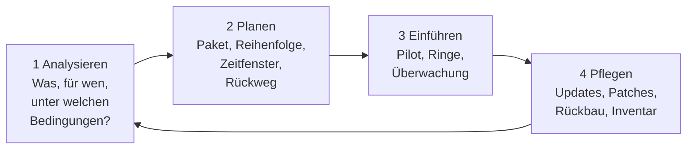
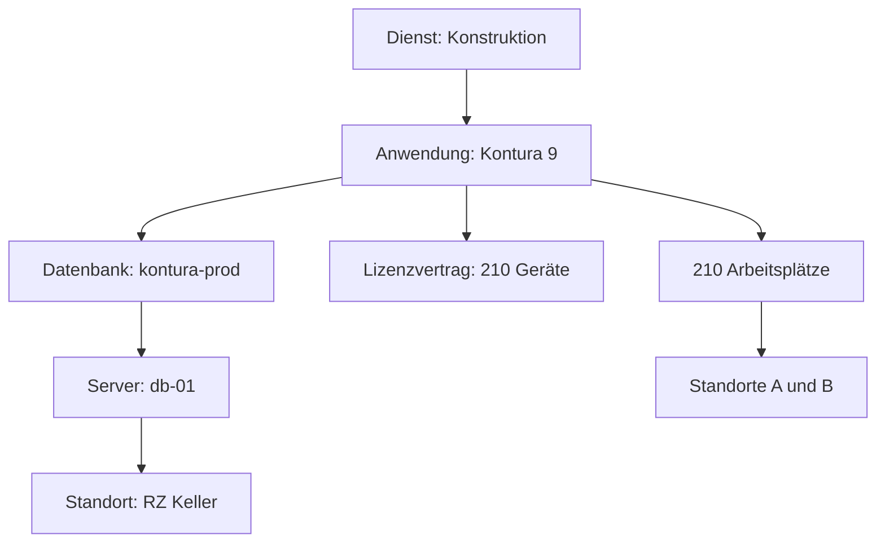
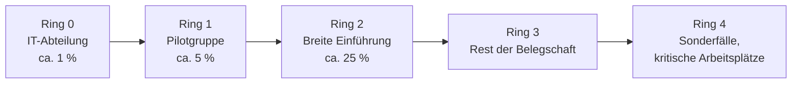
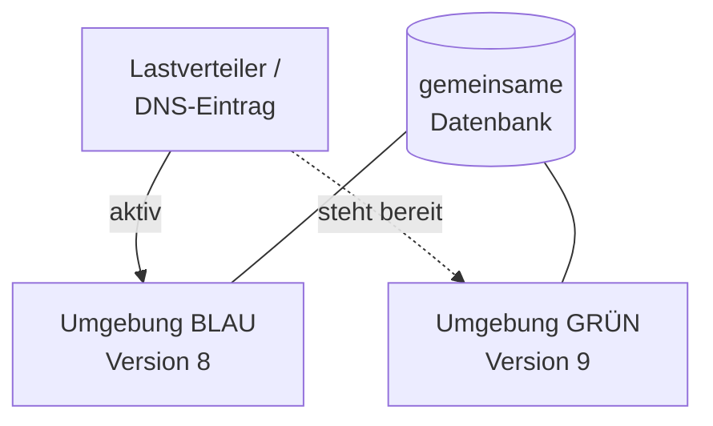

# Softwareverteilung & Deployment

<span class='badge badge-pruefung'>Prüfungsrelevant</span> &nbsp; Eine Software auf einem Rechner zu installieren, kann jeder. Sie auf vierhundert Rechner zu bringen, ohne den Betrieb anzuhalten und ohne dass jemand vierhundert Mal auf „Weiter“ klickt, ist eine Planungsaufgabe.

Es gibt einen Punkt, an dem Handarbeit kippt. Bei drei Rechnern setzt man sich hin und installiert. Bei dreißig wird es ein langer Tag, den man noch schafft. Bei dreihundert ist es keine Frage der Ausdauer mehr, sondern eine Frage der Methode – und wer sie nicht beantwortet hat, merkt das nicht am ersten Gerät, sondern am hundertsten, wenn niemand mehr weiß, welche Version eigentlich wo liegt. Softwareverteilung ist der organisierte Weg von „installiert“ zu „überall in derselben, bekannten Fassung installiert und jederzeit wieder zurückzunehmen“.

!!! abstract "Was du auf dieser Seite lernst"
    - **warum** manuelle Installation ab wenigen Dutzend Geräten scheitert – und zwar nicht nur wegen des Zeitaufwands
    - den **Verteilungsprozess** als Kreislauf: analysieren, planen, einführen, pflegen
    - was **Paketierung** und **stille Installation** bedeuten und was in ein brauchbares Paket gehört
    - wann ein **Systemabbild** (Image) der richtige Weg ist und wann ein **Installationsprogramm**
    - nach welchen **Kriterien** du Verteilungs- und Inventarisierungswerkzeuge auswählst und welche **Produktkategorien** es gibt
    - warum **Inventarisierung** und eine **CMDB** die Voraussetzung jeder Verteilung sind
    - die **Deployment-Strategien** Ring, Rolling Update, Blau-Grün und Canary – mit Vor- und Nachteilen und ihrer Rückrollbarkeit
    - wie **Wartungsfenster**, **Rollback-Plan** und **Abbruchkriterien** zusammengehören

---

## Wo Handarbeit kippt

Rechnen wir es einmal nüchtern durch. Die **Feinwerk Präzisionstechnik GmbH** – Maschinenbau, 180 Beschäftigte, zwei Standorte – tauscht die Version ihres Konstruktionsprogramms. Auf 210 Arbeitsplätzen muss das alte Paket weg und das neue drauf. Eine Installation dauert mit Deinstallation, Einspielen, Lizenzschlüssel und kurzem Funktionstest realistisch 25 Minuten:

```text
210 Geraete  x  25 Minuten  =  5.250 Minuten  =  87,5 Stunden

bei 7 produktiven Stunden je Person und Tag:
87,5 h / 7 h  =  12,5 Personentage
```

Zwölfeinhalb Personentage sind viel, aber nicht das eigentliche Problem. Das eigentliche Problem beginnt danach:

- **Der Zustand ist unbekannt.** Nach zwölf Tagen weiß niemand mehr sicher, auf welchen Geräten die neue Version liegt, wo die alte noch läuft und wo beim dritten Gerät am Donnerstagnachmittag der Haken bei „Beispieldateien mitinstallieren“ gesetzt war und beim vierten nicht.
- **Die Installation ist nicht wiederholbar.** Wer von Hand installiert, trifft von Hand Entscheidungen. Zwei Personen erzeugen zwei leicht verschiedene Ergebnisse, dieselbe Person an zwei Tagen ebenfalls. Damit ist jeder spätere Fehler ein Einzelfall statt eines Musters – und Einzelfälle kann man nicht beheben, nur behandeln.
- **Es gibt keinen Rückweg.** Stellt sich am zehnten Tag heraus, dass die neue Version mit dem Etikettendrucker in der Fertigung nicht zusammenarbeitet, sind bereits 150 Geräte umgestellt. Der Weg zurück ist derselbe Weg noch einmal – von Hand.
- **Der Nutzer muss anwesend sein.** Manuelle Installation findet am Arbeitsplatz statt, also während der Arbeitszeit. Jede halbe Stunde Installation ist eine halbe Stunde, in der jemand nicht arbeitet. Bei 210 Geräten sind das noch einmal 87,5 Stunden Ausfall auf der anderen Seite des Schreibtischs.

!!! tip "Die Analogie: Kantine statt Restaurant"
    Ein Restaurant kocht jedes Gericht einzeln und auf Zuruf. Das ist wunderbar, solange dreißig Gäste kommen. Eine Werkskantine, die zwölfhundert Essen ausgibt, arbeitet anders: Es gibt ein festgelegtes Rezept, eine feste Menge, einen festen Ablauf – und wenn eine Charge schlecht ist, weiß man genau, welche Charge das war und wer sie bekommen hat. Softwareverteilung ist der Wechsel vom Restaurant in die Kantine. Man verliert die Freiheit, jedes Gerät individuell zu behandeln, und gewinnt dafür etwas viel Wertvolleres: **Nachvollziehbarkeit**.

Damit ist auch das Ziel benannt. Softwareverteilung will nicht in erster Linie Zeit sparen – das tut sie nebenbei. Sie will erreichen, dass der Zustand aller Geräte **bekannt, gleich und beschreibbar** ist. Erst daraus folgt alles andere: Fehler lassen sich reproduzieren, Sicherheitslücken lassen sich flächendeckend schließen, Lizenzen lassen sich zählen, und ein fehlerhaftes Paket lässt sich genauso gesteuert zurücknehmen, wie es ausgerollt wurde.

---

## Der Prozess: analysieren, planen, einführen, pflegen

Softwareverteilung ist kein Knopf, sondern ein Kreislauf mit vier Schritten. Er ist bewusst so geschnitten, dass jeder Schritt ein Ergebnis abliefert, an dem man den nächsten festmachen kann.



| Schritt | Leitfrage | Ergebnis |
|---|---|---|
| **1 Analysieren** | Welche Software wird gebraucht, von wem, auf welchen Geräten, mit welchen Abhängigkeiten und Lizenzen? | eine Anforderungsliste, eine Zielgruppenabgrenzung und eine Liste bekannter Abhängigkeiten |
| **2 Planen** | Wie sieht das Paket aus, in welcher Reihenfolge wird verteilt, wann, und wie kommt man zurück? | Paketspezifikation, Ringplan, Wartungsfenster, Rollback-Plan, Abbruchkriterien |
| **3 Einführen** | Läuft es dort, wo es zuerst hin soll – und woran erkennen wir, dass wir weitergehen dürfen? | Pilotergebnis, Freigabeentscheidung, ausgerollte Ringe, dokumentierte Abweichungen |
| **4 Pflegen** | Was passiert nach dem Rollout – Updates, Sicherheitspatches, Ablösung, Rückbau? | aktualisiertes Inventar, Patch-Rhythmus, Deinstallationspakete für Altversionen |

### 1 Analysieren

Der erste Schritt hat wenig mit Technik zu tun. Er beantwortet, **was** überhaupt verteilt werden soll und **an wen**. Die Anforderungen kommen aus dem Fachbereich, nicht aus der IT: Welche Funktion fehlt, welcher Prozess soll besser laufen, welche gesetzliche Vorgabe zwingt zur Aktualisierung.

Dazu kommen die technischen Randbedingungen, und die haben es in sich. Welche Betriebssystemversionen sind im Einsatz – und stimmt die Liste noch? Welche Laufzeitumgebungen setzt die Software voraus? Gibt es Zusatzmodule, Schnittstellen oder Treiber, die zur Version passen müssen? Vertragen sich alte und neue Version im Parallelbetrieb, oder muss die alte zwingend zuerst weg? Und: Reicht die Lizenz für die Zahl der Geräte, die tatsächlich dastehen – nicht für die Zahl, die im letzten Vertrag stand? Zu den Lizenzfragen dahinter siehe [Lizenzmodelle](../infrastruktur-planung/lizenzmodelle.md).

!!! warning "Die Abhängigkeit, die niemand auf der Liste hatte"
    Der teuerste Rollout-Fehler ist fast nie die Software selbst, sondern etwas, das an ihr hängt: ein Etikettendrucker mit einem Treiber, der nur für die alte Version freigegeben ist; ein Makro in einer Tabellenkalkulation, das eine Bibliothek in einer bestimmten Fassung erwartet; eine Schnittstelle zur Fertigungssteuerung, die der Hersteller erst mit dem übernächsten Servicepack unterstützt. Diese Dinge stehen in keinem Datenblatt. Sie kommen aus **zwei Quellen**: aus dem Inventar und aus dem Gespräch mit den Leuten, die täglich damit arbeiten.

### 2 Planen

Hier entsteht der eigentliche Plan, und er besteht aus mehr als einem Termin. Zur Planung gehören das **Paket** (was genau wird installiert, mit welchen Voreinstellungen), die **Zielgruppen** und ihre Reihenfolge, das **Zeitfenster**, die **Voraussetzungen** auf dem Zielgerät, der **Rückweg** und die **Abbruchkriterien**. Die letzten beiden werden am häufigsten vergessen und sind am schwersten nachzuholen – zum Rollback-Plan siehe den Abschnitt weiter unten.

Ein Punkt, der in der Planung entschieden wird und später kaum noch änderbar ist: **Wer löst die Installation aus?** Es gibt drei Varianten, und sie haben verschiedene Folgen.

| Variante | Wie es läuft | Wofür geeignet |
|---|---|---|
| **Pflichtverteilung (push)** | Das Werkzeug installiert zu einem festgelegten Zeitpunkt, der Anwender wird informiert, kann aber höchstens verschieben | Sicherheitsupdates, Pflichtsoftware, alles mit Frist |
| **Selbstbedienung (pull)** | Die Software steht in einem Portal bereit, der Anwender installiert, wenn es ihm passt | optionale Fachsoftware, Werkzeuge einzelner Abteilungen |
| **Bereitstellung ohne Installation** | Das Paket wird nur auf das Gerät geladen und erst im Wartungsfenster ausgeführt | große Pakete, schmale Leitungen, feste Fenster |

### 3 Einführen

Die Einführung ist der Schritt, in dem der Plan auf die Wirklichkeit trifft – und deshalb nie auf einmal stattfindet. Sie beginnt mit einer kleinen, gut beobachteten Gruppe und wächst in Stufen, solange die Beobachtungen stimmen. Die Strategien dafür stehen weiter unten im Abschnitt [Deployment-Strategien](#deployment-strategien-vier-wege-und-ihre-ruckwege).

Wichtig ist der Unterschied zwischen „ist ausgerollt“ und „ist angekommen“. Ein Verteilungswerkzeug meldet den **technischen** Erfolg: Rückgabewert 0, Datei vorhanden, Dienst gestartet. Ob die Software auch **fachlich** funktioniert – ob der Etikettendruck läuft, ob die Auswertung dieselben Zahlen liefert wie vorher –, weiß nur der Fachbereich. Beides gehört in die Erfolgsmessung, sonst gilt ein Rollout als gelungen, während in der Fertigung niemand mehr drucken kann.

### 4 Pflegen

Mit dem letzten Ring ist nichts abgeschlossen. Die Pflege ist der längste Teil des Kreislaufs und der einzige, der nie endet: Sicherheitspatches einspielen, Nebenversionen nachziehen, ausgelaufene Software zurückbauen, das Inventar aktuell halten, Pakete an neue Betriebssystemstände anpassen.

Der **Rückbau** ist dabei der Teil, der am zuverlässigsten liegen bleibt. Alte Versionen, die niemand mehr benutzt, verbrauchen Lizenzen, halten Sicherheitslücken offen und erzeugen bei der nächsten Verteilung Konflikte. Zu einem Paket gehört deshalb von Anfang an ein **Deinstallationspaket** – nicht erst dann, wenn man es braucht.

!!! note "Dieselben vier Schritte, anderes Wort"
    Der Rahmenplan nennt diese vier Schritte für die Softwareverteilung. In der Softwareentwicklung heißen sie anders und meinen dasselbe: Eine [CI/CD-Pipeline](../ci-cd/pipeline-konzept.md) analysiert (welche Schritte gehören zur Auslieferung), plant (Trigger, Stufen, Rollback), führt ein (Deployment) und pflegt (Logs auswerten, Abhängigkeiten aktualisieren). Wer den Prozess einmal verstanden hat, erkennt ihn überall wieder.

---

## Paketierung und stille Installation

Damit ein Werkzeug etwas verteilen kann, muss die Installation **ohne Rückfragen** ablaufen. Ein Installationsassistent, der nach dem Zielverzeichnis fragt, ist auf einem Gerät ohne anwesenden Menschen wertlos. Der Vorgang, aus einem Herstellersetup eine unbeaufsichtigte Installation zu machen, heißt **Paketierung**, das Ergebnis ist das **Paket**.

Eine stille Installation (englisch *silent install*, auch *unattended*) ist eine Installation, die alle Antworten schon kennt. Bei Windows-Installationspaketen im MSI-Format sieht das so aus:

```text
msiexec /i "kontura-9.msi" /qn /norestart ^
        TRANSFORMS="firma-anpassung.mst" ^
        INSTALLDIR="C:\Programme\Kontura" ^
        /l*v "C:\Windows\Temp\kontura9.log"
```

`/qn` schaltet die Oberfläche vollständig ab, `/norestart` verhindert einen unangekündigten Neustart, die `.mst`-Datei enthält die betriebsspezifischen Voreinstellungen, und `/l*v` schreibt ein ausführliches Protokoll – das Einzige, was du im Fehlerfall noch hast. Setups im `.exe`-Format kennen eigene Schalter, meist `/S`, `/silent`, `/quiet` oder `/VERYSILENT`; welcher gilt, steht in der Herstellerdokumentation. Auf Linux übernimmt die Paketverwaltung diese Rolle von Haus aus, etwa mit `DEBIAN_FRONTEND=noninteractive apt-get install -y paketname`.

Ein Paket ist aber mehr als eine Befehlszeile. Zu einem Paket, mit dem man in der Fläche arbeiten kann, gehören sechs Bestandteile:

| Bestandteil | Wozu | Was passiert ohne ihn |
|---|---|---|
| **Installationsbefehl** | die stille Installation selbst | die Installation bleibt an einer Rückfrage hängen |
| **Voraussetzungsprüfung** | Betriebssystem, Speicherplatz, Laufzeitumgebung, Vorgängerversion | die Installation startet auf ungeeigneten Geräten und scheitert dort |
| **Erkennungsregel** | woran das Werkzeug sieht, dass die Software da ist – Datei, Version, Registrierungsschlüssel | das Werkzeug installiert bei jedem Durchlauf erneut oder meldet dauerhaft „fehlt“ |
| **Rückgabewerte** | welcher Code Erfolg bedeutet und welcher einen Neustart verlangt | ein erfolgreicher Lauf wird als Fehler gewertet – oder umgekehrt |
| **Deinstallationsbefehl** | der Rückweg für dieses Paket | es gibt keinen gesteuerten Rückweg, nur Handarbeit |
| **Protokollierung** | Nachweis und Fehlersuche | im Fehlerfall bleibt nur Raten |

!!! tip "Rückgabewerte richtig auswerten"
    Bei Windows-Installationen bedeutet der Rückgabewert **0** Erfolg, **3010** ebenfalls Erfolg, aber mit der Anmerkung „Neustart erforderlich“, und **1641** Erfolg mit bereits ausgelöstem Neustart. Wer nur `0` als Erfolg zulässt, erzeugt eine Liste voller roter Meldungen, obwohl alles funktioniert hat – und übersieht darin die echten Fehler. Umgekehrt gilt: Ein Setup, das immer `0` zurückgibt, auch wenn es nichts getan hat, ist für die Verteilung nur mit einer eigenen Erfolgsprüfung brauchbar.

!!! danger "Das Paket gehört getestet, nicht nur gebaut"
    Ein Paket muss auf einem Gerät geprüft werden, das dem Zielzustand entspricht – nicht auf dem Arbeitsplatz der Person, die es gebaut hat. Dort sind Laufzeitumgebungen, Zertifikate und Werkzeuge vorhanden, die auf dem Zielgerät fehlen. Der Klassiker: Das Paket läuft im Test perfekt, weil der Paketierer lokale Administratorrechte hat, und scheitert in der Fläche, weil es dort im Systemkontext ohne Benutzerprofil läuft.

---

## Zwei Wege auf das Gerät: Abbild oder Installationsprogramm

Es gibt grundsätzlich zwei Verfahren, Software auf ein Gerät zu bringen – und sie beantworten verschiedene Fragen.

Beim **Imaging** wird ein fertiges Systemabbild auf das Gerät geschrieben: Betriebssystem, Treiber, Anwendungen und Einstellungen in einem Block. Man richtet einen Referenzrechner exakt so ein, wie das Ergebnis aussehen soll, entfernt die gerätespezifischen Merkmale (unter Windows mit `sysprep /generalize /oobe /shutdown`) und zieht davon ein Abbild. Dieses **Golden Image** wird anschließend auf beliebig viele Geräte geklont, meist über das Netzwerk beim Systemstart.

Beim Weg über **Installationsprogramme** bekommt das Gerät ein Grundsystem und darauf einzeln paketierte Anwendungen, jede still installiert und einzeln versionierbar.

| | **Imaging (Systemabbild)** | **Installationsprogramme (Pakete)** |
|---|---|---|
| **Ergebnis** | ein identischer Gesamtzustand | ein aus Bausteinen zusammengesetzter Zustand |
| **Erstaufsetzung** | sehr schnell, wenige Minuten je Gerät | langsamer, jedes Paket einzeln |
| **Einzelne Anwendung aktualisieren** | geht nicht sinnvoll – das Abbild müsste neu gebaut werden | genau dafür gemacht |
| **Unterschiedliche Hardware** | aufwendig, Treiber müssen eingebunden werden | unkritisch, das Grundsystem kümmert sich darum |
| **Unterschiedliche Abteilungen** | je Variante ein eigenes Abbild – die Zahl wächst schnell | eine Basis, unterschiedliche Paketzuweisungen |
| **Datenverlust** | ja, das Gerät wird vollständig überschrieben | nein, das laufende System bleibt bestehen |
| **Pflegeaufwand** | das Abbild veraltet ab dem Tag seiner Erstellung | je Paket, dafür dauerhaft |

In der Praxis benutzt man **beides, aber für verschiedene Anlässe**: Ein Abbild für die **Erstaufsetzung** und den Neuaufbau nach einem Defekt, Pakete für alles, was danach kommt. Wer versucht, laufende Software über neue Abbilder zu aktualisieren, baut alle paar Wochen ein neues Golden Image und schreibt jedes Mal die Geräte platt – das ist der Weg, auf dem Benutzerdaten verloren gehen.

!!! warning "Golden Image mit Verfallsdatum"
    Ein Abbild altert ab der Sekunde, in der es fertig ist: Jeder Sicherheitspatch, der danach erscheint, fehlt darin. Ein Gerät, das aus einem ein Jahr alten Abbild aufgesetzt wird, ist nach dem Klonen erst einmal ungepatcht im Netz. Deshalb gehört zu jedem Abbild ein Rhythmus, in dem es neu gebaut wird, und ein direkt anschließender Patchlauf – oder man reduziert das Abbild bewusst auf ein schlankes Grundsystem („thin image“) und lässt alles Weitere über Pakete kommen.

### Zero-Touch: das Gerät richtet sich selbst ein

Der Fall, in dem beide Verfahren zusammenkommen, ist die **Zero-Touch-Bereitstellung**. Die Idee: Ein neues Gerät wird vom Händler direkt an den Arbeitsplatz geliefert, der Anwender packt es aus, verbindet es mit dem Netz und meldet sich mit seinem Firmenkonto an. Alles Weitere passiert von selbst – das Gerät erkennt anhand seiner Seriennummer, zu welchem Betrieb es gehört, holt sich seine Konfiguration und seine Pakete und ist nach einiger Zeit einsatzbereit. Die IT hat das Gerät nie in der Hand gehabt.

Technisch steht dahinter eine Registrierung des Geräts beim Hersteller oder Händler, die es einem Verwaltungsdienst zuordnet; die großen Plattformen bieten das jeweils unter eigenem Namen an. Der Nutzen ist an verteilten Standorten und im Home-Office am größten, weil der Versandweg über die IT-Abteilung entfällt. Die Voraussetzung ist allerdings streng: Es funktioniert nur, wenn der **Zielzustand vollständig beschrieben** ist – jedes Paket, jede Einstellung, jede Zuordnung. Zero-Touch ist deshalb kein Einstiegsverfahren, sondern das Ergebnis eines sauber geführten Verteilungsprozesses.

---

## Werkzeuge auswählen: die Kriterien

Es gibt keine Bestenliste, sondern nur eine Passung zum eigenen Betrieb. Die folgenden Kriterien sind die, nach denen in der Praxis – und in Prüfungsaufgaben – entschieden wird.

| Kriterium | Die Frage dahinter | Woran es scheitert |
|---|---|---|
| **Betriebssysteme** | Welche Plattformen kommen vor, und werden sie **gleichwertig** unterstützt? | Ein Werkzeug kann Windows hervorragend und macOS nur formal – die zwölf Grafik-Arbeitsplätze bleiben dann Handarbeit |
| **Sicherheit** | Verschlüsselte Übertragung, signierte Pakete, Rechtekonzept, Protokollierung – wer darf was auf wie vielen Geräten auslösen? | Ein Verteilungswerkzeug installiert mit höchsten Rechten auf allen Geräten. Wer es übernimmt, hat den ganzen Betrieb |
| **Skalierbarkeit** | Trägt es von zehn auf zehntausend Geräte – und über mehrere Standorte? | Der Server hält die Last, aber die Standleitung zum Werk nicht |
| **Rückholbarkeit** | Lässt sich eine Verteilung stoppen und ein Paket gesteuert zurücknehmen? | „Zurücknehmen“ heißt bei manchen Werkzeugen nur „nicht mehr zuweisen“ – installiert bleibt es trotzdem |
| **Verfügbarkeit** | Was passiert, wenn der Verteildienst selbst ausfällt? | Fällt er während eines Sicherheitspatch-Laufs aus, bleibt die Hälfte der Geräte auf halbem Weg stehen |
| **Bandbreitenbedarf** | Wie viele Daten fließen wohin, und lässt sich das steuern? | siehe Rechnung unten |
| **Inventarisierung** | Liefert es von sich aus ein belastbares Bild des Bestands? | Verteilung ohne Inventar ist Verteilung ins Blaue |
| **Betriebsaufwand** | Wie viel Pflege braucht das Werkzeug selbst, welches Wissen setzt es voraus? | Das mächtigste Werkzeug nützt nichts, wenn es nur eine Person bedienen kann |

### Bandbreite ist das Kriterium, das am häufigsten unterschätzt wird

Bandbreite klingt nach einem Detail, bis man es ausrechnet. Feinwerk hat am zweiten Standort 90 Arbeitsplätze, angebunden über eine Standleitung mit **100 Mbit/s**. Das neue Paket ist **1,2 GB** groß.

```text
Datenmenge   =  90 Geraete  x  1,2 GB  =  108 GB  =  108.000 MB
Leitung      =  100 Mbit/s              =  12,5 MB/s

Uebertragungszeit  =  108.000 MB / 12,5 MB/s  =  8.640 s  =  2,4 Stunden
```

Zweieinhalb Stunden klingen tragbar – aber nur, wenn die Leitung in dieser Zeit **nichts anderes** tut. Tatsächlich läuft über dieselbe Leitung der gesamte Betrieb des Standorts. Nimmt man an, dass höchstens ein Viertel der Leitung für die Verteilung frei ist, wird daraus:

```text
verfuegbar  =  12,5 MB/s  x  0,25  =  3,125 MB/s
Zeit        =  108.000 MB / 3,125 MB/s  =  34.560 s  =  9,6 Stunden
```

Aus zweieinhalb Stunden werden fast zehn – und in dieser Zeit ist die Leitung für die eigentliche Arbeit spürbar langsamer. Die Gegenmaßnahme ist immer dieselbe: Das Paket darf die Leitung nur **einmal** überqueren. Dafür gibt es zwei Wege, die sich ergänzen:

- Ein **Verteilpunkt** am Standort: ein Server oder ein größerer Rechner, der das Paket einmal holt und lokal an die 90 Geräte ausgibt. Über die Standleitung fließen dann `1.200 MB / 3,125 MB/s = 384 s`, also gut sechs Minuten.
- **Verteilung zwischen den Clients** (Peer-Caching): Geräte, die das Paket schon haben, geben es an Nachbargeräte im selben Netz weiter. Das spart den eigenen Server, verlagert die Last aber ins lokale Netz und braucht eine Netzstruktur, in der sich die Geräte gegenseitig erreichen dürfen – siehe [Segmentierung](../netzwerke/segmentierung-und-vpn.md).

Dazu kommen zwei Stellschrauben, die jedes ernsthafte Werkzeug mitbringt: eine **Bandbreitendrosselung** (nutze höchstens x Prozent der Leitung) und ein **Zeitfenster für die Übertragung**, das vom Zeitfenster für die Installation getrennt ist. Das Paket kann nachts fließen und tagsüber installiert werden – oder umgekehrt.

!!! warning "Der Sonderfall, der jede Bandbreitenrechnung sprengt"
    Notebooks im Außendienst hängen an einem Mobilfunkvertrag mit Datenvolumen oder an einem Hotel-WLAN. Ein 1,2-GB-Paket, das dort unangekündigt gezogen wird, kostet Geld und Nerven. Deshalb kennen Verteilungswerkzeuge eine Unterscheidung zwischen **getakteten und ungetakteten Verbindungen** – und mobile Geräte brauchen fast immer eine eigene Regel.

---

## Produktkategorien im Überblick

Der Markt lässt sich in drei Kategorien ordnen. Sie überschneiden sich an den Rändern, lösen aber im Kern verschiedene Aufgaben. Die genannten Vertreter sind **Beispiele zur Einordnung**, keine Empfehlung.

| Kategorie | Was sie tut | Typische Vertreter |
|---|---|---|
| **Systemverwaltung / Client-Management** | verwaltet Endgeräte als Ganzes: Inventar, Softwareverteilung, Patches, Betriebssystem-Bereitstellung, Richtlinien, oft mit Selbstbedienungsportal | Microsoft Configuration Manager und Microsoft Intune, baramundi Management Suite, Matrix42, Ivanti, opsi, für Apple-Geräte Jamf |
| **Konfigurationsmanagement** | beschreibt den **Soll-Zustand** eines Systems in Textdateien und stellt ihn immer wieder her – stark bei Servern, deklarativ, versionierbar | Ansible, Puppet, Chef, Salt |
| **Paketverwaltung** | installiert, aktualisiert und entfernt einzelne Programme samt ihrer Abhängigkeiten aus einer Quelle | APT und dpkg, DNF und RPM, winget, Chocolatey, Homebrew |

Die drei Kategorien sind keine Konkurrenten, sondern **Schichten**. Ein Konfigurationsmanagement-Werkzeug benutzt im Hintergrund die Paketverwaltung des Betriebssystems, um Software zu installieren. Ein Client-Management-System bringt seine eigene Verteilung mit, kann aber ebenfalls Paketmanager aufrufen. In der Praxis findet man deshalb häufig eine Aufteilung nach Systemart: **Client-Management für Arbeitsplätze**, weil dort Inventar, Lizenzen, Selbstbedienung und Benutzerbezug zählen – **Konfigurationsmanagement für Server**, weil dort der reproduzierbare Gesamtzustand zählt und der Weg über eine Textdatei im Versionsverwaltungssystem führt.

!!! tip "Das Prinzip hinter dem Konfigurationsmanagement"
    Ein Konfigurationsmanagement-Werkzeug beschreibt nicht *„installiere Paket X“*, sondern *„Paket X soll in Version 9 vorhanden sein, Dienst Y soll laufen, Datei Z soll diesen Inhalt haben“*. Läuft das Werkzeug ein zweites Mal, ändert es nichts mehr – der Zustand stimmt ja bereits. Diese Eigenschaft heißt **Idempotenz** und ist der Grund, warum man solche Läufe gefahrlos wiederholen kann. Genau derselbe Gedanke steckt hinter [Kubernetes](kubernetes-grundlagen.md): Soll-Zustand beschreiben statt Befehle abarbeiten.

---

## Inventarisierung und CMDB

Es gibt einen Satz, an dem in diesem Thema alles hängt: **Du kannst nur verteilen, wovon du weißt, dass es existiert.** Eine Zielgruppe „alle Konstruktionsarbeitsplätze“ ist nur so gut wie die Datenquelle, aus der sich diese Gruppe zusammensetzt.

Die **Inventarisierung** liefert diese Datenquelle. Sie erfasst automatisch, welche Geräte im Netz sind und was auf ihnen liegt: Hardware (Modell, Seriennummer, Prozessor, Arbeitsspeicher, Datenträger), Betriebssystem und Patchstand, installierte Software mit Version, Netzanbindung, und je nach Werkzeug auch, wann ein Programm zuletzt benutzt wurde. Der letzte Punkt ist wirtschaftlich der wertvollste: Software, die auf achtzig Geräten installiert ist und auf zwölf davon benutzt wird, kostet achtundsechzig Lizenzen zu viel.

Die **CMDB** – *Configuration Management Database* – geht einen Schritt weiter. Sie ist keine Geräteliste, sondern eine Datenbank der **Konfigurationselemente** (Configuration Items) und vor allem ihrer **Beziehungen**. Ein Konfigurationselement kann ein Gerät sein, aber auch eine Anwendung, ein Dienst, eine Datenbank, ein Vertrag oder eine Person in einer Rolle.



Der Unterschied zwischen Inventar und CMDB steckt in den Pfeilen. Ein Inventar beantwortet: *„Auf welchen Geräten liegt Kontura?“* Eine CMDB beantwortet zusätzlich: *„Welche Geschäftsprozesse stehen still, wenn wir db-01 in ein Wartungsfenster nehmen?“* und *„Welche Verträge und Lizenzen hängen daran?“* Genau diese zweite Frage brauchst du für die Rollout-Planung – und für die Risikobewertung, siehe [Risikomanagement](../it-sicherheit/risikomanagement.md).

!!! danger "Die häufigste Krankheit einer CMDB: sie stimmt nicht"
    Eine CMDB, die von Hand gepflegt wird, ist nach spätestens einem halben Jahr falsch – und eine falsche CMDB ist schlimmer als keine, weil man ihr glaubt. Die einzige haltbare Antwort ist, so viel wie möglich **automatisch** aus dem Inventar zu speisen und von Hand nur zu pflegen, was keine Maschine wissen kann: Geschäftsprozessbezug, Verantwortlichkeiten, Schutzbedarf, Vertragsdaten. Wo Handpflege unvermeidlich ist, braucht sie einen festen Rhythmus und eine benannte Person.

---

## Deployment-Strategien: vier Wege und ihre Rückwege

Die eigentliche Kunst der Einführung liegt in der Reihenfolge. Alle Strategien beantworten dieselbe Frage – *Wie begrenze ich den Schaden, wenn die neue Version doch nicht taugt?* – aber mit verschiedenen Mitteln.

### Schrittweise Einführung mit Pilotgruppe und Ringen

Die **Ringstrategie** ist der Standardweg für Arbeitsplätze. Die Geräte werden in Gruppen eingeteilt, die nacheinander bedient werden. Jeder Ring ist größer als der vorige, und zwischen zwei Ringen liegt eine **Beobachtungszeit**, in der man auf Fehlermeldungen wartet.



Die Prozentwerte sind **typische Richtwerte**, keine Vorschrift – entscheidend ist die Logik dahinter. Ring 0 sind die Leute, die einen Fehler erkennen und selbst beheben können. Die **Pilotgruppe** in Ring 1 wird nicht nach Freiwilligkeit zusammengestellt, sondern nach **Repräsentativität**: Sie muss alle vorkommenden Gerätetypen, Standorte, Abteilungen und Sonderfälle abdecken, sonst prüft sie nur einen Ausschnitt. Ring 4 ganz am Ende ist der Ring für alles, was nicht ausfallen darf – die Fertigungsarbeitsplätze, die Kasse, der Leitstand. Sie kommen zuletzt, weil sie dann von der Erfahrung aller anderen profitieren.

!!! tip "Woran man erkennt, dass ein Ring bestanden ist"
    Eine Pilotgruppe ist nicht dann erfolgreich, wenn niemand angerufen hat. Das kann auch heißen, dass niemand die Software benutzt hat. Ein brauchbares Freigabekriterium hat drei Teile: eine **Mindestnutzung** (mindestens 80 Prozent der Pilotgeräte haben die Software tatsächlich produktiv verwendet), eine **Fehlergrenze** (keine schwerwiegende Störung, höchstens x kleinere Meldungen) und eine **Mindestdauer**, die mindestens einen vollständigen fachlichen Zyklus abdeckt – bei einem Warenwirtschaftssystem also auch einen Abschlusslauf, nicht nur das Öffnen des Programms.

### Rolling Update

Beim **Rolling Update** wird eine Gruppe gleichartiger Instanzen nacheinander aktualisiert, immer nur wenige gleichzeitig, während die übrigen weiterarbeiten. Das ist die Standardstrategie für Serververbünde hinter einem Lastverteiler und der Regelfall in der Container-Welt.

Der Preis ist ein **Mischbetrieb**: Für die Dauer des Updates laufen alte und neue Version gleichzeitig. Ein Anwender kann bei zwei aufeinanderfolgenden Anfragen auf verschiedenen Ständen landen. Das ist unproblematisch, solange beide Versionen dieselbe Datenstruktur und dieselben Schnittstellen verstehen – und ein echtes Problem, sobald das Update das Datenbankschema ändert.

### Blau-Grün

Bei **Blau-Grün** existieren zwei vollständige Umgebungen. „Blau“ ist die aktive, „Grün“ die neue. Die neue Umgebung wird in Ruhe aufgebaut und getestet, während die alte den Betrieb trägt. Dann wird umgeschaltet – meist am Lastverteiler oder über die Namensauflösung. Läuft etwas schief, schaltet man zurück.



Der Vorteil ist unschlagbar: **Der Rückweg ist eine Umschaltung**, keine Rückinstallation, und er dauert Sekunden. Der Nachteil steht im Diagramm ganz unten. Beide Umgebungen benutzen dieselbe Datenbank, und die kann nicht doppelt existieren. Ändert die neue Version das Datenschema, ist die Umschaltung nur noch in eine Richtung frei – zurück geht es dann nur über eine Wiederherstellung. Dazu kommen die Kosten: Für die Dauer der Umstellung braucht man die doppelte Infrastruktur.

### Canary

Beim **Canary-Rollout** bekommt zunächst nur ein kleiner Anteil des echten Verkehrs die neue Version – fünf Prozent, dann zwanzig, dann fünfzig, dann alles. Zwischen den Stufen wird gemessen: Fehlerraten, Antwortzeiten, fachliche Kennzahlen. Verschlechtert sich etwas, wird der Anteil auf null zurückgedreht.

Der Name stammt aus dem Bergbau: Kanarienvögel reagierten empfindlicher auf Grubengas als Menschen und warnten die Bergleute, bevor es für sie gefährlich wurde. Die Übertragung ist zutreffend – ein kleiner Teil trägt das Risiko stellvertretend für alle.

Canary ist die feinste Strategie und zugleich die anspruchsvollste. Sie funktioniert nur, wenn drei Dinge vorhanden sind: die Möglichkeit, Verkehr **anteilig** zu lenken; ein [Monitoring](../betrieb/monitoring.md), das die Unterschiede zwischen beiden Versionen überhaupt sichtbar macht; und vorher festgelegte Schwellen, ab denen automatisch zurückgedreht wird. Fehlt das Monitoring, ist ein Canary-Rollout nur ein Rollout mit weniger Betroffenen – man merkt den Fehler bloß später.

### Die vier im Vergleich

| Strategie | Wofür | Vorteil | Nachteil | Rückrollbarkeit |
|---|---|---|---|---|
| **Ringe / Pilot** | Arbeitsplätze, Fachsoftware, Betriebssystem-Updates | einfach, ohne Zusatztechnik, deckt Vielfalt der Geräte ab | langsam; Ring 3 lernt erst spät von Ring 1 | gut, solange ein Deinstallationspaket existiert – aber je Gerät ein Vorgang |
| **Rolling Update** | Serververbünde, Container-Workloads | kein Stillstand, kein zusätzlicher Ressourcenbedarf | Mischbetrieb; scheitert an Schemaänderungen | mittel: Rückwärts-Rolling auf die alte Version, dauert genauso lange |
| **Blau-Grün** | zentrale Dienste mit klarer Umschaltstelle | Rückweg in Sekunden, Test unter realen Bedingungen vor der Umschaltung | doppelte Infrastruktur; gemeinsame Datenbank ist der Engpass | sehr gut – **solange** die Datenhaltung mitspielt |
| **Canary** | Dienste mit vielen Nutzern und guter Messbarkeit | Fehler treffen wenige; Entscheidung auf Messwerten statt auf Gefühl | braucht Verkehrssteuerung und belastbares Monitoring | sehr gut, Anteil auf null zurückdrehen |

!!! note "Es ist kein Entweder-oder"
    In einem echten Rollout kommen mehrere Strategien vor. Der Serverteil wird als **Blau-Grün** oder **Rolling Update** umgestellt, die Arbeitsplätze in **Ringen** nachgezogen, und für eine besonders heikle Funktion wird zusätzlich ein **Funktionsschalter** (Feature Flag) eingebaut, mit dem sie sich ohne neue Installation ein- und ausschalten lässt. Der Funktionsschalter ist das feinste Rückrollwerkzeug überhaupt: Er trennt die Auslieferung der Software von der Aktivierung ihrer Funktion.

---

## Wartungsfenster, Rollback-Plan, Abbruchkriterien

Die drei Dinge, die einen geplanten Rollout von einem gewagten unterscheiden, kosten in der Planung eine Stunde und im Ernstfall einen Tag.

### Das Wartungsfenster

Ein **Wartungsfenster** ist ein vorher angekündigter, vereinbarter Zeitraum, in dem ein System eingeschränkt oder nicht verfügbar sein darf. Es hat vier Eigenschaften, und alle vier müssen benannt sein: **wann** es beginnt und endet, **welche Systeme** betroffen sind, **welche Einschränkung** die Anwender erwartet und **wer** in dieser Zeit erreichbar ist.

Ein gutes Fenster ist nicht einfach „nachts“. Es ergibt sich aus dem Betrieb: Wann läuft die Fertigung, wann die Schicht, wann der Abschluss in der Buchhaltung, wann sind die Außendienstgeräte überhaupt im Netz? Und es hat eine Größe, in die **auch der Rückweg** passt. Ein Fenster von zwei Stunden für eine Umstellung, die zwei Stunden dauert, ist kein Fenster, sondern eine Wette.

```text
Fensterlaenge  >=  Dauer der Umstellung
                +  Zeit fuer die Funktionspruefung
                +  Dauer des Rueckwegs
                +  Puffer
```

### Der Rollback-Plan

Ein Rollback-Plan beantwortet vier Fragen, und zwar **vor** dem Rollout, schriftlich:

1. **Wie kommen wir zurück?** Deinstallationspaket, Umschaltung auf die alte Umgebung, Wiederherstellung aus der Sicherung – jeweils mit dem konkreten Weg, nicht mit dem Wort „Rollback“.
2. **Wie lange dauert das?** Eine Zahl, die nicht geschätzt, sondern gemessen ist. Wer eine Wiederherstellung nie geübt hat, kennt ihre Dauer nicht – siehe [Backup & Recovery](../betrieb/backup-und-recovery.md).
3. **Bis wann ist der Rückweg offen?** Das ist der **Point of no Return**. Sobald das Datenbankschema migriert ist oder die ersten Nutzer produktiv Daten im neuen Format erzeugt haben, ist die einfache Rückkehr vorbei. Dieser Punkt muss im Ablauf markiert sein.
4. **Wer entscheidet?** Ein Name, keine Abteilung. Und eine Vertretung, weil Rollouts selten zu Bürozeiten schiefgehen.

!!! danger "Der Rückweg, der keiner ist"
    Der häufigste Fehler im Rollback-Plan ist der Satz „im Notfall spielen wir das Backup zurück“. Das ist erst dann ein Plan, wenn drei Dinge geprüft sind: dass die Sicherung **unmittelbar vor** der Umstellung entstanden ist, dass sie **wiederherstellbar** ist (getestet, nicht angenommen), und dass die Wiederherstellung **in das Wartungsfenster passt**. Eine acht Stunden dauernde Wiederherstellung ist in einem Vier-Stunden-Fenster kein Rückweg, sondern ein zweiter Ausfall.

### Abbruchkriterien

Abbruchkriterien sind die Antwort auf eine unangenehme menschliche Eigenschaft: Mitten in einer Umstellung, um drei Uhr nachts, nach vier Stunden Arbeit, will niemand aufhören. Man probiert noch eine Sache, und noch eine. Deshalb werden die Kriterien **vorher** festgelegt, im Hellen, von Leuten, die noch nicht müde sind.

Brauchbare Abbruchkriterien sind messbar und binär. Beispiele, wie sie in einem Rollout-Plan stehen können:

- Mehr als **5 Prozent** der Geräte eines Rings melden einen Installationsfehler.
- Eine der drei definierten **fachlichen Kernfunktionen** funktioniert nach der Umstellung nicht (Auftrag anlegen, Stückliste drucken, Abschluss buchen).
- Die Umstellung ist zum Zeitpunkt **X vor Fensterende** nicht abgeschlossen – dann wird zurückgerollt, nicht weitergemacht.
- Es tritt ein Fehler auf, der **Daten verändert oder verliert** – hier gibt es keine Prozentgrenze, ein einziger Fall genügt.

Zu jedem Kriterium gehört eine Folge: „dann brechen wir ab und rollen zurück“ oder „dann pausieren wir und entscheiden neu“. Ein Kriterium ohne festgelegte Folge ist eine Beobachtung, keine Entscheidungshilfe.

### Kommunikation

Der letzte Baustein wird am häufigsten unterschätzt, obwohl er über die wahrgenommene Qualität des Rollouts entscheidet. Anwender ertragen fast jede Störung, wenn sie vorher davon wussten und wissen, wohin sie sich wenden können. Dieselbe Störung ohne Ankündigung erzeugt eine Welle im Service Desk.

| Wann | An wen | Inhalt |
|---|---|---|
| **deutlich vorher** | alle Betroffenen | was sich ändert, warum, wann, was zu tun ist (z. B. Gerät angeschaltet lassen), wo Hilfe steht |
| **kurz vorher** | alle Betroffenen | Erinnerung, konkretes Zeitfenster, Ansprechpartner |
| **während** | Service Desk, Führungskräfte | Fortschritt, bekannte Auffälligkeiten, Sprachregelung für Rückfragen |
| **direkt danach** | alle Betroffenen | fertig, was neu ist, wo Kurzanleitung und Meldeweg zu finden sind |
| **danach intern** | Rollout-Team, Fachbereich | Auswertung: was lief, was nicht, was ändern wir beim nächsten Mal |

Zur Vorbereitung der Anwender gehört mehr als eine Mail – bei größeren Änderungen auch Kurzanleitungen und Schulungen, siehe [Schulung & Training](../projektmanagement/schulung-und-training.md) und [Übergabe & Training](../testen-qualitaet/uebergabe-und-training.md).

---

## Container-Orchestrierung als Sonderfall

Alles auf dieser Seite gilt auch für Container – nur ist dort vieles davon bereits eingebaut. Eine Orchestrierungsplattform wie Kubernetes ist im Kern ein Verteilungswerkzeug für Anwendungen, das mehrere der oben beschriebenen Bausteine mitbringt:

| Baustein dieser Seite | Entsprechung in der Orchestrierung |
|---|---|
| Paket mit fester Version | das **Container-Image** mit seinem Tag oder Digest |
| Soll-Zustand beschreiben | das **Manifest**: „drei Instanzen dieser Version sollen laufen“ |
| Ring / schrittweise Einführung | **Rolling Update** als eingebautes Standardverhalten |
| Erfolgsprüfung nach Installation | **Bereitschaftsprüfungen**, die eine Instanz erst dann in den Verkehr nehmen, wenn sie antwortet |
| Rollback-Plan | ein **Rückrollbefehl** auf die vorherige Fassung, in Sekunden |
| Inventar | die Plattform **kennt** ihren Zustand jederzeit, sie muss ihn nicht einsammeln |

Der Unterschied ist nicht die Idee, sondern die Ebene. Bei der klassischen Softwareverteilung geht es um **Software auf Geräten**, die jemandem gehören, an einem Schreibtisch stehen und Benutzerprofile haben. Bei der Orchestrierung geht es um **austauschbare Instanzen einer Anwendung** auf beliebigen Knoten eines Clusters – ohne Bindung an ein bestimmtes Gerät. Deshalb kann die Orchestrierung Dinge, die in der Fläche unmöglich sind: eine Instanz einfach wegwerfen und neu erzeugen, statt sie zu reparieren.

Was sie nicht ändert, sind die Fragen: Welche Reihenfolge, welches Zeitfenster, welcher Rückweg, welche Abbruchkriterien? Die Antworten sind bloß schneller umzusetzen. Die Einordnung dazu steht auf [Container-Orchestrierung](kubernetes-grundlagen.md), die Praxis im Block [Praxis: Kubernetes](../kubernetes-praxis/index.md).

---

## Was du jetzt wissen solltest

- Manuelle Installation scheitert nicht am Zeitaufwand allein, sondern daran, dass der **Zustand unbekannt** und das Ergebnis **nicht wiederholbar** wird.
- Der Verteilungsprozess ist ein Kreislauf aus **Analysieren, Planen, Einführen, Pflegen** – die Pflege ist der längste Teil.
- **Stille Installation** ist die Voraussetzung jeder Verteilung; ein brauchbares Paket enthält außerdem Voraussetzungsprüfung, Erkennungsregel, Rückgabewerte, Deinstallationsbefehl und Protokollierung.
- **Imaging** ist für die Erstaufsetzung, **Installationsprogramme** sind für alles danach. Ein Golden Image altert ab dem Tag seiner Erstellung.
- Die Auswahlkriterien für Werkzeuge: **Betriebssysteme, Sicherheit, Skalierbarkeit, Rückholbarkeit, Verfügbarkeit, Bandbreitenbedarf**, Inventarisierung und Betriebsaufwand.
- Drei Produktkategorien: **Systemverwaltung/Client-Management**, **Konfigurationsmanagement**, **Paketverwaltung** – sie sind Schichten, keine Konkurrenten.
- **Inventar** sagt, was wo installiert ist; die **CMDB** sagt zusätzlich, was voneinander abhängt. Verteilung ohne Inventar ist Verteilung ins Blaue.
- Die Strategien **Ring, Rolling Update, Blau-Grün, Canary** unterscheiden sich vor allem in ihrem **Rückweg** – und der Rückweg endet dort, wo Daten migriert werden.
- **Wartungsfenster, Rollback-Plan und Abbruchkriterien** werden vorher festgelegt, schriftlich, mit Namen und Zahlen.
- In der Container-Orchestrierung sind viele dieser Bausteine eingebaut – die Planungsfragen bleiben dieselben.

---

## Beispielfragen zur Selbstkontrolle

??? question "Frage 1: Ein Betrieb hat 320 Arbeitsplätze und will eine neue Version der Bürosoftware ausrollen. Die Geschäftsführung fragt, warum das nicht an einem Wochenende komplett erledigt wird. Wie begründest du eine schrittweise Einführung?"
    Drei Argumente, die zusammen tragen:

    **Schadensbegrenzung.** Rollt man alles auf einmal aus und die Version hat einen Fehler, sind 320 Geräte betroffen und der Rückweg umfasst 320 Geräte. Rollt man in Ringen aus, betrifft ein Fehler in Ring 1 vielleicht 15 Geräte – und der Rückweg ebenso. Die Kosten eines Fehlers hängen unmittelbar an der Ringgröße.

    **Erkennbarkeit.** Fehler in der Fläche zeigen sich nicht sofort, sondern beim ersten fachlichen Zyklus – wenn zum ersten Mal ein Serienbrief gedruckt, ein Abschluss gebucht oder eine Vorlage geöffnet wird. Diese Zeit braucht man zwischen den Ringen. Ein Wochenende liefert sie nicht.

    **Kapazität des Service Desks.** Ein Erfahrungswert von rund 5 Prozent Rückmeldungen ergibt bei 320 Geräten etwa 16 Meldungen. Verteilt über mehrere Ringe ist das machbar; alle auf einmal am Montagmorgen ist es nicht – und dann bleibt auch das Tagesgeschäft liegen.

    Was ergänzt gehört: Ein Wochenende ist nicht grundsätzlich falsch, es ist ein gutes **Wartungsfenster für den Serverteil**. Nur ersetzt es die Ringstrategie für die Arbeitsplätze nicht.

??? question "Frage 2: Ein Kollege sagt: 'Wir haben doch ein Backup, damit können wir jederzeit zurück.' Warum reicht das als Rollback-Plan nicht?"
    Weil ein Backup eine **Möglichkeit** ist, kein Plan. Zu einem Plan fehlen vier Angaben:

    - **Aktualität:** Stammt die Sicherung von unmittelbar vor der Umstellung? Eine nächtliche Sicherung, nach der noch ein halber Arbeitstag Daten entstanden ist, bedeutet beim Zurückspielen einen halben Tag Datenverlust.
    - **Wiederherstellbarkeit:** Ist die Wiederherstellung getestet? Eine Sicherung, die noch nie zurückgespielt wurde, ist eine Annahme.
    - **Dauer:** Wie lange dauert sie – gemessen, nicht geschätzt? Wenn die Wiederherstellung länger dauert als das Wartungsfenster, ist sie im Ernstfall kein Rückweg, sondern ein zweiter Ausfall.
    - **Reichweite:** Ein Backup des Servers hilft nicht gegen 200 Arbeitsplätze mit einer fehlerhaften Clientversion. Dafür braucht es ein Deinstallationspaket.

    Dazu kommt der wichtigste Punkt: Ein Backup ist der **teuerste** Rückweg. Bessere Rückwege sind ein Deinstallationspaket, eine Blau-Grün-Umschaltung oder ein Funktionsschalter. Das Backup ist die letzte Reserve, nicht die erste Antwort.

??? question "Frage 3: Blau-Grün klingt ideal – Umschalten in Sekunden, Rückweg in Sekunden. Wo liegt der Haken?"
    An zwei Stellen.

    **Bei den Daten.** Beide Umgebungen greifen auf denselben Datenbestand zu. Solange die neue Version dasselbe Schema benutzt, ist die Umschaltung in beide Richtungen frei. Sobald das Update das Schema ändert, gilt: Die alte Version kann mit den neuen Daten nichts mehr anfangen. Ab diesem Moment ist der schnelle Rückweg weg, und es bleibt nur die Wiederherstellung. Das ist der **Point of no Return** – er liegt nicht bei der Umschaltung, sondern bei der Schemamigration.

    **Bei den Kosten.** Für die Dauer der Umstellung existiert die Infrastruktur doppelt: doppelte Server, doppelter Speicher, gegebenenfalls doppelte Lizenzen. Bei virtualisierten oder in der Cloud betriebenen Systemen ist das gut machbar, bei eigener Hardware häufig nicht.

    Der übliche Ausweg für das Datenproblem heißt **abwärtskompatible Migration**: Das Schema wird in zwei Schritten geändert – zuerst nur erweitert, sodass alte und neue Version beide damit arbeiten können, und erst nach der endgültigen Freigabe aufgeräumt. Das kostet einen zusätzlichen Umlauf, hält aber den Rückweg offen.

??? question "Frage 4: Warum ist die Bandbreite bei einem Rollout über mehrere Standorte oft das engste Kriterium – und was hilft dagegen?"
    Weil sich die Datenmenge mit der Gerätezahl multipliziert, die Leitung aber gleich bleibt. Ein Paket von 1,2 GB auf 90 Geräte sind 108 GB. Über eine 100-Mbit-Leitung – das sind 12,5 MB/s – wären das gut 2,4 Stunden bei voller Ausnutzung. Da die Leitung aber gleichzeitig den Betrieb trägt, steht davon vielleicht ein Viertel zur Verfügung, und aus 2,4 Stunden werden fast 10 – bei spürbar langsamerer Leitung für alle anderen.

    Drei Gegenmaßnahmen:

    - **Verteilpunkt am Standort:** Das Paket geht einmal über die Leitung (gut 6 Minuten statt 10 Stunden) und wird lokal ausgegeben.
    - **Verteilung zwischen den Clients (Peer-Caching):** Geräte geben das Paket an Nachbargeräte weiter – spart den Server, braucht aber eine passende Netzsegmentierung.
    - **Drosselung und getrennte Zeitfenster:** Übertragung nachts mit begrenztem Anteil der Leitung, Installation tagsüber im Wartungsfenster. Übertragung und Installation sind zwei verschiedene Vorgänge, und beide haben ihr eigenes Fenster.

    Sonderfall: mobile Geräte an getakteten Verbindungen brauchen eine eigene Regel, sonst zieht ein Notebook das Paket über den Mobilfunkvertrag.

??? question "Frage 5: Worin unterscheiden sich Inventarisierung und CMDB – und warum reicht ein Inventar für die Rollout-Planung nicht?"
    Ein **Inventar** ist eine Bestandsaufnahme: Welche Geräte gibt es, welche Hardware, welches Betriebssystem, welche Software in welcher Version, wann zuletzt benutzt. Es wird automatisch erhoben und beantwortet die Frage *„Was ist wo?“*.

    Eine **CMDB** speichert zusätzlich die **Beziehungen** zwischen Konfigurationselementen – und Konfigurationselemente sind nicht nur Geräte, sondern auch Dienste, Anwendungen, Datenbanken, Verträge und Verantwortlichkeiten. Sie beantwortet damit die Frage *„Was hängt woran?“*.

    Für die Rollout-Planung brauchst du beides, aber die entscheidenden Fragen beantwortet nur die CMDB:

    - Welche Geschäftsprozesse stehen still, wenn dieser Server ins Wartungsfenster geht?
    - Welche Zusatzmodule und Schnittstellen hängen an dieser Anwendung und müssen zur neuen Version freigegeben sein?
    - Wer ist fachlich verantwortlich und muss die Freigabe erteilen?
    - Deckt der Lizenzvertrag die tatsächliche Gerätezahl ab?

    Die Einschränkung, die man dazusagen muss: Eine CMDB ist nur so gut wie ihre Pflege. Was automatisch aus dem Inventar kommt, stimmt; was von Hand gepflegt wird, veraltet ohne festen Rhythmus und benannte Verantwortliche innerhalb weniger Monate.

??? question "Frage 6: Wann ist ein Golden Image der richtige Weg und wann nicht?"
    **Richtig** bei der Erstaufsetzung und beim Neuaufbau: neue Geräte in Betrieb nehmen, ein Gerät nach einem Defekt oder einem Sicherheitsvorfall vollständig neu aufsetzen, viele gleichartige Geräte in kurzer Zeit ausstatten – etwa einen Schulungsraum. Der Vorteil: In wenigen Minuten steht ein exakt definierter Gesamtzustand.

    **Falsch** für laufende Aktualisierungen. Wer eine einzelne Anwendung über ein neues Abbild aktualisieren will, muss das gesamte Abbild neu bauen und die Geräte vollständig überschreiben – mit Datenverlust und langer Ausfallzeit. Dafür sind Pakete da.

    Zwei weitere Grenzen: Bei stark unterschiedlicher Hardware wird die Treiberpflege im Abbild aufwendig, und bei vielen Abteilungsvarianten wächst die Zahl der zu pflegenden Abbilder schnell ins Unhandliche. Der übliche Kompromiss ist ein **schlankes Abbild** mit Betriebssystem, Treibern und Verwaltungsagent – alles Weitere kommt über Pakete. Und in jedem Fall gilt: Ein Abbild altert ab dem Tag seiner Erstellung, es braucht einen Neubau-Rhythmus und einen Patchlauf direkt nach dem Klonen.

---

## Merksatz

!!! success "Merksatz"
    > **Softwareverteilung ist der Wechsel vom Handwerk zur Serie: Der Zustand muss bekannt, gleich und wiederholbar sein. Der Prozess ist ein Kreislauf aus Analysieren, Planen, Einführen, Pflegen. Das Paket muss still installieren, sich erkennen lassen und sich deinstallieren lassen. Das Abbild ist für den Anfang, das Paket für alles danach. Ausgerollt wird in Ringen, rollend, blau-grün oder als Canary – und die eigentliche Frage jeder Strategie lautet nicht „Wie kommen wir hin?“, sondern „Wie kommen wir zurück?“. Wartungsfenster, Rollback-Plan und Abbruchkriterien stehen vorher fest, mit Zahlen und mit Namen.**

---

## Weiterlesen

- [Container-Orchestrierung (Kubernetes)](kubernetes-grundlagen.md): dieselbe Idee eine Ebene höher – Verteilung von Anwendungen über einen Cluster
- [Übung: Rollout-Plan](uebung-rollout.md): die Gruppenübung zu dieser Seite – Reihenfolge, Pilot, Fenster, Rückfallplan, Abbruchkriterien, Kommunikation
- [Pipeline-Konzept](../ci-cd/pipeline-konzept.md): derselbe Vier-Schritte-Prozess in der Softwareentwicklung
- [Risikomanagement](../it-sicherheit/risikomanagement.md): wie man das Rollout-Risiko bewertet, bevor man es eingeht
- [Backup & Recovery](../betrieb/backup-und-recovery.md): der Rückweg, den ein Rollback-Plan voraussetzt
- [Monitoring](../betrieb/monitoring.md): woran man während des Rollouts erkennt, ob es gut läuft
- [Lizenzmodelle](../infrastruktur-planung/lizenzmodelle.md): warum die Gerätezahl aus dem Inventar auch eine Vertragsfrage ist
